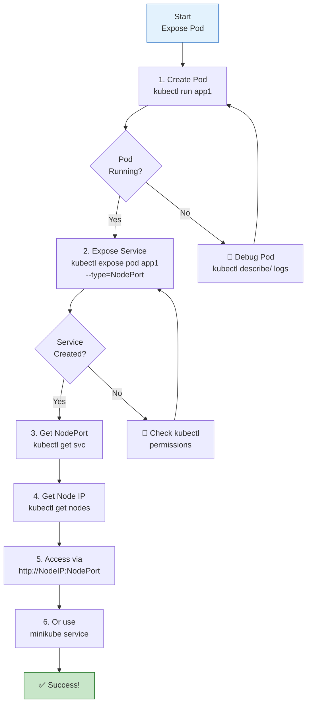

# Sử dụng NodePort Service trên Kubernetes - Hands-on

Đây là bài học **thực hành** về cách sử dụng NodePort Service để expose Pod ra bên ngoài. Bài này là demo trực tiếp, tiếp nối lý thuyết từ bài #9.

## 1. Tổng quan

Trong bài này, chúng ta sẽ:
- Tạo Pod với `kubectl run`
- Expose Pod bằng NodePort Service với `kubectl expose`
- Kiểm tra và verify Service
- Truy cập ứng dụng qua NodePort
- Sử dụng `minikube service` command
- Xem endpoints và kiểm tra load balancing
- Troubleshooting thực tế

---

## 2. Kiểm tra môi trường

Trước khi bắt đầu, đảm bảo Minikube đang chạy:

```bash
# Kiểm tra Minikube status
minikube status

# Output mong đợi:
# minikube
# type: Control Plane
# host: Running
# kubelet: Running
# apiserver: Running
# kubeconfig: Configured

# Nếu không running, khởi động:
minikube start --driver=docker
```

Kiểm tra nodes và Pods:

```bash
# Xem nodes
kubectl get nodes

# Xem tất cả Pods (kể cả system pods)
kubectl get pods -A
```

---

## 3. Tạo Pod demo

Chúng ta sẽ tạo một Pod với image demo `vietaws/arm:v1` (cho Apple Silicon) hoặc `vietaws:v1` (cho Intel).

```bash
# Tạo Pod tên app1
kubectl run app1 --image=vietaws/arm:v1 --port=8080

# Nếu dùng Intel:
# kubectl run app1 --image=vietaws:v1 --port=8080
```

### Kiểm tra Pod

```bash
# Xem Pod đang tạo
kubectl get pods -w

# Khi Pod Running:
kubectl get pods
# NAME   READY   STATUS    RESTARTS   AGE
# app1   1/1     Running   0          30s

# Xem chi tiết
kubectl describe pod app1
```

**Lưu ý quan trọng**:
- Khi Pod lần đầu tạo, Kubernetes sẽ pull image từ Docker Hub
- Nếu đã có image local, sẽ dùng cached version (tuỳ vào `imagePullPolicy`)
- Nếu gặp `ImagePullBackOff`, check image name và network

---

## 4. Expose Pod bằng NodePort Service

### Cách 1: Imperative với `kubectl expose`

```bash
# Tạo NodePort Service từ Pod
kubectl expose pod app1 \
  --port=80 \
  --target-port=8080 \
  --type=NodePort \
  --name=app1-service
```

**Giải thích parameters**:
- `--port=80`: Service port (trong cluster, các Pod khác sẽ gọi qua port 80)
- `--target-port=8080`: Port container đang lắng nghe trong Pod
- `--type=NodePort`: Loại Service là NodePort
- `--name=app1-service`: Tên Service

**Kết quả**: Kubernetes sẽ tự động assign một `nodePort` trong range `30000-32767`.

### Cách 2: Chỉ định nodePort cụ thể

```bash
kubectl expose pod app1 \
  --port=80 \
  --target-port=8080 \
  --type=NodePort \
  --name=app1-service \
  --node-port=30198
```

**Lưu ý**:
- Nếu không chỉ định `--node-port`, Kubernetes sẽ auto-assign
- Nếu muốn cụ thể nodePort, chỉ định ngay từ đầu (không thể thay đổi sau khi tạo)
- NodePort phải trong range `30000-32767`

---

## 5. Kiểm tra Service

### Xem danh sách Services

```bash
kubectl get services
# Hoặc
kubectl get svc

# Output:
# NAME            TYPE       CLUSTER-IP      EXTERNAL-IP   PORT(S)        AGE
# app1-service   NodePort   10.96.123.456   <none>        80:31214/TCP   5s
# kubernetes     ClusterIP  10.96.0.1       <none>        443/TCP        2d
```

**Giải thích**:
- `NAME`: Tên Service
- `TYPE`: `NodePort`
- `CLUSTER-IP`: IP nội bộ của Service (trong cluster)
- `EXTERNAL-IP`: `<none>` với NodePort (không có external IP)
- `PORT(S)`: `80:31214/TCP`
  - `80`: Service port
  - `31214`: NodePort (tự động assign)

### Xem chi tiết Service

```bash
kubectl describe service app1-service
```

**Output quan trọng**:

```
Name:                     app1-service
Namespace:                default
Labels:                   <none>
Annotations:              <none>
Selector:                 run=app1
Type:                     NodePort
IP:                       10.96.123.456
Port:                     <unnamed>  80/TCP
TargetPort:               8080/TCP
NodePort:                 <unnamed>  31214/TCP
Endpoints:                10.244.0.5:8080
Session Affinity:         None
Events:                   <none>
```

**Các trường quan trọng**:
- `Selector`: `run=app1` - match labels của Pod
- `Port`: `80` - Service port
- `TargetPort`: `8080` - Pod container port
- `NodePort`: `31214` - Port trên mỗi Node
- `Endpoints`: `10.244.0.5:8080` - IP của Pod được select

### Kiểm tra Endpoints

```bash
kubectl get endpoints app1-service
# NAME            ENDPOINTS          AGE
# app1-service   10.244.0.5:8080    10s
```

**Nếu ENDPOINTS trống**:
- Selector không match Pod labels
- Pod chưa running
- Pod không có đúng port

---

## 6. Truy cập ứng dụng

### Cách 1: Truy cập trực tiếp qua Node IP

```bash
# Lấy Node IP
kubectl get nodes -o wide

# Output:
# NAME       STATUS   ROLES           AGE   VERSION   INTERNAL-IP   EXTERNAL-IP   OS-IMAGE
# minikube   Ready    control-plane   2h    v1.30.0   10.1.5.38     <none>        Docker Desktop

# Node IP là 10.1.5.38
# NodePort là 31214 (từ `kubectl get svc`)

# Truy cập ứng dụng:
curl http://10.1.5.38:31214

# Hoặc mở browser:
# http://10.1.5.38:31214
```

### Cách 2: Dùng `minikube service` (khuyến khích)

```bash
# Mở Service trong browser
minikube service app1-service

# Lấy URL
minikube service app1-service --url
# Output: http://10.1.5.38:31214

# Test với curl
curl $(minikube service app1-service --url)
```

**Lợi ích**:
- Tự động lấy Node IP và NodePort
- Tự động mở browser (không cần truy nhớ port)
- Hữu ích với Minikube/local

### Cách 3: Port-forward (temporary)

```bash
# Forward local port 8081 đến Service port 80
kubectl port-forward service/app1-service 8081:80

# Trong terminal khác:
curl http://localhost:8081
```

**Lưu ý**: `port-forward` chỉ dùng cho testing, không phải production.

---

## 7. Demo ứng dụng với vietaws image

Ứng dụng demo `vietaws/arm:v1` có nhiều endpoints:

```bash
# Lấy URL
SERVICE_URL=$(minikube service app1-service --url)

# Test các endpoints:
curl $SERVICE_URL/
# Trang chủ - thông tin container

curl $SERVICE_URL/users
# Danh sách users (hard-coded)

curl $SERVICE_URL/users/1
# Lấy user với ID 1

curl -X POST $SERVICE_URL/users \
  -H "Content-Type: application/json" \
  -d '{"name":"John","email":"john@example.com"}'
# Echo request body

curl $SERVICE_URL/students
# Danh sách sinh viên (PostgreSQL)

# Ghi log:
curl -X POST $SERVICE_URL/write-logs \
  -d "message=Hello from NodePort"

# Test DynamoDB (nếu có cấu hình):
curl "$SERVICE_URL/call-dynamodb?id=100"
```

---

## 8. Scale Pod và Load Balancing

NodePort Service tự động load balance giữa các Pod.

### Tạo thêm Pods

```bash
# Scale lên 3 replicas (cần Deployment)
# Trước tiên, tạo Deployment từ Pod hiện có:
kubectl create deployment app1-deploy --image=vietaws/arm:v1 --replicas=3

# Hoặc scale deployment:
kubectl scale deployment app1-deploy --replicas=3

# Kiểm tra:
kubectl get pods -l app=app1-deploy
# NAME                            READY   STATUS    RESTARTS   AGE
# app1-deploy-6d4b5f8c9d-2xksz   1/1     Running   0          30s
# app1-deploy-6d4b5f8c9d-5h7pq   1/1     Running   0          30s
# app1-deploy-6d4b5f8c9d-9m8wr   1/1     Running   0          30s

# Kiểm tra endpoints của Service:
kubectl get endpoints app1-service
# NAME            ENDPOINTS                          AGE
# app1-service   10.244.0.5:8080,10.244.0.6:8080,   2m
#                 10.244.0.7:8080
```

**Service sẽ load balance** giữa 3 Pods này (round-robin mặc định).

### Test load balancing

```bash
# Gọi nhiều lần:
for i in {1..10}; do
  curl $SERVICE_URL/
done

# Kiểm tra logs của từng Pod:
kubectl logs app1-deploy-6d4b5f8c9d-2xksz
kubectl logs app1-deploy-6d4b5f8c9d-5h7pq
kubectl logs app1-deploy-6d4b5f8c9d-9m8wr
```

Mỗi request có thể được forward đến một Pod khác nhau.

---

## 9. Troubleshooting thực tế

### Vấn đề 1: Pod không Running

```bash
# Kiểm tra Pod status
kubectl get pods

# Nếu Pending/CrashLoopBackOff:
kubectl describe pod app1

# Xem logs (nếu container đã chạy rồi crash):
kubectl logs app1
kubectl logs app1 --previous  # Logs từ container cũ

# Các lỗi thường gặp:
# - ImagePullBackOff: check image name
# - Insufficient resources: check node resources
# - Invalid image: check docker hub
```

### Vấn đề 2: Service không có endpoints

```bash
# Kiểm tra Service
kubectl get svc app1-service
kubectl describe svc app1-service

# Kiểm tra endpoints:
kubectl get endpoints app1-service

# Nếu endpoints trống:
# 1. Check Pod labels:
kubectl get pod app1 --show-labels
# Output: app1   run=app1

# 2. Check Service selector:
kubectl get svc app1-service -o yaml | grep selector -A2
# selector:
#   run: app1

# 3. Nếu selector không match, patch:
kubectl patch svc app1-service \
  -p '{"spec":{"selector":{"run":"app1"}}}'

# 4. Pod phải có port đúng:
kubectl get pod app1 -o yaml | grep -A5 ports
# ports:
# - containerPort: 8080
```

### Vấn đề 3: Không thể truy cập từ bên ngoài

```bash
# 1. Check NodePort range
kubectl get svc app1-service -o yaml | grep nodePort
# nodePort: 31214  (phải trong 30000-32767)

# 2. Check firewall/security group
# - Với local Minikube: thường không block
# - Với cloud: cần mở port 30000-32767

# 3. Test từ trong cluster:
kubectl run curl-test --image=radial/busyboxplus:curl -i --tty
# Trong container:
# curl http://app1-service:80
# curl http://10.96.123.456:80

# 4. Check kube-proxy chạy chưa:
kubectl get pods -n kube-system | grep kube-proxy
```

### Vấn đề 4: NodePort thay đổi mỗi lần tạo

```bash
# Khi dùng `kubectl expose` mà không chỉ định nodePort,
# Kubernetes sẽ auto-assign (khó predict)

# Giải pháp: Dùng YAML để chỉ định cố định:
cat > service.yaml << EOF
apiVersion: v1
kind: Service
metadata:
  name: app1-service
spec:
  type: NodePort
  selector:
    run: app1
  ports:
    - port: 80
      targetPort: 8080
      nodePort: 30198  # Cố định
EOF

kubectl apply -f service.yaml
```

---

## 10. Các lệnh hữu ích

### Xem tất cả resources

```bash
# Pods
kubectl get pods -o wide

# Services
kubectl get svc -o wide

# Endpoints
kubectl get endpoints

# Tất cả trong namespace default:
kubectl get all
```

### Xem logs

```bash
# Log của Pod
kubectl logs app1

# Log với follow
kubectl logs -f app1

# Log của specific container (nếu multi-container)
kubectl logs app1 -c container-name

# Log từ container đã terminated
kubectl logs app1 --previous
```

### Exec vào Pod

```bash
# Mở shell
kubectl exec -it app1 -- /bin/sh

# Trong shell:
pwd
ls -la
env
ps aux
curl localhost:8080
exit
```

### Xóa resources

```bash
# Xóa Service
kubectl delete svc app1-service

# Xóa Pod
kubectl delete pod app1

# Xóa tất cả (cẩn thận!)
kubectl delete all --all
```

---

## 11. Best Practices

1. **Luôn đặt tên rõ ràng**:
   ```bash
   kubectl expose pod app1 --name=app1-service
   ```

2. **Chỉ định nodePort nếu cần**:
   - Dễ dàng cho firewall rules
   - Predictable cho scripts/documentation
   ```bash
   kubectl expose pod app1 --node-port=30198 ...
   ```

3. **Dùng labels đúng**:
   ```bash
   kubectl run app1 --labels="app=demo,env=dev" --image=...
   kubectl expose pod app1 --selector="app=demo"
   ```

4. **Kiểm tra endpoints**:
   ```bash
   kubectl get endpoints app1-service
   # Phải có ít nhất 1 endpoint
   ```

5. **Không dùng NodePort cho production**:
   - Dùng LoadBalancer hoặc Ingress
   - NodePort chỉ cho dev/test/on-prem

6. **Dùng `minikube service` với Minikube**:
   ```bash
   minikube service app1-service --url
   ```

7. **Monitor port range**:
   - NodePort dùng port 30000-32767
   - Tránh conflict với hệ thống
   - Check firewall rules

---

## 12. Flowchart: NodePort Setup Workflow



---

## 13. Tóm tắt

- **NodePort** expose Pod ra bên ngoài qua port `30000-32767` trên mỗi Node
- Dùng `kubectl expose pod <pod-name> --type=NodePort` để tạo Service
- Kiểm tra với `kubectl get svc` và `kubectl get endpoints`
- Truy cập qua `http://<Node-IP>:<NodePort>`
- Dùng `minikube service <service-name> --url` cho convenience
- Production nên dùng LoadBalancer hoặc Ingress
- Luôn verify endpoints và firewall rules

---

Cảm ơn các bạn đã theo dõi! Hẹn gặp lại trong bài tiếp theo.
