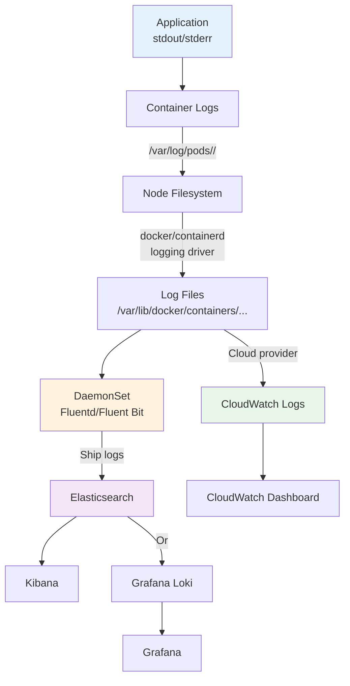
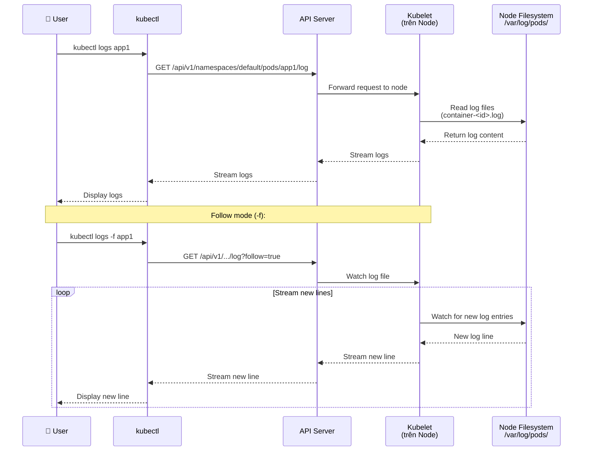
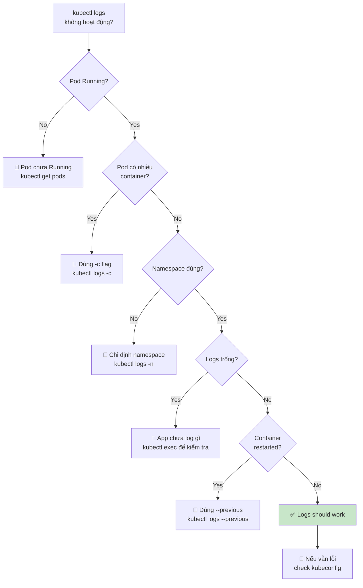

# Sử dụng kubectl logs - Xem logs của Pod/Container

Đây là bài học về **kubectl logs** - cách xem logs của container trong Pod. Đây là công cụ quan trọng để debug và monitoring ứng dụng trên Kubernetes.

## 1. Tại sao cần xem logs?

Trong Kubernetes:
- Container chạy trong Pod
- Không thể dùng `docker logs` trực tiếp (khi dùng Minikube, cluster có thể chạy trên remote)
- Cần công cụ để xem logs từ bất kỳ đâu qua API

`kubectl logs` là lệnh cơ bản để:
- Debug ứng dụng khi crash
- Theo dõi logs runtime
- Kiểm tra lỗi startup
- Monitor performance (nếu app log performance metrics)
- Troubleshooting nhanh

---

## 2. Cú pháp cơ bản

```bash
# Xem logs của Pod
kubectl logs <pod-name>

# Ví dụ:
kubectl logs app1
```

**Output**: Hiển thị tất cả logs của container mặc định trong Pod (nếu Pod có 1 container).

---

## 3. Logs với Follow mode (real-time)

```bash
# Follow logs (giống tail -f)
kubectl logs -f <pod-name>

# Ví dụ:
kubectl logs -f app1
```

Khi bạn gửi requests đến ứng dụng, logs sẽ hiện ra realtime.

**Ctrl+C** để thoát follow mode.

---

## 4. Pod với nhiều container

Khi Pod có nhiều container, bạn phải chỉ định container name:

```bash
# Xem logs của container cụ thể
kubectl logs <pod-name> -c <container-name>

# Ví dụ:
kubectl logs app1 -c app-container
kubectl logs app1 -c log-sidecar
```

### Cách tìm container name:

```bash
# Xem chi tiết Pod
kubectl describe pod <pod-name>

# Trong output, tìm section "Containers":
# Containers:
#   app-container:
#     Container ID:   docker://...
#     Image:          vietaws/arm:v1
#     ...
#   log-sidecar:
#     Container ID:   docker://...
#     Image:          fluentd:latest
#     ...
```

Hoặc dùng YAML:

```bash
kubectl get pod <pod-name> -o yaml | grep -A5 "name:"
```

---

## 5. Các flags hữu ích

### 5.1. Xem logs với timestamps

```bash
kubectl logs <pod-name> --timestamps

# Output:
# 2025-05-13T10:30:15.123456789Z Starting application...
# 2025-05-13T10:30:16.987654321Z Listening on port 8080
```

### 5.2. Xem số byte nhất định

```bash
# Xem last 100 lines
kubectl logs <pod-name> --tail=100

# Xem first 100 lines
kubectl logs <pod-name> --tail=100 --head=true

# Xem từ byte X đến byte Y
kubectl logs <pod-name> --tail-bytes=1024
```

### 5.3. Xem logs từ thời điểm cụ thể

```bash
# Xem logs từ 1 giờ trước
kubectl logs <pod-name> --since=1h

# Xem logs từ 10 phút trước
kubectl logs <pod-name> --since=10m

# Xem logs trong 30 giây gần đây
kubectl logs <pod-name> --since=30s
```

### 5.4. Giới hạn logs theo số byte

```bash
# Giới hạn output tối đa 10KB
kubectl logs <pod-name> --limit-bytes=10000
```

### 5.5. Xem logs từ container đã terminated

```bash
# Nếu container đã crash và restart, xem logs từ container cũ:
kubectl logs <pod-name> --previous

# Với multi-container:
kubectl logs <pod-name> -c <container-name> --previous
```

---

## 6. Demo thực tế với app1

Giả sử bạn đã có Pod `app1` chạy từ bài trước:

```bash
# 1. Kiểm tra Pod đang chạy
kubectl get pods
# NAME   READY   STATUS    RESTARTS   AGE
# app1   1/1     Running   0          5m

# 2. Xem logs
kubectl logs app1

# Output mẫu:
# simple-app@1.0.0
# Server running on port 8080
# Connected to PostgreSQL
# Connected to DynamoDB
# GET / 200 12.345 ms
# GET /users 200 5.678 ms

# 3. Follow logs
kubectl logs -f app1

# Trong terminal khác, gửi request:
curl http://localhost:8081/
curl http://localhost:8081/users

# Bạn sẽ thấy logs mới hiện ra realtime:
# GET / 200 3.456 ms
# GET /users 200 1.234 ms

# 4. Gửi nhiều request để xem logs:
for i in {1..5}; do
  curl http://localhost:8081/users
done

# 5. Xem logs với timestamps:
kubectl logs app1 --timestamps

# 6. Xem last 20 lines:
kubectl logs app1 --tail=20

# 7. Xem logs từ 5 phút trước:
kubectl logs app1 --since=5m
```

---

## 7. Logs với Service/Deployment

Có thể xem logs của Pod thuộc Deployment:

```bash
# Lấy Pod name từ Deployment:
kubectl get pods -l app=app1-deploy

# Xem logs của Pod cụ thể:
kubectl logs app1-deploy-6d4b5f8c9d-2xksz

# Hoặc dùng deployment name (nếu deployment chỉ có 1 Pod):
kubectl logs deployment/app1-deploy

# Với replica set:
kubectl logs rs/app1-deploy-6d4b5f8c9d
```

---

## 8. Multi-container Pod logs

Giả sử Pod có 2 containers:

```yaml
apiVersion: v1
kind: Pod
metadata:
  name: multi-app
spec:
  containers:
  - name: app-container
    image: nginx
  - name: log-sidecar
    image: fluentd
```

Xem logs:

```bash
# Xem logs của app-container:
kubectl logs multi-app -c app-container

# Xem logs của log-sidecar:
kubectl logs multi-app -c log-sidecar

# Follow logs của app-container:
kubectl logs -f multi-app -c app-container
```

---

## 9. Logs với All namespaces

Mặc định `kubectl logs` chỉ xem Pod trong namespace hiện tại.

```bash
# Xem Pod trong namespace khác:
kubectl logs <pod-name> -n <namespace>

# Ví dụ:
kubectl logs nginx-pod -n kube-system

# Xem logs từ tất cả namespaces:
kubectl logs <pod-name> --all-namespaces

# Hoặc:
kubectl logs -n kube-system <pod-name>
```

---

## 10. Logs từ previous instance

Khi Pod restart (do crash hoặc config change), logs của container cũ bị mất. Dùng `--previous` để xem logs từ container trước đó:

```bash
# Pod đang running (restartCount > 0)
kubectl get pods
# NAME   READY   STATUS    RESTARTS   AGE
# app1   1/1     Running   2           1h

# Xem logs từ container hiện tại:
kubectl logs app1

# Xem logs từ container trước đó (trước khi restart):
kubectl logs app1 --previous

# Với multi-container:
kubectl logs app1 -c app-container --previous
```

**Khi nào dùng `--previous`**:
- Container crash và restart
- Pod bị evict và tạo lại
- Cập nhật image (rolling update)

---

## 11. Export logs ra file

```bash
# Lưu logs vào file
kubectl logs app1 > app1-logs.txt

# Append logs vào file
kubectl logs app1 >> app1-logs.txt

# Follow và lưu vào file:
kubectl logs -f app1 | tee app1-logs.txt

# Lưu logs với timestamp:
kubectl logs app1 --timestamps > app1-logs-$(date +%Y%m%d-%H%M%S).txt
```

---

## 12. Troubleshooting logs

### Vấn đề 1: "Error from server (NotFound): pods "app1" not found"

```bash
# Kiểm tra Pod có tồn tại không:
kubectl get pods

# Kiểm tra namespace:
kubectl get pods -n default
kubectl get pods -n <your-namespace>

# Nếu Pod ở namespace khác:
kubectl logs app1 -n <namespace>
```

### Vấn đề 2: "ContainerCreating" - không có logs

```bash
# Pod đang ở trạng thái ContainerCreating
kubectl get pods
# NAME   READY   STATUS         RESTARTS   AGE
# app1   0/1     ContainerCreating   0      30s

# Xem events:
kubectl describe pod app1

# Các lỗi thường gặp:
# - ImagePullBackOff: check image name, registry auth
# - Insufficient memory: node không đủ RAM
# - Invalid image: image không tồn tại

# Chờ Pod进入 Running rồi xem logs:
kubectl get pods -w
```

### Vấn đề 3: Logs trống

```bash
# Pod running nhưng logs trống?
kubectl logs app1
# (không có output)

# Có thể do:
# 1. Application chưa ghi log gì
# 2. Application log to file, không stdout/stderr
# 3. Container mới start chưa kịp log

# Kiểm tra:
kubectl exec -it app1 -- /bin/sh
# Trong container:
ps aux
cat /var/log/app.log  # nếu app log to file
```

**Lưu ý**: Kubernetes chỉ thu thập **stdout** và **stderr** của container. Nếu ứng dụng log ra file, `kubectl logs` sẽ không thấy. Cần cấu hình logging driver hoặc sidecar container.

### Vấn đề 4: Multi-container Pod không thấy log của container mình

```bash
# Nhầm container name:
kubectl logs app1  # Lỗi nếu có nhiều container

# Xem container names:
kubectl get pod app1 -o jsonpath='{.spec.containers[*].name}'
# Output: app-container log-sidecar

# Xem logs đúng:
kubectl logs app1 -c app-container
```

---

## 13. Logging Best Practices

### 13.1. Log to stdout/stderr

Kubernetes collect logs từ **stdout** và **stderr** của container. Đảm bảo ứng dụng log ra console:

```javascript
// Node.js - ĐÚNG
console.log('Info message');
console.error('Error message');

// Node.js - SAI (log to file)
fs.writeFileSync('/var/log/app.log', 'message');
```

### 13.2. Structured logging

Log dạng JSON để dễ parse:

```json
{"level":"INFO","message":"User login","user_id":123,"timestamp":"2025-05-13T10:30:00Z"}
```

### 13.3. Log levels

Sử dụng các level phù hợp:
- `DEBUG`: Chi tiết cho debugging
- `INFO`: Thông tin thường xuyên
- `WARN`: Cảnh báo
- `ERROR`: Lỗi (nhưng không crash)
- `FATAL`: Lỗi nghiêm trọng, sẽ crash

### 13.4. Rotation

Kubernetes **không** tự động rotate logs. Logs bị mất khi:
- Container restart
- Pod bị xóa
- Node reboot

Giải pháp:
- Dùng external logging system (EFK/ELK, Loki, CloudWatch, Datadog)
- Sidecar container để ship logs
- DaemonSet để thu thập logs từ tất cả nodes

### 13.5. Context trong logs

Thêm thông tin context:
```python
import logging
logging.basicConfig(format='%(asctime)s - %(name)s - %(levelname)s - %(message)s')
```

---

## 14. Logging Architecture trong Kubernetes



**Kiến trúc mặc định**:
- Container logs được lưu vào `/var/log/pods/<pod_uid>/<container_name>/`
- Container runtime (Docker/containerd) quản lý log files
- Logs chỉ tồn tại trên node đó
- Không có centralized logging

**Production logging**:
- Dùng DaemonSet để chạy logging agent (Fluentd, Fluent Bit) trên mỗi node
- Agent thu thập logs từ tất cả containers
- Ship đến centralized storage (Elasticsearch, Loki, CloudWatch, Datadog)
- Query và visualize với Kibana/Grafana

---

## 15. So sánh: Docker logs vs kubectl logs

| Feature | Docker logs | kubectl logs |
|---------|-------------|--------------|
| **Target** | Container trên local Docker | Pod trong Kubernetes cluster |
| **Scope** | Local host only | Any node in cluster (qua API) |
| **Multi-container Pod** | Không áp dụng (1 container/container) | Cần `-c` flag |
| **Follow mode** | `docker logs -f` | `kubectl logs -f` |
| **Since/Tail** | `--since`, `--tail` | `--since`, `--tail` |
| **Timestamps** | `-t` | `--timestamps` |
| **Previous container** | Không có | `--previous` |
| **Remote cluster** | ❌ Không | ✅ Có (qua kubeconfig) |
| **Logs retention** | Docker config | Node filesystem (no rotation) |

---

## 16. Sequence Diagram: kubectl logs workflow



---

## 17. Troubleshooting Checklist



---

## 18. Tóm tắt

- `kubectl logs <pod>`: Xem logs của Pod
- `kubectl logs -f <pod>`: Follow logs realtime
- `kubectl logs <pod> -c <container>`: Chỉ định container (multi-container Pod)
- `kubectl logs --previous`: Xem logs từ container cũ (trước khi restart)
- `--timestamps`, `--since`, `--tail`: Tùy chọn hiển thị
- Production nên dùng centralized logging (EFK/Loki/CloudWatch)
- Application phải log to **stdout/stderr** để `kubectl logs` hoạt động

---

## 19. Next Steps

Trong bài tiếp theo, chúng ta sẽ tìm hiểu về **Persistent Volume (PV)** và **Persistent Volume Claim (PVC)** - cách lưu trữ dữ liệu persistent trong Kubernetes.

---

Cảm ơn các bạn đã theo dõi! Hẹn gặp lại trong bài tiếp theo.
