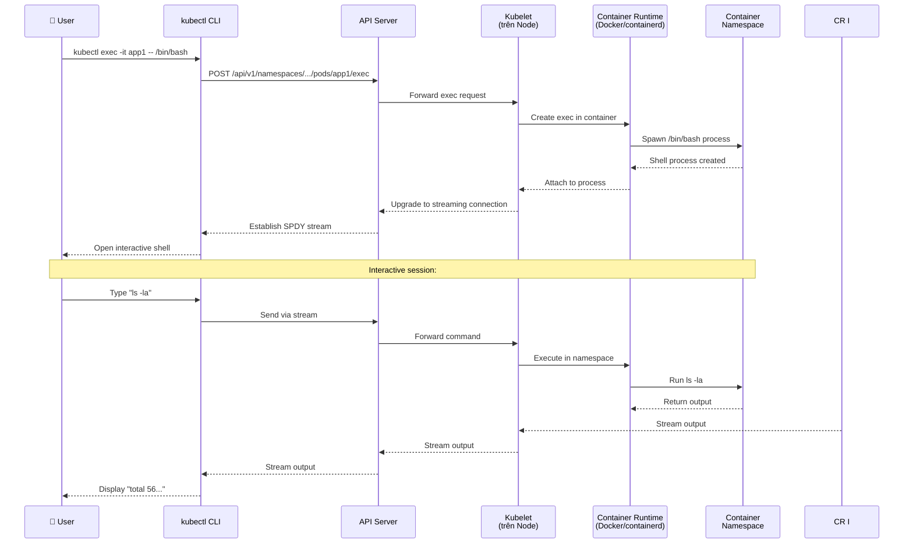
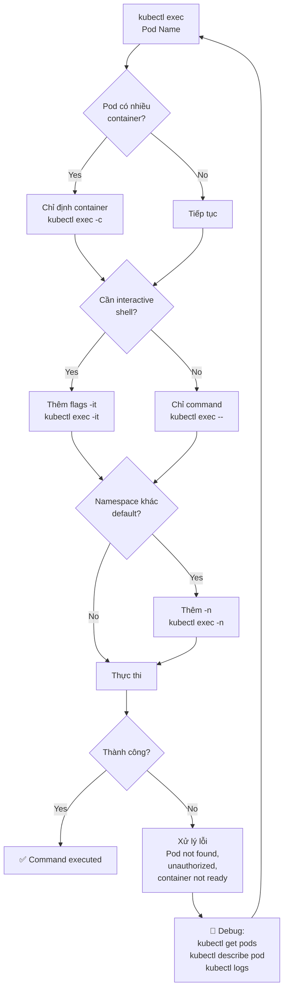
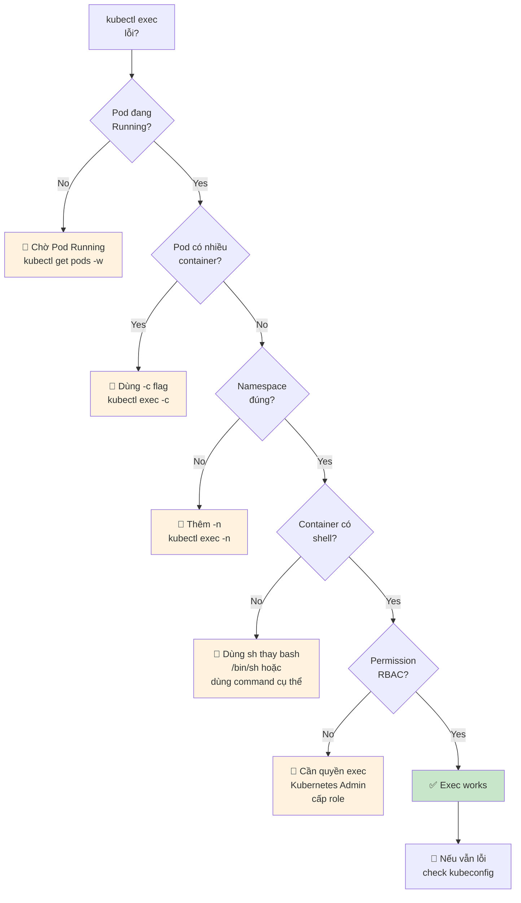

# Sử dụng kubectl exec - Chạy command trong container/Pod

Đây là bài học về **kubectl exec** - công cụ quan trọng để debug, inspect, và interactive shell vào container chạy trong Pod.

---

## 1. Tại sao cần kubectl exec?

Trong quá trình development và troubleshooting, bạn thường cần:
- Xem bên trong container đang chạy gì
- Kiểm tra filesystem
- Chạy các command để test
- Debug ứng dụng trực tiếp
- Xem process list
- Kiểm tra environment variables
- Chạy script hoặc công cụ diagnostic

`kubectl exec` cho phép bạn thực thi command bên trong container đang chạy, tương tự `docker exec`.

---

## 2. Cú pháp cơ bản

```bash
# Chạy command trong container (non-interactive)
kubectl exec <pod-name> -- <command> [args]

# Ví dụ:
kubectl exec app1 -- ls -la
kubectl exec app1 -- pwd
kubectl exec app1 -- env
```

---

## 3. Interactive Shell vào container

### Bash shell

```bash
# Mở bash shell (nếu container có bash)
kubectl exec -it app1 -- /bin/bash

# Hoặc
kubectl exec -it app1 -- bash
```

### Sh shell

```bash
# Nếu container chỉ có sh (alpine, busybox)
kubectl exec -it app1 -- /bin/sh

# Hoặc
kubectl exec -it app1 -- sh
```

**Giải thích flags**:
- `-i`: Keep STDIN open (cho phép input)
- `-t`: Allocate a TTY (terminal)
- Kết hợp `-it` để có interactive shell

**Khi trong shell**:
```bash
# Bạn có thể chạy bất kỳ command nào:
pwd
ls -la
cat /etc/os-release
ps aux
env
curl localhost:8080  # nếu app chạy trong container
df -h
free -m

# Thoát:
exit
# Hoặc Ctrl+D
```

---

## 4. Multi-container Pod

Khi Pod có nhiều container, phải chỉ định container name:

```bash
# Xem container names trong Pod:
kubectl get pod app1 -o jsonpath='{.spec.containers[*].name}'
# Output: app-container log-sidecar

# Exec vào container cụ thể:
kubectl exec -it app1 -c app-container -- /bin/bash
kubectl exec -it app1 -c log-sidecar -- /bin/sh

# Chạy command trong container:
kubectl exec app1 -c app-container -- ls -la
```

### Cách tìm container name:

```bash
# Method 1: describe pod
kubectl describe pod app1 | grep "Containers:" -A10

# Method 2: get pod yaml
kubectl get pod app1 -o yaml | grep -A5 "name:"

# Method 3: jsonpath
kubectl get pod app1 -o jsonpath='{range .spec.containers[*]}{.name}{"\n"}{end}'
```

---

## 5. Exec với different user

Một số container chạy với non-root user. Có thể exec với user khác:

```bash
# Exec với user ID 1000
kubectl exec app1 --username=1000 -- ls -la

# Hoặc exec với root (nếu container cho phép)
kubectl exec -u 0 app1 -- whoami
# Output: root
```

---

## 6. Exec với namespace

```bash
# Pod trong namespace khác:
kubectl exec app1 -n kube-system -- ls -la
kubectl exec app1 --namespace=default -- pwd
```

---

## 7. Port forwarding từ exec session

Bạn có thể kết hợp exec với port-forward:

```bash
# Terminal 1: Port forward
kubectl port-forward pod/app1 8081:8080

# Terminal 2: Exec vào pod
kubectl exec -it app1 -- /bin/bash
# Trong container:
curl localhost:8080  # Test app locally

# Terminal 3: Test từ localhost
curl http://localhost:8081
```

---

## 8. Exec vào Pod chưa Running

Khi Pod chưa Running, có thể dùng `--stdin` với pending pod:

```bash
# Nếu Pod đang Pending (chưa schedule), không thể exec
kubectl get pods
# NAME   READY   STATUS    RESTARTS   AGE
# app1   0/1     Pending   0          30s

# Chờ Pod Running:
kubectl get pods -w

# Sau khi Running:
kubectl exec -it app1 -- /bin/bash
```

---

## 9. Copy files vào/ra từ Pod

`kubectl exec` không trực tiếp copy files. Dùng `kubectl cp`:

```bash
# Copy file từ Pod ra local
kubectl cp app1:/app/config.json ./config.json

# Copy file từ local vào Pod
kubectl cp ./local-file.txt app1:/app/remote-file.txt

# Copy thư mục
kubectl cp ./local-dir app1:/app/remote-dir
```

---

## 10. Demo thực tế

Giả sử bạn có Pod `app1` từ bài trước:

```bash
# 1. Kiểm tra Pod running:
kubectl get pods
# NAME   READY   STATUS    RESTARTS   AGE
# app1   1/1     Running   0          10m

# 2. Xem thông tin cơ bản:
kubectl exec app1 -- hostname
kubectl exec app1 -- pwd
kubectl exec app1 -- ls -la

# 3. Xem environment variables:
kubectl exec app1 -- env

# 4. Xem process list:
kubectl exec app1 -- ps aux

# 5. Xem file:
kubectl exec app1 -- cat /etc/os-release
kubectl exec app1 -- cat /app/package.json

# 6. Test ứng dụng từ bên trong:
kubectl exec app1 -- curl localhost:8080
kubectl exec app1 -- curl localhost:8080/users

# 7. Mở interactive shell:
kubectl exec -it app1 -- /bin/sh

# Trong shell:
$ pwd
/app
$ ls -la
total 56
drwxr-xr-x    1 root     root          4096 May 13 10:30 .
drwxr-xr-x    1 root     root          4096 May 13 10:30 ..
-rw-r--r--    1 root     root           567 May 13 10:30 package.json
-rw-r--r--    1 root     root          2048 May 13 10:30 index.js
...
$ cat package.json
{
  "name": "simple-app",
  "version": "1.0.0",
  ...
}
$ ps aux
PID   USER     TIME  COMMAND
    1 root      0:00 node /app/index.js
   12 root      0:00 ps aux
$ env | grep NODE
NODE_ENV=production
NODE_VERSION=20.12.2
$ curl localhost:8080
{"status":"ok","message":"Welcome to simple-app"}
$ exit
```

---

## 11. Exec với command phức tạp

### Chạy shell command với quotes:

```bash
# Sử dụng single quotes:
kubectl exec app1 -- 'ls -la | grep json'

# Sử dụng double quotes:
kubectl exec app1 -- "cat /app/package.json | grep name"

# Hoặc dùng sh -c:
kubectl exec app1 -- sh -c "ls -la && echo 'Done'"
```

### Viết script trực tiếp:

```bash
# Chạy bash script inline:
kubectl exec app1 -- bash -c 'for i in {1..5}; do echo "Number $i"; done'

# Kiểm tra disk usage:
kubectl exec app1 -- df -h

# Kiểm tra memory:
kubectl exec app1 -- free -m

# Kiểm tra network:
kubectl exec app1 -- netstat -tlnp
# Hoặc
kubectl exec app1 -- ss -tlnp
```

---

## 12. Troubleshooting exec

### Vấn đề 1: "Error from server (NotFound): pods "app1" not found"

```bash
# Kiểm tra Pod name:
kubectl get pods

# Kiểm tra namespace:
kubectl get pods -n default
kubectl get pods -n <your-namespace>

# Dùng đúng namespace:
kubectl exec app1 -n default -- ls -la
```

### Vấn đề 2: "Unauthorized" hoặc "Forbidden"

```bash
# Check RBAC permissions:
kubectl auth can-i exec pod/app1

# Nếu denied, cần permission từ cluster admin:
# Cần role với resource: pods, verb: exec
```

### Vấn đề 3: "ContainerCreating" - không thể exec

```bash
# Pod đang ContainerCreating:
kubectl get pods
# NAME   READY   STATUS         RESTARTS   AGE
# app1   0/1     ContainerCreating   0      30s

# Pod chưa ready, chờ:
kubectl get pods -w

# Hoặc xem events:
kubectl describe pod app1

# Common issues:
# - ImagePullBackOff: check image name
# - Insufficient resources: node không đủ RAM/CPU
# - Invalid image: image không tồn tại
```

### Vấn đề 4: "exec: "bash": executable file not found in $PATH"

```bash
# Container không có bash (alpine dùng sh):
kubectl exec app1 -- /bin/sh

# Kiểm tra shell có sẵn:
kubectl exec app1 -- which bash
kubectl exec app1 -- which sh

# List files trong /bin:
kubectl exec app1 -- ls -la /bin
```

### Vấn đề 5: Multi-container Pod - không chỉ định container

```bash
# Lỗi nếu Pod có nhiều container:
kubectl exec app1 -- ls -la
# Error: no container name is specified and there are multiple containers in pod

# Giải pháp: Chỉ định container:
kubectl exec app1 -c app-container -- ls -la
```

---

## 13. Exec vs Debug Container

Kubernetes có debug container feature (ephemeral container) để debug Pod đang chạy:

```bash
# Thêm ephemeral container vào Pod đang chạy (K8s 1.23+)
kubectl debug -it app1 --image=busybox

# Sau đó có thể exec vào ephemeral container đó
```

**Ưu điểm của debug container**:
- Không ảnh hưởng đến Pod gốc
- Có thể dùng image khác với Pod gốc
- Tự động xóa khi debug xong

---

## 14. Sequence Diagram: kubectl exec workflow



---

## 15. Flowchart: kubectl exec decision tree



---

## 16. Best Practices

### 16.1. Dùng exec cho debugging only

`kubectl exec` là công cụ debugging, không phải production usage:
- Không dùng exec để chạy production workload
- Không dùng exec để modify configuration (dùng ConfigMap/Secret)
- Không dùng exec để deploy code (dùng Deployment)

### 16.2. Kiểm tra Pod status trước khi exec

```bash
# Đảm bảo Pod Running:
kubectl get pod app1
# READY phải là 1/1, STATUS phải là Running

# Nếu không Running, ko thể exec:
# - Pending: chờ schedule
# - ContainerCreating: chờ container khởi tạo
# - CrashLoopBackOff: container crash
```

### 16.3. Use `-c` flag rõ ràng với multi-container Pod

```bash
# Always specify container:
kubectl exec app1 -c app-container -- ps aux
kubectl exec app1 -c log-sidecar -- tail -f /var/log/logs.txt
```

### 16.4. Clean up after debugging

Nếu bạn tạo ephemeral container để debug, xóa sau khi xong:

```bash
# Ephemeral container tự động xóa khi Pod xóa
# Nhưng nếu dùng `kubectl debug`, có thể xóa:
kubectl delete pod app1  # nếu debug xong

# Hoặc dùng --cleanup flag:
kubectl debug -it app1 --image=busybox --cleanup
```

### 16.5. Security considerations

`kubectl exec` cần permission:
- RBAC: `pods/exec`
- SecurityContext: container có thể block exec (securityPolicy)
- PodSecurityPolicy: có thể restrict exec

```yaml
# SecurityContext có thể set:
securityContext:
  allowPrivilegeEscalation: false
  runAsNonRoot: true
```

### 16.6. Dùng `--stdin` với `-i`

Khi cần pipe input:

```bash
# Echo và pipe vào container:
echo "test data" | kubectl exec -i app1 -- cat > /tmp/data.txt

# Hoặc copy file:
kubectl cp ./local-file app1:/tmp/remote-file

# Nhưng cp tốt hơn cho file copy
```

---

## 17. So sánh: docker exec vs kubectl exec

| Feature | docker exec | kubectl exec |
|---------|-------------|--------------|
| **Target** | Container trên local Docker | Pod/Container trong K8s cluster |
| **Syntax** | `docker exec [OPTIONS] CONTAINER COMMAND` | `kubectl exec POD [-c CONTAINER] -- COMMAND` |
| **Interactive** | `-it` | `-it` |
| **Multi-container** | Mỗi container là object riêng | Pod có nhiều container, cần `-c` |
| **Remote** | ❌ Local only | ✅ Any cluster (via API) |
| **Namespace** | ❌ Không áp dụng | ✅ `-n` flag |
| **TTY allocation** | `-t` | `-t` |
| **Streaming** | ✓ | ✓ (qua SPDY) |
| **Copy files** | `docker cp` | `kubectl cp` |
| **Ephemeral debug** | `docker run --rm` | `kubectl debug` |

---

## 18. Common use cases

### Use case 1: Debug crashing app

```bash
# 1. Xem Pod status:
kubectl get pod app1
# NAME   READY   STATUS    RESTARTS   AGE
# app1   0/1     CrashLoopBackOff   5    10m

# 2. Xem logs:
kubectl logs app1 --previous

# 3. Exec vào Pod (khi running):
kubectl get pods -w  # đợi Pod Running
kubectl exec -it app1 -- /bin/bash

# 4. Trong container, kiểm tra:
ps aux
cat /var/log/app.log
env
df -h
```

### Use case 2: Check filesystem

```bash
# List files:
kubectl exec app1 -- ls -la /app

# Check disk usage:
kubectl exec app1 -- du -sh /app/*

# Check config file:
kubectl exec app1 -- cat /app/config.yaml

# Check if file exists:
kubectl exec app1 -- test -f /app/data.db && echo "exists" || echo "not found"
```

### Use case 3: Test connectivity

```bash
# Test curl từ bên trong container:
kubectl exec app1 -- curl -s http://localhost:8080/health

# Test DNS resolution:
kubectl exec app1 -- nslookup kubernetes.default

# Test kết nối đến database (nếu có):
kubectl exec app1 -- nc -zv postgres 5432
```

### Use case 4: Run one-off command

```bash
# Database migration:
kubectl exec app1 -- npm run migrate

# Clear cache:
kubectl exec app1 -- rm -rf /tmp/cache/*

# Generate report:
kubectl exec app1 -- python /app/generate_report.py > report.txt

# Restart app (nếu cần):
kubectl exec app1 -- pkill -f index.js
# Nhưng tốt hơn nên dùng kubectl rollout restart deployment/app1
```

### Use case 5: Environment inspection

```bash
# Xem tất cả env vars:
kubectl exec app1 -- env

# Xem specific env:
kubectl exec app1 -- printenv NODE_ENV
kubectl exec app1 -- printenv DATABASE_URL

# Xem process environment:
kubectl exec app1 -- cat /proc/1/environ | tr '\0' '\n'
```

---

## 19. Troubleshooting Checklist



---

## 20. Security Considerations

### 20.1. RBAC permissions

Cần quyền `pods/exec`:

```yaml
apiVersion: rbac.authorization.k8s.io/v1
kind: Role
metadata:
  namespace: default
  name: pod-executor
rules:
- apiGroups: [""]
  resources: ["pods/exec"]
  verbs: ["create", "get"]
```

### 20.2. Pod Security Standards

Pod có thể giới hạn exec:

```yaml
apiVersion: v1
kind: Pod
metadata:
  name: secure-pod
spec:
  securityContext:
    runAsNonRoot: true
    runAsUser: 1000
  containers:
  - name: app
    image: nginx
    securityContext:
      allowPrivilegeEscalation: false
      readOnlyRootFilesystem: true
```

### 20.3. Network policies

Exec không vi phạm NetworkPolicy, nhưng network access từ exec session tuân theo policy của Pod.

---

## 21. Tóm tắt

- `kubectl exec <pod> -- <command>`: Chạy command trong container
- `kubectl exec -it <pod> -- /bin/bash`: Mở interactive shell
- `kubectl exec -it <pod> -c <container>`: Chỉ định container (multi-container Pod)
- `kubectl exec -n <namespace>`: Chỉ định namespace
- Dùng cho debugging, inspection, không phải production workload
- Luôn kiểm tra Pod Running trước khi exec
- Production nên dùng centralized logging thay vì exec

---

## 22. Next Steps

Trong bài tiếp theo, chúng ta sẽ tìm hiểu về **Persistent Volume (PV) và Persistent Volume Claim (PVC)** - cách quản lý storage persistent trong Kubernetes.

---

Cảm ơn các bạn đã theo dõi! Hẹn gặp lại trong bài tiếp theo.
