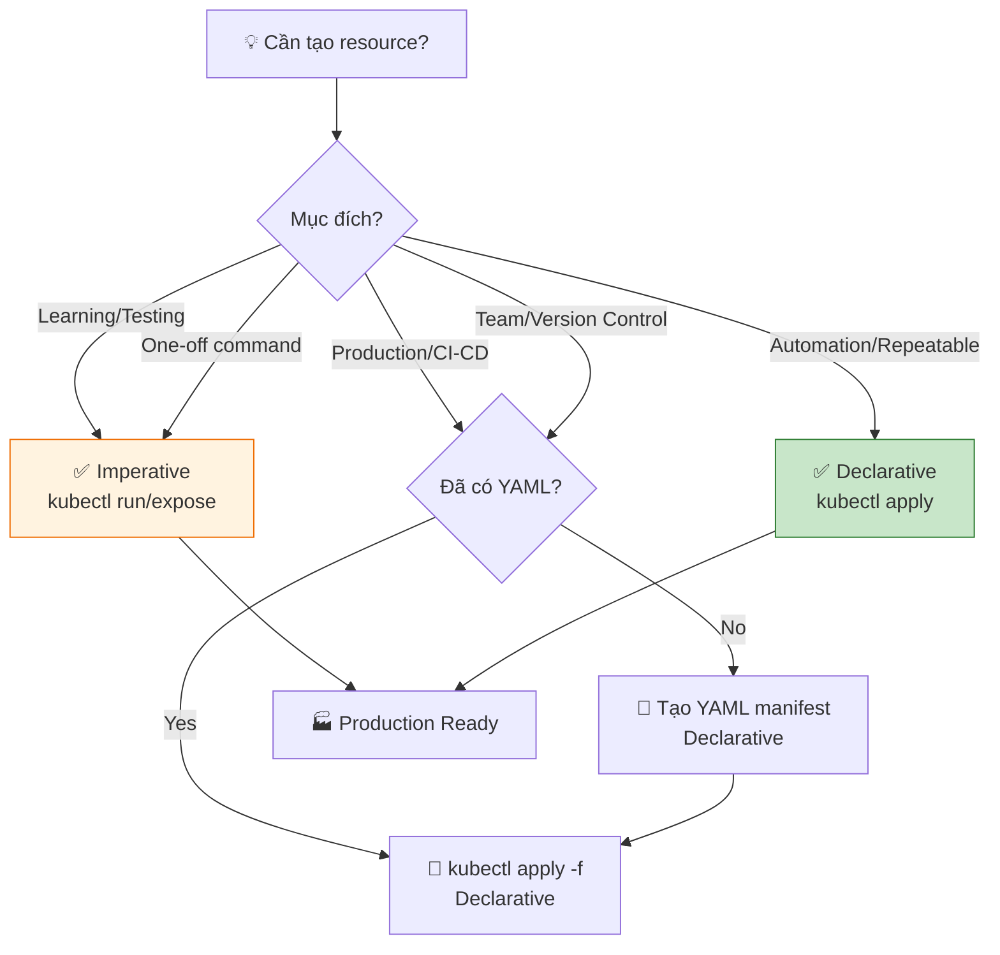
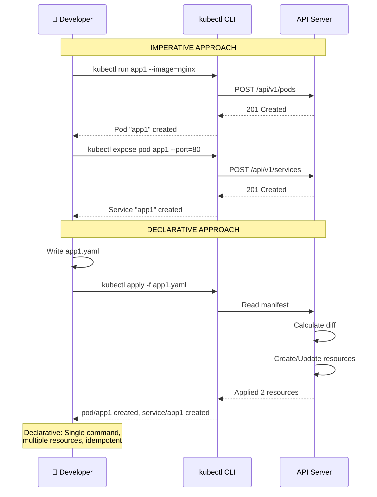

# Imperative vs Declarative - Cách tiếp cận quản lý Kubernetes

Đây là bài học về **hai phương pháp tiếp cận** để làm việc với Kubernetes:
- **Imperative**: Định nghĩa từng bước (cách bạn đã dùng đến giờ với `kubectl run`, `kubectl expose`)
- **Declarative**: Định nghĩa trạng thái cuối cùng qua YAML manifest

Đây là khái niệm **rất quan trọng** khi làm việc với Kubernetes production.

---

## 1. Imperative Approach (Lệnh trực tiếp)

### Định nghĩa

**Imperative** là cách bạn nói **"làm thế này, làm nữa, làm tiếp"** - bạn chỉ đạo Kubernetes từng bước.

### Ví dụ:

```bash
# Bước 1: Tạo Pod
kubectl run app1 --image=vietaws/arm:v1 --port=8080

# Bước 2: Expose Pod
kubectl expose pod app1 --type=NodePort --port=80 --target-port=8080

# Bước 3: Tạo Service khác
kubectl expose pod app1 --type=ClusterIP --port=443 --target-port=8443

# Bước 4: Scale (nếu có deployment)
kubectl scale deployment app1 --replicas=3
```

### Đặc điểm:

✅ **Ưu điểm**:
- Nhanh, trực tiếp
- Dễ cho learning, beginner
- Good cho ad-hoc tasks, one-off commands
- Không cần biết YAML

❌ **Nhược điểm**:
- Khó scale (10, 100, 1000 resources)
- Dễ sai sót, nhớ lẫn
- Không dễ version control (không có source of truth)
- Khó collaborative (không share được)
- Khó reproduce (không có manifest)
- Không idempotent (chạy lại có thể lỗi)

---

## 2. Declarative Approach (Khai báo trạng thái)

### Định nghĩa

**Declarative** là cách bạn nói **"Tôi muốn điều này"** - bạn định nghĩa trạng thái mong muốn, Kubernetes tự làm còn lại.

### Ví dụ:

Tạo file `app1.yaml`:

```yaml
apiVersion: v1
kind: Pod
metadata:
  name: app1
  labels:
    app: demo
spec:
  containers:
  - name: app-container
    image: vietaws/arm:v1
    ports:
    - containerPort: 8080
```

Apply:

```bash
kubectl apply -f app1.yaml
```

Khi chạy `kubectl apply`, Kubernetes sẽ:
1. Đọc file YAML
2. Kiểm tra xem resource đã tồn tại chưa
3. Nếu chưa có → Tạo mới
4. Nếu có rồi → Update để match desired state
5. Kubernetes tự quyết định cách đạt được trạng thái đó

### Đặc điểm:

✅ **Ưu điểm**:
- **Idempotent**: Chạy nhiều lần vẫn ra cùng kết quả
- Dễ version control (git)
- Dễ collaborative (share YAML files)
- Dễ reproduce (cùng file → cùng resource)
- Source of truth (file YAML là "single source of truth")
- Dễ automate (CI/CD pipelines)
- Dễ audit và review
- Infrastructure as Code (IaC)

❌ **Nhược điểm**:
- Cần học YAML syntax
- Cần viết nhiều hơn imperative
- Ban đầu có thể phức tạp

---

## 3. So sánh trực tiếp

| Feature | Imperative | Declarative |
|---------|------------|-------------|
| **Cú pháp** | `kubectl run`, `kubectl expose` | `kubectl apply -f manifest.yaml` |
| **State** | Không lưu trạng thái | Lưu trạng thái trong YAML |
| **Idempotent** | ❌ Không (chạy lại có thể lỗi) | ✅ Có (chạy lại vẫn OK) |
| **Version Control** | ❌ Không | ✅ Có (git) |
| **Collaboration** | ❌ Khó | ✅ Dễ |
| **Reproducibility** | ❌ Khó | ✅ Dễ |
| **Automation** | ❌ Khó | ✅ Dễ (CI/CD) |
| **Beginner friendly** | ✅ Dễ | ⚠️ Cần học YAML |
| **Production ready** | ❌ Không nên | ✅ Recommended |

---

## 4. Flowchart: Chọn Imperative hay Declarative?



---

## 5. Demo: Cùng một resource, 2 cách tiếp cận

### Imperative way:

```bash
# Tạo Pod
kubectl run app1 --image=vietaws/arm:v1 --port=8080

# Expose với NodePort
kubectl expose pod app1 --type=NodePort --port=80 --target-port=8080

# Create Service ClusterIP
kubectl expose pod app1 --type=ClusterIP --port=443 --target-port=8443

# Scale (nếu là Deployment)
kubectl scale deployment app1 --replicas=3
```

**Kết quả**: 3 Services? Thực tế chỉ tạo được 1 Service thôi vì `kubectl expose` với cùng Pod name sẽ ghi đè. Imperative dễ gây lỗi!

### Declarative way (đúng):

Tạo file `app1.yaml`:

```yaml
apiVersion: v1
kind: Pod
metadata:
  name: app1
  labels:
    app: demo
spec:
  containers:
  - name: app-container
    image: vietaws/arm:v1
    ports:
    - containerPort: 8080
---
apiVersion: v1
kind: Service
metadata:
  name: app1-nodeport
spec:
  type: NodePort
  selector:
    app: demo
  ports:
  - port: 80
    targetPort: 8080
    nodePort: 30198
---
apiVersion: v1
kind: Service
metadata:
  name: app1-clusterip
spec:
  type: ClusterIP
  selector:
    app: demo
  ports:
  - port: 443
    targetPort: 8443
```

Apply:

```bash
kubectl apply -f app1.yaml
```

**Kết quả**: Pod + 2 Services được tạo đúng như YAML.

---

## 6. Declarative với các resource types

### 6.1. Pod Manifest

```yaml
apiVersion: v1          # API version
kind: Pod              # Loại resource
metadata:              # Metadata (name, labels, annotations)
  name: app1
  labels:
    app: demo
    environment: dev
spec:                  # Specification (desired state)
  containers:
  - name: app-container
    image: vietaws/arm:v1
    ports:
    - containerPort: 8080
    env:
    - name: NODE_ENV
      value: "production"
    resources:
      requests:
        memory: "64Mi"
        cpu: "250m"
      limits:
        memory: "128Mi"
        cpu: "500m"
```

### 6.2. Service Manifest

```yaml
apiVersion: v1
kind: Service
metadata:
  name: app1-service
spec:
  type: NodePort
  selector:
    app: demo  # Match Pod labels
  ports:
  - port: 80          # Service port
    targetPort: 8080  # Pod port
    nodePort: 30198   # Node port (optional)
```

### 6.3. Deployment Manifest

```yaml
apiVersion: apps/v1
kind: Deployment
metadata:
  name: app1-deployment
spec:
  replicas: 3
  selector:
    matchLabels:
      app: demo
  template:
    metadata:
      labels:
        app: demo
    spec:
      containers:
      - name: app-container
        image: vietaws/arm:v1
        ports:
        - containerPort: 8080
```

---

## 7. kubectl commands: Imperative vs Declarative

| Task | Imperative | Declarative |
|------|------------|-------------|
| Create Pod | `kubectl run app1 --image=nginx` | `kubectl apply -f pod.yaml` |
| Create Service | `kubectl expose pod app1 --port=80` | `kubectl apply -f service.yaml` |
| Update image | `kubectl set image pod/app1 app=vietaws:v2` | Edit YAML → `kubectl apply -f pod.yaml` |
| Scale | `kubectl scale deployment/app1 --replicas=5` | Edit YAML `replicas: 5` → `kubectl apply` |
| Delete | `kubectl delete pod app1` | `kubectl delete -f pod.yaml` |
| Get status | `kubectl get pods` | `kubectl get pods -f pod.yaml` |

---

## 8. Workflow với Declarative

### Standard workflow:

```bash
# 1. Tạo manifest YAML
cat > app1.yaml << 'EOF'
apiVersion: v1
kind: Pod
metadata:
  name: app1
spec:
  containers:
  - name: app
    image: nginx
EOF

# 2. Apply manifest
kubectl apply -f app1.yaml

# 3. Kiểm tra
kubectl get pods
kubectl describe pod app1

# 4. Update manifest (ví dụ: change image)
# Edit app1.yaml: image: nginx:1.20
kubectl apply -f app1.yaml

# 5. Kiểm tra status
kubectl get pods -o wide

# 6. Commit YAML vào git
git add app1.yaml
git commit -m "Add app1 pod with nginx:1.20"
git push
```

### Multiple manifests:

```bash
# Tất cả trong thư mục k8s-manifests/
k8s-manifests/
├── pod-app1.yaml
├── service-app1.yaml
├── deployment-app1.yaml
├── configmap.yaml
└── secret.yaml

# Apply tất cả:
kubectl apply -f k8s-manifests/

# Hoặc dùng kustomize/helm
```

---

## 9. Kustomize và Helm

Ngoài plain YAML, có tools để quản lý manifests:

### Kustomize (built-in vào kubectl)

```bash
# Kustomize cho phép override values mà không edit YAML
kubectl apply -k ./k8s-manifests/

# kustomization.yaml:
bases:
- ../base
patchesStrategicMerge:
- deployment-patch.yaml
configMapGenerator:
- name: app-config
  behavior: merge
  literals:
  - ENV=production
```

### Helm (package manager)

```bash
# Install chart:
helm install myapp ./charts/app1

# Upgrade:
helm upgrade myapp ./charts/app1 --set image.tag=v2

# Declarative với Helm values.yaml:
# values.yaml:
replicaCount: 3
image:
  repository: vietaws/arm
  tag: v1
service:
  type: NodePort
  port: 80
```

---

## 10. GitOps với Declarative

**GitOps** là pattern dùng Git làm source of truth:

```bash
# Repository chứa tất cả manifests
repo/
├── production/
│   ├── pod-app1.yaml
│   ├── service-app1.yaml
│   ├── ingress.yaml
│   └── kustomization.yaml
├── staging/
└── base/

# CI/CD pipeline:
# 1. Push code → 2. CI build image → 3. Update YAML → 4. Git push → 5. ArgoCD/Flux sync
```

Tools:
- **ArgoCD**: GitOps operator cho Kubernetes
- **Flux**: GitOps từ Weaveworks
- **Tekton**: CI/CD native Kubernetes

---

## 11. Sequence Diagram: Imperative vs Declarative



---

## 12. Best Practices

### 12.1. Luôn dùng Declarative cho Production

```bash
# ❌ KHÔNG (Imperative):
kubectl run app1 --image=nginx --port=80
kubectl expose pod app1 --port=80

# ✅ CÓ (Declarative):
cat > app1.yaml
kubectl apply -f app1.yaml
```

### 12.2. Version Control tất cả YAML

```bash
git init
git add .
git commit -m "Initial commit: app1 pod and service"
git push origin main
```

### 12.3. Dùng labels đúng

```yaml
metadata:
  labels:
    app: myapp
    tier: frontend
    environment: production
spec:
  selector:
    matchLabels:
      app: myapp
      tier: frontend
```

### 12.4. Separate config từ manifest

```yaml
# Không hard-code values:
spec:
  containers:
  - name: app
    image: nginx:1.20  # ❌ Specific version OK, but use ConfigMap for config

# Dùng ConfigMap:
---
apiVersion: v1
kind: ConfigMap
metadata:
  name: app-config
data:
  APP_ENV: "production"
  LOG_LEVEL: "info"
```

### 12.5. Dùng kustomize/helm cho environments

```bash
# base/
# ├── deployment.yaml
# ├── service.yaml
# └── kustomization.yaml
#
# overlays/
# ├── production/
# │   ├── kustomization.yaml (replicas: 3)
# │   └── configmap-patch.yaml
# └── staging/
#     ├── kustomization.yaml (replicas: 1)
#     └── configmap-patch.yaml

kubectl apply -k overlays/production/
```

### 12.6. Validate manifests trước khi apply

```bash
# Validate YAML syntax:
kubectl apply --dry-run=client -f app1.yaml

# Validate với kubeval:
kubeval app1.yaml

# Lint với kube-score:
kube-score score app1.yaml
```

---

## 13. Troubleshooting Declarative

### Vấn đề 1: Resource đã tồn tại

```bash
# Error:
# Error from server (AlreadyExists): error when creating "app1.yaml":
# pods "app1" already exists

# Giải pháp:
# 1. Kiểm tra xem resource đã có:
kubectl get pod app1

# 2. Nếu muốn update:
kubectl apply -f app1.yaml  # Sẽ update, không tạo mới

# 3. Nếu muốn replace (cẩn thận):
kubectl replace -f app1.yaml
# Hoặc:
kubectl delete -f app1.yaml && kubectl apply -f app1.yaml
```

### Vấn đề 2: YAML syntax error

```bash
# Error:
# error: error validating "app1.yaml": error validating data:
# [ValidationError(Pod.spec.containers[0]): unknown field "port" in ...

# Kiểm tra YAML:
cat app1.yaml

# Validate locally:
yamllint app1.yaml

# Check indentation (YAML space-sensitive!)
# Dùng 2 spaces, không dùng tabs
```

### Vấn đề 3: Resource không tạo ra như mong đợi

```bash
# 1. Check apply status:
kubectl apply -f app1.yaml --dry-run=client  # validate only

# 2. Check kubectl version compatibility:
kubectl version
# Client và Server version nên tương thích

# 3. Xem resource đã tạo chưa:
kubectl get all

# 4. Xem events:
kubectl get events --sort-by='.lastTimestamp'

# 5. Describe resource:
kubectl describe pod app1
```

---

## 14. From Imperative to Declarative Migration

Nếu bạn đã dùng imperative, migrate sang declarative:

```bash
# 1. Export existing resources to YAML
kubectl get pod app1 -o yaml > app1-existing.yaml

# 2. Clean up YAML (remove auto-generated fields):
# Xóa: status, creationTimestamp, resourceVersion, uid, ...

# 3. Tạo thư mục manifests:
mkdir -p k8s-manifests
mv app1-existing.yaml k8s-manifests/pod-app1.yaml

# 4. Tạo manifests cho tất cả resources:
kubectl get svc -o yaml > k8s-manifests/service-app1.yaml
kubectl get deployment -o yaml > k8s-manifests/deployment-app1.yaml

# 5. Test apply:
kubectl apply -f k8s-manifests/

# 6. Commit to git:
git add k8s-manifests/
git commit -m "Migrate to declarative manifests"
```

---

## 15. Flowchart: Declarative Workflow

```mermaid
flowchart TD
    Start[📝 Write YAML manifest] --> Validate{Validate?}
    Validate -->|Yes| DryRun[kubectl apply --dry-run=client -f manifest.yaml]
    Validate -->|No| Skip[Skip validation (not recommended)]
    
    DryRun --> Check{Valid?}
    Check -->|Yes| Apply[kubectl apply -f manifest.yaml]
    Check -->|No| Fix[🔧 Fix YAML syntax]
    Fix --> Validate
    
    Apply --> Result{Result?}
    Result -->|Success| Commit[✅ Commit to git]
    Result -->|Error| Debug[🔧 kubectl describe/get events]
    Debug --> Fix
    
    Commit --> Deploy[🚀 Deploy via CI/CD]
    Deploy --> Monitor[📊 Monitor cluster]
    
    style Apply fill:#e3f2fd
    style Commit fill:#c8e6c9
```

---

## 16. Tóm tắt

| Aspect | Imperative | Declarative |
|--------|------------|-------------|
| **Mệnh lệnh** | `kubectl run`, `kubectl expose` | `kubectl apply -f manifest.yaml` |
| **Tư duy** | "Làm từng bước" | "Khai báo trạng thái" |
| **Use case** | Learning, testing, one-off | Production, CI/CD, collaboration |
| **Idempotent** | ❌ No | ✅ Yes |
| **Git-friendly** | ❌ No | ✅ Yes |
| **Recommend** | ❌ Avoid for production | ✅ Always use for production |

---

## 17. Khuyến nghị từ Kubernetes.io

Trang https://kubernetes.io/docs/concepts/overview/working-with-objects/declarative-config/ khuyến nghị:

> **Use declarative management**: You define the **desired state** of the object, and the Kubernetes system will **automatically** make the current state match the desired state.

**Imperative commands** nên dùng cho:
- Quick debugging
- One-time tasks
- Learning purposes

**Declarative configuration** nên dùng cho:
- Production workloads
- Version control
- Team collaboration
- CI/CD pipelines
- GitOps

---

## 18. Next Steps

Trong bài tiếp theo, chúng ta sẽ đi sâu vào **YAML syntax** và **cấu trúc manifest** của từng resource type (Pod, Service, Deployment, ConfigMap, Secret,...).

---

Cảm ơn các bạn đã theo dõi! Hẹn gặp lại trong bài tiếp theo.
