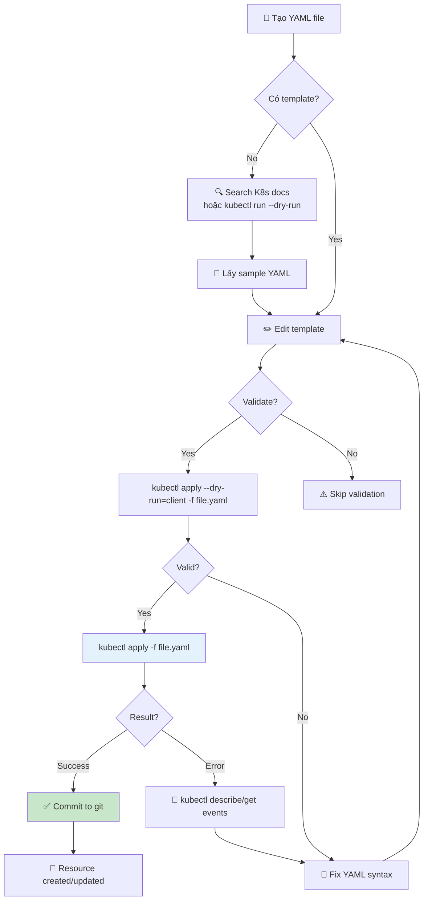
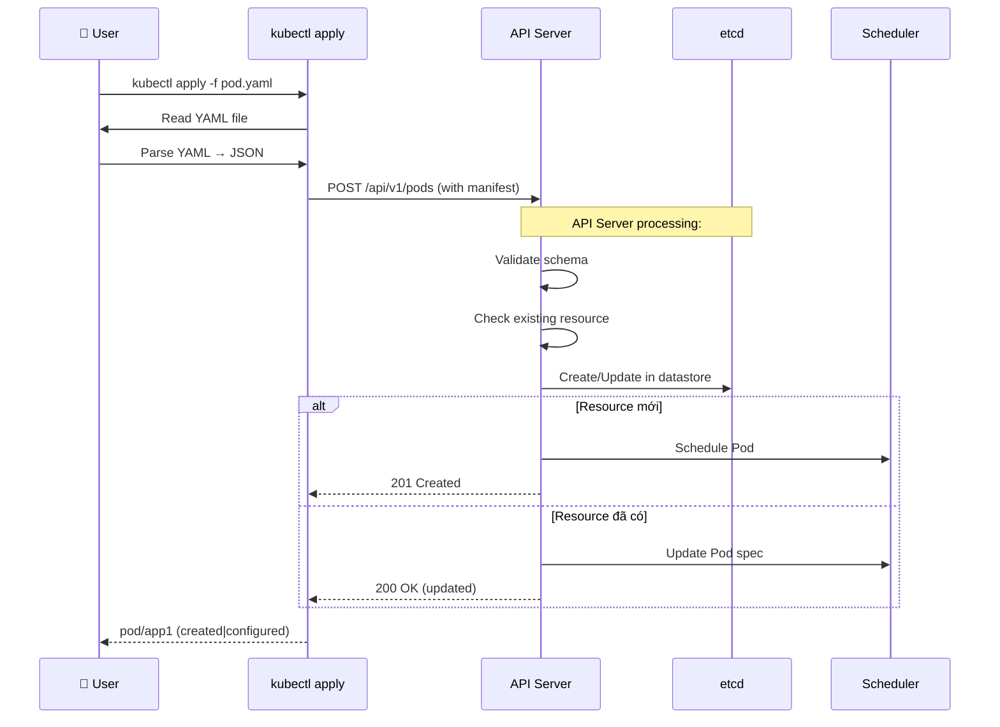

# YAML K8s Manifest 101 - Cấu trúc YAML file và cách sử dụng

Đây là bài học **cơ bản** về YAML - ngôn ngữ dùng để viết Kubernetes manifests. Hiểu YAML là bước đầu tiên để làm việc với Kubernetes theo cách Declarative.

---

## 1. YAML là gì?

**YAML** (YAML Ain't Markup Language) là một ngôn ngữ định dạng dữ liệu human-readable, thường dùng cho configuration files.

Kubernetes dùng YAML để định nghĩa tất cả các object: Pod, Service, Deployment, ConfigMap, Secret,...

**Ví dụ đơn giản**:
```yaml
name: John
age: 30
city: Hanoi
```

---

## 2. So sánh YAML với JSON

YAML tương đương với JSON nhưng dễ đọc hơn:

**JSON**:
```json
{
  "name": "John",
  "age": 30,
  "city": "Hanoi"
}
```

**YAML**:
```yaml
name: John
age: 30
city: Hanoi
```

YAML có thể chuyển đổi sang JSON và ngược lại.

---

## 3. Cú pháp cơ bản

### 3.1. Key-Value Pair (Cặp khóa-giá trị)

```yaml
key: value
name: simple-app
version: 1.0.0
port: 8080
```

**Quy tắc**:
- Dùng dấu `:` (colon) theo sau bởi khoảng trắng (space)
- Không cần quotes (" " hoặc '' hoặc ``) quanh string, nhưng có thể dùng nếu muốn
- Number không cần quotes

```yaml
# ĐÚNG:
name: myapp
port: 8080

# CŨNG ĐÚNG (dùng quotes):
name: "myapp"
port: "8080"

# SAI (không có space sau colon):
name:myapp
```

### 3.2. Indentation (Thụt đầu dòng)

**YAML dùng spaces để indent, KHÔNG dùng tabs**:

```yaml
# ĐÚNG - dùng 2 spaces:
metadata:
  name: app1
  labels:
    app: demo

# SAI - dùng tabs (sẽ lỗi):
metadata:
    name: app1  # ← tab, không được
```

**Rule**: Mỗi level indent 2 spaces (có thể 4, nhưng consistent).

### 3.3. Comments

```yaml
# Đây là comment
apiVersion: v1  # comment ở cuối line
kind: Pod

# Comments không hiển thị trong object,
# chỉ để ghi chú cho con người
```

---

## 4. Data Types trong YAML

### 4.1. Scalar (giá trị đơn)

```yaml
string: "Hello World"
string2: Hello World  # không cần quotes
number: 123
float: 3.14
boolean: true  # true hoặc false
null: null     # null hoặc ~ hoặc undefined
```

### 4.2. List/Array (danh sách)

Dùng dấu `-` (dash) với space:

```yaml
# List of strings
fruits:
  - apple
  - banana
  - orange

# List of objects
containers:
  - name: app1
    image: nginx
    port: 8080
  - name: app2
    image: redis
    port: 6379

# Inline style:
ports: [80, 443, 8080]
```

### 4.3. Dictionary/Map (từ điển)

Key-value pairs:

```yaml
metadata:
  name: app1
  labels:
    app: demo
    env: production
  annotations:
    description: "My first app"
```

---

## 5. Multi-line Strings (chuỗi nhiều dòng)

### Literal style (dùng `|`):

Giữ nguyên newlines:

```yaml
description: |
  This is a very long description
  that spans multiple lines.
  All line breaks are preserved.
  
  Even blank lines are kept.

# Khi parse, sẽ thành:
# "This is a very long description\nthat spans multiple lines.\n...
```

### Folded style (dùng `>`):

Convert newlines thành spaces:

```yaml
description: >
  This is a very long description
  that spans multiple lines.
  All line breaks become spaces.
  
  Even blank lines become single space.

# Khi parse, sẽ thành:
# "This is a very long description that spans multiple lines. All line breaks..."
```

**Sử dụng khi nào**:
- `|` Dùng cho văn bản cần giữ format (script, config file)
- `>` Dùng cho paragraphs, description dài

---

## 6. Cấu trúc Kubernetes Manifest

Tất cả Kubernetes objects có cấu trúc:

```yaml
apiVersion: v1           # API version
kind: Pod               # Loại object
metadata:               # Metadata (name, labels,...)
  name: app1
  labels:
    app: demo
spec:                   # Specification (desired state)
  containers:
  - name: app-container
    image: nginx:latest
    ports:
    - containerPort: 80
```

### 6.1. apiVersion

```yaml
apiVersion: v1              # Core resources (Pod, Service, ConfigMap,...)
apiVersion: apps/v1         # Apps resources (Deployment, StatefulSet,...)
apiVersion: batch/v1        # Batch resources (Job, CronJob,...)
apiVersion: networking.k8s.io/v1  # Network resources (Ingress, NetworkPolicy)
```

**Cách biết apiVersion**:
```bash
kubectl api-resources
# hoặc xem docs: https://kubernetes.io/docs/reference/generated/kubernetes-api/v1.28/
```

### 6.2. kind

```yaml
kind: Pod
kind: Service
kind: Deployment
kind: ConfigMap
kind: Secret
kind: Namespace
kind: PersistentVolumeClaim
# ... có nhiều loại
```

### 6.3. metadata

```yaml
metadata:
  name: app1                    # Bắt buộc
  namespace: default            # Optional (default là "default")
  labels:                       # Optional - dùng để select
    app: demo
    tier: frontend
    environment: production
  annotations:                  # Optional - dùng để lưu metadata không dùng để select
    description: "My application"
    kubernetes.io/created-by: "admin"
```

### 6.4. spec

`spec` là phần quan trọng nhất - định nghĩa desired state.

```yaml
spec:
  containers:              # Với Pod/Deployment
  - name: app
    image: nginx:1.20
    ports:
    - containerPort: 80
  
  selector:                # Với Service/Deployment
    matchLabels:
      app: demo
  
  replicas: 3              # Với Deployment
  template:                # Với Deployment/StatefulSet
    metadata:
      labels:
        app: demo
    spec:
      containers:
      - name: app
        image: nginx
```

---

## 7. Ví dụ đầy đủ: Pod Manifest

`pod-app1.yaml`:

```yaml
apiVersion: v1
kind: Pod
metadata:
  name: app1
  labels:
    app: demo
    tier: frontend
    environment: development
  annotations:
    description: "Demo application pod"
    maintainer: "dev-team"
spec:
  containers:
  - name: app-container
    image: nginx:1.20
    ports:
    - containerPort: 80
      protocol: TCP
      name: http
    env:
    - name: NODE_ENV
      value: "development"
    - name: LOG_LEVEL
      value: "info"
    resources:
      requests:
        memory: "64Mi"
        cpu: "250m"
      limits:
        memory: "128Mi"
        cpu: "500m"
    volumeMounts:
    - name: config-volume
      mountPath: /etc/config
  volumes:
  - name: config-volume
    configMap:
      name: app-config
  restartPolicy: Always
```

---

## 8. Ví dụ: Service Manifest

`service-app1.yaml`:

```yaml
apiVersion: v1
kind: Service
metadata:
  name: app1-service
  labels:
    app: demo
spec:
  selector:
    app: demo        # Match Pod labels
    tier: frontend
  type: NodePort
  ports:
  - name: http
    port: 80          # Service port (trong cluster)
    targetPort: 80    # Pod port
    nodePort: 30198   # Node port (optional)
  - name: https
    port: 443
    targetPort: 443
```

---

## 9. Ví dụ: Deployment Manifest

`deployment-app1.yaml`:

```yaml
apiVersion: apps/v1
kind: Deployment
metadata:
  name: app1-deployment
  labels:
    app: demo
spec:
  replicas: 3
  selector:
    matchLabels:
      app: demo
      tier: frontend
  template:
    metadata:
      labels:
        app: demo
        tier: frontend
    spec:
      containers:
      - name: app-container
        image: nginx:1.20
        ports:
        - containerPort: 80
        env:
        - name: NODE_ENV
          value: "production"
        resources:
          requests:
            memory: "128Mi"
            cpu: "250m"
          limits:
            memory: "256Mi"
            cpu: "500m"
        livenessProbe:
          httpGet:
            path: /health
            port: 80
          initialDelaySeconds: 30
          periodSeconds: 10
        readinessProbe:
          httpGet:
            path: /ready
            port: 80
          initialDelaySeconds: 5
          periodSeconds: 5
      restartPolicy: Always
```

---

## 10. Làm việc với YAML

### 10.1. Tạo YAML từ scratch

```bash
# Dùng text editor:
code pod.yaml
vim pod.yaml
nano pod.yaml
```

### 10.2. Export existing resource to YAML

```bash
# Get resource và save to file:
kubectl get pod app1 -o yaml > pod-app1.yaml

# Get với wide:
kubectl get deployment app1-deploy -o yaml > deployment.yaml

# Lưu ý: Export sẽ include nhiều auto-generated fields,
# cần clean up trước khi dùng làm manifest
```

### 10.3. Validate YAML syntax

```bash
# Dry-run (validate only, không apply):
kubectl apply -f pod.yaml --dry-run=client

# Check YAML syntax với yamllint:
yamllint pod.yaml

# Validate với kubeval (kiểm tra K8s schema):
kubeval pod.yaml
```

### 10.4. Tìm và replace trong YAML

```bash
# Sửa image từ nginx:1.20 sang nginx:1.21:
sed -i '' 's/nginx:1.20/nginx:1.21/g' deployment.yaml

# Hoặc dùng yq (YAML processor):
yq eval '.spec.template.spec.containers[0].image = "nginx:1.21"' -i deployment.yaml
```

---

## 11. Best Practices khi viết YAML

### 11.1. Consistent indentation

```yaml
# LUÔN dùng 2 spaces, không dùng tabs:
spec:
  containers:    # 2 spaces
  - name: app    # 2 spaces, dash + space
    image: nginx  # 4 spaces
```

### 11.2. Dùng meaningful names

```yaml
metadata:
  name: app1-deployment          # Rõ ràng
  labels:
    app: user-api               # Specific, không chung chung
    tier: backend
    environment: production
```

### 11.3. Organize fields theo thứ tự

Kubernetes官方推荐 order:

```yaml
apiVersion: v1
kind: Pod
metadata:
  name: app1
  labels:
    app: demo
  annotations:
    description: "Demo app"
spec:
  containers:
  - name: app
    image: nginx
```

Common order:
1. `apiVersion`, `kind`, `metadata.name`
2. `metadata.labels`, `metadata.annotations`
3. `spec`

### 11.4. Tránh hard-code values

```yaml
# ❌ KHÔNG:
image: nginx:1.20.0
replicas: 3

# ✅ CÓ (dùng ConfigMap/Secret/Environment):
image: nginx:${NGINX_VERSION}
replicas: ${REPLICA_COUNT}

# Hoặc dùng Kustomize/Helm để patch values
```

### 11.5. Dùng comments cho giải thích

```yaml
apiVersion: v1
kind: Pod
metadata:
  name: app1
  labels:
    app: demo     # Used by Service selector
    team: frontend
```

### 11.6. Separate configs

```yaml
# Không đặt tất cả trong 1 file lớn:
# ❌ 500 lines Pod manifest với ConfigMap và Secret lẫn lộn

# ✅ Tách files:
# pod.yaml
# service.yaml
# configmap.yaml
# secret.yaml
# deployment.yaml

# Dùng kustomize để kết hợp:
kubectl apply -k overlays/production/
```

---

## 12. YAML Syntax Errors phổ biến

### Error 1: Tabs thay vì spaces

```yaml
metadata:
    name: app1  # ← tab (4 spaces appearance)
```

**Fix**: Dùng spaces (2 spaces per indent).

### Error 2: Missing colon

```yaml
name app1  # thiếu :
```

**Fix**: `name: app1`

### Error 3: Missing space after colon

```yaml
name:app1  # thiếu space
```

**Fix**: `name: app1`

### Error 4: Indentation không đúng

```yaml
metadata:
name: app1     # ← không indent
  labels:
    app: demo
```

**Fix**:
```yaml
metadata:
  name: app1    # ← indent 2 spaces
  labels:
    app: demo
```

### Error 5: Duplicate keys

```yaml
metadata:
  name: app1
  name: app2   # ← duplicate!
```

**Fix**: Mỗi key chỉ một lần trong cùng level.

---

## 13. Validate YAML với tools

### 13.1. Online YAML validators

- https://www.yamllint.com/
- https://codebeautify.org/yaml-validator

### 13.2. CLI tools

```bash
# Install yamllint (Python):
pip install yamllint

# Validate:
yamllint pod.yaml

# Install kubeval:
go install github.com/instrumenta/kubeval@latest

# Validate K8s manifests:
kubeval pod.yaml
kubeval --ignore-missing-schemas deployment.yaml
```

### 13.3. kubectl dry-run

```bash
# Validate YAML syntax và K8s schema:
kubectl apply -f pod.yaml --dry-run=client

# Nếu có lỗi:
# error: error validating "pod.yaml": error validating data:
# [ValidationError(Pod.spec.containers[0]): unknown field "port" in ...

# Nếu OK:
# pod/app1 created (dry-run)
```

---

## 14. Flowchart: Tạo và Apply YAML Manifest



---

## 15. Sequence Diagram: kubectl apply workflow



---

## 16. Examples: Common Resources

### 16.1. ConfigMap

```yaml
apiVersion: v1
kind: ConfigMap
metadata:
  name: app-config
data:
  APP_ENV: "production"
  LOG_LEVEL: "info"
  DATABASE_URL: "postgresql://db:5432/app"
  # Multi-line config:
  nginx.conf: |
    server {
      listen 80;
      location / {
        root /usr/share/nginx/html;
      }
    }
```

### 16.2. Secret

```yaml
apiVersion: v1
kind: Secret
metadata:
  name: db-secret
type: Opaque
data:
  # Values phải base64 encoded:
  password: cGFzc3dvcmQxMjM=  # "password123"
  username: dXNlcm5hbWU=      # "username"
```

**Tạo Secret từ literal**:
```bash
kubectl create secret generic db-secret \
  --from-literal=password=password123 \
  --from-literal=username=admin
```

### 16.3. Namespace

```yaml
apiVersion: v1
kind: Namespace
metadata:
  name: production
  labels:
    purpose: production-workloads
```

---

## 17. Combining Multiple Resources

Có thể put nhiều resources trong 1 file:

```yaml
# app.yaml
apiVersion: v1
kind: ConfigMap
metadata:
  name: app-config
data:
  APP_ENV: "production"
---
apiVersion: v1
kind: Secret
metadata:
  name: app-secret
type: Opaque
data:
  password: cGFzc3dvcmQ=
---
apiVersion: v1
kind: Service
metadata:
  name: app-service
spec:
  selector:
    app: demo
  ports:
  - port: 80
    targetPort: 8080
---
apiVersion: apps/v1
kind: Deployment
metadata:
  name: app-deployment
spec:
  replicas: 3
  selector:
    matchLabels:
      app: demo
  template:
    metadata:
      labels:
        app: demo
    spec:
      containers:
      - name: app
        image: nginx:1.20
```

Apply tất cả:

```bash
kubectl apply -f app.yaml
# Output:
# configmap/app-config created
# secret/app-secret created
# service/app-service created
# deployment.apps/app-deployment created
```

---

## 18. Kustomize

Kustomize cho phép customize YAML mà không edit:

**Structure**:
```
base/
├── deployment.yaml
├── service.yaml
└── kustomization.yaml

overlays/
├── production/
│   ├── kustomization.yaml
│   └── replica-patch.yaml
└── staging/
    ├── kustomization.yaml
    └── replica-patch.yaml
```

**base/kustomization.yaml**:
```yaml
resources:
- ../deployment.yaml
- ../service.yaml
```

**overlays/production/kustomization.yaml**:
```yaml
resources:
- ../../base

patchesStrategicMerge:
- replica-patch.yaml

images:
- name: nginx
  newTag: "1.21"
```

**overlays/production/replica-patch.yaml**:
```yaml
apiVersion: apps/v1
kind: Deployment
metadata:
  name: app-deployment
spec:
  replicas: 5  # Override replicas
```

Apply:
```bash
kubectl apply -k overlays/production/
```

---

## 19. Troubleshooting YAML

### Vấn đề 1: "error: error parsing ...: yaml: line X: did not find expected key"

**Nguyên nhân**: Indentation không đúng.

```yaml
# Lỗi:
spec:
containers:  # ← thiếu indent
- name: app

# Fix:
spec:
  containers:  # ← indent 2 spaces
  - name: app
```

### Vấn đề 2: "error: unable to parse ...: yaml: map values must be wrapped with {...} in ..."

**Nguyên nhân**: Missing value.

```yaml
# Lỗi:
env:
- name: APP_ENV  # thiếu value

# Fix:
env:
- name: APP_ENV
  value: "production"
```

### Vấn đề 3: "error: error validating data: ValidationError(...)"

**Nguyên nhân**: Field không hợp lệ hoặc missing required field.

```yaml
# Lỗi (thiếu required field):
apiVersion: v1
kind: Pod
metadata:
  name: app1
spec:  # thiếu containers (required)
  # ...

# Fix:
spec:
  containers:
  - name: app
    image: nginx
```

---

## 20. Tóm tắt

- **YAML** dùng spaces cho indentation (2 spaces recommended)
- **Key-value**: `key: value` (có space sau colon)
- **List**: dùng `-` với space
- **Dictionary**: nested key-value
- **Multi-line strings**: `|` (literal) hoặc `>` (folded)
- **Kubernetes manifest** có 4 phần: `apiVersion`, `kind`, `metadata`, `spec`
- **Validate** với `kubectl apply --dry-run=client`
- **Production** nên dùng **Declarative** với YAML manifests
- **Version control** YAML files với git

---

## 21. Next Steps

Sau khi nắm vững YAML, bạn có thể học:
- **Kubernetes resources chi tiết**: Pod, Service, Deployment, StatefulSet,...
- **Kustomize** để quản lý multiple environments
- **Helm** cho package management
- **Operators** để custom resources

---

Cảm ơn các bạn đã theo dõi! Hẹn gặp lại trong bài tiếp theo.
