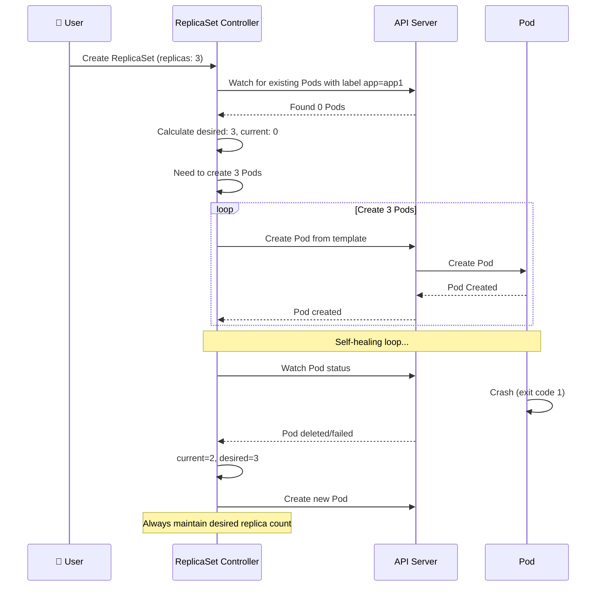
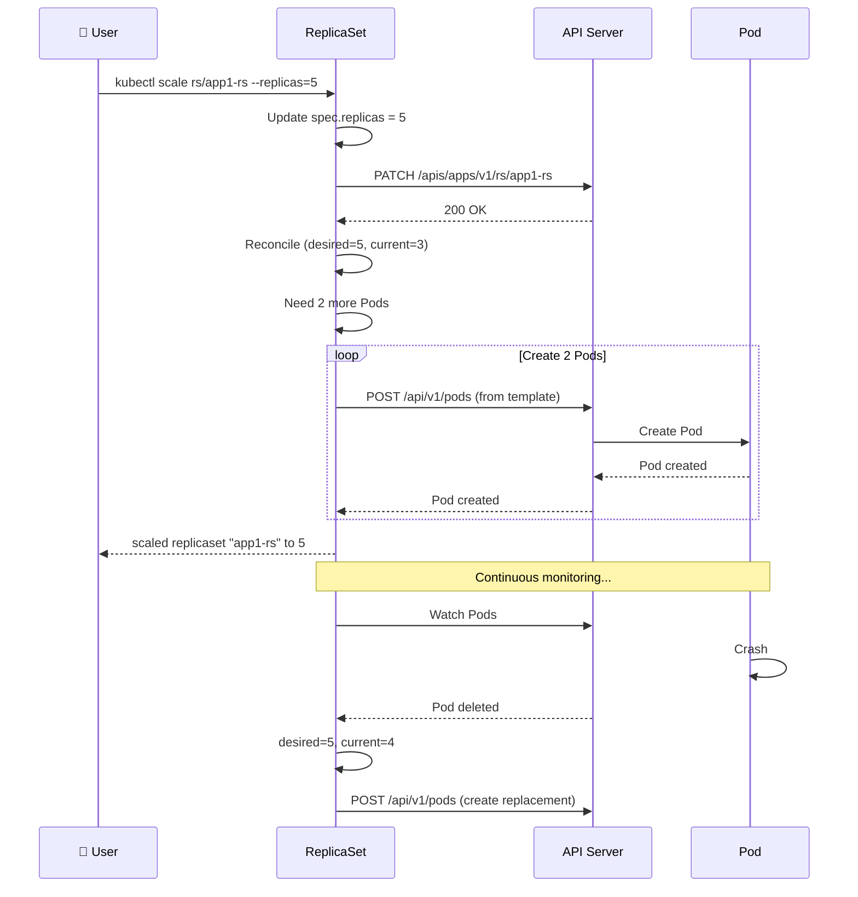
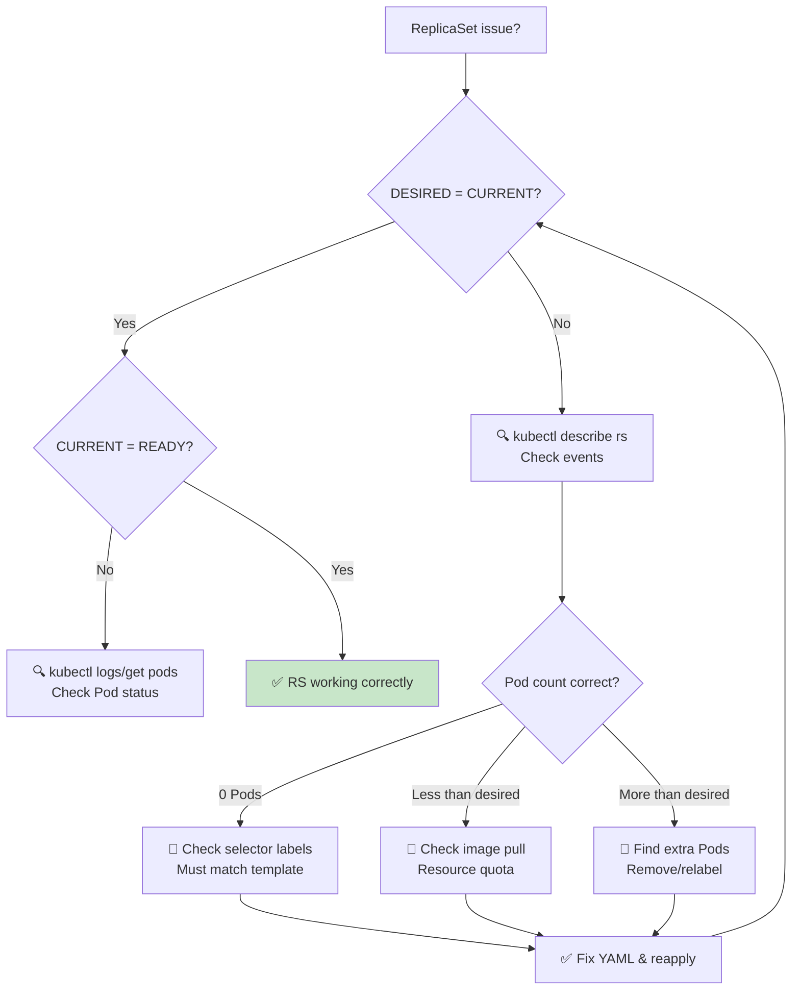

# Giới thiệu ReplicaSet - Đảm bảo số lượng Pod

Đây là bài học về **ReplicaSet (RS)** - Kubernetes controller đảm bảo số lượng Pod được chỉ định luôn chạy. ReplicaSet là nền tảng cho Deployment, giúp tự động scaling và self-healing.

---

## 1. ReplicaSet là gì?

**ReplicaSet** là Kubernetes object quản lý một nhóm Pod giống hệt nhau (identical Pods), đảm bảo:
- **Luôn có đúng số lượng Pod** (replicas) đang chạy
- **Self-healing**: Nếu Pod bị crash/xóa, tự động tạo mới
- **Scaling**: Dễ dàng tăng/giảm số Pod

**Ví dụ**: Bạn muốn chạy 3 bản sao của Pod `app1` → Tạo ReplicaSet với `replicas: 3` → ReplicaSet đảm bảo luôn có đúng 3 Pod chạy.

---

## 2. Tại sao cần ReplicaSet?

### Vấn đề với Pod đơn lẻ:

```bash
# Tạo 1 Pod
kubectl run app1 --image=nginx

# Nếu Pod crash → KHÔNG tự động tạo lại
# Nếu cần 3 Pod → phải tạo thủ công 3 lần
```

### Giải pháp: ReplicaSet

```yaml
# replicaset.yaml
apiVersion: apps/v1
kind: ReplicaSet
metadata:
  name: app1-rs
spec:
  replicas: 3  # Luôn giữ 3 Pods
  selector:
    matchLabels:
      app: app1
  template:
    metadata:
      labels:
        app: app1
    spec:
      containers:
      - name: app
        image: nginx
```

```bash
kubectl apply -f replicaset.yaml
# → Tự động tạo 3 Pods với label app=app1
```

---

## 3. ReplicaSet Workflow



---

## 4. ReplicaSet vs Deployment

| Feature | ReplicaSet | Deployment |
|---------|------------|------------|
| **Mục đích** | Quản lý số lượng Pod | Quản lý ReplicaSet (có rolling update) |
| **Imperative** | ❌ Không có | ❌ Không có |
| **Declarative** | ✅ Có (YAML) | ✅ Có (YAML) |
| **Rolling update** | ❌ Không | ✅ Có |
| **Rollback** | ❌ Không | ✅ Có |
| **Production use** | ⚠️ Ít dùng trực tiếp | ✅ Luôn dùng Deployment |
| **Use case** | Learning, understanding | Production (recommended) |

**Kết luận**: **Luôn dùng Deployment** thay vì ReplicaSet trực tiếp. Deployment quản lý ReplicaSet và cung cấp rolling update, rollback.

---

## 5. Cấu trúc ReplicaSet YAML

```yaml
apiVersion: apps/v1          # API version cho ReplicaSet
kind: ReplicaSet             # Loại object
metadata:
  name: app1-rs              # Tên ReplicaSet
  labels:
    app: app1
    tier: frontend
spec:
  replicas: 3                # Số Pod mong muốn
  selector:                  # Label selector - quan trọng!
    matchLabels:
      app: app1              # Chọn Pod có label app=app1
    # matchExpressions:      # Có thể dùng expressions phức tạp
    # - key: app
    #   operator: In
    #   values:
    #   - app1
  template:                  # Pod template - định nghĩa Pod sẽ tạo
    metadata:
      labels:
        app: app1            # Phải match selector!
        version: v1
    spec:
      containers:
      - name: app-container
        image: nginx:1.20
        ports:
        - containerPort: 80
        resources:
          requests:
            memory: "64Mi"
            cpu: "250m"
          limits:
            memory: "128Mi"
            cpu: "500m"
      restartPolicy: Always   # Luôn restart (mặc định)
```

---

## 6. Label Selector

ReplicaSet dùng **selector** để xác định Pod nào thuộc về nó.

### matchLabels (simple)

```yaml
selector:
  matchLabels:
    app: app1
    tier: frontend
```

Chọn Pod có **cả hai** labels: `app=app1` và `tier=frontend`.

### matchExpressions (complex)

```yaml
selector:
  matchExpressions:
  - key: app
    operator: In
    values:
    - app1
    - app2
  - key: tier
    operator: NotIn
    values:
    - legacy
```

**Operators**:
- `In`: value in list
- `NotIn`: value not in list
- `Exists`: key exists
- `DoesNotExist`: key does not exist
- `Equals`: value equals
- `NotEquals`: value not equals

---

## 7. Demo thực tế

### Bước 1: Tạo ReplicaSet

```bash
# Tạo file replicaset.yaml:
cat > replicaset.yaml << 'EOF'
apiVersion: apps/v1
kind: ReplicaSet
metadata:
  name: app1-rs
  labels:
    app: app1
spec:
  replicas: 3
  selector:
    matchLabels:
      app: app1
  template:
    metadata:
      labels:
        app: app1
    spec:
      containers:
      - name: app
        image: nginx:1.20
        ports:
        - containerPort: 80
EOF

# Apply:
kubectl apply -f replicaset.yaml

# Kiểm tra:
kubectl get replicaset
# NAME      DESIRED   CURRENT   READY   AGE
# app1-rs   3         3         3       10s

kubectl get pods -l app=app1
# NAME          READY   STATUS    RESTARTS   AGE
# app1-rs-abc1 1/1     Running   0          10s
# app1-rs-def2 1/1     Running   0          10s
# app1-rs-ghi3 1/1     Running   0          10s
```

### Bước 2: Xem chi tiết ReplicaSet

```bash
kubectl describe replicaset app1-rs
```

Output quan trọng:
- `Desired`: 3 (số Pod mong muốn)
- `Current`: 3 (số Pod hiện tại)
- `Ready`: 3 (số Pod ready)
- `Selector`: `app=app1`
- `Pod Template`: cấu hình Pod template

### Bước 3: Self-healing demo

```bash
# Xóa một Pod:
kubectl delete pod app1-rs-abc1

# Ngay lập tức, ReplicaSet tạo Pod mới:
kubectl get pods -l app=app1 -w
# NAME          READY   STATUS        RESTARTS   AGE
# app1-rs-def2 1/1     Running       0          1m
# app1-rs-ghi3 1/1     Running       0          1m
# app1-rs-jkl4 1/1     Running       0          5s   # ← Tự động tạo

# Kiểm tra ReplicaSet:
kubectl get replicaset app1-rs
# NAME      DESIRED   CURRENT   READY   AGE
# app1-rs   3         3         3       2m
```

### Bước 4: Scale ReplicaSet

```bash
# Scale lên 5 replicas:
kubectl scale replicaset app1-rs --replicas=5

# Hoặc edit YAML:
kubectl edit replicaset app1-rs
# Thay đổi: replicas: 5

# Kiểm tra:
kubectl get replicaset app1-rs
# NAME      DESIRED   CURRENT   READY   AGE
# app1-rs   5         5         5       3m

kubectl get pods -l app=app1
# NAME          READY   STATUS    RESTARTS   AGE
# app1-rs-abc1 1/1     Running   0          3m
# app1-rs-def2 1/1     Running   0          3m
# app1-rs-ghi3 1/1     Running   0          3m
# app1-rs-jkl4 1/1     Running   0          30s
# app1-rs-mno5 1/1     Running   0          30s
```

### Bước 5: Scale down

```bash
# Scale xuống 2 replicas:
kubectl scale replicaset app1-rs --replicas=2

# ReplicaSet sẽ xóa 3 Pods (terminationGracePeriodSeconds áp dụng)
kubectl get pods -l app=app1 -w
# app1-rs-abc1   Terminating
# app1-rs-def2   Running
# app1-rs-ghi3   Terminating
# app1-rs-jkl4   Terminating
# app1-rs-mno5   Terminating

# Cuối cùng còn 2 Pods:
kubectl get pods -l app=app1
# NAME          READY   STATUS    RESTARTS   AGE
# app1-rs-def2 1/1     Running   0          5m
# app1-rs-ghi3 1/1     Running   0          5m
```

---

## 8. ReplicaSet Pod Management

ReplicaSet quản lý Pod qua **label selector**:

```
ReplicaSet (app1-rs)
    ├── selector: app=app1
    ├── replicas: 3
    └── template: {metadata.labels: {app: app1}}
            │
            ├─> Pod 1 (labels: app=app1) ✓ Managed
            ├─> Pod 2 (labels: app=app1) ✓ Managed
            └─> Pod 3 (labels: app=app1) ✓ Managed
```

### Pod được ReplicaSet quản lý khi:

1. **Pod được tạo từ ReplicaSet template**:
   - ReplicaSet tạo Pod từ `spec.template`
   - Pod tự động có labels từ template

2. **Pod có labels match selector**:
   - Nếu bạn thủ công tạo Pod với `labels: app=app1`
   - ReplicaSet sẽ **tự động adopt** Pod đó (nếu chưa đủ replicas)

```bash
# Tạo Pod thủ công với label match:
cat > manual-pod.yaml << 'EOF'
apiVersion: v1
kind: Pod
metadata:
  name: manual-pod
  labels:
    app: app1   # Match ReplicaSet selector
spec:
  containers:
  - name: app
    image: nginx
EOF

kubectl apply -f manual-pod.yaml

# ReplicaSet sẽ adopt Pod này:
kubectl get pods -l app=app1
# NAME          READY   STATUS    RESTARTS   AGE
# manual-pod    1/1     Running   0          5s    ← Adopted!
# app1-rs-abc1 1/1     Running   0          1m
# app1-rs-def2 1/1     Running   0          1m
# app1-rs-ghi3 1/1     Running   0          1m  ← Now 4 Pods!

# DESIRED vẫn là 3, nhưng CURRENT là 4 (do manual pod)
# ReplicaSet sẽ KHÔNG xóa manual pod (nó không quản lý)
# Nhưng nếu manual pod die, nó sẽ không recreate (vì không phải từ template)
```

---

## 9. Update và Delete

### Update ReplicaSet

```bash
# Update Pod template (ví dụ: change image)
kubectl edit replicaset app1-rs

# Thay đổi trong spec.template.spec.containers[0].image:
# image: nginx:1.20  →  image: nginx:1.21

# Sau khi save, ReplicaSet sẽ rolling update các Pods:
kubectl get pods -l app=app1 -w
# app1-rs-abc1  Running → Terminating
# app1-rs-new1  Pending → Running  # Pod mới với image mới

# Lưu ý: ReplicaSet không có rolling update strategy như Deployment.
# Nó sẽ: 1. Tạo Pod mới, 2. Xóa Pod cũ (không controlled)
# Có thể có downtime!
```

### Delete ReplicaSet

```bash
# Delete ReplicaSet:
kubectl delete replicaset app1-rs

# Khi delete ReplicaSet:
# - Tất cả Pods managed by RS sẽ bị xóa theo (cascade delete)
# - Các manual Pods (adopted) sẽ NOT bị xóa

# Nếu muốn giữ Pods:
kubectl delete replicaset app1-rs --cascade=orphan
# → ReplicaSet bị xóa, nhưng Pods vẫn chạy (orphaned)
```

---

## 10. ReplicaSet Selector Pitfalls

### Pitfall 1: Selector không match template labels

```yaml
# ❌ SAI:
spec:
  selector:
    matchLabels:
      app: app2   # ← Không match với template labels!
  template:
    metadata:
      labels:
        app: app1   # ← app1 vs app2

# Kết quả: ReplicaSet tạo Pod với label app=app1,
# nhưng selector chọn app=app2 → Không tìm thấy Pod nào!
# DESIRED=3, CURRENT=0 (Pod được tạo nhưng không managed)

# ✅ ĐÚNG:
spec:
  selector:
    matchLabels:
      app: app1   # ← Phải match với template labels!
  template:
    metadata:
      labels:
        app: app1
```

### Pitfall 2: Selector quá chung chung

```yaml
# ❌ SAI:
spec:
  selector:
    matchLabels:
      tier: frontend  # ← Quá chung, có thể match nhiều Pods khác

# Nếu có Pod khác có tier=frontend (không phải của RS này),
# ReplicaSet sẽ adopt chúng → Không mong muốn!

# ✅ ĐÚNG:
spec:
  selector:
    matchLabels:
      app: app1      # Specific
      tier: frontend
```

### Pitfall 3: Thay đổi selector sau khi tạo

```yaml
# Selector KHÔNG THỂ thay đổi sau khi tạo ReplicaSet!
# Nếu edit YAML và đổi selector → Error

# Lý do: Selector xác định Pod nào được managed.
# Thay đổi selector có thể làm mất Pods khỏi management.
# Kubernetes block thay đổi selector.
```

---

## 11. ReplicaSet Status

```bash
# Xem ReplicaSet:
kubectl get replicaset
# NAME      DESIRED   CURRENT   READY   AGE
# app1-rs   3         3         3       5m

# DESIRED = số replica bạn muốn (trong spec)
# CURRENT = số Pod hiện tại managed by RS (có thể > DESIRED nếu adopt extra Pods)
# READY = số Pod đang Ready (passing readiness probe)

# Xem events:
kubectl describe replicaset app1-rs

# Output:
# Events:
# Type    Reason            Age   From               Message
# ----    ------            ----  ----               -------
# Normal  SuccessfulCreate  2m    replicaset-controller  Created pod: app1-rs-abc1
# Normal  SuccessfulCreate  2m    replicaset-controller  Created pod: app1-rs-def2
# Normal  SuccessfulCreate  2m    replicaset-controller  Created pod: app1-rs-ghi3
# Normal  ScalingReplicaSet 30s   replicaset-controller  Scaled down replica set app1-rs to 2
```

---

## 12. Troubleshooting ReplicaSet

### Vấn đề 1: DESIRED=3, CURRENT=0

```bash
kubectl get replicaset app1-rs
# NAME      DESIRED   CURRENT   READY   AGE
# app1-rs   3         0         0       1m

# Nguyên nhân:
# 1. Selector không match template labels
# 2. Pod template invalid (image not found, resource quota)
# 3. API version wrong (dùng apps/v1)

# Xem events:
kubectl describe replicaset app1-rs

# Xem Pods (nếu có):
kubectl get pods -l app=app1
# Nếu không có Pods nào → selector issue

# Xem YAML:
kubectl get replicaset app1-rs -o yaml

# Kiểm tra selector vs template labels:
# spec.selector.matchLabels.app = ?
# spec.template.metadata.labels.app = ?
# Phải giống nhau!
```

### Vấn đề 2: CURRENT > DESIRED

```bash
kubectl get replicaset app1-rs
# NAME      DESIRED   CURRENT   READY   AGE
# app1-rs   3         5         5       10m

# Nguyên nhân: ReplicaSet adopt extra Pods (cùng labels)
# Có manual Pods hoặc Pods từ RS cũ có labels match

# Kiểm tra Pods:
kubectl get pods -l app=app1 --show-labels

# Nếu có Pods không phải của RS:
# - Hoặc delete chúng
# - Hoặc đổi labels của chúng (không match selector)
kubectl label pod manual-pod app-  # remove label
```

### Vấn đề 3: Pods liên tục restart (CrashLoopBackOff)

```bash
kubectl get pods
# NAME          READY   STATUS             RESTARTS   AGE
# app1-rs-abc1  0/1     CrashLoopBackOff   10         5m

# ReplicaSet sẽ luôn cố giữ số Pods, nếu Pod crash nó sẽ tạo mới
# Nhưng nếu Pod luôn crash, sẽ có循环:

# Xem logs:
kubectl logs app1-rs-abc1 --previous

# Xem describe:
kubectl describe pod app1-rs-abc1

# Fix lỗi trong Pod (image, resource, config,...)
```

---

## 13. Flowchart: ReplicaSet Self-Healing

```mermaid
flowchart TD
    Start[RS với replicas: 3] --> Check{Count Pods}
    Check -->|3 Pods running| OK[✅ OK - Maintain state]
    Check -->|< 3 Pods| Need[⚠️ Need more Pods]
    Check -->|> 3 Pods| Extra[⚠️ Extra Pods (adopted)]
    
    Need --> Create[Create Pod từ template]
    Create --> Sched[Schedule to Node]
    Sched --> Running[Pod Running]
    Running --> Check
    
    Extra --> Note[📝 Note: Extra Pods managed but not from template<br/>RS will not delete them]
    Note --> Check
    
    subgraph "Self-Healing Loop"
        Check
        Need
        Extra
        Create
        Running
    end
    
    OK --> Monitor[👁️ Monitor continuously...]
    Monitor --> Check
    
    style OK fill:#c8e6c9
    style Need fill:#fff3e0
    style Extra fill:#fff3e0
```

---

## 14. Sequence Diagram: Scale Operation



---

## 15. When to use ReplicaSet directly?

**Thực tế**: Hầu hết các bạn sẽ **không bao giờ** tạo ReplicaSet trực tiếp.

**Use cases for ReplicaSet**:
- Learning Kubernetes controllers
- Custom controllers built on top of ReplicaSet
- Không cần rolling update (static apps)

**Production**: Luôn dùng **Deployment** thay vì ReplicaSet.

Deployment quản lý ReplicaSet và cung cấp:
- Rolling update
- Rollback
- Pause/Resume update
- Revision history

```bash
# Deployment tự động tạo ReplicaSet:
kubectl create deployment app1 --image=nginx --replicas=3
# → Tạo Deployment, Deployment tạo ReplicaSet, RS tạo Pods

kubectl get deployment,replicaset,pods -l app=app1
# NAME                          READY   UP-TO-DATE   AVAILABLE   AGE
# deployment.apps/app1          3/3     3            3           1m
# 
# NAME                    DESIRED   CURRENT   READY   AGE
# replicaset.apps/app1-xxx 3         3         3       1m
#
# NAME                    READY   STATUS    RESTARTS   AGE
# pod/app1-xxx-abc1       1/1     Running   0          1m
# pod/app1-xxx-def2       1/1     Running   0          1m
# pod/app1-xxx-ghi3       1/1     Running   0          1m
```

---

## 16. Best Practices

### 16.1. Always use Deployment for production

```bash
# ❌ Không:
kubectl apply -f replicaset.yaml

# ✅ Có:
kubectl apply -f deployment.yaml
```

### 16.2. Labels must match selector

```yaml
spec:
  selector:
    matchLabels:
      app: myapp
  template:
    metadata:
      labels:
        app: myapp  # ← Phải match selector!
```

### 16.3. Set resource limits

```yaml
spec:
  containers:
  - name: app
    image: nginx
    resources:
      requests:
        memory: "128Mi"
        cpu: "250m"
      limits:
        memory: "256Mi"
        cpu: "500m"
```

### 16.4. Use meaningful names

```yaml
metadata:
  name: user-api-rs  # Rõ ràng
  labels:
    app: user-api
    component: backend
```

### 16.5. Monitor ReplicaSet status

```bash
# Check:
kubectl get rs
kubectl get pods -l app=myapp

# Events:
kubectl describe rs/myapp-rs

# Ensure:
# DESIRED == CURRENT == READY
```

---

## 17. Troubleshooting Checklist



---

## 18. Tóm tắt

- **ReplicaSet** đảm bảo số lượng Pod luôn được duy trì
- **Self-healing**: Tự động tạo Pod mới nếu Pod bị xóa/crash
- **Scaling**: Dễ dàng scale số Pod lên/xuống
- **Label Selector**: Định nghĩa Pod nào thuộc về RS (matchLabels/matchExpressions)
- **Pod Template**: Template để tạo Pods
- **Declarative**: Chỉ dùng YAML, không có imperative commands
- **Production**: Luôn dùng **Deployment** thay vì ReplicaSet trực tiếp
- **Best practice**: `selector.matchLabels` phải match với `template.metadata.labels`

---

## 19. Next Steps

Trong bài tiếp theo, chúng ta sẽ tìm hiểu về **Deployment** - cách đúng để deploy ứng dụng production với rolling update và rollback.

---

Cảm ơn các bạn đã theo dõi! Hẹn gặp lại trong bài tiếp theo.
