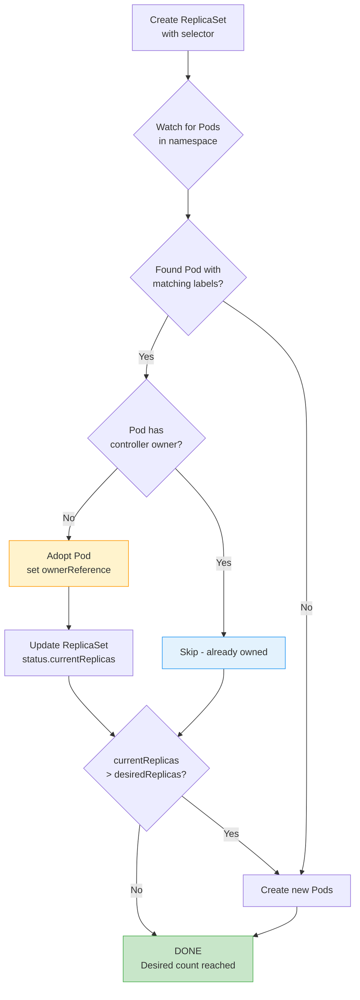
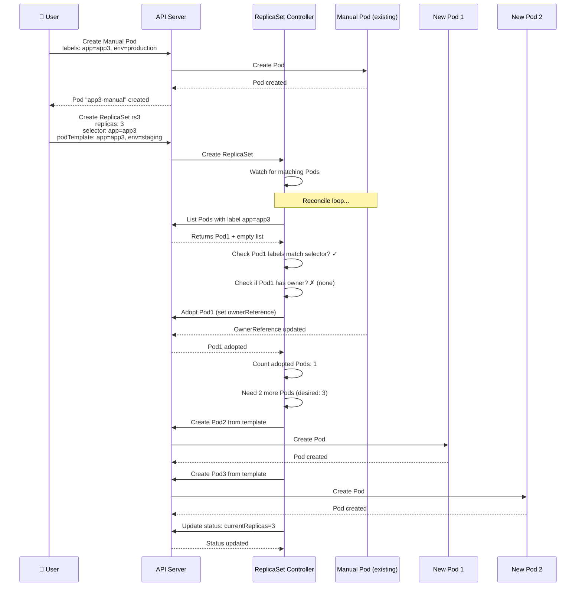
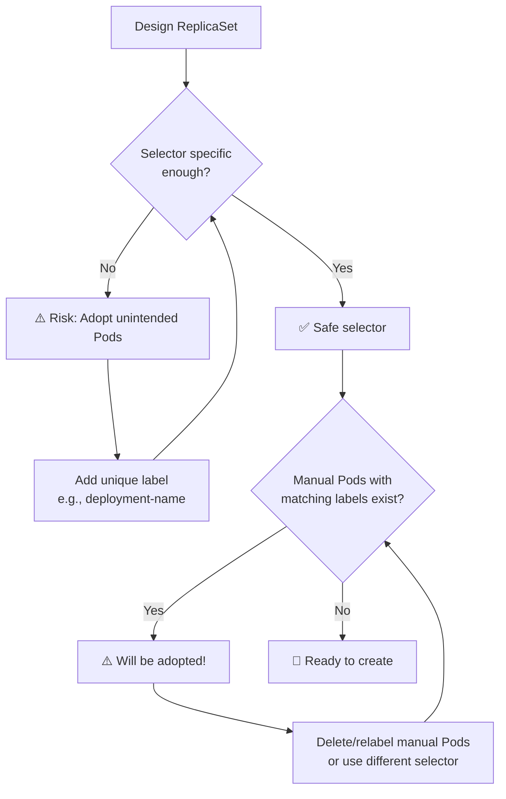
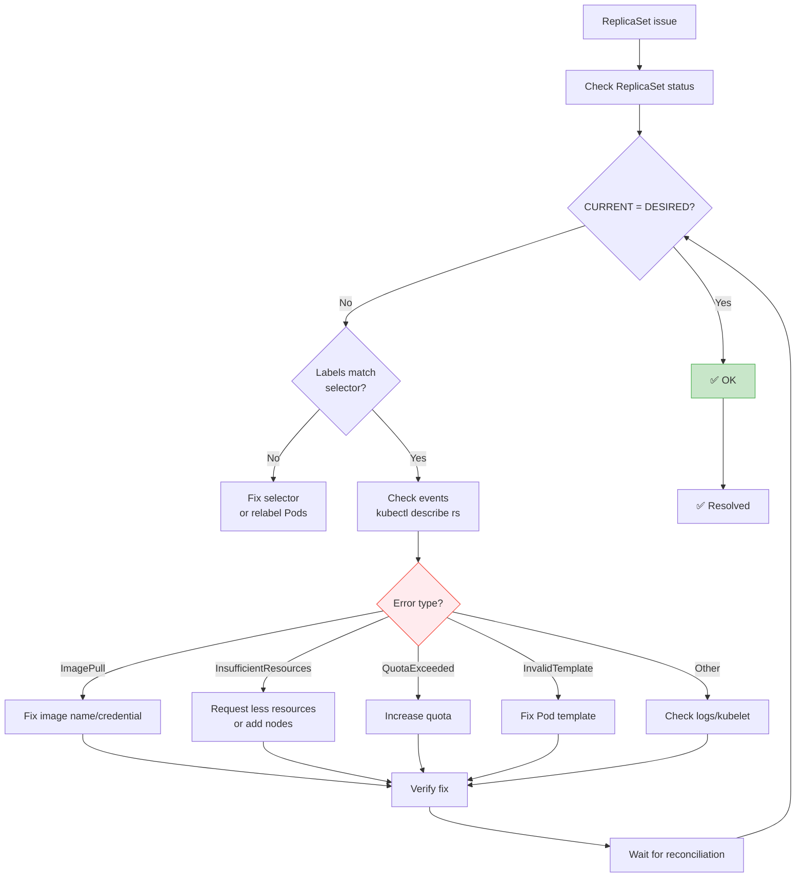

# ReplicaSet Labels & Selectors - Cơ Chế Làm Việc Chi Tiết

Trong bài trước, chúng ta đã tìm hiểu ReplicaSet cơ bản. Trong bài này, chúng ta sẽ đi sâu vào cơ chế hoạt động của ReplicaSet thông qua **Labels** và **Selectors**, và cách ReplicaSet có thể **adopt** (nhận nuôi) các Pod đã tồn tại.

## 1. Labels & Selectors là gì?

### Labels (Nhãn)
- **Key-value pairs** đính kèm vào các object Kubernetes (Pod, Service, ReplicaSet, Node, etc.)
- Dùng để **phân loại** và **tổ chức** resources
- Không dùng để chọn resources (đó là việc của Selectors)

**Ví dụ:**
```yaml
metadata:
  labels:
    app: nginx
    environment: production
    tier: frontend
    version: v1.2.3
```

### Selectors (Bộ chọn)
- Dùng để **tìm** và **lựa chọn** resources có labels phù hợp
- ReplicaSet dùng selector để xác định Pod nào do nó quản lý
- Hai loại:
  1. **matchLabels**: So khớp chính xác các label key-value
  2. **matchExpressions**: Điều kiện phức tạp với operators (In, NotIn, Exists, DoesNotExist)

## 2. Cơ chế ReplicaSet Adoption (Nhận nuôi Pod tồn tại)

Một trong những tính năng quan trọng của ReplicaSet là khả năng **adopt existing Pods** - tức là ReplicaSet có thể nhận quản lý các Pod đã được tạo trước đó nếu labels của Pod khớp với selector của ReplicaSet.

### Flowchart: ReplicaSet Adoption Process



**Điều kiện để ReplicaSet adopt một Pod:**
1. Pod nằm cùng namespace với ReplicaSet
2. Pod's labels khớp với ReplicaSet's selector
3. Pod **không** có `controller-revision-hash` label (của Deployment) hoặc ownerReferences trỏ đến controller khác
4. Pod đang ở trạng thái Running/Pending (không phải Failed/Succeeded)

## 3. Demo: ReplicaSet Adoption

### Sequence Diagram: Adoption Workflow



### Demo Steps

```bash
# 1. Xóa resources cũ (cleanup)
kubectl delete rs rs3 --ignore-not-found
kubectl delete pod app3-manual --ignore-not-found

# 2. Tạo Manual Pod với label app=app3, environment=production
kubectl run app3-manual \
  --image=vietaws/arm:v3 \
  --labels="app=app3,environment=production"

# 3. Kiểm tra manual Pod
kubectl get pod app3-manual --show-labels
# NAME           READY   STATUS    LABELS
# app3-manual   1/1     Running   app=app3,environment=production

# 4. Xem chi tiết label của Pod
kubectl describe pod app3-manual | grep -A 5 Labels
# Labels:   app=app3
#           environment=production

# 5. Tạo ReplicaSet với selector: app=app3
# Lưu ý: Pod template có label khác (environment=staging)
cat <<EOF | kubectl apply -f -
apiVersion: apps/v1
kind: ReplicaSet
metadata:
  name: rs3
spec:
  replicas: 3
  selector:
    matchLabels:
      app: app3
  template:
    metadata:
      labels:
        app: app3
        environment: staging  # Khác với manual Pod!
    spec:
      containers:
      - name: nginx
        image: vietaws/arm:v3
        ports:
        - containerPort: 80
EOF

# 6. Kiểm tra ReplicaSet
kubectl get replicaset rs3
# NAME   DESIRED   CURRENT   READY   AGE
# rs3    3         3         3       30s

# 7. Kiểm tra tất cả Pods
kubectl get pods --show-labels
# NAME          READY   STATUS    LABELS
# app3-manual  1/1     Running   app=app3,environment=production  ← Adopted!
# rs3-xxxx     1/1     Running   app=app3,environment=staging
# rs3-yyyy     1/1     Running   app=app3,environment=staging
# rs3-zzzz     1/1     Running   app=app3,environment=staging

# 8. Xem chi tiết ReplicaSet
kubectl describe replicaset rs3
```

### Kết quả Demo:
- ReplicaSet rs3 có `desiredReplicas = 3`
- Có 1 manual Pod `app3-manual` với label `app=app3` (environment=production)
- ReplicaSet **adopt** manual Pod vì selector `app=app3` khớp
- ReplicaSet chỉ tạo thêm **2 Pod mới** (rs3-xxxx, rs3-yyyy) để đạt tổng 3 Pods
- **Tổng số Pods = 3** (1 adopted + 2 created)
- Manual Pod vẫn giữ label `environment=production` (không bị thay đổi)

## 4. Label Selector Matching

### matchLabels: So khớp chính xác

```yaml
selector:
  matchLabels:
    app: nginx
    tier: frontend
```

Chỉ chọn Pods có **cả hai** labels:
- `app=nginx` **và**
- `tier=frontend`

### matchExpressions: Điều kiện linh hoạt

```yaml
selector:
  matchExpressions:
  - key: app
    operator: In
    values: ["nginx", "apache"]
  - key: tier
    operator: NotIn
    values: ["backend"]
  - key: environment
    operator: Exists
```

**Operators:**
- `In`: Label value phải nằm trong danh sách
- `NotIn`: Label value không nằm trong danh sách
- `Exists`: Label phải tồn tại (bất kỳ value nào)
- `DoesNotExist`: Label không tồn tại

**Ví dụ:**
```yaml
matchExpressions:
- key: app
  operator: In
  values: [nginx, tomcat]  # app=nginx OR app=tomcat
- key: tier
  operator: Exists        # tier có bất kỳ value nào
```

**Kết hợp matchLabels và matchExpressions:**
```yaml
selector:
  matchLabels:
    environment: production
  matchExpressions:
  - key: app
    operator: In
    values: [nginx, apache]
```

**Logic:** Tất cả điều kiện phải thỏa mãn (AND). Với In operator, các value nối bằng OR.

## 5. Pitfall: Label Design và Unintended Adoption

### Vấn đề thường gặp

Nếu bạn design label **quá chung chung**, ReplicaSet có thể adopt nhiều Pod không mong muốn.

** Ví dụ:**
```yaml
# Bad: Label quá chung chung
apiVersion: apps/v1
kind: ReplicaSet
metadata:
  name: bad-rs
spec:
  replicas: 3
  selector:
    matchLabels:
      app: web-app  # Quá chung! Có thể khớp với nhiều app
  template:
    metadata:
      labels:
        app: web-app
        version: v1
```

**Kịch bản xấu:**
1. Bạn có Deployment `payments` với label `app=web-app,version=v1`
2. Bạn tạo ReplicaSet `bad-rs` với selector `app=web-app`
3. ReplicaSet sẽ **adopt Pods của Deployment payments**!
4. Kết quả: Pods bị ReplicaSet chiếm quyền quản lý → Deployment broken

### Best Practices cho Label Design

1. **Dùng namespace để phân tách**:
   ```yaml
   labels:
     app: myapp
     tier: frontend
     environment: staging
     namespace: team-a  # Hoặc dùng label riêng
   ```

2. **Bao gồm cả tier và component**:
   ```yaml
   labels:
     app: ecommerce
     tier: frontend
     component: checkout
   ```

3. **Dùng selector chặt chẽ**:
   ```yaml
   selector:
     matchLabels:
       app: myapp
       tier: frontend
       deployment: stable-v1  # Thêm version/ deployment name
   ```

4. **Đặt label duy nhất cho mỗi Deployment/ReplicaSet**:
   ```yaml
   labels:
     app: myapp
     deployment: myapp-prod-v1
   selector:
     matchLabels:
       app: myapp
       deployment: myapp-prod-v1
   ```

**Flowchart: Avoid Unintended Adoption**



## 6. ReplicaSet vs Deployment: Khi nào dùng cái nào?

| Feature | ReplicaSet | Deployment |
|---------|-----------|------------|
| **Purpose** | Đảm bảo số lượng Pods | Quản lý ReplicaSet + rolling updates |
| **Updates** | Thủ công (kubectl edit, scale) | Tự động (rolling update, rollback) |
| **History** | Không lưu revision | Lưu revision history (rollback possible) |
| **Pause/Resume** | Không | Có thể pause rollout |
| **Strategy** | Chỉ recreate (mặc định) | RollingUpdate, Recreate |
| **Canary/Blue-Green** | Không | Có (thông qua multiple deployments) |
| **Production** | ❌ Không khuyến nghị | ✅ Recommended |

**Kết luận:**
- **ReplicaSet**: Dùng để học tập, debugging, hoặc custom controller
- **Deployment**: Production standard - bao bọc ReplicaSet và cung cấp declarative updates

**Ví dụ Deployment (tạo ReplicaSet tự động):**
```yaml
apiVersion: apps/v1
kind: Deployment
metadata:
  name: nginx-deploy
spec:
  replicas: 3
  selector:
    matchLabels:
      app: nginx
  template:
    metadata:
      labels:
        app: nginx
    spec:
      containers:
      - name: nginx
        image: nginx:latest
```

Deployment tạo ReplicaSet với `pod-template-hash` label để tránh conflict.

## 7. Troubleshooting ReplicaSet

### Common Issues và Fixes

#### Issue 1: DESIRED=0, CURRENT=0

**Nguyên nhân:**
- Selector không khớp với bất kỳ Pod nào
- ReplicaSet vừa mới tạo, chưa kịp tạo Pods

**Debug:**
```bash
# Kiểm tra selector của ReplicaSet
kubectl get rs <name> -o yaml | grep -A 5 selector

# Kiểm tra labels của Pods có sẵn
kubectl get pods --show-labels

# Kiểm tra events
kubectl describe rs <name>
```

**Fix:**
- Điều chỉnh selector để khớp với Pod labels
- Hoặc tạo Pods với labels phù hợp

#### Issue 2: DESIRED=3, CURRENT=0 (Pods không được tạo)

**Nguyên nhân:**
- Image pull error (sai tên image, không có quyền)
- Resource quota exceeded
- Node không đủ tài nguyên
- Invalid Pod template

**Debug:**
```bash
# Xem events của ReplicaSet
kubectl describe rs <name>

# Kiểm tra Pod template có lỗi không
kubectl get rs <name> -o yaml

# Thử tạo Pod thủ công với template đó
kubectl run test --image=<image> --dry-run=client -o yaml
```

**Fix:**
- Sửa image name, thêm imagePullSecrets nếu cần
- Request resources hợp lý
- Đảm bảo node đủ CPU/memory

#### Issue 3: CURRENT > DESIRED (Quá nhiều Pods)

**Nguyên nhân:**
- Có manual Pods với labels khớp selector (adoption)
- ReplicaSet chưa scale down hết Pods cũ

**Debug:**
```bash
# Kiểm tra Pods' labels
kubectl get pods --show-labels | grep <selector-label>

# Kiểm tra ownerReferences của Pods
kubectl get pod <pod-name> -o yaml | grep ownerReferences
```

**Fix:**
- Xóa hoặc relabel manual Pods không mong muốn
- Chờ ReplicaSet scale down (hoặc scale explicitly)

#### Issue 4: Pods stuck in Terminating

**Nguyên nhân:**
- Finalizer trên Pod (ví dụ: storage class cleanup)
- Node không respond
- Volume detach chậm

**Debug:**
```bash
# Kiểm tra Pod details
kubectl get pod <pod-name> -o yaml

# Xem events
kubectl get events --sort-by='.lastTimestamp'
```

**Fix:**
- Nếu Pod không cần thiết: `kubectl delete pod <name> --force --grace-period=0`
- Kiểm tra storage class và PV/PVC

### Flowchart: ReplicaSet Troubleshooting



## 8. Commands Reference

```bash
# Create ReplicaSet from file
kubectl apply -f replicaset.yaml

# Get ReplicaSets
kubectl get replicasets
kubectl get rs
kubectl get rs -o wide

# Describe ReplicaSet
kubectl describe rs <name>

# Get ReplicaSet YAML
kubectl get rs <name> -o yaml

# Scale ReplicaSet (imperative)
kubectl scale rs <name> --replicas=5

# Edit ReplicaSet
kubectl edit rs <name>

# Delete ReplicaSet
kubectl delete rs <name>
# Note: Deleting ReplicaSet does NOT delete Pods unless cascading deletion enabled

# Get Pods with labels
kubectl get pods -l app=nginx

# Get ReplicaSet with label selector
kubectl get rs -l environment=production

# Watch ReplicaSet
kubectl get rs -w

# Check events
kubectl get events --sort-by='.lastTimestamp'
kubectl get events --field-selector involvedObject.kind=ReplicaSet
```

## 9. Self-Healing trong ReplicaSet

### Flowchart: Self-Healing Mechanism

```mermaid
flowchart TD
    Start[ReplicaSet created<br/>desiredReplicas=N] --> Reconcile[Reconcile loop<br/>every few seconds]
    Reconcile --> Count[Count actual Pods<br/>matching selector]
    Count --> Current{CURRENT<br/>vs DESIRED}
    
    Current -->|CURRENT < DESIRED| CheckMissing{Missing Pods?}
    CheckMissing -->|Manual Pod exists| Adopt[Adopt existing Pod]
    CheckMissing -->|No Pod| Create[Create new Pod]
    
    Adopt --> UpdateStatus[Update status.currentReplicas]
    Create --> UpdateStatus
    
    Current -->|CURRENT = DESIRED| CheckHealth{Pods healthy?<br/>(Ready condition)}
    CheckHealth -->|No| Crash[Pods crashing?]
    Crash -->|Yes| DeleteCrash[Delete crashed Pods]
    DeleteCrash --> CreateMore[Create replacements]
    CreateMore --> UpdateStatus2[Update status]
    
    Current -->|CURRENT > DESIRED| Extra[Extra Pods?<br/>(not owned)]
    Extra -->|Yes| DeleteExtra[Delete unowned Pods]
    DeleteExtra --> UpdateStatus3[Update status]
    Extra -->|No| Wait[Wait for desired<br/>scale down]
    
    UpdateStatus --> CheckHealth
    UpdateStatus2 --> CheckHealth
    UpdateStatus3 --> CheckHealth
    
    CheckHealth -->|Yes| Stable[✅ Stable: All Pods running]
    Stable --> WaitNext[Wait next reconcile]
    WaitNext --> Reconcile
    
    style Stable fill:#c8e6c9,stroke:#4caf50
    style Adopt fill:#fff3cd,stroke:#ff9800
    style DeleteCrash fill:#ffebee,stroke:#f44336
```

**ReplicaSet tự động self-healing thông qua:**
1. **Reconcile loop**: Chạy liên tục, kiểm tra desired vs actual
2. **Pod adoption**: Nhận nuôi Pods khớp selector
3. **Pod replacement**: Tạo mới nếu Pod bị crash hoặc bị xóa
4. **Excess deletion**: Xóa Pods không thuộc về ReplicaSet (nếu current > desired)

**Điều kiện để Pod được thay thế:**
- Pod bị xóa (kubectl delete pod)
- Pod crash (restartPolicy=Always, container exit code != 0)
- Node failure (Pod trên node đó fail)
- Pod bị evict (do resource pressure)

**Pod không được thay thế khi:**
- restartPolicy=Never
- Pod terminated với exit code 0 (Succeeded)
- Pod suspended (manually)

## 10. Best Practices với ReplicaSet

1. **Luôn dùng Deployment thay vì ReplicaSet trực tiếp**
   ```bash
   # ❌ Avoid
   kubectl apply -f replicaset.yaml
   
   # ✅ Preferred
   kubectl apply -f deployment.yaml
   ```

2. **Label strategy rõ ràng**
   ```yaml
   metadata:
     labels:
       app: myapp
       deployment: myapp-v1  # Unique per Deployment/ReplicaSet
   selector:
     matchLabels:
       app: myapp
       deployment: myapp-v1
   ```

3. **Không dùng `latest` tag**
   ```yaml
   spec:
     containers:
     - name: app
       image: myapp:v1.2.3  # ✅ Specific version
       # image: myapp:latest  # ❌ Unpredictable
   ```

4. **Đặt resource limits**
   ```yaml
   resources:
     requests:
       memory: "128Mi"
       cpu: "100m"
     limits:
       memory: "256Mi"
       cpu: "500m"
   ```

5. **Không đặt `replicas: 0` trong production** (dùng scale thay vì sửa manifest)

6. **Namespace isolation**
   ```bash
   kubectl create namespace staging
   kubectl apply -f replicaset.yaml -n staging
   ```

7. **Avoid adopt unintended Pods**
   - Dùng label selector chặt chẽ
   - Tránh label chung chung như `app=web`
   - Kiểm tra existing Pods trước khi tạo ReplicaSet

8. **Monitoring**
   ```bash
   # Watch ReplicaSet status
   kubectl get rs -w
   
   # Check Pod distribution across nodes
   kubectl get pods -o wide --selector='app=myapp'
   
   # Monitor events
   kubectl get events --field-selector involvedObject.kind=ReplicaSet
   ```

9. **Readiness/Liveness probes**
   ```yaml
   spec:
     containers:
     - name: app
       readinessProbe:
         httpGet:
           path: /health
           port: 8080
         initialDelaySeconds: 10
         periodSeconds: 5
       livenessProbe:
         httpGet:
           path: /live
           port: 8080
         initialDelaySeconds: 30
         periodSeconds: 10
   ```

10. **Rolling updates với Deployment**
    - ReplicaSet không hỗ trợ rolling update tự động
    - Dùng Deployment với `strategy.rollingUpdate` parameters

## 11. Tóm tắt

- **Labels**: Metadata key-value để phân loại resources
- **Selectors**: Công cụ để ReplicaSet tìm và quản lý Pods
- **Adoption**: ReplicaSet có thể adopt existing Pods với matching labels
- **Selector specificity**: Quan trọng để tránh unintended adoption
- **matchLabels** vs **matchExpressions**: Simple vs complex selection
- **ReplicaSet**: Self-healing, scaling, nhưng **không** có rolling updates
- **Production**: Luôn dùng **Deployment** thay vì ReplicaSet trực tiếp
- **Troubleshooting**: Kiểm tra labels, selector, events, và Pod ownership
- **Best practices**: Unique labels per deployment, resource limits, namespace isolation, probes

---

**Lời khuyên:** Hiểu rõ mechanism của ReplicaSet giúp bạn thiết kế hệ thống Kubernetes tốt hơn, tránh được các lỗi adoption không mong muốn, và chuẩn bị tâm lý tốt khi chuyển sang Deployment (vốn là wrapper của ReplicaSet với thêm khả năng rolling updates).

Cảm ơn các bạn đã theo dõi! Hẹn gặp lại trong bài tiếp theo.
