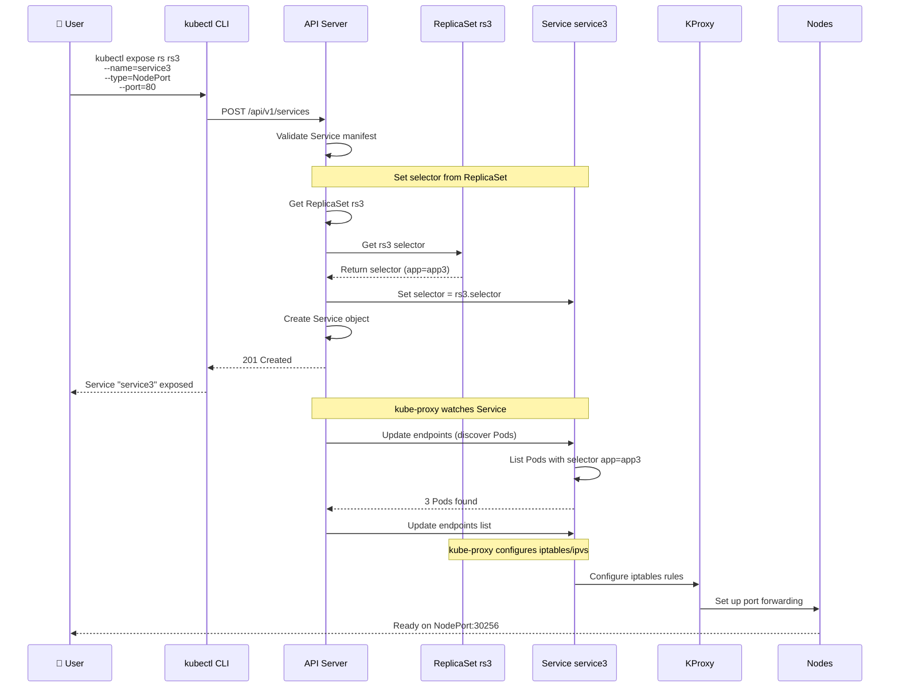
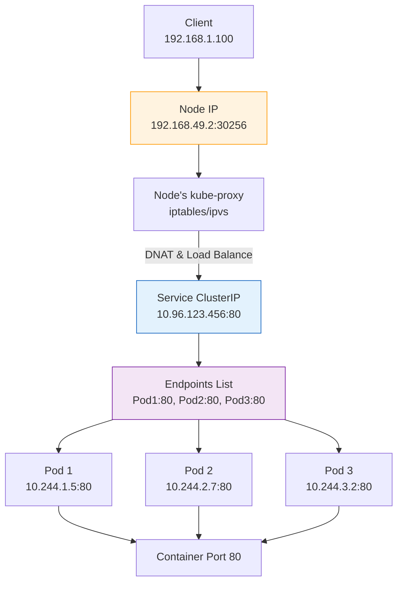
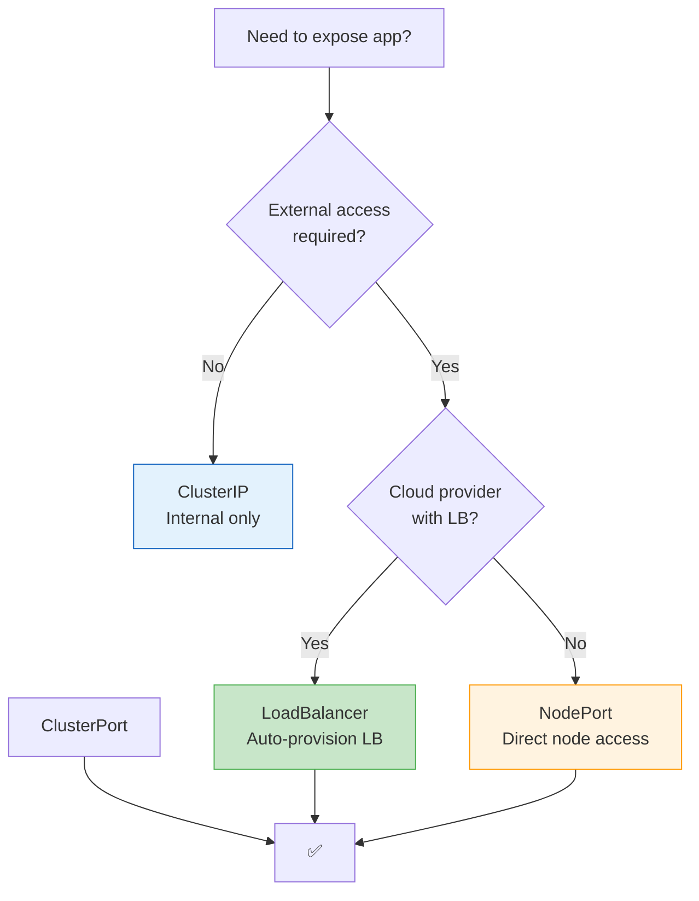

# Expose ReplicaSet Imperative - kubectl expose

Trong bài này, chúng ta sẽ học cách **expose** ReplicaSet ra bên ngoài thông qua Service bằng phương thức **Imperative** (sử dụng lệnh `kubectl expose`). Đây là cách nhanh để tạo Service cho ReplicaSet mà không cần viết YAML.

## 1. Tổng quan về Service

### Service là gì?

Service là abstraction (lớp trừu tượng) định nghĩa một **logical set of Pods** và policy để truy cập chúng. Service cung cấp:

- **Stable IP/DNS name**: Không thay đổi khi Pods scale hay restart
- **Load balancing**: Phân phối traffic giữa các Pods
- **Service discovery**: Pods có thể tìm nhau qua Service name
- **Port abstraction**: Cách mapping port từ external → internal

### Flowchart: Service Architecture

```mermaid
flowchart TD
    External[🌐 External Client<br/>minikube ip:NodePort<br/>or LoadBalancer IP] --> Service[Service<br/>ClusterIP:port<br/>(Virtual IP)]
    
    Service -->|Load Balance| Pod1[Pod 1<br/>IP:10.244.1.5<br/>ContainerPort:80]
    Service -->|Load Balance| Pod2[Pod 2<br/>IP:10.244.2.7<br/>ContainerPort:80]
    Service -->|Load Balance| Pod3[Pod 3<br/>IP:10.244.3.2<br/>ContainerPort:80]
    
    Pod1 -->|Round-robin| App[Container<br/>Application]
    Pod2 --> App
    Pod3 --> App
    
    style Service fill:#e3f2fd,stroke:#1565c0,stroke-width:2px
    style External fill:#f3e5f5,stroke:#7b1fa2
```

### Các loại Service

| Type | Cách hoạt động | Use case |
|------|----------------|----------|
| **ClusterIP** (default) | IP nội bộ, chỉ accessible trong cluster | Service-to-service communication |
| **NodePort** | Expose trên port của mỗi node (30000-32767) | Development, testing, on-prem |
| **LoadBalancer** | Tạo external load balancer (cloud provider) | Production external access (AWS ELB, GCP LB) |
| **ExternalName** | CNAME record đến external service | Integrate external services |

## 2. kubectl expose Command

### Cú pháp cơ bản

```bash
kubectl expose <resource-type> <resource-name> \
  --name=<service-name> \
  --type=<service-type> \
  --port=<service-port> \
  [--target-port=<container-port>] \
  [--protocol=<TCP|UDP>] \
  [--external-ip=<ip>]
```

**Parameters:**
- `<resource-type>`: replicaset, deployment, pod, etc.
- `<resource-name>`: Tên của resource cần expose
- `--name`: Tên Service (nếu không có, lấy từ resource name)
- `--type`: Loại Service (ClusterIP, NodePort, LoadBalancer, ExternalName)
- `--port`: Port của Service (port mà clients connect vào)
- `--target-port`: Port của container trong Pod (nếu khác với --port)
- `--protocol`: TCP hoặc UDP (default: TCP)

### Ví dụ: Expose ReplicaSet rs3 với NodePort

```bash
# Expose rs3 với NodePort
kubectl expose replicaset rs3 \
  --name=service3 \
  --type=NodePort \
  --port=80

# Nếu container chạy port 80 (như nginx), --target-port mặc định là --port
# Nếu container chạy port khác:
# kubectl expose replicaset rs3 --name=service3 --type=NodePort --port=80 --target-port=8080
```

**Kết quả:**
- Service `service3` được tạo với type `NodePort`
- Service port: `80` (internal)
- NodePort: ngẫu nhiên trong range 30000-32767 (ví dụ: `30256`)
- TargetPort: `80` (container port)
- Service selector = ReplicaSet selector (tự động)

### Sequence Diagram: kubectl expose Workflow



## 3. Demo Thực tế

### Setup: ReplicaSet rs3

```bash
# Đảm bảo rs3 đang chạy
kubectl get replicaset rs3
# NAME   DESIRED   CURRENT   READY
# rs3    3         3         3

# Kiểm tra Pods
kubectl get pods -l app=app3
# NAME          READY   STATUS    LABELS
# app3-manual  1/1     Running   app=app3,environment=production
# rs3-abcde    1/1     Running   app=app3,environment=staging
# rs3-fghij    1/1     Running   app=app3,environment=staging
# rs3-klmno    1/1     Running   app=app3,environment=staging
```

### Expose ReplicaSet

```bash
# Expose rs3 với NodePort
kubectl expose replicaset rs3 --name=service3 --type=NodePort --port=80

# Kiểm tra Service được tạo
kubectl get service service3
# NAME        TYPE       CLUSTER-IP      EXTERNAL-IP   PORT(S)        AGE
# service3    NodePort   10.96.123.456   <none>        80:30256/TCP   5s

# Xem chi tiết Service
kubectl describe service service3
```

**Output quan trọng:**
- `Type`: `NodePort`
- `ClusterIP`: `10.96.123.456` (IP nội bộ)
- `Port`: `80` (Service port)
- `TargetPort`: `80` (container port)
- `NodePort`: `30256` (port trên mỗi node)

### Kiểm tra Endpoints

Service sẽ tự động chọn tất cả Pods có labels khớp với ReplicaSet selector:

```bash
kubectl get endpoints service3
# NAME        ENDPOINTS                         AGE
# service3    10.244.1.5:80,10.244.2.7:80,10.244.3.2:80   10s

# Hoặc xem endpoint chi tiết
kubectl describe endpoints service3
```

**Endpoints** là danh sách IP:Port của tất cả Pods matching selector. Service sẽ load balance traffic đến các endpoint này.

### Truy cập ứng dụng

#### Cách 1: Dùng minikube service command

```bash
minikube service service3
# |-----------|----------------|-------------|---------------------------|
# | NAMESPACE |      NAME      | TARGET PORT |            URL            |
# |-----------|----------------|-------------|---------------------------|
# | default   |   service3     |        80   | http://192.168.49.2:30256 |
# |-----------|----------------|-------------|---------------------------|
# Starting to open the URL in your default browser...
```

Mở trình duyệt → Truy cập `http://192.168.49.2:30256` → Thấy ứng dụng chạy ở version 3.

#### Cách 2: Truy cập trực tiếp NodePort

```bash
# Lấy Minikube IP
minikube ip
# 192.168.49.2

# Truy cập NodePort
curl http://192.168.49.2:30256
# hoặc mở browser: http://192.168.49.2:30256
```

#### Cách 3: Port-forward (nếu không có NodePort)

```bash
kubectl port-forward service/service3 8080:80
# Truy cập: http://localhost:8080
```

## 4. Port Mapping trong NodePort

### Flowchart: Port Mapping



**Cấp trùng lặp:**

```
External Client → Node IP:NodePort (30256)
                ↓
            kube-proxy (on node)
                ↓
            Service ClusterIP:Port (10.96.123.456:80)
                ↓
            Endpoints (Pod IPs:80)
                ↓
            Container Port (80)
```

### Port ranges

- **Service port** (--port): Bất kỳ port nào (1-65535), thường dùng 80, 443, 8080
- **Target port** (--target-port): Container port (1-65535)
- **NodePort** (--node-port): Chỉ dùng với `--type=NodePort`, phải trong range 30000-32767 (có thể chỉ định cụ thể hoặc để Kubernetes tự chọn)

**Ví dụ với targetPort khác:**
```bash
# Container chạy port 8080, Service port 80, NodePort 30080
kubectl expose replicaset rs3 \
  --name=service3 \
  --type=NodePort \
  --port=80 \
  --target-port=8080

# Kết quả: Client connect → Node:30080 → Service:80 → Pod:8080
```

## 5. Làm thế nào Service tìm Pods?

Service **tự động** điền selector từ ReplicaSet (khi dùng `kubectl expose`). Bạn không cần chỉ định selector.

**Mechanism:**
```bash
# Khi bạn chạy: kubectl expose replicaset rs3 --name=service3 --port=80
# Kubernetes sẽ:
# 1. Lấy ReplicaSet rs3 definition
# 2. Lấy selector từ ReplicaSet spec.selector
# 3. Sao chép selector vào Service spec.selector
```

**Kiểm tra:**
```bash
# Xem ReplicaSet selector
kubectl get replicaset rs3 -o yaml | grep -A 5 selector

# Xem Service selector
kubectl get service service3 -o yaml | grep -A 5 selector

# Cả hai sẽ có selector giống nhau!
```

**Ví dụ:**
```yaml
# ReplicaSet rs3
selector:
  matchLabels:
    app: app3

# Service service3 (tự động tạo)
selector:
  app: app3  # Same as rs3
```

### Nếu muốn override selector?

Không thể với `kubectl expose`. Bạn phải tạo Service bằng YAML:

```yaml
apiVersion: v1
kind: Service
metadata:
  name: custom-service
spec:
  selector:
    app: myapp
    tier: frontend  # Custom selector, khác với ReplicaSet
  ports:
  - port: 80
    targetPort: 8080
  type: NodePort
```

## 6. Service Types Chi tiết

### ClusterIP (default)

```bash
kubectl expose replicaset rs3 --name=svc-cluster --port=80
# Type: ClusterIP
# Chỉ accessible trong cluster
# DNS: svc-cluster.default.svc.cluster.local
# Truy cập từ trong cluster: http://svc-cluster:80
```

**Use case:** Backend services, internal APIs

### NodePort

```bash
kubectl expose replicaset rs3 --name=svc-nodeport --type=NodePort --port=80
# Expose trên port của mỗi node (30000-32767)
# Truy cập: http://<node-ip>:<node-port>
```

**Use case:** Development, testing, on-premise, edge

**Flowchart: Choose Service Type**



### LoadBalancer (cloud)

```bash
kubectl expose replicaset rs3 --name=svc-lb --type=LoadBalancer --port=80
# Cloud provider tạo external load balancer
# External IP có thể mất vài phút
# Truy cập: http://<external-ip>:80
```

**Use case:** Production external access trên AWS/GCP/Azure

**Note:** Minikube không support LoadBalancer (trừ với addon `minikube tunnel`)

### ExternalName

```bash
kubectl create service external-name my-api --external-name=api.example.com
# Service trả về CNAME record
# Truy cập: http://my-api.default.svc.cluster.local → api.example.com
```

**Use case:** Redirect traffic đến external DNS

## 7. Demo Complete: rs3 với NodePort

### Steps tổng hợp

```bash
# 1. Cleanup
kubectl delete service service3 --ignore-not-found
kubectl delete replicaset rs3 --ignore-not-found

# 2. Tạo ReplicaSet rs3 (nếu chưa có)
kubectl apply -f - <<EOF
apiVersion: apps/v1
kind: ReplicaSet
metadata:
  name: rs3
spec:
  replicas: 3
  selector:
    matchLabels:
      app: app3
  template:
    metadata:
      labels:
        app: app3
        environment: staging
    spec:
      containers:
      - name: nginx
        image: nginx:latest
        ports:
        - containerPort: 80
EOF

# 3. Wait for Pods Running
kubectl get pods -l app=app3 -w

# 4. Expose ReplicaSet với NodePort
kubectl expose replicaset rs3 --name=service3 --type=NodePort --port=80

# 5. Kiểm tra Service
kubectl get service service3
kubectl describe service service3

# 6. Kiểm tra endpoints
kubectl get endpoints service3

# 7. Truy cập ứng dụng
minikube service service3  # Mở browser
# hoặc
curl http://$(minikube ip):$(kubectl get svc service3 -o jsonpath='{.spec.ports[0].nodePort}')
```

### Expected Output

```bash
$ kubectl get pods -l app=app3
NAME          READY   STATUS    AGE
rs3-abcde     1/1     Running   1m
rs3-fghij     1/1     Running   1m
rs3-klmno     1/1     Running   1m

$ kubectl get svc service3
NAME        TYPE       CLUSTER-IP      EXTERNAL-IP   PORT(S)        AGE
service3    NodePort   10.96.123.456   <none>        80:30256/TCP   30s

$ kubectl get endpoints service3
NAME        ENDPOINTS                         AGE
service3    10.244.1.5:80,10.244.2.7:80,10.244.3.2:80   30s

$ minikube service service3
|-----------|----------------|-------------|---------------------------|
| NAMESPACE |      NAME      | TARGET PORT |            URL            |
|-----------|----------------|-------------|---------------------------|
| default   |   service3     |        80   | http://192.168.49.2:30256 |
|-----------|----------------|-------------|---------------------------|
```

## 8. Expose với ClusterIP (internal only)

```bash
# Expose rs3 với ClusterIP (default)
kubectl expose replicaset rs3 --name=service3-cluster --port=80

# Service chỉ có ClusterIP, không có NodePort/LoadBalancer
kubectl get svc service3-cluster
# NAME               TYPE        CLUSTER-IP      EXTERNAL-IP   PORT(S)
# service3-cluster   ClusterIP   10.96.200.100   <none>        80:80/TCP

# Truy cập từ trong cluster:
# - Từ một Pod khác: curl http://service3-cluster:80
# - Từ node: curl http://10.96.200.100:80
# - Từ ngoài cluster: ❌ Không thể
```

## 9. Troubleshooting Service

### Issue 1: Service không có endpoints

**Symptom:**
```bash
kubectl get endpoints service3
# NAME        ENDPOINTS   AGE
# service3    <none>      1m
```

**Nguyên nhân:**
- Selector không khớp với bất kỳ Pod nào
- Pods không ở trạng thái Running/Ready
- Pods không có đúng labels

**Debug:**
```bash
# Kiểm tra Service selector
kubectl get svc service3 -o yaml | grep -A 5 selector

# Kiểm tra Pods với labels khớp
kubectl get pods -l <label-key>=<label-value>
# Hoặc dùng selector từ Service
kubectl get pods -l app=app3

# Kiểm tra Pod status
kubectl get pods -l app=app3
# Nếu STATUS không phải Running:
kubectl describe pod <pod-name>
```

**Fix:**
- Sửa selector (cần recreate Service, không edit được selector)
- Đảm bảo Pods Running và Ready (check probes)
- Gán đúng labels cho Pods

### Issue 2: Connection refused từ external client

**Symptom:** `curl http://<node-ip>:<node-port>` → Connection refused

**Nguyên nhân:**
- Firewall block port 30000-32767
- NodePort không mở trên node
- Pods không Running
- TargetPort sai

**Debug:**
```bash
# Kiểm tra NodePort đã được allocate chưa
kubectl get svc service3
# PORT(S) should show: 80:30256/TCP

# Kiểm tra kube-proxy chạy chưa
kubectl get pods -n kube-system | grep kube-proxy
# Hoặc trong Minikube: không có kube-proxy (dùng Docker networking)

# Kiểm tra endpoints
kubectl get endpoints service3

# Kiểm tra Pods
kubectl get pods -l app=app3

# Test từ trong cluster (từ một Pod)
kubectl run curl-test --image=radial/busyboxplus:curl -i --tty
# Inside Pod:
# curl http://service3:80
# curl http://service3-cluster:80
# exit
```

**Fix:**
- Mở firewall port: `sudo ufw allow 30256` (Linux) hoặc pf rules (macOS)
- Đảm bảo targetPort đúng
- Khởi động lại kube-proxy nếu cần

### Issue 3: Pods không được load balance

**Symptom:** Có endpoints nhưng một Pod không nhận traffic

**Nguyên nhân:**
- Pod readiness probe fail → Pod không trong Ready state
- Session affinity (clientIP) đang dùng
- kube-proxy iptables rules stale

**Debug:**
```bash
# Kiểm tra Pod conditions
kubectl get pods -l app=app3
# READY column: 1/1 (good), 0/1 (not ready)

# Kiểm tra readiness probe
kubectl describe pod <pod-name> | grep -A 10 "Readiness"

# Kiểm tra Service sessionAffinity
kubectl get svc service3 -o yaml | grep sessionAffinity
# Mặc định: None

# Flush iptables (Minikube không cần)
# sudo iptables -F -t nat
```

**Fix:**
- Fix readiness probe
- Đặt `sessionAffinity: None`
- Restart kube-proxy hoặc flush iptables

### Flowchart: Service Troubleshooting

```mermaid
flowchart TD
    Start[Service issue] --> Access{Access from<br/>internal/external?}
    
    Access -->|Internal| Cluster[ClusterIP<br/>access issue]
    Access -->|External| External[NodePort/LB<br/>access issue]
    
    Cluster --> CheckEndpoints[Check endpoints<br/>kubectl get ep]
    CheckEndpoints --> EndpointsEmpty{Endpoints<br/>empty?}
    EndpointsEmpty -->|Yes| CheckSelector[Check selector & labels]
    EndpointsEmpty -->|No| CheckPod[Check Pods ready?]
    
    CheckSelector --> FixSelector[Fix selector/labels]
    CheckPod --> NotReady{Pods Ready?}
    NotReady -->|No| Probe[Fix readiness probe]
    NotReady -->|Yes| DNS[Check DNS/service name]
    
    Probe --> Verify[Verify fix]
    FixSelector --> Verify
    DNS --> Verify2[Check CoreDNS<br/>kubectl get pods -n kube-system]
    
    Verify --> Wait[Wait for endpoints update]
    Wait --> Test[Test again]
    Verify2 --> Wait2[Wait for DNS cache]
    Wait2 --> Test2[Test again]
    
    External --> CheckNodePort[Check NodePort<br/>kubectl get svc]
    CheckNodePort --> ValidPort{NodePort<br/>valid?}
    ValidPort -->|No| Allocate[Specify nodePort<br/>or delete & recreate]
    ValidPort -->|Yes| CheckFirewall[Check firewall<br/>iptables/nftables]
    
    CheckFirewall --> Blocked{Port blocked?}
    Blocked -->|Yes| OpenPort[Open firewall port]
    Blocked -->|No| CheckEndpoints2[Check endpoints<br/>(same as above)]
    
    OpenPort --> TestExternal[Test external access]
    CheckEndpoints2 --> PodsRunning{Pods<br/>Running?}
    PodsRunning -->|No| StartPods[Fix Pods]
    PodsRunning -->|Yes| NodeNetwork[Check node network<br/>minikube ip]
    
    StartPods --> TestExternal
    NodeNetwork --> TestExternal
    
    Test --> Success[✅ Works]
    TestExternal --> Success
    
    style Success fill:#c8e6c9,stroke:#4caf50
    style Start fill:#e3f2fd,stroke:#1565c0
    style EndpointsEmpty fill:#ffebee,stroke:#f44336
```

## 10. Imperative vs Declarative với Service

**Imperative** (`kubectl expose`):
```bash
kubectl expose replicaset rs3 --name=service3 --type=NodePort --port=80
```
- Nhanh, tức thời
- Khó version control
- Khó reproduce
- Không lưu history
- **Use case**: Testing, debugging, learning

**Declarative** (YAML):
```yaml
apiVersion: v1
kind: Service
metadata:
  name: service3
spec:
  selector:
    app: app3
  ports:
  - port: 80
    targetPort: 80
    nodePort: 30080  # Optional
  type: NodePort
```
```bash
kubectl apply -f service.yaml
```
- Version control được (git)
- Dễ reproduce
- Có history (kubectl rollout)
- Team collaboration tốt
- **Use case**: Production, GitOps, CI/CD

**Khuyến nghị:** Dùng Declarative cho production, Imperative cho quick testing.

## 11. Cleanup

```bash
# Xóa Service
kubectl delete service service3

# Xóa ReplicaSet (cascading delete sẽ xóa Pods)
kubectl delete replicaset rs3

# Xóa tất cả
kubectl delete all -l app=app3
```

## 12. Best Practices

1. **Dùng Declarative cho production**
   ```bash
   # ✅ YAML in git
   kubectl apply -f service.yaml
   ```

2. **Label strategy nhất quán**
   ```yaml
   metadata:
     labels:
       app: myapp
       tier: frontend
   selector:
     matchLabels:
       app: myapp
       tier: frontend
   ```

3. **Chọn đúng Service type**
   - ClusterIP: Internal
   - NodePort: Dev/on-prem
   - LoadBalancer: Cloud production

4. **NodePort range**
   - Đặt nodePort cụ thể nếu cần: `--node-port=30080`
   - Hoặc để Kubernetes auto-allocate (recommended)

5. **Port conventions**
   ```yaml
   ports:
   - name: http
     port: 80        # Service port
     targetPort: 8080 # Container port
     nodePort: 30080 # Optional
   ```

6. **ExternalTrafficPolicy** cho NodePort/LoadBalancer
   ```yaml
   spec:
     externalTrafficPolicy: Local  # Preserve client IP, but may have uneven load
   ```

7. **Session affinity**
   ```yaml
   spec:
     sessionAffinity: ClientIP  # Sticky sessions
     sessionAffinityConfig:
       clientIP:
         timeoutSeconds: 10800
   ```

8. **Readiness probe bắt buộc** với Service
   - Pods không Ready sẽ bị loại khỏi endpoints
- Đảm bảo traffic chỉ đến Pods sẵn sàng

9. **Health check endpoints**
   ```yaml
   ports:
   - name: http
     port: 80
     targetPort: 8080
   # Dùng readiness probe để kiểm tra /health
   ```

10. **Monitor Service endpoints**
    ```bash
    # Watch endpoints count
    kubectl get endpoints service3 -w
    ```

## 13. Tóm tắt

- **Service** cung cấp stable endpoint và load balancing cho Pods
- **kubectl expose**: Cách imperative nhanh để tạo Service
- **Service types**: ClusterIP (internal), NodePort (dev), LoadBalancer (cloud)
- **Port mapping**: NodePort → Service Port → TargetPort → Container Port
- **Selector**: Tự động lấy từ ReplicaSet khi expose
- **Endpoints**: Danh sách Pod IPs matching selector
- **Access**: minikube service, curl <node-ip>:<node-port>
- **Troubleshooting**: Check endpoints, Pod labels, Pod status, firewall
- **Best practice**: Dùng Declarative (YAML) cho production, Imperative cho testing

---

**Bài học tiếp theo:** Chúng ta sẽ học cách expose ReplicaSet bằng **Declarative way** (YAML manifests) và so sánh imperative vs declarative chi tiết hơn.

Cảm ơn các bạn đã theo dõi! Hẹn gặp lại trong bài tiếp theo.
