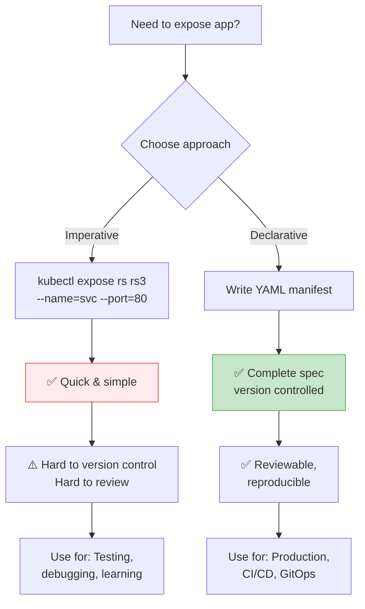
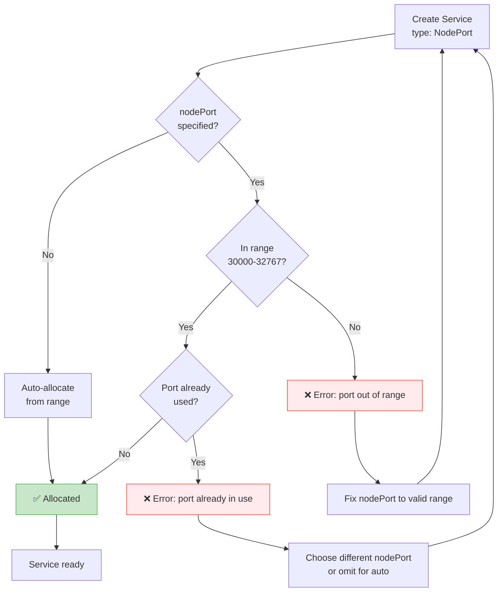
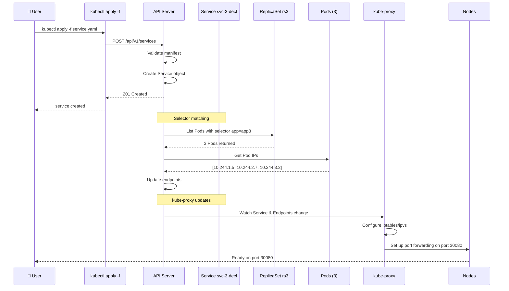

# Expose NodePort ReplicaSet - Declarative Way

Trong bài trước chúng ta đã học cách expose ReplicaSet bằng **Imperative** (`kubectl expose`). Trong bài này, chúng ta sẽ học cách làm điều tương tự bằng phương thức **Declarative** - tạo Service từ YAML manifest.

## 1. Imperative vs Declarative với Service

### Imperative (Lệnh trực tiếp)

```bash
kubectl expose replicaset rs3 --name=service3 --type=NodePort --port=80
```

**Ưu điểm:**
- Nhanh, gọn, dễ nhớ
- Không cần viết YAML

**Nhược điểm:**
- Không dễ version control (git)
- Khó reproduce chính xác (NodePort tự động random)
- Không lưu được cấu hình chi tiết
- Dễ quên tham số
- Không collaborative tốt

### Declarative (YAML Manifest)

```yaml
# service-nodeport.yaml
apiVersion: v1
kind: Service
metadata:
  name: service3
spec:
  selector:
    app: app3
  ports:
  - port: 80
    targetPort: 80
    nodePort: 30080
  type: NodePort
```

```bash
kubectl apply -f service-nodeport.yaml
```

**Ưu điểm:**
- Version control hoàn toàn (git)
- Reproducible (chạy lại đúng kết quả)
- Có thể review changes (pull request)
- Collaborative tốt
- GitOps friendly
- Có thể commit để audit trail

**Nhược điểm:**
- Cần viết YAML
- Nhiều file hơn

### Flowchart: Imperative vs Declarative



## 2. Service YAML Structure

### Full Service Manifest

```yaml
apiVersion: v1           # Required: API group/version
kind: Service            # Required: Resource type
metadata:                # Required: Object metadata
  name: service3         # Required: Service name
  namespace: default     # Optional: default if omitted
  labels:                # Optional: Service labels
    app: myapp
    tier: frontend
  annotations:           # Optional: Annotations
    description: "NodePort service for rs3"
spec:                    # Required: Service specification
  selector:              # Required: Label selector to find Pods
    app: app3
  ports:                 # Required: At least one port
  - name: http           # Optional: Port name
    protocol: TCP        # Optional: TCP (default) or UDP
    port: 80             # Required: Service port (cluster IP)
    targetPort: 80       # Required: Container port in Pod
    nodePort: 30080      # Optional: NodePort (30000-32767 for type=NodePort)
  type: NodePort         # Required: Service type (ClusterIP, NodePort, LB, ExternalName)
  externalIPs:           # Optional: Additional external IPs
  - 192.168.1.100
  sessionAffinity: None  # Optional: None or ClientIP
  externalTrafficPolicy: Cluster  # Optional: Cluster or Local
```

### Mỗi trường là gì?

| Field | Required? | Mô tả |
|-------|-----------|-------|
| `apiVersion: v1` | Yes | API version của Service (luôn v1) |
| `kind: Service` | Yes | Resource type |
| `metadata.name` | Yes | Tên Service (DNS-compatible: lowercase, no spaces) |
| `spec.selector` | Yes | Map của labels để chọn Pods (ví dụ: `app: nginx`) |
| `spec.ports[].port` | Yes | Port của Service (internal cluster IP) |
| `spec.ports[].targetPort` | Yes | Port của container trong Pod |
| `spec.type` | No (default: ClusterIP) | Loại Service |

### Minimal Service Manifest

```yaml
apiVersion: v1
kind: Service
metadata:
  name: service3
spec:
  selector:
    app: app3
  ports:
  - port: 80
    targetPort: 80
  type: NodePort
```

**Khi apply manifest này:**
- Service `service3` được tạo với type `NodePort`
- Kubernetes tự động chọn một `nodePort` ngẫu nhiên trong range 30000-32767
- Selector `app: app3` sẽ match tất cả Pods có label đó ( bao gồm cả Pods từ ReplicaSet rs3)

## 3. NodePort Specific Rules

### NodePort range

- **Range**: 30000 - 32767 (inclusive)
- **Default**: Kubernetes tự động allocate nếu không chỉ định
- **Specify**: Có thể chỉ định nodePort cụ thể trong manifest

```yaml
ports:
- port: 80
  targetPort: 80
  nodePort: 30080  # Must be in range 30000-32767
```

### Flowchart: NodePort Validation



**Lỗi thường gặp:**
```bash
$ kubectl apply -f service.yaml
Error from server (Invalid): error when creating "service.yaml": 
Service "service3" is invalid: [spec.ports[0].nodePort: Invalid value: 32000: provided NodePort is already allocated]

# Fix: Dùng nodePort khác hoặc bỏ trường nodePort để auto-allocate
```

**Chỉ định nodePort cụ thể:**
```yaml
ports:
- port: 80
  targetPort: 80
  nodePort: 30080  # Chỉ định cụ thể (phải có service.yaml mới biết trước)
```

**Auto-allocate:**
```yaml
ports:
- port: 80
  targetPort: 80
# Không có nodePort → Kubernetes tự chọn
```

## 4. Demo: Declarative Service cho ReplicaSet rs3

### Setup: ReplicaSet rs3 (đã có từ bài trước)

```bash
# Đảm bảo rs3 đang chạy
kubectl get replicaset rs3
# NAME   DESIRED   CURRENT   READY
# rs3    3         3         3

# Kiểm tra Pods
kubectl get pods -l app=app3 -o wide
```

### Tạo Service Manifest

**File: `service-nodeport.yaml`**

```yaml
apiVersion: v1
kind: Service
metadata:
  name: service3-declarative
  labels:
    app: app3
    tier: frontend
spec:
  selector:
    app: app3  # Match ReplicaSet rs3's Pod labels
  ports:
  - name: http
    protocol: TCP
    port: 80          # Service port (ClusterIP)
    targetPort: 80    # Pod/container port
    nodePort: 30080   # NodePort (optional: 30000-32767)
  type: NodePort
  externalTrafficPolicy: Cluster
  sessionAffinity: None
```

**Lưu ý:**
- `selector.app: app3` khớp với labels của Pods từ rs3
- `targetPort: 80` - container port (như trong Pod spec)
- `nodePort: 30080` - cụ thể, dễ nhớ (khác với imperative auto-random)

### Apply Manifest

```bash
# Apply Service manifest
kubectl apply -f service-nodeport.yaml

# Kiểm tra
kubectl get service service3-declarative
# NAME                  TYPE       CLUSTER-IP      EXTERNAL-IP   PORT(S)        AGE
# service3-declarative  NodePort   10.96.150.200   <none>        80:30080/TCP   5s

# Xem chi tiết
kubectl describe service service3-declarative
```

**Output quan trọng:**
```
Name:                     service3-declarative
Namespace:                default
Labels:                   app=app3
                          tier=frontend
Selector:                 app=app3
Type:                     NodePort
IP:                       10.96.150.200
Port:                     <unset>  80/TCP
TargetPort:               80/TCP
NodePort:                 <unset>  30080/TCP
Endpoints:                10.244.1.5:80,10.244.2.7:80,10.244.3.2:80
Session Affinity:         None
External Traffic Policy:  Cluster
```

### Kiểm tra Endpoints

```bash
# Endpoints tự động điền với Pods matching selector
kubectl get endpoints service3-declarative
# NAME                     ENDPOINTS                         AGE
# service3-declarative     10.244.1.5:80,10.244.2.7:80,10.244.3.2:80   10s

# Xem endpoints chi tiết
kubectl describe endpoints service3-declarative
```

### Sequence Diagram: Declarative Service Creation



### Truy cập ứng dụng

```bash
# Lấy Minikube IP
minikube ip
# 192.168.49.2

# Truy cập NodePort
curl http://192.168.49.2:30080
# Hoặc mở browser: http://192.168.49.2:30080

# Dùng minikube service
minikube service service3-declarative
# → Mở browser với URL có sẵn
```

**Kết quả:** Thấy ứng dụng chạy ở version 3 (từ rs3 Pods).

## 5. Declarative với Multiple Ports

Service hỗ trợ nhiều ports trong cùng một Service.

```yaml
apiVersion: v1
kind: Service
metadata:
  name: multi-port-service
spec:
  selector:
    app: myapp
  ports:
  - name: http
    port: 80
    targetPort: 8080
    nodePort: 30080
  - name: https
    port: 443
    targetPort: 8443
    nodePort: 30443
  - name: metrics
    port: 9090
    targetPort: 9090
    # No nodePort - only cluster internal
  type: NodePort
```

**Kết quả:**
```bash
kubectl get svc multi-port-service
# NAME                TYPE       CLUSTER-IP      EXTERNAL-IP   PORT(S)                         AGE
# multi-port-service  NodePort   10.96.180.100   <none>        80:30080/TCP,443:30443/TCP,9090:TCP  10s
```

- Port 80 → 8080 (NodePort 30080)
- Port 443 → 8443 (NodePort 30443)
- Port 9090 → 9090 (không có NodePort, internal only)

## 6. Declarative với ClusterIP (internal only)

```yaml
apiVersion: v1
kind: Service
metadata:
  name: service3-cluster
spec:
  selector:
    app: app3
  ports:
  - port: 80
    targetPort: 80
  type: ClusterIP  # Default nếu bỏ
```

```bash
kubectl apply -f service-cluster.yaml
kubectl get svc service3-cluster
# NAME            TYPE        CLUSTER-IP      EXTERNAL-IP   PORT(S)
# service3-cluster  ClusterIP   10.96.200.100   <none>        80:80/TCP
```

**Truy cập từ trong cluster:**
```bash
# Từ một Pod khác
kubectl run curl-test --image=radial/busyboxplus:curl -i --tty
# Inside Pod:
curl http://service3-cluster:80  # DNS name: <service-name>.<namespace>.svc.cluster.local
curl http://service3-cluster.default.svc.cluster.local:80
exit
```

**Truy cập từ ngoài:** ❌ Không thể (no external IP)

## 7. Troubleshooting Declarative Service

### Issue 1: Invalid NodePort

**Symptom:**
```bash
$ kubectl apply -f service.yaml
Error from server (Invalid): error when creating "service.yaml": 
Service "service3" is invalid: [spec.ports[0].nodePort: Invalid value: 40000: provided NodePort 40000 is outside the valid range of 30000-32767]
```

**Fix:**
```yaml
# ❌ Wrong
nodePort: 40000

# ✅ Correct
nodePort: 30080  # Within 30000-32767
```

**Hoặc bỏ trường nodePort để tự động allocate:**
```yaml
ports:
- port: 80
  targetPort: 80
  # No nodePort specified
```

### Issue 2: Port Already Allocated

```bash
Error from server (Invalid): error when creating "service.yaml":
Service "service3" is invalid: [spec.ports[0].nodePort: Invalid value: 30080: provided NodePort is already allocated]
```

**Fix:**
```yaml
# Chọn nodePort khác chưa dùng
nodePort: 30081

# Kiểm tra NodePort đã dùng chưa
kubectl get svc --all-namespaces -o json | jq '.items[].spec.ports[].nodePort' | sort -n
```

### Issue 3: Service không có endpoints

```bash
kubectl get endpoints service3-declarative
# NAME                     ENDPOINTS   AGE
# service3-declarative     <none>      5s
```

**Debug:**
```bash
# 1. Kiểm tra selector
kubectl get svc service3-declarative -o yaml | grep -A 5 selector
# selector:
#   app: app3

# 2. Kiểm tra Pods có labels matching không
kubectl get pods -l app=app3
# NAME          READY   STATUS    LABELS
# rs3-abcde     1/1     Running   app=app3,environment=staging

# Nếu không có Pods: labels không khớp
# Fix: Sửa selector trong service.yaml hoặc gán labels cho Pods

# 3. Kiểm tra Pod status
kubectl get pods -l app=app3
# Nếu STATUS không Running:
kubectl describe pod <pod-name>
# Kiểm tra lỗi: image pull, insufficient resources, etc.

# 4. Kiểm tra readiness probe
kubectl describe pod <pod-name> | grep -A 10 "Readiness"
# Nếu readiness probe fail → Pod không Ready → không vào endpoints
```

**Fix:**
- Sửa selector để khớp với Pod labels
- Đảm bảo Pods Running và Ready
- Fix readiness probe nếu cần

### Issue 4: Endpoints chưa update ngay

**Symptom:** Vừa tạo Service nhưng `kubectl get endpoints` chưa có IPs.

**Nguyên nhân:**
- Endpoint controller đang sync (mất vài giây)
- Caching

**Debug:**
```bash
# Wait 5-10 seconds, then re-check
kubectl get endpoints service3-declarative -w  # watch mode
```

**Fix:** Chờ hoặc describe để xem events:
```bash
kubectl describe endpoints service3-declarative
```

### Flowchart: Service Troubleshooting (Declarative)

```mermaid
flowchart TD
    Start[Service created<br/>but not working?] --> CheckApply[kubectl apply successful?]
    CheckApply -->|No| FixManifest[Fix manifest YAML<br/>kubectl apply again]
    CheckApply -->|Yes| CheckGet[kubectl get svc]
    
    CheckGet --> NoService{Service exists?}
    NoService -->|No| WaitCreate[Wait a few seconds<br/>kubectl get svc -w]
    NoService -->|Yes| CheckType[Check spec.type]
    
    CheckType --> NodePort[NodePort]
    CheckType --> ClusterIP[ClusterIP]
    
    NodePort --> CheckNodePort{Check<br/>nodePort?}
    CheckNodePort -->|Invalid| FixPort[Fix nodePort range<br/>30000-32767]
    CheckNodePort -->|Valid| CheckEndpoints[Check endpoints]
    
    ClusterIP --> CheckEndpoints
    
    CheckEndpoints --> NoEP{Endpoints<br/>(kubectl get ep)?}
    NoEP -->|Empty| Selector{Selector matches<br/>Pod labels?}
    Selector -->|No| FixSelector[Fix selector in YAML<br/>kubectl apply -f]
    Selector -->|Yes| PodStatus{Pods Running<br/>& Ready?}
    
    PodStatus -->|No| FixPod[Fix Pod issues<br/>kubectl describe pod]
    PodStatus -->|Yes| WaitSync[Wait endpoint sync<br/>(~10 seconds)]
    
    WaitSync --> Recheck[Re-check endpoints]
    Recheck --> Done
    
    FixPort --> Reapply[kubectl apply -f]
    FixSelector --> Reapply
    FixPod --> Reapply
    WaitSync --> Done
    
    Recheck --> Done
    
    Done --> Success[✅ Service working]
    
    style Success fill:#c8e6c9,stroke:#4caf50
    style FixManifest fill:#fff3cd,stroke:#ff9800
    style FixPort fill:#ffebee,stroke:#f44336
```

## 8. Declarative Workflow Best Practices

### 1. One Service per file (recommended)

```bash
service-nodeport.yaml
service-cluster.yaml
service-lb.yaml
```

**Pros:** Modular, reusable, easy to manage

### 2. Or combine multiple Services in one file

```yaml
# services.yaml
---
apiVersion: v1
kind: Service
metadata:
  name: frontend-service
spec:
  selector:
    app: myapp
    tier: frontend
  ports:
  - port: 80
    targetPort: 8080
    nodePort: 30080
  type: NodePort
---
apiVersion: v1
kind: Service
metadata:
  name: backend-service
spec:
  selector:
    app: myapp
    tier: backend
  ports:
  - port: 5432
    targetPort: 5432
  type: ClusterIP
```

**Apply:** `kubectl apply -f services.yaml`

### 3. Use `kubectl create` dry-run to generate YAML

```bash
# Generate YAML without creating
kubectl expose replicaset rs3 --name=service3 --type=NodePort --port=80 --dry-run=client -o yaml > service.yaml

# Edit the generated YAML (add nodePort, labels, etc.)
vim service.yaml

# Then apply
kubectl apply -f service.yaml
```

**Advantage:** Don't have to remember YAML structure

### 4. Use `kubectl explain` to understand fields

```bash
# Explore Service spec
kubectl explain service.spec
kubectl explain service.spec.ports
kubectl explain service.spec.ports.nodePort

# Get details
kubectl explain service.spec.ports.nodePort --recursive
```

### 5. Validate YAML before applying

```bash
# Check YAML syntax
yamllint service.yaml

# Dry-run validate (no changes made)
kubectl apply -f service.yaml --dry-run=client --validate=true

# If no output → valid
```

### 6. Use consistent naming

```yaml
metadata:
  name: myapp-service  # Clear, descriptive
  # or
  name: myapp-svc      # Common abbreviation
```

### 7. Version control your manifests

```bash
git init
git add service.yaml
git commit -m "Add NodePort service for ReplicaSet rs3"
git push origin main
```

### 8. Use kustomize or Helm for templating (advanced)

**Kustomize:**
```yaml
# kustomization.yaml
resources:
- service.yaml

patchesStrategicMerge:
- service-patch.yaml

# service-patch.yaml can change nodePort, replica count, etc.
```

**Helm:**
```bash
helm create myapp
# Edit templates/service.yaml with Go template variables
helm install myapp ./myapp --set service.nodePort=30080
```

## 9. Imperative vs Declarative Side-by-Side

| Task | Imperative | Declarative |
|------|-----------|-------------|
| Create Service | `kubectl expose rs rs3 --name=svc --port=80` | YAML + `kubectl apply -f` |
| NodePort | Auto-random (mỗi lần khác) | Specify exact value (reproducible) |
| Version Control | ❌ Không | ✅ Yes (YAML files) |
| Review | Khó | Dễ (pull request) |
| Change | Edit inline | Edit YAML, apply again |
| Audit Trail | Không có | Git history |
| Collaboration | Khó (share commands) | Dễ (share manifests) |
| Production | ❌ Avoid | ✅ Recommended |

**Kết luận:** Production nên dùng Declarative. Imperative chỉ cho testing/learning.

## 10. Cleanup

```bash
# Xóa Service
kubectl delete service service3-declarative
# Hoặc
kubectl delete -f service-nodeport.yaml

# Xóa tất cả Services với label
kubectl delete service -l app=app3

# Xóa tất cả trong namespace (cẩn thận!)
kubectl delete all --all
```

## 11. Complete Workflow Example

### Step 1: Create ReplicaSet (declarative)

```yaml
# replicaset.yaml
apiVersion: apps/v1
kind: ReplicaSet
metadata:
  name: rs3
spec:
  replicas: 3
  selector:
    matchLabels:
      app: app3
  template:
    metadata:
      labels:
        app: app3
    spec:
      containers:
      - name: nginx
        image: nginx:latest
        ports:
        - containerPort: 80
```

```bash
kubectl apply -f replicaset.yaml
kubectl get replicaset rs3
kubectl get pods -l app=app3 -o wide
```

### Step 2: Create Service (declarative)

```yaml
# service.yaml
apiVersion: v1
kind: Service
metadata:
  name: service3
spec:
  selector:
    app: app3
  ports:
  - port: 80
    targetPort: 80
    nodePort: 30080
  type: NodePort
```

```bash
kubectl apply -f service.yaml
kubectl get svc service3
kubectl get endpoints service3
```

### Step 3: Access Application

```bash
minikube ip
# 192.168.49.2

curl http://192.168.49.2:30080
# Nginx default page

# Hoặc
minikube service service3
```

### Step 4: Update/Change Service

```bash
# Edit YAML
vim service.yaml
# Change nodePort to 30081 or add another port

# Re-apply (kubectl apply is idempotent)
kubectl apply -f service.yaml

# Verify
kubectl get svc service3
```

### Step 5: Delete

```bash
kubectl delete -f service.yaml
# Hoặc
kubectl delete service service3

# Delete ReplicaSet (cascading delete Pods)
kubectl delete -f replicaset.yaml
```

## 12. Tóm tắt

- **Declarative** dùng YAML manifest để tạo Service
- **Structure**: `apiVersion: v1`, `kind: Service`, `metadata`, `spec.selector`, `spec.ports[]`, `spec.type`
- **Ports**: `port` (Service port), `targetPort` (Container port), `nodePort` (Node port, optional)
- **NodePort**: Range 30000-32767, specify for reproducibility
- **Selector**: Auto-match Pods với labels
- **Workflow**: Write YAML → `kubectl apply -f` → Service created → Endpoints auto-filled
- **Troubleshooting**: Check selector, Pod labels, Pod status, NodePort range
- **Best practice**: Version control YAML, use declarative for production, imperative for testing

---

**Lời khuyên:** Dùng `kubectl expose --dry-run=client -o yaml` để generate YAML skeleton, sau đó customize. Commit YAML files vào git để track changes và collaborative với team.

Cảm ơn các bạn đã theo dõi! Hẹn gặp lại trong bài tiếp theo (Deployment introduction).
