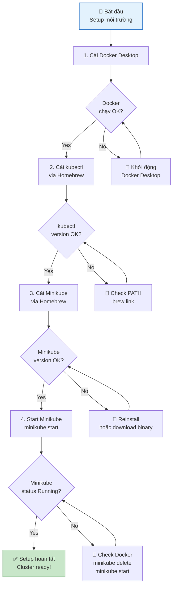
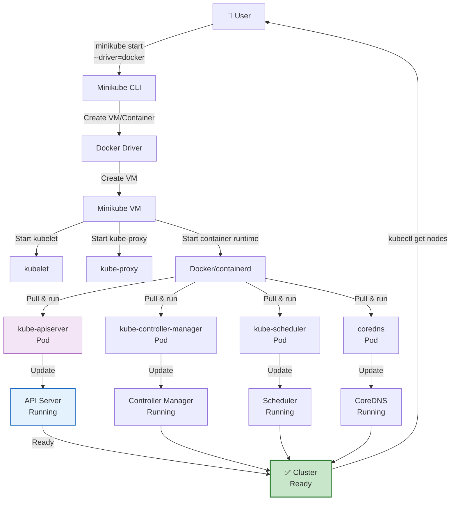

# Hướng dẫn cài đặt Docker, kubectl và Minikube trên macOS

Đây là hướng dẫn tóm tắt theo nội dung video mà bạn đã ghi lại. Mục tiêu là thiết lập môi trường Kubernetes local bằng Docker + Minikube, kèm theo những lệnh kiểm tra cơ bản.

### Flowchart: Thiết lập môi trường Kubernetes Local



---

## 1\. Cài Docker Desktop

1.  Truy cập: [https://www.docker.com/get-started](https://www.docker.com/get-started)
2.  Chọn phiên bản phù hợp với máy của bạn:
    -   Apple Silicon (M1/M2/M3): chọn bản ARM
    -   Intel: chọn bản Intel
3.  Tải xuống và cài đặt Docker Desktop.
4.  Khởi động Docker Desktop và xác nhận Docker chạy thành công.

### Kiểm tra

```bash
docker --version
docker info
```

> Nếu `docker --version` trả về phiên bản như `Docker version 25.x.x`, là đã cài thành công.

## 2\. Tạo tài khoản Docker Hub (tuỳ chọn nhưng khuyến khích)

1.  Vào [https://hub.docker.com](https://hub.docker.com)
2.  Đăng ký tài khoản miễn phí
3.  Bạn có thể dùng Docker Hub để lưu image và chia sẻ container

## 3\. Kiểm tra các lệnh Docker cơ bản

### Danh sách image

```bash
docker images
```

### Danh sách container đang chạy

```bash
docker ps
```

### Chạy container demo

```bash
docker run -d -p 8081:8080 --name demo-app vietaws/arm:v1
```

> Container này sẽ chạy một ứng dụng Node.js/Express trên cổng 8080, và bạn có thể truy cập qua `http://localhost:8081`.

#### Thông tin chi tiết về demo-app

**Ứng dụng**: `simple-app@1.0.0` - Demo application với các tính năng:

-   Node.js 20.12.2 + Express 4.19.2
-   Kết nối PostgreSQL và AWS DynamoDB
-   RESTful API với CRUD operations
-   Volume: `./data` và `./cache` (persistent storage)

**Các API endpoints chính:**

| Endpoint | Method | Mô tả |
| --- | --- | --- |
| `/` | GET | Trang chủ - hiển thị thông tin container |
| `/students` | GET/POST/PUT/DELETE | CRUD sinh viên (PostgreSQL) |
| `/users` | GET | Danh sách users (hard-coded) |
| `/users/:id` | GET | Lấy user theo ID |
| `/users` | POST | Echo request body |
| `/secrets/users` | GET | API bí mật (demo) |
| `/write-logs` | POST | Ghi log vào `./data/logs.txt` |
| `/write-cache` | POST | Ghi vào cache `./cache/tmp.txt` |
| `/call-dynamodb?id=100` | GET | Lấy item từ DynamoDB |

**Kiểm tra ứng dụng:**

1.  Truy cập trang chủ:
    
    ```bash
    curl http://localhost:8081/
    ```
    
2.  Lấy danh sách users:
    
    ```bash
    curl http://localhost:8081/users
    ```
    
3.  Xem log container:
    
    ```bash
    docker logs demo-app
    ```
    
4.  Test vào shell container:
    
    ```bash
    docker exec -it demo-app /bin/sh
    ```
    
    Trong container, bạn có thể:
    
    ```bash
    ls -la /app              # Xem source code
    cat /app/package.json    # Xem dependencies
    curl localhost:8080      # Test API từ bên trong
    env                      # Xem environment variables
    ```
    

**Lưu ý:** Database (PostgreSQL, DynamoDB) được cấu hình nhưng cần có service chạy mới hoạt động đầy đủ.

### Vào shell container

```bash
docker exec -it demo-app /bin/sh
```

> Các lệnh thường dùng bên trong container:

```bash
# 1. Xem thư mục và file
ls -la
pwd
# 2. Xem process đang chạy
ps aux
# 3. Xem log ứng dụng (nếu có)
cat /var/log/app.log # hoặc đường dẫn log cụ thể
# 4. Kiểm tra môi trường
env
# 5. Test kết nối mạng (ví dụ kiểm tra nginx)
curl localhost:8080
# 6. Xem file config (nếu container có)
cat /etc/nginx/nginx.conf # ví dụ với nginx
# Thoát khỏi container:
exit # Hoặc nhấn Ctrl + D

# Lưu ý: Những thay đổi bạn làm bên trong container sẽ bị mất nếu container bị dừng và xóa (trừ khi bạn commit thành image mới). Container được thiết kế để là môi trường ephemeral (tạm thời).
```

### Dừng và xóa container

```bash
docker stop demo-app
docker rm demo-app
```

## 4\. Cài `kubectl`

### Cài bằng Homebrew

```bash
brew install kubectl
```

### Kiểm tra

```bash
kubectl version --client
```

## 5\. Cài `minikube`

### Cài bằng Homebrew

```bash
brew install minikube
```

### Hoặc tải binary từ trang chính thức

-   Tải phù hợp với architecture của macOS (ARM hoặc x86)

### Kiểm tra

```bash
minikube version
```

## 6\. Khởi tạo cluster Minikube

### Flowchart: Minikube Cluster Bootstrapping



### Khởi chạy cluster

```bash
minikube start --driver=docker
```

### Kiểm tra trạng thái

```bash
minikube status
kubectl get nodes
kubectl get pods -A
```

> Minikube sẽ tạo một cluster local. Bạn sẽ thấy các pod hệ thống như `kube-apiserver`, `kube-controller-manager`, `kube-scheduler`, `kube-proxy`, và `coredns`.

## 7\. Mở Dashboard Minikube

```bash
minikube dashboard
```

Dashboard sẽ mở ra trong trình duyệt, giúp bạn xem trực quan các resource Kubernetes.

## 8\. Gợi ý thực hành tiếp theo

-   Tạo namespace mới
    
    ```bash
     kubectl create namespace rom-myapp
    ```
    
-   Triển khai một deployment đơn giản
    
    ```bash
    kubectl create deployment hello-nginx --image=nginx --namespace=rom-myapp
    kubectl expose deployment hello-nginx --port=80 --type=NodePort --namespace=rom-myapp
    kubectl get svc -n rom-myapp
    ```
    
-   Xem pod của bạn
    
    ```bash
    kubectl get pods -n rom-myapp
    ```
    

## 9\. Lưu ý

-   Minikube là môi trường học tập local, không dùng cho production.
-   Nếu Minikube gặp lỗi, thử tắt Docker Desktop rồi khởi động lại.
-   Nếu Minikube không khởi động, kiểm tra tài nguyên (RAM, CPU) cấp cho Docker Desktop.

---

Nếu bạn muốn, mình có thể tiếp tục giúp viết script cài đặt tự động hoặc chuẩn bị bài tập theo từng video tiếp theo.