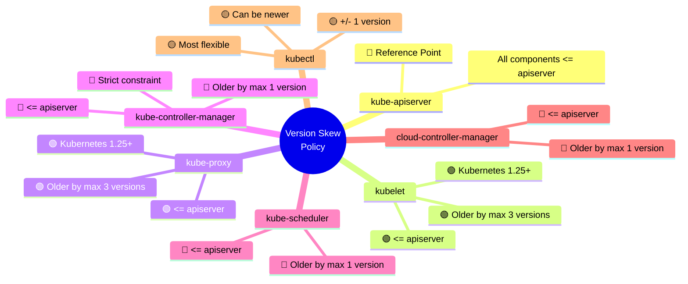
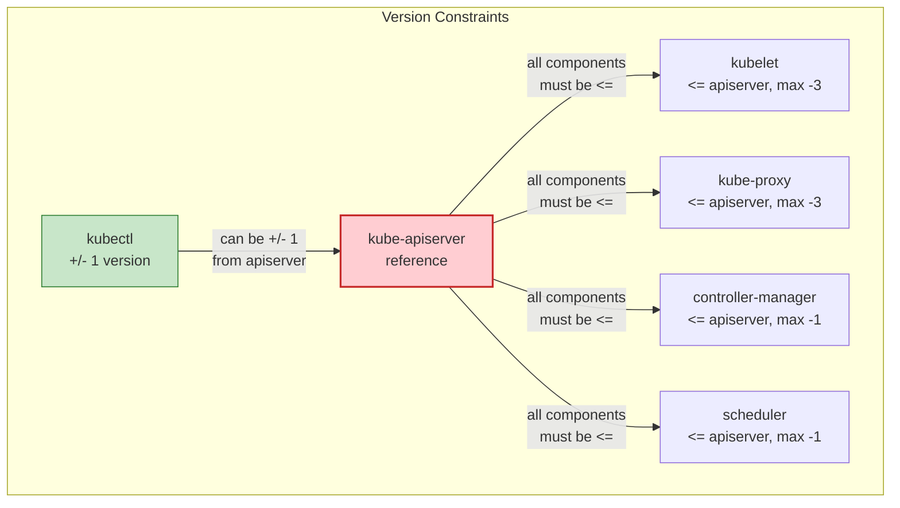
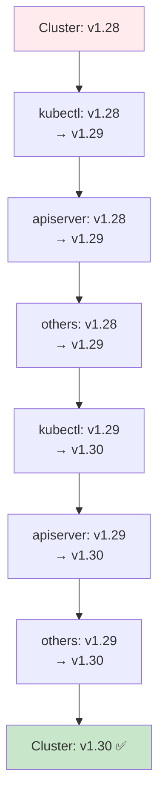
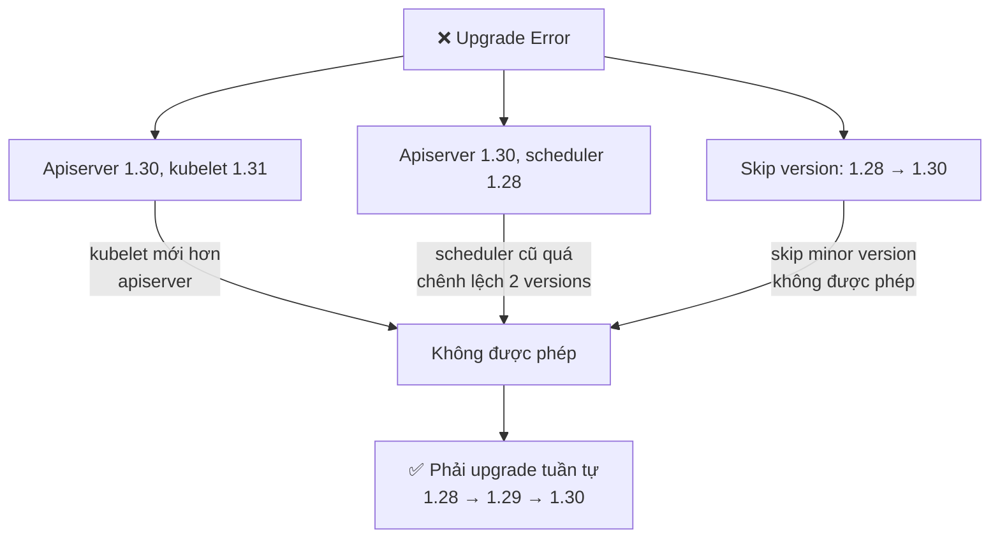

# Kubernetes Version Policy và Version Skew

Đây là hướng dẫn tóm tắt về cách quản lý phiên bản Kubernetes, một yếu tố quan trọng khi vận hành và triển khai Kubernetes cluster (đặc biệt là production).

## 1. Cấu trúc phiên bản Kubernetes

Kubernetes version có dạng: **MAJOR.MINOR.PATCH**

Ví dụ: `1.29.4`
- **1** = Major version - thường chỉ thay đổi khi có sự thay đổi lớn, không tương thích ngược (breaking changes)
- **29** = Minor version - thường ra mắt tính năng mới, có thể có breaking changes nhưng không phải lúc nào cũng
- **4** = Patch version - thường chỉ fix bug, không có tính năng mới, không breaking changes

### Tốc độ release
- Kubernetes ra minor version mới khoảng **4 tháng** một lần
- Điều này có nghĩa tốc độ phát triển rất nhanh

## 2. Chính sách hỗ trợ phiên bản (Version Support Policy)

Kubernetes hỗ trợ **ba minor version gần nhất**.

Ví dụ: Nếu đang dùng 1.30, thì được hỗ trợ:
- 1.30 (latest)
- 1.29
- 1.28

### Thời gian hỗ trợ chi tiết

Mỗi phiên bản được hỗ trợ tổng cộng **14 tháng**:

1. **12 tháng đầu**: Standard Support
   - Nhận tất cả các bản cập nhật, tính năng mới, bug fixes, security patches

2. **2 tháng tiếp theo**: Maintenance Mode
   - Chỉ nhận fix cho các lỗi nghiêm trọng (critical) và bảo mật (security)
   - Không có tính năng mới

3. **Sau 14 tháng**: End of Life (EOL)
   - Không còn hỗ trợ nào
   - Rất khó khăn để tiếp tục sử dụng

### Lưu ý quan trọng
Khi vận hành cluster production với nhiều node, việc nâng cấp phiên bản là một thách thức lớn. Managed service như Amazon EKS sẽ giúp giảm bớt gánh nặng này.

## 3. Version Skew Policy

Vì Kubernetes cluster có nhiều component, cần hiểu ràng buộc phiên bản giữa chúng.

### 3.1. kube-apiserver

Là thành phần trung tâm, tất cả các component khác phải tương thích với nó.

**Quy tắc**:
- Tất cả các component trong cluster **không được mới hơn** kube-apiserver
- Tối đa được chênh lệch **3 minor version** so với apiserver

Ví dụ:
- Nếu apiserver là 1.30
- Các component khác phải là: 1.30, 1.29, 1.28, 1.27 (tối đa chênh lệch 3)
- Không được dùng 1.31 hoặc 1.26+

### 3.2. kubelet

Kubelet chạy trên mỗi node, quản lý container trên node đó.

**Quy tắc**:
- Không được mới hơn kube-apiserver
- Có thể **cũ hơn tối đa 3 minor version** so với apiserver
- Kubernetes 1.25 trở đi áp dụng quy tắc này

### 3.3. kube-proxy

Chạy trên mỗi node, quản lý network proxy.

**Quy tắc**:
- Giống kubelet: không được mới hơn apiserver
- Có thể cũ hơn tối đa **3 minor version**
- Mười từ 1.25 trở đi

### 3.4. Các component trong Control Plane

Gồm:
- kube-controller-manager
- kube-scheduler
- cloud-controller-manager

**Quy tắc**:
- Không được mới hơn kube-apiserver
- Chỉ được **cũ hơn tối đa 1 minor version** (không thoải mái như kubelet)

**Ví dụ**:
- Nếu apiserver là 1.30
- Các component này phải là: 1.30 hoặc 1.29
- Không được là 1.28

**Lưu ý**: Nếu bạn có 2 apiserver (HA cluster) với version khác nhau (ví dụ 1.30 và 1.29), thì các component này bị giới hạn bởi cả hai → chỉ được dùng version thấp hơn (1.29).

### 3.5. kubectl

Là CLI tool để tương tác với cluster.

**Quy tắc**:
- Có thể **mới hơn hoặc cũ hơn 1 minor version** so với apiserver
- Linh hoạt nhất trong tất cả các component

Ví dụ:
- Nếu cluster chạy 1.30
- kubectl có thể là: 1.31, 1.30, hoặc 1.29
- Tất cả đều hoạt động được

### 3.6. Tóm tắt trong bảng

| Component | So với apiserver | Chênh lệch tối đa |
|-----------|------------------|-------------------|
| kube-apiserver | - | - (reference) |
| kubelet | Cũ hơn hoặc bằng | 3 minor versions |
| kube-proxy | Cũ hơn hoặc bằng | 3 minor versions |
| kube-controller-manager | Cũ hơn hoặc bằng | 1 minor version |
| kube-scheduler | Cũ hơn hoặc bằng | 1 minor version |
| cloud-controller-manager | Cũ hơn hoặc bằng | 1 minor version |
| kubectl | Mới hoặc cũ hơn | 1 minor version |

### 3.7. Mindmap: Version Skew Policy



**Màu sắc ý nghĩa**:
- 🔵 = Reference point
- 🟢 = Flexible (có thể cũ hơn 3 versions)
- 🔴 = Strict (chỉ được cũ hơn 1 version)
- 🟡 = Very flexible (mới/cũ đều được)

## 4. Kiểm tra version trên Minikube

Sau khi đã khởi động Minikube, kiểm tra version của các component:

```bash
# Kiểm tra kubectl version
kubectl version --client --short

# Kiểm tra các component trong cluster
kubectl get nodes -o wide

# Xem version của các pod hệ thống
kubectl get pods -n kube-system -o wide
```

**Lưu ý**: Trong Minikube, tất cả các control plane components thường có cùng version.

## 5. Upgrade cluster

Khi upgrade cluster, cần tuân theo thứ tự:

1. **Nâng cấp kubectl** trước (có thể lên 1 version mới hơn)
2. **Nâng cấp kube-apiserver** trước
3. Sau đó mới nâng cấp các component khác theo thứ tự phù hợp

**Quy tắc upgrade**:
- Không được skip minor version
- Ví dụ: từ 1.28 → phải lên 1.29 trước, không thể nhảy lên 1.30 trực tiếp
- Luôn upgrade tất cả các control plane components cùng lúc trong HA cluster

### Flowchart: Quy trình Upgrade Cluster

```mermaid
flowchart TD
    Start[🚀 Bắt đầu<br/>Upgrade Cluster] --> Step1[1. Upgrade kubectl<br/>có thể +/- 1 version]
    
    Step1 --> Step2[2. Upgrade kube-apiserver<br/>trước tiên]
    Step2 --> Step3{HA Cluster?}
    
    Step3 -->|Yes| Step3a[3a. Upgrade tất cả<br/>control plane cùng lúc]
    Step3 -->|No| Step4[3. Upgrade kubelet<br/>trên các nodes]
    
    Step3a --> Step4
    
    Step4 --> Step5[4. Upgrade kube-proxy<br/>trên các nodes]
    Step5 --> Step6[5. Upgrade các component<br/>khác (cm, scheduler,...)]
    Step6 --> Step7[6. Verify cluster health]
    
    Step7 --> Check{Health OK?}
    Check -->|Yes| End[✅ Upgrade thành công]
    Check -->|No| Rollback[🔄 Rollback nếu cần]
    Rollback --> Step1
    
    style End fill:#c8e6c9,stroke:#2e7d32
    style Step2 fill:#bbdefb,stroke:#1565c0
    style Start fill:#fff3e0,stroke:#ef6c00
```

**Chi tiết từng bước**:



**Ví dụ upgrade từ 1.28 lên 1.30**:



**⚠️ Lỗi thường gặp**:



---

## 6. Best Practices

1. **Theo dõi EOL date** của phiên bản đang sử dụng
   - Lập kế hoạch upgrade trước ít nhất 2-3 tháng so với EOL

2. **Không để cluster chạy phiên bũ đã EOL**
   - Mất bảo mật, không có bug fix
   - Có thể vi phạm compliance requirements

3. **Dùng managed service nếu có thể** (EKS, GKE, AKS)
   - Họ tự động handle upgrade control plane
   - Bạn chỉ cần upgrade node groups

4. **Test upgrade trên staging trước**
   - Không bao giờ upgrade trực tiếp production
   - Clone production environment sang staging

5. **Maintain version consistency**
   - Trong HA cluster, tất cả control plane phải cùng version
   - Kubelet trên nodes nên cập nhật theo schedule

6. **Theo dõi Kubernetes release blog**
   - https://kubernetes.io/blog/
   - Để biết tính năng mới, deprecated features, breaking changes

## 7. Tài nguyên tham khảo

- **Kubernetes Versioning Policy**: https://kubernetes.io/docs/concept/Cluster-Aggregated/version-support-policy/
- **Version Skew Policy**: https://kubernetes.io/docs/setup/creation/version-skew-policy/
- **Kubernetes Releases**: https://kubernetes.io/releases/

---

## 8. Ví dụ thực tế

Giả sử bạn có cluster với:
- apiserver: 1.30.0
- kubelet trên nodes: 1.30.0
- kubectl: 1.31.0 (ok vì được phép +/- 1)

**Cấu hình hợp lệ** ✅

Nếu bạn muốn upgrade apiserver lên 1.31:
- kubectl: Có thể giữ 1.31 hoặc lên 1.32
- kubelet: Phải upgrade lên 1.31 (hoặc 1.30, 1.29, 1.28)
- kube-proxy: Tương tự kubelet
- Controller-manager/scheduler: Phải là 1.31 hoặc 1.30

**Lỗi thường gặp** ❌:
- Apiserver 1.30, kubelet 1.31 → ❌ (kubelet mới hơn apiserver)
- Apiserver 1.30, scheduler 1.28 → ❌ (chênh lệch 2 minor versions, vượt quá giới hạn 1)

---

Cảm ơn các bạn đã theo dõi! Hẹn gặp lại trong các bài tiếp theo.
