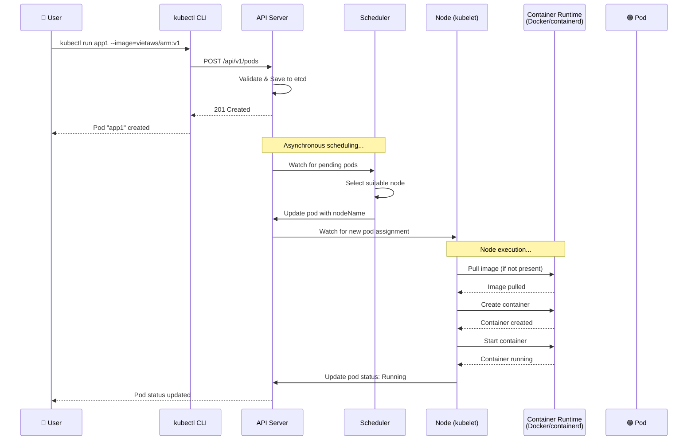
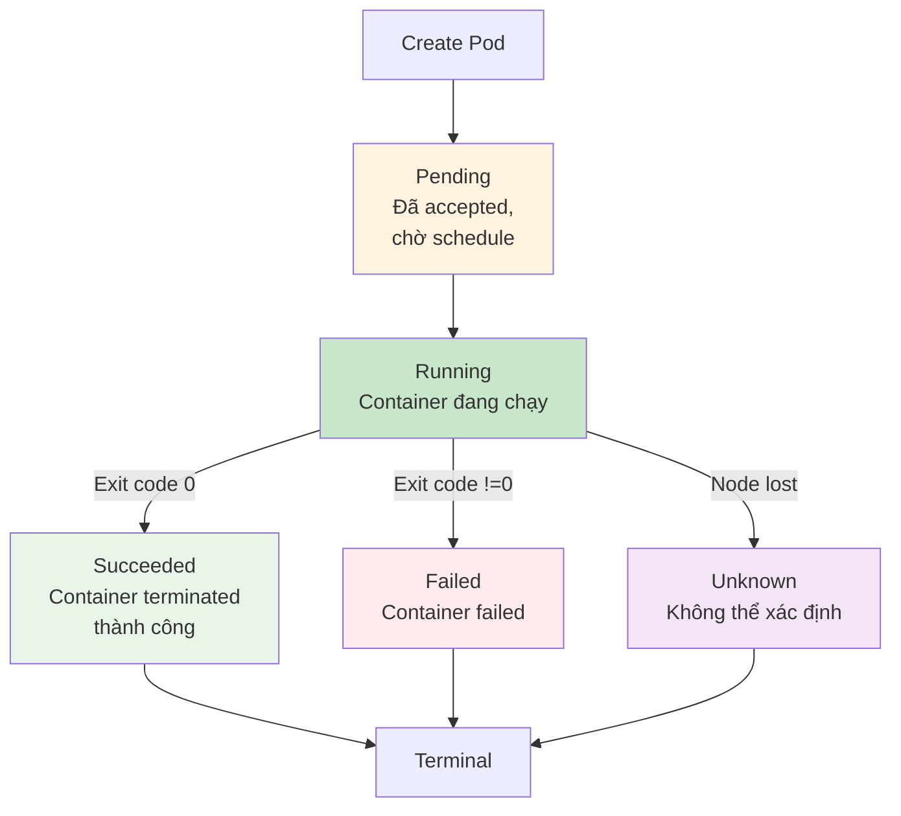
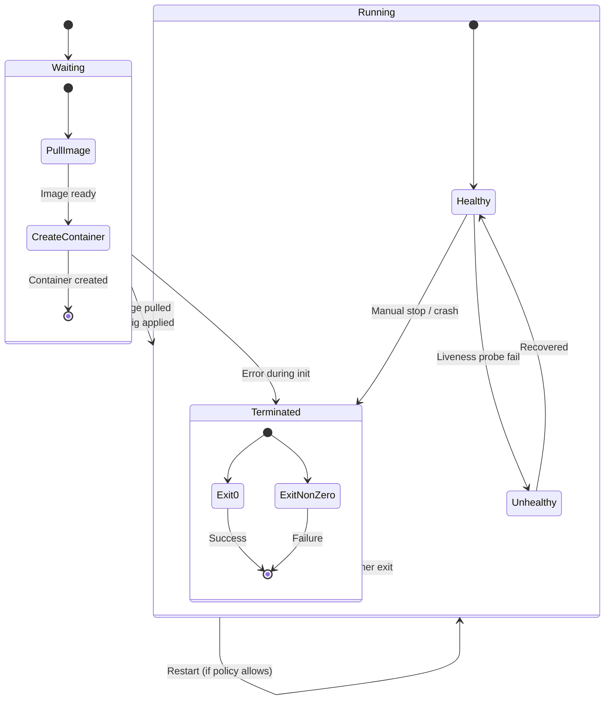

# Pod là gì? - Demo kubectl

Đây là bài học về **Pod** - đơn vị triển khai nhỏ nhất trong Kubernetes. Pod là nền tảng cơ bản nhất để hiểu và làm việc với Kubernetes.

## 1. Pod là gì?

**Pod** là đơn vị triển khai nhỏ nhất trong Kubernetes. Trong một Pod, bạn có thể chứa một hoặc nhiều container.

### Đặc điểm quan trọng:

1. **Mỗi Pod được cấp một địa chỉ IP riêng**
   - Giống như một máy chủ ảo (VM) hoặc EC2 instance
   - Tất cả container trong cùng một Pod chia sẻ IP này

2. **Container trong Pod chia sẻ tài nguyên**:
   - Network namespace (cùng IP, cùng port space)
   - Storage volumes (cùng chia sẻ disk)
   - Có thể giao tiếp qua `localhost`

3. **Thông thường: 1 Pod = 1 Container**
   - Đây là best practice _(thực hành tốt nhất)_ phổ biến nhất
   - Mỗi container trong Pod nên có mục đích riêng biệt

4. **Đôi khi: 1 Pod = nhiều Container** (trường hợp đặc biệt)
   - Container chính: ứng dụng của bạn
   - Container sidecar: hỗ trợ như logging, monitoring, proxy,...
   - Lợi ích: giao tiếp cực nhanh qua localhost
   - Nhược điểm: khi scale, cả hai container cùng scale

## 2. Tại sao cần nhiều container trong một Pod?

Ví dụ thực tế:
- **Web app + Log collector**: Container app chính + container fluentd/logstash để thu thập log
- **Web app + Sidecar proxy**: Container app + container Envoy/Nginx làm proxy
- **Web app + Helper**: Container app + container sync data từ external service

**Nhưng lưu ý**: Đây không phải là pattern _(mẫu)_ phổ biến. Hầu hết các Pod chỉ chứa một container duy nhất.

## 3. Scaling Pod

Khi traffic tăng, bạn có 2 cách:

1. **Scale vertical** (theo chiều dọc): Tăng tài nguyên cho Pod
   - Từ 1GB RAM → 4GB RAM
   - Nhưng có giới hạn của node

2. **Scale horizontal** (theo chiều ngang): **Best practice**
   - Tạo thêm nhiều Pod
   - Có thể chạy trên nhiều node khác nhau
   - Kubernetes tự động cân bằng tải giữa các Pod

**Horizontal scaling** là cách Kubernetes được thiết kế để scale ứng dụng.

## 4. Làm việc với Pod qua kubectl

### 4.1. Tạo Pod

```bash
# Tạo Pod từ image
kubectl run <pod-name> --image=<image-name>

# Ví dụ thực tế:
kubectl run app1 --image=vietaws/arm:v1
# Hoặc cho Intel/Windows/Linux:
# kubectl run app1 --image=vietaws:v1
```

### Sequence Diagram: Kubernetes Pod Creation Workflow



**Khi chạy lệnh này, Kubernetes sẽ:**
1. Tìm image trên Docker Hub (hoặc registry khác)
2. Download image về node (nếu chưa có)
3. Tạo Pod với container chạy từ image đó

### 4.2. Kiểm tra Pod

```bash
# Xem danh sách Pod đang chạy
kubectl get pods

# Xem Pod với định dạng rộng (wide)
kubectl get pods -o wide

# Theo dõi Pod trong thời gian thực (watch)
kubectl get pods -w
# Hoặc
kubectl get pods --watch
```

Output sẽ hiển thị:
- **NAME**: Tên Pod
- **READY**: Số container đã sẵn sàng (ví dụ: 1/1)
- **STATUS**: Trạng thái (Running, Pending, CrashLoopBackOff,...)
- **RESTARTS**: Số lần container restart
- **AGE**: Thời gian chạy

### 4.3. Xem chi tiết Pod

```bash
# Mô tả Pod để xem thông tin chi tiết
kubectl describe pod <pod-name>

# Ví dụ:
kubectl describe pod app1
```

Thông tin bạn sẽ thấy:
- **Pod Name**: Tên Pod
- **Namespace**: Namespace chứa Pod (default nếu không chỉ định)
- **IP**: Địa chỉ IP của Pod
- **Node**: Node chạy Pod này
- **Container ID**: ID của container
- **Image**: Image đang sử dụng
- **State**: Trạng thái container (Running, Waiting, Terminated)
- **Events**: Các sự kiện liên quan (pull image, create container,...)

### 4.4. Truy cập vào Pod

```bash
# Mở shell vào container trong Pod
kubectl exec -it <pod-name> -- /bin/sh
# Hoặc /bin/bash nếu container có bash

# Ví dụ:
kubectl exec -it app1 -- /bin/sh
```

Trong shell của container, bạn có thể:
```bash
# Xem user hiện tại
whoami

# Xem thư mục hiện tại
pwd

# Liệt kê file
ls -la

# Xem biến môi trường
env

# Test ứng dụng từ bên trong
curl localhost:8080

# Xem process đang chạy
ps aux

# Thoát
exit
```

### 4.5. Xem logs của Pod

```bash
# Xem logs của container trong Pod
kubectl logs <pod-name>

   # Ví dụ:
   kubectl logs app1

# Nếu Pod có nhiều container, chỉ định container
kubectl logs <pod-name> -c <container-name>

   # Ví dụ: ví dụ này chỉ có một container tên app1, nên kết quả sẽ giống lệnh trên
   kubectl logs app1 -c app1

# Theo dõi logs realtime
kubectl logs -f <pod-name>

   # Ví dụ:
   kubectl logs -f app1
```

### 4.6. Xóa Pod

```bash
# Xóa Pod
kubectl delete pod <pod-name>

# Ví dụ:
kubectl delete pod app1
```

## 5. Demo thực tế với vietaws image

Trong video, có sử dụng image `vietaws/arm:v1` (cho Apple Silicon/M1/M2/M3/M4) hoặc `vietaws:v1` (cho Intel/Windows/Linux).

### Chạy demo:

```bash
# Tạo Pod
kubectl run demo-app --image=vietaws/arm:v1

# Theo dõi trạng thái
kubectl get pods -w

# Khi Pod running, xem chi tiết
kubectl describe pod demo-app

# Test kết nối (nếu Pod expose port)
kubectl port-forward pod/demo-app 8082:8080
# Sau đó truy cập http://localhost:8082

# Hoặc expose thành Service
kubectl expose pod demo-app --port=8080 --type=NodePort
kubectl get svc demo-app
```

### Ứng dụng demo có các endpoints:

| Endpoint | Method | Mô tả |
|----------|--------|-------|
| `/` | GET | Trang chủ - thông tin container |
| `/students` | GET/POST/PUT/DELETE | CRUD sinh viên (PostgreSQL) |
| `/users` | GET | Danh sách users (hard-coded) |
| `/users/:id` | GET | Lấy user theo ID |
| `/users` | POST | Echo request body |
| `/secrets/users` | GET | API bí mật (demo) |
| `/write-logs` | POST | Ghi log vào `./data/logs.txt` |
| `/write-cache` | POST | Ghi cache vào `./cache/tmp.txt` |
| `/call-dynamodb?id=100` | GET | Lấy item từ DynamoDB |

## 6. Lưu ý quan trọng về Image Pull Policy

Khi bạn chạy `kubectl run`, Kubernetes có cơ chế **image pull policy**:

### Các giá trị:

1. **Always** (luôn pull)
   ```bash
   kubectl run app1 --image=vietaws/arm:v1 --image-pull-policy=Always
   ```
   - Luôn download image mới từ registry
   - Dùng cho development khi bạn thường xuyên update image

2. **IfNotPresent** (mặc định với tag không phải `:latest`)
   ```bash
   kubectl run app1 --image=vietaws/arm:v1 --image-pull-policy=IfNotPresent
   ```
   - Chỉ download nếu image chưa có local
   - Nếu đã có local rồi, dùng image local
   - **Đây là nguyên nhân** bạn update code rồi build image mới, nhưng Pod vẫn chạy code cũ!

3. **Never** (không bao giờ pull)
   ```bash
   kubectl run app1 --image=vietaws/arm:v1 --image-pull-policy=Never
   ```
   - Chỉ dùng image local
   - Dùng khi bạn build image locally

### Vấn đề thường gặp:

Khi bạn:
1. Tạo Pod lần đầu → Kubernetes download image `vietaws/arm:v1` về node
2. Bạn update code, rebuild image với cùng tag `v1` → Image mới trên Docker Hub
3. Bạn xóa Pod và tạo lại → Kubernetes **không** download lại vì đã có image `vietaws/arm:v1` local!

**Giải pháp**:
- Dùng `--image-pull-policy=Always`
- Hoặc dùng tag mới (ví dụ: `v2`, `v1.1`)
- Hoặc xóa image local: `docker rmi vietaws/arm:v1`

## 7. Kiểm tra Pod trên Minikube

Minikube chạy trong Docker, nên khi bạn tạo Pod, nó sẽ chạy trong Minikube cluster:

```bash
# Kiểm tra Minikube đang chạy
minikube status

# Kiểm tra node
kubectl get nodes

# Kiểm tra Pod
kubectl get pods -A  # Xem tất cả Pod trong tất cả namespace
kubectl get pods -n kube-system  # Xem Pod hệ thống
kubectl get pods -n default  # Xem Pod trong namespace default
```

## 8. Quản lý Pod thông qua file YAML

Ngoài `kubectl run`, bạn có thể tạo Pod từ file YAML:

```yaml
# pod.yaml
apiVersion: v1
kind: Pod
metadata:
  name: app1
  labels:
    app: demo
spec:
  containers:
  - name: app-container
    image: vietaws/arm:v1
    ports:
    - containerPort: 8080
    env:
    - name: ENV_VAR
      value: "production"
```

Tạo Pod từ file:
```bash
kubectl apply -f pod.yaml
# Hoặc
kubectl create -f pod.yaml
```

## 9. Troubleshooting Pod

Pod có thể ở nhiều trạng thái:

| Trạng thái | Mô tả | Khắc phục |
|------------|-------|-----------|
| **Pending** | Đang chờ được schedule lên node | Check node resources, image pull |
| **Running** | Đang chạy bình thường | ✅ OK |
| **CrashLoopBackOff** | Container crash rồi restart liên tục | Check logs: `kubectl logs <pod>` |
| **Error** | Lỗi khi tạo container | Check events: `kubectl describe pod <pod>` |
| **ImagePullBackOff** | Không pull được image | Check image name, registry auth |
| **Terminating** | Đang xóa | Xác nhận delete, có thể bị block bởi finalizer |

### Các lệnh debug:

```bash
# Xem events (rất quan trọng để debug)
kubectl get events --sort-by='.lastTimestamp'

# Xem events của Pod cụ thể
kubectl describe pod <pod-name>

# Xem logs (nếu container đã từng chạy)
kubectl logs <pod-name> --previous

# Kiểm tra cấu hình Pod
kubectl get pod <pod-name> -o yaml

# Kiểm tra node có đủ tài nguyên không
kubectl describe node <node-name>
```

## 10. Lifecycle của Pod

### Flowchart: Pod Phases



Pod có các phase:

1. **Pending**: Đã accepted nhưng chưa schedule lên node
2. **Running**: Đã gắn vào node, container đang chạy
3. **Succeeded**: Container đã terminate với exit code 0
4. **Failed**: Container đã terminate với exit code != 0
5. **Unknown**: Không thể xác định trạng thái

### Container States trong Pod:

- **Waiting**: Container đang khởi tạo (pull image, apply config)
- **Running**: Container đang chạy
- **Terminated**: Container đã dừng

### Flowchart: Container States trong Pod



## 11. Restart Policy

Pod có trường `restartPolicy` trong spec:

- **Always** (default): Luôn restart container khi crash
- **OnFailure**: Chỉ restart khi exit code != 0
- **Never**: Không bao giờ restart

```yaml
apiVersion: v1
kind: Pod
metadata:
  name: mypod
spec:
  restartPolicy: OnFailure
  containers:
  - name: myapp
    image: nginx
```

**Lưu ý**: Restart policy áp dụng cho container trong Pod, không phải cho Pod itself. Pod bị xóa thì restart policy không apply.

## 12. Best Practices với Pod

1. **Một Pod = Một Application**:
   - Không đặt nhiều ứng dụng độc lập trong cùng Pod
   - Mỗi Pod nên có một mục đích duy nhất

2. **Dùng Deployment thay vì Pod trực tiếp**:
   - Pod không có self-healing
   - Deployment cung cấp rolling update, rollback, scaling
   - Production nên dùng Deployment/StatefulSet/DaemonSet

3. **Đặt resource limits**:
   ```yaml
   resources:
     requests:
       memory: "64Mi"
       cpu: "250m"
     limits:
       memory: "128Mi"
       cpu: "500m"
   ```

4. **Đặt labels** để quản lý:
   ```yaml
   metadata:
     labels:
       app: myapp
       environment: production
       tier: frontend
   ```

5. **Không dùng latest tag**:
   - Dùng tag cụ thể: `v1.0.0`, `2024-01-15`
   - Đảm bảo reproducibility

6. **Readiness/Liveness probes**:
   ```yaml
   livenessProbe:
     httpGet:
       path: /health
       port: 8080
   readinessProbe:
     httpGet:
       path: /ready
       port: 8080
   ```

---

## 13. Tóm tắt

- **Pod** là đơn vị nhỏ nhất trong Kubernetes
- Một Pod chứa 1 hoặc nhiều container, chia sẻ network và storage
- **Best practice**: 1 Pod = 1 container
- Scale bằng cách tạo thêm Pod (horizontal scaling)
- Quản lý Pod qua `kubectl run`, `kubectl get`, `kubectl describe`, `kubectl exec`, `kubectl logs`
- Production nên dùng **Deployment** thay vì Pod trực tiếp

---

Cảm ơn các bạn đã theo dõi! Hẹn gặp lại trong bài tiếp theo.
