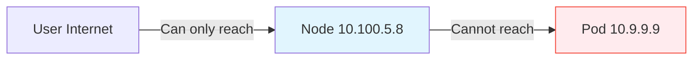
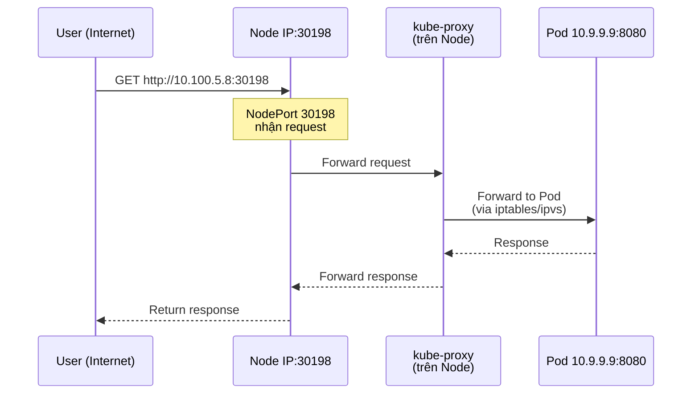
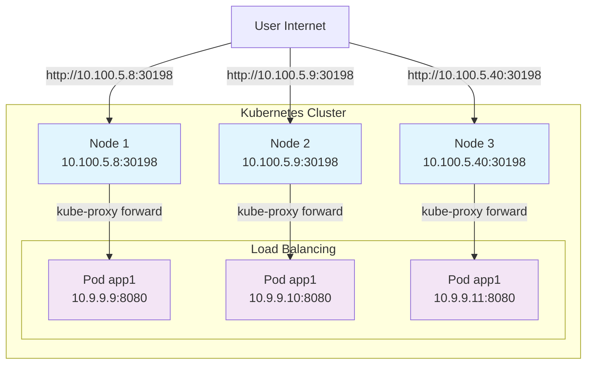
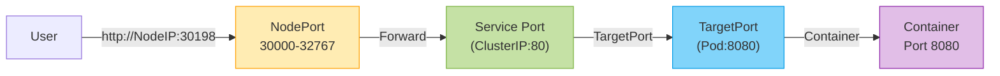
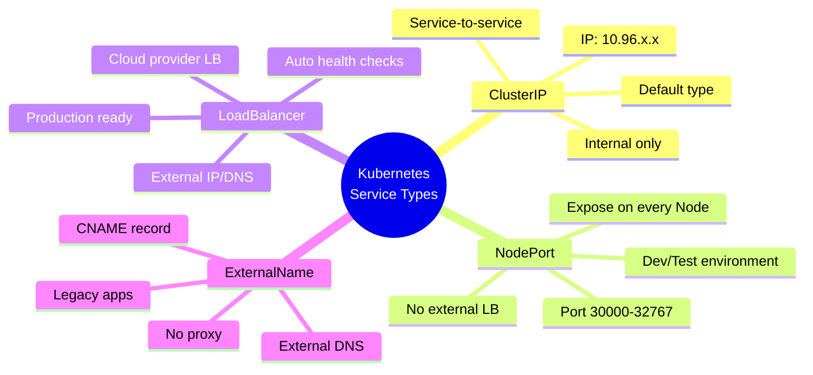
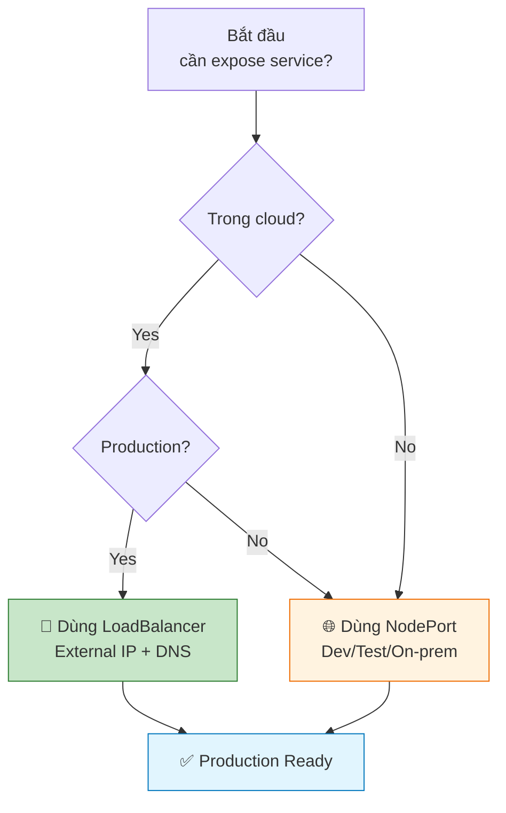

# NodePort - Cách hoạt động và Expose Pod ra bên ngoài

Đây là bài học về **NodePort** Service - một cách để expose ứng dụng trong Kubernetes ra bên ngoài cluster, cho phép user từ internet truy cập vào Pod của bạn.

## 1. Vấn đề: Làm sao user bên ngoài truy cập vào Pod?

Khi bạn tạo một Pod trong Kubernetes:
- Pod được cấp một **IP nội bộ** (ví dụ: `10.9.9.9`) với một port (ví dụ: `8082`)
- Container trong Pod chạy trên một port (ví dụ: `8080`)
- IP này chỉ reachable từ bên trong cluster
- **User bên ngoài internet KHÔNG thể truy cập trực tiếp** vào Pod này

### Sơ đồ luồng truy cập:

```mermaid
flowchart TD
    User[User Internet] -->|"Request 10.9.9.9:8080"| Firewall[Firewall/Router]
    Firewall -->|"Drop"| Block[X&#9878; Không thể reach]
    Block -->|"Pod IP là internal only"| Pod[Pod 10.9.9.9:8080]
    
    style Block fill:#ffcccc
    style Pod fill:#e1f5fe
```



**User chỉ có thể nói chuyện với Node IP** (ví dụ: `10.100.5.8`), không thể biết đến Pod IP.



## 2. Giải pháp: Kubernetes Service

Kubernetes cung cấp **Service** - một abstraction layer giữa Pod và user bên ngoài.

Service giúp:
- Expose Pod ra bên ngoài cluster
- Cung cấp một endpoint ổn định (stable endpoint)
- Load balancing giữa nhiều Pod
- Service discovery cho các Pod khác

Có nhiều loại Service, trong bài này chúng ta tập trung vào **NodePort**.

## 3. NodePort là gì?

**NodePort** là loại Service mở một port cụ thể (trong khoảng `30000-32767`) trên **mỗi Node** trong cluster.

Khi user truy cập:
```
http://<Node-IP>:<NodePort>
```

Request sẽ được forward đến Pod đằng sau Service.

### Cách hoạt động:

**Sequence diagram chi tiết:**



**Chi tiết từng bước:**
1. User gửi request đến `http://10.100.5.8:30198`
2. Request đến Node với IP `10.100.5.8` tại port `30198`
3. `kube-proxy` (chạy trên mỗi Node) nhận request
4. `kube-proxy` forward request đến một Pod trong Service (ví dụ: `10.9.9.9:8080`)
5. Pod xử lý request và trả về response

## 4. Cách tạo NodePort Service

Có 2 cách chính:

### Cách 1: Tạo Service khi expose Pod

```bash
# Tạo Service NodePort từ Pod đang có
kubectl expose pod app1 --port=8080 --type=NodePort --name=app1-service

# Hoặc với deployment:
kubectl expose deployment app1 --port=8080 --type=NodePort
```

### Cách 2: Tạo từ file YAML

```yaml
# service-nodeport.yaml
apiVersion: v1
kind: Service
metadata:
  name: app1-service
spec:
  type: NodePort
  selector:
    app: app1  # Match labels của Pod
  ports:
    - port: 80           # Service port (trong cluster)
      targetPort: 8080   # Pod containerPort
      nodePort: 30198    # Port trên Node (optional, auto nếu không chỉ định)
```

Tạo Service:
```bash
kubectl apply -f service-nodeport.yaml
```

## 5. Kiểm tra NodePort Service

```bash
# Xem danh sách Service
kubectl get services
# Hoặc
kubectl get svc

# Output:
# NAME            TYPE       CLUSTER-IP      EXTERNAL-IP   PORT(S)        AGE
# app1-service   NodePort   10.96.123.456   <none>        80:30198/TCP   5m
```

**Giải thích output**:
- `NAME`: Tên Service
- `TYPE`: Loại Service (`NodePort`)
- `CLUSTER-IP`: IP nội bộ của Service (chỉ accessible từ trong cluster)
- `EXTERNAL-IP`: Trống với NodePort (không có external load balancer)
- `PORT(S)`: `ServicePort:NodePort/TCP`
  - `80`: Service port (trong cluster, Pod nghe 8080 nhưng Service expose 80)
  - `30198`: NodePort (port trên mỗi Node)

### Xem chi tiết Service:

```bash
kubectl describe service app1-service
```

Output quan trọng:
- `Selector`: Labels匹配的Pod
- `Port`: Service port (80)
- `TargetPort`: Pod port (8080)
- `NodePort`: Port trên Node (30198)
- `Endpoints**: IP:Port của các Pod đang được select

## 6. Truy cập ứng dụng từ bên ngoài

Sau khi tạo NodePort Service:

```bash
# Lấy Node IP
kubectl get nodes -o wide

# Output:
# NAME       STATUS   ROLES           AGE   VERSION   INTERNAL-IP   EXTERNAL-IP   OS-IMAGE             KERNEL-VERSION      CONTAINER-RUNTIME
# minikube   Ready    control-plane   1h    v1.30.0   10.100.5.8     <none>        Docker Desktop       24.0.0               docker://24.0.0

# Node IP là 10.100.5.8
# NodePort là 30198 (từ `kubectl get svc`)

# Truy cập ứng dụng:
curl http://10.100.5.8:30198
# Hoặc mở browser: http://10.100.5.8:30198
```

**Lưu ý**:
- Với Minikube, có thể dùng `minikube service` command:
  ```bash
  minikube service app1-service --url
  # Sẽ trả về URL như: http://10.100.5.8:30198
  ```
- Hoặc tự động mở browser:
  ```bash
  minikube service app1-service
  ```

## 7. NodePort với nhiều Node

Giả sử cluster có 3 Node:
- Node 1: `10.100.5.8`
- Node 2: `10.100.5.9`
- Node 3: `10.100.5.40`

Khi bạn tạo NodePort Service, **tất cả các Node** đều mở port `30198`.

**Sơ đồ kiến trúc với nhiều Node:**



User có thể truy cập qua **bất kỳ Node nào**:
```
http://10.100.5.8:30198
http://10.100.5.9:30198
http://10.100.5.40:30198
```

Tất cả đều forward đến cùng một set của Pod.

### Tuy nhiên, có vấn đề:

- **User phải biết IP của Node**
- Nếu Node fail, user phải chuyển sang Node khác
- Không có DNS name cho Service (chỉ có ClusterIP)

**Giải pháp**: Dùng LoadBalancer Service (bài sau) hoặc Ingress.

## 8. Port Mapping

Có 3 ports tham gia vào NodePort:

**Sơ đồ luồng port mapping:**



| Port                         | Mô tả                               | Vai trò                        |
| ---------------------------- | ----------------------------------- | ------------------------------ |
| **NodePort**                 | Port trên Node vật lý (30000-32767) | User bên ngoài kết nối vào đây |
| **Service Port** (ClusterIP) | Port của Service trong cluster      | Service nhận request           |
| **TargetPort**               | Port của container trong Pod        | Container thực sự lắng nghe    |

**Ví dụ**:
```yaml
ports:
  - port: 80          # Service Port
    targetPort: 8080  # TargetPort (Pod)
    nodePort: 30198   # NodePort
```

User: `curl http://10.100.5.8:30198`
→ Service nhận tại port 80
→ Forward đến Pod tại port 8080

## 9. Các loại Service khác

### Mindmap tổng quan về các loại Service:



### 9.1. ClusterIP (default)
- Chỉ accessible từ trong cluster
- IP nội bộ (`10.96.x.x`)
- Không expose ra ngoài
- Dùng cho service-to-service communication

```bash
kubectl expose pod app1 --port=8080 --type=ClusterIP
```

### 9.2. NodePort (bài này)
- Mở port trên mỗi Node (30000-32767)
- Accessible từ bên ngoài qua NodeIP:NodePort
- Phù hợp cho development, testing
- Không phù hợp cho production (không có load balancer, DNS)

```bash
kubectl expose pod app1 --port=8080 --type=NodePort
```

### 9.3. LoadBalancer
- Tạo cloud provider load balancer (AWS ELB, GCP LB, Azure LB)
- Có external IP/DNS
- Tự động load balance giữa các Node
- **Dành cho production trên cloud**

```bash
kubectl expose pod app1 --port=8080 --type=LoadBalancer
```

### 9.4. ExternalName
- Redirect đến external DNS name
- Không tạo Service thật sự, chỉ tạo CNAME record

## 10. So sánh NodePort vs LoadBalancer

### Flowchart quyết định chọn loại Service:



| Feature                 | NodePort                        | LoadBalancer                      |
| ----------------------- | ------------------------------- | --------------------------------- |
| **External IP**         | ❌ Không (dùng Node IP)          | ✅ Có (cloud LB IP)                |
| **DNS**                 | ❌ Không                         | ✅ Có (cloud LB DNS)               |
| **Load Balancing**      | ✅ Có (kube-proxy iptables/ipvs) | ✅ Có (cloud LB)                   |
| **Cloud Provider**      | ✅ Tất cả (on-prem, cloud)       | ❌ Chỉ cloud (AWS, GCP, Azure,...) |
| **Cost**                | ✅ Miễn phí                      | ❌ Trả phí (cloud LB)              |
| **Production Ready**    | ⚠️ Hạn chế                       | ✅ Recommended                     |
| **SSL/TLS Termination** | ❌ Phải tự xử lý trong app       | ✅ LB có thể terminate SSL         |

## 11. Demo thực tế

Giả sử bạn có Pod `app1` với container chạy port `8080`.

### Bước 1: Tạo Pod

```bash
kubectl run app1 --image=vietaws/arm:v1 --port=8080
```

### Bước 2: Expose Pod với NodePort

```bash
# Tạo NodePort Service (auto assign nodePort 30000-32767)
kubectl expose pod app1 --type=NodePort --port=80 --target-port=8080

# Hoặc chỉ định nodePort cụ thể:
kubectl expose pod app1 --type=NodePort --port=80 --target-port=8080 --node-port=30198
```

### Bước 3: Kiểm tra

```bash
# Xem Pod
kubectl get pods
# NAME   READY   STATUS    RESTARTS   AGE
# app1   1/1     Running   0          2m

# Xem Service
kubectl get svc app1
# NAME    TYPE       CLUSTER-IP      EXTERNAL-IP   PORT(S)        AGE
# app1    NodePort   10.96.123.456   <none>        80:30198/TCP   1m

# Xem chi tiết
kubectl describe svc app1
```

### Bước 4: Truy cập ứng dụng

```bash
# Lấy Node IP
kubectl get nodes -o wide

# Truy cập
curl http://<Node-IP>:30198

# Với Minikube, dùng:
minikube service app1 --url
# Output: http://10.100.5.8:30198
```

## 12. Troubleshooting NodePort

### Vấn đề 1: Không thể truy cập từ bên ngoài

**Kiểm tra**:
1. Service đã tạo chưa?
   ```bash
   kubectl get svc
   ```

2. Pod đang running?
   ```bash
   kubectl get pods
   ```

3. Selector đúng với Pod labels?
   ```bash
   kubectl get pod app1 --show-labels
   kubectl describe svc app1  # Xem selector
   ```

4. Port đúng không?
   - `kubectl describe svc app1` → xem `Port` và `TargetPort`
   - Container trong Pod có lắng nghe `targetPort` không?

5. Firewall/security group có block port không?
   - NodePort dùng port 30000-32767
   - Cần mở port này trong firewall

### Vấn đề 2: NodePort không phải trong khoảng 30000-32767

```bash
# Xem nodePort đang dùng
kubectl get svc app1 -o yaml | grep nodePort

# Nếu muốn thay đổi, phải xóa và tạo lại:
kubectl delete svc app1
kubectl expose pod app1 --type=NodePort --port=80 --target-port=8080 --node-port=30198
```

### Vấn đề 3: Pod không được select bởi Service

```bash
# Kiểm tra labels của Pod
kubectl get pod app1 --show-labels

# Kiểm tra selector của Service
kubectl get svc app1 -o yaml | grep selector -A2

# Nếu selector không match, patch Service:
kubectl patch svc app1 -p '{"spec":{"selector":{"app":"app1"}}}'
```

## 13. Best Practices với NodePort

1. **Không dùng NodePort cho production**
   - Không có external load balancer
   - Không có DNS name
   - Port cố định trên mỗi Node, khó scale
   - Dùng LoadBalancer hoặc Ingress thay thế

2. **Chỉ định nodePort nếu cần**
   ```bash
   kubectl expose pod app1 --node-port=30198 ...
   ```
   - Giúp consistent với firewall rules
   - Dễ dàng cho DNS/configuration

3. **Dùng với Minikube/local development**
   ```bash
   minikube service <service-name>
   ```
   - Tự động mở browser với đúng URL

4. **Kiểm tra endpoints**
   ```bash
   kubectl get endpoints app1
   # OUTPUT:
   # NAME        ENDPOINTS                         AGE
   # app1        10.9.9.9:8080                   1m
   ```
   - Nếu ENDPOINTS trống → selector không match Pod

5. **Logging/Monitoring**
   - Log request vào NodePort ở `/var/log/`
   - Monitor port 30000-32767 với monitoring tool

6. **Security**
   - NodePort mở cổng ra internet → cần security group/firewall
   - Chỉ mở port cụ thể cần thiết
   - Dùng NetworkPolicy để giới hạn access

## 14. NodePort vs Ingress

NodePort là cách đơn giản nhất, nhưng Ingress mạnh mẽ hơn:

| Feature               | NodePort             | Ingress                           |
| --------------------- | -------------------- | --------------------------------- |
| **Layer**             | Layer 4 (TCP)        | Layer 7 (HTTP/HTTPS)              |
| **URL Routing**       | ❌ Không              | ✅ Có (path-based, host-based)     |
| **SSL Termination**   | ❌ Phải tự xử lý      | ✅ Có (Ingress controller)         |
| **Multiple Services** | ❌ Mỗi service 1 port | ✅ Nhiều services trên 1 IP:80/443 |
| **Production Ready**  | ⚠️ Hạn chế            | ✅ Recommended                     |

**Ví dụ**:
- NodePort: `http://10.100.5.8:30198` (mỗi service một port)
- Ingress: `http://app1.example.com` (cùng domain, path khác nhau)

## 15. Kiểm tra với Minikube

Minikube hỗ trợ commands đặc biệt:

```bash
# Mở Service trong browser
minikube service app1-service

# Lấy URL
minikube service app1-service --url
# Output: http://10.100.5.8:30198

# Mở tất cả services
minikube service list
```

Minikube cũng hỗ trợ `minikube tunnel` cho LoadBalancer:

```bash
# Mở tunnel để LoadBalancer có external IP
minikube tunnel
```

## 16. Tóm tắt

- **NodePort** expose Pod ra bên ngoài qua port `30000-32767` trên mỗi Node
- User truy cập: `http://<Node-IP>:<NodePort>`
- Dùng `kubectl expose` với `--type=NodePort`
- **Production nên dùng LoadBalancer hoặc Ingress**
- NodePort phù hợp cho development, testing, hoặc on-premise cluster
- Luôn kiểm tra:
  - Service tồn tại và có `TYPE=NodePort`
  - Pod đang running với labels đúng
  - NodePort trong khoảng 30000-32767
  - Firewall cho phép port đó

---

## 17. Next Steps

Trong bài tiếp theo, chúng ta sẽ tìm hiểu về **LoadBalancer Service** - cách để có external IP và load balancing tự động trên cloud provider.

---

Cảm ơn các bạn đã theo dõi! Hẹn gặp lại trong bài tiếp theo.
