# Kubernetes Trực Quan Hóa Toàn Diện

Hướng dẫn học Kubernetes với sơ đồ Mermaid tương tác.

## 📋 Mục Lục

1. [Tổng quan Kubernetes](#tổng-quan)
2. [Kiến trúc](#kiến-trúc)
3. [Các thành phần chính](#các-thành-phần-chính)
4. [Pod](#pod)
5. [Deployment](#deployment)
6. [Service](#service)
7. [ConfigMap & Secret](#configmap-secret)
8. [Namespace](#namespace)
9. [Storage](#storage)
10. [Networking](#networking)
11. [Ingress](#ingress)
12. [StatefulSet](#statefulset)
13. [DaemonSet](#daemonset)
14. [Job & CronJob](#job-cronjob)
15. [RBAC](#rbac)
16. [Monitoring](#monitoring)

---

## 1. Tổng quan Kubernetes

### Kubernetes là gì?

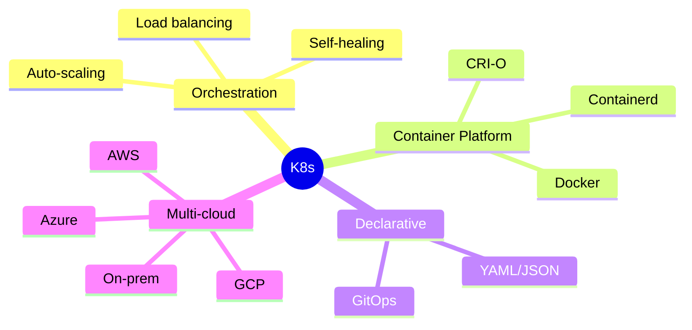

### So sánh: Trước và Sau K8s

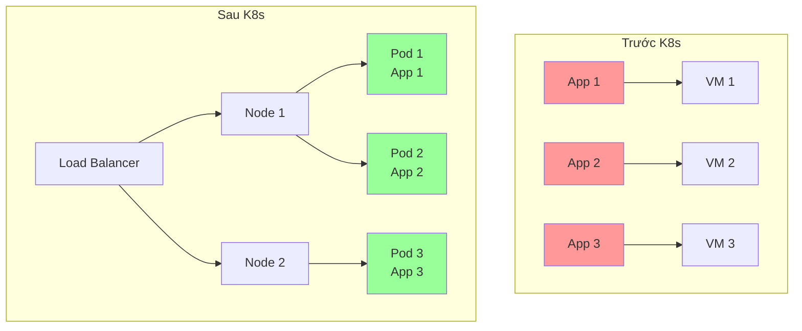

---

## 2. Kiến trúc Kubernetes

### Cluster Architecture

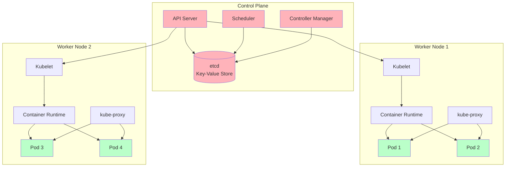

---

## 3. Các thành phần chính

### Object Types Overview

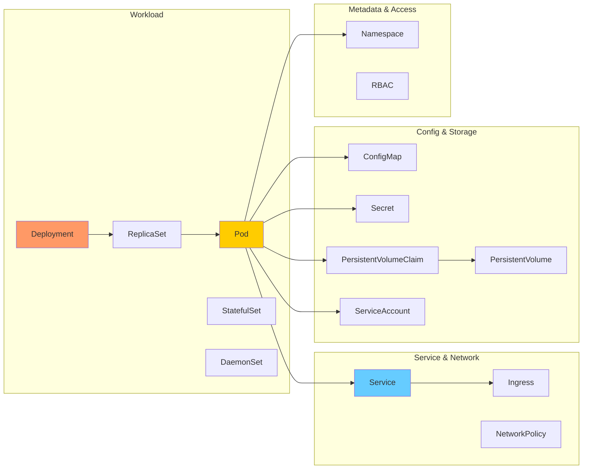

---

## 4. Pod

### Pod là gì?

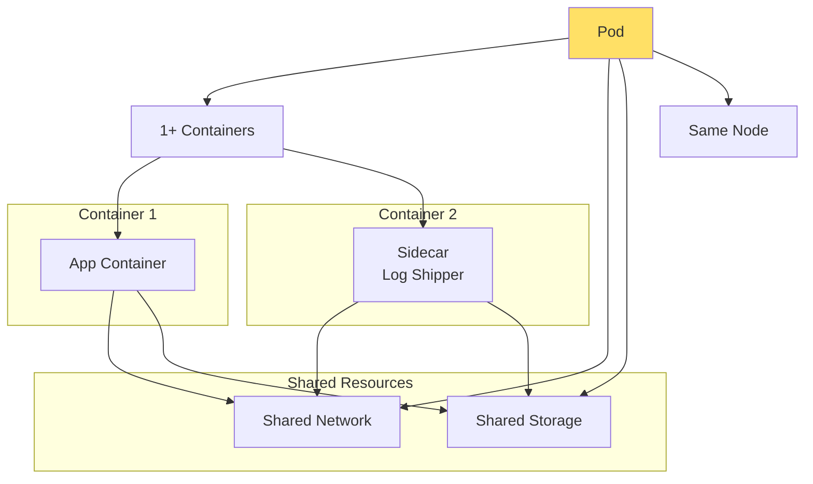

### Pod Lifecycle

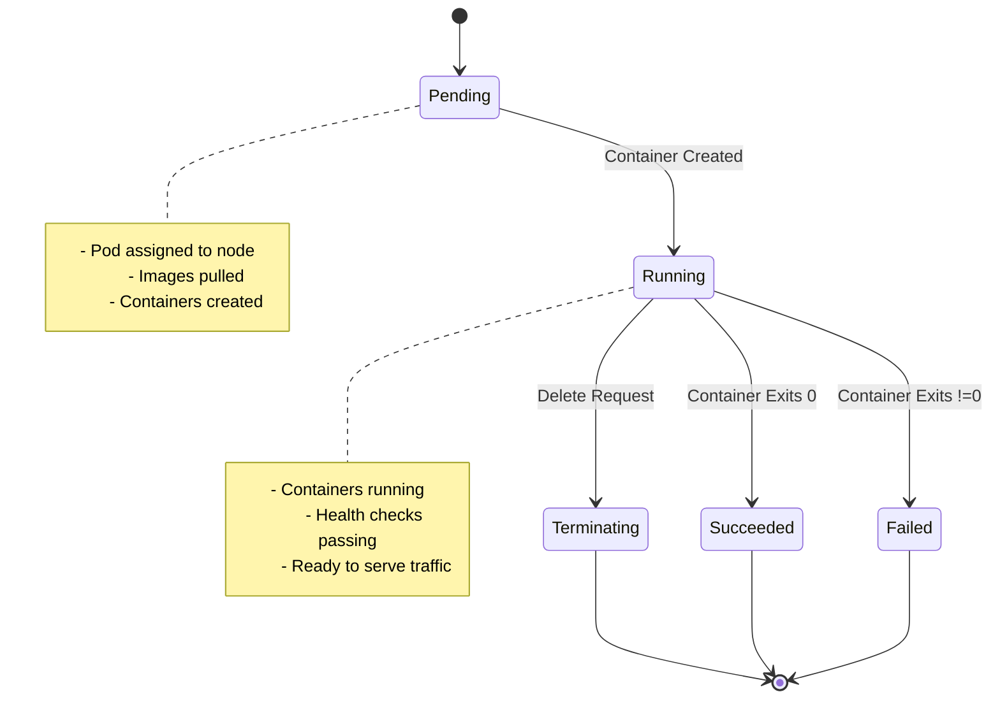

### Sidecar Pattern

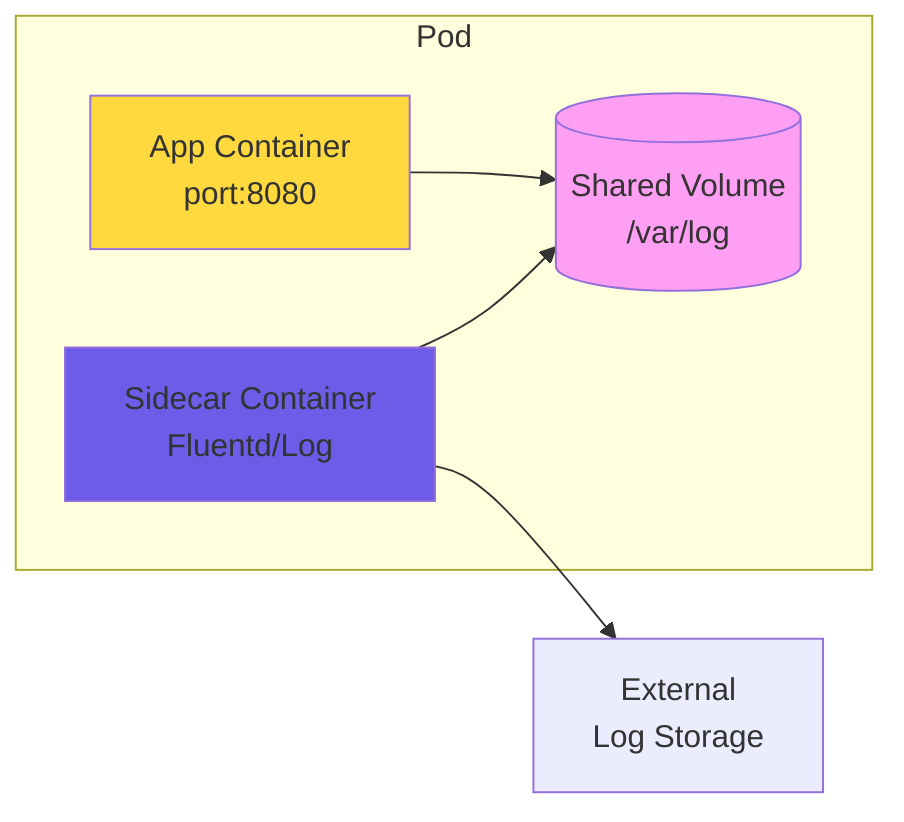

---

## 5. Deployment

### Deployment Workflow

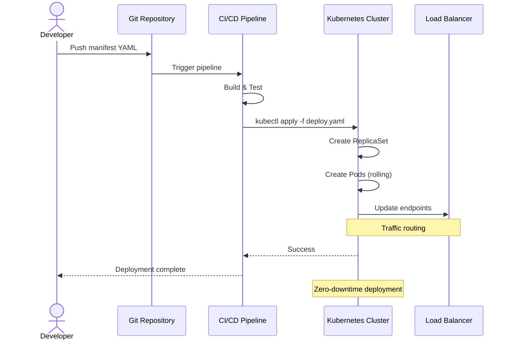

### Rolling Update Strategy

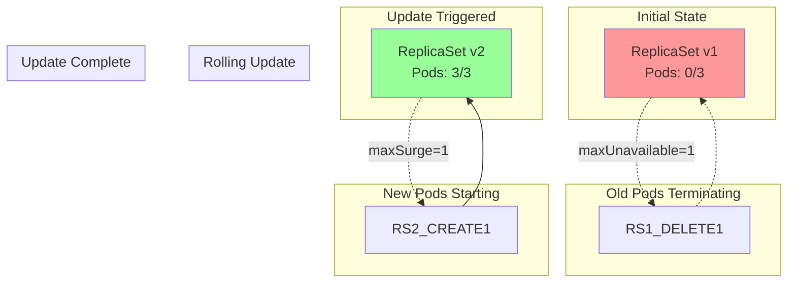

---

## 6. Service

### Service Types

```mermaid
graph TD
    subgraph "ClusterIP (Default)"
        S1[Service]
        P1[Pod 1]
        P2[Pod 2]
        P3[Pod 3]
        S1 --> P1
        S1 --> P2
        S1 --> P3
        CLIENT1[Internal Client] --> S1
    end

    subgraph "NodePort"
        S2[Service<br/>port:30000-32767]
        NP[NodePort<br/>e.g., 31000]
        P4[Pod]
        S2 --> P4
        EXTERNAL[External Client] --> NP
        NP --> S2
    end

    subgraph "LoadBalancer"
        S3[Service]
        LB[Cloud LB<br/>e.g., ELB, ALB]
        P5[Pod]
        S3 --> P5
        INTERNET[Internet] --> LB
        LB --> S3
    end

    subgraph "ExternalName"
        S4[Service<br/>(DNS CNAME)]
        EXTSVC[External Service<br/>e.g., database.example.com]
        S4 -.-> EXTSVC
    end

    style S1 fill:#ffd93d
    style S2 fill:#ffd93d
    style S3 fill:#ffd93d
    style S4 fill:#ffd93d
```

### kube-proxy & Service Routing

```mermaid
graph LR
    subgraph "Node 1"
        NP1[kube-proxy]
        P1[Pod 1<br/>IP: 10.244.1.5]
        IPT1[iptables/ipvs]
    end

    subgraph "Node 2"
        NP2[kube-proxy]
        P2[Pod 2<br/>IP: 10.244.2.7]
        IPT2[iptables/ipvs]
    end

    subgraph "Node 3"
        NP3[kube-proxy]
        P3[Pod 3<br/>IP: 10.244.3.3]
        IPT3[iptables/ipvs]
    end

    CLIENT[Client<br/>ServiceIP: 10.96.0.100] --> NP1

    NP1 --> IPT1
    IPT1 --> P1

    NP2 --> IPT2
    IPT2 --> P2

    NP3 --> IPT3
    IPT3 --> P3

    Note right of NP1: Maintains iptables/ipvs rules<br/>for service load balancing
```

---

## 7. ConfigMap & Secret

### ConfigMap & Secret Usage

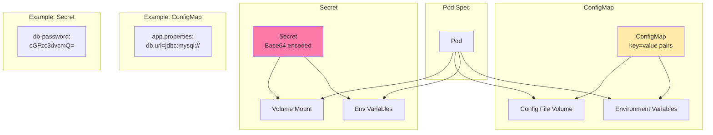

---

## 8. Namespace

### Namespace Isolation

```mermaid
graph TB
    subgraph "Cluster"
        subgraph "Namespace: default"
            P1[Pod app-1]
            S1[Service app]
        end

        subgraph "Namespace: staging"
            P2[Pod app-staging]
            S2[Service app]
        end

        subgraph "Namespace: production"
            P3[Pod app-prod]
            S3[Service app]
        end

        subgraph "Namespace: monitoring"
            P4[Prometheus]
            P5[Grafana]
        end
    end

    Note right of P1: Each namespace<br/>has own set of resources
    Note right of S3: Services isolated<br/>by namespace

    style P1 fill:#ffcccc
    style P2 fill:#ccffcc
    style P3 fill:#ccccff
    style P4 fill:#ffffcc
```

---

## 9. Storage

### PersistentVolume & PersistentVolumeClaim

```mermaid
graph TD
    subgraph "Storage Layer"
        PV1[PersistentVolume<br/>AWS EBS 10Gi]
        PV2[PersistentVolume<br/>GCE PD 20Gi]
        PV3[PersistentVolume<br/>NFS Share]
    end

    subgraph "Claim Layer"
        PVC1[PVC: mysql-data<br/>Request: 10Gi]
        PVC2[PVC: wordpress-uploads<br/>Request: 20Gi]
        PVC3[PVC: shared-data<br/>Request: 5Gi]
    end

    subgraph "Pod Layer"
        POD1[MySQL Pod]
        POD2[WordPress Pod]
        POD3[App Pod]
    end

    PV1 -->|Bind| PVC1
    PV2 -->|Bind| PVC2
    PV3 -->|Bind| PVC3

    PVC1 -->|Mount| POD1
    PVC2 -->|Mount| POD2
    PVC3 -->|Mount| POD3

    Note right of PV1: Provisioned by<br/>cluster/admin
    Note right of PVC1: Requested by<br/>user/namespace
```

### StorageClass & Dynamic Provisioning

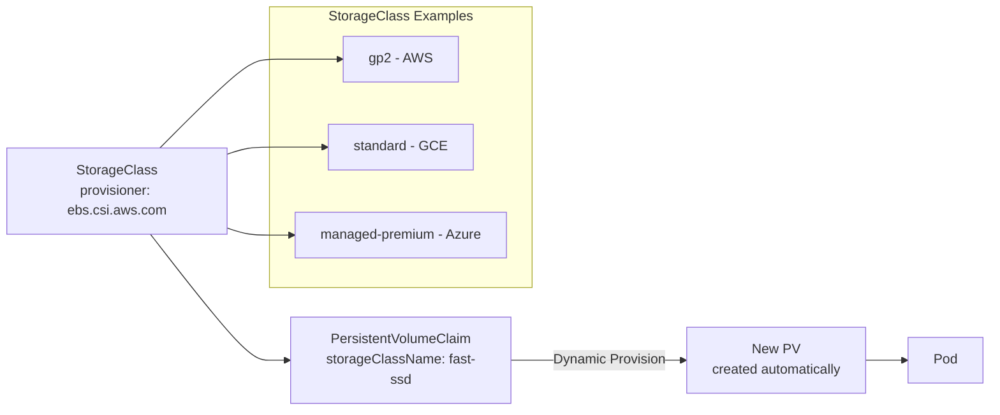

---

## 10. Networking

### Pod Networking (CNI)

```mermaid
graph TB
    subgraph "Node 1"
        subgraph "Pod Network<br/>CIDR: 10.244.0.0/24"
            P1[Pod 1<br/>IP: 10.244.0.5]
            P2[Pod 2<br/>IP: 10.244.0.6]
        end
        N1[Node 1<br/>IP: 192.168.1.10]
        CNI1[CNI Plugin<br/>flannel/calico]
    end

    subgraph "Node 2"
        subgraph "Pod Network<br/>CIDR: 10.244.1.0/24"
            P3[Pod 3<br/>IP: 10.244.1.7]
            P4[Pod 4<br/>IP: 10.244.1.8]
        end
        N2[Node 2<br/>IP: 192.168.1.11]
        CNI2[CNI Plugin<br/>flannel/calico]
    end

    P1 -->|VXLAN/GRE| CNI1
    P2 -->|VXLAN/GRE| CNI1
    P3 -->|VXLAN/GRE| CNI2
    P4 -->|VXLAN/GRE| CNI2

    CNI1 -->|Overlay Network| CNI2

    Note right of P1: Every pod has<br/>unique IP in cluster
    Note right of CNI1: CNI creates<br/>pod-to-pod connectivity
```

---

## 11. Ingress

### Ingress Architecture

```mermaid
graph TD
    subgraph "Internet"
        USER[User<br/>https://app.example.com]
    end

    subgraph "Cloud Provider"
        LB[Load Balancer<br/>Port 80/443]
    end

    subgraph "K8s Cluster"
        INGRESS[Ingress Controller<br/>nginx/traefik]
        INGRESS --> SVC1[Service: web-app<br/>Port 8080]
        INGRESS --> SVC2[Service: api<br/>Port 3000]
        INGRESS --> SVC3[Service: admin<br/>Port 9000]

        subgraph "Pod Backend"
            P1[Web Pod]
            P2[API Pod]
            P3[Admin Pod]
        end
    end

    SVC1 --> P1
    SVC2 --> P2
    SVC3 --> P3

    USER --> LB
    LB --> INGRESS

    INGRESS -->|Route by<br/>host/path| SVC1

    Note right of INGRESS: "Rules:<br/>- / -> web-app<br/>- /api -> api<br/>- /admin -> admin"
```

### Ingress Resource Example

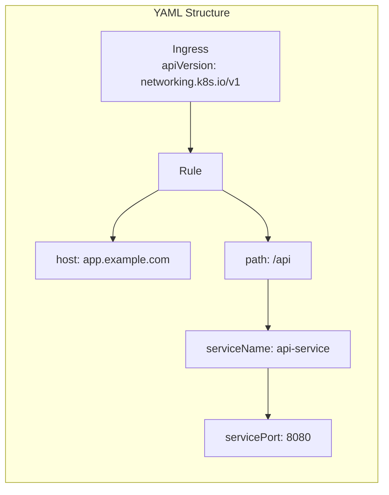

---

## 12. StatefulSet

### StatefulSet Characteristics

```mermaid
graph TD
    subgraph "StatefulSet Features"
        STABLE[Stable Network ID]
        ORDERED[Ordered Deployment]
        STORAGE[Stable Storage]
    end

    subgraph "Example: ZooKeeper"
        SS[StatefulSet<br/>replicas: 3]
        P1[zk-0<br/>Pod IP: stable<br/>PV: pvc-zk-0]
        P2[zk-1<br/>Pod IP: stable<br/>PV: pvc-zk-1]
        P3[zk-2<br/>Pod IP: stable<br/>PV: pvc-zk-2]
    end

    SS --> P1
    SS --> P2
    SS --> P3

    Note right of SS: Pods created in order<br/>zk-0, zk-1, zk-2
    Note right of P1: Each pod has<br/>unique, persistent identity

    subgraph "Deployment Order"
        D1[Scale down<br/>P3 first]
        D2[Then P2]
        D3[Finally P1]
    end

    style SS fill:#a29bfe
    style P1 fill:#ffeaa7
    style P2 fill:#ffeaa7
    style P3 fill:#ffeaa7
```

---

## 13. DaemonSet

### DaemonSet Pattern

```mermaid
graph TD
    subgraph "DaemonSet: Log Collector"
        DS[DaemonSet<br/>fluentd]
        P1[Pod on Node 1]
        P2[Pod on Node 2]
        P3[Pod on Node 3]
        P4[Pod on Node N]
    end

    DS --> P1
    DS --> P2
    DS --> P3
    DS --> P4

    subgraph "Node 1"
        N1[Node 1]
        P1 --> LOGS1[Node Logs]
    end

    subgraph "Node 2"
        N2[Node 2]
        P2 --> LOGS2[Node Logs]
    end

    subgraph "Node 3"
        N3[Node 3]
        P3 --> LOGS3[Node Logs]
    end

    LOGS1 --> CENTRAL[Central<br/>Log Storage]
    LOGS2 --> CENTRAL
    LOGS3 --> CENTRAL

    Note right of DS: One pod on EVERY node<br/>(new nodes auto-get pod)
    Note right of CENTRAL: Collects logs<br/>from all nodes
```

### Use Cases

```mermaid
mindmap
  root((DaemonSet<br/>Use Cases))
    Monitoring
      node-exporter
      Datadog Agent
      New Relic
    Logging
      fluentd
      Filebeat
      Logstash
    Networking
      kube-proxy
      CNI Plugin
      Network Policy Agent
    Security
      Falco
      Sysdig
      ClamAV
    Storage
      Ceph OSD
      GlusterFS
```

---

## 14. Job & CronJob

### Job vs CronJob

```mermaid
graph TD
    subgraph "Job (One-time)"
        J[Job]
        J --> P[Pod 1]
        J --> P2[Pod 2<br/>(if failed)]
        P --> COMPLETE[Completed]
        P2 --> COMPLETE
    end

    subgraph "CronJob (Scheduled)"
        CJ[CronJob<br/>schedule: "*/5 * * * *"]
        CJ -->|Every 5 min| JOB1[Job 1]
        CJ -->|Next run| JOB2[Job 2]
        JOB1 --> P3[Pod]
        JOB2 --> P4[Pod]
    end

    subgraph "Completions"
        J3[Job<br/>completions: 3]
        J3 -->|Run 3 times| P5[Pod]
        J3 -->|Run 3 times| P6[Pod]
        J3 -->|Run 3 times| P7[Pod]
    end

    Note right of J: Runs until<br/>success (1 time)
    Note right of CJ: Runs on<br/>schedule
    Note right of J3: Parallel or<br/>sequential completions
```

---

## 15. RBAC (Role-Based Access Control)

### RBAC Model

```mermaid
graph TD
    subgraph "User/Group"
        USER[Developer<br/>alice@company.com]
        GROUP[DevOps Team]
    end

    subgraph "Service Account"
        SA[Service Account<br/>default/sa-name]
    end

    subgraph "Role & RoleBinding"
        ROLE[Role<br/>- get pods<br/>- list pods<br/>- create pods]
        RB[RoleBinding<br/>binds: User/SA → Role]
    end

    subgraph "ClusterRole & ClusterRoleBinding"
        CR[ClusterRole<br/>cluster-admin,<br/>view, edit]
        CRB[ClusterRoleBinding<br/>binds: User/SA → CR]
    end

    USER -->|via| RB
    GROUP -->|via| CRB
    SA -->|via| CRB

    RB --> ROLE
    CRB --> CR

    ROLE -->|grants| RESOURCES[Resources:<br/>pods, services, etc.]
    CR -->|grants| RESOURCES

    Note right of RB: Namespace-scoped
    Note right of CRB: Cluster-wide

    style ROLE fill:#fdcb6e
    style CR fill:#00b894
    style SA fill:#e17055
```

---

## 16. Monitoring

### Monitoring Stack

```mermaid
graph TB
    subgraph "K8s Cluster"
        P1[Pod 1]
        P2[Pod 2]
        P3[Pod 3]
        N1[Node 1]

        subgraph "Monitoring Pods"
            PROM[Prometheus<br/>metrics collection]
            GRAFANA[Grafana<br/>visualization]
            ALERT[Alertmanager<br/>alerts]
        end
    end

    P1 -->|/metrics endpoint| PROM
    P2 -->|/metrics endpoint| PROM
    P3 -->|/metrics endpoint| PROM
    N1 -->|node metrics| PROM

    PROM -->|scrape| METRICS[Metrics:<br/>CPU, Memory,<br/>Network, Disk]

    PROM -->|query| GRAFANA
    PROM -->|send alert| ALERT

    ALERT -->|notify| SLACK[Slack/Email/PagerDuty]
    GRAFANA -->|dashboard| BROWSER[Browser<br/>Grafana UI]

    Note right of PROM: Pull-based<br/>scraping every 15s-2m
    Note right of METRICS: cAdvisor,<br/>kube-state-metrics
```

---

## 📚 Tổng kết

### Các thành phần tương tác

```mermaid
graph LR
    subgraph "Developer"
        YAML[YAML Manifests]
    end

    subgraph "K8s API"
        API[kubectl → API Server]
    end

    subgraph "Control Plane"
        ETCD[(etcd)]
        SCHED[Scheduler]
        CTRL[Controller Manager]
    end

    subgraph "Worker Nodes"
        NODE1[Node 1]
        NODE2[Node 2]
    end

    subgraph "Workloads"
        POD[Pod]
        DEPLOY[Deployment]
        SVC[Service]
    end

    YAML --> API
    API --> ETCD
    ETCD --> SCHED
    ETCD --> CTRL

    SCHED --> NODE1
    CTRL --> NODE2

    NODE1 --> POD
    NODE2 --> POD

    POD --> DEPLOY
    POD --> SVC

    Note right of API: Declarative API<br/>Desired state
    Note right of ETCD: Source of truth<br/>Cluster state
    Note right of NODE1: Runs your<br/>applications
```

### Learning Path đề xuất

```mermaid
journey
    title Kubernetes Learning Path
    section Fundamentals
      Pods: 5: Developer
      Services: 5: Developer
      ConfigMaps: 4: Developer
      Secrets: 4: Developer
    section Orchestration
      Deployments: 5: DevOps
      ReplicaSets: 4: DevOps
      Horizontal Pod Autoscaler: 3: DevOps
    section Networking
      Ingress: 4: Network Engineer
      Network Policies: 3: Network Engineer
    section Storage
      PersistentVolume: 4: DevOps
      StorageClass: 3: Storage Admin
    section Advanced
      StatefulSets: 4: DevOps
      DaemonSets: 3: DevOps
      Jobs/CronJobs: 4: Developer
      RBAC: 4: Security
      Operators: 2: Advanced
```

---

## 🎯 Quick Reference

### Common kubectl Commands

```mermaid
graph LR
    subgraph "Get Resources"
        C1[kubectl get pods]
        C2[kubectl get svc]
        C3[kubectl get nodes]
        C4[kubectl get all]
    end

    subgraph "Describe"
        C5[kubectl describe pod <name>]
        C6[kubectl describe svc <name>]
    end

    subgraph "Create/Apply"
        C7[kubectl apply -f file.yaml]
        C8[kubectl create -f file.yaml]
        C9[kubectl expose deployment <name>]
    end

    subgraph "Delete"
        C10[kubectl delete pod <name>]
        C11[kubectl delete -f file.yaml]
    end

    subgraph "Logs & Exec"
        C12[kubectl logs <pod>]
        C13[kubectl logs -f <pod>]
        C14[kubectl exec -it <pod> -- /bin/bash]
    end

    Note right of C1: List resources
    Note right of C5: Detailed info
    Note right of C7: Apply manifest
    Note right of C10: Delete resource
    Note right of C12: View logs
```

---

## 🔄 Kubernetes Flow: Request Lifecycle

```mermaid
sequenceDiagram
    actor User
    participant kubectl as kubectl CLI
    participant API as API Server
    participant ETCD as etcd
    participant Sched as Scheduler
    participant Kubelet as Kubelet
    participant CRI as Container Runtime
    participant Pod as Pod

    User->>kubectl: kubectl apply -f pod.yaml
    kubectl->>API: POST /api/v1/pods
    API->>ETCD: Store pod object
    API-->>kubectl: 201 Created
    kubectl-->>User: pod/nginx created

    Note over API,Sched: Scheduler watches API Server

    Sched->>API: Watch for unscheduled pods
    API-->>Sched: Pod (pending)
    Sched->>Sched: Select node (resource check)
    Sched->>API: PATCH pod.spec.nodeName
    API->>ETCD: Update pod status
    API-->>Kubelet: Pod assignment (via watch)

    Kubelet->>CRI: Pull nginx:latest image
    CRI-->>Kubelet: Image pulled
    Kubelet->>CRI: Create container
    CRI-->>Kubelet: Container created
    Kubelet->>CRI: Start container
    CRI-->>Kubelet: Container running
    Kubelet->>API: Update pod status (Running)
    API->>ETCD: Store updated status

    Note over Pod: Pod Ready to serve traffic

    User->>Pod: Send HTTP request
    Pod-->>User: Response
```

---

## ✅ Checklist Kiến thức

```mermaid
checklist
    title Kubernetes Core Concepts
    section Container Basics
      [ ] Hiểu container là gì
      [ ] Docker/Container runtime
      [ ] Image vs Container
    section K8s Fundamentals
      [ ] Pod là gì
      [ ] Service loại nào
      [ ] Deployment rolling update
      [ ] ConfigMap & Secret
      [ ] Namespace isolation
    section Networking
      [ ] ClusterIP/NodePort/LB
      [ ] Ingress routing
      [ ] CNI plugin
    section Storage
      [ ] PV vs PVC
      [ ] StorageClass
      [ ] Dynamic provisioning
    section Advanced
      [ ] StatefulSet use case
      [ ] DaemonSet pattern
      [ ] Job & CronJob
      [ ] RBAC permissions
    section Operations
      [ ] kubectl commands
      [ ] kubectl apply/delete
      [ ] kubectl logs/exec
      [ ] Debugging pods
```

---

## 📖 Glossary

| Term | Definition |
|------|-----------|
| **Pod** | Smallest deployable unit (1+ containers) |
| **Node** | Worker machine (VM/Physical) |
| **Cluster** | Set of nodes managed by control plane |
| **Service** | Network endpoint for pods |
| **Deployment** | Declarative pod management |
| **Namespace** | Virtual cluster partition |
| **kubelet** | Agent running on each node |
| **kube-proxy** | Network proxy on nodes |
| **etcd** | Consistent key-value store |
| **CNI** | Container Network Interface |
| **CSI** | Container Storage Interface |
| **CRD** | Custom Resource Definition |
| **Operator** | Custom controller for CRDs |

---

## 🚀 Next Steps

1. **Thực hành**: Cài minikube/kind/k3s
2. **Tài liệu chính thức**: [kubernetes.io/docs](https://kubernetes.io/docs)
3. **Interactive Tutorial**: [Kubernetes.io Tutorials](https://kubernetes.io/docs/tutorials/)
4. **Play with K8s**: [Killercoda](https://killercoda.com/) hoặc [Play with Kubernetes](https://labs.play-with-k8s.com/)
5. **Exam Prep**: CKA (Certified Kubernetes Administrator)

---

<div align="center">
<strong>Happy Learning! 🎓</strong><br/>
<i>Created with ❤️ by Claude Code</i>
</div>
