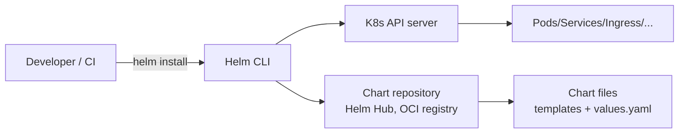

# 🎓 Helm — Package manager cho K8s, deploy 50 service không copy-paste

> **Tác giả:** Mr.Rom\
> **Phiên bản:** v1.1.0\
> **Tạo lúc:** 24/05/2026\
> **Cập nhật:** 25/05/2026\
> **Level:** Intermediate\
> **Tags:** [MUST-KNOW]\
> **Thời lượng đọc:** ~25 phút\
> **Prerequisites:** [00_intermediate-overview.md](00_intermediate-overview.md), K8s basic cluster

> 🎯 *Bạn có 5 service FastAPI tương tự nhau, mỗi cái 8 file YAML — copy-paste 40 file, sửa tag image phải sửa 5 chỗ. Helm giải quyết: 1 chart template, 5 values.yaml. Bài này dạy chart anatomy, templating, hooks, release lifecycle, sub-chart, Helm vs Kustomize.*

## 🎯 Sau bài này bạn sẽ

- [ ] Hiểu **Helm** là gì, kiến trúc, release lifecycle
- [ ] Viết **chart đầu tiên** cho FastAPI từ template `helm create`
- [ ] Dùng **`values.yaml`** + override per env (dev/staging/prod)
- [ ] Hiểu **template functions** (sprig) + `_helpers.tpl`
- [ ] Dùng **public chart** (kube-prometheus-stack, postgres, redis)
- [ ] Setup **chart museum** (private chart repo)
- [ ] So sánh **Helm vs Kustomize** — biết khi dùng cái nào
- [ ] **Release lifecycle**: install → upgrade → rollback → uninstall

---

## Tình huống — 5 microservice, 40 file YAML, ác mộng update

Bạn có 5 microservice: `api`, `worker`, `cron`, `payment`, `notify`. Mỗi service có:
- `deployment.yaml`
- `service.yaml`
- `configmap.yaml`
- `secret.yaml`
- `ingress.yaml`
- `hpa.yaml`
- `pdb.yaml`
- `serviceaccount.yaml`

→ **40 file YAML** trong repo. Mỗi file 50-80 dòng, similar nhau.

Sếp: *"Update image tag từ `v1.2.3` lên `v1.2.4` cho tất cả 5 service."*

Bạn:
```bash
sed -i 's/v1.2.3/v1.2.4/g' deploy/*/deployment.yaml
kubectl apply -f deploy/
```

→ Sửa 5 file. **Ok với 5 service**.

Tuần sau, bạn cần thêm:
- Sửa `replicas: 3 → 5` cho prod, dev giữ 1.
- Thêm `resources.limits` cho mọi pod.
- Update `imagePullSecret`.
- Add liveness probe.

Mỗi thay đổi = sửa 5+ file. Diff PR review = nhìn 200 dòng. Lỗi sót thường xuyên (file A đã update, file B quên).

Sếp: *"Dùng Helm đi. 1 chart template, 5 values.yaml. Update image tag = 1 lệnh thay 5."*

→ Bài này dạy.

---

## 1️⃣ Vậy Helm thực sự là gì?

**Helm** = package manager cho K8s. Tương tự `apt` (Debian) / `brew` (macOS) / `npm` (Node) — nhưng cho K8s resources.

### Kiến trúc

Helm gồm **4 component** — CLI (client-side), Chart (package definition), Release (instance đã deploy), Repository (chart store). Helm 3 (2019+) bỏ server-side Tiller — pure client-side, secure hơn:



**Components**:
- **Helm CLI** (v3+): client-side, talk to K8s API.
- **Chart**: package = templates + `values.yaml` + `Chart.yaml`.
- **Release**: 1 chart deployed lên cluster với specific values.
- **Repository**: nơi chứa chart packages (Artifact Hub, OCI registry, ChartMuseum).

> 💡 **Helm 3 vs Helm 2**: Helm 2 có server-side component "Tiller" (security issues). **Helm 3 (2019+) bỏ Tiller** — client-side only, dùng K8s Secret để lưu release state. **Always use Helm 3.**

🪞 **Ẩn dụ**: *Helm chart như **công thức nấu ăn template hóa** — `values.yaml` là "khẩu phần và gia vị" bạn truyền vào. 1 công thức = nhiều dish cho nhiều dịp (dev/staging/prod). `helm install` = nấu ăn theo công thức + khẩu phần này.*

### Install Helm

Helm CLI cài standalone — không cần server. Mọi OS support, dưới 1 phút. Verify version sau khi cài để đảm bảo Helm 3 (KHÔNG dùng Helm 2 nữa):

```bash
# macOS
brew install helm

# Linux
curl https://raw.githubusercontent.com/helm/helm/main/scripts/get-helm-3 | bash

# Verify
helm version
# version.BuildInfo{Version:"v3.14.4", ...}
```

---

## 2️⃣ Chart anatomy — Cấu trúc 1 Helm chart

### Tạo chart từ template

`helm create <name>` scaffold chart đầy đủ — tự generate `Chart.yaml`, `values.yaml`, templates (deployment, service, ingress, hpa). Đây là khởi đầu chuẩn cho mọi chart mới:

```bash
helm create myapp
```

Tạo folder structure:
```
myapp/
├── Chart.yaml             ← Metadata (name, version, appVersion)
├── values.yaml            ← Default values
├── charts/                ← Sub-charts (dependencies)
├── templates/
│   ├── _helpers.tpl       ← Reusable template snippets
│   ├── deployment.yaml    ← Deployment template
│   ├── service.yaml       ← Service template
│   ├── ingress.yaml       ← Ingress template
│   ├── hpa.yaml
│   ├── serviceaccount.yaml
│   ├── NOTES.txt          ← Post-install message
│   └── tests/
│       └── test-connection.yaml
└── .helmignore            ← Ignore patterns (như .gitignore)
```

### `Chart.yaml` — Metadata

File `Chart.yaml` chứa metadata về chart — name, version, dependencies. Quan trọng nhất: **`version`** (chart version) khác `appVersion` (version của app). Tách 2 cái để chart có thể bump khi config đổi nhưng app version giữ:

```yaml
apiVersion: v2          # Helm 3 = v2
name: myapp
description: A Helm chart for FastAPI app
type: application       # 'application' or 'library'
version: 1.2.3          # Chart version (semver)
appVersion: "0.5.1"     # App version this chart deploys
keywords:
  - fastapi
  - python
home: https://github.com/acme/myapp
sources:
  - https://github.com/acme/myapp
maintainers:
  - name: Mr.Rom
    email: dev@acmeshop.vn

# Dependencies (sub-charts)
dependencies:
  - name: postgresql
    version: "15.x.x"
    repository: "oci://registry-1.docker.io/bitnamicharts"
    condition: postgresql.enabled
```

### `values.yaml` — Default config

`values.yaml` chứa **default values** cho templates — user override khi `helm install` qua `--set` hoặc custom `values-prod.yaml`. Đây là interface chính để customize chart cho từng môi trường:

```yaml
# Default values
replicaCount: 1

image:
  repository: ghcr.io/acme/myapp
  pullPolicy: IfNotPresent
  tag: ""    # Default empty → use Chart.appVersion

imagePullSecrets: []
nameOverride: ""
fullnameOverride: ""

serviceAccount:
  create: true
  annotations: {}
  name: ""

podSecurityContext: {}
securityContext:
  runAsNonRoot: true
  runAsUser: 1000

service:
  type: ClusterIP
  port: 8000

ingress:
  enabled: false
  className: nginx
  annotations:
    cert-manager.io/cluster-issuer: letsencrypt-prod
  hosts:
    - host: api.acmeshop.vn
      paths:
        - path: /
          pathType: Prefix
  tls:
    - secretName: api-acmeshop-tls
      hosts:
        - api.acmeshop.vn

resources:
  limits:
    cpu: 500m
    memory: 512Mi
  requests:
    cpu: 100m
    memory: 256Mi

autoscaling:
  enabled: false
  minReplicas: 1
  maxReplicas: 10
  targetCPUUtilizationPercentage: 80

nodeSelector: {}
tolerations: []
affinity: {}

# Sub-chart config
postgresql:
  enabled: true
  auth:
    database: myapp
    username: myapp
  primary:
    persistence:
      size: 10Gi
```

### `templates/deployment.yaml` — Template

```yaml
apiVersion: apps/v1
kind: Deployment
metadata:
  name: {{ include "myapp.fullname" . }}
  labels:
    {{- include "myapp.labels" . | nindent 4 }}
spec:
  {{- if not .Values.autoscaling.enabled }}
  replicas: {{ .Values.replicaCount }}
  {{- end }}
  selector:
    matchLabels:
      {{- include "myapp.selectorLabels" . | nindent 6 }}
  template:
    metadata:
      labels:
        {{- include "myapp.selectorLabels" . | nindent 8 }}
    spec:
      {{- with .Values.imagePullSecrets }}
      imagePullSecrets:
        {{- toYaml . | nindent 8 }}
      {{- end }}
      serviceAccountName: {{ include "myapp.serviceAccountName" . }}
      securityContext:
        {{- toYaml .Values.podSecurityContext | nindent 8 }}
      containers:
        - name: {{ .Chart.Name }}
          securityContext:
            {{- toYaml .Values.securityContext | nindent 12 }}
          image: "{{ .Values.image.repository }}:{{ .Values.image.tag | default .Chart.AppVersion }}"
          imagePullPolicy: {{ .Values.image.pullPolicy }}
          ports:
            - name: http
              containerPort: {{ .Values.service.port }}
              protocol: TCP
          livenessProbe:
            httpGet:
              path: /health
              port: http
          readinessProbe:
            httpGet:
              path: /ready
              port: http
          resources:
            {{- toYaml .Values.resources | nindent 12 }}
```

### `templates/_helpers.tpl` — Reusable snippets

```yaml
{{/*
Expand the name of the chart.
*/}}
{{- define "myapp.name" -}}
{{- default .Chart.Name .Values.nameOverride | trunc 63 | trimSuffix "-" }}
{{- end }}

{{/*
Create a default fully qualified app name.
*/}}
{{- define "myapp.fullname" -}}
{{- if .Values.fullnameOverride }}
{{- .Values.fullnameOverride | trunc 63 | trimSuffix "-" }}
{{- else }}
{{- $name := default .Chart.Name .Values.nameOverride }}
{{- if contains $name .Release.Name }}
{{- .Release.Name | trunc 63 | trimSuffix "-" }}
{{- else }}
{{- printf "%s-%s" .Release.Name $name | trunc 63 | trimSuffix "-" }}
{{- end }}
{{- end }}
{{- end }}

{{/*
Common labels
*/}}
{{- define "myapp.labels" -}}
helm.sh/chart: {{ include "myapp.chart" . }}
{{ include "myapp.selectorLabels" . }}
app.kubernetes.io/version: {{ .Chart.AppVersion | quote }}
app.kubernetes.io/managed-by: {{ .Release.Service }}
{{- end }}

{{/*
Selector labels
*/}}
{{- define "myapp.selectorLabels" -}}
app.kubernetes.io/name: {{ include "myapp.name" . }}
app.kubernetes.io/instance: {{ .Release.Name }}
{{- end }}
```

→ `{{ include "myapp.fullname" . }}` reuse logic ở mọi template.

---

## 3️⃣ Helm release lifecycle

### Install

```bash
# Install chart từ folder local
helm install myapp ./myapp

# Output:
# NAME: myapp
# NAMESPACE: default
# STATUS: deployed
# REVISION: 1
```

Verify resources:
```bash
kubectl get all -l app.kubernetes.io/instance=myapp
# pod/myapp-7d8b9c4f-abc12   1/1 Running
# service/myapp               ClusterIP 10.0.x.x
# deployment.apps/myapp        1/1
# replicaset.apps/myapp-7d8b9c4f 1
```

### Install với custom values

```bash
# Override 1 value
helm install myapp ./myapp \
  --set replicaCount=3 \
  --set image.tag=v1.2.4

# Override từ file values
helm install myapp ./myapp -f values-prod.yaml

# Combine
helm install myapp ./myapp -f values-prod.yaml --set replicaCount=10
```

### Upgrade

```bash
# Sửa values rồi upgrade
helm upgrade myapp ./myapp --set image.tag=v1.2.4

# --atomic: rollback nếu fail
helm upgrade myapp ./myapp --set image.tag=v1.2.4 --atomic

# --wait: wait until all resources ready
helm upgrade myapp ./myapp -f values-prod.yaml --wait --timeout 5m
```

### Rollback

```bash
# List history
helm history myapp
# REVISION   UPDATED                STATUS      CHART        APP VERSION
# 1          2026-05-20 10:00:00   superseded  myapp-1.0.0  0.5.0
# 2          2026-05-22 14:30:00   superseded  myapp-1.1.0  0.5.1
# 3          2026-05-24 09:15:00   deployed    myapp-1.2.0  0.5.2

# Rollback đến revision cụ thể
helm rollback myapp 2

# Hoặc rollback 1 step
helm rollback myapp 0
```

### Uninstall

```bash
helm uninstall myapp
# release "myapp" uninstalled

# Keep history (cho restore sau)
helm uninstall myapp --keep-history
```

### List releases

```bash
helm list                      # current namespace
helm list -A                   # all namespaces
helm list --filter myapp       # regex filter

helm status myapp              # detailed status
helm get values myapp          # current values
helm get manifest myapp        # rendered YAML
```

---

## 4️⃣ Multi-env pattern — dev/staging/prod

### Folder structure

```
helm-deploys/
├── myapp/                    # Chart
│   ├── Chart.yaml
│   ├── values.yaml           # Defaults
│   └── templates/
└── envs/
    ├── values-dev.yaml
    ├── values-staging.yaml
    └── values-prod.yaml
```

### `values-dev.yaml`

```yaml
replicaCount: 1

image:
  tag: latest    # Mutable trong dev

ingress:
  enabled: true
  hosts:
    - host: api-dev.acmeshop.vn

resources:
  limits:
    cpu: 200m
    memory: 256Mi

postgresql:
  enabled: true    # embed Postgres for dev
  primary:
    persistence:
      size: 1Gi    # small for dev
```

### `values-staging.yaml`

```yaml
replicaCount: 2

image:
  tag: "v1.2.3-staging"

ingress:
  enabled: true
  hosts:
    - host: api-staging.acmeshop.vn

autoscaling:
  enabled: true
  minReplicas: 2
  maxReplicas: 5

postgresql:
  enabled: false   # external Postgres
externalDatabase:
  host: postgres-staging.internal
  port: 5432
```

### `values-prod.yaml`

```yaml
replicaCount: 5

image:
  tag: "v1.2.3"   # immutable digest preferred

ingress:
  enabled: true
  hosts:
    - host: api.acmeshop.vn
  tls:
    - secretName: api-acmeshop-tls
      hosts:
        - api.acmeshop.vn

autoscaling:
  enabled: true
  minReplicas: 5
  maxReplicas: 50
  targetCPUUtilizationPercentage: 70

resources:
  limits:
    cpu: 1000m
    memory: 1Gi
  requests:
    cpu: 500m
    memory: 512Mi

postgresql:
  enabled: false
externalDatabase:
  host: postgres-prod.cluster.local
  port: 5432

podDisruptionBudget:
  enabled: true
  minAvailable: 80%
```

### Deploy

```bash
helm install myapp ./myapp -f envs/values-dev.yaml --namespace dev
helm install myapp ./myapp -f envs/values-staging.yaml --namespace staging
helm install myapp ./myapp -f envs/values-prod.yaml --namespace production
```

→ **1 chart**, **3 release** với configs riêng. Update image tag prod = sửa 1 dòng trong `values-prod.yaml`.

---

## 5️⃣ Template functions — Sprig + built-in

### Built-in objects

| Object | Mô tả | Ví dụ |
|---|---|---|
| `.Release.Name` | Tên release | `myapp` |
| `.Release.Namespace` | Namespace install | `production` |
| `.Release.IsInstall` | True khi đang install | bool |
| `.Release.IsUpgrade` | True khi đang upgrade | bool |
| `.Chart.Name` | Tên chart | `myapp` |
| `.Chart.Version` | Version chart | `1.2.3` |
| `.Chart.AppVersion` | App version | `0.5.2` |
| `.Values.X` | Giá trị từ values.yaml | `{{ .Values.replicaCount }}` |
| `.Files.Get` | Đọc file trong chart | `{{ .Files.Get "config.json" }}` |
| `.Capabilities` | K8s/Helm version info | `{{ .Capabilities.KubeVersion }}` |

### Sprig functions (string/math/list/dict)

```yaml
# String
{{ .Values.name | upper }}                  # uppercase
{{ .Values.name | lower }}                  # lowercase
{{ .Values.name | trim }}                   # trim whitespace
{{ .Values.name | quote }}                  # wrap in quotes
{{ .Values.name | default "myapp" }}        # default if empty

# Math
{{ add 1 2 }}                                # 3
{{ mul .Values.replicas 2 }}                 # replicas × 2

# List
{{ range .Values.hosts }}
  - {{ . }}
{{ end }}

# Dict
{{ range $key, $value := .Values.config }}
  {{ $key }}: {{ $value }}
{{ end }}

# Conditional
{{ if .Values.ingress.enabled }}
  # ingress yaml here
{{ end }}

{{ if eq .Values.env "prod" }}
  resources:
    limits: { cpu: 1000m }
{{ end }}
```

### Pipe operations

```yaml
# Read file content, base64 encode, indent
config.json: {{ .Files.Get "configs/config.json" | b64enc | quote }}

# Convert YAML object to indented YAML string
{{ toYaml .Values.resources | nindent 12 }}
```

### `range` over dictionary

```yaml
data:
  {{- range $key, $value := .Values.envVars }}
  {{ $key }}: {{ $value | quote }}
  {{- end }}
```

`values.yaml`:
```yaml
envVars:
  DATABASE_URL: postgres://...
  REDIS_URL: redis://...
  LOG_LEVEL: info
```

→ Generated ConfigMap:
```yaml
data:
  DATABASE_URL: "postgres://..."
  REDIS_URL: "redis://..."
  LOG_LEVEL: "info"
```

---

## 6️⃣ Hooks — Pre/post install/upgrade

Helm hook = template với annotation special, chạy thời điểm cụ thể trong release lifecycle.

### Available hooks

| Hook | Khi chạy |
|---|---|
| `pre-install` | Trước install |
| `post-install` | Sau install thành công |
| `pre-upgrade` | Trước upgrade |
| `post-upgrade` | Sau upgrade thành công |
| `pre-delete` | Trước uninstall |
| `post-delete` | Sau uninstall |
| `pre-rollback` | Trước rollback |
| `post-rollback` | Sau rollback |
| `test` | Khi chạy `helm test` |

### Ví dụ: DB migration job pre-upgrade

```yaml
# templates/migration-job.yaml
apiVersion: batch/v1
kind: Job
metadata:
  name: {{ include "myapp.fullname" . }}-migrate
  annotations:
    "helm.sh/hook": pre-upgrade,pre-install
    "helm.sh/hook-weight": "-5"
    "helm.sh/hook-delete-policy": before-hook-creation,hook-succeeded
spec:
  template:
    spec:
      restartPolicy: Never
      containers:
        - name: migrate
          image: "{{ .Values.image.repository }}:{{ .Values.image.tag }}"
          command: ["alembic", "upgrade", "head"]
          env:
            - name: DATABASE_URL
              valueFrom:
                secretKeyRef:
                  name: {{ include "myapp.fullname" . }}-secret
                  key: database_url
```

→ Mỗi `helm upgrade`, chạy migration trước khi deploy version mới.

### Hook annotations explained

- **`hook-weight`**: thứ tự thực thi (low → high). `-5` chạy trước hook `0`.
- **`hook-delete-policy`**:
  - `before-hook-creation`: xoá hook cũ trước khi tạo mới (default).
  - `hook-succeeded`: xoá sau khi thành công.
  - `hook-failed`: xoá sau khi fail.

### Helm test

```yaml
# templates/tests/test-connection.yaml
apiVersion: v1
kind: Pod
metadata:
  name: "{{ include "myapp.fullname" . }}-test"
  annotations:
    "helm.sh/hook": test
spec:
  restartPolicy: Never
  containers:
    - name: test
      image: busybox
      command: ['wget']
      args: ['{{ include "myapp.fullname" . }}:{{ .Values.service.port }}']
```

Run:
```bash
helm test myapp
# Pod test-connection succeeded
```

---

## 7️⃣ Public charts — Postgres, Redis, Prometheus

### Artifact Hub — chart marketplace

[https://artifacthub.io/](https://artifacthub.io/) — search hàng nghìn chart.

### Bitnami charts (most popular)

```bash
# Add repo (legacy way)
helm repo add bitnami https://charts.bitnami.com/bitnami
helm repo update

# OR OCI registry (modern, Helm 3.8+)
helm install postgresql oci://registry-1.docker.io/bitnamicharts/postgresql

# Inspect
helm show values bitnami/postgresql > postgres-default-values.yaml
helm show chart bitnami/postgresql

# Install với custom values
helm install my-postgres bitnami/postgresql \
  --set auth.postgresPassword=secret \
  --set primary.persistence.size=50Gi \
  --namespace database \
  --create-namespace
```

### kube-prometheus-stack (monitor cluster all-in-one)

```bash
helm repo add prometheus-community https://prometheus-community.github.io/helm-charts
helm repo update

helm install kube-prometheus prometheus-community/kube-prometheus-stack \
  --namespace monitoring \
  --create-namespace \
  --set grafana.adminPassword=admin \
  --version 56.x.x
```

→ Bundle: Prometheus + Alertmanager + Grafana + node-exporter + kube-state-metrics. Cài 1 lệnh = monitoring full stack.

### cert-manager

```bash
helm repo add jetstack https://charts.jetstack.io
helm install cert-manager jetstack/cert-manager \
  --namespace cert-manager \
  --create-namespace \
  --set installCRDs=true
```

→ Bài 02 dùng cert-manager cho TLS auto.

### Sub-chart dependency

Trong `Chart.yaml`:
```yaml
dependencies:
  - name: postgresql
    version: "15.x.x"
    repository: "oci://registry-1.docker.io/bitnamicharts"
    condition: postgresql.enabled
```

```bash
# Pull sub-charts vào charts/ folder
helm dependency update

# Hoặc
helm dependency build
```

→ Folder `charts/postgresql-15.x.x.tgz` created. `helm install` deploy luôn chart con với main chart.

---

## 8️⃣ Chart repo — ChartMuseum / OCI

### ChartMuseum (legacy nhưng vẫn dùng)

Deploy ChartMuseum trong cluster:
```bash
helm install chartmuseum stable/chartmuseum \
  --set env.open.DISABLE_API=false \
  --set persistence.enabled=true
```

Push chart:
```bash
helm package myapp/
# myapp-1.2.3.tgz

curl --data-binary "@myapp-1.2.3.tgz" http://chartmuseum.acmeshop.vn/api/charts
```

### OCI registry (Helm 3.8+ — modern)

Push chart đến OCI registry như image:
```bash
helm package myapp/
helm push myapp-1.2.3.tgz oci://harbor.acmeshop.vn/charts

# Install từ OCI
helm install myapp oci://harbor.acmeshop.vn/charts/myapp --version 1.2.3
```

→ **2026 default**: dùng OCI registry (Harbor, ECR, GHCR) cho cả image + chart. Single source of truth.

### GitHub Pages chart repo

```bash
# Trong repo helm-charts
helm package myapp/
helm repo index . --url https://acme.github.io/helm-charts/

# Push lên gh-pages branch
git checkout -b gh-pages
git add myapp-1.2.3.tgz index.yaml
git commit -m "Release myapp 1.2.3"
git push origin gh-pages
```

→ Free chart hosting trên GitHub Pages.

---

## 9️⃣ Helm vs Kustomize — Khi dùng cái nào

| Aspect | **Helm** | **Kustomize** |
|---|---|---|
| Approach | Template + values | Base + overlays patches |
| DSL | Go template + Sprig (Helm syntax) | YAML patches (no DSL) |
| Power | Full programming (loop, conditional) | YAML transformation only |
| Learning curve | Medium-high | Low |
| Reusability | Public chart marketplace huge | Limited shared |
| Native K8s | External tool | Built-in `kubectl apply -k` |
| Use case | Package distribution, complex apps | Config tweak across env |
| Sub-charts | Yes (powerful) | No (composition khác) |
| Release management | Built-in (history, rollback) | None (manual via Git) |

### Khi Helm thắng

- Distribute **OSS chart** (Postgres, Redis, ...): Helm dominate.
- Complex template với conditional/loop: Helm.
- Release management built-in: Helm.

### Khi Kustomize thắng

- Simple overlay env (dev/staging/prod patches lightweight): Kustomize.
- Không muốn template DSL: Kustomize plain YAML.
- ArgoCD/Flux native support: cả 2 OK.

### Hybrid (popular pattern)

Dùng Helm cho **public chart** (postgres-operator, cert-manager), Kustomize cho **business app config** (overlay per env):

```bash
# Use Helm chart as base
helm template myapp ./myapp -f values-base.yaml > base/myapp.yaml

# Kustomize overlay per env
kustomize build overlays/prod | kubectl apply -f -
```

→ **Trend 2026**: Helm + Kustomize hybrid, hoặc Helm chỉ (đa số). ArgoCD support cả 2.

---

## 🔟 Hands-on: Viết chart cho FastAPI từ đầu

### Step 1: Generate skeleton

```bash
helm create fastapi-chart
cd fastapi-chart
```

### Step 2: Customize `Chart.yaml`

```yaml
apiVersion: v2
name: fastapi-chart
description: Production-ready FastAPI Helm chart
type: application
version: 1.0.0
appVersion: "0.5.0"

dependencies:
  - name: postgresql
    version: "15.x.x"
    repository: "oci://registry-1.docker.io/bitnamicharts"
    condition: postgresql.enabled
```

### Step 3: Customize `values.yaml`

```yaml
replicaCount: 2

image:
  repository: ghcr.io/acme/fastapi
  pullPolicy: IfNotPresent
  tag: "v1.2.3"

service:
  type: ClusterIP
  port: 8000

ingress:
  enabled: true
  className: nginx
  annotations:
    cert-manager.io/cluster-issuer: letsencrypt-prod
  hosts:
    - host: api.acmeshop.vn
      paths:
        - path: /
          pathType: Prefix
  tls:
    - secretName: api-tls
      hosts: [api.acmeshop.vn]

resources:
  limits:
    cpu: 500m
    memory: 512Mi
  requests:
    cpu: 100m
    memory: 256Mi

autoscaling:
  enabled: true
  minReplicas: 2
  maxReplicas: 10
  targetCPUUtilizationPercentage: 70

env:
  LOG_LEVEL: info
  WORKERS: "4"

postgresql:
  enabled: true
  auth:
    database: fastapi
    username: fastapi
  primary:
    persistence:
      size: 10Gi
```

### Step 4: Add custom ConfigMap template

`templates/configmap.yaml`:
```yaml
apiVersion: v1
kind: ConfigMap
metadata:
  name: {{ include "fastapi-chart.fullname" . }}-config
  labels:
    {{- include "fastapi-chart.labels" . | nindent 4 }}
data:
  {{- range $key, $value := .Values.env }}
  {{ $key }}: {{ $value | quote }}
  {{- end }}
```

### Step 5: Add Secret template

`templates/secret.yaml`:
```yaml
{{- if .Values.postgresql.enabled }}
apiVersion: v1
kind: Secret
metadata:
  name: {{ include "fastapi-chart.fullname" . }}-db
  labels:
    {{- include "fastapi-chart.labels" . | nindent 4 }}
type: Opaque
stringData:
  DATABASE_URL: "postgresql://{{ .Values.postgresql.auth.username }}:$(POSTGRES_PASSWORD)@{{ .Release.Name }}-postgresql:5432/{{ .Values.postgresql.auth.database }}"
{{- end }}
```

### Step 6: Lint + render + install

```bash
# Lint
helm lint .

# Render template để xem output (không deploy)
helm template fastapi . | head -50

# Dry-run install
helm install fastapi . --dry-run --debug

# Real install
helm dependency update      # pull postgresql sub-chart
helm install fastapi . --namespace production --create-namespace

# Verify
helm list -n production
kubectl get all -n production -l app.kubernetes.io/instance=fastapi
```

### Step 7: Upgrade

Sửa `values.yaml`:
```yaml
image:
  tag: "v1.2.4"
replicaCount: 3
```

```bash
helm upgrade fastapi . --namespace production --atomic --wait
```

### Step 8: Rollback

```bash
helm history fastapi -n production
helm rollback fastapi 1 -n production
```

---

## 💡 Pitfall & Best practice

### ❌ Pitfall: Quên `--namespace` → install nhầm default

```bash
helm install fastapi .   # ← nhầm default namespace
helm list                # ← list default only
```

→ **Fix**: Luôn `--namespace <name>` hoặc setup `kubectl config set-context --current --namespace=<name>`.

### ❌ Pitfall: `helm upgrade --install` mà không `--atomic`

```bash
helm upgrade --install fastapi . -f values-prod.yaml
```

→ Nếu upgrade fail giữa chừng, cluster có state lai (1 pod new + 1 pod old, broken). `--atomic` rollback tự động nếu fail.

→ **Fix**: 
```bash
helm upgrade --install fastapi . -f values-prod.yaml \
  --atomic --timeout 5m --wait
```

### ❌ Pitfall: Template render sai vì `{{ }}` thiếu space

```yaml
# ❌
{{.Values.replicaCount}}    # works in Helm but not recommended

# ✅
{{ .Values.replicaCount }}
```

→ **Fix**: Convention space cả 2 phía.

### ❌ Pitfall: `helm uninstall` xoá luôn PVC

```bash
helm uninstall postgresql
# PVC postgres-data-postgresql-0 cũng bị xoá → mất data!
```

→ **Fix**: Bitnami chart có config `persistence.resourcePolicy: keep` — keep PVC sau uninstall:
```yaml
persistence:
  resourcePolicy: keep
```

Hoặc tạo PVC ngoài chart, reference vào.

### ❌ Pitfall: Override `imagePullSecrets` ở values nhưng template không có

```yaml
# values.yaml
imagePullSecrets:
  - name: ghcr-secret

# templates/deployment.yaml — thiếu reference!
spec:
  template:
    spec:
      # imagePullSecrets: ?? — quên
      containers: ...
```

→ **Fix**: Add reference:
```yaml
{{- with .Values.imagePullSecrets }}
imagePullSecrets:
  {{- toYaml . | nindent 8 }}
{{- end }}
```

### ❌ Pitfall: Sub-chart values nested không đúng

```yaml
# Wrong — Bitnami postgresql expect nested
postgresql:
  enabled: true
  password: secret   # ← Bitnami không có top-level "password"

# Right
postgresql:
  enabled: true
  auth:
    postgresPassword: secret   # ← đúng schema Bitnami
```

→ **Fix**: Đọc `values.yaml` của sub-chart trước:
```bash
helm show values bitnami/postgresql | less
```

### ✅ Best practice: Pin chart version trong dependencies

```yaml
# ❌ Loose version
dependencies:
  - name: postgresql
    version: "*"

# ✅ Pin major.minor
dependencies:
  - name: postgresql
    version: "15.x.x"

# ✅✅ Pin exact (most reproducible)
dependencies:
  - name: postgresql
    version: "15.4.2"
```

### ✅ Best practice: Helm + ArgoCD pattern

Repo structure:
```
gitops-deploy/
├── charts/myapp/          # Helm chart
├── envs/
│   ├── values-dev.yaml
│   └── values-prod.yaml
└── argocd-apps/
    ├── myapp-dev.yaml
    └── myapp-prod.yaml
```

`argocd-apps/myapp-prod.yaml`:
```yaml
apiVersion: argoproj.io/v1alpha1
kind: Application
metadata:
  name: myapp-prod
spec:
  source:
    repoURL: https://github.com/acme/gitops-deploy
    path: charts/myapp
    helm:
      valueFiles:
        - ../../envs/values-prod.yaml
  destination:
    server: https://kubernetes.default.svc
    namespace: production
  syncPolicy:
    automated:
      prune: true
      selfHeal: true
```

→ Push commit lên Git → ArgoCD auto sync → Helm release update.

### ✅ Best practice: Versioning chart vs app

- `Chart.yaml` `version` = chart version (bump khi sửa template).
- `Chart.yaml` `appVersion` = app version (bump khi sửa app image).

Khác biệt: bạn có thể sửa chart (refactor template, add hook) mà không thay image → bump `version`, giữ `appVersion`.

---

## 🧠 Self-check

**Q1.** Tại sao Helm 3 bỏ Tiller?

<details>
<summary>💡 Đáp án</summary>

Helm 2 dùng **Tiller** — server-side component chạy trong cluster, có **cluster-admin permissions**. Vấn đề:
1. **Security**: Tiller có quyền tạo/xoá mọi resource → ai access Helm = ai access Tiller = effective cluster-admin. Không thể giới hạn permissions per user.
2. **Multi-tenancy**: Khó isolate Tiller per namespace. Tiller 1 cluster-wide.
3. **TLS hassle**: Tiller-Helm communication cần mutual TLS — setup phức tạp.

Helm 3 chuyển sang **client-side only**:
- Helm CLI dùng kubeconfig của user → RBAC user áp dụng tự nhiên.
- Release state lưu trong **K8s Secret** (default) hoặc ConfigMap — namespace-scoped, RBAC controllable.
- Không cần TLS setup riêng.

→ Single biggest improvement Helm 3 → 2.
</details>

**Q2.** Khi `helm upgrade --atomic` fail, Helm làm gì?

<details>
<summary>💡 Đáp án</summary>

`--atomic` = wrapper combine của:
- `--wait` — wait until all resources Ready (default timeout 5m, config với `--timeout`).
- Nếu **timeout** hoặc resource fail → tự động **rollback** đến revision trước.

Workflow:
1. Helm apply manifest mới.
2. Watch resources: Deployment Ready? PVC bound? Service endpoints có?
3. Nếu pass trong timeout → release status `deployed`.
4. Nếu fail/timeout → revert apply, gọi `helm rollback <release> <previous-revision>` → cluster back về state trước.

→ Cluster luôn ở consistent state: hoặc full new, hoặc full old. Không bao giờ stuck "half-updated".

**Caveat**: `--atomic` không revert PVC data changes hoặc destructive operations (delete CRD instance). Stateful workload cần test trên staging trước.
</details>

**Q3.** Helm release state lưu ở đâu? Tại sao quan trọng?

<details>
<summary>💡 Đáp án</summary>

Helm 3 lưu release state trong **K8s Secret** type `helm.sh/release.v1` trong namespace mà release deploy.

```bash
kubectl get secrets -n production | grep helm.sh
# sh.helm.release.v1.fastapi.v1     helm.sh/release.v1   1
# sh.helm.release.v1.fastapi.v2     helm.sh/release.v1   1
# sh.helm.release.v1.fastapi.v3     helm.sh/release.v1   1
```

Mỗi Secret = 1 revision (gzipped JSON: rendered manifest + values + chart info).

**Tại sao quan trọng**:
1. **Multi-user**: 2 dev có thể `helm list` thấy release của nhau (cùng namespace + RBAC permit).
2. **Cluster portability**: rebuild Helm CLI ở máy khác, vẫn `helm list` thấy releases nếu kubeconfig point cluster đó.
3. **Backup/restore**: backup Secret = backup release state. Restore Secret → restore Helm history.
4. **Storage limit**: Secret max 1MB → chart cực lớn có thể fail. Workaround: storage backend SQL/PostgreSQL (cấu hình qua `--driver=secret|configmap|sql|memory`).

→ Trước Helm 3, state ở Tiller in-memory + ConfigMap → mất khi Tiller restart. Helm 3 K8s Secret + RBAC = persistent + secure.
</details>

**Q4.** Sub-chart vs umbrella chart vs library chart — khác nhau?

<details>
<summary>💡 Đáp án</summary>

- **Sub-chart**: chart dependency của 1 chart cha. Ví dụ `myapp` chart có `postgresql` sub-chart trong `dependencies:`. Sub-chart deploy chung với chart cha.

- **Umbrella chart**: chart cha **chỉ** chứa references đến sub-charts, không có template riêng. Như "meta-package". Ví dụ chart `acme-platform` reference `myapp + worker + cron + payment + notify` → 1 lệnh deploy toàn stack.

- **Library chart**: type `library` thay `application`. Không deploy được trực tiếp (`helm install` sẽ fail) — chỉ chứa **`_helpers.tpl` reusable** cho chart khác `import`. Use case: share helper functions giữa nhiều charts trong cùng org. Ví dụ `acme-helpers` library chart chứa `acme.labels`, `acme.serviceAccountName`, ... — mỗi `acme/*` chart import nó.

→ Library chart = code DRY giữa chart team's own. Sub-chart = compose external dependencies. Umbrella = top-level orchestration.
</details>

**Q5.** ArgoCD + Helm — workflow như nào?

<details>
<summary>💡 Đáp án</summary>

ArgoCD có 2 cách dùng Helm:

**Option A: ArgoCD render Helm template, apply như plain manifests**:
```yaml
spec:
  source:
    repoURL: https://github.com/acme/gitops
    path: charts/myapp
    helm:
      valueFiles: [values-prod.yaml]
```
ArgoCD chạy `helm template`, kết quả YAML apply trực tiếp. K8s không biết "Helm release" tồn tại — Argo manage state.

**Option B: ArgoCD dùng Helm CLI thực sự (chart hooks work)**:
ArgoCD 2.5+ với `helm.passCredentials: true` hoặc plugin `helm-charts`. Hooks (`pre-install`, `post-upgrade`) work, history lưu trong K8s Secret (Helm native).

**Recommend**: 
- Option A cho 95% case (simpler, không conflict với ArgoCD sync logic).
- Option B chỉ khi cần hooks (DB migration, etc.).

Workflow:
```
1. Dev sửa values-prod.yaml + commit + push
2. ArgoCD watch Git repo (poll mỗi 3 phút hoặc webhook)
3. ArgoCD render chart với values-prod.yaml
4. So sánh với cluster current state → calculate diff
5. Apply diff → cluster sync
6. Pod restart với new image
7. ArgoCD UI: status "Synced" + "Healthy"
```

→ **Git = source of truth**. Manual `kubectl apply` direct cluster → ArgoCD revert sau 3 phút (drift detection). Bài CI/CD intermediate sẽ deep.
</details>

---

## ⚡ Cheatsheet

```bash
# === Install / Upgrade / Rollback ===
helm install <release> <chart>                # install
helm install <release> <chart> -f values.yaml --namespace prod
helm install --dry-run --debug <release> <chart>   # preview, no apply
helm upgrade --install <release> <chart> --atomic --wait --timeout 5m
helm rollback <release> <revision>            # rollback to revision
helm uninstall <release>                       # delete
helm uninstall <release> --keep-history        # keep history for re-install

# === Inspect ===
helm list                                      # current ns releases
helm list -A                                   # all namespaces
helm status <release>
helm history <release>
helm get values <release>                      # current values
helm get manifest <release>                    # rendered YAML
helm get notes <release>                       # post-install NOTES.txt

# === Chart development ===
helm create <chart-name>                       # scaffold
helm lint <chart-folder>                       # validate
helm template <release> <chart>                # render templates locally
helm package <chart-folder>                    # build .tgz
helm dependency update                          # pull sub-charts
helm dependency build                           # use lock file

# === Repository ===
helm repo add <name> <url>
helm repo update
helm repo list
helm search repo <keyword>
helm search hub <keyword>                      # search artifacthub.io

# === OCI registry (Helm 3.8+) ===
helm push <chart>.tgz oci://<registry>/<repo>
helm install <release> oci://<registry>/<repo>/<chart> --version <ver>
```

```yaml
# === Common template patterns ===

# Conditional include
{{- if .Values.ingress.enabled }}
apiVersion: networking.k8s.io/v1
kind: Ingress
metadata:
  name: {{ include "myapp.fullname" . }}
...
{{- end }}

# Loop over list
{{- range .Values.hosts }}
- host: {{ . }}
{{- end }}

# Loop over dict
{{- range $key, $value := .Values.envVars }}
{{ $key }}: {{ $value | quote }}
{{- end }}

# Multi-line YAML from values
resources:
  {{- toYaml .Values.resources | nindent 2 }}

# Default value
replicas: {{ .Values.replicaCount | default 1 }}

# Include helper
labels:
  {{- include "myapp.labels" . | nindent 4 }}
```

---

## 📚 Glossary

| Term | Vietnamese / Explanation |
|---|---|
| **Helm** | Package manager cho K8s — install/upgrade/rollback chart |
| **Chart** | Helm package = templates + values.yaml + Chart.yaml metadata |
| **Release** | Instance của chart deployed lên cluster với specific values |
| **Repository** | Nơi chứa chart packages (Artifact Hub, OCI registry, ChartMuseum, GitHub Pages) |
| **Tiller** | Server component Helm 2 (đã bỏ Helm 3) |
| **Sub-chart** | Chart dependency của chart cha (trong `dependencies:`) |
| **Umbrella chart** | Chart cha chỉ chứa references, không template riêng |
| **Library chart** | Chart type `library` — share helpers, không deploy trực tiếp |
| **Hook** | Template chạy thời điểm cụ thể (pre-install, post-upgrade, ...) |
| **`_helpers.tpl`** | File chứa template snippets reusable (`{{ include }}`) |
| **`values.yaml`** | Default configuration của chart |
| **Sprig functions** | Helper library Go template — string/math/list/dict ops |
| **Built-in objects** | `.Release.*`, `.Chart.*`, `.Values.*`, `.Files.*`, `.Capabilities.*` |
| **OCI registry** | Registry serve chart như image (Helm 3.8+) |
| **`helm template`** | Render template local không apply lên cluster |
| **`helm lint`** | Validate chart syntax + structure |
| **ChartMuseum** | Chart server self-host (legacy, vẫn dùng được) |
| **Artifact Hub** | Chart marketplace (artifacthub.io) — successor of Helm Hub |

---

## 🔗 Liên kết & Tài nguyên

### Trong cluster
- ↶ Trước: [00_intermediate-overview.md](00_intermediate-overview.md)
- → Tiếp: [02_ingress-cert-manager-tls.md](02_ingress-cert-manager-tls.md) *(sắp viết)*
- ↑ Cluster: [Kubernetes README](../../README.md)

### Cross-reference
- 🐳 [Docker intermediate Registry](../../../docker/lessons/02_intermediate/04_registry-production-patterns.md) — push chart lên Harbor/ECR
- 🔁 [CI/CD basic GitHub Actions](../../../ci-cd/lessons/01_basic/01_github-actions.md) — `helm upgrade` trong pipeline
- 📊 [Observability Prometheus](../../../observability/lessons/01_basic/01_metrics-prometheus.md) — install kube-prometheus-stack qua Helm

### Tài nguyên ngoài
- 📖 [Helm docs](https://helm.sh/docs/)
- 📖 [Chart Best Practices](https://helm.sh/docs/chart_best_practices/)
- 📖 [Artifact Hub](https://artifacthub.io/) — chart marketplace
- 📖 [Bitnami charts](https://github.com/bitnami/charts)
- 📖 [kube-prometheus-stack](https://github.com/prometheus-community/helm-charts/tree/main/charts/kube-prometheus-stack)
- 📖 [Sprig template functions](https://masterminds.github.io/sprig/)
- 📖 [Helm + ArgoCD](https://argo-cd.readthedocs.io/en/stable/user-guide/helm/)
- 📖 [Helmfile](https://github.com/helmfile/helmfile) — multi-chart orchestration

---

## 📌 Changelog

- **v1.1.0 (25/05/2026)** — Apply Blueprint v0.5.4+ §3.6: thêm lead-in trước §1 Kiến trúc + Install + §2 Tạo chart + Chart.yaml + values.yaml.

- **v1.0.0 (24/05/2026)** — Bản đầu tiên. Lesson 01 của intermediate cluster. Chart anatomy + template (Sprig) + `_helpers.tpl` + values multi-env + release lifecycle (install/upgrade/rollback) + hooks + sub-chart dependency + ChartMuseum/OCI registry + Helm vs Kustomize + ArgoCD integration. Hands-on viết chart FastAPI từ đầu. 6 pitfall + 3 best practice + 5 self-check + cheatsheet đầy đủ.
