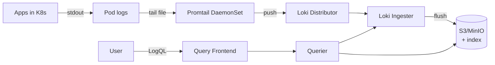

# 🎓 Loki + LogQL deep — Structured logging + cardinality management

> **Tác giả:** Mr.Rom\
> **Phiên bản:** v1.1.0\
> **Tạo lúc:** 24/05/2026\
> **Cập nhật:** 25/05/2026\
> **Level:** Intermediate\
> **Tags:** [MUST-KNOW]\
> **Thời lượng đọc:** ~22 phút\
> **Prerequisites:** [01_promql-deep-and-alerting.md](01_promql-deep-and-alerting.md), [Observability basic logs](../01_basic/02_logs-loki-elk.md)

> 🎯 *Basic: ship log với Promtail, query `{namespace="prod"}`. Production: **LogQL deep** (regex parse, aggregate, alert), **structured JSON logging** với `trace_id`, **cardinality management** (high-card label = Loki slow + expensive), **shipping pipeline** (Promtail vs Vector vs Fluent Bit), **retention strategy** hot/warm/cold.*

## 🎯 Sau bài này bạn sẽ

- [ ] **LogQL deep**: 10 query pattern phổ biến + parse JSON + aggregate
- [ ] Write **alert from logs** (Loki ruler)
- [ ] Setup **structured JSON logging** Python/Node với `trace_id`
- [ ] **Label cardinality** — what to label, what NOT
- [ ] So sánh **Promtail vs Vector vs Fluent Bit** — chọn đúng shipper
- [ ] **Retention policy** + S3 storage backend
- [ ] **Multi-tenant** Loki
- [ ] Tránh **6 common Loki performance mistakes**

---

## Tình huống — Loki query timeout, AWS bill spike

Production có Loki từ basic. 6 tháng sau:
- Dev open Grafana, query `{namespace="prod"}` for last 1h → **timeout 30s**.
- Loki memory usage 80GB → killed by OOM.
- AWS bill: Loki S3 storage $2,500/month (was $300 last quarter).
- New dev: "Logs khó dùng quá, dùng kubectl logs cho rồi."

Root causes:
1. **Label cardinality explosion**: someone added `request_id` label → millions of streams.
2. **Unstructured logs**: regex parse mỗi query → slow.
3. **Retention 90 days** for everything → storage cost.
4. **Promtail default config** scrape everything → high volume.

Sếp: *"Audit Loki. Apply intermediate practices. Bài này dạy."*

---

## 1️⃣ Loki architecture refresher

Loki có **6 component** chia 2 path — write path (Promtail → Distributor → Ingester → S3) và read path (Querier → Frontend → S3). Diagram tóm tắt:



**Components**:
- **Promtail / Vector**: log collector (DaemonSet on each node).
- **Distributor**: receive logs, validate, shard by stream.
- **Ingester**: buffer logs in memory, write WAL, flush to storage.
- **Storage**: object store (S3) for chunks, index (BoltDB shipper / TSDB).
- **Querier**: execute LogQL queries against ingesters + storage.
- **Query frontend**: split query, parallelize, cache.

### Key design: index labels, not content

Unlike Elasticsearch (full-text index everything), Loki:
- **Index labels only** (small): `{namespace, service, pod}`.
- **Don't index content** (large): log lines compressed in S3.
- Query: filter by label → fetch matching log blobs → grep content.

→ **Cheaper** (10-30x vs ES). **Slower** for full-text search across all data.

🪞 **Ẩn dụ**: *Loki như **thư viện sách: kệ phân loại theo tag chủ đề (label), không có index toàn văn từng cuốn**. Tìm "sách về Docker" → đi đến kệ Docker → đọc từng cuốn. Tìm "cuốn nào có từ X" toàn thư viện → chậm.*

---

## 2️⃣ LogQL syntax deep

### Stream selector (required)

LogQL bắt đầu **bắt buộc** bằng stream selector (curly braces `{...}`) — filter logs theo label. KHÔNG được dùng bare `{}` (Loki reject). Tương tự PromQL nhưng cho logs:

```logql
{namespace="production", service="fastapi"}
```

Operators:
- `=` exact match.
- `!=` not equal.
- `=~` regex match.
- `!~` regex not match.

```logql
{service=~"fastapi|worker"}                # multiple services
{namespace=~"prod|staging", env!="dev"}    # exclude dev
```

→ Stream selector narrow first. ALWAYS specify label, not bare `{}`.

### Filter expressions

Sau stream selector, dùng **4 operator filter** (`|=`, `!=`, `|~`, `!~`) lọc theo nội dung. Filter scan content nên chậm hơn label selector — luôn narrow stream trước, filter sau:

```logql
{service="fastapi"} |= "ERROR"             # contain "ERROR"
{service="fastapi"} != "DEBUG"             # not contain "DEBUG"
{service="fastapi"} |~ "ERROR|WARN"        # regex match
{service="fastapi"} !~ "health.*check"     # regex not match

# Chain
{service="fastapi"} |= "ERROR" != "expected"
```

→ Filter applied after stream selection. Filter scan content (slower).

### Parse JSON

Khi app log structured JSON, dùng pipe `| json` để parse — Loki extract fields thành **temporary labels** (chỉ trong query, không lưu storage). Sau parse có thể filter, format theo field:

```logql
{service="fastapi"} | json
```

→ Parse JSON log lines, extract fields as labels (in query, not storage).

```json
{
  "timestamp": "2026-05-24T10:00:00Z",
  "level": "error",
  "service": "fastapi",
  "trace_id": "abc123",
  "user_id": "u-12345",
  "endpoint": "/orders",
  "duration_ms": 1500,
  "message": "Database connection timeout"
}
```

```logql
# Filter by JSON field
{service="fastapi"} | json | level="error"

# Multiple filters
{service="fastapi"} | json | level="error" | duration_ms > 1000

# Re-format output
{service="fastapi"} | json | duration_ms > 1000 
  | line_format "{{.timestamp}} {{.endpoint}} {{.duration_ms}}ms"
```

### Parse logfmt

Format thứ 2 phổ biến: **logfmt** (`key=value key2=value2`) — dùng bởi Go ecosystem (Kubernetes, Grafana). Loki có `| logfmt` parse tương tự `| json`:

```
ts=2026-05-24T10:00:00Z level=error service=fastapi trace_id=abc msg="DB timeout"
```

```logql
{service="fastapi"} | logfmt | level="error"
```

### Parse regex

```logql
{service="nginx"} 
  | regexp `(?P<method>\w+) (?P<path>[^ ]+) HTTP/[\d.]+" (?P<status>\d+) (?P<bytes>\d+)`
  | status >= 500
```

→ Named capture groups become parsed fields.

### Aggregation (LogQL "metric queries")

```logql
# Count errors per minute
sum by (service) (
  rate({namespace="prod"} | json | level="error" [5m])
)

# Top 10 slow endpoints
topk(10,
  sum by (endpoint) (
    rate({service="fastapi"} | json | duration_ms > 1000 [5m])
  )
)

# 95th percentile of duration
quantile_over_time(0.95,
  {service="fastapi"} | json | unwrap duration_ms [5m]
)
```

→ LogQL aggregate similar to PromQL syntax. `unwrap` extract numeric field for aggregation.

### `line_format` + `label_format`

```logql
# Custom output line format
{service="fastapi"} | json 
  | line_format "[{{.level | upper}}] {{.endpoint}} → {{.message}}"

# Add/rename label
{service="fastapi"} | json
  | label_format component=`{{.service}}-{{.endpoint}}`
```

### Operators

```logql
# Comparison
{service="fastapi"} | json | duration_ms > 1000
{service="fastapi"} | json | status_code >= 400 and status_code < 500

# Math
{service="fastapi"} | json | unwrap duration_ms | __error__=""
```

---

## 3️⃣ 10 LogQL patterns phổ biến

### 1. Find ERROR logs

```logql
{namespace="prod"} |= "ERROR"
```

### 2. Find specific exception

```logql
{namespace="prod"} |= "OperationalError" |= "connection"
```

### 3. Trace correlation

```logql
{namespace="prod"} | json | trace_id="abc123"
```

→ All logs for specific trace across services.

### 4. Slow requests

```logql
{service="fastapi"} | json | duration_ms > 1000
  | line_format "{{.endpoint}} {{.duration_ms}}ms"
```

### 5. Error rate per service

```logql
sum by (service) (
  rate({namespace="prod"} | json | level="error" [5m])
)
```

### 6. Top 10 noisy logs source

```logql
topk(10,
  sum by (pod) (rate({namespace="prod"} [5m]))
)
```

### 7. P95 latency from logs

```logql
quantile_over_time(0.95,
  {service="fastapi"} | json | unwrap duration_ms [5m]
)
```

### 8. Aggregate by user

```logql
sum by (user_id) (
  count_over_time({service="payment"} | json | level="error" [10m])
)
```

→ Use carefully — high cardinality if many users.

### 9. Anomaly: error rate change

```logql
# Current 5min vs previous 5min
(
  sum(rate({service="fastapi"} | json | level="error" [5m]))
  /
  sum(rate({service="fastapi"} | json | level="error" [5m] offset 5m))
) > 2.0    # current 2x more than 5m ago
```

### 10. Multi-line stack trace

```logql
{service="fastapi"} |~ `Traceback.*\n.*\n.*` 
  | line_format "{{.}}"
```

---

## 4️⃣ Loki alerting rules (Ruler)

Loki has built-in Ruler — evaluate LogQL queries periodically, fire alerts.

### Rule config

```yaml
# loki-rules.yaml
groups:
  - name: log_alerts
    interval: 30s
    rules:
      - alert: HighErrorRate
        expr: |
          sum by (service) (
            rate({namespace="prod"} | json | level="error" [5m])
          ) > 10
        for: 5m
        labels:
          severity: warning
          team: backend
        annotations:
          summary: "High error rate in {{ $labels.service }}"
          description: "{{ $value }} errors/sec — investigate logs"
      
      - alert: PanicDetected
        expr: |
          rate({namespace="prod"} |= "PANIC" [1m]) > 0
        for: 0m
        labels:
          severity: critical
        annotations:
          summary: "PANIC in production"
          description: |
            Service crashed with panic.
            Logs: https://grafana/explore?q={{ $labels.service }} PANIC
      
      - alert: FailedLoginSpike
        expr: |
          sum by (source_ip) (
            rate({service="auth"} | json | event="login_failed" [5m])
          ) > 100
        for: 2m
        labels:
          severity: warning
          team: security
        annotations:
          summary: "Brute force from {{ $labels.source_ip }}"
```

→ Alert fired from logs, routed via Alertmanager same as Prometheus alerts.

### When use Loki alerts vs Prometheus alerts

**Prometheus alerts**:
- Metric-driven: `error_rate > X`.
- Aggregate over time.
- Numerical thresholds.

**Loki alerts**:
- **Specific log content**: detect specific exception string, panic, security event.
- **Pattern detection**: failed logins, SQL injection attempts, specific stack traces.
- **Audit events**: regulatory triggers (PII access, admin login).

→ Both, complementary.

---

## 5️⃣ Structured JSON logging

### Bad — unstructured

```python
logger.info("User u-12345 logged in from 1.2.3.4, took 50ms")
```

→ Loki can't filter `user_id` or `latency` without regex.

### Good — structured JSON

```python
logger.info("user_login", extra={
    "user_id": "u-12345",
    "source_ip": "1.2.3.4",
    "latency_ms": 50,
    "trace_id": current_trace_id(),
})
```

Output:
```json
{"timestamp": "2026-05-24T10:00:00Z", "level": "info", "msg": "user_login", "user_id": "u-12345", "source_ip": "1.2.3.4", "latency_ms": 50, "trace_id": "abc123"}
```

### Python — `structlog`

```python
import structlog

structlog.configure(
    processors=[
        structlog.contextvars.merge_contextvars,
        structlog.processors.add_log_level,
        structlog.processors.TimeStamper(fmt="iso"),
        structlog.processors.JSONRenderer(),
    ],
    wrapper_class=structlog.make_filtering_bound_logger(structlog.stdlib.INFO),
)

log = structlog.get_logger()

# Bind context for current request (via middleware)
structlog.contextvars.bind_contextvars(
    trace_id=current_trace_id(),
    user_id=current_user_id(),
)

log.info("order_created", order_id="o-123", amount=99.99)
```

### Node.js — `pino`

```javascript
import pino from 'pino';

const logger = pino({
  level: 'info',
  formatters: {
    level: (label) => ({ level: label }),
  },
  timestamp: pino.stdTimeFunctions.isoTime,
});

logger.info({
  user_id: 'u-12345',
  trace_id: getTraceId(),
  latency_ms: 50,
}, 'user_login');
```

### Go — `zap`

```go
import "go.uber.org/zap"

logger, _ := zap.NewProduction()
defer logger.Sync()

logger.Info("user_login",
    zap.String("user_id", "u-12345"),
    zap.String("trace_id", traceID),
    zap.Int("latency_ms", 50),
)
```

### FastAPI middleware

```python
@app.middleware("http")
async def logging_middleware(request, call_next):
    trace_id = get_trace_id()    # from OTel context
    structlog.contextvars.bind_contextvars(trace_id=trace_id)
    
    start = time.time()
    response = await call_next(request)
    duration_ms = int((time.time() - start) * 1000)
    
    log.info("http_request",
        method=request.method,
        path=request.url.path,
        status_code=response.status_code,
        duration_ms=duration_ms,
    )
    
    structlog.contextvars.clear_contextvars()
    return response
```

→ Every log line in request scope has `trace_id` auto.

### Standard fields (production convention)

| Field | Type | Description |
|---|---|---|
| `timestamp` | ISO 8601 | Event time |
| `level` | string | `debug` / `info` / `warn` / `error` / `fatal` |
| `service` | string | Service name |
| `version` | string | Service version |
| `environment` | string | `prod` / `staging` / `dev` |
| `trace_id` | string | OTel trace ID |
| `span_id` | string | OTel span ID |
| `user_id` | string | Authenticated user (if applicable) |
| `request_id` | string | UUID per request |
| `msg` | string | Event description |

→ Standardize across services for cross-service query.

---

## 6️⃣ Label cardinality management

### What's a "stream" in Loki?

Each unique label combination = **1 stream**.

```
{namespace="prod", service="fastapi", pod="fastapi-abc"} → stream 1
{namespace="prod", service="fastapi", pod="fastapi-def"} → stream 2
{namespace="prod", service="fastapi", pod="fastapi-ghi"} → stream 3
```

→ 3 pods = 3 streams. Reasonable.

### Cardinality explosion

❌ **High-cardinality labels** (NEVER use as label):
- `user_id` (millions).
- `request_id` (per-request).
- `email`.
- `URL with params` (`/users/123?filter=...`).

```
{service="fastapi", user_id="u-1"} → stream 1
{service="fastapi", user_id="u-2"} → stream 2
...
{service="fastapi", user_id="u-1000000"} → stream 1M
```

→ 1M streams = Loki ingester OOM, query slow.

### Right approach

✅ **Keep as label** (low cardinality, < 100 values):
- `namespace`, `service`, `pod` (auto by Promtail).
- `level` (info, warn, error).
- `cluster`, `region`.

✅ **Keep as content** (high cardinality):
- `user_id`, `trace_id`, `request_id` → JSON field, query via `| json | user_id="u-123"`.

```python
# Right
log.info("payment_processed", user_id="u-123", amount=99.99)
# → JSON line, user_id in content
# Loki label: {service="payment", level="info"}

# Wrong
log.info("payment_processed", labels={"user_id": "u-123"})    # ← don't!
```

### Verify cardinality

```bash
# Loki API
curl http://loki:3100/loki/api/v1/label/<label_name>/values | jq '.data | length'

# Or in Grafana
# Settings → Loki datasource → Cardinality tab
```

→ Audit weekly. Cap labels < 100 unique values.

### Limits config

```yaml
# loki config
limits_config:
  max_streams_per_user: 100000
  max_label_value_length: 2048
  max_label_name_length: 1024
  max_label_names_per_series: 30
  
  # Per-tenant limits
  ingestion_rate_mb: 4
  ingestion_burst_size_mb: 6
  
  # Query limits
  max_query_series: 500
  max_query_parallelism: 32
  max_query_length: 30d
```

→ Loki reject ingestion if exceed → forces good behavior.

---

## 7️⃣ Promtail vs Vector vs Fluent Bit

### Promtail (Loki-native)

```yaml
# promtail-config.yaml
clients:
  - url: http://loki:3100/loki/api/v1/push

scrape_configs:
  - job_name: kubernetes-pods
    kubernetes_sd_configs:
      - role: pod
    relabel_configs:
      - source_labels: [__meta_kubernetes_namespace]
        target_label: namespace
      - source_labels: [__meta_kubernetes_pod_label_app]
        target_label: app
    pipeline_stages:
      - cri: {}
      - json:
          expressions:
            level: level
            trace_id: trace_id
      - labels:
          level:           # ← promote to label (careful cardinality)
```

**Pros**:
- Loki-native, simple setup.
- K8s service discovery built-in.
- Pipeline stages for parsing.

**Cons**:
- Loki-only.
- Less feature-rich than Vector.

### Vector (Datadog, 2024+ popular)

```toml
# vector.toml
[sources.k8s_logs]
type = "kubernetes_logs"

[transforms.parse_json]
type = "remap"
inputs = ["k8s_logs"]
source = '''
  . = parse_json!(.message)
'''

[transforms.filter_debug]
type = "filter"
inputs = ["parse_json"]
condition = '.level != "debug"'

[sinks.loki]
type = "loki"
inputs = ["filter_debug"]
endpoint = "http://loki:3100"
labels = { service = "{{ service }}", level = "{{ level }}" }
```

**Pros**:
- Multi-destination (Loki + S3 + Kafka + others).
- VRL (Vector Remap Language) — powerful transforms.
- Excellent performance (Rust).
- Buffering / retry built-in.

**Cons**:
- Learning curve VRL.
- Less K8s-native than Promtail.

### Fluent Bit (CNCF Graduated)

```ini
[INPUT]
    Name              tail
    Path              /var/log/containers/*.log
    Parser            cri
    Tag               kube.*

[FILTER]
    Name              kubernetes
    Match             kube.*

[OUTPUT]
    Name              loki
    Match             *
    Host              loki
    Port              3100
    Labels            namespace=$namespace,pod=$pod
```

**Pros**:
- Lightweight (low memory).
- Mature, widely used.
- Multi-destination (Loki, Elasticsearch, CloudWatch, etc.).

**Cons**:
- INI-style config less expressive.
- C-based, less feature dev than Vector.

### Comparison

| Aspect | Promtail | Vector | Fluent Bit |
|---|---|---|---|
| Sponsor | Grafana Labs | Datadog (open) | CNCF |
| Language | Go | Rust | C |
| Memory footprint | Medium | Low | Lowest |
| Loki-native | ✅ | ✅ | ✅ |
| Multi-destination | ❌ (Loki only) | ✅ Many | ✅ Many |
| Transform power | Basic | Advanced (VRL) | Lua scripts |
| K8s discovery | Native | Plugin | Plugin |
| Configuration | YAML | TOML | INI |
| Community 2026 | Strong | Growing | Strong |

→ **Recommend 2026**:
- **Loki-only stack**: Promtail (simplest).
- **Multi-destination** (Loki + S3 + DataDog): Vector.
- **Memory-constrained**: Fluent Bit.

---

## 8️⃣ Retention strategy + Storage tiers

### Why retention matters

Logs grow ~10-100GB/day for medium app. Storing forever = expensive.

```
Hot:   Last 7 days     — fast SSD, frequent query
Warm:  8-30 days        — slower S3 standard
Cold:  31-365 days      — S3 IA / Glacier
Archive: > 1 year       — Glacier Deep Archive (compliance)
```

### Loki retention config

```yaml
# loki config
compactor:
  working_directory: /loki/compactor
  shared_store: s3
  retention_enabled: true
  retention_delete_delay: 2h
  retention_delete_worker_count: 150

limits_config:
  # Per-tenant retention
  retention_period: 720h    # 30 days default
  
  # Stream-level retention
  retention_stream:
    - selector: '{environment="prod"}'
      priority: 1
      period: 2160h          # 90 days for prod
    - selector: '{environment="dev"}'
      priority: 2
      period: 168h           # 7 days for dev
    - selector: '{compliance="pci"}'
      priority: 0            # highest priority
      period: 8760h          # 1 year for PCI
```

→ Per-stream retention via `retention_stream`. Different rules for different log types.

### S3 lifecycle policies

```json
{
  "Rules": [
    {
      "Id": "loki-tiering",
      "Status": "Enabled",
      "Transitions": [
        { "Days": 30, "StorageClass": "STANDARD_IA" },
        { "Days": 90, "StorageClass": "GLACIER_IR" },
        { "Days": 365, "StorageClass": "DEEP_ARCHIVE" }
      ],
      "Expiration": { "Days": 2555 }    # 7 years for compliance
    }
  ]
}
```

→ Loki S3 bucket lifecycle: auto-migrate to cheaper tier over time. Loki still query (slow for cold tier).

### Cost estimate (AWS S3, 100GB/day logs)

| Tier | Days | Storage | Cost/month |
|---|---|---|---|
| Standard | 30 | 3 TB | $69 |
| Standard-IA | 60 | 6 TB | $76 |
| Glacier Instant Retrieval | 275 | 27.5 TB | $110 |
| Deep Archive | rest | varies | $20 |
| **Total** | | | **~$275** |

vs Elasticsearch hot SSD all-tier: ~$3000/month for same volume. **Loki 10x cheaper**.

---

## 9️⃣ Hands-on: Loki production setup

### Step 1: Install Loki with S3 backend

```yaml
# loki-values.yaml (Helm)
loki:
  schemaConfig:
    configs:
      - from: "2024-04-01"
        store: tsdb
        object_store: s3
        schema: v13
        index:
          prefix: loki_index_
          period: 24h
  
  storage:
    type: s3
    s3:
      region: us-east-1
      bucketNames:
        chunks: loki-chunks-acme
        ruler: loki-ruler-acme
        admin: loki-admin-acme
  
  limits_config:
    retention_period: 720h    # 30 days
    max_streams_per_user: 100000
    ingestion_rate_mb: 8
    ingestion_burst_size_mb: 12

deploymentMode: SimpleScalable   # 3-binary mode: write/read/backend

write:
  replicas: 3
  resources:
    requests: { cpu: 500m, memory: 1Gi }
    limits: { cpu: 2, memory: 4Gi }

read:
  replicas: 3
  resources:
    requests: { cpu: 500m, memory: 1Gi }
    limits: { cpu: 2, memory: 4Gi }

backend:
  replicas: 3
  resources:
    requests: { cpu: 200m, memory: 512Mi }
    limits: { cpu: 1, memory: 2Gi }
```

```bash
helm install loki grafana/loki -f loki-values.yaml -n monitoring
```

### Step 2: Install Promtail DaemonSet

```yaml
# promtail-values.yaml
config:
  clients:
    - url: http://loki-write.monitoring:3100/loki/api/v1/push
  
  positions:
    filename: /tmp/positions.yaml
  
  scrape_configs:
    - job_name: kubernetes-pods
      pipeline_stages:
        - cri: {}
        - json:
            expressions:
              level: level
              trace_id: trace_id
              service: service
      kubernetes_sd_configs:
        - role: pod
      relabel_configs:
        - source_labels: [__meta_kubernetes_namespace]
          target_label: namespace
        - source_labels: [__meta_kubernetes_pod_label_app]
          target_label: app
        - source_labels: [__meta_kubernetes_pod_node_name]
          target_label: node
        - source_labels: [__meta_kubernetes_pod_name]
          target_label: pod
        - source_labels: [__meta_kubernetes_pod_container_name]
          target_label: container
```

```bash
helm install promtail grafana/promtail -f promtail-values.yaml -n monitoring
```

### Step 3: Configure FastAPI structured logging

```python
# logging_config.py
import structlog
import logging
import sys

logging.basicConfig(
    format="%(message)s",
    stream=sys.stdout,
    level=logging.INFO,
)

structlog.configure(
    processors=[
        structlog.contextvars.merge_contextvars,
        structlog.processors.add_log_level,
        structlog.processors.TimeStamper(fmt="iso"),
        structlog.processors.dict_tracebacks,
        structlog.processors.JSONRenderer(),
    ],
    wrapper_class=structlog.make_filtering_bound_logger(logging.INFO),
)

logger = structlog.get_logger()

# In FastAPI app
@app.middleware("http")
async def request_logging(request, call_next):
    from opentelemetry import trace
    span = trace.get_current_span()
    trace_id = format(span.get_span_context().trace_id, "032x")
    
    structlog.contextvars.bind_contextvars(
        trace_id=trace_id,
        service="fastapi",
        version=APP_VERSION,
        environment=ENV,
    )
    
    start = time.time()
    response = await call_next(request)
    duration_ms = int((time.time() - start) * 1000)
    
    logger.info("http_request",
        method=request.method,
        path=request.url.path,
        status_code=response.status_code,
        duration_ms=duration_ms,
    )
    
    structlog.contextvars.clear_contextvars()
    return response
```

### Step 4: Setup Loki Ruler for log-based alerts

```yaml
apiVersion: v1
kind: ConfigMap
metadata:
  name: loki-rules
  namespace: monitoring
data:
  rules.yaml: |
    groups:
      - name: app_log_alerts
        interval: 30s
        rules:
          - alert: HighErrorRate
            expr: |
              sum by (service) (
                rate({namespace="prod"} | json | level="error" [5m])
              ) > 10
            for: 5m
            labels:
              severity: warning
            annotations:
              summary: "{{ $labels.service }} errors {{ $value }}/sec"
          
          - alert: PanicDetected
            expr: |
              rate({namespace="prod"} |~ "PANIC|panic:" [1m]) > 0
            for: 0m
            labels:
              severity: critical
            annotations:
              summary: "PANIC in production"
```

### Step 5: Test queries in Grafana

```logql
# 1. All FastAPI errors
{service="fastapi"} | json | level="error"

# 2. Slow requests
{service="fastapi"} | json | duration_ms > 1000
  | line_format "{{.path}} {{.duration_ms}}ms"

# 3. Specific trace
{namespace="prod"} | json | trace_id="abc123"

# 4. Top noisy pods
topk(5,
  sum by (pod) (rate({namespace="prod"}[5m]))
)

# 5. Error rate per service over time
sum by (service) (
  rate({namespace="prod"} | json | level="error" [5m])
)
```

---

## 💡 Pitfall & Best practice

### ❌ Pitfall: High-card label in Promtail pipeline

```yaml
pipeline_stages:
  - json:
      expressions:
        user_id: user_id
        request_id: request_id
  - labels:
      user_id:        # ← DON'T promote to label!
      request_id:     # ← DON'T!
```

→ Loki stream explosion.

→ **Fix**: Extract field to JSON content (query via `| json | user_id=...`). DON'T promote to Loki label.

### ❌ Pitfall: Bare query `{}`

```logql
{} |= "ERROR"
```

→ Scan ALL streams. Slow, expensive.

→ **Fix**: Always narrow stream selector:
```logql
{namespace="prod", service=~"fastapi|payment"} |= "ERROR"
```

### ❌ Pitfall: No retention policy

→ Logs grow forever. AWS bill explode.

→ **Fix**: Retention 30-90 days production. Compliance logs (PII access) longer with archive tier.

### ❌ Pitfall: Promtail tail every container

→ Some apps verbose (sidecars, infrastructure). 1 chatty pod = 50% volume.

→ **Fix**: Drop in Promtail relabel:
```yaml
relabel_configs:
  - source_labels: [__meta_kubernetes_pod_label_app]
    regex: "fluentd|debug-tool"
    action: drop
```

### ❌ Pitfall: Unstructured logs

```python
logger.info(f"User {user_id} did {action}, took {duration}ms")
```

→ Can't filter `user_id` without regex. Query slow.

→ **Fix**: JSON structured logging.

### ❌ Pitfall: Mix log levels

→ DEBUG logs in production = volume + noise + cost.

→ **Fix**: Production log level = INFO. DEBUG only when investigating. Tools like **dynamic log level** (change runtime via API).

### ❌ Pitfall: No correlation IDs

→ Multi-service issue, traces split across services. No `request_id` or `trace_id` → can't link.

→ **Fix**: Propagate `trace_id` via OTel context across all services. Include in every log line.

### ✅ Best practice: Loki + Tempo correlation

Grafana: click log line with `trace_id` → "View trace" → jumps to Tempo. **Cross-pillar navigation**.

Setup datasource:
```yaml
# grafana-datasources.yaml
- name: Loki
  jsonData:
    derivedFields:
      - matcherRegex: "trace_id=(\\w+)"
        name: TraceID
        url: '$${__value.raw}'
        datasourceUid: tempo
```

→ Magic.

### ✅ Best practice: Per-service log volume monitoring

Track log volume per service. Alert if anomalous:

```promql
# Promtail metrics
rate(promtail_sent_bytes_total{tenant="acme"}[5m])
```

→ Sudden 10x volume = misbehaving service (infinite loop logging).

### ✅ Best practice: Documentation tags

Add `event_type` field, document allowed values:

```python
log.info("payment_processed", event_type="payment.success", amount=99.99)
log.info("payment_failed", event_type="payment.failure", reason="declined")
```

→ Discoverable events. Query `{ } | json | event_type=~"payment.*"`.

---

## 🧠 Self-check

**Q1.** Loki vs Elasticsearch cost — why 10x cheaper?

<details>
<summary>💡 Đáp án</summary>

**Elasticsearch**:
- **Full-text index every field**: massive storage (3-5x raw log size).
- Index in **SSD/RAM** for query speed.
- Compute cluster scaling.

**Loki**:
- **Index only labels** (small, structured).
- **Content in object storage** (S3), compressed (gzip/snappy).
- Query: filter by label → scan content blobs.

**Storage cost difference**:
- 100GB raw logs/day.
- ES: 300-500GB indexed on SSD = $0.10/GB/month × 500GB × 30 days = $1500/month for 30 days.
- Loki: 30GB compressed on S3 = $0.023/GB/month × 30GB × 30 days = $20/month.

**Trade-offs**:
- Loki **slower** for "find any log containing X" across all data (full scan).
- ES **faster** for arbitrary search.

**When ES makes sense**:
- Need complex search (free text, faceted, fuzzy).
- Compliance requires fast retrieval over years.
- Log analytics dashboards (Kibana).

**When Loki wins**:
- K8s/microservices stack (already using Prometheus + Grafana).
- Logs primarily for debug/correlation (90% case).
- Cost-conscious.

→ Most teams 2026 → Loki. ES legacy or specialized use cases.
</details>

**Q2.** Cardinality control — vì sao quan trọng cho Loki performance?

<details>
<summary>💡 Đáp án</summary>

**Loki storage model**:
- Each unique label combination = 1 **stream**.
- Each stream stored separately (chunks in S3).
- Ingester memory: 1 stream = 1 buffer.

**With low cardinality**:
- 100 services × 10 levels × 10 pods/svc = 10K streams. Manageable.

**With user_id label (1M users)**:
- 100 services × 1M users = 100M streams. Loki ingester OOM.

**Query impact**:
- Loki index: `(label_set) → list_of_chunks`. Few streams = small index.
- 100M streams = huge index, slow lookup.

**Ingestion impact**:
- Each log line: hash label set → find/create stream → write chunk.
- Many streams = more chunk files = more S3 small-object overhead.

**Mitigation**:
- **Don't label what changes per-request**: user_id, request_id, trace_id, IP.
- **Keep low-cardinality labels**: service, namespace, level.
- **Move per-event data to content** (JSON field).
- **Query with `| json | user_id="..."`**: scan content, not label.

**Cost**:
- High cardinality = ingester compute spike + Loki cluster scale up + S3 metadata cost.
- Easy to 10x cost without noticing.

→ **Cardinality budget**: aim < 100K streams total per tenant. Monitor via `cardinality_analyzer` tool.
</details>

**Q3.** When to use Loki alert vs Prometheus alert?

<details>
<summary>💡 Đáp án</summary>

**Prometheus alert**:
- Metric-driven (numbers).
- Pre-defined questions (error rate > X, latency > Y).
- Continuous time-series.
- Best for: SLO violations, infra saturation, request anomalies.

**Loki alert**:
- Content-driven (specific log patterns).
- Discovered post-incident (new exception type).
- Event-based.
- Best for:
  - **Panic / crash**: `|~ "panic:"`.
  - **Security**: failed login spike from same IP, SQL injection patterns.
  - **Audit**: admin login, PII access events.
  - **Specific errors**: known regression pattern.
  - **Stack trace appearance**: catch new exception type immediately.

**Complementary**:
- Prometheus: "Service X has elevated error rate."
- Loki: "Service X is throwing NEW exception type (`OperationalError: connection`)."
- Together: more complete picture.

**When NOT Loki alert**:
- High-volume metrics derivable from logs (compute Prometheus metric instead — Recording rule from Loki).
- Aggregate stats best done as metric.

**Example combo**:
```yaml
# Prometheus: error rate > 1%
- alert: ErrorRateHigh
  expr: ...

# Loki: panic appearing
- alert: PanicDetected
  expr: rate({namespace="prod"} |~ "panic:" [1m]) > 0
```

→ Both fire on related incident, give different signal types.
</details>

**Q4.** Vector vs Promtail — multi-destination scenario?

<details>
<summary>💡 Đáp án</summary>

**Scenario**: ship logs to Loki (operations) AND S3 (compliance/archive) AND Kafka (ML pipeline) AND Datadog (executive dashboards).

**Promtail**: Loki-only. Need separate shipper for S3/Kafka/Datadog.

**Vector**: 1 agent, 4 destinations:

```toml
[sources.k8s]
type = "kubernetes_logs"

[sinks.loki]
type = "loki"
inputs = ["k8s"]
endpoint = "http://loki:3100"

[sinks.s3]
type = "aws_s3"
inputs = ["k8s"]
bucket = "acme-logs-archive"
compression = "gzip"

[sinks.kafka]
type = "kafka"
inputs = ["k8s"]
bootstrap_servers = "kafka.kafka:9092"
topic = "logs"

[sinks.datadog]
type = "datadog_logs"
inputs = ["k8s"]
api_key = "${DD_API_KEY}"
```

**Vector advantages**:
- 1 process per node (low memory).
- Consistent transforms across destinations (VRL filter once, write to multiple).
- Buffering + retry handle backpressure.

**Promtail equivalent**: deploy 4 shippers (Promtail + Fluent Bit + custom S3 uploader + DD agent). More moving parts.

**Trade-off**:
- Vector: more powerful, slightly higher complexity.
- Promtail: simpler if only Loki.

**2026 recommend**:
- Pure K8s + Loki: Promtail.
- Multi-destination, mixed workload: Vector.
- Memory-constrained edge: Fluent Bit.

→ Multi-destination is Vector's strength. Single-purpose = Promtail.
</details>

**Q5.** Retention strategy — hot/warm/cold storage tiers for logs?

<details>
<summary>💡 Đáp án</summary>

**Workload patterns** for log access:
- **Last 7 days**: 95% of queries (incident debug, recent state).
- **8-30 days**: 4% queries (trend analysis, post-mortem deep dive).
- **31-90 days**: 1% queries (compliance, quarter-over-quarter).
- **> 90 days**: rare queries, legal/compliance hold.

**Storage tiering** (AWS S3 example):
| Tier | Cost/GB/month | Access latency | Best for |
|---|---|---|---|
| Standard | $0.023 | < 100ms | Hot (last 7d) |
| Intelligent-Tiering | varies | varies | Auto-balance |
| Standard-IA | $0.0125 | < 100ms | Warm (8-30d), pay per retrieval |
| Glacier Instant | $0.004 | < 100ms | Cold (31-365d) |
| Glacier Flexible | $0.0036 | 1-5 min | Compliance archive |
| Glacier Deep | $0.00099 | 12 hours | Long-term (years) |

**Configuration**:

Loki retention:
```yaml
limits_config:
  retention_stream:
    - selector: '{environment="prod"}'
      period: 2160h        # 90 days hot
```

S3 lifecycle:
```json
{
  "Rules": [{
    "Transitions": [
      { "Days": 30, "StorageClass": "STANDARD_IA" },
      { "Days": 90, "StorageClass": "GLACIER_IR" },
      { "Days": 365, "StorageClass": "DEEP_ARCHIVE" }
    ],
    "Expiration": { "Days": 2555 }    # 7 years (PCI)
  }]
}
```

**Caveats**:
- Loki query Glacier-tier = **slow** (12h restore for Deep Archive). Document for ops.
- Compliance logs (PII, financial) — separate stream with longer retention.
- Test restore quarterly: don't discover broken at audit time.

**Cost example** (100GB/day):
- All hot: 100 × 0.023 × 30 = $69/month per 30-day data.
- Tiered: hot $69 + IA $76 + Glacier IR $110 + Deep $20 = **~$275/month**.

→ Significant savings without losing data access.
</details>

---

## ⚡ Cheatsheet

```logql
# === Selectors ===
{service="fastapi"}
{service=~"api.*"}
{namespace="prod", level="error"}

# === Filter ===
{...} |= "ERROR"
{...} != "DEBUG"
{...} |~ "ERROR|WARN"
{...} !~ "health.*check"

# === Parse ===
{...} | json
{...} | logfmt
{...} | regexp `(?P<name>pattern)`

# === Filter parsed fields ===
{...} | json | level="error"
{...} | json | duration_ms > 1000

# === Format ===
{...} | line_format "{{.field1}} {{.field2}}"
{...} | label_format new_label=`{{.field}}`

# === Aggregate ===
sum by (service) (rate({...} | json | level="error" [5m]))
quantile_over_time(0.95, {...} | json | unwrap duration_ms [5m])
topk(10, ...)

# === Comparison with offset ===
(... [5m]) / (... [5m] offset 5m)

# === Multi-line ===
{...} |~ `Traceback.*\n.*`
```

```bash
# === Loki API ===
curl http://loki:3100/loki/api/v1/labels                    # all labels
curl http://loki:3100/loki/api/v1/label/<name>/values        # label values
curl 'http://loki:3100/loki/api/v1/query?query={service="fastapi"}'

# === Promtail ===
curl http://promtail:3101/metrics
curl http://promtail:3101/loki/api/v1/push -X POST -d ...

# === Loki Ruler ===
curl http://loki:3100/loki/api/v1/rules
```

---

## 📚 Glossary

| Term | Vietnamese / Explanation |
|---|---|
| **Loki** | Grafana's log aggregation system — index labels, content in S3 |
| **LogQL** | Loki query language (similar PromQL syntax + log filters) |
| **Stream** | Unique combination of labels = 1 stream in Loki |
| **Promtail** | Loki's log collector (DaemonSet K8s, tail files) |
| **Vector** | Datadog's log collector (Rust, multi-destination) |
| **Fluent Bit** | CNCF lightweight log collector (C-based) |
| **Stream selector** | `{label="value"}` — first part of LogQL |
| **Filter expression** | `|=`, `!=`, `|~`, `!~` — narrow content |
| **Parser stage** | `| json`, `| logfmt`, `| regexp` — extract fields |
| **Cardinality** | # unique label combinations (high = expensive) |
| **Loki Ruler** | Component evaluating LogQL rules → fire alerts |
| **Structured logging** | JSON output with consistent fields |
| **structlog** | Python structured logging library |
| **pino** | Node.js structured logging library |
| **zap** | Go structured logging library |
| **`trace_id` correlation** | Link log line to OTel trace |
| **Mimir** | Grafana's metrics backend (alternative to Prometheus federation) |
| **Storage tier** | Hot/warm/cold = SSD / Standard-IA / Glacier |
| **Retention policy** | How long to keep logs before delete |
| **Multi-tenant** | Loki separate tenant data with isolated quotas |
| **Schema config** | Loki time-range to schema version mapping |
| **TSDB** | Time-series database (Loki's modern index format) |

---

## 🔗 Liên kết & Tài nguyên

### Trong cluster
- ↶ Trước: [01_promql-deep-and-alerting.md](01_promql-deep-and-alerting.md)
- → Tiếp: [03_opentelemetry-instrumentation.md](03_opentelemetry-instrumentation.md) *(sắp viết)*
- ↑ Cluster: [Observability README](../../README.md)

### Cross-reference
- 📊 [Basic Loki](../01_basic/02_logs-loki-elk.md) — foundation
- ☸️ [K8s intermediate Helm](../../../kubernetes/lessons/02_intermediate/01_helm-package-manager.md) — deploy Loki via Helm

### Tài nguyên ngoài
- 📖 [Loki docs](https://grafana.com/docs/loki/)
- 📖 [LogQL docs](https://grafana.com/docs/loki/latest/logql/)
- 📖 [Promtail docs](https://grafana.com/docs/loki/latest/clients/promtail/)
- 📖 [Vector docs](https://vector.dev/docs/)
- 📖 [Fluent Bit docs](https://docs.fluentbit.io/)
- 📖 [structlog (Python)](https://www.structlog.org/)
- 📖 [pino (Node.js)](https://getpino.io/)
- 📖 [zap (Go)](https://pkg.go.dev/go.uber.org/zap)
- 📖 [Grafana data source — Loki](https://grafana.com/docs/grafana/latest/datasources/loki/)
- 📖 [Loki cardinality analyzer](https://grafana.com/blog/2020/12/15/best-practices-for-loki-label-management/)

---

## 📌 Changelog

- **v1.1.0 (25/05/2026)** — Apply Blueprint v0.5.4+ §3.6: thêm lead-in trước Architecture + Stream selector + Filter expressions + Parse JSON + Parse logfmt.

- **v1.0.0 (24/05/2026)** — Bản đầu tiên. Lesson 02 intermediate. LogQL deep (selectors + filters + parsers + aggregation) + 10 common patterns + Loki alerting rules + structured JSON logging (Python/Node/Go) + label cardinality management + Promtail/Vector/Fluent Bit comparison + retention strategy with S3 lifecycle. 7 pitfall + 3 best practice + 5 self-check + cheatsheet.
