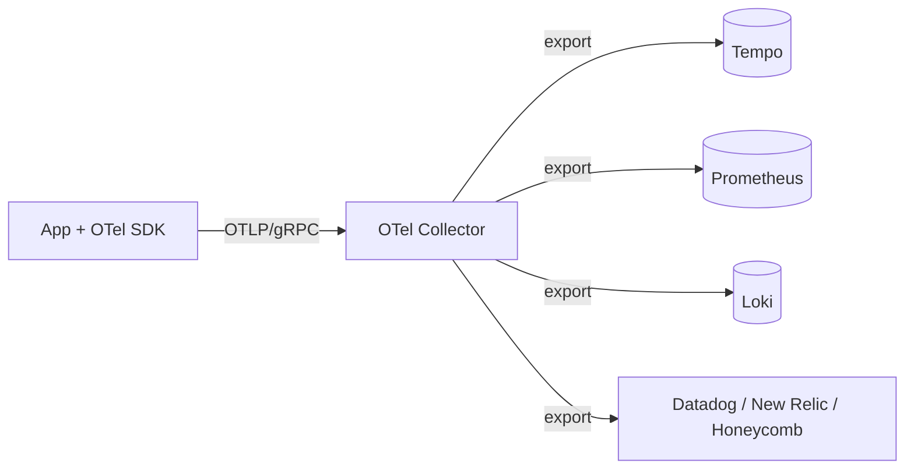
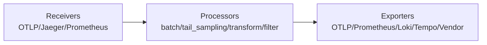
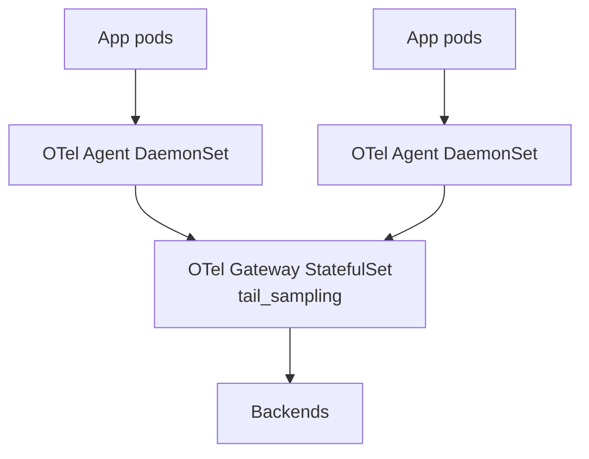

# 🎓 OpenTelemetry instrumentation — Spans + Context propagation + Sampling

> **Tác giả:** Mr.Rom\
> **Phiên bản:** v1.1.0\
> **Tạo lúc:** 24/05/2026\
> **Cập nhật:** 25/05/2026\
> **Level:** Intermediate\
> **Tags:** [MUST-KNOW]\
> **Thời lượng đọc:** ~22 phút\
> **Prerequisites:** [02_loki-logql-deep.md](02_loki-logql-deep.md), [Observability basic traces](../01_basic/03_traces-opentelemetry.md)

> 🎯 *Basic: introduce OTel concept, auto-instrumentation 1 service. Production: **manual spans** cho business logic + **context propagation** cross-service (HTTP/gRPC/queue) + **sampling strategies** (head vs tail) + **OTel Collector pipeline** + **correlation** logs ↔ metrics ↔ traces.*

## 🎯 Sau bài này bạn sẽ

- [ ] Hiểu **OTel architecture**: SDK + Collector + backend
- [ ] **Manual instrument** Python/Node/Go với custom spans + attributes
- [ ] **Context propagation** HTTP + gRPC + Kafka/RabbitMQ message queue
- [ ] **Sampling strategies**: head-based (random) vs tail-based (intelligent)
- [ ] Setup **OTel Collector** pipeline (receiver → processor → exporter)
- [ ] **Correlation 3 pillars**: logs ↔ traces ↔ metrics
- [ ] **Exemplars**: Prometheus histogram → Tempo trace
- [ ] Avoid **6 common OTel pitfalls**

---

## Tình huống — 1 endpoint chậm P99 2s, không biết tại sao

Production dashboard: `/orders` endpoint P99 latency = 2s. P50 = 100ms.

Open Tempo, search trace by service name → 1000+ traces. Random pick 1:
```
trace abc123: POST /orders
├── 50ms total
├── validate_request: 5ms
├── DB query: 30ms
└── return response: 15ms
```

→ Fast trace. Not representative of P99.

Need to find: trace where total > 1.5s.

**Without exemplars / tail-based sampling**: 
- Grafana → Tempo search by `duration > 1500ms` → 10 traces.
- Look at slow trace, identify bottleneck.
- **Setup pain**: each query manual.

**With exemplars**:
- Click histogram bucket "1-2s" trong Prometheus → jump to sample trace directly.
- 1-click navigation.

**With tail-based sampling**:
- Collector decide after trace complete: keep ALL slow/error traces.
- Sample 1% normal traces. Save cost.

Sếp: *"Setup OTel proper. Manual span + context + sampling + correlation. Bài này dạy."*

---

## 1️⃣ OTel architecture overview

🪞 **Ẩn dụ**: *OTel như **hộp đen máy bay (FDR)** gắn cho từng app — mọi cú click, mọi cuộc gọi DB, mọi exception đều được ghi nhãn thời gian + ngữ cảnh; Collector là phòng giải mã hộp đen, còn Tempo/Loki/Prometheus là kho lưu trữ ba loại dữ liệu khác nhau (trace - log - metric).*



**Components**:
- **SDK** (per language): instrument app, generate spans/metrics/logs.
- **OTLP** (OpenTelemetry Protocol): gRPC/HTTP wire format.
- **Collector**: ingest, transform, export to multiple backends.
- **Backend**: store + query (Tempo for traces, Prometheus for metrics, Loki for logs).

### Why OTel vs Vendor SDK?

Vendor SDK (Datadog tracer, Jaeger client, New Relic agent) đẻ ra trước OTel — mỗi cái có cách instrument khác. Đổi vendor = viết lại toàn bộ. OTel ra đời để **decouple instrumentation khỏi backend**: cùng code chạy được với mọi backend chỉ qua đổi exporter. Bảng dưới so sánh 5 chiều:

| Aspect | Vendor SDK (Jaeger, Datadog) | OpenTelemetry |
|---|---|---|
| Lock-in | High — code coupled to vendor | None — swap backend |
| Multi-signal | Usually 1 signal | All 3 (logs+metrics+traces) |
| Maintenance | Vendor releases | CNCF community |
| Coverage 2026 | Mature for some | All languages + cloud SDKs |
| Adoption | Specific vendors | **Default 2026** (CNCF Incubating → Graduating) |

→ **2026 standard**: OTel for new code. Migrate vendor SDK gradually.

---

## 2️⃣ Manual span instrumentation

### Python — Auto + manual

Python OTel có 2 chế độ kết hợp: **auto-instrumentation** (1 dòng cho FastAPI, Requests, psycopg2 — tự tạo span quanh mọi call), và **manual span** (custom span cho business logic riêng). Setup chạy 1 lần lúc startup, sau đó auto-instrumentor hoạt động ngầm:

```python
from opentelemetry import trace
from opentelemetry.sdk.trace import TracerProvider
from opentelemetry.sdk.trace.export import BatchSpanProcessor
from opentelemetry.exporter.otlp.proto.grpc.trace_exporter import OTLPSpanExporter
from opentelemetry.instrumentation.fastapi import FastAPIInstrumentor
from opentelemetry.instrumentation.requests import RequestsInstrumentor
from opentelemetry.instrumentation.psycopg2 import Psycopg2Instrumentor

# Setup (once at startup)
provider = TracerProvider()
exporter = OTLPSpanExporter(endpoint="otel-collector:4317", insecure=True)
provider.add_span_processor(BatchSpanProcessor(exporter))
trace.set_tracer_provider(provider)

# Auto-instrument frameworks
FastAPIInstrumentor.instrument_app(app)
RequestsInstrumentor().instrument()
Psycopg2Instrumentor().instrument(enable_commenter=True)
```

→ Auto-instrument: FastAPI endpoint, outgoing HTTP, DB queries — get spans for free.

### Manual span — business logic

Auto-instrument bắt được HTTP/DB calls nhưng **không hiểu nghiệp vụ**. Để hiện "validate_order", "check_inventory", "charge_payment" trên trace tree, phải wrap business logic trong `tracer.start_as_current_span(...)`. Mỗi span thêm attributes thông tin (user_id, amount, sku) để filter và debug nhanh hơn:

```python
tracer = trace.get_tracer(__name__)

@app.post("/orders")
def create_order(req: OrderRequest):
    # Auto span: "POST /orders" wraps everything
    
    with tracer.start_as_current_span("validate_order") as span:
        span.set_attribute("order.user_id", req.user_id)
        span.set_attribute("order.amount", req.amount)
        span.set_attribute("order.items_count", len(req.items))
        validate(req)
    
    with tracer.start_as_current_span("check_inventory") as span:
        for item in req.items:
            with tracer.start_as_current_span("inventory_check_item") as child:
                child.set_attribute("item.sku", item.sku)
                child.set_attribute("item.quantity", item.quantity)
                available = inventory.check(item.sku, item.quantity)
                child.set_attribute("inventory.available", available)
                if not available:
                    child.set_status(trace.Status(trace.StatusCode.ERROR, "Out of stock"))
                    raise HTTPException(400, "Out of stock")
    
    with tracer.start_as_current_span("charge_payment") as span:
        # Auto-instrumented requests library adds child span
        result = payment_client.charge(req.amount)
        span.set_attribute("payment.transaction_id", result.transaction_id)
    
    with tracer.start_as_current_span("save_order") as span:
        # Auto-instrumented psycopg2 adds DB span
        order = db.save(req)
        span.set_attribute("order.id", order.id)
    
    return order
```

Trace tree:
```
POST /orders (200ms total)
├── validate_order (5ms)
├── check_inventory (30ms)
│   ├── inventory_check_item sku=A (10ms)
│   ├── inventory_check_item sku=B (10ms)
│   └── inventory_check_item sku=C (10ms)
├── charge_payment (150ms)
│   └── HTTP POST stripe.com/charges (140ms)    ← auto
└── save_order (15ms)
    └── INSERT INTO orders ... (12ms)             ← auto
```

→ Business logic clearly visible. Bottleneck obvious.

### Node.js — Auto + manual

Pattern Node.js gần giống Python: `NodeSDK` + `getNodeAutoInstrumentations()` cover Express/Fastify/HTTP/MySQL/Redis. Manual span dùng `tracer.startActiveSpan` với callback async — span tự `end()` khi callback resolve. Khác biệt: phải `setStatus({ code: 1 })` cho OK, `2` cho ERROR (Python dùng enum):

```javascript
import { NodeSDK } from '@opentelemetry/sdk-node';
import { OTLPTraceExporter } from '@opentelemetry/exporter-trace-otlp-grpc';
import { getNodeAutoInstrumentations } from '@opentelemetry/auto-instrumentations-node';

const sdk = new NodeSDK({
  traceExporter: new OTLPTraceExporter({ url: 'grpc://otel-collector:4317' }),
  instrumentations: [getNodeAutoInstrumentations()],
});

sdk.start();

// Manual span
import { trace } from '@opentelemetry/api';
const tracer = trace.getTracer('myapp');

app.post('/orders', async (req, res) => {
  const span = tracer.startActiveSpan('validate_order', async (span) => {
    span.setAttribute('order.user_id', req.body.userId);
    try {
      await validate(req.body);
      span.setStatus({ code: 1 });    // OK
    } catch (err) {
      span.recordException(err);
      span.setStatus({ code: 2 });    // ERROR
      throw err;
    } finally {
      span.end();
    }
  });
});
```

### Go — Manual span

Go OTel khác Python/Node.js ở chỗ **context object phải truyền tay** qua mọi function (`ctx context.Context`). Đây là idiom Go — không có async-local storage. `tracer.Start(ctx, "name")` trả về ctx mới + span, defer `span.End()`. Child span tự link parent qua ctx truyền vào:

```go
import (
    "go.opentelemetry.io/otel"
    "go.opentelemetry.io/otel/attribute"
)

var tracer = otel.Tracer("myapp")

func CreateOrder(ctx context.Context, req OrderRequest) (*Order, error) {
    ctx, span := tracer.Start(ctx, "validate_order")
    span.SetAttributes(
        attribute.String("order.user_id", req.UserID),
        attribute.Float64("order.amount", req.Amount),
    )
    defer span.End()
    
    if err := validate(req); err != nil {
        span.RecordError(err)
        span.SetStatus(codes.Error, "validation failed")
        return nil, err
    }
    
    return saveOrder(ctx, req)
}
```

→ Context (`ctx`) carries trace ID across functions. Child spans auto-link to parent.

### Span attributes — Standard naming

[OTel semantic conventions](https://opentelemetry.io/docs/specs/semconv/):

| Domain | Attribute | Example |
|---|---|---|
| HTTP | `http.method` | `POST` |
| HTTP | `http.status_code` | `200` |
| HTTP | `http.route` | `/orders/:id` |
| DB | `db.system` | `postgresql` |
| DB | `db.statement` | `SELECT * FROM orders` |
| Messaging | `messaging.system` | `kafka` |
| Messaging | `messaging.destination` | `orders-topic` |
| Cloud | `cloud.provider` | `aws` |
| K8s | `k8s.pod.name` | `fastapi-abc` |
| Custom | `app.user_id` | `u-12345` (prefix `app.` for own attrs) |

→ Standardize → cross-tool queries work.

---

## 3️⃣ Context propagation

### Why propagation matters

Service A calls Service B via HTTP. Both have OTel. Want **single trace** spanning both.

**Without propagation**: 2 separate traces, can't link.
**With propagation**: Service A trace_id sent via HTTP header → Service B continues same trace.

### W3C TraceContext spec

Standard: `traceparent` header.

```
traceparent: 00-4bf92f3577b34da6a3ce929d0e0e4736-00f067aa0ba902b7-01
                │  ┬────────────────────────────────┬  ┬───────────────┬  ┬
                │  │ trace_id                       │  │ span_id       │  │ flags
                │  └────────────────────────────────┘  └───────────────┘  │
                │                                                          └ sampled (01) or not (00)
                version
```

### Python — Automatic propagation

```python
from opentelemetry.instrumentation.requests import RequestsInstrumentor

RequestsInstrumentor().instrument()

# Now all `requests.get(...)` calls auto-inject traceparent header
response = requests.post("https://payment-service/charge", json={...})
# ↑ traceparent header added automatically
```

Service B (FastAPI auto-instrumented) receives request, extracts traceparent, continues trace.

### Manual propagation

```python
from opentelemetry.propagate import inject, extract

# Outgoing — inject
headers = {}
inject(headers)    # Adds traceparent + tracestate
requests.post("https://service-b/api", headers=headers, json={...})

# Incoming — extract
ctx = extract(request.headers)
with tracer.start_as_current_span("process", context=ctx):
    # Continue parent trace
    ...
```

### gRPC propagation

```python
from opentelemetry.instrumentation.grpc import GrpcInstrumentorClient, GrpcInstrumentorServer

GrpcInstrumentorClient().instrument()
GrpcInstrumentorServer().instrument()
```

→ gRPC metadata propagation similar to HTTP header.

### Message queue propagation (Kafka)

```python
from opentelemetry.instrumentation.kafka import KafkaInstrumentor

KafkaInstrumentor().instrument()

# Producer
with tracer.start_as_current_span("publish_order"):
    producer.send("orders-topic", value=order.encode())
    # Trace context injected into Kafka headers

# Consumer
for message in consumer:
    ctx = extract(dict(message.headers))
    with tracer.start_as_current_span("process_order", context=ctx):
        # Continue trace from producer
        process(message.value)
```

→ Async processing maintains trace continuity.

### Baggage — Cross-cutting attributes

**Baggage** = key-value pairs propagated alongside trace context. Useful for:
- User context (`user_id`, `tenant_id`).
- Feature flag context.
- Region/cluster info.

```python
from opentelemetry.baggage import set_baggage, get_baggage

# Set
ctx = set_baggage("user_id", "u-12345")
ctx = set_baggage("tenant", "acme", context=ctx)

# Propagated automatically with trace context

# Read in downstream service
user_id = get_baggage("user_id")
```

→ Adds to baggage header. Downstream services have user context without re-fetching.

⚠️ **Baggage size**: keep small (header size limit). Don't put large data.

---

## 4️⃣ Sampling strategies

### Why sample?

Trace 100% of requests:
- Storage cost: 1KB/span × 100 spans/trace × 1000 traces/sec = 100MB/sec → 8TB/day.
- Network: traces backend overload.
- Often 99% of traces are repetitive — no new info.

→ Sample = keep representative subset.

### Head-based sampling

Decide at trace **start** whether to keep.

```python
from opentelemetry.sdk.trace.sampling import TraceIdRatioBased

# Sample 10% randomly
sampler = TraceIdRatioBased(0.1)
provider = TracerProvider(sampler=sampler)
```

**Pros**: simple, decision at start propagates downstream (consistent).
**Cons**: random — might miss slow/error traces.

### Tail-based sampling (intelligent)

Decide AFTER trace complete. Apply rules: keep slow/error/important traces.

OTel Collector tail sampling:
```yaml
processors:
  tail_sampling:
    decision_wait: 10s              # wait 10s after first span
    num_traces: 10000               # buffer
    expected_new_traces_per_sec: 100
    policies:
      # Keep all error traces
      - name: errors
        type: status_code
        status_code: { status_codes: [ERROR] }
      
      # Keep all slow traces
      - name: slow
        type: latency
        latency: { threshold_ms: 1000 }
      
      # Keep all admin requests
      - name: admin
        type: string_attribute
        string_attribute: { key: user.role, values: [admin] }
      
      # Sample 1% of normal traces
      - name: random_sample
        type: probabilistic
        probabilistic: { sampling_percentage: 1 }
```

→ **Best of both**: keep important (errors, slow, special users), sample normal.

**Pros**: 
- Capture interesting traces 100%.
- Reduce storage 90%+.
- Cost-effective.

**Cons**:
- Buffering in Collector (memory + decision delay).
- More complex setup.

### Sampling decision propagation

Once head-based sampler decides "drop", downstream services also drop. `traceparent` flag bit 0 = sampled.

→ Consistent sampling across services.

### Recommendations 2026

**Small scale** (< 100 req/sec):
- Head-based 100% — keep everything.

**Medium scale** (100-1000 req/sec):
- Head-based 10-20% (random).
- Tail-based for important services.

**Large scale** (> 1000 req/sec):
- Head-based 1-5% (random sample).
- Tail-based: keep all errors + slow + business-critical.

→ Sampling tunes cost vs visibility. Iterate.

---

## 5️⃣ OTel Collector pipeline

### Architecture



### Sample config

```yaml
# otel-collector-config.yaml
receivers:
  otlp:
    protocols:
      grpc: { endpoint: 0.0.0.0:4317 }
      http: { endpoint: 0.0.0.0:4318 }
  
  prometheus:
    config:
      scrape_configs:
        - job_name: 'apps'
          static_configs:
            - targets: ['fastapi:8000']

processors:
  batch:
    timeout: 5s
    send_batch_size: 1000
  
  memory_limiter:
    limit_percentage: 80
  
  resource:
    attributes:
      - key: deployment.environment
        value: production
        action: upsert
      - key: cluster
        value: prod-us-east
        action: upsert
  
  tail_sampling:
    decision_wait: 10s
    policies:
      - name: errors
        type: status_code
        status_code: { status_codes: [ERROR] }
      - name: slow
        type: latency
        latency: { threshold_ms: 1000 }
      - name: random
        type: probabilistic
        probabilistic: { sampling_percentage: 5 }
  
  attributes:
    actions:
      - key: http.user_agent
        action: delete                  # PII / noise
      - key: db.statement
        action: hash                     # anonymize SQL

exporters:
  otlp/tempo:
    endpoint: tempo:4317
    tls: { insecure: true }
  
  prometheus:
    endpoint: 0.0.0.0:9090
    namespace: otel
  
  loki:
    endpoint: http://loki:3100/loki/api/v1/push
  
  # SaaS backend
  otlp/datadog:
    endpoint: https://api.datadoghq.com
    headers:
      DD-API-KEY: $DD_API_KEY

service:
  pipelines:
    traces:
      receivers: [otlp]
      processors: [memory_limiter, resource, tail_sampling, attributes, batch]
      exporters: [otlp/tempo]
    
    metrics:
      receivers: [otlp, prometheus]
      processors: [memory_limiter, resource, batch]
      exporters: [prometheus]
    
    logs:
      receivers: [otlp]
      processors: [memory_limiter, resource, batch]
      exporters: [loki]
```

### Deploy as Agent + Gateway pattern



**Agent** (DaemonSet):
- Local collection.
- Add K8s metadata.
- Batch + forward to Gateway.

**Gateway** (StatefulSet):
- Centralized processing.
- Tail-based sampling (need full trace).
- Multi-backend export.

→ Scalable. Agent low-overhead per node. Gateway handle global decisions.

### Install via Helm

```bash
helm install otel-collector open-telemetry/opentelemetry-collector \
  --namespace otel \
  --create-namespace \
  --set mode=daemonset \
  -f agent-config.yaml

helm install otel-gateway open-telemetry/opentelemetry-collector \
  --namespace otel \
  --set mode=statefulset \
  --set replicaCount=3 \
  -f gateway-config.yaml
```

---

## 6️⃣ Correlation 3 pillars

### The dream

Click a metric spike in Grafana → see related traces → see logs from that span.

### Setup

#### Step 1: Trace ID in logs

(Đã làm bài 02 LogQL — `structlog` bind `trace_id` context var.)

```python
@app.middleware("http")
async def trace_to_log(request, call_next):
    span = trace.get_current_span()
    trace_id = format(span.get_span_context().trace_id, "032x")
    
    structlog.contextvars.bind_contextvars(trace_id=trace_id)
    response = await call_next(request)
    structlog.contextvars.clear_contextvars()
    return response
```

#### Step 2: Trace ID exemplar in metric

```python
from opentelemetry import metrics
from opentelemetry.sdk.metrics import MeterProvider
from opentelemetry.exporter.prometheus import PrometheusMetricReader
from prometheus_client import start_http_server

reader = PrometheusMetricReader()
provider = MeterProvider(metric_readers=[reader])
metrics.set_meter_provider(provider)

meter = metrics.get_meter(__name__)
request_duration = meter.create_histogram("http_request_duration_seconds", unit="s")

@app.middleware("http")
async def metric_middleware(request, call_next):
    start = time.time()
    response = await call_next(request)
    duration = time.time() - start
    
    # Histogram with exemplar (trace_id)
    span = trace.get_current_span()
    if span.get_span_context().is_valid:
        request_duration.record(
            duration,
            attributes={"method": request.method, "endpoint": request.url.path},
        )
        # Exemplar auto-added if Prometheus client supports
    
    return response
```

#### Step 3: Grafana datasource correlation

```yaml
# Loki datasource — derived fields
- name: Loki
  jsonData:
    derivedFields:
      - matcherRegex: "trace_id=(\\w+)"
        name: TraceID
        url: '$${__value.raw}'
        datasourceUid: tempo

# Tempo datasource — service graph + logs
- name: Tempo
  jsonData:
    tracesToLogsV2:
      datasourceUid: loki
      filterByTraceID: true
    tracesToMetrics:
      datasourceUid: prometheus
      queries:
        - name: 'Request rate'
          query: 'sum(rate(traces_spanmetrics_calls_total{service="$$service"}[5m]))'
    serviceMap:
      datasourceUid: prometheus

# Prometheus — exemplar support
- name: Prometheus
  jsonData:
    exemplarTraceIdDestinations:
      - name: trace_id
        datasourceUid: tempo
```

### Result workflow

1. Grafana dashboard: P99 latency spike at 3pm.
2. Click bar (exemplar tag) → "View trace".
3. Tempo opens trace abc123.
4. Click span "save_order" → "View logs for span".
5. Loki query auto: `{service="fastapi"} | json | trace_id="abc123"`.
6. See log lines explaining what happened in that span.

→ Full 3-pillar navigation in 4 clicks.

---

## 7️⃣ Hands-on: Full OTel FastAPI

(Combining basic + intermediate)

### Step 1: Install dependencies

```bash
pip install \
  opentelemetry-api \
  opentelemetry-sdk \
  opentelemetry-exporter-otlp-proto-grpc \
  opentelemetry-instrumentation-fastapi \
  opentelemetry-instrumentation-requests \
  opentelemetry-instrumentation-psycopg2 \
  opentelemetry-instrumentation-redis \
  opentelemetry-instrumentation-logging \
  structlog
```

### Step 2: Setup `tracing.py`

```python
# tracing.py
from opentelemetry import trace, baggage
from opentelemetry.sdk.trace import TracerProvider
from opentelemetry.sdk.trace.export import BatchSpanProcessor
from opentelemetry.sdk.resources import Resource
from opentelemetry.exporter.otlp.proto.grpc.trace_exporter import OTLPSpanExporter
from opentelemetry.instrumentation.fastapi import FastAPIInstrumentor
from opentelemetry.instrumentation.requests import RequestsInstrumentor
from opentelemetry.instrumentation.psycopg2 import Psycopg2Instrumentor
from opentelemetry.instrumentation.redis import RedisInstrumentor
from opentelemetry.instrumentation.logging import LoggingInstrumentor

import os

def setup_tracing(service_name: str):
    resource = Resource.create({
        "service.name": service_name,
        "service.version": os.getenv("APP_VERSION", "dev"),
        "deployment.environment": os.getenv("ENV", "dev"),
    })
    
    provider = TracerProvider(resource=resource)
    
    otlp_exporter = OTLPSpanExporter(
        endpoint=os.getenv("OTEL_EXPORTER_OTLP_ENDPOINT", "otel-collector:4317"),
        insecure=True,
    )
    provider.add_span_processor(BatchSpanProcessor(otlp_exporter))
    
    trace.set_tracer_provider(provider)
    
    # Auto-instrument
    RequestsInstrumentor().instrument()
    Psycopg2Instrumentor().instrument(enable_commenter=True, commenter_options={})
    RedisInstrumentor().instrument()
    LoggingInstrumentor().instrument(set_logging_format=True)
    
    return trace.get_tracer(service_name)
```

### Step 3: App `main.py`

```python
from fastapi import FastAPI, HTTPException
from tracing import setup_tracing
from opentelemetry import trace
import structlog

app = FastAPI()
tracer = setup_tracing("fastapi")
FastAPIInstrumentor.instrument_app(app)

log = structlog.get_logger()

@app.middleware("http")
async def trace_log_middleware(request, call_next):
    span = trace.get_current_span()
    trace_id = format(span.get_span_context().trace_id, "032x")
    span_id = format(span.get_span_context().span_id, "016x")
    
    structlog.contextvars.bind_contextvars(
        trace_id=trace_id,
        span_id=span_id,
    )
    
    response = await call_next(request)
    structlog.contextvars.clear_contextvars()
    return response

@app.post("/orders")
async def create_order(order: OrderRequest):
    with tracer.start_as_current_span("validate_order") as span:
        span.set_attribute("order.user_id", order.user_id)
        span.set_attribute("order.amount", order.amount)
        if order.amount <= 0:
            span.set_status(trace.Status(trace.StatusCode.ERROR, "Invalid amount"))
            log.error("invalid_order", amount=order.amount)
            raise HTTPException(400, "Invalid amount")
        log.info("order_validated", user_id=order.user_id)
    
    with tracer.start_as_current_span("call_payment") as span:
        # Auto-instrumented requests
        result = requests.post("https://payment-service/charge", json={
            "amount": order.amount,
            "user_id": order.user_id,
        })
        span.set_attribute("payment.transaction_id", result.json()["tx_id"])
    
    with tracer.start_as_current_span("save_order") as span:
        # Auto-instrumented psycopg2 — DB span added
        order_id = await db.save(order)
        span.set_attribute("order.id", order_id)
        log.info("order_created", order_id=order_id)
    
    return {"order_id": order_id}
```

### Step 4: OTel Collector config

(Đã có ở §5).

### Step 5: Deploy + verify

```bash
# Deploy app, collector, Tempo, Loki, Grafana
helm install fastapi ./fastapi-chart -n production

# Generate traffic
ab -n 1000 -c 10 https://api.acmeshop.vn/orders

# Verify in Grafana
# → Tempo: search traces with service=fastapi
# → Loki: query {service="fastapi"} | json | trace_id="<id>"
# → Click trace span → view logs → all linked
```

---

## 💡 Pitfall & Best practice

### ❌ Pitfall: Auto-instrumentation only

```python
FastAPIInstrumentor.instrument_app(app)
# Done — no manual spans
```

→ Trace tree only shows framework spans. Business logic flat. No insight to "validate vs payment vs save".

→ **Fix**: Add manual spans for business operations. Auto + manual = full picture.

### ❌ Pitfall: Span attributes high-cardinality

```python
span.set_attribute("request_id", request_id)
span.set_attribute("user_id", user_id)
```

→ Tempo index limits. Trace storage cost up.

→ **Fix**: Move high-cardinality to span events (one-time data, not searchable index).

```python
span.add_event("request_processed", attributes={"request_id": request_id})
```

### ❌ Pitfall: No sampling, 100% traces sent

→ Storage bill explode. Tempo cluster overload.

→ **Fix**: Tail-based sampling. Keep all error + slow, 5% normal.

### ❌ Pitfall: Trace context lost in async

```python
async def background_task():
    # Started in different context — parent trace lost
    ...

asyncio.create_task(background_task())
```

→ **Fix**: Manually propagate context:
```python
ctx = context.get_current()
asyncio.create_task(context.attach(ctx))
```

Or use OTel async helpers.

### ❌ Pitfall: PII in attributes

```python
span.set_attribute("user.email", "user@example.com")
span.set_attribute("user.password", "...")    # ← NEVER
```

→ Trace data goes to backend = PII exposure.

→ **Fix**: Hash or omit:
```python
span.set_attribute("user.id", user.id)         # ID OK
span.set_attribute("user.email_hash", hash(email))    # hash
# Don't include password, full SSN, credit card
```

OTel Collector can also redact in `attributes` processor.

### ❌ Pitfall: Span not closed

```python
span = tracer.start_span("operation")
try:
    do_work()
except Exception:
    raise
# ← span.end() never called!
```

→ Span pending in SDK buffer, eventually dropped or timeout.

→ **Fix**: Use context manager `with tracer.start_as_current_span(...)` — auto-end.

### ✅ Best practice: Semantic convention attributes

Use OTel-defined names (`http.method`, `db.system`, `messaging.destination`) — tools recognize.

### ✅ Best practice: Sampling tier per service

Critical services (payment): 100% (or tail-based with high keep rate).
Background workers: 1-10%.

```yaml
# Per-service rate
tail_sampling:
  policies:
    - name: critical
      type: string_attribute
      string_attribute:
        key: service.name
        values: [payment, auth]
      # No sub-policy = keep all
    - name: normal
      type: probabilistic
      probabilistic: { sampling_percentage: 5 }
```

### ✅ Best practice: Test traces end-to-end in dev

Setup local OTel + Tempo/Jaeger UI in dev. Verify traces work before deploying. Catch broken context propagation early.

---

## 🧠 Self-check

**Q1.** Why **manual span** + auto-instrumentation, not just auto?

<details>
<summary>💡 Đáp án</summary>

**Auto-instrumentation** spans:
- HTTP request entry: "POST /orders".
- DB query: "INSERT INTO orders".
- HTTP outgoing: "POST stripe.com/charges".

**Missing context** (without manual):
- "validate_order" — business validation logic.
- "check_inventory" — inventory loop.
- "apply_discount" — discount calculation.
- "send_confirmation_email" — async notification.

Auto trace shows: 200ms total = ?? (no breakdown of business logic).

Manual spans add:
```
POST /orders 200ms
├── validate_order 5ms
├── check_inventory 100ms       ← bottleneck visible!
│   ├── DB lookup item A 30ms
│   ├── DB lookup item B 30ms
│   ├── DB lookup item C 30ms
├── apply_discount 5ms
├── stripe charge 80ms
└── save_order 10ms
```

→ "100ms in inventory loop" — actionable optimization.

**Rule of thumb**:
- Auto-instrument framework + libraries.
- Manual span per **business operation** (validate, calculate, decide).
- Span depth 3-5 levels OK. Deeper = noisy.

→ Auto = scaffold. Manual = business clarity.
</details>

**Q2.** Head vs tail sampling trade-offs?

<details>
<summary>💡 Đáp án</summary>

**Head-based**:
- Decide at trace start (random %).
- Decision propagates via traceparent flag.
- **Pros**: simple, low overhead, consistent across services.
- **Cons**: random — might miss interesting traces.

**Tail-based**:
- Decide AFTER trace complete (Collector buffers).
- Apply rules: error/latency/attributes.
- **Pros**: keep important traces (errors, slow, business-critical).
- **Cons**: 
  - Buffer memory (10K+ traces).
  - Decision delay (10-30s).
  - Collector centralized — single point.

**Hybrid (best)**:
- App SDK: head-based 100% (sample all).
- Collector: tail-based filter.

→ Apps don't decide. Collector decides centrally based on rules.

**When pure head-based OK**:
- Small scale (cost not concern).
- Don't have Collector / use vendor SaaS without tail support.

**When pure tail-based**:
- Need 100% errors visibility.
- Cost-sensitive at scale.
- Have Collector infrastructure.

**Production 2026**: hybrid. App SDK 100%, Collector tail-based 5-10% normal + 100% errors.
</details>

**Q3.** Trace context propagation via async/message queue — what can break?

<details>
<summary>💡 Đáp án</summary>

**Broken context patterns**:

1. **Background tasks not propagating**:
```python
# BAD
async def process():
    pass

asyncio.create_task(process())   # ← new task, no parent context
```

Fix: pass context explicitly or use `contextvars`.

2. **Message queue without headers**:
```python
# BAD  
producer.send("topic", value=data)   # ← no trace headers
```

Fix: use OTel-instrumented Kafka/RabbitMQ libs (`KafkaInstrumentor`).

3. **Custom HTTP client without auto-instrument**:
```python
# BAD
client = httpx.AsyncClient()
await client.post(...)              # ← no traceparent
```

Fix: instrument httpx (`HTTPXClientInstrumentor`).

4. **Thread pool without context inherit**:
```python
# BAD
with ThreadPoolExecutor() as ex:
    ex.submit(work)              # ← context not inherited
```

Fix: copy context, attach in worker.

5. **Cross-language gaps**:
- Python service → Java service via Kafka → Go service.
- All must support W3C TraceContext.
- Most modern SDK do, but verify.

6. **Sampling decision mismatch**:
- Service A samples 100%, Service B samples 10%.
- Some traces incomplete (Service B drops).
- Fix: consistent sampling rate, or tail-based (decide after complete).

**Verify**:
- E2E test: trigger trace → verify all services appear.
- Look for "orphaned spans" in trace UI.

→ Context propagation = main debugging skill in distributed tracing.
</details>

**Q4.** OTel Collector Agent vs Gateway — vì sao 2 layers?

<details>
<summary>💡 Đáp án</summary>

**Single Collector** (no Agent):
- All apps push directly to central Collector.
- Single point of failure.
- Network: 1000s apps → Collector = bandwidth congestion.
- No per-node K8s context.

**Agent + Gateway**:

**Agent (DaemonSet per node)**:
- Local collection.
- Add K8s metadata (pod name, node, namespace) via `k8sattributes` processor.
- Batch + compress + forward to Gateway.
- Resilient: if Gateway down, Agent buffer (limited).
- Low overhead per app.

**Gateway (StatefulSet, replicated)**:
- Receive from many Agents.
- Centralized expensive ops:
  - **Tail-based sampling** (needs full trace from multiple agents).
  - **Multi-backend export** (Tempo + Datadog + S3).
  - **Cost-control transforms** (drop high-cardinality attrs).
- Scale horizontally.

**Benefits**:
- Resilience: Agent buffer if Gateway down.
- Performance: distributed work.
- Centralized policies: Gateway updates rules.
- Network efficient: Agent batches.

**Trade-offs**:
- More moving parts.
- Tail-sampling buffer in Gateway (memory).

**Production recommend 2026**: Agent + Gateway. Small dev: single Collector OK.
</details>

**Q5.** Correlation 3 pillars — actual workflow?

<details>
<summary>💡 Đáp án</summary>

**Workflow** — investigating P99 latency spike:

**Start**: Grafana dashboard, alert "Service X P99 > 1s for 5 min".

1. **Metric**: Click latency histogram panel.
2. **Exemplar**: Histogram shows dots — sample trace IDs in bucket "1-2s".
3. Click exemplar dot → **Tempo opens**.
4. Tempo shows trace abc123 (sample slow one).
5. Trace tree: see breakdown. Spot slow span "save_order 1500ms".
6. Click span → "Logs for this span" → **Loki opens**.
7. Loki query auto: `{service="x"} | json | trace_id="abc123"`.
8. See log lines: "DB connection acquired after 1400ms".
9. Click log → see context (user_id, query, etc.).
10. Root cause identified: DB connection pool exhausted.

**Total time**: 30 seconds vs 30 minutes manual.

**Requirements**:
1. Code: trace_id in log JSON.
2. App: OTel SDK with metric exemplar (Prometheus client lib supports).
3. Collector: exemplars passed through.
4. Grafana: datasources configured with derived fields + link.

**Effort**:
- Initial setup: 2-3 days.
- Per-service onboarding: 1 hour (add OTel SDK).
- Ongoing: minimal.

**Payoff**: 10x faster incident triage. ROI obvious after first major incident.

→ Correlation is **the** observability superpower 2026.
</details>

---

## ⚡ Cheatsheet

```python
# === Python OTel setup ===
from opentelemetry import trace
from opentelemetry.sdk.trace import TracerProvider
from opentelemetry.sdk.trace.export import BatchSpanProcessor
from opentelemetry.exporter.otlp.proto.grpc.trace_exporter import OTLPSpanExporter

provider = TracerProvider()
provider.add_span_processor(BatchSpanProcessor(OTLPSpanExporter(endpoint="...")))
trace.set_tracer_provider(provider)

# === Manual span ===
tracer = trace.get_tracer(__name__)
with tracer.start_as_current_span("operation") as span:
    span.set_attribute("key", "value")
    span.add_event("event_name", {"attr": "val"})
    span.set_status(trace.Status(trace.StatusCode.ERROR, "msg"))

# === Context propagation ===
from opentelemetry.propagate import inject, extract
headers = {}
inject(headers)
requests.post(url, headers=headers)

ctx = extract(request.headers)
with tracer.start_as_current_span("op", context=ctx):
    ...

# === Baggage ===
from opentelemetry.baggage import set_baggage, get_baggage
ctx = set_baggage("user_id", "u-123")
```

```yaml
# === Collector pipeline ===
receivers: [otlp]
processors: [memory_limiter, resource, tail_sampling, batch]
exporters: [otlp/tempo, prometheus, loki]

service:
  pipelines:
    traces: { receivers: [otlp], processors: [...], exporters: [otlp/tempo] }
    metrics: { receivers: [otlp, prometheus], processors: [...], exporters: [prometheus] }
    logs: { receivers: [otlp], processors: [...], exporters: [loki] }
```

```bash
# === Tools ===
otel-cli span --name "op" --service "test" --start "..." --end "..."   # CLI for testing
otel-tui                                                                  # local trace viewer
opentelemetry-instrumentation-list                                        # available auto-instrumentations
```

---

## 📚 Glossary

| Term | Vietnamese / Explanation |
|---|---|
| **OpenTelemetry (OTel)** | Vendor-neutral observability framework (CNCF) |
| **SDK** | Library to instrument app (per language) |
| **Collector** | Service receive/process/export telemetry |
| **OTLP** | OpenTelemetry Protocol (gRPC/HTTP wire format) |
| **Span** | Single operation in a trace (DB query, function call) |
| **Trace** | Tree of spans = full request journey |
| **Trace context** | trace_id + span_id propagated across services |
| **W3C TraceContext** | Standard for context propagation via HTTP headers |
| **Baggage** | Key-value pairs propagated with trace context |
| **Auto-instrumentation** | Library wraps framework, adds spans without code change |
| **Manual instrumentation** | Code explicitly adds spans for business logic |
| **Head-based sampling** | Decide at trace start (random %) |
| **Tail-based sampling** | Decide after trace complete (rules) |
| **Exemplar** | Sample trace_id attached to metric (Prometheus histogram bucket) |
| **Service map** | Visualization of service dependencies (auto from traces) |
| **Semantic conventions** | OTel-standardized attribute names |
| **Resource** | Set of attributes describing source (service.name, host, etc.) |
| **Processor** | Collector pipeline stage (batch, filter, transform) |
| **Exporter** | Collector pipeline stage (send to backend) |
| **Receiver** | Collector pipeline stage (accept incoming) |
| **Tempo** | Grafana's trace backend (cheap, store in S3) |
| **Jaeger** | Original distributed tracing system (CNCF Graduated) |
| **Honeycomb** | High-cardinality trace SaaS |

---

## 🔗 Liên kết & Tài nguyên

### Trong cluster
- ↶ Trước: [02_loki-logql-deep.md](02_loki-logql-deep.md)
- → Tiếp: [04_sre-practices.md](04_sre-practices.md) *(sắp viết)*
- ↑ Cluster: [Observability README](../../README.md)

### Cross-reference
- 📊 [Basic OTel](../01_basic/03_traces-opentelemetry.md) — concept foundation
- 🔁 [CI/CD intermediate Progressive delivery](../../../ci-cd/lessons/02_intermediate/04_progressive-delivery.md) — trace canary deploy

### Tài nguyên ngoài
- 📖 [OpenTelemetry docs](https://opentelemetry.io/docs/)
- 📖 [OTel Collector docs](https://opentelemetry.io/docs/collector/)
- 📖 [Semantic conventions](https://opentelemetry.io/docs/specs/semconv/)
- 📖 [W3C TraceContext](https://www.w3.org/TR/trace-context/)
- 📖 [Grafana Tempo docs](https://grafana.com/docs/tempo/)
- 📖 [Jaeger docs](https://www.jaegertracing.io/docs/)
- 📖 [Honeycomb blog](https://www.honeycomb.io/blog) — high-cardinality patterns
- 📖 [OpenTelemetry Python](https://opentelemetry-python.readthedocs.io/)
- 📖 [OpenTelemetry JavaScript](https://opentelemetry.io/docs/instrumentation/js/)
- 📖 [OpenTelemetry Go](https://opentelemetry.io/docs/instrumentation/go/)
- 📖 [otel-cli](https://github.com/equinix-labs/otel-cli) — debug from terminal

---

## 📌 Changelog

- **v1.1.0 (25/05/2026)** — Apply Blueprint v0.5.4+ §3.6: thêm lead-in trước Why OTel vs Vendor SDK + Python Auto+manual + Manual span business logic + Node.js Auto+manual + Go Manual span.
- **v1.0.0 (24/05/2026)** — Bản đầu tiên. Lesson 03 intermediate. OTel architecture + manual span (Python/Node/Go) + context propagation (HTTP/gRPC/Kafka) + W3C TraceContext + Baggage + sampling head vs tail + Collector pipeline + correlation 3 pillars (exemplars + datasource derived fields). Hands-on FastAPI end-to-end. 6 pitfall + 3 best practice + 5 self-check + cheatsheet.
