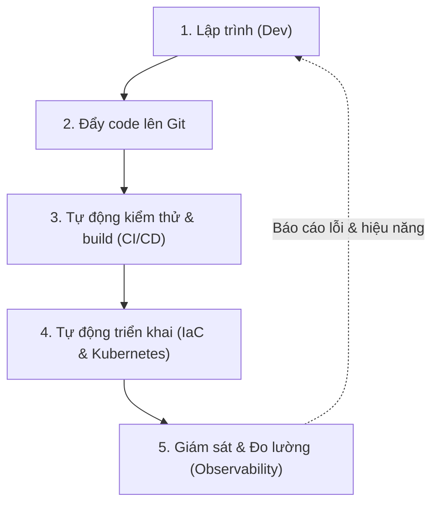
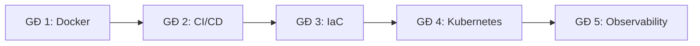

# 📋 Overview — 10_devops

> **Tác giả:** Mr.Rom\
> **Phiên bản:** v1.0.0\
> **Tạo lúc:** 16/05/2026\
> **Cập nhật:** 26/05/2026

> 🎯 *DevOps không chỉ là một bộ công cụ hay vị trí công việc. Đó là sự giao thoa giữa Văn hóa, Quy trình và Tự động hóa nhằm phá vỡ bức tường ngăn cách giữa Phát triển (Development) và Vận hành (Operations), giúp đưa sản phẩm phần mềm đến tay người dùng nhanh hơn, an toàn hơn và ổn định hơn.*

---

## 1️⃣ DevOps là gì?

Nếu xem việc lập trình ra một ứng dụng là chế tạo ra một chiếc xe đua, thì:
*   **Developers (Dev):** Là những kỹ sư cơ khí trong xưởng, liên tục thiết kế, lắp ráp linh kiện mới, nâng cấp động cơ (tính năng mới) để xe chạy nhanh hơn.
*   **Operations (Ops):** Là đội ngũ kỹ thuật trên đường đua thực tế, chịu trách nhiệm bảo trì, tiếp nhiên liệu, và bảo đảm xe chạy liên tục hàng trăm vòng mà không gặp sự cố (downtime/lỗi crash).

**DevOps** chính là dây chuyền lắp ráp và vận hành tự động hóa. Nó giúp chiếc xe được kiểm thử tự động trong xưởng, đưa thẳng ra đường đua một cách an toàn và trơn tru, đồng thời thu thập các thông số cảm biến (observability) trên đường đua để gửi ngược về cho xưởng sửa chữa kịp thời.

---

## 2️⃣ Vì sao cần DevOps?

Sự ra đời của DevOps là để giải quyết xung đột kinh điển: **Dev muốn thay đổi nhanh** (thêm tính năng mới), còn **Ops muốn hệ thống ổn định** (ít thay đổi nhất có thể để tránh phát sinh lỗi).

### Trước khi có DevOps (Mô hình truyền thống)
Quy trình bàn giao là một "cơn ác mộng". Developer viết code xong, đóng gói thủ công thành file zip/tar rồi "ném qua bức tường ngăn cách" cho Ops tự deploy. Khi xảy ra lỗi:
*   Dev đổ lỗi: *"Code chạy ngon trên máy tôi, chắc tại cấu hình server của các anh lỗi."*
*   Ops đổ lỗi: *"Server chúng tôi chuẩn, chắc chắn code của các anh có bug."*
Hệ quả là chu kỳ phát hành (release cycle) cực kỳ chậm, mất hàng tuần đến hàng tháng, tỷ lệ downtime cao mỗi lần deploy.

### Sau khi có DevOps
Mọi thứ thay đổi nhờ tự động hóa và sự đồng thuận về quy trình:
*   Ứng dụng được đóng gói cùng môi trường chạy nhờ **Containerization (Docker)**.
*   Mọi thay đổi code đều được tự động chạy test, build, quét bảo mật và sẵn sàng deploy qua **CI/CD Pipeline**.
*   Hạ tầng (servers, network, database) không còn được cấu hình thủ công nữa mà được định nghĩa hoàn toàn bằng mã nguồn qua **Infrastructure as Code (IaC)**.
*   Hệ thống được giám sát liên tục để tự động phát hiện lỗi và cảnh báo qua **Observability**.

---

## 3️⃣ Khi nào nên áp dụng DevOps?

| Tình huống thực tế | Có nên áp dụng | Giải pháp đề xuất |
|---|---|---|
| Sản phẩm startup phát hành nhanh, thay đổi tính năng hàng ngày | **✅ Rất nên** | Triển khai CI/CD tự động và Docker để rút ngắn thời gian deploy từ hàng giờ xuống hàng phút. |
| Hệ thống phân tán (microservices), chạy hàng chục service khác nhau | **✅ Bắt buộc** | Sử dụng Container Orchestration (Kubernetes) và IaC (Terraform) để quản lý hàng trăm container một cách tập trung. |
| Hệ thống monolith cũ (Legacy), chỉ deploy 1 lần mỗi 6 tháng | **⚠️ Cân nhắc** | Không cần Kubernetes quá phức tạp. Chỉ cần áp dụng CI/CD cơ bản và Docker là đủ cải thiện hiệu suất. |
| Project cá nhân, học tập hoặc bài tập nhỏ trên trường | **❌ Không cần** | Deploy thủ công hoặc qua các dịch vụ PaaS miễn phí để tập trung vào logic lập trình trước. |

---

## 4️⃣ Các khái niệm cốt lõi trong DevOps Stack

Học DevOps là học cách làm chủ các mảnh ghép sau:

1.  **Containerization (Đóng gói ứng dụng):** Đóng gói code cùng toàn bộ thư viện liên quan thành một khối thống nhất chạy nhất quán trên mọi máy tính.
    *   *Đại diện:* **Docker**
2.  **Orchestration (Điều phối Container):** Tự động hóa việc lập lịch, nhân bản, phục hồi và định tuyến traffic cho hàng ngàn container chạy trên nhiều máy chủ khác nhau.
    *   *Đại diện:* **Kubernetes (K8s)**
3.  **Continuous Integration & Deployment (CI/CD):** Chuỗi tự động hóa tích hợp code liên tục và triển khai sản phẩm lên môi trường production mà không cần sự can thiệp thủ công.
    *   *Đại diện:* **GitHub Actions**, **GitLab CI**
4.  **Infrastructure as Code (Quản lý hạ tầng bằng code):** Định nghĩa toàn bộ tài nguyên cloud (Virtual Machines, Network, Database) dưới dạng file text để dễ dàng quản lý phiên bản, kiểm tra lỗi và tái tạo môi trường.
    *   *Đại diện:* **Terraform / OpenTofu**
5.  **Observability (Giám sát & Quan sát):** Thu thập Metrics (thông số), Logs (nhật ký chạy), và Traces (dấu vết luồng đi) của ứng dụng để thấu hiểu trạng thái sức khỏe của hệ thống.
    *   *Đại diện:* **Prometheus**, **Grafana**, **OpenTelemetry**

---

## 5️⃣ Hệ sinh thái & Công cụ trong kho tri thức này

Để giúp bạn tiếp cận một cách trực quan, kho tri thức này đã phân loại rõ các công cụ theo từng thư mục con tại [10_devops/](./README.md):

*   **[`docker/`](./docker/)** — Nền tảng Container. Mọi lộ trình học DevOps đều bắt đầu tại đây.
*   **[`kubernetes/`](./kubernetes/)** — Hệ điều hành cho container ở quy mô lớn.
*   **[`ci-cd/`](./ci-cd/)** — Trái tim của sự tự động hóa quy trình.
*   **[`iac/`](./iac/)** — Lập trình hạ tầng (chủ đạo là Terraform & Terragrunt).
*   **[`observability/`](./observability/)** — Giác quan của hệ thống (Prometheus, Loki, Grafana, OpenTelemetry).
*   **[`gitops/`](./gitops/)** — Phương pháp quản lý hạ tầng hiện đại lấy Git làm single source of truth.

---

## 6️⃣ Lộ trình học đề xuất cho DevOps Core

Để không bị ngợp trong ma trận công cụ (Landscape), Mr.Rom đề xuất lộ trình học cuốn chiếu theo 5 giai đoạn sau:

| Giai đoạn | Nội dung học | Trọng tâm cần đạt được |
|---|---|---|
| **GĐ 1: Docker** | [Docker Basic](./docker/) | Viết được Dockerfile build ứng dụng web, chạy được hệ thống nhiều container bằng Docker Compose. |
| **GĐ 2: CI/CD** | [CI/CD Basic](./ci-cd/) | Tự động hóa quy trình test và tự động build/push Docker Image lên Registry mỗi khi commit code. |
| **GĐ 3: IaC** | [IaC Basic](./iac/) | Tạo được Server (VM), Setup Network và Database trên Cloud (AWS/GCP) bằng Terraform. |
| **GĐ 4: Kubernetes** | [Kubernetes Basic](./kubernetes/) | Deploy được ứng dụng lên Cluster, expose domain ra ngoài Internet và quản lý Config/Secret đúng cách. |
| **GĐ 5: Observability**| [Observability Basic](./observability/) | Vẽ được Dashboard theo dõi CPU/RAM/Request của ứng dụng và cấu hình cảnh báo về Telegram/Slack khi lỗi. |

---

## 7️⃣ Câu hỏi thường gặp

**Q: Dev có cần học DevOps không hay đây chỉ là việc của Ops?**
*   **A:** Cực kỳ cần. Developer hiện đại cần hiểu cách ứng dụng của mình chạy như thế nào trong container, cách cấu hình biến môi trường, và viết pipeline CI/CD cơ bản. Điều này giúp bạn làm chủ 100% vòng đời của code do mình viết ra.

**Q: Mình nên học AWS/GCP trước hay học Docker/Kubernetes trước?**
*   **A:** Hãy học Docker trước. Docker là nền tảng chạy trên mọi Cloud. Sau khi nắm chắc Docker và CI/CD, việc học Cloud (AWS/GCP/Azure) sẽ trở nên cực kỳ dễ dàng vì các dịch vụ trên đó phần lớn đều hỗ trợ chạy container.

**Q: Kubernetes có quá phức tạp cho các ứng dụng nhỏ không?**
*   **A:** Có. Nếu ứng dụng của bạn chỉ là 1-2 container chạy trên 1 VPS đơn lẻ, hãy dùng Docker Compose. Chỉ chuyển sang Kubernetes khi bạn cần khả năng tự động scale, tự phục hồi (self-healing), hoặc quản lý hàng chục microservices.

---

## 📌 Nhật ký thay đổi (Changelog)

- **v0.1.0 (16/05/2026)** — Khởi tạo file khung (skeleton).
- **v1.0.0 (26/05/2026)** — Biên soạn nội dung hoàn chỉnh cho file tổng quan DevOps L1.
