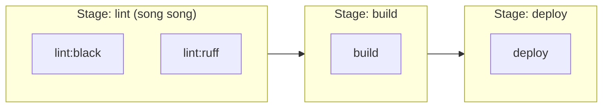

# 🎓 GitLab CI — Pipeline cho GitLab + self-host

> **Tác giả:** Mr.Rom\
> **Phiên bản:** v1.1.2\
> **Tạo lúc:** 23/05/2026\
> **Cập nhật:** 11/06/2026\
> **Level:** Basic\
> **Tags:** [MUST-KNOW]\
> **Yêu cầu trước:** [What is CI/CD](00_what-is-cicd.md)

> 🎯 *Master GitLab CI: **`.gitlab-ci.yml`** syntax, **stages + jobs**, **runners** (shared + self-hosted), **rules + only/except**, **variables + secrets**, **cache + artifacts**, **services** (DB containers), **environments + manual approve**, **GitLab vs GitHub Actions** compare.*

## 🎯 Sau bài này bạn sẽ

- [ ] Viết `.gitlab-ci.yml` đầy đủ
- [ ] Hiểu **stages** sequential vs **jobs** parallel
- [ ] Setup **self-hosted runner**
- [ ] **`rules`** modern vs **`only/except`** legacy
- [ ] **Variables** + **CI/CD secrets** + **masked**
- [ ] **`services`** (Postgres/Redis cho test)
- [ ] **Environments** + manual approval
- [ ] So sánh GitLab CI vs GitHub Actions

---

## Tình huống — Bạn join công ty dùng GitLab

Bạn quen GitHub Actions. Công ty mới dùng GitLab self-host. Anh thấy:

```yaml
# .gitlab-ci.yml
stages:
  - build
  - test
  - deploy
```

→ Cú pháp khác Actions. Concepts overlap nhưng terminology khác. Plus `services`, `tags`, `rules` — gì?

Senior:
> *"GitLab CI mature hơn Actions (2014 vs 2018). Self-host runner mạnh, integrate GitLab Issues/MR/Container Registry seamlessly. Cú pháp khác nhưng concept giống — học 1 ngày."*

→ Bài này dạy GitLab CI từ GitHub Actions perspective.

---

## 1️⃣ Giải phẫu `.gitlab-ci.yml`

File `.gitlab-ci.yml` ở repo root — GitLab CI tự detect và chạy. Structure cơ bản: **stages → jobs → scripts**. Concept giống GitHub Actions nhưng cú pháp khác. Skeleton đầy đủ:

```yaml
# .gitlab-ci.yml

stages:                                  # ← Order sequential
  - build
  - test
  - deploy

variables:                               # ← Pipeline-level vars
  PYTHON_VERSION: "3.12"
  IMAGE: $CI_REGISTRY_IMAGE:$CI_COMMIT_SHA

default:                                  # ← Defaults all jobs
  image: python:3.12-slim
  cache:
    paths: [.pip-cache/]

build:
  stage: build                            # ← Job in 'build' stage
  script:
    - pip install -r requirements.txt
    - python -m build

test:
  stage: test                             # ← Runs after build
  script:
    - pytest --cov

deploy:
  stage: deploy
  script:
    - kubectl apply -f k8s/
  rules:
    - if: '$CI_COMMIT_BRANCH == "main"'    # Only main
  environment:
    name: production
    url: https://acmeshop.vn
```

### Cấu trúc phân tầng

Cấu trúc phân tầng giúp hình dung relationship giữa stages, jobs, scripts. Quy tắc: **stages tuần tự, jobs trong stage parallel, scripts trong job tuần tự**:

```
.gitlab-ci.yml
├─ stages: [build, test, deploy]      Sequential phases
├─ Jobs (run trong stage)              Parallel within stage
├─ scripts (shell commands)            Sequential within job
└─ variables, cache, artifacts, rules  Per job or global
```

---

## 2️⃣ Stages — Các pha tuần tự

`stages` định nghĩa **thứ tự thực thi cấp pipeline**. Mỗi stage chứa nhiều job — jobs trong stage chạy **parallel**, stage chạy **sequential**. Pattern điển hình 4 stage: lint → build → test → deploy:

```yaml
stages:
  - lint              # Phase 1 — all 'lint' jobs run parallel
  - build              # Phase 2 — only after lint pass
  - test               # Phase 3
  - deploy             # Phase 4
```

→ Jobs in same stage = parallel. Stage progression = sequential.

```yaml
lint:black:
  stage: lint
  script: black --check .

lint:ruff:
  stage: lint
  script: ruff check .
# ↑ 2 jobs lint chạy parallel

build:
  stage: build
  script: docker build -t myapp .
# ↑ Wait both lint jobs pass
```

Sơ đồ dưới minh hoạ quy tắc cốt lõi đó: 2 job lint nằm cùng stage nên chạy song song, còn các stage nối nhau tuần tự — stage sau chỉ bắt đầu khi mọi job stage trước pass:



→ Stage là "hàng rào đồng bộ" mặc định của GitLab CI — muốn phá rào cho job chạy sớm hơn thì dùng `needs` (DAG) ngay bên dưới.

### `needs` — DAG (skip stages)

Modern GitLab CI hỗ trợ DAG via `needs` — job có thể chạy **ngay khi dependency xong**, không cần đợi cả stage trước hoàn tất. Tăng tốc pipeline đáng kể cho monorepo:

```yaml
deploy:
  stage: deploy
  needs: [build]                          # ← Skip test, just need build
  script: ...
```

→ Modern: `needs` for DAG (job dependencies). `stages` for grouping.

---

## 3️⃣ Jobs chuyên sâu

### Cú pháp job đầy đủ

Job GitLab CI có **~15 field** điều khiển — image, before/after script, services, cache, artifacts, retry, rules, environment. Job production-grade thường dùng 8-10 field:

```yaml
test:
  image: python:3.12                       # Override default image
  stage: test
  before_script:
    - pip install -r requirements.txt
  script:
    - pytest
    - coverage report
  after_script:
    - echo "Done"
  artifacts:
    paths: [htmlcov/]
    reports:
      coverage_report:
        coverage_format: cobertura
        path: coverage.xml
    expire_in: 1 week
  cache:
    key: ${CI_COMMIT_REF_SLUG}
    paths: [.cache/pip]
  rules:
    - if: $CI_PIPELINE_SOURCE == "merge_request_event"
    - if: $CI_COMMIT_BRANCH == "main"
  timeout: 30 minutes
  retry: 2
  tags: [docker]                            # Pick runner with this tag
  variables:
    DATABASE_URL: postgres://localhost:5432/test
  services:                                  # Docker containers for test
    - postgres:18
    - redis:7
```

---

## 4️⃣ Rules — Khi nào job chạy

### `rules` (modern, recommended)

```yaml
deploy:
  rules:
    # Run if on main branch
    - if: $CI_COMMIT_BRANCH == "main"
      when: on_success                       # Default — only if previous pass

    # Run on tag
    - if: $CI_COMMIT_TAG
      when: always

    # Manual trigger for production
    - if: $CI_COMMIT_BRANCH == "main"
      when: manual
      allow_failure: false                    # Pipeline fail if not run

    # Skip on docs change
    - changes:
        - "docs/**"
      when: never
```

### `only/except` (legacy)

```yaml
deploy:
  only:
    - main
    - tags
  except:
    - schedules
```

→ Replaced by `rules` since GitLab 12+. Don't use new code.

### Rules thường gặp

```yaml
rules:
  - if: $CI_PIPELINE_SOURCE == "merge_request_event"  # On MR
  - if: $CI_COMMIT_BRANCH == $CI_DEFAULT_BRANCH        # Main/master
  - if: $CI_COMMIT_TAG                                   # On version tag
  - if: $CI_PIPELINE_SOURCE == "schedule"              # Scheduled run
  - changes: [src/**, package.json]                     # Files changed
  - exists: [Dockerfile]                                # File exists in repo
```

---

## 5️⃣ Variables + Secrets

### CI variable định nghĩa sẵn

```
$CI_PROJECT_NAME       # myapp
$CI_PROJECT_PATH       # group/myapp
$CI_COMMIT_SHA         # abc123...
$CI_COMMIT_SHORT_SHA   # abc123
$CI_COMMIT_BRANCH      # main
$CI_COMMIT_TAG         # v1.0.0
$CI_COMMIT_REF_SLUG    # main (URL-safe)
$CI_PIPELINE_ID        # 42
$CI_PIPELINE_SOURCE    # push, merge_request_event, schedule
$CI_REGISTRY           # gitlab.com/your-group/myapp/container_registry
$CI_REGISTRY_IMAGE     # registry.gitlab.com/your-group/myapp
$GITLAB_CI             # true
```

→ 100+ predefined. Reference: `gitlab.com/help/ci/variables/predefined_variables`.

### Custom variables (Settings → CI/CD → Variables)

```
DATABASE_URL = postgresql://...  (masked)
AWS_SECRET   = xyz                (protected — only protected branches)
```

```yaml
deploy:
  script:
    - echo $DATABASE_URL          # Masked in logs
```

### File variables (e.g., kubeconfig)

```
KUBECONFIG (type: file) = <content>
```

```yaml
deploy:
  script:
    - export KUBECONFIG=$KUBECONFIG     # Path to file
    - kubectl get pods
```

### Cờ `protected` + `masked`

| Flag | Meaning |
|---|---|
| **Protected** | Only available on protected branches/tags |
| **Masked** | Hide value in logs |

→ Production secrets: both **protected + masked**.

---

## 6️⃣ Cache + Artifacts

### Cache — Tăng tốc build

```yaml
cache:
  key:
    files:
      - package-lock.json
  paths:
    - node_modules/
    - .npm/
```

→ Same `package-lock.json` → same cache → restore.

```yaml
# Multi-key cache
cache:
  - key: pip-cache
    paths: [.cache/pip]
  - key:
      files: [Cargo.lock]
    paths: [target/]
```

### Artifacts — Truyền file giữa các job

```yaml
build:
  script: npm run build
  artifacts:
    paths:
      - dist/
    expire_in: 1 hour

deploy:
  script:
    - ls dist/                              # ← Has files from build
```

→ Cache = local to runner, can be lost. Artifacts = uploaded to GitLab, durable.

### Reports — Artifacts đặc biệt

```yaml
test:
  artifacts:
    reports:
      junit: test-results.xml                # Show in MR
      coverage_report:
        coverage_format: cobertura
        path: coverage.xml
      sast: gl-sast-report.json               # Security
      dependency_scanning: gl-dep-scan.json
```

→ GitLab UI render reports trong MR (test status, coverage diff, security issues).

---

## 7️⃣ Services — DB containers cho test

```yaml
test:
  image: python:3.12
  services:
    - name: postgres:18
      alias: db                              # Hostname inside job
    - name: redis:7
      alias: cache
  variables:
    POSTGRES_PASSWORD: test
    POSTGRES_DB: testdb
    DATABASE_URL: postgresql://postgres:test@db:5432/testdb
  script:
    - pytest --postgres-host=db
```

→ GitLab spin Postgres + Redis container alongside test container. Use hostname `db` and `cache`.

### Service tuỳ chỉnh

```yaml
services:
  - name: mcr.microsoft.com/dotnet/sdk:8.0
    alias: dotnet
    command: ["dotnet", "watch", "run"]
```

---

## 8️⃣ Environments + Phê duyệt thủ công

```yaml
deploy-staging:
  stage: deploy
  script: ./deploy.sh staging
  environment:
    name: staging
    url: https://staging.acmeshop.vn
  rules:
    - if: $CI_COMMIT_BRANCH == "main"

deploy-prod:
  stage: deploy
  script: ./deploy.sh production
  environment:
    name: production
    url: https://acmeshop.vn
    on_stop: stop-prod                       # Cleanup job
  rules:
    - if: $CI_COMMIT_BRANCH == "main"
      when: manual                            # ← Click to deploy
      allow_failure: false

stop-prod:
  stage: deploy
  script: ./rollback.sh production
  when: manual
  environment:
    name: production
    action: stop
```

→ Manual prod = click button trong UI. Environments visible: Deployments → Environments.

### Protected environment (môi trường được bảo vệ)

GitLab UI: Settings → CI/CD → Protected environments → Only specific users/roles can deploy.

---

## 9️⃣ GitLab Runner — Nơi job chạy

### 3 loại

| Type | Source | Notes |
|---|---|---|
| **Shared** (GitLab.com) | GitLab.com SaaS | 400 free CI mins/mo, then paid |
| **Group runners** | Self-hosted, group-level | Share across group's projects |
| **Project runners** | Self-hosted, project-only | |

### Cài self-hosted runner

```bash
# Docker-based runner
docker run -d --name gitlab-runner --restart always \
  -v /var/run/docker.sock:/var/run/docker.sock \
  -v gitlab-runner-config:/etc/gitlab-runner \
  gitlab/gitlab-runner:latest

# Register (get token from GitLab UI)
docker exec -it gitlab-runner gitlab-runner register
# Prompt: URL, token, description, tags, executor (choose 'docker')
```

### Executors

| Executor | When |
|---|---|
| `shell` | Run on runner host directly (insecure shared) |
| `docker` | **Default** — each job in container |
| `docker-machine` | Spin VMs on-demand (Hetzner, DO) |
| `kubernetes` | Schedule jobs as K8s pods |
| `virtualbox` / `parallels` | Mac builds |

### Gán job cho runner bằng tag

```yaml
build-arm:
  tags: [arm64]                              # Pick runner with this tag
  script: docker build --platform linux/arm64 .
```

→ Tags = capability filter. Runner registered with `[docker, arm64, gpu]` → match jobs tag `gpu`.

---

## 1️⃣0️⃣ Container Registry — GitLab built-in

GitLab có **container registry** built-in:

```yaml
build-image:
  image: docker:latest
  services: [docker:dind]
  script:
    - docker login -u $CI_REGISTRY_USER -p $CI_REGISTRY_PASSWORD $CI_REGISTRY
    - docker build -t $CI_REGISTRY_IMAGE:$CI_COMMIT_SHA .
    - docker push $CI_REGISTRY_IMAGE:$CI_COMMIT_SHA
```

→ Push to `registry.gitlab.com/group/project:tag`. Free for public repos.

### Hoặc dùng Docker buildx

```yaml
build-image:
  image: docker:latest
  services: [docker:dind]
  before_script:
    - echo $CI_REGISTRY_PASSWORD | docker login $CI_REGISTRY -u $CI_REGISTRY_USER --password-stdin
  script:
    - docker buildx create --use
    - docker buildx build --platform linux/amd64,linux/arm64 \
        --push -t $CI_REGISTRY_IMAGE:$CI_COMMIT_SHA .
```

---

## 1️⃣1️⃣ GitLab CI vs GitHub Actions

| Aspect | GitLab CI | GitHub Actions |
|---|---|---|
| Year | 2014 | 2018 |
| Setup file | `.gitlab-ci.yml` (1 file) | `.github/workflows/*.yml` (multiple) |
| Integration | GitLab platform tight | GitHub platform tight |
| Self-host runner | ✅ Excellent | ✅ OK |
| Marketplace | Templates + Includes | Actions marketplace (huge) |
| Container registry | Built-in | GHCR built-in |
| Issues, MR, Wiki | Built-in | Built-in (different terms) |
| Free tier | 400 min/mo | 2000 min/mo (public unlimited) |
| K8s integration | Native (auto-create env per MR) | Action-based |
| Learning curve | Medium | Easier (lots of examples) |
| Sync action | OnPremise self-host = full platform | GHE = costs separate |
| Best for | All-in-one DevOps, self-host | GitHub-native, OSS |

### Khi nào chọn gì?

| Use case | Pick |
|---|---|
| Repo trên GitHub | **GitHub Actions** |
| Repo trên GitLab | **GitLab CI** |
| All-in-one DevOps platform (issue + CI + registry + monitoring) | GitLab |
| OSS community + free | GitHub Actions |
| Self-host everything, EU compliance | GitLab CE/EE self-host |

---

## 1️⃣2️⃣ Bạn viết GitLab pipeline tương đương

```yaml
# .gitlab-ci.yml
stages:
  - lint
  - test
  - build
  - deploy

variables:
  PYTHON_VERSION: "3.12"

default:
  image: python:${PYTHON_VERSION}-slim
  cache:
    paths: [.cache/pip]

lint:
  stage: lint
  before_script: [pip install ruff black mypy]
  script:
    - ruff check .
    - black --check .
    - mypy app/

test:
  stage: test
  services:
    - name: postgres:18
      alias: db
  variables:
    POSTGRES_PASSWORD: test
    POSTGRES_DB: test
    DATABASE_URL: postgresql://postgres:test@db:5432/test
  before_script: [pip install -r requirements.txt]
  script: [pytest --cov=app --cov-report=xml]
  artifacts:
    reports:
      coverage_report:
        coverage_format: cobertura
        path: coverage.xml
    expire_in: 1 week

build-image:
  stage: build
  image: docker:latest
  services: [docker:dind]
  needs: [lint, test]
  script:
    - echo $CI_REGISTRY_PASSWORD | docker login -u $CI_REGISTRY_USER --password-stdin $CI_REGISTRY
    - docker build -t $CI_REGISTRY_IMAGE:$CI_COMMIT_SHA .
    - docker push $CI_REGISTRY_IMAGE:$CI_COMMIT_SHA
  rules:
    - if: $CI_COMMIT_BRANCH == "main"

deploy-staging:
  stage: deploy
  needs: [build-image]
  image: bitnami/kubectl:latest
  script:
    - kubectl config use-context $CI_PROJECT_PATH:staging
    - kubectl set image deployment/fastapi fastapi=$CI_REGISTRY_IMAGE:$CI_COMMIT_SHA -n staging
    - kubectl rollout status deployment/fastapi -n staging
  environment:
    name: staging
    url: https://staging.acmeshop.vn
  rules:
    - if: $CI_COMMIT_BRANCH == "main"

deploy-prod:
  stage: deploy
  needs: [deploy-staging]
  image: bitnami/kubectl:latest
  script:
    - kubectl config use-context $CI_PROJECT_PATH:production
    - kubectl set image deployment/fastapi fastapi=$CI_REGISTRY_IMAGE:$CI_COMMIT_SHA -n production
    - kubectl rollout status deployment/fastapi -n production
  environment:
    name: production
    url: https://acmeshop.vn
  rules:
    - if: $CI_COMMIT_BRANCH == "main"
      when: manual
      allow_failure: false
```

→ Equivalent to GitHub Actions workflow. **Cùng concepts, syntax khác**.

---

## 💡 Cạm bẫy thường gặp & Best practice

1. **`only/except` legacy** → replaced by `rules`. Migrate.
2. **Forget `needs`** → all jobs wait stage progression. Use `needs: [job]` for DAG speedup.
3. **No cache** → reinstall deps every run. `cache: paths:` + key.
4. **Variables not masked** → leak in logs. Settings → CI/CD → Variables → Mask.
5. **dind setup wrong** → docker build fail. `services: [docker:dind]` + `image: docker:latest` + login secrets.

---

## 🧠 Tự kiểm tra (Self-check)

1. **Stages** vs **needs** — khác sao?
2. **`rules`** thay thế **`only/except`** — ưu điểm?
3. **Services** trong GitLab CI dùng để làm gì?
4. **Artifacts** vs **Cache** — khác sao?
5. GitLab vs GitHub Actions — chọn 2026?

<details>
<summary>Gợi ý đáp án</summary>

1. **Stages**: phases sequential (build → test → deploy). Jobs same stage parallel. **`needs`**: explicit DAG dependency, allow job skip stage (deploy `needs: [build]` skip test). Modern GitLab: combine — stages for grouping + needs for DAG.

2. **`rules`**: more expressive (if + changes + exists + when + allow_failure). Replaces `only/except` since GitLab 12+. Examples: `if: $CI_COMMIT_BRANCH == "main"`, `changes: [src/**]`, `when: manual`. **Migrate** legacy `only/except` → `rules`.

3. **`services`** = Docker containers run **alongside** job container. Use case: spin Postgres/Redis/Elasticsearch for integration tests. Access via hostname (alias). Tear down after job.

4. **Cache**: speed up subsequent runs, **local to runner**, can be lost, restore by key. **Artifacts**: pass files **between jobs**, **uploaded to GitLab**, durable, expire after time. Cache = deps. Artifacts = build output, test reports.

5. **Pick based on repo location**: GitHub repo → GitHub Actions (native), GitLab repo → GitLab CI (native). Force migration: rarely. All-in-one DevOps (issue + CI + registry + wiki) → GitLab. OSS community + marketplace size → GitHub Actions.
</details>

---

## ⚡ Tra cứu nhanh (Cheatsheet)

### `.gitlab-ci.yml` tối thiểu

```yaml
stages: [build, test, deploy]

variables:
  PYTHON_VERSION: "3.12"

default:
  image: python:${PYTHON_VERSION}
  cache: { paths: [.cache/pip] }

test:
  stage: test
  script: pytest
  services: [postgres:18]
```

### Rules

```yaml
rules:
- if: $CI_COMMIT_BRANCH == "main"
- if: $CI_COMMIT_TAG
- changes: [src/**]
- when: manual
```

### CI variables

```
$CI_COMMIT_SHA           $CI_COMMIT_BRANCH
$CI_COMMIT_TAG           $CI_REGISTRY_IMAGE
$CI_PIPELINE_ID          $CI_PROJECT_PATH
```

### Environments

```yaml
environment:
  name: production
  url: https://x.com
  on_stop: stop-prod
```

### Self-host runner

```bash
docker run -d --name gitlab-runner \
  -v /var/run/docker.sock:/var/run/docker.sock \
  gitlab/gitlab-runner:latest
docker exec -it gitlab-runner gitlab-runner register
```

---

## 📚 Từ Điển Thuật Ngữ (Glossary)

| Thuật ngữ | Ý nghĩa |
|---|---|
| **`.gitlab-ci.yml`** | Pipeline definition file |
| **Stage** | Sequential phase (build/test/deploy) |
| **Job** | Unit run inside stage |
| **Runner** | Machine executing jobs |
| **Executor** | How runner runs job (docker/shell/k8s) |
| **Tags** | Runner capability filter |
| **`rules`** | Modern conditional |
| **`only/except`** | Legacy conditional |
| **Variables** | CI vars (predefined + custom) |
| **Masked / Protected** | Variable flags |
| **Services** | Docker containers alongside job |
| **Cache** | Speed up runs (deps) |
| **Artifacts** | Pass files between jobs |
| **Environment** | Deploy target with URL + protection |
| **dind** | Docker-in-Docker for builds |

---

## 🔗 Liên kết & Tài nguyên

### 🧭 Định hướng lộ trình học
- ⬅️ **Bài trước:** [GitHub Actions — Default CI/CD 2026](01_github-actions.md)
- ➡️ **Bài tiếp theo:** [Pipeline Patterns — Common patterns + best practices](03_pipeline-patterns.md)
- ↑ **Về cụm:** [ci-cd README](../../README.md)

### 🌐 Tài nguyên tham khảo khác
- 📖 [GitLab CI docs](https://docs.gitlab.com/ee/ci/)
- 📖 [GitLab CI variables](https://docs.gitlab.com/ee/ci/variables/predefined_variables.html)
- 📖 [GitLab Runner docs](https://docs.gitlab.com/runner/)
- 📖 [GitLab CI examples](https://gitlab.com/gitlab-examples)

---

> 🎯 *Sau bài này dùng GitLab CI thuần thục. Bài kế tiếp dạy **pipeline patterns** — common patterns across tools.*

---

## 📌 Nhật ký thay đổi (Changelog)

- **v1.0.0 (23/05/2026)** — Bản đầu tiên. Cluster ci-cd basic lesson 3/5. Cover: anatomy .gitlab-ci.yml + stages parallel/sequential + needs DAG + jobs syntax + cache/artifacts + rules + environments + GitLab vs GitHub Actions compare.
- **v1.1.0 (25/05/2026)** — Apply Blueprint v0.5.4+ §3.6: thêm lead-in trước §1 Anatomy + Hierarchy + §2 Stages + needs DAG + §3 Full job syntax.
- **v1.1.1 (11/06/2026)** — Việt hoá heading nội dung mô tả sang tiếng Việt (giữ thuật ngữ/brand/param) theo Vietnamese-first.
- **v1.1.2 (11/06/2026)** — Bổ sung sơ đồ stages tuần tự / jobs song song cho trực quan.
