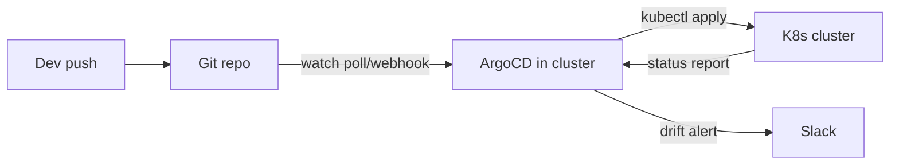
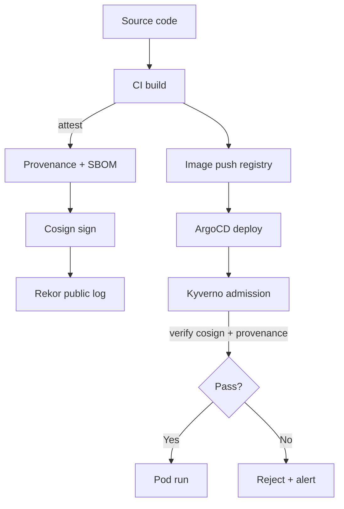
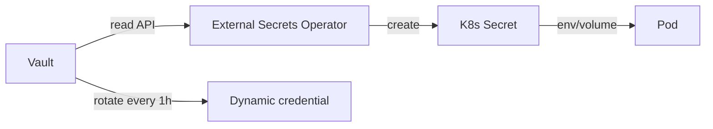
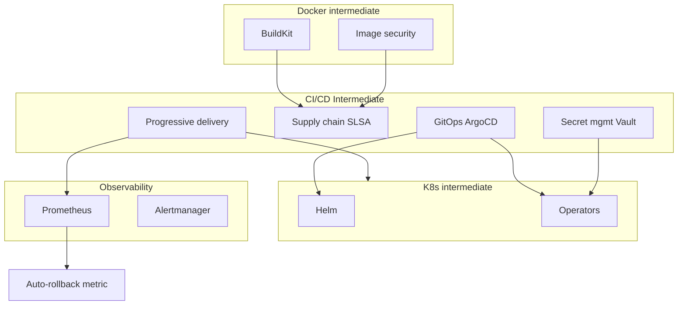

# 🎓 CI/CD Intermediate — Từ "deploy được" đến "supply chain secure"

> **Tác giả:** Mr.Rom\
> **Phiên bản:** v1.1.0\
> **Tạo lúc:** 24/05/2026\
> **Cập nhật:** 25/05/2026\
> **Level:** Intermediate\
> **Tags:** [MUST-KNOW]\
> **Yêu cầu trước:** [CI/CD basic cluster](../01_basic/), [Docker intermediate](../../../docker/lessons/02_intermediate/), [K8s intermediate](../../../kubernetes/lessons/02_intermediate/)

> 🎯 *Bài INTRO của intermediate. Bạn đã setup GitHub Actions / GitLab CI ở basic. Production scale cần: **GitOps** (Git = source of truth), **supply chain security** (SLSA + provenance), **secret management** (Vault + ESO), **progressive delivery** (canary + feature flags). Bài này map 4 mảng + chuẩn bị 4 bài kế tiếp.*

## 🎯 Sau bài này bạn sẽ

- [ ] Hiểu **khoảng cách** giữa CI/CD basic và production-grade 2026
- [ ] Biết **4 mảng intermediate**: GitOps / Supply chain / Secret mgmt / Progressive delivery
- [ ] Hiểu **GitOps anti-pattern** war story — vì sao kubectl apply + ArgoCD = chaos
- [ ] Hiểu **SLSA framework** + provenance chain
- [ ] Biết **tool stack 2026**: ArgoCD, Flux, Sigstore, Vault, Argo Rollouts, LaunchDarkly
- [ ] Có **lộ trình** học 4 bài kế tiếp

---

## Tình huống — Production cluster bị "drift" + bị inject malicious image

Production đang chạy ngon. Sáng thứ Hai, alerts bùng nổ:

**Sự cố #1** — Drift:
- SRE thấy pod `payment-api` chạy version `v2.3.1`, Git repo nói `v2.4.0`.
- Hỏi team: "ai deploy `v2.3.1`?". Không ai biết.
- Audit log: 3 dev khác nhau làm `kubectl apply` manual trong tuần qua. ArgoCD revert, dev re-apply, ArgoCD revert nữa. Cycle.

**Sự cố #2** — Supply chain:
- SOC2 audit: "Show me proof every prod image is built from your source code, by your CI."
- Bạn: "Em có Dockerfile trong repo..."
- Audit: "Provenance? Cosign signature verified at admission? SBOM stored?"
- Bạn: "Em scan bằng Trivy thôi..."
- Audit: ❌ Fail.

**Sự cố #3** — Secret leak:
- 1 dev commit `database.env` vào Git public. AWS Access Key + Stripe API key + Postgres password trong đó.
- 2 giờ sau, AWS bill spike $5,000 — bitcoin miner running EC2.
- Rotate hết secret, audit damage, post-mortem.

**Sự cố #4** — Canary deploy gone bad:
- Deploy `v2.5.0` qua GitHub Actions kubectl set image.
- 100% traffic switch tức thì. 5 phút sau, error rate 30% — bug critical.
- Manual rollback 8 phút. **Loss: $80,000 revenue trong 13 phút**.

Sếp: *"Cần GitOps + supply chain + secret manager + progressive delivery. Cluster intermediate này lấp đầy 4 mảng."*

→ Bài này map landscape.

---

## 1️⃣ Mảng 1 — GitOps deep với ArgoCD/Flux

### Vấn đề CI push deploy

CI/CD basic (bài 01-04 basic) dùng "**push model**":
- GitHub Actions có `aws eks update-kubeconfig` + `kubectl set image`.
- Pipeline có **cluster credential**.
- Pipeline drift hỏi cluster: "image v2.4.0?" — cluster có thể được sửa bằng tay lúc khác → drift.

### GitOps "pull model"

**ArgoCD/Flux** chạy **trong cluster**, watch Git repo. Khi Git update → sync vào cluster.

→ **Git = source of truth**. Cluster state sync từ Git. `kubectl apply` manual = drift → ArgoCD revert tự động (hoặc alert).

🪞 **Ẩn dụ**: *GitOps như **autopilot máy bay đọc bản đồ bay** — bản đồ (Git) là instruction duy nhất. Phi công (SRE) sửa instrument trực tiếp = autopilot revert sau 30s. Muốn đổi route = sửa bản đồ.*

### Anti-pattern war story (`__Ref__/`)

Team mới chuyển sang ArgoCD nhưng **SRE vẫn `kubectl apply` thủ công** khi emergency. Hậu quả:
1. SRE update deployment 3am cứu prod incident.
2. ArgoCD detect drift 3 phút sau → revert về Git state cũ.
3. Prod incident comeback → SRE confused, re-apply, ArgoCD revert nữa.
4. Cycle continue đến khi SRE disable ArgoCD auto-sync hoặc commit fix vào Git.

**Rule**: GitOps = **discipline**. Git là enforcement gate, không phải optional. Cấm `kubectl apply` direct prod (RBAC enforce).

→ Học deep ở **bài 01**.

---

## 2️⃣ Mảng 2 — Supply chain security (SLSA Level 3+)

### Vấn đề: "Provenance chain"

Image production: ai build? Source code commit nào? Pipeline nào? Có ai tamper không?

Without provenance: nếu image compromised, không debug được "lỗi từ đâu vào chuỗi cung ứng".

### SLSA framework reminder

(Đã giới thiệu Docker intermediate bài 02)

| Level | Yêu cầu | Tools 2026 |
|---|---|---|
| 1 | Build script + provenance | GitHub Actions provenance |
| 2 | Hosted build + signed provenance | BuildKit + cosign |
| 3 | Hardened build + non-falsifiable provenance | Reusable workflow + OIDC |
| 4 | Two-party review + reproducible build | Multi-reviewer + hermetic |

→ **Production 2026 aim SLSA 3**.

### Components

Supply chain security stack 2026 dựa trên **5 component** standardized: provenance (in-toto), SBOM (Syft), signature (cosign), admission gate (Kyverno), public log (Rekor). Tất cả CNCF graduated, tích hợp được vào mọi CI:

- **Provenance attestation** (in-toto format): "image X build từ Git commit Y bằng workflow Z".
- **SBOM** (Syft/CycloneDX): danh sách package trong image.
- **Cosign signature**: cryptographic proof of authorship.
- **Verify gate** (Kyverno/Gatekeeper): admission controller reject image không đủ provenance.
- **Rekor transparency log**: public audit trail.

🪞 **Ẩn dụ**: *Supply chain security như **giấy chứng nhận xuất xứ + tem chống giả + tracking number** cho mỗi gói hàng. Image production phải có: source verified (origin), SBOM (component list), signature (anti-tamper), Rekor log (public audit).*

### CI/CD integration

End-to-end pipeline với supply chain security gồm **8 bước** — từ source code → CI build → cosign sign → ArgoCD deploy → Kyverno verify. Mỗi bước có gate, fail là reject ngay:

→ Học deep ở **bài 02**.

---

## 3️⃣ Mảng 3 — Secret management (Vault + ESO)

### 12-Factor App reminder (factor #3 — Config)

> **"Store config (including credentials) in the environment, NOT in code or source repo."**

Anti-pattern:
- `database.env` commit Git → leak forever.
- Hardcode API key trong Dockerfile.
- Pass secret qua `--build-arg` → leak vào image layer.

### Solution stack 2026

6 tool chính chia 3 cấp — centralized (Vault), K8s sync (ESO/Sealed Secrets), file encryption (SOPS). Pick theo scale: startup dùng Doppler/Infisical SaaS, enterprise dùng Vault self-host:

| Tool | Use case | Maturity |
|---|---|---|
| **HashiCorp Vault** | Centralized secret store, dynamic credentials, transit encryption | Production standard |
| **External Secrets Operator (ESO)** | Sync Vault/AWS SM/GCP SM → K8s Secret | CNCF Graduated |
| **Sealed Secrets** (Bitnami) | Encrypt Secret with cluster key, safe to commit | Simple, GitOps-friendly |
| **SOPS** (Mozilla) | File-level encryption (YAML/JSON) với cloud KMS | CLI-based, low overhead |
| **AWS Secrets Manager / Parameter Store** | Cloud-native (AWS) | AWS-specific |
| **Doppler / Infisical** | SaaS secret manager | Modern, dev-friendly |

### Pattern: ESO + Vault

Pattern combo phổ biến nhất production K8s 2026 — Vault làm source of truth, ESO sync về K8s Secret native, Pod đọc qua env/volume bình thường. Rotation tự động qua dynamic credentials:

→ Pod **không bao giờ thấy Vault**. Chỉ thấy K8s Secret refresh tự động.

→ Học deep ở **bài 03**.

---

## 4️⃣ Mảng 4 — Progressive delivery

### Vấn đề "all-or-nothing" deploy

CI/CD basic (bài 04 basic) đã giới thiệu 5 strategy (Recreate/Rolling/Blue-Green/Canary/Feature Flags). Production cần **canary deep**:
- **Traffic shifting** progressive: 5% → 25% → 50% → 100%, mỗi phase observe metrics.
- **Auto rollback** dựa trên SLO (error rate, latency).
- **A/B testing**: 2 version chạy song song, compare conversion.
- **Feature flags** runtime: rollout feature đến subset users không cần redeploy.

### Tool stack

8 tool chia 2 nhóm — **K8s traffic shifting** (Argo Rollouts/Flagger/Istio) và **feature flags** (LaunchDarkly/Unleash/Flagsmith/GrowthBook/OpenFeature). Combo cả 2 = progressive delivery hoàn chỉnh:

| Tool | Use case |
|---|---|
| **Argo Rollouts** | Progressive delivery cho K8s (canary, blue-green, with metric analysis) |
| **Flagger** (Flux) | Tương tự Argo Rollouts, integrate với Flux |
| **Istio / Linkerd** | Traffic mesh layer (split percentage) |
| **LaunchDarkly** | Commercial feature flag (best UX) |
| **Unleash** | OSS feature flag self-host |
| **Flagsmith** | OSS feature flag, hybrid SaaS option |
| **GrowthBook** | OSS, analytics-first feature flag |
| **OpenFeature** | Vendor-neutral SDK spec (CNCF Incubating) |

🪞 **Ẩn dụ**: *Progressive delivery như **thử món mới ở 1 chi nhánh** trước khi rollout toàn chuỗi. 5% user thấy món mới (canary), restaurant theo dõi feedback. Nếu phàn nàn nhiều → revert. OK → mở rộng từ từ.*

→ Học deep ở **bài 04**.

---

## 5️⃣ Mối liên hệ với DevOps stack

| CI/CD intermediate mảng | Connect tới |
|---|---|
| GitOps | Helm chart (bài 01 K8s) — ArgoCD render Helm chart |
| Supply chain | Image security (bài 02 Docker) — cosign sign trong CI, verify ở admission |
| Secret mgmt | K8s Operator pattern (bài 04 K8s) — ESO là CNCF Operator |
| Progressive delivery | Observability metric — auto rollback dựa Prometheus alert |

→ **CI/CD intermediate là glue layer** giữa Docker + K8s + Observability + IaC.

---

## 6️⃣ Tool stack 2026 — Cheatsheet

| Mục đích | Tool chính 2026 | Tool dự bị | Khi nào dùng |
|---|---|---|---|
| **GitOps CD** | **ArgoCD** | Flux, Jenkins X | ArgoCD UI mạnh; Flux git-centric lightweight |
| **GitOps multi-cluster** | **ArgoCD ApplicationSet** | Flux + Kustomize | Manage 10+ cluster |
| **Provenance** | **GitHub Actions provenance + SLSA** | GitLab attestation | Native với platform |
| **Image signing** | **cosign (Sigstore)** | Notary v2 | cosign default 2026 |
| **Admission verify** | **Kyverno** | OPA Gatekeeper, Sigstore Policy Controller | Kyverno YAML-first |
| **Secret store** | **HashiCorp Vault** | AWS/GCP/Azure SM | Vault for multi-cloud + dynamic cred |
| **Secret sync K8s** | **External Secrets Operator** | Sealed Secrets | ESO multi-backend; Sealed for GitOps simple |
| **Canary deploy K8s** | **Argo Rollouts** | Flagger, Spinnaker | Argo Rollouts pair với ArgoCD |
| **Feature flag** | **OpenFeature SDK** + Unleash/LaunchDarkly | GrowthBook | Vendor-neutral SDK + chọn backend |
| **Self-hosted runner** | GitHub ARC, GitLab K8s runner | — | Sensitive workload, IP whitelisted |
| **Pipeline observability** | **Otel CI/CD spec** | Datadog CI Visibility | Trace pipeline timing |

→ **Recommend starter**: ArgoCD + cosign + Kyverno + Vault + ESO + Argo Rollouts + Unleash.

---

## 7️⃣ Lộ trình 4 bài kế tiếp

| Bài | Nội dung | Output sau bài |
| --- | --- | --- |
| **01** GitOps ArgoCD | Architecture + Application + ApplicationSet + multi-cluster + Flux compare + drift detection + sync waves + RBAC | Manage 10+ app + 3 cluster qua 1 ArgoCD |
| **02** Supply chain SLSA | Provenance attestation + cosign keyless verify + Kyverno policy + SBOM lifecycle + SLSA L3 pipeline | Pipeline SLSA L3 compliant, admission reject unsigned |
| **03** Secret management | Vault setup + ESO + Sealed Secrets + SOPS + dynamic credentials + audit | Zero secret trong Git, rotation auto 1h |
| **04** Progressive delivery | Argo Rollouts canary deep + metric analysis + auto-rollback + AB test + OpenFeature + Unleash | Canary 5%→100% với auto-rollback dựa SLO |

---

## 💡 Câu hỏi beginner hay hỏi

**Q1.** "Đã có GitHub Actions push deploy ở basic, có cần GitOps không?"

→ **Có cho production**. Push model OK cho 1 cluster, 1 app. Scale 10+ cluster, 100+ app, multi-env, multi-team → GitOps là tiêu chuẩn 2026. Audit + rollback + multi-cluster sync trở nên trivial.

**Q2.** "SLSA Level 3 có phức tạp không?"

→ **Trung bình**. GitHub Actions native support provenance attestation L2-3 — 5-10 dòng YAML. Khó nhất là **kỷ luật**: cấm self-hosted runner unrestricted, cấm `kubectl apply` direct prod, mọi image qua pipeline. Tool dễ, process khó.

**Q3.** "Vault có overkill cho startup nhỏ không?"

→ **Có**. Startup nhỏ → AWS Secrets Manager + ESO đủ. Vault khi: multi-cloud, cần dynamic credential (Postgres role tạo mới mỗi giờ), compliance strict, multi-team isolation. Bài 03 đề xuất Vault cho mid+, AWS SM cho small.

**Q4.** "Canary có cần Istio không?"

→ **Không bắt buộc**. **Argo Rollouts + ingress-nginx** đủ cho 90% case (header/cookie based). Istio cần khi: traffic split phức tạp theo header value, mTLS, multi-cluster. Bài 04 demo Argo Rollouts + ingress-nginx (simple) + Argo Rollouts + Istio (advanced).

**Q5.** "OpenFeature là gì, có khác Unleash?"

→ **OpenFeature** = vendor-neutral SDK spec (CNCF). Code dùng OpenFeature API, runtime swap backend (Unleash → LaunchDarkly → GrowthBook) không sửa code. **Unleash** = backend implementation (OSS self-host). Tương tự OpenTelemetry vs Prometheus.

---

## 🗺️ Khi nào cần advanced (sau intermediate)?

| Topic advanced | Nội dung | Khi nào học |
|---|---|---|
| **Multi-cluster GitOps** | ArgoCD App-of-Apps + ApplicationSet + cluster-as-code | Manage 10+ cluster |
| **Pipeline platform engineering** | Backstage + IDP + golden paths | Build internal developer platform |
| **Compliance automation** | OPA Gatekeeper deep + Kyverno reports + audit log centralized | SOC2/PCI/HIPAA |
| **Chaos engineering** | Chaos Mesh + Litmus + game days | SRE maturity 4-5 |
| **GitOps for IaC** | Terraform/Crossplane via ArgoCD | Infra-as-code GitOps |
| **Pipeline as code** | Dagger / Pipeline orchestration framework | Build CI/CD platform |

→ Cluster `03_advanced/` sẽ làm sau.

---

## 📚 Từ Điển Thuật Ngữ (Glossary)

| Term | Vietnamese / Explanation |
|---|---|
| **GitOps** | Pattern: Git = single source of truth, controller (ArgoCD/Flux) sync Git → cluster |
| **Push model CI/CD** | Pipeline có credential, push state vào cluster |
| **Pull model CI/CD** | Controller trong cluster pull state từ Git |
| **Drift detection** | So sánh actual cluster state vs Git state, alert/auto-revert nếu khác |
| **Sync wave** | ArgoCD feature — apply resources theo thứ tự (Namespace → ConfigMap → Deployment) |
| **ApplicationSet** | ArgoCD CRD generate nhiều Application từ template |
| **SLSA** | Supply-chain Levels for Software Artifacts (Google + OpenSSF) |
| **Provenance** | Attestation: builder + source + build params (in-toto format) |
| **in-toto** | Specification for supply chain attestation |
| **Sigstore** | OSS keyless signing ecosystem (Fulcio + Rekor + cosign) |
| **Kyverno** | Policy engine K8s — YAML-first (vs Rego in OPA) |
| **External Secrets Operator (ESO)** | CNCF Operator sync external secret store → K8s Secret |
| **Vault** | HashiCorp's secret management — dynamic credential, transit encryption |
| **Sealed Secrets** | Bitnami tool encrypt K8s Secret với cluster key, safe to commit |
| **SOPS** | Mozilla file-level encryption (YAML/JSON) với cloud KMS |
| **Argo Rollouts** | K8s controller for progressive delivery (canary, blue-green, analysis) |
| **Flagger** | Tương tự Argo Rollouts, integrate Flux |
| **OpenFeature** | CNCF vendor-neutral feature flag SDK spec |
| **Feature flag** | Runtime toggle để rollout feature đến subset users |
| **AB testing** | 2 version chạy song song, measure metric difference |
| **Canary** | Deploy small % traffic first, observe, expand if OK |
| **Auto rollback** | Pipeline tự revert nếu metric (error rate, latency) vượt threshold |

---

## 🔗 Liên kết & Tài nguyên

### 🧭 Định hướng lộ trình học
- ➡️ **Bài tiếp theo:** [GitOps với ArgoCD — Git = Single Source of Truth](01_gitops-with-argocd.md) *(sắp viết)*
- ↑ **Về cụm:** [README](../../README.md)
- ⬅️ **Bài trước:** [Deploy Strategies — Rolling, Blue-Green, Canary, Feature flags](../01_basic/04_deploy-strategies.md)

### 🧩 Các chủ đề có thể bạn quan tâm
- 🐳 [Docker intermediate Image security](../../../docker/lessons/02_intermediate/02_image-security-supply-chain.md) — supply chain foundation
- ☸️ [K8s intermediate Helm](../../../kubernetes/lessons/02_intermediate/01_helm-package-manager.md) — chart ArgoCD deploy
- ☸️ [K8s intermediate StatefulSet](../../../kubernetes/lessons/02_intermediate/03_statefulset-and-storage.md) — stateful workload
- 📊 [Observability basic](../../../observability/) — Prometheus cho metric analysis

### Tài nguyên ngoài (2026)
- 📖 [ArgoCD docs](https://argo-cd.readthedocs.io/)
- 📖 [Flux docs](https://fluxcd.io/)
- 📖 [SLSA framework](https://slsa.dev/)
- 📖 [Sigstore](https://docs.sigstore.dev/)
- 📖 [Kyverno docs](https://kyverno.io/)
- 📖 [HashiCorp Vault](https://www.vaultproject.io/docs)
- 📖 [External Secrets Operator](https://external-secrets.io/)
- 📖 [Argo Rollouts](https://argo-rollouts.readthedocs.io/)
- 📖 [OpenFeature](https://openfeature.dev/)
- 📖 [Unleash](https://docs.getunleash.io/)
- 📖 [GitOps Working Group (CNCF)](https://opengitops.dev/) — principles

---

## 📌 Nhật ký thay đổi (Changelog)

- **v1.0.0 (24/05/2026)** — Bản đầu tiên. Lesson 00 INTRO của intermediate cluster. Map 4 mảng (GitOps/Supply chain/Secret mgmt/Progressive delivery) + tool stack 2026 + 4 production incident scenarios + roadmap 4 bài kế tiếp + cross-link DevOps stack. Apply insight `__Ref__/`: GitOps anti-pattern war story.
- **v1.1.0 (25/05/2026)** — Apply Blueprint v0.5.4+ §3.6: thêm lead-in trước Supply chain Components + CI/CD integration + Solution stack secrets + ESO+Vault pattern + Progressive delivery tool stack.
