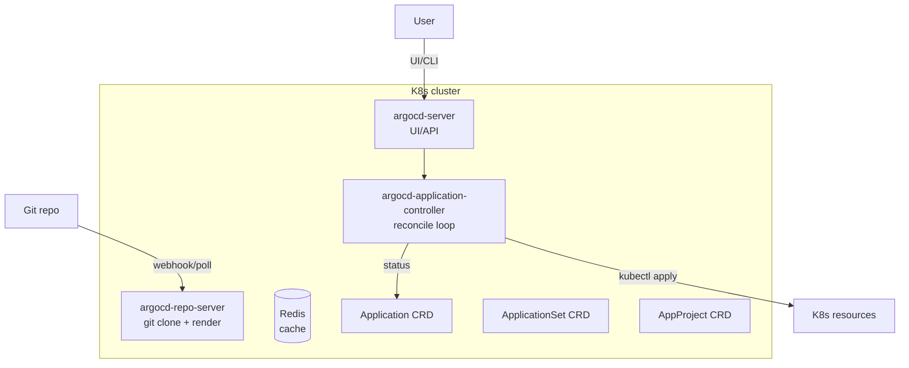
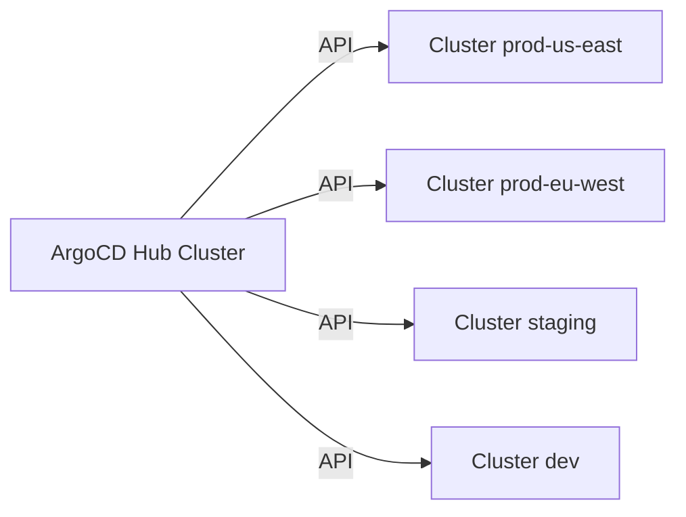

# 🎓 GitOps với ArgoCD — Git = Single Source of Truth

> **Tác giả:** Mr.Rom\
> **Phiên bản:** v1.1.0\
> **Tạo lúc:** 24/05/2026\
> **Cập nhật:** 25/05/2026\
> **Level:** Intermediate\
> **Tags:** [MUST-KNOW]\
> **Prerequisites:** [00_intermediate-overview.md](00_intermediate-overview.md), [K8s Helm](../../../kubernetes/lessons/02_intermediate/01_helm-package-manager.md)

> 🎯 *Push model (GitHub Actions kubectl apply) không scale — drift + audit khó + multi-cluster ám ảnh. **GitOps pull model**: ArgoCD chạy trong cluster, watch Git, sync. Bài này dạy ArgoCD architecture, Application, ApplicationSet, multi-cluster, drift detection, sync waves, RBAC. So sánh Flux. Real war story.*

## 🎯 Sau bài này bạn sẽ

- [ ] Hiểu **GitOps 4 principles** + push vs pull model
- [ ] Install **ArgoCD** + setup first Application
- [ ] Dùng **App-of-Apps** + **ApplicationSet** pattern
- [ ] Manage **multi-cluster** từ 1 ArgoCD control plane
- [ ] Setup **drift detection** + auto-sync + self-heal
- [ ] **Sync waves** + hooks cho ordering deploy
- [ ] **RBAC** cho ArgoCD multi-team
- [ ] So sánh **ArgoCD vs Flux** — chọn đúng

---

## Tình huống — kubectl apply manual + ArgoCD = drift war

Production cluster có ArgoCD sync `production` namespace từ Git. 3am incident:
- Payment service 500 errors, customer complain.
- SRE on-call vào `kubectl exec` debug, thấy ENV `DEBUG=false` cần đổi `true` để log.
- SRE `kubectl edit deployment/payment-api` → set `DEBUG=true` → restart.
- App log verbose → root cause: 1 bug timeout config.
- SRE fix bug, push fix lên Git, ArgoCD sync.

3 phút sau, 4am: incident recurrence.

```bash
kubectl get deployment/payment-api -o yaml | grep DEBUG
- name: DEBUG
  value: "false"   ← reverted!
```

🔥 ArgoCD watch Git → detect `DEBUG=true` không có trong Git → **auto-revert về Git state**.

SRE again: `kubectl edit ... DEBUG=true`. ArgoCD revert 3 phút sau. **Cycle**.

SRE confused, disable auto-sync ArgoCD app → broke GitOps semantic.

Sáng hôm sau, post-mortem:
- Root cause: **không tôn trọng GitOps discipline**. Manual edit prod = drift.
- Fix: cấm `kubectl apply/edit` direct prod (RBAC). Mọi change → Git PR → ArgoCD sync.
- Emergency: vẫn có "break glass" procedure (temporarily disable ArgoCD sync + edit + commit later).

→ Bài này dạy discipline + cách enforce.

---

## 1️⃣ GitOps 4 principles (CNCF Working Group)

1. **Declarative**: state mô tả qua YAML/HCL (như K8s manifest, Helm chart).
2. **Versioned**: state ở Git → versioned + audit log + rollback.
3. **Approved (PR)**: change qua PR review.
4. **Automated**: controller (ArgoCD/Flux) tự sync Git → cluster, drift detection.

```
Push CI (basic):                        GitOps pull (intermediate):
                                        
  CI ─[kubectl apply]→ Cluster          CI ─[push image]→ Registry
  ▲                                     ▲                    │
  │ credential                          │                    │
  Git                                   Git ←[update tag]    │
                                        ▲                    │
                                        │                    │
                                        ArgoCD ─[watch Git + ▼
                                                  pull image]
                                        ArgoCD ─[apply]→ Cluster
```

🪞 **Ẩn dụ**: *Push model như **shipping tới warehouse** — bạn (CI) có chìa khóa warehouse, đẩy hàng vào. Pull model như **vending machine** — warehouse (cluster) có robot (ArgoCD), đọc đơn hàng từ kho (Git), tự lấy hàng.*

---

## 2️⃣ ArgoCD architecture

ArgoCD gồm **4 component chính** chạy trong K8s — argocd-server (UI/API), repo-server (clone Git + render), application-controller (reconcile loop), Redis (cache). 3 CRD: Application, ApplicationSet, AppProject. Diagram đầy đủ:



**Components**:
- **argocd-server**: web UI + gRPC API.
- **repo-server**: clone Git repo, render Helm/Kustomize/plain YAML.
- **application-controller**: core reconciliation — watch Application CRD, compare desired vs actual, apply.
- **Redis**: cache rendered manifests + cluster state.
- **dex** (optional): SSO integration.

### Install

Cài ArgoCD vào K8s cluster — 2 cách phổ biến: kubectl apply official manifest (quick), hoặc Helm chart (customize được). Production thường Helm + custom `values.yaml`:

```bash
kubectl create namespace argocd
kubectl apply -n argocd -f https://raw.githubusercontent.com/argoproj/argo-cd/stable/manifests/install.yaml

# Or Helm
helm install argocd argo/argo-cd -n argocd --create-namespace -f values.yaml
```

### Access UI

Lấy admin password từ secret tự generate khi install + port-forward để access UI local. Production: expose qua Ingress với TLS:

```bash
# Get initial admin password
kubectl get secret argocd-initial-admin-secret -n argocd -o jsonpath="{.data.password}" | base64 -d

# Port forward (dev)
kubectl port-forward svc/argocd-server -n argocd 8080:443

# Or expose via Ingress (production)
```

### Login

```bash
brew install argocd
argocd login localhost:8080
# Username: admin
# Password: <from secret above>
```

---

## 3️⃣ Application CRD — first GitOps app

### Basic Application

`Application` CRD là object chính ArgoCD reconcile — point đến Git source (repo + path + revision) và K8s destination (server + namespace). Setup tối thiểu:

```yaml
apiVersion: argoproj.io/v1alpha1
kind: Application
metadata:
  name: fastapi-prod
  namespace: argocd            # ArgoCD's namespace
spec:
  project: default
  
  source:
    repoURL: https://github.com/acme/gitops-config
    targetRevision: main
    path: apps/fastapi/prod    # Path to Kustomize/Helm/raw YAML
  
  destination:
    server: https://kubernetes.default.svc    # in-cluster
    namespace: production
  
  syncPolicy:
    automated:
      prune: true              # Delete resources removed from Git
      selfHeal: true           # Revert manual changes
    syncOptions:
      - CreateNamespace=true
      - PrunePropagationPolicy=foreground
      - PruneLast=true
    retry:
      limit: 5
      backoff:
        duration: 5s
        factor: 2
        maxDuration: 3m
```

Apply:
```bash
kubectl apply -f application.yaml
# OR
argocd app create fastapi-prod \
  --repo https://github.com/acme/gitops-config \
  --path apps/fastapi/prod \
  --dest-server https://kubernetes.default.svc \
  --dest-namespace production \
  --sync-policy automated \
  --self-heal \
  --auto-prune
```

### Verify

```bash
argocd app list
# NAME           CLUSTER  NAMESPACE   PROJECT   STATUS  HEALTH    SYNCPOLICY
# fastapi-prod   in-cluster production  default  Synced  Healthy   Auto-Prune

argocd app get fastapi-prod
# Detailed status...

# UI: https://localhost:8080
```

### sync options explained

| Option | Behavior |
|---|---|
| `automated.prune: true` | Delete cluster resources không có trong Git (clean up) |
| `automated.selfHeal: true` | Revert manual `kubectl edit` về Git state |
| `automated.allowEmpty: true` | Sync ngay cả khi Git empty (dangerous) |
| `CreateNamespace=true` | Auto-create destination namespace |
| `PrunePropagationPolicy: foreground` | Wait for resources delete (vs background) |
| `PruneLast=true` | Apply new resources first, then prune old |
| `ApplyOutOfSyncOnly=true` | Only apply changed manifests (faster) |
| `RespectIgnoreDifferences=true` | Honor `ignoreDifferences` in Application |
| `Replace=true` | Use `kubectl replace` instead of `apply` (rare) |

---

## 4️⃣ Helm + Kustomize trong Application

### Helm chart từ Git

```yaml
spec:
  source:
    repoURL: https://github.com/acme/gitops-config
    targetRevision: main
    path: charts/myapp
    helm:
      releaseName: myapp
      valueFiles:
        - values.yaml
        - values-prod.yaml
      parameters:
        - name: image.tag
          value: v1.2.3
        - name: replicaCount
          value: "5"
      values: |
        ingress:
          enabled: true
          host: api.acmeshop.vn
```

### Helm chart từ public repo

```yaml
spec:
  source:
    repoURL: https://prometheus-community.github.io/helm-charts
    chart: kube-prometheus-stack
    targetRevision: 56.x.x
    helm:
      releaseName: kube-prom
      valueFiles:
        - values-prod.yaml    # Pointing to file in Git
      values: |
        grafana:
          adminPassword: <CHANGE_THROUGH_VAULT>
```

→ Wait — secret hardcode. Bài 03 sẽ dùng ExternalSecret + ArgoCD.

### Kustomize overlay

```yaml
spec:
  source:
    repoURL: https://github.com/acme/gitops-config
    path: apps/fastapi/overlays/production
    kustomize:
      images:
        - ghcr.io/acme/fastapi:v1.2.3
      commonLabels:
        env: production
      patches:
        - target:
            kind: Deployment
            name: fastapi
          patch: |
            - op: replace
              path: /spec/replicas
              value: 10
```

### Multi-source (ArgoCD 2.6+)

```yaml
spec:
  sources:
    - repoURL: https://prometheus-community.github.io/helm-charts
      chart: kube-prometheus-stack
      targetRevision: 56.x.x
      helm:
        valueFiles:
          - $values/envs/prod/kube-prometheus-values.yaml
    - repoURL: https://github.com/acme/gitops-config
      targetRevision: main
      ref: values    # ← reference for $values above
```

→ Chart từ public repo, values từ private Git repo. Common pattern cho 3rd-party chart customization.

---

## 5️⃣ App-of-Apps pattern

### Vấn đề scaling

10+ Applications → manually `kubectl apply` 10 file = scale kém.

### Solution: 1 Application manage other Applications

```yaml
# parent-app.yaml
apiVersion: argoproj.io/v1alpha1
kind: Application
metadata:
  name: app-of-apps
  namespace: argocd
spec:
  project: default
  source:
    repoURL: https://github.com/acme/gitops-config
    path: argocd-apps           # ← folder containing Application YAMLs
    targetRevision: main
  destination:
    server: https://kubernetes.default.svc
    namespace: argocd
  syncPolicy:
    automated: { prune: true, selfHeal: true }
```

Git structure:
```
gitops-config/
├── argocd-apps/
│   ├── fastapi-prod.yaml         # Application
│   ├── postgres-prod.yaml        # Application
│   ├── redis-prod.yaml           # Application
│   └── monitoring.yaml           # Application (kube-prometheus-stack)
└── apps/
    ├── fastapi/
    │   └── production/...
    ├── postgres/
    │   └── production/...
    └── ...
```

→ Apply `parent-app.yaml` 1 lần → ArgoCD tự apply 4 child Applications → mỗi child sync app riêng.

---

## 6️⃣ ApplicationSet — Generate Applications

### Vấn đề App-of-Apps

App-of-Apps manage hard-coded list. Khi bạn có 20 microservice × 3 env = 60 Applications → vẫn phải maintain 60 YAML.

### ApplicationSet generators

ApplicationSet generate Applications dynamically từ pattern.

#### Generator: List

```yaml
apiVersion: argoproj.io/v1alpha1
kind: ApplicationSet
metadata:
  name: fastapi-envs
  namespace: argocd
spec:
  generators:
    - list:
        elements:
          - env: dev
            namespace: dev
            replicas: "1"
          - env: staging
            namespace: staging
            replicas: "2"
          - env: prod
            namespace: production
            replicas: "10"
  template:
    metadata:
      name: 'fastapi-{{env}}'
    spec:
      project: default
      source:
        repoURL: https://github.com/acme/gitops-config
        targetRevision: main
        path: 'apps/fastapi/overlays/{{env}}'
      destination:
        server: https://kubernetes.default.svc
        namespace: '{{namespace}}'
      syncPolicy:
        automated: { prune: true, selfHeal: true }
```

→ Tạo 3 Application: `fastapi-dev`, `fastapi-staging`, `fastapi-prod`.

#### Generator: Git directories

```yaml
spec:
  generators:
    - git:
        repoURL: https://github.com/acme/gitops-config
        revision: main
        directories:
          - path: apps/*/production    # Glob match
  template:
    metadata:
      name: '{{path[1]}}-prod'         # e.g., fastapi-prod, payment-prod
    spec:
      source:
        repoURL: https://github.com/acme/gitops-config
        path: '{{path}}'
      destination:
        server: https://kubernetes.default.svc
        namespace: production
```

→ Tự auto-detect folder structure → generate Applications.

#### Generator: Cluster

```yaml
spec:
  generators:
    - clusters: {}    # All clusters registered with ArgoCD
  template:
    metadata:
      name: 'monitoring-{{name}}'
    spec:
      source:
        repoURL: https://github.com/acme/gitops-config
        path: apps/monitoring
      destination:
        server: '{{server}}'
        namespace: monitoring
```

→ Deploy monitoring lên MỌI cluster ArgoCD biết.

#### Generator: Matrix

```yaml
spec:
  generators:
    - matrix:
        generators:
          - clusters: {}        # all clusters
          - list:
              elements:
                - app: fastapi
                - app: payment
                - app: notify
  template:
    metadata:
      name: '{{app}}-{{name}}'    # fastapi-prod-cluster, fastapi-dr-cluster, ...
```

→ Generate apps × cluster matrix.

### ApplicationSet rollout strategy

```yaml
spec:
  strategy:
    type: RollingSync
    rollingSync:
      steps:
        - matchExpressions:
            - key: env
              operator: In
              values: [dev]
        - matchExpressions:
            - key: env
              operator: In
              values: [staging]
        - matchExpressions:
            - key: env
              operator: In
              values: [prod]
```

→ Roll out dev đầu → staging → prod. Wait each phase Healthy.

---

## 7️⃣ Multi-cluster ArgoCD

### Pattern: 1 ArgoCD manages N clusters



### Register cluster

```bash
# Add cluster to ArgoCD
argocd cluster add <kubeconfig-context-name>

# Verify
argocd cluster list
# SERVER                                            NAME              VERSION  STATUS
# https://kubernetes.default.svc                    in-cluster        1.28     Successful
# https://prod-us-east.eks.amazonaws.com            prod-us-east      1.28     Successful
# https://prod-eu-west.eks.amazonaws.com            prod-eu-west      1.28     Successful
```

### Destination cluster in Application

```yaml
spec:
  destination:
    server: https://prod-us-east.eks.amazonaws.com
    # OR by name (cleaner):
    name: prod-us-east
    namespace: production
```

### Cluster generator + ApplicationSet

```yaml
spec:
  generators:
    - clusters:
        selector:
          matchLabels:
            env: production
  template:
    metadata:
      name: '{{name}}-fastapi'
    spec:
      destination:
        server: '{{server}}'
        namespace: production
```

→ Cluster có label `env=production` (added when register) → ApplicationSet generate per cluster.

---

## 8️⃣ Sync waves + hooks

### Vấn đề ordering

Apply 1 lúc:
- Namespace
- ServiceAccount (need Namespace)
- ConfigMap (independent)
- Deployment (need ServiceAccount + ConfigMap)
- Service (need Deployment)
- Ingress (need Service)

→ K8s `kubectl apply -f directory/` không guarantee order — race condition.

### Sync waves

Annotation in K8s manifest:
```yaml
apiVersion: v1
kind: Namespace
metadata:
  name: production
  annotations:
    argocd.argoproj.io/sync-wave: "-10"    # Apply first
---
apiVersion: v1
kind: ServiceAccount
metadata:
  name: myapp-sa
  namespace: production
  annotations:
    argocd.argoproj.io/sync-wave: "-5"
---
apiVersion: apps/v1
kind: Deployment
metadata:
  name: myapp
  namespace: production
  annotations:
    argocd.argoproj.io/sync-wave: "0"      # Default
---
apiVersion: networking.k8s.io/v1
kind: Ingress
metadata:
  name: myapp-ingress
  annotations:
    argocd.argoproj.io/sync-wave: "5"      # Apply last
```

→ ArgoCD apply low wave first, wait Healthy, next wave.

### Sync hooks

```yaml
apiVersion: batch/v1
kind: Job
metadata:
  name: db-migration
  annotations:
    argocd.argoproj.io/hook: PreSync
    argocd.argoproj.io/hook-delete-policy: HookSucceeded
spec:
  template:
    spec:
      containers:
        - name: migrate
          image: myapp:latest
          command: [alembic, upgrade, head]
      restartPolicy: Never
```

**Hook types**:
- `PreSync`: trước sync (e.g., DB migration).
- `Sync`: chính (default).
- `PostSync`: sau sync (e.g., notify Slack).
- `SyncFail`: khi fail (e.g., alert).

**Hook deletion policy**:
- `HookSucceeded`: delete sau khi success.
- `HookFailed`: delete sau khi fail.
- `BeforeHookCreation`: delete cũ trước khi tạo mới.

---

## 9️⃣ AppProject + RBAC

### AppProject — Logical grouping

```yaml
apiVersion: argoproj.io/v1alpha1
kind: AppProject
metadata:
  name: team-payment
  namespace: argocd
spec:
  description: Payment team applications
  
  # Whitelist Git repos
  sourceRepos:
    - https://github.com/acme/payment-*
    - https://charts.bitnami.com/bitnami
  
  # Whitelist destinations
  destinations:
    - namespace: payment-*
      server: '*'
  
  # Whitelist cluster resources
  clusterResourceWhitelist:
    - group: ''
      kind: Namespace
  
  # Whitelist namespaced resources
  namespaceResourceWhitelist:
    - group: '*'
      kind: '*'
  
  # Role-based access
  roles:
    - name: developer
      description: Developer access
      policies:
        - p, proj:team-payment:developer, applications, get, team-payment/*, allow
        - p, proj:team-payment:developer, applications, sync, team-payment/*, allow
      groups:
        - acme:payment-developers
    
    - name: viewer
      policies:
        - p, proj:team-payment:viewer, applications, get, team-payment/*, allow
      groups:
        - acme:all-readers
```

### Apply Project to Application

```yaml
spec:
  project: team-payment       # ← reference AppProject
```

→ Application limited theo AppProject policy. Team can't accidentally deploy to wrong namespace.

### Global ArgoCD RBAC

`argocd-rbac-cm` ConfigMap:
```yaml
apiVersion: v1
kind: ConfigMap
metadata:
  name: argocd-rbac-cm
  namespace: argocd
data:
  policy.default: role:readonly
  policy.csv: |
    p, role:admin, applications, *, */*, allow
    p, role:admin, clusters, *, *, allow
    
    g, acme:platform-admins, role:admin
    g, acme:payment-developers, role:developer
  
  scopes: '[groups, email]'
```

→ Federated with SSO (Dex + GitHub/Google/Okta).

---

## 🔟 ArgoCD vs Flux

| Aspect | **ArgoCD** | **Flux** |
|---|---|---|
| Sponsor | Intuit, CNCF Graduated | Weaveworks, CNCF Graduated |
| UI | Strong (built-in web UI) | Minimal CLI; Weave GitOps OSS UI |
| Architecture | Single mono controller | Microservices (source-controller, kustomize-controller, helm-controller, notification-controller) |
| Multi-tenancy | AppProject + RBAC | Flux tenants |
| GitOps Toolkit | Application CRD | Kustomization/HelmRelease/GitRepository CRDs |
| Application bundling | App-of-Apps, ApplicationSet | Kustomization composition |
| Multi-cluster | Hub-and-spoke (1 ArgoCD many cluster) | Per-cluster (Flux in each) |
| Image automation | ❌ Manual | ✅ Flux Image Automation Controllers |
| ApplicationSet generators | Rich (8+ generators) | Less direct equivalent |
| Sync waves | Yes | Via Kustomization dependsOn |
| Notifications | argocd-notifications | Notification controller |
| Learning curve | Medium (centralized) | Steeper (multi-CRD) |
| Popularity 2026 | ~55% | ~30% |

### Choose ArgoCD when

- Need UI for ops/dev teams.
- Multi-cluster from central hub.
- Strong RBAC requirements.
- ApplicationSet matrix patterns.

### Choose Flux when

- Pure git-centric (no UI necessary).
- Per-cluster autonomy.
- Image automation in cluster (auto-update Git when new image).
- Microservices controller architecture.

### Migration ArgoCD ↔ Flux

Both honor declarative state from Git → migration straightforward:
1. Disable auto-sync ở 1 system.
2. Install other.
3. Re-create equivalent CRD.
4. Enable auto-sync new system.
5. Decommission old.

→ **2026 recommend**: ArgoCD for most (UI + ApplicationSet + multi-cluster hub). Flux nếu team prefer CLI + image automation.

---

## 1️⃣1️⃣ Hands-on: GitOps cho FastAPI multi-env

### Step 1: Git repo structure

```
gitops-config/
├── argocd-apps/                  # Parent Applications
│   ├── fastapi-dev.yaml
│   ├── fastapi-staging.yaml
│   └── fastapi-prod.yaml
├── apps/
│   └── fastapi/
│       ├── base/                 # Kustomize base
│       │   ├── deployment.yaml
│       │   ├── service.yaml
│       │   └── kustomization.yaml
│       └── overlays/
│           ├── dev/
│           │   ├── kustomization.yaml
│           │   └── patches/
│           ├── staging/
│           └── prod/
└── README.md
```

### Step 2: Bootstrap ArgoCD

```bash
# Install
kubectl create namespace argocd
kubectl apply -n argocd -f https://raw.githubusercontent.com/argoproj/argo-cd/stable/manifests/install.yaml

# Wait ready
kubectl wait --for=condition=available --timeout=300s -n argocd deployment/argocd-server

# Expose UI
kubectl port-forward svc/argocd-server -n argocd 8080:443 &

# Login
PASSWORD=$(kubectl get secret argocd-initial-admin-secret -n argocd -o jsonpath="{.data.password}" | base64 -d)
argocd login localhost:8080 --username admin --password "$PASSWORD" --insecure
```

### Step 3: Create root ApplicationSet

```yaml
# bootstrap.yaml
apiVersion: argoproj.io/v1alpha1
kind: ApplicationSet
metadata:
  name: fastapi-envs
  namespace: argocd
spec:
  generators:
    - list:
        elements:
          - env: dev
            namespace: dev
            cluster: in-cluster
          - env: staging
            namespace: staging
            cluster: in-cluster
          - env: prod
            namespace: production
            cluster: in-cluster
  template:
    metadata:
      name: 'fastapi-{{env}}'
      annotations:
        argocd.argoproj.io/sync-wave: "{{env}}-wave"
    spec:
      project: default
      source:
        repoURL: https://github.com/acme/gitops-config
        targetRevision: main
        path: 'apps/fastapi/overlays/{{env}}'
      destination:
        name: '{{cluster}}'
        namespace: '{{namespace}}'
      syncPolicy:
        automated:
          prune: true
          selfHeal: true
        syncOptions:
          - CreateNamespace=true
```

```bash
kubectl apply -f bootstrap.yaml
```

→ ArgoCD tự generate 3 Applications: `fastapi-dev`, `fastapi-staging`, `fastapi-prod`.

### Step 4: CI update image tag

`.github/workflows/ci.yml`:
```yaml
on:
  push:
    branches: [main]

jobs:
  build:
    runs-on: ubuntu-latest
    steps:
      - uses: actions/checkout@v4
      - uses: docker/setup-buildx-action@v3
      - uses: docker/login-action@v3
        with:
          registry: ghcr.io
          username: ${{ github.actor }}
          password: ${{ secrets.GITHUB_TOKEN }}
      
      - uses: docker/build-push-action@v5
        id: build
        with:
          context: .
          push: true
          tags: ghcr.io/acme/fastapi:${{ github.sha }}
      
      # Update GitOps repo with new image tag
      - name: Update gitops-config
        uses: fjogeleit/yaml-update-action@v0.13.0
        with:
          repository: acme/gitops-config
          token: ${{ secrets.GITOPS_PAT }}
          branch: main
          message: "fastapi: update to ${{ github.sha }}"
          valueFile: apps/fastapi/overlays/dev/kustomization.yaml
          propertyPath: images[0].newTag
          value: ${{ github.sha }}
```

→ CI build image + push registry + **update Git** (not deploy direct). ArgoCD watch Git → sync new tag.

### Step 5: Promotion dev → staging → prod

PR workflow:
1. CI auto-update `dev` overlay.
2. After test in dev, dev tạo PR update `staging/kustomization.yaml` (manually copy image tag).
3. PR approved → merge → ArgoCD sync staging.
4. After QA staging, similar PR for `prod`.

→ Audit trail full trong Git history. Rollback = revert Git commit.

---

## 💡 Cạm bẫy thường gặp & Best practice

### ❌ Cạm bẫy: `automated.prune: true` + accidentally remove file

→ Dev xoá file YAML từ Git accident → ArgoCD prune → delete resource from cluster.

→ **Fix**: 
- PR review required (branch protection).
- `prune: false` cho production cho deliberate cleanup.
- `argocd.argoproj.io/sync-options: "Prune=false"` per resource for sensitive ones.

### ❌ Cạm bẫy: ArgoCD `selfHeal` but emergency `kubectl edit` needed

→ Production incident, SRE phải edit deployment tay. selfHeal revert sau 3 phút → cycle.

→ **Fix**: "Break glass" procedure:
1. Disable auto-sync app: `argocd app set <app> --sync-policy none`.
2. Edit cluster manually + verify fix.
3. Commit fix to Git.
4. Re-enable: `argocd app set <app> --sync-policy auto --self-heal --auto-prune`.

Document break-glass trong runbook.

### ❌ Cạm bẫy: Secret leak qua Git

→ Commit `database.env` → leak forever (Git history immutable).

→ **Fix**: 
- `.gitignore` aggressive (cover `.env*`, `*.key`, `*.pem`).
- Pre-commit hooks (gitleaks, trufflesecurity).
- ExternalSecret (bài 03).
- Branch protection + secret scanning (GitHub Security tab).

### ❌ Cạm bẫy: Helm chart values committed but not all values used

```yaml
helm:
  values: |
    veryLongValuesBlock: ...
```

→ Values "drift" from chart `values.yaml` schema → silent ignore.

→ **Fix**: Use `valueFiles:` pointer to file in Git, validate locally with `helm template`.

### ❌ Cạm bẫy: ApplicationSet matrix explosion

```yaml
generators:
  - matrix:
      - clusters: {}      # 10 clusters
      - list:
          elements: [...]   # 20 apps
```

→ 200 Applications! ArgoCD performance degrade.

→ **Fix**: Use `selector` to filter:
```yaml
- clusters:
    selector:
      matchLabels:
        env: production
```

### ❌ Cạm bẫy: Sync wave annotation in template but conflict timing

→ Helm template render annotation **after** Helm hooks. Timing mixed.

→ **Fix**: Use `argocd.argoproj.io/sync-wave` for ordering. Don't mix with Helm hooks (`pre-install`/`post-install`) unless careful.

### ❌ Cạm bẫy: PR approver = same as PR author

→ GitOps "approval" rỗng nghĩa.

→ **Fix**: Branch protection require **2 different reviewers**. Especially prod overlay.

### ✅ Best practice: 3-repo strategy

```
1. app-code/                  # Application source (Python/Go/...)
2. helm-charts/                # Helm chart definition
3. gitops-config/              # Per-env config + ArgoCD Applications
```

→ Separation of concerns: developer commits app-code, platform team manages charts, SRE manages gitops-config.

### ✅ Best practice: Cluster + namespace label in resources

```yaml
metadata:
  labels:
    cluster: prod-us-east
    env: production
    team: payment
    managed-by: argocd
```

→ Easy filter trong Grafana, log queries, RBAC.

### ✅ Best practice: ArgoCD notifications to Slack

```yaml
apiVersion: v1
kind: ConfigMap
metadata:
  name: argocd-notifications-cm
  namespace: argocd
data:
  service.slack: |
    token: $slack-token
  
  template.app-sync-status: |
    message: |
      App {{.app.metadata.name}} sync status: {{.app.status.sync.status}}
      Health: {{.app.status.health.status}}
  
  trigger.on-sync-failed: |
    - when: app.status.operationState.phase in ['Error', 'Failed']
      send: [app-sync-status]
  
  subscriptions: |
    - recipients:
        - slack:ops-alerts
      triggers:
        - on-sync-failed
        - on-health-degraded
```

→ Sync failures + health degradation → Slack alert.

---

## 🧠 Tự kiểm tra (Self-check)

**Q1.** Khi nào dùng `prune: true` vs `prune: false`?

<details>
<summary>💡 Đáp án</summary>

**`prune: true`** (default for most):
- Cluster state = Git state strictly.
- Resource removed from Git → auto-delete from cluster.
- Cleanup orphan resources (deleted Service không có Deployment).
- Discipline: every cluster resource managed by Git.

**`prune: false`**:
- Don't delete cluster resources khi removed from Git.
- Safer for accidental file delete (audit alerts instead).
- Use for sensitive resources (Postgres PV, KMS-encrypted ConfigMap).

**Per-resource override**:
```yaml
metadata:
  annotations:
    argocd.argoproj.io/sync-options: Prune=false
```

→ Specific Service marked Prune=false, rest of app prune normally.

**Production recommendation**:
- Stateless apps: `prune: true` (cleanup orphans).
- Stateful (PVC, Secret with rotation, namespace): `prune: false` or per-resource.
</details>

**Q2.** Tại sao **multi-source** Application useful?

<details>
<summary>💡 Đáp án</summary>

Pre-multi-source (ArgoCD ≤2.5): Application có 1 source. 3rd-party chart cần fork để add custom values → maintain fork pain.

**Multi-source** (ArgoCD 2.6+): Application reference **multiple sources** → combine.

Pattern: pull chart from public repo, values from your private Git:
```yaml
sources:
  - repoURL: https://prometheus-community.github.io/helm-charts
    chart: kube-prometheus-stack
    targetRevision: 56.x.x
    helm:
      valueFiles:
        - $values/prometheus/values-prod.yaml
  - repoURL: https://github.com/acme/gitops-config
    targetRevision: main
    ref: values    # reference name
```

→ Customize 3rd-party chart without forking. Upgrade chart version: bump `targetRevision`. Values stay in your repo.

**Other use case**:
- Application deploy resources từ 2 repos (e.g., shared common + app-specific).
- Helm chart from chartMuseum, secret from Vault export.
</details>

**Q3.** ApplicationSet generator nào cho **deploy monitoring to every cluster**?

<details>
<summary>💡 Đáp án</summary>

**Cluster generator**:
```yaml
spec:
  generators:
    - clusters: {}    # All clusters registered
  template:
    metadata:
      name: 'monitoring-{{name}}'
    spec:
      destination:
        server: '{{server}}'
        namespace: monitoring
      source:
        repoURL: https://github.com/acme/gitops-config
        path: apps/monitoring
        targetRevision: main
```

→ Auto-generate Application per cluster ArgoCD knows about.

**Filter clusters with selector**:
```yaml
- clusters:
    selector:
      matchLabels:
        env: production
```

→ Only production clusters get monitoring.

**Add cluster later**: register cluster → ApplicationSet detect → generate Application → deploy monitoring automatically. **Self-registering pattern**.

Compare to **List generator** (hardcode cluster names) — manual, doesn't scale.
</details>

**Q4.** Vì sao **Sync wave** quan trọng khi deploy nhiều resource types?

<details>
<summary>💡 Đáp án</summary>

K8s `kubectl apply -f directory/` không guarantee ordering. Apply all manifests roughly parallel.

**Race conditions**:
- Deployment cần Secret/ConfigMap → if Secret apply sau, pod start fail.
- Ingress cần Service → race condition.
- Job (DB migration) cần run trước Deployment update.

**ArgoCD sync wave** = annotation `argocd.argoproj.io/sync-wave: "<int>"`. Lower applied first:
- Wave -10: Namespace, CRD.
- Wave -5: ServiceAccount, Secret, ConfigMap.
- Wave 0 (default): Deployment, Service, Job.
- Wave 5: Ingress.

ArgoCD apply low wave → wait Healthy → next wave. Predictable order.

**Hook variant**: PreSync/Sync/PostSync — specific lifecycle phase. PreSync hook = run before main sync (DB migration). SyncFail = on failure (alert).

→ Sync wave ordering + hooks = control timing in complex deploys.
</details>

**Q5.** ArgoCD AppProject `sourceRepos` + `destinations` whitelist — vì sao quan trọng?

<details>
<summary>💡 Đáp án</summary>

**Without AppProject** (use `default` project = `*` open):
- Anyone with `apps.create` permission can deploy from ANY repo to ANY cluster/namespace.
- Mistake: Application source point `repoURL: https://evil.com/malicious-chart` → deploy malicious chart.
- Wrong namespace: dev deploy to `production` namespace.

**With AppProject**:
- `sourceRepos: [https://github.com/acme/payment-*]` → only Payment team's repos.
- `destinations: [namespace: payment-*, server: '*']` → only `payment-*` namespaces.
- `clusterResourceWhitelist: [Namespace]` → can create Namespace, can't create ClusterRole.
- `namespaceResourceWhitelist: ['*/*']` → all namespaced resources OK.

→ **Tenant isolation** in multi-team ArgoCD. Mistakes contained.

Combined với RBAC:
```yaml
roles:
  - name: developer
    policies:
      - p, proj:team-payment:developer, applications, sync, team-payment/*, allow
    groups:
      - acme:payment-developers
```

→ Payment developers can sync only Payment apps. Can't touch Auth team's apps.

**Multi-tenant ArgoCD pattern**: each team gets own AppProject + group mapping. Single ArgoCD serves 10+ teams safely.
</details>

---

## ⚡ Tra cứu nhanh (Cheatsheet)

```bash
# === ArgoCD CLI ===
argocd login <server>
argocd account update-password
argocd cluster list
argocd cluster add <kube-context>
argocd app list
argocd app get <app>
argocd app sync <app>
argocd app sync <app> --prune --force
argocd app delete <app>
argocd app diff <app>                # see drift
argocd app history <app>
argocd app rollback <app> <revision>
argocd app actions list <app>        # list available actions
argocd app set <app> --sync-policy automated
argocd app set <app> --sync-policy none    # disable auto-sync

# === ApplicationSet ===
kubectl get appsets -n argocd
kubectl describe appset <name> -n argocd

# === AppProject ===
kubectl get appprojects -n argocd
argocd proj list
argocd proj create my-team --description "My team"
argocd proj add-source my-team https://github.com/acme/repo
argocd proj add-destination my-team https://kubernetes.default.svc my-namespace

# === Notifications ===
argocd admin notifications template list
argocd admin notifications trigger list
argocd admin notifications test trigger <name> <resource>
```

```yaml
# === Common Application template ===
apiVersion: argoproj.io/v1alpha1
kind: Application
metadata:
  name: my-app
  namespace: argocd
spec:
  project: default
  source:
    repoURL: https://github.com/acme/repo
    targetRevision: main
    path: path/to/manifests
  destination:
    server: https://kubernetes.default.svc
    namespace: my-namespace
  syncPolicy:
    automated:
      prune: true
      selfHeal: true
    syncOptions:
      - CreateNamespace=true
    retry:
      limit: 5
      backoff: { duration: 5s, factor: 2, maxDuration: 3m }
```

---

## 📚 Từ Điển Thuật Ngữ (Glossary)

| Term | Vietnamese / Explanation |
|---|---|
| **GitOps** | Pattern: Git = source of truth, controller sync Git → cluster |
| **Push CD** | CI có credential cluster, push state vào |
| **Pull CD** | Controller in cluster, pull state from Git |
| **ArgoCD** | GitOps CD tool (Intuit, CNCF Graduated) — UI strong |
| **Flux** | GitOps CD tool (Weaveworks, CNCF Graduated) — git-centric |
| **Application** | ArgoCD CRD — 1 deployment unit (Git source + cluster destination) |
| **ApplicationSet** | CRD generate multiple Applications từ template |
| **AppProject** | Logical grouping + RBAC + whitelist |
| **App-of-Apps** | Pattern: 1 Application reference folder of Application YAMLs |
| **Sync wave** | Annotation control ordering of resource apply |
| **Sync hook** | Annotation control lifecycle (PreSync/Sync/PostSync/SyncFail) |
| **Drift detection** | ArgoCD compare actual vs desired, alert if differ |
| **Self-heal** | Auto-revert manual changes to match Git state |
| **Prune** | Auto-delete resources removed from Git |
| **Cluster generator** | ApplicationSet generator over registered clusters |
| **Matrix generator** | Cartesian product of multiple generators |
| **App-of-Apps** | Bootstrap pattern: 1 root app manages others |
| **Break glass** | Emergency procedure disable GitOps temporarily |

---

## 🔗 Liên kết & Tài nguyên

### 🧭 Định hướng lộ trình học
- ⬅️ **Bài trước:** [CI/CD Intermediate — Từ "deploy được" đến "supply chain secure"](00_intermediate-overview.md)
- ➡️ **Bài tiếp theo:** [Supply chain security — SLSA Level 3 pipeline + admission verify](02_supply-chain-security.md) *(sắp viết)*
- ↑ **Về cụm:** [CI/CD README](../../README.md)

### 🧩 Các chủ đề có thể bạn quan tâm
- ☸️ [K8s intermediate Helm](../../../kubernetes/lessons/02_intermediate/01_helm-package-manager.md) — chart deploy qua ArgoCD
- 🐳 [Docker intermediate Registry](../../../docker/lessons/02_intermediate/04_registry-production-patterns.md) — image source cho deploy
- 🏗️ [IaC basic Terraform](../../../iac/lessons/01_basic/01_terraform-basics.md) — provision infra layer

### 🌐 Tài nguyên tham khảo khác
- 📖 [ArgoCD docs](https://argo-cd.readthedocs.io/)
- 📖 [ApplicationSet docs](https://argocd-applicationset.readthedocs.io/)
- 📖 [Flux docs](https://fluxcd.io/)
- 📖 [GitOps WG (CNCF)](https://opengitops.dev/)
- 📖 [ArgoCD vs Flux](https://blog.argoproj.io/argo-cd-vs-flux-cd-2024-comparison-xxx) — comparison
- 📖 [ArgoCD Best Practices](https://argo-cd.readthedocs.io/en/stable/user-guide/best_practices/)
- 📖 [ArgoCD Image Updater](https://argocd-image-updater.readthedocs.io/) — auto-update image tag in Git
- 📖 [Codefresh GitOps Cloud](https://codefresh.io/) — commercial ArgoCD hosting

---

## 📌 Nhật ký thay đổi (Changelog)

- **v1.0.0 (24/05/2026)** — Bản đầu tiên. Lesson 01 intermediate. GitOps 4 principles + ArgoCD architecture + Application + Helm/Kustomize + App-of-Apps + ApplicationSet (4 generators) + multi-cluster + sync waves/hooks + AppProject + RBAC + ArgoCD vs Flux. Apply insight `__Ref__/`: GitOps anti-pattern war story (kubectl apply + ArgoCD drift). 7 pitfall + 3 best practice + 5 self-check + cheatsheet.
- **v1.1.0 (25/05/2026)** — Apply Blueprint v0.5.4+ §3.6: thêm lead-in trước §2 Architecture + Install + Access UI + §3 Application CRD basic.
