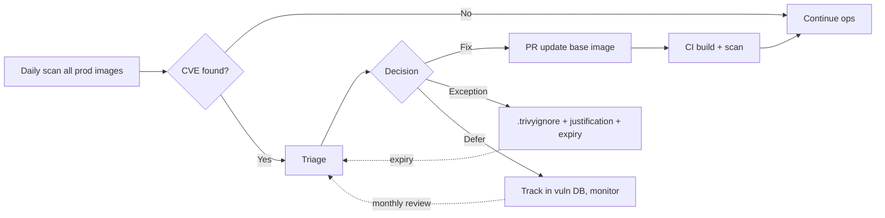

# 🎓 Supply chain security — SLSA Level 3 pipeline + admission verify

> **Tác giả:** Mr.Rom\
> **Phiên bản:** v1.1.0\
> **Tạo lúc:** 24/05/2026\
> **Cập nhật:** 25/05/2026\
> **Level:** Intermediate\
> **Tags:** [MUST-KNOW]\
> **Yêu cầu trước:** [01_gitops-with-argocd.md](01_gitops-with-argocd.md), [Docker intermediate Security](../../../docker/lessons/02_intermediate/02_image-security-supply-chain.md)

> 🎯 *Docker intermediate bài 02 đã dạy Trivy + cosign + SBOM ở mức image. Bài này dạy **CI/CD pipeline-level**: SLSA Level 3 implementation, provenance attestation cho **build chain**, in-toto, Kyverno admission verify production, vulnerability lifecycle management, signed Helm chart.*

## 🎯 Sau bài này bạn sẽ

- [ ] Hiểu **SLSA framework** + 4 levels chi tiết
- [ ] Setup **SLSA Level 3 pipeline** với GitHub Actions reusable workflow
- [ ] Generate + verify **provenance attestation** (in-toto v0.2/v1)
- [ ] **Cosign keyless** sign image + chart + SBOM + provenance
- [ ] Kyverno policy **admission verify** chain (image + signature + SLSA)
- [ ] **Vulnerability lifecycle**: scan → triage → fix → re-deploy → exception
- [ ] **Signed Helm chart** (chart provenance)
- [ ] Audit Rekor public log

---

## Tình huống — SOC2 audit catch supply chain gaps

SOC2 audit, auditor questions:

| Question | Bạn trả lời basic | Auditor reaction |
|---|---|---|
| "Show me proof every prod image built by your CI from your source code." | "Em có Dockerfile và GitHub Actions yaml..." | ❌ "Where's provenance attestation? Verified by what?" |
| "How prevent malicious image deploy?" | "Em scan Trivy trong CI" | ❌ "What if attacker bypass CI? Cluster admission control?" |
| "Audit trail — show me last 30 days of all deploys + verifications." | "GitHub Actions history?" | ❌ "Tampered logs? Need cryptographic log. Rekor?" |
| "Helm chart from public — verified?" | "Em copy values + apply" | ❌ "Provenance of chart itself? Signed by Bitnami?" |
| "How prove pipeline can't be modified by attacker?" | "GitHub repo có branch protection" | ❌ "Pipeline definition versioned? SLSA Level 3 require reusable workflow + non-falsifiable." |

→ **Tất cả là SLSA framework concepts**. Bài này dạy implement.

---

## 1️⃣ SLSA framework deep

🪞 **Ẩn dụ**: *Supply chain security như **kiểm dịch hàng hóa cảng biển** — provenance là tờ khai hải quan (ai sản xuất, ngày nào, lô nào), cosign là tem chống giả niêm phong, SBOM là danh sách hàng hóa chi tiết, Rekor là sổ đăng ký công khai. Mỗi container đi qua = phải đầy đủ giấy tờ.*

**SLSA** (Supply-chain Levels for Software Artifacts) — Google + OpenSSF maturity framework.

### Levels detail

SLSA định nghĩa **4 level** (1-4) đi từ basic đến defense-grade. Mỗi level thêm requirement về source, build isolation, provenance. Effort/level tăng từ vài ngày đến vài quý. Production thực tế 2026:

| Level | Source | Build | Provenance | Common-time effort |
|---|---|---|---|---|
| **1** | Version controlled | Documented script | Available (basic) | Days |
| **2** | + Build service (hosted) | Build service generates | + Authenticated | Weeks |
| **3** | + Source verified at build | + Isolated, hermetic | + Non-falsifiable, service-generated | Months |
| **4** | + Two-party review | + Hermetic + reproducible | + Cryptographic chain | Quarters |

### Production reality 2026

Bảng decision: pick level theo industry + compliance. Level 2 đủ cho 80% startup; Level 3 cho finance/healthcare; Level 4 cho defense/FedRAMP. Bài này nhắm **Level 3** (realistic + production-grade):

- **Most teams**: SLSA Level 2 (GitHub Actions + provenance).
- **Compliance-strict** (banking, healthcare): SLSA Level 3 (reusable workflow + OIDC).
- **Defense-grade** (FedRAMP): SLSA Level 4 (reproducible builds + hermetic).

→ This lesson aim **SLSA Level 3**.

### SLSA Level 3 requirements explained

1. **Source**: 
   - Git-managed, retained, two-party verified (PR review by different person).
   - Branch protection enforced.

2. **Build service**:
   - **Hosted** (not on dev laptop) — GitHub Actions ubuntu-latest runner OK.
   - **Isolated**: each build runs in fresh ephemeral environment, no state leakage.
   - **Hermetic** (ideally): no internet access during build, all deps pre-fetched.

3. **Provenance**:
   - **Service-generated** (not user-claimed) — GitHub generates, not your script writes.
   - **Authenticated**: signed by build service identity (GitHub OIDC).
   - **Non-falsifiable**: user can't fake. Build service identity in cert (Fulcio).
   - **Available**: published with artifact.

4. **Verification**:
   - Consumer verify provenance before use (admission control).

---

## 2️⃣ Provenance attestation (in-toto)

### What's in provenance?

Provenance là **JSON document** theo chuẩn in-toto/SLSA — chứa info về artifact, build source, who built, when, how. Mỗi field có purpose riêng. Example đầy đủ với 10+ key fields:

```json
{
  "_type": "https://in-toto.io/Statement/v1",
  "predicateType": "https://slsa.dev/provenance/v1",
  "subject": [
    {
      "name": "ghcr.io/acme/fastapi",
      "digest": { "sha256": "abc123..." }
    }
  ],
  "predicate": {
    "buildDefinition": {
      "buildType": "https://actions.github.io/buildtypes/workflow/v1",
      "externalParameters": {
        "workflow": {
          "ref": "refs/heads/main",
          "repository": "https://github.com/acme/fastapi",
          "path": ".github/workflows/build.yml"
        }
      },
      "internalParameters": {
        "github": {
          "actor": "developer@acme.com",
          "event_name": "push",
          "run_id": "1234567890"
        }
      },
      "resolvedDependencies": [
        { "uri": "git+https://github.com/acme/fastapi", "digest": { "gitCommit": "abc..." } }
      ]
    },
    "runDetails": {
      "builder": {
        "id": "https://github.com/actions/runner-images"
      },
      "metadata": {
        "invocationId": "https://github.com/acme/fastapi/actions/runs/1234567890",
        "startedOn": "2026-05-24T10:00:00Z",
        "finishedOn": "2026-05-24T10:05:00Z"
      }
    }
  }
}
```

**Key fields**:
- `subject`: artifact identity (image digest).
- `buildType`: framework spec (GitHub Actions workflow).
- `externalParameters.workflow`: source repo + branch + workflow file path.
- `internalParameters.github`: actor + event + run_id.
- `builder.id`: build service identity (proves who ran).
- `metadata`: timestamps.

→ Verifier can answer: "Image X built FROM repo Y, commit Z, BY GitHub Actions, at time T, by actor A."

### Generate in GitHub Actions (SLSA Level 3)

Use reusable workflow [slsa-framework/slsa-github-generator](https://github.com/slsa-framework/slsa-github-generator):

```yaml
# .github/workflows/release.yml
name: Release SLSA L3

on:
  push:
    tags: ['v*']

jobs:
  build:
    permissions:
      contents: read
      packages: write
      id-token: write   # OIDC for cosign keyless
    runs-on: ubuntu-latest
    outputs:
      image: ${{ steps.image.outputs.image }}
      digest: ${{ steps.build.outputs.digest }}
    steps:
      - uses: actions/checkout@v4
      
      - uses: docker/setup-buildx-action@v3
      
      - uses: docker/login-action@v3
        with:
          registry: ghcr.io
          username: ${{ github.actor }}
          password: ${{ secrets.GITHUB_TOKEN }}
      
      - id: image
        run: |
          echo "image=ghcr.io/acme/fastapi" >> $GITHUB_OUTPUT
      
      - id: build
        uses: docker/build-push-action@v5
        with:
          context: .
          push: true
          tags: ${{ steps.image.outputs.image }}:${{ github.ref_name }}

  provenance:
    needs: [build]
    permissions:
      actions: read
      id-token: write
      packages: write
    uses: slsa-framework/slsa-github-generator/.github/workflows/generator_container_slsa3.yml@v1.10.0
    with:
      image: ${{ needs.build.outputs.image }}
      digest: ${{ needs.build.outputs.digest }}
      registry-username: ${{ github.actor }}
    secrets:
      registry-password: ${{ secrets.GITHUB_TOKEN }}
```

→ Reusable workflow run in isolated context, generates non-falsifiable provenance, signs with Sigstore, publishes to registry.

### Inspect provenance

Sau khi pipeline tạo provenance, dùng cosign để **download + verify**. Verify cần check 2 thứ: certificate identity (workflow ref) + OIDC issuer (GitHub Actions). Fail = artifact không trusted:

```bash
cosign download attestation ghcr.io/acme/fastapi@sha256:abc... | jq

# OR with verify
cosign verify-attestation \
  --type slsaprovenance \
  --certificate-identity-regexp 'https://github.com/acme/.*' \
  --certificate-oidc-issuer 'https://token.actions.githubusercontent.com' \
  ghcr.io/acme/fastapi@sha256:abc...
```

---

## 3️⃣ Cosign sign full chain

Image (đã làm Docker bài 02). Đây thêm sign **artifacts khác**:

### Sign image

Cosign sign image bằng keyless (OIDC) — 1 lệnh đơn giản, không cần manage key file. Cert ngắn hạn ký theo identity GitHub Actions, ghi vào Rekor public log:

```bash
cosign sign --yes ghcr.io/acme/fastapi@sha256:abc...
```

### Sign Helm chart

```bash
# Package
helm package fastapi-chart/
# fastapi-chart-1.2.3.tgz

# Push to OCI registry as artifact
helm push fastapi-chart-1.2.3.tgz oci://ghcr.io/acme/charts

# Sign chart
cosign sign --yes ghcr.io/acme/charts/fastapi-chart:1.2.3
```

### Sign SBOM as separate artifact

```bash
# Generate
syft ghcr.io/acme/fastapi@sha256:abc... -o spdx-json > sbom.spdx.json

# Attach as attestation
cosign attest --yes \
  --type spdxjson \
  --predicate sbom.spdx.json \
  ghcr.io/acme/fastapi@sha256:abc...

# Verify
cosign verify-attestation \
  --type spdxjson \
  --certificate-identity-regexp 'https://github.com/acme/.*' \
  --certificate-oidc-issuer 'https://token.actions.githubusercontent.com' \
  ghcr.io/acme/fastapi@sha256:abc...
```

### Sign custom attestation (e.g., vuln scan result)

```bash
trivy image --format cyclonedx ghcr.io/acme/fastapi@sha256:abc... > vuln-report.json

cosign attest --yes \
  --type vuln \
  --predicate vuln-report.json \
  ghcr.io/acme/fastapi@sha256:abc...
```

→ Single image now has: **signature + provenance + SBOM + vuln report** — all signed, all in Rekor log.

---

## 4️⃣ Rekor — Transparency log

### What's Rekor?

**Rekor** = append-only public log of signatures (Sigstore project).

Like CT logs cho HTTPS certificate. Signatures recorded → public, immutable, time-stamped.

### Query Rekor

```bash
# Search by image hash
rekor-cli search --sha sha256:abc123...

# Get specific entry
rekor-cli get --uuid <uuid>

# Search by email (Fulcio cert identity)
rekor-cli search --email developer@acme.com
```

### Verify Rekor inclusion

```bash
cosign verify \
  ghcr.io/acme/fastapi@sha256:abc... \
  --certificate-identity-regexp 'https://github.com/acme/.*' \
  --certificate-oidc-issuer 'https://token.actions.githubusercontent.com'
  
# Output includes:
# Certificate transparency log:
#   URL: https://rekor.sigstore.dev
#   LogIndex: 123456789
```

→ Anyone (auditor, customer) can verify your image was signed at specific time, by specific identity, using public Rekor log.

### Self-host Rekor

```bash
# Sigstore stack self-host: Rekor + Fulcio + Trillian
git clone https://github.com/sigstore/scaffolding
cd scaffolding
./hack/setup-kind.sh
```

→ For air-gapped or compliance reasons. Most teams use public Rekor.

---

## 5️⃣ Kyverno admission verify production

(Doc bài 02 đã chạm. Đây deep.)

### Policy: only allow signed images from your org

```yaml
apiVersion: kyverno.io/v1
kind: ClusterPolicy
metadata:
  name: verify-image-signatures
spec:
  validationFailureAction: enforce
  webhookTimeoutSeconds: 30
  rules:
    - name: verify-acme-images
      match:
        any:
        - resources:
            kinds:
              - Pod
              - Deployment
              - StatefulSet
              - DaemonSet
              - Job
              - CronJob
      verifyImages:
        - imageReferences:
            - "ghcr.io/acme/*"
          mutateDigest: true
          verifyDigest: true
          required: true
          attestors:
            - entries:
              - keyless:
                  subject: "https://github.com/acme/.+"
                  issuer: "https://token.actions.githubusercontent.com"
                  rekor:
                    url: https://rekor.sigstore.dev
          attestations:
            # Require SLSA provenance attestation
            - type: https://slsa.dev/provenance/v1
              attestors:
                - entries:
                  - keyless:
                      subject: "https://github.com/acme/.+"
                      issuer: "https://token.actions.githubusercontent.com"
              conditions:
                - all:
                  - key: "{{ predicate.buildDefinition.externalParameters.workflow.repository }}"
                    operator: Equals
                    value: "https://github.com/acme/fastapi"
                  - key: "{{ predicate.buildDefinition.externalParameters.workflow.ref }}"
                    operator: In
                    value: ["refs/heads/main", "refs/tags/v*"]
```

→ Pod admission:
1. Image must be from `ghcr.io/acme/*`.
2. Cosign signature must be valid.
3. Signer identity match `https://github.com/acme/*` (your org).
4. SLSA provenance attestation must exist.
5. Provenance source repo must be `acme/fastapi`.
6. Provenance ref must be `main` branch or `v*` tag.

Apply:
```bash
kubectl apply -f kyverno-policy.yaml
```

Test:
```bash
# Unsigned image — REJECTED
kubectl run test --image=nginx:latest
# Error: image nginx:latest is not signed by any trusted authority

# Image not from acme/* — REJECTED
kubectl run test --image=docker.io/library/postgres:16
# Error: image not in allowed list

# Signed image from acme/* — OK
kubectl run test --image=ghcr.io/acme/fastapi@sha256:abc...
# pod/test created
```

### Block CVE CRITICAL

```yaml
- name: block-critical-cve
  match:
    any:
    - resources:
        kinds: [Pod, Deployment]
  verifyImages:
    - imageReferences: ["*"]
      attestations:
        - type: https://cyclonedx.org/bom
          attestors:
            - entries:
              - keyless:
                  subject: "https://github.com/acme/.+"
          conditions:
            - all:
              - key: "{{ predicate.vulnerabilities[?@.severity == 'CRITICAL'][].id }}"
                operator: Equals
                value: "[]"   # empty = no CRITICAL
```

→ Image with CRITICAL CVE attestation → rejected.

---

## 6️⃣ Vulnerability lifecycle workflow

### Phases



### Triage criteria

| Severity | Exploit in wild | Action |
|---|---|---|
| CRITICAL | Yes | **Drop everything, fix in 24h** |
| CRITICAL | No (PoC only) | Fix in 1 week |
| HIGH | Yes | Fix in 72h |
| HIGH | No | Fix next sprint (2 weeks) |
| MEDIUM | Yes | Fix next sprint |
| MEDIUM | No | Track quarterly |
| LOW | Either | Annual review |

→ Severity ≠ priority. Exploit context matters.

### Daily scan + alert

```yaml
# .github/workflows/daily-scan.yml
on:
  schedule:
    - cron: '0 2 * * *'

jobs:
  scan:
    runs-on: ubuntu-latest
    steps:
      - uses: aquasecurity/trivy-action@master
        with:
          image-ref: ghcr.io/acme/fastapi:latest
          severity: CRITICAL,HIGH
          exit-code: 1
          format: sarif
          output: trivy-results.sarif
      
      - if: failure()
        run: |
          gh issue create \
            --title "🚨 CVE found in fastapi:latest" \
            --body "Trivy daily scan found new CRITICAL/HIGH CVE. See workflow logs." \
            --label security,priority-high
```

### Exception management — `.trivyignore`

```
# CVE-2024-12345 — affects libxml2 parser, but our app doesn't parse user XML
# Reviewed by: security-team@acme
# Expiry: 2026-08-31
# Issue: https://github.com/acme/fastapi/issues/789
CVE-2024-12345 exp:2026-08-31

# CVE-2024-67890 — Pending base image update, ETA next week
# Tracking: SECOPS-456
CVE-2024-67890 exp:2026-06-15
```

→ Every exception: comment justification + ticket link + expiry. Monthly audit revisit.

---

## 7️⃣ Signed Helm chart

### Why sign chart?

Image signed (bài 02 Docker), but chart itself not — attacker could publish malicious chart with same name as Bitnami.

### Push + sign chart to OCI

```bash
# Package
helm package fastapi-chart/

# Push to OCI registry (Harbor/GHCR/ECR support)
helm push fastapi-chart-1.2.3.tgz oci://ghcr.io/acme/charts

# Sign
cosign sign --yes ghcr.io/acme/charts/fastapi-chart:1.2.3

# Attach provenance
cosign attest --yes \
  --type slsaprovenance \
  --predicate provenance.json \
  ghcr.io/acme/charts/fastapi-chart:1.2.3
```

### Verify before install

```bash
# Cosign verify
cosign verify \
  --certificate-identity-regexp 'https://github.com/acme/.*' \
  --certificate-oidc-issuer 'https://token.actions.githubusercontent.com' \
  ghcr.io/acme/charts/fastapi-chart:1.2.3

# Helm install if verified
helm install fastapi oci://ghcr.io/acme/charts/fastapi-chart --version 1.2.3
```

### ArgoCD verify chart signature

```yaml
# Application
spec:
  source:
    repoURL: ghcr.io/acme/charts
    chart: fastapi-chart
    targetRevision: 1.2.3
  
  # Verify before deploy (ArgoCD 2.8+)
  syncPolicy:
    syncOptions:
      - PreserveResourcesOnDeletion=true
```

Plus Kyverno policy verify chart digest in ArgoCD repo-server. (Outside scope basic — see Sigstore Kyverno docs).

---

## 8️⃣ Hands-on: Full SLSA L3 pipeline

### Pipeline goals

1. CI build image với SLSA L3 provenance.
2. SBOM generated + attached.
3. Cosign sign image + provenance + SBOM.
4. Trivy scan, fail if CRITICAL.
5. Push to GHCR.
6. ArgoCD deploy.
7. Kyverno admission verify chain on deploy.

### Workflow

```yaml
# .github/workflows/secure-release.yml
name: Secure release SLSA L3

on:
  push:
    tags: ['v*']

env:
  REGISTRY: ghcr.io
  IMAGE: ${{ github.repository }}

permissions:
  contents: read
  packages: write
  id-token: write
  security-events: write

jobs:
  build:
    runs-on: ubuntu-latest
    outputs:
      digest: ${{ steps.build.outputs.digest }}
    steps:
      - uses: actions/checkout@v4
      - uses: docker/setup-buildx-action@v3
      - uses: docker/login-action@v3
        with:
          registry: ${{ env.REGISTRY }}
          username: ${{ github.actor }}
          password: ${{ secrets.GITHUB_TOKEN }}
      
      - name: Extract metadata
        id: meta
        uses: docker/metadata-action@v5
        with:
          images: ${{ env.REGISTRY }}/${{ env.IMAGE }}
          tags: type=semver,pattern={{version}}
      
      - id: build
        uses: docker/build-push-action@v5
        with:
          context: .
          push: true
          tags: ${{ steps.meta.outputs.tags }}
          labels: ${{ steps.meta.outputs.labels }}
          cache-from: type=gha
          cache-to: type=gha,mode=max
          provenance: mode=max
          sbom: true

  scan:
    needs: build
    runs-on: ubuntu-latest
    steps:
      - uses: aquasecurity/trivy-action@master
        with:
          image-ref: ${{ env.REGISTRY }}/${{ env.IMAGE }}@${{ needs.build.outputs.digest }}
          severity: CRITICAL,HIGH
          exit-code: 1
          ignore-unfixed: true
          format: sarif
          output: trivy.sarif
      
      - uses: github/codeql-action/upload-sarif@v3
        if: always()
        with:
          sarif_file: trivy.sarif

  provenance:
    needs: [build, scan]
    permissions:
      actions: read
      id-token: write
      packages: write
    uses: slsa-framework/slsa-github-generator/.github/workflows/generator_container_slsa3.yml@v1.10.0
    with:
      image: ${{ env.REGISTRY }}/${{ env.IMAGE }}
      digest: ${{ needs.build.outputs.digest }}
      registry-username: ${{ github.actor }}
    secrets:
      registry-password: ${{ secrets.GITHUB_TOKEN }}

  sign:
    needs: [build, provenance]
    runs-on: ubuntu-latest
    steps:
      - uses: sigstore/cosign-installer@v3
      - uses: docker/login-action@v3
        with:
          registry: ${{ env.REGISTRY }}
          username: ${{ github.actor }}
          password: ${{ secrets.GITHUB_TOKEN }}
      
      - name: Sign image
        run: |
          cosign sign --yes \
            ${{ env.REGISTRY }}/${{ env.IMAGE }}@${{ needs.build.outputs.digest }}
      
      - name: Generate + attach SBOM
        run: |
          docker run --rm anchore/syft:latest \
            ${{ env.REGISTRY }}/${{ env.IMAGE }}@${{ needs.build.outputs.digest }} \
            -o spdx-json=/tmp/sbom.spdx.json
          
          cosign attest --yes \
            --type spdxjson \
            --predicate /tmp/sbom.spdx.json \
            ${{ env.REGISTRY }}/${{ env.IMAGE }}@${{ needs.build.outputs.digest }}

  update-gitops:
    needs: sign
    runs-on: ubuntu-latest
    steps:
      - uses: fjogeleit/yaml-update-action@v0.13.0
        with:
          repository: acme/gitops-config
          token: ${{ secrets.GITOPS_PAT }}
          branch: main
          message: "fastapi: release ${{ github.ref_name }}"
          valueFile: apps/fastapi/overlays/prod/kustomization.yaml
          propertyPath: images[0].newTag
          value: ${{ github.ref_name }}
```

→ Full SLSA L3 chain + ArgoCD sync new tag → Kyverno admit only if chain valid → Pod runs.

### Verify post-deploy

```bash
# Image digest deployed
kubectl get deployment/fastapi -o jsonpath='{.spec.template.spec.containers[0].image}'
# ghcr.io/acme/fastapi@sha256:abc...

# Verify chain
cosign verify \
  --certificate-identity-regexp 'https://github.com/acme/.*' \
  --certificate-oidc-issuer 'https://token.actions.githubusercontent.com' \
  ghcr.io/acme/fastapi@sha256:abc...

# Verify provenance
cosign verify-attestation \
  --type slsaprovenance \
  --certificate-identity-regexp 'https://github.com/.*' \
  --certificate-oidc-issuer 'https://token.actions.githubusercontent.com' \
  ghcr.io/acme/fastapi@sha256:abc...

# Verify SBOM
cosign verify-attestation \
  --type spdxjson \
  --certificate-identity-regexp 'https://github.com/acme/.*' \
  --certificate-oidc-issuer 'https://token.actions.githubusercontent.com' \
  ghcr.io/acme/fastapi@sha256:abc...
```

→ All 3 verify → SOC2 compliant.

---

## 💡 Cạm bẫy thường gặp & Best practice

### ❌ Cạm bẫy: SLSA provenance generated but not verified

→ CI generates beautiful provenance, but nothing verifies it before deploy. False sense of security.

→ **Fix**: Kyverno admission policy require provenance verification. Cluster reject unsigned/no-provenance image.

### ❌ Cạm bẫy: Cosign keyless with wide regex `subject: ".*"`

→ Any GitHub OIDC identity accepted = attacker create own repo, build image, sign with their identity, pass verify.

→ **Fix**: Strict regex `https://github.com/acme/.*` (your org only).

### ❌ Cạm bẫy: `.trivyignore` accumulate without expiry

→ 2-year-old ignore entry — CVE may have exploit now.

→ **Fix**: 
- Every entry has expiry date (Trivy syntax `CVE-X exp:YYYY-MM-DD`).
- Monthly audit, force re-review.
- CI alert if entry expires soon.

### ❌ Cạm bẫy: Daily scan but no remediation process

→ Pipeline fails daily, alerts pile up, on-call ignores.

→ **Fix**:
- Severity-based escalation (CRITICAL = page, HIGH = ticket, MEDIUM = backlog).
- SLA defined per severity (CRITICAL fix in 24h).
- Vulnerability lead role rotation.

### ❌ Cạm bẫy: Self-hosted GitHub runner without isolation

→ Build steps run on shared runner with other build's leftovers → not SLSA L2 (not isolated).

→ **Fix**: 
- Use GitHub-hosted ubuntu-latest (ephemeral VM).
- Self-hosted with ARC (Actions Runner Controller) — pod-per-job in K8s, ephemeral.

### ❌ Cạm bẫy: Mix signed + unsigned image

```yaml
# Image 1 signed, image 2 not
spec:
  containers:
    - image: ghcr.io/acme/fastapi@sha256:...   # signed
    - image: nginx:latest                       # NOT signed!
```

→ Sidecar/init container = backdoor.

→ **Fix**: Kyverno policy cover ALL containers (`spec.containers[*]`, `spec.initContainers[*]`, `spec.ephemeralContainers[*]`).

### ❌ Cạm bẫy: Rekor log private = not audit-able

→ Self-host Rekor without public access = no transparency, not real SLSA spirit.

→ **Fix**: Public Rekor (default). If air-gapped, ensure private Rekor logs externally archived.

### ✅ Best practice: 4 attestations per image

For each production image, attach:
1. **Cosign signature** — authenticity.
2. **SLSA provenance** — build chain.
3. **SBOM** (SPDX or CycloneDX) — component list.
4. **Vulnerability scan result** (snapshot at build time) — known CVEs.

All signed by build service identity.

### ✅ Best practice: Reusable workflow + branch protection

```yaml
# .github/workflows/reusable-build.yml — owned by platform team
on:
  workflow_call:
    inputs: { ... }

# Branch protection on this workflow:
# - Required reviewers: platform-team
# - Required status checks: linter, sast
```

→ Dev can call reusable workflow, can't modify build logic. SLSA L3 non-falsifiable.

### ✅ Best practice: Public good — Sigstore public infrastructure

Use public Sigstore (Fulcio + Rekor) for OSS projects. Private Sigstore for sensitive.

Pros public:
- Free, maintained by Linux Foundation.
- Audit-able by anyone (customer, regulator).
- Strong default trust chain.

---

## 🧠 Tự kiểm tra (Self-check)

**Q1.** What's difference between **signature** and **provenance attestation**?

<details>
<summary>💡 Đáp án</summary>

**Signature**: cryptographic proof artifact was signed by specific identity (cosign).
- Question answered: "Was this image signed by acme org's pipeline?"
- Format: just a signature blob + identity (cert).

**Provenance attestation**: structured **metadata** about HOW artifact was built — signed by build service.
- Question answered: "Image X built from Git repo Y, commit Z, by GitHub Actions, at time T, with which dependencies?"
- Format: in-toto Statement → SLSA Provenance predicate (JSON).

**Relationship**: Provenance is **signed by build service** to be non-falsifiable.

**Example workflow**:
1. GitHub Actions build image.
2. Workflow uses Sigstore (Fulcio) to obtain short-lived cert identity = "github.com/acme/fastapi build workflow".
3. Cosign signs image with this cert (signature).
4. Cosign creates provenance JSON describing build + signs with same cert (attestation).
5. Both pushed to registry + Rekor.

Verifier check signature (image untampered) + attestation (built per claimed pipeline).
</details>

**Q2.** Vì sao **SLSA L3 reusable workflow** non-falsifiable?

<details>
<summary>💡 Đáp án</summary>

**Non-reusable workflow** (SLSA L2):
- Dev's repo has `.github/workflows/build.yml` (their copy).
- Dev can modify the file: change Dockerfile path, base image, skip scan, etc.
- Provenance signed by dev's repo identity → trust = trust dev didn't modify.

**Reusable workflow** (SLSA L3):
- Platform team owns separate repo with reusable workflow.
- Dev's repo calls: `uses: acme/workflows/.github/workflows/build.yml@main`.
- GitHub Actions executes from **platform team's repo** (with branch protection).
- Dev's workflow can only pass **inputs** to reusable workflow. Can't modify build logic.
- Provenance attestation includes identity of **reusable workflow file** (path, ref, repo).
- Verifier: "Image built by `acme/workflows/build.yml@v1.0.0`" → cryptographically proven, **not** by dev's modification.

→ Build service (GitHub Actions) generates provenance. Build logic comes from controlled source. Two-layer trust:
1. Platform team controls build logic (review process).
2. Dev only passes inputs (params).
3. Provenance proves both layers.

**Falsifiability removed**: dev can't claim "I built it correctly" — provenance proves which workflow ran.
</details>

**Q3.** Kyverno policy verify attestation — performance implication?

<details>
<summary>💡 Đáp án</summary>

Kyverno verify image signature/attestation:
1. Fetch image manifest from registry.
2. Fetch signature/attestation from registry (tag like `sha256-abc.sig`).
3. Verify cryptographic signature.
4. Optionally verify Rekor inclusion (network call to rekor.sigstore.dev).

**Performance**:
- Per-pod-create overhead: ~100-500ms (depending on cache).
- Kyverno caches verification results (default 1h TTL).
- Same image deployed multiple times → cached after first.

**Issues**:
- Air-gapped cluster: can't reach Rekor → fail. Use `rekor: { ignoreSCT: true }` or self-host.
- High pod churn (Kubernetes Job, CronJob): cache miss often, slower.
- Registry slow (private Harbor unhealthy): admission slow → cluster operations stall.

**Mitigation**:
- `webhookTimeoutSeconds: 10` (reject quick if Kyverno slow).
- Run Kyverno HA (3+ replicas).
- Mirror Rekor and registry locally for high-traffic clusters.
- Monitor Kyverno latency (Prometheus).

→ Trade-off: security verification adds latency. Production-grade Kyverno setup mitigate.
</details>

**Q4.** Vulnerability triage — exploit context matters how?

<details>
<summary>💡 Đáp án</summary>

CVE severity (CRITICAL/HIGH/MEDIUM/LOW) is **theoretical maximum impact** — not actual risk in your context.

**Example CVE-XXXX in libxml2**:
- CVSS 9.8 CRITICAL → "remote code execution via crafted XML".

**Context check**:
- Does your app parse user-supplied XML? If **no** → exploit not reachable → defer fix to next sprint.
- Is it server-side parsing or only library imported but not called?
- Is library reachable from public endpoint?

**Triage process**:
1. **Reachability**: code path uses vulnerable function?
2. **Trigger**: who can supply malicious input? Public users? Internal? Or just maintenance script?
3. **Impact**: full RCE? DoS? Info leak?
4. **Exploit availability**: PoC public? Active exploitation reported?
5. **Mitigations in place**: WAF, network segmentation, sandbox?

**Result**: CRITICAL CVE may be **low priority** if not exploitable in your context. Or LOW CVE may be **high priority** if combined with specific config.

Tools help:
- **EPSS (Exploit Prediction Scoring System)**: probability of exploitation in next 30 days.
- **KEV (Known Exploited Vulnerabilities)** by CISA: vulnerabilities actively exploited.
- **Reachability analysis**: Snyk, Grype with `--reachable` flag (in beta).

→ Severity = sorting hint. Context = priority decision.
</details>

**Q5.** Pitfall: cosign keyless sign từ developer laptop — vì sao bad?

<details>
<summary>💡 Đáp án</summary>

```bash
# Developer signs from laptop:
cosign sign --yes ghcr.io/acme/fastapi@sha256:abc...
# Cosign opens browser → OIDC login với GitHub → signed!
```

**Bad because**:
1. **No SLSA Level**: signed by individual identity, not build service. Not provenance — just developer claim.
2. **Build environment unknown**: dev's laptop has random tools, no isolation. Maybe compromised.
3. **Reproducibility absent**: no record of what command, what context. Can't replay.
4. **Trust shift to individual**: anyone with laptop access + GitHub login = can sign as that dev.
5. **Insider threat**: malicious dev can sign rogue image with identity matching org policy.

**Right approach**:
- **CI only signs**: cosign run in GitHub Actions ubuntu-latest runner.
- **OIDC token from build service**: identity = `https://github.com/acme/.../workflows/build.yml@main`, not individual.
- **Verifier strict**: only accept signatures from **build workflow identity**, not human identities.

```yaml
# Kyverno
attestors:
  - entries:
    - keyless:
        subject: "https://github.com/acme/.+/.github/workflows/build.yml@.*"
        issuer: "https://token.actions.githubusercontent.com"
```

→ Subject regex includes specific workflow file. Human identity (developer@acme.com) rejected.

**Exception**: emergency manual sign should be rare + audited + scope-limited.
</details>

---

## ⚡ Tra cứu nhanh (Cheatsheet)

```bash
# === Cosign basics ===
cosign sign --yes <image>@<digest>
cosign verify --certificate-identity-regexp '...' --certificate-oidc-issuer '...' <image>

# === Attestations ===
cosign attest --yes --type slsaprovenance --predicate prov.json <image>
cosign attest --yes --type spdxjson --predicate sbom.json <image>
cosign attest --yes --type vuln --predicate vuln.json <image>

cosign verify-attestation --type slsaprovenance --certificate-identity-regexp '...' <image>
cosign download attestation <image>
cosign download sbom <image>

# === Rekor ===
rekor-cli search --sha <hash>
rekor-cli search --email <identity>
rekor-cli get --uuid <uuid>

# === Trivy ===
trivy image --severity CRITICAL,HIGH --ignore-unfixed --exit-code 1 <image>
trivy image --format cyclonedx -o sbom.json <image>
trivy image --format sarif -o results.sarif <image>

# === Helm OCI ===
helm package <chart>
helm push <chart>.tgz oci://<registry>/<repo>
helm install <release> oci://<registry>/<repo>/<chart> --version <ver>

# === Kyverno ===
kubectl apply -f policy.yaml
kubectl get clusterpolicy
kubectl describe clusterpolicy verify-image-signatures
kubectl get policyreport -A   # results
```

---

## 📚 Từ Điển Thuật Ngữ (Glossary)

| Term | Vietnamese / Explanation |
|---|---|
| **SLSA** | Supply-chain Levels for Software Artifacts (Google + OpenSSF) |
| **Provenance** | Attestation: builder + source + build params (in-toto format) |
| **in-toto** | Specification framework for supply chain attestation |
| **SLSA Level 3** | Hardened build + non-falsifiable provenance + reusable workflow |
| **Reusable workflow** | GitHub Actions workflow called from other workflows — controlled source |
| **Cosign** | Sigstore CLI sign/verify (keyless or key-based) |
| **Sigstore** | OSS ecosystem keyless signing (Fulcio + Rekor + cosign) |
| **Fulcio** | CA issue short-lived cert cho OIDC identity |
| **Rekor** | Transparency log — append-only public log signatures |
| **Keyless signing** | Sign workflow no persistent private key (OIDC + ephemeral cert) |
| **Attestation** | Statement signed về subject (provenance/SBOM/vuln/...) |
| **Admission controller** | K8s webhook validate/mutate request before persist |
| **Kyverno** | Policy engine K8s (YAML-first) |
| **OPA Gatekeeper** | Policy engine K8s (Rego language) |
| **Vulnerability lifecycle** | Process scan → triage → fix → re-deploy → exception management |
| **EPSS** | Exploit Prediction Scoring System |
| **KEV** | Known Exploited Vulnerabilities (CISA catalog) |
| **CVSS** | Common Vulnerability Scoring System |
| **SBOM** | Software Bill of Materials (SPDX/CycloneDX format) |
| **Hermetic build** | Build with no internet, all deps pre-fetched — reproducible |

---

## 🔗 Liên kết & Tài nguyên

### 🧭 Định hướng lộ trình học
- ⬅️ **Bài trước:** [GitOps với ArgoCD — Git = Single Source of Truth](01_gitops-with-argocd.md)
- ➡️ **Bài tiếp theo:** [Secret management — Vault + External Secrets Operator + 12-factor](03_secret-management.md) *(sắp viết)*
- ↑ **Về cụm:** [CI/CD README](../../README.md)

### 🧩 Các chủ đề có thể bạn quan tâm
- 🐳 [Docker intermediate Image security](../../../docker/lessons/02_intermediate/02_image-security-supply-chain.md) — image layer
- ☸️ [K8s intermediate Helm](../../../kubernetes/lessons/02_intermediate/01_helm-package-manager.md) — sign chart

### 🌐 Tài nguyên tham khảo khác
- 📖 [SLSA framework](https://slsa.dev/)
- 📖 [SLSA GitHub generators](https://github.com/slsa-framework/slsa-github-generator)
- 📖 [Sigstore](https://docs.sigstore.dev/)
- 📖 [in-toto specification](https://in-toto.io/)
- 📖 [Kyverno policies](https://kyverno.io/policies/)
- 📖 [OPA Gatekeeper](https://open-policy-agent.github.io/gatekeeper/)
- 📖 [EPSS](https://www.first.org/epss/)
- 📖 [CISA KEV catalog](https://www.cisa.gov/known-exploited-vulnerabilities-catalog)
- 📖 [Sigstore Helm chart signing](https://docs.sigstore.dev/cosign/signing/sign_with_helm/)
- 📖 [OpenSSF Best Practices](https://www.bestpractices.dev/)

---

## 📌 Nhật ký thay đổi (Changelog)

- **v1.0.0 (24/05/2026)** — Bản đầu tiên. Lesson 02 intermediate. SLSA framework deep (4 levels) + provenance attestation in-toto + cosign sign full chain (image/chart/SBOM/vuln) + Rekor transparency log + Kyverno admission verify chain + vulnerability lifecycle workflow + signed Helm chart + full SLSA L3 pipeline. 7 pitfall + 3 best practice + 5 self-check + cheatsheet.
- **v1.1.0 (25/05/2026)** — Apply Blueprint v0.5.4+ §3.6: thêm lead-in trước SLSA Levels + Production reality + What's in provenance + Inspect + Sign image.
