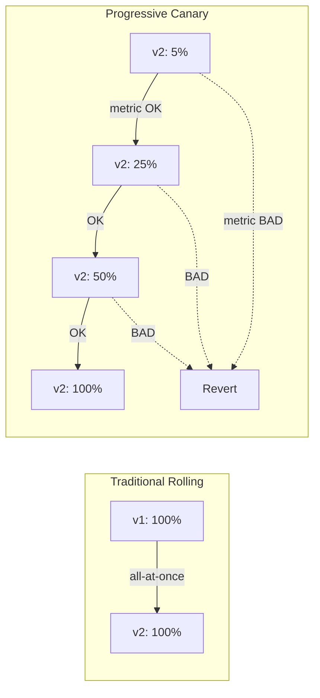
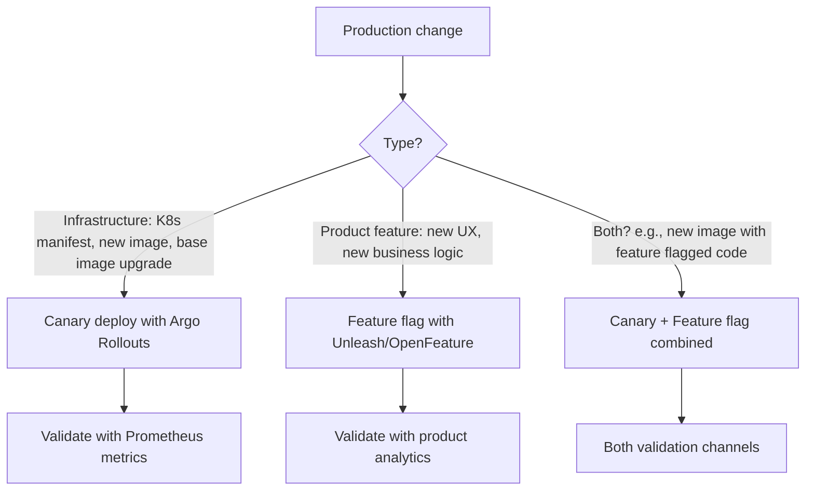

# 🎓 Progressive Delivery — Argo Rollouts canary + Feature flags

> **Tác giả:** Mr.Rom\
> **Phiên bản:** v1.1.0\
> **Tạo lúc:** 24/05/2026\
> **Cập nhật:** 25/05/2026\
> **Level:** Intermediate\
> **Tags:** [MUST-KNOW]\
> **Yêu cầu trước:** [03_secret-management.md](03_secret-management.md), [CI/CD basic Deploy strategies](../01_basic/04_deploy-strategies.md)

> 🎯 *Basic deploy = all-or-nothing risk (bài 04 basic). Production cần **progressive**: 5% → 25% → 50% → 100% với metric analysis + auto-rollback. **Argo Rollouts** + **Prometheus** analysis + **feature flags** runtime. Bài cuối CI/CD intermediate.*

## 🎯 Sau bài này bạn sẽ

- [ ] Hiểu **progressive delivery** vs traditional deploy strategy
- [ ] Setup **Argo Rollouts** + canary strategy
- [ ] **Analysis template** với Prometheus metric — auto-rollback dựa SLO
- [ ] **Traffic shifting** via ingress-nginx + Istio
- [ ] **Feature flags** với OpenFeature SDK + Unleash backend
- [ ] **A/B testing** với feature flags + analytics
- [ ] **Dark launches** + shadow traffic
- [ ] Decision matrix: when canary, when feature flag, when both

---

## Tình huống — Deploy v2.5 → 30% errors trong 5 phút

Sale lễ 11/11, deploy `v2.5.0` qua GitHub Actions:
```bash
kubectl set image deployment/payment payment=acme/payment:v2.5.0
```

Rolling update: 5 phút sau, 100% pods chạy `v2.5.0`.

Error rate dashboard:
- 0% errors @ T=0 (deploy start).
- 30% errors @ T=5 (deploy done).
- Customer support: orders fail, payment timeout.

Manual rollback:
```bash
kubectl rollout undo deployment/payment
```

8 phút sau, errors back to normal. **Damage**: 13 phút × $6000/phút revenue = **$78,000 loss**.

Post-mortem:
- Bug: `v2.5.0` introduce DB query timeout 30s (was 5s in `v2.4.0`).
- Could have detected at 5% traffic in 30 seconds.
- All-or-nothing deploy = no early signal.

Sếp: *"Setup Argo Rollouts. Mọi prod deploy phải canary với auto-rollback. Bài 04 dạy đây."*

---

## 1️⃣ Progressive delivery — Concept

### Traditional vs Progressive

Khác biệt cốt lõi: rolling update đẩy 100% user sang version mới cùng lúc (blast radius lớn), progressive đẩy **từng bước** (5% → 25% → 50% → 100%) với metric gate. Diagram so sánh:



### Key principles

1. **Small blast radius**: 5% users test new version first.
2. **Metric-driven**: auto-decide promote vs rollback dựa Prometheus.
3. **Auto-rollback**: no human intervention if metric degrade.
4. **Time-boxed**: each phase has duration (e.g., 5 phút), not indefinite.

🪞 **Ẩn dụ**: *Progressive delivery như **thử món ăn ở chi nhánh nhỏ trước** — không launch món mới toàn chuỗi 50 chi nhánh cùng lúc. Tier 1 (5 chi nhánh thử) → feedback OK → mở rộng tier 2 (15 chi nhánh) → ... → toàn chuỗi.*

---

## 2️⃣ Argo Rollouts vs others

5 tool progressive delivery phổ biến, mỗi cái có sweet spot. 2026 recommend Argo Rollouts (CNCF, pair với ArgoCD) — most adopted + feature-rich:

| Tool | Pros | Cons | Use case |
|---|---|---|---|
| **Argo Rollouts** | K8s-native, integrate ArgoCD, metric analysis, multiple strategy | Learning curve | GitOps shop |
| **Flagger** | Integrate Flux | Less feature-rich | Flux user |
| **Spinnaker** | Full multi-cloud pipeline | Complex install | Multi-cloud large org |
| **AWS CodeDeploy** | Native AWS | AWS-specific | AWS-only |
| **Service Mesh** (Istio/Linkerd) | Sophisticated traffic split | Mesh complexity | Already have mesh |

→ **2026 recommend**: Argo Rollouts (pairs with ArgoCD).

### Install Argo Rollouts

Argo Rollouts cài qua manifest official 1 lệnh + plugin kubectl. Sau đó dùng được `kubectl argo rollouts` để watch/promote/abort rollout:

```bash
kubectl create namespace argo-rollouts
kubectl apply -n argo-rollouts -f https://github.com/argoproj/argo-rollouts/releases/latest/download/install.yaml

# Install CLI
brew install argoproj/tap/kubectl-argo-rollouts

# Verify
kubectl argo rollouts version
```

---

## 3️⃣ Rollout CRD — Replace Deployment

### Basic Rollout

`Rollout` CRD replace `Deployment` — cùng structure (replicas, selector, template) nhưng thêm `strategy.canary.steps`. Mỗi step `setWeight: N` + `pause: { duration }` để observe metrics:

```yaml
apiVersion: argoproj.io/v1alpha1
kind: Rollout            # ← Replace Deployment
metadata:
  name: fastapi
  namespace: production
spec:
  replicas: 10
  selector:
    matchLabels:
      app: fastapi
  template:
    metadata:
      labels:
        app: fastapi
    spec:
      containers:
        - name: fastapi
          image: ghcr.io/acme/fastapi:v1.2.3
          ports:
            - containerPort: 8000
  strategy:
    canary:
      steps:
        - setWeight: 5         # 5% canary
        - pause: { duration: 5m }
        - setWeight: 25
        - pause: { duration: 10m }
        - setWeight: 50
        - pause: { duration: 10m }
        - setWeight: 100
```

→ Apply: same UX as Deployment, but with canary stepping.

```bash
kubectl apply -f rollout.yaml

# Watch
kubectl argo rollouts get rollout fastapi -n production --watch
```

### Update image

Để trigger canary rollout, đổi image tag trong YAML rồi apply. Argo Rollouts tự execute steps + pause. CLI `kubectl argo rollouts` cho phép promote/abort manual khi cần:

```bash
# Old way (Deployment): kubectl set image deployment/...
# New way (Rollout):
kubectl argo rollouts set image fastapi fastapi=ghcr.io/acme/fastapi:v1.2.4 -n production

# OR via Git → ArgoCD sync new image tag
```

→ Argo Rollouts orchestrate canary progression:
1. Deploy 1 pod with `v1.2.4` (5% of 10 replicas + scale down 1 old).
2. Wait 5 minutes.
3. Scale to 25% — 2-3 pods new.
4. Wait 10 minutes.
5. 50%, then 100%.

### Manual promote / abort

```bash
# Pause indefinitely (no duration)
kubectl argo rollouts get rollout fastapi
# Status: Paused at step 1

# Manual promote
kubectl argo rollouts promote fastapi -n production

# Abort
kubectl argo rollouts abort fastapi -n production
# Revert to previous stable version

# Promote to next step
kubectl argo rollouts promote fastapi --skip-step
```

---

## 4️⃣ Analysis template — Auto-rollback dựa metric

### Concept

Each pause step có thể attach **AnalysisTemplate**. Argo Rollouts query Prometheus every interval, compare with threshold. If metric bad → auto-abort.

### AnalysisTemplate

```yaml
apiVersion: argoproj.io/v1alpha1
kind: AnalysisTemplate
metadata:
  name: success-rate
  namespace: production
spec:
  args:
    - name: service-name
  metrics:
    - name: success-rate
      interval: 30s              # query every 30s
      count: 10                  # 10 successful queries → analysis success
      successCondition: result[0] >= 0.95   # 95% success rate threshold
      failureCondition: result[0] < 0.90    # <90% = fail → rollback
      failureLimit: 3            # 3 failed queries → abort
      provider:
        prometheus:
          address: http://prometheus.monitoring:9090
          query: |
            sum(rate(http_requests_total{service="{{args.service-name}}",status!~"5.."}[2m])) /
            sum(rate(http_requests_total{service="{{args.service-name}}"}[2m]))
```

### Reference in Rollout

```yaml
spec:
  strategy:
    canary:
      steps:
        - setWeight: 5
        - pause: { duration: 2m }     # initial bake time
        - analysis:                    # ← analysis step
            templates:
              - templateName: success-rate
            args:
              - name: service-name
                value: fastapi
        - setWeight: 25
        - pause: { duration: 5m }
        - analysis:
            templates:
              - templateName: success-rate
            args:
              - name: service-name
                value: fastapi
        - setWeight: 50
        - pause: { duration: 5m }
        - analysis:
            templates:
              - templateName: success-rate
            args:
              - name: service-name
                value: fastapi
        - setWeight: 100
```

→ At each analysis step:
1. Argo Rollouts query Prometheus.
2. If success rate ≥95% for 10 consecutive queries → promote.
3. If <90% for 3 queries → **abort + rollback**.

### Multiple metrics per analysis

```yaml
spec:
  metrics:
    - name: success-rate
      provider: { prometheus: { ... } }
      successCondition: result[0] >= 0.95
    - name: p99-latency
      provider: { prometheus: { query: "histogram_quantile(0.99, sum by (le) (rate(http_request_duration_seconds_bucket{service=\"{{args.service-name}}\"}[2m])))" } }
      successCondition: result[0] < 0.5      # P99 < 500ms
    - name: error-rate
      provider: { prometheus: { query: "..." } }
      successCondition: result[0] < 0.01     # <1% errors
```

→ All metrics must pass to promote.

### Other providers

```yaml
# Datadog
- name: success-rate
  provider:
    datadog:
      apiVersion: v2
      query: "sum:trace.servlet.request.hits{service:fastapi,!http.status_code:5*}.as_count()"

# CloudWatch
- name: cw-metric
  provider:
    cloudWatch:
      metricDataQueries:
        - id: rate1
          metricStat:
            metric: { ... }

# Web (custom HTTP endpoint)
- name: webhook-check
  provider:
    web:
      url: https://my-analytics/api/v2/health
      jsonPath: '{$.status}'
```

---

## 5️⃣ Traffic shifting providers

### Default: replica count

Without explicit traffic provider, Argo Rollouts adjust replica count:
- 5% weight = 1 of 20 replicas runs new version.
- Service load-balance round-robin → roughly 5% traffic to new.

❌ Limitation: imprecise (replica count → traffic ratio approximation). Pod-level granularity.

### Ingress-nginx (precise %)

```yaml
spec:
  strategy:
    canary:
      canaryService: fastapi-canary
      stableService: fastapi-stable
      trafficRouting:
        nginx:
          stableIngress: fastapi-stable-ingress
          additionalIngressAnnotations:
            canary-by-header: "X-Canary"
      steps:
        - setWeight: 5
        - pause: { duration: 2m }
        - setWeight: 25
        # ...
```

→ Argo Rollouts manages 2 Ingresses:
- `fastapi-stable-ingress` (normal).
- `fastapi-canary-ingress` (canary annotation `nginx.ingress.kubernetes.io/canary-weight: "5"`).

ingress-nginx routes precise % to canary based on annotation. **Header-based** canary also supported (specific user opts-in via `X-Canary` header).

### Istio (most powerful)

```yaml
spec:
  strategy:
    canary:
      canaryService: fastapi-canary
      stableService: fastapi-stable
      trafficRouting:
        istio:
          virtualService:
            name: fastapi-vs
            routes:
              - primary
```

VirtualService:
```yaml
apiVersion: networking.istio.io/v1beta1
kind: VirtualService
metadata:
  name: fastapi-vs
spec:
  hosts: [fastapi]
  http:
    - name: primary
      route:
        - destination:
            host: fastapi-stable
          weight: 95
        - destination:
            host: fastapi-canary
          weight: 5
```

Istio benefits:
- **Header-based**: route 100% of "beta-tester" header to canary.
- **Cookie-based**: stick session to version.
- **Geographic**: canary US-East first, EU-West later.
- **mTLS**: secure pod-to-pod traffic.

→ Worth Istio complexity if need advanced routing.

### Comparison

| Provider | Traffic precision | Setup complexity | Best for |
|---|---|---|---|
| Replica count | ~ replica count | Easy | Small cluster, simple |
| Ingress-nginx | Precise % | Medium | Most teams 2026 |
| Istio/Linkerd | Precise + L7 routing | High | Multi-service mesh setup |
| AWS App Mesh / GCP Anthos Service Mesh | Precise | Cloud-native | Vendor lock-in OK |

---

## 6️⃣ Blue-green với Rollouts

### When canary vs blue-green

- **Canary**: gradual % shift, observe production traffic mixed.
- **Blue-green**: instant 100% switch after validation, 2 environments parallel.

### Blue-green Rollout

```yaml
spec:
  strategy:
    blueGreen:
      activeService: fastapi-active        # serves prod traffic
      previewService: fastapi-preview      # for testing pre-switch
      autoPromotionEnabled: false           # require manual promote
      scaleDownDelaySeconds: 30             # keep old version 30s post-switch
      prePromotionAnalysis:                 # run analysis before switch
        templates:
          - templateName: success-rate
        args:
          - name: service-name
            value: fastapi-preview
      postPromotionAnalysis:                # validate after switch
        templates:
          - templateName: success-rate
        args:
          - name: service-name
            value: fastapi-active
```

→ Deploy new version → `fastapi-preview` Service routes to it (internal QA testing). Run analysis. Manual or automated promote → switch active Service to point new version → old version scaled down after delay.

---

## 7️⃣ Feature flags — Runtime control

### Vì sao feature flags?

Canary tốt cho **infrastructure change** (new image version). Feature flag tốt cho **product feature**:
- Test new pricing page với 10% users.
- A/B test 2 checkout flows.
- Dark launch (deploy code but disabled until ready).
- Kill switch — disable feature instantly if bug.

### Decoupling deploy vs release

```
Traditional:
  Deploy = Release = Feature live for all users
  ❌ Risk: bug = roll back deploy

Feature flag:
  Deploy = Code in production (flag OFF, no user impact)
  Release = Flip flag ON for 10% users
  ❌ Risk → toggle OFF (no rollback needed)
```

→ Decouple "deploy" (low frequency, infra) from "release" (high frequency, product).

### OpenFeature SDK — Vendor-neutral

[OpenFeature](https://openfeature.dev/) (CNCF Incubating) — standard SDK spec. Backend swappable.

```python
# Python
from openfeature.api import set_provider
from openfeature.contrib.provider.unleash import UnleashProvider

# Setup
set_provider(UnleashProvider(url='http://unleash.acme.io', token='...'))

# Use
client = open_feature_api.get_client()

if client.get_boolean_value("new-checkout-flow", default_value=False, context={"user_id": current_user.id}):
    return render_new_checkout()
else:
    return render_old_checkout()
```

→ Code uses OpenFeature API. Swap Unleash → LaunchDarkly → GrowthBook backend by changing provider, no code change.

### Unleash — OSS backend

```bash
# Install Unleash with Docker Compose
git clone https://github.com/Unleash/unleash
cd unleash
docker-compose up -d
```

Or K8s Helm:
```bash
helm install unleash unleash/unleash \
  --namespace unleash \
  --create-namespace \
  --set postgresql.enabled=true
```

Unleash UI: define feature flags with strategies:
- Boolean (on/off).
- Gradual rollout (10% users).
- Specific user IDs.
- Geographic targeting.
- A/B test variants.

### Use in code (multiple SDKs)

```javascript
// JavaScript SDK
import { UnleashClient } from 'unleash-proxy-client';

const unleash = new UnleashClient({
  url: 'https://unleash.acmeshop.vn/proxy',
  clientKey: 'proxy-client-key',
  appName: 'frontend'
});

await unleash.start();

if (unleash.isEnabled('new-checkout-flow')) {
  renderNewCheckout();
}
```

### Strategies

```javascript
// Variant for A/B test
const variant = unleash.getVariant('checkout-experiment');
switch (variant.name) {
  case 'variant-a':
    return renderCheckoutA();
  case 'variant-b':
    return renderCheckoutB();
  default:
    return renderCheckoutDefault();
}
```

---

## 8️⃣ Hands-on: Canary deploy với metric analysis

### Step 1: Setup Prometheus + ServiceMonitor

Pre-req: kube-prometheus-stack installed.

```yaml
apiVersion: v1
kind: Service
metadata:
  name: fastapi
  namespace: production
  labels:
    app: fastapi
spec:
  ports:
    - port: 8000
      name: http
  selector:
    app: fastapi
---
apiVersion: monitoring.coreos.com/v1
kind: ServiceMonitor
metadata:
  name: fastapi
  namespace: production
spec:
  selector:
    matchLabels:
      app: fastapi
  endpoints:
    - port: http
      path: /metrics
      interval: 30s
```

→ Prometheus scrape `/metrics` from FastAPI (Prometheus client lib must instrument).

### Step 2: AnalysisTemplate

```yaml
apiVersion: argoproj.io/v1alpha1
kind: AnalysisTemplate
metadata:
  name: fastapi-success-rate
  namespace: production
spec:
  args:
    - name: service-name
      value: fastapi
  metrics:
    - name: success-rate
      interval: 30s
      count: 6                    # 3 minutes of measurements
      successCondition: result[0] >= 0.95
      failureCondition: result[0] < 0.90
      failureLimit: 2
      provider:
        prometheus:
          address: http://prometheus-operated.monitoring:9090
          query: |
            sum(rate(http_requests_total{job="{{args.service-name}}",status!~"5.."}[2m]))
            /
            sum(rate(http_requests_total{job="{{args.service-name}}"}[2m]))
    - name: p99-latency
      interval: 30s
      count: 6
      successCondition: result[0] < 0.5    # P99 < 500ms
      failureCondition: result[0] > 1.0    # P99 > 1s = fail
      failureLimit: 2
      provider:
        prometheus:
          address: http://prometheus-operated.monitoring:9090
          query: |
            histogram_quantile(0.99,
              sum by (le) (rate(http_request_duration_seconds_bucket{job="{{args.service-name}}"}[2m])))
```

### Step 3: Rollout với canary + analysis

```yaml
apiVersion: argoproj.io/v1alpha1
kind: Rollout
metadata:
  name: fastapi
  namespace: production
spec:
  replicas: 10
  selector:
    matchLabels:
      app: fastapi
  template:
    metadata:
      labels:
        app: fastapi
    spec:
      containers:
        - name: fastapi
          image: ghcr.io/acme/fastapi:v1.2.3
          ports:
            - name: http
              containerPort: 8000
          resources:
            requests: { cpu: 200m, memory: 256Mi }
            limits: { cpu: 1, memory: 512Mi }
          livenessProbe:
            httpGet: { path: /health, port: http }
          readinessProbe:
            httpGet: { path: /ready, port: http }
  strategy:
    canary:
      canaryService: fastapi-canary
      stableService: fastapi-stable
      trafficRouting:
        nginx:
          stableIngress: fastapi-ingress
      steps:
        - setWeight: 5
        - pause: { duration: 2m }
        - analysis:
            templates: [{ templateName: fastapi-success-rate }]
            args: [{ name: service-name, value: fastapi }]
        - setWeight: 25
        - pause: { duration: 5m }
        - analysis:
            templates: [{ templateName: fastapi-success-rate }]
            args: [{ name: service-name, value: fastapi }]
        - setWeight: 50
        - pause: { duration: 5m }
        - analysis:
            templates: [{ templateName: fastapi-success-rate }]
            args: [{ name: service-name, value: fastapi }]
        - setWeight: 75
        - pause: { duration: 5m }
        - setWeight: 100
```

### Step 4: Services

```yaml
apiVersion: v1
kind: Service
metadata:
  name: fastapi-stable
  namespace: production
spec:
  ports: [{ port: 80, targetPort: 8000 }]
  selector:
    app: fastapi
---
apiVersion: v1
kind: Service
metadata:
  name: fastapi-canary
  namespace: production
spec:
  ports: [{ port: 80, targetPort: 8000 }]
  selector:
    app: fastapi
---
apiVersion: networking.k8s.io/v1
kind: Ingress
metadata:
  name: fastapi-ingress
  namespace: production
spec:
  ingressClassName: nginx
  rules:
    - host: api.acmeshop.vn
      http:
        paths:
          - path: /
            pathType: Prefix
            backend:
              service:
                name: fastapi-stable      # ← stable Service
                port: { number: 80 }
```

### Step 5: Trigger canary deploy

```bash
# Update image
kubectl argo rollouts set image fastapi fastapi=ghcr.io/acme/fastapi:v1.2.4 -n production

# Watch
kubectl argo rollouts get rollout fastapi -n production --watch
```

Workflow output:
```
NAME                                        KIND        STATUS     STEP   SET-WEIGHT
⟳ fastapi                                   Rollout     ✓ Healthy  10/10  100
├──# revision:2
│  └──⧉ fastapi-6f5b4c8d                    ReplicaSet  ✓ Healthy  4
│     └──□ fastapi-6f5b4c8d-aaa1            Pod         ✓ Running  ready:1/1
│     └──□ fastapi-6f5b4c8d-aaa2            Pod         ✓ Running  ready:1/1
│     └──□ fastapi-6f5b4c8d-aaa3            Pod         ✓ Running  ready:1/1
│     └──□ fastapi-6f5b4c8d-aaa4            Pod         ✓ Running  ready:1/1
└──# revision:1
   └──⧉ fastapi-7e9b5d2f                    ReplicaSet  ✓ Healthy  6
      └──□ ... (6 stable pods)

Step:    7/10
SetWeight: 50
ActualWeight: 50
```

→ Live canary progression. Argo Rollouts query Prometheus, decide promote/abort.

### Step 6: Simulate failure

Deploy bad image:
```bash
kubectl argo rollouts set image fastapi fastapi=ghcr.io/acme/fastapi:v2.0.0-broken
```

Simulate errors (test endpoint returns 500):
```bash
curl https://api.acmeshop.vn/some-endpoint
# HTTP 500 spike
```

Wait analysis:
```
Step 3: analysis
  fastapi-success-rate: measuring...
  result[0] = 0.85   ← below failureCondition (0.90)
  Failed measurement 1/2
  
  result[0] = 0.82   ← failed again
  Failed measurement 2/2 ← failureLimit hit
  
  Analysis: Failed
  → Rollout aborted, scaling back stable replicas
```

→ Auto-rollback! 5% traffic for ~3 minutes → rollback. **Damage limited**.

---

## 9️⃣ Decision matrix — Canary vs Feature flag



### Use canary when

- Image version upgrade (Python 3.11 → 3.12).
- Library update with potential side effects.
- Config change (new resource limit, env var).
- Performance optimization (DB index change).
- Database migration (with feature flag for new column reads).

### Use feature flag when

- New UI element.
- Different pricing strategy.
- A/B test 2 algorithms.
- Beta feature for specific users.
- Dark launch (deploy ready, release later).

### Combine (most production)

```python
# Code v2.5.0 deployed via canary
if flag.is_enabled('new-payment-flow', context={'user_id': user.id}):
    return new_payment_processor(order)
else:
    return old_payment_processor(order)
```

→ **Canary**: validate deploy `v2.5.0` doesn't break existing functionality (default flag OFF for all users).
→ **Feature flag**: gradually enable new payment flow per user segment.

→ Two-dimensional safety: deploy safety + feature safety.

---

## 💡 Cạm bẫy thường gặp & Best practice

### ❌ Cạm bẫy: Canary metric not sensitive enough

```yaml
successCondition: result[0] >= 0.5   # 50% success → too lenient
```

→ Bug with 30% errors → still passes (canary has 5% of traffic, 70% success rate locally → 95% overall).

→ **Fix**: Use **canary-specific** metric (filter by deployment label):
```promql
sum(rate(http_requests_total{deployment="fastapi-canary",status!~"5.."}[2m]))
/
sum(rate(http_requests_total{deployment="fastapi-canary"}[2m]))
```

→ Compare canary alone vs stable, not aggregate.

### ❌ Cạm bẫy: Analysis interval too short

```yaml
interval: 5s
count: 3
```

→ 15 seconds of data → noisy, false positive abort.

→ **Fix**: `interval: 30s, count: 6` minimum → 3 minutes data. Confidence high.

### ❌ Cạm bẫy: No analysis early step

```yaml
steps:
  - setWeight: 5
  - pause: { duration: 5m }      # no analysis, just wait
  - setWeight: 25
  - analysis: { ... }
```

→ Bad version may serve 5% traffic for 5 minutes blind.

→ **Fix**: Analysis at first step too.

### ❌ Cạm bẫy: Feature flag forgot to cleanup

→ Flag `new-checkout` enabled 100% 6 months ago. Code still has if/else branches. Dead code = bug surface.

→ **Fix**:
- Periodic cleanup (quarterly review flags).
- Linter detect unused flags.
- Auto-expire flags after N days at 100% (Unleash supports).

### ❌ Cạm bẫy: Feature flag fallback inconsistent

```python
# Service A
if flag.is_enabled('new-api'):
    return new_api()
return old_api()

# Service B (different team)
if flag.is_enabled('new-api', default=True):   # ← default different!
    return new_api()
return old_api()
```

→ Inconsistent behavior across services if flag service down.

→ **Fix**: Team convention — default value always same. Document. Audit code.

### ❌ Cạm bẫy: Canary without auto-rollback

```yaml
steps:
  - setWeight: 5
  - pause: {}   # forever, wait manual
```

→ Human required at 3am to abort. Slow response.

→ **Fix**: Always include analysis with auto-rollback. Manual approval optional but not required.

### ❌ Cạm bẫy: Mixed traffic on canary header

```
# Header-based canary
Request: X-Canary=true → 100% canary
Request: no header → 0% canary (stable only)
```

→ Customer reports problem with canary, but production stable user doesn't see. **Selection bias** = canary not representative.

→ **Fix**:
- Random %  + header opt-in for known testers.
- Sticky session (cookie) — keep user on same version across requests.

### ✅ Best practice: Canary + observability dashboard

Grafana dashboard:
- Side-by-side panels: canary vs stable.
- Same metric (success rate, latency, throughput).
- Alert on divergence.

→ Visual confidence. Human + automated decision.

### ✅ Best practice: Multi-region rollout

```yaml
steps:
  - setWeight: 5
  - pause: { duration: 30m }      # Bake time
  - analysis: { ... }
  # Promote dev region only
  - setWeight: 25
  - pause: { duration: 1h }       # Longer for prod traffic patterns
  - analysis: { ... }
  # Then us-east1
  # Then us-west2
  # Then eu-west1
```

→ Roll out region-by-region. Issue in 1 region = stop, don't propagate.

### ✅ Best practice: Feature flag governance

- **Naming**: `team-feature-purpose` (e.g., `payment-stripe-v2-checkout`).
- **Lifecycle**: created → testing → percentage rollout → 100% → cleanup.
- **Owner**: who created, who can modify.
- **Expiry**: max 90 days from creation, alert at 60 days.
- **Audit log**: who changed flag when, why.

---

## 🧠 Tự kiểm tra (Self-check)

**Q1.** Khi nào dùng canary, blue-green, feature flag?

<details>
<summary>💡 Đáp án</summary>

**Canary**:
- Infrastructure changes (image version, K8s manifest, base image upgrade).
- Gradual traffic shift 5% → 100%.
- Validation via aggregate metrics (success rate, latency).
- **Use when**: low confidence in change, can tolerate small % impact, want quick rollback.

**Blue-green**:
- Same purpose as canary, but **instant 100% switch** after validation.
- 2 environments running in parallel briefly.
- **Use when**: stateful changes (DB migration tied to code), preview validation before switch, need instant cutover.

**Feature flag**:
- Product/business logic changes (new UX, algorithm).
- **Decouple deploy from release**: code deploys, feature toggles on later.
- Per-user granularity (specific user/segment).
- **Use when**: A/B testing, dark launches, kill switch capability needed.

**Hybrid (most production)**:
- Deploy code via canary (infrastructure safety).
- Release feature via flag (product safety).
- 2-axis safety.

**Decision tree**:
1. Infrastructure change → canary.
2. Product feature → feature flag.
3. Major rewrite → blue-green.
4. New algorithm with metrics → canary + feature flag combined.
</details>

**Q2.** AnalysisTemplate `failureCondition` vs `successCondition` — both needed?

<details>
<summary>💡 Đáp án</summary>

**`successCondition`**: criterion to pass single measurement.
**`failureCondition`**: criterion to fail single measurement.

Both can exist:
- Result satisfies `successCondition` → counted toward `count` (need N successes).
- Result satisfies `failureCondition` → counted toward `failureLimit` (N failures → abort).
- Result neither (inconclusive) → not counted either way.

**Example**:
```yaml
successCondition: result[0] >= 0.95
failureCondition: result[0] < 0.90
count: 6
failureLimit: 2
```

Behavior:
- result 0.96 → success measurement (need 6 to pass).
- result 0.92 → neither (gray zone, retry).
- result 0.85 → failure (2 → abort).

**Why gray zone**:
- Real-world noise. 0.92 might be normal jitter.
- Strict threshold (95) for confidence to promote.
- Loose threshold (90) for clear failure.
- In between = wait more data.

**Without `failureCondition`**:
- Only `successCondition >= 0.95`. Any result <0.95 counts toward failure.
- Single bad measurement at 0.94 could abort prematurely.

**Recommended**: both for robust analysis.
</details>

**Q3.** Vì sao **traffic precision matter**? Replica count canary có vấn đề gì?

<details>
<summary>💡 Đáp án</summary>

**Replica count canary**:
- 10 replicas total. 5% weight = `min(1, 10*0.05) = 1` pod canary, 9 stable.
- Service load-balance round-robin across pods.
- **Approximation**: 10% traffic to canary (1/10 pods).

**Problems**:
1. **Granularity coarse**: minimum 10% with 10 replicas. 5% impossible without 20+ replicas.
2. **Session stickiness ignored**: same user might hit canary then stable then canary again → inconsistent experience.
3. **Load skew**: if 1 canary pod overloaded, others under-loaded. Skewed metric.
4. **No header/cookie routing**: can't opt-in specific users (beta testers).

**Ingress-nginx with traffic split**:
- Precise %: `canary-weight: "5"` → exactly 5% to canary.
- Session stickiness via cookie annotation.
- Header-based: `canary-by-header: "X-Canary"` for opt-in testing.

**Istio**:
- Plus L7 routing: by header value, by HTTP method, by URL pattern.
- Per-route weight.

→ **Production recommend**: ingress-nginx or Istio for traffic shifting. Replica count OK for small dev cluster.
</details>

**Q4.** OpenFeature vs Unleash directly — vì sao abstraction layer?

<details>
<summary>💡 Đáp án</summary>

**Direct Unleash SDK**:
```python
from unleash import UnleashClient
client = UnleashClient(url='http://unleash.acme.io', ...)
if client.is_enabled('new-feature'):
    ...
```

→ Code coupled to Unleash. Migrate to LaunchDarkly = rewrite all flag calls.

**OpenFeature SDK**:
```python
from openfeature.api import get_client
client = get_client()
if client.get_boolean_value('new-feature', default=False):
    ...

# Provider initialization (once)
from openfeature.contrib.provider.unleash import UnleashProvider
set_provider(UnleashProvider(...))
```

→ Code uses OpenFeature API (standardized). Provider abstraction.

**Benefits**:
1. **Vendor lock-in avoided**: swap providers without code rewrite.
2. **Multi-provider**: try LaunchDarkly for A/B tests, Unleash for kill switches.
3. **Test mocking**: use in-memory provider for unit tests, no real backend.
4. **Future-proof**: backend changes don't break code.

**Trade-offs**:
1. **Extra layer**: slightly more setup.
2. **Feature parity**: not all provider features exposed via OpenFeature API (advanced features still need direct SDK).

**Recommend 2026**: OpenFeature for new code. Direct SDK only when accessing provider-specific advanced features.

Like OpenTelemetry vs vendor monitoring SDK — vendor-neutral observability spec.
</details>

**Q5.** Feature flag tech debt — vì sao monthly cleanup quan trọng?

<details>
<summary>💡 Đáp án</summary>

**Problem with flag accumulation**:
1. **Code complexity**: every flag = if/else branch. 100 flags = 200 branches.
2. **Cognitive load**: dev reading code: "Is this branch reachable? Which condition?"
3. **Test coverage**: must test all combinations of flag states.
4. **Bug surface**: stale branches not exercised = bugs hidden.
5. **Performance**: many flag queries per request → latency.

**Lifecycle**:
1. **Created**: flag for testing new feature.
2. **Testing**: 1-10% rollout, A/B compare.
3. **Production**: 50-100% rollout.
4. **Stable**: 100% rollout for weeks.
5. **Cleanup**: remove if/else, hard-code new behavior, delete flag.

**Without cleanup**:
- 6 months later: flag still in code at 100%. Other branch never executed.
- Year later: 50 zombie flags. Hard to grok code.
- Team loses confidence: "Is this flag still needed? Will removal break?"

**Cleanup process**:
1. **Audit monthly**: flags 100% for > 60 days = candidate for removal.
2. **Code search**: find flag references.
3. **Remove**: simplify if/else, delete flag from Unleash.
4. **Deploy**: confirm no regression.

**Tooling**:
- Unleash UI shows last-modified, value distribution.
- Linter (e.g., `eslint-plugin-flags`) detect unused flags.
- LaunchDarkly auto-suggest cleanup candidates.

**Cultural**:
- Definition of Done includes flag cleanup.
- "Flag owner" responsible for lifecycle.
- Sprint planning includes 1-2 flag cleanups.

→ **Feature flag = power, abuse breeds tech debt**. Discipline matters.
</details>

---

## ⚡ Tra cứu nhanh (Cheatsheet)

```bash
# === Argo Rollouts ===
kubectl argo rollouts get rollout <name>
kubectl argo rollouts get rollout <name> --watch
kubectl argo rollouts set image <name> <container>=<image>
kubectl argo rollouts promote <name>
kubectl argo rollouts promote <name> --skip-step
kubectl argo rollouts abort <name>
kubectl argo rollouts undo <name>
kubectl argo rollouts pause <name>
kubectl argo rollouts retry <name>

# === Analysis ===
kubectl get analysisrun -n <ns>
kubectl describe analysisrun <name>

# === Dashboard ===
kubectl argo rollouts dashboard
# Open localhost:3100

# === Unleash (CLI via API) ===
curl -X POST https://unleash.acme.io/api/admin/features \
  -H "Authorization: <token>" \
  -H "Content-Type: application/json" \
  -d '{"name": "new-feature", "enabled": false}'

curl -X PATCH https://unleash.acme.io/api/admin/features/new-feature/strategies/<id> \
  -d '{"parameters": {"rollout": "25"}}'
```

```yaml
# === Common canary template ===
spec:
  strategy:
    canary:
      canaryService: app-canary
      stableService: app-stable
      trafficRouting:
        nginx:
          stableIngress: app-ingress
      steps:
        - setWeight: 5
        - pause: { duration: 2m }
        - analysis:
            templates: [{ templateName: success-rate }]
        - setWeight: 25
        - pause: { duration: 5m }
        - analysis:
            templates: [{ templateName: success-rate }]
        - setWeight: 50
        - pause: { duration: 5m }
        - analysis:
            templates: [{ templateName: success-rate }]
        - setWeight: 100
```

---

## 📚 Từ Điển Thuật Ngữ (Glossary)

| Term | Vietnamese / Explanation |
|---|---|
| **Progressive delivery** | Gradual rollout với metric validation + auto-rollback |
| **Argo Rollouts** | K8s controller cho progressive delivery (canary, blue-green) |
| **Flagger** | Alternative to Argo Rollouts (Flux ecosystem) |
| **Rollout** | Argo Rollouts CRD — replace Deployment với canary capability |
| **Canary** | Small % traffic to new version, observe, expand |
| **Blue-green** | 2 environments parallel, instant 100% switch |
| **Traffic shifting** | Mechanism route % traffic (replica count / ingress / service mesh) |
| **AnalysisTemplate** | CRD define metric query + threshold + abort condition |
| **AnalysisRun** | Instance of AnalysisTemplate during rollout step |
| **Sticky session** | Pin user to specific version across requests (cookie-based) |
| **Header-based canary** | Route based on HTTP header value (e.g., X-Canary) |
| **Shadow traffic** | Send copy of prod traffic to new version (no user impact) |
| **Dark launch** | Deploy code without releasing feature (flag OFF) |
| **Kill switch** | Feature flag to instantly disable feature |
| **Feature flag** | Runtime toggle for code path (per-user / per-segment) |
| **OpenFeature** | CNCF vendor-neutral feature flag SDK spec |
| **Unleash** | OSS feature flag backend (self-host) |
| **LaunchDarkly** | Commercial feature flag (best UX) |
| **GrowthBook** | OSS feature flag with analytics-first approach |
| **A/B testing** | 2 variants running concurrently, compare metrics |
| **Variant** | Distinct version in A/B test (variant-a, variant-b, control) |
| **Bake time** | Pause duration in canary to observe before promote |
| **Sticky session** | Routing keeps user on same version |

---

## 🔗 Liên kết & Tài nguyên

### 🧭 Định hướng lộ trình học
- ⬅️ **Bài trước:** [Secret management — Vault + External Secrets Operator + 12-factor](03_secret-management.md)
- ↑ **Về cụm:** [CI/CD README](../../README.md)
- 🎯 Hoàn thành CI/CD intermediate cluster!

### 🧩 Các chủ đề có thể bạn quan tâm
- 🔁 [CI/CD basic Deploy strategies](../01_basic/04_deploy-strategies.md) — basic 5 strategies overview
- ☸️ [K8s intermediate Autoscaling+Operators](../../../kubernetes/lessons/02_intermediate/04_autoscaling-and-operators.md) — HPA interact với canary
- 📊 [Observability Prometheus](../../../observability/lessons/01_basic/01_metrics-prometheus.md) — metric source for analysis

### 🌐 Tài nguyên tham khảo khác
- 📖 [Argo Rollouts](https://argo-rollouts.readthedocs.io/)
- 📖 [Flagger](https://flagger.app/)
- 📖 [Argo Rollouts Analysis](https://argoproj.github.io/argo-rollouts/features/analysis/)
- 📖 [OpenFeature](https://openfeature.dev/)
- 📖 [Unleash docs](https://docs.getunleash.io/)
- 📖 [LaunchDarkly](https://docs.launchdarkly.com/)
- 📖 [GrowthBook](https://docs.growthbook.io/)
- 📖 [Flagsmith](https://docs.flagsmith.com/)
- 📖 [Effective feature flag patterns](https://martinfowler.com/articles/feature-toggles.html) — Martin Fowler
- 📖 [Istio traffic management](https://istio.io/latest/docs/concepts/traffic-management/)

---

## 📌 Nhật ký thay đổi (Changelog)

- **v1.0.0 (24/05/2026)** — Bản đầu tiên. Lesson 04 — bài cuối CI/CD intermediate. Argo Rollouts canary + AnalysisTemplate metric-driven auto-rollback + traffic shifting (replica/ingress-nginx/Istio) + blue-green variant + Feature flags OpenFeature + Unleash + decision matrix canary vs FF + hands-on canary với Prometheus analysis. 7 pitfall + 3 best practice + 5 self-check + cheatsheet.
- **v1.1.0 (25/05/2026)** — Apply Blueprint v0.5.4+ §3.6: thêm lead-in trước Traditional vs Progressive + Argo Rollouts vs others + Install + Basic Rollout + Update image.
