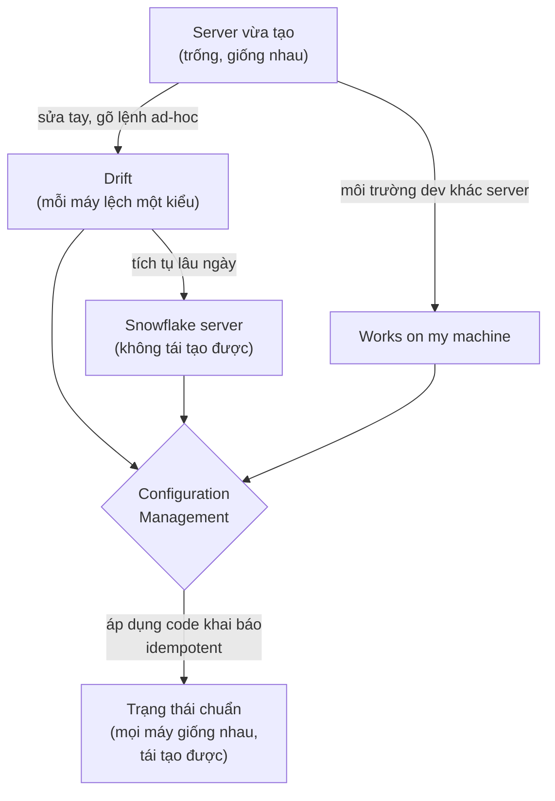
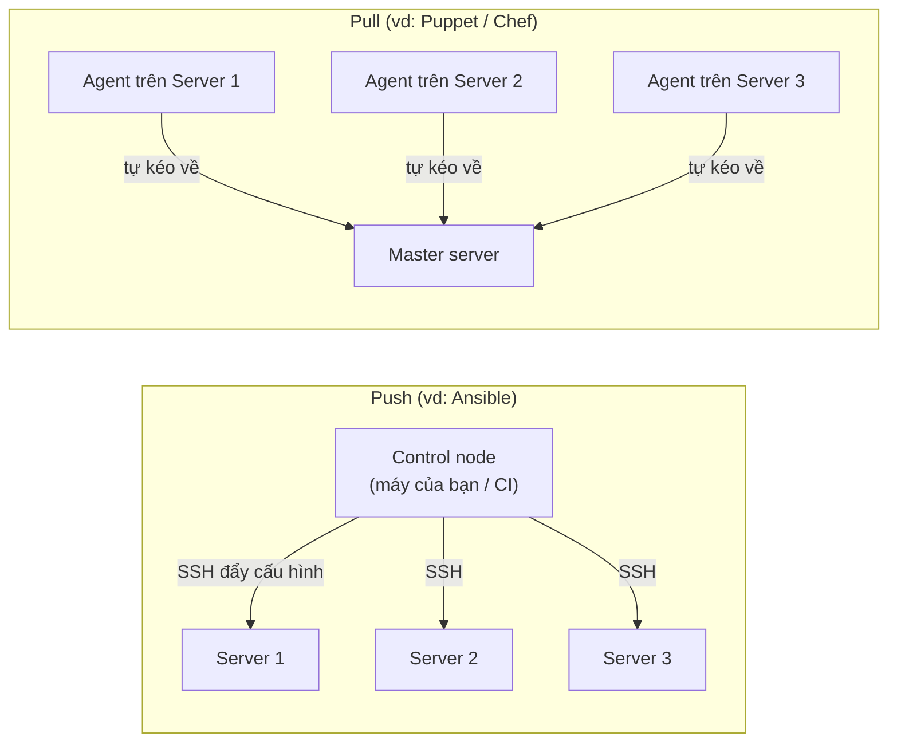

# 🎓 Configuration Management là gì? — Chống config drift & snowflake server

> **Tác giả:** Mr.Rom\
> **Phiên bản:** v1.0.0\
> **Tạo lúc:** 13/06/2026\
> **Cập nhật:** 13/06/2026\
> **Level:** Basic\
> **Tags:** configuration-management, ansible, idempotency, devops, infrastructure\
> **Yêu cầu trước:** [IaC là gì](../../../iac/lessons/01_basic/00_what-is-iac.md)

> 🎯 *Bạn vừa học IaC — Terraform/OpenTofu dựng ra server, network, database. Nhưng dựng xong server **trống trơn** thì chưa chạy được app: còn phải cài package, sửa file config, bật service. Bài này trả lời "phần đó ai lo" — giới thiệu **Configuration Management** (CM), khái niệm **idempotency**, hai mô hình **Push vs Pull**, **mutable vs immutable**, và vì sao 2026 vẫn cần CM dù đã có container.*

## 🎯 Sau bài này bạn sẽ

- [ ] Hiểu **Configuration Management** là gì, giải quyết bài toán nào
- [ ] Gọi tên 3 căn bệnh kinh điển: **config drift**, **snowflake server**, **"works on my machine"**
- [ ] Hiểu **idempotency** — khái niệm cốt lõi nhất của CM
- [ ] Phân biệt mô hình **Push vs Pull**, hạ tầng **mutable vs immutable**
- [ ] Nắm landscape **Ansible / Chef / Puppet / Salt** (bảng so sánh ngắn)
- [ ] Phân biệt **CM vs IaC vs Container** — khi nào dùng cái nào
- [ ] Hiểu vì sao **2026 vẫn cần CM** (VM, bare-metal, edge, hybrid)

---

## 1️⃣ Tình huống: server đã dựng xong, nhưng app vẫn chưa chạy

Hãy tưởng tượng đội Acme Shop vừa làm xong bài IaC trước. Một lệnh `terraform apply` đẹp đẽ tạo ra 3 con EC2, 1 VPC, 1 load balancer. Bạn SSH vào server đầu tiên, gõ `nginx`, và nhận về:

```text
bash: nginx: command not found
```

Đúng vậy — Terraform dựng **cái máy**, nhưng bên trong máy vẫn là một bản Ubuntu trống. Chưa có `nginx`, chưa có Python đúng version, chưa có file `/etc/nginx/nginx.conf` của Acme Shop, chưa có user `deploy`, chưa bật `systemd` service. Có người sẽ phản xạ: "thì SSH vào gõ tay thôi". Và đây chính là lúc 3 căn bệnh kinh điển bắt đầu.

Bạn SSH vào **server 1**, gõ một loạt lệnh:

```bash
sudo apt update
sudo apt install -y nginx python3.12
sudo systemctl enable --now nginx
sudo vim /etc/nginx/sites-available/acmeshop
```

Rồi sang **server 2**, gõ lại — nhưng lần này quên `python3.12`, gõ nhầm thành `python3.11`. Sang **server 3** thì đồng nghiệp khác làm, họ thêm một dòng `ulimit` mà bạn không biết. Ba server, ba cấu hình **lệch nhau một chút**. Vài tháng sau, app chạy ổn trên server 1, lỗi 502 ngẫu nhiên trên server 3, và không ai nhớ vì sao.

Đây là bài toán mà **Configuration Management** sinh ra để giải.

> **Configuration Management** (CM — *quản lý cấu hình*) là cách quản lý **trạng thái bên trong** của server — package nào được cài, file config có nội dung gì, service nào đang chạy, user/permission ra sao — bằng **code khai báo**, version-controlled, áp dụng tự động và lặp lại được trên hàng trăm máy mà kết quả luôn giống nhau.

🪞 **Ẩn dụ xuyên suốt bài**: nếu IaC giống như **xây xong phần thô của một dãy nhà** (móng, tường, mái — cái khung vật lý), thì CM giống như **đội nội thất** đi vào từng căn, lắp đúng cùng một bộ bàn ghế, sơn cùng một màu tường, theo đúng một bản vẽ duy nhất. Mục tiêu: 100 căn nhà bước vào đều **giống hệt nhau**, không căn nào "tự chế" khác đi.

> 💡 Định nghĩa rồi, ta soi kỹ 3 căn bệnh ở mục dưới — đây là lý do CM tồn tại.

---

## 2️⃣ Ba căn bệnh CM chữa: drift, snowflake, "works on my machine"

Ba vấn đề dưới đây nghe có vẻ riêng biệt nhưng thực ra là ba mặt của cùng một gốc bệnh: **không có nguồn-chân-lý (source of truth) cho cấu hình bên trong server**. Ta điểm từng cái.

### 🩺 Config drift — cấu hình trôi dạt

*Config drift* (cấu hình trôi dạt) là hiện tượng trạng thái thực tế của server **dần lệch khỏi** trạng thái mong muốn ban đầu, do những thay đổi sửa tay tích tụ theo thời gian.

```text
Ngày đầu:  3 server giống hệt — nginx 1.24, python 3.12, cùng config
Sau đó:    SSH vào server 2 sửa nóng 1 timeout để "chữa cháy" sự cố
Sau đó:    server 3 được cài thêm 1 package debug, quên gỡ
Sau đó:    server 1 vẫn nguyên bản
Kết quả:   3 server, 3 cấu hình khác nhau — không ai có bản đồ tổng
```

→ Drift nguy hiểm vì nó **âm thầm**: mỗi thay đổi nhỏ tưởng vô hại, nhưng cộng dồn thì cụm server trở nên không thể dự đoán. Khi sự cố xảy ra, bạn không biết server nào đang ở trạng thái nào.

### ❄️ Snowflake server — server bông tuyết

*Snowflake server* (server bông tuyết) là một server **độc nhất vô nhị** — được "vuốt ve" sửa tay quá nhiều lần đến mức không ai dám đụng vào, cũng không ai dựng lại được y hệt nếu nó chết.

🪞 Quay lại ẩn dụ dãy nhà: snowflake server là **căn nhà mà chủ tự ý đập tường, nối điện, khoan trần suốt nhiều năm** — giờ không còn bản vẽ nào khớp với nó. Nó cháy thì xây lại đúng y như cũ là điều **bất khả thi**, vì không ai biết bên trong tường có gì.

> [!CAUTION]
> Snowflake server là cơn ác mộng của on-call: con server "quan trọng nhất, không được sập" thường lại chính là con bị sửa tay nhiều nhất. Khi nó chết lúc 3h sáng, không có script nào tái tạo được — bạn buộc phải tự nhớ ra hàng chục thay đổi thủ công đã làm suốt nhiều tháng.

### 💻 "Works on my machine" — máy tôi chạy mà

Câu kinh điển khi dev đẩy code lên và app vỡ trên production: *"Ơ, máy tôi chạy ngon mà!"*. Gốc rễ là **môi trường lệch nhau** — máy dev có Python 3.12, server có 3.11; máy dev có biến môi trường `DEBUG=1`, server không; máy dev cài thừa một thư viện hệ thống.

→ Cả ba căn bệnh đều cùng một thuốc chữa: **mô tả trạng thái mong muốn bằng code, áp dụng đồng nhất ở mọi nơi**. Dev, staging, production và 100 server production đều đi từ **một bản khai báo CM duy nhất** → không còn "máy nào khác máy nào".

Để thấy ba căn bệnh này liên hệ với nhau và cùng bị CM "đóng băng" về một trạng thái chuẩn ra sao, ta xem sơ đồ dưới.



→ Mọi mũi tên bệnh đều hội tụ về CM, và CM đẩy tất cả về **một trạng thái chuẩn dùng chung**. Điều khiến phép "đóng băng" này làm được nhiều lần mà không hỏng chính là **idempotency** — concept ta mổ xẻ ngay sau đây.

---

## 3️⃣ Idempotency — khái niệm cốt lõi nhất của CM

Nếu chỉ được nhớ **một** từ sau bài này, hãy nhớ *idempotency*.

*Idempotency* (tính bất biến khi lặp) là tính chất: **chạy một thao tác nhiều lần cho ra cùng một kết quả như chạy đúng một lần**. Áp dụng cho CM: chạy bản khai báo cấu hình 1 lần hay 50 lần thì server vẫn ở **đúng một trạng thái cuối**, không bị nhân đôi, không bị chồng chất.

### Vì sao idempotency quan trọng đến vậy

Hãy so sánh hai cách diễn đạt cùng một ý "server phải có dòng này trong file hosts".

Cách **không idempotent** — kiểu script bash thuần, ra lệnh "làm gì":

```bash
# Mỗi lần chạy, append thêm 1 dòng — KHÔNG idempotent
echo "10.0.0.5  db.acmeshop.local" >> /etc/hosts
```

→ Chạy 1 lần: file có 1 dòng. Chạy 5 lần: file có **5 dòng trùng nhau**. Đây chính là gốc của drift — chạy lại script "chữa cháy" càng nhiều càng hỏng.

Cách **idempotent** — kiểu khai báo "trạng thái phải là gì" (đây là tinh thần một task Ansible, ta học cú pháp chi tiết ở bài 01):

```yaml
# Khai báo: dòng này PHẢI tồn tại đúng 1 lần trong /etc/hosts
- name: Đảm bảo có entry db trong /etc/hosts
  ansible.builtin.lineinfile:
    path: /etc/hosts
    line: "10.0.0.5  db.acmeshop.local"
    state: present
```

→ Chạy 1 lần hay 50 lần: file luôn có **đúng 1 dòng** đó. Lần chạy đầu báo `changed` (đã thêm), những lần sau báo `ok` (đã đúng rồi, không đụng vào). Đó là idempotency.

> [!IMPORTANT]
> Idempotency là thứ phân biệt **Configuration Management** với "một mớ script bash". Một công cụ CM tốt cho phép bạn chạy lại bản khai báo bất cứ lúc nào để **kéo server về đúng trạng thái chuẩn** — vừa là cách triển khai lần đầu, vừa là cách tự chữa drift. Script bash thuần không tự cho bạn điều này.

### Khái niệm "convergence" đi kèm

Vì idempotent nên CM hoạt động theo kiểu *converge* (hội tụ): mỗi lần chạy, công cụ **so sánh** trạng thái thực tế với trạng thái khai báo, chỉ sửa phần **lệch**, rồi dừng. Chạy định kỳ (ví dụ mỗi giờ) → server tự "trôi về" trạng thái chuẩn, drift bị triệt tiêu liên tục. Ý tưởng này y hệt vòng lặp `plan → apply` của Terraform bạn đã gặp ở cụm IaC, chỉ khác là CM tác động **bên trong** server thay vì tạo hạ tầng.

### Khai báo "trạng thái mong muốn", không phải "các bước"

Idempotency có được là nhờ một cách tư duy: ở bài IaC bạn đã gặp cặp *declarative vs imperative*. CM cũng chia theo trục đó — và đây là điểm khiến nhiều người mới hiểu sai về CM.

- *Imperative* (mệnh lệnh) — bạn liệt kê **các bước phải làm**: "chạy `apt install nginx`, rồi `echo` thêm dòng vào file, rồi `systemctl restart`". Công cụ làm đúng từng bước, **mỗi lần chạy đều làm lại từ đầu** dù trạng thái đã đúng. Đây là kiểu script bash thuần — không idempotent.
- *Declarative* (khai báo) — bạn mô tả **trạng thái cuối phải đạt**: "nginx phải được cài, file config phải có nội dung này, service phải đang chạy". Công cụ tự kiểm tra hiện trạng và **chỉ làm phần còn thiếu**.

🪞 Ẩn dụ: imperative giống đưa **chỉ đường từng ngã rẽ** ("rẽ trái, đi 200m, rẽ phải"); declarative giống đưa **địa chỉ đích** rồi để GPS tự tính đường — đứng ở đâu cũng tới được đúng nơi. CM hiện đại (Ansible, Puppet, Chef, Salt) đều thiên về declarative ở các module cốt lõi, và đó là cội nguồn của idempotency.

→ Quy tắc nhận biết nhanh: nếu một task CM của bạn chạy lần thứ hai vẫn báo `changed`, gần như chắc chắn bạn đang viết theo kiểu imperative (thường là dùng module `shell`/`command`). Task declarative đúng chuẩn sẽ báo `ok` từ lần thứ hai trở đi.

---

## 4️⃣ Push vs Pull — hai mô hình áp cấu hình

Có hai cách để bản khai báo cấu hình "đến được" server và áp lên đó. Đây là một trục phân loại quan trọng giúp bạn hiểu vì sao Ansible khác Puppet/Chef.

Trước khi xem bảng, hình dung nhanh: **Push** là "trung tâm chủ động đẩy lệnh xuống máy", còn **Pull** là "mỗi máy tự chủ động lên server trung tâm tải cấu hình về". Sơ đồ dưới minh hoạ hai chiều mũi tên ngược nhau.



→ Khác biệt cốt lõi: Push không cần cài gì sẵn trên server đích (chỉ cần SSH + Python) nên gọi là *agentless*, còn Pull cần một *agent* (tiến trình nền) cài sẵn trên mỗi máy để định kỳ về master lấy cấu hình.

Giờ đi vào chi tiết hai mô hình:

| Tiêu chí | Push (đẩy) | Pull (kéo) |
|---|---|---|
| Ai khởi xướng | Control node chủ động đẩy xuống | Mỗi server tự định kỳ kéo về |
| Cần agent trên server? | ❌ Không (chỉ SSH + Python) — *agentless* | ✅ Có (daemon chạy nền) |
| Công cụ tiêu biểu | Ansible, SaltStack (chế độ push) | Puppet, Chef, SaltStack (chế độ pull) |
| Tự sửa drift định kỳ | Phải tự lên lịch chạy (cron/CI) | Mặc định có (agent chạy theo chu kỳ) |
| Quy mô rất lớn (hàng nghìn máy) | SSH song song có giới hạn, cần tuning | Mở rộng tốt — agent tự về master |
| Độ phức tạp setup ban đầu | Thấp — không hạ tầng master | Cao hơn — phải dựng master + cài agent |
| Khi mới bắt đầu nên chọn | ✅ Push (Ansible) — dễ tiếp cận nhất | Khi đã có quy mô lớn, cần converge tự động |

→ **2026 thực tế**: phần lớn team mới và team vừa chọn mô hình **Push agentless** (Ansible) vì không phải nuôi hạ tầng master và agent. Mô hình Pull (Puppet/Chef) vẫn mạnh ở các tổ chức rất lớn cần converge tự động liên tục trên hàng nghìn máy.

---

## 5️⃣ Mutable vs Immutable — sửa tại chỗ hay thay mới

Một trục tư duy nữa quyết định bạn dùng CM thế nào: server của bạn là **mutable** (sửa được tại chỗ) hay **immutable** (chỉ thay mới, không sửa). Bạn đã chạm khái niệm này ở bài IaC; ở đây ta soi qua lăng kính CM.

### Mutable — sửa tại chỗ

Server *mutable* (khả biến) là server tồn tại lâu dài, và mọi thay đổi đều **áp trực tiếp lên nó**: cập nhật package, sửa config, restart service — tất cả trên cùng con máy đó.

```text
Ngày 1:  Tạo server, dùng CM cài nginx + app
Sau:     App lên version mới → CM chạy lại, cập nhật package + config tại chỗ
Sau:     OS cần vá bảo mật → CM chạy lại apt upgrade tại chỗ
```

→ Mô hình này có nguy cơ drift, nên **bắt buộc** đi kèm CM idempotent để "đóng băng" trạng thái sau mỗi lần đổi. Phù hợp với VM dài hạn, database server, bare-metal.

### Immutable — thay mới, không sửa

Server *immutable* (bất biến) thì **không bao giờ sửa sau khi tạo**: muốn đổi gì, ta nướng (*bake*) một image mới rồi thay nguyên con server cũ bằng con mới.

```text
Ngày 1:  Bake image v1 (đã sẵn nginx + app bên trong) → khởi chạy server từ image
Sau:     Đổi config → bake image v2 → tạo server mới, hủy server cũ
```

→ Container (Docker) và image máy ảo (Packer bake AMI) là hiện thân của immutable: không drift vì **không ai sửa tay vào server đang chạy**.

Hai mô hình này không loại trừ nhau — CM len vào ở những chỗ khác nhau:

| Khía cạnh | Mutable (sửa tại chỗ) | Immutable (thay mới) |
|---|---|---|
| Cách cập nhật | CM áp lên server đang chạy | Bake image mới rồi thay server |
| Nguy cơ drift | Có — phải dùng CM idempotent kiềm chế | Gần như không |
| Vai trò của CM | Áp + duy trì cấu hình suốt vòng đời server | Dùng để **xây image** lúc bake (Packer gọi Ansible) |
| Rollback | Phức tạp hơn | Dễ — chạy lại image cũ |
| Hợp với | VM dài hạn, DB, bare-metal, edge | Container, fleet web stateless |

→ Điểm cần nhớ: **CM hữu ích ở cả hai phía**. Với mutable, CM giữ server đúng trạng thái suốt vòng đời. Với immutable, CM thường được dùng **lúc bake image** — ví dụ Packer gọi Ansible để cài sẵn mọi thứ vào AMI/Docker image trước khi đóng gói.

---

## 6️⃣ Landscape — Ansible / Chef / Puppet / Salt

Thị trường CM có bốn cái tên lớn. Chúng cùng giải một bài toán nhưng khác nhau ở mô hình (push/pull), ngôn ngữ khai báo và độ phức tạp. Bảng dưới là bản đồ nhanh để bạn định vị (ta đào sâu so sánh + cách kết hợp ở bài 04 của cụm).

| Công cụ | Ra mắt | Mô hình | Cần agent? | Ngôn ngữ khai báo | Đặc trưng |
|---|---|---|---|---|---|
| **Ansible** | 2012 | Push | ❌ Agentless (SSH + Python) | YAML (playbook) | Dễ học nhất, không hạ tầng master, phổ biến nhất 2026 |
| **Puppet** | 2005 | Pull | ✅ Agent + master | DSL riêng (declarative) | Lâu đời, mạnh ở fleet rất lớn, converge tự động |
| **Chef** | 2009 | Pull | ✅ Agent + server | Ruby DSL (recipe/cookbook) | Linh hoạt, hợp người quen lập trình Ruby |
| **SaltStack** | 2011 | Push **và** Pull | Linh hoạt (cả 2) | YAML + Jinja2 | Nhanh ở quy mô lớn nhờ kiến trúc message bus |

Cụm bài này dạy **Ansible** vì nó *agentless* (chỉ cần SSH, không cài gì lên server đích), cú pháp YAML dễ đọc, và là điểm khởi đầu nhẹ nhất cho người mới — không phải dựng master hay phát hành agent như Puppet/Chef. Hiểu Ansible rồi, các công cụ còn lại chỉ là biến thể về mô hình và ngôn ngữ.

→ Đừng sa đà chọn "tool tốt nhất" — cả bốn đều production-grade. Tiêu chí thực tế: **đội nhỏ/vừa, hạ tầng đa dạng → Ansible**; **fleet rất lớn cần converge tự động liên tục → Puppet/Chef/Salt**.

---

## 7️⃣ CM vs IaC vs Container — khi nào dùng cái nào

Đây là chỗ người mới hay rối nhất: Terraform, Ansible, Docker/K8s — ba thứ nghe đều "tự động hóa hạ tầng", vậy khác nhau ở đâu? Câu trả lời ngắn: **chúng làm ở ba tầng khác nhau** và thường dùng *cùng nhau*, không thay thế nhau.

🪞 Quay lại ẩn dụ dãy nhà:

- **IaC (Terraform/OpenTofu)** = đội **xây thô**: dựng móng, tường, đường ống, đường điện — tức tạo ra *cái máy/network/database* ở tầng cloud.
- **CM (Ansible/Chef/Puppet)** = đội **nội thất**: bước vào từng căn đã xây xong, lắp đặt và cấu hình *bên trong* — cài package, sửa file config, bật service.
- **Container (Docker/K8s)** = **nhà lắp ghép đúc sẵn**: thay vì xây + nội thất tại chỗ, ta đúc nguyên căn ở nhà máy (image) rồi mang đến đặt — bên trong đã đóng gói sẵn app + thư viện.

Để khỏi nhầm "tool nào làm gì", bảng dưới chốt ranh giới:

| Tiêu chí | IaC (Terraform) | CM (Ansible) | Container (Docker/K8s) |
|---|---|---|---|
| Làm việc ở tầng | Hạ tầng cloud | Bên trong server | Đóng gói + điều phối app |
| Tạo ra cái gì | VPC, EC2, RDS, LB | Package, config file, service, user | Image + container chạy app |
| Câu hỏi nó trả lời | "Có những máy/network nào?" | "Bên trong máy có gì, cấu hình ra sao?" | "App được đóng gói & chạy thế nào?" |
| Đơn vị | Resource (cloud) | Task / playbook | Image / container |
| Idempotent | ✅ (declarative) | ✅ (theo thiết kế) | ✅ (image bất biến) |

Trong thực tế, một stack đầy đủ thường ghép cả ba — mỗi tool lo đúng phần của nó:

```text
1. Terraform/OpenTofu  → tạo VPC, subnet, EC2, RDS, load balancer
2. Ansible              → cấu hình BÊN TRONG mỗi EC2: cài nginx, deploy app, bật service
3. Docker/K8s           → nếu app đóng gói dạng container, K8s lo điều phối
```

→ Lưu ý quan trọng: nếu app của bạn **chạy hoàn toàn bằng container** trên K8s, vai trò của CM thu hẹp (image đã immutable, không cần cấu hình bên trong VM nữa). Nhưng đời thực hiếm khi "all-container 100%" — và đó là lý do mục cuối tồn tại.

> 💡 Lằn ranh không tuyệt đối: Terraform *có thể* gọi script cấu hình, Ansible *có thể* gọi cloud API tạo resource. Nhưng dùng đúng tool cho đúng tầng sẽ sạch và dễ bảo trì hơn nhiều.

---

## 8️⃣ Vì sao 2026 vẫn cần Configuration Management

Có một lầm tưởng phổ biến: "đã có Docker/K8s thì CM chết rồi". Sai. Container giải quyết **phần app stateless đóng gói được**, nhưng hạ tầng thực tế của hầu hết tổ chức rộng hơn thế rất nhiều. CM vẫn là công cụ chủ lực ở những vùng dưới đây.

| Vùng vẫn cần CM | Vì sao container/IaC không thay được |
|---|---|
| **VM dài hạn** | Database, message broker, legacy app thường chạy trên VM mutable — cần cấu hình & vá định kỳ |
| **Bare-metal** | Máy chủ vật lý (data center riêng, sàn giao dịch low-latency) không "container hóa" trọn vẹn — cần cấu hình OS, driver, kernel |
| **Edge** | Thiết bị biên / IoT / chi nhánh phân tán — cần đẩy cấu hình đồng nhất đến hàng trăm điểm xa |
| **Hybrid** | Vừa on-prem vừa cloud, vừa container vừa VM — CM là lớp thống nhất cấu hình xuyên môi trường |
| **Bootstrap node K8s** | Chính các node chạy K8s (kubelet, container runtime, kernel param) cần được cấu hình — bằng CM |
| **Bake image** | Pipeline immutable dùng CM (Packer + Ansible) để cài sẵn mọi thứ vào image trước khi đóng gói |

→ **Tóm lại**: container không xóa sổ CM, nó chỉ **thu hẹp phạm vi** sang đúng phần app stateless. Mọi thứ còn lại — VM, bare-metal, edge, hybrid, và cả việc dựng nền cho chính K8s — vẫn cần một công cụ áp cấu hình idempotent. Đó là lý do năm 2026 CM vẫn là kỹ năng cốt lõi của DevOps/SRE, và Ansible là cánh cửa dễ vào nhất — bài tiếp theo ta bắt tay vào nó.

---

## 💡 Cạm bẫy thường gặp & Best practice

### ❌ Cạm bẫy: Coi CM như "chỗ chứa script bash để chạy hàng loạt"

- **Triệu chứng**: viết task CM bằng các lệnh `shell`/`command` thuần (kiểu `apt install`, `echo >> file`), chạy lại lần hai là hỏng — file nhân đôi dòng, service restart vô cớ.
- **Nguyên nhân**: bỏ qua idempotency — dùng CM như nơi gói script imperative, đánh mất giá trị cốt lõi.
- **Cách tránh**: luôn ưu tiên các module khai báo trạng thái (`package`, `lineinfile`, `template`, `service`) thay vì `shell`. Một bản khai báo CM tốt chạy lần hai phải báo `ok`, không phải `changed`.

### ❌ Cạm bẫy: Vẫn SSH vào sửa tay "cho nhanh" sau khi đã dùng CM

- **Triệu chứng**: cấu hình trong code nói một đằng, server thực tế một nẻo — drift quay lại dù đã có CM.
- **Nguyên nhân**: mở ngoại lệ "sửa nóng" mà không cập nhật ngược lại vào code khai báo.
- **Cách tránh**: coi code CM là **source of truth duy nhất**. Mọi thay đổi đi qua code → chạy lại CM. Nếu phải sửa khẩn cấp, ghi ngay lại vào code sau đó.

### ✅ Best practice: Bắt đầu bằng Push agentless (Ansible) trước khi nghĩ tới master/agent

- **Vì sao**: với đa số đội nhỏ/vừa, hạ tầng Push agentless gọn nhẹ, không phải nuôi master + agent, đủ dùng cho hàng chục đến hàng trăm máy.
- **Cách áp dụng**: học Ansible trước. Chỉ chuyển sang mô hình Pull (Puppet/Chef) khi quy mô thực sự lớn và cần converge tự động liên tục — đừng "đốt cháy giai đoạn" dựng hạ tầng phức tạp khi chưa cần.

### ✅ Best practice: Phân vai rõ giữa IaC, CM và Container

- **Vì sao**: chồng chéo vai trò (Terraform vừa tạo máy vừa cấu hình bên trong bằng script) khiến code rối, khó bảo trì, mất idempotency.
- **Cách áp dụng**: Terraform lo *tạo hạ tầng*, Ansible lo *cấu hình bên trong*, Docker/K8s lo *đóng gói & điều phối app container*. Mỗi tool đúng một tầng.

---

## 🧠 Tự kiểm tra (Self-check)

**Q1.** Configuration Management khác Infrastructure as Code (Terraform) ở chỗ nào?

<details>
<summary>💡 Đáp án</summary>

IaC (Terraform/OpenTofu) **tạo ra hạ tầng** ở tầng cloud — VPC, EC2, RDS, load balancer. CM (Ansible/Chef/Puppet) **cấu hình bên trong** server đã tồn tại — cài package, sửa file config, bật service, quản lý user. Ẩn dụ: IaC là xây thô (cái khung), CM là đội nội thất (cấu hình bên trong). Chúng dùng *cùng nhau*: Terraform tạo máy → Ansible cấu hình bên trong máy đó.

</details>

**Q2.** Idempotency là gì, và vì sao nó là khái niệm cốt lõi của CM?

<details>
<summary>💡 Đáp án</summary>

Idempotency = chạy thao tác **nhiều lần** cho ra **cùng một kết quả** như chạy đúng một lần. Trong CM, chạy bản khai báo 1 lần hay 50 lần thì server vẫn ở đúng một trạng thái cuối, không nhân đôi/chồng chất. Nó cốt lõi vì cho phép chạy lại bất cứ lúc nào để vừa triển khai vừa tự chữa drift — đây chính là thứ phân biệt CM với "một mớ script bash" (script bash kiểu `echo >> file` chạy lại sẽ nhân đôi dòng).

</details>

**Q3.** Phân biệt mô hình Push và Pull. Ansible thuộc loại nào và vì sao gọi là *agentless*?

<details>
<summary>💡 Đáp án</summary>

**Push**: control node chủ động đẩy cấu hình xuống server (qua SSH). **Pull**: mỗi server chạy một agent nền, tự định kỳ kéo cấu hình về từ master. Ansible thuộc **Push** và *agentless* vì không cần cài daemon nào lên server đích — chỉ cần SSH và Python sẵn có. Puppet/Chef thuộc Pull, cần agent + master.

</details>

**Q4.** Năm 2026 đã có Docker/K8s rồi, vì sao vẫn cần Configuration Management?

<details>
<summary>💡 Đáp án</summary>

Container chỉ giải quyết phần app stateless đóng gói được. CM vẫn cần cho: **VM dài hạn** (DB, broker, legacy), **bare-metal** (data center, low-latency, không container hóa trọn vẹn), **edge** (IoT, chi nhánh phân tán), **hybrid** (vừa on-prem vừa cloud, vừa VM vừa container), **bootstrap node K8s** (chính các node K8s cần cấu hình OS/kernel/runtime), và **bake image** (Packer + Ansible cài sẵn vào image). Container thu hẹp phạm vi CM chứ không xóa sổ.

</details>

**Q5.** Với hạ tầng immutable (container, AMI bake sẵn), CM còn vai trò gì không?

<details>
<summary>💡 Đáp án</summary>

Có. Với immutable, CM thường được dùng **lúc bake image** — ví dụ Packer gọi Ansible để cài sẵn package, config, app vào AMI/Docker image trước khi đóng gói. Server đang chạy thì không bị CM đụng vào (đó là tính bất biến), nhưng image *được tạo ra* nhờ CM. Còn với hạ tầng mutable, CM áp + duy trì cấu hình suốt vòng đời server.

</details>

---

## ⚡ Tra cứu nhanh (Cheatsheet)

| Khái niệm | Một dòng cần nhớ |
|---|---|
| **Configuration Management** | Quản lý trạng thái bên trong server (package/config/service) bằng code khai báo |
| **Config drift** | Server lệch dần khỏi trạng thái mong muốn do sửa tay tích tụ |
| **Snowflake server** | Server bị sửa tay quá nhiều, không tái tạo được |
| **"Works on my machine"** | Môi trường dev lệch môi trường server → app vỡ |
| **Idempotency** | Chạy nhiều lần = chạy một lần (kết quả cuối giống nhau) |
| **Convergence** | Mỗi lần chạy chỉ sửa phần lệch → server "trôi về" trạng thái chuẩn |
| **Push** | Control node đẩy xuống (Ansible) — agentless |
| **Pull** | Agent tự kéo về từ master (Puppet/Chef) |
| **Mutable** | Sửa server tại chỗ — cần CM idempotent kiềm drift |
| **Immutable** | Thay mới không sửa — CM dùng lúc bake image |

| Tool | Mô hình | Agent? | Ngôn ngữ | Khi chọn |
|---|---|---|---|---|
| **Ansible** | Push | ❌ | YAML | Mặc định cho đội nhỏ/vừa, hạ tầng đa dạng |
| **Puppet** | Pull | ✅ | DSL riêng | Fleet rất lớn, converge tự động |
| **Chef** | Pull | ✅ | Ruby DSL | Team quen Ruby, cần linh hoạt |
| **SaltStack** | Push/Pull | Cả 2 | YAML+Jinja2 | Quy mô lớn, cần tốc độ |

| Ai lo việc gì | Tool |
|---|---|
| Tạo hạ tầng cloud (VPC/EC2/RDS) | Terraform / OpenTofu (IaC) |
| Cấu hình bên trong server | Ansible / Chef / Puppet (CM) |
| Đóng gói + điều phối app container | Docker / Kubernetes |

---

## 📚 Từ Điển Thuật Ngữ (Glossary)

| EN | VN | Giải thích |
|---|---|---|
| Configuration Management (CM) | Quản lý cấu hình | Quản lý trạng thái bên trong server bằng code khai báo, lặp lại được |
| Config drift | Cấu hình trôi dạt | Trạng thái thực tế lệch dần khỏi trạng thái mong muốn |
| Snowflake server | Server bông tuyết | Server bị sửa tay quá nhiều, độc nhất, không tái tạo được |
| Idempotency | Bất biến khi lặp | Chạy nhiều lần cho kết quả cuối giống chạy một lần |
| Convergence | Hội tụ | Mỗi lần chạy chỉ sửa phần lệch để kéo về trạng thái chuẩn |
| Push model | Mô hình đẩy | Control node chủ động đẩy cấu hình xuống server |
| Pull model | Mô hình kéo | Agent trên server tự định kỳ kéo cấu hình về từ master |
| Agentless | Không cần agent | Không cài daemon lên server đích — chỉ cần SSH + Python |
| Agent | Tiến trình nền | Daemon cài trên server, định kỳ về master lấy cấu hình |
| Mutable infrastructure | Hạ tầng khả biến | Server sửa được tại chỗ, tồn tại lâu dài |
| Immutable infrastructure | Hạ tầng bất biến | Không sửa, chỉ thay mới bằng image đã bake |
| Bake (image) | Nướng image | Đóng gói sẵn package/config vào image trước khi triển khai |
| Playbook | Kịch bản Ansible | File YAML mô tả các task cấu hình cần áp (học ở bài 01-02) |
| Provision | Cấp phát | Tạo và chuẩn bị hạ tầng/server sẵn sàng dùng |
| Control node | Nút điều khiển | Máy chạy Ansible để đẩy cấu hình xuống các server |

---

## 🔗 Liên kết & Tài nguyên

### 🧭 Định hướng lộ trình học

- ➡️ **Bài tiếp theo:** [Ansible Basics — Agentless, inventory, ad-hoc & playbook đầu tiên](01_ansible-basics.md)
- ↑ **Về cụm:** [Configuration Management — README](../../README.md)

### 🧩 Các chủ đề có thể bạn quan tâm

- [IaC là gì? — Infrastructure as Code overview](../../../iac/lessons/01_basic/00_what-is-iac.md) — tầng dựng hạ tầng, kết hợp với CM
- [Terraform Basics — Providers, Resources, Variables](../../../iac/lessons/01_basic/01_terraform-basics.md) — provision máy để rồi Ansible cấu hình bên trong
- [Ansible vs Chef vs Puppet vs Salt — Chọn đúng & kết hợp với IaC](04_alternatives-and-when-which.md) — đào sâu so sánh landscape

### 🌐 Tài nguyên tham khảo khác

- [Ansible documentation](https://docs.ansible.com/) — tài liệu chính thức, điểm khởi đầu cho công cụ CM phổ biến nhất 2026
- [Puppet documentation](https://www.puppet.com/docs) — tham khảo mô hình Pull + agent/master
- [Chef documentation](https://docs.chef.io/) — CM với recipe/cookbook viết bằng Ruby DSL
- [SaltStack documentation](https://docs.saltproject.io/) — kiến trúc message bus cho quy mô lớn

---

> 🎯 *Sau bài này bạn đã có bản đồ tổng về Configuration Management: vì sao cần, idempotency là gì, Push vs Pull, mutable vs immutable, và CM đứng đâu giữa IaC và Container. Bài kế tiếp ta chính thức gõ tay vào **Ansible** — agentless, inventory, lệnh ad-hoc và playbook đầu tiên.*

---

## 📌 Nhật ký thay đổi (Changelog)

- **v1.0.0 (13/06/2026)** — Bản đầu tiên. Cluster configuration-management basic lesson 1/5. Cover: CM là gì + 3 căn bệnh (config drift / snowflake server / works on my machine) + idempotency & convergence + Push vs Pull + mutable vs immutable + landscape Ansible/Chef/Puppet/Salt + CM vs IaC vs Container + vì sao 2026 vẫn cần CM (VM/bare-metal/edge/hybrid).
