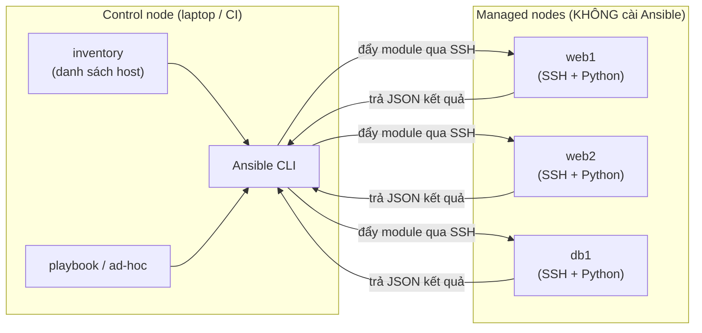
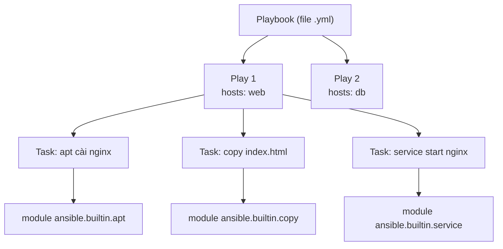

# 🎓 Ansible Basics — Agentless, inventory, ad-hoc & playbook đầu tiên

> **Tác giả:** Mr.Rom\
> **Phiên bản:** v1.0.0\
> **Tạo lúc:** 13/06/2026\
> **Cập nhật:** 13/06/2026\
> **Level:** Basic\
> **Tags:** ansible, configuration-management, devops, idempotency, ssh\
> **Yêu cầu trước:** [Configuration Management là gì](00_what-is-configuration-management.md)

> 🎯 *Bạn đã hiểu config drift và snowflake server ở bài trước. Giờ ta dùng **Ansible** — công cụ config management phổ biến nhất 2026 — để cấu hình server từ code: từ kiến trúc agentless, inventory, ad-hoc command đến playbook đầu tiên cài Nginx cho Acme Shop. Sau bài này bạn cấu hình được 1 VM thật, lặp lại 2 lần ra `changed=0` (idempotency).*

## 🎯 Sau bài này bạn sẽ

- [ ] Hiểu vì sao Ansible thắng thế: **agentless**, dùng **SSH**, viết bằng **YAML**, mô hình **push**
- [ ] Phân biệt **control node** và **managed node**, cài đặt Ansible đúng chỗ
- [ ] Viết **inventory** cả 2 dạng (INI + YAML), dùng **group**, `group_vars`/`host_vars`
- [ ] Chạy **ad-hoc command** (`ansible all -m ping`, `command`, `shell`, `apt`, `copy`, `service`)
- [ ] Viết **playbook** đầu tiên: hiểu plays / tasks / modules, dùng module phổ biến
- [ ] Chứng minh **idempotency** (chạy 2 lần → `changed=0`) và dùng `--check` dry-run + `-v`
- [ ] Hands-on: cấu hình **Nginx** trên 1 VM phục vụ landing page Acme Shop

---

## 1️⃣ Vì sao Ansible thắng thế?

Hãy tưởng tượng Acme Shop có 1 VM web mới toanh trên cloud. Bạn cần cài Nginx, copy file cấu hình, mở service, tạo user deploy. Cách "thủ công" là SSH vào gõ tay từng lệnh — đúng cái bệnh **snowflake server** mà bài trước đã mổ xẻ. Cách config-management là **viết ra một lần, chạy lặp lại được**.

Nhưng config management có nhiều công cụ: Chef, Puppet, Salt, Ansible... Vì sao 2026 đa số team mới chọn Ansible? Có 4 lý do cốt lõi, và tất cả đều xoay quanh chữ "ít rào cản".

Trước khi đi vào bảng, cần nhớ điểm mấu chốt: ba công cụ kia (Chef, Puppet, Salt) đời đầu đều cần cài một **agent** (phần mềm chạy nền) trên từng server bạn muốn quản — nghĩa là phải bootstrap agent trước, mở thêm cổng mạng, lo phiên bản agent khớp nhau. Ansible cắt bỏ toàn bộ phần đó:

| Đặc điểm | Ansible | Chef / Puppet (cổ điển) |
|---|---|---|
| **Agentless** (không cần cài agent) | ✅ Chỉ cần SSH + Python sẵn có trên server | ❌ Cài agent + bootstrap trên mọi node |
| **Giao thức** | SSH (cổng 22 đã mở sẵn) | Cổng riêng + chứng chỉ TLS |
| **Ngôn ngữ** | YAML (đọc như tiếng Anh) | Ruby DSL (cần học cú pháp riêng) |
| **Mô hình** | Push (đẩy từ control node ra) | Pull (agent tự kéo về định kỳ) |

Mổ xẻ từng cái:

- **Agentless** — Ansible không cần cài gì lâu dài trên server đích. Nó chỉ cần 2 thứ mà server Linux nào cũng có: **SSH** để đăng nhập và **Python** để chạy module. Đây là điểm "ăn tiền" nhất: thêm 100 server mới = thêm 100 dòng vào file inventory, không phải bootstrap agent 100 lần.

  > 🪞 *Ẩn dụ: Ansible giống một **thợ sửa lưu động** — mang theo đồ nghề (module Python), gõ cửa nhà bạn bằng chìa khoá có sẵn (SSH), làm xong thì đi, không để lại nhân viên thường trú (agent) ở nhà bạn.*

- **SSH** — kênh kết nối đã được mọi sysadmin tin dùng và mở sẵn. Không phát sinh cổng mạng mới, không quản chứng chỉ riêng. Bảo mật của Ansible "dựa lưng" vào bảo mật SSH vốn đã trưởng thành.

- **YAML** — playbook viết bằng *YAML* (định dạng text thụt lề, đọc gần như tiếng Anh). So với Ruby DSL của Chef/Puppet, người mới đọc playbook Ansible là hiểu ngay nó làm gì, không cần biết lập trình.

- **Push model** — bạn chạy lệnh trên **control node** (máy của bạn / CI), Ansible *đẩy* cấu hình ra server. Khác với pull model (agent trên server tự kéo về định kỳ). Push cho bạn kiểm soát chính xác "khi nào thay đổi xảy ra" — hợp với CI/CD.

Hiểu 4 trụ cột rồi, ta xem chúng ghép lại thành kiến trúc gì.

---

## 2️⃣ Kiến trúc: control node + managed node

Ansible chia thế giới làm 2 vai. **Control node** là nơi *bạn* ngồi gõ lệnh (laptop, hoặc server CI) — chỉ chỗ này mới cần cài Ansible. **Managed node** (hay "target host") là các server bị quản — chúng *không cần cài Ansible*, chỉ cần mở SSH và có Python.

Sơ đồ dưới đây cho thấy luồng một lệnh đi từ control node tới các managed node. Để ý: Ansible đẩy code module qua SSH, module chạy *trên* managed node bằng Python của chính nó, rồi trả kết quả về.



→ Điểm quan trọng: chỉ control node cài Ansible, còn managed node "sạch" — đây chính là cái lợi agentless. Khi Acme Shop thêm `web3`, bạn chỉ thêm 1 dòng vào inventory, không đụng gì tới việc cài đặt trên server mới.

### Yêu cầu trên mỗi vai

Để mọi thứ chạy được, mỗi vai cần đúng vài thứ tối thiểu sau — thiếu là lệnh sẽ lỗi kết nối:

- **Control node**: cài Ansible; có Python; có SSH client; có **SSH key** để đăng nhập managed node không cần mật khẩu. *Lưu ý: control node phải là Linux/macOS — Windows không chạy được control node native, phải dùng WSL.*
- **Managed node**: bật **SSH server** (cổng 22); cài sẵn **Python 3** (hầu hết distro Linux 2026 có sẵn); tài khoản đăng nhập có quyền (thường qua `sudo`).

Hiểu vai rồi, ta cài Ansible lên control node.

---

## 3️⃣ Cài đặt Ansible

Ansible chỉ cài trên **control node**. Có vài cách; mình chọn 2 cách phổ biến và đáng tin nhất 2026: qua `pipx` (cô lập, sạch, không đụng Python hệ thống) hoặc qua package manager của hệ điều hành.

Cách khuyến nghị là `pipx` — nó cài Ansible vào môi trường riêng, tránh xung đột với Python hệ thống:

```bash
# macOS / Linux — cách khuyến nghị (cô lập, dễ gỡ)
pipx install --include-deps ansible

# Kiểm tra phiên bản
ansible --version
```

Kết quả mong đợi (số phiên bản của bạn có thể khác):

```
ansible [core 2.17.5]
  config file = None
  python version = 3.12.4
  jinja version = 3.1.4
```

Dòng `ansible [core 2.17.5]` là phiên bản engine; `python version` là Python mà control node dùng để chạy. Nếu lệnh báo "command not found", `pipx` chưa thêm thư mục bin vào `PATH` — chạy `pipx ensurepath` rồi mở lại terminal.

Nếu bạn thích dùng package manager hệ thống thay vì pipx:

```bash
# Ubuntu / Debian
sudo apt update && sudo apt install -y ansible

# macOS (Homebrew)
brew install ansible
```

→ Gói `ansible` đã bao gồm `ansible`, `ansible-playbook`, và collection `ansible.builtin` (module lõi). Cài xong là dùng được ngay, chưa cần config gì thêm. Giờ ta khai báo "có những server nào" qua inventory.

---

## 4️⃣ Inventory — danh sách host Ansible quản

Ansible cần biết "có những server nào, gom nhóm thế nào". Đó là **inventory** — một file liệt kê host. Không có inventory, Ansible không biết đẩy lệnh đi đâu.

> 🪞 *Ẩn dụ: inventory giống **danh bạ điện thoại** — Ansible tra danh bạ để biết gọi cho ai, và gom theo nhóm ("nhóm web", "nhóm db") để gọi cả nhóm cùng lúc.*

Inventory viết được 2 định dạng: **INI** (gọn, hợp người mới) và **YAML** (cấu trúc rõ, hợp dự án lớn). Hai dạng tương đương nhau về khả năng — chọn theo sở thích.

### Inventory dạng INI

Đây là cách ngắn nhất để bắt đầu. Mỗi dòng là 1 host; ngoặc vuông `[...]` định nghĩa một **group** (nhóm). File này khai báo 2 web server + 1 db cho Acme Shop:

```ini
# inventory.ini

[web]
web1 ansible_host=192.168.56.11
web2 ansible_host=192.168.56.12

[db]
db1 ansible_host=192.168.56.21

# Biến áp cho TẤT CẢ host trong inventory này
[all:vars]
ansible_user=deploy
ansible_ssh_private_key_file=~/.ssh/acmeshop_id_ed25519
```

Giải thích các phần quan trọng:

- `web1`, `web2`, `db1` là **alias** (tên gọi trong Ansible); `ansible_host=` chỉ IP/hostname thật để SSH tới.
- `[web]` và `[db]` là 2 group — sau này bạn nhắm lệnh vào cả nhóm `web` thay vì gõ từng host.
- `[all:vars]` đặt biến cho group đặc biệt `all` (mọi host). `ansible_user` là user SSH; `ansible_ssh_private_key_file` là khoá riêng dùng để đăng nhập.

### Inventory dạng YAML

Cùng nội dung trên, viết lại bằng YAML. Dạng này rõ ràng hơn khi inventory phình to (nhiều group lồng nhau, nhiều biến):

```yaml
# inventory.yml
all:
  vars:
    ansible_user: deploy
    ansible_ssh_private_key_file: ~/.ssh/acmeshop_id_ed25519
  children:
    web:
      hosts:
        web1:
          ansible_host: 192.168.56.11
        web2:
          ansible_host: 192.168.56.12
    db:
      hosts:
        db1:
          ansible_host: 192.168.56.21
```

→ `children` là các group con của `all`; mỗi group có `hosts`; mỗi host có biến riêng. Cùng kết quả với file INI, chỉ khác cú pháp.

### Xem Ansible "hiểu" inventory thế nào

Đừng đoán — hãy hỏi thẳng Ansible nó đọc ra cấu trúc gì. Lệnh `--graph` vẽ cây group/host:

```bash
ansible-inventory -i inventory.ini --graph
```

Kết quả:

```
@all:
  |--@db:
  |  |--db1
  |--@ungrouped:
  |--@web:
  |  |--web1
  |  |--web2
```

`@all` là group gốc chứa mọi host. `@web` và `@db` là group bạn định nghĩa. `@ungrouped` chứa host không thuộc group nào (ở đây rỗng). Thấy đúng cây này nghĩa là inventory hợp lệ.

### `group_vars` và `host_vars` — tách biến ra file riêng

Nhét biến thẳng vào inventory ổn cho ví dụ nhỏ, nhưng dự án thật nên **tách biến ra file riêng** theo quy ước thư mục. Ansible tự động nạp:

- `group_vars/<tên_group>.yml` — biến áp cho cả group đó.
- `host_vars/<tên_host>.yml` — biến áp riêng 1 host (đè lên group).

Cấu trúc thư mục Acme Shop sẽ thành:

```
acmeshop-ansible/
├── inventory.ini
├── group_vars/
│   ├── all.yml          # biến cho mọi host
│   └── web.yml          # biến riêng nhóm web
├── host_vars/
│   └── web1.yml         # biến riêng web1
└── site.yml             # playbook chính
```

Ví dụ `group_vars/web.yml` đặt cổng và domain dùng chung cho nhóm web:

```yaml
# group_vars/web.yml
nginx_port: 80
site_domain: acmeshop.vn
```

→ Nhờ vậy biến nằm gọn một chỗ, dễ review qua Git. Khi cần khác biệt 1 host, ghi đè trong `host_vars/web1.yml`. Có inventory rồi, ta "gọi điện" thử cho host bằng ad-hoc command.

---

## 5️⃣ Ad-hoc command — chạy 1 việc nhanh, không cần playbook

Trước khi viết hẳn playbook, bạn thường muốn làm **1 việc nhanh, một lần**: kiểm tra host còn sống không, xem dung lượng đĩa, cài gấp 1 gói. Đó là lúc dùng **ad-hoc command** — chạy trực tiếp 1 module trên dòng lệnh.

Cú pháp chung:

```bash
ansible <pattern> -m <module> -a "<tham số>"
```

- `<pattern>` — nhắm vào host nào: tên 1 host, tên group (`web`), hay `all`.
- `-m <module>` — dùng module nào (mặc định là `command` nếu bỏ trống).
- `-a "..."` — tham số truyền cho module.

### `ping` — kiểm tra kết nối

Việc đầu tiên luôn là kiểm tra control node SSH tới managed node được không. Module `ping` của Ansible **không** phải `ping` ICMP — nó SSH vào, chạy thử Python, rồi trả `pong`. Tức là test cả SSH lẫn Python một phát:

```bash
ansible all -i inventory.ini -m ping
```

Kết quả mong đợi:

```
web1 | SUCCESS => {
    "changed": false,
    "ping": "pong"
}
web2 | SUCCESS => {
    "changed": false,
    "ping": "pong"
}
db1 | SUCCESS => {
    "changed": false,
    "ping": "pong"
}
```

`SUCCESS` (màu xanh) nghĩa là SSH + Python OK. `"ping": "pong"` là phản hồi của module. `"changed": false` nghĩa là không có gì bị thay đổi — `ping` chỉ kiểm tra, không sửa gì. Nếu thấy `UNREACHABLE!` (màu đỏ) thì là lỗi SSH (sai key, sai user, host không tới được), không phải lỗi Ansible.

### `command` vs `shell` — chạy lệnh trên host

Hai module này đều chạy lệnh shell trên managed node, nhưng khác nhau ở một điểm quan trọng về bảo mật. `command` (module mặc định) chạy lệnh **trực tiếp, KHÔNG qua shell** — nên không hiểu pipe `|`, redirect `>`, biến môi trường `$HOME`. `shell` chạy **qua `/bin/sh`** — hiểu mọi thứ đó, nhưng kém an toàn hơn nếu input không tin cậy.

Bắt đầu với `command` để xem uptime của nhóm web:

```bash
ansible web -i inventory.ini -m command -a "uptime"
```

Kết quả:

```
web1 | CHANGED | rc=0 >>
 10:32:01 up 2 days,  3:14,  0 users,  load average: 0.00, 0.01, 0.05
web2 | CHANGED | rc=0 >>
 10:32:01 up 1 day,  21:40,  0 users,  load average: 0.02, 0.03, 0.00
```

`rc=0` là return code 0 (lệnh thành công). Lưu ý Ansible báo `CHANGED` cho `command`/`shell` vì nó *không biết* lệnh có thực sự thay đổi hệ thống không — đây là lý do ta ưu tiên module chuyên dụng (`apt`, `copy`...) thay vì gõ lệnh thô.

Khi cần pipe hoặc redirect, phải dùng `shell`. Ví dụ đếm số process nginx:

```bash
ansible web -i inventory.ini -m shell -a "ps aux | grep nginx | wc -l"
```

→ Lệnh trên có `|` nên *bắt buộc* dùng `shell`; nếu đưa vào `command` sẽ lỗi vì `command` coi `|` là tham số chữ thường, không phải pipe. Quy tắc vàng: **mặc định dùng `command`, chỉ dùng `shell` khi thật sự cần `|`, `>`, `&&`, `$VAR`.**

### `apt` — cài/gỡ gói (Debian/Ubuntu)

Việc thường gặp nhất: cài 1 gói. Module `apt` (cho Ubuntu/Debian; tương đương `yum`/`dnf` cho RHEL/Rocky) làm việc này một cách **idempotent** — gói đã có thì không cài lại. Cài Nginx cần quyền root nên thêm `--become` (chạy như `sudo`):

```bash
ansible web -i inventory.ini -m apt -a "name=nginx state=present update_cache=true" --become
```

Kết quả (lần đầu — chưa có Nginx):

```
web1 | CHANGED => {
    "changed": true,
    "cache_updated": true,
    ...
}
```

`state=present` nghĩa "đảm bảo gói có mặt" (không quan tâm đã cài hay chưa). `update_cache=true` chạy `apt update` trước. `--become` leo quyền root. Lần đầu `changed: true` vì gói được cài; chạy lại lần 2 sẽ `changed: false` (đã có rồi) — đó chính là idempotency.

### `copy` — đẩy file lên host

`copy` đưa 1 file từ control node lên managed node. Ví dụ đẩy 1 trang HTML lên web server:

```bash
ansible web -i inventory.ini -m copy \
  -a "src=./index.html dest=/var/www/html/index.html mode=0644" --become
```

→ `src` là đường dẫn trên control node; `dest` là đích trên managed node; `mode=0644` đặt quyền file. `copy` cũng idempotent: nếu nội dung file đích đã giống `src` thì `changed: false`, không ghi đè vô ích.

### `service` — quản service (start/stop/restart)

`service` điều khiển dịch vụ hệ thống (qua systemd ở distro hiện đại). Đảm bảo Nginx đang chạy và bật khi khởi động máy:

```bash
ansible web -i inventory.ini -m service \
  -a "name=nginx state=started enabled=true" --become
```

→ `state=started` đảm bảo service đang chạy (đang chạy rồi thì không làm gì); `enabled=true` bật tự khởi động cùng OS. Các `state` khác: `stopped`, `restarted`, `reloaded`.

Ad-hoc tiện cho việc một lần. Nhưng cấu hình Nginx cần làm *nhiều bước theo thứ tự, lặp lại được* — đó là lúc cần playbook.

---

## 6️⃣ Playbook đầu tiên — plays, tasks, modules

**Playbook** là file YAML mô tả "muốn server ở trạng thái nào", gồm nhiều bước (task) chạy theo thứ tự. So với ad-hoc, playbook **lưu lại được, version-control được, lặp lại được** — đây mới là cách dùng Ansible thật sự.

> 🪞 *Ẩn dụ: playbook giống một **công thức nấu ăn** — liệt kê từng bước theo thứ tự ("cài gói → copy file → start service"), ai cầm công thức cũng nấu ra cùng món, và nấu lại nhiều lần vẫn ra y hệt.*

Cấu trúc phân cấp của playbook gồm 3 tầng — hiểu rõ trước khi viết:

- **Play** — một khối "áp các task này lên nhóm host này". Một playbook có 1 hay nhiều play.
- **Task** — một bước trong play; mỗi task gọi đúng 1 module.
- **Module** — đơn vị làm việc thực tế (`apt`, `copy`, `service`...). Ansible đẩy module lên host và chạy.

Sơ đồ quan hệ:



→ Đọc từ trên xuống: playbook chứa nhiều play, mỗi play nhắm 1 nhóm host và chứa các task tuần tự, mỗi task gọi 1 module. Đây là toàn bộ "ngữ pháp" của Ansible.

### Viết playbook đầu tiên

File `webserver.yml` dưới đây làm 3 việc trên nhóm `web`: cài Nginx, đẩy 1 trang HTML, bật service. Đây là phiên bản playbook hoá của mấy lệnh ad-hoc ở trên — nhưng giờ có thứ tự rõ ràng và lưu lại được:

```yaml
# webserver.yml
- name: Cau hinh Nginx web server cho Acme Shop
  hosts: web
  become: true          # leo quyen root cho ca play (tuong duong sudo)

  tasks:
    - name: Cai goi nginx
      ansible.builtin.apt:
        name: nginx
        state: present
        update_cache: true

    - name: Day trang chu Acme Shop len server
      ansible.builtin.copy:
        src: ./index.html
        dest: /var/www/html/index.html
        owner: www-data
        group: www-data
        mode: "0644"

    - name: Dam bao nginx dang chay va bat khi khoi dong
      ansible.builtin.service:
        name: nginx
        state: started
        enabled: true
```

Đọc kỹ từng phần:

- `- name:` đầu file là tên **play**; `hosts: web` chỉ play này áp lên group `web`.
- `become: true` đặt ở cấp play → mọi task đều chạy với quyền root (không cần `--become` ở CLI nữa).
- Mỗi mục trong `tasks:` là 1 **task**, có `name:` mô tả (sẽ hiện ra khi chạy) và 1 module (`ansible.builtin.apt`, ...).
- `ansible.builtin.apt` là tên **đầy đủ** (FQCN — Fully Qualified Collection Name) của module `apt`. Viết đầy đủ là best practice 2026 để rõ ràng và tránh nhầm lẫn; viết tắt `apt` vẫn chạy.

Trước khi đẩy ra server, cần có file `index.html` ngay cạnh playbook (vì `src: ./index.html` trỏ tới đó):

```bash
cat > index.html <<'EOF'
<!doctype html>
<html lang="vi">
  <head><meta charset="utf-8"><title>Acme Shop</title></head>
  <body><h1>Acme Shop — Nginx chay bang Ansible!</h1></body>
</html>
EOF
```

### Chạy playbook

Chạy playbook bằng lệnh `ansible-playbook` (khác với `ansible` của ad-hoc):

```bash
ansible-playbook -i inventory.ini webserver.yml
```

Kết quả mong đợi (lần chạy đầu tiên):

```
PLAY [Cau hinh Nginx web server cho Acme Shop] *********************************

TASK [Gathering Facts] *********************************************************
ok: [web1]
ok: [web2]

TASK [Cai goi nginx] ***********************************************************
changed: [web1]
changed: [web2]

TASK [Day trang chu Acme Shop len server] **************************************
changed: [web1]
changed: [web2]

TASK [Dam bao nginx dang chay va bat khi khoi dong] ****************************
changed: [web1]
changed: [web2]

PLAY RECAP *********************************************************************
web1  : ok=4    changed=3    unreachable=0    failed=0    skipped=0  ...
web2  : ok=4    changed=3    unreachable=0    failed=0    skipped=0  ...
```

Đọc output này rất quan trọng:

- `Gathering Facts` là task tự động Ansible chạy đầu tiên để thu thập thông tin host (OS, IP, RAM...). `ok` nghĩa đã làm, không có thay đổi.
- 3 task của bạn báo `changed` (màu vàng) vì lần đầu — gói được cài, file được đẩy, service được bật.
- `PLAY RECAP` tổng kết: `ok=4` (4 task chạy ổn), `changed=3` (3 task thực sự thay đổi gì đó), `failed=0` (không lỗi).

Mở trình duyệt vào IP của `web1` sẽ thấy trang "Acme Shop — Nginx chay bang Ansible!". Đây là khoảnh khắc "config từ code" thành hiện thực. Nhưng điều kỳ diệu thật sự ở lần chạy thứ 2.

---

## 7️⃣ Idempotency — chạy 2 lần ra `changed=0`

**Idempotency** (tính bất biến) là tính chất *chạy bao nhiêu lần cũng ra cùng trạng thái*. Đây là linh hồn của config management: bạn mô tả "trạng thái mong muốn", Ansible chỉ thay đổi *cái gì còn lệch*, còn cái gì đã đúng thì để yên.

> 🪞 *Ẩn dụ: idempotency giống nút **thang máy** — bấm lên tầng 5 mười lần thì thang vẫn chỉ đi tới tầng 5 một lần, không phải lên tầng 50.*

Để thấy rõ, chạy **đúng lệnh playbook đó lần thứ 2** mà không sửa gì:

```bash
ansible-playbook -i inventory.ini webserver.yml
```

Kết quả lần 2:

```
TASK [Cai goi nginx] ***********************************************************
ok: [web1]
ok: [web2]

TASK [Day trang chu Acme Shop len server] **************************************
ok: [web1]
ok: [web2]

TASK [Dam bao nginx dang chay va bat khi khoi dong] ****************************
ok: [web1]
ok: [web2]

PLAY RECAP *********************************************************************
web1  : ok=4    changed=0    unreachable=0    failed=0    skipped=0  ...
web2  : ok=4    changed=0    unreachable=0    failed=0    skipped=0  ...
```

→ Lần này tất cả là `ok` (màu xanh), không có `changed`, và `PLAY RECAP` báo **`changed=0`**. Nghĩa là: Nginx đã cài → không cài lại; file đã đúng nội dung → không ghi lại; service đã chạy → không restart. **`changed=0` = hệ thống đã ở đúng trạng thái mong muốn.** Đây là cách bạn an tâm chạy lại playbook bất cứ lúc nào mà không sợ phá hỏng gì.

So sánh nhanh với ad-hoc dùng `command`/`shell`: chúng *luôn* báo `changed` vì Ansible không biết lệnh thô có sửa gì không. Module chuyên dụng (`apt`, `copy`, `service`) mới có khả năng idempotent — thêm 1 lý do nữa để ưu tiên chúng.

### `--check` (dry-run) và `-v` (verbose)

Trước khi chạy thật, bạn nên xem trước "playbook này *sẽ* thay đổi gì" mà chưa đụng vào server. Cờ `--check` (dry-run) làm đúng vậy — Ansible mô phỏng và báo cáo nhưng **không thực hiện** thay đổi:

```bash
ansible-playbook -i inventory.ini webserver.yml --check
```

→ Trên hệ thống đã cấu hình đúng, dry-run báo toàn `ok`/`changed=0`; nếu có ai đó sửa tay (config drift) làm lệch, dry-run sẽ báo `changed` đúng chỗ lệch — cảnh báo trước để bạn biết. *Lưu ý: vài module không hỗ trợ check mode hoàn hảo, nên `--check` là tham khảo tốt chứ không tuyệt đối 100%.*

Khi cần xem chi tiết (debug), thêm cờ verbose. Càng nhiều `v` càng chi tiết:

```bash
ansible-playbook -i inventory.ini webserver.yml -v     # chi tiết vừa
# -vv  : chi tiết hơn (cả input module)
# -vvv : thêm chi tiết kết nối SSH
# -vvvv: tối đa (debug kết nối sâu)
```

→ Mẹo phối hợp: `ansible-playbook ... --check --diff` cho thấy *diff cụ thể* của file sẽ đổi (như `git diff`) — cực hữu ích khi review thay đổi config trước khi apply thật.

---

## 8️⃣ Các module phổ biến cần thuộc

Ad-hoc và playbook đều gọi module. Dưới đây là bộ module lõi (`ansible.builtin.*`) bạn sẽ dùng 90% thời gian — nắm chắc bộ này là làm được hầu hết việc cấu hình server. Tất cả đều idempotent.

Bảng tổng hợp kèm ví dụ ngắn (cú pháp YAML trong playbook):

| Module | Việc | Ví dụ tham số chính |
|---|---|---|
| `apt` / `yum` / `dnf` | Cài/gỡ gói (Debian / RHEL) | `name: nginx`, `state: present` |
| `copy` | Đẩy file từ control node lên host | `src:`, `dest:`, `mode:` |
| `template` | Đẩy file có biến (render Jinja2) | `src: nginx.conf.j2`, `dest:` |
| `service` | Quản service (start/stop/restart) | `name: nginx`, `state: started`, `enabled: true` |
| `user` | Tạo/sửa user hệ thống | `name: deploy`, `groups: sudo`, `shell: /bin/bash` |
| `file` | Tạo thư mục / đặt quyền / symlink | `path:`, `state: directory`, `mode:` |
| `lineinfile` | Sửa/thêm 1 dòng trong file text | `path:`, `regexp:`, `line:` |

Hai module dễ nhầm nhất cần làm rõ:

**`template` vs `copy`**: cả hai đều đẩy file lên host. Khác biệt: `copy` đẩy y nguyên, `template` **render biến trước** bằng *Jinja2* (engine template). Ví dụ file `nginx.conf.j2` chứa `listen {{ nginx_port }};` — khi đẩy, `{{ nginx_port }}` được thay bằng `80` từ `group_vars`. Đây là cách 1 template phục vụ nhiều môi trường khác cấu hình. (Bài tiếp theo về Playbooks & Roles đi sâu Jinja2.)

**`lineinfile`** — sửa đúng 1 dòng trong file có sẵn mà không ghi đè cả file. Ví dụ bật `PermitRootLogin no` trong `/etc/ssh/sshd_config`:

```yaml
- name: Tat dang nhap root qua SSH
  ansible.builtin.lineinfile:
    path: /etc/ssh/sshd_config
    regexp: "^#?PermitRootLogin"      # tim dong cu (co the dang comment)
    line: "PermitRootLogin no"        # thay bang dong moi
    validate: "sshd -t -f %s"         # kiem tra cu phap truoc khi luu
```

→ `regexp` tìm dòng cần thay, `line` là nội dung mới. `validate` chạy kiểm tra cú pháp trước khi áp — best practice để không phá file config quan trọng. `lineinfile` cũng idempotent: dòng đã đúng thì `changed: false`.

Bộ 7 module trên + idempotency là "vốn liếng" đủ để bạn cấu hình một web server hoàn chỉnh. Phần tiếp theo gói lại các sai lầm hay gặp.

---

## 💡 Cạm bẫy thường gặp & Best practice

### ❌ Cạm bẫy: Dùng `command`/`shell` cho mọi việc

- **Triệu chứng**: Playbook luôn báo `changed` ở mỗi lần chạy, không bao giờ ra `changed=0`; chạy lại có thể gây tác dụng phụ ngoài ý muốn.
- **Nguyên nhân**: `command`/`shell` chỉ chạy lệnh thô — Ansible không biết lệnh có thay đổi hệ thống không nên luôn báo `changed`. Chúng **không idempotent**.
- **Cách tránh**: Ưu tiên module chuyên dụng (`apt`, `copy`, `service`, `file`, `user`...). Chỉ dùng `command`/`shell` khi không có module phù hợp, và khi đó thêm `creates:`/`removes:` hoặc `changed_when:` để Ansible biết khi nào thực sự thay đổi.

### ❌ Cạm bẫy: Nhầm module `ping` với `ping` ICMP

- **Triệu chứng**: Tưởng `ansible all -m ping` test mạng như lệnh `ping` thường, rồi bối rối khi host phản hồi ICMP được mà Ansible vẫn báo `UNREACHABLE`.
- **Nguyên nhân**: Module `ping` của Ansible test **SSH + Python**, không phải ICMP. Host có thể "ping mạng" được nhưng SSH sai key/user → Ansible vẫn `UNREACHABLE`.
- **Cách tránh**: Hiểu `UNREACHABLE` = lỗi kết nối SSH (sai key, user, port, host) — kiểm tra bằng `ssh deploy@<host>` thủ công trước. Phân biệt với `failed` (kết nối OK nhưng task lỗi).

### ✅ Best practice: Luôn `--check --diff` trước khi apply thật

- **Vì sao**: Dry-run cho bạn thấy chính xác playbook *sẽ* đổi gì mà không đụng vào production — bắt được lỗi và phát hiện config drift trước khi gây hại.
- **Cách áp dụng**: Quen tay chạy `ansible-playbook ... --check --diff` trước mỗi lần `apply` thật, nhất là trên server production. Trong CI, có thể chạy `--check` ở bước review để cảnh báo thay đổi bất ngờ.

### ✅ Best practice: Đặt `become: true` ở cấp play, không rải rác CLI

- **Vì sao**: Khai báo leo quyền ngay trong playbook giúp playbook tự mô tả đầy đủ, ai chạy cũng đúng — không phụ thuộc người chạy có nhớ gõ `--become` hay không.
- **Cách áp dụng**: Đặt `become: true` ở cấp play (hoặc task nếu chỉ vài task cần root). Tách rõ task nào cần root, task nào không, để chạy với quyền tối thiểu.

---

## 🧠 Tự kiểm tra (Self-check)

**Q1.** "Agentless" nghĩa là gì, và vì sao nó là lợi thế lớn của Ansible?

<details>
<summary>💡 Đáp án</summary>

Agentless = managed node **không cần cài phần mềm agent** thường trú. Ansible chỉ cần SSH (cổng 22 thường đã mở) + Python (sẵn trên hầu hết Linux). Lợi thế: thêm server mới = thêm 1 dòng vào inventory, không phải bootstrap/cài/cập nhật agent trên từng máy; không phát sinh cổng mạng hay chứng chỉ riêng; bảo mật dựa lưng vào SSH vốn đã trưởng thành. Chỉ control node mới cần cài Ansible.

</details>

**Q2.** Khi nào dùng `command`, khi nào bắt buộc dùng `shell`?

<details>
<summary>💡 Đáp án</summary>

`command` (mặc định) chạy lệnh **trực tiếp, không qua shell** → không hiểu pipe `|`, redirect `>`, `&&`, biến `$VAR`. An toàn hơn. `shell` chạy **qua `/bin/sh`** → hiểu tất cả những thứ đó. Quy tắc: mặc định dùng `command`; chỉ chuyển sang `shell` khi thật sự cần `|`, `>`, `&&` hoặc biến môi trường. Cả hai đều không idempotent — ưu tiên module chuyên dụng khi có thể.

</details>

**Q3.** Chạy playbook lần 2 thấy `changed=0` nghĩa là gì? Vì sao đó là điều tốt?

<details>
<summary>💡 Đáp án</summary>

`changed=0` nghĩa là không có task nào thay đổi hệ thống ở lần chạy này — hệ thống **đã ở đúng trạng thái mong muốn** mà playbook mô tả. Đó là idempotency: gói đã cài thì không cài lại, file đã đúng thì không ghi lại, service đã chạy thì không restart. Điều này tốt vì bạn có thể chạy lại playbook bất cứ lúc nào mà không lo gây tác dụng phụ — playbook trở thành "nguồn sự thật" an toàn để hội tụ server về trạng thái chuẩn.

</details>

**Q4.** `template` khác `copy` ở điểm nào?

<details>
<summary>💡 Đáp án</summary>

`copy` đẩy file lên host **y nguyên**, không xử lý nội dung. `template` đẩy file `.j2` và **render Jinja2 trước** — thay các biến `{{ ten_bien }}` bằng giá trị thật (từ `group_vars`/`host_vars`/facts). Nhờ đó một template duy nhất phục vụ nhiều môi trường khác cấu hình (vd `listen {{ nginx_port }};` thành `listen 80;` ở web nhưng `listen 8080;` ở staging). Cả hai đều idempotent.

</details>

**Q5.** Phân biệt control node và managed node — vai nào cần cài Ansible?

<details>
<summary>💡 Đáp án</summary>

**Control node** = nơi bạn gõ lệnh (laptop/CI); **chỉ chỗ này cài Ansible** + cần SSH key để đăng nhập. Phải là Linux/macOS (Windows dùng WSL). **Managed node** = server bị quản; **KHÔNG cài Ansible**, chỉ cần bật SSH server (cổng 22) + có Python 3 + tài khoản có quyền (sudo). Ansible đẩy module từ control node ra managed node qua SSH theo mô hình push.

</details>

---

## ⚡ Tra cứu nhanh (Cheatsheet)

### Ad-hoc command

```bash
ansible all -i inv.ini -m ping                                   # test SSH + Python
ansible web -i inv.ini -m command -a "uptime"                    # chay lenh (khong shell)
ansible web -i inv.ini -m shell -a "ps aux | grep nginx"         # chay qua shell (co pipe)
ansible web -i inv.ini -m apt -a "name=nginx state=present" -b   # cai goi (-b = --become)
ansible web -i inv.ini -m copy -a "src=a dest=/b mode=0644" -b    # day file
ansible web -i inv.ini -m service -a "name=nginx state=started" -b # quan service
ansible web -i inv.ini -m setup                                  # xem facts cua host
```

### Playbook

```bash
ansible-playbook -i inv.ini site.yml                # chay playbook
ansible-playbook -i inv.ini site.yml --check        # dry-run (khong doi gi)
ansible-playbook -i inv.ini site.yml --check --diff # dry-run + xem diff file
ansible-playbook -i inv.ini site.yml -v             # verbose (-v -vv -vvv)
ansible-playbook -i inv.ini site.yml --limit web1   # chi chay tren web1
ansible-playbook -i inv.ini site.yml --tags nginx   # chi chay task gan tag nginx
ansible-playbook -i inv.ini site.yml --syntax-check # kiem tra cu phap YAML
```

### Inventory

```bash
ansible-inventory -i inv.ini --graph    # ve cay group/host
ansible-inventory -i inv.ini --list     # in inventory dang JSON
ansible web -i inv.ini --list-hosts     # liet ke host trong group web
```

### Module YAML trong playbook (mẫu nhanh)

```yaml
- ansible.builtin.apt:      { name: nginx, state: present, update_cache: true }
- ansible.builtin.copy:     { src: a.html, dest: /var/www/html/a.html, mode: "0644" }
- ansible.builtin.template: { src: nginx.conf.j2, dest: /etc/nginx/nginx.conf }
- ansible.builtin.service:  { name: nginx, state: started, enabled: true }
- ansible.builtin.user:     { name: deploy, groups: sudo, shell: /bin/bash }
- ansible.builtin.file:     { path: /var/www/acme, state: directory, mode: "0755" }
- ansible.builtin.lineinfile: { path: /etc/hosts, line: "10.0.0.5 db1" }
```

---

## 📚 Từ Điển Thuật Ngữ (Glossary)

| EN | VN | Giải thích |
|---|---|---|
| Ansible | Ansible (giữ nguyên) | Công cụ config management agentless, dùng SSH + YAML, mô hình push |
| Agentless | Không cần agent | Managed node không cài phần mềm thường trú, chỉ cần SSH + Python |
| Control node | Nút điều khiển | Máy cài Ansible và phát lệnh (laptop / CI) |
| Managed node | Nút bị quản | Server đích bị Ansible cấu hình; không cài Ansible |
| Push model | Mô hình đẩy | Control node chủ động đẩy cấu hình ra host (khác pull của agent) |
| Inventory | Danh sách host | File liệt kê + gom nhóm các host Ansible quản (INI hoặc YAML) |
| Group | Nhóm host | Tập host gom lại để nhắm lệnh cùng lúc (`web`, `db`...) |
| `group_vars` / `host_vars` | Biến theo nhóm / host | Thư mục chứa biến áp cho group hoặc riêng từng host |
| Ad-hoc command | Lệnh tức thời | Chạy 1 module trực tiếp trên CLI, không cần playbook |
| Module | Mô-đun | Đơn vị làm việc (`apt`, `copy`, `service`...) Ansible đẩy lên host chạy |
| Playbook | Sách kịch bản | File YAML mô tả nhiều bước cấu hình theo thứ tự, lặp lại được |
| Play | Màn kịch | Một khối "áp các task này lên nhóm host này" trong playbook |
| Task | Tác vụ | Một bước trong play, gọi đúng 1 module |
| Idempotency | Tính bất biến | Chạy nhiều lần ra cùng trạng thái; chỉ đổi cái còn lệch |
| FQCN | Tên collection đầy đủ | Tên module dạng `ansible.builtin.apt`, rõ ràng và an toàn |
| `become` | Leo quyền | Chạy task với quyền cao hơn (thường là root qua sudo) |
| Jinja2 | Jinja2 (giữ nguyên) | Engine template thay biến `{{ }}` khi dùng module `template` |
| Facts | Thông tin host | Dữ liệu host (OS, IP, RAM...) Ansible tự thu khi "Gathering Facts" |
| `--check` | Dry-run | Mô phỏng playbook, báo sẽ đổi gì nhưng không thực hiện |

---

## 🔗 Liên kết & Tài nguyên

### 🧭 Định hướng lộ trình học

- ⬅️ **Bài trước:** [Configuration Management là gì? — Chống config drift & snowflake server](00_what-is-configuration-management.md)
- ➡️ **Bài tiếp theo:** [Playbooks & Roles — Cấu trúc, biến, Jinja2 template, tái sử dụng](02_playbooks-and-roles.md)
- ↑ **Về cụm:** [Configuration Management — README](../../README.md)

### 🧩 Các chủ đề có thể bạn quan tâm

- [IaC là gì? — Infrastructure as Code overview](../../../iac/lessons/01_basic/00_what-is-iac.md) — Ansible cấu hình server, IaC dựng hạ tầng; hai mảnh ghép bổ trợ nhau
- [Terraform Basics — Providers, Resources, Variables](../../../iac/lessons/01_basic/01_terraform-basics.md) — provision VM rồi mới dùng Ansible cấu hình

### 🌐 Tài nguyên tham khảo khác

- 📖 [Ansible — Getting Started](https://docs.ansible.com/ansible/latest/getting_started/index.html) — doc chính thức, bắt đầu từ đây
- 📖 [Ansible builtin modules](https://docs.ansible.com/ansible/latest/collections/ansible/builtin/) — tra cú pháp mọi module lõi
- 📖 [Inventory guide](https://docs.ansible.com/ansible/latest/inventory_guide/intro_inventory.html) — chi tiết INI/YAML, group, vars
- 📖 [Ansible Best Practices — Tips and tricks](https://docs.ansible.com/ansible/latest/tips_tricks/ansible_tips_tricks.html) — kinh nghiệm production

---

## 📌 Nhật ký thay đổi (Changelog)

- **v1.0.0 (13/06/2026)** — Bản đầu tiên. Cluster configuration-management basic lesson 1/5. Cover: 4 trụ cột Ansible thắng thế (agentless/SSH/YAML/push) + kiến trúc control/managed node + cài đặt + inventory INI/YAML + group + group_vars/host_vars + ad-hoc (ping/command/shell/apt/copy/service) + playbook đầu tiên (play/task/module) + 7 module phổ biến + idempotency demo (changed=0) + --check/-v; hands-on cấu hình Nginx cho Acme Shop.
