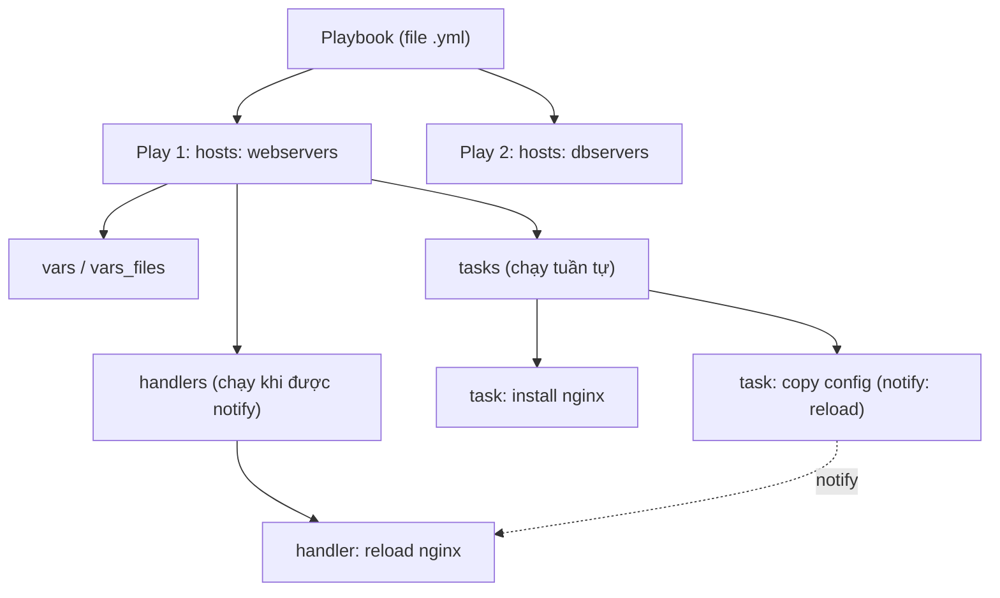

# 🎓 Playbooks & Roles — Cấu trúc, biến, Jinja2 template, tái sử dụng

> **Tác giả:** Mr.Rom\
> **Phiên bản:** v1.0.0\
> **Tạo lúc:** 13/06/2026\
> **Cập nhật:** 13/06/2026\
> **Level:** Basic\
> **Tags:** ansible, playbook, role, jinja2, configuration-management\
> **Yêu cầu trước:** [Ansible Basics](01_ansible-basics.md)

> 🎯 *Ở bài trước bạn đã chạy được playbook đầu tiên — nhưng nó là 1 file dài, copy-paste cho dev rồi sửa tay cho prod. Bài này biến mớ task rời rạc đó thành **role** `webserver` tái dùng được: cùng 1 code, đổi biến là chạy cho cả dev lẫn prod, không drift.*

## 🎯 Sau bài này bạn sẽ

- [ ] Đọc và viết được cấu trúc playbook đầy đủ: plays, tasks, handlers + `notify`, tags, `when`/`loop`/`block`
- [ ] Hiểu **variable precedence** (thứ tự ưu tiên biến) — biết biến nào "thắng" khi trùng tên
- [ ] Dùng được **facts** (`ansible_facts`, `gather_facts`) để lấy thông tin máy đích
- [ ] Viết **Jinja2 template** (`.j2`) với filter, conditional để sinh file config động
- [ ] Tạo **role** đúng cấu trúc thư mục chuẩn (`tasks`/`handlers`/`templates`/`defaults`/`vars`/`meta`)
- [ ] Phân biệt `import_role` vs `include_role`, `import_tasks` vs `include_tasks`
- [ ] Refactor playbook thành role `webserver` chạy chung cho dev/prod

---

## 1️⃣ Vì sao playbook "phẳng" sớm muộn cũng vỡ

Quay lại Acme Shop. Ở bài trước bạn viết 1 playbook `webserver.yml` cài Nginx cho 2 con server dev. Vài tuần sau:

- Sếp bảo dựng thêm **prod** — bạn copy `webserver.yml` thành `webserver-prod.yml`, đổi domain (`server_name`) và bật gzip cho prod.
- Tuần sau team muốn thêm cấu hình gzip — bạn phải sửa **cả 2 file**, lỡ tay quên 1 file là dev với prod lệch nhau (config drift).
- Đồng nghiệp mới vào, mở folder thấy 5 file playbook gần giống nhau, không biết file nào là "thật".

Đây chính là cảnh "copy-paste rồi sửa tay" mà *Configuration Management* sinh ra để diệt. Giải pháp của Ansible là **role** — đóng gói toàn bộ logic cài Nginx (task, handler, template, biến mặc định) vào **1 thư mục tái dùng**, rồi chỉ truyền biến khác nhau cho dev và prod. Sửa logic 1 chỗ, áp dụng mọi nơi.

Nhưng trước khi đóng gói thành role, ta phải hiểu rõ **một playbook đầy đủ gồm những gì** đã.

> 💡 Hiểu cấu trúc playbook trước, ta xem nó lồng nhau ra sao qua sơ đồ bên dưới để hình dung tổng thể.

### Một playbook lồng nhau như thế nào

Một playbook không phải danh sách lệnh phẳng — nó là cấu trúc lồng nhiều cấp. Sơ đồ dưới mô tả quan hệ chứa nhau từ ngoài vào trong:



→ Điểm mấu chốt: **task chạy tuần tự từ trên xuống**, còn **handler chỉ chạy cuối play** và chỉ khi có task `notify` nó — đây là lý do mũi tên `notify` đi từ task sang handler chứ không nằm trong luồng tuần tự.

---

## 2️⃣ Mổ xẻ playbook đầy đủ

Một **playbook** (kịch bản) là 1 file YAML chứa danh sách **play**. Mỗi **play** (màn diễn) ánh xạ một nhóm host (từ inventory) tới một danh sách **task** (tác vụ). Dưới đây là 1 play đầy đủ, ta sẽ tách từng phần ra mổ xẻ:

```yaml
# webserver.yml
- name: Cài và cấu hình Nginx cho web tier
  hosts: webservers
  become: true                  # chạy với quyền sudo (root)
  vars:
    nginx_port: 80
    server_name: acmeshop.vn

  tasks:
    - name: Cài gói nginx
      ansible.builtin.apt:
        name: nginx
        state: present
        update_cache: true

    - name: Đẩy file cấu hình site
      ansible.builtin.template:
        src: nginx-site.conf.j2
        dest: /etc/nginx/sites-available/acmeshop
        mode: "0644"
      notify: Reload nginx          # báo handler chạy cuối play

  handlers:
    - name: Reload nginx
      ansible.builtin.service:
        name: nginx
        state: reloaded
```

→ Play này nói: "Trên nhóm `webservers`, với quyền sudo, hãy cài Nginx rồi đẩy config; nếu config thay đổi thì reload Nginx". Giờ ta soi từng thành phần.

### Play — gắn host với task

Mỗi play bắt đầu bằng `- name:` (mô tả) và bắt buộc có `hosts:` (nhóm host trong inventory). Các thuộc tính hay dùng ở cấp play:

| Thuộc tính | Ý nghĩa |
|---|---|
| `hosts` | Nhóm/host đích, lấy tên từ inventory (vd `webservers`, `all`) |
| `become` | `true` = leo quyền (mặc định thành root qua sudo) |
| `vars` | Biến khai báo ngay trong play |
| `vars_files` | Nạp biến từ file YAML ngoài |
| `gather_facts` | `true`/`false` — có thu thập facts của máy đích không |
| `tasks` | Danh sách task chạy tuần tự |
| `handlers` | Danh sách handler chờ được `notify` |

### Module — đơn vị làm việc thật sự

Mỗi task gọi đúng **1 module** (mô-đun). Ở ví dụ trên là `ansible.builtin.apt`, `ansible.builtin.template`, `ansible.builtin.service`. Tên đầy đủ có dạng `namespace.collection.module` — `ansible.builtin.*` là các module lõi luôn có sẵn. Bạn vẫn viết tắt `apt` được, nhưng dùng tên đầy đủ (FQCN — Fully Qualified Collection Name) là best practice 2026 để tránh nhầm khi cài thêm collection.

🪞 **Ẩn dụ**: Hãy hình dung playbook như một **công thức nấu ăn**. *Play* là một món (món chính, món tráng miệng), *task* là từng bước ("xào hành", "cho nước mắm"), còn *module* là **dụng cụ bếp** cụ thể cho bước đó (chảo, dao, nồi). *Handler* là việc bạn để dành làm cuối ("rửa chảo") — chỉ làm nếu trong lúc nấu thực sự có dùng tới chảo.

### Handlers + `notify` — chạy có điều kiện, gộp lại 1 lần

**Handler** là task đặc biệt: nó *không* chạy theo thứ tự, mà nằm chờ. Một task bình thường khi **thay đổi trạng thái** (changed) và có dòng `notify: <tên handler>` thì sẽ "đánh dấu" handler đó. Cuối play, Ansible chạy mọi handler được đánh dấu **đúng 1 lần**, theo thứ tự khai báo trong khối `handlers`.

Đây là cơ chế cực kỳ quan trọng cho idempotency: nếu file config **không đổi**, task `template` không "changed" → không `notify` → Nginx **không** bị reload vô ích.

> [!IMPORTANT]
> Tên trong `notify` phải khớp **chính xác** (phân biệt hoa thường) với `name` của handler. Gõ sai 1 chữ → handler không chạy, Ansible **không báo lỗi** (mặc định) → bạn tưởng đã reload nhưng thật ra chưa. Đây là bug âm thầm hay gặp nhất với handler.

Bạn có thể `notify` nhiều handler từ 1 task bằng cách dùng list:

```yaml
    - name: Đẩy config nginx
      ansible.builtin.template:
        src: nginx.conf.j2
        dest: /etc/nginx/nginx.conf
      notify:
        - Validate nginx config
        - Reload nginx
```

### `when` — chạy task có điều kiện

`when` nhận một biểu thức (giống Jinja2 nhưng **không** bọc `{{ }}`). Task chỉ chạy khi điều kiện đúng. Ví dụ chỉ cài gói khi đang chạy trên hệ Debian/Ubuntu:

```yaml
    - name: Cài nginx trên họ Debian
      ansible.builtin.apt:
        name: nginx
        state: present
      when: ansible_facts['os_family'] == "Debian"
```

→ `ansible_facts['os_family']` là một *fact* (sẽ nói ở §3). Để ý: trong `when` ta viết thẳng `ansible_facts['os_family']`, không có `{{ }}` — đây là điểm người mới hay nhầm.

### `loop` — lặp qua danh sách

Thay vì viết 5 task cài 5 gói, dùng `loop`. Biến đặc biệt `item` đại diện cho phần tử hiện tại:

```yaml
    - name: Cài các gói phụ trợ
      ansible.builtin.apt:
        name: "{{ item }}"
        state: present
      loop:
        - curl
        - git
        - ufw
```

→ Task này chạy 3 lần, mỗi lần `{{ item }}` là 1 gói. (Riêng module `apt` còn cho phép truyền thẳng cả list vào `name:` để cài 1 lần — nhưng `loop` là pattern tổng quát áp dụng cho mọi module.)

### `block` — gom nhóm task + bắt lỗi

`block` gom nhiều task lại để áp dụng chung điều kiện/quyền, đồng thời hỗ trợ `rescue` (xử lý khi lỗi) và `always` (luôn chạy) — y hệt `try/except/finally`:

```yaml
    - name: Cấu hình firewall an toàn
      block:
        - name: Mở port HTTP
          ansible.builtin.ufw:
            rule: allow
            port: "80"
        - name: Bật ufw
          ansible.builtin.ufw:
            state: enabled
      rescue:
        - name: Báo khi cấu hình firewall lỗi
          ansible.builtin.debug:
            msg: "Cấu hình ufw thất bại — kiểm tra lại thủ công"
      when: ansible_facts['os_family'] == "Debian"
```

→ Nếu bất kỳ task trong `block` lỗi, Ansible nhảy sang `rescue`. `when` đặt ở cấp block áp dụng cho cả nhóm — đỡ lặp lại điều kiện ở từng task.

### `tags` — chạy chọn lọc một phần playbook

Khi playbook dài, đôi lúc bạn chỉ muốn chạy lại phần config mà không cài lại gói. Gắn `tags` rồi lọc bằng `--tags` / `--skip-tags`:

```yaml
    - name: Cài gói nginx
      ansible.builtin.apt:
        name: nginx
        state: present
      tags: [install]

    - name: Đẩy file cấu hình
      ansible.builtin.template:
        src: nginx-site.conf.j2
        dest: /etc/nginx/sites-available/acmeshop
      tags: [config]
```

Chạy chỉ phần config:

```bash
ansible-playbook -i inventory.ini webserver.yml --tags config
```

Kết quả mong đợi (rút gọn):

```
PLAY [Cài và cấu hình Nginx cho web tier] **************************

TASK [Đẩy file cấu hình] ******************************************
changed: [web1.acmeshop.vn]

PLAY RECAP ********************************************************
web1.acmeshop.vn : ok=1    changed=1    unreachable=0    failed=0
```

→ Chỉ task gắn `tags: [config]` chạy; task cài gói bị bỏ qua. Cột `changed=1` báo file config đã đổi (nên handler reload sẽ chạy); `failed=0` là dấu hiệu mọi thứ ổn. Nếu thấy `changed=0` ở lần chạy thứ 2 → đúng tinh thần idempotency, không có gì để sửa nữa.

---

## 3️⃣ Variables — và "ai thắng" khi trùng tên

Biến (variable) cho phép cùng 1 playbook chạy khác nhau theo môi trường. Vấn đề là biến có thể đến từ **rất nhiều nơi**: `vars` trong play, `group_vars/`, `host_vars/`, `-e` trên CLI, `defaults/` của role... Khi 2 nơi cùng định nghĩa `nginx_port`, nơi nào "thắng"?

Ansible giải quyết bằng **variable precedence** (thứ tự ưu tiên) — một danh sách cố định, nguồn ở dưới **đè** nguồn ở trên. Dưới đây là các nguồn phổ biến nhất, xếp từ **ưu tiên thấp → cao** (lược bỏ vài nguồn hiếm dùng để dễ nhớ):

| # | Nguồn biến | Ưu tiên |
|---|---|---|
| 1 | `defaults/main.yml` của role | Thấp nhất — dễ bị đè nhất |
| 2 | `group_vars/all` |  |
| 3 | `group_vars/<nhóm>` |  |
| 4 | `host_vars/<host>` |  |
| 5 | Facts của host (`ansible_facts`) |  |
| 6 | `vars:` khai báo trong play |  |
| 7 | `vars_files` của play |  |
| 8 | `vars/main.yml` của role |  |
| 9 | `set_fact` / `register` |  |
| 10 | `-e` / `--extra-vars` trên CLI | **Cao nhất** — luôn thắng |

> [!WARNING]
> Đây là điểm hay gây "ma": bạn set `nginx_port: 80` trong `defaults/` của role nhưng `host_vars/web-prod.yml` lại có `nginx_port: 8080` → prod chạy 8080 dù bạn "nhớ là đã set 80". Quy tắc vàng: **đặt giá trị mặc định an toàn trong `defaults/`** (ưu tiên thấp, dễ override), **đặt giá trị bắt buộc cứng trong `vars/`** (ưu tiên cao, khó bị đè nhầm).

### Hai điều cần nhớ về precedence

- **`--extra-vars` (`-e`) luôn thắng tất cả** — dùng để ghi đè khẩn cấp khi chạy lệnh, vd `-e "nginx_port=8080"`.
- **`defaults/main.yml` của role yếu nhất** — đây chính là chỗ lý tưởng đặt giá trị mặc định, vì gần như bất kỳ nguồn nào cũng đè được lên nó. Đó là lý do ta sẽ để cấu hình mặc định của role `webserver` vào `defaults/`.

### Khai báo biến theo môi trường — `group_vars`

Cách sạch nhất để dev/prod khác nhau là tách biến ra `group_vars/`. Inventory chia nhóm:

```ini
# inventory.ini
[webservers_dev]
web-dev.acmeshop.vn

[webservers_prod]
web-prod1.acmeshop.vn
web-prod2.acmeshop.vn
```

Rồi đặt biến theo nhóm trong thư mục `group_vars/` (Ansible tự nạp theo tên file = tên nhóm):

```yaml
# group_vars/webservers_dev.yml
enable_gzip: false
server_name: dev.acmeshop.vn
```

```yaml
# group_vars/webservers_prod.yml
enable_gzip: true
server_name: acmeshop.vn
```

→ Cùng 1 playbook, chạy lên nhóm `webservers_dev` thì lấy biến dev, lên `webservers_prod` thì lấy biến prod. Không file nào bị copy-paste.

---

## 4️⃣ Facts — Ansible "khám sức khỏe" máy đích

**Facts** (sự kiện/thông tin máy) là dữ liệu Ansible tự thu thập về máy đích **trước khi chạy task**: hệ điều hành, RAM, số CPU, IP, ổ đĩa... Mặc định mỗi play tự chạy bước `gather_facts` (tương đương module `setup`) ngay đầu.

Bạn truy cập facts qua dictionary `ansible_facts`. Xem thử toàn bộ facts của 1 máy bằng ad-hoc command:

```bash
ansible web-dev.acmeshop.vn -i inventory.ini -m ansible.builtin.setup
```

Kết quả (rút gọn — thực tế rất dài):

```json
"ansible_facts": {
    "ansible_distribution": "Ubuntu",
    "ansible_distribution_version": "22.04",
    "ansible_os_family": "Debian",
    "ansible_processor_vcpus": 4,
    "ansible_memtotal_mb": 7976,
    "ansible_default_ipv4": {
        "address": "10.0.1.21"
    }
}
```

→ Có 2 cách viết để đọc 1 fact, cùng trỏ tới 1 giá trị:

- Kiểu mới (khuyên dùng): `ansible_facts['os_family']`
- Kiểu cũ (vẫn chạy): `ansible_os_family`

Ví dụ đọc số vCPU thật của máy từ facts (giá trị này hợp để set `worker_processes` trong `nginx.conf` **chính** — đây là directive main-context, KHÔNG đặt trong file site/`server`):

```yaml
    - name: Hiện số vCPU phát hiện được
      ansible.builtin.debug:
        msg: "Máy này có {{ ansible_facts['processor_vcpus'] }} vCPU"
```

### Tắt gather_facts khi không cần

Thu thập facts tốn thời gian (phải SSH + chạy script khảo sát mọi máy). Nếu play không dùng fact nào, tắt đi cho nhanh:

```yaml
- name: Play không cần facts
  hosts: all
  gather_facts: false
  tasks:
    - name: Ping thử
      ansible.builtin.ping:
```

> 📖 Có facts rồi, ta dùng chúng để sinh file config động — đó chính là việc của Jinja2 template.

---

## 5️⃣ Jinja2 template — sinh file config động

File config thật ngoài đời không cố định: mỗi env khác nhau domain (`server_name`), bật/tắt gzip, port... Viết tay từng file là quay lại cảnh copy-paste. **Jinja2** (template engine của Python, Ansible dùng làm engine chính) giải quyết: bạn viết **1 file khuôn** đuôi `.j2`, chèn biến vào, Ansible sẽ "điền" biến rồi đẩy file kết quả lên máy đích bằng module `template`.

🪞 **Ẩn dụ**: file `.j2` giống **tờ giấy mời cưới in sẵn** còn chừa chỗ trống — `{{ ten_khach }}` là chỗ trống, Ansible là người điền tên từng khách vào trước khi gửi đi.

Tạo file khuôn `templates/nginx-site.conf.j2`:

```jinja
# File này do Ansible sinh ra — KHÔNG sửa tay
server {
    listen {{ nginx_port }};
    server_name {{ server_name }};

    
    gzip on;
    gzip_types text/plain application/json;
    

    root /var/www/{{ server_name }};
    index index.html;
}
```

Cú pháp Jinja2 cốt lõi gồm 2 loại dấu:

- `{{ ... }}` — **chèn giá trị** (expression). Vd `{{ nginx_port }}` in ra giá trị biến.
- `` — **câu lệnh điều khiển** (statement): `if`, `for`, `set`... Không in ra gì.

### Filter — biến đổi giá trị bằng dấu `|`

**Filter** (bộ lọc) đặt sau dấu `|`, biến đổi giá trị trước khi in. Đây là phần mạnh nhất của Jinja2:

| Filter | Tác dụng | Ví dụ → kết quả |
|---|---|---|
| `default(x)` | Giá trị thay thế khi biến chưa set | `{{ port \| default(80) }}` → `80` |
| `upper` / `lower` | Đổi hoa/thường | `{{ env \| upper }}` → `PROD` |
| `int` / `string` | Ép kiểu | `{{ "8" \| int }}` → `8` |
| `join(',')` | Nối list thành chuỗi | `{{ ips \| join(', ') }}` |
| `length` | Đếm phần tử | `{{ servers \| length }}` → `2` |
| `to_nice_yaml` | In dict/list dạng YAML đẹp | dùng debug |

→ Trong template trên, `enable_gzip | default(false)` nghĩa là: "nếu biến `enable_gzip` chưa được khai báo thì coi như `false`" — nhờ đó template không vỡ khi env nào đó quên set biến này.

### Conditional + loop trong template

Khối `...` ở trên chỉ chèn block `gzip on;` khi `enable_gzip` bật. Bạn cũng lặp được — vd sinh danh sách upstream backend:

```jinja
upstream backend {

    server {{ host }}:8080;

}
```

→ Với `backend_hosts: ["10.0.1.5", "10.0.1.6"]`, Jinja2 sinh ra 2 dòng `server ...:8080;`. Template + loop = sinh config dài tùy số máy mà không viết tay.

Cuối cùng, task đẩy template lên máy đích:

```yaml
    - name: Sinh và đẩy config nginx
      ansible.builtin.template:
        src: nginx-site.conf.j2
        dest: /etc/nginx/sites-available/acmeshop
        mode: "0644"
      notify: Reload nginx
```

→ Module `template` đọc file `.j2`, render với biến + facts hiện tại, ghi kết quả vào `dest`. Nếu nội dung render **giống hệt** file đã có trên máy → task không "changed" → không reload. Đây là idempotency hoạt động đúng.

---

## 6️⃣ Roles — đóng gói để tái dùng

Giờ ta gom tất cả (task, handler, template, biến mặc định) vào **1 role**. **Role** là cách Ansible chuẩn hóa việc đóng gói nội dung tái dùng theo **cấu trúc thư mục cố định**. Ansible tự biết file nào nằm thư mục nào để nạp đúng vai trò — bạn không phải khai báo đường dẫn.

🪞 **Ẩn dụ**: role giống **bộ lego đóng hộp sẵn** — hộp "webserver" có đủ task lắp, template config, biến mặc định. Ai cần web server chỉ việc lấy hộp ra ráp, truyền vài biến, không cần biết bên trong lắp ra sao.

### Cấu trúc thư mục chuẩn của role

Một role đầy đủ có cây thư mục như sau (không bắt buộc đủ hết — chỉ tạo thư mục nào cần):

```
roles/
└── webserver/
    ├── tasks/
    │   └── main.yml        # điểm vào: danh sách task chính
    ├── handlers/
    │   └── main.yml        # các handler (reload, restart...)
    ├── templates/
    │   └── nginx-site.conf.j2   # file .j2, dùng bởi module template
    ├── files/
    │   └── index.html      # file tĩnh, copy nguyên xi bằng module copy
    ├── defaults/
    │   └── main.yml        # biến MẶC ĐỊNH (ưu tiên thấp nhất)
    ├── vars/
    │   └── main.yml        # biến nội bộ (ưu tiên cao, khó đè)
    ├── meta/
    │   └── main.yml        # metadata + dependencies role khác
    └── handlers/
```

| Thư mục | Vai trò | Ưu tiên biến |
|---|---|---|
| `tasks/main.yml` | Điểm vào — task chạy khi gọi role | — |
| `handlers/main.yml` | Handler được `notify` từ task | — |
| `templates/` | File `.j2` cho module `template` (không cần ghi đường dẫn đầy đủ) | — |
| `files/` | File tĩnh cho module `copy` | — |
| `defaults/main.yml` | Biến mặc định | Thấp nhất (dễ override) |
| `vars/main.yml` | Biến cố định của role | Cao (khó override) |
| `meta/main.yml` | Tên tác giả, license, role phụ thuộc | — |

> [!TIP]
> Bên trong role, module `template` và `copy` **tự tìm** trong `templates/` và `files/` của role — bạn chỉ cần ghi `src: nginx-site.conf.j2`, không cần đường dẫn đầy đủ. Đây là "đường tắt" mà role tặng bạn so với playbook phẳng.

### Sinh khung role tự động — `ansible-galaxy init`

Đừng tạo tay từng thư mục. Lệnh `ansible-galaxy init` dựng sẵn toàn bộ skeleton chuẩn:

```bash
ansible-galaxy init roles/webserver
```

Kết quả mong đợi:

```
- Role roles/webserver was created successfully
```

→ Lệnh tạo đủ các thư mục `tasks/ handlers/ templates/ files/ vars/ defaults/ meta/` cùng file `main.yml` rỗng trong mỗi cái. Bạn chỉ việc điền nội dung.

### Cài role có sẵn từ Ansible Galaxy

**Ansible Galaxy** là kho role/collection cộng đồng (như npm của Node). Thay vì tự viết role cài Docker, lấy role có sẵn:

```bash
# cài 1 role từ Galaxy
ansible-galaxy role install geerlingguy.nginx

# hoặc cài hàng loạt từ file requirements.yml
ansible-galaxy install -r requirements.yml
```

File `requirements.yml` khai báo role/collection cần cài (nên commit vào repo để team đồng bộ):

```yaml
# requirements.yml
roles:
  - name: geerlingguy.nginx
    version: "3.1.4"        # ghim version cho ổn định

collections:
  - name: community.general
    version: ">=8.0.0"
```

→ Ghim `version` (như Terraform `~> 5.0` bạn đã thấy) để lần cài sau không bị thay đổi bất ngờ. Role tải về nằm trong `~/.ansible/roles/` mặc định.

---

## 7️⃣ Dùng role: `import_role` vs `include_role`, `import_tasks` vs `include_tasks`

Có nhiều cách "kéo" role/task vào play. Điểm khác biệt cốt lõi nằm ở **thời điểm xử lý**:

- **`import_*` = static (tĩnh)** — Ansible nạp nội dung **lúc phân tích playbook** (parse time), *trước khi* chạy. Tag và `when` ở cấp import sẽ "ngấm" xuống mọi task con.
- **`include_*` = dynamic (động)** — Ansible nạp **lúc chạy tới dòng đó** (runtime). Dùng được với biến chỉ biết lúc runtime và với `loop`.

Cách kinh điển nhất (và đơn giản nhất) để dùng role là khai báo trong khối `roles:` của play — đây là **import tĩnh**:

```yaml
# site.yml
- name: Dựng web tier Acme Shop
  hosts: webservers
  become: true
  roles:
    - webserver          # import tĩnh role webserver
```

Khi cần linh hoạt hơn (gọi role giữa chừng, theo điều kiện), dùng trong `tasks:`:

```yaml
  tasks:
    - name: Gọi role tĩnh (gắn tag ngấm xuống task con)
      ansible.builtin.import_role:
        name: webserver
      tags: [web]

    - name: Gọi role động (theo điều kiện runtime, lặp được)
      ansible.builtin.include_role:
        name: webserver
      when: deploy_web | default(true)
```

Tương tự cho việc tách task ra file riêng trong cùng role/playbook:

| Lệnh | Thời điểm | Dùng với `loop`? | Tag ngấm xuống con? |
|---|---|---|---|
| `import_tasks` | Static (parse time) | ❌ Không | ✅ Có |
| `include_tasks` | Dynamic (runtime) | ✅ Có | ❌ Không (phải gắn riêng) |
| `import_role` | Static (parse time) | ❌ Không | ✅ Có |
| `include_role` | Dynamic (runtime) | ✅ Có | ❌ Không |

> [!NOTE]
> Quy tắc thực dụng: **mặc định dùng `import_*`** (dễ debug, tag hoạt động trực quan). Chỉ chuyển sang `include_*` khi bạn cần `loop` qua role/task hoặc điều kiện chỉ tính được lúc runtime. Đừng trộn lẫn nếu chưa rõ — đa số sự cố "task không chạy / tag không ăn" đến từ việc dùng nhầm cặp này.

---

## 8️⃣ Hands-on — refactor playbook bài 01 thành role `webserver`

Mục tiêu cuối: biến `webserver.yml` phẳng ở bài 01 thành role `webserver`, rồi dùng **cùng role đó** cho cả dev lẫn prod, chỉ khác biến.

### 🛠️ Bước 1: Sinh khung role

```bash
ansible-galaxy init roles/webserver
```

Kết quả:

```
- Role roles/webserver was created successfully
```

### 🛠️ Bước 2: Điền biến mặc định vào `defaults/`

Đây là giá trị an toàn cho dev — prod sẽ override qua `group_vars`. Vì `defaults/` ưu tiên thấp nhất nên rất dễ đè:

```yaml
# roles/webserver/defaults/main.yml
nginx_port: 80
server_name: localhost
enable_gzip: false
```

### 🛠️ Bước 3: Đưa task vào `tasks/main.yml`

Đây là điểm vào của role. Để ý `src:` chỉ ghi tên file — role tự tìm trong `templates/`:

```yaml
# roles/webserver/tasks/main.yml
- name: Cài gói nginx
  ansible.builtin.apt:
    name: nginx
    state: present
    update_cache: true
  when: ansible_facts['os_family'] == "Debian"

- name: Sinh và đẩy config site
  ansible.builtin.template:
    src: nginx-site.conf.j2
    dest: /etc/nginx/sites-available/acmeshop
    mode: "0644"
  notify: Reload nginx

- name: Bật site bằng symlink
  ansible.builtin.file:
    src: /etc/nginx/sites-available/acmeshop
    dest: /etc/nginx/sites-enabled/acmeshop
    state: link
  notify: Reload nginx

- name: Đảm bảo nginx đang chạy và bật khi khởi động
  ansible.builtin.service:
    name: nginx
    state: started
    enabled: true
```

### 🛠️ Bước 4: Handler vào `handlers/main.yml`

```yaml
# roles/webserver/handlers/main.yml
- name: Reload nginx
  ansible.builtin.service:
    name: nginx
    state: reloaded
```

### 🛠️ Bước 5: Template vào `templates/`

```jinja
# roles/webserver/templates/nginx-site.conf.j2
# File do Ansible sinh — KHÔNG sửa tay
server {
    listen {{ nginx_port }};
    server_name {{ server_name }};

    
    gzip on;
    gzip_types text/plain application/json;
    

    root /var/www/{{ server_name }};
    index index.html;
}
```

### 🛠️ Bước 6: Khai báo biến riêng cho prod qua `group_vars`

Inventory chia 2 nhóm (như §3), rồi override biến cho prod:

```yaml
# group_vars/webservers_prod.yml
server_name: acmeshop.vn
enable_gzip: true
```

Dev không cần file riêng — nó dùng đúng giá trị mặc định trong `defaults/`.

### 🛠️ Bước 7: Playbook gọi role — giờ ngắn gọn

Toàn bộ logic đã nằm trong role. Playbook chỉ còn việc gắn host với role:

```yaml
# site.yml
- name: Dựng web tier (dùng chung cho dev và prod)
  hosts: webservers
  become: true
  roles:
    - webserver
```

### 🛠️ Bước 8: Chạy cho dev, rồi cho prod

Cùng 1 `site.yml`, chỉ giới hạn nhóm host bằng `--limit`:

```bash
# dry-run cho dev (--check: không đổi gì thật, chỉ xem sẽ đổi gì)
ansible-playbook -i inventory.ini site.yml --limit webservers_dev --check

# áp dụng thật cho dev
ansible-playbook -i inventory.ini site.yml --limit webservers_dev

# áp dụng cho prod (tự lấy biến prod từ group_vars)
ansible-playbook -i inventory.ini site.yml --limit webservers_prod
```

Kết quả mong đợi khi chạy prod (rút gọn):

```
PLAY [Dựng web tier (dùng chung cho dev và prod)] *****************

TASK [Gathering Facts] *******************************************
ok: [web-prod1.acmeshop.vn]
ok: [web-prod2.acmeshop.vn]

TASK [webserver : Cài gói nginx] *********************************
changed: [web-prod1.acmeshop.vn]
changed: [web-prod2.acmeshop.vn]

TASK [webserver : Sinh và đẩy config site] **********************
changed: [web-prod1.acmeshop.vn]
changed: [web-prod2.acmeshop.vn]

RUNNING HANDLER [webserver : Reload nginx] **********************
changed: [web-prod1.acmeshop.vn]
changed: [web-prod2.acmeshop.vn]

PLAY RECAP *******************************************************
web-prod1.acmeshop.vn : ok=6    changed=4    unreachable=0    failed=0
web-prod2.acmeshop.vn : ok=6    changed=4    unreachable=0    failed=0
```

→ Để ý tên task có tiền tố `webserver :` — đó là dấu hiệu task đến từ role `webserver`. `RUNNING HANDLER` chỉ xuất hiện vì task config đã "changed" và `notify` đã kích hoạt handler. Chạy lại lần nữa → mọi task `ok` và `changed=0`, handler **không** chạy lại (config không đổi) — đúng tinh thần idempotency. Cùng role này, prod render domain `acmeshop.vn` + bật gzip, dev render `dev.acmeshop.vn` + tắt gzip, mà bạn **không sửa một dòng code nào** trong role.

---

## 💡 Cạm bẫy thường gặp & Best practice

### ❌ Cạm bẫy: `notify` sai tên handler → handler im lặng không chạy

- **Triệu chứng**: Đổi config xong chạy playbook, task `changed` nhưng Nginx vẫn dùng config cũ; không có dòng `RUNNING HANDLER`.
- **Nguyên nhân**: Tên trong `notify` không khớp **chính xác** (cả hoa thường) với `name` của handler. Ansible mặc định **không** báo lỗi khi notify một handler không tồn tại.
- **Cách tránh**: Copy nguyên tên handler khi viết `notify`. Bật `force_handlers` hoặc dùng `ansible-lint` để bắt lỗi sớm. Kiểm tra log có dòng `RUNNING HANDLER` không.

### ❌ Cạm bẫy: nhầm `defaults/` với `vars/` của role

- **Triệu chứng**: Đặt giá trị trong `vars/main.yml` rồi cố override qua `group_vars` nhưng không ăn — giá trị vẫn cứng theo role.
- **Nguyên nhân**: `vars/main.yml` ưu tiên **cao hơn** `group_vars`, nên `group_vars` không đè được.
- **Cách tránh**: Giá trị **người dùng nên đổi được** → đặt trong `defaults/` (ưu tiên thấp). Giá trị **nội bộ role không nên đổi** → mới đặt `vars/`.

### ✅ Best practice: một role = một trách nhiệm, đặt mặc định an toàn ở `defaults/`

- **Vì sao**: Role nhỏ, đơn nhiệm (chỉ lo Nginx, hoặc chỉ lo firewall) thì dễ tái dùng, dễ test, ghép lại được. `defaults/` ưu tiên thấp giúp mọi env override thoải mái mà không sửa role.
- **Cách áp dụng**: Mỗi service một role. Biến cấu hình → `defaults/`. Dùng `requirements.yml` (có ghim version) cho role/collection bên ngoài. Mặc định gọi role bằng `import_role`/khối `roles:`, chỉ dùng `include_role` khi thật sự cần loop/runtime.

---

## 🧠 Tự kiểm tra (Self-check)

**Q1.** Handler khác task thường ở điểm nào, và khi nào nó chạy?

<details>
<summary>💡 Đáp án</summary>

Handler là task đặc biệt, **không** chạy theo thứ tự khai báo. Nó chỉ chạy **cuối play** và chỉ khi có ít nhất 1 task `changed` đã `notify` đúng tên nó. Dù nhiều task cùng notify, handler vẫn chỉ chạy **1 lần**. Đây là cơ chế tránh reload/restart service vô ích khi config không đổi.

</details>

**Q2.** Giữa `defaults/main.yml` và `vars/main.yml` của role, nguồn nào ưu tiên cao hơn? Bạn nên đặt biến cấu hình môi trường vào đâu?

<details>
<summary>💡 Đáp án</summary>

`vars/main.yml` ưu tiên **cao hơn** `defaults/main.yml`. Biến cấu hình mà người dùng/môi trường cần override (vd `nginx_port`, `server_name`) nên đặt trong `defaults/` vì nó ưu tiên thấp nhất → `group_vars`, `host_vars`, `-e` đều đè được. `vars/` dành cho giá trị nội bộ role không nên bị đổi.

</details>

**Q3.** `import_role` và `include_role` khác nhau cốt lõi ở đâu? Khi nào bắt buộc dùng `include_role`?

<details>
<summary>💡 Đáp án</summary>

`import_role` là **static** — nạp lúc parse playbook, tag ngấm xuống task con, nhưng **không** dùng được với `loop`. `include_role` là **dynamic** — nạp lúc runtime, dùng được với `loop` và biến chỉ biết lúc chạy, nhưng tag không tự ngấm xuống. Bắt buộc dùng `include_role` khi cần **loop** qua role hoặc gọi role theo điều kiện tính tại runtime.

</details>

**Q4.** Nguồn biến nào có ưu tiên **cao nhất** trong Ansible? Dùng nó như thế nào?

<details>
<summary>💡 Đáp án</summary>

`--extra-vars` (`-e`) trên dòng lệnh — luôn thắng mọi nguồn khác. Vd `ansible-playbook site.yml -e "nginx_port=8080"`. Dùng để ghi đè khẩn cấp/một lần khi chạy, không phù hợp để lưu cấu hình lâu dài (cấu hình lâu dài nên để trong `group_vars`/`defaults`).

</details>

**Q5.** Trong template `.j2`, `{{ ... }}` và `` khác nhau thế nào? `enable_gzip | default(false)` làm gì?

<details>
<summary>💡 Đáp án</summary>

`{{ ... }}` **chèn giá trị** (in ra kết quả của expression). `` là **câu lệnh điều khiển** (`if`, `for`, `set`) — không in ra gì, chỉ điều khiển luồng render. `enable_gzip | default(false)` áp dụng filter `default`: nếu biến `enable_gzip` chưa được khai báo thì coi như `false`, tránh template vỡ khi thiếu biến.

</details>

---

## ⚡ Tra cứu nhanh (Cheatsheet)

| Mục đích | Lệnh / Cú pháp |
|---|---|
| Sinh khung role | `ansible-galaxy init roles/webserver` |
| Cài role từ Galaxy | `ansible-galaxy role install geerlingguy.nginx` |
| Cài theo requirements | `ansible-galaxy install -r requirements.yml` |
| Chạy playbook | `ansible-playbook -i inventory.ini site.yml` |
| Giới hạn host | `ansible-playbook site.yml --limit webservers_prod` |
| Dry-run (xem trước) | `ansible-playbook site.yml --check` |
| Chạy theo tag | `ansible-playbook site.yml --tags config` |
| Bỏ qua tag | `ansible-playbook site.yml --skip-tags install` |
| Ghi đè biến (ưu tiên cao nhất) | `ansible-playbook site.yml -e "nginx_port=8080"` |
| Xem facts của máy | `ansible host -m ansible.builtin.setup` |
| Liệt kê task sẽ chạy | `ansible-playbook site.yml --list-tasks` |

```yaml
# Mẫu task có notify + when + loop
- name: Cài gói
  ansible.builtin.apt:
    name: "{{ item }}"
    state: present
  loop: [nginx, curl, git]
  when: ansible_facts['os_family'] == "Debian"
  notify: Reload nginx
```

```jinja
{# Mẫu Jinja2: chèn, filter, if, for #}
listen {{ nginx_port | default(80) }};
gzip on;
server {{ h }};

```

---

## 📚 Từ Điển Thuật Ngữ (Glossary)

| EN | VN | Giải thích |
|---|---|---|
| Playbook | Kịch bản | File YAML chứa danh sách play — đơn vị tự động hóa của Ansible |
| Play | Màn diễn | Khối ánh xạ 1 nhóm host tới danh sách task |
| Task | Tác vụ | Một bước, gọi đúng 1 module |
| Module | Mô-đun | Đơn vị làm việc thật (apt, template, service...) |
| Handler | Trình xử lý | Task chạy cuối play, chỉ khi được `notify` bởi task đã changed |
| `notify` | Thông báo | Cơ chế task đánh dấu handler cần chạy |
| Tags | Nhãn | Gắn vào task để chạy chọn lọc `--tags`/`--skip-tags` |
| Facts | Thông tin máy | Dữ liệu Ansible tự thu thập về máy đích (`ansible_facts`) |
| `gather_facts` | Thu thập facts | Bước đầu play khảo sát máy đích, tắt được để chạy nhanh |
| Variable precedence | Thứ tự ưu tiên biến | Quy tắc cố định quyết định biến nào "thắng" khi trùng tên |
| Jinja2 | (giữ nguyên) | Template engine Python, Ansible dùng để render `.j2` |
| Filter | Bộ lọc | Hàm biến đổi giá trị sau dấu `\|` trong Jinja2 |
| Role | (giữ nguyên) | Đóng gói task/handler/template/biến theo thư mục chuẩn để tái dùng |
| `defaults/` | Biến mặc định | Thư mục role chứa biến ưu tiên thấp nhất (dễ override) |
| `vars/` | Biến nội bộ | Thư mục role chứa biến ưu tiên cao (khó override) |
| Ansible Galaxy | (giữ nguyên) | Kho role/collection cộng đồng |
| `import_*` | Nạp tĩnh | Xử lý lúc parse playbook (tag ngấm xuống, không loop được) |
| `include_*` | Nạp động | Xử lý lúc runtime (loop được, tag không tự ngấm) |
| Idempotency | Tính bất biến khi lặp | Chạy nhiều lần cho cùng kết quả, không đổi thừa |

---

## 🔗 Liên kết & Tài nguyên

### 🧭 Định hướng lộ trình học

- ⬅️ **Bài trước:** [Ansible Basics — Agentless, inventory, ad-hoc & playbook đầu tiên](01_ansible-basics.md)
- ➡️ **Bài tiếp theo:** [Ansible Vault & quản lý secrets — Mã hoá biến nhạy cảm an toàn](03_vault-and-secrets.md)
- ↑ **Về cụm:** [Configuration Management — README](../../README.md)

### 🧩 Các chủ đề có thể bạn quan tâm

- [Configuration Management là gì? — Chống config drift & snowflake server](00_what-is-configuration-management.md)
- [Ansible vs Chef vs Puppet vs Salt — Chọn đúng & kết hợp với IaC](04_alternatives-and-when-which.md)
- [Terraform Basics — Providers, Resources, Variables](../../../iac/lessons/01_basic/01_terraform-basics.md)

### 🌐 Tài nguyên tham khảo khác

- [Ansible — Roles documentation](https://docs.ansible.com/ansible/latest/playbook_guide/playbooks_reuse_roles.html) — spec chính thức về cấu trúc role
- [Ansible — Variable precedence](https://docs.ansible.com/ansible/latest/playbook_guide/playbooks_variables.html#variable-precedence-where-should-i-put-a-variable) — danh sách precedence đầy đủ
- [Ansible — Jinja2 templating](https://docs.ansible.com/ansible/latest/playbook_guide/playbooks_templating.html) — filter + test + lookup
- [Ansible Galaxy](https://galaxy.ansible.com/) — kho role/collection cộng đồng

---

## 📌 Nhật ký thay đổi (Changelog)

- **v1.0.0 (13/06/2026)** — Bản đầu tiên. Cover: cấu trúc playbook (plays/tasks/handlers + notify/tags/when/loop/block), variable precedence (bảng), facts + gather_facts, Jinja2 template (filter + conditional + loop), role + cấu trúc thư mục chuẩn, `ansible-galaxy init` + cài role từ Galaxy, import vs include role/tasks, hands-on refactor playbook thành role `webserver` tái dùng dev/prod.
