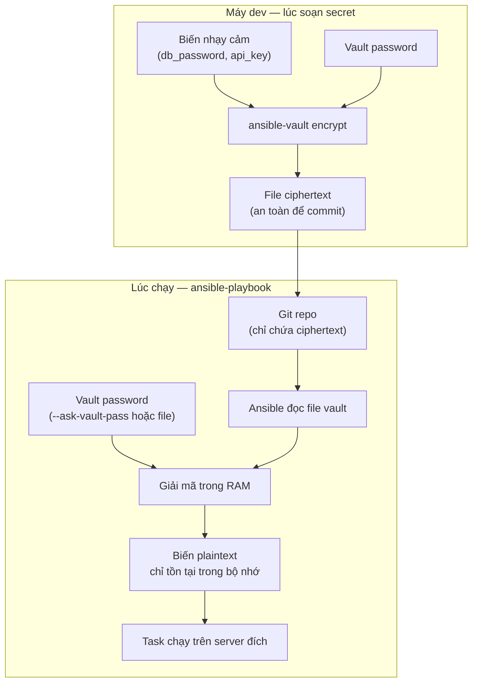

# Ansible Vault & quản lý secrets — Mã hoá biến nhạy cảm an toàn

> **Tác giả:** Mr.Rom\
> **Phiên bản:** v1.0.0\
> **Tạo lúc:** 13/06/2026\
> **Cập nhật:** 13/06/2026\
> **Level:** Basic\
> **Tags:** ansible, ansible-vault, secrets, security, configuration-management\
> **Yêu cầu trước:** [Playbooks & Roles](02_playbooks-and-roles.md)

> 🎯 *Bài trước bạn đã biết đặt biến trong `group_vars/`, render config bằng Jinja2 và tái sử dụng qua role. Nhưng có một loại biến không bao giờ được nằm plaintext trong Git: password DB, API key. Sau bài này bạn sẽ mã hoá chúng bằng `ansible-vault`, chạy playbook với vault password, và biết cách tích hợp vault vào CI/CD mà không lộ secret.*

## 🎯 Sau bài này bạn sẽ

- [ ] Hiểu vì sao secret KHÔNG được commit plaintext, kể cả repo private
- [ ] Dùng được trọn bộ `ansible-vault`: `create`, `edit`, `encrypt`, `decrypt`, `view`, `rekey`
- [ ] Phân biệt mã hoá cả file (`encrypt`) vs mã hoá 1 biến (`encrypt_string`) và biết khi nào dùng cái nào
- [ ] Cung cấp vault password qua `--ask-vault-pass` và `--vault-password-file`
- [ ] Quản lý nhiều môi trường bằng multiple vault IDs (`--vault-id`)
- [ ] Truyền vault password an toàn trong CI/CD và biết khi nào nên chuyển sang HashiCorp Vault / SOPS

---

## Tình huống — Acme Shop suýt lộ password DB

Acme Shop deploy backend bằng một playbook. Trong `group_vars/production.yml`, bạn lỡ viết thẳng:

```yaml
db_password: "Sup3rS3cret!2026"
stripe_api_key: "sk_live_a1b2c3d4e5f6g7h8"
```

Playbook chạy ngon, deploy thành công, bạn `git commit && git push`. Một tuần sau, một dev mới được thêm vào repo. Họ đọc lịch sử Git — và mật khẩu production DB nằm trần trụi ở đó. Tệ hơn: nếu repo bị clone ra ngoài, hoặc một ngày nào đó chuyển từ private sang public (chuyện xảy ra thường xuyên hơn bạn nghĩ), thì `sk_live_...` đó cho phép bất kỳ ai rút tiền qua Stripe.

Vấn đề cốt lõi: **password và config nằm chung một chỗ** (`group_vars/`), nhưng password cần được bảo vệ còn config thì không. Xoá khỏi file hiện tại cũng không cứu được — Git nhớ mọi commit, secret vẫn còn trong history.

Đây chính là lý do `ansible-vault` ra đời.

---

## 1️⃣ ansible-vault là gì?

`ansible-vault` là công cụ đi kèm sẵn trong Ansible (không cần cài thêm) để **mã hoá những file/biến nhạy cảm** trước khi commit. Nội dung được mã hoá bằng *AES-256* (chuẩn mã hoá đối xứng) với một password do bạn đặt. Khi chạy playbook, Ansible hỏi (hoặc đọc) password đó để giải mã trong bộ nhớ — file trên đĩa vẫn ở dạng mã hoá.

🪞 **Ẩn dụ đời thường**: Hãy hình dung `group_vars/` là một chiếc tủ hồ sơ ở văn phòng chung. Phần lớn giấy tờ (config: port, hostname, số replicas) cứ để công khai ai xem cũng được. Nhưng vài tờ chứa mật khẩu két sắt thì bạn bỏ vào **một phong bì niêm phong có khoá số** (`ansible-vault`). Ai cầm được phong bì cũng chỉ thấy giấy nhàu vô nghĩa, trừ khi biết mã khoá. Khi cần dùng, bạn mở khoá, đọc, rồi niêm phong lại.

Vài điểm cần nắm ngay:

- **Mã hoá đối xứng**: chỉ có *một* password vừa để mã hoá vừa để giải mã. Không có "public/private key" như SSH hay GPG. Mất password = mất data.
- **File mã hoá vẫn commit được**: nội dung đã thành ciphertext (chuỗi hex vô nghĩa), commit lên Git an toàn. Cái KHÔNG được commit là **vault password**.
- **Trong suốt với playbook**: bạn vẫn tham chiếu `{{ db_password }}` như biến thường. Ansible tự giải mã lúc runtime — role và task không cần biết biến đó từng được mã hoá.

> [!IMPORTANT]
> Vault password là *chìa khoá duy nhất*. Nếu mất nó, không ai (kể cả HashiCorp/Red Hat) khôi phục được data đã mã hoá. Hãy lưu password vào một password manager hoặc secret manager ngay từ đầu — đừng chỉ nhớ trong đầu.

### File vault trông như thế nào

Để hình dung "ciphertext vô nghĩa" cụ thể là gì, đây là một file đã được `ansible-vault encrypt`. Dòng đầu `$ANSIBLE_VAULT;...` là *header* (dấu hiệu nhận biết) — Ansible đọc dòng này để biết file đã mã hoá và cần giải mã trước khi parse:

```text
$ANSIBLE_VAULT;1.1;AES256
33363438393462343738393439616362373236623761306264363330643539326338
6234653834643834333930393262303962383164306336320a3565376431613161
38663833626562666264333030623264643639353063353438393138616264313964
...
```

Toàn bộ nội dung YAML thật (các biến) nằm bên trong khối hex đó. Khi đã rõ "đầu vào và đầu ra" của vault, ta xem nó nằm ở đâu trong luồng chạy playbook.

> 💡 Hiểu khái niệm rồi, sơ đồ dưới cho thấy vault chen vào luồng chạy playbook ở điểm nào.

### Vault nằm ở đâu trong luồng làm việc

Mã hoá là việc bạn làm *một lần lúc chuẩn bị*, còn giải mã xảy ra *tự động lúc runtime*. Sơ đồ dưới tách 2 thế giới đó: bên trái là máy dev khi soạn secret, bên phải là lúc `ansible-playbook` chạy thật.



→ Điểm mấu chốt: ciphertext đi qua Git, còn vault password đi theo *kênh riêng* (gõ tay hoặc file ngoài repo). Hai thứ này không bao giờ được nằm cùng một chỗ — đó là cả triết lý bảo mật của vault gói gọn trong một câu.

---

## 2️⃣ Bộ lệnh `ansible-vault` — 6 thao tác cốt lõi

`ansible-vault` có 6 sub-command bạn sẽ dùng hằng ngày. Trước khi đi vào từng cái, bảng dưới cho cái nhìn tổng thể để bạn biết "khi nào gọi lệnh nào":

| Lệnh | Mục đích | Dùng khi |
|---|---|---|
| `create` | Tạo file mới và mã hoá ngay | Lần đầu tạo file secret |
| `edit` | Mở file mã hoá để sửa (giải mã tạm trong editor) | Cần đổi giá trị secret |
| `encrypt` | Mã hoá một file plaintext *đã có sẵn* | Lỡ tạo file plaintext, giờ cần mã hoá |
| `decrypt` | Giải mã file về lại plaintext (ghi đè ra đĩa) | Cần xem/sửa hàng loạt, hoặc gỡ vault |
| `view` | Xem nội dung mà KHÔNG ghi plaintext ra đĩa | Chỉ muốn đọc, không sửa |
| `rekey` | Đổi vault password (giải mã bằng pass cũ, mã hoá lại bằng pass mới) | Định kỳ xoay password, hoặc khi nghi lộ |

### 🛠️ `create` — tạo file secret mới cho Acme Shop

Acme Shop cần một file riêng chứa credentials DB cho môi trường production. Ta tạo nó bằng `create` — Ansible sẽ hỏi password 2 lần (để chống gõ nhầm) rồi mở editor mặc định (`$EDITOR`, thường là `vi`/`nano`):

```bash
ansible-vault create group_vars/production/vault.yml
```

Kết quả mong đợi:

```text
New Vault password:
Confirm New Vault password:
```

Sau khi gõ password, editor mở ra một file *trống*. Bạn soạn YAML như bình thường:

```yaml
# Nội dung bạn gõ trong editor (chưa mã hoá khi đang soạn)
vault_db_password: "Sup3rS3cret!2026"
vault_stripe_api_key: "sk_live_a1b2c3d4e5f6g7h8"
```

Khi lưu và thoát editor, Ansible **tự mã hoá** toàn bộ. Mở file ra bằng `cat` bạn chỉ thấy khối `$ANSIBLE_VAULT;1.1;AES256` như ở §1.

> [!TIP]
> Quy ước phổ biến: đặt tên biến trong vault với tiền tố `vault_` (vd `vault_db_password`). Lý do giải thích kỹ ở phần Best practice — tóm gọn: giúp tách bạch "biến nào đến từ vault" và tránh lỗi biến không giải mã được mà không ai nhận ra.

### 🛠️ `edit` — sửa secret đã mã hoá

Khi cần đổi password DB, **đừng** giải mã rồi mã hoá lại thủ công. Dùng `edit`: Ansible giải mã vào một file tạm trong bộ nhớ, mở editor, và mã hoá lại ngay khi bạn lưu:

```bash
ansible-vault edit group_vars/production/vault.yml
```

Nó hỏi password, mở editor với nội dung plaintext, bạn sửa, lưu, thoát — file trên đĩa vẫn luôn ở dạng mã hoá. Đây là cách an toàn nhất để sửa vì plaintext không bao giờ chạm ổ đĩa.

### 🛠️ `view` — xem mà không lộ ra đĩa

Chỉ muốn kiểm tra giá trị mà không sửa? `view` in nội dung ra màn hình (stdout) mà không tạo file plaintext nào:

```bash
ansible-vault view group_vars/production/vault.yml
```

Kết quả (sau khi nhập password):

```text
vault_db_password: "Sup3rS3cret!2026"
vault_stripe_api_key: "sk_live_a1b2c3d4e5f6g7h8"
```

→ Khác `decrypt` ở chỗ: `view` chỉ in ra terminal, đóng terminal là xong. `decrypt` ghi plaintext xuống đĩa — nguy hiểm hơn nhiều.

### 🛠️ `encrypt` — mã hoá file plaintext đã lỡ tạo

Quay lại tình huống đầu bài: bạn đã có sẵn file `group_vars/production/vault.yml` ở dạng plaintext. `encrypt` mã hoá tại chỗ một (hoặc nhiều) file đang ở dạng thường:

```bash
ansible-vault encrypt group_vars/production/vault.yml
```

Kết quả:

```text
New Vault password:
Confirm New Vault password:
Encryption successful
```

> [!CAUTION]
> File plaintext đã lỡ commit vào Git **không được cứu** chỉ bằng `encrypt` ở commit mới — secret vẫn nằm trong lịch sử Git cũ. Phải coi secret đó là *đã lộ*: xoay (rotate) ngay password/API key đó ở phía nhà cung cấp, rồi mới mã hoá giá trị mới.

### 🛠️ `decrypt` — giải mã về plaintext

`decrypt` ghi đè file mã hoá thành plaintext trên đĩa. Dùng khi bạn muốn gỡ bỏ vault hoàn toàn (vd chuyển sang quản lý secret bằng công cụ khác):

```bash
ansible-vault decrypt group_vars/production/vault.yml
```

→ Sau lệnh này file thành plaintext trở lại. **Cẩn thận**: đừng `git commit` ngay sau khi `decrypt` — bạn vừa biến secret thành plaintext. Đây là lệnh dễ gây tai nạn nhất trong bộ.

### 🛠️ `rekey` — đổi vault password

Một dev rời team, hoặc bạn nghi password đã bị lộ. `rekey` đổi password: nhập pass cũ để giải mã, nhập pass mới để mã hoá lại — toàn bộ trong một bước:

```bash
ansible-vault rekey group_vars/production/vault.yml
```

Kết quả:

```text
Vault password:
New Vault password:
Confirm New Vault password:
Rekey successful
```

→ `rekey` nhận nhiều file cùng lúc (`ansible-vault rekey file1.yml file2.yml`) — tiện khi xoay password cho cả project.

> 📖 *Sáu lệnh trên thao tác trên cả file. Nhưng đôi khi bạn chỉ muốn mã hoá đúng MỘT biến giữa một file config công khai — đó là việc của `encrypt_string`.*

---

## 3️⃣ Mã hoá cả file vs mã hoá 1 biến (`encrypt_string`)

Có 2 chiến lược, và chọn đúng cái sẽ quyết định codebase của bạn dễ đọc hay rối.

### Cách A — mã hoá cả file (đã làm ở §2)

Để toàn bộ secret vào một file riêng (vd `group_vars/production/vault.yml`) rồi `encrypt` cả file. Ưu điểm: gọn, tách bạch secret khỏi config. Nhược điểm: `git diff` không cho thấy *biến nào* đổi — cả file là một khối hex, mọi thay đổi trông giống nhau.

### Cách B — mã hoá 1 biến với `encrypt_string`

`encrypt_string` mã hoá đúng *một giá trị* và in ra một chuỗi YAML bạn dán thẳng vào file config bình thường. Phần còn lại của file vẫn plaintext, đọc được. Đây là lệnh hữu ích nhất khi bạn chỉ có 1-2 secret nằm lẫn trong nhiều config công khai:

```bash
ansible-vault encrypt_string 'Sup3rS3cret!2026' --name 'db_password'
```

Kết quả (định dạng đã rút gọn cho dễ đọc):

```text
db_password: !vault |
          $ANSIBLE_VAULT;1.1;AES256
          39653761643833653566353661383933623831...
          6234653834643834333930393262303962383164...
Encryption successful
```

Bạn copy nguyên khối `db_password: !vault | ...` đó dán vào `group_vars/production.yml` ngay cạnh các biến công khai:

```yaml
# group_vars/production.yml — file này KHÔNG mã hoá toàn bộ
app_port: 8080
app_replicas: 3
db_host: "db.acmeshop.internal"

# Chỉ biến này được mã hoá inline:
db_password: !vault |
          $ANSIBLE_VAULT;1.1;AES256
          39653761643833653566353661383933623831...
          6234653834643834333930393262303962383164...
```

Thẻ `!vault` báo cho Ansible biết "giá trị này cần giải mã trước khi dùng". Tới runtime, `{{ db_password }}` cho ra plaintext y như biến thường.

> [!TIP]
> Để tránh lộ secret vào `~/.bash_history`, dùng `--stdin-name` và gõ giá trị qua stdin thay vì truyền trên dòng lệnh:
> ```bash
> ansible-vault encrypt_string --stdin-name 'db_password'
> # gõ giá trị, rồi Ctrl-D để kết thúc
> ```

### Chọn cách nào?

Hai cách không loại trừ nhau, nhưng mỗi cách hợp với một tình huống. Bảng dưới giúp quyết nhanh:

| Tiêu chí | Mã hoá cả file (`encrypt`) | Mã hoá 1 biến (`encrypt_string`) |
|---|---|---|
| Số lượng secret | Nhiều (cả nhóm credentials) | Ít (1-2 biến lẻ) |
| `git diff` có ý nghĩa? | Không — cả file là 1 khối hex | Có — chỉ dòng biến đó đổi |
| Đọc config công khai | Phải `view` mới đọc được | Đọc trực tiếp, secret bị ẩn |
| Rủi ro lộ khi review | Thấp (mọi thứ mã hoá) | Phải cẩn thận không dán nhầm plaintext |
| Khi nào chọn | File `vault.yml` chuyên chứa secret | Vài secret lẫn trong config lớn |

→ Thực hành khuyến nghị cho Acme Shop: **gom secret vào file `vault.yml` riêng** (cách A) làm mặc định, chỉ dùng `encrypt_string` (cách B) cho các secret lẻ tẻ không đáng tạo file riêng.

---

## 4️⃣ Cung cấp vault password khi chạy playbook

Mã hoá xong rồi, giờ làm sao chạy playbook? Ansible cần password để giải mã. Có 2 cách cấp password, dùng cho 2 ngữ cảnh khác nhau: gõ tay (interactive) và đọc từ file (tự động).

### Cách 1 — `--ask-vault-pass` (gõ tay)

Khi chạy trên máy dev, để Ansible hỏi password ngay tại terminal:

```bash
ansible-playbook deploy.yml --ask-vault-pass
```

Kết quả:

```text
Vault password:
PLAY [Deploy Acme Shop backend] ************************************************
...
```

→ Phù hợp cho local: không có file password nằm trên đĩa, ít rủi ro nhất. Bất tiện khi chạy nhiều lần (gõ lại mỗi lần) hoặc trong môi trường tự động (CI không có người gõ).

### Cách 2 — `--vault-password-file` (đọc từ file)

Cho phép Ansible đọc password từ một file ngoài repo. File này chỉ chứa đúng password trên một dòng:

```bash
# Tạo file password — LƯU NGOÀI repo, không bao giờ commit
echo 'Sup3rS3cret!2026' > ~/.vault_pass_acmeshop.txt
chmod 600 ~/.vault_pass_acmeshop.txt

ansible-playbook deploy.yml --vault-password-file ~/.vault_pass_acmeshop.txt
```

→ Không hỏi gì, chạy thẳng. Phù hợp khi chạy lặp lại hoặc bán tự động. Điều kiện sống còn: file đó **phải nằm ngoài thư mục Git** (hoặc ít nhất trong `.gitignore`) và `chmod 600` để chỉ chủ sở hữu đọc được.

> [!IMPORTANT]
> `--vault-password-file` còn nhận một *script thực thi được* thay vì file text. Nếu file có quyền execute, Ansible chạy nó và lấy stdout làm password. Đây là cầu nối để lấy password từ secret manager (vd một script gọi `vault kv get`). Sẽ dùng ở §6.

### Cấu hình mặc định để khỏi gõ flag mỗi lần

Gõ `--vault-password-file ...` mỗi lần khá phiền. Khai báo một lần trong `ansible.cfg` ở gốc project (Ansible sẽ tự dùng nếu không truyền flag):

```ini
# ansible.cfg
[defaults]
vault_password_file = ~/.vault_pass_acmeshop.txt
```

→ Sau đó `ansible-playbook deploy.yml` tự đọc password từ file. Có thể override bằng `--vault-password-file` hoặc `--ask-vault-pass` khi cần.

---

## 5️⃣ Multiple vault IDs — một password cho mỗi môi trường

Acme Shop có 3 môi trường: `dev`, `staging`, `production`. Dùng *chung một* vault password cho cả ba là rủi ro: dev nào cũng biết password production. Giải pháp là **vault IDs** — mỗi môi trường một password riêng, dán nhãn (label) để Ansible biết file nào dùng password nào.

### Mã hoá với nhãn vault ID

Cú pháp `--vault-id LABEL@SOURCE`: `LABEL` là tên gợi nhớ (vd `prod`), `SOURCE` là nơi lấy password (`prompt` để gõ tay, hoặc đường dẫn file).

```bash
# Mã hoá file production với vault ID nhãn "prod"
ansible-vault encrypt --vault-id prod@prompt group_vars/production/vault.yml

# Mã hoá file dev với vault ID nhãn "dev"
ansible-vault encrypt --vault-id dev@prompt group_vars/dev/vault.yml
```

Header file production giờ ghi rõ nhãn `prod`:

```text
$ANSIBLE_VAULT;1.2;AES256;prod
6633653761643833653566353661383933623831663833...
```

→ Để ý version header thành `1.2` (vault có ID) thay vì `1.1`, và có thêm tên nhãn `prod` ở cuối. Nhãn này chỉ là gợi ý cho con người và để Ansible chọn đúng password — nó *không* phải là password.

### Chạy playbook với nhiều vault ID cùng lúc

Khi một lần chạy đụng cả file dev lẫn prod, truyền nhiều `--vault-id`. Ansible thử lần lượt các password cho tới khi giải mã được:

```bash
ansible-playbook deploy.yml \
  --vault-id dev@~/.vault_pass_dev.txt \
  --vault-id prod@~/.vault_pass_prod.txt
```

→ File mã hoá bằng `dev` chỉ giải được bằng password `dev`; tương tự với `prod`. Một dev không có file `~/.vault_pass_prod.txt` thì *không thể* giải mã secret production — đúng nguyên tắc least-privilege (đặc quyền tối thiểu).

> [!NOTE]
> Nhãn vault ID giúp Ansible thử password đúng *trước tiên* cho file có nhãn khớp, giảm thời gian thử-sai. Nhưng kể cả không khớp nhãn, Ansible vẫn thử tất cả password được cung cấp — nên nhãn là để tổ chức, không phải rào chắn cứng.

---

## 6️⃣ Vault trong CI/CD — truyền password không lộ

Trên máy dev bạn gõ password tay. Nhưng pipeline CI/CD (GitHub Actions, GitLab CI...) chạy tự động, không có người gõ. Nguyên tắc vàng: **password đi qua secret store của CI**, được nạp vào *environment variable* lúc chạy, ghi tạm ra file rồi xoá — không bao giờ nằm trong repo.

### Mẫu với GitHub Actions

Trước hết lưu password vào GitHub Secrets (Settings → Secrets and variables → Actions) với tên `ANSIBLE_VAULT_PASSWORD`. Pipeline đọc nó từ biến môi trường, ghi ra file tạm, chạy playbook, rồi dọn dẹp:

```yaml
# .github/workflows/deploy.yml
name: Deploy Acme Shop
on:
  push:
    branches: [main]

jobs:
  deploy:
    runs-on: ubuntu-latest
    steps:
      - uses: actions/checkout@v4

      - name: Cài Ansible
        run: pip install ansible

      - name: Chạy playbook với vault password từ CI secret
        env:
          # 1. Nạp password từ GitHub Secrets vào biến môi trường
          VAULT_PASS: ${{ secrets.ANSIBLE_VAULT_PASSWORD }}
        run: |
          # 2. Ghi password ra file tạm (chỉ tồn tại trong runner)
          printf '%s' "$VAULT_PASS" > /tmp/.vault_pass
          chmod 600 /tmp/.vault_pass

          # 3. Chạy playbook
          ansible-playbook deploy.yml --vault-password-file /tmp/.vault_pass

          # 4. Xoá file password ngay sau khi chạy xong
          rm -f /tmp/.vault_pass
```

→ Runner của GitHub Actions là máy ảo ephemeral (dùng xong huỷ), nên file `/tmp/.vault_pass` biến mất cùng runner. Việc `rm -f` ở bước 4 là lớp bảo vệ thêm phòng khi runner được tái sử dụng. Password không bao giờ in ra log vì GitHub tự mask giá trị của secret.

### Lấy password từ script (secret manager)

Nếu tổ chức đã có secret manager (HashiCorp Vault, AWS Secrets Manager), bạn không muốn copy password vào GitHub Secrets nữa — mà để CI hỏi thẳng secret manager. Tận dụng tính năng "script thực thi" của `--vault-password-file` ở §4: tạo một script in password ra stdout.

```bash
#!/usr/bin/env bash
# vault-pass.sh — Ansible chạy script này và lấy stdout làm vault password
set -euo pipefail

# Gọi HashiCorp Vault lấy password (ví dụ minh hoạ)
vault kv get -field=ansible_vault_pass secret/acmeshop/ci
```

```bash
# Cấp quyền thực thi rồi trỏ Ansible tới script
chmod +x vault-pass.sh
ansible-playbook deploy.yml --vault-password-file ./vault-pass.sh
```

→ Vì file có quyền execute, Ansible *chạy* nó thay vì đọc nội dung text. Password chỉ tồn tại trong RAM của tiến trình, không bao giờ chạm ổ đĩa. Đây là pattern cầu nối giữa `ansible-vault` và một secret manager trung tâm.

---

## 💡 Cạm bẫy thường gặp & Best practice

### ❌ Cạm bẫy: commit nhầm file plaintext hoặc file password

- **Triệu chứng**: secret xuất hiện trong `git log -p`, hoặc file `vault_pass.txt` lọt lên remote.
- **Nguyên nhân**: `ansible-vault decrypt` rồi quên `encrypt` lại; hoặc tạo file password trong thư mục project mà không `.gitignore`.
- **Cách tránh**: thêm vào `.gitignore` ngay từ đầu:
  ```gitignore
  # File chứa vault password — KHÔNG BAO GIỜ commit
  .vault_pass*
  vault_pass*.txt
  *.vault.decrypted
  ```
  Cài thêm một *pre-commit hook* để chặn commit nếu phát hiện chuỗi không phải ciphertext trong file vault. Nếu đã lỡ commit secret: coi như *đã lộ*, rotate (xoay) giá trị đó ngay ở phía nhà cung cấp.

### ❌ Cạm bẫy: vault password yếu / dùng chung mọi nơi

- **Triệu chứng**: password kiểu `ansible123`, hoặc một password duy nhất cho dev/staging/prod.
- **Nguyên nhân**: tiện. Nhưng vault chỉ mạnh bằng password — AES-256 vô dụng nếu password đoán được.
- **Cách tránh**: password dài, ngẫu nhiên (sinh bằng password manager), **mỗi môi trường một password riêng** qua vault IDs (§5). Lưu trong password manager hoặc secret manager, không trong file dùng chung.

### ✅ Best practice: tiền tố `vault_` + lớp biến trung gian

- **Vì sao**: nếu bạn tham chiếu thẳng `{{ db_password }}` mà file vault không được giải mã (vd quên truyền vault password), Ansible báo lỗi mơ hồ. Tách bạch tên giúp truy vết dễ và cho phép kiểm tra trong code review.
- **Cách áp dụng**: trong file vault dùng `vault_db_password`; trong `group_vars/all.yml` (không mã hoá) ánh xạ lại:
  ```yaml
  # group_vars/all.yml — công khai, dễ đọc
  db_password: "{{ vault_db_password }}"
  ```
  Role chỉ dùng `db_password`. Nhìn `all.yml` là biết ngay biến nào đến từ vault.

### ✅ Best practice: một vault mỗi môi trường, không commit password, scale lên thì dùng công cụ chuyên dụng

- **Vì sao**: `ansible-vault` tuyệt cho secret tĩnh trong repo Ansible, nhưng nó *không* xoay secret tự động, không audit log "ai đọc secret nào lúc nào", không cấp quyền theo từng người. Khi tổ chức lớn lên, các nhu cầu đó thành bắt buộc.
- **Cách áp dụng**: cấu trúc `group_vars/<env>/vault.yml` cho từng môi trường, mỗi cái một vault ID. Khi cần audit/rotation/phân quyền chi tiết, chuyển secret động sang **HashiCorp Vault** (truy xuất lúc runtime qua lookup plugin) hoặc dùng **SOPS** (mã hoá file bằng KMS/age, tích hợp Git tốt hơn). Ranh giới đơn giản: secret ít, tĩnh, team nhỏ → `ansible-vault`; secret nhiều, cần xoay tự động + audit → công cụ chuyên dụng.

---

## 🧠 Tự kiểm tra (Self-check)

**Q1.** Xoá biến secret khỏi file rồi commit có đủ để "giấu" secret đã lỡ commit plaintext không?

<details>
<summary>💡 Đáp án</summary>

Không. Git lưu toàn bộ lịch sử — secret vẫn nằm trong các commit cũ và xem được bằng `git log -p`. Cách xử lý đúng: coi secret đó *đã lộ* và **rotate (xoay) nó ở phía nhà cung cấp** (đổi password DB, thu hồi + cấp lại API key). Việc viết lại lịch sử Git (`git filter-repo`) chỉ là bước dọn dẹp phụ, không thay thế việc rotate.

</details>

**Q2.** Khác nhau cốt lõi giữa `ansible-vault view` và `ansible-vault decrypt` là gì? Cái nào an toàn hơn để chỉ xem nhanh?

<details>
<summary>💡 Đáp án</summary>

`view` chỉ in nội dung ra terminal (stdout), **không** ghi plaintext ra đĩa — đóng terminal là hết. `decrypt` **ghi đè** file mã hoá thành plaintext trên đĩa. Để chỉ xem nhanh, `view` an toàn hơn hẳn vì không để lại dấu vết plaintext. `decrypt` chỉ nên dùng khi thực sự muốn gỡ vault hoàn toàn.

</details>

**Q3.** Khi nào nên dùng `encrypt_string` thay vì mã hoá cả file?

<details>
<summary>💡 Đáp án</summary>

Khi chỉ có 1-2 secret lẻ nằm lẫn trong một file config phần lớn là công khai, và bạn muốn `git diff` vẫn cho thấy được những biến công khai nào đã đổi. `encrypt_string` mã hoá đúng một giá trị (gắn thẻ `!vault`), giữ phần còn lại của file đọc được. Nếu có cả nhóm credentials, gom vào một file `vault.yml` riêng rồi `encrypt` cả file gọn hơn.

</details>

**Q4.** Trong CI/CD, vì sao không lưu vault password thẳng trong repo dưới dạng file, mà phải qua secret store của CI?

<details>
<summary>💡 Đáp án</summary>

Vì file trong repo thì ai clone repo cũng đọc được — phá vỡ toàn bộ mục đích mã hoá. Secret store của CI (GitHub Secrets, GitLab CI variables) lưu password mã hoá ngoài repo, chỉ nạp vào *environment variable* lúc job chạy, và tự mask khỏi log. Pipeline ghi password ra file tạm trên runner ephemeral, chạy xong xoá ngay. Như vậy password không bao giờ nằm trong Git và không in ra log.

</details>

**Q5.** Acme Shop có 3 môi trường dev/staging/prod. Cơ chế nào của `ansible-vault` cho phép mỗi môi trường một password riêng, để dev không giải mã được secret production?

<details>
<summary>💡 Đáp án</summary>

**Multiple vault IDs** (`--vault-id LABEL@SOURCE`). Mỗi môi trường mã hoá file vault với một nhãn + password riêng (vd `prod@prompt`, `dev@prompt`). Khi chạy, chỉ ai có đúng password (vd file `~/.vault_pass_prod.txt`) mới giải mã được file mang nhãn đó. Dev không có password prod thì không đọc được secret production — đúng nguyên tắc least-privilege.

</details>

---

## ⚡ Tra cứu nhanh (Cheatsheet)

| Mục đích | Lệnh |
|---|---|
| Tạo file secret mới | `ansible-vault create group_vars/production/vault.yml` |
| Sửa file đã mã hoá | `ansible-vault edit group_vars/production/vault.yml` |
| Mã hoá file có sẵn | `ansible-vault encrypt secrets.yml` |
| Giải mã file (ghi ra đĩa) | `ansible-vault decrypt secrets.yml` |
| Xem mà không ghi ra đĩa | `ansible-vault view secrets.yml` |
| Đổi vault password | `ansible-vault rekey secrets.yml` |
| Mã hoá 1 biến inline | `ansible-vault encrypt_string 'value' --name 'var_name'` |
| Mã hoá 1 biến qua stdin (an toàn) | `ansible-vault encrypt_string --stdin-name 'var_name'` |
| Chạy + gõ password tay | `ansible-playbook deploy.yml --ask-vault-pass` |
| Chạy + đọc password từ file | `ansible-playbook deploy.yml --vault-password-file ~/.vault_pass` |
| Mã hoá với vault ID có nhãn | `ansible-vault encrypt --vault-id prod@prompt vault.yml` |
| Chạy với nhiều vault ID | `ansible-playbook deploy.yml --vault-id dev@file1 --vault-id prod@file2` |
| Đặt password file mặc định | `ansible.cfg` → `[defaults]` → `vault_password_file = ...` |

---

## 📚 Từ Điển Thuật Ngữ (Glossary)

| EN | VN | Giải thích |
|---|---|---|
| Ansible Vault | Két mã hoá Ansible | Công cụ tích hợp sẵn để mã hoá file/biến nhạy cảm bằng AES-256 |
| Secret | Bí mật | Dữ liệu nhạy cảm cần bảo vệ: password, API key, token, private key |
| Plaintext | Văn bản trần | Dữ liệu chưa mã hoá, đọc được trực tiếp |
| Ciphertext | Văn bản mã | Dữ liệu sau khi mã hoá, vô nghĩa nếu không có khoá |
| AES-256 | (giữ nguyên) | Chuẩn mã hoá đối xứng mạnh dùng khoá 256-bit |
| Symmetric encryption | Mã hoá đối xứng | Cùng một khoá để mã hoá và giải mã |
| Vault password | Mật khẩu vault | Chuỗi bí mật dùng để mã hoá/giải mã nội dung vault |
| Vault ID | Định danh vault | Nhãn gắn với một password riêng, cho phép nhiều password trong cùng project |
| `encrypt_string` | Mã hoá chuỗi | Mã hoá đúng một giá trị, in ra YAML gắn thẻ `!vault` |
| Rotate | Xoay (secret) | Thay secret cũ bằng giá trị mới ở phía nhà cung cấp |
| Least-privilege | Đặc quyền tối thiểu | Mỗi người/hệ thống chỉ được cấp đúng quyền tối thiểu cần thiết |
| HashiCorp Vault | (giữ nguyên) | Hệ thống quản lý secret trung tâm, hỗ trợ rotation + audit + phân quyền |
| SOPS | (giữ nguyên) | Công cụ mã hoá file dùng KMS/age, tích hợp Git tốt |
| Secret manager | Trình quản lý bí mật | Dịch vụ lưu trữ + cấp phát secret tập trung (Vault, AWS Secrets Manager...) |

---

## 🔗 Liên kết & Tài nguyên

### 🧭 Định hướng lộ trình học

- ⬅️ **Bài trước:** [Playbooks & Roles — Cấu trúc, biến, Jinja2 template, tái sử dụng](02_playbooks-and-roles.md)
- ➡️ **Bài tiếp theo:** [Ansible vs Chef vs Puppet vs Salt — Chọn đúng & kết hợp với IaC](04_alternatives-and-when-which.md)
- ↑ **Về cụm:** [Configuration Management — README](../../README.md)

### 🧩 Các chủ đề có thể bạn quan tâm

- [Ansible Basics — Agentless, inventory, ad-hoc & playbook đầu tiên](01_ansible-basics.md)
- [Configuration Management là gì? — Chống config drift & snowflake server](00_what-is-configuration-management.md)
- [Terraform Basics — Providers, Resources, Variables](../../../iac/lessons/01_basic/01_terraform-basics.md)

### 🌐 Tài nguyên tham khảo khác

- [Ansible Vault — official docs](https://docs.ansible.com/ansible/latest/vault_guide/index.html) — tài liệu gốc, đầy đủ flag và hành vi
- [Protecting sensitive data with Ansible Vault](https://docs.ansible.com/ansible/latest/vault_guide/vault_encrypting_content.html) — chi tiết `encrypt_string` + multiple vault IDs
- [HashiCorp Vault](https://developer.hashicorp.com/vault) — secret manager khi scale lớn, cần rotation + audit
- [Mozilla SOPS (GitHub)](https://github.com/getsops/sops) — mã hoá file bằng KMS/age, thay thế khi cần tích hợp Git chặt

---

## 📌 Nhật ký thay đổi (Changelog)

- **v1.0.0 (13/06/2026)** — Bản đầu tiên. Cover: vì sao không commit secret plaintext; bộ lệnh `ansible-vault create/edit/encrypt/decrypt/view/rekey`; mã hoá cả file vs `encrypt_string` 1 biến; `--ask-vault-pass` + `--vault-password-file`; multiple vault IDs cho mỗi môi trường; vault trong CI/CD (GitHub Actions + script secret manager); best practice (tiền tố `vault_`, vault per env, không commit password, HashiCorp Vault/SOPS khi scale); cạm bẫy (commit nhầm, password yếu). Hands-on xuyên suốt: mã hoá DB credentials cho Acme Shop deploy.
