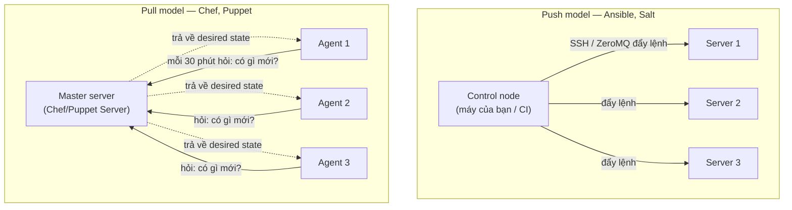
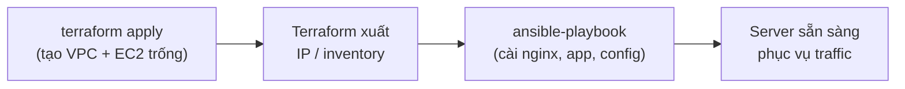
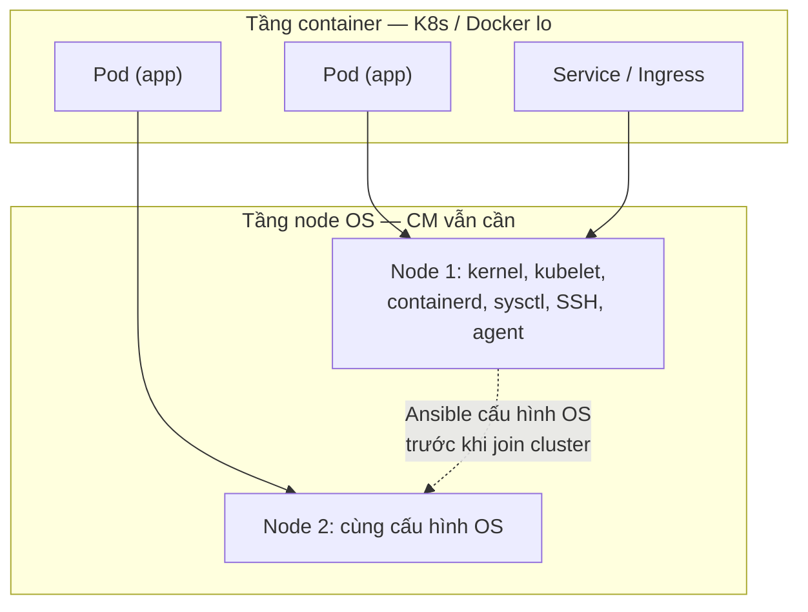

# 🎓 Ansible vs Chef vs Puppet vs Salt — Chọn đúng & kết hợp với IaC

> **Tác giả:** Mr.Rom\
> **Phiên bản:** v1.0.0\
> **Tạo lúc:** 13/06/2026\
> **Cập nhật:** 13/06/2026\
> **Level:** Basic\
> **Tags:** ansible, chef, puppet, salt, configuration-management, iac, immutable-infrastructure\
> **Yêu cầu trước:** [Ansible Vault & quản lý secrets](03_vault-and-secrets.md)

> 🎯 *Ba bài trước bạn đã đi sâu Ansible — inventory, playbook, role, Vault. Nhưng Ansible không phải lựa chọn duy nhất, và CM cũng không đứng một mình. Sau bài này bạn sẽ so sánh được Ansible/Chef/Puppet/Salt, biết khi nào kết hợp CM với Terraform/Packer, hiểu vai trò CM co lại trong thế giới container/K8s, và biết khi nào KHÔNG cần CM nữa.*

## 🎯 Sau bài này bạn sẽ

- [ ] So sánh được 4 công cụ CM lớn (Ansible/Chef/Puppet/Salt) theo ngôn ngữ, push/pull, agent, learning curve, use case
- [ ] Phân biệt **mutable** (sửa tại chỗ) vs **immutable** (thay mới) và biết CM nằm ở phía nào
- [ ] Ghép đúng CM với IaC: Terraform tạo VM → Ansible cấu hình; hoặc Packer + Ansible build golden image
- [ ] Hiểu vai trò CM trong thế giới container/K8s — vì sao co lại nhưng vẫn cần cho node OS, bare-metal, edge, network device
- [ ] Nhận ra khi nào **không cần** CM, và biết lộ trình học tiếp lên intermediate

---

## Mở đầu — vì sao phải so sánh khi đã có Ansible?

Bạn đã viết được playbook, đóng role, mã hoá secret bằng Vault. Một câu hỏi rất thực tế sẽ đến: **tại sao team mình lại chọn Ansible mà không phải Chef hay Puppet?** Hoặc ngược lại — bạn xin việc, công ty đang chạy **Puppet** 8 năm cho 4000 server, và bạn cần hiểu vì sao họ không bỏ Puppet để chuyển sang Ansible.

Đây không phải câu hỏi học thuật. Quyết định chọn công cụ CM kéo theo:

- **Kiến trúc hạ tầng**: có cần dựng server trung tâm (master) không, có phải cài agent lên từng máy không.
- **Chi phí học của team**: học YAML 1 tuần, hay học Ruby DSL 1 tháng.
- **Khả năng tuyển người**: 2026 tìm người biết Ansible dễ hơn tìm người biết Chef.

Và quan trọng hơn cả: từ ~2018 trở đi, **container + immutable infrastructure** đã thay đổi luật chơi. CM không còn là trung tâm vũ trụ DevOps như thời 2012. Bài này giúp bạn nhìn toàn cảnh để chọn đúng — và biết khi nào câu trả lời đúng là *"không dùng CM"*.

---

## 1️⃣ Bốn ông lớn CM — bức tranh tổng thể

Trước khi vào bảng so sánh chi tiết, cần một mental model để không bị rối. Bốn công cụ này khác nhau chủ yếu ở **2 trục**: (1) ngôn ngữ khai báo dùng cái gì, và (2) cách "chạm" tới server là *đẩy lệnh xuống* (push) hay *server tự kéo về* (pull).

🪞 **Ẩn dụ**: Hãy hình dung bạn quản một chuỗi 100 cửa hàng Acme Shop và cần đảm bảo mọi cửa hàng treo đúng bảng giá mới.

- **Push** (Ansible/Salt): bạn — người quản lý trung tâm — *gọi điện cho từng cửa hàng* và đọc danh sách giá. Bạn chủ động, biết ngay ai nghe ai không.
- **Pull** (Chef/Puppet): mỗi cửa hàng có một nhân viên *tự gọi về trung tâm mỗi 30 phút* hỏi "có bảng giá mới không?" rồi tự cập nhật. Bạn không cần gọi, nhưng phải đặt nhân viên (agent) ở mỗi cửa hàng.

Sự khác biệt push/pull này dẫn tới khác biệt về **agent**: pull gần như bắt buộc cài một tiến trình nền (agent/daemon) trên máy đích, còn push thuần (Ansible) chỉ cần SSH — không cài gì thêm.

Hiểu 2 trục đó rồi, bây giờ ta đi vào bảng so sánh đầy đủ.

### Bảng so sánh sâu

Bảng dưới gom 4 công cụ trên những tiêu chí mà người ra quyết định thực sự quan tâm — ngôn ngữ, mô hình kết nối, độ dốc học, và đặc biệt là **trạng thái 2026** (cái nào đang lên, cái nào đang bảo trì). Đọc theo cột để chọn, đọc theo hàng để hiểu từng đặc điểm:

| Tiêu chí | **Ansible** | **Chef** | **Puppet** | **Salt (SaltStack)** |
|---|---|---|---|---|
| Ra đời / chủ sở hữu | 2012 / Red Hat (IBM) | 2009 / Progress Software | 2005 / Perforce (OpenVox fork OSS) | 2011 / Broadcom (VMware) |
| Ngôn ngữ khai báo | YAML (playbook) + Jinja2 | Ruby DSL (recipe/cookbook) | Puppet DSL (manifest, .pp) | YAML + Jinja2 (state) |
| Mô hình mặc định | **Push** (qua SSH) | **Pull** (agent kéo về) | **Pull** (agent kéo về) | **Push** (qua ZeroMQ); pull cũng được |
| Agent trên máy đích | **Agentless** (chỉ cần SSH + Python) | Có agent (`chef-client`) | Có agent (`puppet agent`) | Có **minion** (daemon); hoặc salt-ssh agentless |
| Server trung tâm | Không bắt buộc (control node) | Chef Server | Puppet Server | Salt Master |
| Mô hình lập trình | Procedural (chạy task theo thứ tự) | Procedural (Ruby) | **Declarative** (khai báo state, tự xếp thứ tự) | Declarative (state) |
| Learning curve | **Thấp** — YAML dễ đọc | Cao — phải biết Ruby | Trung bình-cao — DSL riêng | Trung bình |
| Tốc độ trên quy mô lớn | Trung bình (SSH tuần tự/fork) | Tốt (agent song song) | Tốt (agent song song) | **Rất nhanh** (ZeroMQ, real-time) |
| Use case mạnh nhất | App deploy, ad-hoc, hạ tầng vừa, multi-purpose | Hạ tầng lớn, đội có nền Ruby | Compliance, hạ tầng enterprise lớn lâu năm | Fleet lớn cần điều khiển real-time, event-driven |
| Trạng thái 2026 | **Phổ biến nhất**, vẫn tăng | Suy giảm, legacy duy trì | Ổn định ở enterprise cũ; OSS chuyển sang OpenVox | Thị phần nhỏ nhưng vững ở fleet lớn |

> [!NOTE]
> Năm 2025 Puppet (Perforce) thay đổi hướng phát hành bản OSS, khiến cộng đồng lập **OpenVox** — một fork giữ Puppet open source, tương tự cách OpenTofu fork Terraform. Nếu bạn gặp "OpenVox" trong tài liệu 2026, đó chính là Puppet OSS dưới tên mới.

→ Đọc bảng xong, một pattern lộ ra: **Ansible thắng ở độ dễ học và agentless**, còn Chef/Puppet thắng ở *quản lý liên tục quy mô rất lớn* nhờ mô hình agent + pull. Salt là lựa chọn ngách cho ai cần tốc độ real-time. Phần tiếp theo ta mổ xẻ từng khác biệt cốt lõi để bạn hiểu *vì sao*, không chỉ *cái gì*.

---

## 2️⃣ Push vs Pull — khác biệt kiến trúc cốt lõi

Đây là khác biệt định hình mọi thứ còn lại, nên ta dành riêng một phần. Hai mô hình trả lời cùng một câu hỏi — *"làm sao cấu hình mong muốn đến được server?"* — theo hai cách ngược nhau.

Sơ đồ dưới đặt cạnh nhau hai luồng để bạn thấy ai chủ động "chạm" tới ai. Bên trái là push (Ansible/Salt), bên phải là pull (Chef/Puppet):



→ Điểm mấu chốt: trong **push**, control node là bên chủ động — bạn chạy lệnh là server thay đổi *ngay*, nhưng nếu có 5000 server thì control node phải mở 5000 phiên SSH (chậm dần). Trong **pull**, mỗi agent tự kéo về theo lịch — chịu được fleet rất lớn vì gánh nặng phân tán ra các agent, nhưng đổi lại bạn phải *cài và bảo trì agent* trên mọi máy, và thay đổi không tức thì (chờ chu kỳ kế tiếp).

### So sánh nhanh ưu/nhược

Để chốt lại trade-off, bảng dưới tổng hợp khi nào mỗi mô hình tỏa sáng:

| Khía cạnh | Push (Ansible/Salt) | Pull (Chef/Puppet) |
|---|---|---|
| Cài đặt ban đầu | Đơn giản — chỉ cần SSH | Phức tạp — dựng master + cài agent |
| Thay đổi tức thì | ✅ Chạy là đổi ngay | ❌ Chờ chu kỳ pull kế tiếp |
| Chống config drift liên tục | Phải chạy lại định kỳ (cron/CI) | ✅ Agent tự enforce mỗi chu kỳ |
| Quy mô rất lớn (1000+ node) | Chậm dần (SSH); Salt nhanh hơn nhờ ZeroMQ | ✅ Scale tốt, gánh nặng phân tán |
| Máy ephemeral (bật/tắt liên tục) | ✅ Không cần cài agent trước | ❌ Phải bootstrap agent mỗi lần |
| Network/firewall | Chỉ cần port SSH (22) ra | Agent cần gọi về master (port riêng) |

> [!TIP]
> Salt là trường hợp lai thú vị: mặc định **push real-time** qua hàng đợi ZeroMQ (rất nhanh trên fleet lớn) nhưng vẫn có `salt-ssh` để chạy agentless như Ansible. Nếu bạn cần "tốc độ Salt nhưng không muốn cài minion ở vài máy", `salt-ssh` là cửa thoát.

→ Hiểu push/pull rồi, ta xét tiếp một yếu tố quyết định độ dễ tiếp cận: **ngôn ngữ khai báo**.

---

## 3️⃣ Ngôn ngữ khai báo — vì sao Ansible dễ vào nhất

Cùng một việc "đảm bảo nginx được cài và đang chạy", bốn công cụ viết khác nhau hẳn. Đây là lý do lớn nhất khiến learning curve chênh lệch. Ta xem qua từng cú pháp — không cần thuộc, chỉ cần *cảm nhận độ dễ đọc*.

**Ansible** dùng YAML — đọc gần như tiếng Anh, người mới hiểu ngay đoạn này làm gì dù chưa từng học Ansible:

```yaml
# Ansible — playbook (YAML)
- name: Đảm bảo nginx đã cài và đang chạy
  hosts: webservers
  become: true
  tasks:
    - name: Cài gói nginx
      ansible.builtin.apt:
        name: nginx
        state: present

    - name: Bật service nginx và cho chạy khi boot
      ansible.builtin.service:
        name: nginx
        state: started
        enabled: true
```

**Puppet** dùng DSL khai báo riêng (file `.pp`) — declarative thuần, bạn mô tả *state*, Puppet tự xếp thứ tự thực thi:

```puppet
# Puppet — manifest (.pp)
package { 'nginx':
  ensure => installed,
}

service { 'nginx':
  ensure  => running,
  enable  => true,
  require => Package['nginx'],   # chạy sau khi cài gói
}
```

**Chef** dùng Ruby DSL — mạnh và linh hoạt (vì là Ruby thật), nhưng người không biết Ruby sẽ khựng lại:

```ruby
# Chef — recipe (Ruby DSL)
package 'nginx' do
  action :install
end

service 'nginx' do
  action [:enable, :start]
end
```

**Salt** dùng YAML + Jinja2 giống Ansible, nên người quen Ansible đọc được ngay:

```yaml
# Salt — state file (.sls, YAML)
nginx:
  pkg.installed: []
  service.running:
    - enable: true
    - require:
      - pkg: nginx
```

→ Nhìn 4 đoạn cạnh nhau, lý do Ansible chiếm thị phần lớn 2026 rất rõ: **YAML zero-base đọc được**, không cần học một ngôn ngữ lập trình. Chef đòi Ruby — rào cản lớn nhất. Puppet DSL nằm giữa: declarative nên an toàn về thứ tự, nhưng vẫn là cú pháp phải học riêng. Đó là một trong những lý do nhiều team mới sau 2015 mặc định chọn Ansible.

> [!NOTE]
> Một điểm tinh tế: Ansible chạy **procedural** (task chạy lần lượt theo thứ tự bạn viết), còn Puppet/Salt **declarative** (bạn khai báo state, tool tự dựng đồ thị phụ thuộc và xếp thứ tự). Procedural dễ suy luận "chạy gì trước" hơn cho người mới; declarative an toàn hơn ở quy mô lớn vì không phụ thuộc thứ tự viết tay. Cả hai vẫn hướng tới cùng mục tiêu: **idempotency** — chạy bao nhiêu lần kết quả vẫn như nhau.

---

## 4️⃣ Mutable vs Immutable — CM đứng ở đâu?

Giờ đến khái niệm quan trọng nhất để hiểu *tương lai* của CM. Có hai triết lý quản lý server hoàn toàn khác nhau, và CM theo truyền thống thuộc về phía đang co lại.

🪞 **Ẩn dụ**: nghĩ về cách bạn xử lý một chiếc áo bị bẩn.

- **Mutable** (sửa tại chỗ): bạn *giặt và vá* chiếc áo đang mặc. Vẫn là chiếc áo cũ, chỉ sạch hơn. Giặt nhiều lần, vá nhiều chỗ — đến lúc nào đó không ai biết chính xác chiếc áo đang ở tình trạng gì nữa.
- **Immutable** (thay mới): bạn *vứt áo cũ, lấy áo mới giống hệt* từ tủ. Mỗi lần thay là một chiếc áo y nguyên xuất xưởng, không vết vá.

### Mutable — cấu hình tại chỗ (cách CM truyền thống)

Đây là cách Ansible/Chef/Puppet làm "kinh điển": server tồn tại lâu dài (long-lived), bạn SSH vào hoặc agent kéo về để *sửa đổi server đang chạy* — cài thêm gói, đổi config, restart service:

```
Ngày 1:   Tạo VM Ubuntu 22.04
Ngày 7:   Ansible playbook → cài nginx + cấu hình
Ngày 30:  Ansible playbook → thêm app, đổi config nginx
Ngày 90:  Ai đó SSH vào sửa tay /etc/nginx → drift
Ngày 120: "Sao server này hành xử lạ?" — không ai biết state thật
```

→ Vấn đề kinh điển: **config drift** (cấu hình trôi khỏi mong muốn) và **snowflake server** (mỗi server một dị bản không tái tạo được) — đúng những thứ bài 00 của cụm này đã cảnh báo. CM giảm thiểu drift bằng cách chạy lại playbook định kỳ để "kéo" server về state chuẩn, nhưng vẫn không xoá bỏ được tận gốc vì server vẫn là server cũ.

### Immutable — thay mới, không sửa

Triết lý hiện đại: **không sửa server đang chạy**. Mỗi lần thay đổi, bạn *bake* (nướng) một image mới đã chứa sẵn mọi thứ, rồi thay máy cũ bằng máy mới dựng từ image đó:

```
Ngày 1:   Build golden image v1.0 (đã cài sẵn nginx + app) → deploy VM từ image
Ngày 30:  Cần đổi config → build image v2.0 → terminate VM cũ, tạo VM mới từ v2.0
Ngày 60:  Image v3.0 → thay tiếp
```

→ Không bao giờ có drift, vì không ai sửa server đang chạy. Rollback dễ: deploy lại image cũ. Đây là cách **Docker container** hoạt động một cách tự nhiên (image bất biến), và cách **Packer** (HashiCorp) build golden image cho VM.

### Bảng đối chiếu

Bảng dưới tóm tắt vì sao 2026 immutable là mặc định cho hạ tầng mới, nhưng mutable + CM vẫn chưa biến mất:

| Khía cạnh | Mutable (CM sửa tại chỗ) | Immutable (golden image / container) |
|---|---|---|
| Cập nhật | Sửa server đang chạy | Thay server bằng máy mới |
| Config drift | Có nguy cơ — cần chạy lại để enforce | Gần như không |
| Rollback | Khó (gỡ thay đổi từng phần) | Dễ (deploy lại image cũ) |
| Tốc độ thay đổi nhỏ | Nhanh (chỉ sửa cái cần) | Chậm hơn (build lại cả image) |
| Hợp với | VM lâu dài, bare-metal, thiết bị vật lý | Container, cloud auto-scaling, CI/CD |
| Công cụ | Ansible/Chef/Puppet/Salt | Docker, Packer + Ansible, K8s |

> [!IMPORTANT]
> CM **không chết** trong thế giới immutable — nó *chuyển vai*. Thay vì sửa server đang chạy, Ansible giờ thường được dùng để **build chính cái golden image** đó (Packer gọi Ansible lúc bake). Phần 6 sẽ chỉ rõ combo này.

---

## 5️⃣ Combo đúng — CM kết hợp với IaC

Đây là phần thực dụng nhất. Trong bài [IaC là gì](../../../iac/lessons/01_basic/00_what-is-iac.md) bạn đã thấy IaC (Terraform) lo phần *cung cấp hạ tầng* (tạo VM, mạng, DB), còn CM lo phần *cấu hình bên trong máy*. Hai thứ này **bổ sung nhau**, không thay thế nhau. Có hai cách ghép phổ biến, mỗi cách phục vụ một triết lý khác nhau.

### Cách 1 (mutable): Terraform tạo VM → Ansible cấu hình

Đây là pipeline cổ điển và vẫn rất phổ biến cho hạ tầng VM. Terraform dựng hạ tầng trống, rồi Ansible vào "trang trí" bên trong từng máy:



→ Trình tự rõ ràng: Terraform biết *hạ tầng nào tồn tại*, Ansible biết *bên trong mỗi máy có gì*. Mấu chốt nối hai bên là **inventory động**: Terraform tạo IP, Ansible cần biết IP đó để SSH vào.

Cách nối thực tế nhất là dùng plugin inventory động `amazon.aws.aws_ec2` để Ansible tự đọc danh sách EC2 từ tag, không cần copy-paste IP:

```yaml
# inventory_aws_ec2.yml — inventory động đọc EC2 theo tag
plugin: amazon.aws.aws_ec2
regions:
  - us-east-1
filters:
  # Chỉ lấy các instance Terraform đã gắn tag này
  tag:Project: Acmeshop
  instance-state-name: running
keyed_groups:
  # Tự gom nhóm theo tag Role (web, db, ...)
  - key: tags.Role
    prefix: role
```

Sau đó chạy như bình thường, Ansible tự khám phá host từ AWS:

```bash
# 1. Terraform dựng hạ tầng và gắn tag Project=Acmeshop, Role=web
terraform apply

# 2. Ansible đọc inventory động, cấu hình mọi máy nhóm role_web
ansible-playbook -i inventory_aws_ec2.yml site.yml
```

→ Không hardcode IP — máy mới Terraform tạo (cùng tag) sẽ tự xuất hiện trong inventory lần chạy kế tiếp. Đây là mô hình **mutable hợp lý**: Terraform lo vòng đời máy, Ansible lo cấu hình, cả hai đều là code trong git.

> [!WARNING]
> Đừng để Terraform và Ansible "giẫm chân" nhau. Quy tắc an toàn: **Terraform sở hữu hạ tầng** (máy, mạng, security group), **CM sở hữu phần mềm bên trong** (gói, config file, service). Nếu cả hai cùng quản một thứ (ví dụ cùng mở port firewall), bạn sẽ có drift khó debug.

### Cách 2 (immutable): Packer + Ansible build golden image

Đây là cách "đời mới" hơn, đi theo triết lý immutable. Thay vì cấu hình máy *sau khi* nó chạy, bạn nướng sẵn mọi thứ vào một image. **Packer** dựng máy tạm, gọi **Ansible** vào cấu hình, rồi chụp lại thành AMI bất biến:

```hcl
# acme-web.pkr.hcl — Packer template build AMI bằng Ansible
packer {
  required_plugins {
    amazon = {
      source  = "github.com/hashicorp/amazon"
      version = "~> 1.3"
    }
    ansible = {
      source  = "github.com/hashicorp/ansible"
      version = "~> 1.1"
    }
  }
}

source "amazon-ebs" "web" {
  region        = "us-east-1"
  instance_type = "t3.medium"
  ami_name      = "acme-web-{{timestamp}}"
  ssh_username  = "ubuntu"

  source_ami_filter {
    filters = {
      name = "ubuntu/images/hvm-ssd/ubuntu-jammy-22.04-amd64-server-*"
    }
    owners      = ["099720109477"]   # Canonical
    most_recent = true
  }
}

build {
  sources = ["source.amazon-ebs.web"]

  # Provisioner Ansible — chính playbook bạn đã viết ở các bài trước
  provisioner "ansible" {
    playbook_file = "./site.yml"
  }
}
```

Build image bằng một lệnh:

```bash
# Packer dựng VM tạm → chạy Ansible cấu hình → chụp thành AMI → xoá VM tạm
packer build acme-web.pkr.hcl
```

→ Kết quả là một AMI bất biến đã chứa sẵn nginx + app + config. Sau đó Terraform chỉ việc dùng AMI đó dựng auto-scaling group — server mới *bật lên là đã sẵn sàng*, không cần SSH cấu hình gì thêm. Ansible vẫn là công cụ cấu hình, nhưng vai trò chuyển từ *"sửa máy chạy"* sang *"build image"*.

### Hai combo, khi nào dùng cái nào

| Tiêu chí | Terraform → Ansible (mutable) | Packer + Ansible (immutable) |
|---|---|---|
| Triết lý | Cấu hình máy sau khi tạo | Nướng config vào image trước |
| Thời gian boot máy mới | Chậm (phải chạy playbook lúc boot) | Nhanh (image đã sẵn sàng) |
| Hợp với auto-scaling | Kém (máy mới chờ cấu hình) | ✅ Tốt (scale tức thì) |
| Drift | Có thể (server bị sửa sau đó) | Không (server bất biến) |
| Độ phức tạp setup | Thấp hơn | Cao hơn (thêm bước build image) |
| Khi chọn | Hạ tầng VM nhỏ/vừa, thay đổi thường xuyên | Fleet cần scale nhanh, đề cao ổn định |

---

## 6️⃣ CM trong thế giới container & K8s — co lại nhưng chưa chết

Câu hỏi lớn của 2026: *"Mọi thứ chạy container và K8s rồi, còn cần CM làm gì?"* Câu trả lời ngắn: **vai trò CM co lại đáng kể, nhưng vẫn có những góc container không với tới**.

### Vì sao container "ăn" bớt phần việc của CM

Container image **bản chất đã immutable** — bạn build một `Dockerfile`, image đó chứa sẵn app + thư viện + config, không ai sửa nó lúc chạy. Đúng triết lý immutable ở phần 4. Vì thế:

- Cấu hình **bên trong app** → giờ là việc của `Dockerfile` + biến môi trường, không phải Ansible.
- Điều phối nhiều container, self-heal, scale → việc của **K8s**, không phải CM.

Nói cách khác, `Dockerfile` đã thay thế vai trò "cấu hình phần mềm bên trong" mà Ansible từng nắm. Đây là lý do bài IaC kết luận *"all-container thì không cần Ansible"*.

### Nhưng K8s phải chạy trên cái gì đó

Đây là điểm nhiều người mới quên: **K8s không lơ lửng trên không**. Nó chạy trên các node — và bản thân các node đó là server thật (VM hoặc bare-metal) cần cấu hình OS. Sơ đồ dưới chỉ rõ lằn ranh: phần nào là việc của K8s/container, phần nào CM vẫn phải lo.



→ Ranh giới rất rõ: **trên lằn ranh là container** (K8s lo), **dưới lằn ranh là OS của node** (CM vẫn lo). Cài kubelet, containerd, tinh chỉnh `sysctl`, vá kernel, cấu hình SSH hardening trên 50 node bare-metal — đó vẫn là đất diễn của Ansible/Puppet.

### Những góc CM vẫn không thể thiếu (2026)

CM giữ vững giá trị ở những nơi container không chạm tới được:

| Vùng đất | Vì sao container/K8s không thay được CM |
|---|---|
| **Node OS** của cluster | Phải cài kubelet/containerd, vá kernel, tinh chỉnh `sysctl` *trước khi* node join K8s |
| **Bare-metal** (máy vật lý) | Không có "image" để thay mới như cloud VM — phải cấu hình OS tại chỗ |
| **Edge / IoT** | Hàng nghìn thiết bị ở xa, băng thông thấp — pull-based (Puppet/Salt) hoặc Ansible định kỳ |
| **Network device** | Switch/router/firewall (Cisco, Juniper) — Ansible có module mạng chuyên dụng, không "container hoá" được |
| **Hạ tầng legacy** | App cũ trên VM chưa container hoá — vẫn cần CM cấu hình |
| **Bootstrap cluster** | Tự dựng K8s on-prem (kubeadm) cần CM chuẩn bị mọi node trước |

> [!NOTE]
> Ansible có hơn một nghìn module, trong đó cả nhóm module mạng (`cisco.ios`, `arista.eos`, `junipernetworks.junos`...). Đây là lý do Ansible vẫn là vua ở mảng **network automation** — bạn không thể đóng gói một switch Cisco vật lý vào container.

→ Tóm lại: nếu hạ tầng của bạn **100% container trên cloud managed K8s** (EKS/GKE/AKS), bạn có thể gần như không cần CM. Nhưng khoảnh khắc bạn chạm vào *node OS, bare-metal, edge, hay thiết bị mạng*, CM quay lại làm trung tâm.

---

## 7️⃣ Khi nào KHÔNG cần CM

Một kỹ năng quan trọng là biết *khi nào không dùng* một công cụ. Thêm CM khi không cần chỉ làm hệ thống phức tạp thừa. Dưới đây là các tình huống bạn nên cân nhắc bỏ qua CM:

- **Hạ tầng 100% container trên K8s managed**: `Dockerfile` lo cấu hình app, K8s lo điều phối. Node do cloud provider quản (EKS/GKE/AKS managed node). → CM gần như thừa.
- **Serverless thuần** (Lambda, Cloud Run, Cloudflare Workers): không có server nào để bạn cấu hình. → Không có chỗ cho CM.
- **Một vài server, hiếm khi đổi**: 1-2 VM cài tay một lần rồi để yên. Dựng cả Puppet Server cho 2 máy là *over-engineering*. → Một script bash + tài liệu là đủ (dù mất lợi ích idempotency).
- **Immutable hoàn toàn với Packer**: nếu mọi thay đổi đều đi qua build image mới (Packer + Ansible chỉ chạy lúc bake), thì *runtime* không cần CM nữa — Ansible chỉ sống trong pipeline build.

→ Quy tắc ngón tay cái: **CM tỏa sáng khi bạn có nhiều server mutable, lâu dài, thay đổi định kỳ, cần chống drift**. Càng dịch về phía *ít server / immutable / managed*, nhu cầu CM càng giảm. Đừng thêm CM chỉ vì "ai cũng dùng".

> [!WARNING]
> Cạm bẫy ngược lại cũng nguy hiểm: **bỏ CM khi thật ra vẫn cần**. Nhiều team "all-in K8s" quên rằng node OS, máy bastion, CI runner vẫn là server mutable cần cấu hình nhất quán — rồi rơi vào đúng snowflake server mà họ tưởng đã thoát.

---

## 8️⃣ Chọn công cụ nào — cây quyết định

Gom mọi thứ ở trên lại thành một bảng quyết định thực dụng. Cột "Khi chọn" là điều bạn thực sự cần khi đứng trước quyết định kiến trúc:

| Tình huống của bạn | Nên chọn |
|---|---|
| Team mới, hạ tầng vừa, ưu tiên dễ học, multi-purpose | **Ansible** (mặc định 2026) |
| Cần cấu hình network device (switch/router) | **Ansible** (module mạng mạnh) |
| Build golden image kết hợp Packer | **Ansible** (provisioner sẵn) |
| Fleet rất lớn (1000+ node) cần điều khiển real-time, event-driven | **Salt** |
| Enterprise lớn, compliance nặng, đã chạy nhiều năm | **Puppet** (giữ nguyên) hoặc **OpenVox** (OSS) |
| Đội đã có nền Ruby mạnh, hạ tầng lớn | **Chef** (nhưng cân nhắc kỹ — đang suy giảm) |
| Hạ tầng 100% container trên K8s managed | **Không CM** — Dockerfile + K8s |
| Serverless thuần | **Không CM** |

→ Với người học mới năm 2026, lời khuyên thẳng thắn: **học Ansible trước** (dễ vào, phổ biến nhất, tuyển dụng nhiều). Hiểu sâu một công cụ rồi thì các công cụ khác chỉ là khác cú pháp — mọi khái niệm cốt lõi (idempotency, declarative state, inventory, push/pull) đều dùng chung.

---

## 9️⃣ Lộ trình học tiếp — lên Intermediate

Bạn vừa đóng cụm **basic** của Configuration Management: hiểu CM là gì, dùng được Ansible (inventory, playbook, role, Jinja2), quản secret bằng Vault, và giờ là chọn đúng công cụ + ghép với IaC. Chặng tiếp theo đào sâu vào vận hành production:

```
Chặng Intermediate — gợi ý
  ☐ Dynamic inventory chuyên sâu (AWS/GCP/Azure plugin, group_vars/host_vars)
  ☐ Ansible Galaxy + collections — tái dùng role cộng đồng
  ☐ Tối ưu tốc độ: fact caching, pipelining, free strategy, mitogen
  ☐ Testing playbook: ansible-lint, Molecule, kiểm thử idempotency
  ☐ Ansible trong CI/CD: chạy playbook từ GitHub Actions / GitLab CI
  ☐ AWX / Ansible Automation Platform — UI, RBAC, scheduling tập trung
  ☐ Event-Driven Ansible — phản ứng tự động theo sự kiện hạ tầng
  ☐ Kết hợp sâu với Terraform: inventory động + Packer pipeline production
```

→ Sau chặng intermediate, bạn vận hành được CM ở quy mô team thật: có test, có CI, có quản lý tập trung — không còn chạy playbook tay từ laptop.

---

## 💡 Cạm bẫy thường gặp & Best practice

### ❌ Cạm bẫy: Chọn công cụ theo "trend" thay vì theo bài toán

- **Triệu chứng**: Team dựng cả Puppet Server + agent cho đúng 3 VM hiếm khi đổi, hoặc nhồi Ansible vào hạ tầng đã 100% container.
- **Nguyên nhân**: Chọn vì "công ty lớn dùng" / "nghe nói mạnh", không xét quy mô và mô hình hạ tầng thực tế.
- **Cách tránh**: Bắt đầu từ câu hỏi *"hạ tầng của mình mutable hay immutable, bao nhiêu server, đổi thường xuyên không?"* rồi mới chọn. Ít server → script. Nhiều VM mutable → Ansible. Fleet khổng lồ pull → Puppet/Salt. All-container → có thể bỏ CM.

### ❌ Cạm bẫy: Terraform và Ansible cùng quản một thứ

- **Triệu chứng**: `terraform plan` báo thay đổi firewall mỗi lần, dù bạn không sửa gì — vì Ansible cũng đang chỉnh cùng rule đó.
- **Nguyên nhân**: Không phân định rạch ròi ai sở hữu cái gì giữa IaC và CM.
- **Cách tránh**: Terraform sở hữu **hạ tầng** (máy, mạng, security group); CM sở hữu **phần mềm trong máy** (gói, config, service). Một resource chỉ có một "chủ".

### ✅ Best practice: Học sâu một công cụ trước khi so sánh tiếp

- **Vì sao**: Mọi công cụ CM chia sẻ cùng khái niệm cốt lõi — idempotency, declarative/procedural, inventory, push/pull. Hiểu sâu một cái (Ansible) thì học cái thứ hai chỉ là đổi cú pháp.
- **Cách áp dụng**: Thành thạo Ansible (4 bài cụm này) trước. Khi gặp Puppet/Chef ở công ty, ánh xạ khái niệm: playbook ↔ manifest, role ↔ cookbook, task ↔ resource.

### ✅ Best practice: Dịch dần về phía immutable khi có thể

- **Vì sao**: Immutable (golden image / container) loại bỏ tận gốc config drift và snowflake server — vấn đề mà CM mutable chỉ *giảm thiểu* chứ không xoá hẳn.
- **Cách áp dụng**: Giữ Ansible nhưng chuyển vai trò: thay vì sửa server đang chạy, dùng Ansible làm provisioner cho Packer để build golden image. Server runtime trở thành bất biến.

---

## 🧠 Tự kiểm tra (Self-check)

**Q1.** Khác biệt cốt lõi giữa **push** (Ansible/Salt) và **pull** (Chef/Puppet) là gì? Mô hình nào cần cài agent?

<details>
<summary>💡 Đáp án</summary>

**Push**: control node chủ động đẩy lệnh xuống server (Ansible qua SSH, Salt qua ZeroMQ) — thay đổi tức thì, không cần cài agent (Ansible chỉ cần SSH + Python). **Pull**: mỗi server có agent tự kéo desired state về từ master theo chu kỳ (Chef `chef-client`, Puppet `puppet agent`) — phải cài + bảo trì agent, thay đổi không tức thì (chờ chu kỳ) nhưng tự enforce chống drift liên tục và scale tốt ở fleet rất lớn. Pull bắt buộc agent; push thuần thì không.

</details>

**Q2.** Vì sao Ansible có learning curve thấp hơn Chef rõ rệt?

<details>
<summary>💡 Đáp án</summary>

Ansible dùng **YAML** (playbook) — đọc gần như tiếng Anh, không cần biết ngôn ngữ lập trình. Chef dùng **Ruby DSL** (recipe/cookbook) — phải biết Ruby mới viết và đọc thành thạo. Người mới zero-base vào Ansible viết được task ngay; vào Chef phải học Ruby trước. Đây là một lý do lớn khiến Ansible chiếm thị phần lớn nhất 2026.

</details>

**Q3.** CM truyền thống (Ansible sửa server đang chạy) thuộc mô hình mutable hay immutable? Cách nào khắc phục triệt để config drift?

<details>
<summary>💡 Đáp án</summary>

CM sửa tại chỗ thuộc **mutable** — server lâu dài, bị sửa nhiều lần, có nguy cơ drift; CM chỉ *giảm thiểu* bằng cách chạy lại playbook định kỳ để kéo về state chuẩn. Khắc phục triệt để là chuyển sang **immutable**: build golden image (Packer + Ansible) hoặc container (Docker), rồi thay máy mới thay vì sửa máy cũ. Không ai sửa server đang chạy → không có drift.

</details>

**Q4.** Trong combo Terraform + Ansible, ai nên sở hữu cái gì? Vì sao không được để cả hai quản cùng một resource?

<details>
<summary>💡 Đáp án</summary>

**Terraform sở hữu hạ tầng** (máy, mạng, security group); **Ansible sở hữu phần mềm bên trong máy** (gói, config file, service). Nếu cả hai cùng quản một thứ (ví dụ cùng mở một port firewall), chúng sẽ "giẫm chân": `terraform plan` báo drift mỗi lần vì Ansible đã đổi cấu hình đó — gây thay đổi qua lại khó debug. Mỗi resource chỉ nên có một "chủ".

</details>

**Q5.** Hạ tầng đã 100% chạy container trên EKS managed. Còn chỗ nào cần CM không?

<details>
<summary>💡 Đáp án</summary>

Với **EKS managed** (cloud lo node), cấu hình app nằm trong `Dockerfile`, điều phối do K8s lo → CM gần như thừa cho phần này. Nhưng vẫn cần xét: node OS nếu **self-managed** (cài kubelet/containerd, `sysctl`, vá kernel), máy **bastion / CI runner / VPN gateway** vẫn là server mutable, hạ tầng **bare-metal / edge / network device** nếu có. Nếu thật sự *mọi thứ* là container trên node do cloud quản và không có máy phụ trợ nào, thì có thể bỏ CM. Khoảnh khắc chạm vào node OS hay bare-metal, CM quay lại.

</details>

---

## ⚡ Tra cứu nhanh (Cheatsheet)

### So sánh 4 công cụ trong 1 phút

| | Ngôn ngữ | Mô hình | Agent | Learning curve | 2026 |
|---|---|---|---|---|---|
| **Ansible** | YAML + Jinja2 | Push (SSH) | Agentless | Thấp | Phổ biến nhất |
| **Chef** | Ruby DSL | Pull | Có agent | Cao | Suy giảm |
| **Puppet** | Puppet DSL | Pull | Có agent | Trung-cao | Enterprise legacy / OpenVox |
| **Salt** | YAML + Jinja2 | Push (ZeroMQ) | Có minion (hoặc salt-ssh) | Trung bình | Fleet lớn ngách |

### Combo CM + IaC

```bash
# Mutable: Terraform tạo VM → Ansible cấu hình (inventory động)
terraform apply
ansible-playbook -i inventory_aws_ec2.yml site.yml

# Immutable: Packer + Ansible build golden image → Terraform dùng AMI
packer build acme-web.pkr.hcl
terraform apply        # dùng AMI vừa build cho auto-scaling group
```

### Chọn nhanh

```
Team mới / hạ tầng vừa / network device   → Ansible
Build golden image                         → Packer + Ansible
Fleet 1000+ node real-time                 → Salt
Enterprise legacy compliance               → Puppet / OpenVox
100% container trên K8s managed            → không CM (Dockerfile + K8s)
Serverless thuần                           → không CM
```

---

## 📚 Từ Điển Thuật Ngữ (Glossary)

| EN | VN | Giải thích |
|---|---|---|
| Configuration Management (CM) | Quản lý cấu hình | Tự động hoá cài đặt + cấu hình phần mềm trên server |
| Push model | Mô hình đẩy | Control node chủ động đẩy lệnh xuống máy đích (Ansible, Salt) |
| Pull model | Mô hình kéo | Agent trên máy tự kéo desired state về từ master (Chef, Puppet) |
| Agentless | Không agent | Không cài tiến trình nền trên máy đích — Ansible chỉ cần SSH + Python |
| Agent / minion | Tiến trình nền | Daemon chạy trên máy đích để nhận/thực thi cấu hình (Chef, Puppet, Salt) |
| Master / server | Server trung tâm | Máy lưu desired state để agent kéo về (Chef Server, Puppet Server, Salt Master) |
| Declarative | Khai báo | Mô tả *trạng thái mong muốn*, tool tự xếp thứ tự (Puppet, Salt) |
| Procedural | Thủ tục | Chạy task lần lượt theo thứ tự viết (Ansible) |
| Idempotency | Tính bất biến kết quả | Chạy bao nhiêu lần kết quả vẫn như nhau |
| Config drift | Trôi cấu hình | Cấu hình thực tế lệch khỏi mong muốn do sửa tay |
| Snowflake server | Server dị bản | Server cấu hình thủ công, không tái tạo được |
| Mutable infrastructure | Hạ tầng sửa tại chỗ | Sửa server đang chạy (CM truyền thống) |
| Immutable infrastructure | Hạ tầng thay mới | Thay server bằng máy mới từ image, không sửa máy cũ |
| Golden image | Ảnh chuẩn | Image đã cài sẵn mọi thứ, dùng để dựng máy mới |
| Packer | Packer | Công cụ HashiCorp build golden image (gọi Ansible lúc bake) |
| Provisioner | Bộ cấu hình | Thành phần chạy công cụ cấu hình (Ansible) trong lúc Packer build |
| Dynamic inventory | Inventory động | Ansible tự khám phá host từ cloud (tag) thay vì liệt kê tay |
| OpenVox | OpenVox | Fork open source của Puppet sau thay đổi phát hành 2025 |
| ZeroMQ | ZeroMQ | Hàng đợi tin nhắn tốc độ cao Salt dùng để đẩy lệnh real-time |
| Network automation | Tự động hoá mạng | Cấu hình switch/router/firewall bằng code (Ansible module mạng) |

---

## 🔗 Liên kết & Tài nguyên

### 🧭 Định hướng lộ trình học

- ⬅️ **Bài trước:** [Ansible Vault & quản lý secrets — Mã hoá biến nhạy cảm an toàn](03_vault-and-secrets.md)
- ↑ **Về cụm:** [Configuration Management — README](../../README.md)

### 🧩 Các chủ đề có thể bạn quan tâm

- [Configuration Management là gì? — Chống config drift & snowflake server](00_what-is-configuration-management.md)
- [Ansible Basics — Agentless, inventory, ad-hoc & playbook đầu tiên](01_ansible-basics.md)
- [Playbooks & Roles — Cấu trúc, biến, Jinja2 template, tái sử dụng](02_playbooks-and-roles.md)
- [IaC là gì? — Infrastructure as Code overview](../../../iac/lessons/01_basic/00_what-is-iac.md)
- [Terraform Basics — Providers, Resources, Variables](../../../iac/lessons/01_basic/01_terraform-basics.md)

### 🌐 Tài nguyên tham khảo khác

- [Ansible docs](https://docs.ansible.com/) — tài liệu chính thức, module reference
- [Puppet docs](https://www.puppet.com/docs) — kiến trúc master/agent, manifest
- [Chef docs](https://docs.chef.io/) — cookbook, recipe, Ruby DSL
- [Salt docs](https://docs.saltproject.io/) — state, ZeroMQ, salt-ssh
- [Packer docs](https://developer.hashicorp.com/packer) — build golden image
- [OpenVox](https://voxpupuli.org/openvox/) — fork OSS của Puppet

---

> 🎯 *Đây là bài cuối cụm Configuration Management basic. Bạn đã có toàn cảnh: hiểu CM, dùng được Ansible, quản secret, chọn đúng công cụ và ghép với IaC. Chặng tiếp theo là intermediate — testing, CI/CD, quản lý tập trung.*

---

## 📌 Nhật ký thay đổi (Changelog)

- **v1.0.0 (13/06/2026)** — Bản đầu tiên. Cluster configuration-management basic lesson 5/5 (đóng cụm). Cover: bảng so sánh sâu Ansible/Chef/Puppet/Salt (ngôn ngữ, push/pull, agent, learning curve, use case, trend 2026); push vs pull; ngôn ngữ khai báo 4 công cụ; mutable vs immutable; combo CM + IaC (Terraform → Ansible mutable, Packer + Ansible immutable); CM trong thế giới container/K8s (node OS, bare-metal, edge, network device); khi nào không cần CM; cây quyết định chọn công cụ; lộ trình lên intermediate.
