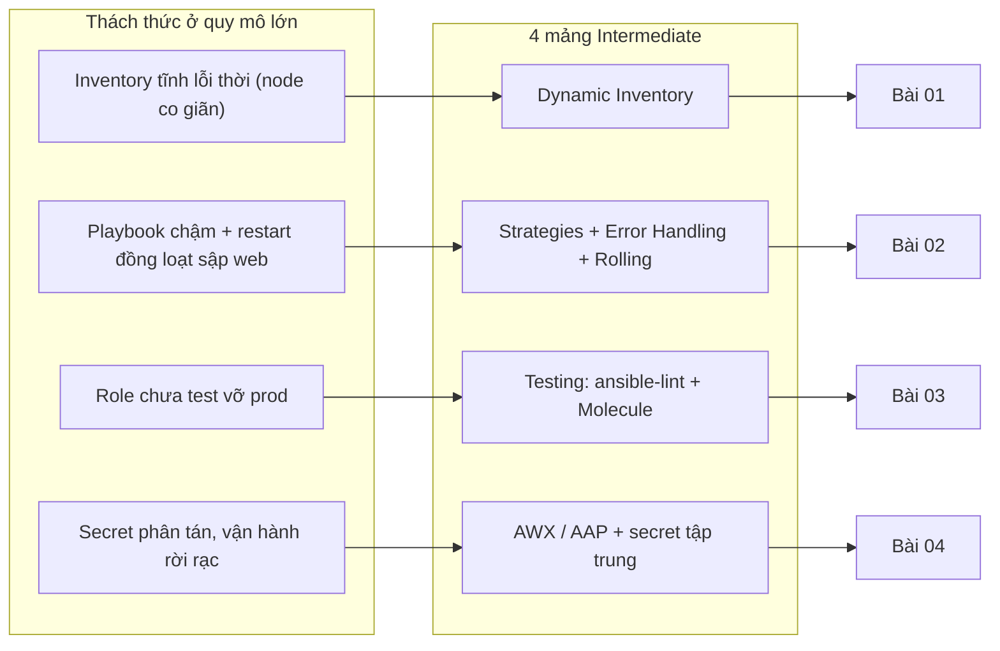
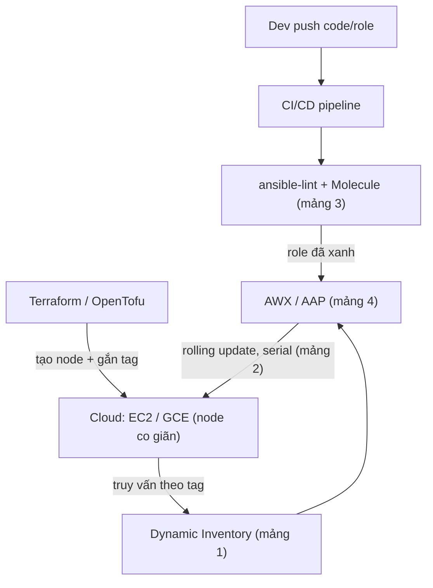

# Configuration Management Intermediate — Khi Ansible gặp quy mô Production

> **Tác giả:** Mr.Rom\
> **Phiên bản:** v1.0.0\
> **Tạo lúc:** 13/06/2026\
> **Cập nhật:** 13/06/2026\
> **Level:** Intermediate\
> **Tags:** ansible, configuration-management, dynamic-inventory, molecule, awx, intermediate\
> **Yêu cầu trước:** [Alternatives & When-Which (basic)](../01_basic/04_alternatives-and-when-which.md)

> 🎯 *Cụm basic dạy bạn viết playbook, đóng role `webserver`, mã hoá secret bằng Vault — đủ để quản lý vài con server bằng `inventory.ini` gõ tay. Nhưng khi Acme Shop lên cloud và số node nhảy lên hàng trăm, co giãn liên tục, thì inventory tĩnh lỗi thời, playbook chạy chậm, role chưa test vỡ prod, secret phân tán khắp nơi. Bài INTRO này vẽ bức tranh tổng thể 4 thách thức đó và map ra 4 bài kế — không đi sâu cú pháp.*

## 🎯 Sau bài này bạn sẽ

- [ ] Hiểu **khoảng cách** giữa "Ansible vài node gõ tay" (basic) và "Ansible quản lý hàng trăm node co giãn" (production)
- [ ] Nhận diện **4 thách thức** ở quy mô lớn: inventory lỗi thời, playbook chậm + cần zero-downtime, role chưa test, secret phân tán
- [ ] Biết **4 mảng intermediate** giải quyết từng thách thức: Dynamic Inventory / Strategies + Error Handling / Testing với Molecule / AWX + at-scale
- [ ] Hiểu **vị trí của CM** trong stack DevOps: Terraform tạo node → Ansible cấu hình; pipeline CI/CD gọi playbook tự động
- [ ] Có **lộ trình rõ ràng** 4 bài kế tiếp để đi từ overview này tới vận hành CM quy mô lớn

---

## Tình huống — Acme Shop lên cloud và inventory bắt đầu "nói dối"

Quay lại Acme Shop. Ở cụm basic, bạn quản lý hạ tầng bằng 1 file `inventory.ini` gõ tay:

```ini
# inventory.ini — thời còn vài server cố định
[webservers_dev]
web-dev.acmeshop.vn

[webservers_prod]
web-prod1.acmeshop.vn
web-prod2.acmeshop.vn
```

Hồi đó mọi thứ êm: 3 con server, hostname cố định, bạn biết mặt từng máy. Nhưng đợt sale 11/11 vừa rồi mọi thứ vỡ ra:

- **Sale cao điểm** → team scale web tier từ 2 lên **40 EC2 instance**, auto-scaling group tự bật/tắt máy theo tải. Hết sale, số node tụt về 5. Hôm sau lại lên 25.
- IP và hostname **đổi liên tục** — instance mới sinh ra có IP mới, instance cũ bị thu hồi. File `inventory.ini` gõ tay **lỗi thời ngay sau khi sinh ra**: bạn vừa thêm 38 dòng IP vào file thì auto-scaling đã thay nửa số máy đó.
- Một đêm bạn chạy `ansible-playbook` lên cả flotilla 40 node để vá lỗi — playbook chạy **lâu kinh khủng** vì mặc định Ansible chỉ chạy song song 5 host một lúc; 40 node nối đuôi thành 8 đợt.
- Tệ hơn: playbook restart Nginx **cùng lúc trên cả 40 node** → web tier sập trắng vài giây, khách đang thanh toán bị văng. Sếp gọi lúc 2h sáng.
- Tuần sau, một đồng nghiệp sửa role `webserver` thêm dòng config, push thẳng — không ai test. Role vỡ trên Ubuntu 24.04 (gói đổi tên) nhưng **chỉ phát hiện khi đã apply lên prod**.
- Secret thì rải rác: Vault password ở laptop bạn, API key trong `group_vars` của bạn B, DB password trong đầu bạn C. Không ai biết secret nào còn dùng, secret nào đã rò rỉ.

Sếp triệu tập cả team:

> *"Inventory phải tự sinh từ cloud, đừng gõ tay nữa. Playbook phải chạy nhanh và deploy theo đợt — không được sập web. Role phải test trước khi đụng prod. Và secret phải gom về một mối có kiểm soát. Đây là Ansible ở quy mô production."*

Đúng 4 vấn đề. Mỗi vấn đề là một mảng intermediate, ứng với một bài học kế tiếp. Trước khi mổ xẻ từng mảng, ta nhìn tổng thể khoảng cách giữa "Ansible basic" và "Ansible production".

> 💡 Hiểu được 4 thách thức rồi, ta xem chúng nối với 4 mảng giải pháp như thế nào qua sơ đồ bên dưới để có bản đồ tổng thể trước khi đi sâu.

### Bản đồ: từ thách thức tới mảng giải pháp

Sơ đồ dưới ánh xạ mỗi "nỗi đau" ở quy mô lớn sang mảng intermediate giải quyết nó, kèm bài học tương ứng. Đây là khung xương của cả cụm:



→ Điểm mấu chốt: 4 mảng này **không độc lập** mà xếp theo trình tự tự nhiên của vòng đời một thay đổi. Trước hết phải *biết node nào tồn tại* (inventory động); rồi *đẩy thay đổi an toàn + nhanh* (strategies); nhưng đẩy thì phải *chắc role đúng* (testing); và cuối cùng *vận hành tập trung có kiểm soát* (AWX). Đó là lý do thứ tự bài 01 → 04.

---

## 1️⃣ Mảng 1 — Dynamic Inventory: node tự khai báo, không gõ tay

### Vấn đề: inventory tĩnh và hạ tầng co giãn không đội trời chung

Cụm basic dùng inventory tĩnh — bạn liệt kê thủ công từng host trong `inventory.ini`. Cách này hoàn hảo khi server cố định. Nhưng cloud hiện đại là **ephemeral** (phù du): auto-scaling group tự sinh/huỷ instance, Spot instance bị thu hồi bất cứ lúc nào, deploy mới tạo máy mới rồi xoá máy cũ.

Hệ quả: file inventory gõ tay luôn **lệch so với thực tế**. Bạn không thể chạy theo cập nhật từng IP — đến khi gõ xong nó đã đổi.

### Giải pháp: Dynamic Inventory — hỏi thẳng cloud

**Dynamic inventory** (inventory động) là cơ chế Ansible **tự truy vấn nguồn sự thật** (cloud API) tại thời điểm chạy để dựng danh sách host, thay vì đọc file gõ tay. Thay vì *"đây là 40 IP tôi gõ ra"*, bạn nói *"lấy mọi EC2 instance có tag `Environment=prod` ở region `ap-southeast-1`"* — Ansible gọi AWS API, nhận về danh sách máy sống thật ngay lúc đó.

Cơ chế chính là **inventory plugin** — ví dụ `amazon.aws.aws_ec2` cho AWS, `google.cloud.gcp_compute` cho GCP. Plugin đọc một file config nhỏ, gọi cloud API, rồi gom node thành nhóm **theo tag/label** một cách tự động.

🪞 **Ẩn dụ**: inventory tĩnh giống **danh bạ điện thoại in giấy** — in xong là lỗi thời, ai đổi số bạn không biết. Dynamic inventory giống **tra danh bạ online theo thời gian thực** — bạn hỏi "ai đang là nhân viên phòng kinh doanh?" và hệ thống trả về đúng người *đang* làm ở đó lúc này, kể cả người mới vào sáng nay.

→ Với Acme Shop: 40 node sale hay 5 node ngày thường, bạn **không sửa một dòng inventory nào** — chỉ cần các instance gắn đúng tag `Environment=prod`, dynamic inventory tự thấy.

→ Học sâu cú pháp plugin, file config, gom nhóm theo tag, và caching ở **bài 01**.

---

## 2️⃣ Mảng 2 — Strategies & Error Handling: nhanh, an toàn, zero-downtime

### Vấn đề: chậm và "all-or-nothing" sập web

Khi số node lên hàng chục/hàng trăm, hai cơn đau xuất hiện:

- **Chậm**: mặc định Ansible chạy song song 5 host (`forks=5`). 100 node → 20 đợt nối đuôi. Một playbook đáng lẽ vài phút kéo dài lê thê.
- **Nguy hiểm**: playbook mặc định áp dụng task **lên tất cả host gần như đồng thời**. Task `restart nginx` chạy cùng lúc trên 40 node web → cả tier offline vài giây → khách văng giữa lúc thanh toán. Đây là **all-or-nothing**: hoặc cả cụm cùng đổi, hoặc không.

### Giải pháp: chỉnh strategy, bắt lỗi, và rolling update

Ba nhóm công cụ Ansible cung cấp cho mảng này:

- **Tối ưu hiệu năng** — tăng `forks` (số host chạy song song), bật `pipelining` (giảm số round-trip SSH), chọn `strategy: free` cho node chạy không cần chờ nhau. Cùng playbook, cùng số node, nhưng nhanh hơn nhiều.
- **Error handling** — `block`/`rescue`/`always` (đã gặp ở basic) cộng thêm `failed_when`, `changed_when`, `ignore_errors`, `any_errors_fatal`. Mục tiêu: khi 1 node lỗi, bạn *kiểm soát* được điều gì xảy ra tiếp — dừng hết, bỏ qua, hay chạy bước dọn dẹp.
- **Rolling update zero-downtime** — đây là chìa khoá. Từ khoá `serial` bảo Ansible *"chỉ đụng vào N node một lúc"* (vd `serial: 2` hoặc `serial: "25%"`). Kết hợp `max_fail_percentage` để tự dừng nếu tỉ lệ lỗi vượt ngưỡng. Web tier cập nhật **cuốn chiếu**: vài node một, luôn còn node sống phục vụ traffic.

🪞 **Ẩn dụ**: deploy all-at-once giống **đóng cửa cả nhà hàng để sơn lại** — khách đang ăn bị đuổi ra. Rolling update với `serial` giống **sơn từng bàn một**: dồn khách sang bàn khác, sơn xong bàn này mới sang bàn kế — nhà hàng **không bao giờ đóng cửa hoàn toàn**.

→ Với Acme Shop: web tier 40 node dùng `serial: "10%"` → mỗi lần chỉ 4 node tạm rút khỏi load balancer để cập nhật, 36 node còn lại vẫn phục vụ. Không còn cú gọi 2h sáng.

> [!IMPORTANT]
> Rolling update chỉ thật sự zero-downtime khi **kết hợp với load balancer** — node đang cập nhật phải được rút khỏi LB trước (drain) rồi thêm lại sau khi healthy. `serial` lo phần "đụng từng nhóm", nhưng việc rút/thêm node khỏi LB là bước phối hợp bạn phải khai báo (qua module gọi LB API). Bài 02 đi vào chi tiết.

→ Học sâu `forks`, `strategy`, `serial`, `max_fail_percentage`, `delegate_to` ở **bài 02**.

---

## 3️⃣ Mảng 3 — Testing với Molecule: role đúng trước khi chạm prod

### Vấn đề: "chạy được trên máy tôi" tái xuất ở tầng infra

Ở basic, vòng lặp phát triển role là: sửa → `ansible-playbook` thẳng lên server → xem có vỡ không. Khi role nhỏ và server là dev throwaway thì ổn. Nhưng ở production:

- Role được nhiều team dùng chung → một thay đổi nhỏ có thể vỡ ở môi trường khác (Ubuntu 22.04 vs 24.04, gói đổi tên, path khác).
- Không có cách *kiểm tra role idempotent* (chạy lần 2 phải `changed=0`) một cách tự động.
- Bug chỉ lộ ra khi đã apply lên prod — đúng kịch bản Acme Shop gặp.

Đây chính là bệnh **"works on my machine"** (chạy được trên máy tôi) mà CM sinh ra để diệt — nhưng giờ tái xuất ở chính tầng quản lý cấu hình.

### Giải pháp: lint tĩnh + test thật trong container

Hai lớp bảo vệ:

- **`ansible-lint` + `yamllint`** — kiểm tra *tĩnh* (không chạy gì): bắt lỗi cú pháp, anti-pattern, FQCN thiếu, biến không dùng, indent YAML sai. Nhanh, chạy được ngay trong editor.
- **Molecule** — framework test role *thật*: nó tự dựng một môi trường sạch (thường là **Docker container**), chạy role lên đó (`converge`), chạy lại lần nữa để **kiểm tra idempotence** (`idempotence` — lần 2 không được `changed`), rồi chạy assertion kiểm chứng kết quả (`verify`). Cuối cùng dọn dẹp (`destroy`).

🪞 **Ẩn dụ**: deploy role chưa test giống **lắp linh kiện thẳng vào xe đang chạy trên cao tốc** — hỏng là tai nạn. Molecule giống **bệ thử động cơ trong xưởng**: dựng một bản sao container sạch, chạy thử role lên đó đủ các kịch bản, hỏng thì hỏng *trong xưởng*, không phải trên đường.

→ Với Acme Shop: role `webserver` chạy qua Molecule trên cả container Ubuntu 22.04 và 24.04 trong CI. Lỗi "gói đổi tên trên 24.04" bị bắt **trước khi merge**, không bao giờ chạm prod.

> [!TIP]
> Tích hợp `ansible-lint` + Molecule vào pipeline CI: mỗi pull request sửa role tự động chạy lint + converge + idempotence + verify. PR đỏ thì không merge được — đây là cách biến "test role" từ kỷ luật thủ công thành rào chắn tự động.

→ Học sâu cấu hình Molecule, các scenario, kiểm tra idempotence và tích hợp CI ở **bài 03**.

---

## 4️⃣ Mảng 4 — AWX / AAP & vận hành quy mô lớn

### Vấn đề: CLI cá nhân không phải nền tảng vận hành

Đến đây bạn đã có inventory động, deploy an toàn, role được test. Nhưng cách *chạy* vẫn là: từng người mở laptop gõ `ansible-playbook`. Ở quy mô team + production, kiểu này lộ ra hàng loạt lỗ hổng:

- **Không audit trail** — ai chạy playbook nào, lúc nào, lên node nào? Không biết.
- **Secret phân tán** — Vault password, cloud credential nằm rải rác trên máy cá nhân từng người. Một laptop mất là một sự cố bảo mật.
- **Không phân quyền** — junior có thể vô tình chạy playbook destructive lên prod.
- **Không lịch trình / self-service** — muốn chạy định kỳ phải tự đặt cron trên máy ai đó; team khác muốn trigger phải nhờ.

### Giải pháp: AWX / Ansible Automation Platform

**AWX** (bản open-source) và **Ansible Automation Platform / AAP** (bản thương mại của Red Hat) là **nền tảng web tập trung** để chạy Ansible:

- **Giao diện web + API** — chạy playbook qua UI hoặc REST API, không cần SSH vào laptop ai.
- **RBAC** (Role-Based Access Control) — phân quyền theo team: ai được chạy playbook nào lên inventory nào.
- **Audit trail** — log đầy đủ mọi lần chạy: ai, khi nào, kết quả ra sao.
- **Credential store tập trung** — secret (Vault password, cloud key, SSH key) lưu mã hoá ở một nơi, tích hợp được với **external secret manager** (HashiCorp Vault, AWS Secrets Manager). Hết cảnh secret rải laptop.
- **Schedule + webhook + survey** — chạy định kỳ, trigger từ Git push, hay cho team khác self-service qua form.

Ngoài AWX, mảng này còn chạm tới mô hình **pull-based** với `ansible-pull` (node tự kéo playbook về chạy — hợp với fleet rất lớn hoặc edge), và cách CM **chốt lại** với immutable infrastructure (Packer + Ansible build golden image).

🪞 **Ẩn dụ**: gõ `ansible-playbook` trên laptop giống **mỗi nhân viên tự cầm chìa khoá vạn năng mở mọi phòng** — tiện nhưng không ai kiểm soát ai vào đâu. AWX giống **hệ thống cửa từ của toà nhà**: thẻ ai mở được phòng nào do admin cấp, mọi lần quẹt thẻ đều có log, chìa khoá gốc cất trong két trung tâm.

→ Với Acme Shop: mọi playbook chạy qua AWX. Junior chỉ được trigger deploy lên `staging`; deploy `prod` cần senior approve. Vault password nằm trong credential store của AWX, không còn trên laptop ai. Mỗi lần chạy có log đầy đủ.

→ Học sâu AWX/AAP, RBAC, external secret manager, `ansible-pull` và kết hợp CM + IaC + immutable ở **bài 04**.

---

## 5️⃣ CM không đứng một mình — vị trí trong stack DevOps

Một điểm bạn đã chạm ở bài basic *Alternatives*: CM không phải ốc đảo. Ở quy mô production, nó là **một mắt xích** trong chuỗi tự động hoá. Hai mối liên hệ quan trọng nhất:

**IaC tạo node → Ansible cấu hình bên trong.** Terraform (hoặc OpenTofu) lo tầng *hạ tầng*: tạo VPC, EC2 instance, security group, load balancer. Nhưng Terraform **không** lo cài Nginx, đẩy config, tune kernel bên *trong* máy — đó là việc của Ansible. Ranh giới rõ: Terraform = "có những máy nào", Ansible = "bên trong mỗi máy có gì". Và đây cũng là lý do dynamic inventory quan trọng: Terraform vừa tạo 40 node mới → dynamic inventory tự thấy chúng (qua tag) → Ansible cấu hình ngay, không cần ai gõ IP.

**CI/CD chạy playbook trong pipeline.** Thay vì gõ tay, playbook được pipeline (GitHub Actions, GitLab CI...) gọi tự động: PR merge → CI chạy `ansible-lint` + Molecule (mảng 3) → nếu xanh thì deploy qua AWX API (mảng 4) với rolling update (mảng 2) lên các node dynamic inventory trả về (mảng 1). Bốn mảng intermediate kết lại thành một vòng deploy hoàn chỉnh.

Sơ đồ dưới đặt CM vào đúng vị trí giữa IaC và CI/CD — đây là khái niệm trừu tượng nhất của bài nên cần một bức tranh tổng:



→ Đọc sơ đồ theo dòng chảy: **Terraform dựng node** (trái), **dynamic inventory phát hiện node** (giữa), **CI test role rồi giao cho AWX** (trên), **AWX deploy cuốn chiếu lên node** (dưới). CM intermediate chính là phần kết dính bốn mảng này lại — nó nhận hạ tầng từ IaC và được điều khiển bởi CI/CD, chứ không phải một công cụ chạy đơn lẻ trên laptop nữa.

| Mắt xích | Công cụ | Ranh giới trách nhiệm |
|---|---|---|
| Tạo hạ tầng | Terraform / OpenTofu | "Có những node nào, network ra sao" — không đụng nội dung bên trong máy |
| Phát hiện node | Dynamic inventory (mảng 1) | Hỏi cloud "node nào đang sống, gắn tag gì" tại thời điểm chạy |
| Cấu hình bên trong | Ansible role (test bằng Molecule — mảng 3) | "Bên trong mỗi node cài gì, config ra sao" |
| Deploy an toàn | Strategies + `serial` (mảng 2) | Đẩy thay đổi cuốn chiếu, zero-downtime |
| Điều phối + kiểm soát | AWX / AAP (mảng 4) | Ai chạy gì, audit, secret tập trung, schedule |
| Tự động hoá | CI/CD pipeline | Khâu nào tự chạy khi nào (PR, merge, schedule) |

→ Bốn mảng intermediate không phải bốn chủ đề rời — chúng là **bốn lát cắt của cùng một pipeline production**.

---

## 6️⃣ Lộ trình 4 bài kế tiếp

Mỗi bài giải quyết trọn một mảng, kèm một output cụ thể bạn làm được sau khi học. Thứ tự bám đúng dòng chảy ở §5:

| Bài | Tiêu đề | Mảng | Output bạn làm được |
|---|---|---|---|
| **01** | [Dynamic Inventory — Quản lý node cloud co giãn tự động](01_dynamic-inventory-and-cloud.md) | Inventory động | Inventory plugin AWS/GCP gom node theo tag, thay thế file tĩnh trong môi trường co giãn |
| **02** | [Advanced Playbooks — Hiệu năng, error handling & rolling update zero-downtime](02_advanced-playbooks-and-strategies.md) | Strategies + Error handling | Playbook deploy cuốn chiếu (`serial`) không sập web, tối ưu `forks`/`pipelining`, bắt lỗi an toàn |
| **03** | [Testing Ansible — ansible-lint & Molecule cho role đáng tin cậy](03_testing-with-molecule.md) | Testing | Role test tự động trong Docker (converge → idempotence → verify), tích hợp CI |
| **04** | [AWX / Ansible Automation Platform & vận hành CM quy mô lớn](04_awx-aap-and-at-scale.md) | At-scale | Chạy playbook tập trung qua AWX với RBAC + audit + secret tập trung, `ansible-pull`, kết hợp IaC/immutable |

→ Học tuần tự 01 → 04 là tối ưu, vì mỗi bài giả định nền của bài trước (bài 02 deploy lên node mà bài 01 phát hiện; bài 04 điều phối thứ bài 02-03 đã làm an toàn).

---

## 💡 Cạm bẫy thường gặp & Best practice

### ❌ Cạm bẫy: nhảy thẳng vào AWX khi chưa có role test và inventory động

- **Triệu chứng**: Team dựng AWX trước tiên vì "trông pro", nhưng playbook vẫn dùng inventory gõ tay và role chưa test → AWX chỉ là cái UI bọc ngoài đống chưa ổn, vẫn vỡ prod như cũ, giờ thêm tầng phức tạp.
- **Nguyên nhân**: Nhầm "công cụ vận hành" (AWX) với "chất lượng nội dung" (role đúng, inventory chuẩn). AWX khuếch đại cả cái tốt lẫn cái dở.
- **Cách tránh**: Đi đúng thứ tự 4 mảng. Có inventory động + role test + deploy an toàn rồi mới đưa lên AWX để vận hành tập trung. AWX là *lớp điều phối*, không phải lớp sửa lỗi.

### ❌ Cạm bẫy: dùng Ansible để "tạo" hạ tầng thay cho Terraform

- **Triệu chứng**: Viết playbook gọi module `amazon.aws.ec2_instance` để tạo cả VPC, instance, security group — rồi lại dùng Ansible cấu hình bên trong. Một thời gian sau không ai biết "nguồn sự thật" của hạ tầng nằm ở đâu, state lẫn lộn.
- **Nguyên nhân**: Ansible *làm được* việc tạo cloud resource, nhưng nó không quản lý **state** như Terraform → khó biết "đang có gì", khó xoá sạch, dễ tạo resource mồ côi.
- **Cách tránh**: Giữ ranh giới — **Terraform tạo node, Ansible cấu hình node**. Để IaC lo lifecycle hạ tầng (tạo/sửa/xoá có state), CM lo nội dung bên trong. Hai công cụ, hai trách nhiệm.

### ✅ Best practice: bốn mảng là một pipeline, đầu tư theo nỗi đau thực tế

- **Vì sao**: 4 mảng intermediate không phải checklist phải làm hết cùng lúc. Startup 10 node không cần AWX ngay; nhưng *ai* cũng cần dynamic inventory khi đã lên auto-scaling, và *ai* cũng cần test role khi nhiều người sửa chung.
- **Cách áp dụng**: Bắt đầu từ nỗi đau cấp thiết nhất. Node co giãn đau → làm mảng 1 trước. Deploy hay sập → mảng 2. Role hay vỡ → mảng 3. Team đông + cần kiểm soát → mảng 4. Nhưng luôn giữ tư duy chúng là một chuỗi, không phải bốn ốc đảo.

---

## 🧠 Tự kiểm tra (Self-check)

**Q1.** Vì sao inventory tĩnh (`inventory.ini` gõ tay) trở nên không dùng được khi hạ tầng lên auto-scaling cloud?

<details>
<summary>💡 Xem giải thích</summary>

Vì hạ tầng cloud là **ephemeral** (phù du): auto-scaling group tự sinh/huỷ instance, IP và hostname đổi liên tục. File gõ tay phản ánh trạng thái tại một thời điểm, nhưng đến khi bạn gõ xong nó đã lỗi thời — số node và IP đã thay đổi. Dynamic inventory giải quyết bằng cách **truy vấn cloud API tại thời điểm chạy** để lấy danh sách host thật, gom nhóm theo tag, nên luôn khớp thực tế.

</details>

**Q2.** Playbook mặc định restart Nginx trên 40 node web cùng lúc → web sập vài giây. Cơ chế Ansible nào giải quyết, và ý tưởng của nó là gì?

<details>
<summary>💡 Xem giải thích</summary>

Dùng **rolling update** qua từ khoá `serial` (vd `serial: "10%"` hoặc `serial: 4`). Thay vì áp dụng task lên tất cả host gần như đồng thời (all-or-nothing), `serial` bảo Ansible chỉ đụng vào N node một đợt — cập nhật xong đợt này mới sang đợt kế. Luôn còn node sống phục vụ traffic → zero-downtime. Thường kết hợp với load balancer (rút node khỏi LB trước khi cập nhật) và `max_fail_percentage` để tự dừng nếu lỗi vượt ngưỡng. Đây là nội dung mảng 2 / bài 02.

</details>

**Q3.** Molecule kiểm tra "idempotence" của role nghĩa là gì, và vì sao quan trọng?

<details>
<summary>💡 Xem giải thích</summary>

Molecule chạy role lên môi trường sạch (`converge`), rồi **chạy lại lần thứ hai** (`idempotence`). Lần hai *không được* báo `changed` ở bất kỳ task nào — nếu có `changed`, role không idempotent (chạy nhiều lần ra kết quả khác nhau / sửa thừa). Idempotency là tính chất cốt lõi của CM: chạy bao nhiêu lần cũng cho cùng trạng thái mong muốn, không gây tác dụng phụ. Test tự động tính chất này giúp bắt bug *trước* khi role chạm prod.

</details>

**Q4.** Ranh giới trách nhiệm giữa Terraform và Ansible ở quy mô production là gì? Cho ví dụ.

<details>
<summary>💡 Xem giải thích</summary>

**Terraform (IaC) lo hạ tầng — "có những node nào"**: tạo VPC, EC2/GCE instance, security group, load balancer, có quản lý state. **Ansible (CM) lo nội dung bên trong node — "bên trong mỗi máy có gì"**: cài Nginx, đẩy config, tune hệ thống. Ví dụ: Terraform tạo 40 EC2 instance gắn tag `Environment=prod`; dynamic inventory phát hiện chúng qua tag; Ansible cấu hình Nginx bên trong từng node. Không nên dùng Ansible để *tạo* hạ tầng (nó không quản state như Terraform → dễ tạo resource mồ côi).

</details>

**Q5.** Một team mới lên cloud, đang đau nhất ở chỗ deploy hay sập web khi cập nhật nhiều node. Theo thứ tự ưu tiên, họ nên đầu tư mảng intermediate nào trước? Có nên dựng AWX ngay không?

<details>
<summary>💡 Xem giải thích</summary>

Đau nhất là deploy sập → ưu tiên **mảng 2 (Strategies + rolling update với `serial`)** trước, vì nó trực tiếp chữa nỗi đau đó. Nếu node cũng đang co giãn liên tục thì làm **mảng 1 (dynamic inventory)** song song để inventory không lỗi thời. **Không** nên dựng AWX (mảng 4) ngay — AWX là lớp điều phối/vận hành tập trung, nó khuếch đại cả cái tốt lẫn cái dở; dựng AWX bọc ngoài role chưa test + deploy chưa an toàn thì vẫn sập, chỉ thêm phức tạp. Đầu tư theo nỗi đau thực tế, nhưng giữ tư duy 4 mảng là một pipeline.

</details>

---

## ⚡ Tra cứu nhanh (Cheatsheet)

Bảng dưới gom nhanh "thách thức → mảng → từ khoá/công cụ → bài học" để bạn định vị mình đang ở đâu trong cụm:

| Thách thức quy mô lớn | Mảng | Từ khoá / công cụ cốt lõi | Bài |
|---|---|---|---|
| Inventory tĩnh lỗi thời, node co giãn | Dynamic Inventory | `amazon.aws.aws_ec2`, `google.cloud.gcp_compute`, gom nhóm theo tag | 01 |
| Playbook chậm | Strategies | `forks`, `pipelining`, `strategy: free` | 02 |
| Restart đồng loạt sập web | Rolling update | `serial`, `max_fail_percentage`, `delegate_to` (gọi LB) | 02 |
| Lỗi node giữa chừng khó kiểm soát | Error handling | `block`/`rescue`/`always`, `failed_when`, `any_errors_fatal` | 02 |
| Role chưa test vỡ prod | Testing | `ansible-lint`, `yamllint`, Molecule (`converge`/`idempotence`/`verify`) | 03 |
| Vận hành rời rạc, secret phân tán | At-scale | AWX / AAP, RBAC, credential store, `ansible-pull` | 04 |

| Mối liên hệ stack | Ranh giới |
|---|---|
| Terraform → Ansible | Terraform tạo node + gắn tag; Ansible cấu hình bên trong node |
| CI/CD → Ansible | Pipeline gọi `ansible-lint` + Molecule, rồi trigger deploy (AWX API) tự động |

---

## 📚 Từ Điển Thuật Ngữ (Glossary)

| EN | VN | Giải thích |
|---|---|---|
| Dynamic inventory | Inventory động | Cơ chế Ansible tự truy vấn nguồn (cloud API) để dựng danh sách host lúc chạy, thay file gõ tay |
| Inventory plugin | Plugin inventory | Thành phần gọi nguồn dữ liệu (AWS/GCP...) sinh inventory động, gom nhóm theo tag |
| Ephemeral | Phù du | Tài nguyên sinh/huỷ liên tục, không cố định (instance auto-scaling, Spot) |
| Auto-scaling group | Nhóm co giãn tự động | Cơ chế cloud tự bật/tắt instance theo tải |
| Strategy | Chiến lược chạy | Cách Ansible điều phối task qua các host (`linear` mặc định, `free`) |
| `forks` | Số luồng song song | Số host Ansible xử lý đồng thời (mặc định 5) |
| `pipelining` | (giữ nguyên) | Giảm số round-trip SSH mỗi task để chạy nhanh hơn |
| Rolling update | Cập nhật cuốn chiếu | Deploy theo từng nhóm nhỏ node, luôn còn node sống phục vụ → zero-downtime |
| `serial` | (giữ nguyên) | Số/tỉ lệ host mỗi đợt rolling update |
| `max_fail_percentage` | Ngưỡng lỗi tối đa | Tỉ lệ host lỗi vượt mức thì Ansible dừng cả play |
| Zero-downtime | Không gián đoạn | Deploy mà dịch vụ không có khoảng chết |
| Idempotence | Tính bất biến khi lặp | Chạy nhiều lần cho cùng trạng thái, không sửa thừa |
| `ansible-lint` | (giữ nguyên) | Công cụ kiểm tra tĩnh playbook/role, bắt anti-pattern + lỗi cú pháp |
| Molecule | (giữ nguyên) | Framework test role trong môi trường sạch (thường Docker): converge → idempotence → verify |
| AWX | (giữ nguyên) | Nền tảng web open-source chạy Ansible tập trung (upstream của AAP) |
| AAP | Ansible Automation Platform | Bản thương mại Red Hat của AWX, có hỗ trợ enterprise |
| RBAC | Phân quyền theo vai trò | Role-Based Access Control — quy định ai làm gì lên tài nguyên nào |
| Audit trail | Vết kiểm toán | Log đầy đủ ai chạy gì, khi nào, kết quả ra sao |
| `ansible-pull` | (giữ nguyên) | Mô hình pull: node tự kéo playbook về tự chạy, hợp fleet lớn/edge |
| External secret manager | Trình quản lý secret ngoài | Kho secret tập trung (HashiCorp Vault, AWS Secrets Manager) AWX tích hợp |
| IaC | Hạ tầng dạng mã | Infrastructure as Code — quản lý hạ tầng bằng code có state (Terraform/OpenTofu) |
| Golden image | Ảnh gốc chuẩn | Image máy đã cài sẵn mọi thứ (Packer + Ansible build), hướng immutable |

---

## 🔗 Liên kết & Tài nguyên

### 🧭 Định hướng lộ trình học

- ➡️ **Bài tiếp theo:** [Dynamic Inventory — Quản lý node cloud co giãn tự động](01_dynamic-inventory-and-cloud.md)
- ↑ **Về cụm:** [Configuration Management — README](../../README.md)

### 🧩 Các chủ đề có thể bạn quan tâm

- [Ansible vs Chef vs Puppet vs Salt — Chọn đúng & kết hợp với IaC](../01_basic/04_alternatives-and-when-which.md)
- [Playbooks & Roles — Cấu trúc, biến, Jinja2 template, tái sử dụng](../01_basic/02_playbooks-and-roles.md)
- [Ansible Vault & quản lý secrets — Mã hoá biến nhạy cảm an toàn](../01_basic/03_vault-and-secrets.md)
- [IaC Intermediate — Từ "terraform apply local" đến "GitOps infra"](../../../iac/lessons/02_intermediate/00_intermediate-overview.md)

### 🌐 Tài nguyên tham khảo khác

- [Ansible — Dynamic inventory](https://docs.ansible.com/ansible/latest/inventory_guide/intro_dynamic_inventory.html) — spec chính thức về inventory plugin
- [Ansible — Controlling playbook execution: strategies & serial](https://docs.ansible.com/ansible/latest/playbook_guide/playbooks_strategies.html) — strategy, forks, serial, rolling update
- [Molecule documentation](https://ansible.readthedocs.io/projects/molecule/) — framework test role
- [AWX (GitHub)](https://github.com/ansible/awx) — bản open-source của Ansible Automation Platform

---

## 📌 Nhật ký thay đổi (Changelog)

- **v1.0.0 (13/06/2026)** — Bản đầu tiên. Lesson 00 INTRO của cụm Configuration Management intermediate. Vẽ bức tranh 4 thách thức CM ở quy mô production (inventory tĩnh lỗi thời / playbook chậm + cần zero-downtime / role chưa test / secret phân tán), map sang 4 mảng (Dynamic Inventory / Strategies + Error Handling / Testing với Molecule / AWX + at-scale), đặt CM vào stack DevOps (Terraform tạo node → Ansible cấu hình; CI/CD chạy playbook), kèm lộ trình 4 bài kế tiếp. Tình huống xuyên suốt Acme Shop tiếp nối cụm basic. 2 sơ đồ mermaid (bản đồ thách thức→mảng, vị trí CM trong stack).
