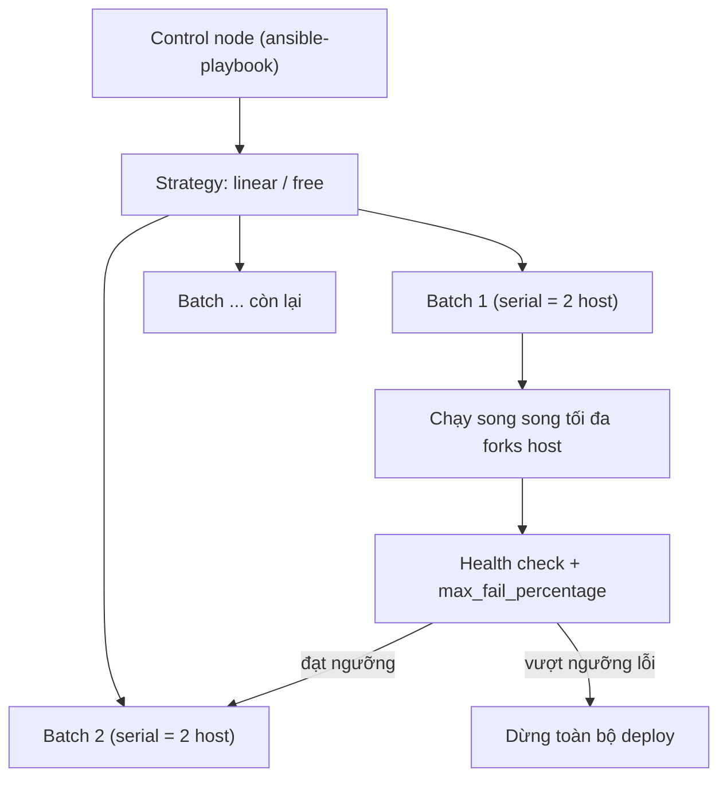

# 🎓 Advanced Playbooks — Hiệu năng, error handling & rolling update zero-downtime

> **Tác giả:** Mr.Rom\
> **Phiên bản:** v1.0.0\
> **Tạo lúc:** 13/06/2026\
> **Cập nhật:** 13/06/2026\
> **Level:** Intermediate\
> **Tags:** ansible, playbook, rolling-update, serial, error-handling, delegation, performance, configuration-management\
> **Yêu cầu trước:** [Dynamic Inventory & Cloud](01_dynamic-inventory-and-cloud.md)

> 🎯 *Ở bài trước Acme Shop đã có dynamic inventory tự kéo về hàng chục node EC2/GCE. Nhưng chạy 1 playbook lên cả fleet cùng lúc là "tự bắn vào chân": chậm, lỗi 1 node là cả lô dừng giữa chừng, và update đồng loạt = sập web toàn bộ. Bài này dạy bạn 3 thứ giúp playbook lên production-grade: **tối ưu hiệu năng**, **error handling** đúng cách, và **rolling update zero-downtime** — deploy từng batch, health check giữa các batch, gỡ node khỏi load balancer trước khi đụng vào.*

## 🎯 Sau bài này bạn sẽ

- [ ] Tăng tốc playbook trên fleet lớn bằng `forks`, `pipelining`, fact caching và `strategy` phù hợp
- [ ] Dùng `async` + `poll` để chạy task dài (build, backup) không bị timeout SSH
- [ ] Kiểm soát lỗi chủ động bằng `block`/`rescue`/`always`, `failed_when`, `changed_when`, `ignore_errors`, `any_errors_fatal`
- [ ] Hiểu cơ chế `serial` (số / %) + `max_fail_percentage` để deploy theo batch, dừng đúng lúc
- [ ] Gỡ node khỏi load balancer trước khi update và đưa lại sau, dùng `delegate_to` / `run_once`
- [ ] Viết được 1 playbook rolling deploy fleet web Acme: 2 node/lần, health check giữa các batch, an toàn nếu lỗi

---

## 1️⃣ Vì sao "chạy 1 phát lên cả fleet" là cái bẫy

Quay lại Acme Shop. Dynamic inventory giờ trả về 30 node web (`tag_role_web`) đang chạy production. Bạn sửa version app rồi gõ lệnh quen thuộc:

```bash
ansible-playbook -i inventory_aws_ec2.yml deploy.yml
```

Ba chuyện xảy ra, lần lượt tệ hơn:

- **Chậm bất ngờ.** Mặc định Ansible chỉ chạy song song **5 host một lúc** (`forks=5`). 30 node = 6 đợt nối đuôi nhau. Mỗi task lại mở SSH mới → fleet lớn deploy lê thê.
- **Lỗi 1 node, đứng hình giữa chừng.** Một node hết dung lượng đĩa, task `unarchive` fail. Mặc định Ansible **bỏ node đó ra** rồi chạy tiếp các node còn lại — nhưng nếu lỗi xảy ra ở task "tải artifact mới" thì có node đã update, có node chưa → fleet ở trạng thái **nửa cũ nửa mới**.
- **Tệ nhất: sập web toàn bộ.** Vì bạn update **cả 30 node cùng lúc**, trong khoảnh khắc service restart, **không còn node nào** phục vụ traffic. Khách vào acmeshop.vn thấy `502 Bad Gateway`. Đây là downtime — thứ production không bao giờ được phép có khi chỉ deploy bản vá thường.

Ba vấn đề này tương ứng 3 nhóm công cụ ta học hôm nay: **hiệu năng** (chạy nhanh), **error handling** (lỗi không lan), **rolling update** (deploy từng phần, luôn còn node sống). Trước hết hình dung toàn cảnh một lần chạy playbook trên fleet.

> 💡 Hiểu 3 nhóm vấn đề rồi, ta xem một lần `ansible-playbook` thực ra điều phối fleet thế nào qua sơ đồ dưới.

### Một lần chạy playbook điều phối fleet ra sao

Sơ đồ dưới mô tả vòng đời 1 play khi chạy lên nhiều host: control node chia host thành các "batch" theo `serial`, trong mỗi batch lại chạy song song tối đa `forks` host, và giữa các batch có thể chèn kiểm tra.



→ Điểm mấu chốt: `serial` quyết định **bao nhiêu host mỗi batch**, `forks` quyết định **mức song song trong 1 batch**, còn `max_fail_percentage` là "cầu dao" ngắt deploy khi quá nhiều host trong batch lỗi. Ba tham số này độc lập nhau — đây là chỗ người mới hay nhầm lẫn.

---

## 2️⃣ Tối ưu hiệu năng — chạy nhanh trên fleet lớn

Trước khi nói rolling update, ta xử lý cái "chậm". Ansible mặc định cấu hình **an toàn chứ không nhanh** — phù hợp lúc học, đuối khi chạy 30+ node. Bốn đòn bẩy chính: `forks`, `strategy`, `pipelining`, fact caching.

### `forks` — số host chạy song song

`forks` là số tiến trình worker control node fork ra để xử lý host **đồng thời**. Mặc định là **5**. Với fleet 30 node, nâng lên giúp deploy nhanh thấy rõ. Đặt trong `ansible.cfg`:

```ini
# ansible.cfg
[defaults]
forks = 20
```

Hoặc truyền trực tiếp khi chạy lệnh:

```bash
ansible-playbook -i inventory_aws_ec2.yml deploy.yml --forks 20
```

→ `forks = 20` nghĩa là tối đa 20 host được xử lý cùng lúc. Đừng đẩy quá cao vô tội vạ: control node cần đủ RAM/CPU cho mỗi worker, và một số fork quá lớn có thể làm nghẽn mạng hoặc quá tải chính control node. Con số 20–50 là vùng hợp lý cho đa số fleet vừa.

> [!NOTE]
> `forks` và `serial` là hai khái niệm khác nhau và hay bị lẫn. `forks` là giới hạn **kỹ thuật** mức song song của control node (áp cho cả ad-hoc lẫn playbook). `serial` là quyết định **chiến lược deploy** — chia play thành các batch nhỏ. Khi rolling update, batch size (`serial`) thường nhỏ hơn `forks`, nên trong 1 batch mọi host vẫn chạy song song hết.

### `strategy` — `linear` vs `free`

**Strategy** (chiến lược thực thi) quyết định cách Ansible đồng bộ host qua từng task. Có 2 strategy chính:

| Strategy | Cách chạy | Khi nào dùng |
|---|---|---|
| `linear` (mặc định) | Mọi host làm **xong task N** mới cùng sang task N+1 (có "hàng rào" đồng bộ mỗi task) | Mặc định an toàn; bắt buộc khi rolling update cần thứ tự chặt |
| `free` | Mỗi host **chạy hết playbook theo tốc độ riêng**, không chờ host khác | Fleet host nhanh/chậm chênh lệch lớn, task độc lập, muốn ép tổng thời gian xuống |

Khai báo ở cấp play:

```yaml
- name: Cập nhật cấu hình cơ bản toàn fleet
  hosts: tag_role_web
  strategy: free
  tasks:
    - name: Đồng bộ file cấu hình chung
      ansible.builtin.copy:
        src: files/common.conf
        dest: /etc/acme/common.conf
        mode: "0644"
```

→ `strategy: free` hợp khi các task **không phụ thuộc lẫn nhau giữa host** — vd đẩy file config chung. **Tuyệt đối tránh** `free` cho rolling update: rolling cần "host này xong batch mới sang batch sau", mà `free` thì mạnh ai nấy chạy, phá vỡ thứ tự. Mặc định `linear` là lựa chọn đúng cho 90% trường hợp.

### `pipelining` — giảm số vòng SSH mỗi task

Mặc định, mỗi task Ansible làm nhiều bước qua SSH: tạo thư mục tạm, copy module Python lên, chạy, dọn dẹp. **Pipelining** gộp các bước này lại, truyền module qua chính phiên SSH đang mở thay vì ghi file tạm — cắt đáng kể số lần round-trip mạng, nên là một trong những tinh chỉnh **tăng tốc rõ nhất**.

```ini
# ansible.cfg
[ssh_connection]
pipelining = True
```

→ Bật `pipelining = True` có thể tăng tốc nhiều lần trên fleet lớn. Điều kiện duy nhất: máy đích **không** bắt buộc `requiretty` trong `/etc/sudoers` (vì pipelining không cấp pseudo-TTY). Đa số image cloud hiện đại (Ubuntu/Debian/Amazon Linux 2023) đã tắt `requiretty` sẵn, nên bật thoải mái. Nếu gặp lỗi `sudo: sorry, you must have a tty to run sudo` thì sửa sudoers rồi bật lại.

### Fact caching — đừng "khám sức khỏe" lại mỗi lần chạy

Như bài Playbooks & Roles đã nói, mỗi play mặc định chạy `gather_facts` — SSH vào từng máy chạy script khảo sát OS, RAM, IP... Trên fleet lớn, làm việc này **mỗi lần deploy** rất tốn. **Fact caching** lưu facts ra ngoài (file JSON hoặc Redis) để lần sau dùng lại, không phải khám lại.

```ini
# ansible.cfg
[defaults]
gathering = smart
fact_caching = jsonfile
fact_caching_connection = /tmp/ansible_facts_cache
fact_caching_timeout = 7200
```

Giải nghĩa từng dòng:

- `gathering = smart` — chỉ gather facts khi **chưa có trong cache** (hoặc cache hết hạn), thay vì gather mù mọi lần.
- `fact_caching = jsonfile` — backend lưu cache. `jsonfile` ghi ra đĩa local; production lớn thường dùng `redis` để nhiều control node/CI chia sẻ.
- `fact_caching_connection` — đường dẫn thư mục cache (với `jsonfile`).
- `fact_caching_timeout = 7200` — cache sống 7200 giây (2 giờ) rồi mới gather lại.

→ Với `gathering = smart` + cache còn hạn, các lần deploy sau bỏ qua hẳn bước `Gathering Facts` — tiết kiệm rất nhiều trên fleet đông. Lưu ý: nếu máy vừa đổi cấu hình phần cứng (thêm RAM, đổi IP) mà cache chưa hết hạn, facts có thể cũ — khi đó chủ động chạy với `--flush-cache`.

### `async` + `poll` — task chạy lâu không làm treo SSH

Một số task chạy **rất lâu**: build artifact, backup database, chạy migration nặng. Nếu để chạy đồng bộ bình thường, kết nối SSH có thể bị timeout (do firewall/idle timeout) và task fail oan dù lệnh trên máy đích vẫn đang chạy. Giải pháp là **async** (bất đồng bộ): Ansible khởi động task rồi "buông", định kỳ quay lại hỏi xong chưa.

Hai tham số đi kèm:

- `async: <giây>` — thời gian tối đa cho phép task chạy (timeout tổng).
- `poll: <giây>` — chu kỳ Ansible quay lại kiểm tra trạng thái. `poll: 0` = "fire-and-forget" (bắn rồi quên, không chờ).

Ví dụ chạy backup DB lâu, cho tối đa 1 giờ, kiểm tra mỗi 15 giây:

```yaml
- name: Backup database trước khi deploy
  ansible.builtin.command: /opt/acme/scripts/backup-db.sh
  async: 3600        # cho phép chạy tối đa 3600s (1 giờ)
  poll: 15           # cứ 15s quay lại hỏi xong chưa
```

→ Trong khi task này chạy, kết nối SSH không bị giữ "căng" suốt — Ansible thả ra giữa các lần poll nên không bị idle timeout cắt ngang.

Pattern mạnh hơn: bắn task rồi **làm việc khác**, lát sau mới chờ kết quả. Dùng `poll: 0` + `register`, rồi `async_status`:

```yaml
- name: Khởi chạy build artifact (không chờ ngay)
  ansible.builtin.command: /opt/acme/scripts/build.sh
  async: 1800        # tối đa 30 phút
  poll: 0            # fire-and-forget, không chờ tại đây
  register: build_job

- name: Trong lúc chờ build, vẫn cài gói phụ trợ
  ansible.builtin.apt:
    name: [curl, jq]
    state: present

- name: Giờ mới chờ build xong
  ansible.builtin.async_status:
    jid: "{{ build_job.ansible_job_id }}"
  register: build_result
  until: build_result.finished
  retries: 60        # hỏi tối đa 60 lần
  delay: 30          # mỗi lần cách 30s
```

→ Với `poll: 0`, task build chạy nền trên máy đích, Ansible đi làm việc khác ngay. Sau đó `async_status` "dò" job theo `jid` (job id) cho tới khi `finished` là `true`. Đây là cách chạy nhiều việc nặng song song mà không phải ngồi chờ tuần tự.

> [!WARNING]
> Với `poll: 0` (fire-and-forget), nếu bạn **không** dùng `async_status` để chờ, Ansible sẽ **không biết** task thành công hay thất bại — nó coi như đã "khởi động xong" và đi tiếp. Chỉ dùng fire-and-forget cho việc bạn thực sự không cần biết kết quả, hoặc luôn đi kèm `async_status` ở bước sau.

---

## 3️⃣ Error handling — để lỗi không âm thầm phá fleet

Mặc định Ansible: task fail → host đó **bị loại** khỏi phần còn lại của play, các host khác chạy tiếp. Hành vi này đôi khi đúng, nhưng nhiều khi bạn cần kiểm soát tinh hơn: "lỗi này bỏ qua được", "lỗi kia phải dừng cả fleet", "task này báo changed sai phải sửa lại". Đây là việc của nhóm directive error handling.

### `block` / `rescue` / `always` — try/except/finally cho Ansible

Bài trước đã chạm `block`/`rescue`. Bộ ba đầy đủ giống hệt `try`/`except`/`finally` trong lập trình:

- `block` — nhóm task chính (phần "try").
- `rescue` — chạy **khi có task trong block fail** (phần "except"): dọn dẹp, rollback, báo động.
- `always` — **luôn chạy** dù block thành công hay fail (phần "finally"): gỡ lock, bật lại service.

🪞 **Ẩn dụ**: hãy hình dung `block` như **ca phẫu thuật**. `block` là phần mổ chính. `rescue` là quy trình xử lý sự cố nếu có biến chứng (khâu lại, truyền máu). `always` là **dọn phòng mổ** — dù ca thành công hay không, vẫn phải làm.

Ví dụ deploy 1 service với rollback tự động khi lỗi:

```yaml
- name: Deploy app có rollback an toàn
  block:
    - name: Tải artifact phiên bản mới
      ansible.builtin.get_url:
        url: "https://artifacts.acmeshop.vn/app-{{ app_version }}.tar.gz"
        dest: /opt/acme/releases/

    - name: Giải nén và chuyển symlink sang bản mới
      ansible.builtin.unarchive:
        src: "/opt/acme/releases/app-{{ app_version }}.tar.gz"
        dest: /opt/acme/current
        remote_src: true

    - name: Restart service app
      ansible.builtin.service:
        name: acme-app
        state: restarted

  rescue:
    - name: Deploy lỗi — rollback về bản trước
      ansible.builtin.command: /opt/acme/scripts/rollback.sh
    - name: Báo động deploy thất bại
      ansible.builtin.debug:
        msg: "Deploy {{ app_version }} FAIL trên {{ inventory_hostname }} — đã rollback"

  always:
    - name: Luôn dọn file artifact tạm
      ansible.builtin.file:
        path: "/opt/acme/releases/app-{{ app_version }}.tar.gz"
        state: absent
```

→ Nếu bất kỳ task trong `block` lỗi, Ansible nhảy ngay sang `rescue` (rollback + báo động), rồi vẫn chạy `always` (dọn file tạm). Nếu block chạy trơn tru, `rescue` bị bỏ qua nhưng `always` vẫn chạy. Lưu ý: host được `rescue` xử lý xong **không** bị coi là failed nữa — play tiếp tục bình thường, đúng tinh thần "đã xử lý sự cố".

### `failed_when` — tự định nghĩa thế nào là "lỗi"

Có lệnh trả về exit code khác 0 nhưng thực ra **không phải lỗi** với bạn (vd `grep` không tìm thấy gì → exit 1). Ngược lại, có lệnh exit 0 nhưng nội dung output báo hỏng. `failed_when` cho bạn tự định nghĩa điều kiện coi là fail:

```yaml
- name: Kiểm tra cấu hình nginx
  ansible.builtin.command: nginx -t
  register: nginx_check
  changed_when: false
  failed_when: nginx_check.rc != 0 or 'emergency' in nginx_check.stderr
```

→ Task này chỉ fail khi exit code khác 0 **hoặc** stderr chứa chữ `emergency`. `changed_when: false` ở đây vì `nginx -t` chỉ kiểm tra, không thay đổi gì (sẽ giải thích ngay dưới).

### `changed_when` — sửa báo cáo "changed" sai

Module `command`/`shell` **luôn báo `changed`** mỗi lần chạy (vì Ansible không biết lệnh có thực sự thay đổi gì không). Điều này phá idempotency: lần chạy thứ 2 vẫn thấy `changed=1` dù chẳng có gì đổi. `changed_when` cho bạn tự quyết khi nào là "changed":

```yaml
- name: Chạy script reload cấu hình
  ansible.builtin.command: /opt/acme/scripts/reload-config.sh
  register: reload_out
  changed_when: "'CONFIG_UPDATED' in reload_out.stdout"
```

→ Task chỉ báo `changed` khi output chứa `CONFIG_UPDATED`; còn lại báo `ok`. Đây là cách giữ idempotency khi buộc phải dùng `command`/`shell` thay vì module chuyên dụng. (Best practice: ưu tiên module idempotent sẵn như `template`, `copy`, `service` — chỉ dùng `command`/`shell` + `changed_when` khi không có module phù hợp.)

### `ignore_errors` — cho phép 1 task fail mà không dừng

Đôi khi 1 task fail là **chấp nhận được** (vd dọn file có thể đã không tồn tại). `ignore_errors: true` cho task fail mà play vẫn chạy tiếp:

```yaml
- name: Thử dừng service cũ (có thể chưa từng cài)
  ansible.builtin.service:
    name: legacy-app
    state: stopped
  ignore_errors: true
```

> [!CAUTION]
> Đừng rải `ignore_errors: true` khắp nơi để "cho playbook chạy cho xong". Nó che mất lỗi thật — bạn sẽ deploy thành công giả tạo trong khi service không hề khởi động. Nếu chỉ muốn bỏ qua một loại lỗi cụ thể, dùng `failed_when` để định nghĩa chính xác thế nào là fail, thay vì nuốt mọi lỗi bằng `ignore_errors`.

### `any_errors_fatal` — 1 host lỗi, dừng cả fleet ngay

Mặc định lỗi chỉ loại host đó. Nhưng có những play mà **1 host fail = phải dừng tất cả ngay lập tức** (vd deploy cần đồng bộ tuyệt đối toàn cụm). `any_errors_fatal: true` ở cấp play làm điều đó:

```yaml
- name: Migration database đồng bộ toàn cụm
  hosts: tag_role_db
  any_errors_fatal: true
  tasks:
    - name: Chạy migration schema
      ansible.builtin.command: /opt/acme/scripts/migrate.sh
```

→ Với `any_errors_fatal: true`, **bất kỳ host nào** trong batch hiện tại fail ở 1 task → Ansible dừng **toàn bộ play** ngay sau task đó (sau khi task chạy xong trên các host còn lại của batch). Khác với `max_fail_percentage` (ngưỡng %, sẽ học ở §4) — `any_errors_fatal` là ngưỡng cứng = 0 lỗi được phép.

> [!NOTE]
> Phân biệt nhanh ba directive dừng/bỏ qua: `ignore_errors` = bỏ qua lỗi của **1 task** trên host đó; `any_errors_fatal` = **1 host** lỗi thì dừng **cả play**; `max_fail_percentage` = chỉ dừng khi **tỷ lệ host lỗi trong batch** vượt ngưỡng. Ba cấp độ kiểm soát từ lỏng đến chặt.

---

## 4️⃣ Rolling update zero-downtime — trái tim của bài

Giờ ghép lại để giải quyết vấn đề tệ nhất: **đừng update cả fleet cùng lúc**. Ý tưởng rolling update đơn giản: chia fleet thành các batch nhỏ, **update từng batch một**, và trong khi update batch này thì các batch còn lại vẫn phục vụ traffic → không bao giờ mất hết node sống → **zero downtime**.

🪞 **Ẩn dụ**: rolling update giống **thay lốp xe tải 6 bánh khi xe vẫn lăn bánh chậm** — bạn không nhấc cả 6 bánh cùng lúc (xe sẽ đổ), mà gỡ 1 bánh, thay, lắp lại, kiểm tra chắc chắn rồi mới sang bánh kế. Load balancer là "đường ray" giữ xe vẫn chạy nhờ những bánh còn lại.

### `serial` — chia fleet thành batch

`serial` ở cấp play quy định **mỗi batch gồm bao nhiêu host**. Có thể là số tuyệt đối, phần trăm, hoặc danh sách tăng dần (canary).

```yaml
# 1) Số tuyệt đối: mỗi batch 2 host
- hosts: tag_role_web
  serial: 2

# 2) Phần trăm: mỗi batch 25% fleet
- hosts: tag_role_web
  serial: "25%"

# 3) Danh sách tăng dần (canary): 1 host → 5 host → phần còn lại
- hosts: tag_role_web
  serial:
    - 1
    - 5
    - "50%"
```

→ Cách 3 là pattern **canary** kinh điển: thử trên **1 host** trước (nếu hỏng chỉ ảnh hưởng nhỏ), ổn thì mở rộng 5 host, rồi mới 50% phần còn lại. Mỗi phần tử trong list là 1 batch chạy lần lượt. Với 30 node web Acme, `serial: 2` nghĩa là 15 batch, mỗi batch 2 node — luôn còn 28 node phục vụ traffic.

### `max_fail_percentage` — cầu dao ngắt khi batch lỗi quá nhiều

`serial` đi đôi với `max_fail_percentage`: nếu **tỷ lệ host fail trong 1 batch** vượt ngưỡng này, Ansible dừng toàn bộ deploy (không sang batch tiếp). Đây là "cầu dao" chống deploy hỏng lan ra cả fleet.

```yaml
- name: Rolling deploy web tier
  hosts: tag_role_web
  serial: 2
  max_fail_percentage: 25
```

→ Với `serial: 2` và `max_fail_percentage: 25`: mỗi batch 2 host, nếu **trên 25%** host trong batch fail thì dừng. 25% của 2 host = 0.5 host, nên thực tế **chỉ cần 1 host fail** (1/2 = 50% > 25%) là dừng ngay. Muốn cho phép 1/2 host lỗi mà vẫn tiếp, đặt ngưỡng cao hơn (vd `max_fail_percentage: 50`). Quy tắc: Ansible dừng khi tỷ lệ fail **lớn hơn** (không phải bằng) ngưỡng.

### `pre_tasks` / `post_tasks` — móc trước và sau khi gọi role

Khi play dùng `roles:`, đôi lúc cần làm việc **trước** khi role chạy (gỡ node khỏi LB) và **sau** khi role xong (health check, đưa node lại LB). `pre_tasks` và `post_tasks` là 2 chỗ móc đó. Thứ tự thực thi 1 play đầy đủ:

```
pre_tasks  →  roles  →  tasks  →  post_tasks   (handlers chạy xen giữa khi được notify)
```

→ Trong rolling update, `pre_tasks` là nơi **gỡ node khỏi load balancer** trước khi role deploy đụng vào, còn `post_tasks` là nơi **health check + đưa node trở lại load balancer**. Nhờ `serial`, cặp pre/post này chạy lại cho **từng batch**.

### Gỡ node khỏi load balancer — vì sao cần `delegate_to`

Đây là phần dễ sai nhất. Để gỡ 1 node web khỏi load balancer, ta phải gọi **API của load balancer** (vd HAProxy admin, hoặc 1 node `tag_role_lb` riêng) — chứ **không** chạy lệnh đó trên chính node web đang update. `delegate_to` cho phép 1 task "chạy task này, nhưng thực thi trên host **khác**".

🪞 **Ẩn dụ**: `delegate_to` giống bạn đang sửa máy trong phòng A nhưng cần **gọi điện cho lễ tân ở quầy** (host khác) nhờ "tạm ngừng nhận khách vào phòng A". Việc "ngừng nhận khách" phải do lễ tân làm, không phải bạn tự làm trong phòng.

```yaml
- name: Gỡ node khỏi HAProxy (chạy trên host load balancer)
  ansible.builtin.command: >
    /opt/acme/scripts/lb-disable.sh {{ inventory_hostname }}
  delegate_to: "{{ groups['tag_role_lb'][0] }}"
```

→ Task này **chạy trên node load balancer đầu tiên** (`groups['tag_role_lb'][0]`), nhưng biến `inventory_hostname` vẫn là tên node web đang được xử lý — nên LB biết phải gỡ đúng node nào. Đây là sự kết hợp: dùng `delegate_to` để đổi chỗ thực thi, nhưng giữ ngữ cảnh host gốc.

### `run_once` — task chỉ chạy 1 lần cho cả batch/fleet

Có việc chỉ cần làm **1 lần** dù play chạy trên nhiều host: gửi 1 thông báo Slack "bắt đầu deploy", chạy 1 migration dùng chung. `run_once: true` đảm bảo task chỉ thực thi trên **host đầu tiên** của batch, các host khác bỏ qua:

```yaml
- name: Báo Slack bắt đầu deploy (chỉ gửi 1 lần)
  ansible.builtin.uri:
    url: "{{ slack_webhook }}"
    method: POST
    body_format: json
    body:
      text: "Bắt đầu rolling deploy {{ app_version }} cho web tier Acme"
  run_once: true
  delegate_to: localhost
```

→ `run_once: true` kết hợp `delegate_to: localhost` là pattern phổ biến: "chạy đúng 1 lần, ngay trên control node". Không có `run_once`, message Slack sẽ bị gửi lặp cho mỗi host — spam kênh.

### `local_action` — chạy task ngay trên control node

`local_action` là cách viết tắt của `delegate_to: localhost`. Hai cách dưới đây tương đương:

```yaml
# Cách 1: local_action (gọn)
- name: Chờ port 80 của node lên lại
  local_action:
    module: ansible.builtin.wait_for
    host: "{{ inventory_hostname }}"
    port: 80
    timeout: 60

# Cách 2: delegate_to localhost (rõ ràng hơn, khuyên dùng)
- name: Chờ port 80 của node lên lại
  ansible.builtin.wait_for:
    host: "{{ inventory_hostname }}"
    port: 80
    timeout: 60
  delegate_to: localhost
```

→ Cả hai đều chạy module `wait_for` **trên control node** để kiểm tra port 80 của node đích đã mở lại chưa. Phong cách 2026 ưu tiên `delegate_to: localhost` vì đọc rõ ràng, nhất quán với phần còn lại của playbook; `local_action` là cú pháp cũ, vẫn chạy nhưng ít khuyến nghị cho code mới.

---

## 5️⃣ Hands-on — rolling deploy fleet web Acme 2 node/lần

Giờ ghép tất cả thành 1 playbook rolling deploy thật cho fleet web Acme Shop: **2 node mỗi batch**, mỗi node gỡ khỏi LB → deploy → health check → đưa lại LB, và dừng cả deploy nếu lỗi quá ngưỡng.

### 🛠️ Bước 1: Cấu trúc inventory + nhóm

Tận dụng dynamic inventory từ bài trước, nhưng để hands-on chạy được độc lập, đây là phiên bản static minh hoạ cùng cấu trúc nhóm (1 nhóm web, 1 nhóm load balancer):

```ini
# inventory.ini
[tag_role_web]
web1.acmeshop.vn
web2.acmeshop.vn
web3.acmeshop.vn
web4.acmeshop.vn

[tag_role_lb]
lb1.acmeshop.vn
```

→ Tên nhóm `tag_role_web` / `tag_role_lb` cố ý trùng với nhóm dynamic inventory sinh ra theo tag EC2/GCE ở bài trước — nhờ vậy cùng playbook chạy được trên cả static lẫn dynamic mà không sửa.

### 🛠️ Bước 2: Biến deploy trong `group_vars`

Tách cấu hình ra `group_vars` cho sạch, đúng tinh thần bài Playbooks & Roles:

```yaml
# group_vars/tag_role_web.yml
app_version: "2.4.1"
app_health_url: "http://127.0.0.1:8080/healthz"
health_retries: 12
health_delay: 5
```

→ `app_health_url` là endpoint health check **local** trên chính node (port app 8080), `health_retries`/`health_delay` quyết định chờ tối đa bao lâu cho node lên lại (12 lần × 5s = 60s).

### 🛠️ Bước 3: Playbook rolling deploy hoàn chỉnh

Đây là file chính. Đọc kỹ thứ tự: `pre_tasks` gỡ node khỏi LB → `tasks` deploy → `post_tasks` health check + đưa lại LB. Tất cả lặp cho từng batch 2 node:

```yaml
# rolling-deploy.yml
- name: Báo bắt đầu deploy (1 lần duy nhất)
  hosts: tag_role_web
  gather_facts: false
  run_once: true
  tasks:
    - name: Ghi log bắt đầu deploy
      ansible.builtin.debug:
        msg: "Bắt đầu rolling deploy app {{ app_version }} cho web tier Acme"

- name: Rolling deploy web tier Acme — 2 node mỗi lần
  hosts: tag_role_web
  become: true
  serial: 2
  max_fail_percentage: 25

  pre_tasks:
    - name: Gỡ node khỏi load balancer
      ansible.builtin.command: >
        /opt/acme/scripts/lb-disable.sh {{ inventory_hostname }}
      delegate_to: "{{ groups['tag_role_lb'][0] }}"

    - name: Chờ kết nối hiện tại drain xong
      ansible.builtin.wait_for:
        timeout: 10
      delegate_to: localhost

  tasks:
    - name: Deploy app có rollback
      block:
        - name: Tải artifact phiên bản mới
          ansible.builtin.get_url:
            url: "https://artifacts.acmeshop.vn/app-{{ app_version }}.tar.gz"
            dest: "/opt/acme/releases/app-{{ app_version }}.tar.gz"
            mode: "0644"

        - name: Giải nén bản mới
          ansible.builtin.unarchive:
            src: "/opt/acme/releases/app-{{ app_version }}.tar.gz"
            dest: "/opt/acme/current"
            remote_src: true

        - name: Restart service app
          ansible.builtin.service:
            name: acme-app
            state: restarted

      rescue:
        - name: Deploy lỗi — rollback bản trước
          ansible.builtin.command: /opt/acme/scripts/rollback.sh
        - name: Đánh dấu node này fail
          ansible.builtin.fail:
            msg: "Deploy {{ app_version }} lỗi trên {{ inventory_hostname }} — đã rollback"

  post_tasks:
    - name: Health check app local (chờ tới khi 200 OK)
      ansible.builtin.uri:
        url: "{{ app_health_url }}"
        status_code: 200
      register: health
      until: health.status == 200
      retries: "{{ health_retries }}"
      delay: "{{ health_delay }}"

    - name: Đưa node trở lại load balancer
      ansible.builtin.command: >
        /opt/acme/scripts/lb-enable.sh {{ inventory_hostname }}
      delegate_to: "{{ groups['tag_role_lb'][0] }}"
```

Phân tích các điểm cốt lõi:

- **Play 1** chỉ chạy `run_once` để log/báo bắt đầu — `gather_facts: false` cho nhanh vì không cần facts.
- **Play 2** mới là rolling: `serial: 2` + `max_fail_percentage: 25` → 2 node/batch, hơn 25% batch fail thì dừng.
- `pre_tasks` gỡ node khỏi LB (qua `delegate_to` node LB) rồi chờ 10s cho kết nối cũ "drain" hết — tránh cắt ngang request đang xử lý.
- `block`/`rescue` trong `tasks` lo rollback nếu deploy hỏng; `fail` trong rescue đánh dấu node fail để `max_fail_percentage` đếm đúng.
- `post_tasks` health check bằng `uri` với `until/retries/delay` — **chỉ đưa node lại LB khi app trả 200 OK**. Đây là "health check giữa các batch": node chưa healthy thì không nhận traffic.

### 🛠️ Bước 4: Dry-run trước khi chạy thật

Luôn `--check` trước trên fleet production để xem playbook định làm gì:

```bash
ansible-playbook -i inventory.ini rolling-deploy.yml --check
```

→ `--check` chạy ở chế độ "diễn thử" — không thay đổi gì thật, chỉ báo task nào sẽ `changed`. Lưu ý: vài task như `command`/`uri` có thể không mô phỏng đầy đủ trong check mode, nên đây là kiểm tra sơ bộ, không thay cho staging.

### 🛠️ Bước 5: Chạy rolling deploy thật

```bash
ansible-playbook -i inventory.ini rolling-deploy.yml --forks 10
```

Kết quả mong đợi (rút gọn — để ý cấu trúc theo batch):

```
PLAY [Báo bắt đầu deploy (1 lần duy nhất)] ***********************

TASK [Ghi log bắt đầu deploy] ***********************************
ok: [web1.acmeshop.vn] => {
    "msg": "Bắt đầu rolling deploy app 2.4.1 cho web tier Acme"
}

PLAY [Rolling deploy web tier Acme — 2 node mỗi lần] ************

TASK [Gỡ node khỏi load balancer] *******************************
changed: [web1.acmeshop.vn -> lb1.acmeshop.vn]
changed: [web2.acmeshop.vn -> lb1.acmeshop.vn]

TASK [Restart service app] **************************************
changed: [web1.acmeshop.vn]
changed: [web2.acmeshop.vn]

TASK [Health check app local (chờ tới khi 200 OK)] **************
ok: [web1.acmeshop.vn]
ok: [web2.acmeshop.vn]

TASK [Đưa node trở lại load balancer] ***************************
changed: [web1.acmeshop.vn -> lb1.acmeshop.vn]
changed: [web2.acmeshop.vn -> lb1.acmeshop.vn]

PLAY [Rolling deploy web tier Acme — 2 node mỗi lần] ************
... (batch tiếp theo: web3, web4) ...

PLAY RECAP ******************************************************
web1.acmeshop.vn : ok=9  changed=5  unreachable=0  failed=0
web2.acmeshop.vn : ok=8  changed=5  unreachable=0  failed=0
web3.acmeshop.vn : ok=8  changed=5  unreachable=0  failed=0
web4.acmeshop.vn : ok=8  changed=5  unreachable=0  failed=0
```

→ Đọc output: dòng `web1.acmeshop.vn -> lb1.acmeshop.vn` cho thấy task **được delegate** sang `lb1` (mũi tên `->` là dấu hiệu của `delegate_to`). Play 2 xuất hiện **2 lần** trong log — đó chính là 2 batch (web1+web2, rồi web3+web4), bằng chứng `serial: 2` đang hoạt động. `failed=0` ở mọi node nghĩa là không có node nào fail; nếu 1 node health check không lên 200 trong 60s, nó sẽ `failed`, và nếu vượt `max_fail_percentage` thì deploy dừng — các batch sau **không** chạy, tránh hỏng lan ra cả fleet.

---

## 💡 Cạm bẫy thường gặp & Best practice

### ❌ Cạm bẫy: dùng `strategy: free` cho rolling update

- **Triệu chứng**: Khai `serial` đàng hoàng nhưng node vẫn update lộn xộn, có lúc gần như cả fleet restart cùng lúc → vẫn dính downtime.
- **Nguyên nhân**: Đặt `strategy: free` ở play. `free` cho mỗi host chạy hết playbook theo tốc độ riêng, **phá vỡ** ranh giới batch mà `serial` tạo ra — health check giữa batch không còn ý nghĩa.
- **Cách tránh**: Rolling update **luôn** dùng `strategy: linear` (mặc định). `free` chỉ dành cho task độc lập, không cần đồng bộ theo batch.

### ❌ Cạm bẫy: `delegate_to` nhưng quên giữ ngữ cảnh host gốc

- **Triệu chứng**: Gỡ node khỏi LB nhưng gỡ nhầm/gỡ trùng, hoặc script LB không biết node nào cần gỡ.
- **Nguyên nhân**: Khi `delegate_to` node LB, nhiều người tưởng `inventory_hostname` đổi theo. Thực ra `inventory_hostname` vẫn là **host gốc đang xử lý** — nhưng nếu vô ý dùng `ansible_host`/fact của LB thì sai.
- **Cách tránh**: Trong task delegate, dùng `{{ inventory_hostname }}` để chỉ node web đang xử lý; chỉ "đổi chỗ thực thi" chứ không đổi ngữ cảnh. Test trên 1 batch nhỏ trước.

### ❌ Cạm bẫy: lạm dụng `ignore_errors: true`

- **Triệu chứng**: Playbook báo xanh `failed=0` nhưng service thực tế không chạy, khách vẫn thấy lỗi.
- **Nguyên nhân**: `ignore_errors: true` rải khắp nơi nuốt cả lỗi thật.
- **Cách tránh**: Chỉ ignore khi lỗi thực sự vô hại. Muốn bỏ qua **một loại lỗi cụ thể** → dùng `failed_when` định nghĩa chính xác điều kiện fail; muốn xử lý lỗi → dùng `block`/`rescue`.

### ✅ Best practice: canary + health check là tuyến phòng thủ chính

- **Vì sao**: Bug chỉ lộ khi chạy thật trên production. Canary (`serial: [1, 5, "50%"]`) giới hạn thiệt hại ở 1 node nếu bản mới hỏng; health check trong `post_tasks` chặn node hỏng nhận traffic.
- **Cách áp dụng**: Batch đầu nhỏ (1 host), health check bắt buộc trả 200 OK mới đưa lại LB, đặt `max_fail_percentage` chặt để cầu dao ngắt sớm. Kết hợp `block`/`rescue` rollback tự động cho từng node.

### ✅ Best practice: bật `pipelining` + fact caching cho mọi fleet > 10 node

- **Vì sao**: Đây là 2 đòn bẩy hiệu năng "free" (không đổi logic playbook) nhưng tác động lớn nhất trên fleet đông.
- **Cách áp dụng**: Trong `ansible.cfg` bật `pipelining = True` (kiểm tra `requiretty` đã tắt), `gathering = smart` + một backend `fact_caching`. Nâng `forks` lên 20–50 tuỳ sức control node.

---

## 🧠 Tự kiểm tra (Self-check)

**Q1.** `forks` và `serial` khác nhau cốt lõi ở điểm nào?

<details>
<summary>💡 Đáp án</summary>

`forks` là giới hạn **kỹ thuật** số host control node xử lý song song cùng lúc (mặc định 5, áp cho cả ad-hoc lẫn playbook). `serial` là quyết định **chiến lược deploy** — chia play thành các batch, mỗi batch xong (gồm cả health check) mới sang batch sau. Trong 1 batch, các host vẫn chạy song song theo giới hạn `forks`. Khi rolling update, `serial` thường nhỏ hơn `forks`.

</details>

**Q2.** Vì sao gỡ node khỏi load balancer phải dùng `delegate_to` thay vì chạy lệnh thẳng trên node web?

<details>
<summary>💡 Đáp án</summary>

Vì lệnh "gỡ node khỏi LB" phải gọi tới **load balancer** (hoặc node quản trị LB), không phải chạy trên chính node web đang bị gỡ. `delegate_to: "{{ groups['tag_role_lb'][0] }}"` chuyển **chỗ thực thi** sang node LB, trong khi `inventory_hostname` vẫn giữ là node web đang xử lý — nhờ vậy LB biết phải gỡ đúng node nào.

</details>

**Q3.** Với `serial: 2` và `max_fail_percentage: 25`, cần bao nhiêu host fail trong 1 batch để Ansible dừng deploy?

<details>
<summary>💡 Đáp án</summary>

Chỉ cần **1 host**. 1 trên 2 host = 50%, lớn hơn ngưỡng 25% → dừng. Ansible dừng khi tỷ lệ fail **lớn hơn** (không phải bằng) `max_fail_percentage`. Muốn cho phép 1/2 host lỗi mà vẫn tiếp, phải nâng ngưỡng (vd 50%).

</details>

**Q4.** Khi nào nên dùng `async` + `poll`? `poll: 0` nghĩa là gì và rủi ro của nó?

<details>
<summary>💡 Đáp án</summary>

Dùng `async` + `poll` cho task **chạy rất lâu** (build, backup, migration nặng) để tránh kết nối SSH bị idle timeout cắt ngang. `async` là timeout tổng cho task, `poll` là chu kỳ Ansible quay lại kiểm tra. `poll: 0` là "fire-and-forget" — bắn rồi đi luôn, không chờ. Rủi ro: nếu không dùng `async_status` ở bước sau để chờ, Ansible **không biết** task thành/bại, coi như khởi động xong và đi tiếp.

</details>

**Q5.** `changed_when: false` dùng để làm gì với task `command`?

<details>
<summary>💡 Đáp án</summary>

Module `command`/`shell` **luôn báo `changed`** vì Ansible không biết lệnh có thực sự thay đổi gì không. Với task chỉ kiểm tra/đọc (vd `nginx -t`), `changed_when: false` ép Ansible báo `ok` thay vì `changed` — giữ idempotency và làm output sạch, đúng nghĩa "task này không thay đổi gì".

</details>

---

## ⚡ Tra cứu nhanh (Cheatsheet)

| Mục đích | Cú pháp / Lệnh |
|---|---|
| Tăng song song | `forks = 20` (ansible.cfg) hoặc `--forks 20` |
| Bật pipelining | `pipelining = True` ([ssh_connection]) |
| Fact caching | `gathering = smart` + `fact_caching = jsonfile` |
| Xoá cache facts | `ansible-playbook ... --flush-cache` |
| Strategy song song tự do | `strategy: free` (cấp play) |
| Task chạy lâu | `async: 3600` + `poll: 15` |
| Bắn rồi quên | `async: 1800` + `poll: 0` + `async_status` |
| Try/except/finally | `block:` / `rescue:` / `always:` |
| Tự định nghĩa lỗi | `failed_when: result.rc != 0` |
| Sửa báo changed sai | `changed_when: false` |
| Bỏ qua lỗi 1 task | `ignore_errors: true` |
| 1 host lỗi dừng cả play | `any_errors_fatal: true` |
| Chia batch deploy | `serial: 2` hoặc `serial: "25%"` |
| Canary tăng dần | `serial: [1, 5, "50%"]` |
| Cầu dao ngắt deploy | `max_fail_percentage: 25` |
| Móc trước/sau role | `pre_tasks:` / `post_tasks:` |
| Đổi chỗ thực thi task | `delegate_to: "{{ groups['lb'][0] }}"` |
| Chạy 1 lần cho cả batch | `run_once: true` |
| Chạy trên control node | `delegate_to: localhost` |

```yaml
# Khung rolling deploy tối thiểu
- hosts: tag_role_web
  serial: 2
  max_fail_percentage: 25
  pre_tasks:
    - command: lb-disable.sh {{ inventory_hostname }}
      delegate_to: "{{ groups['tag_role_lb'][0] }}"
  tasks:
    - service: { name: acme-app, state: restarted }
  post_tasks:
    - uri: { url: "http://127.0.0.1:8080/healthz", status_code: 200 }
      register: h
      until: h.status == 200
      retries: 12
      delay: 5
    - command: lb-enable.sh {{ inventory_hostname }}
      delegate_to: "{{ groups['tag_role_lb'][0] }}"
```

---

## 📚 Từ Điển Thuật Ngữ (Glossary)

| EN | VN | Giải thích |
|---|---|---|
| `forks` | Số worker song song | Số host control node xử lý đồng thời (mặc định 5) |
| Strategy | Chiến lược thực thi | `linear` (đồng bộ mỗi task) vs `free` (mỗi host tự chạy) |
| Pipelining | Gộp kết nối | Giảm số vòng SSH mỗi task → tăng tốc rõ rệt |
| Fact caching | Cache facts | Lưu facts ra ngoài, không gather lại mỗi lần chạy |
| `async` | Bất đồng bộ | Cho task chạy lâu không bị SSH timeout |
| `poll` | Chu kỳ thăm dò | Khoảng cách Ansible quay lại kiểm tra task async (`0` = fire-and-forget) |
| `async_status` | Trạng thái job async | Module dò job async theo `jid` cho tới khi xong |
| `block`/`rescue`/`always` | Khối/cứu/luôn chạy | Try/except/finally cho Ansible |
| `failed_when` | Điều kiện coi là lỗi | Tự định nghĩa khi nào task fail |
| `changed_when` | Điều kiện coi là đổi | Tự định nghĩa khi nào task `changed` |
| `ignore_errors` | Bỏ qua lỗi | Cho 1 task fail mà play vẫn tiếp |
| `any_errors_fatal` | Lỗi là chí mạng | 1 host lỗi → dừng cả play |
| `serial` | Chia batch | Số/% host mỗi batch trong rolling update |
| `max_fail_percentage` | Ngưỡng lỗi cho phép | Vượt % host fail trong batch thì dừng deploy |
| `pre_tasks`/`post_tasks` | Task trước/sau role | Móc chạy trước và sau khối `roles:` |
| Rolling update | Cập nhật cuốn chiếu | Update từng batch, luôn còn node phục vụ → zero downtime |
| Canary | Triển khai dò đường | Thử bản mới trên ít host trước khi mở rộng |
| `delegate_to` | Uỷ thác thực thi | Chạy task trên host khác (vd LB) thay vì host đích |
| `run_once` | Chạy một lần | Task chỉ thực thi trên host đầu của batch |
| `local_action` | Hành động cục bộ | Cú pháp cũ của `delegate_to: localhost` |
| Zero-downtime | Không gián đoạn | Deploy mà người dùng không thấy service ngừng |
| Drain | Rút cạn kết nối | Chờ request đang xử lý xong trước khi gỡ node |

---

## 🔗 Liên kết & Tài nguyên

### 🧭 Định hướng lộ trình học

- ⬅️ **Bài trước:** [Dynamic Inventory — Quản lý node cloud co giãn tự động](01_dynamic-inventory-and-cloud.md)
- ➡️ **Bài tiếp theo:** [Testing Ansible — ansible-lint & Molecule cho role đáng tin cậy](03_testing-with-molecule.md)
- ↑ **Về cụm:** [Configuration Management — README](../../README.md)

### 🧩 Các chủ đề có thể bạn quan tâm

- [Configuration Management Intermediate — Khi Ansible gặp quy mô Production](00_intermediate-overview.md)
- [Playbooks & Roles — Cấu trúc, biến, Jinja2 template, tái sử dụng](../01_basic/02_playbooks-and-roles.md)
- [AWX / Ansible Automation Platform & vận hành CM quy mô lớn](04_awx-aap-and-at-scale.md)

### 🌐 Tài nguyên tham khảo khác

- [Ansible — Controlling playbook execution: strategies and more](https://docs.ansible.com/ansible/latest/playbook_guide/playbooks_strategies.html) — `serial`, `strategy`, `max_fail_percentage`
- [Ansible — Error handling in playbooks](https://docs.ansible.com/ansible/latest/playbook_guide/playbooks_error_handling.html) — `block`/`rescue`, `failed_when`, `any_errors_fatal`
- [Ansible — Delegation, rolling updates, and local actions](https://docs.ansible.com/ansible/latest/playbook_guide/playbooks_delegation.html) — `delegate_to`, `run_once`, rolling update pattern
- [Ansible — Asynchronous actions and polling](https://docs.ansible.com/ansible/latest/playbook_guide/playbooks_async.html) — `async`, `poll`, `async_status`

---

## 📌 Nhật ký thay đổi (Changelog)

- **v1.0.0 (13/06/2026)** — Bản đầu tiên. Cover: tối ưu hiệu năng (`forks`, `strategy` linear/free, `pipelining`, fact caching, `async`+`poll`+`async_status`), error handling (`block`/`rescue`/`always`, `failed_when`, `changed_when`, `ignore_errors`, `any_errors_fatal`), rolling update zero-downtime (`serial` số/%/canary, `max_fail_percentage`, `pre_tasks`/`post_tasks`, gỡ node khỏi LB qua `delegate_to`), delegation (`delegate_to`, `run_once`, `local_action`), hands-on rolling deploy fleet web Acme 2 node/lần với health check giữa các batch.
</content>
</invoke>
