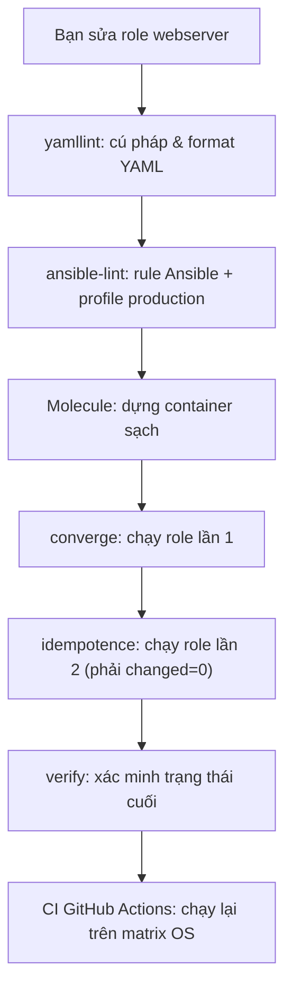
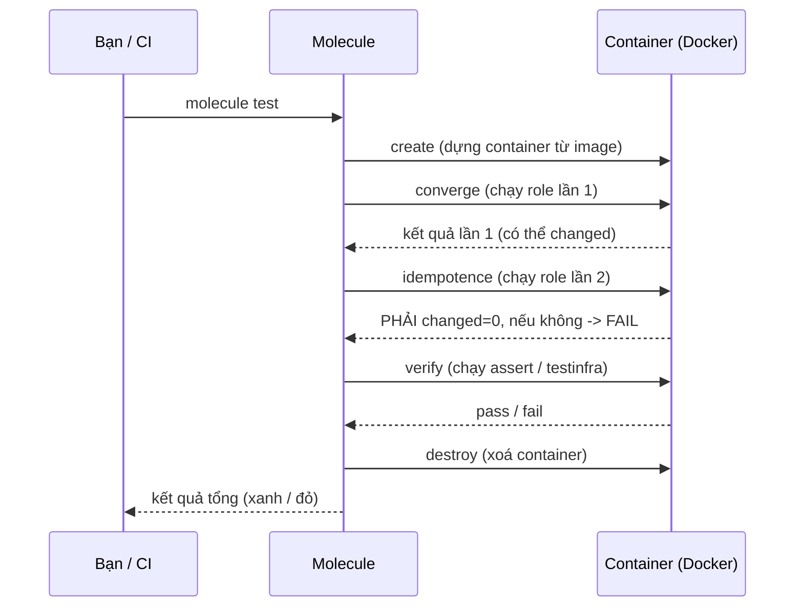

# 🎓 Testing Ansible — ansible-lint & Molecule cho role đáng tin cậy

> **Tác giả:** Mr.Rom\
> **Phiên bản:** v1.0.0\
> **Tạo lúc:** 13/06/2026\
> **Cập nhật:** 13/06/2026\
> **Level:** Intermediate\
> **Tags:** ansible, testing, molecule, ansible-lint, idempotence, ci-cd, configuration-management\
> **Yêu cầu trước:** [Advanced Playbooks & Strategies](02_advanced-playbooks-and-strategies.md)

> 🎯 *Bài trước bạn đã làm rolling update zero-downtime cho hàng trăm node Acme Shop. Nhưng câu hỏi đáng sợ vẫn còn: làm sao biết role `webserver` **thật sự chạy đúng** trên máy sạch — trước khi nó đụng vào production? Bài này dựng tầng test đầy đủ cho role: `yamllint` → `ansible-lint` → **Molecule** (chạy role trong container, kiểm tra idempotence + verify state), rồi nối vào CI GitHub Actions matrix.*

## 🎯 Sau bài này bạn sẽ

- [ ] Hiểu **tầng test CM**: `yamllint` (cú pháp YAML) → `ansible-lint` (rule + profile) → Molecule (test thật)
- [ ] Cấu hình `ansible-lint` với **profile `production`** và đọc/hiểu output rule
- [ ] Hiểu Molecule là gì và vì sao test role trong **container Docker/Podman** sạch
- [ ] Đọc/viết được `molecule/default/molecule.yml` (driver, platforms, provisioner, verifier) + `converge.yml`
- [ ] Thuộc vòng lệnh `molecule create` / `converge` / `idempotence` / `verify` / `test` / `destroy`
- [ ] Viết **verifier** bằng `ansible.builtin.assert` và bằng `testinfra`
- [ ] Hiểu vì sao **converge lần 2 phải `changed=0`** (test idempotence) và cách sửa khi fail
- [ ] Viết Molecule test hoàn chỉnh cho role `webserver` ở bài basic 02 + nối vào CI GitHub Actions matrix

---

## 1️⃣ Vì sao "chạy thử trên dev rồi apply prod" là canh bạc

Quay lại Acme Shop. Bạn vừa hoàn thiện role `webserver` (bài basic 02), test bằng cách `ansible-playbook --check` trên 1 con dev rồi apply lên prod. Vài tuần sau, một loạt sự cố:

- Một đồng nghiệp sửa `tasks/main.yml`, đổi `state: present` thành `state: latest`. Trên dev (đã cài Nginx sẵn) chạy vẫn `ok`, nhưng trên **node prod mới tinh** lại kéo bản Nginx khác version → config cũ vỡ.
- Lần khác, ai đó thêm task tạo file nhưng quên `mode`. Chạy lần 1 OK. Chạy lần 2 (đáng lẽ `changed=0`) lại **báo `changed`** mỗi lần — role không còn *idempotent* (bất biến khi lặp). Không ai để ý cho tới khi nó kích hoạt reload Nginx vô ích giữa giờ cao điểm.
- Reviewer nhìn PR sửa role mà không có cách nào chạy thử nhanh trên máy sạch → review bằng "nhìn mắt", bug lọt lưới.

Vấn đề gốc: role được test trên **máy đã có sẵn trạng thái** (dirty), không phải máy sạch như prod. Và không có gì chặn PR làm hỏng idempotence. Code app có unit test, integration test, CI bắt lỗi trước khi merge — còn code hạ tầng (role Ansible) thì "apply rồi cầu nguyện".

Giải pháp là dựng **tầng test cho role** y như tầng test cho app: lint tĩnh bắt lỗi cú pháp/style sớm, rồi **Molecule** dựng container sạch, chạy role lên đó, kiểm tra idempotence và xác minh trạng thái cuối — toàn bộ tự động, chạy được cả trên CI.

> 💡 Trước khi đi vào từng công cụ, ta xem cả tầng test xếp tầng ra sao qua sơ đồ — để biết mỗi công cụ bắt loại lỗi nào và chạy ở thứ tự nào.

### Tầng test CM — bắt lỗi từ rẻ tới đắt

Tầng test CM tuân nguyên tắc "test pyramid": kiểm tra rẻ-và-nhanh chạy trước (lint tĩnh, không cần máy đích), kiểm tra đắt-và-chậm chạy sau (Molecule dựng container thật). Sơ đồ dưới mô tả thứ tự và chi phí từng tầng:



→ Điểm mấu chốt: `yamllint` và `ansible-lint` chạy trong mili-giây và **không cần máy đích**, nên đặt trước để bắt lỗi rẻ. Molecule mới là tầng "tốn kém" (dựng container, chạy thật) — chỉ chạy khi 2 tầng lint đã xanh. Cùng triết lý "fail fast" của test pyramid: lỗi rẻ bắt trước, lỗi đắt bắt sau.

| Tầng | Công cụ | Bắt loại lỗi gì | Cần máy đích? |
|---|---|---|---|
| 1. Cú pháp YAML | `yamllint` | Thụt lề sai, trailing space, dòng quá dài, key trùng | ❌ Không |
| 2. Rule Ansible | `ansible-lint` | FQCN thiếu, `state` mơ hồ, `mode` thiếu, deprecated module | ❌ Không |
| 3. Chạy thật | Molecule | Role có thật sự cài/cấu hình đúng không, có idempotent không | ✅ Container |

---

## 2️⃣ Tầng 1 — `yamllint`: bắt lỗi cú pháp YAML trước tiên

Ansible đọc YAML, mà YAML cực nhạy với thụt lề và khoảng trắng. Một dấu cách thừa hay tab lẫn space đủ làm playbook vỡ với lỗi khó hiểu. `yamllint` quét toàn bộ file YAML, bắt các lỗi format **trước khi** Ansible kịp parse — rẻ nhất trong cả tầng.

Cài và chạy thử ngay trong thư mục role:

```bash
# cài qua pip (nên nằm trong virtualenv của dự án)
pip install yamllint

# lint toàn bộ file YAML trong role webserver
yamllint roles/webserver/
```

Giả sử `tasks/main.yml` có 1 dòng thừa khoảng trắng cuối và 1 dòng quá dài, kết quả:

```
roles/webserver/tasks/main.yml
  6:81      error    line too long (94 > 80 characters)  (line-length)
  12:24     error    trailing spaces  (trailing-spaces)
```

→ Cột đầu là `dòng:cột`, tiếp theo là mức độ (`error`/`warning`), mô tả, và trong ngoặc là **tên rule** (`line-length`, `trailing-spaces`) để bạn tra cứu hoặc tắt nếu cần. File sạch sẽ không in gì và trả `exit code 0` — đây là tín hiệu CI dùng để biết pass/fail.

Cấu hình `yamllint` qua file `.yamllint` ở gốc repo. `ansible-lint` (tầng sau) cũng gọi `yamllint` bên trong, nên ta nới vài rule cho hợp văn phong Ansible (Ansible hay có dòng dài, và `truthy` nên cho phép `true/false`):

```yaml
# .yamllint
extends: default

rules:
  line-length:
    max: 160          # Ansible task hay dài, 80 quá chật
  truthy:
    allowed-values: ["true", "false"]   # ép dùng true/false, cấm yes/no
  comments:
    min-spaces-from-content: 1
```

→ `extends: default` kế thừa bộ rule mặc định rồi override vài cái. Nới `line-length` lên 160 thực tế hơn cho Ansible; ép `truthy` chỉ nhận `true/false` để team không lẫn lộn `yes/no` (kiểu cũ, dễ gây nhầm). Lint xanh rồi, ta lên tầng 2 — nơi bắt lỗi *logic Ansible* chứ không chỉ format.

---

## 3️⃣ Tầng 2 — `ansible-lint`: rule + profile production

`yamllint` chỉ biết "đây là YAML hợp lệ" — nó không hiểu Ansible. `ansible-lint` thì hiểu: nó biết `state: latest` là mơ hồ (không reproducible), biết task thiếu `name` khó debug, biết module viết tắt (`apt` thay vì `ansible.builtin.apt`) là rủi ro. Nó đóng gói hàng trăm rule đúc kết từ best practice cộng đồng.

🪞 **Ẩn dụ**: nếu `yamllint` là *kiểm tra chính tả* (sai dấu, sai khoảng cách), thì `ansible-lint` là *biên tập viên review nội dung* — không chỉ bắt lỗi chính tả mà còn nhắc "câu này mơ hồ, viết lại cho rõ", "đoạn này dễ gây hiểu nhầm".

Cài và chạy:

```bash
pip install ansible-lint

# lint role webserver
ansible-lint roles/webserver/
```

Giả sử role còn dùng `apt` viết tắt và `state: latest`, kết quả:

```
WARNING  Listing 2 violation(s) that are fatal
fqcn[action-core]: Use FQCN for builtin module actions (apt).
roles/webserver/tasks/main.yml:2 Use `ansible.builtin.apt` instead.

package-latest: Package installs should not use latest.
roles/webserver/tasks/main.yml:2

Read documentation for instructions on how to ignore specific rule violations.

                Rule Violation Summary
 count tag              profile    rule associated tags
     1 fqcn[action-core] basic      formatting
     1 package-latest    safety     idempotency

Failed: 2 failure(s), 0 warning(s) on 3 files.
```

→ Mỗi vi phạm có **tên rule** (`fqcn[action-core]`, `package-latest`), file:dòng, và gợi ý sửa. Quan trọng nhất là cột **`profile`** trong bảng tổng kết: mỗi rule thuộc một profile (`basic`, `safety`, ...). Đây là chìa khoá để hiểu cơ chế profile bên dưới.

### Profile — chọn "độ khắt khe" của lint

`ansible-lint` xếp rule thành các **profile** tăng dần độ nghiêm ngặt. Bạn chọn profile nào thì lint áp dụng rule của profile đó **và tất cả profile thấp hơn**. Profile thấp dễ pass (cho người mới), profile cao khắt khe (cho code chuẩn bị lên production).

Các profile xếp từ lỏng → chặt:

| Profile | Mục tiêu | Ví dụ rule tiêu biểu |
|---|---|---|
| `min` | Chỉ bắt lỗi làm Ansible **không parse được** | Syntax error |
| `basic` | Tránh các thói quen xấu cơ bản | `fqcn`, deprecated module |
| `moderate` | Dễ đọc, dễ bảo trì | Task phải có `name`, không key trùng |
| `safety` | Loại các construct gây kết quả **bất ngờ** | `package-latest`, `command` thay vì module |
| `shared` | Sẵn sàng chia sẻ lên Galaxy | Metadata role đầy đủ |
| `production` | Chuẩn khắt khe nhất cho production | Gộp tất cả profile trên |

Khai báo profile (và mọi cấu hình khác) trong `.ansible-lint` ở gốc repo:

```yaml
# .ansible-lint
profile: production       # khắt khe nhất — chuẩn cho code lên prod

exclude_paths:
  - .cache/
  - .github/

# tắt rule cụ thể nếu thật sự cần (cân nhắc kỹ, ghi rõ lý do)
skip_list:
  - yaml[line-length]     # đã quản line-length trong .yamllint riêng
```

> [!WARNING]
> Đừng nhảy thẳng vào `profile: production` cho role cũ rồi nản vì cả trăm vi phạm. Chiến lược thực dụng: bắt đầu `profile: basic`, sửa hết, rồi nâng dần `safety` → `production`. Mỗi nấc nâng là một PR sạch, dễ review. `skip_list` chỉ dùng cho rule thật sự không hợp dự án — và phải comment lý do, đừng tắt bừa để "cho xanh".

Sau khi sửa role dùng FQCN đầy đủ và `state: present` thay vì `latest`, chạy lại sẽ xanh:

```bash
ansible-lint roles/webserver/
```

```
Passed: 0 failure(s), 0 warning(s) on 3 files. Last profile that met the validation criteria was 'production'.
```

→ Dòng cuối xác nhận role đã đạt chuẩn profile `production`. Lint tĩnh xanh là điều kiện cần — nhưng nó **không** đảm bảo role *chạy* đúng trên máy thật. Đó là việc của Molecule.

---

## 4️⃣ Molecule là gì — test role trong container sạch

Lint chỉ đọc code, không chạy code. Câu hỏi thật sự là: *role này apply lên một máy Ubuntu sạch thì có cài được Nginx, đẩy đúng config, và chạy 2 lần không bị `changed` thừa không?* Để trả lời, ta phải **thật sự chạy role** trên một môi trường giống prod — nhưng không thể đụng vào prod, cũng không muốn dựng VM thủ công mỗi lần test.

**Molecule** giải quyết: nó là framework test role Ansible bằng cách **tự dựng một môi trường tạm sạch** (mặc định là container Docker hoặc Podman), apply role lên đó, kiểm tra kết quả, rồi xoá sạch — tất cả bằng một vòng lệnh chuẩn hoá.

🪞 **Ẩn dụ**: Molecule giống **phòng lab vô trùng dùng một lần** cho role của bạn. Mỗi lần test, nó dựng một "phòng" mới tinh (container sạch), cho role "biểu diễn" trong đó, ghi hình lại kết quả, rồi dọn sạch phòng. Lần test sau lại phòng mới — không bao giờ bị "trạng thái còn sót từ lần trước" làm sai kết quả như khi test trên dev.

Vì sao container chứ không phải VM:

- **Nhanh** — container khởi động trong giây, VM mất phút. Test chạy đi chạy lại liên tục nên tốc độ quyết định.
- **Sạch tuyệt đối** — mỗi lần `create` là một container mới từ image gốc, không lẫn trạng thái cũ.
- **Chạy được trên CI** — GitHub Actions runner có sẵn Docker, không cần provision VM.
- **Matrix nhiều OS dễ** — đổi image `ubuntu:22.04` → `debian:12` → `rockylinux:9` là test được role trên nhiều distro.

> [!NOTE]
> Molecule đời đầu test bằng `serverspec` (Ruby). Bản hiện đại (Molecule 6+, 2026) dùng plugin driver: `molecule-plugins[docker]` cho Docker, `molecule-plugins[podman]` cho Podman. Cài Molecule **không** kèm sẵn driver — phải cài plugin tương ứng (xem hands-on §7).

### Vòng đời một lần test Molecule

Molecule định nghĩa một chuỗi bước chuẩn (gọi là *test sequence*). Hiểu chuỗi này là hiểu toàn bộ Molecule. Sơ đồ dưới mô tả vòng đời một lần `molecule test` đầy đủ:



→ Điểm cốt lõi: bước `idempotence` chạy role **lần thứ 2** và bắt buộc kết quả `changed=0`. Nếu lần 2 còn `changed`, nghĩa là role làm thay đổi máy mỗi lần chạy — vi phạm idempotency, Molecule fail ngay. Đây là kiểm tra mà `--check` thủ công thường bỏ sót.

---

## 5️⃣ Cấu trúc `molecule/default/` — 2 file cốt lõi

Molecule lưu kịch bản test trong thư mục `molecule/<tên-scenario>/`. Scenario mặc định tên `default`. Hai file quan trọng nhất:

```
roles/webserver/
└── molecule/
    └── default/
        ├── molecule.yml     # cấu hình: driver + platforms + provisioner + verifier
        └── converge.yml     # playbook gọi role để test (như "site.yml" thu nhỏ)
```

### `molecule.yml` — bộ não cấu hình

File này khai báo 4 khối lớn: **driver** (dùng gì để dựng môi trường), **platforms** (dựng những container nào), **provisioner** (chạy Ansible ra sao), **verifier** (xác minh kết quả bằng gì). Đây là cấu hình cho role `webserver`:

```yaml
# molecule/default/molecule.yml
---
driver:
  name: docker            # dùng Docker dựng container (cần molecule-plugins[docker])

platforms:
  - name: ubuntu-22
    image: geerlingguy/docker-ubuntu2204-ansible:latest
    pre_build_image: true       # image đã có systemd + python, không build lại
    command: /usr/sbin/init     # chạy init để systemd hoạt động (service module cần)
    cgroupns_mode: host
    privileged: true            # cần cho systemd trong container
    volumes:
      - /sys/fs/cgroup:/sys/fs/cgroup:rw

provisioner:
  name: ansible
  config_options:
    defaults:
      callbacks_enabled: ansible.posix.profile_tasks   # in thời gian mỗi task

verifier:
  name: ansible           # verify bằng playbook ansible.builtin.assert
```

→ Giải thích từng khối:

- **`driver.name: docker`** — Molecule dùng Docker để tạo/xoá container. Đổi thành `podman` nếu dùng Podman.
- **`platforms`** — danh sách môi trường test. Mỗi mục là 1 container. Để role test được module `service` (start/enable Nginx), container phải có **systemd** chạy — nên ta dùng image `geerlingguy/docker-*-ansible` (đã cài sẵn systemd + Python + Ansible), bật `privileged` + mount cgroup + chạy `command: /usr/sbin/init`.
- **`provisioner.name: ansible`** — Molecule gọi Ansible thật để chạy `converge.yml`. `profile_tasks` callback in thời gian từng task (tiện soi task chậm).
- **`verifier.name: ansible`** — xác minh kết quả bằng playbook `verify.yml` viết bằng `ansible.builtin.assert` (chi tiết §6). Lựa chọn còn lại là `testinfra`.

> [!IMPORTANT]
> Module `ansible.builtin.service` (start/enable Nginx) cần một **init system** (systemd) đang chạy bên trong container. Container mặc định (`ubuntu:22.04` trần) **không** có systemd — `service` sẽ fail với lỗi "Could not find the requested service". Vì thế phải dùng image có systemd (`geerlingguy/docker-*-ansible`) + `privileged: true` + `command: /usr/sbin/init`. Đây là cạm bẫy số 1 khi mới dùng Molecule.

### `converge.yml` — playbook gọi role

`converge.yml` là playbook Molecule chạy để **áp dụng role** lên container. Nó chính là phiên bản thu nhỏ của `site.yml` thật, chỉ gọi đúng role cần test:

```yaml
# molecule/default/converge.yml
---
- name: Converge
  hosts: all
  become: true
  tasks:
    - name: "Áp dụng role webserver"
      ansible.builtin.include_role:
        name: webserver
```

→ `hosts: all` = mọi platform khai báo trong `molecule.yml`. `become: true` vì cài Nginx cần root. Có thể truyền biến test ngay đây để ép một kịch bản cụ thể (vd test với `enable_gzip: true`):

```yaml
# molecule/default/converge.yml (biến thể: test cấu hình prod)
---
- name: Converge
  hosts: all
  become: true
  vars:
    server_name: acmeshop.vn
    enable_gzip: true
  tasks:
    - name: "Áp dụng role webserver với cấu hình prod"
      ansible.builtin.include_role:
        name: webserver
```

→ Đây là sức mạnh thật của Molecule: bạn test được role với **nhiều bộ biến khác nhau** (mỗi scenario một bộ), đảm bảo cả nhánh `enable_gzip: true` lẫn `false` đều chạy đúng — điều mà test thủ công trên 1 con dev khó bao phủ.

---

## 6️⃣ Verifier — xác minh trạng thái cuối (assert vs testinfra)

`converge` chạy xong nghĩa là role *không lỗi* — nhưng chưa chứng minh nó làm *đúng việc*. Bước `verify` mới trả lời: Nginx có thật sự đang chạy không? Port 80 có mở không? File config có chứa đúng `server_name` không? Molecule cho 2 cách viết verifier.

### Cách 1 — `ansible.builtin.assert` (verifier `ansible`)

Cách này viết verify bằng chính Ansible — một playbook `verify.yml` dùng module `assert` để khẳng định các điều kiện. Ưu điểm: không cần học công cụ mới, ai biết Ansible là viết được.

```yaml
# molecule/default/verify.yml
---
- name: Verify
  hosts: all
  become: true
  gather_facts: false
  tasks:
    - name: "Lấy trạng thái service nginx"
      ansible.builtin.service_facts:

    - name: "Kiểm tra nginx đang chạy và được enable"
      ansible.builtin.assert:
        that:
          - "'nginx.service' in ansible_facts.services"
          - "ansible_facts.services['nginx.service'].state == 'running'"
        fail_msg: "Nginx không chạy sau khi apply role!"
        success_msg: "OK — Nginx đang chạy."

    - name: "Đọc nội dung file config site"
      ansible.builtin.slurp:
        src: /etc/nginx/sites-available/acmeshop
      register: site_conf

    - name: "Kiểm tra config chứa đúng server_name"
      ansible.builtin.assert:
        that:
          - "'acmeshop.vn' in (site_conf.content | b64decode)"
        fail_msg: "Config thiếu server_name mong đợi!"

    - name: "Kiểm tra port 80 đang listen"
      ansible.builtin.wait_for:
        port: 80
        host: 127.0.0.1
        timeout: 5
```

→ Mỗi task `assert` khẳng định một điều kiện trong `that:` — nếu sai, Molecule fail và in `fail_msg`. `service_facts` nạp trạng thái mọi service; `slurp` đọc file (trả base64, nên phải `b64decode`); `wait_for` xác minh port thật sự listen. Verifier `ansible` là lựa chọn mặc định và đủ dùng cho hầu hết role.

### Cách 2 — `testinfra` (verifier `testinfra`)

`testinfra` là thư viện Python (chạy trên `pytest`) chuyên kiểm tra trạng thái hệ thống bằng cú pháp khai báo gọn. Ưu điểm: assertion đọc rất tự nhiên, tận dụng được hệ sinh thái `pytest`. Để dùng, đổi verifier trong `molecule.yml`:

```yaml
# molecule/default/molecule.yml (đổi verifier)
verifier:
  name: testinfra
```

Rồi viết test trong `molecule/default/tests/test_default.py`:

```python
# molecule/default/tests/test_default.py
"""Kiểm tra trạng thái máy sau khi apply role webserver."""


def test_nginx_da_cai(host):
    # 1. Gói nginx phải được cài
    nginx = host.package("nginx")
    assert nginx.is_installed


def test_nginx_dang_chay_va_enable(host):
    # 2. Service nginx phải running + enable lúc boot
    svc = host.service("nginx")
    assert svc.is_running
    assert svc.is_enabled


def test_port_80_listen(host):
    # 3. Phải có tiến trình listen trên port 80
    assert host.socket("tcp://0.0.0.0:80").is_listening


def test_config_co_server_name(host):
    # 4. File config phải tồn tại và chứa đúng server_name
    conf = host.file("/etc/nginx/sites-available/acmeshop")
    assert conf.exists
    assert conf.user == "root"
    assert conf.contains("acmeshop.vn")
```

→ Mỗi hàm `test_*` nhận fixture `host` (Molecule + testinfra tự inject, trỏ tới container đang test). `host.package`, `host.service`, `host.socket`, `host.file` là các API khai báo của testinfra — đọc gần như tiếng Anh tự nhiên. Cài bằng `pip install pytest-testinfra`.

So sánh nhanh 2 verifier để chọn:

| Tiêu chí | `ansible` (assert) | `testinfra` (pytest) |
|---|---|---|
| Ngôn ngữ | YAML (Ansible) | Python |
| Cần học thêm? | Không (đã biết Ansible) | Có (pytest + testinfra API) |
| Assertion đọc tự nhiên | Trung bình | Rất tốt (`is_running`, `is_listening`) |
| Tận dụng hệ sinh thái | Ansible | pytest (fixture, parametrize, report) |
| Khi nên dùng | Team thuần Ansible, role đơn giản | Team có Python, cần assertion phong phú |

→ Không có lựa chọn "đúng tuyệt đối": team thuần Ansible thường chọn `ansible` cho gọn; team đã quen Python/pytest chọn `testinfra` để assertion sạch hơn. Bài này hands-on dùng verifier `ansible` (ít phụ thuộc nhất).

---

## 7️⃣ Hands-on — Molecule test cho role `webserver` bài basic 02

Mục tiêu: dựng bộ test Molecule hoàn chỉnh cho role `webserver` đã viết ở bài basic 02, chạy đủ vòng `create → converge → idempotence → verify → destroy`.

### 🛠️ Bước 1: Cài Molecule + driver Docker

Molecule và driver nên cài trong virtualenv riêng của dự án để không đụng hệ thống:

```bash
# 1. Tạo và kích hoạt virtualenv
python3 -m venv .venv
source .venv/bin/activate

# 2. Cài Molecule + plugin Docker + ansible-lint + testinfra
pip install "molecule" "molecule-plugins[docker]" ansible-lint pytest-testinfra

# 3. Kiểm tra Docker đang chạy (Molecule cần Docker daemon)
docker info > /dev/null && echo "Docker OK"
```

Kết quả mong đợi:

```
Docker OK
```

> [!IMPORTANT]
> Molecule **không** đi kèm driver. Nếu chỉ `pip install molecule` rồi chạy `molecule create`, bạn sẽ gặp lỗi `driver named 'docker' not found`. Phải cài thêm `molecule-plugins[docker]` (hoặc `[podman]`). Đây là lỗi setup hay gặp nhất.

### 🛠️ Bước 2: Khởi tạo scenario Molecule cho role

Vào thư mục role `webserver` rồi sinh scenario mặc định bằng `molecule init scenario`:

```bash
molecule init scenario --driver-name docker -- roles/webserver/molecule/default 2>/dev/null || \
  molecule init scenario default
```

→ Thực tế cách chuẩn 2026 là chạy `molecule init scenario` **bên trong** thư mục role. Để rõ ràng, ta tạo tay cây thư mục — nó chỉ gồm 1 thư mục và 2-3 file:

```bash
mkdir -p roles/webserver/molecule/default
```

Cây thư mục đích sau khi xong:

```
roles/webserver/
├── tasks/main.yml          # (đã có từ bài basic 02)
├── handlers/main.yml
├── templates/nginx-site.conf.j2
├── defaults/main.yml
└── molecule/
    └── default/
        ├── molecule.yml
        ├── converge.yml
        └── verify.yml
```

### 🛠️ Bước 3: Viết `molecule.yml`

Đây là cấu hình ở §5 — chạy role trên container Ubuntu 22.04 có systemd, verify bằng Ansible assert:

```yaml
# roles/webserver/molecule/default/molecule.yml
---
driver:
  name: docker

platforms:
  - name: ubuntu-22
    image: geerlingguy/docker-ubuntu2204-ansible:latest
    pre_build_image: true
    command: /usr/sbin/init
    cgroupns_mode: host
    privileged: true
    volumes:
      - /sys/fs/cgroup:/sys/fs/cgroup:rw

provisioner:
  name: ansible
  config_options:
    defaults:
      callbacks_enabled: ansible.posix.profile_tasks

verifier:
  name: ansible
```

### 🛠️ Bước 4: Viết `converge.yml`

Playbook áp dụng role với bộ biến giống prod (bật gzip + đặt domain thật) để test cả nhánh `enable_gzip`:

```yaml
# roles/webserver/molecule/default/converge.yml
---
- name: Converge
  hosts: all
  become: true
  vars:
    server_name: acmeshop.vn
    enable_gzip: true
  tasks:
    - name: "Áp dụng role webserver"
      ansible.builtin.include_role:
        name: webserver
```

### 🛠️ Bước 5: Viết `verify.yml`

Xác minh đúng những gì role phải làm: Nginx chạy + enable, config chứa `server_name`, port 80 listen:

```yaml
# roles/webserver/molecule/default/verify.yml
---
- name: Verify
  hosts: all
  become: true
  gather_facts: false
  tasks:
    - name: "Lấy trạng thái mọi service"
      ansible.builtin.service_facts:

    - name: "Nginx phải đang chạy"
      ansible.builtin.assert:
        that:
          - "'nginx.service' in ansible_facts.services"
          - "ansible_facts.services['nginx.service'].state == 'running'"
        fail_msg: "Nginx không chạy sau khi apply role!"
        success_msg: "OK — Nginx đang chạy."

    - name: "Đọc file config site"
      ansible.builtin.slurp:
        src: /etc/nginx/sites-available/acmeshop
      register: site_conf

    - name: "Config phải chứa đúng server_name và bật gzip"
      ansible.builtin.assert:
        that:
          - "'acmeshop.vn' in (site_conf.content | b64decode)"
          - "'gzip on;' in (site_conf.content | b64decode)"
        fail_msg: "Config render sai — thiếu server_name hoặc gzip!"

    - name: "Port 80 phải listen"
      ansible.builtin.wait_for:
        port: 80
        host: 127.0.0.1
        timeout: 5
```

### 🛠️ Bước 6: Chạy từng bước để hiểu vòng lệnh

Trước khi chạy `test` đầy đủ, ta chạy thủ công từng bước để thấy rõ mỗi lệnh làm gì. Đầu tiên dựng container:

```bash
cd roles/webserver
molecule create
```

Kết quả mong đợi (rút gọn):

```
INFO     default scenario test matrix: dependency, create, prepare
INFO     Running default > create
...
PLAY RECAP *********************************************************
ubuntu-22 : ok=3    changed=2    unreachable=0    failed=0
```

→ Container `ubuntu-22` đã được dựng. Kiểm tra bằng `docker ps` sẽ thấy 1 container đang chạy. Giờ apply role lần 1:

```bash
molecule converge
```

```
TASK [webserver : Cài gói nginx] **********************************
changed: [ubuntu-22]

TASK [webserver : Sinh và đẩy config site] ************************
changed: [ubuntu-22]

RUNNING HANDLER [webserver : Reload nginx] ************************
changed: [ubuntu-22]

PLAY RECAP ********************************************************
ubuntu-22 : ok=6    changed=4    unreachable=0    failed=0
```

→ Lần 1 có `changed=4` là đúng — container sạch nên mọi thứ đều mới. Giờ là bước **quan trọng nhất**: chạy idempotence (Molecule tự chạy role lần 2 và kiểm tra `changed=0`):

```bash
molecule idempotence
```

```
INFO     Running default > idempotence
...
PLAY RECAP ********************************************************
ubuntu-22 : ok=6    changed=0    unreachable=0    failed=0

INFO     Idempotence completed successfully.
```

→ `changed=0` ở lần 2 → role **idempotent** → `Idempotence completed successfully`. Nếu lần 2 còn `changed`, Molecule fail với `Idempotence test failed because of the following tasks:` kèm tên task vi phạm. Tiếp theo xác minh trạng thái:

```bash
molecule verify
```

```
TASK [Nginx phải đang chạy] **************************************
ok: [ubuntu-22] => {
    "msg": "OK — Nginx đang chạy."
}

TASK [Config phải chứa đúng server_name và bật gzip] *************
ok: [ubuntu-22]

PLAY RECAP ********************************************************
ubuntu-22 : ok=5    changed=0    unreachable=0    failed=0

INFO     Verifier completed successfully.
```

→ Mọi `assert` pass → `Verifier completed successfully`. Cuối cùng dọn sạch:

```bash
molecule destroy
```

→ Container bị xoá hoàn toàn, máy về trạng thái sạch. `docker ps` không còn thấy container test.

### 🛠️ Bước 7: Chạy cả vòng bằng 1 lệnh `molecule test`

`molecule test` chạy **toàn bộ chuỗi** một mạch: `dependency → create → prepare → converge → idempotence → verify → cleanup → destroy`. Đây chính là lệnh CI sẽ gọi:

```bash
molecule test
```

Kết quả tổng (rút gọn các bước):

```
INFO     default scenario test matrix: dependency, create, prepare, converge, idempotence, side_effect, verify, cleanup, destroy
...
INFO     Running default > converge        # changed=4
INFO     Running default > idempotence     # changed=0  -> PASS
INFO     Running default > verify          # mọi assert OK
INFO     Running default > destroy
INFO     Verifier completed successfully.
```

→ Nếu **bất kỳ** bước nào fail (lint đỏ, idempotence còn changed, assert sai), `molecule test` dừng ngay và trả exit code khác 0 — CI bắt được liền. `molecule test` luôn `destroy` ở cuối kể cả khi pass, nên không để rác container. Khi debug, dùng `molecule converge` rồi `molecule login` để vào trong container soi tay (Molecule giữ container sống); chỉ dùng `molecule test` khi muốn chạy "sạch từ đầu tới cuối".

> [!TIP]
> Lúc đang phát triển, **đừng** chạy `molecule test` mỗi lần sửa — nó dựng/xoá container tốn thời gian. Dùng vòng nhanh: `molecule converge` (apply role) → sửa code → `molecule converge` lại (container vẫn sống, chạy lại tức thì). Khi ưng rồi mới `molecule test` một phát cuối để chạy sạch toàn bộ chuỗi.

---

## 8️⃣ Nối vào CI — GitHub Actions matrix

Test chạy được ở máy bạn là tốt, nhưng giá trị thật là khi nó **tự chạy trên mọi PR** — chặn code hỏng trước khi merge. Và Acme Shop chạy cả Ubuntu lẫn Rocky Linux, nên ta dùng **matrix** để test role trên nhiều distro song song trong cùng một workflow.

Trước hết, để matrix đổi được image, sửa `molecule.yml` cho phép `platforms.image` đọc từ biến môi trường:

```yaml
# molecule/default/molecule.yml (cho phép CI đổi image qua biến)
platforms:
  - name: instance
    image: "${MOLECULE_DOCKER_IMAGE:-geerlingguy/docker-ubuntu2204-ansible:latest}"
    pre_build_image: true
    command: /usr/sbin/init
    cgroupns_mode: host
    privileged: true
    volumes:
      - /sys/fs/cgroup:/sys/fs/cgroup:rw
```

→ Cú pháp `${VAR:-default}` nghĩa là: lấy biến môi trường `MOLECULE_DOCKER_IMAGE`, nếu chưa set thì dùng Ubuntu mặc định. CI sẽ set biến này cho từng nhánh matrix.

Workflow GitHub Actions `.github/workflows/molecule.yml`:

```yaml
# .github/workflows/molecule.yml
name: Molecule Test

on:
  push:
    branches: [main]
  pull_request:

jobs:
  molecule:
    runs-on: ubuntu-latest
    strategy:
      fail-fast: false          # 1 distro fail không huỷ các distro khác
      matrix:
        image:
          - geerlingguy/docker-ubuntu2204-ansible:latest
          - geerlingguy/docker-rockylinux9-ansible:latest

    steps:
      - name: "Lấy mã nguồn"
        uses: actions/checkout@v4

      - name: "Cài Python"
        uses: actions/setup-python@v5
        with:
          python-version: "3.12"

      - name: "Cài Molecule + driver + lint"
        run: |
          pip install "molecule" "molecule-plugins[docker]" ansible-lint

      - name: "Lint role (yamllint + ansible-lint)"
        run: ansible-lint roles/webserver/

      - name: "Chạy Molecule test"
        working-directory: roles/webserver
        env:
          MOLECULE_DOCKER_IMAGE: ${{ matrix.image }}
        run: molecule test
```

→ Phân tích các điểm mấu chốt:

- **`strategy.matrix.image`** — liệt kê 2 image (Ubuntu + Rocky). GitHub Actions tự nhân workflow thành 2 job chạy song song, mỗi job một distro.
- **`fail-fast: false`** — mặc định matrix sẽ huỷ mọi job khi 1 job fail. Tắt đi để thấy *tất cả* distro nào hỏng, không chỉ cái fail đầu tiên.
- **`MOLECULE_DOCKER_IMAGE: ${{ matrix.image }}`** — truyền image của nhánh matrix hiện tại vào biến mà `molecule.yml` đọc. Cùng một bộ test, chạy trên 2 distro.
- **Bước lint chạy trước `molecule test`** — đúng thứ tự tầng test: lint rẻ chạy trước, fail là dừng luôn, không tốn công dựng container.

> [!NOTE]
> GitHub Actions runner `ubuntu-latest` đã có sẵn Docker daemon, nên không cần bước cài Docker. Với Podman hoặc self-hosted runner thì phải cài thêm. Mỗi lần có PR sửa role, workflow này tự chạy — reviewer thấy ✅/❌ ngay trên PR, không phải tin "lời hứa đã test thủ công" nữa.

---

## 💡 Cạm bẫy thường gặp & Best practice

### ❌ Cạm bẫy: idempotence fail vì task luôn báo `changed`

- **Triệu chứng**: `molecule converge` OK, nhưng `molecule idempotence` fail với `changed=1` ở lần 2, kèm tên task vi phạm.
- **Nguyên nhân**: Task không idempotent — hay gặp nhất là dùng `command`/`shell` (luôn chạy, luôn `changed`), hoặc `template`/`copy` thiếu `mode` (Ansible coi như thay đổi quyền mỗi lần), hoặc `lineinfile` regex khớp lỏng nên ghi lại liên tục.
- **Cách tránh**: Ưu tiên module chuyên dụng thay `command`/`shell`. Nếu buộc dùng `command`, thêm `changed_when:` / `creates:` để Ansible biết khi nào thật sự đổi. Luôn set `mode:` cho `template`/`copy`/`file`. Chính idempotence test của Molecule là thứ phơi bày những lỗi này.

### ❌ Cạm bẫy: module `service` fail trong container vì thiếu systemd

- **Triệu chứng**: `converge` fail ở task start Nginx với lỗi `Could not find the requested service nginx: host` hoặc `System has not been booted with systemd`.
- **Nguyên nhân**: Container mặc định không có init system. Module `service`/`systemd` cần systemd đang chạy (PID 1).
- **Cách tránh**: Dùng image có sẵn systemd (`geerlingguy/docker-*-ansible`), bật `privileged: true`, mount `/sys/fs/cgroup`, và đặt `command: /usr/sbin/init`. Hoặc với role không quản service thì tránh hẳn module `service` trong môi trường test.

### ✅ Best practice: lint trước, Molecule sau — và chạy cả hai trong CI

- **Vì sao**: Lint tĩnh (`yamllint` + `ansible-lint`) chạy trong mili-giây, không cần container — bắt phần lớn lỗi rẻ. Molecule đắt hơn (dựng container) nên để sau. Đưa cả hai vào CI để mọi PR đều bị chặn nếu hỏng, không phụ thuộc trí nhớ con người.
- **Cách áp dụng**: Pipeline `yamllint → ansible-lint (profile production) → molecule test` theo đúng thứ tự rẻ-tới-đắt. Mỗi role có scenario `molecule/default/` riêng. Test trên matrix nhiều distro nếu role hứa hỗ trợ đa nền tảng. Vòng dev nhanh dùng `molecule converge`, chỉ `molecule test` cuối cùng.

---

## 🧠 Tự kiểm tra (Self-check)

**Q1.** Vì sao nên chạy `yamllint`/`ansible-lint` trước Molecule, mà không chạy Molecule luôn?

<details>
<summary>💡 Đáp án</summary>

Vì tầng test theo nguyên tắc rẻ-trước-đắt-sau (test pyramid). `yamllint` và `ansible-lint` chạy tĩnh trong mili-giây, **không cần** dựng container hay máy đích — bắt được phần lớn lỗi cú pháp/best-practice rất rẻ. Molecule mới là tầng tốn kém (dựng container, chạy role thật, kiểm tra idempotence). Nếu lint đã đỏ thì không tốn công dựng container — fail fast, tiết kiệm thời gian CI.

</details>

**Q2.** Profile `production` của `ansible-lint` khác `basic` ở điểm nào? Nên dùng profile nào cho role cũ đang có nhiều vi phạm?

<details>
<summary>💡 Đáp án</summary>

`production` là profile khắt khe nhất — nó gộp toàn bộ rule của các profile thấp hơn (`min`, `basic`, `moderate`, `safety`, `shared`) cộng thêm rule riêng. `basic` chỉ bắt các thói quen xấu cơ bản (FQCN, deprecated module). Với role cũ nhiều vi phạm, nên **bắt đầu từ `basic`**, sửa hết, rồi nâng dần `safety` → `production` qua từng PR sạch — tránh bị ngợp bởi cả trăm vi phạm cùng lúc.

</details>

**Q3.** Bước `idempotence` trong Molecule kiểm tra điều gì? Điều kiện pass là gì?

<details>
<summary>💡 Đáp án</summary>

`idempotence` chạy role **lần thứ 2** (ngay sau `converge` lần 1) và kiểm tra rằng lần 2 không làm thay đổi gì máy nữa — điều kiện pass là `changed=0` trong PLAY RECAP. Nếu lần 2 còn `changed`, nghĩa là role thay đổi máy mỗi lần chạy (không idempotent) → Molecule fail. Đây là kiểm tra mà `--check` thủ công thường bỏ sót, hay phát hiện lỗi `command`/`shell` không có `changed_when`, hoặc `template`/`copy` thiếu `mode`.

</details>

**Q4.** Vì sao phải dùng image có systemd + `privileged: true` để test role `webserver`, thay vì image `ubuntu:22.04` trần?

<details>
<summary>💡 Đáp án</summary>

Vì role `webserver` dùng module `ansible.builtin.service` để start + enable Nginx, mà module này cần một **init system (systemd)** đang chạy bên trong container. Image `ubuntu:22.04` trần không có systemd → `service` fail với lỗi "System has not been booted with systemd". Image `geerlingguy/docker-*-ansible` đã cài sẵn systemd; thêm `privileged: true`, mount `/sys/fs/cgroup` và `command: /usr/sbin/init` để systemd chạy được như PID 1 trong container.

</details>

**Q5.** `molecule converge` và `molecule test` khác nhau thế nào? Khi đang phát triển nên dùng cái nào?

<details>
<summary>💡 Đáp án</summary>

`molecule converge` chỉ chạy role lên container (giữ container **sống** sau đó) — nhanh, lặp lại được tức thì, lý tưởng cho vòng dev "sửa code → converge lại". `molecule test` chạy **toàn bộ chuỗi** sạch từ đầu (`create → converge → idempotence → verify → destroy`) và luôn xoá container ở cuối — chậm hơn, dùng cho CI hoặc lần chạy cuối để chắc chắn. Khi đang phát triển nên dùng `converge` (+ `molecule login` để soi container); chỉ `molecule test` khi muốn kiểm tra sạch toàn diện.

</details>

---

## ⚡ Tra cứu nhanh (Cheatsheet)

| Mục đích | Lệnh |
|---|---|
| Lint cú pháp YAML | `yamllint roles/webserver/` |
| Lint rule Ansible | `ansible-lint roles/webserver/` |
| Cài Molecule + driver Docker | `pip install "molecule" "molecule-plugins[docker]"` |
| Khởi tạo scenario | `molecule init scenario default` |
| Dựng container test | `molecule create` |
| Apply role (lần 1) | `molecule converge` |
| Test idempotence (lần 2, phải `changed=0`) | `molecule idempotence` |
| Chạy verifier (assert/testinfra) | `molecule verify` |
| Vào trong container soi tay | `molecule login` |
| Xoá container test | `molecule destroy` |
| Chạy cả vòng sạch | `molecule test` |
| Liệt kê scenario | `molecule list` |

```yaml
# Khung molecule.yml tối thiểu (driver + platform có systemd + verifier)
driver:
  name: docker
platforms:
  - name: instance
    image: geerlingguy/docker-ubuntu2204-ansible:latest
    pre_build_image: true
    command: /usr/sbin/init
    privileged: true
    cgroupns_mode: host
    volumes:
      - /sys/fs/cgroup:/sys/fs/cgroup:rw
provisioner:
  name: ansible
verifier:
  name: ansible
```

```yaml
# Khung .ansible-lint
profile: production
exclude_paths:
  - .cache/
  - .github/
```

---

## 📚 Từ Điển Thuật Ngữ (Glossary)

| EN | VN | Giải thích |
|---|---|---|
| `yamllint` | (giữ nguyên) | Công cụ lint cú pháp/format YAML (thụt lề, trailing space, dòng dài) |
| `ansible-lint` | (giữ nguyên) | Công cụ lint rule/best-practice riêng cho Ansible |
| Profile | Hồ sơ độ khắt khe | Nhóm rule `ansible-lint` xếp theo độ nghiêm ngặt (`min`→`production`) |
| FQCN | Tên collection đầy đủ | `namespace.collection.module`, vd `ansible.builtin.apt` |
| Molecule | (giữ nguyên) | Framework test role Ansible trong môi trường tạm (container) |
| Driver | Trình điều khiển | Cơ chế Molecule dùng dựng môi trường test (docker/podman) |
| Scenario | Kịch bản | Một thư mục test Molecule (`molecule/<tên>/`), mặc định `default` |
| Platform | Nền tảng đích | Một container/máy Molecule dựng để chạy role lên |
| Provisioner | Trình cấp phát | Bộ phận chạy Ansible thật để apply role (luôn là `ansible`) |
| Verifier | Trình xác minh | Bộ phận kiểm tra trạng thái cuối (`ansible` assert hoặc `testinfra`) |
| Converge | Hội tụ | Bước Molecule apply role lên platform |
| Idempotence | Tính bất biến khi lặp | Chạy lại role cho cùng kết quả; lần 2 phải `changed=0` |
| `testinfra` | (giữ nguyên) | Thư viện Python (trên pytest) kiểm tra trạng thái hệ thống |
| `ansible.builtin.assert` | (giữ nguyên) | Module Ansible khẳng định điều kiện, fail nếu sai |
| Matrix | Ma trận | Cơ chế CI nhân job để test trên nhiều biến (vd nhiều distro) |
| `fail-fast` | Dừng sớm | Tuỳ chọn matrix; `false` = không huỷ job khác khi 1 job fail |

---

## 🔗 Liên kết & Tài nguyên

### 🧭 Định hướng lộ trình học

- ⬅️ **Bài trước:** [Advanced Playbooks — Hiệu năng, error handling & rolling update zero-downtime](02_advanced-playbooks-and-strategies.md)
- ➡️ **Bài tiếp theo:** [AWX / Ansible Automation Platform & vận hành CM quy mô lớn](04_awx-aap-and-at-scale.md)
- ↑ **Về cụm:** [Configuration Management — README](../../README.md)

### 🧩 Các chủ đề có thể bạn quan tâm

- [Playbooks & Roles — Cấu trúc, biến, Jinja2 template, tái sử dụng](../01_basic/02_playbooks-and-roles.md)
- [Dynamic Inventory — Quản lý node cloud co giãn tự động](01_dynamic-inventory-and-cloud.md)
- [Configuration Management Intermediate — Khi Ansible gặp quy mô Production](00_intermediate-overview.md)

### 🌐 Tài nguyên tham khảo khác

- [Molecule documentation](https://ansible.readthedocs.io/projects/molecule/) — spec chính thức về scenario, driver, verifier
- [ansible-lint — Profiles](https://ansible.readthedocs.io/projects/lint/profiles/) — chi tiết 6 profile và rule từng cấp
- [testinfra documentation](https://testinfra.readthedocs.io/) — API kiểm tra hệ thống (package/service/socket/file)
- [geerlingguy/docker-* Ansible images](https://hub.docker.com/u/geerlingguy) — image container có sẵn systemd để test role

---

## 📌 Nhật ký thay đổi (Changelog)

- **v1.0.0 (13/06/2026)** — Bản đầu tiên. Cover: tầng test CM (`yamllint` → `ansible-lint` profile production → Molecule); Molecule là gì + test role trong container Docker/Podman; cấu trúc `molecule/default/molecule.yml` (driver/platforms/provisioner/verifier) + `converge.yml`; vòng lệnh `create/converge/idempotence/verify/test/destroy`; verifier `ansible.builtin.assert` vs `testinfra`; test idempotence (converge lần 2 phải `changed=0`); CI GitHub Actions matrix nhiều distro; hands-on viết Molecule test hoàn chỉnh cho role `webserver` ở bài basic 02.
