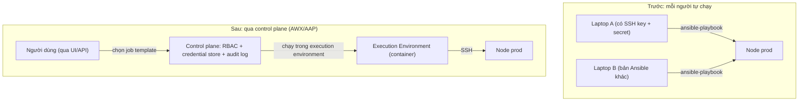
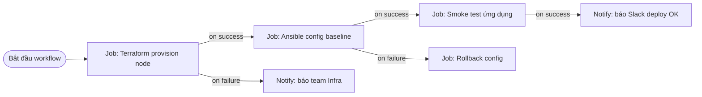
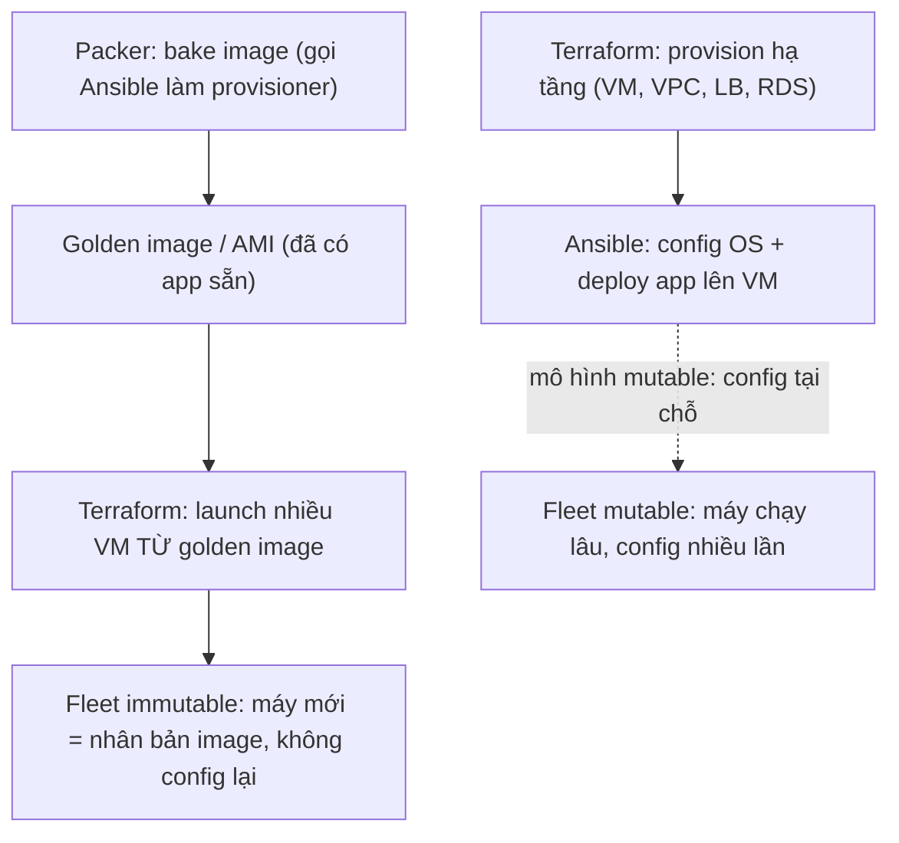

# 🎓 AWX / Ansible Automation Platform & vận hành CM quy mô lớn

> **Tác giả:** Mr.Rom\
> **Phiên bản:** v1.0.0\
> **Tạo lúc:** 13/06/2026\
> **Cập nhật:** 13/06/2026\
> **Level:** Intermediate\
> **Tags:** ansible, awx, aap, configuration-management, secrets, immutable-infra, devops\
> **Yêu cầu trước:** [Testing với Molecule](03_testing-with-molecule.md)

> 🎯 *Bạn đã có dynamic inventory, playbook tối ưu, role được test bằng Molecule. Nhưng tất cả vẫn chạy từ **laptop của bạn** — chỉ bạn biết secret, chỉ bạn bấm `ansible-playbook`. Bài cuối cụm intermediate này biến đống playbook đó thành **dịch vụ tự động hoá tập trung** (AWX/AAP) có UI, RBAC, secret store, lịch chạy, audit log — và đặt CM đúng chỗ trong stack 2026 (Terraform + Packer + immutable).*

## 🎯 Sau bài này bạn sẽ

- [ ] Phân biệt **AWX** (open-source) và **Ansible Automation Platform** (Red Hat, có support thương mại) — chọn cái nào, khi nào
- [ ] Hiểu các thành phần cốt lõi của control plane: **job template + survey**, **schedule**, **workflow template**, **RBAC**, **credential store mã hoá**, **notification**, **audit log**
- [ ] Dùng `ansible-pull` cho **pull-mode** ở scale/edge — node tự kéo playbook về tự chạy
- [ ] Thay/bổ sung `ansible-vault` bằng **external secret manager** (HashiCorp Vault, AWS Secrets Manager, CyberArk) qua lookup plugin
- [ ] Hiểu **execution environment** — container hoá Ansible runtime để chạy nhất quán mọi nơi
- [ ] Ghép **CM + IaC + immutable** đúng pattern 2026: Terraform provision → Ansible config → Packer bake image
- [ ] Biết **khi nào CM vẫn còn giá trị** trong thế giới container + immutable

---

## 1️⃣ Vì sao "ansible-playbook từ laptop" không sống nổi ở scale

Quay lại Acme Shop. Sau 3 bài intermediate, bạn đã làm chủ kỹ thuật: dynamic inventory tự kéo danh sách EC2/GCE, rolling update zero-downtime, role được Molecule test trước khi merge. Nhưng hạ tầng giờ là **vài trăm node** trên nhiều account cloud, và quy trình vận hành vẫn y như hồi 5 con server:

- Bạn SSH key + AWS credentials nằm trong `~/.ssh` và `~/.aws` trên **laptop cá nhân**. Bạn nghỉ phép → không ai deploy được.
- File `vault-pass.txt` để giải mã `ansible-vault` cũng trên laptop bạn. Nó lộ là **toàn bộ secret prod lộ**.
- Đồng nghiệp mới muốn deploy nhưng "không biết chạy lệnh gì, biến nào, máy nào" — tri thức nằm trong đầu bạn.
- Sếp hỏi *"hôm qua ai apply config lên prod lúc 2h sáng?"* — không có log, chỉ có lịch sử bash của 1 máy.
- Mỗi người chạy Ansible bản khác nhau (2.15 vs 2.17), collection khác version → "máy tôi chạy được, máy bạn lỗi".

Đây là cảnh điển hình khi CM lớn lên mà chưa có **control plane** (mặt phẳng điều khiển). Giải pháp là chuyển từ mô hình "mỗi người 1 laptop tự chạy" sang **một dịch vụ trung tâm**: nó giữ credential mã hoá, biết inventory nào – playbook nào – ai được chạy gì, ghi lại mọi lần chạy, và chạy trong môi trường runtime cố định. Hai sản phẩm chuẩn cho việc này là **AWX** và **Ansible Automation Platform**.

> 💡 Hiểu vấn đề rồi, ta xem một control plane thay đổi đường đi của tự động hoá ra sao qua sơ đồ bên dưới.

### Từ "laptop trực tiếp tới node" sang "qua control plane"

Điểm chuyển đổi quan trọng nhất không phải là tính năng, mà là **đường đi**: thay vì người dùng cầm credential bắn thẳng vào node, mọi thứ đi qua một lớp trung gian giữ trạng thái, quyền và lịch sử. Sơ đồ dưới đặt cạnh nhau 2 mô hình:



→ Khác biệt cốt lõi: ở mô hình "Sau", **người dùng không bao giờ chạm credential** và không quyết định chạy bản Ansible nào — control plane giữ secret, RBAC kiểm soát ai chạy được gì, execution environment đảm bảo runtime giống hệt nhau mọi lần. Đây là nền tảng để mọi tính năng còn lại (schedule, workflow, audit) có ý nghĩa.

---

## 2️⃣ AWX và Ansible Automation Platform là gì

Trước khi mổ xẻ tính năng, cần định nghĩa rõ 2 cái tên hay bị nhầm.

**AWX** là **dự án open-source upstream** (thượng nguồn) — UI + REST API + scheduler đặt lên trên Ansible core, do cộng đồng (và Red Hat) phát triển công khai. AWX **miễn phí**, code mở, nhưng **không có hỗ trợ thương mại** và thay đổi nhanh (release liên tục, không cam kết ổn định dài hạn).

**Ansible Automation Platform** (AAP) là **sản phẩm thương mại của Red Hat** — đóng gói AWX (dưới tên "automation controller") đã được làm cho ổn định (hardened), kèm **support có SLA**, security patch theo lifecycle, certified collections, và các thành phần doanh nghiệp (Automation Hub để host content riêng, Event-Driven Ansible, analytics).

🪞 **Ẩn dụ**: AWX với AAP giống quan hệ giữa **Fedora và Red Hat Enterprise Linux**. *Fedora* (AWX) chạy trước, có đồ mới nhất, miễn phí, nhưng bạn tự lo. *RHEL* (AAP) là bản đã được "luộc chín kỹ", có người chống lưng 24/7, trả tiền để khỏi lo — phù hợp khi downtime là tiền thật.

Bảng dưới đặt cạnh nhau để bạn chọn đúng theo bối cảnh:

| Tiêu chí | AWX (open-source) | Ansible Automation Platform (Red Hat) |
|---|---|---|
| Chi phí | Miễn phí | Mua subscription theo node được quản lý |
| Hỗ trợ | Cộng đồng (best-effort) | Có SLA, hotline, security lifecycle |
| Độ ổn định | Release nhanh, breaking change | Bản ổn định, có vòng đời rõ ràng |
| Cách cài | Operator trên Kubernetes (`awx-operator`) | Installer (RPM/containerized) hoặc OpenShift |
| Tính năng lõi | Đầy đủ (job template, RBAC, credential...) | Bằng AWX + Automation Hub riêng + analytics + EDA |
| Khi chọn | Startup/team tự lo ops, muốn miễn phí | Doanh nghiệp cần compliance, support, audit chuẩn |

> [!NOTE]
> Về kỹ thuật, automation controller trong AAP **chính là AWX** đã được làm ổn định. Nên kiến thức về job template, workflow, credential, RBAC dưới đây **áp dụng cho cả hai** — UI gần như giống hệt. Khác biệt nằm ở support và lifecycle, không phải ở cách dùng.

→ Acme Shop ở giai đoạn này chọn **AWX** (tự host trên cluster Kubernetes nội bộ, miễn phí), sẽ cân nhắc AAP khi cần compliance audit chính thức. Mọi thao tác dưới đây mô tả trên AWX nhưng đúng cho cả AAP.

---

## 3️⃣ Bốn thành phần bạn dùng mỗi ngày: Project, Inventory, Credential, Job Template

Khi mở UI lần đầu, AWX/AAP có rất nhiều mục, nhưng 90% công việc xoay quanh **4 đối tượng** ghép lại với nhau. Hiểu cách chúng nối nhau là hiểu cả hệ thống.

🪞 **Ẩn dụ**: hãy hình dung một **bếp nhà hàng**. *Project* là **kệ công thức** (kéo từ Git về). *Inventory* là **danh sách bàn cần phục vụ**. *Credential* là **chìa khoá kho** (két an toàn, đầu bếp không cầm chìa cá nhân). *Job template* là **phiếu order** ghi rõ "dùng công thức nào, cho bàn nào, lấy chìa kho nào" — bấm 1 nút là bếp chạy.

| Đối tượng | Là gì | Ánh xạ về Ansible CLI |
|---|---|---|
| **Project** | Liên kết tới 1 repo Git chứa playbook/role | Thư mục `git clone` về máy |
| **Inventory** | Danh sách host (tĩnh hoặc dynamic plugin) | `-i inventory.ini` / plugin cloud |
| **Credential** | Bí mật để kết nối (SSH key, cloud key, vault pass...) — **mã hoá trong DB** | `~/.ssh/id_rsa`, `~/.aws/credentials`, `--vault-password-file` |
| **Job Template** | "Phiếu chạy" gắn Project + Playbook + Inventory + Credential | Cả dòng lệnh `ansible-playbook -i ... site.yml` |

→ Một **job template** chính là toàn bộ dòng lệnh `ansible-playbook` của bạn được lưu lại thành cấu hình bấm-nút: chọn playbook nào trong project, chạy lên inventory nào, dùng credential nào. Bấm "Launch" → AWX tạo 1 **job** (lần chạy cụ thể) và stream output ra UI thời gian thực.

### Credential store mã hoá — vì sao đây là tính năng quan trọng nhất

Credential trong AWX/AAP **không lưu plaintext**. Khi bạn nhập SSH key hay AWS secret, hệ thống mã hoá nó bằng khoá đối xứng (`SECRET_KEY` của instance) trước khi ghi vào database. Quan trọng hơn: sau khi lưu, **giá trị bí mật không bao giờ đọc ngược ra được qua API/UI** — bạn chỉ thấy nó tồn tại, không thấy nội dung. Khi job chạy, credential được "tiêm" (inject) vào môi trường runtime đúng lúc cần rồi biến mất.

Điều này giải quyết trực tiếp nỗi đau ở §1: SSH key và vault password **rời khỏi laptop cá nhân**, nằm trong két chung được kiểm soát truy cập.

> [!IMPORTANT]
> Credential trong AWX/AAP gắn với **RBAC** (xem §4): bạn có thể cho một team quyền *dùng* credential "AWS prod" để chạy job, nhưng **không** quyền xem hay sửa nó. Người chạy deploy không cần biết secret là gì — đây là nguyên tắc least-privilege (đặc quyền tối thiểu) mà laptop cá nhân không thể có.

### Survey — biến job template thành "form điền thông số"

**Survey** (bảng khảo sát) là một form nhỏ gắn vào job template, hỏi người chạy vài thông số trước khi launch — các giá trị này trở thành `extra-vars` (biến ưu tiên cao nhất, bạn đã học ở bài role). Nhờ survey, một junior có thể "deploy version 2.3.1 lên staging" qua dropdown mà không cần gõ lệnh hay biết cú pháp `-e`.

Ví dụ định nghĩa survey cho job template "Deploy app" — file dưới là dạng JSON mà AWX lưu cho một survey spec:

```json
{
  "name": "Deploy Acme Shop",
  "description": "Chọn version và môi trường",
  "spec": [
    {
      "question_name": "Version app cần deploy",
      "variable": "app_version",
      "type": "text",
      "default": "latest",
      "required": true
    },
    {
      "question_name": "Môi trường đích",
      "variable": "target_env",
      "type": "multiplechoice",
      "choices": ["staging", "production"],
      "default": "staging",
      "required": true
    }
  ]
}
```

→ Khi launch, người dùng thấy form 2 ô. Giá trị nhập vào thành biến `app_version` và `target_env` truyền vào playbook như `--extra-vars`. Một thao tác trước đây cần senior gõ lệnh dài, giờ thành dropdown an toàn cho cả team — và mỗi lần điền gì đều ghi vào audit log.

---

## 4️⃣ RBAC, schedule, notification, audit log — vận hành như một dịch vụ

Bốn đối tượng ở §3 mới là "chạy được". Để thành một **dịch vụ vận hành thật**, AWX/AAP thêm 4 lớp quanh chúng.

### RBAC — ai được làm gì

**RBAC** (Role-Based Access Control — kiểm soát truy cập theo vai trò) cho phép phân quyền chi tiết trên từng đối tượng (Organization → Team → User). Thay vì "ai có SSH key thì làm được tất cả", bạn gán vai trò cụ thể:

| Vai trò ví dụ | Quyền | Ai nên có |
|---|---|---|
| **Admin** của Organization | Toàn quyền trong org | Lead platform |
| **Execute** trên job template "Deploy staging" | Chỉ được bấm chạy template đó | Dev team |
| **Use** trên credential "AWS prod" | Dùng credential để chạy job, không xem nội dung | CI service account |
| **Read** trên inventory | Chỉ xem danh sách host | On-call/observer |

→ Junior được quyền `Execute` job "Deploy staging" nhưng **không** thấy job "Deploy prod"; chạy được nhưng không bao giờ chạm secret. Đây là điều laptop cá nhân không bao giờ làm được.

### Schedule — chạy theo lịch, không cần người bấm

**Schedule** gắn lịch (theo cron) vào job template để nó tự chạy. Việc kinh điển: **enforce config định kỳ** để chống drift — chạy lại playbook config mỗi đêm, máy nào bị sửa tay sẽ bị kéo về đúng desired state.

→ Ví dụ: job template "Enforce baseline config" chạy 2h sáng mỗi ngày lên toàn bộ inventory. Vì playbook idempotent (bạn đã học), máy không drift thì `changed=0`, máy nào bị sửa tay đêm qua sẽ bị sửa lại — và audit log ghi rõ máy nào đã "changed".

### Workflow template — nối nhiều job thành chuỗi có nhánh

Khi một quy trình gồm nhiều bước phụ thuộc nhau (provision → config → smoke test → notify), bạn không gộp tất cả vào 1 playbook khổng lồ. **Workflow template** nối nhiều job template thành đồ thị (graph) có nhánh **on-success / on-failure**.



→ Sức mạnh của workflow là **xử lý nhánh thất bại**: nếu config lỗi, tự chạy job rollback thay vì dừng giữa chừng để người ta xử lý tay. Mỗi node trong workflow là một job template độc lập (tái dùng được ở workflow khác).

### Notification — báo kết quả ra ngoài

**Notification** gửi kết quả job (thành công/thất bại/đang chạy) ra Slack, email, webhook, PagerDuty... Gắn vào job template hoặc workflow để team biết ngay khi deploy xong hoặc khi job đêm thất bại — không ai phải ngồi canh UI.

### Audit log — ai làm gì, lúc nào, kết quả ra sao

Mọi job đều lưu lại: **ai launch**, **lúc nào**, **survey điền gì**, **inventory/credential nào**, **toàn bộ stdout**, và **kết quả từng host**. Câu hỏi *"ai apply config lên prod lúc 2h sáng?"* ở §1 giờ trả lời được trong 5 giây bằng cách lọc Activity Stream.

> [!TIP]
> Để truy vết tốt, hãy bật **"Prompt on launch"** cho các trường nhạy cảm và dùng survey thay vì để người dùng tự sửa extra-vars tự do. Khi đó audit log ghi đúng "đã deploy version X lên env Y" thay vì một chuỗi `-e` khó đọc.

---

## 5️⃣ Execution Environment — container hoá Ansible runtime

Nỗi đau cuối ở §1 là "mỗi máy bản Ansible khác nhau". AWX/AAP giải bằng **Execution Environment** (EE) — đóng gói toàn bộ runtime Ansible (Ansible core + collections + Python dependencies + binary hệ thống) vào **một container image**. Mọi job đều chạy trong EE, nên runtime **giống hệt nhau** ở mọi lần chạy, mọi node điều khiển.

🪞 **Ẩn dụ**: EE giống **hộp cơm trưa đóng sẵn** mang đi làm — bên trong có đủ cơm (Ansible core), thức ăn (collections), gia vị (Python lib). Ai mở hộp ra ăn cũng được đúng món đó, không phụ thuộc bếp ở nơi họ đang đứng.

Bạn định nghĩa EE bằng file YAML, rồi build bằng công cụ `ansible-builder` (nó sinh ra Containerfile và build image qua Podman/Docker). File định nghĩa tối thiểu:

```yaml
# execution-environment.yml
version: 3

images:
  base_image:
    name: quay.io/ansible/ansible-runner:latest

dependencies:
  # 1. Collections cần có sẵn trong runtime
  galaxy:
    collections:
      - name: amazon.aws
        version: ">=7.0.0"
      - name: community.general
  # 2. Python packages (vd boto3 cho module AWS)
  python:
    - boto3>=1.34.0
    - botocore
  # 3. Gói hệ thống (nếu cần)
  system:
    - git
```

Build EE thành image:

```bash
ansible-builder build --tag acme-ee:1.0.0 --file execution-environment.yml
```

Kết quả mong đợi (rút gọn):

```
Running command:
  podman build -f context/Containerfile -t acme-ee:1.0.0 context
...
Complete! The build context can be found at: context
Builder Created: acme-ee:1.0.0
```

→ Image `acme-ee:1.0.0` giờ chứa đúng version Ansible + `amazon.aws` + `boto3` mà role Acme Shop cần. Push lên registry, khai báo trong AWX, mọi job dùng EE này sẽ chạy **bit-for-bit giống nhau** — hết cảnh "máy tôi chạy được, máy CI lỗi".

> [!NOTE]
> EE cũng dùng được **ngoài AWX/AAP**: công cụ `ansible-navigator` chạy playbook bên trong một EE ngay trên laptop, giúp dev test với đúng runtime mà control plane sẽ dùng. Đây là cách đảm bảo "local giống prod" cho cả Ansible.

---

## 6️⃣ ansible-pull — pull-mode cho scale và edge

Đến giờ ta vẫn dùng mô hình **push** (đẩy): control plane mở SSH tới từng node và đẩy config. Push tuyệt vời cho vài trăm node, nhưng đụng trần khi:

- Số node lên **hàng nghìn/chục nghìn** — control plane mở chừng ấy SSH song song là nghẽn.
- Node **edge** (cửa hàng, IoT, máy sau NAT) — control plane **không SSH vào được** vì không có IP công khai/đường vào.
- Node **tự co giãn** (autoscaling) — máy mới bật lên giữa đêm, control plane chưa kịp biết để push.

`ansible-pull` lật ngược hướng: **node tự kéo** (pull) playbook từ Git về và tự chạy `ansible-playbook` lên **chính nó** (`localhost`). Control plane không cần chạm tới node; node chỉ cần ra được Internet tới Git.

🪞 **Ẩn dụ**: push giống **bưu tá gõ cửa giao thư tận nhà** (phải biết địa chỉ, vào được cổng). Pull giống **mỗi nhà tự ra hòm thư bưu điện lấy thư** — bưu điện (Git) không cần biết nhà bạn ở đâu, bạn tự ra lấy theo lịch.

Một node config pull-mode bằng cron gọi `ansible-pull`:

```bash
# Node tự kéo repo về /tmp và chạy local.yml lên chính nó
ansible-pull -U https://git.acmeshop.vn/infra/edge-config.git local.yml
```

Giải thích các phần của lệnh:

- `-U <git-url>` — repo chứa playbook (node tự `git clone`/`pull` về).
- `local.yml` — playbook mặc định `ansible-pull` tìm chạy (đặt `hosts: localhost`, `connection: local`).
- Mặc định `ansible-pull` chỉ chạy khi repo **có commit mới** (tiết kiệm tài nguyên); thêm `--force` để luôn chạy.

Đặt vào cron để node tự enforce mỗi 30 phút:

```bash
# /etc/cron.d/ansible-pull — node tự kéo config mỗi 30 phút
*/30 * * * * root ansible-pull -o -U https://git.acmeshop.vn/infra/edge-config.git local.yml
```

→ Flag `-o` (`--only-if-changed`) bảo node chỉ chạy playbook khi Git có thay đổi. Hàng nghìn cửa hàng tự kéo config về, control plane không phải mở một SSH nào. Đổi config = push 1 commit lên Git, cả fleet tự cập nhật ở lần pull kế tiếp.

Bảng so sánh để chọn đúng mô hình:

| Tiêu chí | Push (`ansible-playbook` / AWX) | Pull (`ansible-pull`) |
|---|---|---|
| Hướng kết nối | Control plane → node (SSH) | Node → Git (HTTPS) |
| Cần IP node vào được? | ✅ Có | ❌ Không (node chủ động) |
| Hợp với | Vài chục–vài trăm node, mạng nội bộ | Hàng nghìn node, edge, autoscaling |
| Điều khiển tập trung | Mạnh (UI, audit, RBAC) | Yếu hơn (mỗi node tự chạy) |
| Điểm yếu | Nghẽn SSH ở scale lớn | Khó truy vết tập trung, log nằm ở node |

> [!WARNING]
> Pull-mode làm **mất truy vết tập trung**: log nằm rải rác trên từng node, không có audit log như AWX. Ở scale lớn người ta thường **kết hợp**: node tự pull để self-heal, đồng thời gửi kết quả về một collector (callback plugin/log shipping) để vẫn có cái nhìn tổng thể.

---

## 7️⃣ External secret manager — vượt qua giới hạn của ansible-vault

Bạn đã học `ansible-vault` ở cụm basic — mã hoá biến nhạy cảm bằng một mật khẩu. Ở vài file thì tốt, nhưng ở scale nó lộ ra các điểm yếu:

- **Một mật khẩu mở tất cả** — ai có vault password đọc được mọi secret. Khó phân quyền chi tiết "team A chỉ đọc secret A".
- **Xoay secret thủ công** — đổi mật khẩu DB phải sửa file vault, re-encrypt, commit, deploy. Không có rotation tự động.
- **Secret nằm trong Git** (dù mã hoá) — vẫn là rủi ro; không có audit "ai đọc secret nào lúc nào".
- **Không chia sẻ được** với hệ thống ngoài Ansible (app, CI khác cũng cần secret đó).

Ở scale, secret nên sống trong một **external secret manager** (kho bí mật chuyên dụng) — HashiCorp Vault, AWS Secrets Manager, CyberArk — và Ansible **lấy secret lúc runtime** qua **lookup plugin**, thay vì lưu trong file vault.

🪞 **Ẩn dụ**: `ansible-vault` giống **két sắt trong nhà bạn** — tiện, nhưng chìa là một cái, mất chìa là mất hết, và chỉ nhà bạn dùng được. External secret manager giống **ngân hàng giữ hộ** — có kiểm soát truy cập từng người, ghi log ai rút gì, tự đổi mã định kỳ, và nhiều bên (app, CI, Ansible) cùng rút được theo quyền riêng.

Bảng so sánh nhanh khi nào dùng cái nào:

| Tiêu chí | `ansible-vault` | External secret manager |
|---|---|---|
| Nơi lưu secret | File mã hoá trong Git | Kho riêng (Vault/Secrets Manager/CyberArk) |
| Phân quyền chi tiết | Khó (1 mật khẩu) | Mạnh (policy theo path/role) |
| Rotation (xoay secret) | Thủ công | Tự động / dynamic secret |
| Audit "ai đọc secret nào" | Không | Có |
| Dùng chung ngoài Ansible | Không | Có (app, CI cùng dùng) |
| Khi đủ dùng | Vài secret, team nhỏ, demo | Production scale, compliance |

### Lấy secret từ HashiCorp Vault qua lookup

Lookup plugin chạy **lúc render biến**, gọi tới secret manager lấy giá trị thật rồi gắn vào biến — secret **không bao giờ nằm trong repo**. Ví dụ lấy mật khẩu DB từ HashiCorp Vault qua collection `community.hashi_vault`:

```yaml
- name: Cấu hình app với secret lấy từ HashiCorp Vault
  hosts: appservers
  vars:
    # Lookup chạy lúc render — gọi Vault lấy giá trị thật, không lưu trong repo
    db_password: "{{ lookup('community.hashi_vault.vault_kv2_get', 'acme/db', engine_mount_point='secret').secret.password }}"
  tasks:
    - name: Render file cấu hình app
      ansible.builtin.template:
        src: app.conf.j2
        dest: /etc/acme/app.conf
        mode: "0640"
      no_log: true        # không in giá trị secret ra log/output
```

→ Biến `db_password` được điền **tại runtime** từ Vault, không có dòng secret nào trong Git. `no_log: true` chặn Ansible in giá trị ra stdout (nếu không, secret sẽ lộ trong log/audit). Đổi mật khẩu DB = đổi trong Vault, lần chạy sau tự lấy giá trị mới — không sửa code.

### AWS Secrets Manager và CyberArk

Pattern giống hệt, chỉ đổi lookup plugin theo nhà cung cấp:

```yaml
# Lấy secret từ AWS Secrets Manager (collection amazon.aws)
api_key: "{{ lookup('amazon.aws.aws_secret', 'acme/prod/api_key', region='ap-southeast-1') }}"
```

→ Với AWS Secrets Manager, quyền truy cập secret quản lý bằng **IAM** (node/role nào được đọc secret nào) — bạn tận dụng luôn hệ thống phân quyền cloud sẵn có. **CyberArk** (phổ biến trong ngân hàng/doanh nghiệp lớn) có collection riêng (`cyberark.conjur`) theo cùng mô hình lookup. Trong AWX/AAP, các secret manager này còn cắm vào được như **credential plugin** — credential trong job template tự lấy giá trị từ Vault/Secrets Manager thay vì lưu trong DB của AWX.

> [!IMPORTANT]
> External secret manager **bổ sung**, không phải lúc nào cũng **thay** `ansible-vault`. Nhiều team dùng cả hai: `ansible-vault` cho secret ít đổi / bootstrap (token đầu tiên để truy cập Vault), còn secret động (DB password, API key xoay thường xuyên) thì lấy từ secret manager. Đừng để token truy cập Vault lại nằm plaintext — đó là "secret zero" cần bảo vệ kỹ nhất.

---

## 8️⃣ CM + IaC + immutable: ghép đúng pattern 2026

Câu hỏi lớn nhất ở 2026: với container và immutable infrastructure (hạ tầng bất biến), CM còn cần không? Câu trả lời là **có, nhưng đúng chỗ**. Chìa khoá là hiểu mỗi công cụ làm tốt một việc và chúng **ghép** với nhau, không thay nhau.

🪞 **Ẩn dụ**: xây nhà. *Terraform* (IaC) **làm móng và đất** — dựng VM, mạng, load balancer, database (cấp hạ tầng). *Ansible* (CM) **lắp nội thất và đi điện nước** — cài phần mềm, đẩy config, deploy app (cấp hệ điều hành trở lên). *Packer* **đúc sẵn căn nhà mẫu** — nướng một image hoàn chỉnh để nhân bản hàng loạt giống hệt.

Sơ đồ dưới mô tả luồng chuẩn, đây là khái niệm trừu tượng nhất của bài nên cần hình dung kỹ:



→ Sơ đồ chỉ ra **hai con đường** dùng cùng các công cụ: nhánh trên (Packer → golden image → Terraform launch) là **immutable** — Ansible chạy *một lần* lúc bake image, máy production không bao giờ bị config lại (hỏng thì thay máy mới). Nhánh dưới là **mutable** truyền thống — Ansible config máy đang chạy nhiều lần. Điểm chung: **Ansible vẫn là công cụ config**, chỉ khác *thời điểm* nó chạy.

### Pattern 1 — Terraform provision → Ansible config (mutable)

Kinh điển và đơn giản nhất: Terraform tạo VM, xuất IP ra; Ansible (qua dynamic inventory bạn đã học) config những VM đó. Phù hợp cho máy chạy lâu dài (database, stateful service).

```hcl
# Terraform (trích) — tạo VM rồi trigger Ansible config
resource "aws_instance" "app" {
  ami           = "ami-xxxxxxxx"
  instance_type = "t3.medium"
  tags = { Role = "appserver" }
}

# Sau apply: dynamic inventory (aws_ec2 plugin) tự thấy tag Role=appserver
# rồi: ansible-playbook -i aws_ec2.yml site.yml --limit tag_Role_appserver
```

→ Terraform lo "có máy"; Ansible lo "máy có gì". Ranh giới rõ: đừng dùng Terraform để cài phần mềm (yếu), đừng dùng Ansible để tạo VPC (yếu hơn Terraform).

### Pattern 2 — Packer bake image với Ansible provisioner (immutable)

Thay vì config máy production tại chỗ, **nướng sẵn** một golden image: Packer tạo VM tạm, gọi **Ansible làm provisioner** để cài/config, rồi đóng băng thành AMI. Production chỉ launch VM từ AMI đó — đã có sẵn mọi thứ, không config lại.

```hcl
# Packer (HCL) — bake golden image bằng Ansible provisioner
source "amazon-ebs" "acme" {
  ami_name      = "acme-app-{{timestamp}}"
  instance_type = "t3.medium"
  region        = "ap-southeast-1"
  source_ami    = "ami-xxxxxxxx"
  ssh_username  = "ubuntu"
}

build {
  sources = ["source.amazon-ebs.acme"]

  provisioner "ansible" {
    playbook_file = "./site.yml"   # đúng playbook/role Acme Shop, tái dùng nguyên
  }
}
```

Build image:

```bash
packer build acme-image.pkr.hcl
```

→ Điểm vàng: **cùng một `site.yml`/role** bạn đã viết và test bằng Molecule, giờ dùng để bake image — không viết lại. Production có image "bất biến": máy hỏng thì thay máy mới (launch lại từ AMI), không SSH vào sửa. Hết drift vì **không ai config máy đang chạy nữa**.

### Khi nào CM vẫn còn giá trị (2026)

Bảng dưới trả lời thẳng câu "container/immutable có giết CM không":

| Tình huống | CM (Ansible) còn giá trị? | Vì sao |
|---|---|---|
| **Bake golden image / AMI** | ✅ Rất giá trị | Ansible là provisioner cài/config lúc build (Packer) |
| **Provision day-0 cho VM mới** | ✅ Có | Cài baseline, security hardening trước khi vào fleet |
| **Stateful server (DB, legacy)** | ✅ Có | Không immutable được, phải config tại chỗ |
| **Edge / on-prem / IoT** | ✅ Có (pull-mode) | Không container hoá được, `ansible-pull` self-heal |
| **Compliance / config enforcement** | ✅ Có | Chạy lịch enforce baseline + audit (CIS, STIG) |
| **Orchestrate đa hệ thống** | ✅ Có | Ansible điều phối DB + app + network + cloud API trong 1 workflow |
| **App stateless trong K8s** | ❌ Thường không | Image immutable + Helm/GitOps lo deploy, không cần config máy |
| **Scale VM giống hệt nhau** | ⚠️ Gián tiếp | Config ở bước bake image, không config từng VM chạy |

→ Tóm lại: container và immutable **không giết CM**, chúng **đẩy CM về sớm hơn** trong pipeline (bake image thay vì config production) và **bổ sung** pull-mode cho chỗ không immutable được. Ansible 2026 ít làm "SSH vào prod sửa máy" hơn, nhưng làm **provisioner**, **orchestrator** và **enforcer** nhiều hơn. Kỹ năng CM bạn vừa học vẫn là kỹ năng cốt lõi — chỉ đổi chỗ áp dụng.

---

## 💡 Cạm bẫy thường gặp & Best practice

### ❌ Cạm bẫy: lưu secret trong survey/extra-vars dạng plaintext

- **Triệu chứng**: Bạn tạo survey hỏi "DB password" kiểu text thường, hoặc truyền secret qua `-e "db_pass=..."`. Sau đó audit log/job output **hiện nguyên** mật khẩu.
- **Nguyên nhân**: Survey text và extra-vars được ghi vào audit log; task không có `no_log: true` thì in giá trị ra stdout.
- **Cách tránh**: Để secret trong **credential store** hoặc external secret manager, không trong survey. Mọi task chạm secret gắn `no_log: true`. Nếu buộc dùng survey cho secret, đặt `type: password` (AWX che giá trị và mã hoá).

### ❌ Cạm bẫy: tưởng immutable nghĩa là "bỏ Ansible"

- **Triệu chứng**: Team chuyển sang Packer/AMI rồi tháo bỏ hết role Ansible, sau đó loay hoay viết shell script dài trong `user_data` để cài phần mềm lúc bake.
- **Nguyên nhân**: Hiểu nhầm "immutable = không cần CM". Thực ra immutable chỉ đổi **thời điểm** CM chạy (lúc bake), không bỏ CM.
- **Cách tránh**: Dùng **chính role Ansible đã test** làm provisioner cho Packer. Immutable + Ansible-as-provisioner cho bạn cả hai: image bất biến *và* config được test, version hoá, đọc được.

### ✅ Best practice: control plane giữ secret + RBAC, dev chỉ "bấm nút"

- **Vì sao**: Tách "ai chạy" khỏi "secret là gì" là nguyên tắc bảo mật cốt lõi ở scale. Dev deploy được mà không bao giờ chạm SSH key/AWS secret → giảm bề mặt rò rỉ, mất người vẫn deploy được, mọi lần chạy đều có audit.
- **Cách áp dụng**: Đưa playbook lên Git → Project. Secret vào credential store (hoặc external secret manager qua credential plugin). Tạo job template + survey cho thao tác hay làm. Gán RBAC `Execute` cho dev, `Use` (không `Read`) cho credential. Bật notification + giữ audit log. Runtime cố định bằng execution environment.

---

## 🧠 Tự kiểm tra (Self-check)

**Q1.** AWX và Ansible Automation Platform khác nhau cốt lõi ở điểm nào? Kiến thức job template/RBAC học cho cái nào?

<details>
<summary>💡 Đáp án</summary>

**AWX** là dự án open-source upstream — miễn phí, release nhanh, **không có support thương mại**. **AAP** là sản phẩm Red Hat đóng gói AWX (dưới tên automation controller) đã làm ổn định, kèm **support có SLA**, security lifecycle, Automation Hub + analytics + EDA. Về kỹ thuật automation controller chính là AWX, nên kiến thức job template, RBAC, credential, workflow, survey **áp dụng cho cả hai** — UI gần như giống hệt.

</details>

**Q2.** Vì sao credential store của AWX/AAP an toàn hơn để SSH key/secret trên laptop cá nhân?

<details>
<summary>💡 Đáp án</summary>

Credential được **mã hoá trong database** và **không đọc ngược ra được** qua API/UI sau khi lưu — chỉ được inject vào runtime đúng lúc job chạy. Kết hợp RBAC, bạn có thể cho một team quyền *dùng* credential để chạy job mà **không** cho xem/sửa nó (least-privilege). Secret rời khỏi laptop cá nhân, vào két chung có kiểm soát truy cập + audit "ai dùng credential nào".

</details>

**Q3.** Khi nào nên dùng `ansible-pull` thay vì push (AWX/`ansible-playbook`)?

<details>
<summary>💡 Đáp án</summary>

Dùng pull-mode khi: số node **rất lớn** (hàng nghìn — push nghẽn SSH), node **edge/sau NAT** mà control plane không SSH vào được, hoặc node **autoscaling** tự bật mà control plane chưa biết. Node tự `git clone` playbook về và chạy `ansible-playbook` lên `localhost`. Đánh đổi: **mất truy vết tập trung** (log nằm ở từng node) — thường kết hợp gửi kết quả về collector để vẫn có cái nhìn tổng thể.

</details>

**Q4.** External secret manager giải quyết được điều gì mà `ansible-vault` không làm được? Nó có thay hẳn vault không?

<details>
<summary>💡 Đáp án</summary>

External secret manager (Vault/Secrets Manager/CyberArk) cho: **phân quyền chi tiết** từng secret theo policy/role, **rotation tự động** (kể cả dynamic secret), **audit "ai đọc secret nào lúc nào"**, và **dùng chung** với app/CI ngoài Ansible — `ansible-vault` (1 mật khẩu mở tất cả, lưu trong Git, xoay thủ công) không có. Nó **bổ sung** chứ không nhất thiết thay hẳn: nhiều team giữ vault cho secret bootstrap/ít đổi, dùng secret manager cho secret động. Lưu ý bảo vệ "secret zero" — token để truy cập chính secret manager.

</details>

**Q5.** Trong pattern "Terraform → Ansible → Packer", mỗi công cụ làm gì? Immutable infra có giết CM không?

<details>
<summary>💡 Đáp án</summary>

**Terraform** provision hạ tầng (VM, VPC, LB, DB) — cấp infra. **Ansible** config OS + deploy app — cấp HĐH trở lên. **Packer** bake golden image, thường **gọi Ansible làm provisioner** lúc build. Immutable **không** giết CM — nó đẩy CM về sớm hơn (config lúc bake image thay vì SSH vào prod), và pull-mode (`ansible-pull`) lo chỗ không immutable được (edge, stateful). Ansible 2026 làm provisioner/orchestrator/enforcer nhiều hơn là "vào prod sửa máy".

</details>

---

## ⚡ Tra cứu nhanh (Cheatsheet)

| Mục đích | Lệnh / Cú pháp |
|---|---|
| Cài AWX qua operator (K8s) | `kubectl apply -k github.com/ansible/awx-operator/config/default` |
| Pull-mode: node tự kéo + chạy | `ansible-pull -U <git-url> local.yml` |
| Pull-mode chỉ chạy khi có commit mới | `ansible-pull -o -U <git-url> local.yml` |
| Build execution environment | `ansible-builder build --tag acme-ee:1.0.0 -f execution-environment.yml` |
| Chạy playbook trong EE (local) | `ansible-navigator run site.yml --eei acme-ee:1.0.0` |
| Bake image bằng Packer + Ansible | `packer build acme-image.pkr.hcl` |
| Lookup secret từ HashiCorp Vault | `{{ lookup('community.hashi_vault.vault_kv2_get', 'acme/db').secret.password }}` |
| Lookup secret từ AWS Secrets Manager | `{{ lookup('amazon.aws.aws_secret', 'acme/prod/api_key', region='...') }}` |
| Chặn in secret ra log | thêm `no_log: true` vào task |

```yaml
# Mẫu execution-environment.yml tối thiểu
version: 3
images:
  base_image:
    name: quay.io/ansible/ansible-runner:latest
dependencies:
  galaxy:
    collections:
      - name: amazon.aws
  python:
    - boto3
```

---

## 📚 Từ Điển Thuật Ngữ (Glossary)

| EN | VN | Giải thích |
|---|---|---|
| AWX | (giữ nguyên) | Dự án open-source upstream: UI + API + scheduler trên Ansible core |
| Ansible Automation Platform (AAP) | Nền tảng tự động hoá Ansible | Sản phẩm Red Hat đóng gói AWX, có support thương mại + lifecycle |
| Control plane | Mặt phẳng điều khiển | Lớp trung tâm giữ inventory/credential/quyền, điều phối mọi lần chạy |
| Job template | Mẫu chạy | Cấu hình bấm-nút gắn Project + Playbook + Inventory + Credential |
| Survey | Bảng khảo sát | Form hỏi thông số trước khi launch → thành `extra-vars` |
| Workflow template | Mẫu luồng công việc | Nối nhiều job thành đồ thị có nhánh on-success/on-failure |
| Schedule | Lịch chạy | Gắn cron vào job template để tự chạy (vd enforce config đêm) |
| RBAC | Phân quyền theo vai trò | Kiểm soát ai được làm gì trên từng đối tượng |
| Credential store | Kho thông tin xác thực | Nơi lưu secret mã hoá, không đọc ngược ra được |
| Notification | Thông báo | Gửi kết quả job ra Slack/email/webhook/PagerDuty |
| Audit log | Nhật ký kiểm toán | Ghi ai chạy gì, lúc nào, kết quả ra sao |
| Execution Environment (EE) | Môi trường thực thi | Container đóng gói runtime Ansible (core + collection + Python) |
| `ansible-builder` | (giữ nguyên) | Công cụ build EE thành container image |
| `ansible-navigator` | (giữ nguyên) | Chạy playbook bên trong EE ngay trên laptop |
| `ansible-pull` | (giữ nguyên) | Node tự kéo playbook từ Git về chạy lên `localhost` (pull-mode) |
| Push / Pull mode | Đẩy / Kéo | Push: control plane SSH tới node; Pull: node tự kéo về tự chạy |
| External secret manager | Kho bí mật ngoài | Hệ thống chuyên giữ secret (Vault/Secrets Manager/CyberArk) |
| Lookup plugin | Plugin tra cứu | Plugin lấy giá trị (secret...) lúc render biến |
| `no_log` | (giữ nguyên) | Tham số chặn Ansible in giá trị task ra log |
| Golden image / AMI | Ảnh chuẩn | Image đã cài/config sẵn, dùng nhân bản nhiều VM giống hệt |
| Immutable infrastructure | Hạ tầng bất biến | Máy không sửa tại chỗ; hỏng thì thay máy mới từ image |
| Provisioner | Trình cấp phát/cấu hình | Bước cài/config trong pipeline (vd Ansible trong Packer) |

---

## 🔗 Liên kết & Tài nguyên

### 🧭 Định hướng lộ trình học

- ⬅️ **Bài trước:** [Testing Ansible — ansible-lint & Molecule cho role đáng tin cậy](03_testing-with-molecule.md)
- ↑ **Về cụm:** [Configuration Management — README](../../README.md)

### 🧩 Các chủ đề có thể bạn quan tâm

- [Configuration Management Intermediate — Khi Ansible gặp quy mô Production](00_intermediate-overview.md)
- [Dynamic Inventory — Quản lý node cloud co giãn tự động](01_dynamic-inventory-and-cloud.md)
- [Ansible Vault & quản lý secrets — Mã hoá biến nhạy cảm an toàn](../01_basic/03_vault-and-secrets.md)
- [IaC Intermediate — Từ "terraform apply local" đến "GitOps infra"](../../../iac/lessons/02_intermediate/00_intermediate-overview.md)
- [CI/CD Intermediate — Secret management với Vault](../../../ci-cd/lessons/02_intermediate/03_secret-management.md)

### 🌐 Tài nguyên tham khảo khác

- [AWX (GitHub)](https://github.com/ansible/awx) — dự án open-source, hướng dẫn cài qua operator
- [Ansible Automation Platform docs](https://docs.redhat.com/en/documentation/red_hat_ansible_automation_platform) — tài liệu chính thức Red Hat
- [Ansible Builder docs](https://ansible.readthedocs.io/projects/builder/) — định nghĩa & build execution environment
- [HashiCorp Vault — community.hashi_vault collection](https://docs.ansible.com/ansible/latest/collections/community/hashi_vault/) — lookup plugin lấy secret từ Vault
- [Packer — Ansible provisioner](https://developer.hashicorp.com/packer/integrations/hashicorp/ansible) — bake image dùng Ansible

---

## 📌 Nhật ký thay đổi (Changelog)

- **v1.0.0 (13/06/2026)** — Bản đầu tiên. Cover: AWX vs Ansible Automation Platform (open-source vs Red Hat có support); control plane (project/inventory/credential/job template + survey, RBAC, schedule, workflow template, notification, audit log, credential store mã hoá); execution environment + `ansible-builder`/`ansible-navigator`; `ansible-pull` pull-mode cho scale/edge; external secret manager (HashiCorp Vault / AWS Secrets Manager / CyberArk lookup) bổ sung/thay `ansible-vault`; pattern 2026 CM + IaC + immutable (Terraform provision → Ansible config → Packer bake image) + bảng khi nào CM vẫn còn giá trị. Bài cuối đóng cụm Configuration Management intermediate.
