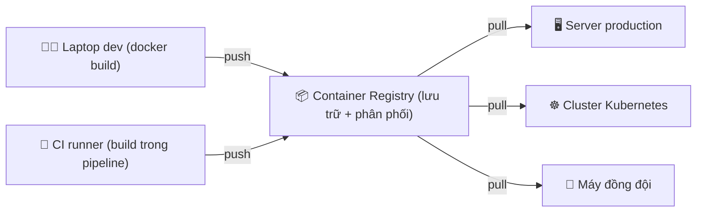

# Container Registry là gì? — Kho lưu & phân phối image

> **Tác giả:** Mr.Rom\
> **Phiên bản:** v1.0.0\
> **Tạo lúc:** 13/06/2026\
> **Cập nhật:** 13/06/2026\
> **Level:** Basic\
> **Tags:** [MUST-KNOW], container-registry, docker, oci, devops\
> **Yêu cầu trước:** [Docker Images & Containers](../../../docker/lessons/01_basic/01_images-and-containers.md)

> 🎯 *Bạn đã biết build image và chạy container ở bài Docker. Nhưng image đó đang nằm **chỉ trên máy bạn** — CI không thấy, server production không kéo về được, đồng đội cũng không dùng được. Bài này trả lời câu hỏi: image rời khỏi laptop của bạn để đến được server và CI bằng cách nào? Câu trả lời là **container registry** — và sau bài này bạn sẽ hiểu nó là gì, đọc đúng một cái tên image, phân biệt public/private, biết vì sao Docker Hub hay làm CI/K8s "kẹt" vì rate limit, và nắm bản đồ các registry phổ biến năm 2026.*

## 🎯 Sau bài này bạn sẽ

- [ ] Hiểu **container registry** là gì — kho **lưu trữ** + **phân phối** container image
- [ ] Nói rõ được "không có registry thì khổ thế nào" (build lại mỗi máy, không versioning tập trung, CI và prod không share được image)
- [ ] Giải phẫu (parse) đúng một tên image: `[registry-host/]namespace/repository:tag`
- [ ] Phân biệt **public** vs **private** registry, và biết Docker Hub là **default registry** của Docker
- [ ] Hiểu **Docker Hub pull rate limit** — vì sao CI/K8s kéo image nhiều dễ bị chặn, và hướng né
- [ ] Nắm bản đồ (landscape) registry phổ biến: Docker Hub, GHCR, AWS ECR, Google Artifact Registry, Azure ACR, Harbor, Quay
- [ ] Hiểu chuẩn **OCI** (image spec + distribution spec) giúp mọi registry tương thích với mọi công cụ

---

## Tình huống — Acme Shop deploy được trên laptop, lên server thì "không thấy image đâu"

Acme Shop vừa hoàn thành sprint đầu tiên. Bạn build image cho app của họ ngon lành:

```bash
docker build -t acme-shop:1.0 .
docker run -d -p 8080:80 acme-shop:1.0
# App chạy ngon trên http://localhost:8080
```

Trên máy bạn, mọi thứ hoàn hảo. Rồi đến lúc đưa lên server production. Bạn SSH vào server, gõ:

```bash
docker run -d -p 80:80 acme-shop:1.0
```

Server đáp lại bằng một dòng lạnh lùng:

```text
Unable to find image 'acme-shop:1.0' locally
docker: Error response from daemon: pull access denied for acme-shop,
repository does not exist or may require 'docker login'.
```

Server **không biết** `acme-shop:1.0` là gì. Vì sao? Vì image bạn build chỉ nằm trong **kho image cục bộ** (*local image store*) trên laptop của bạn — server là một máy khác, nó chưa từng thấy image này bao giờ.

Đây là khoảnh khắc gần như **mọi người học Docker đều vấp**: "Image build xong rồi, sao máy khác không dùng được?". Câu trả lời là image cần một **nơi trung gian** để rời khỏi laptop và đến được các máy khác — server, CI runner, máy đồng đội. Nơi trung gian đó chính là **container registry**.

> 📖 *Trước khi định nghĩa registry, hãy hình dung rõ "khổ thế nào nếu KHÔNG có nó" — vì đó mới là lý do registry tồn tại.*

---

## 1️⃣ Không có registry thì khổ thế nào?

Giả sử Acme Shop quyết định "thôi không dùng registry, mình tự xoay sở". Hãy xem ba nỗi khổ hiện ra ngay.

### Khổ 1 — Phải build lại image trên mỗi máy

Image chỉ nằm local trên laptop. Muốn server có image, cách "thủ công" là **copy nguyên source code lên server rồi build lại** ở đó:

```bash
# Trên server, phải clone code + build lại từ đầu
git clone https://github.com/acme/shop.git
cd shop
docker build -t acme-shop:1.0 .   # build lại lần nữa
```

Vấn đề:

- **Tốn công và tốn tài nguyên** — mỗi server, mỗi CI runner phải build lại. Một image build ở 5 nơi = 5 lần build.
- **Không đảm bảo giống nhau** — server cài Docker phiên bản khác, base image `python:3.12` hôm nay đã đổi, một thư viện `pip install` vừa ra bản mới... → image build ở server **không chắc giống** image bạn đã test ở laptop. Đây chính là bệnh kinh điển *"works on my machine"* (chạy được trên máy tôi) đội lốt mới.
- **Cần cả toolchain build trên server** — server production lẽ ra chỉ cần *chạy* image, giờ phải cài thêm compiler, Node, build tool... phình to và tăng rủi ro bảo mật.

### Khổ 2 — Không có versioning tập trung

Image build ra trên từng máy, không có một "nguồn sự thật" (*source of truth*) chung. Hậu quả:

- Bạn không trả lời được câu hỏi đơn giản: *"Production đang chạy đúng image nào?"*. Mỗi máy một bản, không ai dám chắc.
- Muốn **rollback** (quay lại bản cũ) khi bản mới lỗi? Không có nơi nào lưu các bản cũ một cách có tổ chức để kéo về.
- Không có lịch sử "ai push bản nào, lúc nào" — audit gần như bất khả thi.

### Khổ 3 — CI và production không "nói chuyện" được với nhau

Pipeline CI/CD lý tưởng là: CI build image **một lần** → production kéo **chính image đó** về chạy. Nhưng nếu không có nơi trung gian, CI build xong image rồi... image đó "chết" theo runner (CI runner thường là máy ảo dùng-một-lần, xong job là xoá). Production lấy gì để chạy?

Ba nỗi khổ trên đều quy về **một** nhu cầu: cần một nơi trung tâm để **cất image lên** và **kéo image về** từ bất kỳ máy nào. Đó là registry.

> 📖 *Đã thấy rõ nỗi đau. Giờ ta định nghĩa thứ giải quyết nó.*

---

## 2️⃣ Vậy container registry là gì?

Quay lại tình huống Acme Shop: image kẹt trên laptop, server và CI không với tới được. **Container registry ra đời để giải quyết đúng điều đó.**

**Định nghĩa chính thức**: *Container registry* (kho chứa container image) là một **dịch vụ lưu trữ và phân phối container image**. Nó cho phép bạn **push** (đẩy) image lên một nơi tập trung, và bất kỳ máy nào có quyền đều có thể **pull** (kéo) image đó về để chạy.

🪞 **Ẩn dụ**: *Registry giống như **kho hàng trung tâm của một chuỗi siêu thị**. Nhà máy (laptop/CI) sản xuất hàng (image) xong thì gửi vào kho trung tâm (push). Mọi cửa hàng (server, máy đồng đội) khi cần chỉ việc đến kho lấy đúng món hàng, đúng phiên bản (pull) — không cửa hàng nào phải tự sản xuất lại.*

Ẩn dụ này sẽ theo ta suốt bài: **kho trung tâm** = registry, **gửi hàng vào kho** = push, **lấy hàng từ kho** = pull, **mã sản phẩm trên thùng hàng** = tên image + tag.

Registry làm đúng **hai việc cốt lõi** — chính là hai từ trong định nghĩa:

| Vai trò | Việc cụ thể | Tương tự đời thường |
|---|---|---|
| 📦 **Lưu trữ** (storage) | Cất giữ image theo từng phiên bản, dùng lại các lớp (layer) chung để tiết kiệm chỗ | Kho hàng giữ hàng theo lô, theo mã |
| 🚚 **Phân phối** (distribution) | Trả image về cho bất kỳ máy nào pull, kiểm soát ai được lấy gì | Kho giao hàng cho cửa hàng có phiếu hợp lệ |

> [!NOTE]
> Bạn đã gặp registry rồi mà chưa gọi tên: mỗi lần gõ `docker pull nginx` ở bài Docker, Docker âm thầm kết nối tới một registry (Docker Hub) và kéo image `nginx` về. Bài này chỉ "lật mặt nạ" cái nơi đó ra cho bạn thấy rõ.

Hiểu định nghĩa rồi, ta nhìn toàn bộ vòng đời image qua một sơ đồ — nó cho thấy registry đứng ở **giữa** mọi thứ.

### Sơ đồ — Luồng build → push → pull

Sơ đồ dưới mô tả vòng đời điển hình của một image: được dựng (build), gửi lên registry (push), rồi được nhiều nơi khác nhau kéo về (pull). Hãy chú ý: **registry ở trung tâm**, mọi luồng đều đi qua nó.



Điểm cốt lõi rút ra từ sơ đồ: image chỉ được **build một lần** (ở laptop hoặc CI), **push một lần** lên registry, rồi **pull bao nhiêu lần tuỳ ý** ở mọi nơi cần — đúng image đó, không build lại. Đây chính là thứ chữa cả ba nỗi khổ ở mục 1.

> 📖 *Registry trả image về theo "đúng tên". Nhưng một cái tên image như `nginx:1.25` thực ra gồm nhiều phần — đọc sai là pull nhầm. Ta mổ xẻ cấu trúc tên ngay.*

---

## 3️⃣ Giải phẫu một tên image

Mỗi lần `docker pull` hay `docker run`, bạn đưa cho Docker một chuỗi như `nginx`, `redis:7`, hay `ghcr.io/acme/shop:1.0`. Nhìn thì đơn giản, nhưng chuỗi đó có **cấu trúc** rõ ràng. Hiểu cấu trúc này là chìa khoá để biết image đến từ đâu và pull cho đúng.

Cấu trúc đầy đủ của một tham chiếu image (*image reference*) như sau:

```text
[registry-host[:port]/]namespace/repository[:tag]
```

Cặp ngoặc vuông `[...]` nghĩa là phần đó **có thể được lược bỏ** — và khi lược bỏ, Docker tự điền giá trị mặc định. Bốn thành phần:

| Thành phần | Vai trò | Nếu bỏ trống → mặc định |
|---|---|---|
| `registry-host[:port]` | Địa chỉ registry (host + port) | `docker.io` (Docker Hub) |
| `namespace` | "Người sở hữu" / nhóm — tài khoản, tổ chức, dự án | `library` (chỉ áp dụng trên Docker Hub) |
| `repository` | Tên kho cụ thể của một image | (bắt buộc — không có mặc định) |
| `tag` | Nhãn phiên bản | `latest` |

Hãy xem cách Docker "khai triển" (expand) một tên rút gọn thành dạng đầy đủ. Cùng một image, ba cách viết dưới đây **hoàn toàn tương đương**:

```bash
docker pull nginx
docker pull nginx:latest
docker pull docker.io/library/nginx:latest
```

Docker đọc `nginx` rồi tự điền: không có registry-host → `docker.io`; không có namespace → `library`; không có tag → `latest`. Kết quả cuối cùng là `docker.io/library/nginx:latest`. Đây là lý do người mới hay tưởng `nginx` là "tên đầy đủ" — thực ra nó là dạng viết tắt cực ngắn của một chuỗi dài hơn nhiều.

Bây giờ xem một image **không** nằm trên Docker Hub — image của Acme Shop trên GitHub Container Registry:

```text
ghcr.io / acme        / shop       : 1.0
  │         │             │           │
  │         │             │           └── tag: phiên bản "1.0"
  │         │             └────────────── repository: kho image tên "shop"
  │         └──────────────────────────── namespace: tổ chức "acme" trên GitHub
  └────────────────────────────────────── registry-host: GitHub Container Registry
```

Đọc ngược lại bằng tiếng Việt: *"Image tên `shop`, phiên bản `1.0`, thuộc tổ chức `acme`, lưu trên registry `ghcr.io`."*

> [!IMPORTANT]
> Quy tắc vàng để không pull nhầm: **nếu một image reference KHÔNG có dấu `/` chứa dấu `.` hoặc `:` ở phần đầu** (ví dụ `nginx`, `acme/shop`), Docker mặc định nó nằm trên **Docker Hub**. Chỉ khi phần đầu trông giống một hostname (`ghcr.io/...`, `registry.acme.vn:5000/...`) thì Docker mới đi tới registry khác. Đây là nguồn cơn của vô số lỗi "pull nhầm chỗ" của người mới.

Một chi tiết hay nhầm: dấu hiệu để Docker biết phần đầu là "registry-host" hay "namespace" chính là việc nó **có chứa `.` (dấu chấm) hoặc `:` (port), hoặc là `localhost`**. Vì thế:

- `acme/shop` → `acme` là **namespace** trên Docker Hub (không có dấu chấm).
- `registry.acme.vn/shop` → `registry.acme.vn` là **registry-host** (có dấu chấm).

> 📖 *Đã đọc được tên image. Nhưng cái registry `ghcr.io` kia — ai cũng pull được, hay phải có quyền? Đó là chuyện public vs private.*

---

## 4️⃣ Public vs Private registry

Quay lại ẩn dụ kho hàng: có **kho mở cửa cho công chúng** (ai đến lấy hàng mẫu cũng được) và **kho riêng của công ty** (chỉ nhân viên có thẻ mới vào). Registry cũng chia hai loại đúng như vậy, dựa trên **ai được phép pull/push**.

| Tiêu chí | 🌍 Public registry | 🔒 Private registry |
|---|---|---|
| Ai pull được? | Bất kỳ ai (kể cả ẩn danh) | Chỉ người đã `docker login` + có quyền |
| Ai push được? | Chủ sở hữu repo (cần login) | Chỉ người có quyền |
| Dùng cho | Image open-source, base image công khai (`nginx`, `python`) | Image nội bộ công ty, chứa code/secret riêng |
| Ví dụ | `nginx`, `redis`, `python` trên Docker Hub | `ghcr.io/acme/shop` (private), Harbor nội bộ Acme |

Điểm cần khắc cốt: **public ≠ free-for-all push**. "Public" chỉ nói về **pull** — ai cũng *kéo về* được. Còn **push** (đẩy lên) thì luôn cần xác thực (`docker login`), kể cả với repo public, vì chỉ chủ sở hữu mới được sửa nội dung kho của mình.

Với Acme Shop, lựa chọn rõ ràng: image app chứa source code đã biên dịch + có thể có cấu hình nội bộ → **phải để private**. Không ai muốn đối thủ `docker pull acme/shop` rồi mổ xẻ image production của mình.

> [!WARNING]
> Cạm bẫy chết người của người mới: vô tình push image private chứa **secret** (API key, mật khẩu DB nhúng trong image) lên một repo **public** trên Docker Hub. Image public ai cũng pull về được, và dù bạn xoá sau đó, các bản đã bị kéo về vẫn còn. Trước khi push, luôn kiểm tra repo đang ở chế độ private hay public.

### Docker Hub — default registry, và cái bẫy mang tên rate limit

Như đã thấy ở mục 3, khi bạn không ghi rõ registry-host, Docker mặc định đi tới **Docker Hub** (`docker.io`). Docker Hub là *default registry* (registry mặc định) của Docker — đây là registry public lớn nhất thế giới, nơi chứa hầu hết base image chính thức (`nginx`, `python`, `postgres`...).

Tiện thì rất tiện, nhưng chính vì là mặc định nên nó sinh ra một vấn đề **rất thật** mà mọi đội CI/CD và K8s đều gặp: **pull rate limit** (giới hạn số lần kéo image).

**Vì sao có rate limit?** Docker Hub là dịch vụ miễn phí cho phần lớn người dùng, nhưng băng thông phân phối image tốn tiền. Để tránh bị lạm dụng, Docker giới hạn **số lượt pull trong một khoảng thời gian** dựa trên việc bạn ẩn danh hay đã đăng nhập:

| Loại người dùng | Giới hạn pull (chính sách Docker Hub) |
|---|---|
| Ẩn danh (theo địa chỉ IP) | Số lượt rất hạn chế trong mỗi 6 giờ — dễ chạm trần |
| Đã đăng nhập tài khoản free | Cao hơn ẩn danh, nhưng vẫn có trần trong mỗi 6 giờ |
| Tài khoản trả phí (Pro / Team / Business) | Cao hơn nhiều hoặc không giới hạn theo gói |

> [!NOTE]
> Con số cụ thể của từng mức (bao nhiêu pull / 6 giờ) được Docker điều chỉnh theo thời gian, nên bài không ghim một con số dễ lỗi thời. Điều cần nhớ là **cơ chế**: ẩn danh bị siết chặt nhất, đăng nhập sẽ nới ra, trả phí nới nhất. Khi cần con số chính xác cho hợp đồng/quy hoạch, hãy tra trang giá chính thức của Docker.

**Vì sao đây là vấn đề thật?** Vì hai môi trường sau pull image **liên tục** và thường **ẩn danh**:

- **CI runner**: mỗi lần chạy pipeline đều `docker pull` base image. Một đội đông, push code cả ngày → hàng trăm lượt pull. Nhiều CI runner còn **dùng chung một dải IP** (ví dụ runner cloud) → tất cả cộng dồn vào cùng "hạn mức theo IP" → chạm trần rất nhanh.
- **Kubernetes**: mỗi khi scale Pod, restart, hoặc đổi node, K8s lại pull image. Một cluster lớn auto-scale lúc cao điểm có thể bắn ra rất nhiều lượt pull đồng thời.

Khi chạm trần, bạn sẽ thấy lỗi kinh điển này — và nó **làm gãy cả pipeline / kẹt cả deploy**:

```text
Error response from daemon: toomanyrequests: You have reached your pull rate limit.
You may increase the limit by authenticating and upgrading:
https://www.docker.com/increase-rate-limit
```

Vậy né rate limit thế nào? Có ba hướng chính (các bài sau trong cụm sẽ đi sâu):

1. **Đăng nhập** trong CI/K8s — pull có xác thực được hạn mức cao hơn ẩn danh. Đây là việc rẻ nhất, làm ngay được.
2. **Dùng pull-through cache / mirror** — một registry trung gian kéo image từ Docker Hub về **một lần** rồi phục vụ lại cho cả cluster, thay vì mỗi node tự pull từ Docker Hub.
3. **Đẩy image lên registry riêng** (GHCR, ECR, Harbor...) — production và CI pull từ registry của chính mình, không đụng tới hạn mức Docker Hub.

Với Acme Shop, hướng 3 chính là lý do cả cụm bài này tồn tại: họ cần một registry riêng để CI/CD + K8s pull image an toàn, không phụ thuộc và không bị siết bởi Docker Hub.

> 📖 *Docker Hub chỉ là một trong nhiều registry. Để chọn đúng "kho riêng" cho Acme Shop, ta cần nhìn toàn bộ bản đồ các lựa chọn.*

---

## 5️⃣ Bản đồ các registry phổ biến (landscape 2026)

Thị trường registry năm 2026 khá đông, nhưng chia thành ba nhóm dễ nhớ: **registry của hãng cloud** (tích hợp sẵn hệ sinh thái cloud đó), **registry gắn với nơi chứa code** (CI/CD tiện), và **registry tự vận hành** (self-host, toàn quyền kiểm soát). Bảng dưới là những cái tên bạn chắc chắn sẽ gặp:

| Registry | Nhà cung cấp | Loại | Điểm mạnh / khi chọn |
|---|---|---|---|
| **Docker Hub** | Docker Inc. | Public + private (cloud) | Default registry, nhiều base image chính thức; cẩn thận rate limit |
| **GHCR** (GitHub Container Registry) | GitHub | Public + private (cloud) | Gắn liền repo + GitHub Actions; tiện nhất nếu code đã ở GitHub |
| **AWS ECR** (Elastic Container Registry) | Amazon Web Services | Private (cloud) | Tích hợp sâu IAM + EKS/ECS; chuẩn nếu hạ tầng chạy trên AWS |
| **Google Artifact Registry** | Google Cloud | Private (cloud) | Kế nhiệm Container Registry (GCR) cũ; tích hợp GKE + Cloud Build |
| **Azure ACR** (Azure Container Registry) | Microsoft Azure | Private (cloud) | Tích hợp AKS + Azure AD; chuẩn nếu hạ tầng trên Azure |
| **Harbor** | CNCF (open-source) | Private (self-host) | Tự vận hành, toàn quyền; có sẵn scan lỗ hổng + replication + RBAC |
| **Quay** | Red Hat | Public + private (cloud / self-host) | Có bản cloud (quay.io) và bản self-host; mạnh về security scan |

> [!NOTE]
> **Google Artifact Registry** là thế hệ kế nhiệm của **Google Container Registry (GCR)** cũ. GCR đang trong tiến trình ngừng hoạt động (deprecated), nên dự án mới trên Google Cloud nên dùng thẳng Artifact Registry. Đây là lý do bạn sẽ thấy cả hai tên trong tài liệu cũ.

Một quy tắc chọn nhanh, không cần thuộc lòng bảng trên:

- Code ở **GitHub** + dùng **GitHub Actions** → **GHCR** (gần như zero-config).
- Hạ tầng đã ở **AWS / GCP / Azure** → dùng registry **cùng hãng** (ECR / Artifact Registry / ACR) để IAM, mạng nội bộ, và cluster nói chuyện liền mạch.
- Cần **toàn quyền kiểm soát**, chạy on-premise, hoặc yêu cầu data không rời hạ tầng của mình → **Harbor** (self-host).
- Cần một registry **public** để chia sẻ image open-source nhưng muốn rời Docker Hub → **Quay** hoặc GHCR.

Acme Shop trong tình huống của ta đang dùng GitHub cho mã nguồn, nên hướng tự nhiên là **GHCR** cho giai đoạn đầu — và nếu sau này họ đưa hạ tầng lên một cloud cụ thể, có thể thêm ECR/ACR/Artifact Registry cho production. Các lựa chọn private cụ thể này sẽ được mổ xẻ ở [bài 02 của cụm](02_private-registries.md).

> 📖 *Có một câu hỏi tự nhiên ở đây: nhiều registry khác hãng như vậy, sao cùng một lệnh `docker pull` lại nói chuyện được với tất cả? Bí mật nằm ở một bộ chuẩn chung tên là OCI.*

---

## 6️⃣ Chuẩn OCI — vì sao mọi registry "ăn khớp" với mọi công cụ

Hãy để ý một điều kỳ diệu mà ta vẫn coi là hiển nhiên: cùng một câu lệnh `docker pull`, bạn pull được từ Docker Hub, từ GHCR, từ ECR, từ Harbor — bốn registry khác hãng, khác công ty, nhưng **không cần học bốn cú pháp khác nhau**. Vì sao?

Vì tất cả đều tuân theo một bộ chuẩn chung: **OCI**.

**Định nghĩa**: *OCI* (*Open Container Initiative* — Sáng kiến Container Mở) là một tổ chức dưới sự bảo trợ của Linux Foundation, lập ra các **chuẩn mở** để mọi công cụ và mọi registry container nói chung một "ngôn ngữ".

🪞 **Ẩn dụ**: *OCI giống như **chuẩn ổ cắm điện và kích thước thùng container vận tải** (container hàng hải). Vì cả thế giới thống nhất một kích thước thùng, nên bất kỳ cảng nào, cần cẩu nào, tàu nào cũng bốc dỡ được mọi thùng — không cần mỗi cảng một loại cần cẩu riêng. OCI làm đúng vậy cho container phần mềm.*

OCI gồm các chuẩn chính, nhưng hai cái liên quan trực tiếp tới registry là:

| Chuẩn OCI | Quy định cái gì | Lợi ích thực tế |
|---|---|---|
| **Image Spec** (Image Specification) | **Định dạng** của một image: gồm các layer, file cấu hình (config), và manifest (bản kê các layer) ra sao | Image build bằng Docker chạy được trên Podman, containerd...; mọi runtime hiểu cùng một định dạng |
| **Distribution Spec** (Distribution Specification) | **Giao thức HTTP** để push/pull image lên/xuống registry (các endpoint API chuẩn) | Cùng một `docker pull` hoạt động với mọi registry tuân chuẩn — Docker Hub, GHCR, ECR, Harbor... |

Nói cách khác: **Image Spec** đảm bảo *"image trông giống nhau ở mọi nơi"*, còn **Distribution Spec** đảm bảo *"cách kéo/đẩy image giống nhau ở mọi registry"*. Hai cái này cộng lại tạo ra điều quý giá nhất — **tính tương thích (interoperability)**:

- Bạn **không bị khoá** vào một registry. Image trên Docker Hub có thể đem qua GHCR, qua ECR mà không phải "đóng gói lại".
- Bạn **không bị khoá** vào một công cụ. Docker, Podman, `skopeo`, `crane`, BuildKit... đều push/pull được tới cùng những registry đó.
- Hệ sinh thái mở rộng dễ: một registry mới chỉ cần tuân Distribution Spec là tự động chạy được với mọi công cụ có sẵn.

> [!NOTE]
> Distribution Spec có gốc rễ từ **Docker Registry HTTP API V2** — chuẩn API mà Docker công bố từ sớm. OCI sau này tiếp quản và chuẩn hoá nó thành chuẩn mở độc lập, không còn gắn riêng với công ty Docker nữa. Đó là lý do bạn vẫn thỉnh thoảng nghe nhắc tới "Registry API v2" trong tài liệu — nó chính là tổ tiên của Distribution Spec ngày nay.

Với người mới, bạn **không cần thuộc** chi tiết kỹ thuật của hai spec này. Điều cần mang theo là: *nhờ OCI, kiến thức registry bạn học ở bài này áp dụng được cho mọi registry* — học một lần, dùng ở mọi nơi. Đó là một khoản đầu tư rất "hời".

---

## 💡 Cạm bẫy thường gặp & Best practice

### ❌ Cạm bẫy: Tưởng image build xong là "máy nào cũng dùng được"

- **Triệu chứng**: Build image OK trên laptop, SSH vào server gõ `docker run` thì gặp `Unable to find image ... locally` rồi `pull access denied`.
- **Nguyên nhân**: Image chỉ nằm trong kho image cục bộ của laptop. Server là máy khác, chưa từng có image này; và Docker mặc định đi tìm nó trên Docker Hub (nơi cũng không có).
- **Cách tránh**: Push image lên một registry (Docker Hub private, GHCR, ECR...) rồi pull về ở server. Đây đúng là lý do registry tồn tại — và là chủ đề thực hành của [bài 01](01_docker-hub-tags-and-digests.md).

### ❌ Cạm bẫy: Để CI/K8s pull ẩn danh từ Docker Hub rồi dính rate limit giữa lúc deploy gấp

- **Triệu chứng**: Pipeline đang chạy ngon bỗng đỏ với `toomanyrequests: You have reached your pull rate limit`; hoặc Pod kẹt ở trạng thái `ImagePullBackOff` lúc cao điểm.
- **Nguyên nhân**: Nhiều CI runner / node K8s pull ẩn danh và **dùng chung dải IP**, cộng dồn chạm trần hạn mức theo IP của Docker Hub.
- **Cách tránh**: Tối thiểu **đăng nhập** (`docker login`) trong CI/K8s để dùng hạn mức cao hơn; tốt hơn nữa là dùng **pull-through cache/mirror** hoặc đẩy hẳn image lên **registry riêng**. Chi tiết ở [bài 04 — Registry trong CI/CD](04_registry-in-cicd.md).

### ❌ Cạm bẫy: Push image nội bộ lên repo public

- **Triệu chứng**: Image chứa code/secret nội bộ bỗng ai cũng `docker pull` được.
- **Nguyên nhân**: Tạo repo trên Docker Hub mà để mặc định **public**, hoặc nhầm namespace.
- **Cách tránh**: Image của công ty luôn để **private**. Kiểm tra chế độ repo trước khi push. Không bao giờ nhúng secret vào image (dùng biến môi trường / secret manager).

### ✅ Best practice: Luôn nghĩ "image cần ra khỏi laptop ngay từ đầu"

- **Vì sao**: Một image có giá trị chỉ khi nó **đến được** server, CI, đồng đội. Coi registry là một phần bắt buộc của workflow (build → push → pull), không phải bước "thêm vào sau".
- **Cách áp dụng**: Ngay khi build image cho dự án thật, xác định luôn sẽ push lên registry nào (GHCR nếu code ở GitHub là lựa chọn dễ nhất để bắt đầu), thay vì chỉ `docker run` local rồi mới loay hoay khi cần deploy.

### ✅ Best practice: Chọn registry theo "hạ tầng đang ở đâu"

- **Vì sao**: Registry cùng hãng với hạ tầng (ECR ↔ AWS, ACR ↔ Azure, Artifact Registry ↔ GCP) giúp xác thực (IAM), mạng nội bộ và cluster ăn khớp tự nhiên, ít cấu hình thủ công và an toàn hơn.
- **Cách áp dụng**: Chưa lên cloud cụ thể + code ở GitHub → GHCR. Đã ở một cloud → registry cùng hãng. Cần on-premise/toàn quyền → Harbor. Nhờ OCI, đổi registry về sau không phải "build lại image".

---

## 🧠 Tự kiểm tra (Self-check)

**Q1.** Vì sao server báo `Unable to find image 'acme-shop:1.0' locally` dù bạn vừa build image đó thành công trên laptop?

<details>
<summary>💡 Xem giải thích</summary>

Vì image chỉ nằm trong **kho image cục bộ** (local image store) của laptop — nơi bạn chạy `docker build`. Server là một máy hoàn toàn khác, chưa từng thấy image này. Khi không tìm thấy local, Docker mặc định đi tìm trên **Docker Hub**, nhưng ở đó cũng không có (image chưa được push lên đâu cả), nên báo lỗi.

Cách giải quyết: push image lên một registry, rồi pull về ở server.

</details>

**Q2.** Ba cách viết `nginx`, `nginx:latest`, `docker.io/library/nginx:latest` khác nhau thế nào?

<details>
<summary>💡 Xem giải thích</summary>

**Không khác gì cả — chúng trỏ tới cùng một image.** `nginx` là dạng viết tắt; Docker tự điền các phần mặc định: thiếu registry-host → `docker.io`, thiếu namespace → `library`, thiếu tag → `latest`. Kết quả khai triển đầy đủ đều là `docker.io/library/nginx:latest`.

</details>

**Q3.** Một image "public" thì có nghĩa là ai cũng push lên đó được, đúng không?

<details>
<summary>💡 Xem giải thích</summary>

**Sai.** "Public" chỉ nói về quyền **pull** — ai cũng *kéo về* được, kể cả ẩn danh. Còn **push** (đẩy lên / sửa nội dung) luôn cần xác thực (`docker login`) và chỉ chủ sở hữu repo mới làm được, kể cả với repo public. Public không có nghĩa là "ai cũng ghi được".

</details>

**Q4.** Vì sao môi trường CI và Kubernetes đặc biệt dễ dính Docker Hub rate limit, trong khi bạn pull ở laptop hiếm khi gặp?

<details>
<summary>💡 Xem giải thích</summary>

Vì CI/K8s pull image **rất nhiều và thường ẩn danh**: mỗi lần chạy pipeline / scale Pod / restart đều pull lại. Nguy hiểm hơn, nhiều CI runner và node K8s **dùng chung một dải IP** (ví dụ runner trên cloud), nên tất cả lượt pull cộng dồn vào cùng một hạn mức tính theo IP của Docker Hub → chạm trần rất nhanh. Laptop cá nhân pull lác đác, một IP riêng, nên hiếm khi đụng trần.

Hướng né: đăng nhập (hạn mức cao hơn), dùng mirror/pull-through cache, hoặc đẩy image lên registry riêng.

</details>

**Q5.** OCI Image Spec và Distribution Spec mỗi cái lo việc gì, và lợi ích chung là gì?

<details>
<summary>💡 Xem giải thích</summary>

- **Image Spec** quy định **định dạng** của image (layer, config, manifest) → image trông giống nhau với mọi runtime (Docker, Podman, containerd...).
- **Distribution Spec** quy định **giao thức HTTP** push/pull image lên/xuống registry → cùng một cách kéo/đẩy hoạt động với mọi registry tuân chuẩn.

Lợi ích chung là **tính tương thích (interoperability)**: bạn không bị khoá vào một registry hay một công cụ cụ thể. Image trên Docker Hub đem qua GHCR/ECR vẫn chạy; học registry một lần dùng được ở mọi nơi.

</details>

---

## ⚡ Tra cứu nhanh (Cheatsheet)

| Khái niệm | Tóm tắt |
|---|---|
| Container registry | Dịch vụ **lưu trữ** + **phân phối** container image (push lên, pull về) |
| Cấu trúc tên image | `[registry-host[:port]/]namespace/repository[:tag]` |
| Mặc định khi rút gọn | registry → `docker.io` · namespace → `library` · tag → `latest` |
| Dấu hiệu registry-host | Phần đầu có `.`, có `:port`, hoặc là `localhost` → đó là host, không phải namespace |
| `nginx` khai triển đầy đủ | `docker.io/library/nginx:latest` |
| Public registry | Ai cũng **pull**; **push** vẫn cần login (chủ sở hữu) |
| Private registry | Chỉ người có quyền pull/push (dùng cho image nội bộ) |
| Default registry của Docker | Docker Hub (`docker.io`) |
| Lỗi rate limit Docker Hub | `toomanyrequests: You have reached your pull rate limit` |
| Né rate limit | Đăng nhập · pull-through cache/mirror · registry riêng |
| Registry cloud phổ biến | Docker Hub, GHCR, AWS ECR, Google Artifact Registry, Azure ACR |
| Registry self-host | Harbor (CNCF), Quay (Red Hat) |
| OCI Image Spec | Chuẩn **định dạng** image (layer/config/manifest) |
| OCI Distribution Spec | Chuẩn **giao thức HTTP** push/pull với registry |

---

## 📚 Từ Điển Thuật Ngữ (Glossary)

| EN | VN | Giải thích |
|---|---|---|
| Container registry | Kho chứa container image | Dịch vụ lưu trữ + phân phối image; push lên, pull về |
| Push | Đẩy lên | Tải image từ máy lên registry |
| Pull | Kéo về | Tải image từ registry xuống máy |
| Image reference | Tham chiếu image | Chuỗi định danh image: `[host/]namespace/repo:tag` |
| Registry host | Địa chỉ registry | Phần host (+ port) của image reference; mặc định `docker.io` |
| Namespace | Không gian tên | "Người sở hữu"/nhóm của repo (tài khoản, tổ chức, dự án) |
| Repository | Kho image | Tên kho chứa các phiên bản của một image |
| Tag | Nhãn phiên bản | Nhãn gắn vào một phiên bản image; mặc định `latest` |
| Default registry | Registry mặc định | Registry Docker dùng khi không ghi rõ host — là Docker Hub |
| Public registry | Registry công khai | Ai cũng pull được; push vẫn cần xác thực |
| Private registry | Registry riêng tư | Chỉ người có quyền mới pull/push |
| Rate limit | Giới hạn tần suất | Trần số lượt pull trong một khoảng thời gian |
| Pull-through cache | Bộ đệm kéo xuyên | Registry trung gian kéo image từ upstream một lần rồi phục vụ lại |
| Mirror | Bản sao gương | Registry phản chiếu nội dung của một registry khác để pull gần/nhanh hơn |
| OCI | Sáng kiến Container Mở | Tổ chức (Linux Foundation) lập chuẩn mở cho container |
| Image Spec | Chuẩn định dạng image | Quy định cấu trúc image: layer, config, manifest |
| Distribution Spec | Chuẩn phân phối | Quy định giao thức HTTP push/pull với registry |
| Interoperability | Tính tương thích | Khả năng dùng chung image/công cụ giữa các registry khác nhau |
| GHCR | GitHub Container Registry | Registry của GitHub, gắn với repo + Actions |
| ECR | Elastic Container Registry | Registry của AWS |
| Artifact Registry | (giữ nguyên) | Registry của Google Cloud, kế nhiệm GCR |
| ACR | Azure Container Registry | Registry của Microsoft Azure |
| Harbor | (giữ nguyên) | Registry self-host mã nguồn mở của CNCF |
| Quay | (giữ nguyên) | Registry của Red Hat (bản cloud quay.io + self-host) |

---

## 🔗 Liên kết & Tài nguyên

### 🧭 Định hướng lộ trình học

- ➡️ **Bài tiếp theo:** [Tags & Digests — Đặt tên image đúng, immutable bằng digest](01_docker-hub-tags-and-digests.md)
- ↑ **Về cụm:** [Container Registry — Kho lưu & phân phối image](../../README.md)

### 🧩 Các chủ đề có thể bạn quan tâm

- [Docker Images & Containers — image và container khác gì nhau](../../../docker/lessons/01_basic/01_images-and-containers.md) — nền tảng cần có trước bài này
- [Private Registries — Harbor, ECR, GCR/Artifact Registry, ACR, GHCR](02_private-registries.md) — chọn và dựng registry riêng cho Acme Shop
- [Image Signing & Scanning — Trivy, cosign, SBOM, supply chain](03_image-signing-and-scanning.md) — bảo vệ image trong registry
- [Registry trong CI/CD — Cache, tag strategy, promotion, retention](04_registry-in-cicd.md) — né rate limit + tự động hoá push/pull

### 🌐 Tài nguyên tham khảo khác

- [OCI Image Specification](https://github.com/opencontainers/image-spec) — chuẩn định dạng image, đọc khi muốn hiểu manifest/layer
- [OCI Distribution Specification](https://github.com/opencontainers/distribution-spec) — chuẩn giao thức push/pull với registry
- [Docker Hub — chính sách giá & rate limit](https://www.docker.com/pricing/) — tra con số rate limit mới nhất theo từng gói
- [Harbor — registry self-host của CNCF](https://goharbor.io/) — tài liệu chính thức để dựng registry riêng

---

## 📌 Nhật ký thay đổi (Changelog)

- **v1.0.0 (13/06/2026)** — Bản đầu tiên. Bài mở màn cụm Container Registry: định nghĩa registry (lưu trữ + phân phối image), ba nỗi khổ khi không có registry, giải phẫu tên image `[registry-host/]namespace/repository:tag`, public vs private, Docker Hub là default registry + pull rate limit (vấn đề thật với CI/K8s), landscape registry 2026 (Docker Hub/GHCR/ECR/Artifact Registry/ACR/Harbor/Quay), chuẩn OCI (Image Spec + Distribution Spec) giúp tương thích. Kèm sơ đồ Mermaid build→push→pull, 5 self-check, cheatsheet, glossary.
