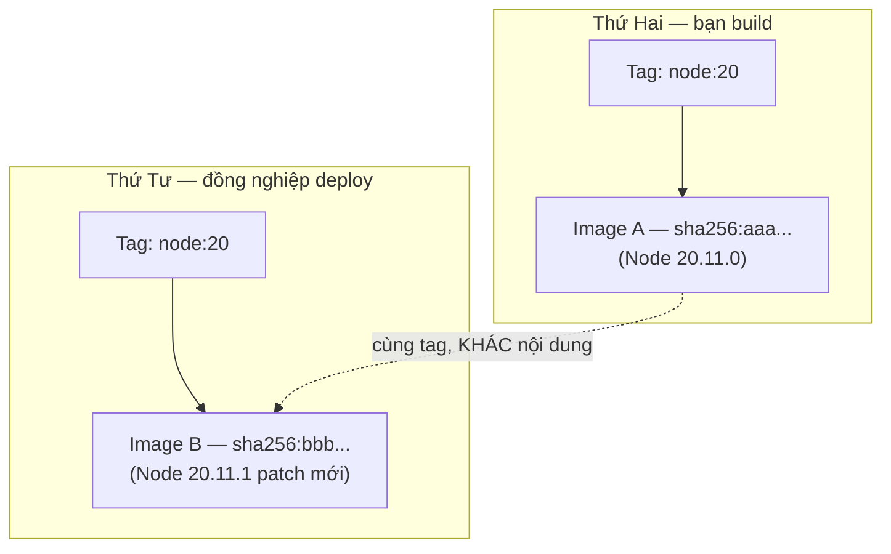
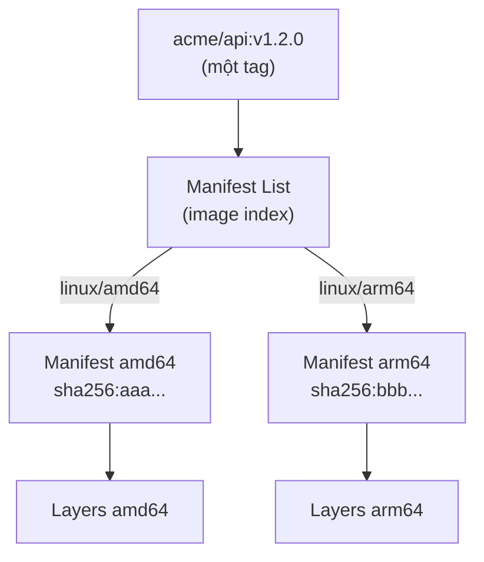

# Tags & Digests — Đặt tên image đúng, immutable bằng digest

> **Tác giả:** Mr.Rom\
> **Phiên bản:** v1.0.0\
> **Tạo lúc:** 13/06/2026\
> **Cập nhật:** 13/06/2026\
> **Level:** Basic\
> **Tags:** container-registry, docker, docker-hub, tags, digest, multi-arch, cicd\
> **Yêu cầu trước:** [Container Registry là gì](00_what-is-container-registry.md)

> 🎯 *Ở bài trước bạn đã hiểu registry là kho lưu và phân phối image. Nhưng kho thì cũng phải có cách "gọi tên" món hàng — và đây là chỗ 90% sự cố deploy "trên máy tôi chạy được, lên prod thì hỏng" sinh ra. Sau bài này bạn sẽ login/tag/push/pull lên Docker Hub thành thạo, hiểu vì sao `:latest` là cái bẫy, biết ghim deploy bất biến bằng `@sha256:...`, build được multi-arch image cho cả `amd64` lẫn `arm64`, và né được rate limit của Docker Hub.*

## 🎯 Sau bài này bạn sẽ

- [ ] Login, tag, push và pull image lên/từ Docker Hub bằng tài khoản thật
- [ ] Phân biệt rõ **repository** với **tag**, và đọc đúng một tham chiếu image đầy đủ
- [ ] Hiểu vì sao `:latest` *mutable* phá vỡ tính tái lập (reproducibility) khi deploy
- [ ] Ghim deploy bất biến (immutable) bằng **digest** `@sha256:...` — content-addressable
- [ ] Áp dụng chiến lược tag thực chiến: **commit SHA + semver + latest** song song
- [ ] Build **multi-arch image** (`amd64` + `arm64`) bằng `docker buildx` và đọc manifest list
- [ ] Né **rate limit** của Docker Hub bằng cách login để tăng hạn mức pull

---

## Tình huống — "Trên máy tôi chạy được mà!"

Acme Shop đã có Docker image cho app (giả sử là một API Node.js đóng gói xong từ Dockerfile). Bạn build trên laptop, gõ `docker run` chạy ngon lành, rồi bàn giao cho bạn đồng nghiệp deploy lên server staging.

Hai ngày sau, staging sập. Log báo lỗi một thư viện mà *trên máy bạn không hề có lỗi*. Cả team ngồi soi cả buổi. Cuối cùng phát hiện: bạn build từ `node:20`, đồng nghiệp deploy cũng `node:20` — nhưng **giữa hai lần đó Docker đã phát hành bản patch mới và `node:20` giờ trỏ tới một image khác**. Cùng một cái tên `node:20`, hai nội dung khác nhau, hai hành vi khác nhau.

Đây không phải lỗi hiếm. Nó là hệ quả trực tiếp của việc **đặt tên image sai cách**. Tag trong Docker giống như *nhãn dán* — ai cũng bóc ra dán lại được. Còn thứ thật sự bất biến là **digest** — dấu vân tay của chính nội dung image.

Bài này sửa tận gốc vấn đề đó: tag để con người đọc, digest để máy ghim. Trước tiên, ta cần hiểu một tham chiếu image được cấu tạo từ những phần nào.

---

## 1️⃣ Một tham chiếu image gồm những gì?

Khi gõ `docker pull node:20`, bạn đang dùng một dạng *viết tắt*. Tên đầy đủ của một image dài hơn nhiều, và mỗi phần có một vai trò riêng. Hiểu cấu trúc này là nền tảng cho mọi thứ phía sau, vì cái bẫy `:latest` lẫn sức mạnh của digest đều nằm ngay trong cú pháp tên.

Một tham chiếu image (*image reference*) đầy đủ trông như sau:

```
registry.example.com:5000 / acme / api : v1.2.0 @ sha256:abc123...
└──────── registry ──────┘ └─ namespace ┘└name┘ └ tag ┘ └─── digest ───┘
└─────────────────── repository ──────────────────┘
```

Cụ thể từng phần:

| Thành phần | Ví dụ | Vai trò |
|---|---|---|
| **Registry** (máy chủ kho) | `docker.io`, `ghcr.io`, `registry.example.com:5000` | Máy chủ lưu image. Bỏ trống → mặc định `docker.io` (Docker Hub) |
| **Namespace** (không gian tên) | `acme`, `library` | Tài khoản/tổ chức sở hữu. Image official Docker Hub nằm trong `library` |
| **Name** (tên image) | `api`, `node`, `nginx` | Tên repo thật sự |
| **Tag** (thẻ) | `v1.2.0`, `latest`, `20-alpine` | Nhãn người-đọc, **đổi được** (mutable) |
| **Digest** (dấu vân tay) | `sha256:abc123...` | Băm nội dung, **không đổi** (immutable) |

> 💡 Hiểu các thành phần rồi, hãy xem vài cách viết tắt phổ biến để không bị bối rối khi đọc lệnh người khác.

Docker cho phép lược bớt phần nào "hiển nhiên":

```bash
docker pull nginx
# Docker hiểu thành: docker.io/library/nginx:latest

docker pull acme/api:v1.2.0
# Docker hiểu thành: docker.io/acme/api:v1.2.0

docker pull ghcr.io/acme/api:v1.2.0
# Registry chỉ định rõ ghcr.io — KHÔNG mặc định docker.io nữa
```

→ Hai dòng đầu mặc định về `docker.io` vì không ghi registry. Quy tắc vàng: **chỉ image trên Docker Hub mới được phép giấu registry** — registry khác (GHCR, ECR...) luôn phải ghi đầy đủ host. Đây cũng là lý do `acme/api` và `library/nginx` đều "thuộc về" Docker Hub dù trông như tên trống.

### Repository vs Tag — đừng nhầm

Hai khái niệm hay bị lẫn nhất là **repository** và **tag**. Phân biệt rõ ngay từ đầu sẽ tránh được rất nhiều nhầm lẫn khi push/pull về sau.

🪞 **Ẩn dụ**: *Một **repository** giống như **một cuốn sách** trên kệ — ví dụ "cuốn `acme/api`". Còn **tag** là **các lần tái bản** của cuốn sách đó: "bản in lần 1" (`v1.0.0`), "bản in lần 2" (`v1.1.0`), "bản mới nhất" (`latest`). Cùng một cuốn sách (repo), nhiều lần in (tag). Và **digest** chính là **mã ISBN duy nhất** của đúng một bản in cụ thể — không bao giờ trùng, không bao giờ đổi.*

- **Repository** = `acme/api` → nơi gom mọi phiên bản của cùng một app.
- **Tag** = `v1.2.0`, `latest`, `20-alpine` → từng phiên bản cụ thể bên trong repo đó.
- Một repo chứa **nhiều tag**; nhiều tag có thể cùng trỏ vào **một digest**.

Điểm cuối cùng rất quan trọng và ta sẽ quay lại: `latest` và `v1.2.0` có thể trỏ vào *cùng một image*. Tag chỉ là con trỏ — nhiều con trỏ trỏ chung một đích là chuyện bình thường.

---

## 2️⃣ Login + push image lên Docker Hub

Lý thuyết đã đủ để bắt tay vào việc. Acme Shop cần đẩy image của app lên Docker Hub để CI/CD và K8s sau này kéo về. Quy trình chuẩn gồm 4 bước: login → tag → push → (người khác) pull. Ta đi từng bước, mỗi bước có output mẫu để bạn đối chiếu.

### 🛠️ Bước 1: `docker login` — xác thực với registry

Trước khi push, Docker cần biết bạn là ai. Lệnh `docker login` xác thực với registry và lưu credential vào máy để các lệnh sau không phải nhập lại.

```bash
docker login -u <username_docker_hub>
```

Sau khi gõ, Docker hỏi mật khẩu (hoặc access token — khuyến nghị dùng token thay mật khẩu, tạo ở **Account Settings → Security → Personal access tokens** trên Docker Hub):

```
Password:
Login Succeeded
```

> [!WARNING]
> Tránh truyền mật khẩu thẳng qua cờ `-p` trên dòng lệnh (vd `docker login -u user -p mypass`) — mật khẩu sẽ nằm trong lịch sử shell (`~/.bash_history`) và log hệ thống. Trong CI/CD, đẩy token qua biến môi trường rồi pipe vào stdin: `echo "$DOCKER_TOKEN" | docker login -u "$DOCKER_USER" --password-stdin`.

Sau khi login thành công, credential lưu ở `~/.docker/config.json`. Trên máy cá nhân nó thường lưu dạng base64 (không mã hoá thật) — nên trên server production hãy dùng credential helper hoặc secret manager thay vì để lộ file này.

### 🛠️ Bước 2: `docker tag` — gắn tên đầy đủ cho image

Giả sử bạn đã build xong image local tên `acme-api` (từ Dockerfile của Acme). Trước khi push, phải gắn cho nó một tên đầy đủ trỏ về repo Docker Hub của bạn — đây chính là việc của `docker tag`. Lệnh này **không tạo bản sao**, chỉ gắn thêm một cái nhãn trỏ vào cùng một image.

```bash
# Cú pháp: docker tag <image_nguồn> <repo_đích>:<tag>
docker tag acme-api:latest <username>/acme-api:v1.0.0
```

Kiểm tra lại bằng `docker images` — bạn sẽ thấy hai dòng cùng `IMAGE ID`:

```
REPOSITORY              TAG       IMAGE ID       CREATED         SIZE
<username>/acme-api     v1.0.0    9f3a8c2b1d4e   2 minutes ago   142MB
acme-api                latest    9f3a8c2b1d4e   2 minutes ago   142MB
```

→ Chú ý cột `IMAGE ID` của hai dòng **giống hệt nhau** (`9f3a8c2b1d4e`). Đó là bằng chứng `docker tag` chỉ gắn thêm nhãn, không nhân đôi dung lượng — `SIZE` 142MB là một image vật lý duy nhất, hai tag cùng trỏ vào nó.

### 🛠️ Bước 3: `docker push` — đẩy lên kho

Image đã có tên đầy đủ trỏ về repo của bạn, giờ đẩy nó lên Docker Hub:

```bash
docker push <username>/acme-api:v1.0.0
```

Output cho thấy từng layer được đẩy lên, và **dòng cuối in ra digest** — hãy chú ý dòng này, ta sẽ dùng nó ngay sau đây:

```
The push refers to repository [docker.io/<username>/acme-api]
5f70bf18a086: Pushed
a1b2c3d4e5f6: Pushed
e8c9d0a1b2c3: Pushed
v1.0.0: digest: sha256:7d3e9a1f0b2c4d5e6f7a8b9c0d1e2f3a4b5c6d7e8f9a0b1c2d3e4f5a6b7c8d9e size: 1163
```

→ Dòng cuối là phần quan trọng nhất: registry xác nhận tag `v1.0.0` giờ trỏ tới digest `sha256:7d3e9a...`. Tag là cái bạn đặt, còn digest là cái registry **tính ra từ nội dung** — bạn không chọn được nó, và đó chính là điều khiến nó đáng tin.

### 🛠️ Bước 4: `docker pull` — kéo về từ máy khác

Trên server staging (hoặc máy đồng nghiệp), kéo image về bằng đúng tên đã push:

```bash
docker pull <username>/acme-api:v1.0.0
```

```
v1.0.0: Pulling from <username>/acme-api
5f70bf18a086: Pull complete
a1b2c3d4e5f6: Pull complete
e8c9d0a1b2c3: Pull complete
Digest: sha256:7d3e9a1f0b2c4d5e6f7a8b9c0d1e2f3a4b5c6d7e8f9a0b1c2d3e4f5a6b7c8d9e
Status: Downloaded newer image for <username>/acme-api:v1.0.0
```

→ Dòng `Digest:` ở đây **khớp y hệt** digest lúc push. Đây là cách bạn kiểm chứng image kéo về đúng là image đã đẩy lên, không bị tráo dọc đường. Vòng login → tag → push → pull đã khép kín. Nhưng tới đây, tag `v1.0.0` vẫn còn một điểm yếu chí mạng mà ta sẽ mổ xẻ ngay.

---

## 3️⃣ Cái bẫy `:latest` — vì sao deploy không tái lập được

Quay lại sự cố đầu bài: `node:20` hôm nay khác `node:20` ngày mai. Vấn đề cốt lõi nằm ở bản chất **mutable** (đổi được) của tag. Đây là cạm bẫy phổ biến nhất với người mới, nên ta phân tích kỹ.

🪞 **Ẩn dụ**: *Tag giống như **biển số phòng dán ngoài cửa khách sạn**. Bạn đặt "phòng 301", nhân viên dẫn bạn lên. Nhưng ban quản lý hoàn toàn có thể **gỡ biển "301" dán sang một căn phòng khác** lúc nửa đêm. Sáng ra bạn quay lại "phòng 301" — vẫn đúng biển số, nhưng bên trong là một căn phòng hoàn toàn khác. Đó chính xác là điều xảy ra với `:latest` và mọi tag.*

### `:latest` không có gì đặc biệt

Hiểu lầm tai hại nhất: nhiều người tưởng `:latest` là "phiên bản mới nhất tự động". **Sai**. `latest` chỉ là một tag mặc định bình thường như mọi tag khác — nó *không* tự cập nhật, *không* được Docker đảm bảo gì cả. Nó chỉ là cái tag được dùng khi bạn không ghi tag nào.

```bash
docker pull nginx
# = docker pull nginx:latest  (Docker tự điền "latest")
```

`latest` chỉ "mới nhất" khi maintainer *chủ động* push lại tag đó vào image mới. Nếu họ quên, `latest` có thể trỏ vào bản cũ 6 tháng. Nó là một lời hứa không ai ký.

### Vì sao mutable phá vỡ reproducibility

Sơ đồ dưới minh hoạ chính sự cố của Acme Shop: cùng một tag, hai thời điểm, hai nội dung. Đây là gốc rễ của mọi lỗi "trên máy tôi chạy được". Hãy hình dung trục thời gian từ trái sang phải:



Sơ đồ cho thấy: tag `node:20` là một **con trỏ di động** — Thứ Hai nó trỏ image A, Thứ Tư maintainer push patch mới nên nó trỏ image B. Hai lần build dùng "cùng một tag" nhưng nhận về hai image khác nhau, nên hành vi khác nhau. *Reproducibility* (tính tái lập — build lại cho ra kết quả y hệt) bị phá vỡ ngay tại đây.

Hậu quả cụ thể khi dùng tag mutable cho production:

| Vấn đề | Hệ quả thực tế |
|---|---|
| Deploy không tái lập | Hai lần deploy "cùng tag" ra hai kết quả → debug như mò kim |
| Rollback không tin cậy | Quay về `:v1.0.0` nhưng tag đó đã bị push đè → không phải bản cũ thật |
| Khó audit | "Bản nào đang chạy trên prod?" → không trả lời chắc chắn được |
| Lỗ hổng bảo mật | Kẻ tấn công chiếm registry, push đè tag → bạn pull về mã độc mà vẫn thấy "đúng tag" |

> [!CAUTION]
> Tuyệt đối không dùng `:latest` (hoặc bất kỳ tag floating nào như `:stable`, `:prod`) trong manifest deploy production hay K8s. Một lần `kubectl rollout restart` vào lúc tag bị đổi nội dung là đủ để kéo nhầm image lên toàn bộ cụm. Production phải ghim bằng digest — phần tiếp theo chỉ cho bạn cách.

---

## 4️⃣ Digest `@sha256:...` — bất biến, content-addressable

Nếu tag là biển số phòng (gỡ-dán được), thì ta cần một thứ *không ai gỡ-dán được*. Đó là digest. Đây là khái niệm trừu tượng nhất của bài, nên ta đi chậm.

### Digest là gì

**Digest** là một chuỗi băm (*hash*) — cụ thể là SHA-256 — tính ra từ **chính nội dung** của image (manifest của nó). Vì nó sinh ra từ nội dung, nên:

🪞 **Ẩn dụ**: *Digest giống như **dấu vân tay** của một con người. Bạn có thể đổi tên (tag), đổi quần áo, đổi địa chỉ — nhưng vân tay thì gắn chết với chính con người đó. Đổi dù chỉ một byte trong image → "con người" đã khác → vân tay khác hoàn toàn. Không thể giả mạo vân tay mà giữ nguyên người.*

Tính chất này gọi là **content-addressable** (định địa chỉ theo nội dung): địa chỉ của image *chính là* dấu vân tay của nội dung nó. Từ đó suy ra:

- **Immutable** (bất biến): `acme/api@sha256:7d3e9a...` mãi mãi trỏ đúng một nội dung. Không ai push đè được — đổi nội dung thì digest đã khác, thành một địa chỉ khác.
- **Tự xác minh** (self-verifying): pull về xong, Docker băm lại nội dung và so với digest. Lệch → báo lỗi, từ chối dùng. Bạn được bảo vệ khỏi image bị tráo.
- **Tái lập tuyệt đối**: deploy bằng digest hôm nay và một năm sau cho ra *đúng cùng một image*, không có "patch ngầm".

### Lấy digest của một image

Có vài cách lấy digest. Dòng `Digest:` lúc `docker push`/`docker pull` là một cách (đã thấy ở mục 2). Cách chủ động hơn là hỏi thẳng image local hoặc registry:

```bash
# Cách 1: từ image đã pull về máy — xem RepoDigests
docker inspect --format='{{index .RepoDigests 0}}' <username>/acme-api:v1.0.0
```

```
<username>/acme-api@sha256:7d3e9a1f0b2c4d5e6f7a8b9c0d1e2f3a4b5c6d7e8f9a0b1c2d3e4f5a6b7c8d9e
```

```bash
# Cách 2: hỏi thẳng registry mà KHÔNG cần pull image về (nhanh, nhẹ)
docker buildx imagetools inspect <username>/acme-api:v1.0.0
```

```
Name:      docker.io/<username>/acme-api:v1.0.0
MediaType: application/vnd.docker.distribution.manifest.v2+json
Digest:    sha256:7d3e9a1f0b2c4d5e6f7a8b9c0d1e2f3a4b5c6d7e8f9a0b1c2d3e4f5a6b7c8d9e
```

> [!NOTE]
> Phân biệt hai loại "ID băm" dễ nhầm: `IMAGE ID` (thấy trong `docker images`) là digest của **config image trên máy local**, còn **digest** ở đây (`RepoDigests`) là digest của **manifest trên registry**. Khi ghim deploy, ta luôn dùng *registry digest* (`RepoDigests`) vì đó là cái registry hiểu khi pull. Hai con số này gần như luôn khác nhau — đừng lẫn lộn.

### Pull và deploy bằng digest

Có digest rồi, bạn pull/deploy bằng cú pháp `@sha256:...` thay cho `:tag`:

```bash
# Pull theo digest — bất biến, không phụ thuộc tag còn trỏ đâu
docker pull <username>/acme-api@sha256:7d3e9a1f0b2c4d5e6f7a8b9c0d1e2f3a4b5c6d7e8f9a0b1c2d3e4f5a6b7c8d9e
```

Trong K8s manifest, ghim digest ở trường `image` y hệt:

```yaml
apiVersion: apps/v1
kind: Deployment
metadata:
  name: acme-api
spec:
  replicas: 3
  selector:
    matchLabels:
      app: acme-api
  template:
    metadata:
      labels:
        app: acme-api
    spec:
      containers:
        - name: api
          # Ghim bằng digest — cụm K8s luôn chạy ĐÚNG image này, không "patch ngầm"
          image: docker.io/<username>/acme-api@sha256:7d3e9a1f0b2c4d5e6f7a8b9c0d1e2f3a4b5c6d7e8f9a0b1c2d3e4f5a6b7c8d9e
          ports:
            - containerPort: 3000
```

→ Với manifest này, dù ai có push đè tag `v1.0.0` đi nữa, cụm vẫn kéo đúng nội dung đã được kiểm chứng. Rollback cũng tin cậy: lưu lại digest của từng release là quay về chính xác bản đó. Tag để con người đọc cho dễ; digest để máy ghim cho chắc — đây là nguyên tắc cốt lõi của cả bài.

---

## 5️⃣ Chiến lược tag thực chiến — SHA + semver + latest

Đến đây có thể bạn nghĩ: "Vậy bỏ tag luôn, chỉ dùng digest?". Không nên. Digest dài 64 ký tự hex, con người không đọc/nhớ nổi. Thực tế ta **dùng cả hai**: tag để người và pipeline tham chiếu thuận tiện, digest để ghim lúc deploy. Câu hỏi là *gắn những tag nào* cho mỗi image build.

Chiến lược chuẩn 2026 là gắn **đồng thời ba loại tag** cho mỗi lần build từ nhánh chính:

| Loại tag | Ví dụ | Vai trò | Mutable? |
|---|---|---|---|
| **Commit SHA** | `sha-a1b2c3d` | Truy vết chính xác build này từ commit nào | Bất biến (mỗi commit là duy nhất) |
| **Semver** | `v1.2.0`, `1.2`, `1` | Con người đọc dễ, theo ngữ nghĩa phiên bản | `v1.2.0` nên cố định; `1.2`/`1` thì rolling |
| **`latest`** | `latest` | Tiện cho dev thử nhanh "bản mới nhất" | Mutable — chỉ dùng cho dev/demo |

Vì sao cần cả ba? Mỗi loại phục vụ một nhu cầu khác nhau:

- **Commit SHA** trả lời câu hỏi *audit*: "Image đang chạy build từ commit nào?". Vì mỗi commit là duy nhất, tag SHA gần như bất biến trên thực tế — cực hợp để debug và truy vết.
- **Semver** (*Semantic Versioning* — `MAJOR.MINOR.PATCH`) trả lời câu hỏi *con người*: "Bản này là 1.2.0, vá lỗi gì so với 1.1.0?". Dễ đọc, dễ giao tiếp với team và khách.
- **`latest`** chỉ là tiện ích cho dev gõ nhanh — **không bao giờ** dùng để deploy prod.

### Gắn nhiều tag rồi push

Một image build có thể mang nhiều tag cùng lúc. Ta `tag` nhiều lần (cùng `IMAGE ID`), rồi push từng tag:

```bash
# Giả sử commit hiện tại có short SHA = a1b2c3d, phiên bản release = v1.2.0
IMAGE=<username>/acme-api
SHA=a1b2c3d
VERSION=v1.2.0

# 1. Gắn cả 3 tag vào cùng image vừa build (acme-api:build)
docker tag acme-api:build "$IMAGE:sha-$SHA"
docker tag acme-api:build "$IMAGE:$VERSION"
docker tag acme-api:build "$IMAGE:latest"

# 2. Push cả 3 tag lên Docker Hub
docker push "$IMAGE:sha-$SHA"
docker push "$IMAGE:$VERSION"
docker push "$IMAGE:latest"
```

→ Cả ba tag giờ cùng trỏ vào một digest duy nhất trên registry. Bạn vừa có khả năng truy vết (SHA), vừa dễ giao tiếp (semver), vừa tiện cho dev (latest) — mà không tốn thêm dung lượng vì chỉ là ba con trỏ vào cùng nội dung.

### Trong CI/CD thì làm tự động

Viết tay từng tag rất dễ sai. Trong CI/CD, các tag này được sinh tự động từ metadata của Git. Ví dụ với GitHub Actions, `docker/metadata-action` lo việc này:

```yaml
- name: Sinh tag tự động từ Git metadata
  id: meta
  uses: docker/metadata-action@v5
  with:
    images: <username>/acme-api
    tags: |
      type=sha,prefix=sha-          # → sha-a1b2c3d (từ commit SHA)
      type=semver,pattern={{version}} # → 1.2.0 (metadata-action bỏ tiền tố v; khi push git tag v1.2.0)
      type=raw,value=latest,enable={{is_default_branch}}  # latest chỉ trên nhánh chính

- name: Build + push tất cả tag một lượt
  uses: docker/build-push-action@v6
  with:
    context: .
    push: true
    tags: ${{ steps.meta.outputs.tags }}
```

→ Pipeline tự gắn đúng 3 loại tag mà không cần bạn nhớ. Bài [Registry trong CI/CD](04_registry-in-cicd.md) đi sâu hơn về tag strategy, promotion qua môi trường và retention. Ở đây chỉ cần nắm: **build một lần, gắn nhiều tag, deploy bằng digest**.

---

## 6️⃣ Multi-arch image — một tên, chạy cả amd64 lẫn arm64

Acme Shop có một vấn đề rất 2026: dev xài MacBook chip Apple Silicon (kiến trúc `arm64`), nhưng server production trên cloud lại là `amd64` (Intel/AMD). Một image build trên Mac M-series mặc định là `arm64` — đẩy lên server `amd64` sẽ chạy chậm qua giả lập, hoặc lỗi thẳng `exec format error`.

Giải pháp là **multi-arch image** (image đa kiến trúc): một tên `acme/api:v1.2.0` duy nhất nhưng bên trong chứa *nhiều biến thể* cho từng kiến trúc CPU. Khi pull, Docker tự chọn đúng biến thể khớp máy bạn.

### Manifest list — bản chất của multi-arch

Làm sao một cái tag chứa được nhiều image? Câu trả lời nằm ở một lớp trung gian gọi là **manifest list** (hay *image index*). Đây là khái niệm trừu tượng nhất của phần này — sơ đồ dưới giúp hình dung: tag không trỏ thẳng vào một image, mà trỏ vào một "danh sách" rồi danh sách đó mới phân nhánh theo kiến trúc.



Sơ đồ cho thấy `acme/api:v1.2.0` trỏ vào một **manifest list** — bản thân nó chỉ là một "mục lục" liệt kê: kiến trúc `amd64` thì lấy manifest `sha256:aaa...`, `arm64` thì lấy `sha256:bbb...`. Khi máy `arm64` pull, Docker đọc mục lục, thấy mục `linux/arm64`, và chỉ kéo đúng biến thể đó về — không tải thừa.

### Build multi-arch bằng `docker buildx`

Công cụ build mặc định cũ chỉ build được một kiến trúc. Để build nhiều kiến trúc một lượt, ta dùng **`docker buildx`** — bản build engine nâng cao (dựa trên BuildKit) đi kèm Docker hiện đại. Trước tiên tạo một builder hỗ trợ đa kiến trúc:

```bash
# 1. Tạo builder mới dùng driver docker-container (hỗ trợ multi-arch)
docker buildx create --name multiarch --driver docker-container --use

# 2. Khởi động và kiểm tra các platform builder hỗ trợ
docker buildx inspect --bootstrap
```

```
Name:   multiarch
Driver: docker-container
Nodes:
Name:      multiarch0
Status:    running
Platforms: linux/amd64, linux/arm64, linux/arm/v7, linux/386, ...
```

→ Dòng `Platforms:` liệt kê các kiến trúc builder này build được. Việc build `arm64` trên máy `amd64` (và ngược lại) chạy được nhờ giả lập QEMU mà BuildKit lo sẵn — bạn không phải cài gì thêm trên Docker Desktop.

Giờ build và push image cho cả hai kiến trúc trong một lệnh:

```bash
docker buildx build \
  --platform linux/amd64,linux/arm64 \
  -t <username>/acme-api:v1.2.0 \
  --push .
```

> [!IMPORTANT]
> Với multi-arch, bắt buộc dùng `--push` để đẩy thẳng lên registry. Bạn **không** thể `docker load` một manifest list nhiều kiến trúc vào kho image local (kho local chỉ giữ được một kiến trúc khớp máy). Bỏ `--push` mà thêm `--platform` nhiều giá trị sẽ báo lỗi — đây là cạm bẫy hay gặp nhất khi mới làm multi-arch.

### Đọc manifest list bằng `imagetools inspect`

Build xong, kiểm chứng image đã đúng là multi-arch chưa bằng `docker buildx imagetools inspect`. Lệnh này hỏi thẳng registry, in ra manifest list và digest từng biến thể:

```bash
docker buildx imagetools inspect <username>/acme-api:v1.2.0
```

```
Name:      docker.io/<username>/acme-api:v1.2.0
MediaType: application/vnd.oci.image.index.v1+json
Digest:    sha256:1c0ffee2bad5e7a9c3d4e5f6a7b8c9d0e1f2a3b4c5d6e7f8a9b0c1d2e3f4a5b6c

Manifests:
  Name:        docker.io/<username>/acme-api:v1.2.0@sha256:aaa...
  MediaType:   application/vnd.oci.image.manifest.v1+json
  Platform:    linux/amd64

  Name:        docker.io/<username>/acme-api:v1.2.0@sha256:bbb...
  MediaType:   application/vnd.oci.image.manifest.v1+json
  Platform:    linux/arm64
```

→ `MediaType` của dòng đầu là `...image.index...` — dấu hiệu chắc chắn đây là manifest list (multi-arch). Phần `Manifests:` liệt kê hai biến thể với `Platform: linux/amd64` và `linux/arm64`, mỗi cái có digest riêng. `Digest:` ở trên cùng là digest của *cả manifest list* — và đây chính là digest bạn nên ghim khi deploy: ghim list thì mỗi node K8s (dù amd64 hay arm64) vẫn tự lấy đúng biến thể của mình.

---

## 7️⃣ Docker Hub rate limit — vì sao phải login mới né được

Có một lý do thực dụng nữa để `docker login`, ngoài việc push: **rate limit** (giới hạn tần suất). Docker Hub giới hạn số lượt pull image trong một khoảng thời gian, và pull *ẩn danh* (không login) bị siết chặt hơn nhiều so với pull có login.

Hậu quả khi dính rate limit rất khó chịu, đặc biệt trong CI/CD:

```
Error response from daemon: toomanyrequests: You have reached your pull rate limit.
You may increase the limit by authenticating and upgrading: https://www.docker.com/increase-rate-limit
```

→ CI đang build ngon thì đỏ lè vì không pull nổi base image — nhất là khi nhiều job CI dùng chung một IP (runner cloud) nên hạn mức ẩn danh cạn rất nhanh.

### Hạn mức theo loại tài khoản

Docker Hub phân hạn mức pull theo trạng thái đăng nhập và loại gói. Con số cụ thể Docker có điều chỉnh theo từng giai đoạn, nên đây là *thứ tự độ lớn* để bạn nắm logic — luôn kiểm tra [trang pricing/rate limit chính thức](https://docs.docker.com/docker-hub/usage/) cho con số mới nhất:

| Loại truy cập | Hạn mức pull (thứ tự độ lớn) | Khi nào dùng |
|---|---|---|
| **Ẩn danh** (không login) | Thấp nhất, tính theo IP | Không nên dùng cho CI — IP dùng chung cạn nhanh |
| **Tài khoản free** (đã login) | Cao hơn ẩn danh, tính theo tài khoản | Dev cá nhân, dự án nhỏ |
| **Pro / Team / Business** (trả phí) | Cao hơn nhiều / gần như không giới hạn | Tổ chức, CI/CD nhiều job |

→ Điểm cốt lõi không nằm ở con số chính xác, mà ở quy luật: **login chuyển hạn mức từ "theo IP" sang "theo tài khoản"**, và tài khoản trả phí thì gần như thoải mái. Riêng việc `docker login` (kể cả free) đã đẩy bạn lên một bậc — đó là cách rẻ nhất để né lỗi `toomanyrequests`.

### Né rate limit trong thực tế

Với Acme Shop, có vài cách kết hợp để CI/CD không bao giờ kẹt rate limit:

```bash
# 1. Luôn login trong CI trước khi pull (đẩy hạn mức theo tài khoản)
echo "$DOCKER_TOKEN" | docker login -u "$DOCKER_USER" --password-stdin

# 2. Pull base image qua tài khoản đã login → tính vào hạn mức tài khoản
docker pull node:20
```

Ngoài login, các chiến lược bổ sung (đi sâu ở bài private registry và CI/CD):

- **Pull-through cache / mirror**: dựng một registry mirror nội bộ cache lại base image, CI pull từ mirror thay vì Docker Hub thẳng → vừa nhanh vừa không tốn hạn mức.
- **Đẩy base image về registry riêng**: copy `node:20` về GHCR/ECR/Harbor của Acme rồi build từ đó — thoát hẳn rate limit của Docker Hub.
- **Ghim digest base image**: vừa bất biến, vừa giúp layer cache hiệu quả hơn → ít lần pull lại.

→ Bài [Private Registries](02_private-registries.md) đi sâu vào dựng kho riêng (Harbor, ECR, GHCR...) — chính là cách triệt để nhất để Acme Shop thoát phụ thuộc và rate limit của Docker Hub.

---

## 💡 Cạm bẫy thường gặp & Best practice

### ❌ Cạm bẫy: Dùng `:latest` (hoặc tag floating) để deploy production

- **Triệu chứng**: Hai lần deploy "cùng tag" cho hành vi khác nhau; rollback về tag cũ nhưng không phải bản cũ thật; "trên máy tôi chạy được" mà prod lỗi.
- **Nguyên nhân**: Tag là con trỏ *mutable* — maintainer (hoặc kẻ tấn công) có thể push đè tag sang nội dung khác bất cứ lúc nào. `latest` còn tệ hơn vì nhiều người tưởng nó "tự cập nhật".
- **Cách tránh**: Production luôn ghim bằng **digest** `@sha256:...`. Tag chỉ dùng để con người tham chiếu; lúc deploy thật thì resolve tag → digest rồi ghim digest đó vào manifest.

### ❌ Cạm bẫy: Build trên Mac M-series rồi push thẳng lên server amd64

- **Triệu chứng**: Image chạy được trên Mac dev nhưng lên server báo `exec format error`, hoặc chạy ì ạch bất thường.
- **Nguyên nhân**: Mac Apple Silicon build ra image `arm64`; server cloud thường là `amd64`. Một image đơn-kiến-trúc không khớp CPU đích.
- **Cách tránh**: Build **multi-arch** bằng `docker buildx build --platform linux/amd64,linux/arm64 --push`. Kiểm chứng bằng `docker buildx imagetools inspect` thấy đủ cả hai platform.

### ❌ Cạm bẫy: CI không login Docker Hub → dính `toomanyrequests`

- **Triệu chứng**: Pipeline đỏ lè ngẫu nhiên với lỗi `toomanyrequests: You have reached your pull rate limit`.
- **Nguyên nhân**: Pull ẩn danh tính hạn mức theo IP. Nhiều job CI dùng chung IP runner → cạn hạn mức rất nhanh.
- **Cách tránh**: Luôn `docker login` đầu pipeline (đẩy hạn mức sang theo-tài-khoản). Tốt hơn: mirror/cache base image hoặc đẩy về registry riêng.

### ✅ Best practice: Build một lần, gắn nhiều tag, deploy bằng digest

- **Vì sao**: Tách bạch hai nhu cầu — *con người cần tên dễ đọc* (tag), *máy cần địa chỉ bất biến* (digest). Gắn cả `sha-<commit>` + `v<semver>` + `latest` cho một build vừa truy vết được, vừa giao tiếp được, vừa tiện dev.
- **Cách áp dụng**: Trong CI, dùng `docker/metadata-action` sinh tag tự động từ Git. Lúc deploy, resolve tag muốn release → digest (qua `imagetools inspect`) rồi ghim digest vào K8s manifest.

### ✅ Best practice: Dùng access token thay mật khẩu, đẩy qua `--password-stdin`

- **Vì sao**: Mật khẩu trên dòng lệnh lọt vào `~/.bash_history` và log; access token thì thu hồi được riêng lẻ mà không đổi mật khẩu tài khoản, và phân quyền được (read-only/read-write).
- **Cách áp dụng**: Tạo token ở Docker Hub → Account Settings → Security. Login bằng `echo "$TOKEN" | docker login -u "$USER" --password-stdin`. Trong CI lưu token vào secret, không hardcode.

---

## 🧠 Tự kiểm tra (Self-check)

**Q1.** `acme/api:latest` và `acme/api:v1.2.0` có thể là cùng một image không? Còn `acme/api:v1.2.0` ở hai thời điểm khác nhau thì sao?

<details>
<summary>💡 Đáp án</summary>

**Có**, `latest` và `v1.2.0` hoàn toàn có thể trỏ vào *cùng một digest* — tag chỉ là con trỏ, nhiều con trỏ trỏ chung một đích là bình thường (lúc push, bạn gắn cả hai tag vào cùng `IMAGE ID`).

Còn `acme/api:v1.2.0` ở hai thời điểm: **không có gì đảm bảo giống nhau**, vì tag là *mutable* — ai có quyền push đều có thể đẩy đè nội dung khác vào tag đó. Muốn chắc chắn "đúng một nội dung mọi lúc" thì phải dùng **digest** `@sha256:...`, không phải tag.
</details>

**Q2.** Vì sao digest được gọi là *content-addressable* và điều đó khiến nó *immutable* như thế nào?

<details>
<summary>💡 Đáp án</summary>

*Content-addressable* nghĩa là **địa chỉ của image chính là dấu vân tay (hash SHA-256) của nội dung nó**. Digest không do bạn đặt — nó được *tính ra* từ chính manifest của image.

Từ đó suy ra tính *immutable*: nếu đổi dù chỉ một byte trong image, hash sẽ khác → trở thành một địa chỉ (digest) khác hẳn. Không ai có thể "giữ nguyên digest mà đổi nội dung" — về toán học là bất khả thi. Vì vậy `@sha256:...` mãi mãi trỏ đúng một nội dung, và Docker còn tự băm lại lúc pull để xác minh không bị tráo.
</details>

**Q3.** Trong CI/CD nên gắn những tag nào cho mỗi build, và lúc deploy production nên tham chiếu image bằng gì?

<details>
<summary>💡 Đáp án</summary>

Gắn **ba loại tag** cho mỗi build từ nhánh chính:
- `sha-<commit>` — truy vết audit, gần như bất biến vì mỗi commit là duy nhất.
- `v<semver>` (vd `v1.2.0`) — con người đọc dễ, theo ngữ nghĩa phiên bản.
- `latest` — chỉ tiện cho dev thử nhanh, **không** deploy prod.

Nhưng lúc **deploy production**, không tham chiếu bằng tag mà **ghim bằng digest** `@sha256:...` (resolve tag → digest qua `docker buildx imagetools inspect` rồi đưa digest vào manifest). Tag để giao tiếp, digest để ghim.
</details>

**Q4.** Build trên MacBook M-series rồi push, vì sao server cloud có thể không chạy được? Khắc phục thế nào?

<details>
<summary>💡 Đáp án</summary>

MacBook M-series có CPU kiến trúc **`arm64`**, nên image build mặc định là `arm64`. Server cloud thường là **`amd64`** (Intel/AMD). Image đơn-kiến-trúc `arm64` không khớp CPU `amd64` → lỗi `exec format error` hoặc chạy chậm qua giả lập.

Khắc phục: build **multi-arch** bằng
```bash
docker buildx build --platform linux/amd64,linux/arm64 -t <repo>:v1.2.0 --push .
```
Lệnh tạo một **manifest list** chứa cả hai biến thể; mỗi máy pull sẽ tự lấy đúng kiến trúc của nó. Kiểm chứng bằng `docker buildx imagetools inspect` thấy đủ `linux/amd64` và `linux/arm64`.
</details>

**Q5.** CI báo `toomanyrequests` khi pull base image từ Docker Hub. Nguyên nhân gốc và cách xử lý nhanh nhất?

<details>
<summary>💡 Đáp án</summary>

Nguyên nhân: pull **ẩn danh** bị giới hạn rate limit tính **theo IP**. Runner CI cloud dùng chung IP cho nhiều job → cạn hạn mức rất nhanh.

Cách nhanh nhất: **`docker login`** đầu pipeline (kể cả tài khoản free) — hạn mức chuyển từ "theo IP" sang "theo tài khoản", cao hơn hẳn:
```bash
echo "$DOCKER_TOKEN" | docker login -u "$DOCKER_USER" --password-stdin
```
Triệt để hơn: mirror/cache base image nội bộ, hoặc copy base image về registry riêng (GHCR/ECR/Harbor) rồi build từ đó.
</details>

---

## ⚡ Tra cứu nhanh (Cheatsheet)

```bash
# === Login / Logout ===
docker login -u <user>                          # login Docker Hub (hỏi mật khẩu/token)
echo "$TOKEN" | docker login -u <user> --password-stdin   # an toàn cho CI
docker logout                                   # đăng xuất, xoá credential

# === Tag / Push / Pull ===
docker tag <src> <user>/<repo>:<tag>            # gắn tên đầy đủ (không nhân đôi dung lượng)
docker push <user>/<repo>:<tag>                 # đẩy 1 tag lên registry
docker pull <user>/<repo>:<tag>                 # kéo theo tag (mutable)
docker pull <user>/<repo>@sha256:<digest>       # kéo theo digest (immutable)

# === Xem digest ===
docker inspect --format='{{index .RepoDigests 0}}' <user>/<repo>:<tag>   # từ image local
docker buildx imagetools inspect <user>/<repo>:<tag>                     # hỏi thẳng registry

# === Multi-arch (buildx) ===
docker buildx create --name multiarch --driver docker-container --use    # tạo builder
docker buildx inspect --bootstrap                                        # xem platform hỗ trợ
docker buildx build --platform linux/amd64,linux/arm64 \
  -t <user>/<repo>:<tag> --push .                                        # build + push đa kiến trúc
docker buildx imagetools inspect <user>/<repo>:<tag>                     # đọc manifest list

# === Gắn nhiều tag cùng lúc cho 1 build ===
docker tag <src> <user>/<repo>:sha-<commit>     # tag theo commit SHA
docker tag <src> <user>/<repo>:v1.2.0           # tag theo semver
docker tag <src> <user>/<repo>:latest           # tag latest (chỉ dev/demo)
```

---

## 📚 Từ Điển Thuật Ngữ (Glossary)

| EN | VN | Giải thích |
|---|---|---|
| **Repository** | Kho image | Nơi gom mọi phiên bản (tag) của cùng một app, vd `acme/api` |
| **Tag** | Thẻ / nhãn | Nhãn người-đọc trỏ vào một image, *mutable* (đổi được), vd `v1.2.0`, `latest` |
| **Digest** | Dấu vân tay | Hash SHA-256 của nội dung image, *immutable*, vd `sha256:7d3e9a...` |
| **Mutable** | Đổi được | Tham chiếu có thể bị trỏ sang nội dung khác (tag) |
| **Immutable** | Bất biến | Tham chiếu mãi trỏ đúng một nội dung (digest) |
| **Content-addressable** | Định địa chỉ theo nội dung | Địa chỉ image chính là hash của nội dung nó |
| **Reproducibility** | Tính tái lập | Build/deploy lại cho ra đúng cùng kết quả |
| **Image reference** | Tham chiếu image | Tên đầy đủ: `registry/namespace/name:tag@digest` |
| **Manifest list / Image index** | Danh sách manifest | "Mục lục" trỏ tới nhiều biến thể image theo kiến trúc CPU |
| **Multi-arch image** | Image đa kiến trúc | Một tag chứa nhiều biến thể (amd64, arm64...) |
| **buildx** | (giữ nguyên) | Build engine nâng cao của Docker (dựa trên BuildKit), build được multi-arch |
| **Semver** | Phiên bản ngữ nghĩa | `MAJOR.MINOR.PATCH`, vd `1.2.0` |
| **Rate limit** | Giới hạn tần suất | Số lượt pull tối đa trong một khoảng thời gian |
| **Access token** | Mã truy cập | Khoá thay mật khẩu khi login, thu hồi/phân quyền riêng lẻ được |
| **Personal Access Token (PAT)** | Mã truy cập cá nhân | Token gắn với tài khoản, dùng login registry trong CI |

---

## 🔗 Liên kết & Tài nguyên

### 🧭 Định hướng lộ trình học

- ⬅️ **Bài trước:** [Container Registry là gì? — Kho lưu & phân phối image](00_what-is-container-registry.md)
- ➡️ **Bài tiếp theo:** [Private Registries — Harbor, ECR, GCR/Artifact Registry, ACR, GHCR](02_private-registries.md)
- ↑ **Về cụm:** [Container Registry — README](../../README.md)

### 🧩 Các chủ đề có thể bạn quan tâm

- [Image Signing & Scanning — Trivy, cosign, SBOM, supply chain](03_image-signing-and-scanning.md)
- [Registry trong CI/CD — Cache, tag strategy, promotion, retention](04_registry-in-cicd.md)
- [Các Lệnh Điều Khiển Image & Container Theo Vòng Đời](../../../docker/lessons/01_basic/01_images-and-containers.md)

### 🌐 Tài nguyên tham khảo khác

- [Docker Hub usage & rate limits](https://docs.docker.com/docker-hub/usage/) — con số hạn mức pull cập nhật mới nhất
- [docker buildx build reference](https://docs.docker.com/reference/cli/docker/buildx/build/) — đầy đủ cờ build multi-arch
- [docker buildx imagetools inspect](https://docs.docker.com/reference/cli/docker/buildx/imagetools/inspect/) — đọc digest + manifest list
- [Semantic Versioning 2.0.0](https://semver.org/) — chuẩn semver chính thức
- [OCI Image Specification](https://github.com/opencontainers/image-spec) — chuẩn manifest, digest, image index

---

## 📌 Nhật ký thay đổi (Changelog)

- **v1.0.0 (13/06/2026)** — Bản đầu tiên. Cấu trúc tham chiếu image (registry/namespace/name:tag@digest); login/tag/push/pull lên Docker Hub; cạm bẫy `:latest` mutable phá vỡ reproducibility; digest `@sha256:...` immutable + content-addressable + ghim deploy K8s; chiến lược tag SHA + semver + latest (manual + `docker/metadata-action`); multi-arch image với `docker buildx` + manifest list + `imagetools inspect`; Docker Hub rate limit và cách né bằng login. Kèm 2 sơ đồ mermaid (tag mutable, manifest list), 3 cạm bẫy + 2 best practice, 5 self-check, cheatsheet và glossary đầy đủ.
