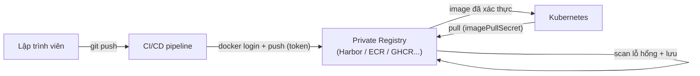

# Private Registries — Harbor, ECR, GCR/Artifact Registry, ACR, GHCR

> **Tác giả:** Mr.Rom\
> **Phiên bản:** v1.0.0\
> **Tạo lúc:** 13/06/2026\
> **Cập nhật:** 13/06/2026\
> **Level:** Basic\
> **Tags:** container-registry, private-registry, harbor, ecr, ghcr, acr, artifact-registry, kubernetes\
> **Yêu cầu trước:** [Tags & Digests](01_docker-hub-tags-and-digests.md)

> 🎯 *Bài trước bạn đã biết đặt tên image đúng và ghim immutable bằng digest. Nhưng image đó đang nằm ở đâu? Nếu là Docker Hub public thì cả thế giới tải được — kể cả đối thủ. Bài này dựng cho Acme Shop một **kho riêng** (private registry): chọn giữa self-host Harbor và các bản managed của AWS/Google/Azure/GitHub, xác thực bằng token/IAM thay vì mật khẩu, và cho phép Kubernetes tự pull image private bằng `imagePullSecrets`.*

## 🎯 Sau bài này bạn sẽ

- [ ] Giải thích được 5 lý do một team thật phải dùng private registry thay vì Docker Hub public
- [ ] Phân biệt Harbor (self-host) với 4 registry managed: ECR, Artifact Registry, ACR, GHCR — chọn đúng cái cho ngữ cảnh
- [ ] Đăng nhập (`docker login`) bằng token/IAM cho từng loại registry, hiểu vì sao không dùng mật khẩu thật
- [ ] Đẩy image Acme lên GHCR và ECR bằng tag đúng định dạng của từng nhà cung cấp
- [ ] Tạo `imagePullSecret` để Kubernetes pull được image private, gắn vào Pod qua `imagePullSecrets`

---

## Tình huống — Image của Acme Shop đang "phơi" giữa chợ

Acme Shop đã đóng gói xong app thành image `acme/shop-api`. Bạn push nó lên Docker Hub public cho tiện, deploy chạy ngon. Một tháng sau, ba chuyện xảy ra cùng lúc:

- **Đối thủ tải image về mổ xẻ.** Image public thì ai cũng `docker pull acme/shop-api` được. Họ `docker history` ra từng layer, đọc được cấu trúc thư mục, thư viện nội bộ, thậm chí vài endpoint nhạy cảm.
- **CI bị chặn vì rate limit.** Pipeline build mỗi commit, mỗi lần lại pull `node:20` từ Docker Hub. Tài khoản anonymous của Docker Hub giới hạn **100 pull / 6 giờ theo IP**; đến 10h sáng cao điểm, CI báo `toomanyrequests: You have reached your pull rate limit`. Cả team đứng hình.
- **Sếp hỏi về compliance.** Khách hàng doanh nghiệp yêu cầu Acme chứng minh image được quét lỗ hổng định kỳ và chỉ người có quyền mới push được. Docker Hub public không trả lời được câu nào.

> [!NOTE]
> Con số "100 pull / 6 giờ" là hạn mức anonymous của Docker Hub tại thời điểm 2026. Tài khoản free đăng nhập được nới rộng hơn, nhưng vẫn có trần — vì thế mọi team nghiêm túc đều mirror/host image qua registry riêng để không phụ thuộc hạn mức của bên thứ ba.

Cả ba vấn đề đều quy về một thiếu sót: image của bạn đang nằm ở **kho công cộng của người khác**. Lời giải là **private registry** — kho image riêng, có khóa cổng, có quét lỗ hổng, có phân quyền.

---

## 1️⃣ Vì sao cần private registry?

Ở bài 00 bạn đã biết registry là "kho lưu và phân phối image". Public registry (Docker Hub, Quay public...) tiện cho image mã nguồn mở — ai cũng pull được. Nhưng image *của riêng bạn* — chứa code, cấu hình, logic kinh doanh — thì không nên nằm ngoài đường.

🪞 **Ẩn dụ**: *Public registry như **kệ sách thư viện công cộng** — ai vào cũng mượn được, miễn phí, nhưng bạn không để hồ sơ mật của công ty lên đó. Private registry là **két sắt văn phòng** — chỉ người có chìa (token/IAM) mới mở, có camera ghi lại ai lấy gì (audit log), và có người gác cổng quét hàng cấm trước khi cho vào (vulnerability scan).*

Năm lý do cốt lõi để dựng private registry, sắp theo mức độ phổ biến:

| Lý do | Vấn đề nếu dùng public | Private registry giải quyết |
|---|---|---|
| 🔒 **Bảo mật** | Image proprietary (code, secret lỡ nhúng) lộ cho cả thế giới | Chỉ ai có quyền mới pull/push được |
| 📋 **Compliance** | Không kiểm soát được ai push gì, không audit được | RBAC + audit log + scan bắt buộc trước khi dùng |
| ⚡ **Tốc độ nội bộ** | Pull image từ internet công cộng, chậm khi qua biên giới mạng | Registry đặt cùng vùng (region) / cùng VPC → pull nhanh hơn nhiều |
| 🚦 **Tránh rate limit** | Docker Hub giới hạn pull theo IP → CI/CD fail giờ cao điểm | Registry riêng không có trần pull do bên thứ ba áp |
| 🏷️ **Image proprietary** | Đối thủ tải về phân tích layer | Image nằm sau tường lửa, không index, không tải lén được |

> 💡 Hiểu vì sao cần rồi, ta xem bức tranh tổng: một private registry "ngồi" ở đâu trong vòng đời image, từ lúc CI build tới lúc K8s pull.

### Sơ đồ — private registry trong dòng chảy CI/CD và K8s

Sơ đồ dưới mô tả vị trí của private registry: nó là điểm trung chuyển duy nhất giữa nơi *tạo ra* image (CI) và nơi *chạy* image (K8s), với một cổng xác thực canh ở mỗi chiều.



Điểm mấu chốt: cả hai chiều push (từ CI) và pull (từ K8s) đều phải **xác thực** — không ai vào kho mà không có chìa. Phần còn lại của bài đi sâu vào "chìa" đó cho từng loại registry.

---

## 2️⃣ Harbor — private registry tự host (self-host)

Khi nào bạn cần **tự vận hành** registry trên hạ tầng của mình (on-premise, hoặc đám mây riêng vì lý do compliance/data-sovereignty)? Đó là lúc **Harbor** xuất hiện.

**Harbor** (*do VMware tạo, nay là dự án CNCF Graduated — cấp trưởng thành cao nhất*) là registry mã nguồn mở, miễn phí, chạy được trên server của chính bạn. Nó không chỉ là "kho lưu image" mà là cả một nền tảng quản trị image cấp doanh nghiệp.

🪞 **Ẩn dụ tiếp nối**: *Nếu private registry là "két sắt văn phòng", thì Harbor là **két sắt bạn tự lắp trong nhà mình** — toàn quyền kiểm soát, không phụ thuộc ngân hàng (cloud provider), nhưng đổi lại bạn phải tự lo bảo trì, sao lưu, thay pin báo cháy.*

Những năng lực của Harbor mà các registry "kho thuần túy" không có sẵn:

| Tính năng | Harbor làm gì | Vì sao cần |
|---|---|---|
| **Project + RBAC** | Gom image vào *project*; mỗi project gán vai trò (admin / maintainer / developer / guest) | Team A không thấy/sửa được image của team B |
| **Replication** | Tự đồng bộ image sang registry khác (Harbor khác, Docker Hub, ECR...) theo lịch/sự kiện | Mirror image lên nhiều vùng, hoặc kéo image public về cache nội bộ |
| **Vulnerability scan** | Tích hợp sẵn Trivy — quét CVE mỗi khi push, chặn pull image "bẩn" | Compliance: không cho deploy image có CVE CRITICAL |
| **Image signing** | Tích hợp cosign (Sigstore) để ký số image | Chứng minh image không bị tráo (bài 03 đi sâu) |
| **Quota** | Giới hạn dung lượng mỗi project | Chặn một team xài hết ổ đĩa của cả công ty |
| **Retention / GC** | Tự xóa tag cũ theo quy tắc (giữ N bản mới nhất), rồi *garbage collection* dọn layer rác | Kho không phình vô hạn |

> 💡 Một điểm tiện: Harbor có cả **Web UI** — bạn xem image, kết quả scan, phân quyền ngay trên trình duyệt, không cần gõ lệnh.

### Đẩy image lên Harbor

Giả sử Acme dựng Harbor tại tên miền `harbor.acme.internal`, và đã tạo project tên `shop`. Quy trình đẩy image y hệt Docker Hub, chỉ khác phần *prefix* tên image phải gắn hostname của Harbor và tên project:

```bash
# 1. Đăng nhập Harbor (nhập username/password của tài khoản Harbor)
docker login harbor.acme.internal

# 2. Gắn tag theo định dạng: <harbor-host>/<project>/<image>:<tag>
docker tag acme/shop-api:1.0.0 harbor.acme.internal/shop/shop-api:1.0.0

# 3. Push lên Harbor
docker push harbor.acme.internal/shop/shop-api:1.0.0
```

Kết quả mong đợi:

```
The push refers to repository [harbor.acme.internal/shop/shop-api]
5f70bf18a086: Pushed
a1b2c3d4e5f6: Pushed
1.0.0: digest: sha256:9c3b... size: 1789
```

Dòng `Pushed` cho từng layer nghĩa là layer đó chưa có trên Harbor nên vừa được tải lên; nếu layer đã tồn tại bạn sẽ thấy `Layer already exists` (Harbor dedupe để tiết kiệm dung lượng). Dòng cuối in `digest` — chính là SHA256 immutable bạn đã học ở bài trước; ngay sau push, Trivy của Harbor sẽ tự quét image này nếu project bật scan-on-push.

> [!WARNING]
> Harbor là phần mềm bạn **tự vận hành**: bạn chịu trách nhiệm cấu hình TLS (chứng chỉ HTTPS), sao lưu database, vá lỗ hổng của chính Harbor, và đảm bảo ổ đĩa không đầy. Với team nhỏ chưa có người chuyên trách hạ tầng, registry managed (mục tiếp theo) thường là lựa chọn ít rủi ro hơn.

---

## 3️⃣ Registry managed — để nhà cung cấp lo vận hành

Tự host Harbor cho bạn toàn quyền, nhưng cũng đổ lên vai bạn mọi việc vận hành. Phần lớn team chọn hướng ngược lại: dùng **registry managed** — nhà cung cấp đám mây lo hạ tầng, sao lưu, mở rộng; bạn chỉ trả tiền và dùng. Bốn cái phổ biến nhất, gắn liền với 4 hệ sinh thái lớn.

🪞 **Ẩn dụ**: *Registry managed là **két sắt thuê ở ngân hàng** — ngân hàng (cloud provider) lo cửa, lo bảo vệ, lo phòng cháy; bạn chỉ giữ chìa của mình. Đổi lại bạn ở trong "khuôn viên" của họ: dùng cơ chế xác thực của họ (IAM/token).*

### 3.1 AWS ECR (Elastic Container Registry)

**ECR** là registry của AWS, gắn chặt với **IAM** (*Identity and Access Management* — hệ thống phân quyền của AWS). Điểm đặc trưng: bạn **không** có "mật khẩu ECR" cố định. Thay vào đó, AWS CLI sinh ra một **token tạm thời** (sống ~12 giờ) từ quyền IAM của bạn, rồi đưa token đó cho `docker login`.

ECR có hai dạng địa chỉ tùy registry private hay public:

```
# Private (chỉ tài khoản AWS của bạn truy cập):
<account-id>.dkr.ecr.<region>.amazonaws.com/<repo>:<tag>

# Ví dụ:
123456789012.dkr.ecr.ap-southeast-1.amazonaws.com/shop-api:1.0.0
```

Đăng nhập ECR đúng chuẩn dùng `aws ecr get-login-password` — lệnh này in token ra stdout, rồi *pipe* thẳng vào `docker login` qua `--password-stdin` để token không lọt vào lịch sử shell:

```bash
# Lấy token tạm rồi đưa cho docker login (không lưu vào history)
aws ecr get-login-password --region ap-southeast-1 \
  | docker login \
      --username AWS \
      --password-stdin 123456789012.dkr.ecr.ap-southeast-1.amazonaws.com
```

Kết quả mong đợi:

```
Login Succeeded
```

Username **luôn là `AWS`** (cố định, không phải tên người dùng của bạn) — phần xác thực nằm hết ở token trong `--password-stdin`. Token hết hạn sau ~12 giờ, lúc đó chạy lại lệnh trên để lấy token mới.

> [!IMPORTANT]
> Khác Docker Hub, ECR **không tự tạo repository khi push**. Bạn phải tạo repo trước (qua Console, hoặc `aws ecr create-repository --repository-name shop-api`), nếu không push sẽ báo lỗi `name unknown: The repository ... does not exist`.

**Lifecycle policy** — ECR cho bạn đặt luật tự dọn image cũ, tránh kho phình vô hạn (mỗi GB lưu trữ đều tính tiền). Ví dụ "chỉ giữ 10 image mới nhất, xóa phần còn lại":

```json
{
  "rules": [
    {
      "rulePriority": 1,
      "description": "Chi giu 10 image moi nhat",
      "selection": {
        "tagStatus": "any",
        "countType": "imageCountMoreThan",
        "countNumber": 10
      },
      "action": { "type": "expire" }
    }
  ]
}
```

→ Lifecycle policy chạy tự động phía AWS, bạn không cần cron job riêng. Đây là phiên bản managed của tính năng "retention" mà Harbor cũng có.

### 3.2 Google Artifact Registry (kế thừa GCR)

Trên Google Cloud trước đây có **GCR** (*Google Container Registry*, địa chỉ `gcr.io`). Từ 2023 Google khai tử GCR và thay bằng **Artifact Registry** (`pkg.dev`) — kho tổng quát hơn, lưu được cả Docker image lẫn package npm/Maven/Python. Năm 2026, GCR đã shutdown, nên **Artifact Registry là lựa chọn mặc định** trên GCP.

Địa chỉ image của Artifact Registry có thêm tầng *repository*:

```
<region>-docker.pkg.dev/<project-id>/<repo>/<image>:<tag>

# Ví dụ:
asia-southeast1-docker.pkg.dev/acme-prod/shop/shop-api:1.0.0
```

Xác thực không dùng token thủ công như ECR — `gcloud` đăng ký một *credential helper* (trợ lý cấp chứng thực) để Docker tự lấy token mỗi lần push/pull:

```bash
# Cau hinh 1 lan: Docker se tu xin token cho mien pkg.dev nay
gcloud auth configure-docker asia-southeast1-docker.pkg.dev
```

→ Sau lệnh này, mọi `docker push`/`docker pull` tới `asia-southeast1-docker.pkg.dev` đều tự xác thực bằng tài khoản `gcloud` đang đăng nhập. Không phải gõ `docker login` lại mỗi lần.

### 3.3 Azure ACR (Azure Container Registry)

**ACR** là registry của Microsoft Azure. Địa chỉ đơn giản nhất trong nhóm — chỉ `<tên-registry>.azurecr.io`, không có tầng account-id hay project ở prefix:

```
<registry-name>.azurecr.io/<image>:<tag>

# Ví dụ:
acmeshop.azurecr.io/shop-api:1.0.0
```

Đăng nhập gọn nhất qua Azure CLI — `az acr login` tự lấy token từ phiên `az` hiện tại và nạp vào Docker:

```bash
# Tu lay token tu phien az dang dang nhap roi nap vao docker
az acr login --name acmeshop
```

Kết quả:

```
Login Succeeded
```

→ Như ECR và Artifact Registry, ACR cũng buộc image gắn vào danh tính đám mây (Azure AD/Entra ID) — bạn không quản mật khẩu thủ công.

### 3.4 GHCR (GitHub Container Registry)

**GHCR** (`ghcr.io`) là registry của GitHub, gắn liền với repository GitHub. Đây thường là lựa chọn **dễ bắt đầu nhất** cho dự án đã ở trên GitHub: không cần tài khoản cloud riêng, image gắn thẳng vào org/user GitHub, và trong GitHub Actions có sẵn `GITHUB_TOKEN` để push mà không cần cấu hình credential gì thêm.

Địa chỉ image gắn theo owner (user hoặc organization) trên GitHub:

```
ghcr.io/<owner>/<image>:<tag>

# Ví dụ:
ghcr.io/acme-shop/shop-api:1.0.0
```

Khi đăng nhập ở máy local, bạn **không** dùng mật khẩu GitHub mà dùng **Personal Access Token (PAT)** có quyền `write:packages`. Đưa token qua `--password-stdin` để không lộ vào history:

```bash
# CR_PAT la Personal Access Token co quyen write:packages
echo "$CR_PAT" | docker login ghcr.io -u <github-username> --password-stdin
```

Kết quả:

```
Login Succeeded
```

> [!TIP]
> Trong **GitHub Actions**, bạn không cần PAT — GitHub tự cấp biến `secrets.GITHUB_TOKEN` cho mỗi lần chạy workflow. Chỉ cần khai quyền `packages: write` trong workflow là login được. Phần hands-on bên dưới minh họa đầy đủ.

---

## 4️⃣ Bảng so sánh 5 registry

Trước khi vào thực hành, đặt 5 lựa chọn cạnh nhau để bạn biết chọn cái nào cho ngữ cảnh nào. Tiêu chí quan trọng nhất là **hosting** (tự lo hay nhà cung cấp lo) và **cơ chế xác thực** (vì nó quyết định cách CI/CD và K8s lấy được image).

| Tiêu chí | Harbor | AWS ECR | Artifact Registry | Azure ACR | GHCR |
|---|---|---|---|---|---|
| **Hosting** | Tự host | Managed (AWS) | Managed (GCP) | Managed (Azure) | Managed (GitHub) |
| **Hostname** | tự đặt | `*.dkr.ecr.*.amazonaws.com` | `*-docker.pkg.dev` | `*.azurecr.io` | `ghcr.io` |
| **Xác thực** | user/pass + token | IAM (token 12h) | gcloud / service account | Azure AD / token | PAT / `GITHUB_TOKEN` |
| **Scan lỗ hổng** | ✅ Trivy tích hợp | ✅ (basic/enhanced) | ✅ (qua Container Analysis) | ✅ (Defender) | ⚠️ qua Actions, không sẵn |
| **Tự tạo repo khi push** | ✅ (trong project) | ❌ phải tạo trước | ✅ (nếu repo đã có) | ✅ | ✅ |
| **Hợp nhất khi nào** | On-prem, cần toàn quyền, compliance | Đã ở AWS, dùng EKS | Đã ở GCP, dùng GKE | Đã ở Azure, dùng AKS | Dự án ở GitHub, CI bằng Actions |

> ⚠️ Nguyên tắc chọn đơn giản: **registry "đi chung nhà" với hạ tầng của bạn**. Chạy K8s trên EKS thì ECR pull nhanh nhất và phân quyền liền mạch với IAM; trên GKE thì Artifact Registry; trên AKS thì ACR. Nếu chưa định hình hạ tầng hoặc chỉ cần CI từ GitHub, GHCR là điểm khởi đầu rẻ và nhanh.

---

## 5️⃣ Hands-on — Đẩy image Acme lên GHCR + ECR

Lý thuyết đủ rồi. Giờ ta đưa image `shop-api` của Acme lên *cả hai* registry để bạn thấy tận tay khác biệt giữa GHCR (token đơn giản) và ECR (IAM + phải tạo repo trước). Giả sử bạn đã có image local `acme/shop-api:1.0.0` (build từ bài Docker).

### 🛠️ Bước 1: Đẩy lên GHCR

GHCR là đường dễ nhất nên ta làm trước. Cần một PAT có quyền `write:packages` (tạo tại GitHub → Settings → Developer settings → Personal access tokens).

```bash
# 1. Dang nhap GHCR bang PAT (luu PAT vao bien moi truong truoc)
echo "$CR_PAT" | docker login ghcr.io -u acme-bot --password-stdin

# 2. Gan tag theo dinh dang ghcr.io/<owner>/<image>:<tag>
docker tag acme/shop-api:1.0.0 ghcr.io/acme-shop/shop-api:1.0.0

# 3. Push len GHCR
docker push ghcr.io/acme-shop/shop-api:1.0.0
```

Kết quả mong đợi:

```
The push refers to repository [ghcr.io/acme-shop/shop-api]
3a1b2c3d4e5f: Pushed
6f7a8b9c0d1e: Pushed
1.0.0: digest: sha256:7b2f... size: 1573
```

→ Image giờ nằm trong tab **Packages** của org `acme-shop`. Mặc định package mới ở GHCR là **private** — chỉ thành viên org pull được, đúng nhu cầu của Acme.

> 📖 GHCR xong, ta sang ECR — nơi có hai khác biệt: phải tạo repo trước, và token chỉ sống 12 giờ.

### 🛠️ Bước 2: Đẩy lên AWS ECR

ECR không tự tạo repo, nên bước đầu là tạo nó. Giả sử account `123456789012`, vùng `ap-southeast-1`.

```bash
# 1. Tao repository (chi can lam 1 lan)
aws ecr create-repository \
  --repository-name shop-api \
  --region ap-southeast-1

# 2. Lay token tam roi dang nhap (username luon la "AWS")
aws ecr get-login-password --region ap-southeast-1 \
  | docker login \
      --username AWS \
      --password-stdin 123456789012.dkr.ecr.ap-southeast-1.amazonaws.com

# 3. Gan tag theo dinh dang <account>.dkr.ecr.<region>.amazonaws.com/<repo>:<tag>
docker tag acme/shop-api:1.0.0 \
  123456789012.dkr.ecr.ap-southeast-1.amazonaws.com/shop-api:1.0.0

# 4. Push len ECR
docker push 123456789012.dkr.ecr.ap-southeast-1.amazonaws.com/shop-api:1.0.0
```

Kết quả mong đợi (rút gọn):

```
Login Succeeded
The push refers to repository [123456789012.dkr.ecr.ap-southeast-1.amazonaws.com/shop-api]
3a1b2c3d4e5f: Pushed
1.0.0: digest: sha256:7b2f... size: 1573
```

→ Cùng một image local, cùng digest `sha256:7b2f...` — chỉ tag (địa chỉ kho) khác nhau. Đây chính là tính immutable của digest từ bài trước: nội dung không đổi thì digest không đổi, dù bạn đẩy lên bao nhiêu registry.

### 🛠️ Bước 3 (tùy chọn): Push từ GitHub Actions lên GHCR

Trong CI/CD thật, bạn không gõ tay 3 bước trên mà để pipeline làm. Đoạn workflow dưới đây build và push lên GHCR, dùng `GITHUB_TOKEN` sẵn có — không cần PAT, không cần lưu secret thủ công:

```yaml
# .github/workflows/build-push.yml
name: Build and Push

on:
  push:
    branches: [main]

permissions:
  contents: read
  packages: write    # bat buoc de push len GHCR

jobs:
  build-push:
    runs-on: ubuntu-latest
    steps:
      - uses: actions/checkout@v4

      - name: Dang nhap GHCR bang GITHUB_TOKEN
        uses: docker/login-action@v3
        with:
          registry: ghcr.io
          username: ${{ github.actor }}
          password: ${{ secrets.GITHUB_TOKEN }}

      - name: Build va push
        uses: docker/build-push-action@v6
        with:
          context: .
          push: true
          tags: ghcr.io/${{ github.repository }}:${{ github.sha }}
```

→ Mỗi lần push lên nhánh `main`, Actions tự build image và đẩy lên GHCR với tag là commit SHA. Không có mật khẩu nào lộ ra — `GITHUB_TOKEN` chỉ sống trong vòng đời của một lần chạy workflow.

---

## 6️⃣ Dùng image private trong Kubernetes

Image đã nằm an toàn trong registry private. Nhưng giờ phát sinh vấn đề: K8s cluster của Acme thử `docker pull` image đó và bị từ chối — vì cluster *chưa có chìa*. Bạn sẽ thấy Pod kẹt ở trạng thái này:

```
NAME              READY   STATUS             RESTARTS   AGE
shop-api-xxxxx    0/1     ErrImagePull       0          12s
shop-api-xxxxx    0/1     ImagePullBackOff   0          30s
```

`ErrImagePull` / `ImagePullBackOff` nghĩa là K8s không kéo được image — phổ biến nhất là do thiếu credential cho registry private (BackOff = K8s đang chờ rồi thử lại với khoảng cách tăng dần). Cách khắc phục: tạo một **Secret kiểu `docker-registry`** chứa credential, rồi gắn nó vào Pod qua `imagePullSecrets`.

🪞 **Ẩn dụ**: *`imagePullSecret` là **thẻ ra vào** bạn phát cho Pod. Pod cầm thẻ này tới cổng registry, quẹt thẻ, cổng mở → pull được image. Không thẻ → đứng ngoài cổng (`ImagePullBackOff`).*

### 🛠️ Bước 1: Tạo imagePullSecret

`kubectl create secret docker-registry` đóng gói credential (server + user + token) thành một Secret. Ví dụ cho GHCR:

```bash
kubectl create secret docker-registry ghcr-cred \
  --docker-server=ghcr.io \
  --docker-username=acme-bot \
  --docker-password="$CR_PAT" \
  --namespace=acme
```

Kết quả:

```
secret/ghcr-cred created
```

Bốn cờ tương ứng đúng những gì `docker login` cần: `--docker-server` là hostname registry (`ghcr.io`), `--docker-username` + `--docker-password` là cặp xác thực (với GHCR là username + PAT). K8s lưu chúng đã mã hóa base64 trong Secret kiểu `kubernetes.io/dockerconfigjson` — đúng định dạng của file `~/.docker/config.json`.

> [!CAUTION]
> Token ECR chỉ sống **~12 giờ**. Nếu tạo `imagePullSecret` từ `aws ecr get-login-password` rồi để yên, ngày hôm sau Pod sẽ lại `ImagePullBackOff` vì token hết hạn. Trên EKS, đừng tạo secret thủ công — gắn quyền ECR cho node/Pod qua IAM (IRSA) để K8s tự lấy token. Secret thủ công kiểu này chỉ hợp cho registry có token dài hạn như GHCR PAT.

### 🛠️ Bước 2: Gắn Secret vào Pod

Trong manifest Pod/Deployment, khai báo `imagePullSecrets` trỏ tới Secret vừa tạo. K8s sẽ dùng nó khi kéo image:

```yaml
apiVersion: v1
kind: Pod
metadata:
  name: shop-api
  namespace: acme
spec:
  containers:
    - name: shop-api
      image: ghcr.io/acme-shop/shop-api:1.0.0
  imagePullSecrets:
    - name: ghcr-cred
```

Apply rồi kiểm tra — lần này Pod kéo được image và chạy lên:

```bash
kubectl apply -f shop-api-pod.yaml
kubectl get pod shop-api -n acme
```

Kết quả mong đợi:

```
NAME       READY   STATUS    RESTARTS   AGE
shop-api   1/1     Running   0          18s
```

`STATUS` chuyển từ `ImagePullBackOff` sang `Running` và `READY` là `1/1` xác nhận K8s đã quẹt được "thẻ ra vào", pull thành công image private và khởi chạy container.

> [!TIP]
> Nếu mọi Pod trong namespace đều pull từ cùng một registry, đừng lặp `imagePullSecrets` ở từng manifest. Gắn secret vào **ServiceAccount** mặc định một lần — mọi Pod dùng ServiceAccount đó tự thừa hưởng: `kubectl patch serviceaccount default -n acme -p '{"imagePullSecrets": [{"name": "ghcr-cred"}]}'`.

---

## 💡 Cạm bẫy thường gặp & Best practice

### ❌ Cạm bẫy: Dùng mật khẩu thật của tài khoản thay vì token

- **Triệu chứng**: bạn gõ `docker login ghcr.io` rồi nhập mật khẩu GitHub thật, hoặc nhúng mật khẩu cloud vào script CI.
- **Nguyên nhân**: tưởng registry dùng mật khẩu tài khoản như đăng nhập web.
- **Cách tránh**: luôn dùng **token có scope hẹp** (GHCR PAT `write:packages`, ECR token tạm 12h, ACR token AD). Token lộ thì chỉ mất quyền registry, không mất cả tài khoản; và đưa token qua `--password-stdin` để không lọt vào shell history.

### ❌ Cạm bẫy: Push lên ECR mà chưa tạo repository

- **Triệu chứng**: `docker push` báo `name unknown: The repository with name 'shop-api' does not exist in the registry`.
- **Nguyên nhân**: ECR không auto-create repo khi push (khác Docker Hub, GHCR).
- **Cách tránh**: tạo repo trước bằng `aws ecr create-repository --repository-name shop-api`, hoặc bật `--image-tag-mutability` và tạo qua IaC (Terraform) cho nhất quán.

### ❌ Cạm bẫy: imagePullSecret dùng token ECR rồi để hết hạn

- **Triệu chứng**: hôm nay Pod chạy ngon, mai sáng tất cả `ImagePullBackOff`.
- **Nguyên nhân**: token ECR trong Secret đã quá 12 giờ → hết hiệu lực.
- **Cách tránh**: trên EKS dùng **IRSA** (gắn IAM role cho ServiceAccount) để node tự lấy token; không dán token tạm vào Secret tĩnh. Secret tĩnh chỉ hợp với token dài hạn (GHCR PAT, Harbor robot account).

### ✅ Best practice: Đặt registry cùng vùng với cluster

- **Vì sao**: pull image qua internet công cộng chậm và tốn băng thông egress (có thể bị tính phí). Registry cùng region/VPC với cluster thì pull qua mạng nội bộ — nhanh hơn nhiều và thường miễn phí egress.
- **Cách áp dụng**: chạy EKS ở `ap-southeast-1` thì tạo ECR repo ở `ap-southeast-1`; tự host Harbor thì đặt cạnh cluster trong cùng mạng riêng.

### ✅ Best practice: Bật retention/lifecycle để kho không phình vô hạn

- **Vì sao**: mỗi build CI đẩy một image mới (tag theo commit SHA). Sau vài tháng kho có hàng nghìn image cũ, tốn tiền lưu trữ và khó tìm.
- **Cách áp dụng**: ECR đặt *lifecycle policy* ("giữ 10 bản mới nhất"); Harbor đặt *retention rule* + *garbage collection*; GHCR đặt quy tắc xóa version cũ. Luôn giữ lại các tag release (`v1.0.0`) — chỉ dọn tag tạm (commit SHA).

---

## 🧠 Tự kiểm tra (Self-check)

**Q1.** Vì sao ECR yêu cầu chạy lại `aws ecr get-login-password` mỗi ~12 giờ, trong khi `docker login` Docker Hub đăng nhập một lần là xong?

<details>
<summary>💡 Đáp án</summary>

ECR không có "mật khẩu cố định". Lệnh `aws ecr get-login-password` sinh ra một **token tạm thời** từ quyền IAM của bạn, và token này hết hạn sau ~12 giờ — đây là cơ chế bảo mật: token lộ thì cũng chỉ dùng được trong thời gian ngắn. Docker Hub thì lưu credential (token đăng nhập dài hạn) trong `~/.docker/config.json`, nên không cần đăng nhập lại liên tục.

Hệ quả thực tế: trong CI/CD, bước `docker login` ECR phải nằm *trong* pipeline (chạy mỗi lần), và `imagePullSecret` ECR tĩnh sẽ hết hạn — nên dùng IRSA trên EKS thay vì Secret thủ công.

</details>

**Q2.** Cùng một image `acme/shop-api:1.0.0` đẩy lên GHCR và ECR có cùng digest không? Tag có giống không?

<details>
<summary>💡 Đáp án</summary>

**Digest giống nhau** — vì nội dung image không đổi, mà digest là SHA256 của nội dung (bài trước đã học). Bạn đẩy lên bao nhiêu registry thì digest vẫn là một.

**Tag (địa chỉ đầy đủ) khác nhau** — vì prefix gắn hostname + đường dẫn của từng registry:
- GHCR: `ghcr.io/acme-shop/shop-api:1.0.0`
- ECR: `123456789012.dkr.ecr.ap-southeast-1.amazonaws.com/shop-api:1.0.0`

`docker tag` chỉ tạo thêm "nhãn trỏ tới" cùng một image local, không copy dữ liệu — nên cả hai nhãn trỏ về cùng digest.

</details>

**Q3.** Pod báo `ImagePullBackOff`. Liệt kê 2 nguyên nhân phổ biến nhất liên quan tới registry private và cách kiểm tra.

<details>
<summary>💡 Đáp án</summary>

1. **Thiếu `imagePullSecret`** — Pod không có credential để pull image private. Kiểm tra: `kubectl describe pod <tên>` → mục Events thấy `pull access denied` / `unauthorized`. Sửa: tạo Secret `docker-registry` và gắn vào `imagePullSecrets`.
2. **Token trong Secret đã hết hạn** (điển hình ECR token 12h) — credential từng đúng nhưng nay vô hiệu. Kiểm tra: Events báo `authentication required` / `token expired`. Sửa: làm mới token (hoặc dùng IRSA trên EKS để tự gia hạn).

Nguyên nhân khác (không liên quan auth): sai tên image/tag (`manifest unknown`), hoặc registry không tới được do mạng/DNS. Luôn bắt đầu debug bằng `kubectl describe pod <tên>` để đọc mục Events.

</details>

**Q4.** Khi nào nên tự host Harbor thay vì dùng registry managed?

<details>
<summary>💡 Đáp án</summary>

Tự host Harbor hợp lý khi:
- **Compliance / chủ quyền dữ liệu** (data sovereignty): image bắt buộc nằm trong hạ tầng riêng/on-premise, không được rời khỏi mạng nội bộ.
- **Đã có hạ tầng on-prem** và đội vận hành đủ sức bảo trì (TLS, backup, vá lỗi, theo dõi ổ đĩa).
- **Muốn một bộ tính năng đồng nhất** (scan Trivy + RBAC + replication + signing) trên nhiều môi trường cloud lai (hybrid), không phụ thuộc một nhà cung cấp.

Ngược lại, nếu cluster đã ở một cloud cụ thể (EKS/GKE/AKS) và team không có người chuyên trách hạ tầng, registry managed của chính cloud đó (ECR/Artifact Registry/ACR) ít rủi ro hơn — provider lo vận hành, và xác thực liền mạch với IAM của cloud.

</details>

---

## ⚡ Tra cứu nhanh (Cheatsheet)

```bash
# === Đăng nhập từng registry ===
# Docker Hub (token đăng nhập web)
docker login

# Harbor (self-host)
docker login harbor.acme.internal

# AWS ECR (token IAM ~12h)
aws ecr get-login-password --region ap-southeast-1 \
  | docker login --username AWS --password-stdin \
      123456789012.dkr.ecr.ap-southeast-1.amazonaws.com

# Google Artifact Registry (credential helper, cấu hình 1 lần)
gcloud auth configure-docker asia-southeast1-docker.pkg.dev

# Azure ACR
az acr login --name acmeshop

# GHCR (PAT có scope write:packages)
echo "$CR_PAT" | docker login ghcr.io -u <username> --password-stdin

# === Tag theo định dạng từng registry ===
docker tag app:1.0.0 harbor.acme.internal/shop/app:1.0.0
docker tag app:1.0.0 123456789012.dkr.ecr.ap-southeast-1.amazonaws.com/app:1.0.0
docker tag app:1.0.0 asia-southeast1-docker.pkg.dev/acme-prod/shop/app:1.0.0
docker tag app:1.0.0 acmeshop.azurecr.io/app:1.0.0
docker tag app:1.0.0 ghcr.io/acme-shop/app:1.0.0

# === ECR: tạo repo trước khi push ===
aws ecr create-repository --repository-name app --region ap-southeast-1

# === Kubernetes imagePullSecret ===
kubectl create secret docker-registry ghcr-cred \
  --docker-server=ghcr.io \
  --docker-username=<username> \
  --docker-password="$CR_PAT" \
  --namespace=acme

# Gắn secret vào ServiceAccount default (mọi Pod tự thừa hưởng)
kubectl patch serviceaccount default -n acme \
  -p '{"imagePullSecrets": [{"name": "ghcr-cred"}]}'
```

---

## 📚 Từ Điển Thuật Ngữ (Glossary)

| EN | VN | Giải thích |
|---|---|---|
| Private registry | Kho image riêng | Registry chỉ ai có quyền mới pull/push, không công khai |
| Harbor | Harbor (giữ nguyên) | Registry mã nguồn mở tự host (CNCF), có RBAC + scan + replication |
| ECR | (giữ nguyên) | Elastic Container Registry — registry managed của AWS, xác thực qua IAM |
| Artifact Registry | (giữ nguyên) | Registry managed của Google, kế thừa GCR; lưu cả image lẫn package |
| GCR | (giữ nguyên) | Google Container Registry cũ (`gcr.io`), đã bị Artifact Registry thay thế |
| ACR | (giữ nguyên) | Azure Container Registry — registry managed của Microsoft Azure |
| GHCR | (giữ nguyên) | GitHub Container Registry (`ghcr.io`), gắn với repo GitHub |
| IAM | Quản lý danh tính & quyền | Hệ thống phân quyền của AWS, gốc cấp token cho ECR |
| RBAC | Phân quyền theo vai trò | Gán vai trò (admin/developer/guest) cho người dùng trong project |
| Replication | Sao chép/đồng bộ | Tự copy image giữa các registry theo lịch hoặc sự kiện |
| Retention | Giữ lại/dọn cũ | Quy tắc tự xóa tag/image cũ để kho không phình vô hạn |
| Lifecycle policy | Chính sách vòng đời | Phiên bản retention của ECR — luật tự xóa image theo điều kiện |
| PAT | Token truy cập cá nhân | Personal Access Token — token thay mật khẩu khi login GHCR |
| Credential helper | Trợ lý cấp chứng thực | Chương trình Docker gọi để tự lấy token (vd `gcloud`) |
| imagePullSecret | Secret kéo image | Secret K8s chứa credential để pull image từ registry private |
| IRSA | IAM Roles for Service Accounts | Cơ chế EKS gắn IAM role cho ServiceAccount để tự lấy token ECR |
| ImagePullBackOff | (trạng thái lỗi) | Pod không pull được image, K8s chờ rồi thử lại với khoảng cách tăng dần |

---

## 🔗 Liên kết & Tài nguyên

### 🧭 Định hướng lộ trình học

- ⬅️ **Bài trước:** [Tags & Digests — Đặt tên image đúng, immutable bằng digest](01_docker-hub-tags-and-digests.md)
- ➡️ **Bài tiếp theo:** [Image Signing & Scanning — Trivy, cosign, SBOM, supply chain](03_image-signing-and-scanning.md)
- ↑ **Về cụm:** [Container Registry — Kho lưu & phân phối image](../../README.md)

### 🧩 Các chủ đề có thể bạn quan tâm

- [Container Registry là gì? — Kho lưu & phân phối image](00_what-is-container-registry.md) — nền tảng trước khi vào registry private
- [Registry trong CI/CD — Cache, tag strategy, promotion, retention](04_registry-in-cicd.md) — đưa push/pull vào pipeline tự động
- [Image Security & Supply Chain — Scan, Sign, Verify](../../../docker/lessons/02_intermediate/02_image-security-supply-chain.md) — quét CVE và ký số sâu hơn

### 🌐 Tài nguyên tham khảo khác

- [Harbor docs](https://goharbor.io/docs/) — tài liệu chính thức của Harbor (cài đặt, project, RBAC, replication)
- [AWS ECR — Private registry authentication](https://docs.aws.amazon.com/AmazonECR/latest/userguide/registry_auth.html) — chi tiết cơ chế token IAM
- [Google Artifact Registry docs](https://cloud.google.com/artifact-registry/docs) — bao gồm hướng dẫn migrate từ GCR
- [Azure ACR docs](https://learn.microsoft.com/azure/container-registry/) — xác thực và quản lý ACR
- [GitHub: Working with the Container registry](https://docs.github.com/packages/working-with-a-github-packages-registry/working-with-the-container-registry) — push/pull GHCR và quyền truy cập
- [Kubernetes: Pull an image from a private registry](https://kubernetes.io/docs/tasks/configure-pod-container/pull-image-private-registry/) — chính thức về imagePullSecrets

---

## 📌 Nhật ký thay đổi (Changelog)

- **v1.0.0 (13/06/2026)** — Bản đầu tiên. Lý do cần private registry (bảo mật/compliance/tốc độ/rate limit/proprietary); Harbor self-host (project + RBAC, replication, scan Trivy, signing, quota, retention); 4 registry managed (ECR + IAM token + lifecycle policy, Artifact Registry kế thừa GCR, ACR, GHCR + GITHUB_TOKEN); bảng so sánh 5 registry; hands-on đẩy image Acme lên GHCR + ECR + workflow GitHub Actions; tạo imagePullSecret và gắn vào Pod K8s. 1 sơ đồ mermaid, 3 pitfall + 2 best practice, 4 self-check, cheatsheet, glossary.
