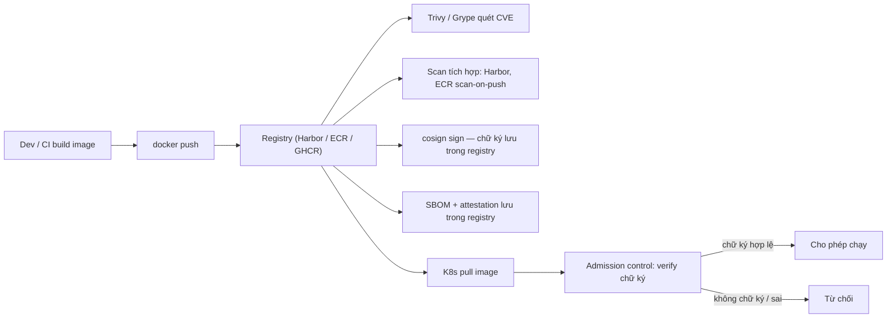

# Image Signing & Scanning — Trivy, cosign, SBOM, supply chain

> **Tác giả:** Mr.Rom\
> **Phiên bản:** v1.0.0\
> **Tạo lúc:** 13/06/2026\
> **Cập nhật:** 13/06/2026\
> **Level:** Basic\
> **Tags:** container-registry, security, supply-chain, trivy, cosign, sbom\
> **Yêu cầu trước:** [Private Registries](02_private-registries.md)

> 🎯 *Ở bài trước bạn đã dựng được registry riêng (Harbor/ECR/GHCR...) để chứa image của Acme Shop. Nhưng "có chỗ chứa" chưa đủ — image đẩy lên đó có thể chứa lỗ hổng đã biết (CVE), và một image trong registry có thể bị tráo bằng bản giả mà không ai hay. Bài này nhìn supply chain từ **góc registry**: quét lỗ hổng bằng Trivy/Grype (và scan tích hợp sẵn trong Harbor/ECR), kê khai thành phần bằng SBOM, ký số bằng cosign rồi lưu chữ ký **ngay trong registry**, và verify trước khi deploy.*

## 🎯 Sau bài này bạn sẽ

- [ ] Hiểu hai rủi ro supply chain ở tầng registry: image chứa CVE, và image bị giả mạo/tráo (tamper)
- [ ] Quét lỗ hổng image trong registry bằng **Trivy** (OS package + lib CVE + misconfig), biết thêm **Grype** và scan tích hợp **Harbor** / **ECR scan-on-push**
- [ ] Đọc severity (CRITICAL/HIGH) và **fail build** theo ngưỡng trong CI
- [ ] Tạo **SBOM** (Software Bill of Materials) bằng **Syft** ở định dạng SPDX/CycloneDX
- [ ] Ký số image bằng **cosign** (keyless OIDC + key-based), lưu chữ ký vào registry như OCI artifact
- [ ] Verify chữ ký trước khi deploy (admission control ở K8s) và nắm SLSA mức cơ bản

---

## Tình huống — Image vẫn đứng yên trong registry, rủi ro thì không

Acme Shop đã có Harbor riêng tại `registry.acme.vn`. Mỗi lần CI build xong là đẩy image `registry.acme.vn/shop/api:v1.4.0` lên đó, rồi K8s pull về chạy. Mọi thứ trông gọn gàng.

Nhưng hãy hình dung hai chuyện sau, đều xảy ra **bên trong registry** chứ không phải lúc build:

- **Chuyện 1 — CVE âm thầm tích tụ.** Image `shop/api:v1.4.0` đẩy lên hôm Thứ Hai, lúc đó Trivy quét "0 CRITICAL". Thứ Sáu, một lỗ hổng nghiêm trọng trong `libxml2` được công bố. Image *không hề đổi* — vẫn nằm yên trong registry — nhưng giờ nó vulnerable. Nếu không có ai quét lại định kỳ, bạn deploy một quả bom hẹn giờ mà không biết.
- **Chuyện 2 — image bị tráo.** Một bạn dev rời công ty nhưng token push vào Harbor chưa bị thu hồi. Kẻ xấu (hoặc một con script lỗi) đẩy đè một image khác lên đúng tag `shop/api:v1.4.0` (tag là *mutable* — đè được). K8s pull tag đó, deploy luôn. Image production giờ là bản lạ, không ai ký duyệt.

Hai chuyện này là hai mặt của cùng một vấn đề: **registry là điểm trung chuyển, nên cũng là điểm tấn công**. Bài *Image Security & Supply Chain* bên cụm Docker đã dựng nền 5 lớp phòng thủ (base image → scan → SBOM → sign → admission). Bài này không lặp lại lý thuyết đó — mình đi sâu vào **hai việc bạn làm trực tiếp với registry**:

1. **Scan** — quét lỗ hổng image *đang nằm trong registry*, và để chính registry tự quét (Harbor, ECR).
2. **Sign + Verify** — ký số rồi lưu chữ ký *ngay cạnh image trong registry*, verify trước khi pull/deploy.

> 💡 Để hình dung registry đứng ở đâu trong dòng chảy, mình xem sơ đồ dưới trước — nó cho thấy scan và sign đều "bám" vào registry chứ không phải vào máy build.



Sơ đồ cho thấy điểm mấu chốt: mọi lớp bảo vệ (scan, sign, SBOM) đều **gắn vào registry** — vì registry là nơi image *sống* lâu nhất và là nơi mọi consumer (K8s, dev khác, CI khác) đến lấy. Bảo vệ ở đây là bảo vệ đúng chỗ.

---

## 1️⃣ Hai rủi ro supply chain nhìn từ registry

Trước khi cầm công cụ, cần gọi tên rõ hai rủi ro — vì mỗi rủi ro cần một loại phòng thủ khác nhau, dùng nhầm thì vô dụng.

| Rủi ro | Bản chất | "Thuốc chữa" | Công cụ |
|---|---|---|---|
| Image chứa CVE | Image *thật* của bạn, nhưng bên trong có package dính lỗ hổng đã công bố | Phát hiện sớm + chặn deploy | Scan (Trivy, Grype, Harbor, ECR) |
| Image bị giả mạo / tráo | Image trong registry *không phải* bản bạn build (bị đè tag, registry bị chiếm) | Chứng minh nguồn gốc + verify trước khi chạy | Sign + Verify (cosign) |

🪞 **Ẩn dụ**: Registry như **kho hàng của một siêu thị**. Có hai nỗi lo khác nhau:

- *Hàng trong kho có bị hỏng/hết hạn không?* → phải có người **kiểm định chất lượng** đi soi từng lô (đó là **scan CVE**). Lô hàng nằm yên nhưng "hạn sử dụng" (CVE landscape) thay đổi theo thời gian, nên phải soi định kỳ.
- *Lô hàng này có đúng do nhà cung cấp thật giao không, hay bị tráo giữa đường?* → phải có **niêm phong/tem chống giả** dán lên thùng (đó là **chữ ký cosign**), và bảo vệ ở cổng kho **soi tem** trước khi cho hàng vào quầy (đó là **admission control**).

Hai việc này độc lập: một image **đã ký** vẫn có thể **đầy CVE** (chữ ký chỉ chứng minh "đúng hàng", không chứng minh "hàng sạch"). Ngược lại, một image **0 CVE** mà **không ký** thì vẫn có thể bị tráo. Vì thế production cần **cả hai**.

Quan trọng: trong cả hai việc, **digest** là điểm tựa. Tag (`:v1.4.0`) đổi được, nhưng digest (`@sha256:...`) là hash của đúng một image — đổi 1 byte là đổi digest. Bài [Tags & Digests](01_docker-hub-tags-and-digests.md) đã giải thích kỹ; ở đây chỉ cần nhớ: **scan và sign luôn nên gắn vào digest, không phải tag.**

---

## 2️⃣ Quét CVE với Trivy — soi image trong registry

Câu hỏi đầu tiên với image trong registry là: *nó đang ôm những lỗ hổng đã biết nào?* Việc đó là của một *scanner* (công cụ dò lỗ hổng), và lựa chọn mặc định năm 2026 là **Trivy** (của Aqua Security, mã nguồn mở).

### Trivy quét được những gì?

Trivy không chỉ soi OS package. Nắm 3 lớp nó quét để hiểu vì sao nó đủ cho hầu hết nhu cầu registry:

- **OS packages** — gói hệ điều hành trong base image (`libssl3`, `zlib1g`, `glibc`...), dò CVE từ advisory của Debian/Alpine/Ubuntu...
- **Language libraries** — thư viện ngôn ngữ trong app (pip/npm/maven/go-mod/gem...), kể cả khi không phải gói OS.
- **Misconfiguration & secret** — cấu hình sai (`misconfig`) trong Dockerfile/K8s YAML/Terraform, và secret lỡ commit (token, key).

Điểm hay cho góc registry: Trivy quét được **image đang nằm trong registry**, không cần `docker pull` về trước — chỉ cần đăng nhập registry là quét thẳng qua tên đầy đủ.

### Cài đặt + quét image trong registry

Trivy cài một lệnh trên mọi OS. Sau khi đăng nhập Harbor của Acme (`docker login registry.acme.vn`), Trivy dùng luôn credential đó để kéo metadata image về quét — lần đầu nó tải database CVE (~vài trăm MB), các lần sau dùng cache nên nhanh:

```bash
# Cài Trivy (macOS)
brew install trivy

# Cài Trivy (Linux) — script chính thức từ Aqua Security
curl -sfL https://raw.githubusercontent.com/aquasecurity/trivy/main/contrib/install.sh | sh -s -- -b /usr/local/bin

# Đăng nhập registry của Acme rồi quét image NGAY trong registry (không cần pull thủ công)
docker login registry.acme.vn
trivy image registry.acme.vn/shop/api:v1.4.0
```

Kết quả (rút gọn):

```
registry.acme.vn/shop/api:v1.4.0 (debian 12.5)
===============================================
Total: 18 (UNKNOWN: 0, LOW: 6, MEDIUM: 8, HIGH: 3, CRITICAL: 1)

┌──────────────┬────────────────┬──────────┬───────────────────┬───────────────┬──────────────────────┐
│   Library    │ Vulnerability  │ Severity │ Installed Version │ Fixed Version │        Title         │
├──────────────┼────────────────┼──────────┼───────────────────┼───────────────┼──────────────────────┤
│ libxml2      │ CVE-2024-25062 │ CRITICAL │ 2.9.14+dfsg-1.3   │ 2.9.14+dfsg-1.3+deb12u1 │ libxml2: use-after-free │
│ libssl3      │ CVE-2024-0727  │ HIGH     │ 3.0.11-1~deb12u2  │ 3.0.13-1~deb12u1 │ openssl: NULL deref │
└──────────────┴────────────────┴──────────┴───────────────────┴───────────────┴──────────────────────┘
```

Đọc output này theo các cột quan trọng:

- Dòng `Total:` tổng hợp số lỗ hổng theo từng mức severity — Acme có **1 CRITICAL, 3 HIGH** ở đây, đó là con số cần để ra quyết định fail/pass.
- Cột **Severity** là mức nghiêm trọng (CRITICAL > HIGH > MEDIUM > LOW). CRITICAL và HIGH thường được tô màu nổi (đỏ/vàng) trong terminal để hút mắt.
- Cột **Fixed Version** là điểm hành động: nếu có giá trị (như `2.9.14+dfsg-1.3+deb12u1`) thì lỗ hổng *đã có bản vá* — chỉ cần rebuild với base image mới hơn là sạch. Nếu trống thì CVE *chưa có fix* (gọi là *unfixed*) — không vá được ngay, phải xử lý cách khác.

### Đọc severity và đặt ngưỡng (policy)

Không phải CVE nào cũng đáng dừng cả pipeline. Trivy xếp 5 mức, và mỗi tổ chức tự đặt chính sách (*policy*) — bảng dưới là mức nền (*baseline*) Acme dùng để bắt đầu:

| Severity | Nghĩa | Hành động baseline cho Acme |
|---|---|---|
| CRITICAL | Cực nghiêm trọng, dễ bị khai thác từ xa | **Fail build** — luôn chặn |
| HIGH | Nghiêm trọng | Fail nếu **có** fix, cảnh báo (warn) nếu chưa có fix |
| MEDIUM | Trung bình | Warn — theo dõi, vá trong sprint |
| LOW | Thấp | Info — thường bỏ qua (quá nhiều nhiễu) |
| UNKNOWN | Chưa rõ mức | Warn — soi tay (triage) |

### Fail build theo ngưỡng trong CI

Đây là giá trị thật của scan ở góc registry: biến nó thành **cổng chặn** (*gate*), không cho image dính CRITICAL/HIGH lọt qua. Trivy fail bằng exit code khác 0 khi gặp severity vượt ngưỡng:

```bash
trivy image \
  --severity CRITICAL,HIGH \
  --exit-code 1 \
  --ignore-unfixed \
  registry.acme.vn/shop/api:v1.4.0
```

Giải thích các flag:

- `--severity CRITICAL,HIGH` — chỉ quan tâm hai mức nghiêm trọng nhất (giảm nhiễu).
- `--exit-code 1` — nếu tìm thấy CVE ở mức trên, Trivy thoát với mã `1` → CI coi như bước thất bại → chặn deploy.
- `--ignore-unfixed` — bỏ qua CVE *chưa có bản vá*. Lý do: nếu chưa có fix thì có fail build cũng không vá được, chỉ gây bực; track riêng thì hợp lý hơn (xem phần Cạm bẫy).

Trong GitHub Actions, dùng action chính thức `aquasecurity/trivy-action`, trỏ thẳng vào image **trong registry của Acme** (dùng digest để chắc chắn quét đúng bản vừa push):

```yaml
- name: Trivy scan image trong registry
  uses: aquasecurity/trivy-action@0.28.0
  with:
    image-ref: registry.acme.vn/shop/api@${{ steps.build.outputs.digest }}
    severity: CRITICAL,HIGH
    exit-code: '1'
    ignore-unfixed: true
    format: sarif
    output: trivy.sarif

- name: Upload SARIF lên tab Security của GitHub
  uses: github/codeql-action/upload-sarif@v3
  if: always()
  with:
    sarif_file: trivy.sarif
```

→ Kết quả hiển thị ở tab **Security** của repo (định dạng SARIF) — tiện audit, và `if: always()` đảm bảo SARIF vẫn được upload kể cả khi bước scan fail.

### Quản lý ngoại lệ với `.trivyignore`

Đôi khi một CVE không thực sự ảnh hưởng app của bạn (vd lỗ hổng nằm ở tính năng SSL mà app không dùng). Trivy cho phép bỏ qua có chủ đích qua file `.trivyignore` — nhưng mỗi ngoại lệ **bắt buộc** kèm lý do và hạn xem lại:

```text
# CVE-2024-0727: lỗ hổng ở OpenSSL parsing PKCS12 — Acme không parse PKCS12.
# Hết hạn ngoại lệ: re-review trước 31/08/2026
CVE-2024-0727 exp:2026-08-31
```

→ `exp:` ép phải xem lại định kỳ, tránh ngoại lệ "ký một lần dùng mãi mãi".

---

## 3️⃣ Grype, Harbor scan, ECR scan-on-push — để registry tự quét

Chạy Trivy trong CI là quét *chủ động* mỗi lần build. Nhưng nhớ Chuyện 1 ở đầu bài: image nằm yên, CVE mới nổ sau đó. Lúc này cần ai đó **quét lại định kỳ** image *đã ở trong registry*. Có hai hướng.

### Grype — scanner thứ hai làm "ý kiến thứ hai"

**Grype** (của Anchore, mã nguồn mở) là một scanner CVE khác, dùng database riêng. Cú pháp gần giống Trivy:

```bash
# Cài Grype (macOS)
brew install grype

# Quét image trong registry, chỉ fail khi gặp mức từ high trở lên
grype registry.acme.vn/shop/api:v1.4.0 --fail-on high
```

→ Vì sao biết Grype khi đã có Trivy? Hai scanner dùng nguồn dữ liệu khác nhau, đôi khi cái này bắt được CVE cái kia bỏ sót. Đội security thường chạy **cả hai** như "second opinion" (ý kiến thứ hai) cho image production quan trọng.

### Harbor — quét tích hợp ngay trong registry

Nếu Acme dùng Harbor (xem bài [Private Registries](02_private-registries.md)), bạn **không cần CLI** — Harbor có scanner tích hợp sẵn (mặc định chính là Trivy, chạy như một thành phần của Harbor). Có hai chế độ:

- **Scan on push** — bật trong cấu hình project: mỗi image vừa push lên là Harbor quét ngay, kết quả gắn vào trang chi tiết image.
- **Scan định kỳ** — Harbor có lịch (schedule) tự quét lại toàn bộ image theo ngày/tuần, để bắt CVE mới nổ sau khi push. Đây chính là lời giải cho Chuyện 1.

Harbor còn có **CVE Allowlist** (danh sách bỏ qua, tương đương `.trivyignore` nhưng cấu hình trên UI) và **deployment security policy**: chặn không cho pull image nếu nó còn CVE vượt ngưỡng bạn đặt (vd "block pull nếu có CRITICAL"). Đây là *gate ở chính registry* — mạnh vì áp dụng cho **mọi** consumer, không chỉ CI của bạn.

> [!TIP]
> Bật "Scan on push" + đặt "Prevent vulnerable images from running" (block pull khi có CRITICAL) trong project Harbor của Acme là cách rẻ nhất để có lớp chặn CVE mà không phải viết thêm dòng CI nào.

### ECR scan-on-push — nếu Acme chạy trên AWS

Nếu registry của Acme là **Amazon ECR**, AWS có sẵn tính năng quét. Hai mức:

- **Basic scanning** — dùng dữ liệu CVE của OS (open source Clair/CVE feeds), quét OS package, miễn phí.
- **Enhanced scanning** — tích hợp **Amazon Inspector**, quét cả OS package lẫn thư viện ngôn ngữ (giống Trivy hơn), quét liên tục khi có CVE mới, tính phí theo image.

Bật scan-on-push cho một repository ECR bằng AWS CLI:

```bash
# Bật quét tự động mỗi khi push image vào repository
aws ecr put-image-scanning-configuration \
  --repository-name shop/api \
  --image-scanning-configuration scanOnPush=true

# Đọc kết quả quét của một tag cụ thể
aws ecr describe-image-scan-findings \
  --repository-name shop/api \
  --image-id imageTag=v1.4.0
```

→ Với ECR, gate thường đặt ở phía CI/CD hoặc qua EventBridge bắt sự kiện scan rồi chặn promote — vì ECR không tự "block pull" theo CVE như Harbor.

So sánh nhanh ba hướng để chọn:

| Cách quét | Chạy ở đâu | Ưu | Khi dùng cho Acme |
|---|---|---|---|
| Trivy/Grype CLI trong CI | Pipeline | Linh hoạt, fail build dễ | Gate chủ động mỗi lần build |
| Harbor built-in scan | Trong registry Harbor | Scan định kỳ + block pull, không cần code | Acme tự host Harbor |
| ECR scan-on-push | Trong registry ECR (AWS) | Tích hợp AWS, không quản scanner | Acme chạy trên AWS |

---

## 4️⃣ SBOM — biết chính xác image chứa gì

Scan trả lời "có CVE *đã biết* nào không". Còn câu hỏi nền tảng hơn — *image này chứa chính xác package nào, phiên bản nào* — thì cần **SBOM** (*Software Bill of Materials* — bản kê khai thành phần phần mềm).

🪞 **Ẩn dụ**: SBOM giống **nhãn thành phần dán trên hộp thực phẩm** — đọc nhãn là biết bên trong có gì, bao nhiêu, mà không phải bóc hộp ra. Khi một CVE mới nổ (như Log4Shell cuối 2021), thay vì `docker exec` vào từng image mò tìm, bạn chỉ cần `grep` trong SBOM là biết ngay image nào dính.

### Tạo SBOM bằng Syft

Công cụ tạo SBOM phổ biến nhất là **Syft** (của Anchore). Nó soi image — kể cả image trong registry — rồi xuất danh sách package theo định dạng bạn chọn:

```bash
# Cài Syft (macOS)
brew install syft

# Tạo SBOM cho image trong registry, xuất ra 2 định dạng chuẩn
syft registry.acme.vn/shop/api:v1.4.0 -o spdx-json > sbom.spdx.json
syft registry.acme.vn/shop/api:v1.4.0 -o cyclonedx-json > sbom.cdx.json

# Xem nhanh dạng bảng cho người đọc
syft registry.acme.vn/shop/api:v1.4.0 -o table
```

Kết quả dạng bảng (rút gọn):

```
NAME            VERSION     TYPE
fastapi         0.110.0     python
pydantic        2.6.1       python
uvicorn         0.27.1      python
libssl3         3.0.11-1    deb
libxml2         2.9.14      deb
...
```

→ Mỗi dòng là một package + phiên bản + loại (python lib hay gói deb). Đây là "nhãn thành phần" của image.

### Hai định dạng SBOM chuẩn — SPDX và CycloneDX

Vì sao Syft xuất nhiều định dạng? Vì có hai chuẩn lớn, phục vụ mục đích khác nhau:

| Định dạng | Đỡ đầu bởi | Thiên về | Khi dùng |
|---|---|---|---|
| **SPDX** | Linux Foundation | Tuân thủ pháp lý, audit license | Khi cần báo cáo license/compliance |
| **CycloneDX** | OWASP | Bảo mật, tích hợp tốt với Trivy | Khi tập trung vào lỗ hổng/security |

→ Khuyến nghị 2026: tạo cả hai và lưu kèm image. Bản thân **Trivy cũng tạo được SBOM** (`trivy image --format cyclonedx -o sbom.cdx.json <image>`) và quét ngược lại từ SBOM — tiện khi muốn re-scan offline mà không pull lại image.

### Lưu SBOM vào registry như attestation (đi kèm cosign)

SBOM nằm trong CI artifact sẽ bị xoá sau ít ngày. Nơi lưu đúng là **ngay trong registry, cạnh image** — dưới dạng *attestation* (chứng thực đã ký). Phần ký nằm ở mục 5; ở đây chỉ cần biết: cosign cho phép đính SBOM đã ký vào image. Mình sẽ gộp việc này vào pipeline đầy đủ phía sau.

> [!NOTE]
> Cách cũ `cosign attach sbom` / `cosign download sbom` đã **deprecated** từ cosign v2 — nó chỉ đính kèm chứ *không ký* SBOM. Cách chuẩn hiện nay là **SBOM attestation** bằng `cosign attest --type spdxjson ...` (SBOM được ký và ghi vào transparency log).

---

## 5️⃣ Ký số image với cosign — niêm phong chống tráo

Scan và SBOM lo cho "hàng có sạch không". Còn Chuyện 2 — image bị tráo — cần một thứ khác: **chữ ký số** (*signature*). Công cụ chuẩn là **cosign** (thuộc dự án **Sigstore** của Linux Foundation).

### cosign chứng minh điều gì

Trivy cho biết image có CVE hay không. Cosign chứng minh image **đúng chính xác là bản bạn đã build/duyệt**, chưa bị chỉnh sửa lén. Cơ chế: bạn ký image lúc build (chữ ký lưu **trong registry**, cạnh image); trước khi deploy, K8s verify chữ ký đó — không khớp thì từ chối.

Điểm đáng nhớ cho góc registry: **chữ ký cosign cũng là một OCI artifact lưu chính trong registry**, đặt cùng repository với image, tham chiếu theo digest. Nói cách khác, Harbor/ECR/GHCR của Acme không chỉ chứa image mà còn chứa luôn chữ ký và attestation của nó — verify ở đâu cũng được, miễn pull được từ registry.

### Hai kiểu ký: keyless (OIDC) và key-based

Cosign có hai cách ký. Chọn theo bối cảnh:

| Kiểu | Cơ chế | Ưu | Khi dùng cho Acme |
|---|---|---|---|
| **Keyless (OIDC)** | Không giữ key. Danh tính lấy từ OIDC (GitHub Actions, GitLab CI...), cert ngắn hạn cấp bởi Fulcio, log vào Rekor | Không phải quản key, có audit trail công khai | CI chạy trên GitHub/GitLab (mặc định 2026) |
| **Key-based** | Cặp khoá `cosign.key` (private) + `cosign.pub` (public), bạn tự giữ | Chạy được ở mọi nơi, kể cả CI không có OIDC | CI self-hosted, môi trường air-gapped |

🪞 **Ẩn dụ keyless**: giống *Let's Encrypt cho image*. Let's Encrypt không bắt bạn giữ chứng chỉ thủ công — nó tự xác minh bạn sở hữu domain rồi cấp cert ngắn hạn. Sigstore tương tự: tự xác minh danh tính bạn (qua OIDC) rồi cấp cert ngắn hạn để ký, xong vứt key đi. "Bằng chứng bạn đã ký" nằm ở **Rekor** — một sổ cái công khai chỉ-ghi-thêm (transparency log).

### Cài cosign + ký keyless trong CI

cosign cài một lệnh. Trong GitHub Actions, ký keyless không cần secret nào — runner tự có OIDC token:

```bash
# Cài cosign (macOS)
brew install cosign
cosign version
```

```yaml
- uses: sigstore/cosign-installer@v3

- name: Đăng nhập registry của Acme
  uses: docker/login-action@v3
  with:
    registry: registry.acme.vn
    username: ${{ secrets.ACME_REGISTRY_USER }}
    password: ${{ secrets.ACME_REGISTRY_TOKEN }}

- name: Ký image (keyless) — ký vào DIGEST, không phải tag
  run: |
    cosign sign --yes \
      registry.acme.vn/shop/api@${{ steps.build.outputs.digest }}
```

→ cosign tự dùng OIDC token của GitHub Actions, xin cert từ Fulcio, ký, đẩy chữ ký vào **registry của Acme** cạnh image, và ghi vào Rekor. Không cần lưu private key.

### Ký key-based (offline / self-hosted)

Nếu CI của Acme self-hosted, không có OIDC, dùng cặp khoá:

```bash
# 1. Tạo cặp khoá — sinh ra cosign.key (private) + cosign.pub (public)
cosign generate-key-pair

# 2. Ký image bằng private key (ký vào digest)
cosign sign --key cosign.key registry.acme.vn/shop/api@sha256:abc...

# 3. Phân phối cosign.pub cho bên verify (deploy script, admission controller)
```

> [!WARNING]
> Luôn ký vào **digest** (`@sha256:...`), không ký vào tag (`:v1.4.0`). Tag là *mutable* — kẻ xấu có thể trỏ tag sang image khác sau khi bạn ký, lúc đó chữ ký không còn bảo vệ image thật đang chạy.

### Verify chữ ký trước khi pull/deploy

Verify là lúc lớp phòng thủ phát huy tác dụng. Với keyless, bạn nói rõ "chỉ tin chữ ký từ danh tính nào, issuer nào":

```bash
# Verify keyless: chỉ tin chữ ký do workflow của org "acme" trên GitHub ký
cosign verify \
  --certificate-identity-regexp 'https://github.com/acme/.*' \
  --certificate-oidc-issuer 'https://token.actions.githubusercontent.com' \
  registry.acme.vn/shop/api@sha256:abc...
```

```bash
# Verify key-based: dùng public key đã phân phối
cosign verify --key cosign.pub registry.acme.vn/shop/api@sha256:abc...
```

→ cosign kiểm tra: chữ ký khớp digest, danh tính người ký khớp regex (`acme/*`), issuer đúng GitHub OIDC, và chữ ký có trong Rekor. Khớp hết → tin. Sai bất kỳ điều nào → từ chối.

### Notary v2 — chuẩn ký thứ hai cần biết tên

Ngoài cosign/Sigstore, còn một dòng công cụ ký khác: **Notation** (triển khai của **Notary v2**, dự án CNCF). Khác biệt chính:

- **cosign/Sigstore** — mạnh ở *keyless* (OIDC + transparency log), phổ biến trong hệ sinh thái GitHub/cloud-native.
- **Notation/Notary v2** — thiên về ký bằng chứng chỉ X.509 từ CA của doanh nghiệp, tích hợp sâu với một số registry doanh nghiệp (vd Azure ACR, Harbor cũng hỗ trợ lưu chữ ký Notation).

→ Với Acme và phần lớn dự án 2026, **cosign keyless là lựa chọn mặc định**. Biết tên Notary v2 để khi gặp doc/registry yêu cầu chuẩn này thì không bỡ ngỡ.

---

## 6️⃣ Verify trước khi deploy — admission control ở K8s

Ký mà không ai kiểm chữ ký thì như dán tem chống giả nhưng không ai soi. Lớp cuối là **người gác cổng ở K8s**: mỗi khi có ai xin chạy Pod, K8s gọi một webhook verify chữ ký *trước khi* chấp nhận. Cơ chế này là *admission control* (kiểm soát kết nạp) — chi tiết sâu thuộc về cụm Kubernetes, ở đây mình nhìn nó như "khâu verify cuối, lấy chữ ký từ registry".

Công cụ phổ biến: **Kyverno** (CNCF, viết policy bằng YAML — dễ nhất), **OPA Gatekeeper** (mạnh, dùng ngôn ngữ Rego), hoặc **Sigstore Policy Controller** (native cosign). Ví dụ một policy Kyverno chặn mọi image `shop/*` không có chữ ký hợp lệ từ org `acme`:

```yaml
apiVersion: kyverno.io/v1
kind: ClusterPolicy
metadata:
  name: verify-acme-images
spec:
  validationFailureAction: Enforce   # Enforce = từ chối; Audit = chỉ ghi log
  webhookTimeoutSeconds: 30
  rules:
    - name: check-signature
      match:
        any:
          - resources:
              kinds:
                - Pod
      verifyImages:
        - imageReferences:
            - "registry.acme.vn/shop/*"
          mutateDigest: true   # đổi tag -> digest trước khi verify (chống tráo tag)
          verifyDigest: true
          attestors:
            - entries:
                - keyless:
                    subject: "https://github.com/acme/.*"
                    issuer: "https://token.actions.githubusercontent.com"
                    rekor:
                      url: https://rekor.sigstore.dev
```

Áp dụng và thử:

```bash
kubectl apply -f verify-acme-images.yaml
```

```bash
# Image lạ, chưa ký -> BỊ TỪ CHỐI
kubectl run test --image=nginx:latest
# Error from server: ... image is not signed by a trusted authority

# Image Acme đã ký -> ĐƯỢC CHẠY
kubectl run shop-api --image=registry.acme.vn/shop/api@sha256:abc...
# pod/shop-api created
```

→ Chi tiết `mutateDigest: true` rất quan trọng: nó đổi tag thành digest *trước khi* verify, đóng lại khe hở "verify tag xong rồi tag bị tráo". Image được deploy = đúng image đã verify.

---

## 7️⃣ Hands-on — scan + sign image của Acme trong registry

Giờ ghép mọi mảnh thành một dây chuyền thật, chạy trên image của Acme đang nằm trong registry. Phần này giả định bạn đã `docker login registry.acme.vn` và image `shop/api:v1.4.0` đã được push (từ bài [Private Registries](02_private-registries.md)).

### 🛠️ Bước 1: Lấy digest của image trong registry

Mọi thao tác scan/sign nên bám vào digest. Lấy digest từ registry mà không cần pull toàn bộ image:

```bash
# Lấy digest của tag trong registry
DIGEST=$(docker buildx imagetools inspect registry.acme.vn/shop/api:v1.4.0 \
  --format '{{.Manifest.Digest}}')
echo "$DIGEST"
```

Kết quả:

```
sha256:abc123def4567890abc123def4567890abc123def4567890abc123def4567890
```

→ Từ giờ tham chiếu image bằng `registry.acme.vn/shop/api@$DIGEST` — bất biến, không bị tráo tag.

### 🛠️ Bước 2: Quét CVE bằng Trivy, fail nếu có CRITICAL/HIGH

```bash
trivy image \
  --severity CRITICAL,HIGH \
  --exit-code 1 \
  --ignore-unfixed \
  "registry.acme.vn/shop/api@$DIGEST"
```

Nếu sạch (hoặc chỉ còn CVE unfixed), Trivy thoát mã `0`:

```
registry.acme.vn/shop/api@sha256:abc... (debian 12.5)
Total: 0 (CRITICAL: 0, HIGH: 0)
```

→ Mã thoát `0` nghĩa là image qua cổng scan. Nếu còn CRITICAL/HIGH có fix, Trivy thoát mã `1` và in bảng CVE — CI dừng tại đây.

### 🛠️ Bước 3: Tạo SBOM bằng Syft

```bash
syft "registry.acme.vn/shop/api@$DIGEST" -o spdx-json > sbom.spdx.json
echo "SBOM có $(grep -c '"name"' sbom.spdx.json) entry (xấp xỉ số package)"
```

→ SBOM giờ liệt kê mọi package — chính là "nhãn thành phần" để tra cứu khi có CVE mới sau này.

### 🛠️ Bước 4: Ký image bằng cosign (key-based cho local)

Ở local (không có OIDC), dùng key-based để thử cho nhanh:

```bash
# Tạo cặp khoá một lần (đặt mật khẩu khi được hỏi, hoặc COSIGN_PASSWORD="" để trống)
cosign generate-key-pair

# Ký vào DIGEST (không phải tag) — chữ ký được đẩy vào registry của Acme
cosign sign --key cosign.key --yes "registry.acme.vn/shop/api@$DIGEST"
```

Kết quả (rút gọn):

```
Pushing signature to: registry.acme.vn/shop/api
```

→ Dòng `Pushing signature to:` xác nhận chữ ký đã được lưu **trong registry**, cùng repository với image, tham chiếu theo digest.

### 🛠️ Bước 5: Đính SBOM đã ký + verify chữ ký

```bash
# Đính SBOM dưới dạng attestation đã ký (lưu trong registry)
cosign attest --key cosign.key --yes \
  --type spdxjson \
  --predicate sbom.spdx.json \
  "registry.acme.vn/shop/api@$DIGEST"

# Verify chữ ký bằng public key — đây là bước bên deploy sẽ chạy
cosign verify --key cosign.pub "registry.acme.vn/shop/api@$DIGEST"
```

Kết quả verify (rút gọn):

```
Verification for registry.acme.vn/shop/api@sha256:abc... --
The following checks were performed on each of these signatures:
  - The signatures were verified against the specified public key
```

→ Thấy "signatures were verified against the specified public key" nghĩa là chữ ký hợp lệ — image đúng là bản bạn đã ký, chưa bị tráo. Nếu ai đó push đè image khác lên digest này (không thể, vì digest cố định) hoặc bạn trỏ sai digest, verify sẽ fail.

Vậy là Acme đã có dây chuyền hoàn chỉnh ở góc registry: **lấy digest → scan CVE → tạo SBOM → ký → đính SBOM → verify**. Trong CI thật, thay key-based bằng keyless OIDC và để Kyverno verify ở K8s là xong.

---

## 💡 Cạm bẫy thường gặp & Best practice

### ❌ Cạm bẫy: Ký/scan vào tag thay vì digest

- **Triệu chứng**: Bạn `cosign sign registry.acme.vn/shop/api:v1.4.0` hoặc scan theo tag. Một thời gian sau, tag `v1.4.0` bị push đè trỏ sang image khác — chữ ký/kết quả scan cũ không còn ứng với image đang chạy.
- **Nguyên nhân**: Tag là *mutable* (đè được), digest mới *immutable*.
- **Cách tránh**: Luôn dùng `@sha256:...`. Lấy digest bằng `docker buildx imagetools inspect ... --format '{{.Manifest.Digest}}'` rồi thao tác trên digest đó.

### ❌ Cạm bẫy: Scan một lần lúc push rồi quên

- **Triệu chứng**: Image push hôm Thứ Hai "0 CVE", deploy chạy nhiều tháng, không ai biết tuần sau có CVE mới nổ trong package nó dùng.
- **Nguyên nhân**: SBOM/scan là *snapshot* tại một thời điểm, nhưng CVE landscape thay đổi mỗi ngày.
- **Cách tránh**: Bật **scan định kỳ** — Harbor schedule scan, ECR enhanced (Inspector) continuous scan, hoặc một cron CI chạy Trivy lại trên các image production hằng ngày.

### ❌ Cạm bẫy: `--ignore-unfixed` nhưng không track CVE chưa vá

- **Triệu chứng**: CI luôn xanh, nhưng image vẫn ôm một CVE đang bị khai thác thực tế (vd zero-day chưa có patch) mà bạn không thấy.
- **Nguyên nhân**: `--ignore-unfixed` giấu mọi CVE chưa có fix — kể cả loại nguy hiểm đang exploit.
- **Cách tránh**: Vẫn track CVE unfixed riêng (báo cáo định kỳ, Dependabot alert), áp workaround tạm (network policy, WAF), re-scan ngay khi có patch.

### ❌ Cạm bẫy: Verify với danh tính quá lỏng

- **Triệu chứng**: Policy/verify dùng `subject: ".*"` — nghĩa là *ai ký cũng được chấp nhận*, chữ ký mất hết ý nghĩa.
- **Nguyên nhân**: Copy ví dụ regex rồi để nguyên cho "đỡ lỗi".
- **Cách tránh**: Khoá danh tính cụ thể (`https://github.com/acme/.*`) và issuer chính xác (`https://token.actions.githubusercontent.com`).

### ✅ Best practice: Cả scan lẫn sign — không chọn một

- **Vì sao**: Scan lo CVE, sign lo tráo image — hai rủi ro độc lập. Image đã ký vẫn có thể đầy CVE; image 0 CVE vẫn có thể bị tráo.
- **Cách áp dụng**: Trong CI, đặt cả hai cổng: Trivy gate `--exit-code 1` trước, cosign sign sau khi qua scan, rồi Kyverno verify ở K8s.

### ✅ Best practice: Dùng scan tích hợp của registry làm lớp chặn cuối

- **Vì sao**: Gate ở CI chỉ chặn pipeline của bạn; gate ở registry (Harbor "prevent vulnerable images from running") chặn **mọi** consumer, kể cả pull thủ công hay CI khác.
- **Cách áp dụng**: Bật scan-on-push + deployment security policy trong project Harbor; với ECR thì bật enhanced scanning + gate ở bước promote.

---

## 🧠 Tự kiểm tra (Self-check)

**Q1.** Một image trong registry "Thứ Hai scan 0 CVE" nhưng "Thứ Sáu thì vulnerable" — image không hề đổi, vì sao?

<details>
<summary>💡 Xem giải thích</summary>

Vì **scan là snapshot tại một thời điểm**, còn **danh sách CVE thì thay đổi mỗi ngày**. Image (cùng digest) chứa đúng những package cũ, nhưng một CVE mới được công bố cho một trong các package đó vào Thứ Năm/Sáu. Image cũ → kết quả scan cũ → giờ đã lỗi thời.

→ Bài học: phải **scan lại định kỳ** image production (Harbor schedule scan, ECR continuous scan, hoặc cron Trivy hằng ngày), không chỉ scan lúc push.
</details>

**Q2.** Vì sao mọi thao tác scan/sign nên gắn vào digest (`@sha256:...`) thay vì tag (`:v1.4.0`)?

<details>
<summary>💡 Xem giải thích</summary>

Vì **tag là mutable** — có thể bị push đè để trỏ sang image khác bất cứ lúc nào, kể cả sau khi bạn đã ký hoặc scan. Nếu ký theo tag, kẻ xấu (hoặc một lần deploy nhầm) đổi tag sang image lạ thì chữ ký cũ không còn bảo vệ image thật đang chạy.

**Digest là hash của đúng một image** — đổi 1 byte là đổi digest, không thể "tráo ruột". Ký/scan vào digest đảm bảo "thứ bạn verify = thứ đang chạy". Đó cũng là lý do Kyverno dùng `mutateDigest: true` để đổi tag → digest trước khi verify.
</details>

**Q3.** Image đã được cosign ký thành công. Vậy nó đã an toàn để deploy production chưa?

<details>
<summary>💡 Xem giải thích</summary>

**Chưa chắc.** Chữ ký cosign chỉ chứng minh image **đúng là bản bạn build/duyệt, chưa bị tráo** (chống rủi ro giả mạo). Nó **không** nói gì về việc image có chứa CVE hay không.

Một image hoàn toàn có thể *vừa được ký hợp lệ vừa đầy lỗ hổng CRITICAL*. Vì thế production cần **cả hai cổng**: scan (Trivy/Grype/Harbor) để bắt CVE, và sign+verify (cosign) để chống tráo. Bỏ cổng nào cũng để hở một loại rủi ro.
</details>

**Q4.** cosign keyless không lưu private key nào cả — vậy chữ ký dựa vào đâu để đáng tin?

<details>
<summary>💡 Xem giải thích</summary>

Dựa vào **danh tính (OIDC) + sổ cái công khai (Rekor)**:

1. CI (vd GitHub Actions) chứng minh danh tính qua **OIDC token** với Fulcio.
2. Fulcio cấp một **cert ngắn hạn** gắn với danh tính đó (vd `https://github.com/acme/...`).
3. cosign ký image bằng cert đó; chữ ký + cert được ghi vào **Rekor** (transparency log — sổ cái chỉ-ghi-thêm, công khai).
4. Verify kiểm tra: cert truy ngược về gốc Fulcio, danh tính khớp regex mong đợi, issuer đúng, và chữ ký tồn tại trong Rekor.

→ Niềm tin chuyển từ "giữ một private key bí mật" sang "danh tính từ OIDC provider + bằng chứng công khai trong Rekor". Nếu danh tính bất thường (repo lạ, issuer lạ) thì verify fail.
</details>

---

## ⚡ Tra cứu nhanh (Cheatsheet)

```bash
# === Lấy digest từ registry (không cần pull) ===
docker buildx imagetools inspect registry.acme.vn/shop/api:v1.4.0 \
  --format '{{.Manifest.Digest}}'

# === Trivy (scan CVE) ===
trivy image <image>                                   # scan, output bảng
trivy image --severity CRITICAL,HIGH <image>          # chỉ 2 mức nặng
trivy image --exit-code 1 --ignore-unfixed <image>    # cổng CI
trivy image --format cyclonedx -o sbom.cdx.json <image>  # Trivy tự tạo SBOM
trivy image --format sarif -o trivy.sarif <image>     # SARIF cho GitHub Security

# === Grype (scanner thứ hai) ===
grype <image> --fail-on high

# === Syft (SBOM) ===
syft <image> -o spdx-json > sbom.spdx.json            # SPDX
syft <image> -o cyclonedx-json > sbom.cdx.json        # CycloneDX
syft <image> -o table                                 # đọc nhanh

# === ECR scan-on-push (AWS) ===
aws ecr put-image-scanning-configuration \
  --repository-name shop/api \
  --image-scanning-configuration scanOnPush=true
aws ecr describe-image-scan-findings \
  --repository-name shop/api --image-id imageTag=v1.4.0

# === cosign — keyless (OIDC, trong CI) ===
cosign sign --yes <image>@sha256:...
cosign verify \
  --certificate-identity-regexp 'https://github.com/acme/.*' \
  --certificate-oidc-issuer 'https://token.actions.githubusercontent.com' \
  <image>@sha256:...

# === cosign — key-based (offline) ===
cosign generate-key-pair
cosign sign --key cosign.key <image>@sha256:...
cosign verify --key cosign.pub <image>@sha256:...

# === cosign — SBOM attestation (cách chuẩn, không phải attach sbom) ===
cosign attest --key cosign.key --type spdxjson --predicate sbom.spdx.json <image>@sha256:...
cosign download attestation <image>@sha256:...

# === K8s admission (Kyverno) ===
kubectl apply -f verify-acme-images.yaml
kubectl get clusterpolicy
```

---

## 📚 Từ Điển Thuật Ngữ (Glossary)

| EN | VN | Giải thích |
|---|---|---|
| Supply chain attack | Tấn công chuỗi cung ứng | Tấn công vào nguồn cung phần mềm (package, base image, registry) thay vì hack thẳng máy chủ |
| CVE | Định danh lỗ hổng | Common Vulnerabilities and Exposures — mã định danh chuẩn cho một lỗ hổng (vd CVE-2024-25062) |
| Scanner | Công cụ quét lỗ hổng | Phần mềm dò CVE trong image (Trivy, Grype) |
| Trivy | Trivy (giữ nguyên) | Scanner CVE mã nguồn mở của Aqua Security — quét OS package, lib, misconfig, secret |
| Grype | Grype (giữ nguyên) | Scanner CVE mã nguồn mở của Anchore — dùng database riêng, hay dùng làm ý kiến thứ hai |
| Severity | Mức nghiêm trọng | Xếp hạng lỗ hổng: CRITICAL > HIGH > MEDIUM > LOW > UNKNOWN |
| Unfixed | Chưa có bản vá | CVE chưa có phiên bản fix — vá ngay không được, phải workaround |
| SBOM | Bản kê khai thành phần | Software Bill of Materials — danh sách mọi package + phiên bản trong image |
| Syft | Syft (giữ nguyên) | Công cụ tạo SBOM của Anchore (xuất SPDX/CycloneDX) |
| SPDX | SPDX (giữ nguyên) | Chuẩn SBOM của Linux Foundation, thiên về compliance/license |
| CycloneDX | CycloneDX (giữ nguyên) | Chuẩn SBOM của OWASP, thiên về security |
| Digest | Digest (mã băm) | `sha256:...` — hash bất biến của một image, đổi 1 byte là đổi digest |
| cosign | cosign (giữ nguyên) | CLI ký/verify image, thuộc dự án Sigstore |
| Sigstore | Sigstore (giữ nguyên) | Hệ sinh thái ký keyless (cosign + Fulcio + Rekor) của Linux Foundation |
| Keyless | Ký không giữ khoá | Ký dùng danh tính OIDC + cert ngắn hạn, không lưu private key cố định |
| Fulcio | Fulcio (giữ nguyên) | CA cấp cert ngắn hạn cho danh tính OIDC trong Sigstore |
| Rekor | Rekor (giữ nguyên) | Transparency log — sổ cái công khai chỉ-ghi-thêm, ghi mọi chữ ký |
| Attestation | Chứng thực (đã ký) | Tuyên bố đã ký về image (vd "SBOM này thuộc image kia") |
| Notary v2 / Notation | Notary v2 / Notation | Chuẩn ký image thứ hai (CNCF), thiên về cert X.509 doanh nghiệp |
| Admission control | Kiểm soát kết nạp | Webhook K8s kiểm tra request (verify chữ ký) trước khi cho chạy Pod |
| Kyverno | Kyverno (giữ nguyên) | Engine policy K8s viết bằng YAML, dùng verify chữ ký image |
| Provenance | Chứng thực nguồn gốc | Metadata "image này build từ source nào, bằng cách nào, lúc nào" |
| SLSA | SLSA (đọc "salsa") | Supply-chain Levels for Software Artifacts — thang đo độ trưởng thành supply chain |

---

## 🔗 Liên kết & Tài nguyên

### 🧭 Định hướng lộ trình học

- ⬅️ **Bài trước:** [Private Registries — Harbor, ECR, GCR/Artifact Registry, ACR, GHCR](02_private-registries.md)
- ➡️ **Bài tiếp theo:** [Registry trong CI/CD — Cache, tag strategy, promotion, retention](04_registry-in-cicd.md)
- ↑ **Về cụm:** [Container Registry — README cụm](../../README.md)

### 🧩 Các chủ đề có thể bạn quan tâm

- [Image Security & Supply Chain — Scan, Sign, Verify](../../../docker/lessons/02_intermediate/02_image-security-supply-chain.md) — nền tảng 5 lớp phòng thủ + SLSA chi tiết
- [Tags & Digests — Đặt tên image đúng, immutable bằng digest](01_docker-hub-tags-and-digests.md) — vì sao scan/sign phải bám digest
- [Container Registry là gì? — Kho lưu & phân phối image](00_what-is-container-registry.md) — vai trò registry trong vòng đời image

### 🌐 Tài nguyên tham khảo khác

- [Trivy docs](https://trivy.dev/) — tài liệu chính thức của scanner Trivy
- [Grype (GitHub)](https://github.com/anchore/grype) — scanner CVE của Anchore
- [Syft (GitHub)](https://github.com/anchore/syft) — công cụ tạo SBOM
- [cosign docs](https://docs.sigstore.dev/cosign/signing/overview/) — hướng dẫn ký/verify image
- [Sigstore](https://www.sigstore.dev/) — hệ sinh thái ký keyless
- [Harbor — Vulnerability Scanning](https://goharbor.io/docs/latest/administration/vulnerability-scanning/) — scan tích hợp trong Harbor
- [Amazon ECR image scanning](https://docs.aws.amazon.com/AmazonECR/latest/userguide/image-scanning.html) — basic/enhanced scan trên ECR
- [Kyverno — Verify Images](https://kyverno.io/docs/writing-policies/verify-images/) — policy verify chữ ký
- [Notary Project (Notation)](https://notaryproject.dev/) — chuẩn ký Notary v2
- [SLSA framework](https://slsa.dev/) — thang đo supply chain

---

## 📌 Nhật ký thay đổi (Changelog)

- **v1.0.0 (13/06/2026)** — Bản đầu tiên. Bài 03 của cụm container-registry, nhìn supply chain từ góc registry (tránh lặp bài docker/02): 2 rủi ro (CVE + tráo image), scan với Trivy + Grype + Harbor built-in + ECR scan-on-push, fail build theo ngưỡng, SBOM với Syft (SPDX/CycloneDX), ký với cosign keyless + key-based + Notary v2, verify qua admission control K8s, SLSA cơ bản. Hands-on 5 bước scan + sign image Acme trong registry. Sơ đồ mermaid luồng registry, 4 cạm bẫy + 2 best practice, 4 self-check, cheatsheet, glossary.
