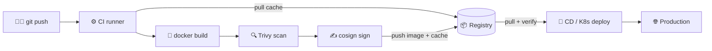
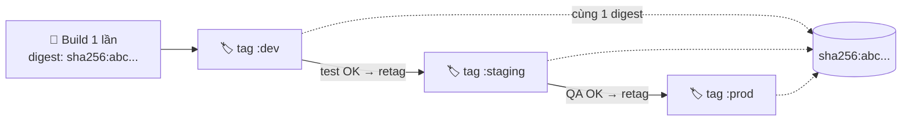

# Registry trong CI/CD — Cache, tag strategy, promotion, retention

> **Tác giả:** Mr.Rom\
> **Phiên bản:** v1.0.0\
> **Tạo lúc:** 13/06/2026\
> **Cập nhật:** 13/06/2026\
> **Level:** Basic\
> **Tags:** container-registry, ci-cd, github-actions, build-cache, image-promotion, retention\
> **Yêu cầu trước:** [Image Signing & Scanning](03_image-signing-and-scanning.md)

> 🎯 *Bốn bài trước bạn đã hiểu registry là gì, đặt tên image bằng tag/digest, dựng private registry, rồi quét + ký image. Tất cả đó là những thao tác **rời rạc** — giờ là lúc ráp chúng thành một dây chuyền tự động. Bài này gắn registry vào trung tâm pipeline CI/CD của Acme Shop: dùng registry làm cache để build nhanh hơn, đặt tag theo chiến lược rõ ràng, "thăng cấp" (promote) image qua các môi trường, dọn rác để registry khỏi phình, và lập một registry mirror để thoát khỏi rate limit của Docker Hub. Đây là bài đóng cụm Basic.*

## 🎯 Sau bài này bạn sẽ

- [ ] Hiểu registry nằm ở đâu trong pipeline `build → scan → sign → push → deploy`
- [ ] Tăng tốc CI bằng **build cache qua registry** (`docker buildx --cache-to`/`--cache-from`)
- [ ] Chọn **tag strategy** đúng cho CI: commit SHA (truy vết) + semver (release) + moving tag
- [ ] Thực hiện **image promotion** qua môi trường (retag/copy dev → staging → prod)
- [ ] Dọn rác registry bằng **retention policy** (ECR lifecycle, Harbor GC, GHCR cleanup)
- [ ] Dựng **pull-through cache / mirror** để giảm rate limit + tăng tốc pull nội bộ
- [ ] Viết một workflow GitHub Actions hoàn chỉnh: build + Trivy scan + push GHCR + cosign sign

---

## Tình huống — Mỗi lần merge code, CI chạy 8 phút chỉ để build image

Acme Shop đã có Dockerfile, đã có registry riêng (GHCR), biết quét và ký image. Nhưng quy trình hiện tại vẫn rất "thủ công": dev build image trên máy mình, gõ `docker push` tay, rồi nhắn Slack cho ops "deploy giúp tag `latest` nhé".

Vài tuần sau, ba vấn đề lộ ra cùng lúc:

1. **CI chậm.** Mỗi lần merge PR, runner build lại image từ đầu — cài lại toàn bộ dependency, mất 8 phút cho một thay đổi 1 dòng code. Cả team chờ.
2. **Không truy vết được.** Production đang chạy `acme/shop:latest`. Khi có bug, không ai biết `latest` tương ứng commit nào. Rollback thì chỉ biết "deploy lại bản cũ" — nhưng bản cũ là tag gì?
3. **Registry phình to.** Sau 3 tháng, GHCR của Acme có hơn 2000 image cũ, mỗi PR đẩy một bản. Dung lượng tăng vùn vụt, và thỉnh thoảng pull base image bị Docker Hub chặn vì *"toomanyrequests: rate limit exceeded"*.

Cả ba vấn đề đều có chung gốc: **registry chưa được tích hợp đúng cách vào CI/CD**. Registry không chỉ là "nơi chứa image" — nó là một mắt xích sống trong pipeline: vừa làm kho cache để build nhanh, vừa là điểm tham chiếu để truy vết và promote, vừa là nơi cần được dọn dẹp định kỳ. Bài này biến quy trình thủ công của Acme thành một dây chuyền tự động, an toàn, truy vết được.

---

## 1️⃣ Registry nằm ở đâu trong pipeline CI/CD?

Trước khi tối ưu từng mảnh, hãy nhìn bức tranh toàn cảnh. Một pipeline container hiện đại không phải "build rồi push" đơn giản — nó là một chuỗi cổng (*gate*) nối tiếp, và registry vừa là **đích đến** của image (lúc push) vừa là **nguồn** (lúc cache, lúc deploy).

🪞 **Ẩn dụ**: *Hãy nghĩ registry như **kho hàng trung tâm của một nhà máy**. Dây chuyền lắp ráp (CI) lấy linh kiện từ kho (cache, base image), ráp xong thì gửi thành phẩm vào kho (push). Bộ phận giao hàng (CD) lấy đúng kiện hàng đã kiểm định từ kho để giao cho khách (deploy). Kho mà bừa bộn, không dán nhãn (tag) rõ ràng, hay chứa hàng giả (image chưa ký) thì cả nhà máy loạn.*

Để thấy registry chạm vào những bước nào, ta xem sơ đồ luồng dưới đây — mỗi mũi tên đỏ là một lần pipeline "nói chuyện" với registry:



Sơ đồ cho thấy registry là **trục xoay** của cả pipeline: CI đọc cache từ nó để build nhanh, ghi image + cache vào nó sau khi quét và ký, còn CD đọc lại image (kèm verify chữ ký) trước khi deploy. Năm phần còn lại của bài sẽ đi sâu vào từng tương tác đó.

Các bước trong dây chuyền, theo thứ tự:

- **build** — dựng image từ Dockerfile (có dùng cache để nhanh — phần 2️⃣).
- **scan** — quét CVE bằng Trivy, chặn nếu có lỗ hổng nghiêm trọng (đã học ở bài 03).
- **sign** — ký số image bằng cosign để chống tráo đổi (bài 03).
- **push** — đẩy image lên registry, đặt tag theo chiến lược rõ ràng (phần 3️⃣).
- **promote** — "thăng cấp" image đã kiểm định từ dev → staging → prod (phần 4️⃣).
- **deploy** — CD pull image, verify chữ ký ở cổng vào rồi mới chạy (phần 6️⃣).

> [!NOTE]
> Bài 03 đã dạy chi tiết phần **scan** và **sign**. Bài này tập trung vào các mảnh *xung quanh* chúng — cache, tag, promotion, retention, mirror — rồi ghép lại thành một workflow chạy được ở cuối bài.

---

## 2️⃣ Build cache qua registry — biến 8 phút thành 1 phút

Quay lại vấn đề #1 của Acme: CI build lại từ đầu mỗi lần. Vì sao? Vì runner CI là máy **ephemeral** (tạm thời) — chạy xong là bị xóa sạch. Layer cache mà BuildKit tạo ra trên runner biến mất theo, nên lần build sau không tận dụng được gì.

### Cache layer là gì và vì sao mất?

Khi `docker build`, mỗi dòng trong Dockerfile (`RUN`, `COPY`, ...) tạo ra một **layer** (lớp) được cache lại. Lần build sau, nếu dòng đó không đổi, BuildKit dùng lại layer cũ thay vì chạy lại — đây là lý do build lần 2 trên máy local nhanh hơn nhiều.

🪞 **Ẩn dụ tiếp theo**: *Cache layer như **nguyên liệu đã sơ chế sẵn trong tủ lạnh của kho**. Nấu lần đầu phải gọt, rửa, thái (build lâu). Lần sau mở tủ lấy đồ sơ chế ra dùng luôn (build nhanh). Nhưng runner CI giống một **bếp dùng một lần rồi đập bỏ** — tủ lạnh mất sạch sau mỗi ca. Giải pháp: gửi đồ sơ chế vào **kho lạnh trung tâm** (registry) để ca bếp sau lấy ra dùng.*

Đó chính là ý tưởng của **registry cache backend**: BuildKit đẩy cache layer lên registry như một artifact riêng, lần build sau kéo về để "mồi" cache.

### `--cache-to` và `--cache-from` với `type=registry`

Để dùng registry làm nơi chứa cache, ta cần `docker buildx` (BuildKit) — không phải `docker build` cũ. Hai cờ then chốt: `--cache-to` (ghi cache lên registry sau khi build) và `--cache-from` (đọc cache về trước khi build).

Đoạn dưới build image của Acme và đồng thời đẩy cache vào một tag cache riêng. Lần đầu chạy sẽ chậm như thường (chưa có cache), nhưng các lần sau sẽ nhanh hẳn:

```bash
docker buildx build \
  --cache-from type=registry,ref=ghcr.io/acme/shop:buildcache \
  --cache-to type=registry,ref=ghcr.io/acme/shop:buildcache,mode=max \
  --tag ghcr.io/acme/shop:dev \
  --push \
  .
```

Giải thích từng cờ:

- `--cache-from type=registry,ref=...` — trước khi build, kéo cache từ tag `:buildcache` về để dùng lại layer cũ. Nếu chưa có cache, BuildKit bỏ qua mà không báo lỗi.
- `--cache-to type=registry,ref=...,mode=max` — sau khi build, ghi cache lên đúng tag đó. `mode=max` lưu cache cho **mọi layer** (kể cả layer trung gian của multi-stage build), khác `mode=min` (mặc định) chỉ lưu layer của image cuối.
- `--push` — với `type=registry`, BuildKit phải đẩy thẳng lên registry (không thể dùng `--load` vào Docker local cùng lúc với cache registry).

> [!TIP]
> Dùng một **tag cache riêng** (`:buildcache`) tách khỏi tag image thật (`:dev`, `:v1.2.0`). Cache là dữ liệu nội bộ của build, không phải image để chạy — trộn chung dễ gây nhầm lẫn khi dọn rác.

### Cache trong GitHub Actions — `type=gha` vs `type=registry`

GitHub Actions có một backend cache riêng tiện hơn: `type=gha` (dùng GitHub Actions Cache, không tốn dung lượng registry). Nhưng nó có giới hạn dung lượng cache (~10 GB mỗi repo) và chỉ dùng được *trong* GitHub Actions. Bảng dưới so sánh hai lựa chọn để bạn chọn đúng theo ngữ cảnh:

| Tiêu chí | `type=gha` | `type=registry` |
|---|---|---|
| Nơi lưu | GitHub Actions Cache | Tag trong registry |
| Dùng ngoài GitHub Actions | ❌ Không | ✅ Có (mọi CI, mọi máy) |
| Giới hạn dung lượng | ~10 GB/repo, tự evict | Theo quota registry |
| Tốn dung lượng registry | Không | Có (cần đưa vào retention) |
| Khi nào chọn | Pipeline thuần GitHub Actions | Cache dùng chung nhiều runner/CI, hoặc self-hosted |

Trong GitHub Actions, cấu hình cache rất gọn qua `docker/build-push-action`:

```yaml
- name: Build và push (có cache GHA)
  uses: docker/build-push-action@v6
  with:
    context: .
    push: true
    tags: ghcr.io/acme/shop:dev
    cache-from: type=gha
    cache-to: type=gha,mode=max
```

→ Với Acme — pipeline thuần GitHub Actions — `type=gha` là lựa chọn đơn giản nhất, không làm phình registry. Nếu sau này Acme thêm runner self-hosted hoặc chuyển CI, đổi sang `type=registry` để cache dùng chung được.

---

## 3️⃣ Tag strategy trong CI — đặt tên để truy vết được

Vấn đề #2 của Acme: production chạy `:latest`, không ai biết nó là commit nào. Đây là lỗi tag strategy. Một image trong CI nên mang **nhiều tag cùng lúc**, mỗi tag phục vụ một mục đích khác nhau.

> [!IMPORTANT]
> Nhắc lại từ bài 01: image thật sự được định danh bởi **digest** (`sha256:...`) — bất biến. Tag chỉ là *nhãn dán* trỏ tới digest và có thể đổi (*mutable*). Vì vậy tag dùng để **con người đọc và chọn**, còn deploy production nên trỏ tới **digest** để chắc chắn không bị tráo.

### Ba loại tag và vai trò

Mỗi loại tag trả lời một câu hỏi khác nhau. Bảng dưới tóm tắt; phần sau sẽ giải thích từng cái:

| Loại tag | Ví dụ | Trả lời câu hỏi | Mutable? |
|---|---|---|---|
| **Commit SHA** | `sha-a1b2c3d` | "Image này từ commit nào?" — truy vết | ❌ Không (1 SHA = 1 build) |
| **Semver** | `v1.4.2`, `1.4`, `1` | "Đây là release phiên bản nào?" | `v1.4.2` không / `1.4`, `1` có |
| **Moving tag** | `latest`, `dev`, `staging` | "Bản mới nhất của môi trường X là gì?" | ✅ Có (trỏ tới bản mới nhất) |

1. **Commit SHA tag** — dùng commit Git làm tag (`sha-a1b2c3d`). Đây là tag *quan trọng nhất cho truy vết*: mỗi commit cho ra đúng một image, không bao giờ bị ghi đè. Khi production gặp bug, nhìn tag SHA là biết ngay commit nào sinh ra nó, mở thẳng được diff code.
2. **Semver tag** — dùng cho release chính thức (`v1.4.2`). Quy ước phổ biến: đẩy kèm cả `1.4` và `1` để người dùng "ghim mềm" theo minor/major. `v1.4.2` thì cố định, còn `1.4` trỏ tới patch mới nhất của dòng 1.4.
3. **Moving tag** — nhãn "trôi" như `latest`, `dev`, `staging`, luôn trỏ tới bản mới nhất của một môi trường. Tiện cho dev/test, **nhưng không dùng để deploy production** vì không truy vết được.

### Sinh tag tự động bằng `docker/metadata-action`

Gõ tay từng tag rất dễ sai. GitHub Actions có `docker/metadata-action` sinh tag tự động theo sự kiện (push branch, push tag, PR...). Đoạn dưới cấu hình để: push lên `main` thì gắn tag SHA + `latest`; push một git tag `v*` thì gắn semver đầy đủ:

```yaml
- name: Sinh tag và label tự động
  id: meta
  uses: docker/metadata-action@v5
  with:
    images: ghcr.io/acme/shop
    tags: |
      type=sha,prefix=sha-
      type=ref,event=branch
      type=semver,pattern={{version}}
      type=semver,pattern={{major}}.{{minor}}
      type=raw,value=latest,enable={{is_default_branch}}
```

Giải thích các dòng `tags`:

- `type=sha,prefix=sha-` — sinh tag `sha-a1b2c3d` từ commit. Đây là tag truy vết.
- `type=ref,event=branch` — tag theo tên branch (vd push lên `main` → tag `main`).
- `type=semver,pattern={{version}}` — chỉ kích hoạt khi push git tag `v1.4.2` → image tag `1.4.2`.
- `type=semver,pattern={{major}}.{{minor}}` → thêm tag `1.4` (moving theo patch).
- `type=raw,value=latest,enable={{is_default_branch}}` — gắn `latest` chỉ khi build trên branch mặc định (`main`), tránh PR cũng chiếm `latest`.

Output của step này (`steps.meta.outputs.tags`) là danh sách tag, đưa thẳng vào `docker/build-push-action`. Kết quả: một lần build trên `main` đẩy ra nhiều tag cùng trỏ về một digest:

```text
ghcr.io/acme/shop:sha-a1b2c3d   ← truy vết commit
ghcr.io/acme/shop:main          ← branch
ghcr.io/acme/shop:latest        ← moving tag
```

→ Giờ Acme luôn có tag `sha-...` để truy vết. Production sẽ deploy bằng **digest** (lấy từ output của build), còn `latest`/`main` chỉ để xem nhanh.

---

## 4️⃣ Image promotion — thăng cấp image qua môi trường

Acme có 3 môi trường: dev, staging, prod. Câu hỏi cốt lõi: **khi một image đã được kiểm định ở staging, làm sao đưa đúng image đó (không build lại) lên prod?**

### Vì sao KHÔNG build lại cho từng môi trường?

Cám dỗ tự nhiên là: build image cho dev, rồi build lại cho staging, rồi build lại cho prod. **Đây là sai lầm.** Build lại = một artifact *khác* (base image có thể đã đổi, dependency có thể đã có version mới). Image bạn test ở staging **không còn là** image chạy ở prod → mọi công sức test thành vô nghĩa.

Nguyên tắc vàng: **build một lần, promote nhiều lần** (*build once, promote everywhere*). Cùng một digest đi xuyên qua tất cả môi trường.

🪞 **Ẩn dụ**: *Promotion giống **dây chuyền kiểm định một lô hàng**. Bạn không sản xuất lại lô hàng mới ở mỗi trạm kiểm tra — bạn lấy đúng lô đó, dán thêm tem "đã qua kiểm định staging", rồi chuyển sang trạm prod. Tem thay đổi, hàng thì y nguyên.*



Sơ đồ cho thấy cả ba tag `:dev`, `:staging`, `:prod` đều trỏ về **cùng một digest** — image vật lý chỉ có một, các tag chỉ là tem đánh dấu nó đã qua cổng nào.

### Cách 1 — Retag trong cùng một registry (copy không tải về)

Cách phổ biến nhất: copy image từ tag này sang tag khác *trong cùng registry*, không cần `docker pull` rồi `docker push` (tốn băng thông). Công cụ `crane` (của Google, thuộc go-containerregistry) làm việc này ở mức registry-to-registry:

```bash
# Cài crane (macOS)
brew install crane

# Promote: copy image dev → staging (server-side, không tải về máy)
crane copy ghcr.io/acme/shop:dev ghcr.io/acme/shop:staging

# QA xong, promote tiếp staging → prod
crane copy ghcr.io/acme/shop:staging ghcr.io/acme/shop:prod
```

`crane copy` thực hiện copy **phía server** — registry tự sao chép manifest và layer mà không tải dữ liệu về máy bạn. Vì layer được tham chiếu theo digest, các tag mới trỏ về đúng image cũ.

> [!TIP]
> Lấy digest hiện tại của một tag để deploy chắc chắn:
> ```bash
> crane digest ghcr.io/acme/shop:prod
> # sha256:abc123def456...
> ```
> Rồi deploy bằng `ghcr.io/acme/shop@sha256:abc123...` thay vì `:prod`.

### Cách 2 — Registry riêng cho mỗi môi trường

Một số tổ chức tách hẳn registry theo môi trường: `dev-registry`, `prod-registry` (thường prod registry nằm trong mạng kín, quyền ghi siết chặt). Promotion lúc này là copy **xuyên registry**:

```bash
# Copy từ registry dev sang registry prod (mạng riêng)
crane copy \
  registry-dev.acme.internal/shop@sha256:abc123... \
  registry-prod.acme.internal/shop:v1.4.2
```

Bảng dưới so sánh hai mô hình để bạn chọn theo quy mô và yêu cầu bảo mật của Acme:

| Tiêu chí | 1 registry, nhiều tag | Nhiều registry theo env |
|---|---|---|
| Độ phức tạp | Thấp — dễ bắt đầu | Cao — quản lý nhiều endpoint |
| Cô lập prod | Yếu (cùng registry) | Mạnh (prod registry riêng, mạng kín) |
| Chi phí | Thấp | Cao hơn (hạ tầng riêng) |
| Phù hợp | Startup, team nhỏ — Acme hiện tại | Tổ chức lớn, yêu cầu compliance chặt |

→ Acme đang ở quy mô nhỏ → dùng **1 registry GHCR, retag qua tag** là đủ. Khi nào prod cần cô lập mạng nghiêm ngặt mới tách registry riêng.

---

## 5️⃣ Retention & cleanup — đừng để registry phình vô hạn

Vấn đề #3 của Acme: 2000+ image cũ. Mỗi PR, mỗi commit đẩy một image; cache layer cũng tích lại. Không dọn thì registry phình dung lượng (tốn tiền) và khó tìm image cần.

Nguyên tắc retention: **giữ cái cần, xóa cái thừa, theo quy tắc tự động** — không xóa tay (dễ xóa nhầm image production đang chạy).

### ECR — lifecycle policy

Amazon ECR cho phép gắn **lifecycle policy** (chính sách vòng đời) dạng JSON: tự xóa image theo tuổi hoặc theo số lượng. Policy dưới đây giữ 10 image production gần nhất (tag bắt đầu bằng `v`), và xóa mọi image dev/PR cũ hơn 14 ngày:

```json
{
  "rules": [
    {
      "rulePriority": 1,
      "description": "Giu 10 image release gan nhat (tag bat dau bang v)",
      "selection": {
        "tagStatus": "tagged",
        "tagPrefixList": ["v"],
        "countType": "imageCountMoreThan",
        "countNumber": 10
      },
      "action": { "type": "expire" }
    },
    {
      "rulePriority": 2,
      "description": "Xoa image dev/PR cu hon 14 ngay",
      "selection": {
        "tagStatus": "any",
        "countType": "sinceImagePushed",
        "countUnit": "days",
        "countNumber": 14
      },
      "action": { "type": "expire" }
    }
  ]
}
```

Áp dụng policy bằng AWS CLI:

```bash
aws ecr put-lifecycle-policy \
  --repository-name acme/shop \
  --lifecycle-policy-text file://ecr-lifecycle.json
```

Vài điểm cần nắm trong JSON trên:

- `rulePriority` — số nhỏ chạy trước. Rule "giữ release" ưu tiên cao hơn rule "xóa theo tuổi" để không lỡ tay xóa release cũ vẫn còn dùng.
- `imageCountMoreThan` — giữ lại N image mới nhất khớp điều kiện, xóa phần dư.
- `sinceImagePushed` + `countUnit: days` — xóa theo tuổi (kể từ lúc push).
- `action.type: expire` — ECR chỉ hỗ trợ một loại action là `expire` (đánh dấu hết hạn để xóa).

### Harbor — tag retention + Garbage Collection

Harbor (private registry self-hosted, đã học ở bài 02) tách thành **hai cơ chế bổ sung cho nhau**, nhiều người nhầm lẫn:

1. **Tag retention policy** — quy tắc *giữ tag nào, xóa tag nào* (vd: giữ 10 tag mới nhất mỗi repo). Cấu hình trong UI Harbor: Project → Policy → Tag Retention. Khi chạy, nó **gỡ tag** khỏi image thừa.
2. **Garbage Collection (GC)** — chỉ gỡ tag thôi **chưa giải phóng dung lượng**, vì layer vẫn nằm trên đĩa. GC mới là bước quét và xóa thật các *layer không còn tag nào trỏ tới* (untagged/dangling). Chạy GC định kỳ trong Administration → Garbage Collection.

> [!WARNING]
> Nhầm lẫn kinh điển ở Harbor: chạy tag retention thấy "đã xóa 500 tag" nhưng dung lượng đĩa **không giảm**. Lý do: retention chỉ gỡ tag, **chưa chạy GC**. Phải lên lịch GC (thường ngoài giờ cao điểm vì GC khóa registry ở chế độ read-only trong lúc quét).

### GHCR — cleanup bằng GitHub Action

Acme dùng GHCR, nơi mỗi image là một "package version". Cách gọn nhất là dùng action `actions/delete-package-versions` chạy theo lịch. Workflow dưới chạy hằng tuần, xóa mọi version cũ chỉ giữ lại 20 bản gần nhất:

```yaml
name: Cleanup GHCR

on:
  schedule:
    - cron: '0 3 * * 0'   # 3h sáng Chủ Nhật (UTC) hằng tuần
  workflow_dispatch:        # cho phép chạy tay

jobs:
  cleanup:
    runs-on: ubuntu-latest
    permissions:
      packages: write       # cần quyền xóa package version
    steps:
      - name: Xoa version cu, giu 20 ban gan nhat
        uses: actions/delete-package-versions@v5
        with:
          package-name: shop
          package-type: container
          min-versions-to-keep: 20
          delete-only-untagged-versions: false
```

Giải thích các tham số:

- `package-name` / `package-type: container` — chỉ định đúng package image cần dọn.
- `min-versions-to-keep: 20` — luôn giữ lại 20 version mới nhất (an toàn, không xóa cạn).
- `delete-only-untagged-versions: false` — xóa cả version có tag (nếu để `true` thì chỉ xóa các bản không còn tag, an toàn hơn nhưng dọn ít hơn).

> [!CAUTION]
> Trước khi bật `delete-only-untagged-versions: false` lần đầu, hãy chắc chắn các tag production/release **không** nằm trong nhóm sắp bị xóa. Xóa nhầm version mà production đang trỏ tới (qua digest) sẽ làm pod không pull được image → downtime. An toàn: tách release vào package riêng hoặc dùng pattern loại trừ tag.

---

## 6️⃣ Pull-through cache / mirror — thoát rate limit Docker Hub

Vẫn còn lỗi *"toomanyrequests"* của Acme. Docker Hub giới hạn số lần pull cho tài khoản ẩn danh/free — và mỗi runner CI, mỗi node K8s pull base image đều tính vào hạn mức. Vào giờ cao điểm CI, hạn mức cạn → build fail hàng loạt.

### Mirror là gì?

🪞 **Ẩn dụ**: *Pull-through cache như **một kho trung chuyển đặt ngay trong nhà máy**. Lần đầu cần một linh kiện (base image) chưa có, kho trung chuyển ra ngoài (Docker Hub) lấy về và **giữ lại một bản**. Mọi lần sau, cả nhà máy lấy ngay từ kho nội bộ — không phải ra ngoài, không tính vào hạn mức của nhà cung cấp, lại còn nhanh hơn (cùng mạng nội bộ).*

Về kỹ thuật, **registry mirror** (hay *pull-through cache*) là một registry trung gian: khi bạn pull một image chưa có trong cache, nó tự pull từ upstream (Docker Hub), trả về cho bạn, đồng thời lưu lại. Lần pull sau lấy thẳng từ cache.

### Cách 1 — Cấu hình Docker daemon dùng mirror

Cách đơn giản nhất ở mức máy/node: trỏ Docker daemon vào một mirror. Sửa `/etc/docker/daemon.json`:

```json
{
  "registry-mirrors": ["https://mirror.acme.internal"]
}
```

Sau đó restart daemon. Từ lúc này, mọi `docker pull` image từ Docker Hub sẽ đi qua mirror trước:

```bash
sudo systemctl restart docker
```

> [!NOTE]
> `registry-mirrors` trong `daemon.json` chỉ áp dụng cho **Docker Hub** (registry mặc định). Mirror cho các registry khác (GHCR, ECR...) cần cấu hình ở mức registry/containerd qua `registries.conf` hoặc `hosts.toml`.

### Cách 2 — ECR pull-through cache rule

Nếu Acme dùng AWS, ECR có tính năng **pull-through cache rule**: tạo một rule trỏ tới upstream, rồi pull image qua đường ECR. ECR tự kéo từ upstream và cache lại trong ECR private của bạn:

```bash
# Tao rule: cache Docker Hub qua ECR
aws ecr create-pull-through-cache-rule \
  --ecr-repository-prefix dockerhub \
  --upstream-registry-url registry-1.docker.io
```

Sau khi tạo rule, pull base image qua prefix `dockerhub` thay vì thẳng từ Docker Hub:

```bash
# Thay vi: docker pull python:3.12-slim (di thang Docker Hub)
# Pull qua ECR pull-through cache:
docker pull <account>.dkr.ecr.<region>.amazonaws.com/dockerhub/library/python:3.12-slim
```

→ Lần đầu ECR kéo `python:3.12-slim` từ Docker Hub về, lưu trong ECR. Các runner/node sau pull từ ECR (cùng vùng AWS, nhanh + không tính hạn mức Docker Hub).

Bảng tóm tắt lợi ích của mirror để chốt phần này:

| Lợi ích | Giải thích |
|---|---|
| Thoát rate limit | Pull từ cache nội bộ, không tính vào hạn mức upstream |
| Nhanh hơn | Cache cùng mạng/vùng với runner, băng thông cao |
| Bền vững khi upstream sập | Image phổ biến đã cache → vẫn pull được khi Docker Hub gặp sự cố |
| Kiểm soát | Biết chính xác image nào được dùng trong tổ chức |

---

## 7️⃣ Cổng verify cosign ở bước CD

Ở bài 03, Acme đã ký image bằng cosign. Nhưng ký mà không kiểm thì vô nghĩa — như dán tem chống giả mà không ai soi. Bước CD phải có một **cổng verify**: trước khi deploy, kiểm chữ ký; sai chữ ký thì từ chối.

Có hai chỗ đặt cổng verify, dùng *cả hai* là tốt nhất:

1. **Trong pipeline CD** — bước script verify trước khi `kubectl apply`. Đơn giản, chặn sớm.
2. **Tại cổng K8s** — admission controller (Kyverno) chặn mọi image chưa ký, kể cả khi ai đó deploy tay vòng qua CD (đã học chi tiết ở bài 03).

Đoạn dưới là cổng verify ở mức pipeline CD: verify chữ ký theo đúng identity của GitHub Actions, nếu fail thì pipeline dừng trước khi deploy:

```yaml
- name: Cong verify chu ky truoc khi deploy
  run: |
    cosign verify \
      --certificate-identity-regexp 'https://github.com/acme/.*' \
      --certificate-oidc-issuer 'https://token.actions.githubusercontent.com' \
      ghcr.io/acme/shop@${{ needs.build.outputs.digest }}
```

→ `cosign verify` trả exit code khác 0 nếu chữ ký không hợp lệ → step fail → pipeline dừng, không deploy. Lưu ý verify trên **digest** (`@sha256:...`), không phải tag — đúng tinh thần "deploy theo digest" ở phần 3️⃣.

> [!IMPORTANT]
> Cổng verify chỉ có giá trị nếu kiểm đúng **identity** (ai ký) và **issuer** (ký qua đâu). Để regex `.*` cho identity nghĩa là "ai ký cũng nhận" — vô hiệu hóa toàn bộ ý nghĩa của chữ ký. Luôn khóa chặt theo repo của Acme.

---

## 8️⃣ Hands-on — Workflow hoàn chỉnh cho Acme Shop

Giờ ta ráp mọi mảnh đã học thành một workflow GitHub Actions chạy được: build (có cache) → Trivy scan → push GHCR (đa tag) → cosign sign. Đây là pipeline production-ready mà Acme dùng cho mỗi lần push lên `main` hoặc tạo release.

Bạn không cần học gì mới ở đây — chỉ là thấy cache (phần 2), tag strategy (phần 3), scan + sign (bài 03) ghép lại với nhau:

```yaml
# .github/workflows/build-and-publish.yml
name: Build and Publish

on:
  push:
    branches: [main]
    tags: ['v*']

env:
  REGISTRY: ghcr.io
  IMAGE: ${{ github.repository }}   # acme/shop

permissions:
  contents: read
  packages: write       # push GHCR
  id-token: write       # bat buoc cho cosign keyless OIDC

jobs:
  build-and-sign:
    runs-on: ubuntu-latest
    steps:
      # 1. Checkout code + chuan bi buildx
      - uses: actions/checkout@v4
      - uses: docker/setup-buildx-action@v3
      - uses: sigstore/cosign-installer@v3

      # 2. Dang nhap GHCR bang token cua workflow
      - name: Login GHCR
        uses: docker/login-action@v3
        with:
          registry: ${{ env.REGISTRY }}
          username: ${{ github.actor }}
          password: ${{ secrets.GITHUB_TOKEN }}

      # 3. Sinh tag tu dong (SHA + branch + semver + latest)
      - name: Sinh metadata
        id: meta
        uses: docker/metadata-action@v5
        with:
          images: ${{ env.REGISTRY }}/${{ env.IMAGE }}
          tags: |
            type=sha,prefix=sha-
            type=ref,event=branch
            type=semver,pattern={{version}}
            type=raw,value=latest,enable={{is_default_branch}}

      # 4. Build co cache GHA, push da tag
      - name: Build va push
        id: build
        uses: docker/build-push-action@v6
        with:
          context: .
          push: true
          tags: ${{ steps.meta.outputs.tags }}
          labels: ${{ steps.meta.outputs.labels }}
          cache-from: type=gha
          cache-to: type=gha,mode=max
          provenance: mode=max
          sbom: true

      # 5. Trivy scan — chan deploy neu co CVE nghiem trong
      - name: Trivy scan
        uses: aquasecurity/trivy-action@master
        with:
          image-ref: ${{ env.REGISTRY }}/${{ env.IMAGE }}@${{ steps.build.outputs.digest }}
          severity: CRITICAL,HIGH
          exit-code: '1'
          ignore-unfixed: true

      # 6. Ky image bang cosign (keyless, dung OIDC token cua GitHub)
      - name: Ky image
        run: |
          cosign sign --yes \
            ${{ env.REGISTRY }}/${{ env.IMAGE }}@${{ steps.build.outputs.digest }}
```

Đọc workflow theo thứ tự các bước (đánh số trong comment):

- **Bước 1-2** — chuẩn bị buildx + cosign, đăng nhập GHCR. `id-token: write` ở `permissions` là bắt buộc để cosign keyless lấy được OIDC token.
- **Bước 3** — `metadata-action` sinh đa tag tự động theo sự kiện.
- **Bước 4** — build với cache GHA (`type=gha`), push tất cả tag, đính kèm provenance + SBOM (BuildKit native).
- **Bước 5** — Trivy quét trên **digest** vừa build; `exit-code: '1'` chặn pipeline nếu có CVE CRITICAL/HIGH.
- **Bước 6** — cosign ký trên digest. Bước CD sau (phần 7️⃣) sẽ verify chữ ký này trước khi deploy.

Khi push một tag `v1.4.2`, kết quả trên GHCR sẽ là một digest duy nhất mang nhiều tag, đã quét sạch và đã ký:

```text
ghcr.io/acme/shop@sha256:abc...   ← digest that, da ky
  ├─ tag: 1.4.2       (semver)
  └─ tag: sha-a1b2c3d (truy vet commit)
```

→ Acme đã đi trọn vòng: từ build thủ công 8 phút không truy vết được, thành pipeline tự động build nhanh nhờ cache, đa tag truy vết được, quét + ký an toàn, sẵn sàng cho CD verify và promote. **Cụm Basic của Container Registry kết thúc ở đây.**

---

## 💡 Cạm bẫy thường gặp & Best practice

### ❌ Cạm bẫy: Build lại image cho mỗi môi trường

```bash
# ❌ Build rieng cho tung env — moi lan ra mot artifact KHAC
docker build -t acme/shop:staging .   # base image co the da doi
docker build -t acme/shop:prod .      # khong con la image da test o staging
```

- **Triệu chứng**: Test pass ở staging nhưng prod lỗi lạ, "trên máy staging chạy ngon mà".
- **Nguyên nhân**: Mỗi lần build là một image khác (base image/dependency đổi giữa các lần). Image test ≠ image chạy prod.
- **Cách tránh**: **Build once, promote everywhere** — build một lần, `crane copy` cùng digest qua các env (phần 4️⃣).

### ❌ Cạm bẫy: Deploy production bằng moving tag (`latest`, `prod`)

```bash
# ❌ Deploy bang tag mutable
kubectl set image deploy/shop shop=ghcr.io/acme/shop:latest
```

- **Triệu chứng**: Hai node trong cluster chạy hai bản image khác nhau dù cùng tag `latest`. Rollback không biết về đâu.
- **Nguyên nhân**: Tag mutable — `latest` hôm nay khác `latest` ngày mai. Mỗi node pull một thời điểm khác → khác image.
- **Cách tránh**: Deploy bằng **digest** (`@sha256:...`). Tag chỉ để con người đọc, digest để máy chạy.

### ❌ Cạm bẫy: Chạy Harbor tag retention nhưng quên Garbage Collection

- **Triệu chứng**: Retention báo "đã xóa 500 tag" nhưng dung lượng đĩa registry không hề giảm.
- **Nguyên nhân**: Tag retention chỉ **gỡ tag**, layer vẫn nằm trên đĩa cho tới khi GC quét xóa.
- **Cách tránh**: Lên lịch **Garbage Collection** định kỳ (ngoài giờ cao điểm, vì GC khóa registry read-only lúc chạy).

### ✅ Best practice: Tách tag cache khỏi tag image

- **Vì sao**: Cache (`:buildcache`) là dữ liệu nội bộ của build, không phải image để chạy. Trộn chung làm retention dễ xóa nhầm và danh sách tag rối.
- **Cách áp dụng**: Dùng tag riêng cho cache, và đưa nó vào retention policy với chu kỳ ngắn (cache cũ vô dụng).

### ✅ Best practice: Đặt cổng verify cosign ở CD lẫn admission controller

- **Vì sao**: Verify trong pipeline chặn sớm và rõ log; admission controller (Kyverno) chặn cả image deploy tay vòng qua CD. Hai lớp bổ sung cho nhau.
- **Cách áp dụng**: `cosign verify` trong job CD (phần 7️⃣) + Kyverno policy ở cluster (bài 03), đều khóa chặt identity + issuer theo repo Acme.

---

## 🧠 Tự kiểm tra (Self-check)

**Q1.** Vì sao cache layer trên runner CI biến mất giữa các lần build, và registry cache giải quyết thế nào?

<details>
<summary>💡 Xem giải thích</summary>

Runner CI là máy **ephemeral** — chạy job xong là bị xóa sạch, layer cache mà BuildKit tạo ra trên đĩa runner biến mất theo. Lần build sau không tận dụng được gì → build lại từ đầu.

Registry cache (`--cache-to type=registry` / `type=gha`) đẩy cache layer lên một nơi *bền vững ngoài runner* (registry hoặc GitHub Actions Cache). Lần build sau kéo cache đó về (`--cache-from`) để "mồi", dùng lại layer không đổi → nhanh hơn nhiều.

</details>

**Q2.** Production đang chạy `ghcr.io/acme/shop:latest` và gặp bug. Vì sao tag này khó truy vết, và nên dùng tag nào thay thế?

<details>
<summary>💡 Xem giải thích</summary>

`latest` là **moving tag** — luôn trỏ tới bản mới nhất, bị ghi đè liên tục, nên không biết nó tương ứng commit nào, build lúc nào. Rollback cũng mù.

Thay thế: deploy bằng **digest** (`@sha256:...`) để chắc chắn image cố định, và luôn gắn kèm **commit SHA tag** (`sha-a1b2c3d`) để truy ngược về commit Git sinh ra image đó.

</details>

**Q3.** Tại sao "build lại image cho prod" lại nguy hiểm dù Dockerfile không đổi?

<details>
<summary>💡 Xem giải thích</summary>

Dockerfile không đổi không có nghĩa kết quả build giống nhau. Base image (`FROM python:3.12-slim`) có thể đã được upstream cập nhật (tag mutable), `apt`/`pip` có thể kéo version package mới hơn. Build lần 2 → một artifact (digest) **khác** với bản đã test.

Hậu quả: image test ở staging **không phải** image chạy ở prod → mọi kết quả test mất giá trị. Nguyên tắc: **build once, promote everywhere** — cùng một digest đi xuyên các môi trường (retag/`crane copy`).

</details>

**Q4.** Acme bị `toomanyrequests` khi pull base image trong CI. Pull-through cache giúp gì?

<details>
<summary>💡 Xem giải thích</summary>

Docker Hub giới hạn số lần pull theo tài khoản. Mỗi runner CI và mỗi node K8s pull base image đều tính vào hạn mức → giờ cao điểm thì cạn → fail.

Pull-through cache (mirror) là registry trung gian: lần đầu pull một image chưa có, nó kéo từ upstream về và **lưu lại**; các lần sau lấy thẳng từ cache nội bộ — không tính vào hạn mức upstream, lại nhanh hơn (cùng mạng/vùng). Cấu hình qua `registry-mirrors` trong `daemon.json` (cho Docker Hub) hoặc ECR pull-through cache rule.

</details>

**Q5.** Ở Harbor, vì sao xóa tag bằng retention policy mà dung lượng đĩa không giảm?

<details>
<summary>💡 Xem giải thích</summary>

Tag retention chỉ **gỡ tag** khỏi image — layer dữ liệu vẫn nằm nguyên trên đĩa. Phần dọn dung lượng thật là **Garbage Collection (GC)**: quét tìm các layer không còn tag nào trỏ tới (untagged/dangling) rồi xóa chúng.

Phải chạy GC riêng (định kỳ, ngoài giờ cao điểm vì GC khóa registry ở chế độ read-only) thì dung lượng mới giảm.

</details>

---

## ⚡ Tra cứu nhanh (Cheatsheet)

```bash
# === Build cache qua registry ===
docker buildx build \
  --cache-from type=registry,ref=ghcr.io/acme/shop:buildcache \
  --cache-to type=registry,ref=ghcr.io/acme/shop:buildcache,mode=max \
  -t ghcr.io/acme/shop:dev --push .

# === Tag strategy (gan nhieu tag mot lan) ===
docker buildx build \
  -t ghcr.io/acme/shop:sha-a1b2c3d \
  -t ghcr.io/acme/shop:v1.4.2 \
  -t ghcr.io/acme/shop:latest \
  --push .

# === Image promotion (server-side, khong tai ve) ===
crane copy ghcr.io/acme/shop:dev     ghcr.io/acme/shop:staging
crane copy ghcr.io/acme/shop:staging ghcr.io/acme/shop:prod
crane digest ghcr.io/acme/shop:prod   # lay digest de deploy

# === Retention ===
aws ecr put-lifecycle-policy --repository-name acme/shop \
  --lifecycle-policy-text file://ecr-lifecycle.json   # ECR

# Harbor: tag retention (UI) + Garbage Collection (UI) — phai chay CA HAI
# GHCR: actions/delete-package-versions trong workflow theo lich

# === Pull-through cache / mirror ===
# Docker daemon mirror: /etc/docker/daemon.json
#   { "registry-mirrors": ["https://mirror.acme.internal"] }
aws ecr create-pull-through-cache-rule \
  --ecr-repository-prefix dockerhub \
  --upstream-registry-url registry-1.docker.io

# === Verify chu ky o CD ===
cosign verify \
  --certificate-identity-regexp 'https://github.com/acme/.*' \
  --certificate-oidc-issuer 'https://token.actions.githubusercontent.com' \
  ghcr.io/acme/shop@sha256:abc...
```

---

## 📚 Từ Điển Thuật Ngữ (Glossary)

| EN | VN | Giải thích |
|---|---|---|
| **Build cache** | Bộ nhớ đệm build | Layer đã build được lưu lại để lần sau dùng lại, không build lại từ đầu |
| **Cache backend** | Nơi chứa cache | Đích lưu cache layer: registry, GitHub Actions Cache (`type=gha`), local... |
| **Ephemeral runner** | Runner dùng-một-lần | Máy CI bị xóa sạch sau mỗi job, mất hết cache local |
| **Tag strategy** | Chiến lược đặt tag | Quy ước đặt nhiều tag (SHA/semver/moving) cho mỗi image |
| **Moving tag** | Tag trôi | Tag bị ghi đè liên tục, trỏ tới bản mới nhất (vd `latest`, `dev`) |
| **Semver** | Phiên bản ngữ nghĩa | Đánh số `MAJOR.MINOR.PATCH` (vd `1.4.2`) cho release |
| **Digest** | Mã băm bất biến | `sha256:...` định danh duy nhất một image, không bao giờ đổi |
| **Image promotion** | Thăng cấp image | Đưa cùng một image qua các môi trường dev → staging → prod, không build lại |
| **Build once, promote everywhere** | Build một, dùng nhiều | Nguyên tắc: chỉ build một artifact, promote nó qua mọi môi trường |
| **Retention policy** | Chính sách lưu giữ | Quy tắc tự động giữ/xóa image theo tuổi hoặc số lượng |
| **Garbage Collection (GC)** | Dọn rác | Bước xóa thật các layer không còn tag trỏ tới để giải phóng đĩa (Harbor) |
| **Lifecycle policy** | Chính sách vòng đời | Quy tắc retention dạng JSON của ECR |
| **Pull-through cache** | Cache kéo-xuyên | Registry trung gian tự pull từ upstream và cache lại |
| **Registry mirror** | Registry gương | Bản sao cache của registry upstream, đặt gần runner/node |
| **Rate limit** | Giới hạn tần suất | Hạn mức số lần pull của Docker Hub theo tài khoản |
| **Admission controller** | Bộ kiểm soát kết nạp | Webhook K8s chặn image không hợp lệ trước khi chạy (vd Kyverno) |

---

## 🔗 Liên kết & Tài nguyên

### 🧭 Định hướng lộ trình học

- ⬅️ **Bài trước:** [Image Signing & Scanning — Trivy, cosign, SBOM, supply chain](03_image-signing-and-scanning.md)
- ↑ **Về cụm:** [Container Registry — Kho lưu & phân phối image](../../README.md)

### 🧩 Các chủ đề có thể bạn quan tâm

- [Container Registry là gì? — Kho lưu & phân phối image](00_what-is-container-registry.md)
- [Tags & Digests — Đặt tên image đúng, immutable bằng digest](01_docker-hub-tags-and-digests.md)
- [Private Registries — Harbor, ECR, GCR/Artifact Registry, ACR, GHCR](02_private-registries.md)
- [Image Security & Supply Chain — Scan, Sign, Verify](../../../docker/lessons/02_intermediate/02_image-security-supply-chain.md)

### 🌐 Tài nguyên tham khảo khác

- [Docker buildx cache backends](https://docs.docker.com/build/cache/backends/) — chi tiết `type=registry`, `type=gha`, `mode=max`
- [docker/metadata-action](https://github.com/docker/metadata-action) — sinh tag/label tự động trong GitHub Actions
- [Amazon ECR lifecycle policies](https://docs.aws.amazon.com/AmazonECR/latest/userguide/LifecyclePolicies.html) — cú pháp JSON đầy đủ
- [Harbor — Garbage Collection](https://goharbor.io/docs/latest/administration/garbage-collection/) — vì sao cần GC sau retention
- [ECR pull-through cache](https://docs.aws.amazon.com/AmazonECR/latest/userguide/pull-through-cache.html) — cache Docker Hub qua ECR
- [crane (go-containerregistry)](https://github.com/google/go-containerregistry/blob/main/cmd/crane/README.md) — copy/retag image phía server

---

## 📌 Nhật ký thay đổi (Changelog)

- **v1.0.0 (13/06/2026)** — Bản đầu tiên. Bài 04 đóng cụm Basic của Container Registry: registry trong pipeline CI/CD; build cache qua registry (`--cache-to`/`--cache-from` type=registry + type=gha); tag strategy (commit SHA + semver + moving tag) với `metadata-action`; image promotion (build once promote everywhere, `crane copy`, registry-per-env); retention/cleanup (ECR lifecycle, Harbor retention + GC, GHCR cleanup action); pull-through cache/mirror (daemon mirror, ECR pull-through); cổng verify cosign ở CD. Hands-on workflow GitHub Actions đầy đủ cho Acme Shop (build cache → metadata tag → Trivy scan → cosign sign). 2 sơ đồ mermaid (pipeline tổng quan + promotion theo digest); 5 self-check; 5 pitfall/best-practice; cheatsheet + glossary.
