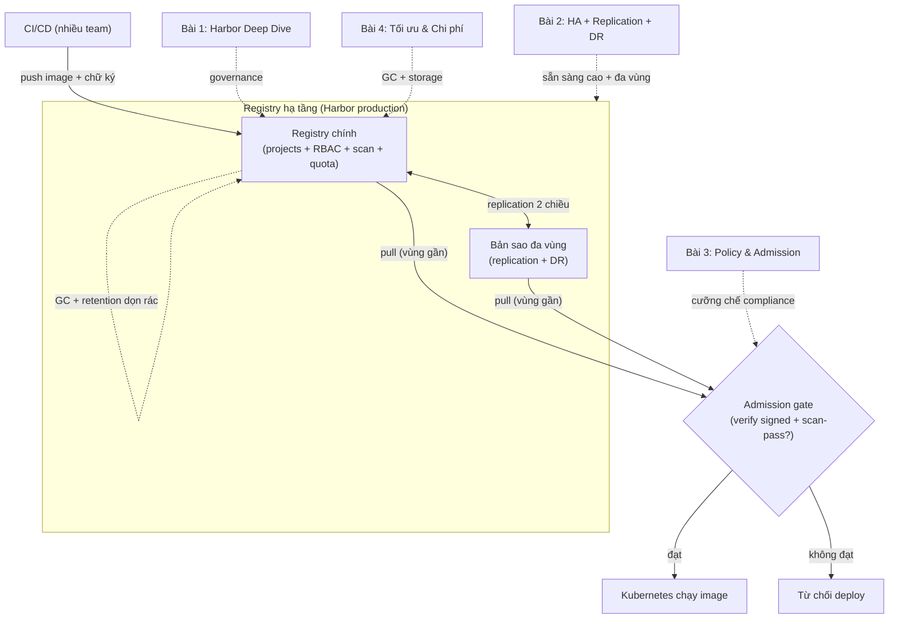
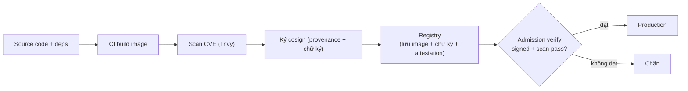

# Container Registry Intermediate — Registry ở quy mô Production

> **Tác giả:** Mr.Rom\
> **Phiên bản:** v1.0.0\
> **Tạo lúc:** 13/06/2026\
> **Cập nhật:** 13/06/2026\
> **Level:** Intermediate\
> **Tags:** container-registry, harbor, high-availability, replication, disaster-recovery, admission-control, supply-chain, slsa, cost-optimization, intermediate-overview\
> **Yêu cầu trước:** [Registry trong CI/CD (basic)](../01_basic/04_registry-in-cicd.md)

> 🎯 *Hết cụm Basic, bạn đã đẩy/kéo image, dựng được private registry, quét + ký image và ráp tất cả vào pipeline CI/CD. Nhưng đó là registry cho **một team**. Khi Acme Shop lớn lên — nhiều team, nhiều vùng, khách hàng doanh nghiệp đòi compliance — thì "có registry chạy được" không còn đủ. Bài mở cụm này vẽ bức tranh toàn cảnh registry ở quy mô production: vì sao Docker Hub / managed chưa đủ ở scale, 4 mảng bạn phải làm chủ (Harbor self-host sâu, HA + replication + DR, policy admission, tối ưu chi phí + GC), và lộ trình 4 bài để đi từ "registry của một team" tới "registry hạ tầng của cả công ty".*

## 🎯 Sau bài này bạn sẽ

- [ ] Giải thích được vì sao một registry "chạy được" cho 1 team lại **không đủ** khi lên quy mô multi-team/production (governance, HA, latency, cost, compliance)
- [ ] Gọi tên 4 mảng năng lực Intermediate của registry và việc cốt lõi của mỗi mảng
- [ ] Hiểu vị trí registry trong bức tranh lớn: nó vừa là **gate cuối** của supply chain (SLSA), vừa là phụ thuộc hạ tầng cần HA/DR
- [ ] Nắm lộ trình 4 bài của cụm và biết mình đang ở đâu, học gì tiếp theo

---

## Tình huống — Registry của Acme Shop bắt đầu "gãy" ở những chỗ không ngờ

Hết cụm Basic, Acme Shop có một registry chạy ngon: CI build image, push lên, K8s pull về, có cả scan CVE và ký cosign. Một team, một vùng, mọi thứ gọn gàng.

Rồi công ty lớn lên. Trong vòng vài tháng, bốn chuyện xảy ra — không chuyện nào là "bug", tất cả đều là **giới hạn của cách làm cũ khi gặp scale**:

- **Team mới không tìm thấy image, lại sửa nhầm image team khác.** Giờ có 6 team cùng push lên một registry phẳng. Không ai biết image nào của ai, một người vô tình `docker push` đè lên tag của team thanh toán. Không có ranh giới, không có audit "ai đã làm gì".
- **Registry sập 40 phút, cả công ty không deploy được.** Cái VM chạy Harbor reboot vì vá kernel. Trong 40 phút đó, **mọi** pipeline fail ở bước push, **mọi** Pod mới `ImagePullBackOff`. Registry vốn là "tiện ích phụ" giờ thành *single point of failure* (điểm chết đơn lẻ) của toàn bộ deploy.
- **Team ở vùng khác pull image chậm như rùa.** Acme mở cluster ở `us-east`. Registry đặt ở `ap-southeast-1` (Singapore). Mỗi lần pull image 800MB từ Mỹ về phải qua nửa vòng Trái Đất — pod khởi động chậm, autoscale không kịp giờ cao điểm.
- **Khách hàng doanh nghiệp gửi bảng câu hỏi bảo mật.** Họ hỏi: "Chứng minh rằng *chỉ* image đã quét sạch CVE và đã ký mới được chạy ở production." Acme đang ký image — nhưng **không có gì chặn** một image chưa ký, đầy CVE lọt vào cluster. Ký mà không ai gác cổng thì như dán tem chống giả mà không ai soi.

Bốn chuyện này không sửa được bằng "cấu hình thêm vài flag". Chúng đòi một tầng năng lực mới — đúng những gì cụm Intermediate này dạy.

> [!NOTE]
> Cụm Basic trả lời câu hỏi *"làm sao đẩy/kéo/ký image?"*. Cụm Intermediate trả lời câu hỏi khác hẳn: *"làm sao vận hành registry như một hệ thống hạ tầng mà nhiều team, nhiều vùng, và cả bộ phận compliance đều dựa vào?"*. Đây là bước nhảy từ **dùng được** sang **vận hành được ở quy mô lớn**.

---

## 1️⃣ Vì sao "registry chạy được" lại chưa đủ ở quy mô lớn?

Ở cụm Basic, registry là một **công cụ**: bạn push, bạn pull, xong việc. Ở quy mô production multi-team, registry trở thành một **hạ tầng dùng chung** — và hạ tầng dùng chung thì bị soi bằng những tiêu chí hoàn toàn khác.

🪞 **Ẩn dụ xuyên suốt cụm này**: *Hãy hình dung registry như một **kho hàng trung tâm của một chuỗi siêu thị**. Khi bạn chỉ có một cửa hàng, một cái nhà kho nhỏ sau lưng là đủ — ai cần gì tự vào lấy. Nhưng khi thành chuỗi 50 siêu thị ở nhiều tỉnh, cái nhà kho đó phải biến thành **trung tâm phân phối chuyên nghiệp**: có khu riêng cho từng ngành hàng (governance), có kho dự phòng phòng khi kho chính cháy (HA + DR), có chi nhánh kho ở mỗi vùng để giao hàng nhanh (replication), có bảo vệ soi tem ở cổng xuất hàng (admission), và có quy trình thanh lý hàng tồn để kho không vỡ trận (cost + GC).*

Năm áp lực biến "công cụ" thành "hạ tầng" — mỗi cái gắn với một chuyện trong tình huống đầu bài. Bảng dưới gọi tên rõ từng áp lực, để bạn thấy không cái nào là tùy chọn khi đã lên scale:

| Áp lực | Ở 1 team thì sao | Ở multi-team/production thì hỏng thế nào |
|---|---|---|
| 🏛️ **Governance** (quản trị) | Một người push, tin nhau, không cần phân quyền | 6 team push chung → đè nhầm tag, không audit được "ai làm gì", không cô lập được team này với team kia |
| 🔁 **HA** (sẵn sàng cao) | Registry sập thì 1 người chờ vài phút | Registry sập → **mọi** pipeline + **mọi** Pod mới đứng hình → registry thành điểm chết đơn lẻ của cả công ty |
| 🌍 **Latency** (độ trễ) | 1 cluster cạnh registry, pull nhanh | Nhiều cluster ở nhiều vùng → pull image lớn qua liên lục địa chậm, autoscale không kịp, tốn phí egress |
| 💰 **Cost** (chi phí) | Vài GB image, không ai để ý | Hàng nghìn build/ngày, mỗi build một image → storage phình vô hạn, hóa đơn lưu trữ + băng thông tăng dốc |
| 📋 **Compliance** (tuân thủ) | Tự biết image mình sạch là đủ | Khách hàng/kiểm toán đòi *bằng chứng* rằng chỉ image scan-pass + signed mới được chạy — cần cơ chế **cưỡng chế**, không phải "tin tưởng" |

> 💡 Hiểu năm áp lực rồi, ta xem chúng "ngồi" ở đâu trong dòng chảy image — vì mỗi mảng Intermediate sẽ vá đúng một điểm trên dòng chảy đó.

### Sơ đồ — registry production và 4 mảng Intermediate gắn vào đâu

Sơ đồ dưới đặt registry vào trung tâm dòng chảy image (CI build → registry → K8s chạy), rồi gắn 4 mảng Intermediate vào đúng điểm chúng giải quyết. Hãy đọc nó như "tấm bản đồ" của cả cụm — mỗi bài sau sẽ phóng to một góc.

Điểm mấu chốt của sơ đồ: registry không còn là một hộp đơn lẻ — nó là một **cụm** (có bản sao, có cổng gác, có cơ chế tự dọn rác), và 4 bài Intermediate chính là 4 năng lực biến hộp đơn lẻ thành cụm đó. Phần còn lại của bài đi qua từng mảng để bạn biết mỗi mảng giải quyết gì trước khi học sâu.

---

## 2️⃣ Bốn mảng năng lực Intermediate

Cụm này chia thành 4 mảng, mỗi mảng một bài. Không phải bốn chủ đề rời rạc — chúng xếp thành một mạch logic: **dựng nền tảng quản trị → làm nó không-bao-giờ-chết → gác cổng cho nó → giữ cho nó khỏi vỡ trận vì chi phí**.

🪞 **Nối tiếp ẩn dụ kho hàng**: bốn mảng đúng là bốn việc bạn làm khi nâng cấp "nhà kho sau lưng" thành "trung tâm phân phối chuỗi siêu thị" — phân khu, dựng kho dự phòng, đặt bảo vệ ở cổng, và lập quy trình thanh lý hàng tồn.

### 2.1 🏛️ Harbor self-host sâu — nền tảng quản trị

Mảng đầu trả lời chuyện *"6 team push chung, đè nhầm, không audit được"*. Lời giải là một registry có **governance** thực thụ, và lựa chọn mã nguồn mở mạnh nhất cho self-host là **Harbor** (dự án CNCF Graduated — cấp trưởng thành cao nhất, bạn đã gặp ở cụm Basic).

Ở Basic bạn dùng Harbor như "kho có khóa". Ở Intermediate bạn vận hành nó như một nền tảng:

- **Project + RBAC nhiều tầng** — gom image vào *project* (như "khu ngành hàng" trong kho), mỗi project gán vai trò (admin / maintainer / developer / guest). Team thanh toán không thấy, không sửa được image team kho vận.
- **Robot account** — tài khoản máy (cho CI) với quyền hẹp và token dài hạn, thay vì dùng tài khoản người thật trong pipeline.
- **Tích hợp OIDC/LDAP** — không quản user thủ công, nối thẳng vào danh tính doanh nghiệp (vd Entra ID, Keycloak).
- **Audit log** — ghi lại "ai push/pull/xóa cái gì, lúc nào" — đúng thứ kiểm toán đòi.
- **Quota theo project** — chặn một team xài hết ổ đĩa của cả công ty.

> [!NOTE]
> Registry managed (ECR/Artifact Registry/ACR) cũng có RBAC qua IAM của cloud. Nhưng khi cần *một bộ governance đồng nhất xuyên nhiều cloud* (hybrid), hoặc compliance buộc image nằm trong hạ tầng riêng (data sovereignty), Harbor self-host là đường đi. Bài tiếp đi sâu vào dựng và quản trị Harbor production.

→ Chi tiết ở **[Harbor Deep Dive — Self-host registry doanh nghiệp](01_harbor-deep-dive.md)**.

### 2.2 🔁 HA + Replication + DR — làm registry không-bao-giờ-chết

Mảng thứ hai trả lời chuyện *"registry sập 40 phút, cả công ty đứng hình"* **và** chuyện *"team vùng khác pull chậm"*. Ba khái niệm liên quan nhưng khác nhau — và lẫn lộn chúng là cạm bẫy kinh điển:

| Khái niệm | Trả lời câu hỏi | Bản chất |
|---|---|---|
| **HA** (High Availability — sẵn sàng cao) | "Một thành phần chết thì hệ thống còn chạy không?" | Chạy nhiều bản của mỗi thành phần (registry core, database, storage) để không có điểm chết đơn lẻ — trong *cùng* một vùng |
| **Replication** (sao chép) | "Image có sẵn ở gần nơi cần dùng không?" | Tự đồng bộ image sang registry khác / vùng khác, để mỗi cluster pull từ bản gần nó nhất (giảm latency + phí egress) |
| **DR** (Disaster Recovery — khôi phục thảm họa) | "Cả vùng/datacenter sập thì bao lâu dựng lại được, mất bao nhiêu dữ liệu?" | Có backup + quy trình khôi phục, đo bằng **RTO** (bao lâu dựng lại) và **RPO** (mất tối đa bao nhiêu dữ liệu) |

🪞 *Phân biệt nhanh: **HA** là có hai máy phát điện trong cùng tòa nhà (một cái hỏng, cái kia chạy). **Replication** là mở chi nhánh kho ở mỗi tỉnh để giao hàng nhanh. **DR** là kế hoạch "nếu cả tòa nhà cháy thì dựng lại ở đâu, trong bao lâu, mất bao nhiêu hàng".*

→ Chi tiết ở **[HA, Replication & Disaster Recovery cho Registry](02_high-availability-replication-and-dr.md)**.

### 2.3 📋 Policy & Admission enforcement — gác cổng cho cluster

Mảng thứ ba trả lời chuyện *"khách hàng đòi bằng chứng chỉ image an toàn mới được chạy"*. Đây là khâu **biến chữ ký + kết quả scan thành luật được cưỡng chế** — không còn dựa vào "mọi người tự giác".

Ở cụm Basic, bạn đã ký image bằng cosign và quét bằng Trivy. Nhưng ký và quét chỉ tạo ra *bằng chứng*; nếu không có ai kiểm bằng chứng đó trước khi cho image chạy, kẻ xấu (hoặc một lần deploy nhầm) vẫn đưa được image chưa ký, đầy CVE vào cluster. Lớp gác cổng đó là **admission control** ở Kubernetes:

- **Admission controller** — webhook K8s chặn ở bước *kết nạp*: trước khi tạo Pod, K8s hỏi một policy engine "image này có đạt không?".
- **Policy engine** — **Kyverno** (viết policy bằng YAML, dễ nhất), **OPA Gatekeeper** (mạnh, dùng Rego), hoặc **Sigstore Policy Controller** (native cosign).
- **Luật điển hình** — "chỉ cho chạy image từ registry của Acme, **đã ký** bởi danh tính tin cậy, **và** đã scan-pass; mọi thứ khác → từ chối".
- **Đổi tag → digest trước khi verify** — đóng khe hở "verify tag xong rồi tag bị tráo".

Đây cũng là nơi registry chạm vào **supply chain** ở tầng cao nhất: nó là *gate cuối* thực thi những gì SLSA (xem mục 3) yêu cầu. Một image đi qua được cổng này nghĩa là nó vừa *đúng nguồn gốc* (signed) vừa *sạch lỗ hổng đã biết* (scan-pass).

> [!IMPORTANT]
> Phải nhớ: scan và sign là **hai rủi ro độc lập**. Image đã ký vẫn có thể đầy CVE; image 0 CVE vẫn có thể bị tráo. Policy production phải kiểm **cả hai** — bỏ một cái là để hở một loại rủi ro.

→ Chi tiết ở **[Policy & Admission — Chỉ cho image an toàn vào cluster](03_policy-and-admission-enforcement.md)**.

### 2.4 💰 Tối ưu & Chi phí ở quy mô lớn — giữ registry khỏi vỡ trận

Mảng cuối trả lời chuyện *"hàng nghìn build/ngày, storage phình vô hạn, hóa đơn tăng dốc"*. Registry ở scale là một bài toán chi phí thật sự — và phần lớn chi phí đến từ thứ không ai để ý: **image cũ không bao giờ bị dọn**.

- **Retention policy** — luật tự xóa tag cũ (vd "giữ 10 bản mới nhất mỗi repo, giữ vĩnh viễn tag release `v*`, dọn tag commit-SHA tạm").
- **Garbage Collection (GC)** — retention chỉ gỡ *tag*; nhưng *layer* (blob) thực sự chiếm đĩa chỉ bị xóa khi GC chạy và thấy không còn tag nào tham chiếu. Hiểu khác biệt tag-vs-blob là chìa khóa.
- **Dedup + cache** — layer chung giữa các image chỉ lưu một lần; pull-through cache để khỏi tải lại image public từ internet (đỡ rate limit + đỡ phí egress).
- **Storage backend phù hợp** — đặt blob lên object storage (S3/GCS/MinIO) thay vì ổ đĩa VM, dùng *tiering* (chuyển image ít dùng sang lớp lưu trữ rẻ hơn).

🪞 *GC giống **dọn kho cuối quý**: retention là dán nhãn "lô hàng này hết hạn", nhưng phải có ngày dọn kho thật sự (GC) mới giải phóng được mặt bằng. Dán nhãn mà không bao giờ dọn thì kho vẫn chật.*

> [!WARNING]
> GC trong nhiều registry (kể cả Harbor) cần lịch chạy và thường phải ở chế độ phù hợp để không xóa nhầm layer đang được push dở. Đừng tự ý chạy GC tay vào giờ cao điểm — bài cuối nói rõ cách làm an toàn.

→ Chi tiết ở **[Tối ưu & Chi phí Registry ở quy mô lớn](04_optimization-and-cost-at-scale.md)**.

---

## 3️⃣ Registry trong bức tranh lớn — supply chain, SLSA, và "gate cuối"

Một câu hỏi đáng đặt: *vì sao registry lại là nơi gánh nhiều trách nhiệm bảo mật đến thế?* Vì nó là **điểm tập trung** — mọi image đều đi qua nó, sống lâu nhất trong nó, và mọi consumer (K8s, dev khác, CI khác) đều đến nó lấy. Bảo vệ ở registry là bảo vệ đúng nút thắt.

Đặt registry vào dòng *supply chain* (chuỗi cung ứng phần mềm) cho thấy rõ vai trò "gate cuối" của nó: bằng chứng được *tạo ra* ở các bước trước (build, scan, sign), nhưng được *kiểm tra và cưỡng chế* ngay trước khi chạy.

Sơ đồ cho thấy registry là **bản lề** giữa hai nửa: nửa trái *tạo bằng chứng* (build → scan → sign), nửa phải *cưỡng chế bằng chứng* (verify → chạy). Mảng 3 (admission) chính là cái cổng `Verify` đó.

**SLSA là gì và liên quan ra sao?** *SLSA* (đọc là "salsa", viết tắt *Supply-chain Levels for Software Artifacts*) là một khung của Linux Foundation đo **độ trưởng thành** của supply chain qua các *level* (mức). Mức càng cao, bạn càng chứng minh được "artifact này build từ nguồn nào, bằng quy trình nào, không bị can thiệp giữa chừng". Registry production góp phần đạt SLSA ở chỗ:

- Lưu **provenance** (chứng thực nguồn gốc) và **attestation** (chứng thực đã ký) ngay cạnh image.
- Là nơi **admission gate** truy xuất chữ ký để verify trước khi cho chạy.
- Bảo vệ chính nó (RBAC, immutable tag, audit) để bằng chứng không bị tráo.

> [!NOTE]
> Bạn không cần "đạt SLSA Level 3" để bắt đầu. Chỉ cần hiểu: 4 mảng Intermediate của cụm này — đặc biệt mảng admission — là cách thực tế để leo các bậc thang SLSA, từng bước một. Khía cạnh ký/scan/SBOM đã học ở cụm Basic; ở đây mình *cưỡng chế* và *vận hành* chúng ở quy mô.

---

## 4️⃣ Lộ trình 4 bài của cụm Intermediate

Bốn bài được xếp theo đúng mạch "dựng nền → làm bền → gác cổng → tối ưu". Mỗi bài là tiên quyết của bài sau, nên nên đi tuần tự lần đầu. Bảng dưới là tấm bản đồ để bạn biết mình đang ở đâu và sắp tới đâu:

| # | Bài | Mảng | Trả lời chuyện nào ở đầu bài | Kết quả đạt được |
|---|---|---|---|---|
| 1 | [Harbor Deep Dive — Self-host registry doanh nghiệp](01_harbor-deep-dive.md) | 🏛️ Governance | "6 team push chung, đè nhầm, không audit" | Dựng + quản trị Harbor production: project, RBAC, robot account, OIDC, quota, audit |
| 2 | [HA, Replication & Disaster Recovery cho Registry](02_high-availability-replication-and-dr.md) | 🔁 HA + đa vùng | "Registry sập, cả công ty đứng hình" + "vùng khác pull chậm" | Registry không có điểm chết đơn lẻ, image gần mọi cluster, có kế hoạch DR đo bằng RTO/RPO |
| 3 | [Policy & Admission — Chỉ cho image an toàn vào cluster](03_policy-and-admission-enforcement.md) | 📋 Compliance | "Đòi bằng chứng chỉ image an toàn mới chạy" | Cổng admission cưỡng chế: chỉ image signed + scan-pass mới được deploy |
| 4 | [Tối ưu & Chi phí Registry ở quy mô lớn](04_optimization-and-cost-at-scale.md) | 💰 Cost + GC | "Storage phình vô hạn, hóa đơn tăng dốc" | Retention + GC + cache + storage backend để registry khỏi vỡ trận chi phí |

> 💡 Bạn đang đọc **Bài 0 — overview** của cụm này. Nó không dạy cú pháp; nó cho bạn tấm bản đồ. Bước tiếp theo là Bài 1 — vào sâu Harbor production.

---

## 💡 Cạm bẫy thường gặp & Best practice

### ❌ Cạm bẫy: Nhầm HA với DR (hoặc tưởng có cái này là có cái kia)

- **Triệu chứng**: Team dựng registry HA (nhiều replica trong một vùng), yên tâm "đã chống sập". Đến khi cả vùng AWS gặp sự cố, registry chết sạch — không có backup ở vùng khác, mất luôn dữ liệu push trong ngày.
- **Nguyên nhân**: HA chống *một thành phần* chết trong cùng vùng; DR chống *cả vùng/datacenter* chết. Hai bài toán khác nhau, lời giải khác nhau.
- **Cách tránh**: Làm **cả hai**. HA cho uptime hằng ngày; DR (backup đa vùng + quy trình khôi phục đo bằng RTO/RPO) cho thảm họa. Bài 2 tách bạch rõ.

### ❌ Cạm bẫy: Ký image nhưng không có admission gate

- **Triệu chứng**: CI ký mọi image bằng cosign, đội security yên tâm. Nhưng một image chưa ký, đầy CVE vẫn deploy được vào cluster vì *không có gì kiểm tra chữ ký trước khi chạy*.
- **Nguyên nhân**: Ký chỉ *tạo* bằng chứng; nó vô dụng nếu không có ai *cưỡng chế* kiểm bằng chứng đó. Dán tem chống giả mà không ai soi tem.
- **Cách tránh**: Cặp đôi ký (cụm Basic) **+** admission verify (Bài 3). Chữ ký chỉ có giá trị khi có cổng từ chối image không-khớp.

### ❌ Cạm bẫy: Đặt retention mà quên Garbage Collection

- **Triệu chứng**: Team bật retention "giữ 10 bản mới nhất", đinh ninh đĩa sẽ không phình. Vài tháng sau, dung lượng vẫn tăng đều — vì layer cũ chưa hề bị xóa khỏi đĩa.
- **Nguyên nhân**: Retention chỉ gỡ *tag* (nhãn trỏ tới image). *Blob/layer* thực sự chiếm đĩa chỉ được giải phóng khi **GC** chạy và thấy không còn tag nào tham chiếu.
- **Cách tránh**: Retention + GC luôn đi cặp. Lên lịch GC định kỳ (và chạy đúng cách để không đụng image đang push dở). Bài 4 đi sâu.

### ✅ Best practice: Coi registry là hạ tầng cấp production, không phải "tiện ích phụ"

- **Vì sao**: Khi nhiều team và nhiều cluster dựa vào registry để deploy, nó trở thành phụ thuộc *critical-path*. Registry sập = không ai deploy được. Đối xử với nó như database production: có HA, có backup/DR, có monitoring, có on-call.
- **Cách áp dụng**: Áp dụng tuần tự 4 mảng của cụm này. Tối thiểu cho production: governance (Bài 1) + HA/DR (Bài 2) + admission gate (Bài 3) + GC định kỳ (Bài 4).

### ✅ Best practice: Đặt registry/replica "đi chung nhà" với mỗi cluster

- **Vì sao**: Pull image lớn qua liên lục địa chậm và tốn phí egress. Mỗi cluster pull từ bản registry gần nó nhất thì pod khởi động nhanh, autoscale kịp, và thường miễn phí egress nội vùng.
- **Cách áp dụng**: Dùng replication (Bài 2) để mỗi vùng có một bản đồng bộ; cluster trỏ pull về bản cùng vùng. Kết hợp pull-through cache (Bài 4) cho image public.

---

## 🧠 Tự kiểm tra (Self-check)

**Q1.** Registry ở cụm Basic "chạy được" rồi. Vì sao khi lên multi-team/production lại cần thêm cả một cụm Intermediate?

💡 Xem giải thích

Vì ở scale, registry chuyển từ **công cụ một team** sang **hạ tầng dùng chung** — và bị soi bằng tiêu chí mới mà cách làm cũ không đáp ứng:

- **Governance**: nhiều team push chung → cần project + RBAC + audit để không đè nhầm, không "ai cũng thấy mọi thứ".
- **HA**: registry sập kéo theo *mọi* deploy đứng hình → cần không có điểm chết đơn lẻ.
- **Latency**: cluster đa vùng → cần replication để pull từ bản gần.
- **Cost**: hàng nghìn build/ngày → cần retention + GC để storage không phình vô hạn.
- **Compliance**: khách/kiểm toán đòi *bằng chứng cưỡng chế* → cần admission gate.

Tóm lại: Basic dạy *dùng được* registry; Intermediate dạy *vận hành được* nó ở quy mô lớn.

**Q2.** Phân biệt HA, Replication và DR. Có HA rồi thì có cần DR nữa không?

💡 Xem giải thích

- **HA** (sẵn sàng cao): chạy nhiều bản mỗi thành phần trong *cùng một vùng* để một bản chết thì hệ thống còn chạy. Chống lỗi *thành phần đơn lẻ*.
- **Replication** (sao chép): đồng bộ image sang vùng/registry khác để mỗi cluster pull từ bản gần nó nhất — chủ yếu giải bài toán *latency + chi phí egress*, đồng thời tạo bản dự phòng.
- **DR** (khôi phục thảm họa): backup + quy trình dựng lại khi *cả vùng/datacenter* sập, đo bằng **RTO** (bao lâu khôi phục) và **RPO** (mất tối đa bao nhiêu dữ liệu).

**Vẫn cần DR dù đã có HA.** HA chỉ chống lỗi thành phần *trong* một vùng; nếu cả vùng sập (mất điện diện rộng, sự cố cloud region), tất cả replica HA chết cùng lúc. DR là lưới an toàn cho kịch bản đó. Nhầm hai cái là cạm bẫy kinh điển — xem mục Cạm bẫy.

**Q3.** Acme đã ký mọi image bằng cosign ở cụm Basic. Vậy đã đủ để khẳng định "chỉ image an toàn mới chạy ở production" chưa?

💡 Xem giải thích

**Chưa.** Ký chỉ *tạo bằng chứng* (chứng minh image đúng nguồn gốc, chưa bị tráo). Nó **không** tự chặn image chưa ký hay đầy CVE chạy vào cluster — phải có **admission gate** *cưỡng chế* verify chữ ký + scan-pass *trước khi* tạo Pod. Không có cổng đó thì chữ ký như tem chống giả mà không ai soi.

Ngoài ra, ký và scan là **hai rủi ro độc lập**: image đã ký vẫn có thể đầy CVE, image 0 CVE vẫn có thể bị tráo. Production phải kiểm cả hai. Đó là nội dung Bài 3 (Policy & Admission).

**Q4.** Team bật retention "giữ 10 bản mới nhất" nhưng dung lượng registry vẫn tăng đều. Vì sao?

💡 Xem giải thích

Vì **retention chỉ gỡ *tag*, không xóa *blob/layer* khỏi đĩa**. Khi một tag bị retention loại bỏ, image trở thành "không tag" (dangling), nhưng các layer của nó vẫn nằm trên storage — chỉ được giải phóng khi **Garbage Collection (GC)** chạy, quét xem layer nào không còn tag nào tham chiếu, rồi mới xóa.

→ Retention + GC luôn đi cặp. Bật retention mà không lên lịch GC = dán nhãn "hết hạn" nhưng không bao giờ dọn kho. Bài 4 đi sâu cách chạy GC an toàn.

---

## ⚡ Tra cứu nhanh (Cheatsheet)

Bảng dưới tóm 4 mảng Intermediate — dùng như mục lục nhanh khi bạn cần nhảy thẳng tới bài giải quyết vấn đề mình đang gặp.

| Vấn đề bạn đang gặp | Mảng | Bài | Khái niệm cốt lõi |
|---|---|---|---|
| Nhiều team đè nhầm image, không audit được | 🏛️ Governance | Bài 1 | Project, RBAC, robot account, OIDC, quota, audit log |
| Registry sập kéo theo mọi deploy đứng hình | 🔁 HA | Bài 2 | Replica core/DB/storage, không điểm chết đơn lẻ |
| Cluster vùng khác pull image chậm | 🌍 Replication | Bài 2 | Đồng bộ image đa vùng, pull từ bản gần |
| Cả vùng sập, sợ mất dữ liệu | 💾 DR | Bài 2 | Backup đa vùng, RTO/RPO, quy trình khôi phục |
| Cần chặn image chưa ký / đầy CVE vào cluster | 📋 Admission | Bài 3 | Kyverno/Gatekeeper, verify signed + scan-pass, tag→digest |
| Chứng minh tuân thủ supply chain | 📋 Compliance | Bài 3 | Provenance, attestation, SLSA |
| Storage phình vô hạn, hóa đơn tăng | 💰 Retention | Bài 4 | Giữ N bản mới, giữ tag release, dọn tag tạm |
| Xóa tag rồi mà đĩa không giảm | 💰 GC | Bài 4 | Garbage Collection dọn blob không còn tham chiếu |
| Tải lại image public tốn băng thông / dính rate limit | 💰 Cache | Bài 4 | Pull-through cache, dedup layer, object storage |

---

## 📚 Từ Điển Thuật Ngữ (Glossary)

| EN | VN | Giải thích |
|---|---|---|
| Governance | Quản trị | Quản lý ai được làm gì với registry: phân quyền, cô lập team, audit |
| RBAC | Phân quyền theo vai trò | Gán vai trò (admin/maintainer/developer/guest) cho người dùng/project |
| Robot account | Tài khoản máy | Tài khoản cho CI với quyền hẹp + token dài hạn, không dùng tài khoản người thật |
| OIDC | OpenID Connect | Chuẩn xác thực nối registry vào danh tính doanh nghiệp (Entra ID, Keycloak) |
| Harbor | Harbor (giữ nguyên) | Registry mã nguồn mở tự host (CNCF Graduated): RBAC + scan + replication + quota |
| HA | Sẵn sàng cao | High Availability — chạy nhiều bản mỗi thành phần để không có điểm chết đơn lẻ |
| Single point of failure | Điểm chết đơn lẻ | Một thành phần mà nếu nó chết thì cả hệ thống chết theo |
| Replication | Sao chép/đồng bộ | Tự copy image sang vùng/registry khác để pull từ bản gần |
| DR | Khôi phục thảm họa | Disaster Recovery — backup + quy trình dựng lại khi cả vùng/datacenter sập |
| RTO | Mục tiêu thời gian khôi phục | Recovery Time Objective — bao lâu phải dựng lại hệ thống sau sự cố |
| RPO | Mục tiêu điểm khôi phục | Recovery Point Objective — mất tối đa bao nhiêu dữ liệu (tính theo thời gian) |
| Egress | Lưu lượng ra | Băng thông đi ra khỏi vùng/cloud — thường bị tính phí khi pull liên vùng |
| Admission control | Kiểm soát kết nạp | Webhook K8s kiểm tra request (verify chữ ký, scan) trước khi cho Pod chạy |
| Policy engine | Engine chính sách | Công cụ thực thi luật admission: Kyverno (YAML), OPA Gatekeeper (Rego) |
| Kyverno | Kyverno (giữ nguyên) | Engine policy K8s viết bằng YAML, dùng verify chữ ký image |
| Supply chain | Chuỗi cung ứng phần mềm | Toàn bộ nguồn cung (deps, base image, build, registry) tạo nên artifact cuối |
| Provenance | Chứng thực nguồn gốc | Metadata "image build từ source nào, bằng cách nào, lúc nào" |
| Attestation | Chứng thực (đã ký) | Tuyên bố đã ký về image (vd "SBOM/scan này thuộc image kia") |
| SLSA | SLSA (đọc "salsa") | Supply-chain Levels for Software Artifacts — khung đo độ trưởng thành supply chain |
| Retention policy | Chính sách giữ lại | Luật tự xóa tag cũ để kho không phình (vd giữ N bản mới nhất) |
| Garbage Collection (GC) | Dọn rác | Quá trình xóa blob/layer không còn tag nào tham chiếu khỏi storage |
| Blob / layer | Khối dữ liệu / lớp | Đơn vị dữ liệu thực chiếm đĩa của image; tag chỉ là nhãn trỏ tới |
| Pull-through cache | Cache kéo xuyên | Registry tự cache image public lần đầu pull, lần sau lấy từ cache nội bộ |
| Object storage | Lưu trữ đối tượng | Kho lưu blob dạng object (S3/GCS/MinIO) thay cho ổ đĩa VM |

---

## 🔗 Liên kết & Tài nguyên

### 🧭 Định hướng lộ trình học

- ➡️ **Bài tiếp theo:** [Harbor Deep Dive — Self-host registry doanh nghiệp](01_harbor-deep-dive.md)
- ↑ **Về cụm:** [Container Registry — Lưu trữ, phân phối & bảo mật container image](../../README.md)

### 🧩 Các chủ đề có thể bạn quan tâm

- [Registry trong CI/CD — Cache, tag strategy, promotion, retention](../01_basic/04_registry-in-cicd.md) — bài đóng cụm Basic, nền tảng ngay trước cụm này
- [Private Registries — Harbor, ECR, GCR/Artifact Registry, ACR, GHCR](../01_basic/02_private-registries.md) — Harbor và các registry managed ở mức cơ bản
- [Image Signing & Scanning — Trivy, cosign, SBOM, supply chain](../01_basic/03_image-signing-and-scanning.md) — ký + quét image, nền cho mảng admission ở Bài 3

### 🌐 Tài nguyên tham khảo khác

- [Harbor docs](https://goharbor.io/docs/) — tài liệu chính thức Harbor (HA, replication, GC, RBAC)
- [Kyverno docs](https://kyverno.io/docs/) — engine policy K8s cho admission/verify image
- [SLSA framework](https://slsa.dev/) — khung đo độ trưởng thành supply chain
- [Sigstore](https://www.sigstore.dev/) — hệ sinh thái ký keyless (cosign + Fulcio + Rekor)
- [OCI Distribution Spec](https://github.com/opencontainers/distribution-spec) — chuẩn giao thức registry mà Harbor/ECR/GHCR tuân theo

---

## 📌 Nhật ký thay đổi (Changelog)

- **v1.0.0 (13/06/2026)** — Bản đầu tiên. Bài mở cụm Intermediate của container-registry: vì sao registry "chạy được" chưa đủ ở quy mô multi-team/production (governance, HA, latency, cost, compliance); 4 mảng năng lực (Harbor self-host sâu / HA + replication + DR / policy admission enforcement / tối ưu chi phí + GC); registry trong bức tranh supply chain + SLSA + vai trò "gate cuối"; lộ trình 4 bài. 2 sơ đồ mermaid (bản đồ cụm + supply chain), 3 cạm bẫy + 2 best practice, 4 self-check, cheatsheet định hướng theo vấn đề, glossary.
