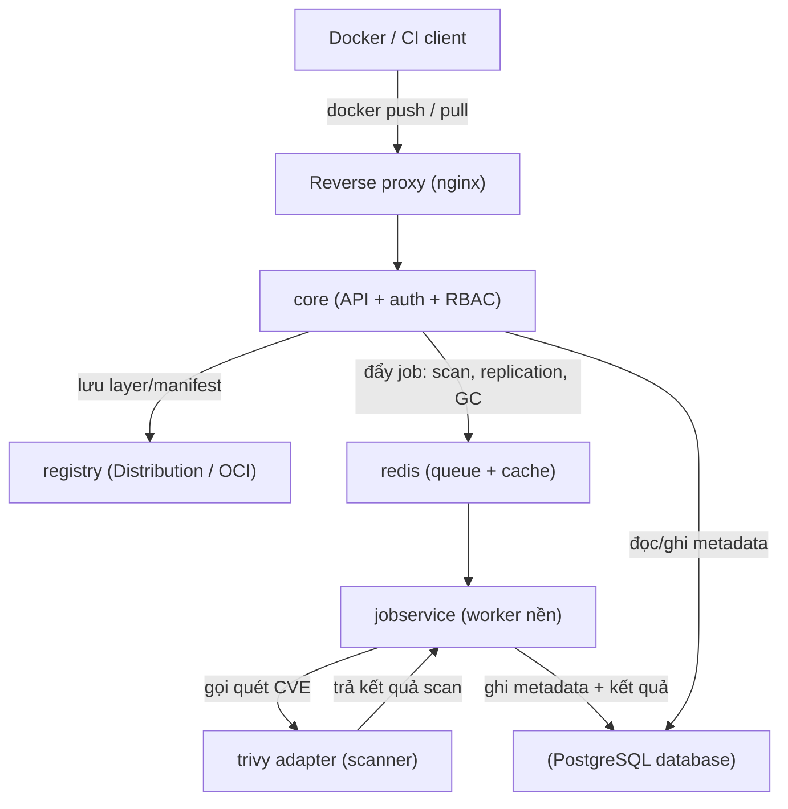

# Harbor Deep Dive — Self-host registry doanh nghiệp

> **Tác giả:** Mr.Rom\
> **Phiên bản:** v1.0.0\
> **Tạo lúc:** 13/06/2026\
> **Cập nhật:** 13/06/2026\
> **Level:** Intermediate\
> **Tags:** container-registry, harbor, self-host, helm, rbac, trivy, cosign, replication, proxy-cache, kubernetes\
> **Yêu cầu trước:** [Container Registry Intermediate — Registry ở quy mô Production](00_intermediate-overview.md)

> 🎯 *Ở overview bạn đã thấy bức tranh registry quy mô production: HA, replication, policy, chi phí. Bài này đi sâu vào công cụ trung tâm — **Harbor**. Bạn sẽ mổ kiến trúc của nó (vì sao một registry "doanh nghiệp" lại cần tới 6-7 thành phần), cài bằng Helm chart, dựng project + phân quyền RBAC cho nhiều team, tạo robot account cho CI, bật proxy cache để thoát rate limit Docker Hub, đặt retention + immutability + quota để kho không phình, và bắt Harbor chặn pull image dính CVE CRITICAL hoặc image chưa ký cosign.*

## 🎯 Sau bài này bạn sẽ

- [ ] Vẽ được kiến trúc Harbor và giải thích vai trò từng thành phần (core, registry/distribution, jobservice, database, redis, trivy adapter)
- [ ] Cài Harbor bằng Helm chart với các giá trị quan trọng (`expose`, `externalURL`, `harborAdminPassword`, `persistence`)
- [ ] Tạo project + gán 4 vai trò RBAC (admin / maintainer / developer / guest) cho nhiều team
- [ ] Tạo **robot account** scope theo project cho CI, hiểu vì sao không dùng tài khoản người thật
- [ ] Dựng **proxy cache project** pull-through Docker Hub để giảm rate limit
- [ ] Đặt **tag retention** + **immutability rule** + **quota**, và **vulnerability scan policy** chặn pull image CRITICAL
- [ ] Bật **cosign signature enforcement**, **webhook** notify CI/CD/Slack, và **replication rule** đẩy/kéo image lọc theo tag

---

## Tình huống — Registry "một người dùng" của Acme đã hết đất sống

Ở các bài basic, Acme Shop dựng được registry riêng và biết push/pull, scan, ký image. Nhưng đó là registry "một team, một mục đích". Giờ Acme có **ba team** (shop, payment, internal-tools), mỗi team chục lập trình viên, hàng chục pipeline CI chạy song song. Ba vấn đề nổ ra cùng lúc:

- **Không phân quyền nổi.** Team payment không muốn team internal-tools đụng vào image của mình (image thanh toán chứa logic nhạy cảm). Một registry phẳng, ai đăng nhập cũng thấy hết — không chấp nhận được.
- **CI dùng mật khẩu cá nhân.** Pipeline đang `docker login` bằng tài khoản của một bạn dev. Bạn đó nghỉ việc, đổi mật khẩu → toàn bộ CI sập. Tệ hơn: token đó có quyền push vào *mọi* project, lộ ra là lộ cả kho.
- **Rate limit Docker Hub vẫn còn.** Mỗi pipeline `FROM node:20`, `FROM python:3.12` đều pull thẳng Docker Hub. Giờ cao điểm vẫn dính `toomanyrequests`.
- **Kho phình vô tận và image bẩn lọt vào prod.** Mỗi build đẩy một tag mới theo commit SHA. Sau vài tháng ổ đĩa đầy. Tệ hơn, một image dính CVE CRITICAL vẫn pull về cluster chạy ngon lành vì không ai chặn.

Bốn vấn đề này không phải "lỗi cấu hình" — chúng là **giới hạn của một registry thuần kho**. Lời giải là một nền tảng quản trị image cấp doanh nghiệp: **Harbor**.

---

## 1️⃣ Harbor thực ra là gì — và vì sao nó cần tới 7 thành phần?

Ở bài basic bạn đã gặp Harbor như "registry self-host mã nguồn mở (CNCF Graduated)". Định nghĩa đó đúng nhưng chưa cho thấy *vì sao* Harbor nặng hơn hẳn một `registry:2` thuần.

🪞 **Ẩn dụ xuyên bài**: *Nếu một registry thuần (`registry:2`) là **một nhà kho trống có cửa khóa** — chỉ chứa thùng hàng (image) và một ổ khóa, thì Harbor là **cả một trung tâm logistics**: có quầy lễ tân kiểm tra giấy tờ (core/auth), kho chứa hàng (registry/distribution), đội công nhân chạy việc nền (jobservice), sổ sách ghi chép (database), bảng ghi chú dán tạm (redis), và một trạm kiểm định chất lượng soi từng thùng (trivy adapter).* Mình sẽ giữ ẩn dụ "trung tâm logistics" này xuyên suốt bài.

Harbor không phải một process duy nhất — nó là **một bộ microservice** chạy chung. Hiểu vai trò từng cái giúp bạn debug khi có sự cố và đọc được log đúng chỗ.

| Thành phần | Vai trò (ẩn dụ logistics) | Làm gì về kỹ thuật |
|---|---|---|
| **core** | Quầy lễ tân + bộ não | API chính của Harbor: xác thực, phân quyền RBAC, quản lý project/user/policy, điều phối mọi thành phần khác |
| **registry** (Distribution) | Nhà kho chứa hàng | Chính là Docker Distribution (`registry:2`) — lưu và phân phối layer/manifest theo chuẩn OCI |
| **jobservice** | Đội công nhân chạy việc nền | Chạy các tác vụ async: scan, replication, garbage collection, retention, webhook — theo hàng đợi |
| **database** (PostgreSQL) | Sổ sách kế toán | Lưu metadata: user, project, quyền, kết quả scan, lịch sử job, audit log |
| **redis** | Bảng ghi chú dán tạm | Cache + hàng đợi job + session — dữ liệu tạm, tốc độ cao |
| **trivy** (adapter) | Trạm kiểm định chất lượng | Scanner CVE tích hợp — quét image, trả kết quả cho core lưu vào database |
| **portal** | Mặt tiền cửa hàng | Web UI (giao diện trình duyệt) để quản trị mọi thứ trên |

> 💡 Hiểu vai trò từng thành phần rồi, ta xem chúng nối với nhau ra sao qua sơ đồ — đặc biệt là đường đi của một request `docker push`.

### Sơ đồ kiến trúc Harbor

Sơ đồ dưới mô tả đường đi của một lần push: client gõ `docker push`, request đi qua reverse proxy vào **core** (lễ tân kiểm tra quyền), core ủy quyền cho **registry** lưu layer, rồi đẩy một job "scan" vào **jobservice** qua **redis**, jobservice gọi **trivy** quét và ghi kết quả vào **database**.



Điểm mấu chốt: **core là bộ não điều phối, registry chỉ là cái kho**. Mọi tính năng "doanh nghiệp" (RBAC, scan, retention, replication) đều nằm ở core + jobservice, không phải ở lớp lưu trữ — đó là lý do Harbor làm được nhiều việc mà `registry:2` không làm nổi.

> [!NOTE]
> Harbor lưu image theo chuẩn **OCI** (Open Container Initiative). Nhờ thế nó không chỉ chứa Docker image mà cả Helm chart (OCI), cosign signature, SBOM attestation — tất cả đều là "OCI artifact" nằm cạnh nhau trong cùng repository.

---

## 2️⃣ Cài Harbor bằng Helm chart

Acme chạy mọi thứ trên Kubernetes, nên cách cài tự nhiên nhất là **Helm chart chính thức** của Harbor. Helm sẽ dựng toàn bộ 7 thành phần ở trên thành các Deployment/StatefulSet trong cluster, thay vì bạn phải tự ghép `docker-compose`.

> [!NOTE]
> Bài này tập trung dựng Harbor *hoạt động được* cho môi trường nhiều team. Cấu hình **HA thật** (database/redis external, object storage S3, multi-replica) là chủ đề của bài tiếp theo — ở đây mình dùng storage trong cluster cho gọn, đủ để học mọi tính năng quản trị.

### 🛠️ Bước 1: Thêm Helm repo của Harbor

Harbor publish chart tại repo Helm chính thức `https://helm.goharbor.io`. Thêm repo rồi cập nhật index để Helm biết các phiên bản chart hiện có:

```bash
# 1. Them repo Helm chinh thuc cua Harbor
helm repo add harbor https://helm.goharbor.io

# 2. Cap nhat index de lay danh sach chart moi nhat
helm repo update

# 3. Xem chart Harbor co san
helm search repo harbor/harbor
```

Kết quả mong đợi:

```
NAME            CHART VERSION   APP VERSION     DESCRIPTION
harbor/harbor   1.16.0          2.13.0          An open source trusted cloud native registry...
```

Cột `APP VERSION` là phiên bản Harbor thực tế (vd `2.13.0`); `CHART VERSION` là phiên bản của Helm chart đóng gói nó. Hai con số này tăng độc lập — khi nâng cấp luôn đọc release note để biết chart version nào đi với app version nào.

### 🛠️ Bước 2: Soạn file `values.yaml`

Chart Harbor có *rất nhiều* tham số, nhưng để chạy được cho Acme bạn chỉ cần khai vài giá trị cốt lõi. Lead-in cho từng nhóm:

- `expose` — Harbor lộ ra ngoài bằng cách nào (Ingress / LoadBalancer / NodePort) và dùng TLS gì.
- `externalURL` — URL gốc người dùng và `docker login` sẽ truy cập. **Phải là domain gốc, không kèm path.**
- `harborAdminPassword` — mật khẩu tài khoản `admin` đầu tiên.
- `persistence` — Harbor lưu image + database + redis ở đâu (PVC trong cluster, hay object storage).
- `trivy.enabled` — bật scanner Trivy tích hợp.

File `values.yaml` tối thiểu cho Acme, dùng Ingress + TLS và PVC trong cluster:

```yaml
# values.yaml — Harbor cho Acme (môi trường multi-team, storage in-cluster)
expose:
  type: ingress              # lo ra ngoai qua Ingress (Acme da co ingress-nginx)
  tls:
    enabled: true
    certSource: secret       # dung TLS secret co san (cap-phat boi cert-manager)
    secret:
      secretName: harbor-tls
  ingress:
    hosts:
      core: harbor.acme.internal   # hostname truy cap Harbor

# URL goc — PHAI khop hostname o tren, KHONG kem path phia sau
externalURL: https://harbor.acme.internal

# Mat khau admin dau tien (sau khi login nen doi ngay)
harborAdminPassword: "ChangeMe_Acme_2026!"

# Bat scanner Trivy tich hop
trivy:
  enabled: true

# Luu tru: PVC trong cluster (HA that se dung object storage — bai sau)
persistence:
  enabled: true
  persistentVolumeClaim:
    registry:
      size: 200Gi            # kho chua image lon nhat
    database:
      size: 10Gi
    redis:
      size: 2Gi
    jobservice:
      jobLog:
        size: 5Gi
    trivy:
      size: 10Gi             # cache database CVE cua Trivy
```

> [!WARNING]
> `externalURL` phải là **domain gốc** (`https://harbor.acme.internal`), không được kèm path kiểu `https://acme.internal/harbor`. Harbor sinh ra link pull/push và redirect dựa trên giá trị này; sai một chữ là `docker login` báo lỗi `unauthorized` hoặc redirect loop khó debug.

### 🛠️ Bước 3: Cài đặt vào namespace riêng

Cài Harbor vào namespace `harbor` (tách khỏi workload của Acme). Cờ `--create-namespace` tạo namespace nếu chưa có; `-f values.yaml` nạp file cấu hình vừa soạn:

```bash
helm install harbor harbor/harbor \
  --namespace harbor \
  --create-namespace \
  -f values.yaml
```

Kết quả mong đợi (rút gọn):

```
NAME: harbor
LAST DEPLOYED: ...
NAMESPACE: harbor
STATUS: deployed
REVISION: 1
```

Sau đó kiểm tra các Pod thành phần đã lên chưa — đây chính là 7 thành phần ở sơ đồ phần 1:

```bash
kubectl get pods -n harbor
```

Kết quả mong đợi:

```
NAME                                READY   STATUS    RESTARTS   AGE
harbor-core-7c8d9f5b4-xl2kp         1/1     Running   0          90s
harbor-database-0                   1/1     Running   0          90s
harbor-jobservice-6b9d7c8f-mn4qr    1/1     Running   0          90s
harbor-portal-5f6c8b9d7-pq8wz       1/1     Running   0          90s
harbor-redis-0                      1/1     Running   0          90s
harbor-registry-8d7f6c5b9-rt3vx     2/2     Running   0          90s
harbor-trivy-0                      1/1     Running   0          90s
```

Cột `STATUS` phải là `Running` và `READY` đủ (`1/1`, hoặc `2/2` với registry vì nó có thêm container registryctl). Nếu thấy `harbor-trivy` hay `harbor-database` kẹt ở `Pending`, gần như chắc chắn là **PVC chưa bind được** (chưa có StorageClass mặc định) — kiểm tra bằng `kubectl get pvc -n harbor`.

### 🛠️ Bước 4: Đăng nhập lần đầu

Mở `https://harbor.acme.internal` trên trình duyệt, đăng nhập bằng `admin` + mật khẩu trong `harborAdminPassword`. Hoặc kiểm tra nhanh từ CLI rằng registry đã sống:

```bash
docker login harbor.acme.internal -u admin
```

Kết quả:

```
Password:
Login Succeeded
```

> [!TIP]
> Đổi mật khẩu `admin` ngay sau lần đăng nhập đầu (UI → user dropdown → Change Password). Mật khẩu trong `values.yaml` chỉ là **mật khẩu khởi tạo** — Harbor không đọc lại field đó sau lần cài đầu, nên đổi qua UI mới có hiệu lực thật.

---

## 3️⃣ Project + RBAC — tách image theo team

Đây là tính năng giải quyết vấn đề đầu tiên của Acme: **team payment không muốn team khác đụng image của mình**. Harbor gom image vào **project**, và mỗi project có cơ chế phân quyền theo vai trò (*RBAC* — Role-Based Access Control).

🪞 **Ẩn dụ tiếp nối**: Trong trung tâm logistics, **project là một khu kho riêng có cửa kiểm soát**. Khu `shop` của team shop, khu `payment` của team payment. Mỗi người được phát thẻ ra vào với **mức quyền khác nhau**: người có thẻ "quản lý khu" (admin) mở được hết, người có thẻ "công nhân" (developer) chỉ vào bốc/xếp hàng, người có thẻ "khách tham quan" (guest) chỉ được nhìn.

### Bốn vai trò RBAC trong project

Harbor có 4 vai trò ở cấp project, quyền tăng dần. Hiểu rõ ranh giới giữa chúng giúp bạn phát thẻ đúng người:

| Vai trò | Pull image | Push image | Sửa cấu hình project (member, scan, retention) | Xóa project / đổi public-private |
|---|---|---|---|---|
| **Guest** (khách) | ✅ | ❌ | ❌ | ❌ |
| **Developer** (lập trình viên) | ✅ | ✅ | ❌ | ❌ |
| **Maintainer** (bảo trì) | ✅ | ✅ | ✅ (quản lý member, scan, retention...) | ❌ |
| **Admin** (quản trị project) | ✅ | ✅ | ✅ | ✅ |

> [!NOTE]
> Đừng nhầm **Project Admin** (quản trị một project) với **Harbor system admin** (tài khoản `admin` quản trị cả Harbor). Project Admin chỉ toàn quyền *trong project đó*; system admin mới sửa được cấu hình toàn hệ thống (replication endpoint, scan toàn cục, user...).

Quy tắc phát thẻ Acme dùng: lead dev của team → **Maintainer**; dev thường → **Developer**; người chỉ cần xem (QA, người ngoài team) → **Guest**; còn **Admin** dành cho người chịu trách nhiệm vòng đời cả project.

### Tạo project + thêm member bằng API

Acme tạo project trên UI cho nhanh, nhưng để **tái lập được** (reproducible — viết vào script/IaC) thì dùng API. Harbor expose REST API tại `/api/v2.0`. Tạo project `shop` (private) bằng `curl`:

```bash
# 1. Tao project "shop" — public:false nghia la private (chi member moi thay)
curl -sS -u admin:'ChangeMe_Acme_2026!' \
  -X POST "https://harbor.acme.internal/api/v2.0/projects" \
  -H "Content-Type: application/json" \
  -d '{
        "project_name": "shop",
        "metadata": { "public": "false" }
      }'
```

Lệnh không in gì khi thành công (HTTP 201). Kiểm tra project đã tạo:

```bash
curl -sS -u admin:'ChangeMe_Acme_2026!' \
  "https://harbor.acme.internal/api/v2.0/projects?name=shop"
```

Kết quả (rút gọn):

```json
[
  {
    "project_id": 2,
    "name": "shop",
    "metadata": { "public": "false" }
  }
]
```

→ `project_id: 2` (project `1` là `library` mặc định). Giờ thêm một dev vào project `shop` với vai trò **Developer** — `role_id` là số: `1`=Project Admin, `2`=Developer, `3`=Guest, `4`=Maintainer.

```bash
# Them user "dev-shop" vao project shop voi vai tro Developer (role_id=2)
curl -sS -u admin:'ChangeMe_Acme_2026!' \
  -X POST "https://harbor.acme.internal/api/v2.0/projects/shop/members" \
  -H "Content-Type: application/json" \
  -d '{
        "role_id": 2,
        "member_user": { "username": "dev-shop" }
      }'
```

→ Từ giờ `dev-shop` push/pull được trong project `shop`, nhưng **không thấy** project `payment` của team khác. Đúng nhu cầu cô lập của Acme.

> [!CAUTION]
> Đừng để project ở chế độ **public** chỉ vì "cho tiện pull". Public project nghĩa là **ai cũng pull được mà không cần đăng nhập** — image proprietary của Acme sẽ lộ. Chỉ để public cho proxy cache project hoặc image base mã nguồn mở dùng chung.

---

## 4️⃣ Robot account — danh tính cho CI, không dùng người thật

Vấn đề thứ hai của Acme: **CI đang login bằng tài khoản cá nhân của một dev**. Đây là anti-pattern kinh điển — danh tính người gắn với pipeline máy. Harbor giải bằng **robot account**: một danh tính *không phải người*, sinh ra riêng cho automation, có thể giới hạn scope theo project và thu hồi độc lập.

🪞 **Ẩn dụ**: Robot account là **thẻ ra vào cấp cho một cái máy bốc hàng tự động**, không gắn với nhân viên nào. Máy hỏng hay bị chiếm thì thu thẻ, không ảnh hưởng thẻ của người. Và thẻ này chỉ mở đúng **một khu kho** (project) với đúng **vài thao tác** (chỉ push+pull, không sửa cấu hình).

### Robot account scope theo project

Harbor có hai cấp robot account: **system-level** (xài được nhiều project — quyền rộng, dùng cho automation toàn cục) và **project-level** (chỉ trong một project — đúng nguyên tắc least-privilege). Cho CI của team shop, ta dùng **project-level**, chỉ cấp `pull` + `push` trong project `shop`.

> [!IMPORTANT]
> Trong Harbor, **quyền push luôn phải đi kèm quyền pull** — không thể cấp push một mình. Lý do: push một image thường cần pull layer đã tồn tại để dedupe. Khi tạo robot account, nhớ tick cả `pull` và `push`.

Tạo robot account project-level cho CI của `shop` qua API. Body khai rõ `permissions` giới hạn trong namespace `shop` với hai action `pull` và `push`:

```bash
curl -sS -u admin:'ChangeMe_Acme_2026!' \
  -X POST "https://harbor.acme.internal/api/v2.0/robots" \
  -H "Content-Type: application/json" \
  -d '{
        "name": "ci-shop",
        "description": "CI pipeline cua team shop",
        "duration": 90,
        "level": "project",
        "permissions": [
          {
            "kind": "project",
            "namespace": "shop",
            "access": [
              { "resource": "repository", "action": "pull" },
              { "resource": "repository", "action": "push" }
            ]
          }
        ]
      }'
```

`duration: 90` nghĩa là token sống 90 ngày (đặt `-1` để không hết hạn — không khuyến nghị cho CI). Kết quả trả về username + secret **chỉ hiện một lần duy nhất**:

```json
{
  "id": 3,
  "name": "robot$shop+ci-shop",
  "secret": "9f3c1a7e8b2d4f6a0c5e1b9d7f3a2c8e",
  "creation_time": "2026-06-13T08:00:00Z",
  "expires_at": "2026-09-11T08:00:00Z"
}
```

Chú ý username có dạng `robot$shop+ci-shop` — prefix `robot$`, sau đó là `<project>+<name>`. Đây là username CI sẽ dùng để `docker login`:

```bash
# Trong pipeline: dang nhap bang robot account (secret luu trong CI secret store)
echo "$HARBOR_ROBOT_SECRET" | docker login harbor.acme.internal \
  -u 'robot$shop+ci-shop' --password-stdin
```

Kết quả:

```
Login Succeeded
```

> [!WARNING]
> `secret` chỉ hiện **một lần** lúc tạo (hoặc refresh) — copy ngay vào CI secret store (GitHub Actions secret, Vault...). Lỡ mất thì không xem lại được, phải **refresh secret** qua API (`PATCH .../robots/{id}`). Robot account **không đăng nhập được Web UI** — đúng thiết kế, nó chỉ dành cho API/OCI client.

So sánh nhanh để chọn cấp robot account:

| Tiêu chí | Project-level robot | System-level robot |
|---|---|---|
| Phạm vi | Một project duy nhất | Nhiều project (chọn lúc tạo) |
| Username | `robot$<project>+<name>` | `robot$<name>` |
| Khi dùng cho Acme | CI mỗi team (least-privilege) | Tooling toàn cục (replication runner, scanner ngoài) |
| Rủi ro khi lộ | Mất quyền 1 project | Mất quyền nhiều project — nguy hiểm hơn |

---

## 5️⃣ Proxy cache — pull-through Docker Hub, thoát rate limit

Vấn đề thứ ba: **CI vẫn pull base image thẳng Docker Hub và dính rate limit**. Harbor giải bằng **proxy cache project** — một project đặc biệt đóng vai "gương phản chiếu" Docker Hub. Lần đầu pull, Harbor kéo image từ Docker Hub về cache; lần sau pull, Harbor phục vụ từ cache nội bộ.

🪞 **Ẩn dụ**: Proxy cache như **kho trung chuyển đặt ngay cạnh nhà máy của Acme**. Thay vì mỗi lần cần linh kiện lại chạy ra siêu thị xa (Docker Hub) — nơi giới hạn số lần mua/ngày — Acme đặt một kho con: lần đầu lấy từ siêu thị về kho, các lần sau lấy ngay tại kho. Siêu thị chỉ bị "ghé" một lần cho mỗi linh kiện.

Cơ chế giảm rate limit rất khéo: ở các lần pull sau, Harbor chỉ bắn một **HEAD request** tới Docker Hub để kiểm tra image có đổi không — HEAD request *không tính* vào hạn mức pull của Docker Hub. Chỉ lần kéo layer thật mới tính.

### 🛠️ Bước 1: Tạo registry endpoint trỏ tới Docker Hub

Trước khi tạo proxy cache project, phải khai một **registry endpoint** — địa chỉ + credential của registry nguồn (ở đây là Docker Hub). Dùng tài khoản Docker Hub đã đăng nhập để được hạn mức cao hơn anonymous:

```bash
curl -sS -u admin:'ChangeMe_Acme_2026!' \
  -X POST "https://harbor.acme.internal/api/v2.0/registries" \
  -H "Content-Type: application/json" \
  -d '{
        "name": "dockerhub",
        "type": "docker-hub",
        "url": "https://hub.docker.com",
        "credential": {
          "type": "basic",
          "access_key": "acme-dockerhub-user",
          "access_secret": "<docker-hub-token>"
        }
      }'
```

→ Endpoint `dockerhub` giờ là "đường dẫn ra siêu thị". Lệnh trả về HTTP 201 khi thành công.

### 🛠️ Bước 2: Tạo proxy cache project gắn endpoint đó

Tạo một project mới với `registry_id` trỏ tới endpoint vừa tạo — đó là dấu hiệu báo Harbor "đây là proxy cache project, không phải project lưu trữ thường". Lấy `registry_id` từ response bước trước (giả sử là `1`):

```bash
curl -sS -u admin:'ChangeMe_Acme_2026!' \
  -X POST "https://harbor.acme.internal/api/v2.0/projects" \
  -H "Content-Type: application/json" \
  -d '{
        "project_name": "dockerhub-proxy",
        "registry_id": 1,
        "metadata": { "public": "true" }
      }'
```

### 🛠️ Bước 3: Đổi base image trong Dockerfile/CI sang đường proxy

Giờ thay vì `FROM node:20`, Acme trỏ qua proxy cache. Định dạng tên image qua proxy là `<harbor-host>/<proxy-project>/<đường-image-gốc>`:

```bash
# Cu: keo thang Docker Hub (dinh rate limit)
docker pull node:20

# Moi: keo qua proxy cache cua Harbor
docker pull harbor.acme.internal/dockerhub-proxy/library/node:20
```

Lần đầu lệnh trên, Harbor kéo `node:20` từ Docker Hub về cache rồi trả cho bạn; lần sau (kể cả pipeline khác) pull từ cache nội bộ — nhanh hơn và **không** đụng hạn mức Docker Hub.

> [!NOTE]
> Image official như `node`, `python`, `nginx` trên Docker Hub nằm trong namespace ẩn `library`, nên đường đầy đủ là `.../dockerhub-proxy/library/node:20`. Image của user/org thì giữ nguyên: `.../dockerhub-proxy/grafana/grafana:11.0.0`.

Trong Dockerfile của Acme, đổi luôn dòng `FROM`:

```dockerfile
# Truoc:
# FROM node:20-alpine

# Sau — keo base image qua proxy cache cua Harbor
FROM harbor.acme.internal/dockerhub-proxy/library/node:20-alpine
```

---

## 6️⃣ Giữ kho gọn và sạch — retention, immutability, quota

Vấn đề thứ tư có hai nửa: **kho phình vô hạn** và **image bẩn lọt vào prod**. Phần này lo nửa đầu (gọn) bằng 3 cơ chế phối hợp; phần 7 lo nửa sau (sạch).

🪞 **Ẩn dụ**: Vẫn là khu kho `shop`. **Retention** = luật "chỉ giữ N lô hàng mới nhất, lô cũ thì thanh lý". **Immutability** = "lô hàng đã dán tem release thì khóa cứng, không ai sửa/đè được". **Quota** = "khu kho này tối đa chứa 200 m³, đầy thì không nhập thêm".

### 6.1 Tag retention policy — tự dọn tag cũ

Mỗi build CI đẩy một tag mới (commit SHA). Không dọn thì sau vài tháng có hàng nghìn tag rác. **Retention rule** đặt luật giữ lại cái gì, xóa cái gì. Ví dụ: giữ 10 image mới nhất theo mỗi repository, nhưng **luôn giữ** tag release (`v*`).

Tạo retention policy cho project `shop` qua API. `template: "latestPushedK"` nghĩa "giữ K bản push gần nhất"; `tag_selectors` với `decoration: "matches"` và `pattern: "**"` áp cho mọi tag, nhưng ta loại trừ tag release bằng một rule riêng:

```bash
curl -sS -u admin:'ChangeMe_Acme_2026!' \
  -X POST "https://harbor.acme.internal/api/v2.0/retentions" \
  -H "Content-Type: application/json" \
  -d '{
        "algorithm": "or",
        "scope": { "level": "project", "ref": 2 },
        "trigger": {
          "kind": "Schedule",
          "settings": { "cron": "0 0 2 * * *" }
        },
        "rules": [
          {
            "template": "latestPushedK",
            "params": { "latestPushedK": 10 },
            "scope_selectors": {
              "repository": [
                { "kind": "doublestar", "decoration": "repoMatches", "pattern": "**" }
              ]
            },
            "tag_selectors": [
              { "kind": "doublestar", "decoration": "matches", "pattern": "**" }
            ]
          },
          {
            "template": "latestPushedK",
            "params": { "latestPushedK": 100 },
            "scope_selectors": {
              "repository": [
                { "kind": "doublestar", "decoration": "repoMatches", "pattern": "**" }
              ]
            },
            "tag_selectors": [
              { "kind": "doublestar", "decoration": "matches", "pattern": "v*" }
            ]
          }
        ]
      }'
```

Đọc policy này: rule 1 giữ 10 bản mới nhất cho mọi tag; rule 2 giữ 100 bản cho tag bắt đầu bằng `v` (release). `algorithm: "or"` nghĩa là tag được giữ nếu **thỏa bất kỳ rule nào** — nên tag `v1.0.0` luôn sống dù không nằm trong 10 bản gần nhất. Lịch chạy hằng đêm 2h sáng (cron 6 trường của Harbor: `giây phút giờ ngày tháng thứ`).

> [!IMPORTANT]
> Retention **chỉ xóa tag khỏi metadata** (image không còn được tham chiếu). Để **giải phóng dung lượng đĩa thật**, phải chạy **Garbage Collection** (GC) — dọn các blob không còn manifest nào trỏ tới. Bật GC theo lịch ở UI (Administration → Garbage Collection → Schedule) hoặc API. Retention + GC là cặp đôi: retention bỏ tham chiếu, GC mới thực sự xóa byte.

### 6.2 Immutability rule — khóa tag release không cho đè

Bài basic đã chỉ ra rủi ro: tag là *mutable*, ai đó push đè `v1.4.0` bằng image khác là tráo được. **Immutability rule** chặn việc đó ở chính registry — tag khớp pattern sẽ không cho push đè.

Tạo rule khóa mọi tag release (`v*`) trong project `shop`:

```bash
curl -sS -u admin:'ChangeMe_Acme_2026!' \
  -X POST "https://harbor.acme.internal/api/v2.0/projects/shop/immutabletagrules" \
  -H "Content-Type: application/json" \
  -d '{
        "disabled": false,
        "scope_selectors": {
          "repository": [
            { "kind": "doublestar", "decoration": "repoMatches", "pattern": "**" }
          ]
        },
        "tag_selectors": [
          { "kind": "doublestar", "decoration": "matches", "pattern": "v*" }
        ]
      }'
```

→ Từ giờ, `docker push harbor.acme.internal/shop/api:v1.0.0` lần thứ hai (với image khác) sẽ bị Harbor từ chối. Tag tạm (commit SHA) vẫn đè được bình thường — đúng nhu cầu: release bất biến, build tạm linh hoạt.

### 6.3 Quota — chặn một team xài hết đĩa

Đặt hạn mức dung lượng cho project để một team không "ăn" hết ổ đĩa của cả Harbor. Cập nhật quota cho project `shop` lên 200 GiB qua API (quota tính bằng byte):

```bash
# Tim quota_id cua project shop
curl -sS -u admin:'ChangeMe_Acme_2026!' \
  "https://harbor.acme.internal/api/v2.0/quotas?reference=project&reference_id=2"

# Cap nhat hard limit storage = 200 GiB (200 * 1024^3 byte)
curl -sS -u admin:'ChangeMe_Acme_2026!' \
  -X PUT "https://harbor.acme.internal/api/v2.0/quotas/2" \
  -H "Content-Type: application/json" \
  -d '{ "hard": { "storage": 214748364800 } }'
```

→ Khi project `shop` chạm 200 GiB, push tiếp sẽ bị từ chối với lỗi quota. Acme đặt quota khác nhau theo độ quan trọng: `payment` rộng hơn, `internal-tools` hẹp hơn.

---

## 7️⃣ Chặn image không an toàn — scan policy + cosign enforcement

Giờ tới nửa "sạch" của vấn đề thứ tư: **không cho image dính CVE CRITICAL hoặc image chưa ký vào prod**. Harbor có hai cổng chặn ngay tại registry, áp cho **mọi** consumer (không chỉ CI của bạn).

### 7.1 Scan-on-push + chặn pull image CRITICAL

Hai cấu hình phối hợp ở cấp project:

- **Scan on push** — mỗi image vừa push là Trivy quét ngay, kết quả gắn vào trang image.
- **Prevent vulnerable images from running** — chặn *pull* image nếu nó còn CVE từ ngưỡng severity bạn đặt (vd CRITICAL).

Bật cả hai cho project `shop` bằng cách cập nhật `metadata` của project. `auto_scan: "true"` bật scan-on-push; `prevent_vul: "true"` + `severity: "critical"` chặn pull khi có CVE CRITICAL:

```bash
curl -sS -u admin:'ChangeMe_Acme_2026!' \
  -X PUT "https://harbor.acme.internal/api/v2.0/projects/shop" \
  -H "Content-Type: application/json" \
  -d '{
        "metadata": {
          "auto_scan": "true",
          "prevent_vul": "true",
          "severity": "critical"
        }
      }'
```

Giờ thử pull một image dính CVE CRITICAL từ project `shop`:

```bash
docker pull harbor.acme.internal/shop/api:bad-build
```

Kết quả:

```
Error response from daemon: unknown: current image with 1 vulnerabilities cannot be pulled due to configured policy in 'Prevent images with vulnerabilities from running.'
```

→ Đây là **gate ngay tại registry** — mạnh hơn gate ở CI, vì áp cho mọi người pull (kể cả dev pull tay, hay cluster khác). Image bẩn đơn giản là không ra khỏi kho được.

> [!TIP]
> Nếu một CVE đã được xác minh không ảnh hưởng app, dùng **CVE Allowlist** ở cấp project (UI → Project → Configuration → CVE allowlist) để bỏ qua *đúng CVE đó* mà vẫn giữ cổng chặn cho phần còn lại — tương đương `.trivyignore` nhưng cấu hình tập trung.

### 7.2 Cosign signature — bắt buộc image phải được ký

Cổng thứ hai chống *tráo image*: bật **content trust qua cosign** ở cấp project. Khi bật, Harbor chỉ cho pull image **có chữ ký cosign hợp lệ** nằm cùng repository.

Bật enforcement bằng cách đặt `enable_content_trust_cosign: "true"` trong metadata project:

```bash
curl -sS -u admin:'ChangeMe_Acme_2026!' \
  -X PUT "https://harbor.acme.internal/api/v2.0/projects/shop" \
  -H "Content-Type: application/json" \
  -d '{
        "metadata": {
          "enable_content_trust_cosign": "true"
        }
      }'
```

Quy trình của Acme giờ là: CI build → push → `cosign sign` (chữ ký lưu ngay trong Harbor cạnh image) → ai pull cũng được vì đã có chữ ký. Image chưa ký thì bị chặn:

```bash
# Image chua ky -> bi tu choi pull
docker pull harbor.acme.internal/shop/api:unsigned
```

Kết quả:

```
Error response from daemon: unknown: The image is not signed in cosign.
```

→ Kết hợp 7.1 + 7.2: image vào project `shop` phải **vừa sạch CVE CRITICAL vừa được ký** mới pull được. Hai rủi ro độc lập (image bẩn / image tráo) bị chặn bằng hai cổng độc lập — đúng nguyên tắc đã học ở bài signing & scanning.

> [!NOTE]
> Harbor lưu chữ ký cosign như một **OCI artifact** trong cùng repository với image (tham chiếu theo digest). Nhờ vậy enforcement chỉ là Harbor kiểm tra "có artifact chữ ký hợp lệ cho digest này không" — không cần gọi ra ngoài.

---

## 8️⃣ Webhook + Replication — kết nối Harbor với thế giới

Hai tính năng cuối biến Harbor từ "kho cô lập" thành mắt xích trong hệ thống lớn của Acme.

### 8.1 Webhook — báo cho CI/CD và Slack

Khi có sự kiện trong project (push image, scan xong, scan phát hiện CVE...), Harbor có thể bắn **webhook** (HTTP POST) tới một URL — để trigger pipeline deploy, hay báo Slack. Đây là cách Harbor "nói chuyện" với phần còn lại của pipeline.

Tạo webhook policy cho project `shop`, bắn khi có image mới push hoặc scan hoàn tất:

```bash
curl -sS -u admin:'ChangeMe_Acme_2026!' \
  -X POST "https://harbor.acme.internal/api/v2.0/projects/shop/webhook/policies" \
  -H "Content-Type: application/json" \
  -d '{
        "name": "notify-cicd-slack",
        "enabled": true,
        "event_types": [ "PUSH_ARTIFACT", "SCANNING_COMPLETED" ],
        "targets": [
          {
            "type": "http",
            "address": "https://ci.acme.internal/hooks/harbor",
            "auth_header": "Bearer <ci-webhook-token>"
          },
          {
            "type": "slack",
            "address": "https://hooks.slack.com/services/T000/B000/XXXX"
          }
        ]
      }'
```

→ Mỗi lần push image hoặc scan xong, Harbor POST payload JSON tới CI (kích hoạt deploy) và tới Slack (báo team). `type: "slack"` là target chuyên dụng — Harbor tự format payload cho Slack Incoming Webhook, không cần adapter trung gian.

### 8.2 Replication rule — đồng bộ image đa vùng

Acme có cluster ở hai vùng. Image build ở vùng chính nhưng cần có mặt ở cả vùng phụ để pull nhanh và để DR (disaster recovery). **Replication rule** tự đồng bộ image giữa Harbor và registry khác (Harbor khác, Docker Hub, ECR...), theo hai chiều:

- **Push-based** — Harbor này *đẩy* image sang registry đích.
- **Pull-based** — Harbor này *kéo* image từ registry nguồn về.

Tạo rule push-based: đẩy mọi tag release (`v*`) của project `shop` sang Harbor vùng phụ, kích hoạt ngay khi có image mới (`event_based`). Giả sử endpoint đích đã tạo, `dest_registry.id: 2`:

```bash
curl -sS -u admin:'ChangeMe_Acme_2026!' \
  -X POST "https://harbor.acme.internal/api/v2.0/replication/policies" \
  -H "Content-Type: application/json" \
  -d '{
        "name": "shop-release-to-dr",
        "src_registry": null,
        "dest_registry": { "id": 2 },
        "dest_namespace": "shop",
        "filters": [
          { "type": "name", "value": "shop/**" },
          { "type": "tag", "value": "v*" }
        ],
        "trigger": { "type": "event_based" },
        "enabled": true
      }'
```

Đọc rule: `src_registry: null` nghĩa nguồn là chính Harbor này (local); `dest_registry.id: 2` là Harbor vùng phụ; `filters` lọc chỉ image trong `shop/**` và **chỉ tag `v*`** (không sync build tạm cho đỡ tốn băng thông); `trigger: event_based` đẩy ngay khi push.

> [!NOTE]
> Bộ lọc `tag: "v*"` rất quan trọng để tiết kiệm: nếu sync mọi tag (kể cả hàng nghìn commit-SHA build), bạn tốn băng thông và đĩa ở vùng phụ một cách vô ích. Chỉ replicate cái thật sự cần ở vùng kia — thường là release. Chi tiết HA/DR là chủ đề bài tiếp theo.

---

## 💡 Cạm bẫy thường gặp & Best practice

### ❌ Cạm bẫy: Đặt `externalURL` sai (kèm path hoặc lệch hostname)

- **Triệu chứng**: `docker login` báo `unauthorized` dù đúng mật khẩu, hoặc trình duyệt bị redirect loop; push thành công nhưng pull lỗi.
- **Nguyên nhân**: `externalURL` không khớp `expose.ingress.hosts.core`, hoặc kèm path (`/harbor`). Harbor sinh redirect và token-service URL từ giá trị này.
- **Cách tránh**: `externalURL` luôn là domain gốc `https://harbor.acme.internal`, khớp đúng hostname Ingress, **không** kèm path.

### ❌ Cạm bẫy: Dùng tài khoản cá nhân (hoặc `admin`) cho CI

- **Triệu chứng**: dev nghỉ việc/đổi mật khẩu → toàn bộ pipeline sập; hoặc token CI có quyền push vào *mọi* project.
- **Nguyên nhân**: gắn danh tính người vào automation, và cấp quyền quá rộng (least-privilege bị bỏ qua).
- **Cách tránh**: tạo **robot account project-level** cho mỗi CI, chỉ cấp `pull`+`push` trong đúng project, đặt `duration` hữu hạn và lưu secret trong CI secret store. Lộ thì refresh secret, không ảnh hưởng người.

### ❌ Cạm bẫy: Bật retention nhưng quên Garbage Collection

- **Triệu chứng**: retention "đã chạy", số tag giảm trên UI, nhưng ổ đĩa registry **không** giảm — vẫn đầy dần.
- **Nguyên nhân**: retention chỉ bỏ *tham chiếu* tới image; blob vẫn nằm trên đĩa cho tới khi GC dọn.
- **Cách tránh**: bật **GC theo lịch** (Administration → Garbage Collection) chạy sau retention. Lưu ý GC có time-window bảo vệ layer vừa upload (mặc định 2 giờ) để không xóa nhầm image đang push.

### ❌ Cạm bẫy: Bật `prevent_vul` nhưng quên image base hệ thống cũng bị chặn

- **Triệu chứng**: bật "block pull nếu CRITICAL" cho project hệ thống → cluster không pull được cả image hạ tầng (ingress, monitoring) vì chúng có CVE chưa vá.
- **Nguyên nhân**: policy chặn áp cho mọi image trong project, kể cả thứ bạn không kiểm soát được bản vá.
- **Cách tránh**: tách project — image *do Acme build* (kiểm soát được) đặt enforcement chặt; image bên thứ ba (qua proxy cache) đặt project riêng với policy lỏng hơn + CVE allowlist có chủ đích.

### ✅ Best practice: Mỗi team một project, mỗi CI một robot account

- **Vì sao**: cô lập blast radius (phạm vi thiệt hại). Project tách quyền giữa team; robot account project-level giới hạn quyền của từng pipeline. Lộ một token chỉ mất một project.
- **Cách áp dụng**: project `shop`/`payment`/`internal-tools` riêng; robot `ci-shop`/`ci-payment`... mỗi cái chỉ pull+push đúng project của nó; quota + retention cấu hình theo độ quan trọng từng project.

### ✅ Best practice: Đặt cổng chặn ở chính registry, không chỉ ở CI

- **Vì sao**: gate ở CI chỉ chặn pipeline của bạn; gate ở Harbor (`prevent_vul` + cosign enforcement) chặn **mọi** consumer — dev pull tay, cluster khác, CI khác đều không lách được.
- **Cách áp dụng**: bật scan-on-push + prevent-vulnerable + cosign content-trust ở cấp project cho mọi project production. Coi đây là "tường lửa cuối" cho image.

---

## 🧠 Tự kiểm tra (Self-check)

**Q1.** Trong kiến trúc Harbor, vì sao tách riêng `jobservice` khỏi `core`? Một tác vụ nào chạy ở `jobservice`?

<details>
<summary>💡 Xem giải thích</summary>

`core` xử lý request **đồng bộ** (auth, API, RBAC) — phải trả lời nhanh. Các tác vụ **chạy lâu và async** (scan CVE một image có thể mất nhiều giây, replication có thể kéo hàng GB, garbage collection quét cả kho) được tách ra `jobservice` để không block API.

`jobservice` lấy job từ hàng đợi (qua `redis`) rồi chạy nền: **scan** (gọi trivy adapter), **replication**, **garbage collection**, **retention**, và bắn **webhook**. Nhờ kiến trúc này, khi `jobservice` bận quét hàng trăm image, API của `core` vẫn phản hồi `docker login`/`pull` bình thường.

</details>

**Q2.** Robot account của CI team shop bị lộ secret lên log công khai. Thiệt hại tới đâu, và xử lý thế nào?

<details>
<summary>💡 Xem giải thích</summary>

Nếu là **robot project-level** chỉ có `pull`+`push` trong project `shop`, thiệt hại **giới hạn trong project `shop`**: kẻ lộ có thể pull/push image của team shop, nhưng *không* đụng được `payment`, `internal-tools`, hay cấu hình hệ thống. Đó chính là giá trị của least-privilege.

Xử lý: **refresh secret** của robot account đó qua API (`PATCH /api/v2.0/robots/{id}` để sinh secret mới), hoặc disable/xóa nó rồi tạo cái mới. Secret cũ lập tức vô hiệu. Sau đó cập nhật secret mới vào CI secret store. So với việc lộ mật khẩu cá nhân (mất cả tài khoản người, mọi project) thì đây là sự cố nhỏ, khoanh vùng được.

</details>

**Q3.** Retention policy của project `shop` đã chạy, UI báo số tag giảm từ 5000 xuống 200, nhưng `kubectl` báo PVC registry vẫn gần đầy. Vì sao?

<details>
<summary>💡 Xem giải thích</summary>

Vì **retention chỉ xóa tham chiếu (tag/manifest), không xóa blob trên đĩa**. Các layer (blob) vẫn nằm trên filesystem cho tới khi **Garbage Collection** chạy và dọn những blob không còn manifest nào trỏ tới.

Cách sửa: bật **GC theo lịch** (Administration → Garbage Collection → Schedule), hoặc chạy "GC Now". GC có dry-run để ước lượng dung lượng giải phóng trước. Lưu ý GC bảo vệ layer vừa upload trong cửa sổ ~2 giờ để không xóa nhầm image đang được push dở. Retention + GC là cặp đôi bắt buộc đi cùng nhau.

</details>

**Q4.** Project `shop` đã bật `prevent_vul: critical` và `enable_content_trust_cosign: true`. Một image vừa được ký cosign hợp lệ nhưng Trivy phát hiện 1 CVE CRITICAL. Pull được không?

<details>
<summary>💡 Xem giải thích</summary>

**Không pull được.** Hai cổng là **độc lập** và phải qua **cả hai**:

- Cosign enforcement chỉ kiểm tra "image có chữ ký hợp lệ không" → image này **qua** (đã ký).
- `prevent_vul: critical` kiểm tra "image có CVE CRITICAL không" → image này **trượt** (có 1 CRITICAL).

Vì còn 1 cổng trượt, Harbor chặn pull. Đây đúng triết lý: **chữ ký chứng minh "đúng hàng", không chứng minh "hàng sạch"**. Một image có thể vừa được ký đúng vừa đầy lỗ hổng. Muốn pull, phải vá CVE (rebuild với base mới) rồi ký lại — hoặc nếu CVE đã xác minh vô hại thì thêm vào CVE allowlist của project.

</details>

**Q5.** Vì sao replication rule của Acme lọc `tag: "v*"` thay vì sync mọi tag sang vùng DR?

<details>
<summary>💡 Xem giải thích</summary>

Vì CI đẩy **rất nhiều tag tạm** (mỗi commit một tag SHA) — có thể hàng nghìn. Sync hết sang vùng phụ tốn **băng thông** (mỗi lần đẩy qua mạng liên vùng) và **đĩa** ở vùng phụ, trong khi vùng phụ thường chỉ cần **bản release** để chạy/DR.

Lọc `tag: "v*"` (chỉ release) cộng `name: "shop/**"` (chỉ image của project shop) đảm bảo chỉ replicate đúng thứ cần. Đây là tối ưu chi phí cơ bản ở quy mô lớn — chi tiết HA/DR/cost ở các bài tiếp theo trong cụm.

</details>

---

## ⚡ Tra cứu nhanh (Cheatsheet)

```bash
# === Cài Harbor bằng Helm ===
helm repo add harbor https://helm.goharbor.io
helm repo update
helm install harbor harbor/harbor -n harbor --create-namespace -f values.yaml
kubectl get pods -n harbor                          # kiểm tra 7 thành phần

# === Đăng nhập ===
docker login harbor.acme.internal -u admin
# Robot account cho CI (username dạng robot$<project>+<name>):
echo "$SECRET" | docker login harbor.acme.internal -u 'robot$shop+ci-shop' --password-stdin

# === API base (mọi lệnh curl dùng -u admin:<pass>) ===
HB=https://harbor.acme.internal/api/v2.0

# Tạo project private
curl -u admin:PASS -X POST "$HB/projects" -H 'Content-Type: application/json' \
  -d '{"project_name":"shop","metadata":{"public":"false"}}'

# Thêm member (role_id: 1=Admin 2=Developer 3=Guest 4=Maintainer)
curl -u admin:PASS -X POST "$HB/projects/shop/members" -H 'Content-Type: application/json' \
  -d '{"role_id":2,"member_user":{"username":"dev-shop"}}'

# Tạo robot account project-level (pull+push trong shop)
curl -u admin:PASS -X POST "$HB/robots" -H 'Content-Type: application/json' \
  -d '{"name":"ci-shop","level":"project","duration":90,"permissions":[{"kind":"project","namespace":"shop","access":[{"resource":"repository","action":"pull"},{"resource":"repository","action":"push"}]}]}'

# === Proxy cache: pull base image qua Harbor (image official nằm trong /library) ===
docker pull harbor.acme.internal/dockerhub-proxy/library/node:20

# === Bật scan-on-push + chặn pull CRITICAL + bắt buộc ký cosign ===
curl -u admin:PASS -X PUT "$HB/projects/shop" -H 'Content-Type: application/json' \
  -d '{"metadata":{"auto_scan":"true","prevent_vul":"true","severity":"critical","enable_content_trust_cosign":"true"}}'

# === Immutability rule: khóa tag release v* ===
curl -u admin:PASS -X POST "$HB/projects/shop/immutabletagrules" -H 'Content-Type: application/json' \
  -d '{"disabled":false,"scope_selectors":{"repository":[{"kind":"doublestar","decoration":"repoMatches","pattern":"**"}]},"tag_selectors":[{"kind":"doublestar","decoration":"matches","pattern":"v*"}]}'

# === Quota: đặt 200 GiB cho project (quota_id ví dụ = 2) ===
curl -u admin:PASS -X PUT "$HB/quotas/2" -H 'Content-Type: application/json' \
  -d '{"hard":{"storage":214748364800}}'
```

---

## 📚 Từ Điển Thuật Ngữ (Glossary)

| EN | VN | Giải thích |
|---|---|---|
| Harbor | Harbor (giữ nguyên) | Registry self-host mã nguồn mở (CNCF Graduated), có RBAC + scan + replication + signing |
| core | Lõi (giữ nguyên) | Thành phần API chính của Harbor: auth, RBAC, điều phối; là "bộ não" |
| Distribution / registry | (giữ nguyên) | Lớp lưu trữ OCI (`registry:2`) bên dưới Harbor — chỉ chứa layer/manifest |
| jobservice | Dịch vụ chạy job nền | Worker chạy tác vụ async: scan, replication, GC, retention, webhook |
| Trivy adapter | (giữ nguyên) | Cầu nối giữa Harbor và scanner Trivy để quét CVE |
| OCI | Open Container Initiative | Chuẩn định dạng image/artifact mở — image, chữ ký, SBOM đều là OCI artifact |
| Helm chart | (giữ nguyên) | Gói cài đặt ứng dụng trên K8s; chart Harbor dựng cả 7 thành phần |
| `externalURL` | URL gốc | URL người dùng/`docker login` truy cập Harbor — phải là domain gốc, không kèm path |
| Project | Dự án / khu kho | Đơn vị gom image + phân quyền + policy trong Harbor |
| RBAC | Phân quyền theo vai trò | Gán vai trò (Guest/Developer/Maintainer/Admin) cho member trong project |
| Robot account | Tài khoản robot | Danh tính cho automation (CI), không phải người; scope theo project, thu hồi độc lập |
| Least-privilege | Đặc quyền tối thiểu | Cấp đúng quyền cần thiết, không thừa — giảm thiệt hại khi lộ credential |
| Proxy cache | Bộ nhớ đệm trung chuyển | Project đặc biệt cache image từ registry nguồn (Docker Hub) để giảm rate limit |
| Rate limit | Giới hạn tần suất | Hạn mức số pull/khoảng thời gian mà Docker Hub áp lên client |
| Retention policy | Chính sách giữ lại | Luật tự dọn tag cũ (giữ N bản mới nhất) để kho không phình |
| Garbage Collection (GC) | Dọn rác | Xóa blob không còn manifest tham chiếu — mới thực sự giải phóng đĩa |
| Immutability rule | Quy tắc bất biến | Khóa tag khớp pattern không cho push đè (chống tráo image) |
| Quota | Hạn mức | Giới hạn dung lượng lưu trữ mỗi project |
| `prevent_vul` | Chặn image lỗ hổng | Cấu hình project chặn *pull* image nếu còn CVE từ ngưỡng severity đặt trước |
| Content trust (cosign) | Tin cậy nội dung | Bắt buộc image phải có chữ ký cosign hợp lệ mới cho pull |
| Webhook | (giữ nguyên) | HTTP POST Harbor bắn khi có sự kiện (push, scan xong) để báo CI/CD/Slack |
| Replication rule | Quy tắc sao chép | Tự đồng bộ image push/pull giữa Harbor và registry khác, lọc theo name/tag |

---

## 🔗 Liên kết & Tài nguyên

### 🧭 Định hướng lộ trình học

- ⬅️ **Bài trước:** [Container Registry Intermediate — Registry ở quy mô Production](00_intermediate-overview.md)
- ➡️ **Bài tiếp theo:** [HA, Replication & Disaster Recovery cho Registry](02_high-availability-replication-and-dr.md)
- ↑ **Về cụm:** [Container Registry — Kho lưu & phân phối image](../../README.md)

### 🧩 Các chủ đề có thể bạn quan tâm

- [Policy & Admission — Chỉ cho image an toàn vào cluster](03_policy-and-admission-enforcement.md) — đưa cổng chặn của Harbor lên tận admission controller K8s
- [Tối ưu & Chi phí Registry ở quy mô lớn](04_optimization-and-cost-at-scale.md) — retention/GC/quota nhìn từ góc chi phí
- [Private Registries — Harbor, ECR, GCR/Artifact Registry, ACR, GHCR](../01_basic/02_private-registries.md) — nền tảng trước khi vào Harbor sâu
- [Image Signing & Scanning — Trivy, cosign, SBOM, supply chain](../01_basic/03_image-signing-and-scanning.md) — vì sao cần scan + cosign mà Harbor enforce

### 🌐 Tài nguyên tham khảo khác

- [Harbor docs](https://goharbor.io/docs/) — tài liệu chính thức (kiến trúc, cài đặt, RBAC, replication)
- [Harbor Helm chart (GitHub)](https://github.com/goharbor/harbor-helm) — toàn bộ tham số `values.yaml`
- [Harbor — Robot Accounts](https://goharbor.io/docs/latest/administration/robot-accounts/) — scope, prefix, refresh secret
- [Harbor — Configure a Proxy Cache](https://goharbor.io/docs/latest/administration/configure-proxy-cache/) — pull-through Docker Hub
- [Harbor — Tag Retention & Immutability](https://goharbor.io/docs/latest/working-with-projects/working-with-images/create-tag-retention-rules/) — retention + immutability + GC
- [Harbor — Vulnerability Scanning](https://goharbor.io/docs/latest/administration/vulnerability-scanning/) — scan-on-push + prevent vulnerable
- [Harbor — Replicating Resources](https://goharbor.io/docs/latest/administration/configuring-replication/) — push/pull replication rule
- [Harbor API v2.0 (Swagger)](https://goharbor.io/docs/latest/build-customize-contribute/configure-swagger/) — tham chiếu mọi endpoint REST dùng trong bài

---

## 📌 Nhật ký thay đổi (Changelog)

- **v1.0.0 (13/06/2026)** — Bản đầu tiên. Bài 01 cụm container-registry Intermediate: kiến trúc Harbor 7 thành phần (core/registry/jobservice/database/redis/trivy/portal) + sơ đồ luồng push; cài bằng Helm chart (`expose`/`externalURL`/`harborAdminPassword`/`persistence`/`trivy.enabled`); project + RBAC 4 vai trò (Guest/Developer/Maintainer/Admin) qua API; robot account project-level scope pull+push cho CI; proxy cache pull-through Docker Hub giảm rate limit; tag retention + immutability rule + quota (kèm GC); vulnerability scan policy (scan-on-push + prevent pull CRITICAL) + cosign content-trust enforcement; webhook notify CI/CD/Slack; replication rule push-based lọc theo tag. Hands-on dựng project shop của Acme + robot account + retention. 1 sơ đồ mermaid kiến trúc, 5 cạm bẫy/best practice, 5 self-check, cheatsheet, glossary.
