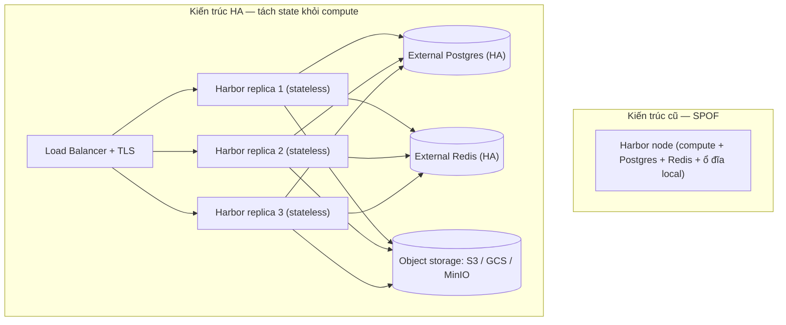
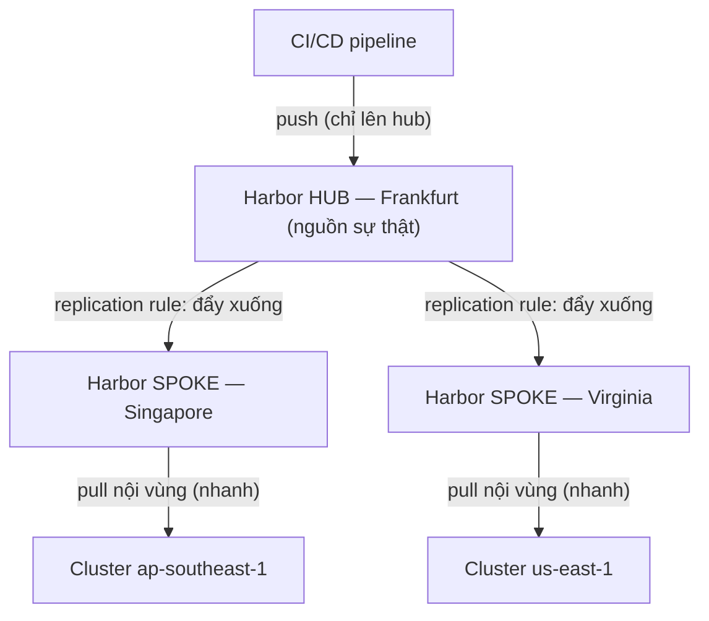
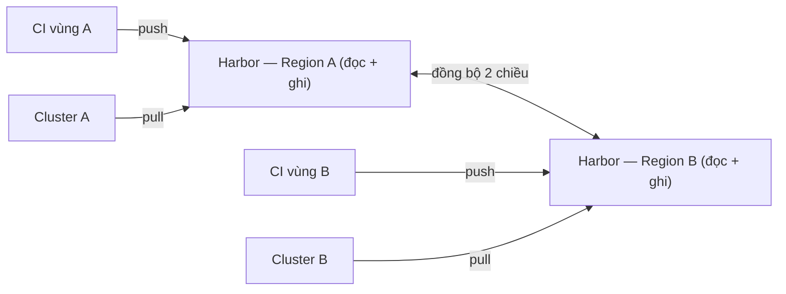

# HA, Replication & Disaster Recovery cho Registry

> **Tác giả:** Mr.Rom\
> **Phiên bản:** v1.0.0\
> **Tạo lúc:** 13/06/2026\
> **Cập nhật:** 13/06/2026\
> **Level:** Intermediate\
> **Tags:** container-registry, high-availability, replication, disaster-recovery, harbor, s3, geo-replication, pull-through-cache\
> **Yêu cầu trước:** [Harbor Deep Dive](01_harbor-deep-dive.md)

> 🎯 *Bài trước bạn đã dựng được một Harbor đầy đủ tính năng cho Acme Shop: project, RBAC, scan Trivy, replication cơ bản. Nhưng nó vẫn là **một** Harbor chạy trên **một** máy, lưu image vào **ổ đĩa local** — máy đó chết là cả công ty không deploy được. Bài này biến registry thành hạ tầng production thật: tách storage ra object storage (S3/GCS/MinIO), đưa Postgres + Redis ra ngoài, chạy nhiều replica sau load balancer, sao chép image đa vùng (geo-replication), dựng pull-through cache để khỏi đụng rate limit Docker Hub, rồi lên kế hoạch backup + disaster recovery với RPO/RTO rõ ràng. Cuối bài là hands-on cấu hình Harbor dùng S3 backend + một replica read-only.*

## 🎯 Sau bài này bạn sẽ

- [ ] Giải thích vì sao registry "một node, lưu local disk" là điểm chết đơn (SPOF) và liệt kê 3 thành phần stateful phải tách ra để HA được
- [ ] Cấu hình Harbor dùng object storage (S3/GCS/MinIO) thay ổ đĩa local làm storage backend, với external Postgres + Redis
- [ ] Phân biệt 2 pattern geo-replication: hub-and-spoke (central → region pull/push) và active-active, chọn đúng cho ngữ cảnh
- [ ] Dựng pull-through cache mirror để giảm egress + né rate limit Docker Hub, tăng tốc pull nội bộ cluster
- [ ] Lập kế hoạch backup (DB + storage) và disaster recovery, tính được RPO/RTO của registry
- [ ] So sánh self-host HA (Harbor) với managed (ECR / Artifact Registry) về công sức vận hành HA
- [ ] Hands-on: cấu hình Harbor S3 backend + một replica read-only sau load balancer

---

## Tình huống — Một sáng Thứ Hai, registry của Acme "chết" và cả công ty đứng hình

Acme Shop chạy Harbor theo đúng bài trước: một VM duy nhất, image lưu vào ổ đĩa `/data` của chính VM đó, Postgres và Redis cũng chạy chung trong stack `docker-compose` của Harbor. Suốt nửa năm mọi thứ êm ru.

Rồi một sáng Thứ Hai, ba chuyện ập đến gần như cùng lúc:

- **VM Harbor bị reboot để vá kernel.** Trong 8 phút máy khởi động lại, **mọi** `docker pull` từ K8s đều fail. Cluster vừa scale lên do traffic sáng đầu tuần, Pod mới kẹt `ImagePullBackOff`, deploy hotfix bị chặn. Registry là **điểm chết đơn** (*single point of failure* — SPOF): nó sập thì cả pipeline build lẫn cả cluster đều liệt.
- **Ổ đĩa `/data` báo đầy 95%.** Image tích lại nửa năm, ổ local của VM sắp hết chỗ. Mở rộng ổ local nghĩa là phải dừng Harbor, resize disk, fsck — lại downtime.
- **Một region mới ở Singapore pull cực chậm.** Acme vừa mở cluster ở `ap-southeast-1`, nhưng Harbor đặt ở `eu-central-1` (Frankfurt). Mỗi lần Pod ở Singapore pull image phải kéo qua nửa vòng Trái Đất — chậm và **tốn phí egress** xuyên vùng.

Cả ba vấn đề quy về một gốc: registry của Acme là một **khối stateful đơn lẻ** — state (image + metadata) dính chặt vào một máy, một ổ đĩa, một vùng. Lời giải không phải "mua máy to hơn", mà là **tách state ra khỏi compute** rồi nhân bản phần compute. Đó là toàn bộ câu chuyện HA, replication và DR của bài này.

---

## 1️⃣ Vì sao registry "một node, lưu local" không thể HA?

Trước khi sửa, phải hiểu vì sao kiến trúc cũ không thể chỉ "chạy thêm một bản nữa cho chắc". Vấn đề nằm ở chỗ registry là **dịch vụ stateful** — nó giữ dữ liệu, không phải dịch vụ stateless chỉ xử lý request rồi quên.

Một Harbor (hoặc registry bất kỳ) thực ra gồm hai loại thành phần trộn lẫn:

- **Compute (stateless)** — phần xử lý request: nhận `docker push`, trả `docker pull`, gọi API, chạy UI. Phần này **bản chất là stateless** — nhân ra 5 bản chạy song song vẫn đúng, miễn cả 5 cùng nhìn vào một nguồn dữ liệu.
- **State (stateful)** — ba thứ giữ dữ liệu thật: **layer blob** (nội dung image, file nhị phân nặng), **metadata** (project, tag, RBAC, quan hệ image↔tag — lưu trong Postgres), và **cache/lock/job queue** (lưu trong Redis).

🪞 **Ẩn dụ**: *Registry "một node lưu local" giống một **nhà hàng chỉ có một đầu bếp, và công thức + nguyên liệu khoá trong tủ riêng của ông ta**. Đầu bếp nghỉ ốm (node sập) là quán đóng cửa — không ai khác mở tủ được. Muốn quán mở 24/7 với nhiều đầu bếp, bạn phải làm hai việc: chuyển **nguyên liệu ra kho chung** (object storage) ai cũng lấy được, và **dán công thức lên bảng chung** (database ngoài) ai cũng đọc được. Lúc đó thuê 5 đầu bếp (5 replica) chỉ là việc nhỏ.*

Đây là điểm mấu chốt của toàn bài: **không thể HA phần compute chừng nào state còn dính vào từng node**. Nếu mỗi replica lưu image vào ổ local của riêng nó, replica A có image mà replica B không có → load balancer route nhầm là `404`. Phải tách 3 thứ state ra ngoài trước, rồi compute mới nhân bản được.

> 💡 Hiểu nguyên tắc "tách state khỏi compute" rồi, ta xem nó được vẽ ra như nào — sơ đồ dưới đối chiếu kiến trúc cũ (SPOF) với kiến trúc HA.

### Sơ đồ — từ "một node" sang HA "tách state khỏi compute"

Sơ đồ dưới đặt cạnh nhau hai kiến trúc: bên trái là Harbor đơn node (mọi thứ trong một hộp), bên phải là Harbor HA với compute nhân bản sau load balancer và ba thành phần state đẩy ra ngoài để mọi replica dùng chung.



Điểm cốt lõi nhìn từ sơ đồ: bên phải, **không replica nào giữ state riêng** — cả ba cùng đọc/ghi một Postgres, một Redis, một bucket object storage. Một replica chết, load balancer chỉ việc bỏ nó ra khỏi danh sách; hai replica còn lại phục vụ tiếp, không mất dữ liệu vì dữ liệu không nằm trong replica vừa chết.

---

## 2️⃣ Tách storage backend ra object storage

Việc đầu tiên và quan trọng nhất: chuyển nơi lưu **layer blob** từ ổ đĩa local sang **object storage** (S3 trên AWS, GCS trên Google, hoặc MinIO tự host). Đây là điều kiện cần để compute nhân bản được.

Vì sao object storage chứ không phải "ổ mạng chia sẻ" (NFS)? Vì registry (cả Docker Registry lẫn Harbor đều dựa trên `distribution/distribution`) có sẵn **storage driver** cho S3-compatible API, được thiết kế đúng cho mô hình blob bất biến: ghi một lần, đọc nhiều lần, không sửa tại chỗ. NFS chạy được nhưng hay vướng vấn đề về locking và hiệu năng metadata khi nhiều replica ghi song song.

🪞 **Ẩn dụ tiếp nối**: *Nếu ổ đĩa local là "tủ riêng của đầu bếp", object storage là **kho trung tâm có băng chuyền** — dung lượng gần như vô hạn, có nhân bản dữ liệu sẵn bên trong (S3 lưu nhiều bản), và ai (replica nào) cũng gọi lấy hàng được qua một địa chỉ chung.*

Ba lợi ích chính khi dùng object storage làm backend, đặt cạnh nhau để thấy vì sao gần như mọi production registry đều dùng nó:

| Tiêu chí | Ổ đĩa local | Object storage (S3/GCS/MinIO) |
|---|---|---|
| **HA compute** | ❌ Không — mỗi node một ổ riêng | ✅ Mọi replica dùng chung một bucket |
| **Độ bền dữ liệu** | Phụ thuộc 1 ổ đĩa | Rất cao — provider tự nhân nhiều bản (vd S3 ~11 số 9 durability) |
| **Mở rộng dung lượng** | Phải resize ổ, có downtime | Tự co giãn, không cần can thiệp |
| **Chi phí** | Trả cho ổ block (đắt/GB) | Rẻ/GB, nhưng tính phí request + egress |

> 💡 Đánh đổi cần nhớ: object storage rẻ cho lưu trữ nhưng **tính phí theo request và egress**. Pull một image lớn = nhiều GET request + băng thông ra. Đó chính là lý do mục pull-through cache (mục 4) quan trọng — nó cắt bớt số lần phải gọi ra object storage/registry ngoài.

### Cấu hình Harbor dùng S3 backend (qua Helm values)

Cách production chuẩn để chạy Harbor HA là deploy bằng **Helm chart trên Kubernetes** (chart `harbor/harbor`), trong đó khai báo storage backend qua `persistence.imageChartStorage`. Đoạn `values.yaml` dưới đây trỏ Harbor vào một bucket S3 — đây là **phần cốt lõi** quyết định "image lưu ở đâu":

```yaml
# values.yaml — phần storage backend cho Harbor HA
persistence:
  enabled: true
  imageChartStorage:
    # Tắt lưu local (filesystem), chuyển sang S3
    type: s3
    s3:
      region: ap-southeast-1
      bucket: acme-harbor-registry        # bucket S3 đã tạo trước
      # Không nhúng access key ở đây nếu chạy trên EKS:
      # dùng IRSA (IAM role cho ServiceAccount) để Harbor tự lấy quyền.
      # Khi buộc dùng key tĩnh (MinIO/on-prem) thì điền:
      # accesskey: <ACCESS_KEY>
      # secretkey: <SECRET_KEY>
      encrypt: false
      secure: true                          # bắt buộc HTTPS tới S3 endpoint
```

Sau khi đổi sang S3, **toàn bộ layer image của mọi project** đi vào bucket `acme-harbor-registry` thay vì ổ local. Mọi Harbor replica chỉ cần đọc/ghi cùng bucket này là thấy cùng một tập image. Lưu ý: cấu hình `s3.region` đặt **cùng vùng với cluster** để pull đi qua mạng nội bộ AWS (nhanh + miễn/giảm phí egress).

> [!IMPORTANT]
> Storage backend là thứ **không thể đổi nóng** sau khi đã có image. Nếu Harbor đang chạy local rồi muốn chuyển sang S3, bạn phải **migrate dữ liệu trước** (sync ổ local lên bucket bằng `aws s3 sync`/`mc mirror`), rồi mới đổi config và restart. Đổi config trỏ sang bucket rỗng = Harbor "mất" toàn bộ image cũ (chúng vẫn ở ổ local nhưng Harbor không nhìn vào đó nữa).

### Dùng MinIO khi tự host (không có AWS)

Nếu Acme chạy on-premise, không có S3 của AWS, thì **MinIO** là object storage S3-compatible chạy được trên hạ tầng riêng. Harbor trỏ vào MinIO y hệt S3, chỉ cần thêm `regionendpoint`:

```yaml
persistence:
  imageChartStorage:
    type: s3
    s3:
      region: us-east-1                     # MinIO không cần region thật, để giá trị bất kỳ
      regionendpoint: https://minio.acme.internal:9000
      bucket: harbor-registry
      accesskey: harbor-svc
      secretkey: <SECRET_KEY>
      secure: true
      v4auth: true                          # MinIO dùng signature v4
```

→ MinIO bản thân cũng chạy được ở chế độ phân tán (*distributed mode*) trên nhiều node với erasure coding — tức bạn HA luôn cả tầng object storage, không phụ thuộc cloud provider.

---

## 3️⃣ External Postgres + Redis và chạy nhiều replica

Tách blob ra S3 mới giải quyết một phần. Còn hai mảnh state nữa: **metadata trong Postgres** và **cache/lock/queue trong Redis**. Mặc định Harbor bundle sẵn một Postgres và một Redis chạy trong chart — nhưng đó cũng là SPOF. Để HA, ta trỏ Harbor vào **Postgres ngoài** và **Redis ngoài**, cả hai tự nó đã HA.

Khai báo trong `values.yaml`: tắt phần internal, trỏ sang dịch vụ ngoài:

```yaml
# Tắt Postgres bundle, dùng Postgres ngoài (vd RDS / Cloud SQL / Postgres HA tự dựng)
database:
  type: external
  external:
    host: acme-pg.internal
    port: "5432"
    username: harbor
    coreDatabase: registry
    sslmode: require

# Tắt Redis bundle, dùng Redis ngoài (vd ElastiCache / Redis Sentinel/Cluster)
redis:
  type: external
  external:
    addr: acme-redis.internal:6379
    # Với Redis Sentinel thì khai sentinelMasterSet + addr là danh sách sentinel
```

Sau khi blob, metadata và cache đều ra ngoài, phần compute của Harbor trở thành **stateless thật sự** — giờ chỉ việc tăng số replica. Trong chart Harbor, mỗi thành phần (core, portal, registry, jobservice) đặt `replicas` riêng:

```yaml
core:
  replicas: 2
portal:
  replicas: 2
registry:
  replicas: 2
jobservice:
  replicas: 2
```

> [!NOTE]
> `jobservice` (chạy scan, replication, GC) cũng nhân được nhiều replica vì nó lấy việc từ **hàng đợi trong Redis** — nhiều worker cùng rút việc từ một queue, không dẫm chân nhau. Đây là lý do Redis ngoài phải HA: nó là nơi điều phối job của cả cluster.

Phía trước cụm replica là **load balancer** (Ingress trên K8s, hoặc ALB/NLB) phân phối request và làm health check — node nào không khoẻ thì bị loại khỏi vòng. Mục TLS và LB chi tiết ở mục 6.

### Một lưu ý về GC khi nhiều replica + S3

Khi chạy *garbage collection* (dọn layer rác) ở chế độ HA, Harbor đặt registry vào **read-only tạm thời** trong lúc GC để tránh xoá nhầm layer đang được tham chiếu bởi một push đang diễn ra. Đây là hành vi đúng đắn — đừng vô hiệu hoá nó. Hệ quả: lên lịch GC vào giờ thấp điểm, vì lúc đó push tạm bị chặn.

---

## 4️⃣ Geo-replication — registry ở mỗi region

Quay lại vấn đề thứ ba của Acme: cluster ở Singapore pull image từ Harbor ở Frankfurt vừa chậm vừa tốn egress xuyên vùng. Lời giải là **đặt một registry ở mỗi region** rồi đồng bộ image giữa chúng — gọi là *geo-replication*. Có hai pattern chính.

🪞 **Ẩn dụ**: *Geo-replication giống chuỗi cửa hàng tiện lợi. Thay vì cả nước đặt hàng từ **một kho tổng** ở Hà Nội (chậm với người ở Cần Thơ), chuỗi đặt **một kho nhỏ ở mỗi tỉnh** — hàng mới về kho tổng rồi tự chuyển xuống các kho tỉnh; khách ở Cần Thơ lấy hàng từ kho Cần Thơ, nhanh và không tốn cước vận chuyển đường dài.*

### Pattern A — Hub-and-spoke (trung tâm đẩy/kéo về vùng)

Trong pattern này có một registry **trung tâm** (hub) là nguồn sự thật: CI chỉ push lên hub. Mỗi region có một registry **vệ tinh** (spoke) tự **pull** image từ hub về (hoặc hub **push** xuống) theo replication rule của Harbor. Cluster mỗi vùng chỉ pull từ spoke của vùng mình.



→ Ưu điểm: **một nguồn sự thật duy nhất** — push chỉ một chỗ, dễ kiểm soát quyền và audit. Nhược: nếu hub sập thì không push mới được (nhưng các spoke vẫn pull bình thường, deploy không gián đoạn). Đây là pattern phổ biến nhất và là cái Harbor hỗ trợ trực tiếp qua *replication policy*.

Cấu hình ở Harbor: tạo một **Registry endpoint** trỏ tới spoke, rồi một **Replication rule** mode `Push-based`, lọc theo `shop/**`, trigger `event-based` (push lên hub là tự đẩy ngay) hoặc `scheduled`. Bài [Harbor Deep Dive](01_harbor-deep-dive.md) đã giới thiệu replication cơ bản; ở đây ta dùng nó cho mục đích đa vùng.

### Pattern B — Active-active (đa hub, push đi đâu cũng được)

Trong active-active, **mọi region đều là hub** — CI ở vùng nào push lên registry vùng đó, rồi các registry **đồng bộ hai chiều** cho nhau. Không có "trung tâm" duy nhất.



→ Ưu điểm: **không có SPOF cho cả push lẫn pull** — vùng nào cũng tự chủ hoàn toàn. Nhược: phức tạp hơn nhiều — phải xử lý **xung đột tag** (hai vùng cùng push đè một tag với nội dung khác nhau thì lấy bản nào?), và độ trễ đồng bộ làm hai vùng có thể "lệch pha" trong giây lát. Active-active chỉ đáng làm khi từng vùng thật sự cần ghi độc lập (vd compliance buộc data ở lại vùng).

So sánh nhanh hai pattern để chọn:

| Tiêu chí | Hub-and-spoke | Active-active |
|---|---|---|
| **Nguồn sự thật** | Một (hub) | Nhiều |
| **Push** | Chỉ lên hub | Vùng nào cũng push được |
| **Pull** | Từ spoke nội vùng | Từ registry nội vùng |
| **Xung đột tag** | Không (chỉ một nơi ghi) | Phải xử lý |
| **Độ phức tạp** | Thấp | Cao |
| **Khi chọn** | Phần lớn trường hợp đa vùng | Vùng cần tự chủ ghi, compliance data-locality |

> [!TIP]
> Nguyên tắc chọn đơn giản: bắt đầu bằng **hub-and-spoke**. Nó cho 90% lợi ích (pull nhanh nội vùng, giảm egress) với một phần nhỏ độ phức tạp. Chỉ chuyển sang active-active khi có lý do nghiệp vụ rõ ràng buộc mỗi vùng phải ghi độc lập.

---

## 5️⃣ Pull-through cache mirror ở scale

Geo-replication lo cho image **của chính Acme**. Còn image **của bên thứ ba** mà mọi service đều cần — `node:20`, `python:3.12`, `nginx`, `postgres` — thì sao? Mỗi cluster, mỗi lần build, mỗi node mới lại pull các base image này từ Docker Hub. Hệ quả: đụng **rate limit** Docker Hub (đã gặp ở bài Private Registries), tốn egress, và pull chậm khi mạng ra ngoài kẹt.

Lời giải là **pull-through cache** (còn gọi *registry mirror* hoặc *proxy cache*): dựng một registry đứng giữa cluster và Docker Hub, lần đầu có ai pull `node:20` thì nó kéo từ Docker Hub về **cache lại**; mọi lần pull sau lấy từ cache nội bộ, không ra ngoài nữa.

🪞 **Ẩn dụ**: *Pull-through cache giống **máy lọc nước có bình chứa** ở văn phòng. Lần đầu cần nước, máy lấy từ nguồn ngoài (Docker Hub) và trữ vào bình; những lần sau cả văn phòng rót từ bình — nhanh, không phải chạy ra ngoài mua, và không bị tiệm nước giới hạn "mỗi ngày chỉ bán 100 chai" (rate limit).*

Pull-through cache giải quyết đồng thời ba việc:

- **Né rate limit** — cluster chỉ pull `node:20` từ Docker Hub **một lần** (lúc cache miss), sau đó dùng bản cache. Hàng trăm node pull cùng image chỉ tốn đúng một lần ra ngoài.
- **Giảm egress + tăng tốc** — pull từ cache nội bộ trong cùng VPC/cluster nhanh hơn nhiều so với kéo từ internet, và không tốn băng thông ra ngoài.
- **Chống "Docker Hub sập"** — nếu Docker Hub gặp sự cố, image đã cache vẫn pull được.

### Cách 1 — Harbor làm proxy cache project

Harbor hỗ trợ sẵn: tạo một **proxy cache project** trỏ tới một registry nguồn (Docker Hub, GHCR...). Cấu hình gồm hai bước (làm trên UI hoặc API): tạo *Registry endpoint* trỏ tới Docker Hub, rồi tạo *Project* với option **Proxy Cache** bật và trỏ vào endpoint đó.

Sau khi có proxy project tên `dockerhub-proxy`, người dùng đổi cách tham chiếu image base: thay vì `node:20`, pull qua Harbor:

```bash
# Thay vì pull thẳng node:20 từ Docker Hub (đụng rate limit):
# docker pull node:20

# Pull qua proxy cache project của Harbor — lần đầu Harbor kéo về & cache,
# lần sau lấy từ cache nội bộ
docker pull harbor.acme.internal/dockerhub-proxy/library/node:20
```

→ `library/` là namespace mặc định của các official image trên Docker Hub (vd `node` thật ra là `library/node`). Trong Dockerfile và K8s manifest của Acme, thay base image sang đường dẫn proxy này là cả tổ chức tự động đi qua cache.

### Cách 2 — containerd registry mirror (mức cluster K8s)

Cách "trong suốt" hơn: cấu hình **containerd** (runtime của K8s) để mọi pull `docker.io/...` tự động đi qua mirror — không phải sửa tên image trong manifest. Cấu hình qua file hosts của containerd:

```toml
# /etc/containerd/certs.d/docker.io/hosts.toml trên mỗi node K8s
server = "https://docker.io"

[host."https://harbor.acme.internal/v2/dockerhub-proxy"]
  capabilities = ["pull", "resolve"]
  override_path = true
```

→ Với cấu hình này, mỗi khi K8s pull `docker.io/library/node:20`, containerd tự hỏi mirror `harbor.acme.internal` trước. Manifest vẫn ghi `node:20` như thường — mirror hoạt động ngầm. Đây là cách scale tốt nhất cho cluster lớn: không động vào manifest, chỉ cấu hình node.

> [!WARNING]
> Pull-through cache chỉ **cache**, không phải nguồn sự thật. Đừng push image *của Acme* vào proxy project — nó chỉ để mirror image bên thứ ba. Image proprietary của bạn vẫn đi vào project thường (có RBAC, scan, retention). Trộn hai thứ vào một project sẽ làm rối retention và quyền truy cập.

---

## 6️⃣ Registry sau CDN / Load Balancer + TLS

Khi đã có nhiều replica, cần một lớp trước chúng để client chỉ thấy **một địa chỉ duy nhất** (`harbor.acme.internal`) và để TLS được kết thúc đúng chỗ. Đây là vai trò của load balancer (và đôi khi CDN cho phần read-heavy).

Ba điểm phải làm đúng ở lớp này:

- **TLS bắt buộc.** Registry **phải** chạy HTTPS — Docker từ chối push/pull qua HTTP trừ khi bạn liệt vào `insecure-registries` (không bao giờ làm ở production). Chứng chỉ đặt ở LB/Ingress (TLS termination) hoặc end-to-end tới từng replica.
- **Health check đúng endpoint.** LB phải health-check `/api/v2.0/health` (hoặc `/v2/` cho registry thuần) để chỉ route tới replica thật sự khoẻ. Health check sai = LB route vào replica đang khởi động → client nhận lỗi.
- **Hiểu giới hạn của CDN.** CDN (CloudFront, Cloudflare) **cache tốt phần pull** (blob là bất biến, theo digest — cache cực hiệu quả) nhưng **không cache phần push/API** (ghi, auth). Thường người ta đặt CDN trước blob storage để tăng tốc pull toàn cầu, còn API/push vẫn đi thẳng tới registry. Với object storage như S3, một cách phổ biến là cho registry trả về **redirect** tới URL S3 (presigned) và để CDN/S3 lo phần truyền blob.

> [!NOTE]
> Nhiều registry (gồm Harbor) hỗ trợ cấu hình `redirect` storage driver: thay vì registry tự stream blob về client, nó trả về một URL tạm tới object storage để client tải thẳng. Cách này giảm tải cực mạnh cho compute của registry — replica không phải làm "đường ống" cho từng byte image.

Một sơ đồ tinh thần về thứ tự các lớp khi client pull: **Client → (CDN nếu có, cho blob) → Load Balancer + TLS → Harbor replica → Object storage**. Mỗi lớp có một việc: CDN tăng tốc đọc toàn cầu, LB phân tải + TLS, replica xử lý logic + auth, object storage giữ blob.

---

## 7️⃣ Backup + Disaster Recovery — RPO/RTO

HA lo cho chuyện **một thành phần chết** (node, replica). Nhưng còn thảm hoạ thật: **cả vùng cháy data center**, **ai đó xoá nhầm bucket**, **DB hỏng do bug**. Lúc đó HA không cứu được — cần **disaster recovery** (DR): khôi phục từ bản sao lưu.

Để DR có mục tiêu rõ ràng, dùng hai chỉ số chuẩn:

- **RPO** (*Recovery Point Objective*) — chấp nhận **mất tối đa bao nhiêu dữ liệu** (tính theo thời gian). RPO = 1 giờ nghĩa là khi thảm hoạ xảy ra, được phép mất tối đa dữ liệu của 1 giờ gần nhất → phải backup ít nhất mỗi giờ.
- **RTO** (*Recovery Time Objective*) — chấp nhận **mất tối đa bao lâu để khôi phục xong** và chạy lại. RTO = 2 giờ nghĩa là từ lúc sập tới lúc registry hoạt động lại không được quá 2 giờ.

🪞 **Ẩn dụ**: *RPO là "**mình chịu mất bao nhiêu trang nhật ký gần nhất**" — ghi nhật ký mỗi giờ thì mất tối đa một giờ. RTO là "**mình cần bao lâu để dọn dẹp và mở cửa lại sau hoả hoạn**". Hai con số này quyết định bạn phải sao lưu dày tới đâu và chuẩn bị quy trình khôi phục nhanh tới đâu.*

### Backup registry cần sao lưu hai thứ — và phải nhất quán

Registry có hai khối state phải backup **khớp thời điểm với nhau**: database (metadata) và storage (blob). Nếu DB nói "có tag v1.4.0" nhưng blob của v1.4.0 chưa kịp backup, sau khi restore tag đó sẽ trỏ vào hư không.

| Thứ cần backup | Nội dung | Cách backup |
|---|---|---|
| **Database (Postgres)** | Metadata: project, tag↔image, RBAC, robot account | `pg_dump` định kỳ, hoặc snapshot của RDS/Cloud SQL |
| **Storage (object storage)** | Layer blob — phần nặng nhất | Bật **versioning** + **cross-region replication** của bucket, hoặc `aws s3 sync` sang bucket backup |
| **Cấu hình** | `values.yaml`, secret, cert | Lưu trong Git (IaC) — không backup riêng |

Quy trình backup nhất quán cho Harbor (theo thứ tự để metadata không "vượt trước" blob):

```bash
# 1. Backup database trước (metadata là cái dễ "vượt trước" blob)
pg_dump -h acme-pg.internal -U harbor -d registry -Fc \
  -f /backup/harbor-db-$(date +%F-%H%M).dump

# 2. Đồng bộ blob từ bucket gốc sang bucket backup (khác vùng)
aws s3 sync s3://acme-harbor-registry s3://acme-harbor-backup \
  --region ap-southeast-1

# 3. Lưu cấu hình (values.yaml, secrets) — thường đã ở trong Git repo IaC
```

> [!CAUTION]
> Backup mà **không bao giờ thử restore** thì coi như không có backup. Phải định kỳ dựng một Harbor mới từ bản backup (restore DB dump + trỏ vào bucket backup) và kiểm tra pull được image — đây là cách duy nhất biết RTO thực tế của bạn. Rất nhiều tổ chức phát hiện backup hỏng đúng vào lúc cần nó nhất.

### Ghép RPO/RTO thành kế hoạch DR cho Acme

Với Acme, một kế hoạch DR hợp lý cho registry:

- **RPO ~1 giờ**: `pg_dump` mỗi giờ; bucket S3 bật versioning + cross-region replication (gần như liên tục) → mất tối đa ~1 giờ metadata.
- **RTO ~30 phút**: hạ tầng mô tả bằng IaC (Helm values trong Git), nên dựng lại Harbor ở vùng dự phòng là chạy lại chart + restore DB dump + trỏ vào bucket replica. Vì blob đã có sẵn ở bucket backup (không phải copy lại từ đầu), RTO chủ yếu là thời gian restore DB + deploy chart.

→ Điểm mấu chốt: **RPO/RTO càng nhỏ thì càng tốn tiền** (backup dày hơn, hạ tầng dự phòng nóng hơn). Đừng chọn "RPO 0, RTO 0" cho mọi thứ — chọn theo mức độ quan trọng. Registry production của Acme đáng RPO/RTO thấp; registry cho môi trường dev thì lỏng hơn được.

---

## 8️⃣ Self-host HA vs Managed — ai lo HA?

Tất cả công sức ở trên (tách S3, external Postgres/Redis, nhiều replica, LB, backup, DR) là cái giá của **tự host HA**. Câu hỏi tỉnh táo: có đáng tự làm không, hay để registry managed lo?

Điểm khác biệt cốt lõi: **với managed registry (ECR, Artifact Registry, ACR), HA và DR là việc của nhà cung cấp** — bạn không thấy "node", "replica", "Postgres", "object storage" gì cả; bạn chỉ push/pull và provider tự lo nhân bản, độ bền, đa-AZ.

🪞 **Ẩn dụ tiếp nối**: *Self-host HA là **tự xây và vận hành một toà nhà có máy phát điện dự phòng, hệ thống chữa cháy, đội bảo trì 24/7**. Managed là **thuê văn phòng trong toà nhà của người khác** — họ lo máy phát, chữa cháy, bảo trì; bạn chỉ trả tiền thuê và dùng.*

Đặt cạnh nhau để quyết định:

| Tiêu chí | Self-host Harbor HA | Managed (ECR / Artifact Registry / ACR) |
|---|---|---|
| **Ai lo HA/đa-AZ** | Bạn (tách state, replica, LB) | Nhà cung cấp — tự động, ẩn hoàn toàn |
| **Ai lo backup/DR storage** | Bạn (versioning, cross-region, test restore) | Nhà cung cấp (durability cao sẵn); cross-region replication bật bằng config |
| **Đa vùng** | Tự cấu hình replication rule | Bật cross-region replication trong console |
| **Công sức vận hành** | Cao — cần đội hạ tầng | Thấp — chủ yếu là cấu hình |
| **Toàn quyền / on-prem** | ✅ Có | ❌ Khoá vào cloud của provider |
| **Tính năng đồng nhất đa-cloud** | ✅ Một Harbor cho mọi nơi | ❌ Mỗi cloud một registry khác nhau |
| **Khi chọn** | On-prem, compliance, hybrid-cloud, cần toàn quyền | Đã ở một cloud, muốn ít việc vận hành nhất |

> ⚠️ Nguyên tắc thực dụng: nếu Acme chạy gọn trên **một cloud** (vd toàn AWS với EKS), **ECR tự HA** thường là lựa chọn ít rủi ro nhất — không có node nào để bạn phải canh. Tự host Harbor HA chỉ thật sự đáng khi có lý do cứng: bắt buộc on-prem (data sovereignty), môi trường hybrid nhiều cloud cần một registry đồng nhất, hoặc cần các tính năng quản trị của Harbor mà managed không có.

---

## 9️⃣ Hands-on — Harbor S3 backend + một replica read-only

Giờ ghép các mảnh thành một cấu hình thật: deploy Harbor HA dùng S3, external Postgres/Redis, rồi tạo một **replica read-only** ở một vùng khác để chịu tải pull. Phần này giả định bạn có cluster K8s, một bucket S3 `acme-harbor-registry`, một Postgres ngoài và một Redis ngoài.

### 🛠️ Bước 1: Chuẩn bị `values.yaml` cho Harbor HA dùng S3

Gộp các phần ở mục 2-3-6 thành một file values hoàn chỉnh. Đây là phần khai báo "image lưu S3, DB/Redis ngoài, compute nhân 2 replica, TLS qua Ingress":

```yaml
# values-harbor-ha.yaml
expose:
  type: ingress
  tls:
    enabled: true                  # TLS bắt buộc cho registry
  ingress:
    hosts:
      core: harbor.acme.internal

externalURL: https://harbor.acme.internal

# 1. Storage backend: S3 (mọi replica dùng chung)
persistence:
  enabled: true
  imageChartStorage:
    type: s3
    s3:
      region: ap-southeast-1
      bucket: acme-harbor-registry
      secure: true

# 2. Database + Redis ngoài (tự HA)
database:
  type: external
  external:
    host: acme-pg.internal
    port: "5432"
    username: harbor
    coreDatabase: registry
    sslmode: require
redis:
  type: external
  external:
    addr: acme-redis.internal:6379

# 3. Nhân replica cho phần compute (stateless)
core:
  replicas: 2
registry:
  replicas: 2
jobservice:
  replicas: 2
portal:
  replicas: 2
```

Deploy bằng Helm:

```bash
# Thêm repo chart Harbor & cài đặt
helm repo add harbor https://helm.goharbor.io
helm repo update
helm install harbor harbor/harbor \
  -f values-harbor-ha.yaml \
  --namespace harbor --create-namespace
```

Kết quả mong đợi (rút gọn):

```
NAME: harbor
LAST DEPLOYED: ...
NAMESPACE: harbor
STATUS: deployed
```

Kiểm tra các Pod đã lên đủ replica:

```bash
kubectl get pods -n harbor
```

Kết quả mong đợi (rút gọn):

```
NAME                              READY   STATUS    RESTARTS   AGE
harbor-core-7d9f8c6b5-abcde       1/1     Running   0          2m
harbor-core-7d9f8c6b5-fghij       1/1     Running   0          2m
harbor-registry-5c7b9d8f6-klmno   1/1     Running   0          2m
harbor-registry-5c7b9d8f6-pqrst   1/1     Running   0          2m
harbor-jobservice-...             1/1     Running   0          2m
```

Thấy **hai** Pod `harbor-core` và **hai** Pod `harbor-registry` cùng `Running` xác nhận compute đã nhân bản. Vì cả hai cùng trỏ vào một bucket S3 và một Postgres, load balancer (Ingress) route vào Pod nào cũng trả cùng một tập image — đó là HA.

### 🛠️ Bước 2: Đẩy một image lên để có dữ liệu

Đăng nhập Harbor HA và push một image vào project `shop` (tạo project trước trên UI). Image này sẽ là thứ ta replicate sang replica read-only:

```bash
docker login harbor.acme.internal
docker tag acme/shop-api:1.0.0 harbor.acme.internal/shop/shop-api:1.0.0
docker push harbor.acme.internal/shop/shop-api:1.0.0
```

Kết quả mong đợi (rút gọn):

```
The push refers to repository [harbor.acme.internal/shop/shop-api]
1.0.0: digest: sha256:9c3b... size: 1789
```

→ Layer blob giờ nằm trong bucket S3, metadata trong Postgres ngoài. Kiểm tra nhanh bucket để chắc chắn blob đã vào đúng object storage:

```bash
aws s3 ls s3://acme-harbor-registry/docker/registry/v2/ --recursive | head
```

Thấy đường dẫn dạng `docker/registry/v2/blobs/sha256/...` xác nhận Harbor đang ghi blob vào S3 chứ không phải ổ local.

### 🛠️ Bước 3: Dựng một Harbor thứ hai làm replica read-only

Ở vùng/cluster thứ hai, deploy một Harbor nữa (cùng values nhưng bucket + DB riêng của vùng đó) — gọi là `harbor-replica.acme.internal`. Replica này sẽ **nhận** image từ Harbor chính qua replication rule. Sau khi nhận xong, ta đặt nó **read-only** để nó chỉ phục vụ pull, không cho ai push lên (đảm bảo nó luôn là bản sao trung thực của hub).

Đặt một Harbor sang chế độ read-only qua API quản trị (cần tài khoản admin):

```bash
# Đặt Harbor replica sang chế độ read-only (chặn push, vẫn cho pull)
curl -X PUT "https://harbor-replica.acme.internal/api/v2.0/configurations" \
  -u "admin:${HARBOR_ADMIN_PASSWORD}" \
  -H "Content-Type: application/json" \
  -d '{"read_only": true}'
```

Kết quả: API trả mã `200` (không có body). Xác nhận trạng thái read-only đã bật:

```bash
curl -s "https://harbor-replica.acme.internal/api/v2.0/configurations" \
  -u "admin:${HARBOR_ADMIN_PASSWORD}" \
  | grep -o '"read_only":[^,]*'
```

Kết quả mong đợi:

```
"read_only":{"value":true,"editable":true}
```

`"value":true` xác nhận replica đang ở chế độ chỉ đọc — thử `docker push` lên nó giờ sẽ bị từ chối với lỗi `read-only mode`, còn `docker pull` vẫn chạy bình thường.

### 🛠️ Bước 4: Tạo replication rule từ hub sang replica

Trên Harbor **chính** (hub), khai báo replica là một registry đích rồi tạo rule đẩy project `shop` sang đó. Trước hết tạo *Registry endpoint* trỏ tới replica:

```bash
# Đăng ký Harbor replica như một registry đích trên hub
curl -X POST "https://harbor.acme.internal/api/v2.0/registries" \
  -u "admin:${HARBOR_ADMIN_PASSWORD}" \
  -H "Content-Type: application/json" \
  -d '{
    "name": "sg-replica",
    "type": "harbor",
    "url": "https://harbor-replica.acme.internal",
    "credential": {
      "type": "basic",
      "access_key": "admin",
      "access_secret": "'"${HARBOR_REPLICA_ADMIN_PASSWORD}"'"
    }
  }'
```

Rồi tạo replication policy đẩy mọi image trong `shop` sang replica, kích hoạt theo sự kiện push:

```bash
# Tạo rule push-based: push lên hub là tự đẩy sang replica
curl -X POST "https://harbor.acme.internal/api/v2.0/replication/policies" \
  -u "admin:${HARBOR_ADMIN_PASSWORD}" \
  -H "Content-Type: application/json" \
  -d '{
    "name": "push-shop-to-sg",
    "src_registry": null,
    "dest_registry": { "name": "sg-replica" },
    "dest_namespace": "shop",
    "filters": [ { "type": "name", "value": "shop/**" } ],
    "trigger": { "type": "event_based" },
    "enabled": true
  }'
```

> [!NOTE]
> `src_registry: null` nghĩa là **nguồn là chính Harbor hub này** (replication kiểu push từ local sang đích). `trigger.type: event_based` khiến mỗi lần có image mới push vào `shop` trên hub là Harbor tự đẩy sang replica ngay — đúng tinh thần hub-and-spoke ở mục 4.

### 🛠️ Bước 5: Kiểm chứng — pull từ replica read-only

Image đã được replicate sang replica. Giờ đứng từ phía cluster vùng kia, pull từ replica (không phải từ hub):

```bash
docker login harbor-replica.acme.internal
docker pull harbor-replica.acme.internal/shop/shop-api:1.0.0
```

Kết quả mong đợi (rút gọn):

```
1.0.0: Pulling from shop/shop-api
Digest: sha256:9c3b...
Status: Downloaded newer image for harbor-replica.acme.internal/shop/shop-api:1.0.0
```

→ Để ý `Digest: sha256:9c3b...` **giống hệt** digest khi push lên hub ở Bước 2 — replication không làm đổi nội dung, chỉ sao chép. Cluster vùng kia giờ pull từ replica nội vùng (nhanh, không tốn egress xuyên vùng), còn push vẫn tập trung ở hub. Thử push lên replica sẽ thất bại:

```bash
docker push harbor-replica.acme.internal/shop/shop-api:2.0.0
# denied: registry is in read-only mode
```

`denied: ... read-only mode` xác nhận replica chỉ phục vụ pull — đúng vai "bản sao trung thực" của hub. Vậy là Acme đã có: storage trên S3 (mọi replica dùng chung), compute HA hai replica, và một replica read-only đa vùng nhận image qua replication.

---

## 💡 Cạm bẫy thường gặp & Best practice

### ❌ Cạm bẫy: Chạy nhiều replica nhưng vẫn để storage ở local disk

- **Triệu chứng**: Tăng `replicas` lên 3, nhưng pull thỉnh thoảng `404 manifest unknown` hoặc `blob unknown`, lúc được lúc không.
- **Nguyên nhân**: Mỗi replica lưu blob vào ổ local **của riêng nó**. Image push vào replica A; load balancer route pull tới replica B (không có blob đó) → `404`. Nhân replica mà không tách storage = nhân lỗi.
- **Cách tránh**: Tách storage ra **object storage chung** (S3/GCS/MinIO) **trước**, rồi mới tăng replica. Đây là điều kiện cần của HA, không phải tuỳ chọn.

### ❌ Cạm bẫy: Tưởng HA là đã có DR

- **Triệu chứng**: "Có 3 replica đa-AZ rồi, an toàn rồi" — nhưng ai đó xoá nhầm bucket / DB hỏng do bug / cả region down, mất sạch.
- **Nguyên nhân**: HA chống **một thành phần chết**, không chống **mất dữ liệu** (xoá nhầm, hỏng logic, thảm hoạ vùng). HA và DR là hai bài toán khác nhau.
- **Cách tránh**: Vẫn phải backup DB + storage **ra ngoài** vùng chính (cross-region), bật versioning bucket (chống xoá nhầm), và **test restore định kỳ** để biết RTO thật.

### ❌ Cạm bẫy: Backup DB và storage lệch thời điểm

- **Triệu chứng**: Restore xong, Harbor báo có tag nhưng pull ra `blob unknown`; hoặc có blob mà không tag nào trỏ tới.
- **Nguyên nhân**: DB backup và storage backup chụp ở hai thời điểm khác nhau → metadata và blob "lệch pha".
- **Cách tránh**: Backup DB và sync storage **gần nhau về thời gian** (backup DB trước, sync blob ngay sau). GC nên tạm dừng trong cửa sổ backup. Với cloud, snapshot nhất quán (RDS snapshot + S3 versioning theo timestamp) giúp khớp thời điểm.

### ✅ Best practice: Đặt registry/replica cùng vùng với cluster tiêu thụ

- **Vì sao**: Pull xuyên vùng vừa chậm vừa tốn phí egress (tính tiền theo GB ra). Replica nội vùng cho pull nhanh qua mạng nội bộ và thường miễn/giảm egress.
- **Cách áp dụng**: Mỗi region có cluster thì đặt một spoke/replica registry ở region đó (geo-replication hub-and-spoke); base image bên thứ ba thì thêm pull-through cache nội vùng.

### ✅ Best practice: Để managed lo HA khi bạn ở một cloud

- **Vì sao**: HA đúng cách (tách state, replica, LB, backup, test restore) tốn công vận hành liên tục. Nếu đã gắn với một cloud, registry managed của cloud đó tự HA/đa-AZ, durability cao sẵn — gỡ gánh nặng vận hành.
- **Cách áp dụng**: Chạy EKS thì ưu tiên ECR (tự HA, bật cross-region replication bằng config); chỉ tự host Harbor HA khi có lý do cứng (on-prem/compliance/hybrid).

---

## 🧠 Tự kiểm tra (Self-check)

**Q1.** Vì sao không thể chỉ "chạy thêm vài replica Harbor" để có HA, mà phải tách storage/DB/Redis ra ngoài trước?

<details>
<summary>💡 Xem giải thích</summary>

Vì registry là dịch vụ **stateful** — nó giữ dữ liệu (blob, metadata, cache). Nếu mỗi replica lưu state vào ổ local/DB nội bộ của riêng nó, các replica sẽ **không nhìn thấy dữ liệu của nhau**: image push vào replica A thì replica B không có. Load balancer route ngẫu nhiên → pull lúc được lúc `404`.

Để HA được, phần **compute phải stateless thật sự** — mọi replica cùng đọc/ghi **một** nguồn state chung: blob ra object storage (S3/GCS/MinIO), metadata ra Postgres ngoài, cache/queue ra Redis ngoài. Lúc đó nhân replica chỉ là nhân phần xử lý, không nhân dữ liệu, nên route vào replica nào cũng trả cùng kết quả.
</details>

**Q2.** Phân biệt geo-replication hub-and-spoke với active-active. Acme có 4 vùng đều chỉ pull (CI tập trung một chỗ) nên chọn cái nào?

<details>
<summary>💡 Xem giải thích</summary>

- **Hub-and-spoke**: một registry **trung tâm** (hub) là nguồn sự thật duy nhất, CI chỉ push lên hub; mỗi vùng có một spoke nhận bản sao và chỉ phục vụ pull nội vùng. Đơn giản, một nguồn ghi, dễ kiểm soát quyền/audit, không có xung đột tag.
- **Active-active**: mọi vùng đều ghi được, đồng bộ hai chiều. Không SPOF cho cả push lẫn pull, nhưng phải xử lý **xung đột tag** và độ trễ đồng bộ — phức tạp hơn nhiều.

Acme có CI tập trung một chỗ và các vùng chỉ pull → **hub-and-spoke** là lựa chọn đúng: hub nhận push từ CI, các spoke read-only ở mỗi vùng phục vụ pull. Active-active là thừa thãi (và rủi ro) khi không vùng nào cần ghi độc lập.
</details>

**Q3.** Pull-through cache giải quyết vấn đề gì mà geo-replication không giải quyết?

<details>
<summary>💡 Xem giải thích</summary>

Geo-replication sao chép image **của chính Acme** giữa các vùng. Pull-through cache lo cho image **của bên thứ ba** (`node:20`, `python`, `nginx`, `postgres`) mà mọi build/cluster đều cần kéo từ Docker Hub.

Pull-through cache đặt một registry đứng giữa cluster và Docker Hub: lần đầu pull `node:20` thì kéo về và **cache lại**, các lần sau lấy từ cache nội bộ. Nó giải quyết:
- **Rate limit Docker Hub** — chỉ pull ra ngoài một lần cho cả tổ chức.
- **Egress + tốc độ** — pull nội bộ nhanh, không tốn băng thông ra internet.
- **Chống Docker Hub sập** — image đã cache vẫn pull được.

Geo-replication không làm được việc này vì nó chỉ đồng bộ image bạn sở hữu, không proxy image bên thứ ba.
</details>

**Q4.** RPO và RTO khác nhau thế nào? Nếu Acme đặt RPO = 1 giờ thì phải làm gì với backup?

<details>
<summary>💡 Xem giải thích</summary>

- **RPO** (Recovery Point Objective) = chấp nhận **mất tối đa bao nhiêu dữ liệu** (theo thời gian). RPO 1 giờ = được phép mất tối đa dữ liệu của 1 giờ gần nhất.
- **RTO** (Recovery Time Objective) = chấp nhận **mất tối đa bao lâu để khôi phục xong** và chạy lại.

RPO 1 giờ buộc Acme phải sao lưu **ít nhất mỗi giờ một lần**: `pg_dump` (hoặc snapshot DB) tối thiểu hằng giờ, và storage thì bật versioning + cross-region replication (gần như liên tục). Nếu chỉ backup mỗi ngày một lần thì RPO thực tế là 24 giờ — vi phạm mục tiêu 1 giờ. Lưu ý: RPO nhỏ hơn = backup dày hơn = tốn hơn, nên chọn theo mức quan trọng của registry.
</details>

**Q5.** Khi nào nên tự host Harbor HA thay vì dùng ECR/Artifact Registry (vốn đã tự HA)?

<details>
<summary>💡 Xem giải thích</summary>

Managed registry (ECR, Artifact Registry, ACR) **tự lo HA, đa-AZ, durability cao và DR storage** — bạn không thấy node/replica/DB nào. Vì thế nếu Acme đã gắn với **một cloud cụ thể**, dùng managed của cloud đó ít rủi ro vận hành nhất.

Tự host Harbor HA chỉ đáng khi có lý do **cứng**:
- **On-prem / data sovereignty**: image bắt buộc nằm trong hạ tầng riêng, không rời mạng nội bộ.
- **Hybrid / multi-cloud**: muốn **một** registry đồng nhất (cùng RBAC, scan, replication) chạy trên nhiều cloud, không phụ thuộc một provider.
- **Cần tính năng quản trị của Harbor** mà managed không có (vd proxy cache project, CVE allowlist trên UI, mô hình project/RBAC riêng).

Đổi lại, tự host nghĩa là bạn gánh toàn bộ việc tách state, nhân replica, LB, backup và test restore.
</details>

---

## ⚡ Tra cứu nhanh (Cheatsheet)

```yaml
# === Harbor S3 backend (values.yaml) ===
persistence:
  imageChartStorage:
    type: s3
    s3:
      region: ap-southeast-1
      bucket: acme-harbor-registry
      secure: true
      # MinIO/on-prem: thêm regionendpoint + accesskey/secretkey + v4auth: true

# === External Postgres + Redis ===
database:
  type: external
  external: { host: acme-pg.internal, port: "5432", username: harbor, coreDatabase: registry }
redis:
  type: external
  external: { addr: acme-redis.internal:6379 }

# === Nhân replica compute ===
core:        { replicas: 2 }
registry:    { replicas: 2 }
jobservice:  { replicas: 2 }
```

```bash
# === Deploy Harbor HA bằng Helm ===
helm repo add harbor https://helm.goharbor.io
helm install harbor harbor/harbor -f values-harbor-ha.yaml -n harbor --create-namespace
kubectl get pods -n harbor

# === Đặt Harbor replica sang read-only ===
curl -X PUT "https://harbor-replica.acme.internal/api/v2.0/configurations" \
  -u "admin:$PW" -H "Content-Type: application/json" -d '{"read_only": true}'

# === Pull-through cache: pull base image qua proxy project ===
docker pull harbor.acme.internal/dockerhub-proxy/library/node:20

# === Backup nhất quán (DB trước, blob ngay sau) ===
pg_dump -h acme-pg.internal -U harbor -d registry -Fc -f /backup/harbor-db.dump
aws s3 sync s3://acme-harbor-registry s3://acme-harbor-backup --region ap-southeast-1

# === Lấy digest để pull bất biến từ replica ===
docker pull harbor-replica.acme.internal/shop/shop-api:1.0.0
```

| Mục đích | Cấu hình / Lệnh |
|---|---|
| Storage backend HA | `persistence.imageChartStorage.type: s3` |
| DB ngoài | `database.type: external` |
| Redis ngoài | `redis.type: external` |
| Nhân replica | `core.replicas`, `registry.replicas` |
| Đặt read-only | `PUT /api/v2.0/configurations {"read_only": true}` |
| Proxy cache (base image) | Tạo project kiểu Proxy Cache trỏ Docker Hub |
| Backup DB | `pg_dump ... -Fc -f backup.dump` |
| Backup blob | `aws s3 sync <bucket> <bucket-backup>` |

---

## 📚 Từ Điển Thuật Ngữ (Glossary)

| EN | VN | Giải thích |
|---|---|---|
| HA (High Availability) | Tính sẵn sàng cao | Hệ thống chịu được một thành phần chết mà không gián đoạn dịch vụ |
| SPOF | Điểm chết đơn | Single Point of Failure — một thành phần mà nó sập là cả hệ thống liệt |
| Stateful / Stateless | Có/không giữ trạng thái | Stateful giữ dữ liệu (DB, storage); stateless chỉ xử lý rồi quên |
| Object storage | Lưu trữ đối tượng | Kho file dạng blob qua API (S3/GCS/MinIO), co giãn vô hạn, durability cao |
| S3 | (giữ nguyên) | Amazon Simple Storage Service — object storage của AWS, chuẩn API phổ biến |
| GCS | (giữ nguyên) | Google Cloud Storage — object storage của Google |
| MinIO | (giữ nguyên) | Object storage S3-compatible mã nguồn mở, tự host được |
| Storage backend | Tầng lưu trữ blob | Nơi registry lưu layer image (local disk hoặc object storage) |
| Storage driver | Trình điều khiển lưu trữ | Thành phần của registry nói chuyện với backend (filesystem, s3...) |
| Replica | Bản sao (compute) | Một bản đang chạy của thành phần stateless, nhiều bản để chia tải/HA |
| Load balancer | Bộ cân bằng tải | Phân phối request tới nhiều replica + health check, ẩn sau một địa chỉ |
| Geo-replication | Sao chép địa lý | Đồng bộ image giữa các registry ở nhiều vùng địa lý |
| Hub-and-spoke | Trục–nan hoa | Một hub trung tâm là nguồn sự thật, nhiều spoke vệ tinh nhận bản sao |
| Active-active | Đa chủ động | Mọi vùng đều đọc/ghi được, đồng bộ hai chiều |
| Pull-through cache | Cache kéo xuyên | Registry proxy cache image bên thứ ba; cache lần đầu, sau lấy nội bộ |
| Registry mirror | Gương registry | Tên gọi khác của pull-through cache ở mức runtime (containerd) |
| Egress | Lưu lượng ra | Băng thông dữ liệu đi ra khỏi vùng/cloud — thường bị tính phí |
| Rate limit | Giới hạn tần suất | Trần số request trong một khoảng thời gian (vd Docker Hub pull limit) |
| TLS | Mã hoá truyền | Transport Layer Security — registry bắt buộc HTTPS ở production |
| CDN | Mạng phân phối nội dung | Cache nội dung gần người dùng; hiệu quả cho pull blob bất biến |
| Backup | Sao lưu | Bản chép dữ liệu để khôi phục khi mất mát |
| Disaster Recovery (DR) | Khôi phục thảm hoạ | Quy trình khôi phục dịch vụ sau sự cố lớn (mất vùng, mất dữ liệu) |
| RPO | Mục tiêu điểm khôi phục | Recovery Point Objective — mất tối đa bao nhiêu dữ liệu (theo thời gian) |
| RTO | Mục tiêu thời gian khôi phục | Recovery Time Objective — mất tối đa bao lâu để chạy lại |
| GC (Garbage Collection) | Dọn rác | Xoá layer không còn được tham chiếu để thu hồi dung lượng |
| IRSA | (giữ nguyên) | IAM Roles for Service Accounts — gắn quyền AWS cho Pod, khỏi key tĩnh |
| Versioning (bucket) | Lưu nhiều phiên bản | Bucket giữ các phiên bản cũ của object — chống xoá/ghi đè nhầm |

---

## 🔗 Liên kết & Tài nguyên

### 🧭 Định hướng lộ trình học

- ⬅️ **Bài trước:** [Harbor Deep Dive — Self-host registry doanh nghiệp](01_harbor-deep-dive.md)
- ➡️ **Bài tiếp theo:** [Policy & Admission — Chỉ cho image an toàn vào cluster](03_policy-and-admission-enforcement.md)
- ↑ **Về cụm:** [Container Registry — Kho lưu & phân phối image](../../README.md)

### 🧩 Các chủ đề có thể bạn quan tâm

- [Container Registry Intermediate — Registry ở quy mô Production](00_intermediate-overview.md) — bức tranh tổng của cả cụm intermediate
- [Tối ưu & Chi phí Registry ở quy mô lớn](04_optimization-and-cost-at-scale.md) — đào sâu egress, retention, GC và tiền bạc
- [Private Registries — Harbor, ECR, GCR/Artifact Registry, ACR, GHCR](../01_basic/02_private-registries.md) — nền tảng registry private trước khi HA

### 🌐 Tài nguyên tham khảo khác

- [Harbor — Deploying Harbor with High Availability via Helm](https://goharbor.io/docs/latest/install-config/harbor-ha-helm/) — hướng dẫn HA chính thức (S3, external DB/Redis, replica)
- [Harbor — Configure Replication](https://goharbor.io/docs/latest/administration/configuring-replication/) — replication rule và registry endpoint
- [Harbor — Configure a Proxy Cache](https://goharbor.io/docs/latest/administration/configure-proxy-cache/) — dựng proxy cache project
- [distribution storage drivers — S3](https://distribution.github.io/distribution/storage-drivers/s3/) — chi tiết S3 storage driver của registry
- [containerd — Registry hosts configuration](https://github.com/containerd/containerd/blob/main/docs/hosts.md) — cấu hình registry mirror ở mức runtime
- [Amazon ECR — Image replication](https://docs.aws.amazon.com/AmazonECR/latest/userguide/replication.html) — cross-region/cross-account replication của ECR managed

---

## 📌 Nhật ký thay đổi (Changelog)

- **v1.0.0 (13/06/2026)** — Bản đầu tiên. Bài 02 của cụm container-registry intermediate, đưa registry lên production HA: vì sao "một node lưu local" là SPOF (stateful vs stateless), tách storage ra object storage (S3/GCS/MinIO) qua Harbor Helm values, external Postgres + Redis + nhiều replica, geo-replication hub-and-spoke vs active-active, pull-through cache mirror (Harbor proxy project + containerd mirror) để né rate limit và giảm egress, registry sau CDN/LB + TLS, backup DB+storage nhất quán và DR với RPO/RTO, so sánh self-host HA vs managed (ECR/Artifact Registry tự HA). Hands-on 5 bước: Harbor S3 backend + external DB/Redis + 2 replica + một replica read-only nhận image qua replication rule. 4 sơ đồ mermaid, 3 cạm bẫy + 2 best practice, 5 self-check, cheatsheet, glossary 27 mục.
