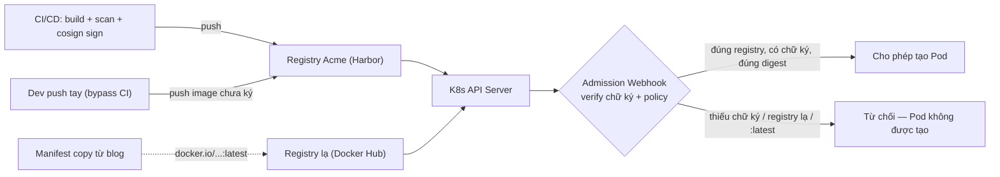

# Policy & Admission — Chỉ cho image an toàn vào cluster

> **Tác giả:** Mr.Rom\
> **Phiên bản:** v1.0.0\
> **Tạo lúc:** 13/06/2026\
> **Cập nhật:** 13/06/2026\
> **Level:** Intermediate\
> **Tags:** container-registry, kubernetes, admission-control, kyverno, cosign, sigstore, opa-gatekeeper, slsa, supply-chain\
> **Yêu cầu trước:** [HA, Replication & DR](02_high-availability-replication-and-dr.md)

> 🎯 *Ở bài trước, Acme đã có Harbor chạy HA, replication đa vùng, DR đầy đủ — registry không bao giờ "chết". Nhưng một registry khỏe vẫn có thể bị **đẩy vào** image bẩn: bản chưa scan, chưa ký, hoặc kéo từ một registry lạ. Câu hỏi cuối là: làm sao chặn những image đó **trước khi** chúng chạy trong cluster? Bài này dựng lớp **admission gate** ở K8s — verify chữ ký cosign, ép registry allowlist, cấm `:latest`, bắt buộc digest, chặn CVE CRITICAL — bằng Kyverno `verifyImages`, kèm OPA Gatekeeper / Sigstore policy-controller / Connaisseur làm phương án thay thế, và nối cổng verify từ CI/CD sang CD.*

## 🎯 Sau bài này bạn sẽ

- [ ] Giải thích vì sao cần **admission gate** ở cluster, dù CI đã scan/sign — và lỗ hổng nếu thiếu nó
- [ ] Verify chữ ký **cosign** trước khi deploy bằng **Kyverno `verifyImages`** (keyless OIDC + key-based)
- [ ] So sánh 4 công cụ admission verify image: **Kyverno**, **Sigstore policy-controller**, **Connaisseur**, **OPA Gatekeeper**
- [ ] Viết policy: chỉ pull từ **registry allowlist**, **cấm `:latest`**, **bắt buộc digest**, **block CVE CRITICAL**
- [ ] Hiểu **SLSA provenance** + verify attestation ở admission, không chỉ verify chữ ký trần
- [ ] Nối cổng verify **CI/CD (`cosign verify`)** sang **CD (admission)** thành hệ phòng thủ hai lớp

---

## Tình huống — Image bẩn vẫn "lọt" vào cluster của Acme

Acme giờ có hạ tầng registry chỉn chu: Harbor HA, scan-on-push bằng Trivy, CI ký image bằng cosign trước khi push. Nghe rất an toàn. Nhưng hãy nhìn ba sự cố thật, đều xảy ra **ở bước deploy** chứ không phải bước build:

- **Sự cố 1 — bypass CI.** Một bạn dev đang gấp fix prod lúc khuya. Thay vì chờ pipeline (scan + sign mất mấy phút), bạn ấy `docker build` ngay trên laptop, push thẳng lên Harbor, rồi `kubectl set image` vào Deployment. Image này **chưa scan, chưa ký** — nhưng cluster vẫn nhận, vì cluster không hề kiểm tra gì.
- **Sự cố 2 — image từ registry lạ.** Một manifest copy từ blog có dòng `image: docker.io/bitnami/redis:latest`. Nó pull thẳng từ Docker Hub public — ngoài tầm kiểm soát của Acme, có thể bị rate-limit, có thể bị tráo, không ai scan. Vẫn chạy bình thường.
- **Sự cố 3 — tráo tag.** Một image `registry.acme.vn/shop/api:v2.0` đã ký hợp lệ tuần trước. Hôm nay tag đó bị push đè (vô tình hoặc cố ý) trỏ sang một bản khác. K8s pull theo tag, deploy bản mới — **không phải bản đã ký**.

Ba sự cố này có một mẫu số chung: **cluster của Acme tin mọi image, miễn pull được**. CI là cổng phòng thủ, nhưng CI là **tùy chọn** — ai cũng có thể đi vòng. Lớp phòng thủ *bắt buộc* duy nhất là ở chính nơi image biến thành container đang chạy: **admission control của K8s**.

> 💡 Để thấy admission gate đứng ở đâu trong dòng chảy, mình xem sơ đồ dưới trước — nó cho thấy mọi đường vào cluster đều phải đi qua một cổng duy nhất.



Sơ đồ chỉ ra điểm mấu chốt: dù image đến từ CI "ngoan", từ dev "đi tắt", hay từ blog "registry lạ", **tất cả đều phải qua API Server** — và admission webhook đứng ngay đó. Đặt cổng ở đây nghĩa là *không có đường vòng*: muốn chạy trong cluster thì phải qua policy, không có ngoại lệ.

---

## 1️⃣ Admission gate là gì, và vì sao CI không thay thế được nó

Trước khi viết policy, cần hiểu rõ admission gate đứng ở đâu trong vòng đời một request K8s — vì hiểu sai chỗ này thì policy có viết đúng cũng không bảo vệ được gì.

Khi bạn `kubectl apply` một Pod, request không chạy ngay. Nó đi qua **API Server**, và trước khi được ghi vào etcd (lưu trữ trạng thái cluster), API Server gọi tới các **admission webhook** — những "trạm kiểm soát" do bạn cài. Có hai loại:

- **Mutating webhook** — *sửa* request (vd: đổi tag `:v2.0` thành digest `@sha256:...`).
- **Validating webhook** — *chấp nhận hoặc từ chối* request (vd: "image này không có chữ ký → reject").

*Admission control* (kiểm soát kết nạp) chính là cơ chế này: K8s hỏi webhook "request này có được phép không?" trước khi thực thi.

🪞 **Ẩn dụ**: API Server là **quầy check-in sân bay**, còn admission webhook là **cửa an ninh soi chiếu**. Bạn có vé (manifest hợp lệ) chưa đủ — hành lý (image) vẫn phải qua máy soi. Máy soi có thể *tịch thu* (reject) hoặc *dán nhãn lại* (mutate, vd "chuyến này phải đi cửa số 5"). Không ai lên được máy bay (cluster) mà không qua cửa an ninh.

### Vì sao CI scan/sign rồi vẫn cần admission?

Đây là hiểu nhầm phổ biến nhất: *"CI đã scan và ký rồi, cần gì verify lại ở cluster?"*. Câu trả lời nằm ở chỗ **CI là cổng tùy chọn, admission là cổng bắt buộc**. Bảng dưới đặt cạnh nhau để thấy rõ hai cổng bù trừ cho nhau, không thay thế nhau:

| Tiêu chí | Cổng CI (`cosign verify` trong pipeline) | Cổng CD (admission ở cluster) |
|---|---|---|
| Ai đi qua | Chỉ image *build qua pipeline đó* | **Mọi** image vào cluster, kể cả push tay |
| Bypass được không? | Được — dev `kubectl set image` là vòng qua | Không — đi qua API Server thì phải qua webhook |
| Bảo vệ chống tráo tag sau build? | Không — verify lúc build, tag đổi sau đó vẫn lọt | Có — mutate tag → digest *ngay lúc* admit |
| Phạm vi | Một pipeline | Toàn cluster (mọi namespace áp policy) |
| Vai trò | Phát hiện sớm, fail fast | Lớp chặn cuối, không thể đi vòng |

→ Kết luận: CI verify để *fail nhanh và rẻ* (dev biết lỗi ngay khi build). Admission verify để *không ai lọt* (cổng cuối, bắt buộc). Production nghiêm túc cần **cả hai** — đây là mô hình "defense in depth" (phòng thủ nhiều lớp).

> [!IMPORTANT]
> Admission gate chỉ có giá trị nếu nó **không thể bị tắt dễ dàng**. Quyền sửa/xóa `ClusterPolicy` (Kyverno) hay `ValidatingWebhookConfiguration` phải bị khóa qua RBAC — nếu một dev thường xóa được policy thì cổng coi như không tồn tại.

---

## 2️⃣ Bốn công cụ admission verify image — chọn cái nào

Có bốn công cụ phổ biến để dựng cổng verify image ở K8s năm 2026. Tất cả đều hoạt động qua admission webhook, nhưng khác nhau về cách viết policy và độ "native" với cosign. Bảng dưới giúp chọn đúng cho ngữ cảnh Acme:

| Công cụ | Cách viết policy | Verify cosign | Điểm mạnh | Khi dùng cho Acme |
|---|---|---|---|---|
| **Kyverno** | YAML (`verifyImages` rule) | Native, đầy đủ keyless + attestation | Dễ nhất, làm được cả policy chung (allowlist, cấm `:latest`) | **Mặc định** — Acme đã quen YAML |
| **Sigstore policy-controller** | CRD `ClusterImagePolicy` | Native nhất (cùng team Sigstore) | Bám sát chuẩn cosign/Sigstore mới nhất | Khi cần feature Sigstore mới nhất |
| **Connaisseur** | YAML values (Helm) | Hỗ trợ cosign + Notation | Gọn, chuyên về verify chữ ký | Team chỉ cần verify chữ ký, ngại học policy engine |
| **OPA Gatekeeper** | Rego (ngôn ngữ riêng) | Qua provider `external-data` (phức tạp hơn) | Mạnh nhất cho policy logic tùy biến | Đã dùng Gatekeeper sẵn cho policy khác |

🪞 **Ẩn dụ**: bốn công cụ như **bốn hãng máy soi an ninh** khác nhau. Kyverno là máy "bấm nút theo bảng" (YAML khai báo) — dễ vận hành. OPA Gatekeeper là máy "lập trình được mọi quy tắc" (Rego) — mạnh nhưng cần kỹ sư biết viết. Policy-controller là máy do *chính hãng làm tem* (Sigstore) chế tạo — hiểu tem chống giả tốt nhất. Connaisseur là máy *chuyên soi tem*, không làm việc khác.

Vì sao bài này tập trung vào **Kyverno**? Vì Acme đã viết K8s manifest hằng ngày, mà Kyverno policy *cũng là YAML* — không phải học thêm ngôn ngữ mới như Rego của Gatekeeper. Kyverno cũng có `verifyImages` native cho cosign, lại làm được cả các policy chung (allowlist, cấm `:latest`) trong cùng một engine. Ba công cụ còn lại mình sẽ minh họa policy tương đương ở phần sau để bạn biết "khi gặp thì không bỡ ngỡ".

---

## 3️⃣ Cài Kyverno + policy verify chữ ký cosign

Trái tim của bài là làm Kyverno *bắt buộc* mọi image `shop/*` của Acme phải có chữ ký cosign hợp lệ mới được admit. Trước hết cài Kyverno vào cluster — nó tự dựng các admission webhook cần thiết:

```bash
# 1. Cài Kyverno qua Helm (chart chính thức)
helm repo add kyverno https://kyverno.github.io/kyverno/
helm repo update
helm install kyverno kyverno/kyverno -n kyverno --create-namespace

# 2. Kiểm tra Kyverno đã chạy
kubectl get pods -n kyverno
```

Kết quả mong đợi:

```
NAME                                             READY   STATUS    RESTARTS   AGE
kyverno-admission-controller-7d9c8f5b6d-x4k2p    1/1     Running   0          45s
kyverno-background-controller-5f7b9c4d8-q9w2r    1/1     Running   0          45s
kyverno-cleanup-controller-6c8d7f9b5-m3n4t       1/1     Running   0          45s
kyverno-reports-controller-8b6c5d7f9-p2k8s       1/1     Running   0          45s
```

`STATUS` là `Running` và `READY` là `1/1` cho cả bốn controller nghĩa là Kyverno đã sẵn sàng. `admission-controller` chính là thành phần đứng ở API Server soi mọi request — đây là cổng an ninh ta vừa nói.

### Policy verify chữ ký keyless (CI ký bằng OIDC)

Trong CI thật, Acme ký image keyless (không giữ key, danh tính lấy từ OIDC của GitHub Actions — xem lại bài [Image Signing & Scanning](../01_basic/03_image-signing-and-scanning.md)). Policy dưới chỉ admit image `registry.acme.vn/shop/*` nếu chữ ký do workflow của org `acme` trên GitHub ký:

```yaml
apiVersion: kyverno.io/v1
kind: ClusterPolicy
metadata:
  name: verify-acme-signature
spec:
  validationFailureAction: Enforce   # Enforce = từ chối; Audit = chỉ ghi log
  webhookTimeoutSeconds: 30
  failurePolicy: Fail                 # webhook lỗi/timeout -> từ chối (an toàn hơn)
  rules:
    - name: check-acme-signature
      match:
        any:
          - resources:
              kinds:
                - Pod
      verifyImages:
        - imageReferences:
            - "registry.acme.vn/shop/*"
          mutateDigest: true          # đổi tag -> digest TRƯỚC khi verify (chống tráo tag)
          verifyDigest: true
          required: true              # bắt buộc image này phải có chữ ký khớp
          attestors:
            - entries:
                - keyless:
                    subject: "https://github.com/acme/.*"
                    issuer: "https://token.actions.githubusercontent.com"
                    rekor:
                      url: "https://rekor.sigstore.dev"
```

Ba dòng quyết định an toàn của policy này:

- `mutateDigest: true` — Kyverno tự đổi `:v2.0` thành `@sha256:...` *trước khi* verify, rồi ghi digest đó vào Pod. Đây chính là lá chắn cho **Sự cố 3 (tráo tag)**: image chạy = đúng image đã verify, không phải "tag lúc deploy".
- `subject` + `issuer` khóa danh tính: chỉ chữ ký từ `github.com/acme/*` qua OIDC của GitHub Actions mới được tin. Một chữ ký hợp lệ nhưng từ org khác → reject.
- `failurePolicy: Fail` — nếu webhook timeout hoặc lỗi, mặc định *từ chối* thay vì cho qua. An toàn hơn (fail-closed).

### Policy verify chữ ký key-based (CI self-hosted / air-gapped)

Nếu CI của Acme self-hosted, không có OIDC, image được ký bằng cặp khóa `cosign.key`/`cosign.pub`. Khi đó `attestors` dùng public key thay vì keyless. Đưa public key vào policy dưới dạng inline:

```yaml
apiVersion: kyverno.io/v1
kind: ClusterPolicy
metadata:
  name: verify-acme-signature-keybased
spec:
  validationFailureAction: Enforce
  rules:
    - name: check-acme-pubkey
      match:
        any:
          - resources:
              kinds:
                - Pod
      verifyImages:
        - imageReferences:
            - "registry.acme.vn/shop/*"
          mutateDigest: true
          required: true
          attestors:
            - entries:
                - keys:
                    publicKeys: |-
                      -----BEGIN PUBLIC KEY-----
                      MFkwEwYHKoZIzj0CAQYIKoZIzj0DAQcDQgAEacme...public...key...here==
                      -----END PUBLIC KEY-----
```

→ Khác biệt duy nhất: `attestors.entries[].keys.publicKeys` thay cho `keyless`. Phần còn lại (`mutateDigest`, `imageReferences`) y hệt. Public key này chính là `cosign.pub` Acme phân phối — nội dung công khai nên nhúng thẳng vào policy là an toàn.

> [!TIP]
> Trong production, đừng dán public key cứng vào nhiều policy. Đặt nó vào một Secret/ConfigMap rồi tham chiếu, để khi xoay khóa (rotate key) chỉ phải sửa một chỗ. Kyverno hỗ trợ tham chiếu key từ `k8s://<namespace>/<secret-name>`.

---

## 4️⃣ Hands-on — bắt buộc image Acme ký bằng cosign mới được admit

Giờ ghép mọi thứ thành một bài thử chạy được: ký một image bằng cosign, áp policy Kyverno, rồi chứng minh image **đã ký** chạy được còn image **chưa ký bị từ chối**. Phần này dùng key-based cho dễ thử ở local (keyless cần OIDC của CI).

### 🛠️ Bước 1: Tạo cặp khóa và ký image của Acme

Mọi thao tác ký phải bám vào **digest** (xem lại bài signing). Trước hết lấy digest, tạo khóa, rồi ký:

```bash
# 1. Lấy digest của image trong registry (không cần pull toàn bộ)
DIGEST=$(docker buildx imagetools inspect registry.acme.vn/shop/api:v2.0 \
  --format '{{.Manifest.Digest}}')
echo "$DIGEST"

# 2. Tạo cặp khóa cosign (đặt COSIGN_PASSWORD="" để bỏ trống mật khẩu khi thử)
cosign generate-key-pair

# 3. Ký image VÀO DIGEST (không ký vào tag)
cosign sign --key cosign.key --yes "registry.acme.vn/shop/api@$DIGEST"
```

Kết quả (rút gọn):

```
sha256:abc123def4567890abc123def4567890abc123def4567890abc123def4567890
Pushing signature to: registry.acme.vn/shop/api
```

Dòng `Pushing signature to:` xác nhận chữ ký đã được lưu **trong registry**, cạnh image, tham chiếu theo digest — đúng nơi admission sẽ tới lấy để verify.

### 🛠️ Bước 2: Áp policy Kyverno key-based

Lưu policy key-based ở mục 3 vào file `verify-acme-keybased.yaml` (nhớ dán nội dung `cosign.pub` vào `publicKeys`), rồi áp:

```bash
# Dán nội dung cosign.pub vào policy rồi apply
kubectl apply -f verify-acme-keybased.yaml

# Kiểm tra policy đã READY
kubectl get clusterpolicy verify-acme-signature-keybased
```

Kết quả mong đợi:

```
NAME                              ADMISSION   BACKGROUND   READY   AGE
verify-acme-signature-keybased    true        true         True    8s
```

Cột `READY` là `True` nghĩa là Kyverno đã nạp policy và webhook đang chặn mọi request tạo Pod khớp `imageReferences`.

### 🛠️ Bước 3: Thử image ĐÃ ký — phải được admit

Dùng digest đã ký ở Bước 1. Vì image này có chữ ký khớp public key trong policy, Kyverno cho qua:

```bash
kubectl run shop-api --image="registry.acme.vn/shop/api@$DIGEST"
```

Kết quả:

```
pod/shop-api created
```

→ `pod/shop-api created` nghĩa là chữ ký hợp lệ — Kyverno verify thành công và cho phép tạo Pod. Nếu chạy `kubectl get pod shop-api -o jsonpath='{.spec.containers[0].image}'`, bạn sẽ thấy image đã được Kyverno *rewrite* thành dạng `@sha256:...` (nhờ `mutateDigest`).

### 🛠️ Bước 4: Thử image CHƯA ký — phải bị từ chối

Giờ mô phỏng **Sự cố 1** (dev push image chưa ký). Đẩy một image mới lên `shop/api` nhưng *không ký*, rồi thử deploy:

```bash
# Image này CHƯA được cosign ký -> phải bị chặn
kubectl run shop-api-unsigned --image="registry.acme.vn/shop/api:dev-hotfix"
```

Kết quả:

```
Error from server: admission webhook "mutate.kyverno.svc-fail" denied the request:

resource Pod/default/shop-api-unsigned was blocked due to the following policies

verify-acme-signature-keybased:
  check-acme-pubkey: 'failed to verify image registry.acme.vn/shop/api:dev-hotfix:
    .attestors[0].entries[0].keys: no signatures found'
```

→ Dòng `denied the request` + `no signatures found` xác nhận cổng đã hoạt động: image chưa ký bị chặn *trước khi* tạo Pod. Bạn `kubectl get pods` sẽ không thấy `shop-api-unsigned` nào cả — nó chưa bao giờ tồn tại. Đây chính là điều CI không làm được: dev đi tắt, vẫn bị chặn.

Vậy là Acme đã có cổng cuối: **ký lúc build (cosign) → verify lúc deploy (Kyverno) → chỉ image ký đúng mới chạy**. Trong CI thật, đổi key-based thành keyless OIDC là xong.

---

## 5️⃣ Policy không chỉ verify chữ ký — allowlist, cấm `:latest`, bắt buộc digest

Verify chữ ký lo cho Sự cố 1 và 3. Còn **Sự cố 2** (image từ registry lạ) và các thói quen nguy hiểm khác (dùng `:latest`, không pin digest) cần thêm vài policy "vệ sinh cơ bản". Kyverno làm được tất cả trong cùng engine — đây là lợi thế so với công cụ chỉ verify chữ ký.

### Chỉ pull từ registry allowlist

Policy này từ chối mọi image *không* đến từ registry của Acme (hoặc một vài mirror được duyệt). Nó chặn thẳng **Sự cố 2** — không cho `docker.io/...:latest` từ blog lọt vào:

```yaml
apiVersion: kyverno.io/v1
kind: ClusterPolicy
metadata:
  name: restrict-registry-allowlist
spec:
  validationFailureAction: Enforce
  rules:
    - name: only-acme-registries
      match:
        any:
          - resources:
              kinds:
                - Pod
      validate:
        message: "Image phải đến từ registry.acme.vn hoặc mirror nội bộ được duyệt."
        pattern:
          spec:
            containers:
              - image: "registry.acme.vn/* | mirror.acme.vn/*"
```

→ Toán tử `|` trong `pattern` nghĩa là "khớp một trong các mẫu này". Bất kỳ image nào *không* bắt đầu bằng `registry.acme.vn/` hay `mirror.acme.vn/` đều bị từ chối với thông báo rõ ràng. Lưu ý: pattern còn cần áp cho `initContainers` và `ephemeralContainers` nếu muốn chặt chẽ — production thường gộp cả ba.

### Cấm tag `:latest`

`:latest` là cái bẫy kinh điển: nó *mutable*, không nói gì về phiên bản, và "cùng manifest deploy hai lần ra hai image khác nhau". Policy dưới chặn nó:

```yaml
apiVersion: kyverno.io/v1
kind: ClusterPolicy
metadata:
  name: disallow-latest-tag
spec:
  validationFailureAction: Enforce
  rules:
    - name: forbid-latest
      match:
        any:
          - resources:
              kinds:
                - Pod
      validate:
        message: "Cấm dùng tag :latest — pin theo version cụ thể hoặc digest."
        pattern:
          spec:
            containers:
              - image: "!*:latest"
    - name: require-explicit-tag
      match:
        any:
          - resources:
              kinds:
                - Pod
      validate:
        message: "Image phải có tag rõ ràng (không để trống = ngầm hiểu :latest)."
        pattern:
          spec:
            containers:
              - image: "*:*"
```

→ Rule `forbid-latest` dùng `!*:latest` (`!` = phủ định) để bắt mọi image kết thúc bằng `:latest`. Rule `require-explicit-tag` bắt phải có `:` — vì `image: nginx` không có tag thì K8s *ngầm hiểu* là `nginx:latest`, cũng phải chặn. Hai rule này bù cho nhau.

### Bắt buộc dùng digest (chặt nhất)

Cấp độ nghiêm ngặt nhất: ép mọi image phải pin bằng `@sha256:...`, không cho dùng tag nào cả. Đây là policy cho môi trường prod khắt khe của Acme:

```yaml
apiVersion: kyverno.io/v1
kind: ClusterPolicy
metadata:
  name: require-image-digest
spec:
  validationFailureAction: Enforce
  rules:
    - name: require-digest
      match:
        any:
          - resources:
              kinds:
                - Pod
      validate:
        message: "Production yêu cầu pin image bằng digest (@sha256:...), không dùng tag."
        pattern:
          spec:
            containers:
              - image: "*@sha256:*"
```

→ Pattern `*@sha256:*` chỉ chấp nhận image có digest. Cách này *immutable tuyệt đối*: image chạy luôn đúng một bản, không thể bị tráo tag. Nhưng nó hơi cứng cho dev daily — nên Acme thường áp policy này **chỉ ở namespace production** (qua `match` thêm điều kiện namespace), còn dev/staging thì dùng `disallow-latest-tag` mềm hơn.

> [!TIP]
> Kết hợp `mutateDigest: true` trong `verifyImages` (mục 3) với policy `require-image-digest` này: bước verify *tự* chuyển tag sang digest, nên dev vẫn viết manifest theo tag cho dễ, mà image cuối cùng vẫn được pin digest. Khắt khe ở kết quả, dễ chịu ở trải nghiệm.

---

## 6️⃣ Block CVE CRITICAL — chặn ở registry hay ở admission?

Chữ ký chứng minh "đúng hàng", nhưng "đúng hàng" vẫn có thể "đầy CVE". Còn một câu hỏi: chặn image dính **CVE CRITICAL** ngay ở cổng admission được không? Câu trả lời là *có hai cách*, và nên dùng cả hai.

### Cách 1 — Harbor block pull (cổng ở registry, rẻ nhất)

Như đã học ở [Harbor Deep Dive](01_harbor-deep-dive.md), Harbor có **deployment security policy**: bật "Prevent vulnerable images from running" và đặt ngưỡng (vd block khi có CRITICAL). Lúc đó, *chính registry* từ chối trả image về khi pull:

```
Failed to pull image "registry.acme.vn/shop/api:v2.0":
  current image with "Critical" vulnerabilities cannot be pulled
  due to configured policy in 'Prevent images with vulnerability severity of "Critical" from running.'
```

→ Đây là cổng *rẻ nhất*: cấu hình một lần trên UI Harbor, áp cho **mọi** consumer (mọi cluster, mọi dev pull tay), không viết dòng policy K8s nào. Nhược điểm: nó dựa vào kết quả scan *mới nhất* của Harbor — nếu CVE vừa nổ mà Harbor chưa scan lại thì chưa chặn (nên bật scan định kỳ).

### Cách 2 — Verify scan-result attestation ở admission

Cách "đúng supply-chain" hơn: CI ký một **attestation** (chứng thực đã ký) chứa kết quả scan, rồi admission verify attestation đó. Image không có attestation "đã scan và pass" thì bị reject. Trivy tạo được attestation kiểu vuln-scan, cosign attest ký nó vào registry:

```bash
# 1. Trivy quét và xuất kết quả dạng cosign vuln attestation
trivy image --format cosign-vuln \
  --output vuln.json \
  "registry.acme.vn/shop/api@$DIGEST"

# 2. cosign ký attestation đó vào registry (cạnh image, theo digest)
cosign attest --key cosign.key --yes \
  --type vuln \
  --predicate vuln.json \
  "registry.acme.vn/shop/api@$DIGEST"
```

Bên admission, Kyverno verify attestation và *đọc nội dung* để áp điều kiện (vd "số CRITICAL phải = 0"):

```yaml
apiVersion: kyverno.io/v1
kind: ClusterPolicy
metadata:
  name: verify-scan-attestation
spec:
  validationFailureAction: Enforce
  rules:
    - name: check-no-critical
      match:
        any:
          - resources:
              kinds:
                - Pod
      verifyImages:
        - imageReferences:
            - "registry.acme.vn/shop/*"
          attestations:
            - type: "https://cosign.sigstore.dev/attestation/vuln/v1"
              attestors:
                - entries:
                    - keys:
                        publicKeys: |-
                          -----BEGIN PUBLIC KEY-----
                          MFkwEwYHKoZIzj0CAQYIKoZIzj0DAQcDQgAEacme...public...key...here==
                          -----END PUBLIC KEY-----
              conditions:
                - all:
                    - key: "{{ scanner.result.summary.CRITICAL || `0` }}"
                      operator: Equals
                      value: 0
```

→ `attestations` verify rằng attestation kiểu vuln *được ký đúng* (chống giả mạo kết quả scan), rồi `conditions` đọc field trong predicate để áp luật "0 CRITICAL". Cách này mạnh hơn Harbor block: nó **đính kết quả scan vào chính image** (theo digest), nên dù pull từ đâu, admission vẫn đọc được trạng thái CVE đã ký — không phụ thuộc registry nào.

So sánh nhanh hai cách để Acme chọn:

| Cách block CVE | Đặt ở đâu | Ưu | Nhược |
|---|---|---|---|
| Harbor "prevent vulnerable" | Registry (Harbor) | Cấu hình 1 lần, áp mọi consumer | Phụ thuộc scan mới nhất của Harbor |
| Verify vuln attestation | Admission (Kyverno) | Kết quả scan ký vào image, đọc được ở cluster | Phải dựng pipeline tạo + ký attestation |

→ Acme dùng *cả hai*: Harbor block làm lưới an toàn rẻ tiền, attestation verify làm cổng "đúng supply-chain" cho image production quan trọng.

---

## 7️⃣ SLSA provenance — verify cả "image này build từ đâu"

Verify chữ ký nói "image này do *ai* ký". Còn một câu hỏi sâu hơn cho supply chain: *image này được build từ source nào, bằng pipeline nào, có bị chèn bước lạ không?* Đó là việc của **provenance** (chứng thực nguồn gốc) — và khung chuẩn để đo độ trưởng thành là **SLSA**.

**SLSA** (đọc là "salsa", viết tắt *Supply-chain Levels for Software Artifacts*) là thang đo do OpenSSF/Linux Foundation đưa ra, chia mức độ tin cậy của một artifact theo "build nó có minh bạch và chống can thiệp không":

| Mức SLSA | Yêu cầu cốt lõi | Acme ở đâu |
|---|---|---|
| **Build L1** | Có provenance — biết image build từ source nào, bằng cách nào | Tạo provenance trong CI |
| **Build L2** | Provenance được **ký** + build chạy trên service có quản lý (không phải laptop) | CI ký provenance bằng cosign |
| **Build L3** | Build *cô lập* (isolated), provenance không thể bị giả ngay cả bởi người trong team | Mục tiêu hướng tới cho image core |

🪞 **Ẩn dụ**: chữ ký cosign như **tem niêm phong** trên hộp ("hộp này chưa ai mở"). SLSA provenance như **hóa đơn xuất xưởng kèm theo** ("hộp này sản xuất ở nhà máy X, dây chuyền số 3, ngày Y, từ nguyên liệu Z"). Tem chống tráo hàng; hóa đơn chống "hàng thật nhưng làm ở xưởng lậu".

### Tạo và verify SLSA provenance

Trong GitHub Actions, `docker/build-push-action` tạo được provenance attestation SLSA tự động khi bật `provenance: mode=max`. Provenance này được ký và đẩy cạnh image:

```yaml
- name: Build, push và sinh SLSA provenance
  uses: docker/build-push-action@v6
  with:
    context: .
    push: true
    tags: registry.acme.vn/shop/api:v2.0
    provenance: mode=max     # sinh SLSA provenance attestation đầy đủ
    sbom: true               # đính kèm SBOM luôn
```

Ở admission, Kyverno verify provenance giống verify vuln attestation — kiểm tra nó được ký đúng và điều kiện về nguồn build:

```yaml
verifyImages:
  - imageReferences:
      - "registry.acme.vn/shop/*"
    attestations:
      - type: "https://slsa.dev/provenance/v1"
        attestors:
          - entries:
              - keyless:
                  subject: "https://github.com/acme/.*"
                  issuer: "https://token.actions.githubusercontent.com"
        conditions:
          - all:
              # build phải chạy từ repo của org acme, không phải nơi lạ
              - key: "{{ buildDefinition.externalParameters.workflow.repository }}"
                operator: Equals
                value: "https://github.com/acme/shop-api"
```

→ `conditions` đọc field trong predicate SLSA và bắt "image này phải build từ repo `acme/shop-api`". Một image ký hợp lệ *nhưng build từ repo lạ* (vd attacker fork rồi build) sẽ bị reject. Đây là tầng phòng thủ trên cả chữ ký: không chỉ "ai ký" mà "build từ đâu".

> [!NOTE]
> Field path trong `conditions` (`buildDefinition.externalParameters.workflow.repository`) phụ thuộc *định dạng predicate* mà builder sinh ra. Khi viết policy thật, hãy `cosign download attestation <image>@sha256:...` rồi đọc JSON để lấy đúng path — đừng đoán, vì SLSA v0.2 và v1.0 có cấu trúc khác nhau.

---

## 8️⃣ Policy tương đương ở 3 công cụ còn lại

Để khi gặp doc/cluster dùng công cụ khác bạn không bỡ ngỡ, đây là policy "verify chữ ký Acme" tương đương ở ba công cụ còn lại. Cùng một ý đồ, khác cú pháp.

### Sigstore policy-controller — `ClusterImagePolicy`

Policy-controller dùng CRD riêng tên `ClusterImagePolicy`, gần với mô hình cosign nhất:

```yaml
apiVersion: policy.sigstore.dev/v1beta1
kind: ClusterImagePolicy
metadata:
  name: verify-acme-images
spec:
  images:
    - glob: "registry.acme.vn/shop/**"
  authorities:
    - keyless:
        identities:
          - issuer: "https://token.actions.githubusercontent.com"
            subjectRegExp: "https://github.com/acme/.*"
```

→ Để policy-controller *bắt buộc* (không cho image không khớp), namespace phải được gắn nhãn `policy.sigstore.dev/include: "true"`. Khác Kyverno (áp toàn cluster theo `match`), policy-controller chọn namespace qua label.

### Connaisseur — values Helm

Connaisseur cấu hình qua values khi cài bằng Helm, khai báo validator cosign rồi gắn vào policy theo image pattern:

```yaml
# values.yaml cho Helm chart của Connaisseur
application:
  validators:
    - name: acme-cosign
      type: cosign
      trustRoots:
        - name: default
          key: |-
            -----BEGIN PUBLIC KEY-----
            MFkwEwYHKoZIzj0CAQYIKoZIzj0DAQcDQgAEacme...public...key...here==
            -----END PUBLIC KEY-----
  policy:
    - pattern: "registry.acme.vn/shop/*"
      validator: acme-cosign
    - pattern: "*:*"
      validator: allow          # các image khác: cho qua (hoặc đặt deny)
```

→ Connaisseur gọn vì chuyên một việc: verify chữ ký theo `pattern`. Nó không làm policy chung như allowlist/cấm `:latest` (việc đó để Kyverno/Gatekeeper).

### OPA Gatekeeper — Rego

Gatekeeper viết logic bằng **Rego**. Verify chữ ký cosign cần một `external-data provider` (gọi ra ngoài để check chữ ký) nên phức tạp; nhưng policy *allowlist registry* thì Rego làm gọn — ví dụ một `ConstraintTemplate` chặn registry lạ:

```yaml
apiVersion: templates.gatekeeper.sh/v1
kind: ConstraintTemplate
metadata:
  name: k8sallowedregistries
spec:
  crd:
    spec:
      names:
        kind: K8sAllowedRegistries
      validation:
        openAPIV3Schema:
          type: object
          properties:
            registries:
              type: array
              items:
                type: string
  targets:
    - target: admission.k8s.gatekeeper.sh
      rego: |
        package k8sallowedregistries

        violation[{"msg": msg}] {
          container := input.review.object.spec.containers[_]
          not startswith_any(container.image, input.parameters.registries)
          msg := sprintf("image %v không thuộc registry được phép", [container.image])
        }

        startswith_any(str, prefixes) {
          startswith(str, prefixes[_])
        }
```

→ Rego mạnh nhưng dốc hơn YAML: bạn phải định nghĩa cả template *lẫn* logic. Đó là lý do Acme chọn Kyverno cho registry policy — trừ khi cluster đã dùng Gatekeeper sẵn cho mục đích khác.

---

## 💡 Cạm bẫy thường gặp & Best practice

### ❌ Cạm bẫy: Verify chữ ký nhưng quên `mutateDigest`

- **Triệu chứng**: Policy verify chữ ký theo tag, pass. Nhưng sau khi admit, tag bị tráo trỏ sang image khác — Pod restart pull lại bản lạ mà policy không bắt được nữa.
- **Nguyên nhân**: Verify diễn ra *một lần* lúc admit theo tag. Nếu không chốt sang digest, image thực chạy có thể khác image đã verify (TOCTOU — time-of-check-to-time-of-use).
- **Cách tránh**: Luôn đặt `mutateDigest: true` trong `verifyImages` — Kyverno chốt digest vào Pod spec ngay lúc admit, image chạy = đúng image đã verify.

### ❌ Cạm bẫy: `validationFailureAction: Audit` rồi tưởng đã được bảo vệ

- **Triệu chứng**: Policy hiện trong cluster, dashboard báo "vi phạm", nhưng image bẩn vẫn chạy bình thường.
- **Nguyên nhân**: `Audit` chỉ *ghi log* vi phạm, **không từ chối**. Nhiều người để Audit để "thử trước" rồi quên đổi sang Enforce.
- **Cách tránh**: Khi test thì dùng `Audit` (quan sát ảnh hưởng, không gãy prod), nhưng production phải `Enforce`. Kiểm tra định kỳ `kubectl get clusterpolicy` xem cột action.

### ❌ Cạm bẫy: `failurePolicy: Ignore` — webhook chết là image lọt hết

- **Triệu chứng**: Một sự cố làm Pod Kyverno chết/timeout; trong lúc đó mọi image (kể cả chưa ký) đều admit được.
- **Nguyên nhân**: `failurePolicy: Ignore` (mặc định cũ của một số setup) nghĩa là "webhook lỗi thì cho qua" (fail-open) — cổng an ninh sập là cửa mở toang.
- **Cách tránh**: Đặt `failurePolicy: Fail` (fail-closed) cho policy bảo mật. Đổi lại phải đảm bảo Kyverno chạy HA (nhiều replica) để webhook không thành điểm chết đơn (SPOF) chặn cả cluster.

### ❌ Cạm bẫy: Quên `initContainers` / `ephemeralContainers`

- **Triệu chứng**: Policy chặn `containers` chuẩn, nhưng một image lạ vẫn chạy được qua `initContainer` hoặc `kubectl debug` (ephemeral container).
- **Nguyên nhân**: Pattern chỉ áp `spec.containers`, bỏ sót hai loại container kia.
- **Cách tránh**: Với policy allowlist/digest, áp pattern cho cả `containers`, `initContainers`, `ephemeralContainers`. `verifyImages` của Kyverno mặc định đã cover cả ba, nhưng policy `validate.pattern` thì phải khai rõ.

### ✅ Best practice: Khóa RBAC cho policy và webhook

- **Vì sao**: Cổng admission chỉ mạnh nếu không ai tắt được. Nếu dev thường có quyền `delete clusterpolicy` hay sửa `ValidatingWebhookConfiguration`, họ vô hiệu cổng trong 1 lệnh.
- **Cách áp dụng**: Chỉ cluster-admin/security team được sửa Kyverno policy. Đặt thêm một policy "tự bảo vệ" chặn xóa/sửa các ClusterPolicy bảo mật (Kyverno làm được điều này với chính nó).

### ✅ Best practice: Hai lớp cổng — CI verify + CD admission

- **Vì sao**: CI verify cho dev *biết lỗi sớm* (fail nhanh, rẻ); admission đảm bảo *không ai lọt* (cổng cuối, bắt buộc). Bỏ CI thì dev chờ lâu mới biết lỗi; bỏ admission thì push tay là vòng qua.
- **Cách áp dụng**: Trong pipeline đặt `cosign verify` trước bước deploy (fail fast); trong cluster đặt Kyverno `verifyImages` (fail closed). Cùng một danh tính/khóa cho cả hai để nhất quán.

---

## 🧠 Tự kiểm tra (Self-check)

**Q1.** CI đã `cosign verify` thành công trước khi deploy. Vậy có cần admission verify lại ở cluster không? Vì sao?

<details>
<summary>💡 Xem giải thích</summary>

**Vẫn cần.** CI là cổng *tùy chọn* — một dev có thể `kubectl set image` hoặc `kubectl apply` thẳng, hoàn toàn vòng qua pipeline. Admission là cổng *bắt buộc*: mọi request tạo Pod đều qua API Server, mà admission webhook đứng ngay đó, không có đường vòng.

Ngoài ra CI verify lúc build; nếu sau đó tag bị tráo, bản verify cũ không còn ứng với image đang chạy. Admission với `mutateDigest: true` chốt digest *ngay lúc admit*, đóng khe hở này. Hai cổng bù trừ: CI để fail nhanh/rẻ, admission để không ai lọt.
</details>

**Q2.** Vì sao `mutateDigest: true` quan trọng đến vậy trong policy verifyImages?

<details>
<summary>💡 Xem giải thích</summary>

Vì nó đóng lỗ hổng **TOCTOU** (time-of-check-to-time-of-use). Nếu verify theo tag (`:v2.0`) rồi để Pod chạy theo tag đó, kẻ xấu có thể push đè tag trỏ sang image khác sau khi verify; lần Pod restart/scale, K8s pull theo tag → ra image lạ chưa từng được verify.

`mutateDigest: true` khiến Kyverno đổi tag sang `@sha256:...` *ngay lúc admit* và ghi digest đó vào Pod spec. Từ đó image chạy luôn cố định một digest — đúng bản đã verify, không thể bị tráo. "Thứ verify = thứ chạy."
</details>

**Q3.** `validationFailureAction: Audit` và `Enforce` khác nhau ra sao? Khi nào dùng cái nào?

<details>
<summary>💡 Xem giải thích</summary>

- **`Audit`** — phát hiện vi phạm và *ghi log/report*, nhưng **vẫn cho Pod chạy**. Dùng khi mới rollout policy: quan sát xem bao nhiêu workload sẽ bị ảnh hưởng mà không làm gãy prod.
- **`Enforce`** — *từ chối* request vi phạm. Dùng cho production khi đã chắc policy đúng.

Quy trình an toàn: rollout policy mới ở `Audit` trước → xem report (`kubectl get policyreport`) → khi không còn false-positive thì đổi sang `Enforce`. Cạm bẫy là để `Audit` rồi quên đổi, tưởng đã được bảo vệ trong khi image bẩn vẫn lọt.
</details>

**Q4.** Image đã được cosign ký hợp lệ. SLSA provenance còn thêm gì mà chữ ký không có?

<details>
<summary>💡 Xem giải thích</summary>

Chữ ký cosign chứng minh **"ai ký" + "image chưa bị tráo"** (niêm phong). SLSA provenance chứng minh **"image này build từ source nào, pipeline nào, lúc nào"** (hóa đơn xuất xưởng).

Khác biệt thực tế: một attacker có thể fork repo `acme/shop-api`, build một image *có chèn mã độc* rồi ký bằng danh tính hợp lệ của chính họ. Chữ ký vẫn "hợp lệ" (đúng là họ ký). Nhưng verify provenance với điều kiện "build phải từ repo `github.com/acme/shop-api`" sẽ reject — vì build từ fork lạ. Provenance bảo vệ chống "hàng thật nhưng làm ở xưởng lậu".
</details>

**Q5.** Acme muốn chặn image dính CVE CRITICAL ở cấp cluster. Hai cách làm là gì, và khác nhau ở đâu?

<details>
<summary>💡 Xem giải thích</summary>

1. **Harbor block pull** — bật "Prevent vulnerable images from running" trong project Harbor, đặt ngưỡng CRITICAL. Registry *từ chối trả image* khi pull. Ưu: cấu hình 1 lần, áp mọi consumer, không viết policy K8s. Nhược: dựa vào kết quả scan mới nhất của Harbor (CVE vừa nổ mà chưa scan lại thì chưa chặn).

2. **Verify vuln attestation ở admission** — CI dùng Trivy tạo vuln attestation, cosign ký vào image; Kyverno verify attestation đó và áp điều kiện "0 CRITICAL". Ưu: kết quả scan ký *vào chính image* theo digest, đọc được ở cluster bất kể pull từ đâu. Nhược: phải dựng pipeline tạo + ký attestation.

→ Production dùng cả hai: Harbor block làm lưới rẻ tiền, attestation verify làm cổng đúng supply-chain cho image quan trọng.
</details>

---

## ⚡ Tra cứu nhanh (Cheatsheet)

```bash
# === Cài Kyverno ===
helm repo add kyverno https://kyverno.github.io/kyverno/
helm install kyverno kyverno/kyverno -n kyverno --create-namespace

# === Quản lý policy ===
kubectl apply -f policy.yaml
kubectl get clusterpolicy                       # xem action (Enforce/Audit), READY
kubectl get policyreport -A                     # xem vi phạm khi để Audit
kubectl describe clusterpolicy <name>

# === Ký + attestation (chuẩn bị cho admission) ===
DIGEST=$(docker buildx imagetools inspect registry.acme.vn/shop/api:v2.0 \
  --format '{{.Manifest.Digest}}')
cosign sign --key cosign.key --yes "registry.acme.vn/shop/api@$DIGEST"

# vuln attestation (để admission block CVE)
trivy image --format cosign-vuln --output vuln.json "registry.acme.vn/shop/api@$DIGEST"
cosign attest --key cosign.key --yes --type vuln \
  --predicate vuln.json "registry.acme.vn/shop/api@$DIGEST"

# === Verify ở phía CI (fail fast trước khi deploy) ===
cosign verify --key cosign.pub "registry.acme.vn/shop/api@$DIGEST"
cosign verify \
  --certificate-identity-regexp 'https://github.com/acme/.*' \
  --certificate-oidc-issuer 'https://token.actions.githubusercontent.com' \
  "registry.acme.vn/shop/api@$DIGEST"

# === Đọc attestation để viết đúng field path cho conditions ===
cosign download attestation "registry.acme.vn/shop/api@$DIGEST"
```

| Mục đích policy | Cú pháp pattern Kyverno |
|---|---|
| Chỉ registry allowlist | `image: "registry.acme.vn/* \| mirror.acme.vn/*"` |
| Cấm `:latest` | `image: "!*:latest"` |
| Bắt phải có tag | `image: "*:*"` |
| Bắt buộc digest | `image: "*@sha256:*"` |
| Verify chữ ký keyless | `verifyImages.attestors.entries[].keyless` |
| Verify chữ ký key-based | `verifyImages.attestors.entries[].keys.publicKeys` |
| Chốt digest lúc admit | `verifyImages.mutateDigest: true` |

---

## 📚 Từ Điển Thuật Ngữ (Glossary)

| EN | VN | Giải thích |
|---|---|---|
| Admission control | Kiểm soát kết nạp | Cơ chế K8s hỏi webhook "request này có được phép?" trước khi ghi vào etcd |
| Admission webhook | Webhook kết nạp | Endpoint K8s gọi tới khi có request, trả về cho phép/từ chối (hoặc sửa) |
| Mutating webhook | Webhook sửa đổi | Loại webhook *sửa* request (vd đổi tag → digest) |
| Validating webhook | Webhook kiểm tra | Loại webhook *chấp nhận hoặc từ chối* request |
| Kyverno | Kyverno (giữ nguyên) | Policy engine K8s viết bằng YAML, có `verifyImages` native cho cosign |
| verifyImages | (giữ nguyên) | Rule Kyverno verify chữ ký/attestation của image trước khi admit |
| ClusterPolicy | (giữ nguyên) | CRD Kyverno khai báo policy áp cho toàn cluster |
| OPA Gatekeeper | (giữ nguyên) | Policy engine K8s viết bằng Rego, mạnh nhưng dốc hơn |
| Rego | Rego (giữ nguyên) | Ngôn ngữ viết policy của Open Policy Agent / Gatekeeper |
| policy-controller | (giữ nguyên) | Admission controller của Sigstore, dùng CRD `ClusterImagePolicy` |
| Connaisseur | (giữ nguyên) | Admission controller chuyên verify chữ ký image (cosign/Notation) |
| cosign | (giữ nguyên) | CLI ký/verify image thuộc dự án Sigstore |
| Keyless | Ký không giữ khóa | Ký dùng danh tính OIDC + cert ngắn hạn, không lưu private key cố định |
| Attestation | Chứng thực (đã ký) | Tuyên bố đã ký về image (vd kết quả scan, SBOM, provenance) |
| Provenance | Chứng thực nguồn gốc | Metadata "image build từ source nào, pipeline nào, lúc nào" |
| SLSA | SLSA (đọc "salsa") | Supply-chain Levels for Software Artifacts — thang đo độ trưởng thành supply chain |
| Allowlist | Danh sách cho phép | Tập registry/image được duyệt; ngoài tập này thì từ chối |
| mutateDigest | (giữ nguyên) | Tùy chọn Kyverno đổi tag → digest *ngay lúc admit*, chống tráo tag |
| failurePolicy | Chính sách khi lỗi | Webhook lỗi/timeout thì `Fail` (từ chối) hay `Ignore` (cho qua) |
| TOCTOU | Lỗ hổng kiểm-rồi-dùng | Time-of-check-to-time-of-use — trạng thái đổi giữa lúc verify và lúc dùng |
| Enforce / Audit | Cưỡng chế / Ghi nhận | Enforce = từ chối vi phạm; Audit = chỉ ghi log, vẫn cho chạy |

---

## 🔗 Liên kết & Tài nguyên

### 🧭 Định hướng lộ trình học

- ⬅️ **Bài trước:** [HA, Replication & Disaster Recovery cho Registry](02_high-availability-replication-and-dr.md)
- ➡️ **Bài tiếp theo:** [Tối ưu & Chi phí Registry ở quy mô lớn](04_optimization-and-cost-at-scale.md)
- ↑ **Về cụm:** [Container Registry — README cụm](../../README.md)

### 🧩 Các chủ đề có thể bạn quan tâm

- [Image Signing & Scanning — Trivy, cosign, SBOM, supply chain](../01_basic/03_image-signing-and-scanning.md) — ký/scan ở góc registry, nền tảng trước khi verify ở cluster
- [Harbor Deep Dive — Self-host registry doanh nghiệp](01_harbor-deep-dive.md) — Harbor block pull theo CVE, lưu chữ ký trong registry
- [Registry trong CI/CD — Cache, tag strategy, promotion, retention](../01_basic/04_registry-in-cicd.md) — đặt cổng verify trong pipeline

### 🌐 Tài nguyên tham khảo khác

- [Kyverno — Verify Images](https://kyverno.io/docs/writing-policies/verify-images/) — tài liệu chính thức cho `verifyImages`
- [Kyverno — Sample policies](https://kyverno.io/policies/) — kho policy mẫu (allowlist, disallow latest, require digest)
- [Sigstore policy-controller](https://docs.sigstore.dev/policy-controller/overview/) — admission controller native của Sigstore
- [Connaisseur (GitHub)](https://github.com/sse-secure-systems/connaisseur) — verify chữ ký image ở admission
- [OPA Gatekeeper](https://open-policy-agent.github.io/gatekeeper/website/docs/) — policy engine Rego cho K8s
- [SLSA framework](https://slsa.dev/) — thang đo supply chain và đặc tả provenance
- [Kubernetes — Admission Controllers](https://kubernetes.io/docs/reference/access-authn-authz/admission-controllers/) — cơ chế admission gốc của K8s

---

## 📌 Nhật ký thay đổi (Changelog)

- **v1.0.0 (13/06/2026)** — Bản đầu tiên. Bài 03 cụm intermediate container-registry: vì sao cần admission gate (CI là cổng tùy chọn, admission là cổng bắt buộc); cơ chế admission webhook (mutating/validating); so sánh 4 công cụ (Kyverno / Sigstore policy-controller / Connaisseur / OPA Gatekeeper); verify chữ ký cosign bằng Kyverno verifyImages (keyless OIDC + key-based, mutateDigest chống tráo tag); policy allowlist registry, cấm :latest, bắt buộc digest; block CVE CRITICAL (Harbor block pull vs verify vuln attestation); SLSA provenance + verify attestation; policy tương đương ở 3 công cụ còn lại; nối cổng CI verify + CD admission. Hands-on 4 bước ký image Acme + áp Kyverno + chứng minh image ký được admit còn image chưa ký bị reject. 1 sơ đồ mermaid, 5 cạm bẫy + 2 best practice, 5 self-check, cheatsheet, glossary.
