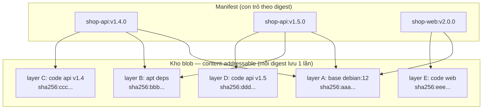

# Tối ưu & Chi phí Registry ở quy mô lớn

> **Tác giả:** Mr.Rom\
> **Phiên bản:** v1.0.0\
> **Tạo lúc:** 13/06/2026\
> **Cập nhật:** 13/06/2026\
> **Level:** Intermediate\
> **Tags:** container-registry, optimization, cost, garbage-collection, retention, harbor, ecr, observability\
> **Yêu cầu trước:** [Policy & Admission Enforcement](03_policy-and-admission-enforcement.md)

> 🎯 *Ba bài vừa rồi bạn đã dựng Harbor HA, replication đa vùng, và chặn image không an toàn vào cluster. Registry giờ chạy đúng và an toàn — nhưng nó đang **phình to và đốt tiền** một cách âm thầm: mỗi commit CI đẩy thêm vài image, kho lên hàng terabyte, hoá đơn cloud tháng sau gấp đôi. Bài này — bài đóng cụm intermediate — dạy bạn làm registry vừa **gọn** vừa **rẻ** ở quy mô multi-team: hiểu cách registry tiết kiệm dung lượng (layer sharing, content-addressable), chạy garbage collection đúng cách (Harbor GC, registry `garbage-collect`, ECR untagged), đặt retention/lifecycle thông minh, tối ưu image để giảm cả storage lẫn pull, cache layer trong CI, bóc tách chi phí thật (storage + egress + scan), so self-host vs managed, và quan sát (observe) registry qua metrics + audit log.*

## 🎯 Sau bài này bạn sẽ

- [ ] Giải thích được vì sao registry không "phình tuyến tính" theo số image: layer sharing + content-addressable storage (CAS)
- [ ] Chạy garbage collection đúng cách trên 3 nền tảng: Harbor GC, `registry garbage-collect`, ECR xoá untagged — và hiểu vì sao GC nguy hiểm nếu làm sai
- [ ] Thiết kế retention/lifecycle policy "giữ N bản gần nhất + giữ semver release, dọn dev/PR cũ" cho cả Harbor lẫn ECR
- [ ] Tối ưu image (multi-stage, distroless) để cắt cả dung lượng lưu trữ lẫn thời gian pull, và bật cache layer trong CI cho đúng
- [ ] Bóc tách hoá đơn registry thành 3 khoản (storage GB-month + egress + scan) và so self-host Harbor vs managed
- [ ] Đặt observability: metrics pull/push, audit log, dung lượng theo project — để biết tiền đang chảy đi đâu

---

## Tình huống — Hoá đơn registry của Acme Shop tăng gấp đôi sau 3 tháng

Acme Shop giờ có 6 team, mỗi team đẩy image vào Harbor riêng (đã HA, đã replication sang vùng `dr`). CI chạy ngon: mỗi pull request build một image, mỗi merge vào `main` build một image nữa, tag theo commit SHA. Mọi thứ "chạy được" — cho tới khi ba con số đập vào mặt:

- **Ổ đĩa Harbor cán mốc 4 TB.** Project `shop` một mình chiếm 1.8 TB. Khi soi ra thì 92% là image tag theo commit SHA của các PR đã đóng từ vài tháng trước — không ai pull nữa, nhưng vẫn nằm đó.
- **Hoá đơn cloud của bản managed (team khác dùng ECR) tăng từ $180 lên $410/tháng.** Phần lớn không phải storage, mà là **egress** (lưu lượng ra) — cluster ở vùng A pull image từ ECR ở vùng B, mỗi GB ra khỏi vùng đều tính tiền.
- **Bill scan riêng một dòng.** ECR enhanced scanning (Amazon Inspector) tính phí theo *số image* quét lần đầu. 6 team đẩy hàng nghìn image rác → mỗi cái lại bị quét → tiền scan đội lên dù 90% image đó chẳng bao giờ deploy.

Ba con số này quy về **một** vấn đề: registry tích trữ vô hạn và không ai dọn. Image cứ vào, không cái nào ra. Bài này là cách Acme biến registry từ "bãi rác có khoá" thành kho **tự dọn, đặt đúng chỗ, và đo đếm được**.

> [!NOTE]
> Các con số dung lượng/giá ở trên là minh hoạ cho một team multi-product cỡ vừa năm 2026 — không phải hằng số. Bài học không nằm ở con số tuyệt đối, mà ở **cấu trúc chi phí**: storage + egress + scan, và phần nào tăng nhanh nhất khi không kiểm soát.

---

## 1️⃣ Vì sao registry không phình tuyến tính — layer sharing & content-addressable

Câu hỏi đầu tiên trước khi tối ưu: *push 100 image, ổ đĩa có tăng gấp 100 lần không?* Trực giác nói "có", nhưng thực tế là **không** — và hiểu vì sao là chìa khoá để tối ưu đúng chỗ.

Một image không phải một file khối. Nó là một **manifest** (bản kê) trỏ tới nhiều **layer** (tầng), cộng một **config blob**. Mỗi layer là một tarball nén, được định danh bằng **digest** — chính là SHA256 của nội dung layer đó. Đây là *content-addressable storage* (CAS — lưu trữ định địa theo nội dung): **địa chỉ của một thứ chính là hash nội dung của nó**.

🪞 **Ẩn dụ**: *Registry như một **thư viện sách dùng chung các chương**. Mỗi cuốn sách (image) là một mục lục (manifest) ghi "cuốn này gồm chương 1A, chương 5C, chương 9F...". Nhiều cuốn cùng dùng chương 1A (vd cùng base `debian:12`) thì thư viện **chỉ in chương 1A một lần** và mọi mục lục trỏ chung tới nó. Bạn thêm 100 cuốn sách na ná nhau, thư viện không to lên 100 lần — vì chúng dùng chung phần lớn các chương.*

Hệ quả trực tiếp, rất quan trọng cho tối ưu:

| Đặc tính CAS | Nghĩa thực tế |
|---|---|
| Layer trùng digest → lưu **một lần** | 100 image cùng base `node:20` → layer base chỉ tốn dung lượng 1 lần (*deduplication*) |
| Layer định danh theo nội dung | Đổi 1 byte trong layer → digest đổi → là layer **mới**, phải lưu thêm |
| Manifest chỉ là con trỏ | Một image "nặng 900 MB" có thể chỉ thêm vài MB nếu 880 MB layer đã có sẵn |
| `docker push` báo `Layer already exists` | Đó là dedup đang hoạt động — layer này có rồi, không tải lại |

> 💡 Hiểu CAS rồi, ta nhìn sơ đồ một image phân rã thành các layer dùng chung — đây là khái niệm trừu tượng nhất của cả bài, nắm được nó thì mọi quyết định tối ưu phía sau đều logic.

### Sơ đồ — nhiều image chia sẻ chung layer qua CAS

Sơ đồ dưới mô tả ba image của Acme cùng tham chiếu một số layer chung qua digest. Mỗi image là một manifest (con trỏ), còn layer thật (blob) nằm trong kho CAS và được dùng lại — không nhân bản.



Điểm mấu chốt: layer A (base) được **cả 3 image dùng chung**, chỉ lưu một lần trong kho blob. Vì thế **xoá một tag không tự giải phóng dung lượng** — nếu layer của nó còn image khác trỏ tới, blob vẫn phải ở lại. Đây chính là lý do cần một bước riêng tên **garbage collection** ở mục 3 để dọn các blob *không còn ai trỏ tới*.

---

## 2️⃣ Hai phép dọn khác nhau: xoá tag (untag) ≠ giải phóng đĩa (GC)

Đây là chỗ gây nhầm lẫn nhất khi vận hành registry, và là gốc của vụ "xoá cả nghìn image mà ổ đĩa không nhỏ đi". Có **hai** thao tác hoàn toàn khác nhau:

- **Xoá tag / xoá manifest (logic)** — gỡ con trỏ. Sau bước này, `docker pull <tag>` không còn thấy image, nhưng các **blob** (layer) nó từng trỏ tới *vẫn nằm trên đĩa* nếu chưa có gì dọn.
- **Garbage collection (vật lý)** — quét toàn kho, tìm blob *không còn manifest nào tham chiếu* (gọi là *dangling* / mồ côi), rồi xoá khỏi đĩa. Đây mới là bước thực sự **giải phóng dung lượng**.

🪞 **Ẩn dụ tiếp nối thư viện**: *Xoá tag giống **gỡ cuốn sách khỏi mục lục chung** — không ai tìm thấy nó nữa. Nhưng các chương in của nó vẫn nằm trong kho giấy. Garbage collection là **đợt kiểm kê kho giấy**: chương nào không còn cuốn sách nào dùng thì mới đem đi tái chế.*

Mối quan hệ giữa retention (mục 4) và GC (mục 3) vì thế là một dây chuyền 2 bước:

| Bước | Việc | Kết quả |
|---|---|---|
| 1. Retention / lifecycle | Xoá **tag/manifest** theo luật (giữ N bản mới, dọn PR cũ) | Image biến mất khỏi danh sách; blob có thể thành mồ côi |
| 2. Garbage collection | Dọn **blob mồ côi** sinh ra ở bước 1 | Ổ đĩa thật sự giảm |

> [!IMPORTANT]
> Chạy retention mà **không** chạy GC sau đó = dọn danh sách nhưng đĩa vẫn đầy. Đây là sai lầm vận hành phổ biến nhất: "tôi xoá cả nghìn image rồi mà Harbor vẫn báo 1.8 TB?" — vì bạn mới làm bước 1, chưa làm bước 2.

---

## 3️⃣ Garbage collection sâu — dọn blob mồ côi đúng cách

GC là thao tác **mạnh tay và có rủi ro**: nó xoá dữ liệu vĩnh viễn. Mỗi nền tảng làm khác nhau, nhưng chung một nguyên lý: quét những gì *còn được trỏ tới*, rồi xoá phần còn lại. Ta đi qua ba nền tảng Acme dùng.

### 3.1 Harbor GC — qua UI hoặc lịch

Harbor (bài [Harbor Deep Dive](01_harbor-deep-dive.md)) gói GC thành một job có sẵn. Bạn không gõ lệnh thủ công vào storage — Harbor lo quét reference và xoá blob mồ côi. Có ba lựa chọn quan trọng khi cấu hình:

- **Dry run** (chạy thử) — quét và *báo cáo* sẽ xoá gì, **không xoá thật**. Luôn chạy dry run trước lần GC thật đầu tiên để biết quy mô.
- **Delete untagged artifacts** (xoá artifact không tag) — dọn cả những manifest đã mất hết tag (vd image bị `docker push` đè, manifest cũ thành không-tag).
- **Schedule** (lịch) — chạy GC tự động (vd hằng tuần lúc thấp tải) thay vì bấm tay.

Gọi GC qua Harbor REST API (tiện cho tự động hoá hoặc cron ngoài). Trước tiên chạy **dry run** để xem trước:

```bash
# 1. Chạy GC ở chế độ DRY RUN — chỉ báo cáo, không xoá thật
curl -s -u "admin:$HARBOR_PASS" \
  -X POST "https://harbor.acme.internal/api/v2.0/system/gc/schedule" \
  -H "Content-Type: application/json" \
  -d '{
        "schedule": { "type": "Manual" },
        "parameters": { "delete_untagged": true, "dry_run": true }
      }'
```

Kết quả mong đợi (Harbor trả về `201 Created`, không có body):

```
HTTP/1.1 201 Created
```

Sau khi xem log dry run thấy hợp lý, chạy GC thật bằng đúng payload nhưng đặt `dry_run` về `false`:

```bash
# 2. GC THẬT — xoá blob mồ côi (chạy lúc thấp tải)
curl -s -u "admin:$HARBOR_PASS" \
  -X POST "https://harbor.acme.internal/api/v2.0/system/gc/schedule" \
  -H "Content-Type: application/json" \
  -d '{
        "schedule": { "type": "Manual" },
        "parameters": { "delete_untagged": true, "dry_run": false }
      }'
```

Theo dõi tiến độ và xem dung lượng giải phóng qua lịch sử GC:

```bash
# 3. Xem lịch sử các lần GC (status, dung lượng đã dọn)
curl -s -u "admin:$HARBOR_PASS" \
  "https://harbor.acme.internal/api/v2.0/system/gc?page=1&page_size=5"
```

> [!CAUTION]
> Harbor GC mặc định đặt registry vào **read-only** trong lúc chạy để tránh race condition (một blob đang được push lại bị tưởng là mồ côi). Nghĩa là trong cửa sổ GC, **push sẽ bị từ chối**. Luôn lên lịch GC vào giờ thấp tải, và báo cho các team biết — đừng chạy GC giữa giờ release.

### 3.2 Registry mã nguồn mở — lệnh `garbage-collect`

Nếu Acme có một registry "trần" (image `registry:2` của Docker — engine mà Harbor cũng dùng bên dưới), GC là một lệnh chạy *bên trong* container registry. Nguyên lý y hệt: nó đọc mọi manifest, đánh dấu blob còn được trỏ, rồi xoá phần còn lại.

```bash
# Chạy GC trên registry:2 — thêm -m để xoá luôn manifest không còn tag
# (chạy bên trong container registry, trỏ tới đúng file config)
docker exec -it registry \
  registry garbage-collect -m /etc/docker/registry/config.yml
```

Kết quả mong đợi (rút gọn):

```
blob eligible for deletion: sha256:aaa...
blob eligible for deletion: sha256:bbb...
2 blobs marked, 2 blobs and 0 manifests eligible for deletion
```

Dòng `eligible for deletion` liệt kê các blob mồ côi sắp xoá; dòng tổng kết cho biết đã dọn bao nhiêu blob và manifest. Cờ `-m` (`--delete-untagged`) là phần quan trọng: nếu không có nó, các manifest mất tag vẫn giữ blob của chúng → GC dọn được rất ít.

> [!WARNING]
> Registry `:2` **không** tự đặt read-only khi GC. Nếu có ai push trong lúc GC chạy, một blob vừa được tham chiếu có thể bị xoá nhầm → image hỏng. Phải tự bật read-only trước (`REGISTRY_STORAGE_MAINTENANCE_READONLY='{enabled: true}'`) hoặc dừng push, rồi mới GC. Harbor che giúp việc này — đây là một lý do Harbor an toàn hơn registry trần ở quy mô lớn.

### 3.3 ECR — xoá image untagged bằng lifecycle

ECR (managed, không cho bạn chạm vào storage) không có lệnh `garbage-collect` thủ công. Thay vào đó, **bản thân ECR tự GC** ở backend; việc của bạn là **xoá manifest/tag** qua lifecycle policy, ECR lo phần dọn blob. Một image bị `docker push` đè sẽ để lại bản cũ ở trạng thái **untagged** (mất tag) — đây là nguồn rác chính trên ECR, và có một luật riêng để dọn:

```json
{
  "rules": [
    {
      "rulePriority": 1,
      "description": "Xoa image untagged cu hon 7 ngay",
      "selection": {
        "tagStatus": "untagged",
        "countType": "sinceImagePushed",
        "countUnit": "days",
        "countNumber": 7
      },
      "action": { "type": "expire" }
    }
  ]
}
```

→ Luật này dọn các image *mất tag* (do bị đè) đã quá 7 ngày. ECR chạy lifecycle tự động phía AWS, không cần cron riêng, và phần giải phóng blob là việc của ECR — bạn không phải lo bước GC thủ công như Harbor. Ở mục 4 ta sẽ ghép luật này với luật "giữ N bản semver" thành một policy hoàn chỉnh.

---

## 4️⃣ Chiến lược retention / lifecycle — giữ cái cần, dọn cái rác

GC dọn blob mồ côi, nhưng *cái gì trở thành mồ côi* là do **retention policy** quyết định. Đây là phần "trí tuệ" — đặt sai thì hoặc xoá nhầm bản release đang chạy production, hoặc giữ rác mãi mãi.

Nguyên tắc thiết kế retention cho một registry multi-team, sắp theo độ ưu tiên cần giữ:

| Loại image | Ví dụ tag | Chính sách | Vì sao |
|---|---|---|---|
| 🟢 Release semver | `v1.4.0`, `v2.0.1` | **Giữ vĩnh viễn** (hoặc rất lâu) | Cần rollback về bản cũ; là bản đã ký/duyệt |
| 🟡 Bản `main` gần đây | `main-a1b2c3d` | Giữ **N bản gần nhất** (vd 10) | Cần để debug/rollback nhanh, nhưng không cần giữ hết |
| 🔴 Image PR / dev | `pr-482-...`, `dev-...` | Dọn sau **vài ngày** hoặc khi PR đóng | Chỉ sống trong vòng đời review, sau đó là rác thuần |
| ⚫ Untagged (bị đè) | (không tag) | Dọn nhanh (vd 7 ngày) | Không ai pull được, chỉ chiếm chỗ |

🪞 **Ẩn dụ**: *Retention như **quy tắc dọn tủ lạnh**: đồ hộp đóng kín hạn dài (release semver) thì giữ; đồ ăn tuần này (bản main gần đây) giữ vài hộp mới nhất; đồ thừa bữa tiệc hôm qua (PR image) bỏ sau 2-3 ngày; đồ rơi vãi không nhãn (untagged) hốt ngay.*

### 4.1 Harbor retention rule — "giữ N gần nhất, chừa release"

Harbor cho phép đặt retention **theo từng project**, kết hợp nhiều luật. Một cấu hình điển hình cho project `shop`:

- **Luật 1**: với repository khớp `**` (mọi repo), tag khớp `v*` (release semver) → **giữ tất cả** (retain always). Đặt luật này *ưu tiên cao nhất* để release không bao giờ bị dọn.
- **Luật 2**: với mọi repo, tag khớp `main-*` → **giữ 10 bản đẩy gần nhất**.
- **Luật 3**: với mọi repo, tag khớp `pr-*` hoặc `dev-*` → **giữ 0 bản** (tức dọn hết) sau khi không được pull trong vài ngày.

Harbor đánh giá luật theo thứ tự ưu tiên: một tag được **giữ** nếu khớp *bất kỳ* luật "retain" nào — nên luật "giữ release" phải đứng trước để không bị luật "dọn dev" cuốn nhầm.

> [!TIP]
> Trong Harbor, retention rule chỉ **xoá tag** (bước 1 ở mục 2). Phải bật thêm **GC theo lịch** (mục 3.1) thì đĩa mới giảm. Cặp đôi đúng cho Acme: retention chạy *hằng ngày*, GC chạy *hằng tuần* vào đêm Chủ nhật.

### 4.2 ECR lifecycle policy — ghép nhiều luật

Trên ECR, ta gộp các quy tắc trên thành **một** lifecycle policy nhiều rule. ECR đánh giá rule theo `rulePriority` tăng dần, và **một image chỉ bị một rule áp dụng** (rule ưu tiên thấp hơn — số nhỏ hơn — thắng). Vì thế phải đặt luật "giữ release" trước, rồi mới tới luật dọn:

```json
{
  "rules": [
    {
      "rulePriority": 1,
      "description": "Giu cac ban release semver (tag bat dau bang v)",
      "selection": {
        "tagStatus": "tagged",
        "tagPrefixList": ["v"],
        "countType": "imageCountMoreThan",
        "countNumber": 9999
      },
      "action": { "type": "expire" }
    },
    {
      "rulePriority": 2,
      "description": "Chi giu 10 ban main- moi nhat",
      "selection": {
        "tagStatus": "tagged",
        "tagPrefixList": ["main-"],
        "countType": "imageCountMoreThan",
        "countNumber": 10
      },
      "action": { "type": "expire" }
    },
    {
      "rulePriority": 3,
      "description": "Xoa image PR cu hon 14 ngay",
      "selection": {
        "tagStatus": "tagged",
        "tagPatternList": ["pr-*"],
        "countType": "sinceImagePushed",
        "countUnit": "days",
        "countNumber": 14
      },
      "action": { "type": "expire" }
    },
    {
      "rulePriority": 4,
      "description": "Xoa image dev cu hon 14 ngay",
      "selection": {
        "tagStatus": "tagged",
        "tagPatternList": ["dev-*"],
        "countType": "sinceImagePushed",
        "countUnit": "days",
        "countNumber": 14
      },
      "action": { "type": "expire" }
    },
    {
      "rulePriority": 5,
      "description": "Xoa image untagged cu hon 7 ngay",
      "selection": {
        "tagStatus": "untagged",
        "countType": "sinceImagePushed",
        "countUnit": "days",
        "countNumber": 7
      },
      "action": { "type": "expire" }
    }
  ]
}
```

Áp policy này vào repository bằng AWS CLI rồi chạy thử (preview) để xem image nào sẽ bị xoá *trước khi* nó tác động thật:

```bash
# 1. Gắn lifecycle policy cho repository
aws ecr put-lifecycle-policy \
  --repository-name shop/api \
  --region ap-southeast-1 \
  --lifecycle-policy-text file://lifecycle.json

# 2. Preview — xem chính xác image nào sẽ bị xoá (KHÔNG xoá thật)
aws ecr start-lifecycle-policy-preview \
  --repository-name shop/api \
  --region ap-southeast-1
```

> [!WARNING]
> Luật "giữ release" ở trên dùng mẹo `imageCountMoreThan: 9999` (giữ tới 9999 bản `v*` mới nhất — thực tế là "giữ tất cả"). ECR **không có** action "retain mãi mãi" trực tiếp, nên đây là cách an toàn để bảo vệ release khỏi các rule dọn phía sau. Tuyệt đối kiểm tra preview trước khi tin policy: một `tagPrefixList` sai có thể quét nhầm cả bản production.

---

## 5️⃣ Tối ưu image — giảm cả storage lẫn pull cùng lúc

Đến đây ta dọn *số lượng* image. Phần này cắt *kích thước từng image* — và điều hay là: **image nhỏ hơn vừa tốn ít đĩa, vừa pull nhanh hơn, vừa scan nhanh hơn, vừa ít CVE hơn**. Một mũi tên trúng bốn đích.

Cụm Docker đã dạy kỹ thuật chi tiết — ở đây mình nhìn từ **góc registry**: vì sao image gọn giúp tiết kiệm chi phí registry, và hai kỹ thuật tác động lớn nhất.

### 5.1 Multi-stage build — chỉ giữ thứ cần để chạy

Một image build "ngây thơ" chứa cả toolchain (compiler, `node_modules` dev, file build tạm) — toàn thứ chỉ cần *lúc build*, không cần *lúc chạy*. Multi-stage tách "stage build" khỏi "stage runtime", chỉ copy artifact cuối sang image mỏng:

```dockerfile
# === Stage 1: build (chứa toolchain nặng, sẽ bị bỏ) ===
FROM node:20 AS build
WORKDIR /app
COPY package*.json ./
RUN npm ci                 # cài cả devDependencies để build
COPY . .
RUN npm run build          # xuất ra thư mục dist/

# === Stage 2: runtime (chỉ giữ dist + deps production) ===
FROM node:20-slim AS runtime
WORKDIR /app
COPY package*.json ./
RUN npm ci --omit=dev      # chỉ deps production, bỏ toolchain build
COPY --from=build /app/dist ./dist
CMD ["node", "dist/server.js"]
```

→ Image cuối chỉ gồm runtime + deps production + code đã build — toolchain nặng ở stage 1 **không** đi vào layer cuối, nên không tốn đĩa registry và không phải truyền qua mạng mỗi lần pull. Layer base `node:20-slim` lại được nhiều image dùng chung (dedup ở mục 1).

### 5.2 Distroless — cắt cả shell và OS package thừa

Đi xa hơn slim: **distroless** (image không có shell, package manager, hay tiện ích OS — chỉ runtime + app). Image nhỏ hơn nữa, và *ít CVE hơn hẳn* vì không có hàng trăm gói OS để dính lỗ hổng:

```dockerfile
# Stage build như trên... rồi stage runtime distroless:
FROM gcr.io/distroless/nodejs20-debian12 AS runtime
WORKDIR /app
COPY --from=build /app/dist ./dist
COPY --from=build /app/node_modules ./node_modules
CMD ["dist/server.js"]
```

Tác động lên chi phí registry, gom thành bảng để thấy "mũi tên trúng bốn đích":

| Khía cạnh | Image "ngây thơ" (full OS) | Distroless | Lợi cho registry |
|---|---|---|---|
| Dung lượng layer app | Lớn (kèm toolchain) | Nhỏ | Ít GB-month storage |
| Thời gian pull | Lâu (nhiều byte) | Nhanh | Ít egress, deploy nhanh |
| Số CVE | Nhiều (cả OS package) | Ít | Scan nhanh, ít cảnh báo, ít tiền scan/image |
| Bề mặt tấn công | Có shell → dễ khai thác | Không shell | An toàn hơn (liên quan bài Policy) |

> [!NOTE]
> Chi tiết kỹ thuật multi-stage + distroless (cách chọn variant, debug image không-shell, đo kích thước) nằm trong cụm Docker — xem phần Liên kết. Ở registry, chỉ cần nhớ nguyên tắc: **byte nào không cần để chạy thì đừng để nó vào layer cuối** — vì mọi byte đó đều nhân lên thành tiền storage và egress trên mọi consumer.

---

## 6️⃣ Cache layer trong CI — đừng build lại từ đầu mỗi lần

Một nguồn lãng phí âm thầm khác: CI build *lại từ số 0* mỗi commit. Layer base, layer cài dependency — vốn không đổi giữa các commit — lại bị tải lại và build lại, đốt thời gian CI và băng thông pull base image. Giải pháp là **cache layer**: lưu layer đã build, lần sau tái dùng.

Với BuildKit (engine build mặc định của Docker hiện đại), bạn có thể đẩy cache *vào chính registry* và kéo về ở lần build sau. Cách phổ biến nhất trong CI là `--cache-from` / `--cache-to` trỏ tới một tag cache riêng trong registry:

```bash
# Build với cache đẩy LÊN và kéo VỀ từ registry (BuildKit)
docker buildx build \
  --cache-from type=registry,ref=harbor.acme.internal/shop/api:buildcache \
  --cache-to type=registry,ref=harbor.acme.internal/shop/api:buildcache,mode=max \
  -t harbor.acme.internal/shop/api:main-$GIT_SHA \
  --push .
```

Giải thích các phần quan trọng:

- `--cache-from type=registry,ref=...:buildcache` — trước khi build, kéo cache đã lưu ở tag `buildcache` về; layer nào trùng thì dùng lại, không build lại.
- `--cache-to ...,mode=max` — sau build, đẩy cache lên lại. `mode=max` lưu cache của **mọi** stage (kể cả stage build trung gian), tối ưu cho multi-stage; `mode=min` (mặc định) chỉ lưu layer của image cuối.
- Cache nằm ở một **tag riêng** (`:buildcache`), tách khỏi tag image thật → retention policy nên có luật riêng cho tag cache (vd giữ 1-2 bản, vì cache mới đè cache cũ liên tục).

Trong GitHub Actions có cách gọn hơn cho cache nội bộ runner — dùng `cache-from`/`cache-to` kiểu `gha`:

```yaml
- name: Build và push với cache GitHub Actions
  uses: docker/build-push-action@v6
  with:
    context: .
    push: true
    tags: harbor.acme.internal/shop/api:main-${{ github.sha }}
    cache-from: type=gha
    cache-to: type=gha,mode=max
```

> [!TIP]
> Cache layer trong registry cũng tốn storage — đừng để cache phình. Đặt một retention rule riêng cho tag `*buildcache*` (giữ ít, dọn nhanh), tách khỏi luật giữ release. Cache là thứ *tái tạo được*, nên dọn mạnh tay không sao.

---

## 7️⃣ Chi phí thật — bóc tách storage + egress + scan

Giờ là phần làm sếp Acme quan tâm nhất: **tiền**. Hoá đơn registry không phải một con số khối — nó gồm ba khoản tách biệt, và mỗi khoản tăng theo nguyên nhân khác nhau. Nắm được cấu trúc này thì biết tối ưu chỗ nào cho hiệu quả.

| Khoản chi | Tính theo | Cái gì làm nó tăng | Cách cắt |
|---|---|---|---|
| 💾 **Storage** | GB-month (dung lượng × thời gian lưu) | Image rác tích trữ, layer to, không GC | Retention + GC + image nhỏ (mục 3-5) |
| 🌐 **Egress** | GB lưu lượng *ra khỏi vùng* | Pull image qua biên giới vùng/internet | Đặt registry **cùng vùng** consumer; replication |
| 🔍 **Scan** | Số image quét (hoặc theo tháng) | Quét cả image rác chẳng bao giờ deploy | Retention trước scan; scan có chọn lọc |

🪞 **Ẩn dụ**: *Hoá đơn registry như **hoá đơn kho hàng**: tiền **thuê chỗ** (storage, tính theo m² × số tháng), tiền **vận chuyển hàng ra** (egress, mỗi chuyến ra khỏi tỉnh tính tiền), và tiền **thuê người kiểm định chất lượng** (scan, tính theo số lô kiểm). Dọn kho gọn thì giảm tiền thuê chỗ; đặt kho gần khách thì giảm tiền vận chuyển; chỉ kiểm lô hàng thật sự xuất thì giảm tiền kiểm định.*

### 7.1 Egress — thủ phạm bị xem nhẹ nhất

Storage thì ai cũng thấy (nhìn con số TB). Nhưng ở quy mô lớn, **egress thường mới là khoản đắt và khó đoán nhất**. Mỗi lần một Pod ở vùng A pull image từ registry ở vùng B, mỗi GB đi qua đều tính tiền egress. Một cluster auto-scale spawn 50 Pod cùng lúc, mỗi Pod pull một image 500 MB từ vùng khác = 25 GB egress *trong một lần scale*.

Cách Acme cắt egress, theo thứ tự hiệu quả:

- **Đặt registry cùng vùng với cluster** — pull qua mạng nội vùng thường *miễn phí egress*. Đây là lý do bài [HA, Replication & DR](02_high-availability-replication-and-dr.md) dạy replication đa vùng: mỗi vùng có một bản registry gần, cluster pull từ bản gần nhất.
- **Bật pull-through cache / proxy cache** — cache image base public (`node`, `python`) trong registry nội bộ, không pull lại từ Docker Hub mỗi lần (vừa cắt egress vừa né rate limit).
- **Dùng VPC endpoint** (với ECR trên AWS) — pull qua mạng riêng AWS thay vì internet công cộng, giảm/miễn egress.

### 7.2 So sánh chi phí: self-host Harbor vs managed

Không có lựa chọn "luôn rẻ hơn" — nó phụ thuộc quy mô và việc bạn đã có sẵn gì. Bảng dưới so cấu trúc chi phí hai hướng:

| Yếu tố | Self-host Harbor | Managed (ECR/ACR/Artifact Registry) |
|---|---|---|
| Storage | Trả tiền **đĩa thô** (block storage/object storage) — thường rẻ/GB | Trả giá storage của provider — thường cao hơn/GB |
| Egress | Tuỳ mạng bạn dựng; nội VPC có thể gần như miễn phí | Tính theo bảng giá egress của provider (có thể đắt) |
| Scan | Trivy tích hợp **miễn phí** (chỉ tốn compute) | Basic miễn phí; enhanced (Inspector) tính phí/image |
| Vận hành | **Bạn trả**: người trực, vá lỗi, backup, HA — chi phí ẩn lớn nhất | Provider lo — gói vào giá |
| Khi rẻ hơn | Quy mô lớn, đã có đội hạ tầng, lưu lượng nội bộ cao | Quy mô nhỏ/vừa, không muốn nuôi đội vận hành |

> [!IMPORTANT]
> Sai lầm khi so sánh: chỉ nhìn giá storage/GB rồi kết luận "self-host rẻ hơn". Chi phí thật của self-host gồm cả **người vận hành** (lương kỹ sư trực Harbor HA, vá CVE của chính Harbor, xử lý sự cố lúc 3h sáng). Với team nhỏ, khoản người này thường lớn hơn toàn bộ tiền managed registry. Tính tổng chi phí sở hữu (*TCO* — Total Cost of Ownership), không chỉ tiền đĩa.

---

## 8️⃣ Observability — biết tiền và rủi ro đang ở đâu

Không đo được thì không tối ưu được. Lớp cuối là **quan sát** registry: nó đang bị pull/push bao nhiêu, ai làm gì (audit), và dung lượng phân bổ theo project ra sao. Đây là cách Acme phát hiện "project `shop` chiếm 1.8 TB" ngay từ đầu bài — nhờ có observability.

Ba thứ cần quan sát, và lý do mỗi thứ:

| Quan sát | Trả lời câu hỏi | Nguồn dữ liệu |
|---|---|---|
| **Metrics pull/push** | Image nào nóng (pull nhiều)? Push có tăng đột biến? | Prometheus metrics của Harbor / CloudWatch của ECR |
| **Audit log** | Ai xoá/push/pull cái gì, lúc nào? (điều tra sự cố, compliance) | Harbor audit log / AWS CloudTrail |
| **Dung lượng theo project** | Project/team nào ngốn đĩa nhất? Đặt quota ở đâu? | Harbor quota & project stats / ECR repo size |

### 8.1 Metrics — Harbor expose Prometheus

Harbor expose sẵn endpoint `/metrics` định dạng Prometheus. Bật trong cấu hình rồi cho Prometheus scrape, bạn có ngay các chỉ số như số request theo loại (pull/push), thời gian xử lý, kích thước upload. Một truy vấn PromQL điển hình để xem **tốc độ pull** theo từng image:

```promql
# Tốc độ pull (requests/giây) theo từng repository trong 5 phút gần nhất
sum by (repository) (
  rate(registry_http_requests_total{method="GET"}[5m])
)
```

→ Query này cho biết image nào đang bị pull nhiều nhất — hữu ích để quyết định image nào đáng cache gần cluster (cắt egress) và image nào thực sự "chết" (không ai pull → ứng viên dọn).

### 8.2 Audit log — ai làm gì

Khi điều tra "ai xoá nhầm image production?" hay phục vụ compliance, audit log là nguồn duy nhất trả lời được. Harbor ghi mọi sự kiện push/pull/delete kèm người thực hiện; truy vấn qua API:

```bash
# Lấy 20 sự kiện audit gần nhất của Harbor (ai làm gì, lúc nào)
curl -s -u "admin:$HARBOR_PASS" \
  "https://harbor.acme.internal/api/v2.0/audit-logs?page=1&page_size=20" \
  | head -c 800
```

Kết quả mong đợi (rút gọn, JSON):

```
[{"id":9001,"username":"ci-bot","resource":"shop/api:main-a1b2c3d","operation":"push","op_time":"2026-06-13T02:14:05Z"},
 {"id":9000,"username":"dev-an","resource":"shop/api:v1.4.0","operation":"delete","op_time":"2026-06-12T18:40:11Z"}]
```

Mỗi bản ghi cho biết `username` (ai), `resource` (image nào), `operation` (push/pull/delete), `op_time` (lúc nào). Dòng thứ hai cho thấy `dev-an` đã `delete` tag `v1.4.0` — đúng loại sự kiện bạn cần khi điều tra "ai xoá bản release". Trên ECR, dữ liệu tương đương nằm trong **AWS CloudTrail** (mọi API call `PutImage`, `BatchDeleteImage`...).

### 8.3 Quota & dung lượng theo project

Để chặn "một team xài hết đĩa cả công ty", Harbor cho đặt **quota** (hạn mức dung lượng) theo project. Vừa giới hạn vừa cho thấy ai đang dùng bao nhiêu:

```bash
# Xem quota & dung lượng đã dùng của từng project
curl -s -u "admin:$HARBOR_PASS" \
  "https://harbor.acme.internal/api/v2.0/quotas" \
  | head -c 600
```

Kết quả mong đợi (rút gọn):

```
[{"ref":{"name":"shop"},"hard":{"storage":2199023255552},"used":{"storage":1932735283200}}]
```

Trường `hard.storage` là hạn mức (ở đây 2 TB = 2199023255552 byte), `used.storage` là đã dùng (~1.8 TB). Project `shop` đã dùng gần hết quota — đúng tín hiệu để vừa siết retention vừa cân nhắc nâng quota. Đặt quota cho mọi project là cách phòng "tràn đĩa bất ngờ" tốt nhất.

> 💡 Với observability đủ ba lớp này, vòng tối ưu của Acme khép kín: metrics chỉ ra image nóng/chết → retention dọn image chết → GC giải phóng đĩa → quota chặn tái phình → audit log truy vết khi có sự cố. Đó là một registry tự vận hành ở quy mô lớn.

---

## 💡 Cạm bẫy thường gặp & Best practice

### ❌ Cạm bẫy: Xoá cả nghìn tag mà ổ đĩa không hề giảm

- **Triệu chứng**: Bạn chạy retention dọn 90% image, nhưng `df -h` / quota Harbor vẫn báo dung lượng gần như cũ.
- **Nguyên nhân**: Xoá tag/manifest chỉ gỡ *con trỏ* (bước 1). Blob (layer) chỉ thật sự bị xoá khi chạy **garbage collection** (bước 2) — hai thao tác khác nhau.
- **Cách tránh**: Luôn ghép cặp: retention chạy thường xuyên (dọn tag) + GC chạy định kỳ (dọn blob mồ côi). Trên Harbor bật GC theo lịch; trên registry `:2` chạy `registry garbage-collect -m`; ECR thì backend tự GC sau khi lifecycle xoá manifest.

### ❌ Cạm bẫy: Chạy GC trong lúc đang có người push

- **Triệu chứng**: Sau GC, một image vừa push xong bị hỏng (`manifest unknown` / thiếu layer).
- **Nguyên nhân**: GC đánh dấu blob mồ côi rồi mới xoá; nếu giữa hai bước có push tham chiếu tới blob đó, registry `:2` (không tự read-only) có thể xoá nhầm blob đang dùng — *race condition*.
- **Cách tránh**: Chạy GC vào giờ thấp tải, bật read-only trong cửa sổ GC. Harbor làm việc này tự động (đặt registry read-only khi GC) — ưu điểm lớn của Harbor so với registry trần ở quy mô production.

### ❌ Cạm bẫy: Retention dọn nhầm bản release đang chạy production

- **Triệu chứng**: Một sáng cluster `ImagePullBackOff` vì image `v1.3.0` (vẫn đang chạy ở một service cũ) đã bị retention xoá.
- **Nguyên nhân**: Luật "giữ N bản gần nhất" không phân biệt release với bản tạm → dọn cả release cũ vẫn đang dùng.
- **Cách tránh**: Luôn có một luật **giữ release semver (`v*`) trước mọi luật dọn**, ưu tiên cao nhất. Trên ECR dùng `rulePriority` nhỏ nhất cho luật giữ `v*`; trên Harbor đặt luật "retain `v*`" trên cùng. Luôn chạy **dry run / preview** trước khi áp policy thật.

### ✅ Best practice: Tối ưu image là đòn bẩy chi phí mạnh nhất

- **Vì sao**: Image nhỏ hơn cắt *đồng thời* storage (ít GB-month), egress (ít byte pull), và tiền scan (ít CVE, scan nhanh) — và còn an toàn hơn. Một mũi tên trúng bốn đích, áp dụng cho mọi image của mọi team.
- **Cách áp dụng**: Chuẩn hoá multi-stage + base slim/distroless cho mọi service. Đặt một ngưỡng cảnh báo (vd image runtime > 300 MB thì review). Kết hợp cache layer trong CI để không trả giá build chậm khi image nhỏ.

### ✅ Best practice: Đặt registry cùng vùng + đo egress trước khi đoán

- **Vì sao**: Ở quy mô lớn, egress thường là khoản đắt và khó đoán nhất — nhưng cũng dễ cắt nhất bằng cách đặt registry cạnh consumer. Đừng tối ưu storage cật lực rồi bỏ quên egress.
- **Cách áp dụng**: Mỗi vùng có một bản registry gần (replication); pull base public qua proxy cache nội bộ; dùng VPC endpoint với ECR. Dùng metrics pull để biết image nào nóng → ưu tiên cache đúng image đó.

---

## 🧠 Tự kiểm tra (Self-check)

**Q1.** Bạn xoá 2000 tag image trong Harbor qua retention, nhưng dung lượng project gần như không đổi. Vì sao, và phải làm gì tiếp?

<details>
<summary>💡 Xem giải thích</summary>

Vì xoá tag/manifest chỉ gỡ **con trỏ logic** — các **blob** (layer) mà chúng từng trỏ tới vẫn nằm trên đĩa nếu chưa được dọn. Trong content-addressable storage, một blob chỉ bị xoá khi *không còn manifest nào* tham chiếu, và việc tìm-rồi-xoá blob mồ côi đó là một bước riêng: **garbage collection**.

Phải làm tiếp: chạy GC (Harbor GC theo lịch, hoặc `registry garbage-collect -m` trên registry trần). Lúc đó các blob giờ đã mồ côi (vì retention vừa gỡ con trỏ cuối cùng của chúng) mới thật sự bị xoá → đĩa giảm. Quy tắc: **retention dọn tag, GC dọn đĩa** — phải làm cả hai.
</details>

**Q2.** Hoá đơn ECR của một team tăng vọt nhưng dung lượng lưu trữ gần như không đổi. Khoản nào nhiều khả năng đang tăng, và cắt thế nào?

<details>
<summary>💡 Xem giải thích</summary>

Nhiều khả năng là **egress** (lưu lượng ra khỏi vùng) — khoản này không liên quan dung lượng lưu trữ mà liên quan *số byte được pull qua biên giới vùng/internet*. Một cluster auto-scale pull image lớn từ registry ở vùng khác sẽ đốt egress mà không làm storage tăng.

Cách cắt: đặt registry **cùng vùng** với cluster (pull nội vùng thường miễn egress), dùng **VPC endpoint** để pull qua mạng riêng AWS, và bật **proxy/pull-through cache** cho base image public để không pull lại từ internet. Khoản thứ ba có thể tăng là **scan** (nếu bật enhanced/Inspector và đang quét nhiều image rác) — dọn rác trước khi scan giúp giảm.
</details>

**Q3.** Vì sao push 100 image gần giống nhau (cùng base, code khác chút) lại không làm registry to lên gấp 100 lần?

<details>
<summary>💡 Xem giải thích</summary>

Vì registry dùng **content-addressable storage**: mỗi layer định danh bằng digest = SHA256 của nội dung. Các layer **trùng digest** (vd cùng base `node:20`, cùng layer cài dependency) chỉ được lưu **một lần** (deduplication), mọi image trỏ chung tới nó. 100 image chia sẻ phần lớn layer base/deps, mỗi image chỉ thêm dung lượng cho layer *thật sự khác* (vd layer code).

Hệ quả cho tối ưu: tách Dockerfile sao cho layer hay-đổi (code) nằm *trên cùng*, layer ít-đổi (deps, base) nằm *dưới* → tối đa hoá dedup và cache. Và vì layer dùng chung, **xoá một tag không giải phóng layer** nếu image khác còn dùng — phải GC mới biết blob nào thật sự mồ côi.
</details>

**Q4.** Khi thiết kế retention multi-team, vì sao luật "giữ release semver" phải đứng trước luật "dọn theo số lượng/tuổi", và làm sao đảm bảo điều đó trên ECR?

<details>
<summary>💡 Xem giải thích</summary>

Vì nếu luật dọn được đánh giá trước, một bản release cũ (vd `v1.3.0` vẫn đang chạy ở một service) có thể bị luật "giữ 10 bản gần nhất" hoặc "xoá quá 14 ngày" cuốn nhầm — gây `ImagePullBackOff` ở production. Release là bản đã duyệt/ký, cần giữ lâu để rollback.

Trên ECR: lifecycle policy đánh giá rule theo `rulePriority` **tăng dần**, và mỗi image chỉ bị **một** rule áp dụng (rule số nhỏ thắng). Vì thế đặt luật giữ `v*` ở `rulePriority` nhỏ nhất (vd `1`) với `imageCountMoreThan` rất lớn (mẹo "giữ tất cả"), rồi mới tới các luật dọn `main-`/`pr-`/untagged ở priority lớn hơn. Luôn chạy `start-lifecycle-policy-preview` để xác nhận không xoá nhầm trước khi tin policy.
</details>

---

## ⚡ Tra cứu nhanh (Cheatsheet)

```bash
# === Harbor GC (qua REST API) ===
# Dry run (chỉ báo cáo, không xoá)
curl -u "admin:$HARBOR_PASS" -X POST \
  "https://harbor.acme.internal/api/v2.0/system/gc/schedule" \
  -H "Content-Type: application/json" \
  -d '{"schedule":{"type":"Manual"},"parameters":{"delete_untagged":true,"dry_run":true}}'
# GC thật: đổi dry_run -> false. Xem lịch sử:
curl -u "admin:$HARBOR_PASS" "https://harbor.acme.internal/api/v2.0/system/gc?page=1&page_size=5"

# === Registry :2 (mã nguồn mở) GC ===
docker exec -it registry registry garbage-collect -m /etc/docker/registry/config.yml

# === ECR lifecycle (retention) ===
aws ecr put-lifecycle-policy --repository-name shop/api \
  --lifecycle-policy-text file://lifecycle.json
aws ecr start-lifecycle-policy-preview --repository-name shop/api   # preview, không xoá

# === Build với cache layer (BuildKit) ===
docker buildx build \
  --cache-from type=registry,ref=harbor.acme.internal/shop/api:buildcache \
  --cache-to type=registry,ref=harbor.acme.internal/shop/api:buildcache,mode=max \
  -t harbor.acme.internal/shop/api:main-$GIT_SHA --push .

# === Observability ===
# Audit log Harbor (ai làm gì)
curl -u "admin:$HARBOR_PASS" "https://harbor.acme.internal/api/v2.0/audit-logs?page=1&page_size=20"
# Quota & dung lượng theo project
curl -u "admin:$HARBOR_PASS" "https://harbor.acme.internal/api/v2.0/quotas"
# ECR bật scan-on-push (để gate, nhưng dọn rác TRƯỚC khi scan để tiết kiệm)
aws ecr put-image-scanning-configuration --repository-name shop/api \
  --image-scanning-configuration scanOnPush=true
```

```promql
# Tốc độ pull theo repository (Prometheus / Harbor /metrics)
sum by (repository) (rate(registry_http_requests_total{method="GET"}[5m]))
```

---

## 📚 Từ Điển Thuật Ngữ (Glossary)

| EN | VN | Giải thích |
|---|---|---|
| Layer | Tầng | Một tarball nén trong image; nhiều image dùng chung layer trùng digest |
| Layer sharing / dedup | Chia sẻ / khử trùng lặp layer | Layer trùng digest chỉ lưu một lần, mọi image trỏ chung |
| Content-addressable storage (CAS) | Lưu trữ định địa theo nội dung | Địa chỉ của một blob chính là hash (SHA256) nội dung của nó |
| Blob | Khối dữ liệu | Đối tượng nhị phân (layer/config) lưu trong registry, định danh theo digest |
| Manifest | Bản kê image | File trỏ tới các layer + config tạo thành một image |
| Digest | Digest (mã băm) | `sha256:...` — hash bất biến; đổi 1 byte là đổi digest |
| Garbage collection (GC) | Dọn rác | Quét & xoá blob không còn manifest nào tham chiếu (mồ côi) |
| Dangling / orphan blob | Blob mồ côi | Blob không còn image nào trỏ tới — ứng viên bị GC xoá |
| Untagged image | Image mất tag | Manifest còn tồn nhưng không tag nào trỏ tới (thường do push đè) |
| Retention policy | Chính sách giữ lại | Luật quyết định tag/image nào giữ, cái nào xoá |
| Lifecycle policy | Chính sách vòng đời | Phiên bản retention của ECR — luật tự xoá image theo điều kiện |
| Dry run / preview | Chạy thử | Báo cáo "sẽ xoá gì" mà không xoá thật — kiểm tra trước khi áp |
| Multi-stage build | Build nhiều tầng | Tách stage build (toolchain) khỏi stage runtime để image cuối gọn |
| Distroless | Distroless (giữ nguyên) | Image không shell/package manager — chỉ runtime + app; nhỏ, ít CVE |
| Build cache | Cache build | Layer đã build được lưu lại để tái dùng, tránh build lại từ đầu |
| Egress | Lưu lượng ra | Dữ liệu ra khỏi vùng/mạng — thường tính tiền theo GB |
| GB-month | GB-tháng | Đơn vị tính storage: dung lượng × thời gian lưu |
| Pull-through cache | Cache proxy | Registry cache image public, tránh pull lại từ internet/Docker Hub |
| TCO | Tổng chi phí sở hữu | Total Cost of Ownership — gồm cả vận hành/nhân sự, không chỉ tiền hạ tầng |
| Quota | Hạn mức | Giới hạn dung lượng cho mỗi project để tránh tràn đĩa |
| Audit log | Nhật ký kiểm toán | Bản ghi ai push/pull/delete cái gì, lúc nào — phục vụ điều tra/compliance |

---

## 🔗 Liên kết & Tài nguyên

### 🧭 Định hướng lộ trình học

- ⬅️ **Bài trước:** [Policy & Admission — Chỉ cho image an toàn vào cluster](03_policy-and-admission-enforcement.md)
- ↑ **Về cụm:** [Container Registry — Kho lưu & phân phối image](../../README.md)

### 🧩 Các chủ đề có thể bạn quan tâm

- [Container Registry Intermediate — Registry ở quy mô Production](00_intermediate-overview.md) — bức tranh tổng cụm intermediate
- [Harbor Deep Dive — Self-host registry doanh nghiệp](01_harbor-deep-dive.md) — nơi cấu hình project/quota/GC mà bài này dùng
- [HA, Replication & Disaster Recovery cho Registry](02_high-availability-replication-and-dr.md) — replication đa vùng để cắt egress
- [Optimization & Distroless — Từ 1.2 GB xuống 85 MB](../../../docker/lessons/02_intermediate/03_optimization-and-distroless.md) — chi tiết kỹ thuật multi-stage + distroless
- [BuildKit & Multi-stage Advanced — Build 1 phút thay 5 phút](../../../docker/lessons/02_intermediate/01_buildkit-and-multistage-advanced.md) — cache layer và build nhanh sâu hơn

### 🌐 Tài nguyên tham khảo khác

- [Harbor — Garbage Collection](https://goharbor.io/docs/latest/administration/garbage-collection/) — cấu hình GC, dry run, lịch
- [Harbor — Tag Retention Rules](https://goharbor.io/docs/latest/working-with-projects/working-with-images/create-tag-retention-rules/) — đặt luật retention theo project
- [distribution/distribution — Garbage collection](https://distribution.github.io/distribution/about/garbage-collection/) — `registry garbage-collect` của registry mã nguồn mở
- [AWS ECR — Lifecycle policies](https://docs.aws.amazon.com/AmazonECR/latest/userguide/LifecyclePolicies.html) — cú pháp rule, priority, preview
- [Docker — Build cache với BuildKit](https://docs.docker.com/build/cache/backends/) — `--cache-from`/`--cache-to` các backend
- [Harbor — Metrics (Prometheus)](https://goharbor.io/docs/latest/administration/metrics/) — endpoint `/metrics` và các chỉ số

---

## 📌 Nhật ký thay đổi (Changelog)

- **v1.0.0 (13/06/2026)** — Bản đầu tiên. Bài đóng cụm intermediate của container-registry: cơ chế tiết kiệm dung lượng (layer sharing/dedup, content-addressable storage); phân biệt xoá tag vs garbage collection; GC sâu trên Harbor (REST API + dry run + read-only), registry `:2` (`garbage-collect -m`), ECR untagged; chiến lược retention/lifecycle (giữ semver + N bản main gần nhất + dọn PR/dev/untagged) cho Harbor và ECR; tối ưu image (multi-stage, distroless) giảm storage + pull + scan; cache layer CI (BuildKit registry cache + GitHub Actions gha); bóc tách chi phí storage + egress + scan, so self-host vs managed (TCO); observability (metrics pull/push Prometheus, audit log, quota theo project). 1 sơ đồ mermaid CAS/layer sharing, 3 cạm bẫy + 2 best practice, 4 self-check, cheatsheet, glossary.
