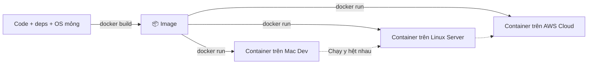
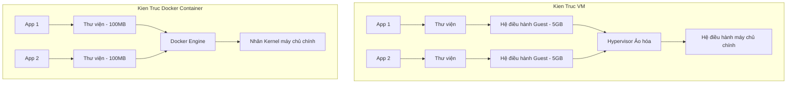
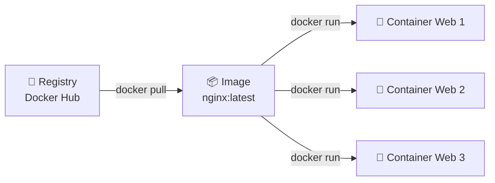
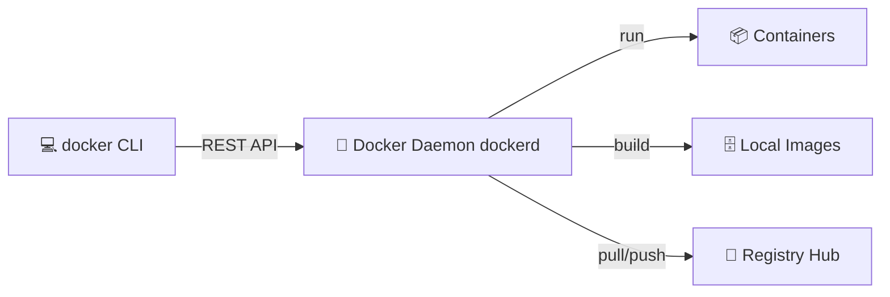

# 🎓 Bạn Ship Project, Đồng Nghiệp Bị "Works On My Machine"?

> **Tác giả:** Mr.Rom  
> **Phiên bản:** v3.0.0  
> **Tạo lúc:** 16/05/2026  
> **Cập nhật:** 26/05/2026  
> **Level:** Basic  
> **Tags:** [MUST-KNOW]  
> **Thời lượng đọc:** ~15 phút  
> **Yêu cầu trước:** Đã [Cài đặt Docker](../../setup/install-docker.md) ✅, biết Terminal cơ bản, đã đọc [Git Bộ](../../../../02_tools/git/) ✅

> [!NOTE]
> **Mục tiêu bài học:**  
> Bài học mở đầu về Docker sẽ giúp bạn hiểu sâu sắc lý do tại sao công nghệ Container hóa ra đời để giải quyết triệt để vấn đề xung đột môi trường ("works on my machine"), phân biệt rõ ràng bản chất giữa Container và Máy ảo (VM), và làm quen với 3 khái niệm trụ cột: *Image*, *Container*, và *Registry*. Bài học này tập trung vào tư duy cốt lõi, hoàn toàn không yêu cầu bạn phải ghi nhớ cú pháp lệnh ngay lập tức.

---

## 🎯 Sau Bài Học Này Bạn Sẽ:

- [x] Thấu hiểu triệt để "nỗi đau" xung đột môi trường và cách Docker giải quyết nó.
- [x] Phân biệt rõ ràng bản chất kỹ thuật giữa **Container** và **Máy ảo (Virtual Machine - VM)**.
- [x] Làm chủ 3 khái niệm cốt lõi: **Image** (Bản thiết kế), **Container** (Trạng thái chạy), và **Registry** (Kho chứa).
- [x] Hiểu cấu trúc vận hành ngầm của Docker Engine bên dưới hệ thống.
- [x] Nắm rõ quy trình workflow chuẩn từ viết code cho đến khi chạy container.

---

## 💡 Bạn Vừa Ship Project Lên GitHub: Đồng Nghiệp Pull Về Và... Crash!

Sau khi hoàn thành bộ bài học Git, bạn vô cùng tự tin đẩy mã nguồn dự án `myapp` lên GitHub. Chiều thứ Hai, một đồng nghiệp Frontend mới gia nhập đội ngũ bắt đầu thiết lập máy tính cá nhân để chuẩn bị code.

Đồng nghiệp tiến hành clone dự án:
```bash
git clone https://github.com/acmeshop/myapp
cd myapp
```

Tài liệu hướng dẫn ghi rõ: *"Hãy chạy lệnh `pip install -r requirements.txt` rồi khởi chạy `python main.py`"*. Đồng nghiệp làm theo:

```bash
pip install -r requirements.txt
```

🔥 **Lỗi thứ 1:**
```text
ERROR: Python 3.9 detected. Need Python 3.11+
```
Đồng nghiệp đang dùng Python 3.9, trong khi code của bạn yêu cầu Python 3.11+. Họ tốn 20 phút để nâng cấp Python.

```bash
pip install -r requirements.txt
```

🔥 **Lỗi thứ 2:**
```text
error: psycopg2 requires pg_config — Postgres dev headers missing
```
Lần này hệ thống thiếu thư viện kết nối Database. Đồng nghiệp phải tốn tiếp 15 phút Google và cài đặt các thư viện C hỗ trợ cho PostgreSQL.

```bash
python main.py
```

🔥 **Lỗi thứ 3:**
```text
ConnectionRefusedError: Cannot connect to PostgreSQL on localhost:5432
```
Đồng nghiệp chưa cài và chạy PostgreSQL trên máy. Họ phải tải Postgres 16 (trong khi bạn dùng bản 15), cấu hình tài khoản, mật khẩu. Tốn tiếp **40 phút**.

Chưa dừng lại ở đó: Hệ thống của bạn cần thêm bộ đệm **Redis** và hàng đợi **Celery**. Đồng nghiệp lại phải lọ mọ cài đặt thêm. Tốn thêm **30 phút**.

👉 **Kết quả:** Đồng nghiệp tốn hơn **2 tiếng đồng hồ** vật lộn mà vẫn chưa thể chạy được ứng dụng lên để code. Họ chưa viết được một dòng code nào và vô cùng ức chế.

Sếp đi ngang qua, chứng kiến cảnh tượng hỗn loạn đó và chỉ để lại đúng một câu:

> *"Sao các bạn không dùng Docker?"*

Bạn sững người lại. Câu nói này có giọng điệu giống hệt câu sếp từng nói khi bạn làm mất cả ngày code vì không dùng Git. Bạn bắt đầu tìm kiếm: *"Bản chất của Docker là gì?"* — Đây chính là thời điểm bạn cần đọc bài viết này!

---

## 1️⃣ Tại Sao Docker Là Công Cụ Bắt Buộc Phải Có Của DevOps?

Quay trở lại tình huống trên, 3 lỗi lỗi đồng nghiệp gặp phải đều thuộc về một trạng thái kinh điển gọi là **"Dependency Hell" (Địa ngục thư viện)** — khi môi trường máy tính của mỗi người khác nhau (khác phiên bản Python, khác phiên bản database, thiếu thư viện hệ thống).

Docker giải quyết triệt để nỗi đau này bằng cách: Đóng gói toàn bộ **Mã nguồn ứng dụng + Trình thông dịch Python + Toàn bộ thư viện phụ thuộc + Database Postgres + Cache Redis + Một lớp OS Linux siêu mỏng** vào trong các **Container** di động.



Chỉ với một dòng lệnh duy nhất: `docker compose up`, toàn bộ hệ thống của đồng nghiệp sẽ tự động khởi chạy hoàn hảo chỉ trong vòng 5 phút! Không cần cài đặt thủ công bất kỳ dịch vụ nào lên máy chủ chính.

### Bảng so sánh hiệu quả thực chiến:

| Tình huống thực tế | Khi KHÔNG dùng Docker | Khi CÓ Docker |
| :--- | :--- | :--- |
| **Setup máy Dev mới** | Đọc tài liệu dài dòng, cài đặt 20 công cụ, tốn 1-2 ngày sửa lỗi xung đột. | Gõ lệnh `docker compose up` -> 5 phút chạy ngay. |
| **Triển khai Production** | *"Hy vọng phiên bản trên server giống hệt máy mình để không bị crash!"* | Image chạy trên máy dev được bê nguyên vẹn lên server chạy thật. |
| **Xung đột phiên bản** | Dự án A cần Python 3.8, dự án B cần Python 3.11 -> Xung đột hệ thống. | Mỗi dự án nằm gọn trong 1 Container cô lập, không ai đụng chạm ai. |
| **Onboard nhân viên mới** | Tốn 1 tuần để setup máy và làm quen môi trường. | Tốn 1 giờ clone code và khởi chạy container. |
| **Mở rộng hệ thống (Scale)** | Cài đặt thủ công từng máy chủ cực kỳ chậm chạp và dễ sai sót. | Nhân bản hàng loạt N container mới trong vòng vài giây. |

> [!TIP]
> **Nhận định từ Mr.Rom:**  
> Container hóa bằng Docker chính là nền tảng cốt lõi của toàn bộ thế giới DevOps hiện đại: Từ kiến trúc *Microservices*, hệ thống đường ống tự động hóa *CI/CD*, cho đến trình điều phối khổng lồ *Kubernetes*. Không học Docker, bạn hoàn toàn không thể bước chân vào con đường DevOps chuyên nghiệp.

---

## 2️⃣ Bản Chất Của Docker Thực Sự Là Gì?

**Định nghĩa thực tế:** Docker là một nền tảng mã nguồn mở đóng gói ứng dụng và toàn bộ môi trường phụ thuộc của nó vào trong một **Container** cô lập, gọn nhẹ, chạy nhất quán trên mọi hệ điều hành có cài đặt Docker Engine.

> [!NOTE]
> **Ẩn dụ:**  
> Hãy tưởng tượng Docker giống như các **thùng Lego đóng kín**. Bên trong chiếc hộp Lego đó đã chứa sẵn tivi, tủ lạnh, giường ngủ (code, database, config). Bất kể nền nhà của bạn làm bằng gỗ (Mac), gạch (Windows) hay xi măng (Linux), bạn chỉ cần đặt hộp Lego lên connector tiêu chuẩn của nó là mọi thứ bên trong hộp lập tức hoạt động hoàn hảo!

### Phân biệt Container vs Máy ảo (Virtual Machine - VM)

Đây là câu hỏi phỏng vấn kinh điển. Cả hai đều tạo ra môi trường cô lập, nhưng cơ chế kỹ thuật bên dưới khác nhau một trời một vực:

| Tiêu chí so sánh | Máy ảo (VM - VirtualBox / VMware) | Container (Docker) |
| :--- | :--- | :--- |
| **Cơ chế hoạt động** | Mỗi VM mang theo một **Hệ điều hành đầy đủ** (bao gồm cả nhân Kernel riêng). | Sử dụng chung (chia sẻ) **nhân Kernel của máy chủ chính**, chỉ đóng gói tầng ứng dụng. |
| **Thời gian khởi động** | Tốn từ 1 - 5 phút (Vì phải boot toàn bộ hệ điều hành). | Chỉ tốn từ **1 - 5 giây** (Chỉ là khởi chạy một tiến trình cô lập). |
| **Dung lượng đĩa cứng** | Cực kỳ nặng (Từ 5 GB - 20 GB cho mỗi máy ảo). | Siêu nhẹ (Chỉ từ **50 MB - 1 GB**). |
| **Tiêu tốn tài nguyên** | Nặng nề (Phải cấp phát cứng RAM/CPU cho từng máy ảo). | Nhẹ nhàng (Cấp phát động và chia sẻ RAM/CPU linh hoạt với máy chủ). |
| **Mật độ triển khai** | Chỉ chạy được khoảng 5 - 10 VM trên một máy vật lý. | Có thể chạy hàng **trăm Container** trên cùng một máy vật lý. |
| **Mức độ cách ly** | Cực kỳ mạnh mẽ nhờ ảo hóa phần cứng (Hypervisor). | Yếu hơn (cách ly cấp tiến trình bằng phần mềm của Linux). |



---

### Ba khái niệm cốt lõi cấu thành nên hệ sinh thái Docker:

Để làm chủ Docker, bạn bắt buộc phải hiểu rõ mối quan hệ giữa 3 khái niệm này (Tương tự như OOP: 1 Class có thể tạo ra nhiều Object):

| Khái niệm | Định nghĩa kỹ thuật | Ẩn dụ thực tế |
| :--- | :--- | :--- |
| **Image** | Bản snapshot read-only chứa toàn bộ cấu trúc thư mục, mã nguồn và môi trường của app. Đây là một file tĩnh, không thể chỉnh sửa. | **Bản vẽ thiết kế** chi tiết của ngôi nhà hoặc công thức nấu ăn. |
| **Container** | Một thực thể (Instance) đang hoạt động được khởi tạo trực tiếp từ Image. Bạn có thể bật, tắt, xóa container thoải mái. | **Ngôi nhà thực tế** đã được xây dựng từ bản vẽ hoặc món ăn thực tế đã nấu xong. |
| **Registry** | Máy chủ lưu trữ và chia sẻ các Image (ví dụ mặc định là Docker Hub). | **Cửa hàng sách** chứa hàng ngàn bản vẽ thiết kế để bạn tải về. |



---

## 3️⃣ Bên Dưới Lớp Vỏ: Docker Hoạt Động Như Thế Nào?

Khi bạn gõ một câu lệnh như `docker run`, có 4 thành phần chính phối hợp nhịp nhàng bên dưới hệ thống:



*   **Docker CLI (`docker`):** Là công cụ dòng lệnh mà bạn tương tác trực tiếp. Khi bạn gõ lệnh, CLI sẽ chuyển hóa nó thành các cuộc gọi REST API.
*   **Docker Daemon (`dockerd`):** Là dịch vụ nền chạy liên tục trên hệ thống. Nó tiếp nhận yêu cầu từ CLI để thực hiện quản lý các Image, Container, Volume và Network.
*   **LOW-LEVEL RUNTIME (`containerd` & `runc`):** Là công cụ cấp thấp thực tế giao tiếp với nhân hệ điều hành Linux để tạo lập container.
*   **Tính năng nhân Linux (Namespaces & Cgroups):** Docker thực chất không làm ảo hóa, nó chỉ là một lớp bọc thân thiện sử dụng 2 tính năng có sẵn của hệ điều hành Linux:
    *   *Namespaces:* Tạo ra ranh giới cô lập (filesystem riêng, mạng riêng, tiến trình riêng).
    *   *Control Groups (Cgroups):* Giới hạn tài nguyên phần cứng (Container này chỉ được dùng tối đa 1 CPU và 512MB RAM).

### Vòng lặp công việc chuẩn của DevOps (Workflow):

Mỗi ngày làm việc với Docker của một kỹ sư DevOps sẽ xoay quanh vòng lặp 5 bước khép kín sau:

```text
Bước 1: Viết file Dockerfile (Tệp mô tả công thức dựng Image)
       ↓
Bước 2: Chạy lệnh "docker build" -> Biên dịch thành một Image tĩnh
       ↓
Bước 3: Chạy lệnh "docker push" -> Tải Image lên Registry (Docker Hub)
       ↓
Bước 4: Sang máy chủ khác, chạy "docker pull" -> Tải Image về máy mới
       ↓
Bước 5: Chạy lệnh "docker run" -> Khởi tạo Container chạy thực tế
```

---

## 4️⃣ Các Tình Huống Thực Chiến Của Docker Trong Năm 2026

### 1. Thiết lập môi trường phát triển local siêu tốc
Đây là ứng dụng phổ biến nhất. Chỉ bằng 1 file cấu hình `docker-compose.yml`, bạn có thể khởi chạy toàn bộ stack công nghệ phức tạp gồm: Web App, Database PostgreSQL, Cache Redis, Queue RabbitMQ chỉ với 1 dòng lệnh:
```bash
docker compose up
```

---

### 2. Thiết lập quy trình kiểm thử tự động trong CI/CD Pipeline
Mọi bước kiểm thử tự động của dự án sẽ được thực thi bên trong một container cô lập. Điều này đảm bảo môi trường chạy test sạch sẽ 100% và giống hệt môi trường chạy thật trên Cloud.

---

### 3. Triển khai các dịch vụ siêu nhẹ trên máy chủ đám mây (Cloud Server)
Giúp bạn dễ dàng triển khai ứng dụng lên các dịch vụ container hiện đại của các nhà cung cấp đám mây lớn như *AWS ECS, GCP Cloud Run, Azure Container Apps* mà không cần bận tâm đến việc quản lý máy chủ vật lý bên dưới.

---

### 4. Triển khai nhanh các cơ sở dữ liệu để chạy thử nghiệm
Thay vì mất cả tiếng đồng hồ cài đặt và cấu hình PostgreSQL hay MySQL lên máy, bạn chỉ cần gõ đúng 1 dòng lệnh để có ngay một database chạy độc lập trong vòng 5 giây:
```bash
docker run -d -p 5432:5432 -e POSTGRES_PASSWORD=mysecret postgres:16
```

---

## 💡 Giải Đáp Thắc Mắc Kinh Điển Của Người Mới Bắt Đầu

### 1. "Docker có thay thế hoàn toàn máy ảo (VM) không?"
**KHÔNG.** Máy ảo và Container là hai công nghệ bổ trợ cho nhau chứ không tiêu diệt nhau.
*   Bạn chọn **VM** khi cần chạy một hệ điều hành khác hoàn toàn (chạy Windows trên MacBook chip Intel) hoặc yêu cầu mức độ bảo mật cách ly phần cứng tối đa.
*   Bạn chọn **Docker** khi cần đóng gói ứng dụng, tối ưu hóa tốc độ triển khai và tiết kiệm RAM/CPU.
*   *Thực tế:* Trong các doanh nghiệp lớn, người ta thường thuê các máy ảo VM trên đám mây (như AWS EC2) rồi cài đặt Docker Engine trên đó để chạy hàng trăm container.

### 2. "Hình như chạy Docker trên máy Mac bị chậm và tốn pin hơn?"
**ĐÚNG VẬY.** Do macOS không chạy nhân Kernel Linux nên Docker Desktop bắt buộc phải khởi chạy một máy ảo Linux siêu nhẹ ngầm bên dưới máy Mac để làm cầu nối. Việc này gây tiêu tốn thêm khoảng 20-30% tài nguyên so với việc chạy Docker native trên Linux.  
*   **Giải pháp:** Vào năm 2026, công cụ **OrbStack** đang nổi lên như một vị cứu tinh thay thế hoàn hảo cho Docker Desktop trên Mac nhờ tốc độ khởi động chỉ 2 giây và cực kỳ tiết kiệm pin.

---

## 📚 Thuật Ngữ Cần Nhớ (Glossary)

*   **Container:** Tiến trình cô lập chạy từ Image, chứa app và dependencies.
*   **Image:** Bản thiết kế read-only tĩnh chứa cấu trúc filesystem của ứng dụng.
*   **Registry:** Kho lưu trữ trực tuyến để quản lý và chia sẻ các Image (như Docker Hub).
*   **Daemon (`dockerd`):** Dịch vụ nền chạy ngầm chịu trách nhiệm quản lý toàn bộ tài nguyên Docker.
*   **Namespace:** Tính năng của Linux dùng để cô lập hoàn toàn môi trường của container.
*   **Cgroup:** Tính năng của Linux dùng để giới hạn RAM, CPU cấp phát cho container.

---

## 🔗 Liên kết bài học tiếp theo

Móng đã đào xong, hãy cùng Mr.Rom bước vào những bài thực hành đầu tiên:

*   ⬅️ **Bài trước:** [Hướng dẫn cài đặt môi trường Docker trên mọi OS](../../setup/install-docker.md)
*   ➡️ **Bài tiếp theo:** [Bài 01: Làm chủ 8 câu lệnh điều khiển Image và Container cơ bản](./01_images-and-containers.md)
*   🧭 **Tấm bản đồ sự nghiệp:** [DevOps Engineer Career Roadmap](../../../../00_roadmaps/career/devops-engineer_career-roadmap.md)

---

## 📌 Nhật ký thay đổi (Changelog)

*   **v1.0.0 (16/05/2026)** — Bản đầu tiên giới thiệu khái niệm Container vs VM và 3 khái niệm cốt lõi.
*   **v2.3.0 (25/05/2026)** — Tinh chỉnh nhẹ cấu trúc của tác giả cũ.
*   **v3.0.0 (26/05/2026)** — **Bản nâng cấp Premium bởi Mr.Rom** — Chuẩn hóa tác giả thành Mr.Rom đồng bộ; chuyển đổi 100% Alerts cũ sang GitHub Alerts tiêu chuẩn; tinh chỉnh tiêu đề H1 và các tiêu đề H2 thành dạng câu hỏi mở tư duy; nâng cấp văn phong truyền cảm hứng DevOps master thực chiến sắc bén.
