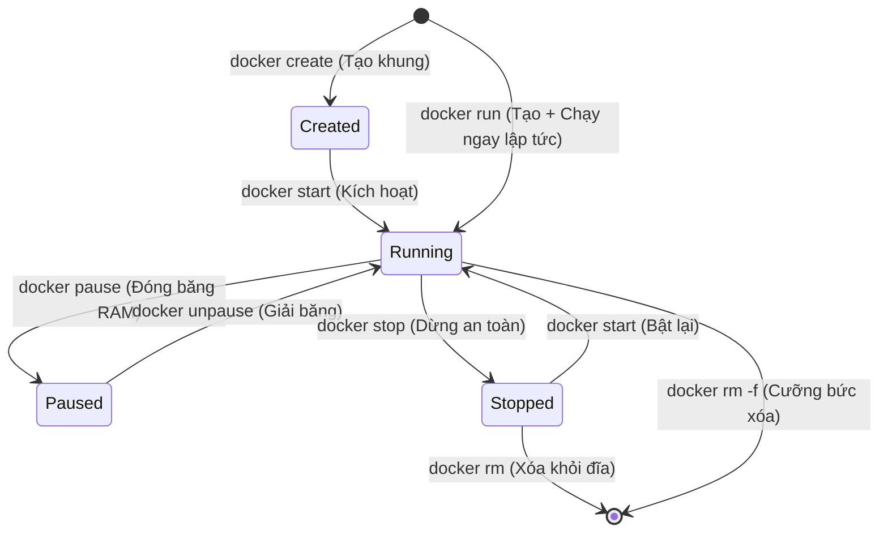

# 🎓 Làm Chủ 8 Lệnh Điều Khiển Image Và Container Cơ Bản

> **Tác giả:** Mr.Rom  
> **Phiên bản:** v3.0.0  
> **Tạo lúc:** 16/05/2026  
> **Cập nhật:** 26/05/2026  
> **Level:** Basic  
> **Tags:** [MUST-KNOW]  
> **Thời lượng đọc:** ~25 phút (kèm thực hành)  
> **Yêu cầu trước:** [Bài 00: Bản chất của Docker](./00_what-is-docker.md), đã [Cài đặt Docker](../../setup/install-docker.md) chạy được.

> [!NOTE]
> **Mục tiêu bài học:**  
> Sau khi đã nắm rõ bản chất lý thuyết của Container, việc mở Docker Desktop lên và đứng trước một cửa sổ dòng lệnh trống trơn sẽ khiến bạn bối rối không biết gõ gì tiếp theo. Bài học này sẽ giúp bạn làm chủ **8 câu lệnh điều khiển cốt lõi (bộ CRUD)** được sử dụng hàng ngày trong công việc thực tế của một kỹ sư DevOps: *pull*, *run*, *ps*, *stop*, *rm*, *logs*, *exec*, *images*.

---

## 🎯 Sau Bài Học Này Bạn Sẽ:

- [x] Tải thành thạo các Image từ Docker Hub về máy local với các thẻ Tag thích hợp.
- [x] Khởi chạy Container với đầy đủ cấu hình thực tế chuyên nghiệp (Port mapping, detached mode, env, volume, auto remove).
- [x] Giám sát trạng thái hoạt động và theo dõi log thời gian thực của container để debug lỗi.
- [x] Chui vào bên trong Container đang chạy để thực thi lệnh trực tiếp.
- [x] Thành thạo quy trình dừng, xóa container và dọn dẹp đĩa cứng sạch sẽ để tối ưu hóa tài nguyên.

---

## 💡 Mở Docker Lên Lần Đầu: Đứng Trước 100+ Lệnh Và Sự Bối Rối!

Bạn vừa thấu hiểu cuộc cách mạng Container hóa ở bài trước. Bạn mở ứng dụng Docker Desktop lên — một giao diện đen xám hoàn toàn trống trơn xuất hiện. Bạn mở Terminal lên và gõ:

```bash
docker --version
# Kết quả: Docker version 26.0.0
```

Docker đã sẵn sàng hoạt động. Nhưng **"gõ lệnh đầu tiên là gì bây giờ?"**. Bạn thử tìm kiếm trên Google *"docker tutorial"* và ngay lập tức rơi vào ma trận: 47 tab mở ra, mỗi bài viết dạy một thứ tự lệnh khác nhau, câu lệnh sau đá câu lệnh trước làm bạn hoàn toàn rối bời.

Bạn quay sang hỏi người đàn anh đi trước (Leader DevOps):

> *"Anh ơi, hệ thống Docker có tới hơn 100 câu lệnh và hàng trăm tham số đi kèm, em nên bắt đầu học từ đâu để có thể làm việc được ngay ạ?"*

Anh Leader mỉm cười và vỗ vai bạn: *"Thực tế mỗi ngày đi làm, anh chỉ sử dụng xoay quanh đúng 8 câu lệnh cốt lõi. Em chỉ cần làm chủ thật vững vàng 8 câu lệnh đó là đã có thể xử lý được 80% công việc Docker hàng ngày rồi!"*

Bài học này chính là **"bộ lệnh CRUD thần thánh"** dành cho Container mà anh Leader đã truyền lại cho bạn!

---

## 1️⃣ Tám Lệnh "CRUD Container" Kinh Điển Chiếm 80% Công Việc Hàng Ngày

Tương tự như các thao tác thêm, sửa, xóa dữ liệu trong cơ sở dữ liệu (CRUD), việc quản lý vòng đời của các Container trong Docker cũng xoay quanh một bộ lệnh tương tự:

| Thao tác | Câu lệnh Docker tương ứng | Ý nghĩa thực tế |
| :--- | :--- | :--- |
| **Create** (Tạo lập) | `docker pull` <br> `docker run` | Tải bản vẽ thiết kế (Image) về máy. <br> Khởi dựng và kích hoạt container hoạt động. |
| **Read** (Giám sát) | `docker ps` <br> `docker images` <br> `docker logs` <br> `docker inspect` | Xem các container đang chạy. <br> Xem danh sách image có sẵn trên máy. <br> Xem log nhật ký hoạt động. <br> Xem chi tiết cấu hình mạng/ổ đĩa. |
| **Update** (Chỉnh sửa) | `docker exec` <br> `docker restart` | Chui vào container đang chạy để sửa. <br> Khởi động lại container. |
| **Delete** (Xóa bỏ) | `docker stop` <br> `docker rm` <br> `docker rmi` | Dừng hoạt động của container một cách an toàn. <br> Xóa container khỏi bộ nhớ. <br> Xóa image khỏi đĩa cứng. |

---

## 2️⃣ Vòng Đời Của Container: Điểm Tựa Để Quản Lý Trạng Thái

Trước khi gõ lệnh, bạn bắt buộc phải hiểu các trạng thái vật lý của một container trong RAM và đĩa cứng máy tính:



| Trạng thái | Ý nghĩa kỹ thuật bên dưới | Tiêu thụ tài nguyên |
| :--- | :--- | :--- |
| **Created** | Container đã được dựng khung xương từ Image nhưng chưa được kích hoạt chạy. | Chỉ tốn một lượng nhỏ ổ cứng (Disk). |
| **Running** | Container đang hoạt động, mã nguồn bên trong đang thực thi. | Tiêu tốn đĩa cứng, **RAM và CPU** của máy. |
| **Paused** | Toàn bộ các tiến trình bên trong container bị đóng băng (Freeze). | Chỉ giữ RAM để lưu trạng thái, tạm dừng tiêu thụ CPU. |
| **Stopped** | Container đã bị tắt, tiến trình chính đã dừng hoàn toàn. | Chỉ còn lưu vết trên đĩa cứng để có thể start lại bất cứ lúc nào. |
| **Removed** | Container bị xóa sạch hoàn toàn khỏi đĩa cứng và bộ nhớ. | Hoàn toàn biến mất, giải phóng bộ nhớ. |

> [!NOTE]
> Câu lệnh **`docker run`** là tổ hợp phím tắt gộp cả hai hành vi: **`docker create`** (tạo khung) và **`docker start`** (bật nguồn) chạy cùng một lúc. Đây là lệnh được sử dụng nhiều nhất trong Docker.

---

## 3️⃣ Thực Hành: Làm Chủ 8 Lệnh Điều Khiển Cốt Lõi

---

### 🛠️ 3.1 `docker pull` — Tải bản thiết kế (Image) về máy

Lệnh này dùng để kéo một Image từ Registry (mặc định là Docker Hub) về máy cá nhân của bạn. Nó giống như lệnh `git clone` — bạn chỉ cần thực hiện 1 lần duy nhất để lưu vào bộ nhớ cache của máy:

```bash
# Bước 1: Kéo phiên bản mới nhất của máy chủ Web Nginx về máy
docker pull nginx:latest
```

Cấu trúc định dạng tên Image: `<tên_image>:<thẻ_tag>`.  
*   Nếu bạn bỏ qua phần thẻ tag, Python/Docker sẽ tự động hiểu bạn muốn tải bản `:latest` (mới nhất).
*   Thẻ tag có vai trò như số phiên bản để bạn kiểm soát chính xác môi trường:

```bash
docker pull nginx:1.25         # Tải chính xác phiên bản Nginx 1.25
docker pull nginx:alpine       # Tải bản phân phối siêu nhẹ Alpine (Chỉ khoảng 20MB)
docker pull python:3.12-slim   # Tải môi trường Python 3.12 rút gọn siêu sạch
```

> [!WARNING]
> **Quy tắc an toàn hệ thống (Best Practice):**  
> Tuyệt đối không bao giờ sử dụng tag `:latest` khi triển khai các dự án thực tế trên máy chủ chạy thật (Production). Bản latest sẽ thay đổi giá trị liên tục mỗi khi hãng cập nhật code mới, dễ gây ra lỗi không tương thích phiên bản. Hãy luôn chỉ định rõ số phiên bản cụ thể (ví dụ: `nginx:1.25.3-alpine`).

---

### 🛠️ 3.2 `docker images` — Kiểm tra các bản thiết kế sẵn có trên máy

Liệt kê toàn bộ các Image bạn đã tải về máy thành công trước khi tiến hành khởi chạy:

```bash
docker images
```
Màn hình sẽ hiển thị cấu trúc bảng 5 cột rõ ràng:
```text
REPOSITORY   TAG       IMAGE ID       CREATED        SIZE
nginx        latest    abc123def456   2 weeks ago    187MB
nginx        alpine    def789ghi012   1 month ago    23MB
python       3.12      ghi345jkl678   3 weeks ago    1.02GB
hello-world  latest    jkl901mno234   6 months ago   13.3kB
```
*   `REPOSITORY`: Tên của ứng dụng.
*   `TAG`: Số hiệu phiên bản.
*   `IMAGE ID`: Mã băm SHA độc nhất đại diện cho file Image tĩnh trong RAM.
*   `SIZE`: Dung lượng thực tế chiếm dụng trên đĩa cứng (Hãy chú ý bản `alpine` nhẹ hơn bản `latest` thông thường tới 8 lần!).

---

### 🛠️ 3.3 `docker run` — Khởi dựng và kích hoạt Container (Lệnh quan trọng nhất)

Lệnh này chứa hàng loạt tham số (Flags) thực chiến cực kỳ quan trọng để cấu hình container:

#### 1. Chạy ngầm dưới nền bằng cờ `-d` (Detached mode)
Nếu chạy mặc định không có cờ `-d`, cửa sổ Terminal của bạn sẽ bị "khóa cứng" để hiển thị log của container. Hãy thêm cờ `-d` để đẩy container chạy ngầm dưới nền, giải phóng Terminal để gõ lệnh khác:

```bash
# Chạy nền máy chủ Nginx
docker run -d nginx
```
Hệ thống sẽ trả về một chuỗi mã băm SHA dài đại diện cho ID của container vừa tạo.

#### 2. Ánh xạ cổng kết nối ra ngoài bằng cờ `-p` (Port mapping)
Ứng dụng chạy bên trong container hoàn toàn bị cô lập mạng. Để người dùng bên ngoài có thể truy cập được thông qua trình duyệt, bạn phải thực hiện thông cổng:

```bash
# Cú pháp: -p <cổng_ngoài_máy_chủ>:<cổng_trong_container>
docker run -d -p 8080:80 nginx
```
*Ý nghĩa:* Người dùng truy cập cổng 8080 ngoài máy của bạn sẽ được Docker tự động điều hướng đi vào cổng 80 của container Nginx.

#### 3. Đặt tên gợi nhớ thân thiện bằng cờ `--name`
Nếu bạn không đặt tên, Docker sẽ tự động gán cho container một cái tên ngẫu nhiên rất khó nhớ (ví dụ: `focused_curie`). Hãy luôn đặt tên để dễ quản lý, dừng, xóa sau này:

```bash
docker run -d -p 8080:80 --name web-cong-ty nginx
```

#### 4. Truyền cấu hình biến môi trường bằng cờ `-e` (Environment Variables)
```bash
docker run -d \
  -p 5432:5432 \
  --name db-postgres \
  -e POSTGRES_PASSWORD=my_secret_key \
  -e POSTGRES_USER=admin_user \
  postgres:16
```
*Ý nghĩa:* Truyền trực tiếp mật khẩu và tài khoản quản trị vào container cơ sở dữ liệu PostgreSQL 16 một cách chuyên nghiệp.

#### 5. Gắn ổ đĩa ảo lưu trữ dữ liệu bền vững bằng cờ `-v` (Volume Mount)
Mặc định, khi container bị xóa, mọi dữ liệu phát sinh bên trong nó cũng sẽ bị biến mất vĩnh viễn. Để bảo vệ dữ liệu database, hãy gắn ổ đĩa ngoài máy chủ vào container:

```bash
docker run -d \
  --name db-postgres \
  -e POSTGRES_PASSWORD=my_secret \
  -v ~/postgres-data:/var/lib/postgresql/data \
  postgres:16
```
*Ý nghĩa:* Toàn bộ dữ liệu database phát sinh sẽ được lưu trực tiếp vào thư mục `~/postgres-data` trên máy chủ của bạn. Container có bị xóa đi hay sập thì dữ liệu vẫn được bảo vệ tuyệt đối!

#### 6. Chạy container tương tác shell bằng cờ `-it` (Interactive & TTY)
Dùng khi bạn muốn khởi chạy một hệ điều hành và chui trực tiếp vào bên trong để gõ lệnh tương tác thời gian thực:

```bash
# Khởi chạy hệ điều hành Ubuntu và mở trình gõ lệnh bash shell trực tiếp
docker run -it ubuntu bash
root@abc123def:/# _  (Bạn đã ở bên trong máy ảo Ubuntu!)
```
*Lưu ý:* Gõ lệnh `exit` để thoát ra ngoài.

---

### 🛠️ 3.4 `docker ps` — Giám sát các container đang hoạt động

Lệnh này giúp bạn xem danh sách các container đang chạy thực tế trong RAM:

```bash
docker ps
```
Màn hình hiển thị:
```text
CONTAINER ID   IMAGE         STATUS         PORTS                  NAMES
abc123def456   nginx         Up 5 minutes   0.0.0.0:8080->80/tcp   web-cong-ty
def789ghi012   postgres:16   Up 2 minutes   0.0.0.0:5432->5432/tcp db-postgres
```

> [!TIP]
> **Xem tất cả các container kể cả các container đã bị tắt:**  
> Hãy thêm cờ `-a` (All) để xem danh sách đầy đủ: `docker ps -a`. Lệnh này cực kỳ hữu ích để debug tìm xem container nào bị sập ngầm và mã lỗi (Exit Code) của nó là bao nhiêu.

---

### 🛠️ 3.5 `docker logs` — Xem nhật ký hoạt động (Logs) của Container

Khi ứng dụng chạy ngầm gặp lỗi (ví dụ Database bị lỗi mật khẩu nên tự động sập), bạn cần xem log nhật ký để tìm nguyên nhân:

```bash
# Xem toàn bộ log của container db-postgres
docker logs db-postgres

# Xem realtime liên tục (Follow) giống lệnh tail -f của Linux
docker logs -f db-postgres
# Nhấn Ctrl + C để thoát khỏi màn hình xem log realtime

# Chỉ xem 50 dòng log cuối cùng để tránh bị tràn màn hình Terminal
docker logs --tail 50 db-postgres
```

---

### 🛠️ 3.6 `docker exec` — Chui vào bên trong Container đang hoạt động

Lệnh này cực kỳ mạnh mẽ, cho phép bạn nhảy trực tiếp vào bên trong một container đang chạy ngầm để kiểm tra file cấu hình, cài đặt thêm công cụ hoặc kiểm tra database trực tiếp:

```bash
# Cú pháp: docker exec -it <tên_container> <lệnh_shell_muốn_chạy>
docker exec -it web-cong-ty bash   # Hoặc dùng "sh" nếu image tối giản không có bash
```
Bạn sẽ ở bên trong thư mục của Container Nginx, có thể xem cấu hình:
```bash
root@web-cong-ty:/# cat /etc/nginx/nginx.conf
root@web-cong-ty:/# exit  # Thoát ra ngoài máy chính, container vẫn chạy ngầm bình thường
```

---

### 🛠️ 3.7 `docker stop` & `docker rm` — Quy trình dừng và xóa container an toàn

Quy trình gỡ bỏ một container khỏi bộ nhớ máy tính gồm 2 bước bắt buộc:

```bash
# Bước 1: Dừng container một cách êm ái (Gửi tín hiệu SIGTERM để app dọn dẹp kết nối rồi tắt)
docker stop web-cong-ty

# Bước 2: Xóa container vật lý khỏi đĩa cứng sau khi đã dừng hoạt động
docker rm web-cong-ty
```

> [!TIP]
> **Mẹo xóa nhanh cưỡng bức (Force remove):**  
> Bạn có thể gộp 2 bước trên thành 1 lệnh duy nhất bằng cách thêm cờ `-f` (Force). Lệnh này sẽ gửi tín hiệu SIGKILL tắt đột ngột container và xóa nó đi ngay lập tức:  
> `docker rm -f web-cong-ty`

---

### 🛠️ 3.8 `docker rmi` — Xóa file Image khỏi ổ cứng máy tính

Khi bạn không còn nhu cầu xây dựng container từ Image này nữa và muốn giải phóng ổ cứng:

```bash
docker rmi nginx:alpine
```
*Lưu ý:* Bạn không thể xóa một Image nếu đang có bất kỳ container nào (kể cả container đã stopped) được khởi tạo từ nó. Hãy xóa container trước rồi mới xóa image.

---

## 4️⃣ Bảo Trì Hệ Thống: Nghệ Thuật Dọn Dẹp Tài Nguyên Dư Thừa

Sau một thời gian học tập, máy tính của bạn sẽ tích tụ hàng tá Image nháp và container mồ côi chiếm hàng chục GB ổ cứng. Hãy dọn dẹp hệ thống sạch sẽ bằng lệnh dọn dẹp tổng lực:

```bash
# Xóa sạch toàn bộ container đã dừng, mạng ảo thừa và image không tên (dangling)
docker system prune

# Dọn dẹp triệt để hơn bao gồm cả những image đã tải về lâu ngày không dùng đến
docker system prune -a
```

---

## 🛠️ Giải Quyết Bài Toán Thực Tế: Quy Trình Vận Hành 8 Lệnh Thực Chiến

Hãy tưởng tượng bạn được giao nhiệm vụ triển khai một trang web tĩnh Nginx làm trang chủ giới thiệu dự án. Chúng ta sẽ áp dụng trọn vẹn 8 lệnh vừa học theo một quy trình thực tế khép kín sau:

### Bước 1: Kéo Image chính thức từ Docker Hub về máy
```bash
# Tải bản phân phối siêu nhẹ Nginx Alpine
docker pull nginx:alpine
```

### Bước 2: Khởi chạy Container với đầy đủ cấu hình Premium
```bash
# Chạy nền (-d), map cổng 8080 (-p), đặt tên dễ nhớ (--name), tự động restart nếu sập
docker run -d -p 8080:80 --name web-intro --restart=unless-stopped nginx:alpine
```
*   *Xác minh:* Mở trình duyệt truy cập `http://localhost:8080` để thấy trang mặc định của Nginx.

### Bước 3: Kiểm tra trạng thái hoạt động của Container
```bash
# Xem container đang chạy và cổng port ánh xạ
docker ps
```

### Bước 4: Kiểm tra Logs hoạt động thực tế
```bash
# Xem 20 dòng log cuối cùng để debug kết nối
docker logs --tail 20 web-intro
```

### Bước 5: Chui vào bên trong Container để chỉnh sửa nội dung trang chủ
```bash
# Mở shell tương tác bash/sh bên trong container
docker exec -it web-intro sh
```
Chạy các lệnh sau bên trong container để thay đổi trang chủ Nginx mặc định:
```bash
# Di chuyển vào thư mục chứa file HTML trang chủ
cd /usr/share/nginx/html

# Ghi đè trang index bằng nội dung mới
echo "<h1>Chao mung ban den voi DevOps master cung Mr.Rom!</h1>" > index.html

# Thoát ra ngoài container
exit
```
*   *Xác minh:* Nhấn F5 lại trình duyệt `http://localhost:8080` và tận hưởng trang chủ mới do chính tay bạn sửa!

### Bước 6: Kiểm tra các thông số tài nguyên tiêu thụ
```bash
# Xem RAM, CPU tiêu hao thực tế của web-intro
docker stats web-intro
# Nhấn Ctrl + C để thoát màn hình stats
```

### Bước 7: Dọn dẹp sạch sẽ tài nguyên sau khi thử nghiệm xong
```bash
# Dừng container
docker stop web-intro

# Xóa container khỏi bộ nhớ đĩa
docker rm web-intro

# Xóa image đã tải để giải phóng ổ cứng
docker rmi nginx:alpine
```

---

## ⚡ Những "Cạm Bẫy" Vận Hành Và Tiêu Chuẩn Thực Chiến Của Kỹ Sư DevOps

### ❌ Cạm bẫy 1: Sự nhầm lẫn tai hại giữa `docker run` và `docker start`
*   **Sai lầm:** Rất nhiều người mới, mỗi khi muốn bật lại máy chủ database sau khi tắt máy tính, lại gõ lại lệnh `docker run -d -p 5432:5432 postgres`. Việc này sẽ tạo ra một container hoàn toàn mới tinh trong ổ cứng, làm mất sạch dữ liệu đã ghi ở phiên làm việc trước!
*   **Quy chuẩn chuẩn mực:** 
    *   Chỉ dùng `docker run` đúng **1 lần duy nhất** để khởi tạo container.
    *   Những lần sau, hãy dùng lệnh `docker start <tên_container>` để đánh thức lại container cũ hoạt động trở lại mà không mất dữ liệu.

### ❌ Cạm bẫy 2: Quên không đặt tên cho Container bằng cờ `--name`
Việc quên đặt tên khiến hệ thống tự động gán các tên ngẫu nhiên rất khó nhớ. Bạn sẽ phải mất thêm bước gõ `docker ps` để dò tìm ID của container mỗi khi muốn dừng hoặc xem log.
*   **Quy chuẩn:** Luôn luôn khai báo `--name <tên_gợi_nhớ>` cho mọi container dịch vụ.

---

## 🧠 Thử Thách Trí Tuệ: Kiểm Tra Kiến Thức Của Bạn

**Câu hỏi 1:** Khi bạn xóa một container bằng lệnh `docker rm -f my-postgres` mà không cấu hình Volume Mount (cờ `-v`), điều gì sẽ xảy ra với dữ liệu bên trong database?
<details>
<summary>💡 Xem lời giải thích từ Mr.Rom</summary>

Dữ liệu sẽ bị **xóa sạch vĩnh viễn** và không thể khôi phục lại được! Container trong Docker được thiết kế theo triết lý *Ephemeral* (tạm thời, có thể vứt bỏ thoải mái). Dữ liệu muốn bền vững bắt buộc phải được gắn ra ổ cứng máy chủ thông qua cơ chế Volume Mount `-v`.
</details>

**Câu hỏi 2:** Cờ `-d` (Detached mode) có vai trò gì trong lệnh `docker run`?
<details>
<summary>💡 Xem lời giải thích từ Mr.Rom</summary>

Cờ `-d` đẩy container chạy ngầm dưới nền hệ thống như một dịch vụ (Daemon), giúp trả lại quyền điều khiển cửa sổ dòng lệnh Terminal để bạn có thể tiếp tục gõ các câu lệnh khác mà không bị khóa màn hình bởi log của container.
</details>

---

## 📋 Bảng Tra Cứu Nhanh (Cheatsheet) 8 Lệnh Cốt Lõi

```bash
# 1. Quản lý Image
docker pull <tên_image>:<tag>           # Tải image từ Docker Hub
docker images                           # Xem các image hiện có trên máy
docker rmi <tên_image>                  # Xóa image khỏi máy

# 2. Quản lý vòng đời Container
docker run -d -p 8080:80 --name web nginx   # Tạo mới và chạy ngầm container
docker ps -a                                # Xem toàn bộ container (cả đã stop)
docker stop web                             # Dừng container một cách êm ái
docker start web                            # Kích hoạt lại container cũ đã stop
docker rm -f web                            # Cưỡng bức dừng và xóa container lập tức

# 3. Gỡ lỗi và tương tác
docker logs -f --tail 100 web               # Xem log follow 100 dòng cuối realtime
docker exec -it web sh                      # Chui vào terminal bên trong container đang chạy
docker stats                                # Xem hiệu năng CPU/RAM của container thời gian thực
```

---

## 📚 Thuật Ngữ Cần Nhớ (Glossary)

*   **Detached mode (-d):** Chế độ chạy ngầm dưới nền hệ thống, giải phóng Terminal.
*   **Port Mapping (-p):** Kỹ thuật ánh xạ thông cổng kết nối mạng từ máy chủ vật lý đi vào bên trong container.
*   **Volume Mount (-v):** Kỹ thuật gắn ổ đĩa ngoài của máy chủ vào container để lưu trữ dữ liệu bền vững.
*   **Interactive / TTY (-it):** Chế độ tương tác dòng lệnh hai chiều trực tiếp với container.
*   **Prune (Dọn dẹp):** Lệnh dọn dẹp các tài nguyên dư thừa, rác hệ thống của Docker để giải phóng ổ cứng.

---

## 🔗 Liên kết & Tài nguyên học tập tiếp theo

### 🧭 Định hướng lộ trình học:
*   ⬅️ **Bài trước:** [Bài 00: Bản chất của Docker và Cuộc cách mạng Container hóa](./00_what-is-docker.md)
*   ➡️ **Bài tiếp theo:** [Bài 02: Tự đóng gói Image tùy biến với Dockerfile](./02_dockerfile-basics.md)
*   🧭 **Tấm bản đồ sự nghiệp:** [DevOps Engineer Career Roadmap](../../../../00_roadmaps/career/devops-engineer_career-roadmap.md)

### 🌐 Tài nguyên học tập chất lượng bên ngoài:
*   [Docker Command Line Reference](https://docs.docker.com/engine/reference/commandline/cli/) — Toàn bộ cẩm nang tra cứu lệnh đầy đủ của Docker.
*   [Play with Docker Classroom](https://training.play-with-docker.com/) — Môi trường tương tác thực hành Docker trực tuyến miễn phí.
