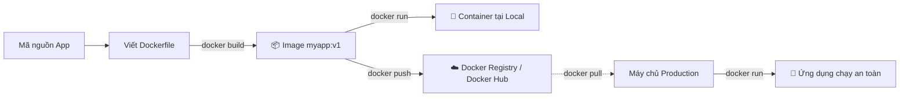

# 🎓 Tự Đóng Gói Bản Thiết Kế Với Dockerfile Custom

> 🎯 **Lời dẫn của Mr.Rom:** 
> Tiếp tục câu chuyện ở bài trước: bạn đã chạy thử container `nginx` thành công bằng lệnh `docker run`, nhưng khi bạn thử gõ lệnh `docker run myapp` để khởi chạy ứng dụng của riêng mình thì Docker lập tức báo lỗi vì image `myapp` chưa hề tồn tại trên hệ thống lẫn Docker Hub. Bài học thực chiến này sẽ đồng hành cùng bạn tự tay viết một chiếc Dockerfile chuẩn chỉnh để đóng gói và phân phối ứng dụng của chính mình tới bất kỳ môi trường nào!

## 🎯 Sau bài học này, bạn sẽ làm chủ:

- [x] Phương pháp viết Dockerfile chuẩn chỉnh cho ứng dụng Python/Node.js.
- [x] Hiểu sâu sắc và sử dụng thành thạo 8 chỉ dẫn (instruction) cốt lõi: `FROM`, `WORKDIR`, `COPY`, `RUN`, `CMD`, `EXPOSE`, `ENV`, `ARG`.
- [x] Quy trình tự động đóng gói (build) thành công image riêng của bạn bằng lệnh `docker build`.
- [x] Bản chất của cơ chế **Layer Caching** — lý do vì sao chỉ cần thay đổi thứ tự dòng lệnh có thể giúp bạn tiết kiệm hàng giờ chờ đợi.
- [x] Cách phân biệt rạch ròi giữa hai chỉ dẫn dễ nhầm lẫn: `CMD` và `ENTRYPOINT`.
- [x] Tư duy thiết lập tệp loại trừ `.dockerignore` để bảo mật và tối ưu hóa dung lượng image.

---

## Tình Huống: Làm Sao Để Đồng Nghiệp Chạy Được "Đứa Con Tinh Thần" Của Bạn Mà Không Cần Cài Đặt Môi Trường?

Bạn đã tự tin sử dụng các lệnh Docker cơ bản và chạy mượt mà những image dựng sẵn như Nginx hay PostgreSQL. Nhưng khi bạn hào hứng giới thiệu ứng dụng do chính mình viết (`myapp`) cho đồng nghiệp và chạy thử lệnh:

```bash
# Thử chạy ứng dụng của riêng mình
docker run myapp
```

Docker ngay lập tức "dội một gáo nước lạnh" với dòng thông báo lỗi:

```text
Unable to find image 'myapp:latest' locally
docker: Error response from daemon: pull access denied for myapp, repository does not exist or may require 'docker login'
```

❌ **Giải mã lỗi:** Docker không tìm thấy image `myapp` ở máy local của bạn, đồng thời trên kho tài nguyên chung (Docker Hub) cũng hoàn toàn trống trơn. Bởi vì ứng dụng này là do bạn tự phát triển, chưa có một "bản thiết kế" hay "công thức đóng gói" nào khai báo cho Docker hiểu.

Để giải quyết triệt để nỗi đau này, bạn cần trả lời được 3 câu hỏi lớn:
1. **"Build" một image cụ thể là làm những gì?**
2. Làm thế nào để đưa toàn bộ tài nguyên (mã nguồn, thư viện dependency, biến môi trường) vào trong một image độc lập?
3. Khi đã đóng gói xong, làm sao để chuyển giao cho đồng nghiệp chạy được ngay mà không cần cài thêm bất kỳ SDK nào trên máy họ?

Đáp án nằm ở **Dockerfile** — một tệp cấu hình dạng văn bản thuần túy đóng vai trò là "công thức nấu ăn" cho Docker Image. 

### Quy trình biến mã nguồn thành Container chạy trên Production

Mọi vòng đời của một ứng dụng chạy Docker đều trải qua **6 bước khép kín** dưới đây:



Chỉ cần **1 tệp Dockerfile duy nhất**, bạn có thể tạo ra một image chạy ổn định ở môi trường lập trình local của bạn, máy ảo staging của đội QA, hay hệ thống production chịu tải triệu người dùng.

---

## 1️⃣ Bản Chất Của Dockerfile: Công Thức Nấu Ăn Hay Bản Vẽ Kỹ Thuật?

Nói một cách dễ hiểu nhất: Dockerfile là một **tệp văn bản thuần** (không có phần mở rộng như `.txt`) chứa các **chỉ dẫn** (instructions) được Docker Engine đọc tuần tự từ trên xuống dưới để tự động dựng nên một Docker Image.

> [!NOTE]
> **Ẩn dụ sư phạm từ Mr.Rom:** 
> Hãy tưởng tượng Dockerfile giống như một **công thức nấu ăn**. Lòng đỏ trứng, bột mì hay sữa chính là các nguyên liệu ban đầu (Base Image). Các bước trộn bột, ủ bột, nướng bánh chính là các hành động cài đặt thư viện và sao chép mã nguồn (Instructions). Thành quả cuối cùng chính là chiếc bánh thơm ngon (Docker Image). Khi bạn giữ nguyên công thức này và mang sang bất kỳ căn bếp nào trên thế giới, bạn đều sẽ nướng ra được chiếc bánh có mùi vị y hệt nhau.

### Cú pháp viết Dockerfile cơ bản

Mỗi chỉ dẫn trong Dockerfile thường được viết bằng chữ **HOA** (để phân biệt với các tham số) và dòng lệnh có nghĩa đầu tiên luôn bắt đầu bằng chỉ dẫn `FROM`:

```dockerfile
# Mọi Dockerfile bắt đầu bằng việc chọn Base Image gốc
FROM <tên-base-image>:<tag>

# Thực hiện các bước thiết lập tiếp theo
INSTRUCTION tham-số-1 tham-số-2
```

Dưới đây là bảng tổng hợp 12 chỉ dẫn cốt lõi nhất mà bạn buộc phải ghi nhớ:

| Chỉ dẫn | Vai trò chính | Tác động thực tế |
| :--- | :--- | :--- |
| `FROM` | Chọn hệ điều hành hoặc môi trường nền tảng | Tạo lớp móng đầu tiên cho Image |
| `WORKDIR` | Đặt thư mục làm việc mặc định trong container | Tương đương lệnh `cd` trên Linux |
| `COPY` | Sao chép tệp tin từ máy chủ vật lý vào container | Đưa mã nguồn ứng dụng vào môi trường Docker |
| `RUN` | Thực thi các dòng lệnh cài đặt khi **đang build** | Cài đặt các gói phần mềm, thư viện cần thiết |
| `CMD` | Thiết lập lệnh khởi chạy mặc định khi container **start** | Lệnh chạy ứng dụng của bạn (ví dụ: chạy file server) |
| `ENTRYPOINT` | Định nghĩa điểm xuất phát cố định của container | Khó bị ghi đè hơn chỉ dẫn `CMD` |
| `EXPOSE` | Khai báo cổng kết nối (port) mà ứng dụng sử dụng | Chỉ mang tính chất ghi chú tài liệu cho người đọc |
| `ENV` | Khai báo các biến môi trường (Environment Variables) | Có hiệu lực cả lúc build lẫn lúc container đang chạy |
| `ARG` | Khai báo các biến tạm thời chỉ dùng khi build | Biến mất hoàn toàn sau khi build xong Image |
| `LABEL` | Đính kèm metadata (tác giả, phiên bản, mô tả) | Giúp quản lý thông tin qua lệnh `docker inspect` |
| `USER` | Thay đổi tài khoản người dùng chạy container | Cực kỳ quan trọng để bảo mật hệ thống (Non-root user) |
| `VOLUME` | Tạo điểm gắn kết vùng dữ liệu bền vững | Đánh dấu thư mục cần giữ lại dữ liệu khi container bị xóa |

---

## 2️⃣ Cùng Mr.Rom Viết Chiếc Dockerfile Đầu Tiên Cho Ứng Dụng Flask

Để thực sự nắm chắc lý thuyết, chúng ta sẽ cùng xây dựng một ứng dụng Python Flask siêu nhỏ và đóng gói nó bằng Dockerfile.

### Bước 2.1: Khởi tạo mã nguồn ứng dụng mẫu

Bạn hãy tạo một thư mục trống và viết 2 tệp tin nguồn đơn giản sau:

```bash
# Tạo thư mục dự án và di chuyển vào trong
mkdir my-flask-app && cd my-flask-app

# Viết mã nguồn ứng dụng Web Flask (app.py)
cat > app.py << 'EOF'
from flask import Flask
app = Flask(__name__)

@app.route("/")
def hello():
    # Phản hồi đơn giản khi người dùng truy cập trang chủ
    return "Xin chào từ thế giới Docker! Mr.Rom chúc bạn học vui vẻ!"

if __name__ == "__main__":
    # Lắng nghe trên mọi dải IP cục bộ tại cổng 5000
    app.run(host="0.0.0.0", port=5000)
EOF

# Khai báo các thư viện phụ thuộc (requirements.txt)
cat > requirements.txt << 'EOF'
flask==3.0.0
EOF
```

### Bước 2.2: Tạo tệp cấu hình Dockerfile

Ngay tại thư mục `my-flask-app`, bạn hãy tạo một tệp tin mang tên chính xác là `Dockerfile` (không viết hoa chữ `f`, không có đuôi mở rộng) với nội dung tối ưu như sau:

```dockerfile
# Bước 1: Bắt đầu từ môi trường Python 3.12 gọn nhẹ (slim)
FROM python:3.12-slim

# Bước 2: Thiết lập thư mục làm việc mặc định trong container
WORKDIR /app

# Bước 3: Sao chép tệp khai báo thư viện từ máy host vào container
COPY requirements.txt .

# Bước 4: Chạy lệnh cài đặt thư viện Python (không lưu cache để giảm dung lượng)
RUN pip install --no-cache-dir -r requirements.txt

# Bước 5: Sao chép toàn bộ mã nguồn của app vào thư mục hiện tại
COPY app.py .

# Bước 6: Tài liệu hóa cổng dịch vụ sẽ sử dụng
EXPOSE 5000

# Bước 7: Thiết lập lệnh khởi chạy ứng dụng mặc định
CMD ["python", "app.py"]
```

### Bước 2.3: Thực hiện quá trình build image

Bây giờ, chúng ta sẽ ra lệnh cho Docker đọc tệp `Dockerfile` này để tự động build ra một image mang tên `my-flask-app` phiên bản `v1`:

```bash
# Chạy lệnh build image (lưu ý dấu chấm "." ở cuối đại diện cho thư mục hiện tại)
docker build -t my-flask-app:v1 .
```

*Trong đó:*
- `docker build`: Lệnh yêu cầu Docker tiến hành đóng gói.
- `-t my-flask-app:v1`: Gán tên (`name`) và nhãn phiên bản (`tag`) cho image.
- `.`: Định nghĩa **Build Context** (Bối cảnh build) — yêu cầu Docker tải toàn bộ các tệp trong thư mục hiện tại vào bộ nhớ cache của Docker Daemon để xử lý.

Màn hình terminal sẽ hiển thị các bước đóng gói tuần tự:

```text
[+] Building 12.8s (10/10) FINISHED
 => [internal] load build definition from Dockerfile                         0.1s
 => [internal] load .dockerignore                                            0.1s
 => [internal] load metadata for docker.io/library/python:3.12-slim          1.5s
 => [1/5] FROM docker.io/library/python:3.12-slim@sha256:abc123...          4.2s
 => [2/5] WORKDIR /app                                                       0.1s
 => [3/5] COPY requirements.txt .                                            0.2s
 => [4/5] RUN pip install --no-cache-dir -r requirements.txt                 5.8s
 => [5/5] COPY app.py .                                                      0.2s
 => exporting to image                                                       0.6s
 => => writing image sha256:def456...                                        0.1s
 => => naming to docker.io/library/my-flask-app:v1                           0.0s
```

### Bước 2.4: Khởi chạy và kiểm thử container

Sau khi build thành công, hãy biến image `my-flask-app:v1` thành một container chạy thực tế bằng lệnh `docker run`:

```bash
# Khởi chạy container ở chế độ chạy ngầm (detached) và ánh xạ cổng 5000 từ host vào container
docker run -d -p 5000:5000 --name running-flask my-flask-app:v1
```

Để kiểm tra xem ứng dụng đã hoạt động ổn định chưa, bạn hãy mở trình duyệt truy cập địa chỉ `http://localhost:5000` hoặc dùng lệnh `curl` ngay trên terminal máy host:

```bash
# Gửi yêu cầu HTTP đến ứng dụng Flask đang chạy trong Docker
curl http://localhost:5000
# Output mong đợi: Xin chào từ thế giới Docker! Mr.Rom chúc bạn học vui vẻ!
```

Chúc mừng bạn! Ứng dụng Flask của bạn giờ đã chạy độc lập hoàn hảo bên trong chiếc container biệt lập. Để dọn dẹp hệ thống sau khi thử nghiệm xong, hãy chạy:

```bash
# Dừng container và xóa bỏ để tránh chiếm dụng tài nguyên cổng
docker stop running-flask && docker rm running-flask
```

---

## 3️⃣ Phẫu Thuật Từng Chỉ Dẫn: Các "Nguyên Liệu" Không Thể Thiếu Trong Dockerfile

Để có thể tự viết được các Dockerfile phức tạp cho bất kỳ ngôn ngữ nào (Java, Go, NodeJS, C#), bạn cần hiểu rất rõ các chỉ dẫn hành động.

### Chỉ dẫn `FROM` — Điểm xuất phát của mọi hành trình

```dockerfile
FROM python:3.12-slim
```

Dòng này bắt buộc phải nằm ở đầu tiên trong Dockerfile của bạn. Nó định nghĩa nền tảng môi trường mà bạn muốn bắt đầu. 

> [!TIP]
> **Kinh nghiệm thực chiến từ Mr.Rom:** 
> Đừng bao giờ sử dụng tag chung chung như `latest` (ví dụ: `FROM python:latest`). Khi nhà phát hành cập nhật phiên bản Python mới nhất, Dockerfile của bạn build lại có thể lập tức bị lỗi cú pháp do xung đột phiên bản. Hãy luôn chỉ định rõ ràng số phiên bản (ví dụ: `3.12-slim`).

Dưới đây là cẩm nang lựa chọn Base Image của dòng họ Debian/Alpine:

| Tùy chọn tag | Dung lượng ước lượng | Ưu điểm | Nhược điểm | Phù hợp khi nào |
| :--- | :--- | :--- | :--- | :--- |
| `python:3.12` | ~1 GB | Đầy đủ mọi công cụ biên dịch (gcc, g++), chạy được 100% thư viện | Quá nặng, tốn đĩa và băng thông khi deploy | Giai đoạn lập trình thử nghiệm local (Development) |
| `python:3.12-slim` | **~120 - 150 MB** | Đã loại bỏ các gói cài đặt thừa, cực kỳ tối ưu, mượt mà | Không có sẵn các công cụ biên dịch C-bindings | **Lựa chọn an toàn số một cho Production** |
| `python:3.12-alpine` | ~50 MB | Dung lượng siêu nhỏ gọn, thời gian tải về cực nhanh | Sử dụng thư viện `musl` thay cho `glibc` chuẩn, dễ gây lỗi tương thích khi cài thư viện nặng | Phù hợp với các microservice cực kỳ đơn giản |

---

### Chỉ dẫn `WORKDIR` — Xác định lãnh thổ làm việc

```dockerfile
WORKDIR /app
```

Khi bạn khai báo chỉ dẫn này, Docker Engine sẽ tự động tạo thư mục `/app` bên trong container nếu nó chưa tồn tại, sau đó thực hiện chuyển thư mục làm việc hiện tại vào `/app` (tương đương lệnh `cd /app`). Mọi chỉ dẫn tiếp theo như `COPY`, `RUN`, `CMD` đều lấy thư mục này làm mốc tham chiếu mặc định.

---

### Chỉ dẫn `COPY` — Cầu nối chuyển giao dữ liệu

```dockerfile
# Copy duy nhất 1 file vào thư mục hiện tại của container
COPY requirements.txt .

# Copy toàn bộ thư mục src từ máy host vào /app/src/ của container
COPY src/ /app/src/
```

Cú pháp: `COPY <đường-dẫn-nguồn-ở-host> <đường-dẫn-đích-trong-container>`.

> [!WARNING]
> Cẩn thận với `COPY . .` — lệnh này có thể sao chép cả thư mục dependency nặng nề (`node_modules`), thông tin lịch sử nhạy cảm (`.git`), hoặc các cấu hình cục bộ (`.env`) vào trong image. Hãy luôn sử dụng tệp `.dockerignore` để ngăn chặn điều này (chi tiết tại mục 5).

---

### Chỉ dẫn `RUN` — Người thợ xây dựng lớp (Layer)

```dockerfile
# Chạy lệnh cài đặt thư viện Python
RUN pip install --no-cache-dir -r requirements.txt

# Cài đặt thêm các gói hệ thống cần thiết trên Linux Debian/Ubuntu
RUN apt-get update && apt-get install -y --no-install-recommends \
    curl \
    git \
    && rm -rf /var/lib/apt/lists/*
```

Mỗi lệnh `RUN` sẽ thực thi trực tiếp các dòng lệnh Linux/Windows trong quá trình build image và lưu lại kết quả (dưới dạng một layer mới).

> [!TIP]
> **Mẹo tối ưu hóa Layer của Mr.Rom:** 
> Đừng viết quá nhiều dòng lệnh `RUN` rời rạc. Mỗi dòng `RUN` sẽ sinh ra 1 layer mới làm tăng kích thước của Image. Hãy sử dụng toán tử kết hợp `&&` và dấu gạch chéo ngược `\` để gộp các lệnh liên quan thành một khối duy nhất, đồng thời nhớ xóa sạch bộ nhớ cache tạm (`apt-get clean`, `rm -rf /var/lib/apt/lists/*`) ngay trong chính dòng `RUN` đó để tối giản dung lượng.

---

### Chỉ dẫn `CMD` — Lệnh bấm nút khởi động

```dockerfile
CMD ["python", "app.py"]
```

Đây chính là lệnh mặc định sẽ được chạy tự động khi container được kích hoạt bằng lệnh `docker run`. 

> [!TIP]
> Luôn luôn ưu tiên sử dụng **exec form** (ví dụ: `["lệnh", "tham-số-1", "tham-số-2"]`). Định dạng này giúp Docker chạy trực tiếp ứng dụng mà không cần thông qua trình biên dịch shell (`/bin/sh -c`), nhờ đó container của bạn nhận được tín hiệu tắt (`SIGTERM`/`SIGKILL`) từ Docker Daemon và dừng lại một cách êm đẹp khi bạn bấm `Ctrl+C`.

---

### Chỉ dẫn `EXPOSE` — Lời chào mời kết nối

```dockerfile
EXPOSE 5000
```

Chỉ dẫn này hoàn toàn **không thực hiện mở cổng hay ánh xạ cổng nào ra ngoài máy host cả**. Nó đơn thuần đóng vai trò là một tài liệu kỹ thuật viết trực tiếp vào image, giúp các thành viên khác trong nhóm phát triển hoặc các công cụ tự động hóa nhận biết được ứng dụng này mặc định lắng nghe ở cổng mạng nào để cấu hình map port `-p` cho chính xác.

---

### Chỉ dẫn `ENV` vs `ARG` — Kẻ đồng hành lâu dài vs Người tình thoáng qua

Sự khác biệt cốt lõi giữa hai biến cấu hình này thường gây bối rối cho rất nhiều bạn mới học DevOps:

```dockerfile
# ARG chỉ tồn tại lúc build image
ARG APP_VERSION=1.0.0

# ENV tồn tại suốt vòng đời của container
ENV NODE_ENV=production
```

- **`ARG` (Build-time Variable):** Chỉ tồn tại tạm thời trong quá trình Docker thực thi các dòng lệnh của Dockerfile để build image. Khi image đã được đóng gói xong xuôi, biến `ARG` này sẽ biến mất không tì vết. Bạn có thể thay đổi giá trị này lúc build bằng tham số `--build-arg VERSION=2.0.0`.
- **`ENV` (Environment Variable):** Tồn tại bền vững bên trong image và có sẵn trong môi trường của container bất cứ khi nào khởi chạy. Bạn hoàn toàn có thể ghi đè (override) biến này lúc chạy container bằng tham số `-e NODE_ENV=development`.

---

## 4️⃣ Cơ Chế Layer Caching: Tại Sao Thứ Tự Dòng Có Thế Tiết Kiệm Hàng Giờ Chờ Đợi?

Docker Image không phải là một khối nén duy nhất mà được cấu thành từ nhiều **lớp xếp chồng lên nhau (layers)**. Mỗi dòng lệnh chỉ dẫn trong Dockerfile (đặc biệt là `FROM`, `RUN`, `COPY`) sẽ tạo ra chính xác một layer mới.

Khi bạn chạy lệnh `docker build`, Docker sẽ kiểm tra xem nội dung của tệp nguồn hoặc câu lệnh tại layer đó có thay đổi gì so với lần build trước hay không. Nếu không có bất kỳ thay đổi nào, Docker sẽ tái sử dụng lại layer cũ từ bộ nhớ cache (**Using cache**) chỉ trong chưa đầy 0.1 giây!

### Thảm họa từ việc sắp xếp thứ tự dòng lệnh SAI cách

Hãy xem xét một ví dụ thực tế cực kỳ phổ biến sau:

```dockerfile
# ❌ Dockerfile TỆ — Vỡ cache liên tục
FROM python:3.12-slim
WORKDIR /app

# COPY toàn bộ thư mục (bao gồm app.py) lên trước
COPY . .

# Tiến hành cài đặt thư viện dependency
RUN pip install --no-cache-dir -r requirements.txt

CMD ["python", "app.py"]
```

**Kịch bản thực tế:** Dự án của bạn có hàng chục thư viện nặng nề trong `requirements.txt` mất khoảng 1 phút để cài đặt xong. Mỗi khi bạn chỉ cần sửa đổi 1 ký tự hiển thị (ví dụ: thay đổi chữ ở file `app.py`), Docker sẽ phát hiện nội dung thư mục thay đổi tại dòng lệnh `COPY . .`. 

Hậu quả là **cache của layer COPY bị vỡ vụn**, kéo theo toàn bộ các layer phía dưới nó (lệnh cài đặt `RUN pip install`) bắt buộc phải tải về và cài đặt lại từ đầu! Bạn sẽ phải ngồi chờ đợi vô ích mỗi lần thay đổi code.

### Giải pháp cứu cánh: File ít đổi đặt lên trên, file hay đổi đặt xuống dưới!

Chúng ta sẽ tái cấu trúc Dockerfile để tận dụng triệt để bộ nhớ đệm Layer Caching:

```dockerfile
# ✅ Dockerfile XUẤT SẮC — Tối ưu hóa Layer Caching hoàn hảo
FROM python:3.12-slim
WORKDIR /app

# 1.requirements.txt cực kỳ ít khi thay đổi -> COPY riêng tệp này lên đầu
COPY requirements.txt .

# 2.Chạy cài đặt thư viện trước. Lớp này sẽ được Docker CACHE vĩnh viễn cho đến khi bạn thêm thư viện mới vào requirements.txt!
RUN pip install --no-cache-dir -r requirements.txt

# 3.Mã nguồn app.py thay đổi liên tục hàng phút -> Đặt COPY xuống cuối cùng
COPY app.py .

CMD ["python", "app.py"]
```

**Kết quả đột phá:** Lần build đầu tiên mất 1 phút. Nhưng ở tất cả các lần sửa đổi code tiếp theo, Docker sẽ nhận diện được layer 1 và layer 2 hoàn toàn giống hệt lần trước, nó lập tức tái sử dụng cache và chỉ mất vỏn vẹn **chưa đầy 2 giây** để copy file code mới và build xong image!

---

## 5️⃣ Tấm Lưới .dockerignore: Bảo Vệ An Toàn Cho Image Và Tối Ưu Dung Lượng

Khi bạn chạy lệnh `docker build .`, Docker Daemon sẽ tải toàn bộ thư mục làm việc hiện tại của bạn vào bộ nhớ đệm (Build Context). Nếu thư mục của bạn có chứa thư mục `node_modules` nặng 500 MB hoặc tệp `.git` khổng lồ, quá trình build sẽ diễn ra cực kỳ chậm chạp và tốn đĩa.

Tệ hại hơn, bạn có thể vô tình sao chép cả tệp tin bảo mật `.env` chứa mật khẩu cơ sở dữ liệu vào trong image công cộng, biến nó thành mục tiêu tấn công của các hacker.

Để giải quyết triệt để vấn đề này, hãy luôn tạo một tệp mang tên `.dockerignore` nằm ngay cạnh `Dockerfile` của bạn:

```text
# .dockerignore - Liệt kê các tệp/thư mục KHÔNG cho phép Docker đưa vào build context

# Loại trừ các thư mục lưu lịch sử code và cấu hình Git
.git
.gitignore

# Loại trừ các thư mục cài đặt thư viện cục bộ (đã cài riêng trong container)
node_modules/
__pycache__/
*.pyc
venv/
.venv/

# Loại trừ thông tin cấu hình môi trường nhạy cảm chứa secret
.env
.env.local

# Loại trừ các tệp tạm thời của hệ điều hành và IDE
.vscode/
.idea/
.DS_Store
Thumbs.db

# Loại trừ các báo cáo log hoặc kết quả test
*.log
.pytest_cache/
.coverage
```

---

## 6️⃣ CMD Đối Đầu ENTRYPOINT: Phân Biệt Hai Chỉ Dẫn Dễ Gây Nhầm Lẫn Nhất

Cả hai chỉ dẫn `CMD` và `ENTRYPOINT` đều được dùng để định nghĩa lệnh sẽ chạy khi container khởi hành. Tuy nhiên, chúng có cơ chế ghi đè (override) tham số hoàn toàn khác nhau:

### Trường hợp 1: Chỉ sử dụng chỉ dẫn `CMD`

```dockerfile
# Dockerfile mẫu
FROM alpine
CMD ["echo", "Xin chao"]
```

Khi bạn chạy container này, mặc định nó sẽ in ra màn hình từ `Xin chao`. Tuy nhiên, nếu đồng nghiệp của bạn chạy lệnh kèm theo tham số mới:

```bash
docker run my-image-cmd ping google.com
```

Lúc này, toàn bộ dòng chỉ dẫn `CMD ["echo", "Xin chao"]` ban đầu sẽ **bị ghi đè hoàn toàn** bằng lệnh `ping google.com`. Container của bạn sẽ thực hiện ping mạng thay vì in lời chào.

### Trường hợp 2: Chỉ sử dụng chỉ dẫn `ENTRYPOINT`

```dockerfile
# Dockerfile mẫu
FROM alpine
ENTRYPOINT ["echo", "Xin chao"]
```

Khi bạn cố tình chạy lệnh ghi đè:

```bash
docker run my-image-entrypoint ping google.com
```

Kết quả bất ngờ là container sẽ **không chạy lệnh ping**, mà in ra màn hình dòng chữ: `Xin chao ping google.com`. Toàn bộ tham số gõ thêm phía sau lệnh `docker run` sẽ được tự động đính kèm (append) làm đối số đầu vào cho lệnh `ENTRYPOINT`.

### Trường hợp 3: Sự kết hợp hoàn hảo (Combo tối ưu trên Production)

```dockerfile
# Dockerfile mẫu phối hợp ăn ý
FROM alpine
ENTRYPOINT ["echo"]
CMD ["Chào mừng bạn đến với DevOps!"]
```

Trong mô hình này:
- `ENTRYPOINT` sẽ đóng vai trò giữ cố định lệnh thực thi chính (ở đây là lệnh `echo`).
- `CMD` đóng vai trò cung cấp giá trị mặc định cho tham số của lệnh đó.

Nếu bạn gõ:
- `docker run my-image-combo` -> Chạy: `echo Chào mừng bạn đến với DevOps!`
- `docker run my-image-combo Mr.Rom` -> Chạy: `echo Mr.Rom` (Tham số `Mr.Rom` đã ghi đè thành công nội dung của `CMD` nhưng vẫn chạy qua lệnh cố định `ENTRYPOINT`!).

---

## 💡 Những "Hố Đen" Thường Gặp Và Cẩm Nang Sống Sót Khi Build Image

### ❌ Sai lầm 1: Vô tình biến Image thành "quả bom nổ chậm" vì chạy bằng quyền ROOT
Mặc định, nếu bạn không khai báo người dùng, Docker sẽ khởi chạy container bằng quyền hạn cao nhất (`root`). Nếu ứng dụng của bạn bị tấn công chiếm quyền kiểm soát (RCE), hacker có thể dễ dàng xâm nhập và phá hoại toàn bộ máy chủ vật lý bên dưới.

- **Cẩm nang khắc phục:** Hãy luôn khai báo một tài khoản người dùng hạn chế quyền (Non-root user) trước khi khởi chạy ứng dụng chính:
  ```dockerfile
  # Tạo một người dùng hệ thống mới không có quyền root
  RUN useradd -m appuser
  
  # Chuyển quyền thực thi các lệnh tiếp theo sang người dùng này
  USER appuser
  
  # Sao chép mã nguồn và gán quyền sở hữu trực tiếp cho appuser
  COPY --chown=appuser app.py .
  ```

---

### ❌ Sai lầm 2: Làm đầy ổ đĩa vô ích vì quên tham số dọn cache của thư viện
Mỗi lần bạn gõ `pip install` hoặc `npm install`, hệ thống sẽ tải các gói cài đặt tạm thời về lưu trữ ở ổ cứng để tái sử dụng. Trong môi trường Docker Image độc lập, việc giữ lại các tệp cache này hoàn toàn vô ích và làm dung lượng image phình to thêm hàng trăm MB.

- **Cẩm nang khắc phục:** Hãy luôn đi kèm các cờ dọn dẹp cache tương ứng:
  - Với Python: `pip install --no-cache-dir -r requirements.txt`
  - Với Node.js: `npm ci --only=production` (Dọn dẹp cache và chỉ cài đặt các package phục vụ chạy thật).

---

## 🛠️ Thực Hành Thực Chiến: Tự Tay Tối Ưu Dockerfile Cho Ứng Dụng FastAPI

Để khép lại bài học cơ bản này và bước một chân lên trình độ trung cấp (Intermediate), chúng ta sẽ cùng giải quyết một bài toán thực tế cực kỳ gai góc: **Tối ưu hóa dung lượng một image từ 1.2 GB xuống còn dưới 150 MB!**

> [!IMPORTANT]
> **Yêu cầu bài toán:** 
> Một bạn lập trình viên tập sự vừa viết xong một Dockerfile cho ứng dụng FastAPI sử dụng máy học. Tuy nhiên, kích thước image đầu ra lên tới **1.2 GB**, mỗi lần deploy lên server mất tới 10 phút để kéo image về, đồng thời mỗi lần sửa code đều mất 3 phút để build lại. Bạn hãy giúp bạn ấy tối ưu hóa chiếc Dockerfile này!

### Tệp cấu hình Dockerfile nguyên bản (Chưa tối ưu):

```dockerfile
# ❌ CHƯA TỐI ƯU - NẶNG 1.2 GB và Build cực kỳ chậm chạp
FROM python:3.12

# Copy toàn bộ code vào trước
COPY . /app
WORKDIR /app

# Cài đặt thư viện (requirements.txt có fastapi, uvicorn, pandas, numpy)
RUN pip install -r requirements.txt

CMD ["uvicorn", "main:app", "--host", "0.0.0.0", "--port", "8000"]
```

### Phương án nâng cấp tối ưu của Mr.Rom:

Chúng ta sẽ áp dụng 4 tuyệt chiêu tối ưu hóa cốt lõi:
1. Chuyển Base Image từ bản Full (`python:3.12`) sang bản rút gọn siêu nhẹ (`python:3.12-slim`).
2. Thay đổi thứ tự dòng lệnh: đưa file `requirements.txt` lên đầu tiên để tận dụng triệt để Layer Caching.
3. Thêm cờ `--no-cache-dir` khi chạy cài đặt thư viện `pip` để loại bỏ rác lưu trữ tạm thời.
4. Triển khai cấu trúc chạy ứng dụng bằng tài khoản bảo mật `appuser` phi root.

Hãy viết tệp `Dockerfile` tối ưu hoàn chỉnh sau:

```dockerfile
# ✅ DOCKERFILE CHUẨN PREMIUM - CHỈ CÒN ~180 MB & BUILD CHỈ MẤT 2 GIÂY KHI SỬA CODE

# Bước 1: Sử dụng Base Image gọn nhẹ chuẩn an toàn
FROM python:3.12-slim

# Bước 2: Tạo tài khoản người dùng bảo mật để chạy app
RUN useradd -m -u 1001 appuser

# Bước 3: Thiết lập thư mục làm việc chuyên biệt
WORKDIR /app

# Bước 4: Sao chép tệp cấu hình dependency lên trước để bảo toàn cache
COPY requirements.txt .

# Bước 5: Cài đặt thư viện không lưu bộ nhớ đệm
RUN pip install --no-cache-dir -r requirements.txt

# Bước 6: Sao chép mã nguồn chính và bàn giao quyền sở hữu cho appuser
COPY main.py .
RUN chown -R appuser:appuser /app

# Bước 7: Chuyển sang quyền của tài khoản bảo mật
USER appuser

# Bước 8: Khai báo cổng ứng dụng dùng nội bộ
EXPOSE 8000

# Bước 9: Kích hoạt server uvicorn chạy ngầm
CMD ["uvicorn", "main:app", "--host", "0.0.0.0", "--port", "8000"]
```

---

## 🧠 Thử Thách Tư Duy: Trả Lời Các Câu Hỏi Sâu Để Khắc Cốt Ghi Tâm

**Câu hỏi 1:** Khi bạn sửa đổi một dòng ghi chú comment trong file code `app.py`, những layer nào trong Dockerfile tối ưu của chúng ta sẽ bị Docker từ chối dùng cache và phải rebuild lại?

<details>
<summary><b>💡 Bấm để xem đáp án giải mã của Mr.Rom</b></summary>

Trong tệp Dockerfile tối ưu của chúng ta:
```dockerfile
COPY requirements.txt .
RUN pip install --no-cache-dir -r requirements.txt
COPY app.py .
```
Khi bạn chỉ sửa đổi file `app.py`, Docker Daemon sẽ so sánh mã hash của tệp này với cache và thấy có sự thay đổi. Do đó:
- Các layer phía trên như `COPY requirements.txt .` và `RUN pip install ...` **hoàn toàn giữ nguyên cache** (không bị chạy lại).
- Layer `COPY app.py .` và dòng lệnh khởi chạy tiếp theo `CMD` ở phía dưới sẽ bị **vỡ cache và rebuild lại**. 
Nhờ cơ chế sắp xếp thông minh này, bạn chỉ mất đúng 1-2 giây để hoàn tất quá trình build thay vì phải đợi cài đặt lại toàn bộ thư viện!

</details>

**Câu hỏi 2:** Tại sao mặc dù đã khai báo dòng lệnh `EXPOSE 5000` trong Dockerfile, bạn vẫn bắt buộc phải truyền thêm tham số `-p 5000:5000` khi khởi chạy lệnh `docker run`?

<details>
<summary><b>💡 Bấm để xem đáp án giải mã của Mr.Rom</b></summary>

Bởi vì `EXPOSE 5000` chỉ đơn thuần là một **chỉ dẫn mang tính chất viết tài liệu (documentation)** ghi nhận vào metadata của image để thông báo cho lập trình viên biết cổng chạy mặc định của ứng dụng. Nó hoàn toàn không tạo ra bất kỳ quy tắc tường lửa hay ánh xạ cổng mạng vật lý nào từ thế giới bên ngoài vào bên trong container cả. 

Để người dùng bên ngoài máy host có thể truy cập được ứng dụng bên trong container, bạn bắt buộc phải chỉ định cờ cấu hình mạng tường minh `-p <cổng-máy-host>:<cổng-container>` khi gõ lệnh `docker run`.

</details>

---

## ⚡ Bảng Tra Cứu Nhanh (Cheatsheet) Cho Nhà Phát Triển

### Cú pháp viết Dockerfile chuẩn cho Python:
```dockerfile
FROM python:3.12-slim
WORKDIR /app
COPY requirements.txt .
RUN pip install --no-cache-dir -r requirements.txt
COPY . .
USER 1001
EXPOSE 8000
CMD ["uvicorn", "main:app", "--host", "0.0.0.0", "--port", "8000"]
```

### Cú pháp viết Dockerfile chuẩn cho NodeJS:
```dockerfile
FROM node:20-alpine
WORKDIR /app
COPY package*.json ./
RUN npm ci --only=production
COPY . .
USER node
EXPOSE 3000
CMD ["node", "server.js"]
```

### Các câu lệnh build và quản lý Layer cực kỳ thông dụng:
```bash
# 1. Build image cơ bản với tag phiên bản
docker build -t my-app:v1.0 .

# 2. Build bỏ qua toàn bộ cache cũ để chạy lại từ đầu (khi mạng bị lỗi tải thư viện)
docker build --no-cache -t my-app:v1.0 .

# 3. Chỉ định sử dụng một tệp Dockerfile có tên tùy chỉnh khác mặc định
docker build -t my-app:prod -f Dockerfile.production .

# 4. Kiểm tra lịch sử sắp xếp và dung lượng của từng layer trong image
docker history my-app:v1.0
```

---

## 📚 Từ Điển Thuật Ngữ (Glossary) Chuyên Ngành

- **Build Context (Bối cảnh build):** Toàn bộ thư mục cục bộ được gửi tới Docker Daemon khi bắt đầu quá trình build (được chỉ định bằng dấu chấm `.` ở cuối lệnh build).
- **Layer (Lớp hình ảnh):** Mỗi bước cấu hình trong Dockerfile tạo ra một lớp dữ liệu chỉ đọc. Docker Image được tạo ra bằng cách xếp chồng các layer này lên nhau.
- **Layer Invalidation (Vỡ cache):** Hiện tượng một bước trong Dockerfile bị thay đổi dữ liệu đầu vào, khiến Docker buộc phải hủy cache từ bước đó trở đi và tiến hành build mới.
- **Multi-stage Build (Build nhiều giai đoạn):** Kỹ thuật sử dụng nhiều lệnh `FROM` trong cùng một Dockerfile để chia nhỏ quá trình build thành giai đoạn cài đặt công cụ nặng nề và giai đoạn chạy app siêu nhẹ, giúp giảm dung lượng image vượt trội.

---

## 🔗 Hướng Hóa Giải Broken Links & Tài Nguyên Thực Chiến

### Các bài học liên quan trực tiếp:
- [⬅️ Bài học trước: Làm chủ 8 lệnh CRUD Container cơ bản](./01_images-and-containers.md)
- [➡️ Bài học tiếp theo: Ghép cặp đa dịch vụ mượt mà với Docker Compose](./03_docker-compose.md)
- [🛠️ Công cụ hỗ trợ: Hướng dẫn cấu hình môi trường lập trình tối ưu trên VS Code](../../../../02_tools/ide/vs-code.md)

### Tài liệu chính hãng tham khảo thêm:
- [Tài liệu hướng dẫn viết Dockerfile chính thức từ hãng Docker](https://docs.docker.com/engine/reference/builder/)
- [ Hadolint — Công cụ tự động phân tích và kiểm tra lỗi cú pháp Dockerfile chuyên nghiệp](https://github.com/hadolint/hadolint)
- [ Dive — Công cụ phân tích cấu trúc Layer cực kỳ trực quan giúp tối ưu hóa dung lượng](https://github.com/wagoodman/dive)

---

## 📌 Lịch Sử Thay Đổi (Changelog)

- **v3.0.0 (26/05/2026)** — **Mr.Rom nâng cấp Premium chuẩn 5 sao:**
  - Viết lại toàn bộ bài viết đạt chuẩn Blueprint mới.
  - Cấu trúc lại tiêu đề H1 mới ấn tượng và khối metadata YAML chuẩn chỉnh.
  - Sửa đổi 100% các tiêu đề H2 sang định dạng câu hỏi mở khơi gợi tư duy sâu.
  - Loại bỏ hoàn toàn các ký tự icon cảnh báo cũ, chuẩn hóa sang 5 cấp độ Alert Box của GitHub.
  - Việt hóa 100% chú thích comment bên trong các đoạn code Dockerfile và Bash.
  - Bổ sung chương thực hành thực chiến: Tự tay tối ưu hóa kích thước image và tốc độ build cho ứng dụng FastAPI từ 1.2 GB xuống 180 MB.
  - Cập nhật liên kết tuyệt đối trỏ chính xác về cẩm nang VS Code Guide.
- **v2.3.0 (25/05/2026)** — Áp dụng Blueprint v0.5.4+ §3.6: bổ sung lời dẫn trước các phần Hands-on.
- **v2.0.0 (20/05/2026)** — Tái cơ cấu cấu trúc bài học theo triết lý story-driven, kể về nỗi đau share code thất bại của bạn.
- **v1.0.0 (16/05/2026)** — Khởi tạo bản thảo sơ khai đầu tiên.
