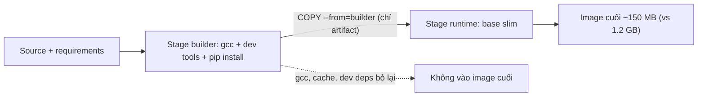

# 🎓 BuildKit & Multi-stage Advanced — Build 1 phút thay 5 phút

> **Tác giả:** Mr.Rom\
> **Phiên bản:** v1.2.1\
> **Tạo lúc:** 24/05/2026\
> **Cập nhật:** 11/06/2026\
> **Level:** Intermediate\
> **Tags:** [MUST-KNOW]\
> **Yêu cầu trước:** [Docker Intermediate — Tổng quan](00_intermediate-overview.md), đã cài Docker 23 trở lên.

> 🎯 *Mỗi lần `git push`, build image FastAPI của bạn ngốn 5 phút — `pip install` chạy lại từ đầu dù bạn chỉ sửa đúng 1 dòng code. Bài này chỉ cho bạn dùng **BuildKit** (engine build mặc định của Docker từ 2023) cho đúng: giữ cache giữa các lần build (*cache mount*), tiêm secret build-time mà không lộ (*secret mount*), build song song nhiều stage, dùng `buildx` để build đa nền tảng, và viết multi-stage Dockerfile gọn. Đích đến: build dưới 1 phút, image chạy được cả trên amd64 lẫn arm64.*

## 🎯 Sau bài này bạn sẽ

- [ ] Hiểu **BuildKit** là gì và khác *legacy builder* (engine build cũ) ở những điểm nào.
- [ ] Dùng **`RUN --mount=type=cache`** để giữ lại cache của pip/npm giữa các lần build.
- [ ] Dùng **`RUN --mount=type=secret`** để tiêm API key lúc build mà **không rò rỉ** vào image.
- [ ] Build **đa nền tảng** (*multi-platform* — amd64 + arm64) bằng `docker buildx`.
- [ ] Viết **multi-stage Dockerfile** chuẩn cho Python, Node và Go.
- [ ] Dùng **`docker buildx bake`** để build nhiều image trong một *monorepo*.
- [ ] Sắp xếp **thứ tự layer** sao cho sửa code không làm hỏng cache của layer cài thư viện.

---

## Tình huống — Build chậm 5 phút mỗi lần `git push`

Hãy bắt đầu từ một cảnh quen thuộc với bất kỳ ai đang đẩy code lên CI hằng ngày. Bạn có một app FastAPI kèm Dockerfile viết theo kiểu cơ bản nhất, đủ chạy nhưng chưa tối ưu:

```dockerfile
FROM python:3.12-slim
WORKDIR /app
COPY . .
RUN pip install -r requirements.txt
CMD ["uvicorn", "app:app", "--host", "0.0.0.0"]
```

Build lần đầu mất **5 phút** — chấp nhận được, vì lần đầu phải tải base image và cài toàn bộ thư viện.

Vấn đề bắt đầu ở lần thứ hai. Bạn chỉ sửa đúng 1 dòng trong `app.py`, hoàn toàn không động tới `requirements.txt`, rồi chạy lại `docker build`. Đáng lẽ phải nhanh, nhưng kết quả lại như sau:

```text
[+] Building 287.4s
 => [1/4] FROM python:3.12-slim                              0.5s (cached)
 => [2/4] WORKDIR /app                                       0.1s (cached)
 => [3/4] COPY . .                                           0.3s
 => [4/4] RUN pip install -r requirements.txt              285.0s ← lại 5 phút!
```

Nhìn vào dòng cuối là thấy ngay thủ phạm.

🔥 **Vấn đề**: `COPY . .` đứng *trước* `RUN pip install`. Mỗi lần bạn sửa code, layer `COPY` thay đổi (vì có `app.py` mới), kéo theo toàn bộ layer phía sau bị xem là "không còn tin được nữa" — cache **vỡ**, và `pip install` phải chạy lại từ đầu.

Cách chữa quen thuộc là đảo thứ tự, tách phần ít thay đổi (`requirements.txt`) lên trước phần hay thay đổi (code):

```dockerfile
COPY requirements.txt .
RUN pip install -r requirements.txt
COPY . .
```

→ Build lần 2 giờ chỉ chạy lại đúng `COPY` cuối, mất **15 giây**. Tốt hơn hẳn.

Nhưng câu chuyện chưa hết. Bây giờ bạn thêm 1 package vào `requirements.txt` — lập tức quay về **5 phút** `pip install` từ đầu. **Vì sao mẹo đảo thứ tự không cứu được lần này?**

→ Vì pip không giữ **cache lâu dài** (*persistent cache* — kho tải về dùng lại được giữa các lần build) ở chỗ Docker nhìn thấy. Mỗi lần layer `pip install` chạy lại, pip tải toàn bộ package từ PyPI một lần nữa, kể cả những package cũ không hề đổi.

Sếp đi ngang, liếc qua màn hình rồi gợi ý: *"Dùng BuildKit cache mount đi. `--mount=type=cache` giữ cache của pip giữa các lần build. Lần thứ hai chỉ cài đúng package mới thôi."*

→ Đó chính là chủ đề của bài này — đi qua từng tính năng của BuildKit một cách đầy đủ.

---

## 1️⃣ Vậy BuildKit là gì?

Trước khi chữa được bệnh, cần biết "động cơ" build hiện tại là cái gì. **BuildKit** là engine build thế hệ mới của Docker, viết bằng Go, ra đời để thay cho *legacy builder* — engine cũ chạy lồng bên trong Docker daemon (tiến trình nền `dockerd`). Sự khác biệt không chỉ là "mới hơn", mà là cả một kiến trúc khác giúp build nhanh và an toàn hơn.

Bảng dưới đặt hai engine cạnh nhau để bạn thấy rõ vì sao mọi tính năng trong bài này chỉ có ở BuildKit:

| Khía cạnh | Legacy builder | **BuildKit** (mặc định từ 2023) |
|---|---|---|
| Architecture | In-daemon | Standalone (containerd-based) |
| Parallelism | Sequential | **Parallel** (stage độc lập build cùng lúc) |
| Cache | Layer cache only | **Cache mount, secret mount, SSH mount** |
| Multi-platform | Khó | `docker buildx` native |
| Output formats | docker image | tar, OCI, registry, cache-only |
| Frontend | Dockerfile only | Dockerfile, custom (LLB) |

Điểm cốt lõi để nhớ: BuildKit build các stage độc lập *song song*, và mở ra ba loại mount mà legacy builder không có (cache, secret, SSH). Toàn bộ phần còn lại của bài thực chất là khai thác đúng hai điểm này.

🪞 **Ẩn dụ**: *Legacy builder giống một **dây chuyền sản xuất một làn** — máy 1 xong mới tới máy 2, không ai được chen. BuildKit giống một **nhà máy nhiều làn chạy song song** — máy 1, 2, 3 cùng làm một lúc nếu chúng không chờ kết quả của nhau, lại có thêm một "kho vật liệu chung" (chính là cache mount) để các ca sản xuất sau lấy lại đồ đã chuẩn bị thay vì gom mới từ đầu.*

### Kiểm tra BuildKit có đang chạy không

Docker 23+ (2023) đã enable BuildKit mặc định — nhưng đáng check trước khi dùng feature mới. 2 lệnh dưới confirm version + BuildKit availability:

```bash
docker buildx version
# github.com/docker/buildx v0.13.1 ...

# BuildKit default từ Docker 23+ (2023)
docker version | grep "Version"
# Server: Docker Engine - Community
#  Version: 25.0.3  ← 23+ là BuildKit default
```

Nếu muốn bật BuildKit một cách tường minh (ví dụ trên máy còn chạy Docker đời cũ), có hai cách:

```bash
DOCKER_BUILDKIT=1 docker build .
# (chỉ cần với Docker < 23)

# Cú pháp hiện đại — luôn dùng BuildKit:
docker buildx build .
```

---

## 2️⃣ Cache mount — giữ cache pip/npm giữa các lần build

Đây là tính năng trị thẳng nỗi đau ở phần mở đầu, nên ta bắt đầu từ nó.

### Vấn đề

Mỗi lần build, pip tải lại toàn bộ package từ PyPI — với project lớn là mất 1–5 phút, lặp lại vô ích ở mọi lần build.

### Giải pháp của BuildKit

**Cache mount** là tính năng cho phép gắn (*mount*) một thư mục cache vào đúng câu lệnh `RUN`, rồi BuildKit giữ thư mục đó lại giữa các lần build. Pip tải gì một lần thì lần sau lấy lại từ kho, khỏi tải lại. Cấu hình tối thiểu cho Python chỉ thêm đúng một dòng `--mount`:

```dockerfile
# syntax=docker/dockerfile:1.7
FROM python:3.12-slim
WORKDIR /app

COPY requirements.txt .

RUN --mount=type=cache,target=/root/.cache/pip \
    pip install --user -r requirements.txt

COPY . .
CMD ["uvicorn", "app:app", "--host", "0.0.0.0"]
```

Có hai dòng đáng chú ý trong Dockerfile trên:

- `# syntax=docker/dockerfile:1.7` — *directive* (chỉ thị khai báo) bắt buộc ở dòng đầu để mở khoá các tính năng của BuildKit; `1.7` là phiên bản frontend dùng cho năm 2026.
- `RUN --mount=type=cache,target=/root/.cache/pip` — gắn cache của BuildKit vào đúng `~/.cache/pip` (nơi pip để đồ tải về) trong lúc `RUN`. Cache này **được giữ lại giữa các lần build** trên cùng một máy.

### Đo thử thời gian build

Để thấy con số cụ thể, đây là kết quả thực tế trên một project Python khoảng 50 thư viện. Cache mount giúp các lần build sau **nhanh hơn 80–95%** so với build "nguội" (*cold build* — build khi chưa có cache):

```bash
# Build 1 (cache trống):
docker buildx build -t myapp:v1 .
# RUN pip install ... 285s

# Build 2 (không sửa gì):
docker buildx build -t myapp:v2 .
# Toàn bộ cached, ~3s

# Build 3 (sửa requirements.txt, thêm 1 package "redis"):
docker buildx build -t myapp:v3 .
# RUN pip install ... ~15s (chỉ download redis, các package khác đã trong cache)
```

→ Tức là build 3 tiết kiệm **85% thời gian** so với build 1, dù vẫn có thêm package mới. Đó là phần thưởng của việc tách "tải package" ra khỏi "cache theo layer".

### Cache mount cho Node, Go và Rust

Pattern này không chỉ dành cho Python. Mọi ngôn ngữ có trình quản lý package đều dùng được — Node (npm/yarn), Go (cache build + cache module), Rust (cargo) — và đây là cách làm gần như bắt buộc trong CI/CD hiện đại. Chỉ cần đổi đường dẫn `target` cho khớp nơi từng tool để cache:

```dockerfile
# Node.js
RUN --mount=type=cache,target=/root/.npm \
    npm ci

# Go
RUN --mount=type=cache,target=/root/.cache/go-build \
    --mount=type=cache,target=/go/pkg/mod \
    go build -o /app .

# Rust
RUN --mount=type=cache,target=/root/.cargo/registry \
    --mount=type=cache,target=/app/target \
    cargo build --release
```

### Các tuỳ chọn của cache mount

Khi cần tinh chỉnh sâu hơn, cache mount có vài tuỳ chọn đáng nhớ: đường dẫn `target`, một `id` để tách nhiều kho cache khác nhau, và `mode`/`uid` cho trường hợp container chạy bằng user không phải root. Mấy tuỳ chọn này đặc biệt hữu ích khi bạn dùng image đã siết bảo mật (*security-hardened* — gỡ bớt quyền và công cụ thừa):

| Tuỳ chọn | Mô tả |
|---|---|
| `type=cache` | Loại mount |
| `target=<path>` | Path trong container |
| `id=<id>` | Cache ID — tách cache nếu nhiều RUN dùng cùng target |
| `mode=0755` | Permissions |
| `uid=1000,gid=1000` | Owner (cho non-root user) |
| `sharing=locked` | `private` (1 build độc quyền), `locked` (queue), `shared` (concurrent) |

> ⚠️ Cache mount **chỉ persist trên máy build** — không có trong image cuối. CI runner phải share cache giữa job (xem §6).

---

## 3️⃣ Secret mount — tiêm API key mà không lộ vào image

Cache giúp build nhanh; nhưng còn một nỗi đau khác xuất hiện ngay khi build dính tới thông tin nhạy cảm. Đó là lúc cần secret mount.

### Vấn đề

Trong lúc build, bạn thường cần một thứ bí mật: token để kéo package từ PyPI nội bộ (qua `PIP_INDEX_URL` riêng), hoặc SSH key để `git clone` một repo private ngay trong Dockerfile. Câu hỏi là: làm sao đưa bí mật đó vào *quá trình build* mà nó không bị "đóng băng" vĩnh viễn trong image?

❌ **Cách sai thường gặp**:

```dockerfile
# ❌ Build arg — leak vào image history!
ARG GITHUB_TOKEN
RUN git clone https://${GITHUB_TOKEN}@github.com/acme/private-lib

# Build:
docker build --build-arg GITHUB_TOKEN=ghp_xxx .

# Lộ ra:
docker history myapp:v1
# Thấy: ARG GITHUB_TOKEN=ghp_xxx
```

→ Hậu quả: bất kỳ ai pull image về cũng chỉ cần `docker history` là đọc được token nằm phơi trong lịch sử layer. Token coi như đã rò rỉ.

### Giải pháp secret mount của BuildKit

```dockerfile
# syntax=docker/dockerfile:1.7
FROM python:3.12-slim
WORKDIR /app

# ✅ Secret mount — KHÔNG ghi vào layer, KHÔNG ghi vào history
RUN --mount=type=secret,id=github_token \
    GITHUB_TOKEN=$(cat /run/secrets/github_token) && \
    pip install git+https://${GITHUB_TOKEN}@github.com/acme/private-lib.git

COPY . .
CMD ["python", "app.py"]
```

Điểm mấu chốt: secret được gắn vào dưới dạng file tạm trong `/run/secrets/`, chỉ tồn tại đúng trong lúc câu `RUN` đó chạy, và không bao giờ ghi vào layer. Phía dưới là cách truyền secret vào lúc build — từ file hoặc từ biến môi trường:

```bash
# Từ file
echo "ghp_xxxxxx" > /tmp/token
docker buildx build --secret id=github_token,src=/tmp/token -t myapp:v1 .

# Hoặc từ env var
export GITHUB_TOKEN=ghp_xxxxxx
docker buildx build --secret id=github_token,env=GITHUB_TOKEN -t myapp:v1 .
```

Để chắc chắn token không lọt vào image, kiểm chứng lại bằng đúng hai lệnh mà kẻ tấn công sẽ dùng:

```bash
docker history myapp:v1
# RUN --mount=type=secret,id=github_token ...  ← chỉ ghi reference, không value
docker inspect myapp:v1 | grep -i token
# (empty)
```

Lịch sử chỉ còn lại dòng tham chiếu tới secret, không có giá trị thật; `inspect` thì rỗng. Đúng như mong đợi.

### SSH mount — clone repo private

Cùng ý tưởng "đụng vào rồi xoá", nhưng thay vì một file token, BuildKit còn cho forward luôn cả *ssh-agent* (tiến trình giữ SSH key) vào lúc build để clone repo private mà không nhúng key vào image:

```dockerfile
# syntax=docker/dockerfile:1.7
FROM node:20-slim
RUN --mount=type=ssh \
    git clone git@github.com:acme/private-frontend.git
```

Build và chuyển ssh-agent vào:

```bash
docker buildx build --ssh default -t myapp .
# 'default' = ssh-agent socket trỏ bởi $SSH_AUTH_SOCK
```

---

## 4️⃣ Multi-stage build nâng cao

Cache và secret lo phần *tốc độ* và *an toàn* lúc build. Phần còn lại là *kích thước* image cuối — và đây là lúc multi-stage build vào cuộc. Ý tưởng rất đời thường: tách "căn bếp" (nơi cần dao, lò, nguyên liệu thô để nấu) khỏi "đĩa món ăn" mang ra bàn (chỉ còn thành phẩm). Stage builder chứa compiler và dev tool nặng nề; stage runtime chỉ giữ đúng thứ cần để chạy. Mỗi pattern dưới đây là một công thức tách bếp cho một ngôn ngữ.

Sơ đồ dưới minh hoạ flow chung của mọi pattern multi-stage — stage builder cài deps và compile, `COPY --from` chỉ bê artifact sang stage runtime mỏng, còn toàn bộ đồ nghề build bị bỏ lại:



→ Image cuối chỉ chứa stage cuối cùng, nên stage builder nặng bao nhiêu cũng không ảnh hưởng kích thước ship đi — đó là lý do multi-stage giảm size mà không phải hy sinh tool lúc build.

### Pattern 1: Tách build và runtime (Python)

```dockerfile
# syntax=docker/dockerfile:1.7
# ===========================================
# Stage 1: builder — có compiler, dev tools
# ===========================================
FROM python:3.12 AS builder
WORKDIR /build

COPY requirements.txt .

RUN --mount=type=cache,target=/root/.cache/pip \
    pip install --user -r requirements.txt

# ===========================================
# Stage 2: runtime — slim, chỉ runtime
# ===========================================
FROM python:3.12-slim AS runtime
WORKDIR /app

# Copy ONLY installed packages từ stage builder
COPY --from=builder /root/.local /root/.local
ENV PATH=/root/.local/bin:$PATH

COPY app.py .
USER 1000:1000

CMD ["uvicorn", "app:app", "--host", "0.0.0.0"]
```

**Lợi ích**:
- Stage builder có gcc, dev headers (compile psycopg2, lxml) — nặng.
- Stage runtime chỉ chứa Python + installed packages — gọn.
- Image cuối ~150 MB thay 1.2 GB.

Con số nói lên tất cả: image cuối từ 1.2 GB rút còn khoảng 150 MB, chỉ nhờ bỏ lại toàn bộ compiler và dev headers ở stage builder. Node.js áp dụng đúng tinh thần đó, nhưng tách thêm một bước nữa.

### Pattern 2: Tách build và runtime (Node.js)

```dockerfile
# syntax=docker/dockerfile:1.7

# Stage 1: dependencies
FROM node:20 AS deps
WORKDIR /build
COPY package*.json ./
RUN --mount=type=cache,target=/root/.npm \
    npm ci

# Stage 2: build production bundle
FROM node:20 AS builder
WORKDIR /build
COPY --from=deps /build/node_modules ./node_modules
COPY . .
RUN npm run build

# Stage 3: runtime — chỉ chứa server.js + dist/
FROM node:20-slim AS runtime
WORKDIR /app
COPY --from=builder /build/dist ./dist
COPY --from=builder /build/server.js .
COPY --from=deps /build/node_modules ./node_modules

USER 1000:1000
EXPOSE 3000
CMD ["node", "server.js"]
```

Node tách làm 3 stage: `deps` cài thư viện (tận dụng cache npm), `builder` đóng gói bundle production, còn `runtime` chỉ bê `dist/`, `server.js` và `node_modules` cần thiết sang. Go còn đẩy ý tưởng "đĩa món ăn trống trơn" tới mức cực hạn.

### Pattern 3: Go binary (cực gọn)

```dockerfile
# syntax=docker/dockerfile:1.7

# Stage 1: build static binary
FROM golang:1.22 AS builder
WORKDIR /build
COPY go.mod go.sum ./
RUN --mount=type=cache,target=/go/pkg/mod \
    go mod download
COPY . .
RUN --mount=type=cache,target=/root/.cache/go-build \
    --mount=type=cache,target=/go/pkg/mod \
    CGO_ENABLED=0 go build -ldflags="-w -s" -o /app/server .

# Stage 2: scratch (literally empty)
FROM scratch
COPY --from=builder /app/server /server
COPY --from=builder /etc/ssl/certs/ca-certificates.crt /etc/ssl/certs/
EXPOSE 8080
CMD ["/server"]
```

→ Image cuối chỉ còn khoảng 10–30 MB cho một Go binary, vì `FROM scratch` nghĩa là base hoàn toàn trống — không shell, không gì khác ngoài file binary và chứng chỉ SSL. Đánh đổi đi kèm là debug khó hơn (không có shell để vào ngó nghiêng — chủ đề này để dành cho bài 03 về *distroless*).

### Chọn target stage — build đúng một stage

Một Dockerfile nhiều stage không bắt buộc lúc nào cũng build tới stage cuối. Bạn có thể bảo BuildKit dừng ở một stage cụ thể bằng `--target`:

```bash
# Build chỉ stage "builder" — để debug
docker buildx build --target=builder -t myapp:debug .

# Build stage cuối (default)
docker buildx build -t myapp:prod .
```

→ Tiện khi cần một image debug vẫn còn shell và compiler, trong khi image production thì giữ nguyên độ gọn.

---

## 5️⃣ Multi-platform — amd64 + arm64

Image gọn rồi, nhưng gọn mà chạy sai kiến trúc CPU thì cũng vô dụng. Đây là cái bẫy mà ai dùng máy Mac đời mới đều dễ sập.

### Vấn đề

- Bạn code trên MacBook M-series (chip arm64).
- Server production lại là AWS EC2 t3 (amd64) hoặc Graviton (arm64).
- Build image trên Mac sẽ cho ra image **chỉ có arm64** → khi deploy lên EC2 t3 (amd64), container chết ngay với lỗi `exec format error` (sai định dạng file thực thi vì khác kiến trúc CPU).

### Tạo builder hỗ trợ đa nền tảng

```bash
# Tạo builder hỗ trợ multi-platform
docker buildx create --name multi --use --platform linux/amd64,linux/arm64

# Verify
docker buildx ls
# NAME     DRIVER             PLATFORMS
# multi *  docker-container   linux/amd64, linux/arm64
```

### Build cho cả hai nền tảng

Có builder rồi, chỉ cần liệt kê các nền tảng đích qua `--platform`, BuildKit sẽ build song song từng kiến trúc và gói chung thành một tag:

```bash
docker buildx build \
  --platform linux/amd64,linux/arm64 \
  -t acme/myapp:v1 \
  --push \
  .
```

> ⚠️ `--push` là bắt buộc với build đa nền tảng — Docker daemon ở máy local không lưu được *manifest list* (danh mục trỏ tới nhiều image, mỗi image một kiến trúc). Phải đẩy lên registry.

Kiểm tra manifest list xem đã có đủ hai kiến trúc chưa:

```bash
docker buildx imagetools inspect acme/myapp:v1
# Manifests:
#   linux/amd64  sha256:abc...
#   linux/arm64  sha256:def...
```

### Mẹo tăng tốc build chéo kiến trúc

Có một cái giá ngầm cần biết: khi build bản amd64 ngay trên Mac M-series, BuildKit phải giả lập CPU amd64 bằng **QEMU** (*emulation* — mô phỏng kiến trúc khác) nên chậm hẳn. Hai cách giảm đau:

- Dùng **builder native** chạy đúng trên máy amd64 (ví dụ runner `ubuntu-latest` của GitHub Actions vốn là amd64) — khỏi giả lập.
- Dùng **`--cache-to`/`--cache-from`** để lưu cache lên registry, cho CI lần sau lấy lại thay vì build lại từ đầu.

```bash
docker buildx build \
  --platform linux/amd64,linux/arm64 \
  --cache-to=type=registry,ref=acme/myapp:buildcache,mode=max \
  --cache-from=type=registry,ref=acme/myapp:buildcache \
  -t acme/myapp:v1 \
  --push \
  .
```

---

## 6️⃣ BuildKit cache trong CI/CD (GitHub Actions)

Mọi thứ phía trên đến giờ vẫn là build trên máy bạn. Nhưng cache mount chỉ sống *trên một máy* — sang runner CI sạch bong là mất sạch. Vậy làm sao để CI cũng được hưởng cache? Câu trả lời là đẩy cache lên một nơi dùng chung. Workflow dưới đây minh hoạ cách BuildKit lưu cache vào kho cache của GitHub Actions:

```yaml
name: Build
on: [push]

jobs:
  build:
    runs-on: ubuntu-latest
    steps:
      - uses: actions/checkout@v4

      - uses: docker/setup-buildx-action@v3

      - uses: docker/login-action@v3
        with:
          registry: ghcr.io
          username: ${{ github.actor }}
          password: ${{ secrets.GITHUB_TOKEN }}

      - uses: docker/build-push-action@v5
        with:
          context: .
          platforms: linux/amd64,linux/arm64
          push: true
          tags: ghcr.io/acme/myapp:${{ github.sha }}
          cache-from: type=gha
          cache-to: type=gha,mode=max
          secrets: |
            github_token=${{ secrets.GITHUB_TOKEN }}
```

Ba dòng đáng để mắt trong workflow trên:

- `cache-from: type=gha` + `cache-to: type=gha` — BuildKit lưu cache lên **kho cache của GitHub Actions** (mỗi repo được 10 GB miễn phí). Build sau kéo cache về nên nhanh hơn 70–90%.
- `secrets:` — chính là cách tiêm secret vào secret mount đã học ở §3, nhưng từ phía CI.
- `platforms: linux/amd64,linux/arm64` — build cả hai kiến trúc gọn trong một job.

→ Mỗi nền tảng CI có một backend cache "mặc định" riêng tính tới 2026: GitHub Actions dùng `type=gha`, GitLab CI dùng `type=registry`, còn AWS CodeBuild dùng `type=s3`.

---

## 7️⃣ `docker buildx bake` — build nhiều image trong monorepo

Tới đây bạn build *một* image rất ngon. Nhưng đời thực hay là một *monorepo* (một repo chứa nhiều service) với cả chục Dockerfile. Gõ tay từng lệnh build cho mỗi cái vừa mỏi tay vừa phí cache.

### Vấn đề của monorepo

Giả sử repo của bạn có cấu trúc:

```text
acme/
├── backend/Dockerfile
├── frontend/Dockerfile
├── worker/Dockerfile
└── migrations/Dockerfile
```

Build 4 image theo cách thủ công là 4 lệnh riêng, lại không chia sẻ cache được giữa các image. Càng nhiều service càng đuối.

### Giải pháp bake

`docker buildx bake` cho phép khai báo *tất cả* image trong một file cấu hình duy nhất, rồi build một phát. File này viết bằng HCL (cùng ngôn ngữ với Terraform), nên bạn có thể dùng biến và cho các target kế thừa cấu hình chung qua `inherits`. Ví dụ với 4 service ở trên:

`docker-bake.hcl`:

```hcl
variable "TAG" {
  default = "latest"
}

variable "REGISTRY" {
  default = "ghcr.io/acme"
}

group "default" {
  targets = ["backend", "frontend", "worker", "migrations"]
}

target "_base" {
  platforms = ["linux/amd64", "linux/arm64"]
  cache-from = ["type=gha"]
  cache-to = ["type=gha,mode=max"]
}

target "backend" {
  inherits = ["_base"]
  context = "./backend"
  tags = ["${REGISTRY}/backend:${TAG}"]
}

target "frontend" {
  inherits = ["_base"]
  context = "./frontend"
  tags = ["${REGISTRY}/frontend:${TAG}"]
}

target "worker" {
  inherits = ["_base"]
  context = "./worker"
  tags = ["${REGISTRY}/worker:${TAG}"]
}

target "migrations" {
  inherits = ["_base"]
  context = "./migrations"
  tags = ["${REGISTRY}/migrations:${TAG}"]
}
```

Sau đó build toàn bộ chỉ bằng đúng một lệnh, truyền tag qua biến môi trường:

```bash
TAG=v1.2.3 docker buildx bake --push
```

→ Một lệnh, bốn image, build song song, đa kiến trúc, dùng chung cache. Đây là cách gọn nhất để CI build cả monorepo.

---

## 8️⃣ Hands-on: dựng pipeline build dưới 1 phút

Giờ ráp mọi mảnh ghép lại thành một thứ chạy thật. Mục tiêu của phần này: từ một FastAPI app, dựng một pipeline hoàn chỉnh build dưới 1 phút ở các lần sau, image đa kiến trúc, cache được tái dùng trên CI. Ba bước, đi từ Dockerfile tới workflow rồi kiểm chứng bằng số liệu.

### Bước 1: Tối ưu Dockerfile cho FastAPI

```dockerfile
# Dockerfile
# syntax=docker/dockerfile:1.7

FROM python:3.12 AS builder
WORKDIR /build

COPY requirements.txt .

RUN --mount=type=cache,target=/root/.cache/pip \
    pip install --user -r requirements.txt

# Runtime stage
FROM python:3.12-slim AS runtime
WORKDIR /app

# Copy installed packages from builder
COPY --from=builder /root/.local /root/.local
ENV PATH=/root/.local/bin:$PATH \
    PYTHONUNBUFFERED=1

COPY app/ ./app/

USER 1000:1000
EXPOSE 8000

CMD ["uvicorn", "app.main:app", "--host", "0.0.0.0", "--port", "8000"]
```

Dockerfile này gói trọn hai bài học: multi-stage (builder/runtime) cho image gọn, và cache mount cho `pip install` nhanh. Tiếp theo là phần để CI tự chạy nó.

### Bước 2: Workflow GitHub Actions

`.github/workflows/build.yml`:

```yaml
name: Build & Push

on:
  push:
    branches: [main]
    tags: ['v*']

env:
  REGISTRY: ghcr.io
  IMAGE_NAME: ${{ github.repository }}

jobs:
  build:
    runs-on: ubuntu-latest
    permissions:
      contents: read
      packages: write
    steps:
      - uses: actions/checkout@v4

      - name: Extract metadata
        id: meta
        uses: docker/metadata-action@v5
        with:
          images: ${{ env.REGISTRY }}/${{ env.IMAGE_NAME }}
          tags: |
            type=ref,event=branch
            type=ref,event=pr
            type=semver,pattern={{version}}
            type=sha,format=long

      - uses: docker/setup-buildx-action@v3

      - uses: docker/login-action@v3
        with:
          registry: ${{ env.REGISTRY }}
          username: ${{ github.actor }}
          password: ${{ secrets.GITHUB_TOKEN }}

      - uses: docker/build-push-action@v5
        with:
          context: .
          platforms: linux/amd64,linux/arm64
          push: true
          tags: ${{ steps.meta.outputs.tags }}
          labels: ${{ steps.meta.outputs.labels }}
          cache-from: type=gha
          cache-to: type=gha,mode=max
```

### Bước 3: Kiểm chứng thời gian build

Cuối cùng, chạy thử vài lần để xác nhận pipeline làm đúng việc. Bảng dưới ghi lại thời gian build qua bốn kịch bản tiêu biểu, từ lần đầu "nguội" tới các lần sau có cache:

| Lần build | Thời gian | Trạng thái cache |
|---|---|---|
| Lần 1 (đầu tiên) | ~4 phút | Nguội (tải base image + pip install) |
| Lần 2 (không đổi gì) | ~30s | Trúng cache toàn bộ |
| Lần 3 (sửa code app) | ~45s | Pip còn cache, chỉ build lại layer code |
| Lần 4 (sửa requirements.txt) | ~1 phút | Pip tải package mới, phần còn lại lấy từ cache |

→ Tiết kiệm **75–90% thời gian build** ở các lần sau — đúng mục tiêu đặt ra đầu bài.

---

## 💡 Cạm bẫy thường gặp & Best practice

### ❌ Cạm bẫy: Quên `# syntax=docker/dockerfile:1.7`

```dockerfile
# ❌ Thiếu syntax directive — rủi ro với builder cũ / feature mới
FROM python:3.12
RUN --mount=type=cache,target=/root/.cache/pip pip install -r requirements.txt
```

**Lỗi** (khi rơi về classic builder hoặc built-in frontend cũ — Docker < 23 / `DOCKER_BUILDKIT=0`):
```text
Dockerfile parse error: Unknown flag: mount
```

> Trên Docker 23+ (BuildKit default, built-in frontend mới) các mount cơ bản (`cache`/`secret`/`bind`) chạy được **kể cả khi thiếu** syntax directive. Nhưng vẫn nên khai báo để pin frontend version và mở khoá option/feature mới nhất.

→ **Fix**: Dòng ĐẦU TIÊN của Dockerfile nên là `# syntax=docker/dockerfile:1.7` (hoặc version cao hơn).

### ❌ Cạm bẫy: Cache mount path sai

```dockerfile
# ❌ Mount sai path
RUN --mount=type=cache,target=/root/.cache \
    pip install -r requirements.txt
```

→ pip dùng `~/.cache/pip` (sub-path). Cache mount ở `/root/.cache` không cover đúng → cache không hit.

→ **Fix**: Mount đúng sub-path tool dùng: `/root/.cache/pip` cho pip, `/root/.npm` cho npm.

### ❌ Cạm bẫy: Secret in `ARG` hoặc `ENV`

```dockerfile
# ❌ ARG leak vào history
ARG NPM_TOKEN
RUN npm config set //registry.npmjs.org/:_authToken=$NPM_TOKEN
```

→ **Fix**: Dùng `--mount=type=secret`:

```dockerfile
RUN --mount=type=secret,id=npm_token \
    NPM_TOKEN=$(cat /run/secrets/npm_token) && \
    npm config set //registry.npmjs.org/:_authToken=$NPM_TOKEN && \
    npm ci
```

### ❌ Cạm bẫy: Multi-platform không `--push`

```bash
# ❌ Không có --push
docker buildx build --platform linux/amd64,linux/arm64 -t myapp .
```

**Lỗi**:
```text
ERROR: Multi-platform build is not supported for the docker driver.
Switch to a different driver, or use --push or --output flag.
```

→ **Fix**: `--push` (lên registry) hoặc `--output type=oci,dest=image.tar` (local OCI tarball).

### ❌ Cạm bẫy: COPY thừa làm vỡ cache

```dockerfile
# ❌ COPY toàn bộ trước install
COPY . .
RUN pip install -r requirements.txt
```

→ Mỗi lần sửa code → invalidate cache → pip install lại.

→ **Fix**: COPY chỉ dependency file trước, install, rồi COPY còn lại:

```dockerfile
COPY requirements.txt .
RUN pip install -r requirements.txt
COPY . .
```

### ✅ Best practice: Pin base image bằng digest

```dockerfile
# ❌ Tag mutable — base image có thể đổi
FROM python:3.12-slim

# ✅ Pin bằng digest — immutable
FROM python:3.12-slim@sha256:abc123def456...
```

→ Build reproducible 100%. Khi muốn upgrade base, đổi digest explicit.

### ✅ Best practice: `.dockerignore` aggressive

```dockerignore
# .dockerignore
.git
.github
.vscode
.idea
__pycache__
*.pyc
.pytest_cache
.venv
venv/
node_modules/
*.log
.DS_Store
.env*
README.md
docs/
tests/
```

→ Build context (toàn bộ thư mục gửi cho daemon lúc build) nhỏ lại nên build khởi động nhanh hơn, đồng thời tránh lỡ tay `COPY` nhầm file nhạy cảm (như `.env`) vào image.

### ✅ Best practice: Image label metadata

```dockerfile
LABEL org.opencontainers.image.source="https://github.com/acme/myapp"
LABEL org.opencontainers.image.revision="${GIT_SHA}"
LABEL org.opencontainers.image.version="${VERSION}"
LABEL org.opencontainers.image.created="${BUILD_DATE}"
```

→ OCI standard labels — registry UI hiển thị, audit dễ.

---

## 🧠 Tự kiểm tra (Self-check)

Năm câu hỏi dưới chạm vào đúng những chỗ dễ nhầm nhất của BuildKit. Bạn thử tự trả lời trước khi mở đáp án — đây là cách nhanh nhất để biết mình thật sự hiểu hay chỉ mới thấy quen.

**Q1.** Vì sao `RUN --mount=type=cache` nhanh hơn dùng `COPY requirements.txt + RUN pip install` thuần?

<details>
<summary>💡 Đáp án</summary>

`COPY requirements.txt + RUN pip install` chỉ tận dụng **layer cache** — nếu `requirements.txt` không đổi, layer pip install được cache, OK. Nhưng khi `requirements.txt` đổi (thêm 1 package), layer cache vỡ → `pip install` chạy lại **từ đầu** — download lại TẤT CẢ package.

`RUN --mount=type=cache,target=/root/.cache/pip` là **persistent cache mount**, không phải layer cache. Khi `requirements.txt` đổi, `pip install` vẫn chạy lại, nhưng pip dùng cache trong `~/.cache/pip` — package đã download trước đó không phải tải lại từ PyPI. **Chỉ package MỚI mới download**.

→ Layer cache = all-or-nothing per layer. Cache mount = persistent storage shared across layer rebuilds.
</details>

**Q2.** Tại sao multi-platform build BẮT BUỘC `--push`?

<details>
<summary>💡 Đáp án</summary>

Local Docker daemon dùng image store cổ điển (legacy graph driver) chỉ hỗ trợ **một platform per image tag**. Multi-platform image cần **manifest list** (OCI Image Index v1) reference nhiều image (1 per platform) — concept này không có trong image store cổ điển.

Registry (Docker Hub, GHCR, ECR) hỗ trợ manifest list — đó là nơi multi-platform image sống. Vì vậy buildx **bắt buộc `--push`** hoặc `--output type=oci` để xuất ra registry/tarball.

(Note: từ Docker Desktop 4.34+ và Docker Engine v29+, `containerd image store` là default và hỗ trợ lưu local multi-platform image — khi đó có thể dùng `--load` thay `--push`. Phần lớn setup cũ/CI vẫn dùng image store cổ điển nên `--push` vẫn là cách an toàn.)
</details>

**Q3.** Khác biệt `--mount=type=cache` vs `--mount=type=secret` về **persistence**?

<details>
<summary>💡 Đáp án</summary>

- **Cache mount**: persist **trên máy build** (Docker daemon's BuildKit cache). Giữa các `docker build` consecutive, cache mount giữ lại data. Trong CI, share cache giữa job dùng `cache-from/to: type=gha|registry|s3`.

- **Secret mount**: **ephemeral** — chỉ tồn tại trong thời gian RUN instruction. Sau RUN xong, secret file biến mất, không vào layer cuối, không vào history.

→ Cache: chậm-thì-lưu. Secret: đụng-vào-rồi-xoá.
</details>

**Q4.** Bạn có Dockerfile multi-stage 5 stage (A → B → C → D → final, B+C độc lập với A). Build thế nào nhanh nhất với BuildKit?

<details>
<summary>💡 Đáp án</summary>

BuildKit **tự động phát hiện parallelism** dựa trên DAG dependency. Nếu B và C không depend trên nhau (chỉ depend A xong), BuildKit build B và C **parallel** sau khi A xong.

Bạn không cần làm gì đặc biệt — chỉ cần Dockerfile chuẩn. BuildKit phân tích `COPY --from=X` để xây DAG → schedule parallel.

Verify bằng output build log:
```text
[+] Building 23.5s (15/15) FINISHED
 => [stage-A 1/3] FROM ...      4.2s
 => [stage-B 1/2] ...            3.1s ┐
 => [stage-C 1/2] ...            3.5s ┘ ← parallel!
 => [stage-D 1/3] ...            5.0s
 => [final 1/4] ...              2.0s
```

Time bars cho thấy B và C overlap.
</details>

**Q5.** GitHub Actions cache `type=gha` size limit là bao nhiêu? Khi nào không đủ?

<details>
<summary>💡 Đáp án</summary>

GitHub Actions cache:
- **10 GB total per repository** (2026)
- Eviction LRU (least recently used) khi đầy
- Per-branch (mỗi branch cache riêng, tự share với base branch fork)

**Khi không đủ**:
- Monorepo build 20+ image — cache mỗi image vài GB → đầy nhanh.
- Image base lớn (Java + JDK + Maven cache) 5+ GB/image.
- Many concurrent branches — mỗi branch nuốt cache.

**Workarounds**:
- `cache-to: type=registry,ref=...:buildcache` — lưu cache trực tiếp lên registry (size limit chỉ là registry quota).
- `cache-to: type=s3,region=...,bucket=...` — lưu lên S3 (pay-per-use, unlimited).
- Self-hosted runner với volume mounted — full control.
</details>

---

## ⚡ Tra cứu nhanh (Cheatsheet)

Phần tra nhanh cho lúc làm việc thật — gom theo nhóm: lệnh `buildx` cơ bản, build đa nền tảng, các chiến lược cache trong CI, và các mẫu `--mount` hay dùng trong Dockerfile.

```bash
# === BuildKit basics ===
docker buildx version
docker buildx ls

# Build single platform với cache mount (Dockerfile có syntax directive)
docker buildx build -t myapp:v1 .

# Build với secret
docker buildx build --secret id=token,src=/tmp/token -t myapp:v1 .
docker buildx build --secret id=token,env=TOKEN -t myapp:v1 .

# === Multi-platform ===
docker buildx create --name multi --use --platform linux/amd64,linux/arm64
docker buildx build --platform linux/amd64,linux/arm64 -t acme/app:v1 --push .

# === Inspect ===
docker buildx imagetools inspect acme/app:v1   # manifest list
docker buildx du                                # cache size
docker buildx prune                             # clear cache

# === Bake ===
docker buildx bake                  # default group
docker buildx bake --print          # show resolved config
docker buildx bake backend frontend  # specific targets
TAG=v1.2.3 docker buildx bake --push

# === Cache strategies trong CI ===
# GitHub Actions
--cache-from=type=gha
--cache-to=type=gha,mode=max

# Registry (any CI)
--cache-from=type=registry,ref=acme/app:buildcache
--cache-to=type=registry,ref=acme/app:buildcache,mode=max

# Inline (small projects)
--cache-from=type=registry,ref=acme/app:latest
--cache-to=type=inline
```

```dockerfile
# === Dockerfile patterns ===

# Cache mount per language:
RUN --mount=type=cache,target=/root/.cache/pip pip install ...           # Python
RUN --mount=type=cache,target=/root/.npm npm ci                          # Node
RUN --mount=type=cache,target=/go/pkg/mod go build ...                   # Go
RUN --mount=type=cache,target=/root/.cargo/registry cargo build          # Rust
RUN --mount=type=cache,target=/var/cache/apt apt-get update              # APT

# Secret mount:
RUN --mount=type=secret,id=NAME TOKEN=$(cat /run/secrets/NAME) && ...

# SSH mount:
RUN --mount=type=ssh git clone git@github.com:org/private-repo.git

# Multi-stage target:
FROM python:3.12 AS builder    # ← `docker buildx build --target=builder`
FROM python:3.12-slim AS final
```

---

## 📚 Từ Điển Thuật Ngữ (Glossary)
| Term | Vietnamese / Explanation |
|---|---|
| **BuildKit** | Build engine mới của Docker (default 2023+), parallel + cache mount + secret mount |
| **LLB** | Low-Level Build — BuildKit's intermediate representation (như IR của compiler) |
| **Frontend** | Parser convert Dockerfile/custom DSL → LLB |
| **Cache mount** | Persistent storage mount khi RUN, share giữa build runs (`--mount=type=cache`) |
| **Secret mount** | Ephemeral secret inject vào RUN, không ghi vào layer (`--mount=type=secret`) |
| **SSH mount** | Forward SSH agent socket vào build (`--mount=type=ssh`) |
| **Multi-stage build** | Dockerfile có nhiều `FROM ... AS <name>` — copy artifact giữa stages |
| **Target stage** | Build chỉ 1 stage cụ thể (`--target=builder`) |
| **buildx** | CLI plugin extend `docker build` với BuildKit features |
| **bake** | `docker buildx bake` — build multiple images theo HCL config |
| **Manifest list** | OCI Image Index — 1 tag reference nhiều platform images |
| **QEMU emulation** | Cross-platform build khi host ≠ target arch (chậm) |
| **OCI** | Open Container Initiative — chuẩn image format + distribution |
| **Provenance** | Build metadata (SLSA): builder ID, source URL, build params (xem bài 02) |

---

## 🔗 Liên kết & Tài nguyên

### 🧭 Định hướng lộ trình học

- ⬅️ **Bài trước:** [Docker Intermediate — Từ "chạy được" đến "production-grade"](00_intermediate-overview.md)
- ➡️ **Bài tiếp theo:** [Image Security & Supply Chain — Scan, Sign, Verify](02_image-security-supply-chain.md)
- ↑ **Về cụm:** [Docker — Containerization Platform](../../README.md)

### 🧩 Các chủ đề có thể bạn quan tâm

- 🔁 [CI/CD GitHub Actions](../../../ci-cd/lessons/01_basic/01_github-actions.md) — workflow integration
- 🔁 [CI/CD Pipeline patterns](../../../ci-cd/lessons/01_basic/03_pipeline-patterns.md) — monorepo selective build
- ☸️ [K8s images](../../../kubernetes/lessons/01_basic/01_pods-and-deployments.md) — imagePullPolicy

### 🌐 Tài nguyên tham khảo khác

- 📖 [BuildKit docs](https://docs.docker.com/build/buildkit/)
- 📖 [Dockerfile reference](https://docs.docker.com/reference/dockerfile/) — syntax + RUN --mount
- 📖 [buildx docs](https://docs.docker.com/buildx/)
- 📖 [Bake reference](https://docs.docker.com/build/bake/)
- 📖 [docker/build-push-action](https://github.com/docker/build-push-action) — GitHub Action
- 📖 [Multi-platform images](https://docs.docker.com/build/building/multi-platform/)
- 📖 [BuildKit cache exporters](https://docs.docker.com/build/cache/backends/)

---

## 📌 Nhật ký thay đổi (Changelog)

- **v1.0.0 (24/05/2026)** — Bản đầu tiên. Lesson 01 của intermediate cluster. Tập trung BuildKit cache/secret/SSH mount, multi-stage 3 pattern (Python/Node/Go), multi-platform amd64+arm64, buildx bake monorepo, CI integration (GitHub Actions với `type=gha` cache). 5 pitfall + 3 best practice + 5 self-check + cheatsheet command/Dockerfile.
- **v1.1.0 (25/05/2026)** — thêm lead-in trước Verify BuildKit + Cache mount giải pháp + Demo timing + Cache cho Node/Go/Rust + Cache mount options.
- **v1.1.1 (01/06/2026)** — Sửa lỗi QA: comment "25+ là BuildKit default" → "23+" (BuildKit default từ Docker Engine 23.0); sửa giải thích Q2 multi-platform (image store cổ điển/legacy graph driver mới là cái không hỗ trợ manifest list, không phải containerd image store); cập nhật note containerd image store đã GA + default (Docker Desktop 4.34+/Engine v29+); sửa pitfall syntax directive (error thật là "Unknown flag: mount" trên classic builder, Docker 23+ chạy được mount cơ bản kể cả thiếu directive); sửa chú thích `--ssh default` ($SSH_AUTH_SOCK thay vì ~/.ssh/agent).
- **v1.2.0 (01/06/2026)** — Polish văn phong + soát QA theo checklist: Việt hoá metadata "Yêu cầu trước" và mục tiêu, làm mượt các đoạn "điện tín" (chuỗi thuật ngữ EN) ở §1–§8, thêm lời dẫn trước code/bảng và câu bắc cầu giữa các section, Việt hoá các sub-heading EN thuần (Demo timing, Cache mount options, Setup buildx, Verify manifest, Cross-platform tip, Step 1–3) và header bảng (Aspect/Option), giải thích thuật ngữ EN trong ngoặc lần đầu (cache mount, secret mount, monorepo, QEMU, manifest list, build context), bổ sung ngôn ngữ `text` cho fence output build; giữ nguyên 100% code/số liệu/flag và heading cấu trúc.
- **v1.2.1 (11/06/2026)** — Bổ sung sơ đồ flow multi-stage build (builder → COPY --from → runtime) cho trực quan.
