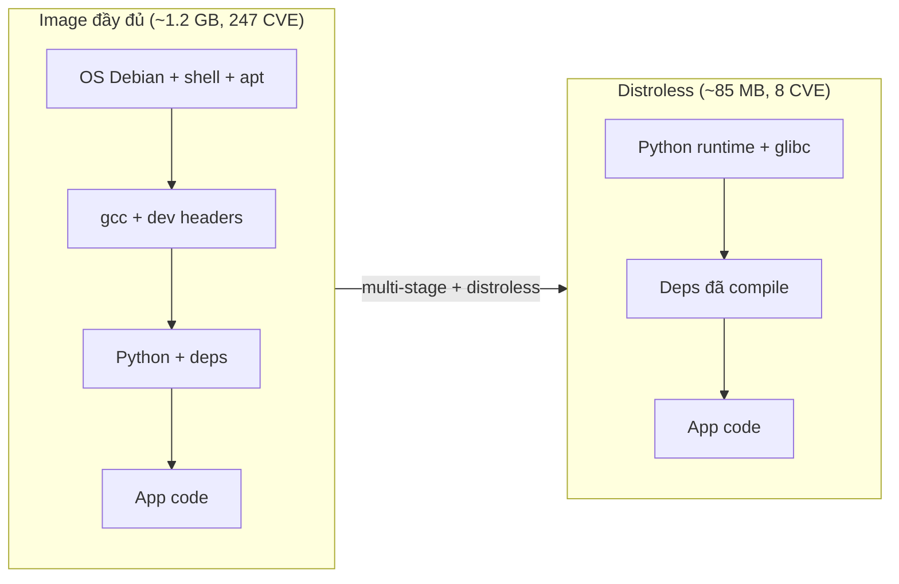

# 🎓 Optimization & Distroless — Từ 1.2 GB xuống 85 MB

> **Tác giả:** Mr.Rom\
> **Phiên bản:** v1.2.1\
> **Tạo lúc:** 24/05/2026\
> **Cập nhật:** 11/06/2026\
> **Level:** Intermediate\
> **Tags:** [MUST-KNOW]\
> **Yêu cầu trước:** [Image Security & Supply Chain — Scan, Sign, Verify](02_image-security-supply-chain.md)

> 🎯 *Một image FastAPI nặng 1.2 GB ép xuống còn 85 MB là chuyện làm thật được, không phải lời quảng cáo. Bài này đi qua bốn kỹ thuật cốt lõi: dùng **dive** để soi xem từng *layer* (lớp filesystem cấu thành image) nặng vì cái gì, chọn đúng **base image** giữa alpine / slim / distroless / scratch, viết **multi-stage advanced** (build nhiều giai đoạn, chỉ giữ lại sản phẩm cuối), và sắp xếp **layer order** sao cho sửa code không phá *cache*. Đổi lại trên production: image kéo về (*pull*) nhanh hơn, bề mặt tấn công (*attack surface* — số thành phần kẻ xấu có thể khai thác) nhỏ hơn, và *cold start* (lần khởi tạo đầu của container) ngắn hơn.*

## 🎯 Sau bài này bạn sẽ

- [ ] Dùng **`dive`** tool phân tích layer + waste bytes
- [ ] So sánh **`alpine`** vs **`slim`** vs **`distroless`** vs **`scratch`** — chọn đúng
- [ ] Hiểu vì sao **distroless** an toàn hơn alpine cho production
- [ ] Optimize **layer order** — code thay đổi không invalidate dep layer
- [ ] Loại **dev dependencies** + **package cache** + **temp files**
- [ ] Đo image size + cold start latency thực tế
- [ ] Áp dụng template Dockerfile production-grade cho Python/Node/Go/Java

---

## Tình huống — Image 1.2 GB, deploy chậm, attack surface lớn

Bạn vừa viết xong một *API* bằng FastAPI và đóng gói nó bằng một Dockerfile "chân phương" nhất: lấy image Python đầy đủ, cài thư viện, copy code vào, chạy. Trên máy bạn nó chạy ngon, *test* qua hết, nên bạn yên tâm đẩy lên *registry*. Dockerfile trông như sau:

```dockerfile
FROM python:3.12
WORKDIR /app
COPY requirements.txt .
RUN pip install -r requirements.txt
COPY . .
CMD ["uvicorn", "app:app", "--host", "0.0.0.0"]
```

Build xong, `myapp:v1` cân nặng **1.2 GB**. Một mình con số đó nghe chưa có gì đáng sợ — cho đến khi cả team ngồi lại nhân nó với quy mô vận hành thật:
- **Pull time**: 100 deploy/ngày × 1.2 GB × 10 cluster = 1.2 TB traffic/ngày. AWS data transfer ~$0.09/GB egress → **$108/ngày = $3,240/tháng** chỉ pull image.
- **Cold start**: pod khởi tạo phải pull image → user gặp 503 trong 30-60s.
- **Attack surface**: Trivy scan = 247 packages, 1 CRITICAL + 4 HIGH CVE. Khả năng exploit cao.

Sếp: *"Image này 1.2 GB là không production-ready. FastAPI runtime tinh khôi chỉ cần ~50 MB. Tại sao bạn ship 1.2 GB? Đi học distroless + multi-stage + layer optimization đi."*

→ Bài này dạy hành trình **1.2 GB → 85 MB**.

---

## 1️⃣ Phân tích layer với `dive`

🪞 **Ẩn dụ**: *Image optimization như **đóng gói va-li du lịch** — Standard image như va-li to nhồi cả ô, áo mưa, đồ bếp. Distroless như va-li chỉ chứa đồ thực sự cần (app + runtime, không shell/package manager). Slim image ở giữa. Dive là cái cân để biết va-li nặng vì cái gì.*

### Install

`dive` là tool open-source visualize layer của Docker image — TUI interactive, free, install qua brew/apt. Đây là tool **đầu tiên** dùng khi cần optimize 1 image lớn:

```bash
brew install dive       # macOS
# Linux:
# wget https://github.com/wagoodman/dive/releases/.../dive_*.deb
# dpkg -i dive_*.deb
```

### Inspect image

Chạy `dive <image>` mở TUI mode — phía trái list layers + size, phía phải show content từng layer. Quan trọng nhất: **Image efficiency score** + **wasted space** chỉ ra cơ hội optimize:

```bash
dive myapp:v1
```

Output (TUI mode):
```text
Layers ─────────────────────  Current Layer Contents ──────
[Layer 1] 350 MB  FROM python:3.12      /usr/local/lib/...
[Layer 2] 0.5 KB  WORKDIR /app          /app/
[Layer 3] 0.1 KB  COPY requirements.txt /app/requirements.txt
[Layer 4] 850 MB  RUN pip install ...   /usr/local/lib/python3.12/site-packages/
[Layer 5] 5 MB    COPY . .              /app/ (+__pycache__/, .git, ...)

Image Details ──────
Total Image size: 1.2 GB
Potential wasted space: 320 MB (28%)
Image efficiency score: 72%
```

### Key insights `dive` cho biết

Đọc output `dive` đúng cách trả lời 3 câu hỏi: layer nào nặng nhất, layer nào duplicate (waste), file nào không cần. Từ 1 image 1.2 GB, dive thường chỉ ra **3 wins** rõ ràng (slim base + multi-stage + `.dockerignore`):

- **Layer 1 (base)** 350 MB — `python:3.12` full image, có gcc + dev headers.
- **Layer 4 (pip install)** 850 MB — bao gồm `__pycache__/`, `pip cache`, dev deps.
- **Layer 5 (COPY)** 5 MB — code + `.git` + `__pycache__` lẫn vào (góp phần vào waste).
- **Waste 320 MB**: `__pycache__/` duplicated across layers, `.git`, pip download cache.

→ **3 wins** rõ ràng:

1. Base image: `python:3.12` (350 MB) → `python:3.12-slim` (~150 MB) — saves ~200 MB.
2. Multi-stage: tách build vs runtime, vứt gcc + dev deps + pip cache trong layer 850 MB — saves 700+ MB.
3. `.dockerignore` aggressive: bỏ `.git`, `__pycache__`, `*.pyc` — cắt phần lớn 320 MB waste.

### dive trong CI

`dive` không chỉ là tool dev — tích hợp vào CI để **fail build** nếu image quá lãng phí. Cờ `--ci` + threshold cụ thể giúp enforce image quality:

```bash
# Set efficiency threshold
dive --ci --lowestEfficiency=0.95 --highestUserWastedPercent=0.05 myapp:v1
```

→ Fail CI nếu image waste >5% hoặc efficiency <95%.

---

## 2️⃣ Base image showdown — Pick the right one

### So sánh các base image phổ biến (Python 3.12)

Chọn đúng *base image* (ảnh nền mà Dockerfile kế thừa từ dòng `FROM`) là đòn bẩy lớn nhất: chỉ đổi một dòng có thể cắt 80-95% dung lượng mà không mất tính năng. Bảng dưới xếp các lựa chọn cho Python theo thứ tự nặng dần đảo ngược — từ Debian đầy đủ (~1 GB) xuống tới `scratch` (0 byte). Quy tắc nhanh: *runtime* trên production nên ngả về distroless hoặc slim, còn full image chỉ để dev và *build stage*.

| Base image | Size | Có gì | Khi dùng |
|---|---|---|---|
| `python:3.12` | ~1 GB | Debian full + gcc + apt + bash + man + Python + pip | Dev, debug, build stage |
| `python:3.12-slim` | ~150 MB | Debian slim + Python + pip, no gcc | Default runtime cho most apps |
| `python:3.12-alpine` | ~50 MB | Alpine + musl libc + Python | Khi size critical + không có deps cần glibc |
| `python:3.12-bullseye` | ~900 MB | Debian 11 specific | Compatibility với Debian 11 host |
| `gcr.io/distroless/python3-debian12` | ~50 MB | Chỉ Python runtime + glibc | **Production runtime** — không shell, không bash |
| `gcr.io/distroless/static-debian12` | ~2 MB | Chỉ ca-certs + tzdata | Go/Rust static binary |
| `scratch` | 0 bytes | Rỗng tuyệt đối | Go static binary, không cần ca-certs |

### Alpine vs slim — Pitfall

Thấy alpine chỉ ~50 MB, nhiều người vội chọn nó cho mọi thứ. Đừng vội: alpine dùng **musl libc** còn slim dùng **glibc** (hai bản thư viện C chuẩn của Linux khác nhau), nên có những thư viện chạy trên slim nhưng vỡ trên alpine. Vài cái bẫy hay gặp:

- Python `pip install pandas`/`numpy` trên alpine = compile từ source (chậm), có bug với glibc-specific package.
- Node.js native modules (`bcrypt`, `sharp`) thường break trên alpine.
- Go binary: compile trên macOS amd64 → chạy trên alpine có thể `not found` (cần `CGO_ENABLED=0` + linker static).

→ **2026 default**:
- **Python**: `python:3.12-slim` cho dev/multi-stage builder, **distroless** cho runtime.
- **Node**: `node:20-slim` cho builder, **distroless** cho runtime.
- **Go**: build trên `golang:1.22`, runtime **scratch** hoặc **distroless/static**.

### Distroless deep dive

**Distroless** = image chứa **chỉ** application + runtime dependencies, **không**:
- ❌ Shell (no bash, sh)
- ❌ Package manager (no apt, apk, pip)
- ❌ Coreutils (no ls, cat, grep)
- ❌ Network tools (no curl, wget, ping)

**Ưu điểm**:
- ✅ Attack surface cực nhỏ — hacker vào không có tool gì để dùng.
- ✅ CVE đếm trên đầu ngón tay (vs 200+ trong alpine/slim).
- ✅ Image size 30-50 MB cho Python/Node, 2-5 MB cho Go.

**Nhược điểm**:
- ❌ Debug khó — không `kubectl exec ... bash`.
- ❌ Phải dùng multi-stage build (distroless không có pip).
- ❌ User application phải handle SIGTERM (no shell forward signal).

Sơ đồ dưới minh hoạ vì sao distroless thắng kép cả size lẫn bảo mật — so sánh chồng layer của image đầy đủ với distroless, mọi tầng bị cắt vừa là MB vừa là bề mặt tấn công:



→ Distroless không "nén" gì cả — nó chỉ đơn giản không chở theo những tầng mà app không cần lúc chạy, nên mỗi MB cắt đi đồng thời là một mảng CVE biến mất.

### Chainguard Images — Hardened alternative

**Chainguard** (cgr.dev) image:
- Built on Wolfi (minimal Linux distro, glibc).
- **0 CVE policy** — auto-rebuild khi upstream có CVE fix.
- SBOM + signature auto-attached.
- Variants: `:latest` (slim runtime), `:latest-dev` (with shell + package manager).

```dockerfile
# Production
FROM cgr.dev/chainguard/python:latest@sha256:...

# Dev/debug
FROM cgr.dev/chainguard/python:latest-dev@sha256:...
```

→ **Recommended cho prod 2026**: Chainguard `:latest` hoặc Google distroless. Trade-off: Chainguard ecosystem nhỏ hơn alpine.

---

## 3️⃣ Multi-stage advanced patterns

Đến đây bạn đã biết *chọn* base image nào; phần này chỉ cho bạn cách *ghép* chúng lại. Ý tưởng của **multi-stage** là tách Dockerfile thành nhiều giai đoạn: một stage "phân xưởng" nặng nề để biên dịch (có gcc, dev header, pip cache), rồi chỉ copy đúng sản phẩm đã build sang một stage runtime mỏng tang. Mọi rác của khâu build bị vứt lại, không lọt vào image cuối. Dưới đây là bốn khuôn mẫu sẵn dùng cho bốn hệ sinh thái phổ biến.

### Python — Slim builder + Distroless runtime

```dockerfile
# syntax=docker/dockerfile:1.7

# ===== Stage 1: builder (compile deps) =====
FROM python:3.12-slim AS builder

WORKDIR /build

# Install build deps cho compile native packages
RUN apt-get update && apt-get install -y --no-install-recommends \
        gcc \
        libpq-dev \
    && rm -rf /var/lib/apt/lists/*

COPY requirements.txt .

# Install vào /install (isolated)
RUN --mount=type=cache,target=/root/.cache/pip \
    pip install --prefix=/install --no-cache-dir -r requirements.txt

# ===== Stage 2: runtime (distroless) =====
FROM gcr.io/distroless/python3-debian12

WORKDIR /app

# Copy installed packages từ builder
COPY --from=builder /install /usr/local
COPY app/ ./app/

# Distroless không có shell — phải dùng exec form
USER nonroot:nonroot
EXPOSE 8000

# CMD exec form bắt buộc
CMD ["-m", "uvicorn", "app.main:app", "--host", "0.0.0.0", "--port", "8000"]
ENTRYPOINT ["/usr/bin/python3"]
```

**Result**:
- Image cuối: ~80 MB (vs 1.2 GB ban đầu = **93% smaller**).
- CVE: 5-10 (vs 247 = **96% fewer**).
- Attack surface: không có shell, không có gì để exploit.

### Node.js — Multi-stage với distroless

```dockerfile
# syntax=docker/dockerfile:1.7

# ===== Stage 1: deps =====
FROM node:20-slim AS deps
WORKDIR /build
COPY package*.json ./
RUN --mount=type=cache,target=/root/.npm \
    npm ci --omit=dev

# ===== Stage 2: build =====
FROM node:20-slim AS builder
WORKDIR /build
COPY package*.json ./
RUN --mount=type=cache,target=/root/.npm \
    npm ci
COPY . .
RUN npm run build

# ===== Stage 3: runtime (distroless) =====
FROM gcr.io/distroless/nodejs20-debian12

WORKDIR /app
COPY --from=deps /build/node_modules ./node_modules
COPY --from=builder /build/dist ./dist
COPY --from=builder /build/package.json .

USER nonroot:nonroot
EXPOSE 3000

CMD ["dist/server.js"]
```

→ Image cuối ~120 MB (vs 1 GB).

### Go — Scratch image

```dockerfile
# syntax=docker/dockerfile:1.7

# ===== Stage 1: builder =====
FROM golang:1.22 AS builder
WORKDIR /build

COPY go.mod go.sum ./
RUN --mount=type=cache,target=/go/pkg/mod \
    go mod download

COPY . .

# Build static binary
RUN --mount=type=cache,target=/root/.cache/go-build \
    --mount=type=cache,target=/go/pkg/mod \
    CGO_ENABLED=0 GOOS=linux \
    go build -ldflags="-w -s -extldflags '-static'" \
    -o /app/server .

# ===== Stage 2: scratch =====
FROM scratch

# Copy ca-certs cho HTTPS calls
COPY --from=builder /etc/ssl/certs/ca-certificates.crt /etc/ssl/certs/

# Copy timezone data nếu cần
COPY --from=builder /usr/share/zoneinfo /usr/share/zoneinfo

# Copy binary
COPY --from=builder /app/server /server

USER 1000:1000
EXPOSE 8080

ENTRYPOINT ["/server"]
```

→ Image cuối **5-15 MB** cho Go binary. Khó nhỏ hơn được.

### Java — Eclipse Temurin + jlink custom JRE

```dockerfile
# syntax=docker/dockerfile:1.7

# ===== Stage 1: build =====
FROM eclipse-temurin:21-jdk AS builder
WORKDIR /build
COPY . .
RUN --mount=type=cache,target=/root/.gradle \
    ./gradlew build --no-daemon

# Create custom JRE với jlink (chỉ modules cần)
RUN jlink \
    --add-modules java.base,java.logging,java.naming,java.net.http \
    --strip-debug --no-man-pages --no-header-files --compress=2 \
    --output /custom-jre

# ===== Stage 2: distroless =====
FROM gcr.io/distroless/java-base-debian12

COPY --from=builder /custom-jre /opt/jre
COPY --from=builder /build/build/libs/app.jar /app/app.jar

ENV PATH="/opt/jre/bin:$PATH"

USER nonroot:nonroot
EXPOSE 8080
CMD ["-jar", "/app/app.jar"]
ENTRYPOINT ["java"]
```

→ Image cuối ~100-150 MB (vs 600+ MB nếu dùng full JRE image).

---

## 4️⃣ Layer order optimization

Nhỏ image rồi vẫn chưa đủ — nếu mỗi lần sửa một dòng code mà phải build lại toàn bộ thì *workflow* hằng ngày vẫn ì ạch. Mấu chốt nằm ở thứ tự các lệnh trong Dockerfile.

### Nguyên tắc

Docker cache từng layer, nhưng theo kiểu domino: **khi một layer đổi thì tất cả layer phía sau nó đều phải build lại** (gọi là *layer cache invalidation cascade*). Hãy hình dung như xếp đồ trong ba lô — thứ ít khi lấy ra (sạc, sách) nhét xuống đáy, thứ dùng liên tục (điện thoại, ví) để trên cùng; sắp ngược lại thì lần nào cũng phải dỡ tung cả ba lô.

→ Vậy nên: đặt layer **stable** (ít đổi) lên đầu, layer **volatile** (đổi liên tục) xuống cuối.

| Stability | Loại | Vị trí |
|---|---|---|
| 🟢 Stable (đổi hiếm) | Base image, OS packages, deps file | TRÊN |
| 🟡 Medium | Application deps install | GIỮA |
| 🔴 Volatile (đổi thường) | Application code | DƯỚI |

### Ví dụ tối ưu

❌ **Sai**:
```dockerfile
FROM python:3.12-slim
COPY . .                              # ← volatile (đổi mỗi commit)
RUN pip install -r requirements.txt   # ← rebuild mỗi commit!
```

✅ **Đúng**:
```dockerfile
FROM python:3.12-slim                 # stable
COPY requirements.txt .                # ít đổi
RUN pip install -r requirements.txt   # cached khi reqs không đổi
COPY app/ ./app/                       # volatile, ở cuối
```

### Multi-step optimization

```dockerfile
# syntax=docker/dockerfile:1.7
FROM python:3.12-slim

WORKDIR /app

# Layer 1: OS deps (đổi 6 tháng/lần)
RUN apt-get update && apt-get install -y --no-install-recommends \
        curl \
    && rm -rf /var/lib/apt/lists/*

# Layer 2: Python deps file (đổi 1 tuần/lần)
COPY requirements.txt .

# Layer 3: Install deps (cached nếu reqs không đổi)
RUN --mount=type=cache,target=/root/.cache/pip \
    pip install --no-cache-dir -r requirements.txt

# Layer 4: Application config (đổi 1 ngày/lần)
COPY config/ ./config/

# Layer 5: Application code (đổi mỗi commit)
COPY app/ ./app/

USER 1000:1000
EXPOSE 8000
CMD ["uvicorn", "app.main:app", "--host", "0.0.0.0"]
```

→ Sửa code → chỉ rebuild layer 5 (~1s). Sửa config → rebuild layer 4-5. Sửa reqs → rebuild layer 3-5.

---

## 5️⃣ Loại bỏ waste — `.dockerignore` + apt cleanup

Ngay cả Dockerfile gọn gàng vẫn lén tha rác vào image: thư mục `.git`, `__pycache__`, cache của trình quản lý gói. Phần này dọn ba nguồn rác lớn nhất — file thừa lúc `COPY`, cache của `apt`, và cache của `pip`.

### `.dockerignore` aggressive

File `.dockerignore` báo cho `docker build` biết những gì **không** được copy vào *build context*. Thiếu nó, mỗi lần `COPY . .` sẽ ôm cả `.git` và `__pycache__` từ máy dev vào image. Một mẫu "mạnh tay" nên dùng:

```dockerignore
# .dockerignore

# Git
.git
.gitignore
.gitattributes
.github

# IDE
.vscode
.idea
*.swp
*.swo
.DS_Store

# Python
__pycache__
*.pyc
*.pyo
*.pyd
.Python
.pytest_cache
.coverage
.tox
.venv
venv/
env/

# Node
node_modules/
npm-debug.log*
.npm
.next/
.nuxt/
dist/
build/

# Docker
Dockerfile*
docker-compose*.yml
.dockerignore

# Docs
README.md
CHANGELOG.md
LICENSE
docs/

# Tests
tests/
test_*.py
*_test.go
spec/

# Secrets
.env*
*.pem
*.key
*.crt
secrets/

# Logs
*.log
logs/

# Build artifacts
*.tar.gz
*.zip
```

### apt cleanup pattern

```dockerfile
# ✅ Trong 1 RUN — không leave cache trong layer
RUN apt-get update && apt-get install -y --no-install-recommends \
        curl \
        ca-certificates \
        gnupg \
    && apt-get clean \
    && rm -rf /var/lib/apt/lists/* /tmp/* /var/tmp/*
```

→ Saves ~30-50 MB per layer.

### pip cleanup

```dockerfile
# ✅ --no-cache-dir + cleanup
RUN pip install --no-cache-dir -r requirements.txt \
    && find /usr/local/lib/python3.12 -name '__pycache__' -exec rm -rf {} + \
    && find /usr/local/lib/python3.12 -name '*.pyc' -delete
```

→ Saves ~100 MB.

---

## 6️⃣ Hands-on: 1.2 GB → 85 MB cho FastAPI

Giờ ghép tất cả lại và chạy thật. Ta đi từ Dockerfile "chân phương" trong phần Tình huống, cải tiến từng bước và **đo dung lượng sau mỗi bước** để thấy rõ kỹ thuật nào mang lại bao nhiêu phần trăm. Quan sát con số tụt dần qua từng version thuyết phục hơn mọi lời giải thích.

### Step 1: Measure baseline

```dockerfile
# Dockerfile.naive
FROM python:3.12
WORKDIR /app
COPY . .
RUN pip install -r requirements.txt
CMD ["uvicorn", "app.main:app", "--host", "0.0.0.0"]
```

```bash
docker build -f Dockerfile.naive -t myapp:naive .
docker images myapp:naive
# REPOSITORY    TAG     SIZE
# myapp         naive   1.21 GB
```

### Step 2: Multi-stage + slim

```dockerfile
# Dockerfile.v2
# syntax=docker/dockerfile:1.7

FROM python:3.12-slim AS builder
WORKDIR /build

RUN apt-get update && apt-get install -y --no-install-recommends gcc \
    && rm -rf /var/lib/apt/lists/*

COPY requirements.txt .
RUN --mount=type=cache,target=/root/.cache/pip \
    pip install --prefix=/install --no-cache-dir -r requirements.txt

FROM python:3.12-slim AS runtime
WORKDIR /app
COPY --from=builder /install /usr/local
COPY app/ ./app/
USER 1000:1000
EXPOSE 8000
CMD ["uvicorn", "app.main:app", "--host", "0.0.0.0"]
```

```bash
docker build -f Dockerfile.v2 -t myapp:v2 .
docker images myapp:v2
# myapp   v2   165 MB    (86% reduction)
```

### Step 3: Distroless

```dockerfile
# Dockerfile.v3
# syntax=docker/dockerfile:1.7

FROM python:3.12-slim AS builder
WORKDIR /build

RUN apt-get update && apt-get install -y --no-install-recommends gcc \
    && rm -rf /var/lib/apt/lists/*

COPY requirements.txt .
RUN --mount=type=cache,target=/root/.cache/pip \
    pip install --prefix=/install --no-cache-dir -r requirements.txt

FROM gcr.io/distroless/python3-debian12
WORKDIR /app
COPY --from=builder /install /usr/local
COPY app/ ./app/
USER nonroot:nonroot
EXPOSE 8000
CMD ["-m", "uvicorn", "app.main:app", "--host", "0.0.0.0"]
ENTRYPOINT ["/usr/bin/python3"]
```

```bash
docker build -f Dockerfile.v3 -t myapp:v3 .
docker images myapp:v3
# myapp   v3   85 MB    (93% reduction)
```

### Step 4: dive verify

```bash
dive myapp:v3 --ci --lowestEfficiency=0.95
# ✅ Pass — efficiency 97%
```

### Step 5: Compare CVE

```bash
trivy image myapp:naive --severity HIGH,CRITICAL | wc -l
# 247 total vulnerabilities

trivy image myapp:v3 --severity HIGH,CRITICAL | wc -l
# 8 total vulnerabilities (97% fewer)
```

### Final comparison table

| Version | Size | CVE (HIGH/CRITICAL) | Pull time | Cold start |
|---|---|---|---|---|
| `myapp:naive` (python:3.12 full) | 1.21 GB | 247 | 45s | 60s |
| `myapp:v2` (slim + multi-stage) | 165 MB | 23 | 8s | 15s |
| `myapp:v3` (distroless) | 85 MB | 8 | 4s | 8s |

→ **93% size, 97% CVE, 87% pull time reduction**.

---

## 💡 Cạm bẫy thường gặp & Best practice

### ❌ Cạm bẫy: Distroless không có shell → CMD shell form crash

```dockerfile
FROM gcr.io/distroless/python3-debian12
CMD python app.py    # ❌ Shell form — distroless không có /bin/sh
```

**Lỗi**:
```text
exec /bin/sh: no such file or directory
```

→ **Fix**: Exec form
```dockerfile
CMD ["app.py"]
ENTRYPOINT ["/usr/bin/python3"]
```

### ❌ Cạm bẫy: Alpine + Python heavy package = compile from source

```dockerfile
FROM python:3.12-alpine
RUN pip install pandas numpy   # ← 5-10 phút compile!
```

→ pandas/numpy có pre-built wheel cho glibc, không cho musl (alpine). pip phải compile từ C source.

→ **Fix**: dùng `python:3.12-slim` (glibc) hoặc image có pre-built wheel.

### ❌ Cạm bẫy: USER root + distroless

```dockerfile
FROM gcr.io/distroless/python3-debian12
# Không có USER → chạy với root (UID 0)
```

→ Distroless có `nonroot` user (UID 65532) — dùng nó:
```dockerfile
USER nonroot:nonroot
# hoặc
USER 65532:65532
```

### ❌ Cạm bẫy: Health check với curl trong distroless

```dockerfile
FROM gcr.io/distroless/python3-debian12
HEALTHCHECK CMD curl -f http://localhost:8000/health   # ❌ no curl
```

→ **Fix**: K8s liveness probe HTTP (không cần curl trong image):
```yaml
livenessProbe:
  httpGet:
    path: /health
    port: 8000
```

Hoặc copy curl từ builder:
```dockerfile
COPY --from=builder /usr/bin/curl /usr/bin/curl
COPY --from=builder /usr/lib/x86_64-linux-gnu/libcurl.so.4 /usr/lib/x86_64-linux-gnu/
# (phải copy tất cả shared lib dependency — phức tạp)
```

→ Recommend probe HTTP từ K8s, không curl trong image.

### ❌ Cạm bẫy: `.dockerignore` thiếu `__pycache__`

→ Mỗi build COPY toàn bộ `__pycache__/` từ dev local (~50-200 MB). Image phình to.

→ **Fix**: Add `__pycache__` + `*.pyc` vào `.dockerignore`.

### ❌ Cạm bẫy: `pip install --user` không tương thích `--prefix`

```dockerfile
# ❌ Mix flags
RUN pip install --user --prefix=/install -r requirements.txt
```

→ Conflict. Chọn 1:
```dockerfile
# ✅ --prefix (cho multi-stage)
RUN pip install --prefix=/install --no-cache-dir -r requirements.txt
```

### ✅ Best practice: Squash final image với BuildKit

```bash
docker buildx build --output type=image,name=acme/myapp:v1,push=true,compression=zstd .
```

→ zstd compression (BuildKit 1.7+) tốt hơn gzip default — saves 10-20% pull bandwidth.

### ✅ Best practice: Use `--platform=$BUILDPLATFORM` cho build args

```dockerfile
# Build trên host arch (nhanh), runtime target arch
FROM --platform=$BUILDPLATFORM golang:1.22 AS builder
ARG TARGETARCH
RUN GOOS=linux GOARCH=$TARGETARCH go build ...

FROM gcr.io/distroless/static
COPY --from=builder /build/app /app
```

→ Cross-compile nhanh hơn QEMU emulation.

### ✅ Best practice: Image labels chuẩn OCI

```dockerfile
LABEL org.opencontainers.image.title="myapp"
LABEL org.opencontainers.image.description="Acme Shop API"
LABEL org.opencontainers.image.url="https://github.com/acme/myapp"
LABEL org.opencontainers.image.source="https://github.com/acme/myapp"
LABEL org.opencontainers.image.version="1.2.3"
LABEL org.opencontainers.image.revision="abc123def"
LABEL org.opencontainers.image.vendor="Acme Inc."
LABEL org.opencontainers.image.licenses="Apache-2.0"
```

---

## 🧠 Tự kiểm tra (Self-check)

**Q1.** Tại sao **multi-stage** giảm size HIỂN NHIÊN dù stage builder vẫn 1 GB?

<details>
<summary>💡 Đáp án</summary>

Image cuối **chỉ chứa stage cuối cùng** (`FROM gcr.io/distroless/...` hoặc `FROM python:3.12-slim`). Stage builder (1 GB với gcc + dev headers) là **build-time only** — Docker discard nó sau build, không lưu vào image cuối.

Bạn `COPY --from=builder /install /usr/local` để bring artifact (compiled `.so`/`.whl`) sang stage cuối. gcc, headers, dev tools stay in builder → vứt đi.

→ Multi-stage = "tách phân xưởng đông đúc khỏi sản phẩm xuất xưởng".
</details>

**Q2.** Sự khác biệt **alpine** vs **distroless** về CVE đếm?

<details>
<summary>💡 Đáp án</summary>

- **Alpine** (`python:3.12-alpine`): ~150 packages (musl libc + busybox + apk + Python + libs). Trivy scan: 20-50 CVE.
- **Distroless** (`gcr.io/distroless/python3-debian12`): chỉ Python + glibc + ca-certs (~10 components). Trivy scan: 2-8 CVE.

**Vì sao distroless ít hơn**:
1. Không có shell (bash/sh có CVE history dài).
2. Không có package manager (apk/apt có CVE).
3. Không có coreutils (ls/cat/grep từng có CVE — Shellshock-era).
4. Mỗi component thêm = thêm bề mặt CVE.

→ Distroless = "shipping container chỉ chứa hàng cần ship, không chứa tool cảng".
</details>

**Q3.** Multi-platform Go build với `--platform=$BUILDPLATFORM` — vì sao nhanh hơn `linux/amd64` static?

<details>
<summary>💡 Đáp án</summary>

Khi build trên Mac M-series (arm64) cho target amd64:

**Option A — Direct emulation**:
```dockerfile
FROM golang:1.22  # buildx tự pull arm64 → emulate amd64 với QEMU
RUN go build ...   # ← compile trên QEMU emulation (10x chậm)
```

**Option B — `--platform=$BUILDPLATFORM`**:
```dockerfile
FROM --platform=$BUILDPLATFORM golang:1.22  # pull arm64 NATIVE
ARG TARGETARCH                             # = "amd64"
RUN GOOS=linux GOARCH=$TARGETARCH go build ...  # cross-compile NATIVE
```

Option B chạy native Go compiler trên arm64, cross-compile sang amd64 binary. **Native speed** vs QEMU emulation chậm 5-10x.

→ Pattern này áp dụng được cho Go/Rust/C cross-compile, không áp dụng cho Python/Ruby/Node (interpreted).
</details>

**Q4.** Distroless không có `curl` cho HEALTHCHECK — alternative?

<details>
<summary>💡 Đáp án</summary>

3 cách:

1. **K8s liveness probe HTTP** (recommend cho K8s deploy):
```yaml
livenessProbe:
  httpGet: { path: /health, port: 8000 }
```
→ K8s call HTTP từ ngoài, image không cần tool.

2. **Static binary `grpc_health_probe`** (cho gRPC):
```dockerfile
COPY --from=grpcio/health-probe:latest /grpc_health_probe /bin/grpc_health_probe
```

3. **Application self-check** — app tự expose healthcheck endpoint, K8s call.

❌ Avoid: COPY curl từ builder (kéo theo nhiều shared lib dependency, phức tạp, defeat purpose của distroless).
</details>

**Q5.** zstd compression saves 10-20% pull bandwidth — vì sao registry chưa default 100%?

<details>
<summary>💡 Đáp án</summary>

**Reasons**:
1. **Backwards compatibility**: Docker < 23 + older registry không decode zstd. Default gzip để mọi client work.
2. **Compression ratio depends on content**: zstd better cho text-heavy, marginal cho random binary. Image full của app/binary có thể không gain nhiều.
3. **CPU trade-off**: zstd decompress nhanh hơn gzip nhưng compress (build time) chậm hơn slightly.

**2026 status**: BuildKit 1.7+ support zstd. Major registry (Docker Hub, GHCR, ECR) accept zstd. Cluster K8s với containerd 1.7+ pull zstd. **Recommend** dùng zstd cho production với client support hiện đại.

```bash
docker buildx build \
  --output type=image,name=acme/myapp,push=true,compression=zstd,compression-level=12 \
  .
```
</details>

---

## ⚡ Tra cứu nhanh (Cheatsheet)

```bash
# === dive ===
dive <image>                                    # interactive TUI
dive --ci --lowestEfficiency=0.95 <image>       # CI gate
docker history <image>                          # quick layer view

# === Base image picker ===
# Dev/build:     python:3.12, node:20, golang:1.22
# Runtime slim:  python:3.12-slim, node:20-slim
# Runtime min:   gcr.io/distroless/python3-debian12
#                gcr.io/distroless/nodejs20-debian12
#                gcr.io/distroless/java21-debian12
#                gcr.io/distroless/static  (Go/Rust)
# Hardened:      cgr.dev/chainguard/python:latest
#                cgr.dev/chainguard/node:latest

# === Compare sizes ===
docker images --filter=reference="myapp:*" --format "table {{.Repository}}\t{{.Tag}}\t{{.Size}}"

# === Layer analysis ===
docker history --no-trunc <image>               # full layer commands
docker save <image> | wc -c                     # uncompressed total
docker save <image> | gzip | wc -c              # compressed size

# === Cross-compile (Go) ===
docker buildx build --platform linux/amd64,linux/arm64 -t acme/app:v1 --push .
```

```dockerfile
# === Production-grade Dockerfile templates ===

# Python:
# syntax=docker/dockerfile:1.7
FROM python:3.12-slim AS builder
RUN apt-get update && apt-get install -y --no-install-recommends gcc \
    && rm -rf /var/lib/apt/lists/*
COPY requirements.txt .
RUN --mount=type=cache,target=/root/.cache/pip \
    pip install --prefix=/install --no-cache-dir -r requirements.txt

FROM gcr.io/distroless/python3-debian12
COPY --from=builder /install /usr/local
COPY app/ /app/
WORKDIR /app
USER nonroot:nonroot
ENTRYPOINT ["/usr/bin/python3", "-m", "uvicorn", "main:app", "--host", "0.0.0.0"]

# Go:
# syntax=docker/dockerfile:1.7
FROM --platform=$BUILDPLATFORM golang:1.22 AS builder
ARG TARGETARCH
WORKDIR /build
COPY go.* ./
RUN --mount=type=cache,target=/go/pkg/mod go mod download
COPY . .
RUN --mount=type=cache,target=/root/.cache/go-build \
    --mount=type=cache,target=/go/pkg/mod \
    CGO_ENABLED=0 GOOS=linux GOARCH=$TARGETARCH \
    go build -ldflags="-w -s" -o /app .

FROM scratch
COPY --from=builder /etc/ssl/certs/ca-certificates.crt /etc/ssl/certs/
COPY --from=builder /app /app
USER 1000:1000
ENTRYPOINT ["/app"]
```

---

## 📚 Từ Điển Thuật Ngữ (Glossary)
| Term | Vietnamese / Explanation |
|---|---|
| **dive** | Tool TUI inspect image layer + waste bytes |
| **distroless** | Image chỉ chứa runtime, không shell/package manager (Google `gcr.io/distroless/*`) |
| **scratch** | Empty base image (0 bytes) — cho static binary |
| **Chainguard Images** | Wolfi-based hardened images với 0-CVE policy (`cgr.dev/chainguard/*`) |
| **musl libc** | Alternative C library (alpine) — không tương thích 100% với glibc |
| **glibc** | GNU C library — chuẩn Linux phổ biến nhất |
| **Layer cache invalidation cascade** | Khi 1 layer thay đổi, tất cả layer sau cũng rebuild |
| **jlink** | Java tool tạo custom JRE chỉ chứa modules cần |
| **Pull-through cache** | Registry mirror upstream — cache local (xem bài 04) |
| **Cold start** | Pod khởi tạo lần đầu — bao gồm pull image + container start + app warmup |
| **zstd** | Compression algorithm (Facebook) — nhanh hơn gzip, decompress fast |
| **`--platform=$BUILDPLATFORM`** | Build trên native arch của runner, cross-compile sang target |
| **Image efficiency** | dive metric: bytes useful / total bytes (gần 1.0 = ít waste) |

---

## 🔗 Liên kết & Tài nguyên

### 🧭 Định hướng lộ trình học

- ⬅️ **Bài trước:** [Image Security & Supply Chain — Scan, Sign, Verify](02_image-security-supply-chain.md)
- ➡️ **Bài tiếp theo:** [Registry & Production Patterns — Harbor, ECR, pull-through cache](04_registry-production-patterns.md)
- ↑ **Về cụm:** [Docker — Containerization Platform](../../README.md)

### 🧩 Các chủ đề có thể bạn quan tâm

- ☸️ [K8s Pods](../../../kubernetes/lessons/01_basic/01_pods-and-deployments.md) — imagePullPolicy + cold start
- 📊 [Observability metrics](../../../observability/lessons/01_basic/01_metrics-prometheus.md) — measure cold start

### 🌐 Tài nguyên tham khảo khác

- 📖 [dive on GitHub](https://github.com/wagoodman/dive)
- 📖 [Google distroless images](https://github.com/GoogleContainerTools/distroless)
- 📖 [Chainguard Images](https://www.chainguard.dev/chainguard-images)
- 📖 [Alpine Linux](https://alpinelinux.org/)
- 📖 [Multi-stage builds — Docker docs](https://docs.docker.com/build/building/multi-stage/)
- 📖 [Distroless tutorial — Google](https://github.com/GoogleContainerTools/distroless/tree/main/examples)
- 📖 [Best practices — Docker docs](https://docs.docker.com/build/building/best-practices/)
- 📖 [OCI image annotations](https://github.com/opencontainers/image-spec/blob/main/annotations.md)

---

## 📌 Nhật ký thay đổi (Changelog)

- **v1.0.0 (24/05/2026)** — Bản đầu tiên. Lesson 03 của intermediate. Hành trình 1.2 GB → 85 MB cho FastAPI: dive analyze + base image comparison (alpine/slim/distroless/scratch/Chainguard) + multi-stage 4 language templates (Python/Node/Go/Java) + layer order optimization + `.dockerignore` aggressive + apt/pip cleanup pattern. 6 pitfall + 3 best practice + 5 self-check + cheatsheet với 2 production-ready Dockerfile.
- **v1.1.0 (25/05/2026)** — thêm lead-in trước Install dive + Inspect + Key insights + dive trong CI + §2 So sánh base image.
- **v1.1.1 (01/06/2026)** — Sửa lỗi QA: tuyên bố dung lượng 30 MB → 85 MB cho khớp kết quả hands-on thật (title + lead-in + §6 + changelog); đồng bộ số layer trong dive (base 350 MB ở cả TUI output lẫn Key insights, tổng khớp 1.2 GB) + sửa lại "3 wins" cho đúng nguồn tiết kiệm; distroless Dockerfile dùng `USER nonroot:nonroot` (khớp pitfall UID 65532, trước đó nhầm `1000:1000`); sửa typo "HOÀNG NHIÊN" → "HIỂN NHIÊN"; gỡ tag rác `<parameter ...>` lọt vào Q5.
- **v1.2.0 (01/06/2026)** — Polish văn phong + soát QA theo checklist: Việt hoá các đoạn "điện tín" và mở bài tình huống (lời dẫn 2-3 câu trước mỗi code/bảng/section §3-§6), giải thích thuật ngữ EN trong ngoặc lần đầu (base image, attack surface, cold start, layer, cascade...), thêm câu bắc cầu giữa các phần và ẩn dụ "ba lô" cho layer order; sửa heading "5 base image" (bảng có 7 dòng) → bỏ con số cứng; cập nhật flag deprecated `npm ci --production` → `npm ci --omit=dev`; thêm ngôn ngữ `text` cho 2 block output thiếu fence-language. Giữ nguyên toàn bộ code/số liệu/bảng/cấu trúc heading.
- **v1.2.1 (11/06/2026)** — Bổ sung sơ đồ so sánh layer stack image đầy đủ vs distroless cho trực quan.
