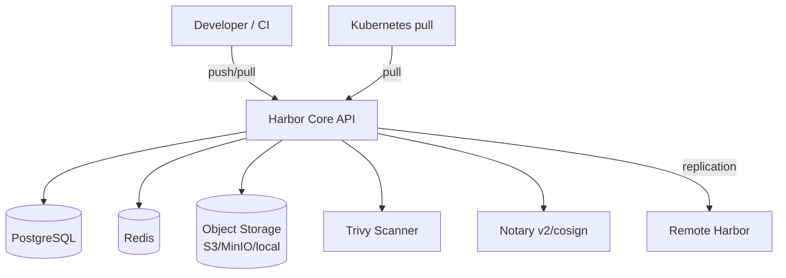

# 🎓 Registry & Production Patterns — Harbor, ECR, pull-through cache

> **Tác giả:** Mr.Rom\
> **Phiên bản:** v1.2.0\
> **Tạo lúc:** 24/05/2026\
> **Cập nhật:** 01/06/2026\
> **Level:** Intermediate\
> **Tags:** [MUST-KNOW]\
> **Yêu cầu trước:** [Optimization & Distroless — Từ 1.2 GB xuống 85 MB](03_optimization-and-distroless.md)

> 🎯 *Bạn đã build, scan rồi ký image — nhưng để image đó **ở đâu**? Cứ đẩy lên Docker Hub thì gói free chỉ cho 100 lượt pull mỗi 6 tiếng, scale lên trăm pod là bị chặn ngay trong giờ đầu. Bài này chỉ cho bạn cách chọn *private registry* (kho riêng — Harbor/ECR/GHCR), dựng *pull-through cache* (kho trung chuyển), đặt *tag policy* immutable (nhãn bất biến), chạy *garbage collection* (dọn rác) và *replication* (nhân bản) cross-region. Đây là bài khép lại cụm intermediate.*

## 🎯 Sau bài này bạn sẽ

- [ ] So sánh các lựa chọn **registry** (kho chứa image) năm 2026: Harbor / ECR / GCR / GHCR / Artifactory
- [ ] Tự dựng **Harbor** self-host (tự vận hành) hoặc dùng **ECR** managed (dịch vụ quản lý của AWS)
- [ ] Cấu hình **pull-through cache** — kho trung chuyển đặt sát cluster để khỏi đụng rate-limit của Docker Hub
- [ ] Đặt **tag policy** (quy ước gắn nhãn): digest bất biến, semver, env-suffix
- [ ] Triển khai **garbage collection** (dọn rác blob) + retention policy (giữ lại bao nhiêu bản)
- [ ] Cấu hình **replication** (nhân bản image) cross-region/cross-cloud
- [ ] Quản lý **pull secret** (thông tin đăng nhập kho) + token rotation (xoay vòng token) trong K8s
- [ ] Hiểu **storage backend** (nơi lưu blob thật) của registry + cách tối ưu chi phí

---

## Tình huống — Docker Hub chặn pull và sập đúng lúc deploy

Chiều thứ Sáu, bạn deploy *production*. Một lệnh quen thuộc để đẩy bản mới ra toàn cluster:

```bash
kubectl rollout restart deployment/fastapi
```

Mỗi pod khởi động lại đều phải pull image gốc `python:3.12-slim` từ Docker Hub. Vài pod đầu chạy ngon, rồi đột nhiên cả loạt còn lại báo lỗi đỏ lòm:

```text
Failed to pull image "python:3.12-slim": rpc error: code = Unknown
desc = toomanyrequests: You have reached your pull rate limit.
You may increase the limit by authenticating and upgrading.
```

🔥 Thủ phạm là **giới hạn pull cho tài khoản ẩn danh của Docker Hub**: 100 lượt pull mỗi 6 tiếng trên mỗi IP. Cluster của bạn có 50 node, mỗi lần pod restart lại pull base image — gộp lại vượt hạn mức chỉ trong vài giờ, thế là Docker Hub chặn thẳng tay.

Tưởng đã đủ khổ, vài giờ sau Docker Hub còn **sập ngắn** (vướng sự cố Cloudflare). Lần này lỗi đổi giọng nhưng hậu quả y hệt:

```text
ImagePullBackOff: Failed to pull image: connection refused
```

Cả cluster đứng hình, không deploy nổi một dòng — chỉ vì phụ thuộc hoàn toàn vào một kho công cộng nằm ngoài tầm kiểm soát.

Sếp đi ngang, nói gọn: *"Production mà cột chặt vào Docker Hub thì không ổn. Dựng pull-through cache + private registry có replication đi. Chiều thứ Hai ngồi học cho kỹ bài Registry."*

Đó chính là toàn bộ những gì bài này sẽ gỡ cho bạn.

---

## 1️⃣ Chọn registry năm 2026 — Bảng quyết định

Trước khi nhảy vào setup, phải chọn đúng "ngôi nhà" cho image đã. Thị trường registry năm 2026 đông đúc, nhưng đừng để loạn — mỗi cái sinh ra cho một bối cảnh riêng. Một ẩn dụ giúp bạn xếp chúng vào đúng chỗ:

🪞 **Ẩn dụ**: *Registry như một **kho phân phối phần mềm**. Docker Hub là **kho công cộng đông đúc** — ai cũng vào được nhưng bị giới hạn lượt lấy hàng (quota free nhỏ). Harbor private là **kho riêng của bạn** — kiểm soát ai vào, ghi nhật ký, nhân bản tuỳ ý. Còn pull-through cache là **kho trung chuyển đặt ngay sát nhà** — giữ sẵn bản sao của hàng hay lấy, khỏi phải chạy ra kho công cộng mỗi lần.*

Bảng dưới gom 9 lựa chọn phổ biến nhất, kèm điểm mạnh/yếu và bối cảnh nên chọn. Đọc cột "Khi dùng" trước, rồi soi ngược lên Pros/Cons:

| Registry | Type | Pros | Cons | Khi dùng |
| :--- | :--- | :--- | :--- | :--- |
| **Docker Hub** | SaaS public | Default, popular | Rate limit nghiêm, không control | Personal/OSS public images |
| **GHCR** (ghcr.io) | SaaS, miễn phí cho GitHub | Free private cho repo, OIDC native | Tied to GitHub | Github-based workflow |
| **AWS ECR** | SaaS (AWS) | IAM integration, cross-region replication | Vendor lock-in AWS | Production AWS |
| **GCP GCR / Artifact Registry** | SaaS (GCP) | IAM, integrate K8s GKE | Vendor lock-in GCP | Production GCP |
| **Azure ACR** | SaaS (Azure) | IAM, AKS integration | Vendor lock-in Azure | Production Azure |
| **Harbor** | Self-host (CNCF Graduated) | OSS, full control, vuln scan built-in, replication | Operate yourself | Self-host + on-prem |
| **JFrog Artifactory** | Commercial | Universal registry (Docker + Maven + npm + ...) | $$$, complex | Enterprise multi-package |
| **Quay** (Red Hat) | SaaS / self-host | Robot account, security scan | Less popular | Red Hat / OpenShift |
| **Nexus** (Sonatype) | Self-host (free OSS edition) | Multi-format | UI cũ | Lightweight self-host |

### Chi phí thực tế 2026 (ước lượng)

Bảng trên cho biết "dùng cái nào", còn câu hỏi tiếp theo luôn là "tốn bao nhiêu". Chi phí registry trải dài rất rộng — từ miễn phí (Docker Hub free, GHCR) đến hơn $5,000/năm (Artifactory bản enterprise). Đừng chọn theo cảm tính: cân theo *scale* (quy mô) và *cloud provider* bạn đang dùng sẵn. Con số tham khảo năm 2026:

| Registry | Plan | Cost | Suitable for |
| :--- | :--- | :--- | :--- |
| Docker Hub free | Anonymous 100/6h | $0 | Demo/learning |
| Docker Hub Pro | 5,000 pull/day | $7/month | Small team |
| Docker Hub Team | Unlimited pulls + private repos | $11/user/month | Small startup |
| GHCR | Free for GitHub Actions + private | $0 (within GH plan) | GitHub workflow |
| AWS ECR | Storage $0.10/GB/month + egress $0.09/GB | $50-500/month | Production AWS |
| Harbor self-host | EKS/EC2 ~$200-1000/month | Variable | Self-host + control |
| Artifactory | Custom | $5,000+/year | Enterprise |

→ **Recommend starter** 2026:
- **Personal/OSS**: Docker Hub free + GHCR.
- **Startup**: GHCR (nếu GitHub) hoặc ECR (nếu AWS).
- **Self-host**: Harbor — CNCF, free, production-grade.
- **Enterprise multi-package**: Artifactory.

---

## 2️⃣ Dựng Harbor (registry self-host của CNCF)

Nếu bạn cần một registry tự làm chủ hoàn toàn — không lệ thuộc cloud nào — thì Harbor là lựa chọn số một. Nó là dự án CNCF đã "tốt nghiệp" (Graduated), đóng gói sẵn mọi thứ một kho production cần. Trước khi gõ lệnh cài, hãy nhìn xem bên trong Harbor có những gì.

### Kiến trúc

Harbor không phải một process đơn lẻ mà là **6 thành phần** phối hợp, chạy trong K8s: Core API (REST + giao diện web), PostgreSQL (lưu metadata), Redis (hàng đợi job), object storage (lưu blob của image), Trivy (quét lỗ hổng sẵn), và Notary v2/cosign (ký image). Sơ đồ tổng quan:



Vai trò từng thành phần:

- **Core API**: REST API + giao diện web — nơi mọi lệnh push/pull đi qua.
- **PostgreSQL**: lưu metadata (danh sách repo, user, policy).
- **Redis**: lưu session + hàng đợi job nền.
- **Storage backend** (nơi lưu blob thật): S3/MinIO/local — chứa các *layer* của image.
- **Trivy** (tích hợp sẵn): quét lỗ hổng image ngay khi push.
- **Replication controller** (bộ điều khiển nhân bản): đồng bộ image sang registry ở xa.

### Cài Harbor bằng Helm

Harbor triển khai gọn qua Helm chart chính thức, gần như một lệnh là xong. Việc cần làm là chỉnh `values.yaml` cho ba thứ quan trọng: ingress (đường vào từ ngoài), persistent storage (đĩa lưu bền) và Trivy. Dưới đây là cấu hình tối thiểu nhưng đủ dùng cho production:

```bash
helm repo add harbor https://helm.goharbor.io
helm repo update

# values.yaml
cat > harbor-values.yaml <<'EOF'
expose:
  type: ingress
  tls:
    enabled: true
  ingress:
    hosts:
      core: harbor.acmeshop.vn
      
externalURL: https://harbor.acmeshop.vn

persistence:
  enabled: true
  persistentVolumeClaim:
    registry:
      size: 100Gi
    database:
      size: 10Gi

harborAdminPassword: "Harbor12345"   # CHANGE in production!

trivy:
  enabled: true
EOF

helm install harbor harbor/harbor -n harbor --create-namespace -f harbor-values.yaml
```

### Tạo project và push image đầu tiên

Helm chạy xong là Harbor đã sống. Giờ tạo một "project" (không gian chứa image, giống một namespace của riêng bạn) rồi đẩy thử một image lên. Mở giao diện web và làm theo bốn bước:

1. **Vào giao diện Harbor**: `https://harbor.acmeshop.vn`
2. **Đăng nhập**: `admin` / `Harbor12345`
3. **Tạo project**: đặt tên `acme` (chọn public hoặc private tuỳ ý)
4. **Push image** từ máy lên project vừa tạo:

```bash
# Login
docker login harbor.acmeshop.vn

# Tag image
docker tag myapp:v1 harbor.acmeshop.vn/acme/myapp:v1

# Push
docker push harbor.acmeshop.vn/acme/myapp:v1
```

Push xong, vào lại giao diện web, mở project `acme` — bạn sẽ thấy đủ thông tin của image vừa đẩy lên: danh sách image kèm tag, dung lượng và thời điểm push; kết quả quét Trivy (chạy tự động ngay khi push); trạng thái replication; và mức quota đã dùng.

### Những tính năng Harbor đáng giá

Câu hỏi tự nhiên là: tự dựng Harbor cực vậy, đổi lại được gì so với cứ dùng Docker Hub? Câu trả lời nằm ở **7 tính năng cấp production** mà Docker Hub không có. Đây chính là lý do nhiều doanh nghiệp chấp nhận tự vận hành Harbor:

- **Quét Trivy tích hợp**: kích hoạt ngay lúc push hoặc đặt lịch quét hằng ngày.
- **Tag immutability** (nhãn bất biến): khoá tag, không cho ghi đè.
- **Retention policy** (chính sách giữ bản): giữ N tag mới nhất, xoá phần còn lại.
- **Replication** (nhân bản): đồng bộ qua lại với Docker Hub, ECR, GCR, ACR.
- **Robot account** (tài khoản máy): token dành cho CI/CD, tách biệt tài khoản người dùng.
- **Vulnerability allowlist** (danh sách bỏ qua lỗ hổng): cho phép bỏ qua một CVE cụ thể đã chấp nhận.
- **Project quota** (hạn mức dự án): giới hạn dung lượng tối đa cho mỗi project.

---

## 3️⃣ AWS ECR — Lựa chọn cloud-native

Nếu hạ tầng của bạn đã nằm trên AWS, dựng Harbor riêng có khi là thừa. ECR (*Elastic Container Registry*) là registry quản lý sẵn của AWS — bạn không phải cài hay vận hành gì cả, chỉ tạo repo qua AWS CLI là dùng được ngay. Điểm ăn tiền là nó gắn chặt với *IAM* (hệ thống phân quyền của AWS): cluster EKS pull image tự động dùng quyền của instance, khỏi cần khai báo mật khẩu.

### Tạo repo và push

Toàn bộ việc "dựng" ECR gói gọn trong vài lệnh — tạo repo, đăng nhập Docker, rồi push:

```bash
# Create repo
aws ecr create-repository \
  --repository-name acme/myapp \
  --image-scanning-configuration scanOnPush=true \
  --image-tag-mutability IMMUTABLE \
  --region us-east-1

# Authenticate Docker
aws ecr get-login-password --region us-east-1 | \
  docker login --username AWS --password-stdin \
  123456789012.dkr.ecr.us-east-1.amazonaws.com

# Push
docker tag myapp:v1 123456789012.dkr.ecr.us-east-1.amazonaws.com/acme/myapp:v1
docker push 123456789012.dkr.ecr.us-east-1.amazonaws.com/acme/myapp:v1
```

### Những tính năng ECR nổi bật

Đổi lại việc bị "khoá" vào AWS, ECR cho bạn một loạt tính năng tích hợp sẵn mà không phải tự dựng:

- **Quét image** (bản cơ bản miễn phí, bản nâng cao qua Inspector thì tính phí).
- **Lifecycle policy** (chính sách vòng đời) — tự xoá image cũ theo luật.
- **Cross-region replication** (nhân bản đa vùng) — có sẵn, bật là chạy.
- **Tích hợp IAM** — phân quyền truy cập chi tiết tới từng repo.
- **Pull-through cache** (kho trung chuyển) — xem §4.

### Ví dụ lifecycle policy

Tính năng đáng dùng nhất là lifecycle policy: thay vì xoá image cũ thủ công, bạn mô tả luật bằng JSON rồi ECR tự dọn. Ví dụ dưới giữ 30 image tag mới nhất và xoá image untagged (mất tag) sau 7 ngày:

```json
{
  "rules": [
    {
      "rulePriority": 1,
      "description": "Keep last 30 tagged images",
      "selection": {
        "tagStatus": "tagged",
        "tagPatternList": ["v*"],
        "countType": "imageCountMoreThan",
        "countNumber": 30
      },
      "action": { "type": "expire" }
    },
    {
      "rulePriority": 2,
      "description": "Delete untagged images after 7 days",
      "selection": {
        "tagStatus": "untagged",
        "countType": "sinceImagePushed",
        "countUnit": "days",
        "countNumber": 7
      },
      "action": { "type": "expire" }
    }
  ]
}
```

Áp dụng policy đó vào repo bằng một lệnh:

```bash
aws ecr put-lifecycle-policy \
  --repository-name acme/myapp \
  --lifecycle-policy-text file://policy.json
```

---

## 4️⃣ Pull-through cache — Chặn đứng rate limit của Docker Hub

Đây chính là vũ khí giải quyết tình huống đầu bài. Quay lại con số đau đầu kia để thấy rõ vì sao cần nó.

### Vấn đề rate limit từ đâu ra

Hãy nhân thử: cluster 50 node, mỗi node chạy 100 pod, mỗi pod restart lại pull `python:3.12-slim` từ Docker Hub. Tổng cộng 50 × 100 = **5.000 lượt pull mỗi giờ** dồn về Docker Hub — vượt xa hạn mức 100 pull/6h, chạm trần chỉ trong vài giờ. Vấn đề không phải image nặng, mà là **cùng một image bị pull đi pull lại quá nhiều lần**.

### Pull-through cache hoạt động ra sao

Ý tưởng đơn giản: dựng một registry cục bộ đóng vai *proxy* (trung chuyển) cho Docker Hub. Mỗi lần có yêu cầu pull, luồng đi như sau:

1. Cluster hỏi registry cục bộ thay vì hỏi thẳng Docker Hub.
2. Registry cục bộ kiểm tra cache: nếu đã có image → trả về ngay (nhanh, không gọi ra Docker Hub).
3. Nếu chưa có → registry cục bộ pull từ Docker Hub đúng **1 lần**, lưu lại, rồi trả về.

Kết quả: mỗi base image chỉ pull từ Docker Hub **1 lần thay vì 5.000 lần**. Trần rate limit gần như không bao giờ chạm tới. Dưới đây là ba cách dựng cache đó, từ cloud-managed đến tự host.

### Cách 1: ECR pull-through cache (trên AWS)

Nếu đã dùng AWS, đây là cách nhàn nhất — chỉ khai báo một luật, ECR tự lo phần proxy:

```bash
aws ecr create-pull-through-cache-rule \
  --ecr-repository-prefix dockerhub \
  --upstream-registry-url registry-1.docker.io \
  --region us-east-1
```

Sau khi có luật, đổi địa chỉ pull từ Docker Hub sang ECR — chỉ cần sửa dòng `FROM` trong Dockerfile:

```dockerfile
# Thay
FROM python:3.12-slim

# Bằng
FROM 123456789012.dkr.ecr.us-east-1.amazonaws.com/dockerhub/library/python:3.12-slim
```

Từ đó ECR fetch từ Docker Hub đúng lần đầu rồi cache lại; mọi pull sau lấy thẳng từ ECR — cùng region nên nhanh, lại miễn nhiễm rate limit.

### Cách 2: Harbor proxy cache

Nếu bạn đã dựng Harbor ở §2, không cần thêm hạ tầng — Harbor làm proxy cache được luôn. Vào giao diện web và làm ba bước:

1. **Registries** → New endpoint → trỏ tới `https://registry-1.docker.io` (Docker Hub).
2. **Projects** → New project → chọn type **Proxy Cache** → gắn endpoint vừa tạo.
3. Pull qua Harbor bằng cách đổi `FROM` trong Dockerfile:

   ```dockerfile
   FROM harbor.acmeshop.vn/dockerhub-proxy/library/python:3.12-slim
   ```

### Cách 3: Docker registry standalone

Khi chưa có cả ECR lẫn Harbor, bạn vẫn dựng được cache "tay không" bằng image `registry` chính thức — gọn nhẹ, hợp cho lab hoặc cluster nhỏ:

```yaml
# docker-compose.yml
services:
  cache:
    image: registry:2.8
    ports: ["5000:5000"]
    environment:
      REGISTRY_PROXY_REMOTEURL: https://registry-1.docker.io
      REGISTRY_PROXY_USERNAME: <dockerhub-username>
      REGISTRY_PROXY_PASSWORD: <dockerhub-password>
    volumes:
      - cache-data:/var/lib/registry
volumes:
  cache-data:
```

Khởi động cache rồi pull thử qua nó — lần đầu chậm (fetch upstream), các lần sau lấy từ cache, nhanh hẳn:

```bash
docker compose up -d

# Now pull through cache
docker pull localhost:5000/library/python:3.12-slim
```

### Cấu hình containerd để cluster dùng cache mà không phải sửa Dockerfile

Ba cách trên đều cần đổi địa chỉ trong `FROM`. Có một mẹo "trong suốt" hơn: chỉnh thẳng containerd (runtime kéo image của K8s) để nó tự đổi hướng `docker.io` sang cache. Nhờ vậy mọi `FROM python:3.12-slim` cũ vẫn giữ nguyên mà vẫn đi qua cache:

```toml
# /etc/containerd/config.toml
[plugins."io.containerd.grpc.v1.cri".registry.mirrors."docker.io"]
  endpoint = ["https://cache.acmeshop.vn", "https://registry-1.docker.io"]
```

→ Tất cả `FROM python:3.12-slim` tự động pull qua cache, không sửa Dockerfile.

---

## 5️⃣ Tag policy — Bất biến + semver + env-suffix

Image đã có chỗ ở rồi, nhưng đặt tên (tag) cho chúng thế nào lại là chuyện sống còn ở production. Tag sai cách thì rollback mù mịt, deploy không biết đang chạy bản nào. Trước khi xem cách làm đúng, hãy nhìn lỗi kinh điển nhất.

### Anti-pattern: lạm dụng tag `latest`

```bash
docker push acme/myapp:latest
```

❌ Vấn đề ở chỗ `latest` *mutable* (thay đổi được) — bạn không bao giờ biết chắc bản nào đang chạy:

- Pod restart sau một tuần, pull lại `latest` → có thể là image khác hẳn hôm trước.
- Rollback khó: muốn quay về "bản `latest` trước đó" thì... chẳng còn biết nó là tag gì.

Cách chữa là gắn tag theo quy ước rõ ràng, bất biến. Có bốn mẫu (pattern) thường dùng, mỗi mẫu hợp một mục đích.

### Pattern 1: Tag semver (cho bản release)

```bash
# Release v1.2.3
docker push acme/myapp:1.2.3
docker push acme/myapp:1.2     # latest patch của 1.2
docker push acme/myapp:1       # latest minor của 1
```

### Pattern 2: Tag theo Git SHA (mỗi commit)

```bash
docker push acme/myapp:abc123def4567890
docker push acme/myapp:abc123d   # short SHA
```

Mỗi tag ánh xạ 1-1 với một commit, nên từ image truy ngược ra đúng dòng code đã build — *reproducible* (tái lập được).

### Pattern 3: Env-suffix (đẩy image qua môi trường)

```bash
docker push acme/myapp:1.2.3-staging
docker push acme/myapp:1.2.3-prod
```

Cùng một nội dung image, nhưng ký chữ ký riêng cho từng môi trường (xem [bài 02](02_image-security-supply-chain.md)).

### Pattern 4: Tham chiếu bằng digest (luôn dùng khi deploy)

```yaml
# K8s manifest
spec:
  containers:
    - image: acme/myapp@sha256:abc123def456...   # ← digest, không tag
```

Digest là *bất biến tuyệt đối*: tag có thể bị xoá hay trỏ đi nơi khác, còn digest gắn chết với nội dung, còn mãi.

### Cách làm chuẩn 2026

Đừng chọn một pattern rồi bỏ phần còn lại — cách chuẩn là kết hợp: push nhiều tag cho con người dễ tra, nhưng deploy thì khoá bằng digest. Trong CI/CD chia làm hai bước:

```bash
# CI/CD step 1: Push multiple tags
docker buildx imagetools create \
  --tag acme/myapp:1.2.3 \
  --tag acme/myapp:1.2 \
  --tag acme/myapp:latest \
  --tag acme/myapp:sha-abc123d \
  acme/myapp@sha256:abc...

# CI/CD step 2: K8s deploy bằng DIGEST
kubectl set image deployment/myapp \
  myapp=acme/myapp@sha256:abc...
```

Nói gọn: tag để **con người tra cứu** (`docker pull acme/myapp:1.2.3`), digest để **máy deploy** (bất biến, an toàn).

### Khoá tag bất biến trong Harbor

Quy ước thôi chưa đủ — nên ép registry từ chối ghi đè tag để không ai lỡ tay. Trên Harbor, vào giao diện web:

1. **Project → Configuration → Tag Immutability**.
2. Đặt luật: `tag pattern v*` + `repo pattern acme/*` → **immutable**.

Từ đó, push `acme/myapp:v1.2.3` lần thứ hai sẽ bị **từ chối** ngay.

### Khoá tag bất biến trong ECR

Trên ECR, cùng mục đích nhưng chỉ một lệnh:

```bash
aws ecr put-image-tag-mutability \
  --repository-name acme/myapp \
  --image-tag-mutability IMMUTABLE
```

---

## 6️⃣ Garbage collection + retention

Push image càng nhiều, kho càng phình. Nếu không dọn, một ngày đẹp trời đĩa đầy và registry ngừng nhận push. Phần này lo việc dọn rác — nhưng phải hiểu rác từ đâu ra trước đã.

### Image untagged tích tụ thế nào

Mỗi lần push một tag mới, tag cũ (nếu trỏ sang digest khác) trở thành *untagged* — mất nhãn nhưng các *layer* của nó vẫn nằm lì trong storage. Tích lại theo thời gian, storage phình to mà phần lớn là rác không ai dùng. Cả ECR lẫn Harbor đều cần dọn (GC). Có hai mức dọn: retention (chọn tag nào giữ lại) và garbage collection (xoá blob không còn ai tham chiếu).

### Harbor — retention policy

Mức một: đặt luật giữ lại bao nhiêu tag. Vào giao diện Harbor → Project → Policy → Tag retention rồi khai báo, ví dụ:

```text
Keep:
  - Most recently pulled: 10 tags
  - Most recently pushed: 5 tags
  - Match tag pattern: v*

Delete:
  - All other tags

Schedule: Daily at 2am
```

### Harbor — garbage collection

Mức hai: sau khi tag bị xoá, blob mồ côi vẫn còn. GC mới thực sự giải phóng đĩa. Vào Harbor → Configuration → System → Garbage Collection:

```text
Run: Weekly
Mode: Delete untagged blobs older than 7 days
```

Chạy xong, dung lượng đĩa được trả về thật sự.

### ECR — dùng lifecycle policy (xem ví dụ §3)

Trên ECR không tách hai mức như Harbor: lifecycle policy ở §3 đã tự xoá image cũ theo luật, không cần thao tác GC riêng.

---

## 7️⃣ Replication — Nhân bản đa vùng, đa cloud

Một kho duy nhất là một điểm chết duy nhất. Replication (nhân bản) sao chép image sang registry khác để hệ thống bền hơn và nhanh hơn. Bốn lý do chính khiến người ta bật nó:

- **Disaster recovery** (phục hồi thảm hoạ): kho chính sập → kho phụ gánh thay.
- **Độ trễ**: cluster ở châu Âu mà pull image tận US-East thì chậm — nhân bản sang vùng EU cho gần.
- **Tuân thủ**: yêu cầu *data residency* (dữ liệu phải nằm đúng vùng — như GDPR buộc dữ liệu EU phải ở EU).
- **Chi phí**: chuyển dữ liệu (*egress*) giữa các region/cloud tốn tiền — pull tại chỗ rẻ hơn pull xuyên vùng.

### Replication trên Harbor

Trên Harbor, cấu hình qua giao diện web theo hai bước:

1. **Registries** → tạo endpoint trỏ tới kho đích (ECR/GCR/một Harbor khác).
2. **Replications** → tạo luật mới:
   - Source: project `acme/*`, tag `v*`.
   - Destination: endpoint vừa tạo.
   - Mode: push-based hoặc pull-based.
   - Trigger: theo sự kiện (on-push), theo lịch, hoặc thủ công.

### Replication đa vùng trên ECR

Trên ECR, khai báo cấu hình nhân bản bằng một lệnh — push ở một vùng, ECR tự sao sang vùng kia:

```bash
aws ecr put-replication-configuration \
  --replication-configuration '{
    "rules": [
      {
        "destinations": [
          { "region": "us-west-2", "registryId": "123456789012" }
        ],
        "repositoryFilters": [
          { "filter": "acme", "filterType": "PREFIX_MATCH" }
        ]
      }
    ]
  }'
```

→ Push image us-east-1 → auto-replicate us-west-2.

---

## 8️⃣ Pull secret + Token rotation trong K8s

Có kho riêng rồi thì image thành private — và K8s muốn pull được phải có "chìa khoá". Phần này lo việc cấp chìa khoá đó cho cluster, rồi quan trọng hơn: làm sao xoay vòng chìa thường xuyên để nếu lỡ lộ cũng không thành thảm hoạ.

### Tạo pull secret

Image private nên K8s cần *credential* (thông tin đăng nhập kho) để pull. Tạo một Secret kiểu `docker-registry`:

```bash
kubectl create secret docker-registry harbor-creds \
  --docker-server=harbor.acmeshop.vn \
  --docker-username=robot$acme+ci \
  --docker-password=$ROBOT_TOKEN \
  --namespace=production
```

Tham chiếu secret đó trong Pod qua trường `imagePullSecrets`:

```yaml
apiVersion: v1
kind: Pod
metadata:
  name: myapp
spec:
  imagePullSecrets:
    - name: harbor-creds
  containers:
    - name: app
      image: harbor.acmeshop.vn/acme/myapp@sha256:abc...
```

### Anti-pattern: token sống lâu nằm chết trong K8s

Cách trên chạy được, nhưng có một cái bẫy: robot token tĩnh, không bao giờ đổi. Lỡ nó rò rỉ (ví dụ `kubectl logs` vô tình in ra secret) thì kẻ tấn công pull được mọi image private cho tới tận khi bạn xoay token — mà nếu không có lịch xoay thì là "mãi mãi".

### Best practice: token rotation

Lối thoát là để token tự xoay vòng định kỳ. Có hai cách phổ biến, tuỳ hạ tầng.

Cách 1: **External Secrets Operator** kết hợp Vault hoặc AWS Secrets Manager — kho bí mật giữ token thật, operator tự kéo về và làm mới secret theo chu kỳ:

```yaml
apiVersion: external-secrets.io/v1beta1
kind: ExternalSecret
metadata:
  name: harbor-creds
spec:
  refreshInterval: 1h    # rotate every hour
  secretStoreRef:
    name: vault-backend
  target:
    name: harbor-creds
    template:
      type: kubernetes.io/dockerconfigjson
      data:
        .dockerconfigjson: |
          {
            "auths": {
              "harbor.acmeshop.vn": {
                "username": "{{ .username }}",
                "password": "{{ .password }}"
              }
            }
          }
  data:
    - secretKey: username
      remoteRef: { key: harbor/ci, property: username }
    - secretKey: password
      remoteRef: { key: harbor/ci, property: password }
```

Cách 2: **IRSA (IAM Roles for Service Accounts)** trên ECR — đẹp nhất nếu bạn ở AWS, vì xoá luôn khái niệm secret: pod gắn một ServiceAccount mang IAM role, K8s và AWS tự trao đổi token ngắn hạn cho nhau:

```yaml
apiVersion: v1
kind: ServiceAccount
metadata:
  name: app-sa
  annotations:
    eks.amazonaws.com/role-arn: arn:aws:iam::123456789012:role/ecr-pull-role
```

Không còn secret nào để lộ, cũng không phải nhớ xoay — token do K8s/AWS cấp và làm mới hoàn toàn tự động.

---

## 9️⃣ Hands-on — Dựng Harbor + pull-through + replicate

Lý thuyết đủ rồi. Phần này ghép mọi mảnh đã học thành một luồng hoàn chỉnh: từ dựng Harbor, cấp tài khoản cho CI, đẩy image qua GitHub Actions, bật cache, nhân bản sang DR, đến lúc K8s pull bằng digest. Làm tuần tự sáu bước.

### Bước 1: Triển khai Harbor (Helm)

Phần cài đã trình bày ở §2 — coi như đã chạy xong.

### Bước 2: Tạo robot account cho CI

CI/CD không nên dùng tài khoản người. Tạo một robot account riêng (xem §2) — vào Harbor → Project `acme` → Robot Accounts → New:

```text
Name: ci
Expiration: 30 days
Permissions:
  - Repository: Push, Pull
  - Artifact: Read, Create, Delete
```

Tạo xong, copy token để dùng ở bước sau.

### Bước 3: GitHub Actions push image lên Harbor

Dùng token vừa lấy để CI tự đăng nhập rồi build-push image. Một job GitHub Actions tối giản:

```yaml
- uses: docker/login-action@v3
  with:
    registry: harbor.acmeshop.vn
    username: robot$acme+ci
    password: ${{ secrets.HARBOR_TOKEN }}

- uses: docker/build-push-action@v5
  with:
    context: .
    push: true
    tags: |
      harbor.acmeshop.vn/acme/myapp:${{ github.sha }}
      harbor.acmeshop.vn/acme/myapp:v1.2.3
    platforms: linux/amd64,linux/arm64
```

### Bước 4: Bật pull-through cache cho Docker Hub

Để cluster khỏi đụng rate limit, dựng proxy cache ngay trên Harbor (đúng cách 2 ở §4). Vào Harbor → Registries → New Endpoint:

- Name: `dockerhub-upstream`
- URL: `https://registry-1.docker.io`

Sau đó vào Projects → New project → đặt tên `dockerhub-cache` → type **Proxy Cache** → gắn endpoint `dockerhub-upstream`.

Cuối cùng đổi `FROM` trong Dockerfile để base image đi qua cache:

```dockerfile
# Thay
FROM python:3.12-slim

# Bằng
FROM harbor.acmeshop.vn/dockerhub-cache/library/python:3.12-slim
```

### Bước 5: Replication sang registry DR

Để phòng kho chính sập, nhân bản tag production sang một ECR ở vùng khác. Vào Harbor → Registries → tạo endpoint trỏ tới ECR vùng DR, rồi vào Replications → New rule:

- Source: `acme/*`, tag `v*`
- Destination: endpoint ECR vừa tạo
- Trigger: Event-based (on-push)

Từ đó, mỗi lần push `harbor.acmeshop.vn/acme/myapp:v1.2.3`, Harbor tự sao sang `ecr.us-west-2.../acme/myapp:v1.2.3`.

### Bước 6: K8s pull bằng digest bất biến

Khâu cuối: deploy thật. Đừng để manifest tham chiếu tag, hãy dùng digest để chốt cứng nội dung image:

```yaml
apiVersion: apps/v1
kind: Deployment
metadata:
  name: myapp
spec:
  template:
    spec:
      imagePullSecrets:
        - name: harbor-creds
      containers:
        - name: app
          image: harbor.acmeshop.vn/acme/myapp@sha256:abc123def...   # ← digest
```

→ Production deploy với digest, không tag. Immutable forever.

---

## 💡 Cạm bẫy thường gặp & Best practice

Phần này gom những cái bẫy hay gặp ở production cùng cách chữa, rồi đến vài thói quen tốt nên áp dụng sớm. Đọc qua một lượt để khỏi vấp đúng lúc deploy lúc nửa đêm.

### ❌ Cạm bẫy: hay push tag `latest`

```bash
docker push acme/myapp:latest   # mỗi build
```

→ Mất tính tái lập: pod restart pull `latest` có thể ra image khác hẳn.

→ **Cách chữa**: push tag bất biến (semver, git SHA) và dùng digest khi deploy.

### ❌ Cạm bẫy: ImagePullPolicy `Always` đi với tag mutable

```yaml
image: acme/myapp:latest
imagePullPolicy: Always   # ← pull mỗi pod start
```

→ Mỗi pod restart đều pull lại → tốn băng thông và ăn vào rate limit, cold start chậm.

→ **Cách chữa**: dùng digest kèm `imagePullPolicy: IfNotPresent`:

```yaml
image: acme/myapp@sha256:abc...
imagePullPolicy: IfNotPresent
```

### ❌ Cạm bẫy: không theo dõi hạn token của robot account

→ Token đặt hạn 30 ngày, đúng 30 ngày sau CI build fail đột ngột vào 6h chiều thứ Sáu.

→ **Cách chữa**:

- Đặt lịch nhắc trước ngày token hết hạn.
- Dùng Vault/Secrets Manager để xoay token tự động.
- Theo dõi tuổi token qua Harbor API.

### ❌ Cạm bẫy: chạy GC lúc cluster đang pull dồn dập

→ GC xoá blob đang được tham chiếu → lần pull kế tiếp đứt giữa chừng.

→ **Cách chữa**: lên lịch GC vào giờ vắng (2-4h sáng), tạm dừng CI trong cửa sổ GC.

### ❌ Cạm bẫy: replication không lọc — nhân bản cả image dev

→ Image của nhánh dev (`feat-xxx-*`) bị sao sang registry DR → tốn cả dung lượng lẫn băng thông.

→ **Cách chữa**: chỉ lọc tag production `v*`:

```yaml
filters:
  - type: tag
    value: "v*"
```

### ❌ Cạm bẫy: Harbor dùng cert TLS self-signed mà K8s không tin

```text
x509: certificate signed by unknown authority
```

→ containerd trên node K8s không tin cert tự ký.

→ **Cách chữa**: thêm cert vào kho tin cậy của containerd:

```bash
# /etc/containerd/certs.d/harbor.acmeshop.vn/hosts.toml
server = "https://harbor.acmeshop.vn"

[host."https://harbor.acmeshop.vn"]
  ca = "/etc/containerd/certs.d/harbor.acmeshop.vn/ca.crt"
```

### ✅ Best practice: gom manifest list về cùng một registry

Image đa kiến trúc (amd64 + arm64) nên nằm chung một registry dưới một manifest list, để client tự chọn đúng kiến trúc:

```bash
# Multi-arch image
docker buildx build --platform linux/amd64,linux/arm64 \
  -t harbor.acmeshop.vn/acme/myapp:v1 \
  --push .

# Verify manifest list:
docker buildx imagetools inspect harbor.acmeshop.vn/acme/myapp:v1
# Manifests:
#   linux/amd64  sha256:aaa...
#   linux/arm64  sha256:bbb...
```

### ✅ Best practice: lưu build cache ngay trên registry

Đẩy *build cache* lên registry để các runner CI khác nhau dùng chung, tránh build lại từ đầu mỗi lần:

```bash
docker buildx build \
  --cache-from type=registry,ref=harbor.acmeshop.vn/acme/myapp:buildcache \
  --cache-to type=registry,ref=harbor.acmeshop.vn/acme/myapp:buildcache,mode=max \
  -t harbor.acmeshop.vn/acme/myapp:v1 \
  --push .
```

→ Cache nằm trong registry nên chia sẻ được giữa mọi máy chạy CI.

### ✅ Best practice: đính kèm SBOM + chữ ký vào manifest

Phần ký và tạo SBOM đã làm kỹ ở [bài 02](02_image-security-supply-chain.md). Ở đây chỉ cần ký image và gắn SBOM attestation vào digest đang lưu trên registry:

```bash
cosign attest --yes --type spdxjson --predicate sbom.spdx.json harbor.acmeshop.vn/acme/myapp@sha256:abc
cosign sign --yes harbor.acmeshop.vn/acme/myapp@sha256:abc
```

→ Giao diện Harbor khi đó hiển thị đủ: image + chữ ký + SBOM + kết quả quét — một bức tranh trọn vẹn.

---

## 🧠 Tự kiểm tra (Self-check)

**Q1.** Khi nào pull-through cache không giúp được?

<details>
<summary>💡 Đáp án</summary>

Pull-through cache phát huy tác dụng khi:

- **Cùng một base image** bị pull nhiều lần (pod restart, nhiều cluster). Cache trúng (*hit*) → trả về nhanh.

Nó vô dụng khi:

- **Mỗi build ra một image riêng** (tag theo commit SHA) — lần pull thứ hai không bao giờ trúng cache.
- **Cache còn nguội** lần đầu — vẫn phải fetch upstream, chậm như pull thẳng.
- **Upstream sập** — cache chỉ giữ image cũ, không fetch được image mới. Cache không thay được DR.
- **Upstream cần xác thực** — cache chỉ giữ được image public, hoặc phải cấu hình auth thêm.

→ Tóm lại: pull-through cache giúp giảm rate limit + độ trễ cho **image dùng chung từ upstream**, không phải bản thay thế trọn vẹn cho một private registry.
</details>

**Q2.** Tại sao dùng **digest** thay tag trong K8s production deploy?

<details>
<summary>💡 Đáp án</summary>

**Digest (`sha256:...`)** là định danh *content-addressed* (định danh bằng chính nội dung):

- Cùng digest nghĩa là cùng nội dung (từng byte), không bao giờ đổi.
- Tag chỉ là cái tên gợi nhớ (*alias*), có thể bị trỏ sang nội dung khác.

Hậu quả nếu deploy bằng tag — một kịch bản tấn công kinh điển trong K8s:

- 3h sáng pod được lên lịch với `image: acme/app:v1` → controller phân giải `v1` → `sha:abc` → pull.
- 4h sáng kẻ tấn công chiếm registry, trỏ lại `v1` → `sha:xxx` độc hại.
- 5h sáng pod restart → phân giải `v1` → `sha:xxx` → pull nhầm bản độc.

Nếu deploy bằng `image: acme/app@sha256:abc...`:

- Không cần phân giải tag. Pod restart vẫn pull đúng `sha:abc` (đã verify, đã ký).
- Kẻ tấn công trỏ lại tag cũng vô hại — digest bất biến.

→ Đây là *defense-in-depth*: tag cho con người, digest cho máy.
</details>

**Q3.** Tradeoff giữa **Harbor self-host** vs **ECR managed**?

<details>
<summary>💡 Đáp án</summary>

| Aspect | Harbor self-host | ECR managed |
| :--- | :--- | :--- |
| Cost | Hardware/cloud cost ~$200-1000/month | $0.10/GB storage + egress |
| Control | Full — tune everything | Limited to AWS settings |
| Maintenance | You patch, upgrade, scale, backup | AWS handles |
| Features | Trivy, Notary v2, OIDC, replication, RBAC fine-grained | IAM, basic scan, lifecycle |
| Integration | Vendor-neutral | Tight với AWS ecosystem |
| Compliance | On-prem option (data sovereignty) | Geographic regions choice |
| Outage scope | Your responsibility | AWS regional outage |
| Multi-cloud | Yes (1 Harbor cho mọi cloud) | AWS only |

**Chọn Harbor khi**:

- Bắt buộc on-prem (chủ quyền dữ liệu, không được phép dùng cloud).
- Theo chiến lược multi-cloud (tránh lệ thuộc một nhà cung cấp).
- Cần tính năng nâng cao (Notary v2, RBAC chi tiết).
- Có đội ops để vận hành.

**Chọn ECR khi**:

- Hạ tầng chỉ nằm trên AWS.
- Đội ops nhỏ, không muốn ôm việc vận hành.
- Tính năng tiêu chuẩn là đủ.
- Yêu cầu tuân thủ chấp nhận được với AWS.
</details>

**Q4.** Cách handle Harbor migrate khi storage backend thay đổi (local → S3)?

<details>
<summary>💡 Đáp án</summary>

Quy trình bảy bước:

1. **Backup PostgreSQL** (metadata của Harbor): chạy `pg_dump`.
2. **Tạo S3 bucket mới** + cấp IAM credentials cho Harbor.
3. **Copy lớp storage** từ local sang S3: `aws s3 sync /data/registry s3://harbor-storage/`.
4. **Cập nhật config Harbor** trong Helm values:
   ```yaml
   persistence:
     imageChartStorage:
       type: s3
       s3:
         region: us-east-1
         bucket: harbor-storage
         accesskey: ...
         secretkey: ...
   ```
5. **Helm upgrade** Harbor để áp config mới.
6. **Kiểm chứng**: pull một image cũ — Harbor đọc được từ S3 là đạt.
7. **Dọn volume local** sau khi đã kiểm chứng (giữ backup 30 ngày rồi mới xoá hẳn).

→ Downtime chỉ vài phút lúc Helm upgrade. Luôn diễn tập ở môi trường staging trước.
</details>

**Q5.** Khi nào dùng **GHCR** vs **ECR** vs **Harbor**?

<details>
<summary>💡 Đáp án</summary>

- **GHCR** (GitHub Container Registry):
  - Miễn phí cho repo GitHub (cả public lẫn private).
  - OIDC cho GitHub Actions hoạt động native.
  - Độ hiển thị của image gắn theo độ hiển thị của repo.
  - Hạn chế: bám chặt hệ sinh thái GitHub.
  - Hợp nhất với: dự án mã nguồn mở, workflow dựa trên GitHub, CI/CD bằng GitHub Actions.

- **ECR** (AWS):
  - Cho production AWS — tích hợp IAM, AKS/EKS pull tự động.
  - Nhân bản đa vùng, lifecycle policy.
  - Pull-through cache có sẵn.
  - Hợp nhất với: production AWS, đa vùng, môi trường siết chặt IAM.

- **Harbor**:
  - Self-host — toàn quyền, không lệ thuộc nhà cung cấp.
  - Hỗ trợ multi-cloud, nhiều tính năng nâng cao.
  - Tuân thủ (tuỳ chọn on-prem, chủ quyền dữ liệu).
  - Hợp nhất với: nhu cầu self-host, multi-cloud, tuân thủ cấp doanh nghiệp.

Thực tế nhiều đội dùng **nhiều registry cùng lúc**, mỗi cái một vai:

- GHCR cho OSS + repo private nhỏ (miễn phí).
- ECR cho workload production trên AWS (tích hợp chặt).
- Harbor cho on-prem / dữ liệu nhạy cảm (tuân thủ).
- Replication giữa các registry để lo DR.

</details>

---

## ⚡ Tra cứu nhanh (Cheatsheet)

Gom nhanh các lệnh hay dùng nhất khi làm việc với registry — chọn kho, push/pull, ECR, Harbor, pull secret, multi-arch và soi manifest. Lưu lại để tra khi cần:

```bash
# === Registry choice ===
# Docker Hub:        docker.io/library/python:3.12-slim
# GHCR:              ghcr.io/<owner>/<repo>:<tag>
# ECR:               <account>.dkr.ecr.<region>.amazonaws.com/<repo>:<tag>
# Harbor:            <harbor-url>/<project>/<repo>:<tag>

# === Push/Pull ===
docker login <registry>
docker tag local:v1 <registry>/<repo>:<tag>
docker push <registry>/<repo>:<tag>
docker pull <registry>/<repo>@sha256:<digest>

# === ECR ===
aws ecr get-login-password --region us-east-1 | docker login --username AWS --password-stdin <account>.dkr.ecr.us-east-1.amazonaws.com
aws ecr create-repository --repository-name acme/myapp --image-tag-mutability IMMUTABLE
aws ecr put-lifecycle-policy --repository-name acme/myapp --lifecycle-policy-text file://policy.json
aws ecr create-pull-through-cache-rule --ecr-repository-prefix dockerhub --upstream-registry-url registry-1.docker.io

# === Harbor (helm) ===
helm install harbor harbor/harbor -f values.yaml
kubectl get pods -n harbor

# === K8s pull secret ===
kubectl create secret docker-registry harbor-creds \
  --docker-server=<registry> \
  --docker-username=<user> \
  --docker-password=<pass>

# === Multi-arch ===
docker buildx imagetools create -t <registry>/<repo>:multi \
  <registry>/<repo>:amd64 \
  <registry>/<repo>:arm64

# === Inspect ===
docker buildx imagetools inspect <registry>/<repo>:<tag>
crane manifest <registry>/<repo>:<tag>    # google/go-containerregistry
oras discover <registry>/<repo>@sha256:... # signatures, sbom, attestations
```

```yaml
# === K8s production pattern ===
apiVersion: apps/v1
kind: Deployment
spec:
  template:
    spec:
      serviceAccountName: app-sa   # IRSA cho ECR (no secret)
      imagePullSecrets:             # cho Harbor (with secret)
        - name: harbor-creds
      containers:
        - image: harbor.acmeshop.vn/acme/myapp@sha256:abc...
          imagePullPolicy: IfNotPresent
```

---

## 📚 Từ Điển Thuật Ngữ (Glossary)

| Thuật ngữ | Giải thích |
| :--- | :--- |
| **Registry** | Kho lưu container image, có API để push/pull |
| **Repository** | Nhóm logic các image cùng tên (khác nhau ở tag) |
| **Tag** | Nhãn gợi nhớ, thay đổi được, gắn cho image (v1.2.3, latest...) |
| **Digest** | Mã băm bất biến theo nội dung image (`sha256:...`) |
| **Manifest list** | OCI Image Index — manifest gom nhiều nền tảng (đa kiến trúc) |
| **Pull-through cache** | Registry làm proxy cho upstream — fetch một lần rồi cache cục bộ |
| **Garbage collection** | Tiến trình xoá các layer blob untagged không còn ai tham chiếu |
| **Lifecycle policy** | Luật tự xoá image cũ theo tiêu chí định sẵn |
| **Replication** | Đồng bộ image giữa các registry (cho DR, đa vùng) |
| **Robot account** | Tài khoản dạng token cho CI/CD (không phải tài khoản người) |
| **IRSA** | IAM Roles for Service Accounts — pod K8s mượn IAM role (trên AWS) |
| **Pull secret** | Secret kiểu `dockerconfigjson` của K8s, chứa credential của registry |
| **Image promotion** | Quy trình đẩy image qua các môi trường (dev → staging → prod) |
| **Vendor lock-in** | Lệ thuộc một nhà cung cấp, khó di chuyển đi nơi khác |
| **ORAS** | OCI Registry As Storage — dùng registry lưu artifact tổng quát (ngoài image) |

---

## 🔗 Liên kết & Tài nguyên

### 🧭 Định hướng lộ trình học

- ⬅️ **Bài trước:** [Optimization & Distroless — Từ 1.2 GB xuống 85 MB](03_optimization-and-distroless.md)
- ↑ **Về cụm:** [Docker — Containerization Platform](../../README.md)
- 🎯 Đây là bài cuối — bạn đã hoàn thành cụm Docker intermediate!

### 🧩 Các chủ đề có thể bạn quan tâm

- ☸️ [K8s Secrets](../../../kubernetes/lessons/01_basic/03_configmaps-and-secrets.md) — image pull secrets
- 🔁 [CI/CD Pipeline patterns](../../../ci-cd/lessons/01_basic/03_pipeline-patterns.md) — registry trong pipeline
- 🏗️ [IaC Terraform](../../../iac/lessons/01_basic/01_terraform-basics.md) — provision ECR/registry với Terraform

### 🌐 Tài nguyên tham khảo khác

- 📖 [Harbor docs](https://goharbor.io/docs/)
- 📖 [AWS ECR docs](https://docs.aws.amazon.com/AmazonECR/)
- 📖 [GHCR docs](https://docs.github.com/en/packages/working-with-a-github-packages-registry/working-with-the-container-registry)
- 📖 [Docker registry HTTP API v2](https://distribution.github.io/distribution/spec/api/)
- 📖 [OCI Distribution Spec](https://github.com/opencontainers/distribution-spec)
- 📖 [crane tool](https://github.com/google/go-containerregistry) — interact với registry programmatically
- 📖 [ORAS — OCI as storage](https://oras.land/)
- 📖 [External Secrets Operator](https://external-secrets.io/)
- 📖 [Trivy + Harbor integration](https://goharbor.io/docs/2.10.0/administration/vulnerability-scanning/)

---

## 📌 Nhật ký thay đổi (Changelog)

- **v1.0.0 (24/05/2026)** — Bản đầu tiên. Lesson 04 — bài cuối của intermediate cluster. Registry decision matrix 9 options (Docker Hub/GHCR/ECR/GCR/ACR/Harbor/Artifactory/Quay/Nexus). Setup Harbor self-host (Helm) + ECR cloud-native. Pull-through cache 3 cách (ECR/Harbor/standalone registry). Tag policy immutable + digest reference. GC + retention. Replication cross-region. K8s pull secret + IRSA. Full hands-on Harbor setup. 6 pitfall + 4 best practice + 5 self-check + cheatsheet đầy đủ.
- **v1.1.0 (25/05/2026)** — thêm lead-in trước Cost reality + Harbor Architecture + Install Helm + Harbor features + ECR Setup.
- **v1.1.1 (01/06/2026)** — Sửa lỗi QA: ECR replication `repositoryFilters` PREFIX_MATCH dùng prefix literal (`acme`) thay vì glob `acme/*` (AWS không hỗ trợ wildcard cho PREFIX_MATCH); sửa từ lỗi "Cù resolve" → "Không cần resolve tag" ở self-check Q2; sửa số option trong changelog 8 → 9 cho khớp decision matrix.
- **v1.2.0 (01/06/2026)** — Polish văn phong + soát QA theo checklist: Việt hoá toàn bộ đoạn "điện tín" EN (tình huống, lead-in các section, bullet tính năng, glossary), thêm câu dẫn trước mỗi code/bảng và câu phân tích sau, thêm câu bắc cầu giữa các section, giải thích thuật ngữ EN trong ngoặc lần đầu. Sửa lỗi: `cosign attach sbom` (deprecated cosign v2) → `cosign attest --type spdxjson` cho khớp bài 02; gắn ngôn ngữ cho 7 fence thiếu `lang` (text/bash) và sửa 1 fence gán nhầm `yaml`→`bash`; chuẩn hoá separator bảng sang `| :--- |`; thêm dòng trống quanh fence/list/heading/bảng; link "Bài trước"/"Yêu cầu trước"/"Về cụm" dùng tiêu đề thật + link bài 02 ở chỗ tham chiếu.
