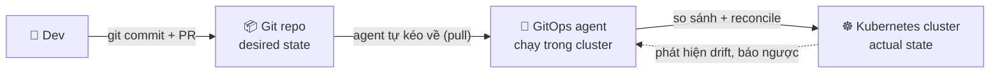

# GitOps là gì? — Git làm nguồn chân lý cho vận hành

> **Tác giả:** Mr.Rom\
> **Phiên bản:** v1.0.0\
> **Tạo lúc:** 13/06/2026\
> **Cập nhật:** 13/06/2026\
> **Level:** Basic\
> **Tags:** gitops, kubernetes, devops, continuous-delivery, [MUST-KNOW]\
> **Yêu cầu trước:** [Kubernetes ConfigMaps & Secrets](../../../kubernetes/lessons/01_basic/03_configmaps-and-secrets.md)

> 🎯 *Bạn đã biết viết YAML cho ConfigMap, Secret, Deployment rồi `kubectl apply` lên cluster. Nhưng khi cả team cùng `apply` tay, không ai biết cluster đang chạy đúng cái gì. Sau bài này bạn sẽ hiểu GitOps là gì, vì sao "Git làm nguồn chân lý" giúp vận hành an toàn hơn, và phân biệt rõ push-based deploy với pull-based GitOps.*

## 🎯 Sau bài này bạn sẽ

- [ ] Giải thích được GitOps là gì và vì sao Git trở thành **single source of truth** cho cả app lẫn infra
- [ ] Đọc và nhớ được **4 nguyên tắc OpenGitOps** (declarative, versioned & immutable, pulled automatically, continuously reconciled)
- [ ] Phân biệt rõ **push-based deploy** (CI cầm credential cluster) với **pull-based GitOps** (agent trong cluster tự kéo Git)
- [ ] Liệt kê được 4 lợi ích cốt lõi: audit, rollback, drift self-heal, least-privilege
- [ ] Hiểu GitOps nằm ở đâu so với CI/CD truyền thống, và biết tên 2 GitOps engine hàng đầu (ArgoCD, Flux)

---

## Tình huống: Acme Shop và những lần "kubectl apply tay" lúc nửa đêm

Acme Shop đang chạy ứng dụng bán hàng trên Kubernetes. Cách họ deploy hiện tại rất "đời thường": ai cần sửa gì thì mở laptop, `kubectl apply -f deployment.yaml`, hoặc cuống lên thì `kubectl edit` thẳng trên cluster.

Tuần vừa rồi, 3 chuyện xảy ra:

- **Thứ Hai:** một bạn dev tăng `replicas` từ 3 lên 10 cho đợt sale, sửa thẳng bằng `kubectl scale`. Sale xong quên hạ. Cuối tháng hoá đơn cloud đội lên, không ai nhớ vì sao có 10 pod.
- **Thứ Tư:** on-call sửa biến môi trường `LOG_LEVEL=debug` lúc 2 giờ sáng để debug. Fix xong quên revert. Production log debug suốt 2 ngày, lộ cả thông tin nhạy cảm vào log.
- **Thứ Sáu:** một bạn `apply` nhầm file YAML cũ đè lên config mới, app rớt 15 phút. Khi truy ra "ai làm, làm lúc nào, đổi cái gì" thì... không có log. `kubectl` không ghi lại lịch sử "ai apply cái gì".

Câu hỏi nhức nhối của sếp Acme Shop: *"Làm sao để **trạng thái thật của cluster luôn khớp với một thứ ta kiểm soát được**, mọi thay đổi đều có dấu vết, và lỡ sai thì rollback trong một nốt nhạc?"*

Câu trả lời chính là **GitOps**.

---

## 1️⃣ Vậy GitOps là gì?

Vấn đề gốc của Acme Shop: **không có một "bản thiết kế gốc" (source of truth) cho cluster**. Trạng thái thật nằm rải rác trong đầu mỗi người, trong terminal history, trong những lần `kubectl edit` không ai nhớ.

GitOps ra đời để giải quyết đúng điều đó: **dùng một Git repository làm nguồn chân lý duy nhất (single source of truth)** cho toàn bộ cấu hình — cả app deployment lẫn infra config. Cluster *phải* trông giống y hệt những gì khai báo trong Git. Muốn đổi gì → không `apply` tay nữa, mà **commit/PR vào Git**, rồi để hệ thống tự đồng bộ cluster theo Git.

🪞 **Ẩn dụ đời thường**: GitOps giống như **bản vẽ thi công của một toà nhà**. Bản vẽ (Git) là chuẩn duy nhất. Một bác thợ tự ý xây thêm cái tường không có trong bản vẽ (sửa tay trên cluster) → đội giám sát (agent GitOps) phát hiện và phá đi, kéo công trình về đúng bản vẽ. Muốn thêm tường thật sự → phải sửa bản vẽ trước (commit Git), rồi mới thi công theo. Nhờ vậy công trình thật **luôn khớp bản vẽ**, và ai sửa bản vẽ lúc nào đều ghi rõ trong lịch sử.

Định nghĩa gọn để nhớ:

> **GitOps** = một cách vận hành (operational model) trong đó:
> 1. **Toàn bộ desired state** (trạng thái mong muốn) của hệ thống được khai báo và lưu trong **Git**.
> 2. Một **agent/controller** liên tục so sánh trạng thái thật của cluster với Git, và **tự kéo cluster về khớp với Git**.

Ba từ khoá cần khắc cốt:

- **Desired state** (trạng thái mong muốn) — "tôi MUỐN cluster trông như thế này", viết bằng YAML khai báo, lưu trong Git.
- **Actual state** (trạng thái thật) — cluster đang THỰC SỰ chạy gì lúc này.
- **Reconcile** (hoà giải / đồng bộ) — vòng lặp liên tục: nếu actual ≠ desired → sửa actual cho khớp desired.

Áp vào Acme Shop: file Deployment khai báo `replicas: 3` được commit vào Git. Nếu ai đó `kubectl scale` lên 10 (làm actual lệch khỏi desired), agent GitOps phát hiện và **tự kéo về 3** — vì 3 mới là điều Git nói. Muốn thật sự chạy 10 → sửa số trong Git, commit, agent tự scale lên 10. Mọi thay đổi đều có dấu vết commit.

---

## 2️⃣ 4 nguyên tắc OpenGitOps

"GitOps" từng bị mỗi hãng định nghĩa một kiểu. Năm 2021, **OpenGitOps Working Group** (thuộc CNCF — *Cloud Native Computing Foundation*, tổ chức quản lý Kubernetes và nhiều dự án cloud-native) chốt một định nghĩa chuẩn gồm **4 nguyên tắc**. Đây là "hiến pháp" của GitOps — một hệ thống chỉ thật sự là GitOps khi thoả cả 4.

Trước khi xem bảng, hãy nhớ: 4 nguyên tắc này không rời rạc — chúng xếp thành một chuỗi logic từ "mô tả cái gì" → "lưu ở đâu" → "ai kéo về" → "kéo về liên tục ra sao".

| # | Nguyên tắc (EN) | Dịch & ý nghĩa |
|---|---|---|
| 1 | **Declarative** | **Khai báo** — desired state mô tả bằng *cái mình muốn* (YAML), không phải *các bước phải làm*. Ta nói "muốn 3 pod", không nói "chạy lệnh tạo pod 3 lần". |
| 2 | **Versioned & Immutable** | **Có phiên bản & bất biến** — desired state lưu trong Git: mỗi thay đổi là 1 commit, không xoá được lịch sử, mỗi version cố định không đổi ngầm. |
| 3 | **Pulled Automatically** | **Được kéo tự động** — các software agent tự *kéo* (pull) desired state từ Git về, không cần ai đẩy (push) thủ công. |
| 4 | **Continuously Reconciled** | **Hoà giải liên tục** — agent liên tục quan sát actual state, so với desired state trong Git, và tự sửa nếu lệch (drift). |

Lưu ý cách dùng từ chuẩn của OpenGitOps: họ gọi cả 4 thứ trên là tính chất của **"the desired state"** — tức trạng thái mong muốn phải *declarative*, phải *versioned & immutable*, phải được *pulled automatically*, và phải được *continuously reconciled*.

Soi lại nguyên tắc 1 cho rõ — nhiều người mới hay nhầm "declarative" với "viết YAML":

❌ **Imperative (mệnh lệnh)** — mô tả *các bước*:
```bash
kubectl create deployment web --image=nginx:1.27
kubectl scale deployment web --replicas=3
kubectl set env deployment/web LOG_LEVEL=info
```
→ Chạy lại 3 lệnh này trên cluster đã có sẵn → có thể lỗi "đã tồn tại", thứ tự lệnh quan trọng, khó biết "kết quả cuối cùng phải trông như nào".

✅ **Declarative (khai báo)** — mô tả *kết quả cuối*:
```yaml
apiVersion: apps/v1
kind: Deployment
metadata:
  name: web
spec:
  replicas: 3
  selector:
    matchLabels:
      app: web
  template:
    metadata:
      labels:
        app: web
    spec:
      containers:
        - name: web
          image: nginx:1.27
          env:
            - name: LOG_LEVEL
              value: info
```
→ File này nói "tôi MUỐN cuối cùng có 3 pod nginx với `LOG_LEVEL=info`". Apply 1 lần hay 100 lần đều ra cùng kết quả (*idempotent* — bất biến theo số lần chạy). Đây chính là điều kiện cần để GitOps reconcile được: agent đọc file, biết chính xác "đích" là gì, rồi tự lái cluster tới đó.

→ Tóm lại 4 nguyên tắc: **mô tả cái mình muốn (1) → lưu vào Git có lịch sử (2) → agent tự kéo về (3) → và kéo về liên tục mãi mãi (4)**. Bốn cái này ghép lại tạo nên toàn bộ sức mạnh của GitOps mà ta sẽ thấy ở các phần sau.

---

## 3️⃣ Push-based deploy vs Pull-based GitOps

Đây là phần quan trọng nhất của bài — và là điểm khiến GitOps khác biệt thật sự. Cùng deploy lên Kubernetes, nhưng có hai hướng "đẩy" và "kéo" với hệ quả an toàn rất khác nhau.

Trước khi xem chi tiết, hãy hình dung tổng thể qua sơ đồ luồng dev commit cho tới khi cluster đồng bộ — đây là khái niệm trung tâm của cả bài:



→ Điểm mấu chốt trong sơ đồ: mũi tên đi từ Git **vào** cluster là do **agent bên trong cluster tự kéo**, không phải ai đó từ bên ngoài đẩy vào. Chính chiều mũi tên này quyết định ai cầm chìa khoá cluster — và đó là khác biệt cốt lõi giữa hai mô hình dưới đây.

### Push-based deploy — CI cầm chìa khoá cluster

Đây là cách "truyền thống" mà rất nhiều team (kể cả Acme Shop) đang làm. CI pipeline (ví dụ GitHub Actions) sau khi build xong sẽ **trực tiếp `kubectl apply` vào cluster**. Để làm được điều đó, CI phải có **credential cluster** (kubeconfig / service account token) lưu trong CI secrets.

🪞 **Ẩn dụ**: push model giống như **bạn tự cầm chìa khoá nhà kho, lái xe tới, mở cửa và xếp hàng vào**. Tiện, nhưng chìa khoá nhà kho phải để trong cốp xe (CI) — ai chiếm được xe là vào được kho.

Luồng push-based — chạy ngay trong CI runner:
```bash
# Chạy bên trong CI runner (ví dụ GitHub Actions) sau khi build image
# 1. CI nạp credential cluster (kubeconfig lưu trong CI secrets)
echo "$KUBECONFIG_CONTENT" > /tmp/kubeconfig
export KUBECONFIG=/tmp/kubeconfig

# 2. CI deploy thẳng vào cluster production
kubectl apply -f k8s/deployment.yaml
kubectl rollout status deployment/web
```

Vấn đề của push-based:

- **CI phải cầm credential cluster** → nếu CI bị hack (lộ token, dependency độc), kẻ tấn công có quyền vào *thẳng* production cluster. Bề mặt tấn công lớn.
- **Cluster bị "đẩy" từ bên ngoài** → cluster phải mở cổng cho CI ngoài internet truy cập vào API server (firewall phải reachable từ CI).
- **Không tự phát hiện drift** — nếu sau khi CI apply xong, có ai đó `kubectl edit` tay, không có gì kéo về nữa cho tới lần CI chạy kế tiếp. Đúng kịch bản 3 sự cố của Acme Shop.

### Pull-based GitOps — agent trong cluster tự kéo về

Ở GitOps đúng nghĩa, ta lật ngược chiều: **đặt một agent (controller) chạy ngay bên trong cluster**. Agent này tự *kéo* (pull) desired state từ Git về và tự apply. CI không còn `kubectl apply` nữa — CI chỉ build image, push registry, rồi **commit version mới vào Git**. Phần "đưa lên cluster" do agent lo.

🪞 **Ẩn dụ**: pull model giống như **nhà kho có robot riêng bên trong**. Bạn chỉ cần dán đơn hàng lên bảng tin công khai (Git). Robot (agent) tự đọc đơn, tự đi lấy hàng xếp vào. Bạn **không cần** và **không được** cầm chìa khoá kho — chìa khoá ở trong tay robot, nằm trong kho luôn.

Luồng pull-based — CI không còn chạm cluster:
```bash
# Chạy bên trong CI runner — KHÔNG có credential cluster nữa
# 1. Build + push image lên registry
docker build -t registry.acmeshop.vn/web:v1.4.0 .
docker push registry.acmeshop.vn/web:v1.4.0

# 2. CI chỉ cập nhật version trong Git repo cấu hình (không apply gì cả)
git clone https://git.acmeshop.vn/acme/gitops-config.git
cd gitops-config
yq -i '.spec.template.spec.containers[0].image = "registry.acmeshop.vn/web:v1.4.0"' apps/web/deployment.yaml
git commit -am "web: lên v1.4.0"
git push
# Xong! Agent trong cluster sẽ tự kéo commit này về và apply.
```

> [!IMPORTANT]
> Khác biệt cốt lõi nằm ở **ai cầm credential cluster**. Push: CI cầm (chìa khoá để ngoài internet). Pull: agent trong cluster cầm (chìa khoá ở trong cluster, không lộ ra ngoài). Đây chính là lý do GitOps được xem là an toàn hơn về mặt bảo mật.

Bảng đối chiếu hai mô hình để chốt lại:

| Tiêu chí | **Push-based deploy** | **Pull-based GitOps** |
|---|---|---|
| Ai apply lên cluster | CI (từ bên ngoài) | Agent (bên trong cluster) |
| Ai cầm credential cluster | CI secrets (lộ ra internet) | Agent trong cluster (không lộ) |
| Chiều kết nối | CI → mở cổng vào cluster | Agent → tự gọi ra Git (cluster đóng kín) |
| Tự phát hiện drift | ❌ Không | ✅ Có, reconcile liên tục |
| Bề mặt tấn công | Lớn (credential ngoài) | Nhỏ (least-privilege) |
| Nguồn chân lý | Lệnh trong pipeline | Git repo (rõ ràng, có lịch sử) |

→ Pull-based GitOps không chỉ "đẹp về lý thuyết" — nó trực tiếp xử lý cả 3 sự cố của Acme Shop: drift được tự kéo về, mọi thay đổi có commit để truy vết, và CI không còn cầm chìa khoá production.

---

## 4️⃣ Lợi ích — vì sao Acme Shop nên chuyển sang GitOps

Bốn lợi ích dưới đây không phải "tính năng marketing" — chúng là hệ quả trực tiếp của 4 nguyên tắc OpenGitOps. Mỗi lợi ích đều đến từ một nguyên tắc cụ thể.

- **Audit qua git history** (đến từ nguyên tắc *versioned & immutable*). Mọi thay đổi cấu hình giờ là một commit: ai sửa, sửa gì, lúc nào, qua PR nào, ai review. Câu hỏi "ai scale lên 10 pod?" của Acme Shop có ngay đáp án trong `git log`.
- **Rollback = git revert** (đến từ *declarative* + *versioned*). Deploy mới hỏng? Không cần nhớ "version cũ là gì để apply lại". Chỉ cần `git revert` về commit trước, agent tự kéo cluster về đúng trạng thái cũ. Rollback trở thành thao tác Git quen thuộc.
- **Drift tự heal** (đến từ *continuously reconciled*). Có ai `kubectl edit` tay làm lệch cluster khỏi Git? Agent phát hiện và tự kéo về khớp Git. Kịch bản "quên revert `LOG_LEVEL=debug`" của Acme Shop sẽ tự được sửa trong vòng vài phút.
- **Least-privilege vì CI không cần quyền cluster** (đến từ *pulled automatically*). CI chỉ cần quyền push Git + push registry, **không** cần credential cluster. Giảm mạnh bề mặt tấn công: dù CI bị xâm nhập, kẻ xấu cũng không có đường thẳng vào production.

Để dễ hình dung lợi ích "rollback", đây là cách nó diễn ra trong thực tế:

```bash
# Deploy v1.4.0 vừa rồi gây lỗi 500 trên production
# Bước 1: tìm commit deploy v1.4.0
git log --oneline -3
# a1b2c3d web: lên v1.4.0   ← commit gây lỗi
# d4e5f6a web: thêm health check
# 7g8h9i0 web: lên v1.3.0

# Bước 2: revert commit lỗi (tạo commit mới "đảo ngược" thay đổi)
git revert a1b2c3d --no-edit
git push
# Agent trong cluster tự kéo commit revert về → cluster quay lại v1.3.0
```

> [!NOTE]
> `git revert` tạo một commit *mới* đảo ngược thay đổi cũ, **không** xoá lịch sử. Nhờ vậy ngay cả thao tác rollback cũng được ghi lại đầy đủ — đúng tinh thần "versioned & immutable".

→ Tổng kết: 4 lợi ích này biến vận hành từ "mò mẫm, không dấu vết" (tình huống đầu bài) thành "minh bạch, có kiểm soát, tự sửa lỗi". Đó là lý do GitOps trở thành chuẩn vận hành Kubernetes hiện đại.

---

## 5️⃣ GitOps vs CI/CD truyền thống — không thay thế, mà bổ sung

Nhiều người mới nhầm "GitOps thay thế CI/CD". Không phải. GitOps **bổ sung** cho CI/CD, cụ thể là lo phần "CD" (Continuous Delivery — phần đưa lên môi trường chạy).

Hãy tách rõ trách nhiệm:

- **CI (Continuous Integration — tích hợp liên tục)**. Lo phần **build & test**: lấy code mới, build image, chạy unit test, security scan, push image lên registry. CI **không** chạm vào cluster.
- **CD (Continuous Delivery/Deployment — phân phối liên tục)**. Lo phần **deploy**: đưa version mới lên cluster. Trong mô hình GitOps, **chính GitOps đảm nhận phần CD này** — qua việc agent kéo Git về và reconcile cluster.

Sơ đồ ranh giới trách nhiệm:
```text
┌────────────── CI: build + test ──────────────┐   ┌──── CD = GitOps: deploy ────┐

  code push → build image → test → push registry → commit Git → agent reconcile → cluster

└──── CI lo tới đây, KHÔNG chạm cluster ────────┘   └─ GitOps lo từ Git → cluster ┘
```

→ Lằn ranh nằm đúng ở Git: CI dừng lại khi đã commit version mới vào Git repo cấu hình; từ Git trở đi là việc của GitOps. Git vừa là "đầu ra" của CI, vừa là "đầu vào" của CD — đó là lý do Git được gọi là nguồn chân lý chung của cả hai.

Một điểm hay: vì ranh giới là Git, bạn có thể **đổi CI tool** (GitHub Actions → GitLab CI → Jenkins) mà không động gì tới GitOps, và ngược lại đổi GitOps engine mà không động tới CI. Hai bên chỉ "nói chuyện" qua Git.

---

## 6️⃣ Landscape — ai làm agent GitOps cho bạn?

Tới đây bạn đã hiểu cần một "agent chạy trong cluster, tự kéo Git về reconcile". Vậy lấy agent đó ở đâu? Trong hệ sinh thái Kubernetes 2026, có **2 GitOps engine hàng đầu**, cả hai đều là dự án **CNCF Graduated** (đã tốt nghiệp — mức trưởng thành cao nhất của CNCF, chứng tỏ ổn định và được dùng rộng rãi ở production):

| Engine | Cha đẻ | Đặc trưng nổi bật |
|---|---|---|
| **ArgoCD** | Intuit (đóng góp cho CNCF) | Có **web UI** mạnh để xem trạng thái sync/health trực quan; dùng `Application` CRD; hợp với team cần dashboard và quản lý multi-cluster từ một hub |
| **Flux** | Weaveworks (đóng góp cho CNCF) | Thiên về **CLI / git-centric**, kiến trúc nhiều controller nhỏ; mạnh ở image automation (tự cập nhật Git khi có image mới) |

> [!NOTE]
> Cả ArgoCD và Flux đều hiện thực **cùng một triết lý** — 4 nguyên tắc OpenGitOps ở phần 2. Chúng khác nhau ở giao diện, kiến trúc và một số tính năng phụ, chứ không khác về bản chất "Git là nguồn chân lý, agent kéo về reconcile".

Bài này dừng ở mức "GitOps là gì và vì sao". Cách **cài đặt, cấu hình, vận hành** từng engine (ArgoCD `Application`, Flux `Kustomization`/`HelmRelease`, sync wave, drift detection chi tiết...) sẽ là nội dung các bài tiếp theo trong cụm — bắt đầu bằng so sánh sâu ArgoCD vs Flux để bạn chọn đúng engine.

---

## 💡 Cạm bẫy thường gặp & Best practice

### ❌ Cạm bẫy: tưởng "có dùng Git + có pipeline deploy" là đã GitOps

- **Triệu chứng**: team lưu YAML trong Git, CI chạy `kubectl apply` mỗi lần merge — và tự gọi đó là "GitOps".
- **Nguyên nhân**: nhầm "dùng Git trong quy trình deploy" với "GitOps". Đây thực chất vẫn là **push-based** (CI đẩy vào cluster), thiếu nguyên tắc *pulled automatically* và *continuously reconciled*. Không có agent nào tự kéo về, nên drift vẫn không được phát hiện.
- **Cách tránh**: kiểm tra đủ cả 4 nguyên tắc OpenGitOps. Đặc biệt phải có **agent trong cluster reconcile liên tục** — nếu thiếu, đó chỉ là "Git-driven CI/CD", chưa phải GitOps.

### ❌ Cạm bẫy: vừa GitOps vừa `kubectl edit` tay trên cluster

- **Triệu chứng**: đã cài agent GitOps nhưng on-call vẫn `kubectl edit` thẳng production khi gấp; sửa xong thấy "tự nhiên bị revert" sau vài phút.
- **Nguyên nhân**: agent reconcile phát hiện cluster lệch khỏi Git → tự kéo về khớp Git (đúng như thiết kế). Sửa tay không qua Git = drift, sẽ bị heal đi.
- **Cách tránh**: kỷ luật "mọi thay đổi qua Git" — muốn đổi thật thì sửa Git rồi để agent apply. Trường hợp khẩn cấp cần edit tay, dùng quy trình "break glass" (tạm tắt auto-sync, edit, rồi commit lại sau) — chi tiết ở bài về sync & reconciliation.

### ✅ Best practice: bắt buộc PR review cho repo cấu hình GitOps

- **Vì sao**: khi Git là nguồn chân lý, **ai merge vào Git = người đó đổi production**. Một PR sai có thể xoá nhầm resource hoặc đẩy config hỏng lên thẳng cluster.
- **Cách áp dụng**: bật branch protection cho nhánh chính của repo cấu hình; yêu cầu ≥1 reviewer khác tác giả (production nên ≥2); bật secret scanning. Lúc này "approval" trong GitOps mới có ý nghĩa thật.

### ✅ Best practice: tách repo code và repo cấu hình GitOps

- **Vì sao**: trộn code app và YAML deploy vào một repo khiến mỗi lần build lại tự kích hoạt deploy ngoài ý muốn, và khó phân quyền (dev sửa code, platform team duyệt deploy).
- **Cách áp dụng**: để app code ở repo riêng; cấu hình GitOps (Deployment, ConfigMap, image tag) ở repo `gitops-config` riêng. CI build xong chỉ commit version mới vào repo cấu hình. Cấu trúc repo chi tiết sẽ học ở bài về cấu trúc repo GitOps.

---

## 🧠 Tự kiểm tra (Self-check)

**Q1.** Trong một câu, GitOps là gì và "nguồn chân lý" ở đây là gì?

<details>
<summary>💡 Xem giải thích</summary>

GitOps là cách vận hành trong đó **toàn bộ desired state của hệ thống được khai báo và lưu trong Git làm nguồn chân lý duy nhất**, và một agent trong cluster liên tục kéo Git về để giữ trạng thái thật của cluster khớp với Git. Nguồn chân lý = Git repository — cluster phải trông giống y hệt những gì Git nói, không phải ngược lại.

</details>

**Q2.** Kể tên 4 nguyên tắc OpenGitOps và giải thích ngắn mỗi cái.

<details>
<summary>💡 Xem giải thích</summary>

1. **Declarative** — desired state mô tả bằng "cái mình muốn" (YAML khai báo), không phải các bước phải làm.
2. **Versioned & Immutable** — state lưu trong Git: có lịch sử, bất biến, mỗi commit là một version cố định.
3. **Pulled Automatically** — agent tự *kéo* (pull) state từ Git về, không cần ai đẩy thủ công.
4. **Continuously Reconciled** — agent liên tục so actual với desired và tự sửa nếu lệch (drift).

</details>

**Q3.** Khác biệt cốt lõi giữa push-based deploy và pull-based GitOps về mặt bảo mật là gì?

<details>
<summary>💡 Xem giải thích</summary>

Nằm ở **ai cầm credential cluster**.

- **Push-based**: CI (bên ngoài) cầm credential cluster để `kubectl apply`. Chìa khoá cluster nằm trong CI secrets, lộ ra internet → bề mặt tấn công lớn, CI bị hack là vào thẳng production.
- **Pull-based GitOps**: agent *bên trong* cluster cầm chìa khoá và tự kéo Git về. CI chỉ cần quyền push Git + registry, **không** có credential cluster → least-privilege, bề mặt tấn công nhỏ hơn nhiều.

</details>

**Q4.** Một bạn dev `kubectl scale deployment/web --replicas=10` tay trên cluster đang dùng GitOps (Git khai báo `replicas: 3`). Chuyện gì xảy ra, và làm sao để thật sự chạy 10 pod?

<details>
<summary>💡 Xem giải thích</summary>

Agent reconcile phát hiện actual (10) lệch khỏi desired trong Git (3) → đây là **drift** → agent tự kéo về **3** (self-heal). Số 10 sửa tay sẽ bị revert.

Để thật sự chạy 10 pod: **sửa `replicas: 10` trong Git**, commit/PR, push. Agent kéo commit mới về và scale lên 10 một cách hợp lệ — có dấu vết, có review.

</details>

**Q5.** "Dùng Git lưu YAML + CI chạy `kubectl apply` khi merge" — đây có phải GitOps không? Vì sao?

<details>
<summary>💡 Xem giải thích</summary>

**Chưa phải GitOps đầy đủ.** Đây vẫn là mô hình **push-based** (CI đẩy vào cluster, CI cầm credential). Nó thiếu 2 nguyên tắc quan trọng:

- **Pulled Automatically** — không có agent nào tự *kéo* Git về; là CI *đẩy* lên.
- **Continuously Reconciled** — không có vòng lặp reconcile liên tục, nên drift (sửa tay sau khi apply) không được phát hiện và sửa.

Đúng hơn nên gọi là "Git-driven CI/CD". GitOps thật cần agent trong cluster reconcile liên tục.

</details>

---

## ⚡ Tra cứu nhanh (Cheatsheet)

| Khái niệm | Một câu để nhớ |
|---|---|
| GitOps | Git = nguồn chân lý; agent trong cluster tự kéo về và reconcile |
| Desired state | "Tôi MUỐN cluster trông như này" — YAML trong Git |
| Actual state | Cluster đang THỰC SỰ chạy gì lúc này |
| Reconcile | Vòng lặp: actual ≠ desired → sửa actual cho khớp desired |
| Drift | Cluster lệch khỏi Git (thường do sửa tay) |
| Self-heal | Agent tự kéo drift về khớp Git |
| Push-based | CI cầm credential, `kubectl apply` từ ngoài vào (rủi ro) |
| Pull-based | Agent trong cluster tự kéo Git về (an toàn hơn) |
| Rollback | `git revert` về commit trước → agent tự kéo cluster về |
| 4 nguyên tắc | Declarative · Versioned & Immutable · Pulled Automatically · Continuously Reconciled |

```bash
# Quy trình thay đổi chuẩn GitOps (luôn qua Git, không apply tay)
git switch -c update-web-image          # tạo nhánh
# ... sửa file deployment.yaml ...
git commit -am "web: lên v1.4.0"        # commit thay đổi
git push -u origin update-web-image     # push + mở PR để review
# Sau khi PR được merge vào main → agent trong cluster tự kéo về + reconcile

# Rollback khi deploy mới hỏng
git revert <commit-hash> --no-edit      # tạo commit đảo ngược
git push                                # agent kéo về → cluster quay lại trạng thái cũ
```

---

## 📚 Từ Điển Thuật Ngữ (Glossary)

| EN | VN | Giải thích |
|---|---|---|
| GitOps | GitOps (giữ nguyên) | Vận hành lấy Git làm nguồn chân lý, agent tự kéo về reconcile |
| Single source of truth | Nguồn chân lý duy nhất | Một nơi chuẩn duy nhất quyết định hệ thống phải trông như nào (ở đây là Git) |
| Desired state | Trạng thái mong muốn | Cấu hình ta MUỐN hệ thống có, khai báo bằng YAML trong Git |
| Actual state | Trạng thái thật | Cấu hình hệ thống đang THỰC SỰ chạy lúc này |
| Reconcile | Hoà giải / đồng bộ | Vòng lặp so actual với desired và sửa actual cho khớp |
| Drift | Lệch trạng thái | Khi actual khác desired, thường do sửa tay ngoài Git |
| Self-heal | Tự chữa lành | Agent tự kéo drift về khớp với Git |
| Declarative | Khai báo | Mô tả "cái mình muốn", không phải các bước phải làm |
| Imperative | Mệnh lệnh | Mô tả "các bước phải làm" tuần tự |
| Idempotent | Bất biến theo số lần chạy | Apply 1 lần hay nhiều lần đều ra cùng kết quả |
| Push-based deploy | Deploy kiểu đẩy | CI cầm credential, apply từ ngoài vào cluster |
| Pull-based GitOps | GitOps kiểu kéo | Agent trong cluster tự kéo Git về và apply |
| Agent / Controller | Tác tử điều khiển | Tiến trình trong cluster thực thi vòng lặp reconcile |
| OpenGitOps | OpenGitOps | Nhóm chuẩn hoá thuộc CNCF, định nghĩa 4 nguyên tắc GitOps |
| CNCF | CNCF | Cloud Native Computing Foundation — tổ chức quản lý Kubernetes và nhiều dự án cloud-native |
| CI | Tích hợp liên tục | Build + test code, push image — không chạm cluster |
| CD | Phân phối liên tục | Đưa version mới lên cluster; với GitOps là do agent reconcile |
| Least-privilege | Đặc quyền tối thiểu | Cấp đúng quyền cần thiết, không dư — giảm bề mặt tấn công |
| ArgoCD | ArgoCD | GitOps engine có web UI mạnh (CNCF Graduated) |
| Flux | Flux | GitOps engine thiên CLI/git-centric (CNCF Graduated) |

---

## 🔗 Liên kết & Tài nguyên

➡️ **Bài tiếp theo:** [ArgoCD vs Flux — Hai GitOps engine hàng đầu](01_flux-vs-argocd.md)\
↑ **Về cụm:** [GitOps — Declarative Continuous Delivery](../../README.md)

### 🧭 Định hướng lộ trình học

- [Kubernetes ConfigMaps & Secrets](../../../kubernetes/lessons/01_basic/03_configmaps-and-secrets.md) — nền tảng YAML khai báo mà GitOps quản lý qua Git
- [GitOps với ArgoCD — Git = Single Source of Truth](../../../ci-cd/lessons/02_intermediate/01_gitops-with-argocd.md) — bài thực hành chuyên sâu áp dụng đúng những nguyên tắc bài này

### 🧩 Các chủ đề có thể bạn quan tâm

- [ArgoCD vs Flux — Hai GitOps engine hàng đầu](01_flux-vs-argocd.md) — chọn engine phù hợp cho team
- [Cấu trúc Repo GitOps — Tách config, env promotion, app-of-apps](02_repository-structure-and-patterns.md) — tổ chức repo cấu hình
- [Secrets trong GitOps — Sealed Secrets, SOPS, External Secrets](03_secrets-in-gitops.md) — lưu secret an toàn khi mọi thứ vào Git
- [Sync, Drift & Reconciliation — Trái tim của GitOps](04_sync-drift-and-reconciliation.md) — đi sâu vào vòng lặp reconcile

### 🌐 Tài nguyên tham khảo khác

- [OpenGitOps — Principles (CNCF)](https://opengitops.dev/) — định nghĩa chính thức 4 nguyên tắc GitOps
- [ArgoCD docs](https://argo-cd.readthedocs.io/) — tài liệu engine GitOps có web UI
- [Flux docs](https://fluxcd.io/) — tài liệu engine GitOps git-centric
- [CNCF Landscape — Continuous Delivery / GitOps](https://landscape.cncf.io/) — toàn cảnh hệ sinh thái công cụ

---

## 📌 Nhật ký thay đổi (Changelog)

- **v1.0.0 (13/06/2026)** — Bản đầu tiên. Viết mới hoàn chỉnh từ placeholder: định nghĩa GitOps + Git làm single source of truth, 4 nguyên tắc OpenGitOps, push-based vs pull-based (kèm khác biệt credential & bảo mật), 4 lợi ích (audit/rollback/self-heal/least-privilege), GitOps vs CI/CD truyền thống, landscape ArgoCD + Flux. Có sơ đồ mermaid luồng dev commit → Git → agent reconcile → cluster, 5 self-check, cheatsheet, glossary. Tình huống xuyên suốt Acme Shop.
