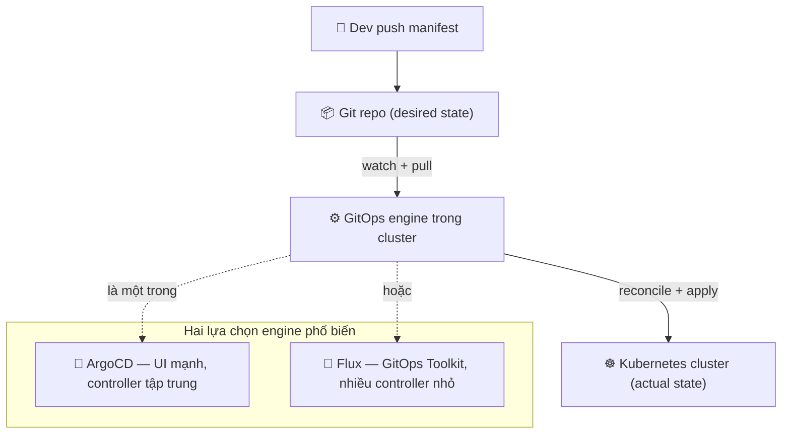
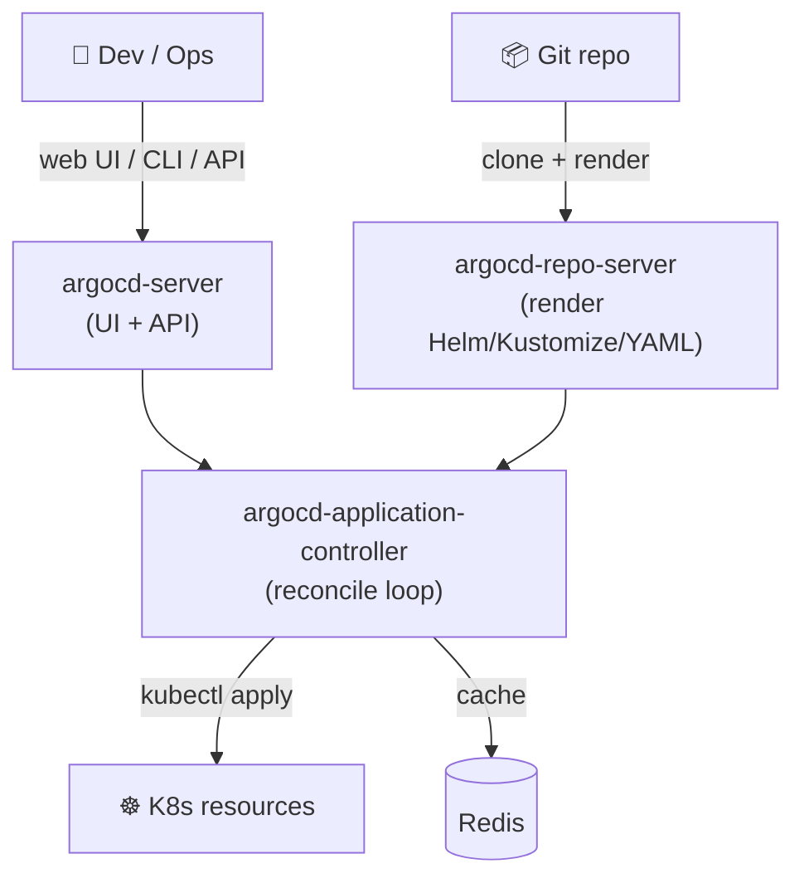
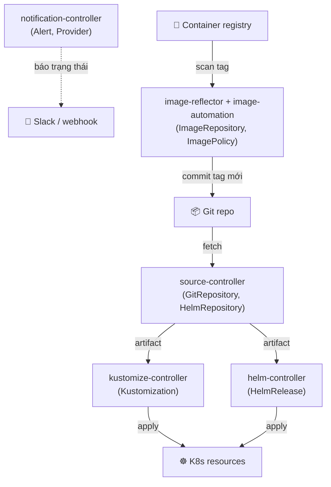

# ArgoCD vs Flux — Hai GitOps engine hàng đầu

> **Tác giả:** Mr.Rom\
> **Phiên bản:** v1.0.0\
> **Tạo lúc:** 13/06/2026\
> **Cập nhật:** 13/06/2026\
> **Level:** Basic\
> **Tags:** gitops, argocd, flux, kubernetes, cncf, continuous-delivery\
> **Yêu cầu trước:** [GitOps là gì](00_what-is-gitops.md)

> 🎯 *Bài trước bạn đã hiểu GitOps là gì — Git làm nguồn chân lý, một controller chạy trong cluster tự kéo state về. Nhưng "controller" đó cụ thể là phần mềm nào? Sau bài này bạn sẽ phân biệt được **ArgoCD** và **Flux** — hai GitOps engine phổ biến nhất, hiểu kiến trúc từng cái, và tự tin chọn đúng tool cho Acme Shop khi chuyển từ `kubectl apply` tay sang GitOps.*

## 🎯 Sau bài này bạn sẽ

- [ ] Hiểu vì sao GitOps cần một "engine" riêng, và đâu là 2 engine CNCF Graduated dẫn đầu
- [ ] Mô tả được kiến trúc của ArgoCD (controller tập trung + UI web) và Flux (GitOps Toolkit nhiều controller)
- [ ] Đọc hiểu CRD chính của mỗi tool: `Application` (ArgoCD) vs `GitRepository` + `Kustomization` + `HelmRelease` (Flux)
- [ ] So sánh 2 tool qua bảng trade-off (UI, multi-tenancy, Helm/Kustomize, image automation, notification, learning curve)
- [ ] Tự quyết định khi nào chọn ArgoCD, khi nào chọn Flux cho dự án của bạn

---

## Acme Shop đứng trước một lựa chọn

Acme Shop đang deploy app lên Kubernetes theo kiểu thủ công: dev build image, rồi vào terminal gõ `kubectl apply -f deployment.yaml`. Mỗi lần đổi config phải sửa file rồi apply tay. Cluster thực tế trôi dạt (drift) khỏi file YAML trong repo lúc nào không ai biết — ai đó `kubectl edit` sửa nóng lúc 3h sáng để chữa sự cố, rồi quên commit lại.

Bài trước đã cho bạn câu trả lời: chuyển sang **GitOps** — Git là nguồn chân lý, một controller chạy *bên trong* cluster, liên tục so sánh "trạng thái Git muốn" với "trạng thái cluster đang có", và tự đồng bộ. Không ai gõ `kubectl apply` tay nữa.

Nhưng tới đây sếp hỏi một câu rất thực tế:

> *"OK, mình hiểu GitOps rồi. Nhưng cái 'controller tự đồng bộ' đó là phần mềm gì? Mình tự viết à? Hay có sẵn?"*

Tin tốt: bạn **không cần** tự viết. Cộng đồng đã có sẵn những **GitOps engine** chín muồi, được hàng nghìn công ty dùng trong production. Trong đó, hai cái tên gần như luôn nằm trên bàn cân khi một team chọn tool: **ArgoCD** và **Flux**.

Cả hai đều là **CNCF Graduated** — cấp độ trưởng thành cao nhất trong Cloud Native Computing Foundation (CNCF), nghĩa là dự án đã đủ ổn định, đủ cộng đồng, đủ governance để các doanh nghiệp lớn tin dùng. Chọn cái nào không phải chuyện "cái nào tốt hơn" mà là "cái nào hợp với cách team mình làm việc". Bài này giúp bạn trả lời câu đó.

> [!NOTE]
> *CNCF Graduated* (tốt nghiệp CNCF) là tier cao nhất, trên *Incubating* (đang ấp) và *Sandbox* (thử nghiệm). Tính tới 2026, cả ArgoCD lẫn Flux đều đã Graduated — tức bạn không phải lo "tool này còn non, mai mốt chết dự án".

---

## 1️⃣ GitOps engine là gì, và vì sao có tới 2 cái phổ biến?

Trước khi đặt 2 tool lên bàn cân, cần thống nhất "engine" ở đây nghĩa là gì.

**Định nghĩa**: một *GitOps engine* (hay *GitOps controller / GitOps operator*) là phần mềm chạy bên trong Kubernetes cluster, có nhiệm vụ:

1. **Watch (theo dõi)** một hoặc nhiều Git repo chứa manifest YAML (desired state — trạng thái mong muốn).
2. **Reconcile (đối chiếu)** liên tục: so sánh state trong Git với state thật trong cluster.
3. **Sync (đồng bộ)**: nếu khác nhau, tự `apply` để kéo cluster về đúng như Git.

🪞 **Ẩn dụ đời thường**: GitOps engine giống một **người quản gia trung thành**. Bạn (đội dev) viết "danh sách việc nhà mong muốn" lên một tờ giấy dán tủ lạnh (Git repo): "luôn có 3 chậu cây tưới đủ nước, đèn phòng khách bật". Người quản gia (engine) cứ vài chục giây lại đi một vòng nhà, đối chiếu thực tế với tờ giấy. Cây héo → tưới lại. Ai đó tắt đèn → bật lên. Bạn không cần ra lệnh từng việc; chỉ cần sửa tờ giấy, quản gia tự làm phần còn lại.

Vì sao tồn tại tới 2 engine phổ biến thay vì 1 chuẩn duy nhất? Vì chúng sinh ra từ **hai triết lý thiết kế khác nhau**, phục vụ hai kiểu team khác nhau:

- **ArgoCD** ra đời tại **Intuit** (công ty làm TurboTax, QuickBooks), với tư duy "developer và ops cần **nhìn thấy** mọi thứ trên một màn hình". Nên ArgoCD đầu tư rất mạnh vào **UI web trực quan**.
- **Flux** ra đời tại **Weaveworks** (công ty đặt ra chính thuật ngữ "GitOps" năm 2017), sau đó được trao cho cộng đồng CNCF. Tư duy của Flux là "mọi thứ đều là **Kubernetes CRD**, ghép các controller nhỏ lại như xếp Lego, ưu tiên CLI và automation".

> 💡 Hiểu được "2 triết lý" rồi, ta xem chúng định vị ở đâu trong bức tranh GitOps qua sơ đồ bên dưới.



→ Sơ đồ cho thấy ArgoCD và Flux **thay thế cho nhau** ở đúng một vị trí: cái hộp "GitOps engine" giữa Git và cluster. Phần còn lại (Git làm nguồn chân lý, pull model) thì hai tool giống hệt nhau. Khác biệt nằm ở **cách cái hộp đó được xây bên trong** — và đó là phần ta mổ xẻ tiếp theo.

---

## 2️⃣ ArgoCD — engine "có màn hình", do Intuit khởi xướng

### ArgoCD là gì

**Định nghĩa**: ArgoCD (Argo Continuous Delivery) là một GitOps engine cho Kubernetes, nổi bật nhờ **UI web** trực quan dạng cây (tree view) hiển thị toàn bộ resource của app, trạng thái sync, và độ "khoẻ" (health) của từng thành phần.

🪞 **Ẩn dụ**: nếu engine là người quản gia, thì ArgoCD là **quản gia có một bảng điều khiển lớn treo tường** — đèn xanh đỏ cho từng phòng, bạn liếc một cái biết ngay phòng nào "đồng bộ" (Synced), phòng nào "lệch" (OutOfSync), phòng nào "ốm" (Degraded).

ArgoCD được thiết kế theo kiểu **control plane tập trung**: thường một bản ArgoCD quản nhiều app, thậm chí nhiều cluster, từ một chỗ.

### Kiến trúc ArgoCD

ArgoCD chạy như một nhóm component trong namespace `argocd`. Để hiểu vì sao nó "có UI mạnh", hãy xem các mảnh ghép chính và việc của từng mảnh:



→ Điểm cần nhớ: ArgoCD có hẳn một component riêng (`argocd-server`) chỉ để phục vụ **UI và API**. Đây chính là lý do ArgoCD "nặng" hơn Flux một chút, nhưng đổi lại cho bạn màn hình trực quan ngay từ hộp.

Các component chính:

- **argocd-server**: phục vụ web UI + API (CLI `argocd` và UI đều nói chuyện qua đây).
- **argocd-repo-server**: clone Git repo, render manifest cuối cùng (chạy Helm template, Kustomize build, hoặc đọc YAML thuần).
- **argocd-application-controller**: trái tim — vòng lặp reconcile, so desired vs actual, apply, báo trạng thái.
- **Redis**: cache manifest đã render + state cluster cho nhanh.
- **dex** (tuỳ chọn): cầu nối SSO (đăng nhập qua Google/GitHub/Okta).

### CRD trung tâm: `Application`

Với ArgoCD, đơn vị bạn khai báo là CRD tên `Application` — nó gói gọn "lấy manifest từ đâu" (source) và "đẩy vào cluster/namespace nào" (destination) trong **một file duy nhất**. Đây là điểm khác biệt lớn so với Flux (sẽ thấy ngay sau). Một `Application` tối thiểu trông như sau:

```yaml
# acme-shop-application.yaml
apiVersion: argoproj.io/v1alpha1
kind: Application
metadata:
  name: acme-shop-web
  namespace: argocd                # ArgoCD sống trong namespace này
spec:
  project: default
  source:
    repoURL: https://github.com/acme/gitops-config   # lấy manifest từ đâu
    targetRevision: main                             # nhánh / tag / commit
    path: apps/web/production                         # thư mục chứa YAML
  destination:
    server: https://kubernetes.default.svc           # cluster đích (in-cluster)
    namespace: production                            # namespace đích
  syncPolicy:
    automated:
      prune: true                  # xoá resource khi đã bị xoá khỏi Git
      selfHeal: true               # tự revert khi ai đó kubectl edit tay
```

→ Một file `Application` = một "đơn vị deploy". `source` nói lấy gì từ đâu, `destination` nói đẩy vào đâu, `syncPolicy` nói có tự động sync và self-heal không. Bạn `kubectl apply` file này một lần, ArgoCD lo phần còn lại mãi mãi.

### Những "đặc sản" của ArgoCD

ArgoCD có vài tính năng đặc trưng mà cộng đồng hay nhắc tới — bạn chỉ cần *biết tên và biết để làm gì* ở mức Basic, chi tiết hands-on nằm ở bài CI/CD intermediate:

- **App-of-apps**: một `Application` "cha" trỏ vào thư mục chứa nhiều file `Application` "con" → apply một lần là bung ra cả chùm app. Giống một thùng carton lớn bên trong xếp nhiều hộp nhỏ.
- **ApplicationSet generator**: sinh ra hàng loạt `Application` tự động từ một template + một "nguồn liệt kê" (danh sách env, danh sách cluster, danh sách thư mục trong Git...). Ví dụ: từ 1 template sinh ra `web-dev`, `web-staging`, `web-prod` — khỏi copy-paste 3 file.
- **SSO + RBAC**: đăng nhập qua nhà cung cấp danh tính chung (Google/GitHub/Okta) và phân quyền chi tiết qua `AppProject` — team A chỉ thấy và sync được app của team A. Rất hợp công ty nhiều team.

> Hiểu xong "engine có màn hình", ta xem engine "thuần CRD, ghép Lego" của phe Flux khác biệt ra sao.

---

## 3️⃣ Flux — engine "thuần CRD", GitOps Toolkit ghép linh hoạt

### Flux là gì

**Định nghĩa**: Flux (Flux CD, hiện ở thế hệ Flux v2) là một GitOps engine cho Kubernetes được xây dựng theo kiểu **GitOps Toolkit** — thay vì một controller "to đùng làm tất cả", Flux chia thành **nhiều controller nhỏ chuyên trách**, mỗi cái quản một loại CRD riêng. Bạn ghép chúng lại theo nhu cầu.

🪞 **Ẩn dụ**: nếu ArgoCD là một **máy đa năng all-in-one** (vừa in vừa scan vừa fax trong một thùng máy), thì Flux là **bộ đồ nghề rời** — một mỏ lết, một tua vít, một kìm, mỗi cái làm tốt một việc, và bạn chỉ mang theo những món cần dùng. Nhẹ, linh hoạt, nhưng phải biết món nào dùng khi nào.

Flux thiên về **CLI và CRD-native**: bạn ít khi nhìn UI, chủ yếu thao tác qua lệnh `flux ...` và qua việc viết các CRD vào Git.

### Kiến trúc Flux — GitOps Toolkit

Đây là khác biệt kiến trúc lớn nhất so với ArgoCD. Flux không có một controller trung tâm mà là một **tập hợp controller phối hợp**, mỗi cái lắng nghe một loại CRD:



→ Mỗi hộp là một controller độc lập, mỗi controller chỉ làm một việc và lắng nghe đúng một loại CRD. Bạn có thể cài đủ bộ, hoặc chỉ cài `source-controller` + `kustomize-controller` nếu chưa cần Helm hay image automation. Tính "ghép Lego" này là điểm mạnh nhất của Flux.

Các controller trong GitOps Toolkit:

| Controller | Việc của nó | CRD nó quản |
|---|---|---|
| **source-controller** | Fetch nguồn (Git repo, Helm repo, OCI artifact) về cluster | `GitRepository`, `HelmRepository`, `OCIRepository` |
| **kustomize-controller** | Build Kustomize + apply vào cluster | `Kustomization` |
| **helm-controller** | Cài/upgrade Helm release | `HelmRelease` |
| **notification-controller** | Gửi/nhận thông báo (Slack, webhook, alert) | `Alert`, `Provider`, `Receiver` |
| **image-reflector-controller** | Quét registry, đọc danh sách tag image | `ImageRepository`, `ImagePolicy` |
| **image-automation-controller** | Tự ghi tag image mới ngược lại vào Git | `ImageUpdateAutomation` |

### CRD trung tâm: tách `GitRepository` + `Kustomization`

Đây là điểm khác biệt **quan trọng nhất** giữa Flux và ArgoCD ở góc độ "viết YAML như nào". Trong ArgoCD, một `Application` gói cả "lấy từ đâu" lẫn "build/apply gì" vào một file. Trong Flux, hai việc đó được **tách thành hai CRD riêng**:

1. `GitRepository` — chỉ lo "lấy nguồn từ đâu" (do source-controller xử lý).
2. `Kustomization` — chỉ lo "build & apply phần nào của nguồn đó" (do kustomize-controller xử lý), và nó **tham chiếu** ngược về `GitRepository`.

Cụ thể, để deploy app web của Acme Shop, bạn viết hai CRD:

```yaml
# 1. GitRepository — khai báo NGUỒN: lấy manifest từ Git repo nào
apiVersion: source.toolkit.fluxcd.io/v1
kind: GitRepository
metadata:
  name: acme-gitops
  namespace: flux-system
spec:
  interval: 1m                     # cứ 1 phút fetch Git một lần
  url: https://github.com/acme/gitops-config
  ref:
    branch: main
```

```yaml
# 2. Kustomization — khai báo BUILD + APPLY: dùng nguồn trên, lấy thư mục nào
apiVersion: kustomize.toolkit.fluxcd.io/v1
kind: Kustomization
metadata:
  name: acme-shop-web
  namespace: flux-system
spec:
  interval: 5m                     # cứ 5 phút reconcile một lần
  sourceRef:
    kind: GitRepository
    name: acme-gitops              # ← trỏ về GitRepository ở trên
  path: ./apps/web/production       # thư mục chứa Kustomize trong repo
  prune: true                      # xoá resource đã bị xoá khỏi Git
  targetNamespace: production
```

→ Tách 2 CRD có lợi: nhiều `Kustomization` (nhiều app, nhiều env) có thể **dùng chung một `GitRepository`** — chỉ fetch Git một lần, nhiều người xài. Đổi lại, bạn phải viết nhiều file hơn so với một `Application` gọn của ArgoCD. Đây chính là cái "ghép Lego": linh hoạt nhưng nhiều mảnh hơn.

> [!NOTE]
> Tên *Kustomization* của Flux (CRD `kustomize.toolkit.fluxcd.io`) khác với file `kustomization.yaml` của công cụ Kustomize gốc. Trùng tên dễ nhầm: CRD Flux là "đơn vị reconcile của Flux", còn `kustomization.yaml` là file cấu hình của Kustomize. Flux thậm chí dùng được cả với YAML thuần (không cần Kustomize) — chỉ cần trỏ `path` vào thư mục có manifest.

### `HelmRelease` — cài Helm chart theo kiểu GitOps

Nếu app của Acme Shop đóng gói bằng Helm chart, Flux có CRD `HelmRelease` (do helm-controller xử lý) để khai báo "cài chart này, version này, với values này":

```yaml
apiVersion: helm.toolkit.fluxcd.io/v2
kind: HelmRelease
metadata:
  name: acme-shop-web
  namespace: production
spec:
  interval: 5m
  chart:
    spec:
      chart: web
      version: '1.2.3'
      sourceRef:
        kind: GitRepository
        name: acme-gitops
        namespace: flux-system
  values:
    replicaCount: 3
    image:
      tag: v1.2.3
```

→ Flux tự `helm upgrade --install` chart này và giữ nó luôn khớp với khai báo trong Git. Đổi `version` hay `values` trong Git → commit → Flux tự cài lại.

### Đặc sản của Flux: **image automation** (tự cập nhật tag)

Đây là tính năng Flux có sẵn mà ArgoCD core *không* có (ArgoCD cần dự án phụ Argo CD Image Updater). Ý tưởng: khi CI build xong một image mới (ví dụ `v1.2.4`), Flux **tự quét registry**, phát hiện tag mới, rồi **tự commit tag đó ngược vào Git** — khép kín vòng GitOps mà không cần CI gọi `git commit`.

Ba CRD phối hợp để làm điều này:

```yaml
# 1. ImageRepository — quét registry để biết có những tag nào
apiVersion: image.toolkit.fluxcd.io/v1
kind: ImageRepository
metadata:
  name: acme-web
  namespace: flux-system
spec:
  image: ghcr.io/acme/web
  interval: 2m
---
# 2. ImagePolicy — chọn tag nào là "mới nhất" theo quy tắc semver
apiVersion: image.toolkit.fluxcd.io/v1
kind: ImagePolicy
metadata:
  name: acme-web
  namespace: flux-system
spec:
  imageRepositoryRef:
    name: acme-web
  policy:
    semver:
      range: '>=1.2.0'           # chỉ chọn version từ 1.2.0 trở lên
---
# 3. ImageUpdateAutomation — commit tag mới ngược vào Git
apiVersion: image.toolkit.fluxcd.io/v1
kind: ImageUpdateAutomation
metadata:
  name: acme-web
  namespace: flux-system
spec:
  interval: 5m
  sourceRef:
    kind: GitRepository
    name: acme-gitops
  git:
    commit:
      author:
        name: fluxbot
        email: fluxbot@acmeshop.vn
      messageTemplate: 'chore: cập nhật image {{range .Updated.Images}}{{println .}}{{end}}'
    push:
      branch: main
  update:
    path: ./apps/web/production
    strategy: Setters
```

→ Khi có image `v1.2.4` thoả policy, Flux tự sửa file YAML trong repo và push commit `chore: cập nhật image...`. Git vẫn là nguồn chân lý (có lịch sử commit đầy đủ), nhưng *Flux tự viết commit thay con người*. Với team thích CI tối giản, đây là tính năng "ăn tiền" của Flux.

---

## 4️⃣ Đặt lên bàn cân — bảng so sánh ArgoCD vs Flux

Đã hiểu kiến trúc và CRD của từng tool, giờ là lúc đặt chúng cạnh nhau. Bảng dưới gom các tiêu chí mà một team thực sự cân nhắc khi chọn — không phải "cái nào xịn hơn" mà là "cái nào khác nhau ở chỗ nào":

| Tiêu chí | **ArgoCD** | **Flux** |
|---|---|---|
| Khởi nguồn | Intuit → CNCF Graduated | Weaveworks → CNCF Graduated |
| Kiến trúc | Controller tập trung (vài component) | GitOps Toolkit — nhiều controller nhỏ |
| UI web | ✅ Mạnh, tree view, có sẵn | ⚠️ Tối giản (chủ yếu CLI); UI ngoài qua Weave GitOps |
| CRD chính | `Application` (gói source + destination) | `GitRepository` + `Kustomization` / `HelmRelease` (tách rời) |
| Helm support | ✅ Render Helm trong Application | ✅ CRD `HelmRelease` chuyên dụng |
| Kustomize support | ✅ Render Kustomize trong Application | ✅ CRD `Kustomization` chuyên dụng |
| Image automation (tự cập nhật tag) | ⚠️ Cần dự án phụ Argo CD Image Updater | ✅ Có sẵn (image-reflector + image-automation) |
| Notification | argocd-notifications (cấu hình qua ConfigMap) | notification-controller (CRD `Alert`/`Provider`) |
| Multi-tenancy | `AppProject` + RBAC + SSO chi tiết | Tách namespace + RBAC K8s gốc + tenant |
| Multi-cluster | Hub tập trung — 1 ArgoCD quản nhiều cluster | Thường mỗi cluster cài 1 Flux (tự chủ) |
| Sinh app hàng loạt | ApplicationSet (nhiều generator mạnh) | Ghép Kustomization + dependsOn |
| Learning curve | Trung bình — vào UI thấy ngay | Dốc hơn lúc đầu — phải nhớ nhiều CRD |

> ⚠️ Bảng này so sánh **bản chất thiết kế**, không phải "điểm số". Cả hai đều production-grade. Một dòng đáng chú ý: *image automation* — đây là khác biệt thực tế lớn, vì nó quyết định CI của bạn có cần tự `git commit` tag image hay không.

Để dễ nhớ ai mạnh ở đâu, có thể tóm bằng một câu: **ArgoCD = "nhìn", Flux = "ghép"**. ArgoCD cho bạn một màn hình để *nhìn* toàn cảnh; Flux cho bạn các mảnh CRD để *ghép* đúng thứ cần và tự động hoá sâu.

### Cùng một app, hai cách khai báo

Cách nhanh nhất để *cảm* được khác biệt là nhìn cùng một mục tiêu — "deploy app web của Acme Shop từ thư mục `apps/web/production` trong repo, vào namespace `production`, tự đồng bộ" — viết bằng hai tool. Với ArgoCD, tất cả nằm trong **một** `Application`:

```yaml
# ArgoCD — 1 file gói cả nguồn lẫn đích
apiVersion: argoproj.io/v1alpha1
kind: Application
metadata:
  name: acme-shop-web
  namespace: argocd
spec:
  project: default
  source:
    repoURL: https://github.com/acme/gitops-config
    targetRevision: main
    path: apps/web/production
  destination:
    server: https://kubernetes.default.svc
    namespace: production
  syncPolicy:
    automated:
      prune: true
      selfHeal: true
```

Cùng mục tiêu đó với Flux cần **hai** CRD — một cho nguồn, một cho việc apply:

```yaml
# Flux — tách nguồn (GitRepository) khỏi việc apply (Kustomization)
apiVersion: source.toolkit.fluxcd.io/v1
kind: GitRepository
metadata:
  name: acme-gitops
  namespace: flux-system
spec:
  interval: 1m
  url: https://github.com/acme/gitops-config
  ref:
    branch: main
---
apiVersion: kustomize.toolkit.fluxcd.io/v1
kind: Kustomization
metadata:
  name: acme-shop-web
  namespace: flux-system
spec:
  interval: 5m
  sourceRef:
    kind: GitRepository
    name: acme-gitops
  path: ./apps/web/production
  prune: true
  targetNamespace: production
```

→ Cùng kết quả deploy, nhưng ArgoCD gọn hơn cho 1 app (1 file), còn Flux nhỉnh hơn về tái sử dụng khi có nhiều app (10 `Kustomization` xài chung 1 `GitRepository`). Đây là minh hoạt cụ thể nhất cho triết lý "gói gọn" vs "ghép Lego".

> [!NOTE]
> Cả hai khái niệm `interval` (Flux) và reconcile loop (ArgoCD) đều phục vụ cùng một việc: engine **không** chỉ đồng bộ một lần lúc commit, mà *lặp lại liên tục* để phát hiện drift. Đây là khác biệt cốt lõi giữa GitOps (pull, reconcile mãi mãi) và CI push truyền thống (apply một lần rồi thôi). Bài 04 trong cụm sẽ mổ xẻ kỹ cơ chế reconcile này.

---

## 5️⃣ Vậy Acme Shop nên chọn cái nào?

Không có đáp án "đúng tuyệt đối" — chỉ có đáp án "hợp với team". Dưới đây là hai nhóm tín hiệu giúp bạn nghiêng về một bên.

### Nghiêng về ArgoCD khi…

- Team có **nhiều người không chuyên CLI** (dev, QA, PM) cần *nhìn thấy* trạng thái deploy → UI web là điểm cộng lớn.
- Bạn quản **nhiều team** trong một tổ chức và cần phân quyền chi tiết qua `AppProject` + SSO.
- Bạn muốn quản **nhiều cluster từ một nơi** (mô hình hub tập trung).
- Bạn cần sinh app hàng loạt theo ma trận (nhiều env × nhiều cluster) → ApplicationSet rất hợp.
- Bạn muốn "mở ra là chạy, nhìn là hiểu" — learning curve thấp hơn cho người mới.

### Nghiêng về Flux khi…

- Team **thích CLI và CRD-native**, ngại UI thừa, muốn mọi thứ là YAML trong Git.
- Bạn muốn footprint **nhẹ**, chỉ cài đúng controller cần dùng (Lego — không cần Helm thì không cài helm-controller).
- Bạn cần **image automation** có sẵn: CI build image xong, Flux tự cập nhật tag vào Git, khỏi viết bước commit trong CI.
- Mỗi cluster nên **tự chủ** (autonomy) — Flux chạy độc lập trong từng cluster, không phụ thuộc một hub trung tâm.
- Bạn thích triết lý "ghép các controller chuyên trách" để kiểm soát từng mảnh.

> [!TIP]
> Nếu vẫn phân vân, một heuristic thực dụng cho năm 2026: **team đông và nhiều vai trò không chuyên kỹ thuật → ArgoCD** (vì UI); **team platform/SRE gọn, thích tự động hoá sâu và CLI → Flux**. Cả hai đều "không sai" — di chuyển giữa chúng cũng không quá khó vì cả hai đều đọc declarative state từ Git.

### Tin tốt cuối cùng: chọn sai cũng không "khoá cứng"

Vì cả ArgoCD lẫn Flux đều tôn trọng nguyên tắc cốt lõi của GitOps — **declarative state nằm trong Git** — nên Git repo manifest của bạn về cơ bản *không phụ thuộc tool*. Manifest Kubernetes (Deployment, Service, ConfigMap...) là chuẩn chung. Đổi tool nghĩa là gỡ engine cũ, cài engine mới, viết lại các CRD "vỏ" (`Application` ↔ `GitRepository`+`Kustomization`), chứ **không phải viết lại toàn bộ manifest app**. Đây là một lý do nữa để bắt đầu GitOps mà không sợ "lỡ chọn nhầm".

---

## 💡 Cạm bẫy thường gặp & Best practice

### ❌ Cạm bẫy: nghĩ "phải chọn tool tốt nhất" rồi tê liệt không quyết

- **Triệu chứng**: team tranh cãi hàng tuần "ArgoCD hay Flux xịn hơn", không ai dám chốt, dự án GitOps không khởi động.
- **Nguyên nhân**: hiểu nhầm rằng có một "người thắng" khách quan. Thực ra cả hai đều CNCF Graduated, đều production-grade.
- **Cách tránh**: chọn theo *cách team làm việc* (cần UI hay thích CLI), làm thử 1 app pilot trong 1 cluster, rồi mở rộng. Quyết định nhanh quan trọng hơn quyết định "hoàn hảo".

### ❌ Cạm bẫy: nhầm CRD `Kustomization` của Flux với file `kustomization.yaml`

- **Triệu chứng**: viết CRD Flux `Kustomization` mà tưởng nó là file config của Kustomize, rồi bối rối khi `spec` không khớp.
- **Nguyên nhân**: trùng tên hoàn toàn nhưng là hai thứ khác nhau.
- **Cách tránh**: nhớ — CRD `kustomize.toolkit.fluxcd.io/Kustomization` là "đơn vị reconcile của Flux" (có `sourceRef`, `interval`, `prune`); còn `kustomization.yaml` là file của công cụ Kustomize (có `resources`, `patches`). Một cái là CRD, một cái là file thường.

### ❌ Cạm bẫy: tưởng ArgoCD core tự cập nhật được image tag

- **Triệu chứng**: kỳ vọng cài ArgoCD xong là image tự cập nhật như Flux, rồi thắc mắc "sao không thấy tag mới".
- **Nguyên nhân**: ArgoCD core *không* có image automation; tính năng đó nằm ở dự án phụ **Argo CD Image Updater** (phải cài thêm).
- **Cách tránh**: nếu cần auto-update tag mà chọn ArgoCD → cài thêm Image Updater, hoặc cho CI tự commit tag vào Git. Nếu image automation là yêu cầu cốt lõi, Flux có sẵn là một điểm cộng đáng cân nhắc.

### ✅ Best practice: tách repo app-code và repo gitops-config

- **Vì sao**: dù chọn tool nào, trộn code ứng dụng với manifest deploy vào một repo gây rối quyền hạn và lịch sử commit lẫn lộn.
- **Cách áp dụng**: một repo cho source code app (Python/Go...), một repo riêng `gitops-config` chứa manifest + CRD của ArgoCD/Flux. Engine chỉ watch repo `gitops-config`. (Bài tiếp theo về cấu trúc repo sẽ đào sâu phần này.)

### ✅ Best practice: bật `prune` + `selfHeal` (hoặc tương đương) cho đúng kỷ luật GitOps

- **Vì sao**: GitOps chỉ "thật" khi cluster luôn khớp Git. Nếu tắt prune/self-heal, drift quay lại y như thời `kubectl apply` tay.
- **Cách áp dụng**: ArgoCD đặt `syncPolicy.automated.prune: true` + `selfHeal: true`; Flux đặt `prune: true` trong `Kustomization`. Với resource nhạy cảm (volume dữ liệu) thì cân nhắc tắt prune riêng cho resource đó.

---

## 🧠 Tự kiểm tra (Self-check)

**Q1.** Vì sao GitOps cần một "engine" riêng thay vì để CI tự `kubectl apply`?

<details>
<summary>💡 Xem giải thích</summary>

Để cluster luôn khớp Git một cách *liên tục và tự sửa*, cần một thành phần chạy *bên trong* cluster, reconcile theo vòng lặp. CI chỉ chạy lúc có commit (push model) — nó không phát hiện và sửa drift khi ai đó `kubectl edit` tay giữa các lần deploy. GitOps engine (ArgoCD/Flux) chạy thường trực, watch Git, so sánh desired vs actual, và tự apply lại — đây là điểm cốt lõi của pull model.

</details>

**Q2.** Khác biệt kiến trúc lớn nhất giữa ArgoCD và Flux là gì?

<details>
<summary>💡 Xem giải thích</summary>

ArgoCD theo kiểu **controller tập trung** + UI web có sẵn (có hẳn `argocd-server` phục vụ giao diện). Flux theo kiểu **GitOps Toolkit** — nhiều controller nhỏ chuyên trách (source / kustomize / helm / notification / image), ghép linh hoạt như Lego, thiên về CLI và CRD-native. Hệ quả: ArgoCD "nhìn là hiểu" nhờ UI; Flux nhẹ và tự động hoá sâu hơn nhưng phải nhớ nhiều CRD.

</details>

**Q3.** Trong Flux, vì sao `GitRepository` và `Kustomization` lại tách thành 2 CRD? Lợi ích là gì?

<details>
<summary>💡 Xem giải thích</summary>

`GitRepository` lo "lấy nguồn từ đâu" (source-controller fetch Git), `Kustomization` lo "build & apply phần nào của nguồn đó" (kustomize-controller). Tách ra để **nhiều `Kustomization` dùng chung một `GitRepository`** — Git chỉ được fetch một lần, nhiều app/env cùng xài, tiết kiệm và rõ ràng trách nhiệm. Đổi lại phải viết nhiều file hơn so với một `Application` gói gọn của ArgoCD. So sánh: ArgoCD gói cả source + destination vào một `Application`.

</details>

**Q4.** Tính năng "image automation" của Flux làm gì, và ArgoCD có sẵn không?

<details>
<summary>💡 Xem giải thích</summary>

Image automation cho phép Flux **tự quét registry** (image-reflector qua `ImageRepository` + `ImagePolicy`), phát hiện tag image mới thoả quy tắc semver, rồi **tự commit tag đó ngược vào Git** (image-automation qua `ImageUpdateAutomation`). Vòng GitOps khép kín mà CI không cần tự `git commit`. ArgoCD core **không** có sẵn tính năng này — cần cài dự án phụ **Argo CD Image Updater** hoặc để CI tự commit tag.

</details>

**Q5.** Acme Shop có team 15 người gồm dev, QA, PM, và cần nhiều người nhìn thấy trạng thái deploy trên một màn hình. Nên nghiêng về tool nào và vì sao?

<details>
<summary>💡 Xem giải thích</summary>

Nghiêng về **ArgoCD**. Lý do: team đông, nhiều vai trò không chuyên CLI (QA, PM) cần *nhìn thấy* trạng thái sync/health trực quan → UI web mạnh của ArgoCD là điểm cộng lớn. Thêm nữa, nhiều team/vai trò → cần phân quyền chi tiết qua `AppProject` + SSO, vốn là thế mạnh của ArgoCD. (Nếu team nhỏ, toàn SRE thích CLI và muốn image automation có sẵn thì câu trả lời sẽ là Flux.)

</details>

---

## ⚡ Tra cứu nhanh (Cheatsheet)

| Mục đích | ArgoCD | Flux |
|---|---|---|
| Khởi nguồn | Intuit, CNCF Graduated | Weaveworks, CNCF Graduated |
| CRD "lấy nguồn" | (gộp trong `Application`) | `GitRepository` |
| CRD "apply manifest" | `Application` | `Kustomization` |
| CRD "cài Helm" | (Helm trong `Application`) | `HelmRelease` |
| Sinh app hàng loạt | `ApplicationSet` | ghép `Kustomization` + `dependsOn` |
| Phân quyền/tenant | `AppProject` + RBAC + SSO | namespace + RBAC K8s + tenant |
| Image tự cập nhật | Argo CD Image Updater (phụ) | `ImageRepository` + `ImagePolicy` + `ImageUpdateAutomation` |
| UI | có sẵn, mạnh | tối giản / Weave GitOps |

```bash
# === ArgoCD: vài lệnh CLI hay dùng ===
argocd app list                     # liệt kê Application
argocd app get acme-shop-web        # xem trạng thái 1 app
argocd app sync acme-shop-web       # sync thủ công
argocd app diff acme-shop-web       # xem drift giữa Git và cluster

# === Flux: vài lệnh CLI hay dùng ===
flux get sources git                # liệt kê GitRepository
flux get kustomizations             # liệt kê Kustomization
flux reconcile kustomization acme-shop-web   # reconcile thủ công
flux get helmreleases               # liệt kê HelmRelease
```

```yaml
# === apiVersion của các CRD Flux (để tra nhanh khi viết YAML) ===
# GitRepository / HelmRepository / OCIRepository:
#   source.toolkit.fluxcd.io/v1
# Kustomization:
#   kustomize.toolkit.fluxcd.io/v1
# HelmRelease:
#   helm.toolkit.fluxcd.io/v2
# ImageRepository / ImagePolicy / ImageUpdateAutomation:
#   image.toolkit.fluxcd.io/v1
# === ArgoCD ===
# Application / ApplicationSet / AppProject:
#   argoproj.io/v1alpha1
```

---

## 📚 Từ Điển Thuật Ngữ (Glossary)

| EN | VN | Giải thích |
|---|---|---|
| GitOps engine | Bộ máy GitOps | Phần mềm chạy trong cluster, watch Git và tự đồng bộ cluster về đúng Git |
| Controller | Bộ điều khiển | Tiến trình chạy vòng lặp reconcile, đối chiếu desired vs actual state |
| CNCF Graduated | Tốt nghiệp CNCF | Tier trưởng thành cao nhất của dự án trong CNCF, đủ tin dùng production |
| CRD | Custom Resource Definition | "Kiểu resource" tự định nghĩa, mở rộng API Kubernetes ngoài Pod/Service mặc định |
| Application (ArgoCD) | (giữ nguyên) | CRD chính của ArgoCD, gói source (lấy gì từ đâu) + destination (đẩy vào đâu) |
| ApplicationSet | (giữ nguyên) | CRD ArgoCD sinh hàng loạt Application từ template + generator |
| App-of-apps | App-của-các-app | Pattern: 1 Application cha trỏ vào thư mục chứa nhiều Application con |
| GitOps Toolkit | Bộ công cụ GitOps | Kiến trúc Flux gồm nhiều controller nhỏ chuyên trách, ghép linh hoạt |
| GitRepository (Flux) | (giữ nguyên) | CRD Flux khai báo nguồn Git để fetch (do source-controller xử lý) |
| Kustomization (Flux) | (giữ nguyên) | CRD Flux build + apply manifest, khác file `kustomization.yaml` của Kustomize |
| HelmRelease | (giữ nguyên) | CRD Flux khai báo cài/upgrade một Helm chart |
| Image automation | Tự động hoá image | Flux tự quét registry, phát hiện tag mới và commit ngược vào Git |
| Reconcile | Đối chiếu/hoà giải | Vòng lặp so sánh trạng thái Git mong muốn với trạng thái thật rồi sửa cho khớp |
| Prune | Dọn rác | Tự xoá resource khỏi cluster khi nó đã bị xoá khỏi Git |
| Self-heal | Tự chữa lành | Tự revert thay đổi thủ công (kubectl edit) về đúng state trong Git |
| Multi-tenancy | Đa thuê bao | Nhiều team dùng chung hạ tầng nhưng cô lập quyền hạn lẫn nhau |
| SSO | Đăng nhập một lần | Đăng nhập qua một nhà cung cấp danh tính chung (Google/GitHub/Okta) |

---

## 🔗 Liên kết & Tài nguyên

### 🧭 Định hướng lộ trình học

- ⬅️ **Bài trước:** [GitOps là gì? — Git làm nguồn chân lý cho vận hành](00_what-is-gitops.md)
- ➡️ **Bài tiếp theo:** [Cấu trúc Repo GitOps — Tách config, env promotion, app-of-apps](02_repository-structure-and-patterns.md)
- ↑ **Về cụm:** [GitOps — Declarative Continuous Delivery](../../README.md)

### 🧩 Các chủ đề có thể bạn quan tâm

- [Secrets trong GitOps — Sealed Secrets, SOPS, External Secrets](03_secrets-in-gitops.md) — quản lý mật khẩu an toàn khi mọi thứ nằm trong Git
- [Sync, Drift & Reconciliation — Trái tim của GitOps](04_sync-drift-and-reconciliation.md) — cơ chế reconcile đào sâu
- [GitOps với ArgoCD — Git = Single Source of Truth](../../../ci-cd/lessons/02_intermediate/01_gitops-with-argocd.md) — hands-on ArgoCD chuyên sâu (Application, ApplicationSet, multi-cluster)
- [Kubernetes ConfigMaps & Secrets](../../../kubernetes/lessons/01_basic/03_configmaps-and-secrets.md) — nền tảng cấu hình trước khi đưa lên GitOps

### 🌐 Tài nguyên tham khảo khác

- [OpenGitOps (CNCF)](https://opengitops.dev/) — 4 nguyên tắc GitOps chuẩn của CNCF Working Group
- [Tài liệu chính thức ArgoCD](https://argo-cd.readthedocs.io/) — kiến trúc, Application, ApplicationSet, RBAC
- [Tài liệu chính thức Flux](https://fluxcd.io/flux/) — GitOps Toolkit, các controller và CRD
- [Flux Components & Controllers](https://fluxcd.io/flux/components/) — chi tiết từng controller và CRD apiVersion
- [Argo CD Image Updater](https://argocd-image-updater.readthedocs.io/) — dự án phụ thêm image automation cho ArgoCD
- [CNCF Landscape — Continuous Delivery](https://landscape.cncf.io/) — bức tranh toàn cảnh các tool CD/GitOps

---

## 📌 Nhật ký thay đổi (Changelog)

- **v1.0.0 (13/06/2026)** — Bản đầu tiên. Landscape 2 GitOps engine CNCF Graduated: ArgoCD (Intuit; UI mạnh; CRD `Application`; app-of-apps; ApplicationSet; SSO/RBAC) vs Flux (Weaveworks→CNCF; GitOps Toolkit gồm source/kustomize/helm/notification/image controller; CRD `GitRepository` + `Kustomization` + `HelmRelease`; image automation). Kiến trúc từng tool + 2 sơ đồ mermaid + bảng so sánh trade-off + hướng dẫn khi nào chọn cái nào. Tập trung landscape + Flux + so sánh, tránh lặp hands-on ArgoCD (đã có ở bài CI/CD intermediate).
